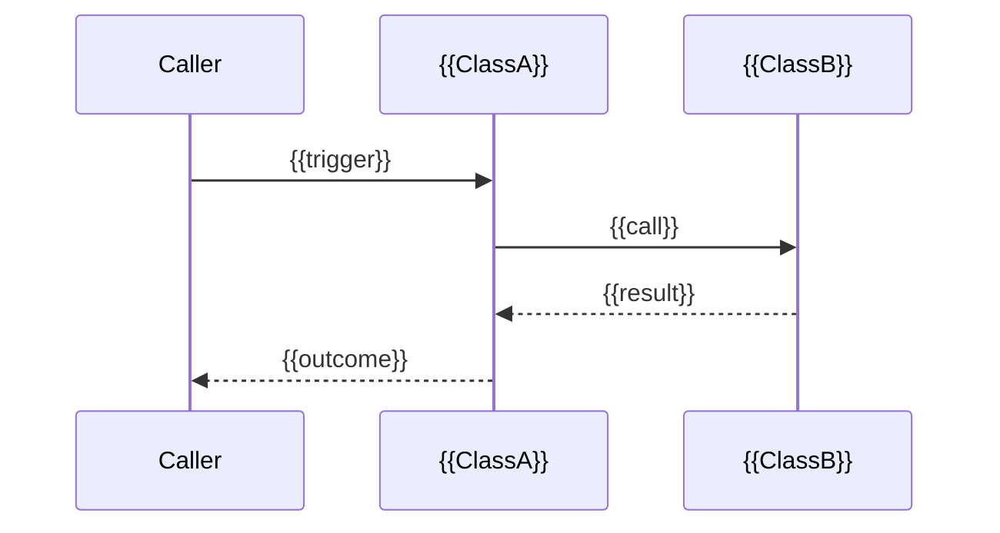
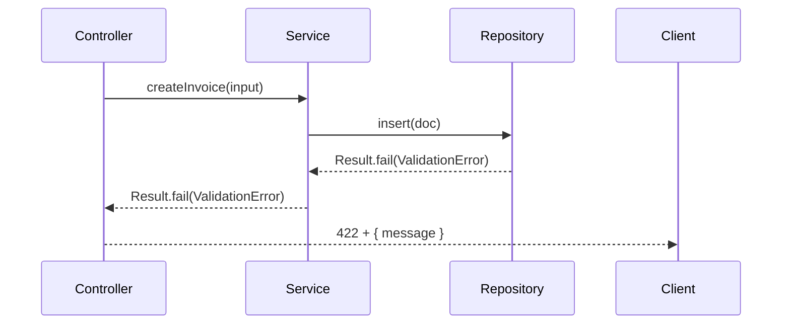

<!--
  Template: the architecture-mechanism reference document.
  This is the ONLY template this skill ships; the output is always one file.

  Replace every {{PLACEHOLDER}} and delete this comment block before shipping.
  Choose one mechanism organization mode:
    - 2-3 tightly-related mechanisms -> use the "Combined Mechanisms section" block,
      delete the per-mechanism blocks.
    - 4+ mechanisms (or any non-tightly-related set) -> use the per-mechanism blocks,
      delete the combined block.
  The illustrative example block at the very bottom is for tone and depth; delete
  it before shipping so practitioners only see the real architecture.
-->

# {{ArchitectureName}} Architecture Reference

## Table of Contents

- [Overview](#overview)
- [Architecture Layers](#architecture-layers)
- [Mechanisms](#mechanisms)
  - [Mechanism: {{Mechanism1Name}}](#mechanism-{{mechanism1-slug}})
  - [Mechanism: {{Mechanism2Name}}](#mechanism-{{mechanism2-slug}})
  - [Mechanism: {{Mechanism3Name}}](#mechanism-{{mechanism3-slug}})
- [Testing Architecture](#testing-architecture)
- [References](#references)

---

## Overview

{{ArchitectureName}} is a {{one-sentence positioning, e.g. "domain-first web stack", "hexagonal Python service", "event-driven worker"}} that prioritizes:

1. **{{Principle1}}** — {{one-line gloss}}
2. **{{Principle2}}** — {{one-line gloss}}
3. **{{Principle3}}** — {{one-line gloss}}
4. **{{Principle4}}** — {{one-line gloss}}

This reference covers the following mechanisms: **{{Mechanism1Name}}**, **{{Mechanism2Name}}**, **{{Mechanism3Name}}**.

> Sources: [cite the architecture's source of truth — ADR, wiki, decision doc, or sibling-skill output]; mechanisms from [cite source].

---

## Architecture Layers

<!-- Paste / summarize the layer block from the architecture's agreed source of truth (ADR, wiki, decision doc, or sibling skill). -->

```
{{LAYER_DIAGRAM_OR_TABLE}}
```

| Layer | Tech | Location | Responsibility |
|-------|------|----------|----------------|
| **{{Layer1}}** | {{Tech}} | `{{path}}` | {{role}} |
| **{{Layer2}}** | {{Tech}} | `{{path}}` | {{role}} |
| **{{Layer3}}** | {{Tech}} | `{{path}}` | {{role}} |
| **{{Layer4}}** | {{Tech}} | `{{path}}` | {{role}} |

---

## Mechanisms

### Mechanism: {{Mechanism1Name}}

#### Principles & Patterns

- **Principle:** {{one-liner stance the architecture takes — technology-agnostic, fits in a sentence, e.g. "Domain First", "Event-Based Orchestration for Cross-Domain Service Calls", "MVVM in the presentation layer"}}.
- **Pattern:** {{named shape that satisfies the principle, e.g. "Result<T, DomainException>", "Side-car Cache", "Repository + Specification"}}
  - **Options:** {{any meaningful variants the team considered}}.
  - **Benefits:** {{why this pattern serves the principle in this context}}.
  - **Trade-offs:** {{what the team gives up; why it's acceptable here}}.

#### File Structure

```
{{folder tree where this mechanism's code lives}}
```

#### Participants

```mermaid
classDiagram
    class {{ClassA}} {
        +{{method}}()
    }
    class {{ClassB}} {
        +{{method}}()
    }
    {{ClassA}} --> {{ClassB}}
```

| Class / Module | Layer | Responsibility | Collaborators |
|---|---|---|---|
| **{{ClassA}}** | {{Layer}} | {{role}} | {{ClassB}} |
| **{{ClassB}}** | {{Layer}} | {{role}} | {{ClassA}} |

#### Flow



#### Walkthrough Example

Scenario: {{one concrete representative scenario, e.g. "Repository fails to parse a Mongo document"}}.

1. {{Step 1, names the participant}}.
2. {{Step 2, names the participant}}.
3. {{Step 3, names the participant}}.
4. {{Step 4, the observable outcome}}.

```typescript
// Code follows the project's coding standard (e.g. abd-clean-code
// when it is in scope): domain language, small functions,
// constructor-injected dependencies, no anemic data bags.
{{code sample for this mechanism}}
```

```typescript
// Test follows the project's testing standard (e.g.
// abd-acceptance-test-driven-development when it is in scope):
// Given/When/Then helpers, story-driven names.
{{test sample for this mechanism}}
```

#### Testing the mechanism

- **Tier:** {{server | client | e2e | unit}}
- **Helper:** {{which Given/When/Then helper class verifies this}}
- **Scenario coverage:** {{which failure / success paths must be covered}}

---

### Mechanism: {{Mechanism2Name}}

<!-- Repeat the same five-part shape for every mechanism. -->

#### Principles & Patterns

- **Principle:** {{one-liner stance}}.
- **Pattern:** {{named shape}}
  - **Options:** {{variants considered}}.
  - **Benefits:** {{why this pattern}}.
  - **Trade-offs:** {{what the team gives up}}.

#### File Structure

```
{{folder tree}}
```

#### Participants

```mermaid
classDiagram
    {{...}}
```

#### Flow

```mermaid
sequenceDiagram
    {{...}}
```

#### Walkthrough Example

1. {{...}}.
2. {{...}}.

```typescript
{{code}}
```

```typescript
{{test}}
```

#### Testing the mechanism

- **Tier:** {{...}}
- **Helper:** {{...}}

---

### Mechanism: {{Mechanism3Name}}

<!-- Same shape. -->

---

## Testing Architecture

A short, mechanism-agnostic note on the test pyramid for this architecture:

| Tier | Tool | Emphasis | Location |
|------|------|----------|----------|
| **{{Tier1}}** | {{tool}} | {{what it verifies}} | `{{path}}` |
| **{{Tier2}}** | {{tool}} | {{what it verifies}} | `{{path}}` |
| **{{Tier3}}** | {{tool}} | {{what it verifies}} | `{{path}}` |

Tests follow the project's testing standard — story-driven, Given/When/Then helpers, no defensive checks, test data shared across tiers via a base helper. When the project has **abd-acceptance-test-driven-development** in scope, that *is* the standard; cite it here.

---

## References

- **Layered description:** [cite the source — ADR, wiki, decision doc, or sibling-skill output such as **abd-architecture-description** when present] for {{ArchitectureName}}.
- **Mechanism list:** [cite the source — ADR, wiki, decision doc, or sibling-skill output such as **abd-architecture-mechanisms** when present] for {{ArchitectureName}}.
- **Code conventions:** the project's chosen coding standard for production code and testing standard for test code. State the names of both standards here — e.g. **abd-clean-code** and **abd-acceptance-test-driven-development** when those are in scope, or the project-specific guides otherwise.
- **Worked example of this template:** the illustrative filled block at the bottom of this template file.

---

## Example (filled, illustrative — delete before shipping)

> **For authors only.** This filled fragment shows the **tone and depth** the reviewer expects. Replace the real `{{PLACEHOLDERS}}` above, then delete this entire example block.

### Mechanism: Error Handling (illustrative)

#### Principles & Patterns

- **Principle:** Errors surface at the boundary — the domain layer never throws raw `Error`; only named `DomainException` subclasses cross into the application layer.
- **Pattern:** `Result<T, DomainException>` returned from every application service method; the controller maps `DomainException` to HTTP status (`UnauthorizedError → 401`, `ValidationError → 422`, default `500`).
  - **Options:** throw-and-catch (discarded — cross-cutting catch blocks create invisible control flow); union type instead of class hierarchy (acceptable variant for typed languages with exhaustive checking).
  - **Benefits:** explicit error paths; no silent swallowing; the caller is forced to handle failure before accessing the value.
  - **Trade-offs:** every call site must unwrap the Result — adds boilerplate; acceptable because the discipline is the point.

#### File Structure

```
packages/<domain>/
├── shared/
│   ├── DomainException.ts           # Base + named subclasses
│   └── Result.ts                    # Result<T, E> helper
├── server/
│   └── error-mapper.ts              # DomainException -> HTTP status
└── client/
    └── error-banner.tsx             # Render the user-facing message
```

#### Participants

| Class / Module | Layer | Responsibility | Collaborators |
|---|---|---|---|
| **DomainException** | Domain | Named base for all business errors | Result |
| **Result\<T, E\>** | Domain | Carries success value or domain error | DomainException |
| **errorMapper** | Interface Adapters | Map DomainException → HTTP status | Express |
| **ErrorBanner** | Presentation | Display message returned by API | React |

#### Flow



#### Walkthrough Example

1. **Controller** validates the request body and calls `service.createInvoice(input)`.
2. **Service** calls `repository.insert(doc)`; the repository returns `Result.fail(new ValidationError(...))`.
3. **Service** propagates the `Result` without unwrapping.
4. **errorMapper** receives the `DomainException`, returns `{ status: 422, body: { message } }`.
5. The client's **ErrorBanner** renders `message` verbatim.

```typescript
// Coding standard in scope here: abd-clean-code — domain language, small
// functions, constructor-injected dependencies, no anemic data bags.
export class InvoiceService {
  constructor(private readonly repo: InvoiceRepository) {}

  async createInvoice(input: NewInvoice): Promise<Result<Invoice, DomainException>> {
    return this.repo.insert(input);
  }
}
```

```typescript
// Testing standard in scope here: abd-acceptance-test-driven-development —
// class per story, Given/When/Then helpers, story-driven names.
class TestInvoiceCreationFailures {
  helper = new InvoiceServerHelper();

  async test_invalid_invoice_returns_422_with_validation_message() {
    await this.helper.givenUserLoggedIn();
    await this.helper.whenUserSubmitsInvoiceWithMissingAmount();
    await this.helper.thenResponseIs422WithMessage('amount is required');
  }
}
```

#### Testing the mechanism

- **Tier:** Server.
- **Helper:** `InvoiceServerHelper` exposes `thenResponseIs422WithMessage(msg)`.
- **Scenario coverage:** every controller route has at least one failure scenario.
