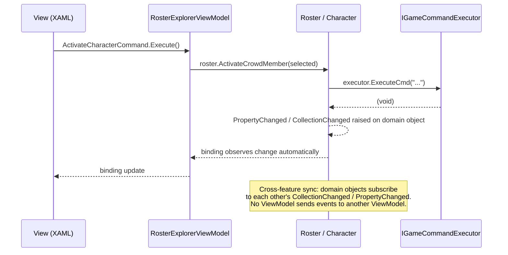
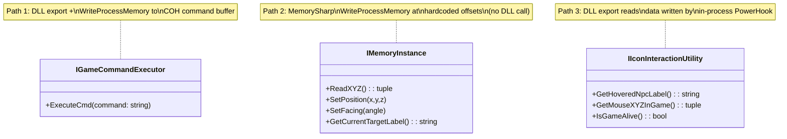
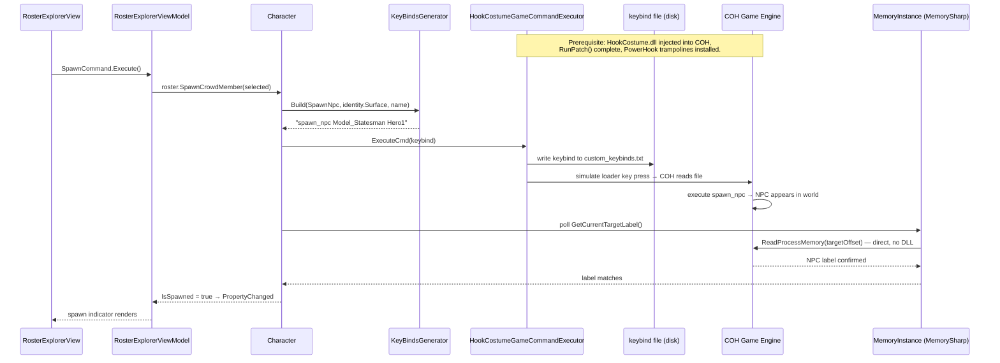
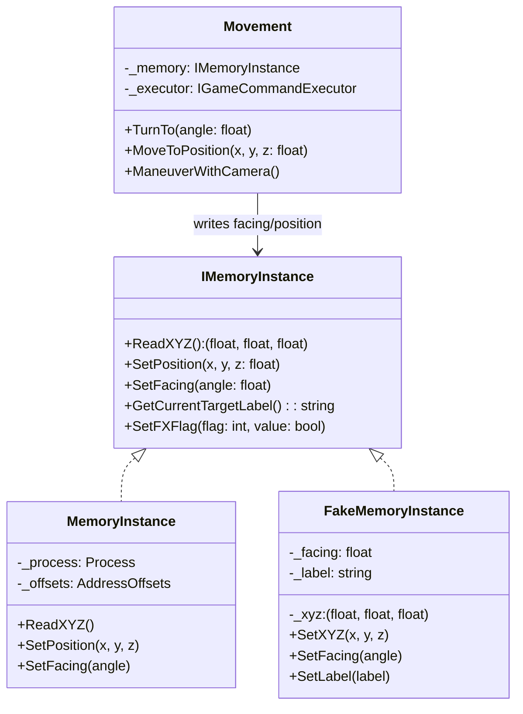
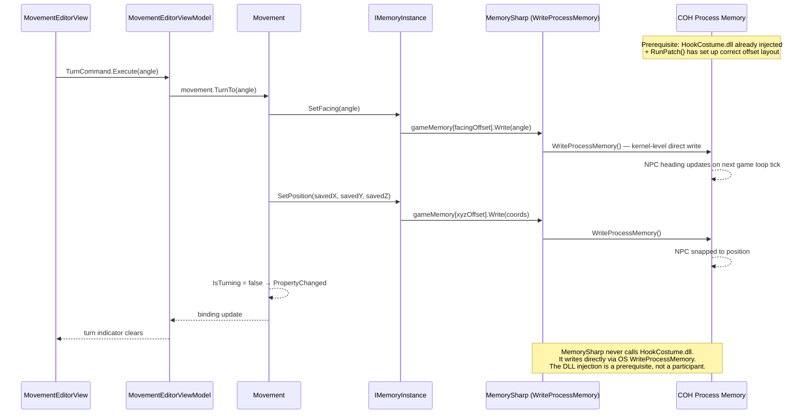

# Hero Virtual Tabletop — Architecture Reference

> **Purpose.** This document is the single canonical answer to "how does this architecture work for cross-cutting concerns?" Every new feature, refactor, and code-review should pass the decisions recorded here. When the rules below are followed, the codebase stays navigable and testable without City of Heroes being installed. This reference was produced through reverse engineering the existing codebase and setting the forward standard simultaneously — the **AS-IS** is noted where it diverges from the target.

---

## Table of Contents

1. [Architecture Layers](#architecture-layers)
2. [Mechanism: Skinny ViewModel](#mechanism-skinny-viewmodel)
3. [Mechanism: COH Game Bridge Seam](#mechanism-coh-game-bridge-seam)
4. [Mechanism: Direct Memory Manipulation](#mechanism-direct-memory-manipulation)
5. [Testing Architecture](#testing-architecture)
6. [References](#references)

---

## Architecture Layers

| Layer | Tech | Location | Responsibility |
|---|---|---|---|
| **Presentation** | WPF XAML + `*ViewModel.cs`, Prism regions, `DelegateCommand`, `INotifyPropertyChanged` | `Modules/Module.HeroVirtualTabletop/{Feature}/{Feature}View.xaml` + `{Feature}ViewModel.cs` | Layout, data binding, event routing, rendering. **Nothing else.** ViewModels translate user gestures into domain calls and expose domain state for binding. They carry no business logic and hold no knowledge of game internals. |
| **Domain** | Plain C# classes and interfaces | `Modules/Module.HeroVirtualTabletop/{Feature}/` (domain files alongside views, or ideally in a sub-folder per feature) | All business rules and orchestration. `Character`, `Crowd`, `CrowdMember`, `Identity`, `AnimatedAbility`, `CharacterMovement`, `Roster`, `OptionGroup`. Domain classes hold behaviour on the entity that owns the data; they never import from `GameCommunicator` or `ProcessCommunicator` implementation assemblies. |
| **COH Integration** | `IGameCommandExecutor`, `IMemoryInstance`, `IIconInteractionUtility`; production impls `HookCostumeGameCommandExecutor`, `MemoryInstance`, `IconInteractionUtility` | `Library/GameCommunicator/`, `Library/ProcessCommunicator/` | The exclusive seam between the application and City of Heroes. Every path that reads game memory, writes a keybind file, or calls the HookCostume DLL crosses this boundary through an interface. Swap the production impl for a fake and the entire domain + presentation layer runs without COH installed. |

```
Module.HeroVirtualTabletop/{Feature}/
├── {Feature}View.xaml          ← Presentation
├── {Feature}ViewModel.cs       ← Presentation
└── {Feature}.cs                ← Domain

-- example --
Rosters/
├── RosterExplorerView.xaml     ← Presentation
├── RosterExplorerViewModel.cs  ← Presentation  (⚠ AS-IS: too fat)
└── Roster.cs                   ← Domain

Library/
├── GameCommunicator/           ← COH Integration
└── ProcessCommunicator/        ← COH Integration
```

**Dependency direction:** Presentation → Domain → COH Integration interfaces. No arrow goes the other way. A ViewModel may hold a reference to a domain object (e.g. `Character`). A domain object calls game operations only through an injected interface (e.g. `IGameCommandExecutor`). Concrete COH classes (`HookCostumeGameCommandExecutor`, `MemoryInstance`) are never referenced outside `Library/`.

---

## Mechanism: Skinny ViewModel

### Principles & Patterns

- **Principle:** A ViewModel is a binding adapter, not a controller. It translates user gestures into domain method calls and exposes domain state for XAML binding. The ViewModel knows nothing about game internals, keybinds, memory offsets, or business rules. When a structural or display concern keeps appearing across ViewModels, extract it as a named domain concept.

- **Pattern:** Delegating ViewModel with Observable Domain
  - Every command handler is a one-liner: call the domain method, done. Observable properties are direct references to domain properties — no copy, no sync.
  - **Domain extraction trigger:** When code review spots a `Dictionary` + `ObservableCollection` pair kept in sync manually, ordering logic, or any structural concern spreading across more than one ViewModel — name it in the ubiquitous language, create the domain class, delete the ViewModel plumbing. `OptionGroup` is the canonical example: each `Character` exposes `.Identities`, `.Abilities`, `.Movements` as `OptionGroup` instances; the uniqueness invariant, ordering, and `CollectionChanged` live on the domain class; ViewModels bind directly.
  - **Cross-feature state consistency** is handled in the **domain layer**, not between ViewModels. Domain objects subscribe to each other's `CollectionChanged` / `PropertyChanged`; ViewModels are passive observers.
  - **Options considered:** MVVM event aggregator (rejected — ViewModels send events to each other, domain is no longer truth, untestable in isolation); Fat ViewModel (rejected — current AS-IS for `RosterExplorerViewModel`, untestable without WPF); ViewModel helper class for extracted concerns (rejected — hides domain concept, breaks test isolation).
  - **Benefits:** No ViewModel knows another ViewModel exists. Extracted domain concepts are tested once and reused everywhere. A domain change propagates automatically through binding.
  - **Trade-offs:** Domain objects must implement `INotifyPropertyChanged` / `INotifyCollectionChanged` correctly. Recognising the extraction pattern early is cheaper than refactoring a fat ViewModel later.

### File Structure

Views, ViewModels, and domain classes are **co-located by feature folder** — separation is by file role, not by directory. Extracted domain concepts live with the entity that owns them.

```
Module.HeroVirtualTabletop/{Feature}/
├── {Feature}View.xaml          ← Presentation
├── {Feature}ViewModel.cs       ← Presentation
└── {Feature}.cs                ← Domain

-- extraction example --
Characters/
├── OptionGroup.cs              ← Domain: extracted from ViewModel plumbing
└── Character.cs                ← Domain: exposes .Identities/.Abilities/.Movements as OptionGroup
```

### Participants

Every ViewModel has four explicit relationship types with its domain. The pattern is shown once using `RosterExplorerViewModel` as the worked example — apply the same shape to every other feature ViewModel.

**1. Command → Domain Method**

| ViewModel command | Handler (one-liner) | Domain method |
|---|---|---|
| `SpawnCommand` | `_roster.SpawnCrowdMember(SelectedCharacter)` | `Roster.SpawnCrowdMember(ICrowdMember)` |
| `ActivateCharacterCommand` | `_roster.ActivateCrowdMember(SelectedCharacter)` | `Roster.ActivateCrowdMember(ICrowdMember)` |
| `ClearFromDesktopCommand` | `_roster.ClearFromDesktop(SelectedCharacter)` | `Roster.ClearFromDesktop(ICrowdMember)` |
| `{AnyOtherCommand}` | `_{domainObject}.{DomainMethod}({selectedItem})` | `{DomainClass}.{DomainMethod}({param})` |

**2. Bound Property → Domain Source**

| ViewModel property | Domain source | Change notification |
|---|---|---|
| `Participants` | `Roster.Members` — direct reference, not a copy | `Roster.Members CollectionChanged` |
| `SelectedCharacter` | resolved `Character` in `Roster.Members` | ViewModel setter |
| `ActiveCharacter` | `Roster.Members.First(m => m.IsActive)` | `Character.IsActive PropertyChanged` |
| `{AnyDisplayProperty}` | `{DomainObject}.{DomainProperty}` — direct, no copy | `{DomainObject}.PropertyChanged` |

**3. Domain → Domain Observable Subscription** (cross-feature consistency, no ViewModel involved)

| Event | Subscriber | Effect |
|---|---|---|
| `Crowd.Members CollectionChanged` | `Roster` | Removes the member from `Roster.Members` — `RosterExplorerViewModel` sees it via binding |
| `{DomainObject}.{Event}` | `{OtherDomainObject}` | Keeps `{OtherDomainObject}` consistent — ViewModels observe the result automatically |

**4. Domain Field → View Display / Edit** *(worked example: `RosterExplorerView`)*

| What the user sees / edits | XAML binding | Domain field | R/W |
|---|---|---|---|
| Roster entry list | `ItemsSource="{Binding Participants}"` | `Roster.Members` | R |
| Character name | `Text="{Binding Name}"` | `Character.Name` | R |
| Active turn indicator | icon visibility | `Character.IsActive` | R |
| Spawned state | icon visibility | `Character.IsSpawned` | R |
| Selected character | `SelectedItem="{Binding SelectedCharacter}"` | resolved `Character` | R+W |
| Maneuvering-with-camera | toggle state | `Character.IsManeuveringWithCamera` | R+W |
| Distance counter | `Text="{Binding DistanceCount}"` | `Character.DistanceCount` | R |
| *For any other view:* | `{Binding {VMProperty}}`  | `{DomainObject}.{Field}` | R or R+W |

```mermaid
classDiagram
    class RosterExplorerViewModel {
        -_roster: IRoster
        +Participants: ObservableCollection~ICrowdMember~
        +SelectedCharacter: ICrowdMember
        +ActiveCharacter: ICrowdMember
        +SpawnCommand → Roster.SpawnCrowdMember()
        +ActivateCharacterCommand → Roster.ActivateCrowdMember()
        +ClearFromDesktopCommand → Roster.ClearFromDesktop()
    }
    class Roster {
        +Members: ObservableCollection~ICrowdMember~
        +SpawnCrowdMember(cm)
        +ActivateCrowdMember(cm)
        +ClearFromDesktop(cm)
    }
    class Character {
        +Name: string
        +IsActive: bool
        +IsSpawned: bool
        +IsManeuveringWithCamera: bool
        +DistanceCount: float
    }
    class Crowd {
        +Members: ObservableCollection~ICrowdMember~
        +IsGangMode: bool
    }
    RosterExplorerViewModel --> Roster : delegates commands\nbinds Participants ← Roster.Members
    Roster --> Character : members implement ICrowdMember
    Roster ..> Crowd : subscribes CollectionChanged\n(domain-to-domain; no VM involved)
```

### Flow



### Walkthrough Example

**Scenario A: GM activates a character (command delegation).**

1. `RosterExplorerView.xaml` has `Command="{Binding ActivateCharacterCommand}"` on the menu item.
2. `RosterExplorerViewModel.ActivateCharacterCommand.Execute()` fires. The handler: `_roster.ActivateCrowdMember(SelectedCharacter)` — one line.
3. `Roster.ActivateCrowdMember()` sets the active flag, resolves gang-mode, calls game commands through injected `IGameCommandExecutor`.
4. `Character.IsActive` raises `PropertyChanged`; active indicator in XAML updates automatically.

```csharp
public class RosterExplorerViewModel : BindableBase
{
    private readonly IRoster _roster;

    public RosterExplorerViewModel(IRoster roster)
    {
        _roster = roster;
        ActivateCharacterCommand = new DelegateCommand(ActivateSelectedCharacter, CanActivate);
    }

    public ICrowdMember? SelectedCharacter { get; set; }
    public DelegateCommand ActivateCharacterCommand { get; }

    private void ActivateSelectedCharacter() =>
        _roster.ActivateCrowdMember(SelectedCharacter!);

    private bool CanActivate() => SelectedCharacter != null;
}
```

**Scenario B: ViewModel concern extracted to domain (OptionGroup).**

When a ViewModel is managing ordered, keyed options in parallel collections — stop. Name the concept, create the domain class, delete the ViewModel plumbing.

1. Before: `IdentityEditorViewModel` held a `Dictionary<string, Identity>` and an `ObservableCollection<Identity>` kept in sync manually, with ordering logic in the ViewModel.
2. After: `OptionGroup` owns uniqueness enforcement, ordering, and `CollectionChanged`. `Character` exposes `.Identities` as an `OptionGroup`. The ViewModel shrinks to a pass-through.

```csharp
public class IdentityEditorViewModel : BindableBase
{
    private readonly Character _character;
    public OptionGroup Identities => _character.Identities;  // direct — no copy
    public DelegateCommand<IIdentity> AddIdentityCommand { get; }

    public IdentityEditorViewModel(Character character)
    {
        _character = character;
        AddIdentityCommand = new DelegateCommand<IIdentity>(
            id => _character.Identities.Add(id));
    }
}
```

> See **Testing Architecture** for tests verifying command delegation and the `OptionGroup` uniqueness invariant.

### Testing the Mechanism

**Domain tier** — test domain invariants (e.g. `OptionGroup` uniqueness) with plain domain objects and no stubs at all. Test ViewModel delegation with `Mock<IRoster>` or similar; assert the command calls the domain method exactly once.

**ViewModel + Domain tier** — wire the real domain with `FakeMemoryInstance` / `NoOpGameCommandExecutor`; assert both binding state and domain post-state.

**Game Bridge tier** — not applicable here. Skinny ViewModel tests never require COH; the game boundary is owned by the COH Bridge mechanisms.

See **Testing Architecture** for worked examples and the `[AssemblyInitialize]` setup that installs stubs for the whole test run.

---

## Mechanism: COH Game Bridge Seam

### Principles & Patterns

- **Principle:** Every path that touches City of Heroes (memory read, slash command, keybind file, HookCostume DLL) crosses an explicit interface boundary. No ViewModel, no domain class, and no test imports a concrete COH type.

- **Pattern:** Three-Path Interface Seam + Assembly-Level Test Double

  The COH surface has **three structurally different paths**, each hidden behind its own interface. They look like peers in the domain but run on completely different mechanisms at runtime:

  | Interface | Underlying mechanism | DLL injection required? |
  |---|---|---|
  | `IGameCommandExecutor` | HookCostume.dll VTT-side export → `WriteProcessMemory` to COH command buffer + `CreateRemoteThread` for buffer realloc | Yes — DLL must be loaded and `RunPatch()` must have run |
  | `IMemoryInstance` | MemorySharp → direct OS `WriteProcessMemory` / `ReadProcessMemory` at hardcoded offsets | Prerequisite only — offsets are valid only after `RunPatch()` has patched the COH image |
  | `IIconInteractionUtility` | P/Invoke to HookCostume.dll exports that read data written by in-process PowerHook trampolines | Yes — DLL must be injected into COH and PowerHook trampolines must be installed |

  **Startup sequence (production):** VTT loads `HookCostume.dll` into its own process → DLL calls `InjectDLL` → `CreateRemoteThread(LoadLibraryW)` injects the DLL into COH → `RunPatch()` binary-patches the COH executable image (I23/I24 version-specific fixups) → PowerHook installs detour trampolines inside COH. Only after this sequence are all three interfaces valid.

  - **Options considered:** Static gateway (current AS-IS for `GameCommandExecution.ActiveExecutor` — acceptable migration shim, must be removed once all call sites are injected); subclass-and-override (rejected — fragile); process-level test double (rejected — would require COH running).
  - **Benefits:** 99% of tests run in < 1 s with no game installed. The seam is the single point of change when a COH patch shifts offsets or the DLL export surface changes.
  - **Trade-offs:** Requires constructor injection discipline. `IMemoryInstance` writes silently succeed even if the DLL injection never ran — domain code cannot detect this; the Tier 2 integration test is the only safety net.

### File Structure

```
Library/
├── GameCommunicator/
│   ├── IGameCommandExecutor.cs           ← interface: ExecuteCmd(string)
│   ├── GameCommandExecution.cs           ← shim (migration aid; remove when fully injected)
│   ├── HookCostumeGameCommandExecutor.cs ← P/Invoke → HookCostume.dll ExecuteCommand export
│   ├── NoOpGameCommandExecutor.cs        ← test double (already exists)
│   └── KeyBindsGenerator.cs             ← assembles keybind strings; no COH knowledge
├── ProcessCommunicator/
│   ├── IMemoryInstance.cs                ← interface: SetPosition, SetFacing, ReadXYZ, GetLabel
│   ├── MemoryInstance.cs                 ← MemorySharp: direct WriteProcessMemory at offsets
│   ├── MemoryElement.cs                  ← extends MemoryInstance; NPC label + Target()
│   └── FakeMemoryInstance.cs            ← test double (to be added)
└── Utility/
    ├── IIconInteractionUtility.cs        ← interface: hover NPC, 3D mouse, raycast, alive
    └── IconInteractionUtility.cs         ← P/Invoke → HookCostume.dll PowerHook data exports
```

### Participants

| Class | Layer | Mechanism | Responsibility |
|---|---|---|---|
| `IGameCommandExecutor` | COH Integration (interface) | — | Contract for slash-command execution |
| `HookCostumeGameCommandExecutor` | COH Integration (production) | P/Invoke + `WriteProcessMemory` + `CreateRemoteThread` | Writes slash command into COH command buffer via HookCostume export |
| `NoOpGameCommandExecutor` | COH Integration (test double) | In-process | Discards all commands; exposes `LastCommand` for assertion |
| `IMemoryInstance` | COH Integration (interface) | — | Contract for direct process memory R/W |
| `MemoryInstance` | COH Integration (production) | MemorySharp `WriteProcessMemory` | Holds offset table; resolves pointer chains; never calls DLL |
| `FakeMemoryInstance` | COH Integration (test double) | In-process dictionary | Pre-seedable; readable for post-state assertion |
| `IIconInteractionUtility` | COH Integration (interface) | — | Contract for in-process hook data queries |
| `IconInteractionUtility` | COH Integration (production) | P/Invoke → PowerHook data buffers | Reads hover NPC label, 3D mouse pos, collision, game-alive |



### Flow



### Walkthrough Example

**Scenario: GM clicks Spawn — full path from button press to NPC in the game world.**

1. `RosterExplorerViewModel.SpawnCommand.Execute()` — one line: `_roster.SpawnCrowdMember(selected)`.
2. `Roster` calls `character.Spawn()`.
3. `Character.Spawn()` asks `KeyBindsGenerator` to assemble `"spawn_npc Model_Statesman Hero1"`.
4. `Character` passes the string to `IGameCommandExecutor.ExecuteCmd()`.
5. `HookCostumeGameCommandExecutor` writes the keybind to `custom_keybinds.txt` and simulates pressing the loader key. (Path 1 — DLL)
6. COH reads the file, executes `spawn_npc` — NPC appears in world.
7. `Character` polls `IMemoryInstance.GetCurrentTargetLabel()` — `MemoryInstance` calls `ReadProcessMemory` at the target pointer offset. (Path 2 — MemorySharp, no DLL call)
8. Once the label matches, `Character.IsSpawned = true` raises `PropertyChanged` and the roster view updates.

```csharp
public class Character : ICharacter
{
    private readonly IGameCommandExecutor _executor;
    private readonly IMemoryInstance _memory;

    public Character(IGameCommandExecutor executor, IMemoryInstance memory)
    {
        _executor = executor;
        _memory = memory;
    }

    public void Spawn()
    {
        var keybind = KeyBindsGenerator.Build(GameEvent.SpawnNpc, ActiveIdentity.Surface, Name);
        _executor.ExecuteCmd(keybind);        // Path 1 — DLL
        WaitUntilRegisteredInMemory();         // Path 2 — MemorySharp
        IsSpawned = true;
    }

    private void WaitUntilRegisteredInMemory()
    {
        // polls _memory.GetCurrentTargetLabel() until == Name or timeout
    }
}
```

> See **Testing Architecture** for the test that verifies this command delegates correctly.

### Testing the Mechanism

**Domain tier** — install `NoOpGameCommandExecutor` + `FakeMemoryInstance` via `[AssemblyInitialize]`. All three bridge paths replaced. Domain code under test is unmodified production code.
- Assert `NoOpGameCommandExecutor.LastCommand` contains the expected keybind string (Path 1).
- Pre-seed `FakeMemoryInstance.SetLabel("Hero1")` before `Spawn()` runs; assert `IsSpawned == true` (Path 2).
- Path 3 (`IIconInteractionUtility`) stubbed with `FakeIconInteractionUtility`.

**ViewModel + Domain tier** — wire the real domain to a ViewModel with the same fakes; assert binding state and domain post-state together.

**Game Bridge tier** — `Module.IntegrationTest`, `[TestCategory("GameBridge")]`. Real DLL injection, `RunPatch()`, live `MemoryInstance`. One test per bridge path (command, memory, hook). Never in CI.

---

## Mechanism: Direct Memory Manipulation

### Principles & Patterns

- **Principle:** Game state that cannot be changed through slash commands (character facing, position offsets, FX toggle, aiming angle) is written directly to COH process memory via `WriteProcessMemory`. The address offsets never appear in domain code — they belong to `MemoryInstance`. Domain classes describe *what* to change; `IMemoryInstance` resolves *where* in process memory.

- **Pattern:** Semantic Memory Write through Address-Isolated Interface
  - `IMemoryInstance` exposes semantic operations (`SetPosition`, `SetFacing`, `SetTargetLabel`, `ReadXYZ`) — not raw address/value pairs. The concrete `MemoryInstance` holds the COH pointer chain and offset table; domain classes hold none of it.
  - **`MemorySharp` never calls `HookCostume.dll`** — it is a direct OS-level `WriteProcessMemory`/`ReadProcessMemory` library. However, the DLL injection and `RunPatch()` binary-patching of the COH executable *must have already run* before any `MemorySharp` write is valid: `RunPatch()` establishes the version-specific offset layout (I23/I24 build variants) that the hardcoded constants depend on. MemorySharp is an orthogonal mechanism with an injection prerequisite.
  - Operations that combine a memory write with a command (e.g. turn-then-face-camera) are composed in the domain, not in `MemoryInstance`. `MemoryInstance` is a single-concern writer; the domain orchestrates sequence.
  - FX and visual state follow the same pattern: semantic method on the interface, offset resolution in the concrete class.
  - **Options considered:** Direct `MemorySharp` calls from domain (rejected — offsets scatter across domain classes; a COH patch breaks every domain file); named constants file for offsets (rejected — still requires `MemorySharp` in domain; seam principle violated); current mixed approach where some domain classes call `MemorySharp` directly (AS-IS — being migrated to injection).
  - **Benefits:** All pointer offsets are in one file. A COH patch means one file changes. `FakeMemoryInstance` simulates any memory state in tests without a running game.
  - **Trade-offs:** The semantic interface must grow when new game state is needed. `RunPatch()` / injection must have completed before any `MemorySharp` operation — the domain cannot be safely used against a freshly opened, unpatched COH process.

### File Structure

```
Library/ProcessCommunicator/
├── IMemoryInstance.cs         ← semantic interface: SetPosition, SetFacing, ReadXYZ, SetLabel…
├── MemoryInstance.cs          ← production: MemorySharp attach, pointer chain, offset table
├── MemoryElement.cs           ← target acquisition: GetCurrentTargetLabel(), Target() via memory
└── FakeMemoryInstance.cs      ← test double: dictionary of address → value; SetXYZ / SetFacing / SetLabel helpers

-- domain side (examples) --
Movements/Movement.cs          ← calls _memory.SetPosition / SetFacing to move/turn character
Characters/Character.cs        ← calls _memory.SetLabel / ReadXYZ during spawn confirmation
```

### Participants

| Class | Layer | Responsibility | Collaborators |
|---|---|---|---|
| `IMemoryInstance` | COH Integration (interface) | Semantic memory contract: position R/W, facing R/W, label R, FX flag R/W | `Character`, `Movement`, `Position` (domain) |
| `MemoryInstance` | COH Integration (production) | `MemorySharp` process attach; resolves pointer chains; holds all COH offset constants | `MemoryElement` |
| `MemoryElement` | COH Integration (production) | Extends `MemoryInstance`; adds target acquisition (`GetCurrentTargetLabel`, `Target`) | `Character.Spawn`, `Roster` |
| `FakeMemoryInstance` | COH Integration (test double) | Dictionary-backed; `SetXYZ / SetFacing / SetLabel` pre-seed values; readable for assertion | `Module.UnitTest` (Tier 1) |
| `Movement` | Domain | Orchestrates turn + move + camera sequence; calls `IMemoryInstance` for facing/position writes | `IMemoryInstance` (injected) |
| `Character` | Domain | Reads position on spawn confirmation; writes label on target confirmation | `IMemoryInstance` (injected) |



### Flow



### Walkthrough Example

**Scenario: GM turns a spawned NPC to face a specific direction.**

1. `MovementEditorView` binds `TurnCommand` to a heading input. GM enters angle and clicks Turn.
2. `MovementEditorViewModel.TurnCommand.Execute(angle)` — one line: `_movement.TurnTo(angle)`.
3. `Movement.TurnTo(angle)` writes the facing angle to process memory via `_memory.SetFacing(angle)`, then snaps the position back (COH resets XYZ on a turn; the domain saves and restores).
4. `MemoryInstance.SetFacing()` resolves the pointer chain for the targeted NPC's heading offset and calls `MemorySharp.Write<float>(headingAddress, angle)`.
5. COH updates the NPC's 3D heading in the world — the NPC turns.
6. `Movement.IsTurning = false` raises `PropertyChanged`; the ViewModel's binding clears the in-progress indicator.

```csharp
public class Movement : IMovement
{
    private readonly IMemoryInstance _memory;
    private readonly IGameCommandExecutor _executor;

    public Movement(IMemoryInstance memory, IGameCommandExecutor executor)
    {
        _memory = memory;
        _executor = executor;
    }

    public void TurnTo(float angle)
    {
        var savedPosition = _memory.ReadXYZ();
        _memory.SetFacing(angle);
        _memory.SetPosition(savedPosition.X, savedPosition.Y, savedPosition.Z);
        IsTurning = false;
    }

    public void ManeuverWithCamera()
    {
        var (x, y, z) = _memory.ReadXYZ();
        _executor.ExecuteCmd(KeyBindsGenerator.Build(GameEvent.Target, Name));
        _memory.SetPosition(x, y, z);
        IsManeuveringWithCamera = true;
    }
}
```

> See **Testing Architecture** for worked examples using `FakeMemoryInstance`.

### Testing the Mechanism

**Domain tier** — construct domain classes with `FakeMemoryInstance` injected. Pre-seed `SetXYZ` / `SetFacing`; exercise the domain method; assert `ReadXYZ()` / `ReadFacing()` equals the expected post-state. `NoOpGameCommandExecutor` absorbs any command-side calls.

**ViewModel + Domain tier** — wire the real domain to a ViewModel with the same fakes; assert both the binding update and the domain post-state.

**Game Bridge tier** — `Module.IntegrationTest`, `[TestCategory("GameBridge")]`. Attach live `MemoryInstance` via `CohProcessBootstrap`. Verify offset accuracy after a COH patch. Never in CI.

---

## Testing Architecture

### Test Tiers

| Tier | Focus | COH | Project |
|---|---|---|---|
| **Domain** | Domain logic in isolation — no ViewModel, no COH. Invariants, rules, state transitions. | Stubbed (`FakeMemoryInstance`, `NoOpGameCommandExecutor`) | `Module.UnitTest` |
| **ViewModel + Domain** | ViewModel binding and rendering — ViewModel wired to the real domain, COH still stubbed. Can assert domain state as a side-effect; focus is the presentation layer. | Stubbed | `Module.UnitTest` |
| **E2E (key paths)** | Minimal. Covers the critical end-to-end paths spanning all three layers. Not exhaustive — one test per key architectural path, not per scenario. | Stubbed | `Module.UnitTest` |
| **Game Bridge** | Each of the three COH integration paths (command buffer, MemorySharp offsets, PowerHook exports) tested against a live COH process. Explicit invocation only. | Real COH required | `Module.IntegrationTest` |

**Why Domain separate from ViewModel + Domain:** Domain tests are pure — no WPF types, no `BindableBase`, no `DelegateCommand`. ViewModel tests can import Prism and assert binding behaviour. Keeping them separate makes failures unambiguous and the domain suite runnable anywhere.

**Why E2E is minimal:** Domain and ViewModel tiers already exercise all logic. E2E only verifies that the wiring between layers is correct for the paths that matter most architecturally. One test per critical path.

**Why Game Bridge is a separate project:** Requires a running COH process, DLL injection, and `RunPatch()`. Mixing it into `Module.UnitTest` risks accidentally running against a live game. A separate project makes the isolation structural.

### Test Project Structure

```
Modules/
├── Module.UnitTest/                      ← Tiers 1–3; runs in CI; no COH required
│   ├── GameCommunicator/
│   │   └── GameCommandTestAssemblyHooks.cs   ← [AssemblyInitialize] installs all fakes
│   ├── ProcessCommunicator/
│   │   └── FakeMemoryInstance.cs             ← test double (to be added)
│   ├── Domain/
│   │   └── {Feature}DomainTest.cs            ← Tier 1: domain logic only, no ViewModel
│   ├── Presentation/
│   │   └── {Feature}ViewModelTest.cs         ← Tier 2: ViewModel + real domain, COH stubbed
│   └── E2E/
│       └── {KeyPath}E2ETest.cs               ← Tier 3: one test per key architectural path
└── Module.IntegrationTest/               ← Game Bridge; real COH required
    ├── CohProcessBootstrap.cs            ← [AssemblyInitialize] injects DLL + RunPatch()
    ├── CommandBridgeTest.cs              ← [TestCategory("GameBridge")] Path 1: keybind round-trip
    ├── MemoryBridgeTest.cs               ← [TestCategory("GameBridge")] Path 2: MemorySharp offsets
    └── HookBridgeTest.cs                 ← [TestCategory("GameBridge")] Path 3: PowerHook exports
```

### Test Infrastructure

| Class | Tier | Responsibility |
|---|---|---|
| `GameCommandTestAssemblyHooks` | 1–3 infra | `[AssemblyInitialize]` — installs `NoOpGameCommandExecutor` + fakes for the whole unit test run |
| `NoOpGameCommandExecutor` | Test double | Discards `ExecuteCmd` calls; exposes `LastCommand` for assertion |
| `FakeMemoryInstance` | Test double | Pre-seedable dictionary; `SetLabel`/`SetXYZ`/`SetFacing`; readable for post-state assertion |
| `FakeIconInteractionUtility` | Test double | Returns configured hover label, mouse XYZ, collision result |
| `CohProcessBootstrap` | Game Bridge infra | Verifies COH running; runs DLL injection + `RunPatch()`; skips all tests if absent |

**Test doubles:**

| Double | Replaces | Status |
|---|---|---|
| `NoOpGameCommandExecutor` | `IGameCommandExecutor` | Exists |
| `FakeMemoryInstance` | `IMemoryInstance` | To be added |
| `FakeIconInteractionUtility` | `IIconInteractionUtility` | To be added |

**Framework:** MSTest + Moq + FluentAssertions. NUnit references removed as files are touched.

### Example: Tier 1 — Domain test (position save/restore invariant)

```csharp
[TestClass]
public class TestCrowdPositionSave
{
    private FakeMemoryInstance _memory = null!;
    private Crowd _crowd = null!;

    [TestInitialize]
    public void GivenASpawnedCrowdWithPositionedMember()
    {
        _memory = new FakeMemoryInstance();
        _crowd = new Crowd("Scene1");
        _crowd.Add(new Character(new NoOpGameCommandExecutor(), _memory) { Name = "Guard1" });
        _memory.SetXYZ(100f, 0f, 200f);
    }

    [TestMethod]
    public void WhenPositionsSaved_ThenRestoreWritesOriginalCoordinates()
    {
        _crowd.SavePositions();
        _memory.SetXYZ(0f, 0f, 0f);

        _crowd.PlaceMembers();

        _memory.ReadXYZ().Should().Be((100f, 0f, 200f));
    }
}
```

### Example: Tier 2 — ViewModel + Domain test (binding and domain update together)

```csharp
[TestClass]
public class TestRosterExplorerViewModel
{
    private FakeMemoryInstance _memory = null!;
    private Roster _roster = null!;
    private RosterExplorerViewModel _vm = null!;

    [TestInitialize]
    public void GivenAViewModelWiredToARealRoster()
    {
        _memory = new FakeMemoryInstance();
        _roster = new Roster(new NoOpGameCommandExecutor(), _memory);
        _vm = new RosterExplorerViewModel(_roster);
    }

    [TestMethod]
    public void WhenGmClicksActivate_ThenActiveCharacterBindingUpdates()
    {
        var character = _roster.Members.First();
        _vm.SelectedCharacter = character;

        _vm.ActivateCharacterCommand.Execute();

        _vm.ActiveCharacter.Should().Be(character);
        character.IsActive.Should().BeTrue();
    }
}
```

### Example: Tier 3 — E2E key-path test (spawn gesture → roster indicator)

```csharp
[TestClass]
public class TestSpawnKeyPath
{
    [TestMethod]
    public void WhenGmSpawns_ThenRosterShowsSpawnedIndicator()
    {
        var memory = new FakeMemoryInstance();
        var roster = new Roster(new NoOpGameCommandExecutor(), memory);
        var vm = new RosterExplorerViewModel(roster);
        var character = roster.Members.First();
        vm.SelectedCharacter = character;
        memory.SetLabel(character.Name);

        vm.SpawnCommand.Execute();

        character.IsSpawned.Should().BeTrue();
        vm.Participants.Should().Contain(m => m.Name == character.Name && m.IsSpawned);
    }
}
```

### Example: Game Bridge — Path 2 offset validation (live COH required)

```csharp
[TestClass]
[TestCategory("GameBridge")]
public class MemoryBridgeTest
{
    private Character _hero = null!;

    [ClassInitialize]
    public static void RequireCohRunning(TestContext ctx) =>
        CohProcessBootstrap.RequireCohRunning(ctx);

    [TestInitialize]
    public void GivenACharacterWithLiveGameBridge() =>
        _hero = new Character(new HookCostumeGameCommandExecutor(), new MemoryInstance())
            { Name = "TestHero1" };

    [TestMethod]
    public void WhenSpawned_ThenNpcAppearsInGameMemory()
    {
        _hero.Spawn();

        _hero.IsSpawned.Should().BeTrue();
        _hero.Label.Should().Be("TestHero1");
    }
}
```

---

## References

- **Ubiquitous language:** `docs/domain/ubiquitous-language.md`
- **Story map:** `docs/stories/story-map.md`
- **Information architecture:** `docs/ux/initial-ia.md`
- **Coding standard:** `abd-clean-code` (domain language, constructor injection, small focused methods, no anemic data bags)
- **Testing standard:** `abd-acceptance-test-driven-development` (class per story, method per scenario, Given/When/Then helpers, no defensive checks in tests)
- **COH seam (existing):** `Library/GameCommunicator/GameCommandExecution.cs`, `Library/GameCommunicator/NoOpGameCommandExecutor.cs`
- **Domain core (existing):** `Characters/Character.cs`, `Crowds/Crowd.cs`, `Identities/Identity.cs`, `AnimatedAbilities/AnimatedAbility.cs`
- **AS-IS warning:** `Rosters/RosterExplorerViewModel.cs` is the primary example of the fat-ViewModel anti-pattern this reference targets; treat it as the before-picture for the Skinny ViewModel mechanism.
