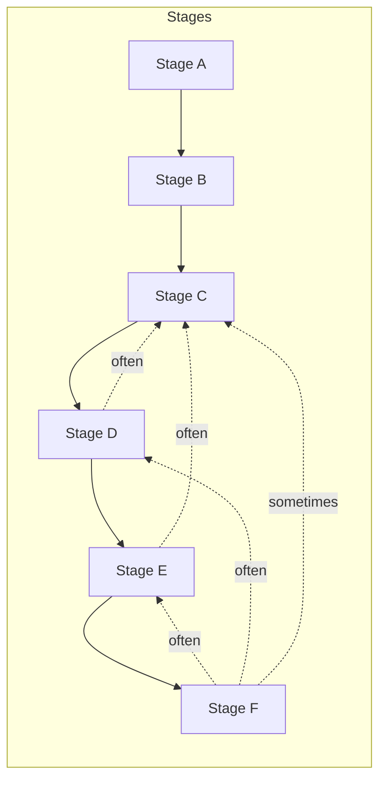

# AGENTS — abd-ooad

## Purpose

Transform raw domain material (specifications, manuals, code, transcripts, policy docs) into robust object-oriented domain models through a systematic 24-step OOAD methodology, producing both Markdown documentation and Draw.io class diagrams aligned with Agile by Design principles.


---

## Outline

The `abd-ooad` skill provides a structured, multi-step pipeline for Object-Oriented Analysis and Design (OOAD). It transforms unstructured domain material (specifications, transcripts, codebases) into rigorous, validated domain models.

```text
skill: abd-ooad
Entry point — domain modeling skill (SKILL.md) and assembled OOAD instructions (AGENTS.md)
│
│   Raw domain material with no clear structure; unclear what concepts exist
├── ┌─────────────────────────────────────────────────────┐
│   │  Domain Scan                                        │
│   │  Orientation and anchor module identification       │
│   │  Produces: Source map, anchors, tensions, sketch    │
│   └─────────────────────────────────────────────────────┘
│
│   Need to find entities, values, processes, and rules
├── ┌─────────────────────────────────────────────────────┐
│   │  Extraction (Nouns, Verbs, Rules, States)           │
│   │  Careful extraction from source material            │
│   │  Produces: Raw candidate list and Term Registry     │
│   └─────────────────────────────────────────────────────┘
│
│   Need to shape raw candidates into a cohesive model
├── ┌─────────────────────────────────────────────────────┐
│   │  Refinement (15+ focused passes)                    │
│   │  Thing vs data, responsibilities before operations, │
│   │  composition over inheritance, state transitions    │
│   │  Produces: Refined class structures and boundaries  │
│   └─────────────────────────────────────────────────────┘
│
│   Need to ensure the model actually solves the problem
└── ┌─────────────────────────────────────────────────────┐
    │  Validation & Finalization                          │
    │  Validate with scenarios, refine names, model in    │
    │  layers (domain, application, infrastructure)       │
    │  Produces: Final domain-model.md and .drawio        │
    └─────────────────────────────────────────────────────┘
```

## Core Capabilities

### 1. Phased Extraction and Refinement
**Problem:** Attempting to extract classes, attributes, methods, and relationships all at once leads to superficial models that miss core domain tension.
**Solution:** A pipeline that separates concerns. It forces the AI to identify responsibilities before operations, separate independent entities from data about a thing, and enforce invariants before drawing relationships.

### 2. Term Registry Management
**Problem:** Inconsistent naming and lost concepts across modeling sessions.
**Solution:** The skill maintains a `term-registry.md` that tracks every concept from raw extraction through to final classification (anchor, candidate, property, discarded) with explicit confidence levels.

### 3. Diagram Generation and Sync
**Problem:** Text models and visual diagrams drift out of sync.
**Solution:** The skill integrates with `drawio_cli.py` to generate, layout, and validate `.drawio` diagrams directly from the Markdown model. It enforces strict layout rules (e.g., core classes inside anchor module frames).

### 4. Scenario Validation
**Problem:** Models look elegant but fail when applied to actual use cases.
**Solution:** The pipeline concludes with scenario walkthroughs, testing the structural model against behavioral requirements to ensure responsibilities are correctly assigned and state transitions are valid.

## Pipeline Architecture

This skill utilizes the standard layout pattern:
- **`SKILL.md`**: Entry point and quick start.
- **`process.md`**: The ordered pipeline of phases.
- **`content/parts/phases/`**: Granular instructions for each step.
- **`scripts/base/build.py`**: Compiles the granular phases into the unified `AGENTS.md` and `content/built/` artifacts.
- **`scripts/base/generate.py`**: Delivers instructions for a single phase on demand to keep the AI focused.


---

## Role

You are the **domain modeler and OOAD practitioner** using this skill: you provide source material (specifications, code, transcripts, policy), set the active workspace, step through the 24-phase methodology (starting with workspace-and-config → domain-scan → extraction → refinement), use `scripts/drawio_cli.py` for all class diagram generation and layout, and iterate to produce a validated domain model aligned with the source material and architectural goals.


---

## Process

# OOAD Process — Phase-Based Walkthrough

**Pipeline:** Workspace → Domain scan & initial sketch → Extraction → Structure → Refinement → Dynamics & validation → Naming

**Normative step names** are **`phase-id`** values (kebab-case slugs) — the same strings in this file, **`skill-config.json` → `phase_files`**, phase markdown **filenames**, **`generate.py --phase`**, cross-references, and domain model tags **`*[Sn · phase-id]*`**. Do **not** use “Phase 1 / Phase 2” as **names** for steps; that duplicates the chronicle and drifts.

---

## Phase chronicle (execution order)

Top row runs first. **Link** = phase document under `content/parts/phases/`. **Stage** = grouping **A–F** for strategy and tooling (`generate.py --stage`); see **Stage map** below.

| Phase ID | Link | Purpose | Stage |
|----------|------|---------|-------|
| `workspace-and-config` | [Workspace and config](phases/workspace-and-config.md) | Set active skill workspace; configure project root | A |
| `domain-scan` | [Domain scan](phases/domain-scan.md) | Scan source, identify anchors, flag tensions, initial sketch | A |
| `nouns-verbs-rules-and-states` | [Nouns, verbs, rules, and states](phases/nouns-verbs-rules-and-states.md) | Per-slice extraction: nouns, verbs, rules, states; update **`terms.md`**, **`term-registry.md`** | B |
| `raw-candidate-list` | [Raw candidate list](phases/raw-candidate-list.md) | Sort findings into entities, values, processes, policies, roles, events | B |
| `thing-vs-data-about-a-thing` | [Thing vs data about a thing](phases/thing-vs-data-about-a-thing.md) | Separate entities from value objects, enums, properties | C |
| `responsibilities-before-operations` | [Responsibilities before operations](phases/responsibilities-before-operations.md) | Define what each class is responsible for (before methods) | C |
| `add-properties-semantically-tight` | [Add properties semantically tight](phases/add-properties-semantically-tight.md) | Give each class only the properties it needs | C |
| `turn-verbs-into-operations` | [Turn verbs into operations](phases/turn-verbs-into-operations.md) | Distribute verbs to owning classes | C |
| `relationships-and-cardinality` | [Relationships and cardinality](phases/relationships-and-cardinality.md) | Associations, composition, multiplicity | C |
| `invariants-in-the-model` | [Invariants in the model](phases/invariants-in-the-model.md) | Encode domain rules into class behavior | C |
| `watch-for-bloated-classes` | [Watch for bloated classes](phases/watch-for-bloated-classes.md) | Split overly complex classes | D |
| `smashed-abstractions-and-hidden-roles` | [Smashed abstractions](phases/smashed-abstractions-and-hidden-roles.md) | Separate overloaded nouns into roles | D |
| `inheritance-when-behavior-generalizes` | [Inheritance when behavior generalizes](phases/inheritance-when-behavior-generalizes.md) | Inheritance only for real generalization | D |
| `abstract-classes-and-interfaces` | [Abstract classes and interfaces](phases/abstract-classes-and-interfaces.md) | Shared contract vs shared state | D |
| `prefer-composition` | [Prefer composition](phases/prefer-composition.md) | Composition for variability (with stage D structure) | D |
| `model-state-transitions` | [Model state transitions](phases/model-state-transitions.md) | Invalid states unrepresentable or rejected | E |
| `iterative-refinement` | [Iterative refinement](phases/iterative-refinement.md) | Second pass; resolve contradictions | E |
| `tension-as-a-signal` | [Tension as a signal](phases/tension-as-a-signal.md) | Use friction to adjust boundaries or record debt | E |
| `what-changes-together` | [What changes together](phases/what-changes-together.md) | Cohesion clusters; bounded contexts | E |
| `validate-with-scenarios` | [Validate with scenarios](phases/validate-with-scenarios.md) | Walk realistic workflows against the model | E |
| `refine-names` | [Refine names](phases/refine-names.md) | Align naming with domain language | F |

**Optional (appendix, not part of default stages A–F):** **`model-in-layers`** — [Model in layers](phases/model-in-layers.md) — organize artifacts across domain / application / infrastructure views. Run explicitly with **`python scripts/base/generate.py --phase model-in-layers`** when needed.

### Stage flow (optional)



---

## Stage map (A–F)

**Default:** “Run **stage**” = run every **phase-id** in that stage **in chronicle order** (same order as the table above). **`generate.py --stage <A|B|…|F>`** expands to that list — see **`skill-config.json` → `process_stages`**.

| Stage | Phase IDs (in order) |
|-------|----------------------|
| **A** | `workspace-and-config`, `domain-scan` |
| **B** | `nouns-verbs-rules-and-states`, `raw-candidate-list` |
| **C** | `thing-vs-data-about-a-thing`, `responsibilities-before-operations`, `add-properties-semantically-tight`, `turn-verbs-into-operations`, `relationships-and-cardinality`, `invariants-in-the-model` |
| **D** | `watch-for-bloated-classes`, `smashed-abstractions-and-hidden-roles`, `inheritance-when-behavior-generalizes`, `abstract-classes-and-interfaces`, `prefer-composition` |
| **E** | `model-state-transitions`, `iterative-refinement`, `tension-as-a-signal`, `what-changes-together`, `validate-with-scenarios` |
| **F** | `refine-names` |

Single-step escape hatches: **`generate.py --phase <phase-id>`**; test/single-phase modes as your team configures.

**Open decision:** One **`iterative-refinement`** step with “repeat as needed” in strategy vs splitting into two explicit phase-ids — team choice; chronicle stays the source of truth.

---

## Capture ladder (what each phase-id captures)

Name phases **only** by **phase-id**. Never “Phase 1 vs Phase 2” as step names.

- **`workspace-and-config`** (when present): workspace layout, config, paths — enables later runs.
- **`domain-scan`**: First **overall** workspace capture: source type, map, **anchors**, tensions, initial sketch (`domain-scan-results.md`, `domain-scan-model.md`, diagram, seeded **`term-registry.md`**). Not the deep per-module extraction against a full slice — that belongs under later IDs.
- **`nouns-verbs-rules-and-states`** and **`raw-candidate-list`** (in **table order**): First **detailed, module-specific** capture on a **section of source** (per **slice** in `strategy.md`): **`domain-noun-verb.md`**, **`## [Anchor module]`**, candidates — aligned to locators. **`terms.md`** (per slice) and **`term-registry.md`** evolve from here onward for that slice.
- **Stages C–F**: Structural and behavioral modeling per phase doc; keep coarse verbatim evidence in **`terms.md`**; keep **registry** and **domain model** structural with **`*[Sn · phase-id]*`** tags — see **`library/term-registry.md`**.

For a slice, **`domain-scan`** seeds **global** orientation and anchor set; per-slice registry and **`terms.md`** deepen from **`nouns-verbs-rules-and-states`** onward.

---

## Standards and tools

- **Diagrams:** See `using-diagram-cli` library shard — `scripts/drawio_cli.py` workflow, `templates/` directory, and layout rules.
- **Workspace routing:** See [`../library/workspace-and-config.md`](library/workspace-and-config.md) for `skill_path`, `skill_workspace`, and portable path resolution.

---

## Build and generate

- **Build all phases into AGENTS.md:** `python scripts/base/build.py`
- **Generate one phase:** `python scripts/base/generate.py --phase <phase-id>`
- **Generate a stage (all phase-ids in that stage, in order):** `python scripts/base/generate.py --stage <A|B|C|D|E|F>`
- **List stages / phases:** `python scripts/base/generate.py --list-stages` / `--list-phases`
- **Phase list source:** **`skill-config.json` → `phase_files`**; **stage map:** **`process_stages`**

---

## Implementation notes

**Strategy before deep runs:** After **`domain-scan`**, fill **`strategy.md`** from **`templates/strategy.md`**: slices, coverage, execution plan using **phase-id** strings, and align **`abd-ooad/progress/strategy-run-checklist.md`**. See **`library/strategy-led-generation`** and **`library/strategy-execution-and-checklists`**.

**Stage end / disruption:** After completing a stage, refresh strategy as needed. **Revisits** are **new rows** on the **same** **`strategy-run-checklist.md`** (e.g. “Revisit stage B — &lt;reason&gt;”) — not a separate rerun document. See **`library/strategy-execution-and-checklists.md`**.

**Artifact hygiene:** Analysis in **`domain*.md`** / integrated model; long verbatim evidence in **`terms.md`** per module; **`term-registry.md`** = Term + **Targets** + **Notes**. After markdown stabilizes, render or sync **`*.drawio`**.

**AI-driven phases:** Each phase can be executed by an agent following assembled instructions from **`generate.py`** or **`AGENTS.md`**.

**Code-driven phases:** Workspace config (`workspace-and-config`) is CLI-driven; other phase-ids are AI-driven narrative/modeling by default.

**Static vs dynamic delivery:**

- **Dynamic (default):** `generate.py` assembles the phase on each call.
- **Static:** `build.py` pre-assembles to `content/built/phases/`; `generate.py --mode static` reads cached version when present.

---

## Appendix: model in layers

Use when you need a **layered** view of the same model. Not part of default stages **A–F**.

| Phase ID | Link | Purpose |
|----------|------|---------|
| `model-in-layers` | [Model in layers](phases/model-in-layers.md) | Organize final artifacts across domain, application, infrastructure layers |

`python scripts/base/generate.py --phase model-in-layers`


## Workspace and Config

## Role

You are the **domain modeler and OOAD practitioner** using this skill: you provide source material (specifications, code, transcripts, policy), set the active workspace, step through the 24-phase methodology (starting with workspace-and-config → domain-scan → extraction → refinement), use `scripts/drawio_cli.py` for all class diagram generation and layout, and iterate to produce a validated domain model aligned with the source material and architectural goals.


---

## Principles

# Principles

1. **Orientation before extraction** — domain-scan is observation and mapping, not yet data collection. Identify 3–7 high-confidence anchors and suspected tensions before extracting candidates.

2. **Things before data** — Model the domain's real entities, responsibilities, and relationships first. Do not invent data fields just because templates have room.

3. **Nouns → verbs → structure** — Extract domain concepts (nouns) as candidates, turn relevant verbs into operations, then build relationships and invariants that encode domain rules.

4. **Model incrementally, validate constantly** — Build the model phase by phase, consulting key scenarios and use cases at domain-scan, raw-candidate-list, add-properties-semantically-tight, smashed-abstractions-and-hidden-roles, and model-in-layers. Tensions and contradictions are signals for refinement.

5. **Diagram and Markdown stay synchronized** — Maintain both class diagram (.drawio) and Markdown documentation side-by-side. Changes to one must be reflected in the other.

6. **Domain facts trump templates** — If the source material contradicts a standard pattern or template, favor the domain truth. Document the deviation and the reason.

7. **Inheritance is a last resort** — Prefer composition and aggregation. Use inheritance only when behavior generalizes cleanly across a family of related classes.

8. **Names matter** — Refine names throughout the process. A clear, honest name reveals the model's intent; ambiguous or misleading names hide problems.

9. **Diagram CLI is non-negotiable** — Class diagrams must be created and validated using `scripts/drawio_cli.py` and the templates in `templates/`. Do not hand-write Draw.io XML or invent diagram conventions.

10. **Workspace awareness** — Always know which project workspace you are writing to. All outputs go under `<workspace>/abd-ooad/`, never to ad-hoc locations.


---

## Phase

# Phase: Workspace and Config

**Before beginning any OOAD work, establish the project workspace and configure routing.**

---

## Purpose

Make **`skill_workspace`** (your project root) unambiguous to abd-ooad so all generated domain models go to the right place.

---

## Quick Start

```bash
cd /sessions/kind-inspiring-cori/mnt/abd-ooad
python scripts/base/set_workspace.py /path/to/your/project
```

This sets **`active_skill_workspace`** in **`skill-config.json`** so abd-ooad knows where to create:
- `domain-scan-model.md` and `.drawio`
- `step-1-extraction.md` and `.drawio`
- All subsequent OOAD artifacts

---

## Key Concepts

### Skill Path vs Skill Workspace

| Term | Meaning | Example |
|------|---------|---------|
| **`skill_path`** | Where abd-ooad is installed (SKILL.md, scripts/, phases/) | `/sessions/kind-inspiring-cori/mnt/abd-ooad/` |
| **`skill_workspace`** | Your project root (where domain models go) | `/sessions/kind-inspiring-cori/mnt/mm3e-experiment/` |

### Configuration File

**Location:** `<skill_path>/skill-config.json`

**Key fields:**
- **`active_skill_workspace`** — Path to your project root (absolute preferred)
- **`known_skill_workspaces`** — List of projects you've worked on (for quick switching)

---

## Output Convention

All OOAD artifacts go under:

```
<skill_workspace>/abd-ooad/
```

Examples for mm3e-experiment:
```
/sessions/kind-inspiring-cori/mnt/mm3e-experiment/abd-ooad/
├── progress/
│   ├── strategy-run-checklist.md   ← planned phases + scope (vs strategy.md); seeded from template on first generate
│   ├── process-checklist.md       ← full pipeline (all phase_files)
│   ├── domain-scan-checklist.md
│   └── … (<phase>-checklist.md per phase run)
├── domain-scan-model.md
├── domain-scan-model.drawio
├── step-1-extraction.md
├── step-1-extraction.drawio
├── ... (steps 2–20 outputs)
```

Live **checkboxes** belong only under **`progress/`** (see **`library/strategy-execution-and-checklists.md`**). Do not duplicate tick tables in `strategy.md` or other normative docs under `abd-ooad/`.

---

## Setting Your Workspace

### Check Current Workspace

```bash
cd /sessions/kind-inspiring-cori/mnt/abd-ooad
python scripts/base/set_workspace.py
```

Shows current **`active_skill_workspace`** and its resolved absolute path.

### Set New Workspace

```bash
python scripts/base/set_workspace.py /sessions/kind-inspiring-cori/mnt/mm3e-experiment
```

The script:
1. Validates the directory exists
2. Resolves the path intelligently (relative if portable, absolute otherwise)
3. Updates **`skill-config.json`**
4. Adds it to **`known_skill_workspaces`** if not already there

---

## Diagrams and Workspace

All diagram files (`.drawio`) are generated by `scripts/drawio_cli.py` and written alongside their Markdown companions under `<workspace>/abd-ooad/`. Set the workspace once and all outputs — Markdown and diagrams — go to the same place.

---

## Troubleshooting

**Q: "Path does not exist or is not a directory"**
- Ensure the workspace directory exists before setting it
- Use absolute paths if relative paths cause issues

**Q: "active_skill_workspace not in skill-config.json"**
- The file might be missing; create it with default content:
  ```json
  {
    "active_skill_workspace": ".",
    "known_skill_workspaces": []
  }
  ```

**Q: Multiple projects?**
- Use `known_skill_workspaces` to list them
- Switch by running `set_workspace.py` with the path you want
- Or edit **`skill-config.json`** directly

---

## Action Checklist

- [ ] Have you run `python scripts/base/set_workspace.py <path>` to set `active_skill_workspace`?
- [ ] Does `skill-config.json` now show the correct workspace path?
- [ ] Is the workspace directory accessible and writable?
- [ ] Have you confirmed where OOAD artifacts will be written (`<workspace>/abd-ooad/`)?
- [ ] Are you ready to run `python scripts/base/generate.py --phase domain-scan` to start?

---

## Next Step

Once workspace is set, proceed to **Phase 0a: Domain Scan** to begin OOAD.

Run:
```bash
python scripts/base/generate.py --phase domain-scan
```

See **`content/parts/phases/domain-scan.md`** for details.


---

## Library


---

### `domain-model.md`

# Domain model Markdown

The **domain model** lives in workspace **`domain*.md`** files; **Draw.io** diagrams are **visual twins** of that content — update markdown first, then render or hand-sync the diagram (see **class-diagrams**, **using-diagram-cli**).

**Integrated slice model + evidence:** Prefer **`templates/domain-model-integrated.md`** alongside **`templates/terms-template.md`** (`terms.md` per slice). Class **Notes** use **`*[Sn · phase-id]*`** (e.g. **`*[S1 · refine-names]*`**) — **phase-id** from **`process.md`**, not numeric step names.

**`domain-scan`:** **`domain-scan-results.md`**, **`domain-scan-model.md`**, then **`domain-scan-model.drawio`**.

**`nouns-verbs-rules-and-states` — `domain-noun-verb.md`:** anchor sections, **Candidate …** lists, class boxes. Slice files are **domain content only** — no skill paths or process boilerplate in the artifact body.

**`raw-candidate-list`:** Prefer **`domain-raw-candidates.md`** — classes under anchors with notes. Optional single tabular roll-up (**`raw-candidate-list.md`** or appendix to **`domain-noun-verb.md`**) — **not** the same tables twice plus an integrated file.

**Templates:** **`templates/domain model template.md`**, **`templates/domain-raw-candidates-template.md`**, **`templates/domain-model-integrated.md`**.

---

## Domain concept template

Each concept is documented under a clear heading, for example:

```markdown
## **Payment**

**Responsibilities:** …

### Properties
- Money amount

### Operations
- initiate() → Authorization
```

From **Phase 6** onward (`add-properties-semantically-tight`), prefer **typed** members (see **Notation evolution**). Earlier phases stay informal (bullets and prose).

---

## Markdown and diagram

The Markdown spec and the class diagram are **two views of the same model** — keep them aligned when both exist (**class-diagrams**).

---

## **newly added** tag (optional)

In long-running examples, **newly added** on a line marks a property or operation that first appears in *this* file — useful for deltas across files.

---

## Notation evolution

| Phase range | Markdown style |
|-------------|----------------|
| **2–5** | Informal: bullets, candidates, responsibilities; typed `- <type> property` lines from **Phase 6** onward. |
| **Phase 6+** | Formal: `- <Type> propertyName`, `operationName(...) → ReturnType`. |

---

## Subtype sections

When you introduce substitutable specializations, add an explicit subtype heading so structure is visible in spec and diagrams:

```markdown
### **Subtype** : **PaymentMethod**
```

---

## Invariants

Attach invariants to the property or operation they constrain:

```markdown
**Invariant:** …
```

---

## Class diagram and spec

When you maintain **`map-model-spec.json`** or similar, re-run the project’s diagram script after material changes so Draw.io stays aligned.

- **Class diagrams** — templates, relationships, keeping `.md` and `.drawio` aligned.  
- **Using the Diagram CLI** — `scripts/drawio_cli.py`.

---

## Related library shards

| Topic | File |
|--------|------|
| Term tracking | [term-registry.md](term-registry.md) |
| Strategy-led runs | [strategy-led-generation.md](strategy-led-generation.md) |
| Layout | [class-diagram-layout-rules.md](class-diagram-layout-rules.md) |


---

### `anchors.md`

# Anchors

An **anchor** is a module. It is the most stable, central thing you have found in the domain — the concepts you are confident will survive the entire modeling process without being renamed or restructured away.

---

## What an anchor is

An anchor is three things at once:

1. **A module frame** — a named, dashed container in the diagram that groups related classes
2. **A core class** with the same name as the frame — the primary class in that module
3. **A scope boundary** — everything inside the frame belongs to this module; everything outside relates to it via its core class

The module name, frame title, and core class name must all match. If they don't, the anchor is not yet correctly identified.

---

## The anchor test

Before calling something an anchor, it must pass all three of these:

**1. Can you name a core class that matches the module?**
The core class must be identifiable by name in the source. You should be able to point to a section, definition, or keyword in the material that defines this concept by that name. A generic name like "Foundation," "Basics," or "Mechanics" with no corresponding defined concept is a signal you are grouping by proximity rather than identity — not a real anchor.

**2. Do other anchors reference it independently?**
If another module needs to point to this concept, does it reference this class by name — or does it go through some other class to get to it? If the only path to it goes through another anchor, it is likely a supporting class inside that anchor's module, not its own anchor.

> Example: HeroPoint has its own lifecycle and lifecycle rules, but nothing in the resolution system references HeroPoint directly — it is always accessed through the Character who holds it. HeroPoint belongs inside the Character module.
>
> Contrast: Check IS referenced directly — the entire game resolves outcomes through Check. No other anchor is needed to mediate access to it.

**3. Does it have structural stability?**
An anchor is a concept you expect to be present in the model from scan through final refinement. If you think it might disappear, merge with something else, or be renamed significantly, it is a candidate — not an anchor.

---

## What an anchor is NOT

- **A chapter in the source** — a chapter is an organization of the source, not a domain concept. Multiple real anchors can come from one chapter; one chapter alone does not make an anchor.
- **A concept with a dedicated section** — many things have dedicated sections. The anchor test is structural (other anchors reference it independently), not documentary.
- **A grouping of related concepts** — if you find 3–4 concepts that are related but none of them clearly dominates, keep exploring. The anchor will be the one that the others depend on. If none dominates, record the cluster as a tension.

---

## Anchor as module — what it looks like in outputs


| Output                     | What anchor produces                                                                                                            |
| -------------------------- | ------------------------------------------------------------------------------------------------------------------------------- |
| `domain-scan-results.md`   | Row in the anchors table: Module name, core class name, scan-visible supporting classes, basis                                  |
| `domain-scan-model.md`     | Module section header (`## [… module]`) + **core class** with `<<Anchor>>` + other classes in that section with **no** stereotype (grouping by section is enough; no per-line `[supporting class — …]` tags). See **`phases/domain-scan` → Notation in domain-scan-model.md**.    |
| `domain-scan-model.drawio` | One dashed frame per anchor; core class inside; supporting classes inside; cross-module relationships between core classes only |
| `term-registry.md`         | Core class of a module → Classification **`anchor (class + module)`**; supporting classes → **`class`** with owning module in **Notes** (e.g. `Supporting class — Character module`). Use **Status** for lifecycle (e.g. **Tension**, **Candidate**) — not a duplicate of Classification.   |


---

## Anchors in later phases

Anchor status is not permanent. Anchors are your highest-confidence starting point, but subsequent phases will test and revise them:

- **nouns-verbs-rules-and-states (NOUNS):** All bolded and defined terms in the source are extracted. Anchors can be re-evaluated here, new candidates emerge willl challenge or subdivide existing anchor boundaries.
- **candidate-list (CANDS):** Candidates are sorted and scored. At this stage, watch for candidates that score high enough on the anchor test to be promoted — or anchors whose core class fails the independence test and should be demoted.
- **thing-vs-data-about-a-thing (THINGS):** Supporting classes inside anchor frames are evaluated here — each gets a class/property decision. If a supporting class earns class status, it may eventually warrant its own module frame in later phases.
- **All subsequent phases:** Anchors drive the backbone of the model. Relationship decisions, responsibility assignments, and inheritance structures are all organized relative to anchor modules. Changes to anchor boundaries affect the whole model — flag them explicitly in the term registry before proceeding.

---

## Incomplete anchor signal

The absence of a matching core class is the clearest signal that you have not yet found the anchor. When you encounter this situation:

1. Do not force a name — generic names produce models that are hard to reason about
2. Read the relevant chapter(s) more carefully — the anchor often has its own defined term or dedicated section
3. Ask: if another module needed to reference this cluster, what single class would it name?
4. If no single class emerges after exploration, record the cluster as a **tension** in domain-scan-results.md and defer


---

### `strategy-led-generation.md`

# Strategy-led generation

Domain scan (phase-id **`domain-scan`**) does not only produce a single “results” file. It establishes a **small set of workspace files** under `<workspace>/abd-ooad/` that work together. Some are **frozen findings** from the scan; others are **living documents** you update as modeling continues.

**Per-slice extraction** after scan uses the **same phase-id chronicle** as **`process.md`**. The **first** detailed per-slice capture is **`nouns-verbs-rules-and-states`** (then **`raw-candidate-list`**, …) — **not** a second **`domain-scan`**. Use **phase-id** names in strategy and registry (and **`*[Sn · phase-id]*`** tags in the model), not “Phase 1 / Phase 2” as step names. See **`term-registry.md`** and **`process.md` → Capture ladder**.

For the scan procedure itself, see the **Domain scan** phase. This page explains **what each artifact is for** and how **`strategy.md`** relates to **`domain-scan-results.md`**.

**Checkbox discipline:** Live ticks for pipeline position and phase steps belong only under **`<workspace>/abd-ooad/progress/`** — see **`library/strategy-execution-and-checklists.md`**. Do not put tick tables in `strategy.md`.

---

## The five scan outputs (always)

Created during domain scan under `<workspace>/abd-ooad/`:

| File | Role | Updates after scan? |
|------|------|---------------------|
| `domain-scan-results.md` | **Findings snapshot:** source map, anchor table, tensions. | Rarely — only if you correct a scan error. Do not put the forward plan here; that belongs in `strategy.md`. |
| `strategy.md` | **Living strategy:** **modeling scope**; **§1 source slices** (table: Order, Goal, **Source** — chapters, files, modules, or mixed — **Coverage**, **Importance**); **§2 slice plan** (per-slice **goal restated** + **phases**); **coverage across steps**; **cross-slice integration**; **anchor and subdomain elaboration**; **execution plan (normative)** — phase slugs with **slice IDs** on every line; plus **approach** and **dated pivots**. | **Yes** — whenever scope, order, slice depth, subdomain mapping, or integration changes. |
| `domain-scan-model.md` | Class sketch (markdown) at scan fidelity. | Yes, in later phases — not only during scan. |
| `domain-scan-model.drawio` | Diagram at scan fidelity. | Same as model.md. |
| `term-registry.md` | Terms, **Targets** (bulleted typed pointers), **Notes** — seeded at scan. | **Yes** — every later phase-id updates **Targets** and **Notes** as the model evolves. See **`library/term-registry.md`**. |
| `terms.md` (per slice) | Evidence ledger by **`## [Anchor module]`** — quotes, promotion log. | **Yes** — from **`nouns-verbs-rules-and-states`** onward for that slice. Template: **`templates/terms-template.md`**. |

**Plus** (when workspace is configured): **`progress/`** checklists — see **`library/strategy-execution-and-checklists.md`**. **`generate.py`** creates **`process-checklist.md`**, **`<phase>-checklist.md`**, and (abd-ooad) **`strategy-run-checklist.md`** when templates exist and files are missing. Normative phase steps stay in **`content/parts/phases/<phase>.md`**. These are the **only** place for session tick marks.

Walkthrough diagrams (`.md` / `.drawio`) are **not** required at scan fidelity; they start when the skill’s later phases call for them.

---

## What `strategy.md` is for

- Created at the end of domain scan as a **workspace file**, then **kept current** through extraction and later phases.
- **Purpose:** (1) **scope** — what product or corpus you model; (2) **§1 source slices** — ordered table (**Goal**, **Source**, **Coverage**, **Importance**); **Source** is any locator (chapters, page ranges, repo paths, modules — not only document sections); (3) **§2 slice plan** — per slice, **goal restated** and **phases** (execution steps); (4) **coverage across steps** — matrix proving every in-scope slice is addressed or deferred; (5) **cross-slice integration** — handoffs between slices; (6) **anchor and subdomain elaboration** — attached types (e.g. Ability, Skill, Advantage) mapped to **slice IDs** and execution **§**; (7) **execution plan** — each line names **slice IDs**; breadth steps must **include** subdomain slices in **nouns-verbs** / **raw-candidate-list** where relevant; (8) **Approach** + **Ongoing strategic decisions**. Scan mechanics stay in **`domain-scan-results.md`**.
- **Template:** `templates/strategy.md`. Install as **`strategy.md`** (lowercase; avoid duplicate `STRATEGY.md` on case-insensitive disks).
- After you finalize the execution plan, align **`progress/strategy-run-checklist.md`** with it (same phases and scope); that file holds **checkboxes** for “which phase is done,” while **`strategy.md`** stays **normative text** (no `- [ ]`).

---

## Checklist vs results vs strategy

| Question | Answer |
|----------|--------|
| Where is the source map and anchor list? | `domain-scan-results.md` |
| Where do I define **which slices** exist (chapters, files, modules, …), **depth**, **subdomains per anchor**, and **which phases** hit which? | `strategy.md` → **§1 Source slices**, **§2 Slice plan**, **Coverage across steps**, **Cross-slice integration**, **Anchor and subdomain elaboration**, **Execution plan (normative)** |
| Where do I tick **which phases** we ran, **in order**, with **scope**? | **`abd-ooad/progress/strategy-run-checklist.md`** (keep in sync with `strategy.md`) |
| Where do I tick **full** pipeline position (all phases)? | **`abd-ooad/progress/process-checklist.md`** (optional reference) |
| Where do I tick **steps inside** the current phase? | **`abd-ooad/progress/<phase>-checklist.md`** |
| Where do I tick domain-scan action steps? | **`abd-ooad/progress/domain-scan-checklist.md`** |
| Can I merge checklist into strategy? | **No** — strategy holds the plan; ticks only under **`progress/`** |

---

## Going forward (phases after scan)

1. **Strategy** — Keep **`strategy.md`** aligned with reality; append *Ongoing strategic decisions* when you pivot.
2. **Strategy execution** — Tick **`progress/strategy-run-checklist.md`** as you **complete** each phase for its declared scope.
3. **Phase work** — For the active phase-id, run **`generate.py --phase <phase-id>`** (or **`generate.py --stage <A|B|…|F>`** for a stage) and tick **`progress/<phase-id>-checklist.md`** for action steps.
4. **Registry** — Keep `term-registry.md` aligned with the current phase-id (**Targets** + **Notes**); keep slice **`terms.md`** in sync for verbatim evidence.
5. **Results** — Touch `domain-scan-results.md` only for corrections to the original scan snapshot.

---

## References

- Templates: `templates/domain-scan-results.md`, `templates/strategy.md`, `templates/strategy-run-checklist.md`
- Strategy vs checklists: **`library/strategy-execution-and-checklists.md`**
- Anchors: `anchors` in this library
- Term registry: `term-registry` in this library
- Checklist norm: `library/strategy-execution-and-checklists.md`


---

### `strategy-execution-and-checklists.md`

# Strategy execution and checklists (abd-ooad)

**Canonical doc** for: (1) **strategy** vs **live ticks**, (2) **which files** hold checkboxes, (3) **how** `generate.py` creates workspace **`progress/`** files, (4) **stages**, **revisits / disruption** on the same checklist. Does **not** replace **[process.md](../process.md)** (phase chronicle, `generate` / `build`) or **[skill-structure-and-concepts.md](../base/skill-structure-and-concepts.md)** (repo layout).

Only **`strategy.md`** defines **scope** and **which phase-ids (or stages) in what order**; checklists are where you **tick** progress.

---

## Workflow

1. **Domain scan** — produce scan artifacts (see **`strategy-led-generation`**). Phase-id: **`domain-scan`**.
2. **Strategy** — fill **`strategy.md`** from **`templates/strategy.md`**:
   - **Modeling scope** — corpus or product boundary; **source type** (book vs repo vs mixed).
   - **§1 Source slices** — ordered table: **Goal**, **Source** (chapters, files, modules, APIs — whatever locates work), **Coverage** (depth this pass), **Importance**; stable **slice IDs** reused everywhere.
   - **§2 Slice plan** — per slice: **goal restated**, **unit kind**, **phase-ids** (or **stages**) you will run, produces, depends-on.
   - **Coverage across steps** — matrix: every slice → which **execution plan** phase-ids touch it → **depth** → deferrals.
   - **Cross-slice integration** — cross-boundary types and ordering (From → To + narrative).
   - **Anchor and subdomain elaboration** (when anchors have attached types) — map subdomains to slices and execution phase-ids.
   - **Execution plan (normative)** — ordered **phase-id** strings; **each line cites slice IDs** (mirror **`strategy-run-checklist.md`**). Optionally group work by **stage A–F** (see **`process.md` → Stage map**).
   - **Stage completion (after each stage)** — what completed; tensions; **new checklist lines** for revisits (below); **audit** — append dated line under *Ongoing strategic decisions*.
   - **Approach going forward** + **Ongoing strategic decisions** — short narrative and dated pivots.
3. **Align live checklists** — keep **`strategy-run-checklist.md`** in sync with the execution plan (same order and scope). Optional **`templates/strategy-run-checklist.md`** seed; optional **`templates/progress-README.md`** → **`progress/README.md`** for slice-specific files under **`progress/slices/`**.
4. **Run phases** — **`python scripts/base/generate.py --phase <phase-id>`** for one step, or **`python scripts/base/generate.py --stage <A|B|…|F>`** for a full stage (same order as **`process.md`** / **`skill-config.json` → `process_stages`**). Tick **`strategy-run-checklist.md`** when a phase (or stage slice) is **done** for its declared scope; tick **`<phase-id>-checklist.md`** for **steps inside** that phase.

---

## Revisits and disruption (same checklist)

A **revisit** is **not** a separate rerun workflow. While executing (including late **stage F**), if work must **go back** to an earlier **stage** or **phase-id**, **add a new row** to **`strategy-run-checklist.md`** — e.g. `- [ ] Revisit stage B — <short reason>` or `- [ ] Re-run nouns-verbs-rules-and-states — slice S1 — reconcile new anchor` — at the **bottom** or **inserted** where it fits the agreed order. The checklist is the single source of truth for **forward** work plus **backward** revisits.

**Audit:** When you add a revisit row, append a dated line under **`strategy.md` → Ongoing strategic decisions**; never delete prior pivots.

### Hint table (non-prescriptive)

| You are here | Often need to touch |
|--------------|---------------------|
| Stage F | Stage E, D, or C (naming / validation feedback) |
| Stage E | Stage C (scenarios expose structure gaps) |
| Stage D | Stage C (splitting responsibilities) |

Use this as a **prompt**, not a rule.

---

## Three layers (what you tick)

| Layer | File | What you tick |
| --- | --- | --- |
| **Strategy execution** | **`progress/strategy-run-checklist.md`** | **Which phase-ids** (or stages) you will run, **in order**, each with **scope** that **includes the same slice IDs** as **`strategy.md` → Execution plan**; **includes revisit rows** when you must go backward. Optional: **`progress/slices/<slice-id>-checklist.md`** per slice — see **`progress/README.md`** in the workspace (if present). |
| **Full pipeline (reference)** | **`progress/process-checklist.md`** | **Every** phase in **`phase_files`** — useful as a map; optional if you rely only on strategy-run. |
| **Phase steps** | **`progress/<phase-id>-checklist.md`** | **Action checklist** copied from **`content/parts/phases/<phase-id>.md` → ## Action Checklist**. |

**Implementation:** **`scripts/base/workspace_checklists.py`** (paths, behavior, `--no-ensure-checklists`).

---

## How workspace checklist files are created (mechanical)

| Kind | What it tracks | Where it lives | How it gets there |
| --- | --- | --- | --- |
| **Normative reference** | Rules in **this document** — strategy vs ticks, layers, revisits, `generate.py` behavior | **`content/parts/library/strategy-execution-and-checklists.md`** | Authored in the skill; **not** created by **`generate.py`**. |
| **Pipeline position** | Which **phase-id** of the pipeline you are in | **`<active_skill_workspace>/<skill_name>/progress/process-checklist.md`** | **Created** on first **`python scripts/base/generate.py --phase <phase-id>`** (or first phase of **`--stage`**) when that file is **missing**, if **`skill-config.json` → `workspace.active_skill_workspace`** is set. One `- [ ]` line per slug in **`phase_files`** (labels from **`phase_section_headings`** when present). **Does not overwrite** an existing file. |
| **Phase action steps** | **Steps inside** the current phase | **`<active_skill_workspace>/<skill_name>/progress/<phase-id>-checklist.md`** | **Created** in the **same** `generate.py` run when that file is **missing**. Steps are taken from **`## Action Checklist`** in **`content/parts/phases/<phase-id>.md`**, or from task lines (`- [ ]` / `- [x]`) in that file if the section is absent. **Does not overwrite** an existing file. |
| **Strategy execution** (workspace) | Ordered phase-ids (and revisit rows) matching **`strategy.md`** | **`progress/strategy-run-checklist.md`** | Seeded from template when **`generate.py`** / workspace checklist logic creates it; **you** align it with **`strategy.md`**. |

### Names and workspace

- **`skill_name`** — **`skill-config.json` → `name`** (fallback: skill directory name). Used in **`…/<skill_name>/progress/`**.
- **`active_skill_workspace`** — Must point at the **project / engagement tree** where **`progress/`** checklists belong, **not** the skill install folder. See **`skill-config.json` → `workspace`** and **[workspace-and-config.md](phases/workspace-and-config.md)**.

### Flags

- **`python scripts/base/generate.py --phase <slug> --no-ensure-checklists`** — run the phase prompt **without** creating missing **`progress/`** checklist files (see **`workspace_checklists.py`**).

---

## What not to do

- Do not put **checkboxes** in **`strategy.md`** — keep execution plan as **normative numbered/bulleted text**; ticks live under **`progress/`**.
- Do not record pipeline or phase **session** progress by ticking boxes in **`content/parts/process.md`** or **`content/parts/phases/*.md`** — those stay **normative**; live ticks go **only** under **`…/progress/`**.
- Do not let **`strategy-run-checklist.md`** drift from **`strategy.md`** — after a pivot, update both and append a line under *Ongoing strategic decisions*.

---

## Phase IDs

Use exact **phase-id** strings from **`skill-config.json` → `phase_files`** (e.g. `nouns-verbs-rules-and-states`, `domain-scan`). Labels for humans are in **`phase_section_headings`**. **Stages** **A–F** map to ordered phase-id lists in **`process_stages`** — see **`process.md`**.

---

## References

- **`strategy-led-generation.md`** — artifact roles, **`strategy.md`** vs **`domain-scan-results.md`**
- **`templates/strategy.md`**, **`templates/progress-README.md`**
- **`scripts/base/workspace_checklists.py`**


---

### `term-registry.md`

# Term Registry

## What a Term Is

A **Term** is any concept identified from the source material that may become part of the domain model. At identification time it is not committed to a model role — it might become a class, a property, a value type, an association, or nothing. The registry tracks Terms as modeling **phase-ids** (see **`process.md` → Phase chronicle**) determine what each one actually is.

This is distinct from other domain uses of overloaded words (e.g. in some systems “Actor” is a system type). In the registry, everything is a Term until the model says otherwise.

**File:** `<workspace>/abd-ooad/term-registry.md` (or per-slice path if your workspace layout nests slices).

**Never embed** the full registry inside step outputs — it lives in its own file and is referenced from each phase’s model doc.

---

## Relationship to `terms.md` (per slice)

- **`terms.md`** (alongside `domain-noun-verb.md` in a slice folder) holds **module-scoped evidence**: quotes, raw extractions, promotion history under **`## [Anchor module]`** headings aligned with the integrated domain model.
- **`term-registry.md`** remains the **term-centric analysis record**: one row per Term; **Targets** = where the term landed; **Notes** = substantive reasoning (anchor tests, classification, tensions) — **full paragraphs are fine** when the work needs them.
- **Principle:** Notes depth is **not** reduced because `terms.md` exists. `terms.md` reduces **duplication of verbatim source text** and organizes evidence by module; it does **not** justify one-line registry Notes unless the term truly needs only one line.
- **Avoid duplicate verbatim quotes:** keep the quote in **`terms.md`** and in **Notes** point to `terms.md#anchor-module` (or the term subsection); keep analysis-only text in Notes as today.

---

## Phase IDs (normative references)

Refer to pipeline steps **only** by **`phase-id`** — the short **kebab-case** slug matching **`skill-config.json` → `phase_files`** and the **`process.md`** chronicle (e.g. `domain-scan`, `nouns-verbs-rules-and-states`, `refine-names`). Do **not** use “Phase 1 / Phase 2” as **names** for steps; those ordinals drift. Optional **model tags** in the domain model use **`*[Sn · phase-id]*`** (e.g. **`*[S1 · refine-names]*`**) — see **`library/domain-model`**.

---

## Registry columns

| Column | Role |
|--------|------|
| **Term** | Concept name from the source — exact word or phrase as found; rename in **`refine-names`** if needed. |
| **Targets** | Where this term **landed** in the model: a **bulleted list inside the table cell** (Markdown list), **one typed pointer per line**. Unallocated / not yet placed → leave empty or **—**. |
| **Notes** | Anchor-test results, slice/anchor context (**`S1=…`** style if useful), competing interpretations, tensions, pointers to **`terms.md`** when verbatim evidence lives there — same substance as historical scan/noun-verb rows. |

**Optional:** If you need a single “primary kind” for tooling, add one optional column **after** Term (e.g. **Kind**) — otherwise prefer **Targets**-only for a slim table.

---

## Targets — typed pointers (one per bullet)

**Normative style:** each bullet is **one** typed target. **Do not** concatenate targets with `|` or `;` on one run-on line.

Examples of pointer forms (extend as your model needs):

- `entity:Payment`
- `vo:Money`
- `property:Payment.amount`
- `operation:Order.submit`
- `invariant:…`
- `policy:…`
- `relationship:Customer — Order`

**Renders in Markdown tables** — use `<br>` between bullets if your renderer collapses list-in-cell (GitHub-style often accepts list-in-cell; validate in your preview):

```markdown
| Term   | Targets |
|--------|---------|
| amount | - `entity:Payment`<br>- `vo:Money`<br>- `property:Payment.amount` |
```

---

## Notes — still substantive

Notes remain the place for **classification reasoning**, anchor tests, tensions, and follow-ups. **Do not** make Notes sparse by default. When raw quotes live in **`terms.md`**, write in Notes: *“Verbatim quote in `terms.md` → [Anchor module] / term …”* and keep analysis here.

**Slice / anchor:** You may record **`S1=Character`** (or similar) in **Notes** or a minimal **Slice** column if the table template adds one — your engagement may require it for MM3E-style multi-slice tables.

---

## Classification (reference — not required as its own column)

If you **merge** the old **Classification** column into **Targets**, use typed pointers (`entity:…`, `property:…`, …) so the table stays one row per Term. The **meaning** of former classification values is unchanged:

| Former value | Meaning |
|--------------|--------|
| **anchor (class + module)** | Passes the anchor test: core class owns a **module** (frame + same-named core class). |
| **class** | Domain class not its own module yet — supporting class, or expected class without module. |
| **property** | Modeled as semantic property on a class. |
| **field** | Typed field / slot. |
| **example (instance)** | Illustrative instance — not a type. |
| **relationship** | Association, link, dependency. |
| **invariant (rule)** | Domain rule, constraint, policy. |

---

## Registry format (HTML table recommended for Notes width)

Prefer an HTML `<table>` with `<colgroup>` so **Notes** gets most width (~50–55%). **Targets** can be ~18–22%.

```html
<table>
<colgroup>
  <col style="width:12%" />
  <col style="width:22%" />
  <col style="width:66%" />
</colgroup>
<thead>
<tr>
  <th>Term</th>
  <th>Targets</th>
  <th>Notes</th>
</tr>
</thead>
<tbody>
<tr>
  <td>Character</td>
  <td>- <code>entity:Character</code><br>- <code>property:Character.powerLevel</code></td>
  <td>Central entity; anchor test ✓. Slice <code>S1=Character</code>. Long quotes in <code>terms.md</code> → Character module.</td>
</tr>
</tbody>
</table>
```

Small registries: Markdown pipe table is acceptable.

---

## Migration from legacy wide tables

If you have **Step**, **Confidence**, **Status**, and **Classification** columns:

1. **Term** → keep.
2. **Classification** + committed placements → **Targets** bullets (`entity:…`, `property:…`, …).
3. **Step** → fold into **Notes** as *“First touched at phase-id `domain-scan`”* or leave implicit if noisy.
4. **Confidence / Status** → merge into **Notes** (*“Legacy: was High / Active”*) only if still useful; otherwise drop.
5. **Notes** → preserve text; add pointer to **`terms.md`** where verbatim evidence moved.

---

## Slices and `domain-scan` vs per-slice work

- **`domain-scan`** runs **workspace-wide** (or once per strategy engagement): seeds **`term-registry.md`**, anchors, **`strategy.md`**, scan artifacts. It is **not** “each slice’s first phase” by name — use **phase-id** `domain-scan` only.
- Per-slice deep extraction aligns with **`nouns-verbs-rules-and-states`** and **`raw-candidate-list`** in **chronicle order** after scan. **`terms.md`** evolves from those phase-ids onward for that slice.

---

## References

- **`process.md`** — Phase chronicle, stages A–F, capture ladder  
- **`terms.md`** template — `templates/terms-template.md`  
- **Strategy / revisits** — `library/strategy-execution-and-checklists.md`


---

### `using-diagram-cli.md`

# Using the Diagram CLI

## The Rule

**All class diagrams must be created and maintained using `scripts/drawio_cli.py`.**

Do not hand-write `.drawio` XML. Do not create ad-hoc rectangle layouts. The CLI produces proper UML swimlane class components with separate sections for name, fields, and methods — matching the `templates/domain model template.drawio` visual standard.

---

## Diagram Build Routine

Every class diagram is built from the `.md` companion file. The `.md` is always created first and is the authoritative record. The diagram is then derived from it, component by component.

### Step 1 — Read the MD file line by line

Before writing a single CLI command, read the entire `.md` companion and extract:
- Every class name and its stereotype
- Every **scalar field** (primitive type, not a reference to another class)
- Every invariant `{ }` line
- Every multi-valued reference (these become arrows, NOT diagram fields)
- Every single-valued reference to another class (also an arrow)

**Diagram fields = scalars + invariants only.** Any field whose type is another class in the model must become a relationship arrow. Do not add it as a text field in the diagram — it is already represented by the arrow.

### Step 2 — Add each class one at a time

For each class:
1. `add-class <Name> --stereotype <phase>` — stereotype goes in the class header, not as a field row
2. Add only scalar fields: `add-field <Name> "+ fieldName: PrimitiveType"`
3. Add invariants: `add-field <Name> "{ constraint text }"` — these will be post-processed to taller cell heights
4. After each class, check the class rendered correctly before moving to the next

**Stereotype rule:** Always use `--stereotype scan` (or the current phase) on `add-class`. Never add `<<scan>>` as a separate field row — this causes it to render as `<>` because draw.io HTML interprets `<scan>` as an HTML tag.

**Type completeness rule:** Every type referenced in a field must have a class in the diagram. If `Character` has `powers: Power [0..*]`, then `Power` must be drawn as a class. There are no phantom types — if it appears in a field, it exists in the model.

### Step 3 — Post-process constraint cell heights

After all classes are added, run the height fixup:
```python
for cell in root.iter('mxCell'):
    val = cell.get('value', '')
    if val.startswith('{'):
        geom = cell.find('mxGeometry')
        if geom is not None:
            geom.set('height', '52' if len(val) <= 60 else '78')
```

### Step 4 — Add module frames

Run `add-frame` for each module, listing all member classes. Frames must be added AFTER all classes.

### Step 5 — Add relationships

For each relationship identified in Step 1:
- Composition: `add-composition Whole Part --mult "n..*"` — multiplicity goes at the **part** (many) end, near the part class
- Association: `add-association From To --label "name" --to-mult "0..*"`
- Dependency: `add-dependency From To --stereotype "label"`

Cross-module relationships connect core classes only (not frames). Before drawing any cross-module arrow, confirm there is a field on the source class that references the target — see `class-diagrams` → "Associations Require a Connecting Field".

### Step 6 — Verify and fix layout

```bash
# Fix edge styles first (V3/V4)
python scripts/drawio_cli.py fix-edge-styles --file <output>.drawio

# Fix shared connection points (V5) — always run after adding relationships
python scripts/drawio_cli.py fix-shared-endpoints --file <output>.drawio

# Fix arrow-class overlaps (V6) — routes edges around classes they cross
python scripts/drawio_cli.py fix-arrow-overlaps --file <output>.drawio

# Verify — check all rules V1–V6
python scripts/drawio_cli.py verify --file <output>.drawio
```

The `fix-shared-endpoints` command detects classes where 2+ edges arrive or
leave without explicit `entryX/Y` / `exitX/Y` constraints. It determines the
dominant approach side (top / bottom / left / right) and distributes port
coordinates evenly so arrowheads no longer pile up.

The `fix-arrow-overlaps` command detects edges whose straight-line path passes
through an unrelated class body (V6). It automatically inserts 1–2 waypoints to
route the edge around all obstacles, using a recursive shortest-path algorithm
with up to 2 bypass points. V4 info messages about explicit waypoints on
previously-fixed edges are expected and can be ignored.

After verify, address any remaining warnings:

| Code | Severity | Meaning | Action |
|------|----------|---------|--------|
| V1 | ERROR | Class bounding boxes overlap | `relayout` |
| V2 | ERROR | Subclass above superclass | `relayout` |
| V3 | WARN | Wrong edge style for relationship type | `fix-edge-styles` |
| V4 | WARN | Explicit waypoints on orthogonal edges | `fix-edge-styles` |
| V5 | WARN | 2+ edges share unconstrained connection point | `fix-shared-endpoints` |
| V6 | WARN | Straight edge passes through unrelated class | `fix-arrow-overlaps` |

Then run the frame containment check (Python XML script) to confirm all classes are inside their frames.

### Step 7 — AI layout pass

The programmatic build will produce correct structure but imperfect visual routing. After running verify (with 0 errors), open the diagram and inspect for:
- Labels obscured by other elements (drag to clear space)
- Any class that is outside its frame boundary (fix with `add-frame` or XML edit)
- Any remaining V6 warnings after `fix-arrow-overlaps` — move the blocking class manually as a last resort

`fix-arrow-overlaps` automatically routes edges around any class they pass through, inserting 1–2 waypoints using a recursive shortest-path algorithm. Re-run it if V6 warnings remain after the initial fix.

---

### Standard workflow (single classes, no modules)

Every class diagram follows this sequence:

```
new → add-class (×N) → add-field (×N) → add-method (×N) → add-relationships → fix-edge-styles → fix-shared-endpoints → fix-arrow-overlaps → verify
```

```bash
# 1. Create the diagram file
python scripts/drawio_cli.py new --file <workspace>/abd-ooad/<output>.drawio

# 2. Add each class (use --x/--y to set explicit 2D positions — never rely on relayout alone)
python scripts/drawio_cli.py add-class <ClassName> --x <n> --y <n> --file <output>.drawio

# 3. Add fields to classes
python scripts/drawio_cli.py add-field <ClassName> "+ <name>: <Type>" --file <output>.drawio

# 4. Add methods to classes
python scripts/drawio_cli.py add-method <ClassName> "+ <name>(<param>: <Type>): <ReturnType>" --file <output>.drawio

# 5. Add relationships (choose the right type)
python scripts/drawio_cli.py add-composition <Whole> <Part> --mult <n> --label "<label>" --file <output>.drawio
python scripts/drawio_cli.py add-aggregation <Whole> <Part> --file <output>.drawio
python scripts/drawio_cli.py add-association <From> <To> --label "<label>" --from-mult "<m>" --to-mult "<n>" --file <output>.drawio
python scripts/drawio_cli.py add-inheritance <Subclass> <Superclass> --file <output>.drawio
python scripts/drawio_cli.py add-dependency <From> <To> --stereotype "<label>" --file <output>.drawio

# 6. Fix edge styles, spread shared endpoints, fix overlaps, then verify
python scripts/drawio_cli.py fix-edge-styles --file <output>.drawio
python scripts/drawio_cli.py fix-shared-endpoints --file <output>.drawio
python scripts/drawio_cli.py fix-arrow-overlaps --file <output>.drawio
python scripts/drawio_cli.py verify --file <output>.drawio
```

---

### Module/anchor workflow (domain-scan — anchors as modules)

When the diagram represents anchor modules (domain-scan phase), each anchor needs a **dashed frame** enclosing its core class and any supporting classes. The module name = the frame title = the core class name.

```
new → add-class (core classes + supporting classes) → add-field → add-frame (×N, one per module) → add-relationships → fix-edge-styles → fix-shared-endpoints → fix-arrow-overlaps → verify
```

```bash
# 1. Create the diagram file
python scripts/drawio_cli.py new --file <workspace>/abd-ooad/<output>.drawio

# 2. Add ALL classes first (core + supporting), with explicit positions
#    Core classes positioned first; supporting classes near their core class
python scripts/drawio_cli.py add-class <CoreClass> --x <n> --y <n> --file <output>.drawio
python scripts/drawio_cli.py add-class <SupportingClass> --x <n> --y <n> --file <output>.drawio

# 3. Add fields to core classes
python scripts/drawio_cli.py add-field <CoreClass> "<<scan>>" --file <output>.drawio
python scripts/drawio_cli.py add-field <CoreClass> "+ <field>: <Type>" --file <output>.drawio

# 4. Add module frames (AFTER all classes are in the diagram)
#    Frame name = anchor/module name = core class name
python scripts/drawio_cli.py add-frame "<ModuleName>" --classes "<CoreClass>,<SupportingClass1>" --file <output>.drawio

# 5. Add relationships BETWEEN modules (core-class to core-class)
python scripts/drawio_cli.py add-composition <CoreA> <CoreB> --file <output>.drawio
python scripts/drawio_cli.py add-dependency <CoreA> <CoreB> --stereotype "<label>" --file <output>.drawio

# 6. Fix edge styles, spread shared endpoints, fix overlaps, then verify
python scripts/drawio_cli.py fix-edge-styles --file <output>.drawio
python scripts/drawio_cli.py fix-shared-endpoints --file <output>.drawio
python scripts/drawio_cli.py fix-arrow-overlaps --file <output>.drawio
python scripts/drawio_cli.py verify --file <output>.drawio
```

**Important rules for module frames:**
- `add-frame` must be called AFTER all classes are in the diagram
- Frame title must match the core class name exactly
- Do NOT call `relayout` after `add-frame` — relayout ignores frame membership and will scatter classes outside their frames
- Cross-module relationships always connect core classes, never the frames themselves
- A frame with no matching core class = an incomplete anchor identification (explore further)

**Describe / inspect:**
```bash
python scripts/drawio_cli.py describe --file <output>.drawio
python scripts/drawio_cli.py list-classes --file <output>.drawio
python scripts/drawio_cli.py show-class <ClassName> --file <output>.drawio
```

**Inline invariants** — add as a field entry with curly braces (brief, one-line constraints):
```bash
python scripts/drawio_cli.py add-field <ClassName> "{ invariant text }" --file <output>.drawio
```
Example: `add-field Check "{ result = d20 + modifier; succeeds if result >= dc }"`

**Note invariants** (longer — multiple lines): the CLI does not support notes. Add manually in draw.io after CLI build: Insert → Shape → Note, enclose text in `{ }`, connect to class with a dashed line. See `class-diagrams` in this library for full invariant guidance.

---

## Domain Realization (Sequence) Diagram — Workflow

Sequence/walkthrough diagrams use the checked-in template rather than the CLI:

```bash
# 1. Duplicate the template
cp "templates/domain realization template.drawio" <workspace>/abd-ooad/<output>.drawio

# 2. Edit the .drawio file to replace placeholder lifelines, messages, and notes
#    with the actual actors and interactions from the walkthrough

# 3. Create the companion markdown
cp "templates/domain walkthrough template.md" <workspace>/abd-ooad/<output>.md
#    Fill in the scenario description, step-by-step walkthrough, and notes
```

---

## Markdown Companion — Always Paired

Every `.drawio` class diagram has a `.md` companion. Use `templates/domain model template.md` as the starting structure:

```
<ClassName> : <BaseClass>
+ <property>: <Type>
     opt  <CollaboratingClass>, ...
      Invariant: <constraint>
+ <method>(<param>: <Type>): <ReturnType>
      <CollaboratingClass>, ...
      Invariant: <constraint>
-----
```

Keep both files in sync — when you add a class to the `.drawio`, add the same class to the `.md` in the same pass.

---

## Per-Phase Diagram Rules

| Phase | What to Show | Properties | Methods | Relationships |
|-------|-------------|------------|---------|---------------|
| domain-scan | Anchor modules: one dashed frame per anchor, core class inside frame + confirmed supporting classes | Scan-identified fields on core class only | None | High-confidence only, between core classes |
| nouns-verbs → raw-candidate-list | Candidates added | None | None | Structural only |
| responsibilities → turn-verbs-into-operations | All confirmed classes | Semantic properties | Confirmed methods | All known |
| relationships → model-state-transitions | Refined model | Full | Full | Full with cardinality |
| iterative-refinement → model-in-layers | Final layered model | Full | Full | Full |

**Domain-scan constraint:** The diagram fidelity must match the sketch exactly. One frame per anchor module. Core class inside each frame has the same name as the frame. If you cannot find a core class for a frame, the anchor is incomplete — explore further before drawing.

---

## Relationship Type Guide

| Relationship | Command | When to Use |
|-------------|---------|-------------|
| Composition | `add-composition` | WHOLE owns PART; PART cannot exist without WHOLE |
| Aggregation | `add-aggregation` | WHOLE references PART; PART exists independently |
| Association | `add-association` | General directed relationship between two classes |
| Inheritance | `add-inheritance` | IS-A — subclass extends superclass |
| Dependency | `add-dependency` | Uses or creates — ephemeral, not structural |

---

## Templates Reference

| Template | Path | Use for |
|----------|------|---------|
| Class diagram (Draw.io) | `templates/domain model template.drawio` | All class structure diagrams |
| Class diagram (Markdown) | `templates/domain model template.md` | All class diagram companions |
| Walkthrough (Draw.io) | `templates/domain realization template.drawio` | Sequence/realization diagrams |
| Walkthrough (Markdown) | `templates/domain walkthrough template.md` | Walkthrough narrative companions |

**Never** create a class diagram without using the CLI. **Never** create a walkthrough without using the realization template. These conventions encode the visual and structural standards for the domain model.

---

See also: `class-diagrams.md`, `class-diagram-layout-rules.md`, `sequence-diagrams.md`, `sequence-diagram-layout-rules.md` in this library for full rules on layout, edge styles, and verification codes.


---

### `class-diagrams.md`

# Class Diagrams (Draw.io and Markdown)

## Templates — use these for every create/update

All class-structure work should **start from** or **stay aligned with** the checked-in templates under the skill **`templates/`** folder (paths relative to the skill root):

| Role | Template file | When to use it |
|------|----------------|----------------|
| **Draw.io** | `templates/domain model template.drawio` | **New diagram:** duplicate this file into the workspace, rename, then edit. **Existing diagram:** when adding classes or relationships, keep the same swimlane style, member layout, and collaborator-line conventions as the template. |
| **Markdown** | `templates/domain model template.md` | **New companion doc:** copy structure and headings from this file. **Updates:** when you change the `.drawio` or the `.md`, update the **other** artifact in the same pass and preserve the template’s patterns (classes, `opt` collaborators, `Invariant:` lines). |

Do **not** invent a one-off Markdown shape or Draw.io layout for class models unless the user explicitly opts out — the templates encode Jeff’s notation (collaborators on the second line in Draw.io, matching `opt` / invariants in Markdown).

**CLI:** New diagrams can be created with `scripts/drawio_cli.py`; even then, prefer matching the **visual and structural** conventions of `domain model template.drawio` (or duplicate the template and extend it) so `verify` / layout rules apply cleanly.

## What to keep in sync

When the user asks to **create or update** modeling diagrams:

| Artifact | Draw.io | Markdown companion |
|----------|---------|-------------------|
| **Class structure** | `*.drawio` (see template above; CLI: `drawio_cli.py`) | Same structure and semantics as `templates/domain model template.md` |

**Rule:** If both files exist for a topic, **update both** in the same pass so comments and collaborator lists do not drift. If only one exists, create the missing companion **from the templates** unless the user opts out.

**Speech-to-text note:** “Vast diagram” or “Lost diagram” in informal notes usually means **class diagram**.

## Class diagram — parallel “comments”

Jeff’s style embeds **collaborators** (and optionally **invariants**) next to fields and methods:

- In **Draw.io**, that is the second line in the member cell (indented), as in **`templates/domain model template.drawio`**.
- In **Markdown**, use **`templates/domain model template.md`**: optional collaborators after `opt`, and `Invariant:` lines.

Keep the **same** collaborators and constraints in both places when maintaining dual files.

## Relationship Type Guide

Use this decision tree to pick the correct relationship. When in doubt, choose the weaker type and upgrade it in a later phase when the ownership model is confirmed.

**Decision tree:**

1. Does A hold a permanent reference to B?
   - **No** → `add-dependency` (transient — B is a parameter or local variable only)
   - **Yes** → go to 2

2. Is A the owner of B (part-whole)?
   - **No** → `add-association` (peer relationship — A knows B, no ownership)
   - **Yes** → go to 3

3. Can B exist without A?
   - **No** → `add-composition` (strong ownership — B dies when A dies)
   - **Yes** → `add-aggregation` (loose ownership — B can be shared or outlive A)

**Quick reference:**

| Type | CLI command | Symbol | Strength | Key test |
|------|-------------|--------|----------|----------|
| Composition | `add-composition` | ◆── | Strongest | Delete A → B is destroyed |
| Aggregation | `add-aggregation` | ◇── | Strong | Delete A → B survives |
| Association | `add-association` | →  | Moderate | A holds a reference to B; neither owns the other |
| Dependency | `add-dependency` | --> | Weakest | A uses B only inside a method — no stored reference |
| Inheritance | `add-inheritance` | --▷ | n/a | IS-A — subclass extends superclass |

**Scan-phase defaults:** At domain-scan fidelity, prefer conservative choices:
- Use `add-dependency` for any relationship that is clearly transient (produced by, resolved via, creates)
- Use `add-composition` only when the source material explicitly states ownership or lifecycle coupling
- Use `add-association` for all other confirmed structural relationships
- Leave aggregation for refinement phases when shared ownership is confirmed

**Prompt to check yourself:**
> "I am modeling [Class A] → [Class B]. Does A store B permanently? Is A the owner? If A is destroyed, does B die too? Is B a physical/logical part of A?"

---

## Collection Class Anti-Pattern

Never invent wrapper types to represent multi-valued fields. Using `SkillSet`, `AbilitySet`, `PowerList`, or `AdvantageList` as class names implies there is a meaningful class there — but these are just collections with no behavior. They pollute the model.

**Wrong:**
```
+ skills: SkillSet
```

**Right:**
```
+ skills: Skill [0..*]
```

Use cardinality notation directly on the field. The cardinality brackets go on the field entry in the diagram:

```bash
drawio_cli.py add-field Character "+ skills: Skill [0..*]"
drawio_cli.py add-field Character "+ abilities: Ability [1..*]"
drawio_cli.py add-field Character "+ powers: Power [0..*]"
```

The `[0..*]` or `[1..*]` tells you both the type and the multiplicity without introducing a phantom class. Only model a collection type as a real class if the collection itself has behavior, identity, or invariants of its own.

---

## Associations Require a Connecting Field

Before drawing an association or dependency between two classes, you must be able to point to a **field** on the source class that holds a reference to the target. No field = no arrow.

**Wrong:** Drawing `Character → Effect` because "Character uses Effects somewhere" — there is no field on Character that holds an Effect reference directly.

**Right:** Tracing the actual path — `Character` has `powers: Power [0..*]`, and a `Power` wraps an `Effect`. The relationship between Character and Effect is therefore **through Power**, not direct. Draw `Character ◆── Power` and `Power → Effect`, not `Character → Effect` directly.

**Protocol before drawing a cross-module relationship:**
1. Identify the field on the source class that connects to the target
2. If no such field exists yet, investigate the source material more deeply before drawing
3. If the connection is definitely real but indirect (via an intermediate class), model the intermediate explicitly
4. If after investigation you cannot find a direct field, the relationship does not exist at this fidelity — leave it out until extraction reveals the path

This applies at all phases. At scan fidelity, prefer omitting a relationship over drawing an unsupported one.

---

## Invariants in Class Diagrams

Invariants document constraints that must hold for a class to be valid — business rules, system constraints, range limits, and lifecycle rules. They are shown in the diagram at two levels of detail:

### Inline invariant (brief — fits on one line)
Add directly inside the class box as a field entry, using curly braces:

```
{ result = d20 + modifier; succeeds if result >= dc }
{ rank 0 = average; rank 20 = cosmic }
```

Use `add-field ClassName "{ invariant text }"` in the CLI. Place inline invariants immediately after the field or section they constrain.

### Note invariant (longer — multiple lines or complex expression)
Use a note (folded-corner rectangle) connected to the class by a dashed line:

```
{ pool resets to 1 each session
  earn: from Complications or heroic acts
  spend: reroll Check, extra action, boost rank +1, recover Condition }
```

The CLI does not yet support notes — add them manually in draw.io after CLI build. Use: Insert → Shape → Note. Connect to the target class with a dashed edge. Enclose invariant text in `{ }`.

**Module / package (UML frame) notes:** For commentary that applies to a whole **module** (the outer `umlFrame` / package boundary from `add-frame`), attach the same Note shape to the **frame’s perimeter** (snap the connector to the frame edge), not to an inner class. Use the same dashed connector style as class notes. This keeps module-level invariants or scope reminders visually tied to the subsystem boundary.

### When to add invariants

| Phase | Add invariants? |
|-------|----------------|
| domain-scan | Yes — add the invariants you found during the scan (inline preferred at this fidelity) |
| domain-noun-verb (Phase 2) | No — extraction only; invariants captured in registry notes |
| raw-candidate-list through responsibilities | Yes — as invariants become confirmed, add to diagram |
| Full model phases | Yes — invariants are a required part of the final model |

### Markdown companion notation

In the `.md` companion file, invariants appear as `Invariant:` lines under the field they constrain:

```
+ modifier: int
      Invariant: modifier = sum of applicable trait ranks + circumstance bonuses
```

---

## Crucial Visual Layout Rules for Class Diagrams

- **Hierarchical Flow:** Superclasses/abstract classes must sit vertically above their subclasses.
- **Orthogonal Routing:** Use right-angled (stepped) routing for associations/compositions. Inheritance arrows must point straight up.
- **Anchor Points:** Lines must snap to the perimeter of class boxes. Never leave them floating or intersecting text.
- **Clear Intersections:** Actively rearrange boxes to minimize crossing lines. Keep labels at the immediate ends of connector lines, and bring text to the front (Z-order) so it isn't obscured.

## File naming (suggested)

| Pair | Example |
|------|---------|
| Class | `orders-model.drawio` + `orders-model.md` |

Shared stem makes sync obvious.


---

### `class-diagram-layout-rules.md`

# Draw.io Class Diagram Layout Rules

This document defines what "correct" looks like at the XML level so that
the `verify` command and any reviewing agent have unambiguous ground truth.

**Templates:** New or updated class diagrams should follow the structure and style of **`templates/domain model template.drawio`**; Markdown companions should follow **`templates/domain model template.md`** (see `content/parts/class-diagrams.md`).

---

## Crucial Visual Layout Rules for Class Diagrams

These spatial expectations must be followed whether the agent is creating or evaluating diagrams (either directly via the CLI's relayout and fix-edge-styles, or through manual editing instructions):

- **Vertical Hierarchy:** Superclasses and abstract classes must be positioned vertically above their subclasses, with the diagram flowing from general (top) to specific (bottom).
- **Horizontal Peers:** Peer associations and composition relationships are arranged horizontally to balance the diagram's footprint.
- **Anchor Points:** Relationship lines must snap to the fixed connection anchor points on the perimeter of the class boxes. Lines should never float unattached, terminate inside the box, or intersect with text.
- **Line Routing:** Use orthogonal (right-angled/stepped) routing for associations and compositions. Inheritance arrows must point straight up.
- **Avoid Crossings:** When tweaking layouts manually, actively rearrange boxes to minimize the number of relationship lines that cross over one another.
- **Z-Ordering & Labels:** Ensure text labels (like multiplicities) are kept clearly at the immediate ends of connector lines, and bring text/labels to the front (Z-order) so they aren't obscured by lines or grid elements.

---

## 1. Class bounding boxes must never overlap (V1)

### What overlap means in XML

A class is a `<mxCell>` with `style` containing `swimlane` whose `<mxGeometry>`
gives its bounding rectangle: `x`, `y`, `width`, `height`.

Two classes A and B overlap when ALL FOUR of these are true simultaneously:

```
A.x          < B.x + B.width    (A's left edge is left of B's right edge)
A.x + A.width > B.x             (A's right edge is right of B's left edge)
A.y          < B.y + B.height   (A's top edge is above B's bottom edge)
A.y + A.height > B.y            (A's bottom edge is below B's top edge)
```

### ❌ Overlapping example

```xml
<!-- Car: x=100 y=100 w=200 h=242  →  right=300 bottom=342 -->
<mxCell id="Car" value="Car" style="swimlane;..." vertex="1" parent="1">
  <mxGeometry x="100" y="100" width="200" height="242" as="geometry" />
</mxCell>

<!-- CreditCard: x=200 y=200 w=200 h=190  →  overlaps Car by 100×142px -->
<mxCell id="CC" value="CreditCard" style="swimlane;..." vertex="1" parent="1">
  <mxGeometry x="200" y="200" width="200" height="190" as="geometry" />
</mxCell>
```

### ✓ Non-overlapping example

```xml
<!-- Car: x=100 y=100 h=242  →  bottom=342 -->
<mxCell id="Car" ...>
  <mxGeometry x="100" y="100" width="200" height="242" as="geometry" />
</mxCell>

<!-- CreditCard starts 80px below Car's bottom -->
<mxCell id="CC" ...>
  <mxGeometry x="100" y="422" width="200" height="190" as="geometry" />
</mxCell>
```

**Fix:** run `relayout` — it computes actual heights and spaces rows correctly.

---

## 2. Child class must be below parent class (V2)

In a UML class diagram the inheritance arrow points FROM subclass TO superclass,
meaning the arrow goes **upward** on the canvas.  The subclass must therefore
have a **larger `y` value** (lower on the page) than its superclass.

Draw.io coordinate system: `y=0` is the TOP of the canvas, y increases downward.

### ❌ Wrong direction (subclass above parent)

```xml
<!-- Vehicle (superclass) at y=400 — BELOW Car -->
<mxCell id="Vehicle" ...>
  <mxGeometry x="100" y="400" width="200" height="164" as="geometry" />
</mxCell>

<!-- Car (subclass) at y=100 — ABOVE Vehicle — WRONG -->
<mxCell id="Car" ...>
  <mxGeometry x="100" y="100" width="200" height="242" as="geometry" />
</mxCell>

<!-- Inheritance arrow Car→Vehicle goes DOWN, but it should go UP -->
<mxCell style="endArrow=block;dashed=1;endFill=0;..." edge="1"
        source="Car" target="Vehicle" .../>
```

### ✓ Correct direction (subclass below parent)

```xml
<!-- Vehicle (superclass) at y=100 — TOP -->
<mxCell id="Vehicle" ...>
  <mxGeometry x="100" y="100" width="200" height="164" as="geometry" />
</mxCell>

<!-- Car (subclass) at y=344 — BELOW Vehicle (100+164+80 gap) -->
<mxCell id="Car" ...>
  <mxGeometry x="100" y="344" width="200" height="242" as="geometry" />
</mxCell>

<!-- Inheritance arrow goes UP from Car to Vehicle ✓ -->
<mxCell style="endArrow=block;dashed=1;endFill=0;endSize=12;html=1;rounded=0;"
        edge="1" source="Car" target="Vehicle" .../>
```

**Fix:** run `relayout` — it assigns rows by inheritance depth (depth 0 = top).

---

## 3. Edge styles by relationship type (V3)

### 3a. Inheritance — straight diagonal line (NO edgeStyle)

Inheritance uses a **plain straight line** between the two class boxes.
Draw.io draws a straight diagonal when no `edgeStyle` token is present.

**✓ Correct inheritance style:**
```xml
<mxCell style="endArrow=block;dashed=1;endFill=0;endSize=12;html=1;rounded=0;"
        edge="1" source="Car" target="Vehicle" parent="1">
  <mxGeometry relative="1" as="geometry" />
</mxCell>
```
Key: `dashed=1`, `endArrow=block`, `endFill=0`, **no `edgeStyle=`**.

**❌ Wrong — inheritance with orthogonal routing:**
```xml
<!-- edgeStyle=orthogonalEdgeStyle on inheritance creates ugly zig-zags -->
<mxCell style="edgeStyle=orthogonalEdgeStyle;endArrow=block;dashed=1;..."
        edge="1" source="Car" target="Vehicle" .../>
```

### 3b. Association — orthogonal routing (right-angle corners)

```xml
<!-- ✓ Correct association: orthogonal routing, open arrow -->
<mxCell style="edgeStyle=orthogonalEdgeStyle;rounded=0;orthogonalLoop=1;
               jettySize=auto;html=1;"
        edge="1" source="Person" target="Car" parent="1">
  <mxGeometry relative="1" as="geometry" />
</mxCell>
```

### 3c. Composition — orthogonal routing, filled diamond at WHOLE end

```xml
<!-- ✓ Correct: diamond at the Car (whole) end, orthogonal routing -->
<!-- Edge goes FROM part (Wheel) TO whole (Car); diamond is endArrow -->
<mxCell style="endArrow=diamondThin;endFill=1;endSize=24;html=1;rounded=0;
               edgeStyle=orthogonalEdgeStyle;orthogonalLoop=1;jettySize=auto;"
        edge="1" source="Wheel" target="Car" parent="1">
  <mxGeometry relative="1" as="geometry" />
</mxCell>
```

### 3d. Aggregation — orthogonal routing, hollow diamond at WHOLE end

```xml
<!-- ✓ Correct: hollow diamond at Fleet (whole), line to Plane (part) -->
<!-- Edge goes FROM whole (Fleet) TO part (Plane); diamond is startArrow -->
<mxCell style="endArrow=open;html=1;endSize=12;
               startArrow=diamondThin;startSize=14;startFill=0;
               edgeStyle=orthogonalEdgeStyle;rounded=0;"
        edge="1" source="Fleet" target="Plane" parent="1">
  <mxGeometry relative="1" as="geometry" />
</mxCell>
```

### 3e. Dependency — dashed open arrow (no edgeStyle needed)

```xml
<!-- ✓ Stereotype label on a dependency -->
<mxCell style="endArrow=open;endSize=12;dashed=1;html=1;rounded=0;"
        edge="1" source="Car" target="CarFactory" parent="1">
  <mxGeometry relative="1" as="geometry" />
</mxCell>
<!-- stereotype label child -->
<mxCell style="edgeLabel;html=1;align=center;..." value="&lt;&lt;created by&gt;&gt;"
        vertex="1" connectable="0" parent="EDGE_ID">
  <mxGeometry x="0" y="0" relative="1" as="geometry" />
</mxCell>
```

---

## 4. Explicit waypoints cause extra bends (V4)

Draw.io's orthogonal auto-router finds the minimum-bend path automatically.
Explicit `<Array as="points">` waypoints override that, often producing
unnecessary bends when classes are repositioned.

**❌ Edge with hard-coded waypoints (fragile):**
```xml
<mxCell style="edgeStyle=orthogonalEdgeStyle;..." edge="1"
        source="Fleet" target="Plane" parent="1">
  <mxGeometry relative="1" as="geometry">
    <Array as="points">
      <mxPoint x="140" y="-120" />
      <mxPoint x="720" y="-120" />
    </Array>
  </mxGeometry>
</mxCell>
```

**✓ Same edge without waypoints — router picks the clean path:**
```xml
<mxCell style="edgeStyle=orthogonalEdgeStyle;..." edge="1"
        source="Fleet" target="Plane" parent="1">
  <mxGeometry relative="1" as="geometry" />
</mxCell>
```

**Fix:** run `fix-edge-styles` — it removes all `<Array as="points">` elements.

---

## 5. Multiple edges must not share an unconstrained connection point (V5)

When two or more edges arrive at (or leave from) the same class without explicit
`entryX`/`entryY` (or `exitX`/`exitY`) port constraints in their `style` string,
Draw.io stacks them all at the same default midpoint — producing a visual pile-up
where multiple arrowheads overlap and the diagram becomes unreadable.

### ❌ Six compositions converging at the same bottom-centre of Character

```xml
<!-- All six arrive at the default bottom-centre of Character — they pile up -->
<mxCell style="endArrow=diamondThin;endFill=1;edgeStyle=orthogonalEdgeStyle;..."
        edge="1" source="Ability"      target="Character" parent="1">
  <mxGeometry relative="1" as="geometry" />
</mxCell>
<mxCell style="endArrow=diamondThin;endFill=1;edgeStyle=orthogonalEdgeStyle;..."
        edge="1" source="Skill"        target="Character" parent="1">
  <mxGeometry relative="1" as="geometry" />
</mxCell>
<!-- … same for HeroPoint, Advantage, Complication, Power … -->
```

### ✓ Spread across the bottom side with explicit entry points

```xml
<!-- entryX evenly distributes 6 arrows across the bottom edge -->
<mxCell style="endArrow=diamondThin;endFill=1;edgeStyle=orthogonalEdgeStyle;...
               entryX=0.143;entryY=1;entryDx=0;entryDy=0;"
        edge="1" source="Ability"  target="Character" parent="1">
  <mxGeometry relative="1" as="geometry" />
</mxCell>
<mxCell style="endArrow=diamondThin;endFill=1;edgeStyle=orthogonalEdgeStyle;...
               entryX=0.286;entryY=1;entryDx=0;entryDy=0;"
        edge="1" source="Skill"    target="Character" parent="1">
  <mxGeometry relative="1" as="geometry" />
</mxCell>
<!-- … and so on up to entryX=0.857 for the sixth arrow … -->
```

**Fix:** run `fix-shared-endpoints` — it determines the dominant approach side
(top / bottom / left / right) and distributes `entryX`/`entryY` (or
`exitX`/`exitY`) evenly across it for all unconstrained edges in the group.

> **Preferred over bare entry-point spreading:** see Section 5a below — anchor
> each composition to its specific field row instead. This fully eliminates V5
> and produces a far more readable diagram.

---

## 5a. Field-anchored composition — the preferred routing pattern

When a parent class (e.g. `Character`) owns several child classes through
composition, the cleanest layout is to:

1. **Add a field row** inside the parent for each owned type (e.g. `+ abilities: Ability`)  
2. **Connect the diamond to that field row**, not to the parent class border  
3. **Exit from the SIDE of the child class** (left or right, never top or bottom)  
4. **Keep the diamond co-linear with the line** (diamond faces the same direction as the line segment it is part of — never sideways)  
5. **Use as few waypoints as possible** — ideally zero or one  

### Visual goal

```
[Character]                     [Ability]
┌───────────────────────┐       ┌──────────────┐
│ + powerLevel: int     │       │ + rank: int  │
│─────────────────────  │       │              │
│ + abilities: Ability ◆│───────│              │
│ + skills: Skill      ◆│       └──────────────┘
└───────────────────────┘
```

The diamond (`◆`) sits at the **field row** and points toward the child class.
The line exits the **right or left side** of the child and enters the field row.

### Layout recommendation

Place child classes **to the left or right of the parent**, not directly below.
This allows clean horizontal routing with zero or one waypoint and avoids
long vertical runs that pass through other classes.

```
[Advantage]──────◆ advantages: Advantage  │
[Ability]────────◆ abilities: Ability      │ Character
[HeroPoint]──────◆ heroPoints: HeroPoint  │
[Skill]──────────◆ skills: Skill          │
```

### ✓ Correct XML pattern

```xml
<!-- Source = child class; Target = field row cell inside parent;
     endArrow=diamondThin places the diamond at the field row.
     Child exits from its RIGHT side (exitX=1) toward the field row. -->
<mxCell id="edge-ability" value=""
        style="endArrow=diamondThin;endFill=1;endSize=24;
               edgeStyle=orthogonalEdgeStyle;
               exitX=1;exitY=0.5;exitDx=0;exitDy=0;"
        parent="1" source="AbilityClass" target="AbilitiesFieldRow" edge="1">
  <mxGeometry as="geometry" />
</mxCell>

<!-- The field row cell must have portConstraint=eastwest so the
     diamond connects to its LEFT or RIGHT side, not top/bottom -->
<mxCell id="AbilitiesFieldRow"
        value="+ abilities: Ability"
        style="text;...;portConstraint=eastwest;"
        parent="CharacterClass" vertex="1">
  <mxGeometry y="118" width="300" height="26" as="geometry"/>
</mxCell>
```

Key style attributes:

| Attribute | Value | Reason |
|-----------|-------|--------|
| `source` | child class cell id | composition originates at child |
| `target` | field row cell id (inside parent) | diamond lands at the field |
| `endArrow` | `diamondThin` | filled diamond at target (field row) |
| `exitX=1;exitY=0.5` | right-side exit of child | side exit = clean orthogonal route |
| `portConstraint=eastwest` | on field row | constrains diamond to left or right side |

### ❌ Anti-pattern: diamond entering from the top or bottom

```xml
<!-- Diamond arrives at the parent's bottom edge — produces V5 pile-up
     AND diamond appears sideways or flipped relative to the line -->
<mxCell style="endArrow=diamondThin;endFill=1;
               entryX=0.5;entryY=1;..."   <!-- ← bottom of CHARACTER class -->
        target="CharacterClass" ...>
```

### Rule: diamond co-linearity

The composition diamond must always face **in the same direction as the line
segment it terminates**. If the last segment arrives from the left, the diamond
opens to the left. A sideways diamond (arriving vertically but pointing
horizontally) indicates a mismatched `exitX`/`exitY` or `entryX`/`entryY` and
must be corrected.

### Minimum-waypoint routing

| Child position relative to parent | Typical exit | Waypoints needed |
|------------------------------------|-------------|-----------------|
| Directly left or right, same Y     | right/left   | 0 |
| Left/right but offset vertically   | right/left   | 1 (adjust Y) |
| Below or above (avoid)             | top/bottom   | 2+ (not ideal) |

Prefer placing child classes **laterally** (left/right) so that routes remain
single-segment or single-bend. Stacking child classes directly below the parent
forces multi-waypoint routes and risks V6 overlaps.

---

## 6. Straight-line edges must not pass through unrelated classes (V6)

Dependency edges (`dashed=1`, no `edgeStyle`) draw a straight diagonal line.
When source and target are on opposite sides of the canvas that line can slice
through intermediate class boxes, hiding those classes behind an unrelated arrow.

The `verify` command checks straight-line edges by testing the segment from
source-centre to target-centre against every third class's bounding box
(shrunk by 5 px to avoid false positives at shared borders).

### ❌ Dependency passes through an unrelated class

```
[Check] ————————————————→ [Effect]
           ╱ Power ╲         (Power's box sits on the direct path)
```

### ✓ Resolved options

1. **Run `fix-arrow-overlaps`** — automatically inserts 1–2 waypoints using a
   recursive shortest-path algorithm to route the dependency around all blockers;
   then rerun `verify` to confirm V6 is clear.
2. **Reposition the blocking class** — move it off the arrow corridor as a last
   resort if `fix-arrow-overlaps` cannot find a clean path.

> Note: V6 is a **WARN** (not ERROR) because the obstruction is a layout
> issue. `fix-arrow-overlaps` resolves most cases automatically.

---

## 7. Readability: left-to-right, top-to-bottom reading order

A diagram reads well when:

- Abstract/root classes are at the **top** (small y)
- Concrete subclasses are below (larger y)
- Closely related classes are **horizontally adjacent** (similar x)
- Unrelated groups are visually separated

The `relayout` command implements this automatically by assigning
`y` based on inheritance depth. Within each depth level, siblings
are kept together next to their parent.

---

## Quick summary table

| Relationship    | endArrow         | dashed | edgeStyle         | Diamond  |
|----------------|-----------------|--------|-------------------|----------|
| Inheritance    | `block`          | yes    | **none**          | —        |
| Association    | (default open)   | no     | `orthogonalEdge…` | —        |
| Composition    | `diamondThin`    | no     | `orthogonalEdge…` | filled ◆ |
| Aggregation    | `open` + start   | no     | `orthogonalEdge…` | hollow ◇ |
| Dependency     | `open`           | yes    | none              | —        |


---

### `sequence-diagrams.md`

# Sequence Diagrams and Walkthroughs (Draw.io and Markdown)

## Templates — use these for every create/update

All walkthrough / sequence work should **start from** or **stay aligned with** the checked-in templates under the skill **`templates/`** folder (paths relative to the skill root):

| Role | Template file | When to use it |
|------|----------------|----------------|
| **Draw.io** | `templates/domain realization template.drawio` | **New diagram:** duplicate this file into the workspace, rename, replace `{{placeholders}}`, then edit lifelines and messages. **Existing diagram:** when adding lifelines or messages, keep lifeline alignment, execution bars, and arrow-to-activation conventions as in the template. |
| **Markdown** | `templates/domain walkthrough template.md` | **New companion doc:** copy its scenario / walk / pseudo-code structure. **Updates:** when you change the `.drawio` or the `.md`, update the **other** artifact in the same pass so steps and activations stay aligned. |

Optional: add a **Mermaid** `sequenceDiagram` block in the Markdown file for quick preview (GitHub / readers), using **participant names that match** the lifeline headers in the `.drawio` file.

There is **no** `drawio_cli.py` automation for sequence lifelines yet — **always** ground new Draw.io work in `domain realization template.drawio`.

## Terminology (same concept)

These names refer to the **same** kind of artifact:

- **Domain walkthrough**
- **Domain realization**
- **Domain interaction**
- **Sequence diagram**

Use whichever label the user prefers. In deliverables, pick one label per document and stay consistent.

## What to keep in sync

When the user asks to **create or update** modeling diagrams:

| Artifact | Draw.io | Markdown companion |
|----------|---------|-------------------|
| **Sequence / walkthrough** | `*.drawio` (start from `templates/domain realization template.drawio`) | Same structure as `templates/domain walkthrough template.md` |

**Rule:** If both files exist for a topic, **update both** in the same pass so walk steps do not drift. If only one exists, create the missing companion **from those templates** unless the user opts out.

## Sequence / walkthrough — Draw.io (what the template encodes)

`templates/domain realization template.drawio` illustrates:

- **Initiator** lifeline (optional actor driving the scenario)
- **Object lifelines** (`{{object}}:{{Class}}`)
  - **Alignment:** All participant lifelines must be perfectly aligned horizontally at the top of the canvas.
- **Synchronous messages** (filled arrow) and **returns** (open arrow, dashed)
  - **Crucial Connection Rule:** Message arrows must *always* snap exactly to the outer edge of the **execution bar (activation rectangle)**, NEVER to the center dashed lifeline itself.
  - **Message Angles:** All message arrows must be perfectly horizontal (0-degree angle).
- **Nested execution** (activation bars / self-segment notation)
  - **Positioning:** Execution bars must be placed *exactly centered* on the vertical dashed line of the lifeline.
  - **Nesting:** For internal behavior or nested calls, the nested execution bar must be stacked precisely on the right edge of the parent execution bar, offset slightly downwards to indicate time progression.
  - **Time Flow:** Vertical space strictly represents time. Elements must flow downwards cleanly without any vertical overlap of independent, sequential operations.
- Small **edge labels** for `new`, parameters, and call text

There is **no** `drawio_cli.py` automation for lifelines yet. **New diagrams:** duplicate the template into the workspace (see **Templates** above), replace placeholders, then adjust lifeline heights and messages as needed.

## Sequence / walkthrough — Markdown

**Narrative + pseudo-code** — Follow `templates/domain walkthrough template.md` (required structure; see **Templates** above):
- One **Scenario** block per flow.
- **Walk N: Covers** — scope (what responsibilities this walk exercises).
- Indented pseudo-code showing object creation, calls, returns, and nesting (same story as the Draw.io diagram).

## Creating Sequence Diagrams from Walkthroughs (Step-by-step)

### Step 1: Extract Lifelines from Pseudo-code

Read the walkthrough pseudo-code and identify all **distinct objects/participants**:

```
{object}: {Type} = new {Class}()
{result}: {Type} = {object}.{method}()
    {collaborator}: {CollaboratingClass} = {getter}
    {inner}: {InnerType} = {collaborator}.{method}()
```

**Participants:**
- `{object}:{Class}` ← lifeline 1
- `{collaborator}:{CollaboratingClass}` ← lifeline 2
- Any other objects mentioned ← additional lifelines

### Step 2: Translate Pseudo-code to Messages

For each call in the pseudo-code, create a **message arrow** in Draw.io:

| Pseudo-code | Draw.io Message |
|-------------|-----------------|
| `{object}.{method}()` | Synchronous message arrow (filled) from **{object}** to **{collaborator}** labeled `method()` with params |
| `return {value}` | Return arrow (dashed, open) from callee back to caller labeled with `{value}` (if non-void) |
| `{var} = new {Class}()` | Create message (labeled `«new»`) from initiator to the new object's lifeline |
| Nested calls | Stack activation bars (execution rectangles) vertically; nested calls go to the right edge of parent activation |

### Step 3: Align with Template

When creating the `.drawio` file:

1. **Duplicate** `templates/domain realization template.drawio`
2. **Replace placeholder lifelines** with actual participant names from Step 1
3. **Add messages** following the order in the pseudo-code (top to bottom = time flow)
4. **Verify alignment:**
   - All lifelines top-aligned (horizontal line at y=0)
   - All message arrows **horizontal** (0° angle)
   - Message arrows snap to **outer edge of execution bars**, not center lifeline
   - Execution bars centered on lifeline, nested bars stacked right

### Step 4: Keep Markdown ↔ Draw.io in Sync

- **If updating the `.drawio`:** Update the `.md` pseudo-code to match new messages/lifelines
- **If updating the `.md`:** Update the `.drawio` diagram to match new pseudo-code steps
- **Test alignment:** Trace each line of pseudo-code to a message in the diagram; each message should appear in the `.md`

### Example: Character Creation Scenario

**Markdown pseudo-code (Walk 1: Create ability):**
```
player: Player = initiator
character: Character = new Character(power_level: 5)
    abilities: Ability[] = []
strength_ability: Ability = new Ability(type: Strength, rank: 3)
character.add_ability(strength_ability)
    character.spend_power_points(cost: 3)
return character with Strength:3
```

**Lifelines in `.drawio`:**
1. `player:Player`
2. `character:Character`
3. `strength_ability:Ability`

**Messages in `.drawio`:**
1. `player` → `character` : `create(power_level: 5)`
2. `character` → `abilities` : `add(strength_ability)`
3. `character` → `character` : `spend_power_points(3)` (self-call)
4. Return: `character` → `player` : character object

## File naming (suggested)

| Pair | Example |
|------|---------|
| Model + Walkthrough | `step-1-model.md` (domain model) + `step-1-walkthrough.md` (scenarios & walks) + `step-1-walkthrough.drawio` (sequence diagram) |
| Pattern | `{step-name}-model.md`, `{step-name}-walkthrough.md`, `{step-name}-walkthrough.drawio` |

Use `{step-name}` consistently across all three artifacts so their relationship is obvious.

---

## Tips for Large Walkthroughs

If a single scenario has **many walks** (e.g., 5+ different message flows):

- **Option 1:** Create **one `.drawio`** per walk (e.g., `step-1-walkthrough-create.drawio`, `step-1-walkthrough-combat.drawio`)
- **Option 2:** Create **one merged `.md`** with all walks, but only extract **critical walks** to `.drawio` (mark non-diagrammed walks with `[Not diagrammed]`)

**Rule:** Keep the pairing obvious (shared stem) and the `.drawio` count manageable (1–3 per major flow).


---

### `sequence-diagram-layout-rules.md`

# Draw.io Sequence Diagram Layout Rules

This document defines what "correct" looks like for Domain Walkthroughs / Sequence Diagrams in Draw.io. Since sequence diagrams rely heavily on spatial meaning (horizontal = objects, vertical = time), these rules are critical for a valid diagram.

**Templates:** New or updated sequence diagrams should start from **`templates/domain realization template.drawio`**; Markdown walkthroughs should follow **`templates/domain walkthrough template.md`** (see `content/parts/sequence-diagrams.md`).

---

## Crucial Visual Layout Rules for Sequence Diagrams

These spatial expectations must be followed whether the agent is creating or evaluating diagrams:

- **Lifeline Alignment:** All participant lifelines must be perfectly aligned horizontally at the top of the canvas.
- **Execution Bar Placement:** Execution bars (activations) must be placed exactly centered on the vertical dashed line of the lifeline.
- **Nested Executions:** For nested method calls or internal behavior, the nested execution bar must be stacked precisely on the right edge of the parent execution bar and offset slightly downwards to indicate time progression.
- **Strict Time Flow:** Vertical space strictly represents time; there should be no vertical overlap of independent sequential operations.
- **Crucial Connection Anchors:** Message arrows must always snap exactly to the outer edge of the execution bar (activation rectangle), NEVER to the center dashed lifeline itself.
- **Message Angles:** All message arrows must be perfectly horizontal (0-degree angle) without any diagonals.
- **Return Messages:** Returns (dashed open arrows) must originate from the bottom edge of the returning execution bar and snap back to the original caller's execution bar.

---

## 1. Lifeline Alignment

All participant lifelines (the boxes at the top containing object/class names) must be perfectly aligned horizontally.

**Rule:** Every lifeline header cell must share the exact same `y` coordinate.

### ✓ Correct Alignment
```xml
<!-- Initiator at y=40 -->
<mxCell id="lifeline1" value="Initiator" style="shape=umlLifeline;..." vertex="1" parent="1">
  <mxGeometry x="100" y="40" width="100" height="600" as="geometry" />
</mxCell>

<!-- API Controller at y=40 -->
<mxCell id="lifeline2" value="api:Controller" style="shape=umlLifeline;..." vertex="1" parent="1">
  <mxGeometry x="300" y="40" width="100" height="600" as="geometry" />
</mxCell>
```

---

## 2. Execution Bar (Activation) Positioning

Execution bars (the vertical rectangles showing when an object is active) must be perfectly centered on their parent lifeline's dashed line.

**Rule:** Assuming the execution bar has `width=10` and the parent lifeline has `width=100`, the `x` offset of the execution bar *relative to its parent* must be exactly `45` (i.e., `(100 - 10) / 2`).

### ✓ Correct Execution Bar
```xml
<mxCell id="exec1" value="" style="html=1;points=[];perimeter=orthogonalPerimeter;..." vertex="1" parent="lifeline2">
  <mxGeometry x="45" y="80" width="10" height="160" as="geometry" />
</mxCell>
```

---

## 3. Nested Executions (Self-Calls)

When an object makes a call to itself or has a nested execution block, the child execution bar must be visually stacked to the right of the parent bar.

**Rule:** A nested execution bar must have its left edge exactly touching the right edge of its parent. Relative to the parent lifeline, if the parent execution bar is at `x=45` with `width=10`, the nested execution bar must be at `x=55` (with a `y` offset greater than the parent's `y` to show time passing).

### ✓ Correct Nested Execution
```xml
<!-- Parent Execution -->
<mxCell id="exec_parent" value="" style="..." vertex="1" parent="lifeline2">
  <mxGeometry x="45" y="80" width="10" height="160" as="geometry" />
</mxCell>

<!-- Nested Execution (e.g. private method call) -->
<mxCell id="exec_child" value="" style="..." vertex="1" parent="lifeline2">
  <!-- x=55 touches the right edge of the parent (45+10) -->
  <!-- y=110 starts after the parent started (80) -->
  <mxGeometry x="55" y="110" width="10" height="60" as="geometry" />
</mxCell>
```

---

## 4. Message Connections (Crucial)

Message arrows must ALWAYS connect to the edges of the **Execution Bars**, NEVER directly to the dashed center line of the Lifeline.

**Rule:**
- A **synchronous call** (solid line) must originate from the right or left edge of the sender's execution bar and terminate at the top-left edge of the receiver's newly created execution bar.
- A **return message** (dashed line) must originate from the bottom edge (or bottom-left/right edge) of the receiver's execution bar and return to the edge of the sender's execution bar.

*Note: Draw.io handles this via `source` and `target` attributes pointing to the IDs of the execution bars, not the lifelines.*

### ❌ Wrong Connection (Connected to Lifeline)
```xml
<!-- WRONG: source and target point to the lifelines themselves -->
<mxCell id="msg1" edge="1" source="lifeline1" target="lifeline2">
  ...
</mxCell>
```

### ✓ Correct Connection (Connected to Execution Bars)
```xml
<!-- CORRECT: source and target point to the execution rectangles -->
<mxCell id="msg1" edge="1" source="exec1" target="exec2">
  ...
</mxCell>
```

---

## 5. Message Angles

Time flows strictly downwards. A single message happens conceptually in an instant of visual time.

**Rule:** All message lines (calls and returns) must be perfectly horizontal (0-degree angle). The `y` coordinate of the start point must equal the `y` coordinate of the end point. Diagonal message lines are strictly prohibited.

### ❌ Wrong (Diagonal Message)
```xml
<!-- A message originating at y=150 but arriving at y=170 -->
```

### ✓ Correct (Horizontal Message)
```xml
<!-- The message stays perfectly horizontal -->
```

*(In Draw.io XML, when correctly snapped to execution bars, the orthogonal router ensures horizontal lines if the target execution bar's `y` placement matches the origin point's `y`).*

---

## 6. Time Flow Overlaps

Vertical space represents time.

**Rule:** Independent, sequential operations must not overlap vertically. If Object A calls Object B, and then waits, and then calls Object C, the execution bar for Object C must have a `y` coordinate that starts *after* (is numerically greater than) the bottom edge of Object B's execution bar.

### ✓ Correct Time Flow
```xml
<!-- Call to B happens first -->
<mxCell id="execB" ...>
  <!-- starts at y=100, ends at y=160 -->
  <mxGeometry x="45" y="100" width="10" height="60" as="geometry" />
</mxCell>

<!-- Call to C happens sequentially AFTER B returns -->
<mxCell id="execC" ...>
  <!-- starts at y=180, which is > 160 -->
  <mxGeometry x="45" y="180" width="10" height="50" as="geometry" />
</mxCell>
```


---

## Rules

*No rules for this phase. List rule stems (filename without `.md`) under `skill-config.json` → `phase_rules` for this phase slug, and optionally `every_phase_rules` for rules that apply to every phase. See `parts/library/process-phases.md` § Phase bundle — rules.*


---

## Domain Scan (Step 0 — Scan, Anchor, Sketch)

## Role

You are the **domain modeler and OOAD practitioner** using this skill: you provide source material (specifications, code, transcripts, policy), set the active workspace, step through the 24-phase methodology (starting with workspace-and-config → domain-scan → extraction → refinement), use `scripts/drawio_cli.py` for all class diagram generation and layout, and iterate to produce a validated domain model aligned with the source material and architectural goals.


---

## Principles

# Principles

1. **Orientation before extraction** — domain-scan is observation and mapping, not yet data collection. Identify 3–7 high-confidence anchors and suspected tensions before extracting candidates.

2. **Things before data** — Model the domain's real entities, responsibilities, and relationships first. Do not invent data fields just because templates have room.

3. **Nouns → verbs → structure** — Extract domain concepts (nouns) as candidates, turn relevant verbs into operations, then build relationships and invariants that encode domain rules.

4. **Model incrementally, validate constantly** — Build the model phase by phase, consulting key scenarios and use cases at domain-scan, raw-candidate-list, add-properties-semantically-tight, smashed-abstractions-and-hidden-roles, and model-in-layers. Tensions and contradictions are signals for refinement.

5. **Diagram and Markdown stay synchronized** — Maintain both class diagram (.drawio) and Markdown documentation side-by-side. Changes to one must be reflected in the other.

6. **Domain facts trump templates** — If the source material contradicts a standard pattern or template, favor the domain truth. Document the deviation and the reason.

7. **Inheritance is a last resort** — Prefer composition and aggregation. Use inheritance only when behavior generalizes cleanly across a family of related classes.

8. **Names matter** — Refine names throughout the process. A clear, honest name reveals the model's intent; ambiguous or misleading names hide problems.

9. **Diagram CLI is non-negotiable** — Class diagrams must be created and validated using `scripts/drawio_cli.py` and the templates in `templates/`. Do not hand-write Draw.io XML or invent diagram conventions.

10. **Workspace awareness** — Always know which project workspace you are writing to. All outputs go under `<workspace>/abd-ooad/`, never to ad-hoc locations.


---

## Phase

# Domain scan

**Outcome:** You have a source map, 3–7 high-confidence **central modules** (each with a named core class), and a list of suspected tensions — enough orientation to begin extraction as a targeted pass rather than a mechanical word sweep.

For **which files the scan creates** (`domain-scan-results.md`, `strategy.md`, models, registry) and how they evolve after the scan — see **`strategy-led-generation`** in this library.

**Live checkboxes** for pipeline position and per-phase steps live under **`<skill_workspace>/abd-ooad/progress/`** — see **`library/strategy-execution-and-checklists.md`**. Do not use `strategy.md` for tick lists.

For canonical **module** terminology, the three-part stability test, and what to do when a cluster has no clear core class — see **`anchors`** in this library (detailed module framing is merged in when this phase is assembled).

---

A domain scan is not extraction. It is orientation. Before reading line by line for nouns and verbs, you do a rapid pass to answer three questions:

- What kind of source is this, and what technique fits it?
- Which concepts are clearly central and stable?
- Where is the complexity or ambiguity concentrated?

The scan calibrates how you will approach extraction. Without it, you risk either over-extracting noise from low-signal sections or missing the most loaded concepts entirely.

---

## Work order (`domain-scan`)

Do **analysis in domain markdown only**; **then** render Draw.io. (Refer to this phase by **phase-id** `domain-scan` — not “Phase 1” as a name.)

| Order | Artifact | Role |
|-------|----------|------|
| 1 | `domain-scan-results.md` | Findings: source map, anchors, tensions. |
| 2 | `domain-scan-model.md` | Integrated class-line listing per module — the **same** content the diagram will show. |
| 3 | `strategy.md`, `term-registry.md` | Plan and term rows (see **strategy-led-generation**, **term-registry**). |
| 4 | `domain-scan-model.drawio` | **After** 1–2 match: visual twin of the model — **using-diagram-cli**, not a separate analysis pass. |

Do **not** duplicate the same anchor inventory as both a giant table in results **and** a full repeat in the model file. Split by purpose (map vs class lines), or keep one integrated file if the project prefers.

---

## Techniques by source type

### Specification or structured document

For each **major section** (chapter, top-level heading):
- Read the section title and note it in the source map
- Read the first 1–2 paragraphs to understand what the section is about
- Sample 3–4 paragraphs from within the section at random to test your initial read
- Read the last 1–2 paragraphs to confirm scope

For **small subsections** (a page or less): read the first 2–3 sentences only — enough to confirm whether it introduces a new concept.

Also note: bold terms, defined terms, "shall/must/cannot/always/never" language (invariants), and any section that is visibly larger than its neighbours.

### Codebase

For each **top-level module or package**:
- Read the module/package name and any top-level docstring or README (first paragraph)
- List class names within; do not open method bodies yet
- Sample 2–3 classes that look most central or most large

Flag: "Manager", "Handler", "Service", "Factory", "Util" — these are often overloaded. Identify the 3 largest files by line count; they are usually the most coupled.

### Meeting notes or conversation transcript

- Count how many times each noun appears; frequency signals domain weight
- Read the opening and closing of the transcript in full (first and last 10%)
- Sample 3–4 passages from the middle at random
- Note moments of disagreement or hedging ("depends", "it depends", "sometimes") — boundary ambiguity
- Capture proper nouns: product names, role names, system names

### Domain expert session

- Read the opening in full — experts define their core vocabulary immediately
- Sample 3–4 exchanges from across the session
- Note any vocabulary the expert corrects; corrections are boundary markers
- Flag anything called "different" or "special"; these are often variant subtypes or exceptional states
- Record exact phrasing; expert language often maps directly to domain class names

---

## Output

After the scan, record:

| Output | Description |
|--------|-------------|
| **Source map** | What sections, modules, or files exist, and which look heaviest |
| **High-confidence central modules** | 3–7 modules that are clearly central and stable enough to start modeling from. Each is a **module**: a named thing with a clear core class you can identify by name. If you cannot name the core class, you have not found the module yet — see **`anchors`** in this library. |
| **Suspected tensions** | 1–3 places where the material seems inconsistent, ambiguous, or overloaded |
| **Strategy (in `strategy.md`)** | **Modeling scope**; **§1 source slices** (Goal, **Source**, Coverage, Importance); **§2 slice plan** (goal restated + phases per slice); **coverage across steps**; **cross-slice integration**; **anchor and subdomain elaboration**; **execution plan (normative)** — phase slugs with **slice IDs**; plus **approach** and **dated pivots** — see `strategy-led-generation` and `strategy-execution-and-checklists` in this library |
| **Progress (under `abd-ooad/progress/`)** | **Ticks only:** `strategy-run-checklist.md` (your planned phases + scope), `process-checklist.md` (full pipeline map), `<phase>-checklist.md` (phase steps) — generated by `generate.py` when missing; see `library/strategy-execution-and-checklists.md` |

---

## Term Registry

The registry is maintained in its own file — see `term-registry` in this library for column definitions, step short-name reference, and update protocol.

**At this step:** Add your 3–7 central modules using **Classification** (model role: `anchor (class + module)` vs `class`, etc.) and **Status** (OOAD scale: e.g. **Active**, **Tension**, **Candidate**) plus step codes from **`term-registry`** and **`anchors`**. Flag boundary conflicts with **Status = Tension** (not by overloading Classification). Do not bulk-add extraction terms yet — that happens at NOUNS/CANDS.

---

## Action Checklist

Before completing this step, verify all of these:

- [ ] Have you identified which source type you are working with?
- [ ] Do you have at least three central modules you are confident about?
- [ ] Have you flagged at least one suspected tension or ambiguous boundary?
- [ ] Have you recorded **`strategy.md`** with **§1 source slices**, **§2 slice plan**, **coverage across steps**, **cross-slice integration**, **anchor and subdomain elaboration** (every anchor’s attached types tied to **nouns-verbs / raw-candidate / responsibilities** — not only “Character”), and **execution plan (normative)**? See `strategy-led-generation` and `strategy-execution-and-checklists` in this library.
- [ ] With `active_skill_workspace` set, have you run `python scripts/base/generate.py --phase domain-scan` so `abd-ooad/progress/process-checklist.md`, `abd-ooad/progress/domain-scan-checklist.md`, and (when seeded from template) `abd-ooad/progress/strategy-run-checklist.md` exist? Align `strategy-run-checklist.md` with your execution plan. (See `library/strategy-execution-and-checklists.md`.)
- [ ] `domain-scan-results.md` is present and complete
- [ ] `strategy.md` is present
- [ ] `domain-scan-model.md` is present
- [ ] `domain-scan-model.drawio` is present
- [ ] `term-registry.md` exists, contains at least the scan's primary modules and terms, and every Term has a confidence level

If any of these are missing, extend the scan before proceeding.

---

## Required Output Files

**Five deliverables** under `<workspace>/abd-ooad/`:

| File | Template | Content |
|------|----------|---------|
| `domain-scan-results.md` | `templates/domain-scan-results.md` | Source map, central modules, and tensions (scan findings; not the long extraction plan) |
| `strategy.md` | `templates/strategy.md` | **§1 source slices**, **§2 slice plan**, **coverage**, **cross-slice integration**, **anchor and subdomain elaboration**, **execution plan**, **approach**, **dated pivots** — see `strategy-led-generation` in library |
| `domain-scan-model.md` | `templates/domain model template.md` | Class notation listing for each central module — name, fields with cardinality notation, supporting classes |
| `domain-scan-model.drawio` | built via `scripts/drawio_cli.py` | Modules as frames, core class + supporting classes inside each frame, intra-module and cross-module relationships |
| `term-registry.md` | see `term-registry` in library | Seeded with primary modules and visible tensions from the scan |

### Notation in `domain-scan-model.md` (class lines)

**Skill only — not part of the workspace file:** These rules belong in **`phases/domain-scan`** (here) and in **`anchors`**. The **`domain-scan-model.md` artifact** should be **model content only** (title, optional phase line, module sections, class lines). Do **not** paste methodology boilerplate (e.g. a “class-line convention” paragraph) into the project’s `domain-scan-model.md`.

At scan fidelity, each **class line** is either:

1. **Anchor (core class of a module)** — the class that passes the **anchor test** in **`anchors`**. Mark it with the UML stereotype **`<<Anchor>>`** (e.g. `Character : <<Anchor>>`, `Check : <<Anchor>>`). One primary anchor line per module section.

2. **Other classes in the module** — types, value objects, or structures that belong **inside** an anchor’s module (their attributes, associations, and invariants are scoped to that module). **Do not** put `<<Anchor>>`, `<<scan>>`, or any other stereotype on them. List them under the same `## [Module name]` section as the anchor; **do not** add redundant tags like `[supporting class — … module]` on each line — the section groups them.

Do **not** label every class with the same stereotype. Later phases may promote or refactor them; the scan only needs to distinguish **module cores** (`<<Anchor>>`) from **scoped types** (plain class names under the section).

**Live workflow checklists** (see **`library/strategy-execution-and-checklists.md`**), under `<workspace>/abd-ooad/progress/` when `active_skill_workspace` is set. Created on first `python scripts/base/generate.py --phase domain-scan` if missing:

| File | Role |
|------|------|
| `progress/process-checklist.md` | Pipeline position — one checkbox per phase in `skill-config` |
| `progress/domain-scan-checklist.md` | Steps copied from **## Action Checklist** above — **tick completion here** |

> Walkthrough diagrams are not produced at scan fidelity. The scan does not yet have the resolution needed for a meaningful sequence scenario. Walkthroughs begin at the nouns-verbs phase.

For module framing (core class, dashed frame, fields vs supporting classes), diagram CLI commands, templates, and layout rules — see **`anchors`** and **`using-diagram-cli`** in this library.


---

## Library


---

### `domain-model.md`

# Domain model Markdown

The **domain model** lives in workspace **`domain*.md`** files; **Draw.io** diagrams are **visual twins** of that content — update markdown first, then render or hand-sync the diagram (see **class-diagrams**, **using-diagram-cli**).

**Integrated slice model + evidence:** Prefer **`templates/domain-model-integrated.md`** alongside **`templates/terms-template.md`** (`terms.md` per slice). Class **Notes** use **`*[Sn · phase-id]*`** (e.g. **`*[S1 · refine-names]*`**) — **phase-id** from **`process.md`**, not numeric step names.

**`domain-scan`:** **`domain-scan-results.md`**, **`domain-scan-model.md`**, then **`domain-scan-model.drawio`**.

**`nouns-verbs-rules-and-states` — `domain-noun-verb.md`:** anchor sections, **Candidate …** lists, class boxes. Slice files are **domain content only** — no skill paths or process boilerplate in the artifact body.

**`raw-candidate-list`:** Prefer **`domain-raw-candidates.md`** — classes under anchors with notes. Optional single tabular roll-up (**`raw-candidate-list.md`** or appendix to **`domain-noun-verb.md`**) — **not** the same tables twice plus an integrated file.

**Templates:** **`templates/domain model template.md`**, **`templates/domain-raw-candidates-template.md`**, **`templates/domain-model-integrated.md`**.

---

## Domain concept template

Each concept is documented under a clear heading, for example:

```markdown
## **Payment**

**Responsibilities:** …

### Properties
- Money amount

### Operations
- initiate() → Authorization
```

From **Phase 6** onward (`add-properties-semantically-tight`), prefer **typed** members (see **Notation evolution**). Earlier phases stay informal (bullets and prose).

---

## Markdown and diagram

The Markdown spec and the class diagram are **two views of the same model** — keep them aligned when both exist (**class-diagrams**).

---

## **newly added** tag (optional)

In long-running examples, **newly added** on a line marks a property or operation that first appears in *this* file — useful for deltas across files.

---

## Notation evolution

| Phase range | Markdown style |
|-------------|----------------|
| **2–5** | Informal: bullets, candidates, responsibilities; typed `- <type> property` lines from **Phase 6** onward. |
| **Phase 6+** | Formal: `- <Type> propertyName`, `operationName(...) → ReturnType`. |

---

## Subtype sections

When you introduce substitutable specializations, add an explicit subtype heading so structure is visible in spec and diagrams:

```markdown
### **Subtype** : **PaymentMethod**
```

---

## Invariants

Attach invariants to the property or operation they constrain:

```markdown
**Invariant:** …
```

---

## Class diagram and spec

When you maintain **`map-model-spec.json`** or similar, re-run the project’s diagram script after material changes so Draw.io stays aligned.

- **Class diagrams** — templates, relationships, keeping `.md` and `.drawio` aligned.  
- **Using the Diagram CLI** — `scripts/drawio_cli.py`.

---

## Related library shards

| Topic | File |
|--------|------|
| Term tracking | [term-registry.md](term-registry.md) |
| Strategy-led runs | [strategy-led-generation.md](strategy-led-generation.md) |
| Layout | [class-diagram-layout-rules.md](class-diagram-layout-rules.md) |


---

### `anchors.md`

# Anchors

An **anchor** is a module. It is the most stable, central thing you have found in the domain — the concepts you are confident will survive the entire modeling process without being renamed or restructured away.

---

## What an anchor is

An anchor is three things at once:

1. **A module frame** — a named, dashed container in the diagram that groups related classes
2. **A core class** with the same name as the frame — the primary class in that module
3. **A scope boundary** — everything inside the frame belongs to this module; everything outside relates to it via its core class

The module name, frame title, and core class name must all match. If they don't, the anchor is not yet correctly identified.

---

## The anchor test

Before calling something an anchor, it must pass all three of these:

**1. Can you name a core class that matches the module?**
The core class must be identifiable by name in the source. You should be able to point to a section, definition, or keyword in the material that defines this concept by that name. A generic name like "Foundation," "Basics," or "Mechanics" with no corresponding defined concept is a signal you are grouping by proximity rather than identity — not a real anchor.

**2. Do other anchors reference it independently?**
If another module needs to point to this concept, does it reference this class by name — or does it go through some other class to get to it? If the only path to it goes through another anchor, it is likely a supporting class inside that anchor's module, not its own anchor.

> Example: HeroPoint has its own lifecycle and lifecycle rules, but nothing in the resolution system references HeroPoint directly — it is always accessed through the Character who holds it. HeroPoint belongs inside the Character module.
>
> Contrast: Check IS referenced directly — the entire game resolves outcomes through Check. No other anchor is needed to mediate access to it.

**3. Does it have structural stability?**
An anchor is a concept you expect to be present in the model from scan through final refinement. If you think it might disappear, merge with something else, or be renamed significantly, it is a candidate — not an anchor.

---

## What an anchor is NOT

- **A chapter in the source** — a chapter is an organization of the source, not a domain concept. Multiple real anchors can come from one chapter; one chapter alone does not make an anchor.
- **A concept with a dedicated section** — many things have dedicated sections. The anchor test is structural (other anchors reference it independently), not documentary.
- **A grouping of related concepts** — if you find 3–4 concepts that are related but none of them clearly dominates, keep exploring. The anchor will be the one that the others depend on. If none dominates, record the cluster as a tension.

---

## Anchor as module — what it looks like in outputs


| Output                     | What anchor produces                                                                                                            |
| -------------------------- | ------------------------------------------------------------------------------------------------------------------------------- |
| `domain-scan-results.md`   | Row in the anchors table: Module name, core class name, scan-visible supporting classes, basis                                  |
| `domain-scan-model.md`     | Module section header (`## [… module]`) + **core class** with `<<Anchor>>` + other classes in that section with **no** stereotype (grouping by section is enough; no per-line `[supporting class — …]` tags). See **`phases/domain-scan` → Notation in domain-scan-model.md**.    |
| `domain-scan-model.drawio` | One dashed frame per anchor; core class inside; supporting classes inside; cross-module relationships between core classes only |
| `term-registry.md`         | Core class of a module → Classification **`anchor (class + module)`**; supporting classes → **`class`** with owning module in **Notes** (e.g. `Supporting class — Character module`). Use **Status** for lifecycle (e.g. **Tension**, **Candidate**) — not a duplicate of Classification.   |


---

## Anchors in later phases

Anchor status is not permanent. Anchors are your highest-confidence starting point, but subsequent phases will test and revise them:

- **nouns-verbs-rules-and-states (NOUNS):** All bolded and defined terms in the source are extracted. Anchors can be re-evaluated here, new candidates emerge willl challenge or subdivide existing anchor boundaries.
- **candidate-list (CANDS):** Candidates are sorted and scored. At this stage, watch for candidates that score high enough on the anchor test to be promoted — or anchors whose core class fails the independence test and should be demoted.
- **thing-vs-data-about-a-thing (THINGS):** Supporting classes inside anchor frames are evaluated here — each gets a class/property decision. If a supporting class earns class status, it may eventually warrant its own module frame in later phases.
- **All subsequent phases:** Anchors drive the backbone of the model. Relationship decisions, responsibility assignments, and inheritance structures are all organized relative to anchor modules. Changes to anchor boundaries affect the whole model — flag them explicitly in the term registry before proceeding.

---

## Incomplete anchor signal

The absence of a matching core class is the clearest signal that you have not yet found the anchor. When you encounter this situation:

1. Do not force a name — generic names produce models that are hard to reason about
2. Read the relevant chapter(s) more carefully — the anchor often has its own defined term or dedicated section
3. Ask: if another module needed to reference this cluster, what single class would it name?
4. If no single class emerges after exploration, record the cluster as a **tension** in domain-scan-results.md and defer


## Anchor as Module

An **anchor** is a module. Every anchor in the domain scan is both:

1. **A module frame** in the diagram — a named, dashed container that groups the anchor's core class and its close subordinates
2. **A core class** with the same name as the module, sitting inside that frame

This is not optional. The module name and the core class name must match. If they don't, you have a frame with a name, not an anchor.

### The core class requirement

The core class is the most important single concept in the module. It is:
- Named exactly what the module is named (e.g., module `Character` → core class `Character`)
- The thing other modules reference when they need to talk about this concept
- Identifiable by name from the source material — you should be able to point to a section that defines it

**If you cannot find a natural core class name for a cluster of related concepts, you have not found the anchor yet.** This is a signal to explore further, not to invent a placeholder name. A generic name like "Foundation", "Basics", or "Mechanics" with no matching class is an anti-pattern — it means you are grouping by chapter proximity rather than by conceptual identity.

### What to do when you find a cluster but no core class

When the scan surfaces 3–4 closely related concepts from the same chapter but none of them clearly dominates:

1. **Ask:** which concept would other modules reference by name? That one is probably the anchor.
2. **Ask:** if another module needed to point to this cluster, what would it say? The answer is the core class name.
3. **Explore the relevant chapter(s) more carefully** — do a targeted read of the section titles, defined terms, and opening paragraphs. The anchor often has its own dedicated section.
4. **You will typically get 1–2 real anchors**, not one grouped one. Separating them is usually correct.
5. If after exploration you still cannot find a core class, record the cluster as a **tension** and leave it unresolved for now — do not force an anchor.

### What an anchor module looks like in the outputs

- **Diagram:** a dashed frame labeled with the anchor name, containing the core class (same name) and any supporting classes you are confident belong to this module at scan fidelity
- **Model.md:** the module's core class listed with its fields and the names of supporting classes noted inside it
- **Term registry:** the core class row has Classification = `anchor (class + module)`; supporting classes inside the frame have Classification = `class` with a note naming the module they belong to (**Status** tracks Ambiguous / Tension / Candidate / etc.)

### Initial model sketch

After the scan, before producing files:

- **Name each anchor module:** one-line responsibility statement from the source — do not invent
- **Identify the core class:** confirm it has a name you can point to in the source
- **Identify supporting classes:** 0–3 classes that clearly belong inside the same frame at this fidelity level
- **Do not add detail:** if you only know a class name and broad responsibility from the scan, the sketch only contains that — do not fill in properties, methods, or relationships you haven't confirmed

**CRITICAL CONSTRAINT:** The diagram must match the sketch fidelity exactly. If the sketch has 4 anchor modules with their core classes only, the diagram has 4 frames each containing one core class.

### Anchor module rule

Every anchor gets:
- A core class with the same name (the most important concept in the module)
- A dashed frame enclosing the core class and any supporting classes that clearly belong at this fidelity level
- Fields on the core class for concepts you found but have not yet decided are classes vs. properties

> Core class gets the frame. Supporting classes that are confident enough go inside the frame. Everything else is a field on the core class — evaluated in `thing-vs-data-about-a-thing`.

Example: `Character` module has a `Character` core class with `abilities: AbilitySet` as a field. If `Ability` is clearly its own class at this fidelity, it goes inside the Character frame as a supporting class. If uncertain, it stays as a field.


---

### `strategy-led-generation.md`

# Strategy-led generation

Domain scan (phase-id **`domain-scan`**) does not only produce a single “results” file. It establishes a **small set of workspace files** under `<workspace>/abd-ooad/` that work together. Some are **frozen findings** from the scan; others are **living documents** you update as modeling continues.

**Per-slice extraction** after scan uses the **same phase-id chronicle** as **`process.md`**. The **first** detailed per-slice capture is **`nouns-verbs-rules-and-states`** (then **`raw-candidate-list`**, …) — **not** a second **`domain-scan`**. Use **phase-id** names in strategy and registry (and **`*[Sn · phase-id]*`** tags in the model), not “Phase 1 / Phase 2” as step names. See **`term-registry.md`** and **`process.md` → Capture ladder**.

For the scan procedure itself, see the **Domain scan** phase. This page explains **what each artifact is for** and how **`strategy.md`** relates to **`domain-scan-results.md`**.

**Checkbox discipline:** Live ticks for pipeline position and phase steps belong only under **`<workspace>/abd-ooad/progress/`** — see **`library/strategy-execution-and-checklists.md`**. Do not put tick tables in `strategy.md`.

---

## The five scan outputs (always)

Created during domain scan under `<workspace>/abd-ooad/`:

| File | Role | Updates after scan? |
|------|------|---------------------|
| `domain-scan-results.md` | **Findings snapshot:** source map, anchor table, tensions. | Rarely — only if you correct a scan error. Do not put the forward plan here; that belongs in `strategy.md`. |
| `strategy.md` | **Living strategy:** **modeling scope**; **§1 source slices** (table: Order, Goal, **Source** — chapters, files, modules, or mixed — **Coverage**, **Importance**); **§2 slice plan** (per-slice **goal restated** + **phases**); **coverage across steps**; **cross-slice integration**; **anchor and subdomain elaboration**; **execution plan (normative)** — phase slugs with **slice IDs** on every line; plus **approach** and **dated pivots**. | **Yes** — whenever scope, order, slice depth, subdomain mapping, or integration changes. |
| `domain-scan-model.md` | Class sketch (markdown) at scan fidelity. | Yes, in later phases — not only during scan. |
| `domain-scan-model.drawio` | Diagram at scan fidelity. | Same as model.md. |
| `term-registry.md` | Terms, **Targets** (bulleted typed pointers), **Notes** — seeded at scan. | **Yes** — every later phase-id updates **Targets** and **Notes** as the model evolves. See **`library/term-registry.md`**. |
| `terms.md` (per slice) | Evidence ledger by **`## [Anchor module]`** — quotes, promotion log. | **Yes** — from **`nouns-verbs-rules-and-states`** onward for that slice. Template: **`templates/terms-template.md`**. |

**Plus** (when workspace is configured): **`progress/`** checklists — see **`library/strategy-execution-and-checklists.md`**. **`generate.py`** creates **`process-checklist.md`**, **`<phase>-checklist.md`**, and (abd-ooad) **`strategy-run-checklist.md`** when templates exist and files are missing. Normative phase steps stay in **`content/parts/phases/<phase>.md`**. These are the **only** place for session tick marks.

Walkthrough diagrams (`.md` / `.drawio`) are **not** required at scan fidelity; they start when the skill’s later phases call for them.

---

## What `strategy.md` is for

- Created at the end of domain scan as a **workspace file**, then **kept current** through extraction and later phases.
- **Purpose:** (1) **scope** — what product or corpus you model; (2) **§1 source slices** — ordered table (**Goal**, **Source**, **Coverage**, **Importance**); **Source** is any locator (chapters, page ranges, repo paths, modules — not only document sections); (3) **§2 slice plan** — per slice, **goal restated** and **phases** (execution steps); (4) **coverage across steps** — matrix proving every in-scope slice is addressed or deferred; (5) **cross-slice integration** — handoffs between slices; (6) **anchor and subdomain elaboration** — attached types (e.g. Ability, Skill, Advantage) mapped to **slice IDs** and execution **§**; (7) **execution plan** — each line names **slice IDs**; breadth steps must **include** subdomain slices in **nouns-verbs** / **raw-candidate-list** where relevant; (8) **Approach** + **Ongoing strategic decisions**. Scan mechanics stay in **`domain-scan-results.md`**.
- **Template:** `templates/strategy.md`. Install as **`strategy.md`** (lowercase; avoid duplicate `STRATEGY.md` on case-insensitive disks).
- After you finalize the execution plan, align **`progress/strategy-run-checklist.md`** with it (same phases and scope); that file holds **checkboxes** for “which phase is done,” while **`strategy.md`** stays **normative text** (no `- [ ]`).

---

## Checklist vs results vs strategy

| Question | Answer |
|----------|--------|
| Where is the source map and anchor list? | `domain-scan-results.md` |
| Where do I define **which slices** exist (chapters, files, modules, …), **depth**, **subdomains per anchor**, and **which phases** hit which? | `strategy.md` → **§1 Source slices**, **§2 Slice plan**, **Coverage across steps**, **Cross-slice integration**, **Anchor and subdomain elaboration**, **Execution plan (normative)** |
| Where do I tick **which phases** we ran, **in order**, with **scope**? | **`abd-ooad/progress/strategy-run-checklist.md`** (keep in sync with `strategy.md`) |
| Where do I tick **full** pipeline position (all phases)? | **`abd-ooad/progress/process-checklist.md`** (optional reference) |
| Where do I tick **steps inside** the current phase? | **`abd-ooad/progress/<phase>-checklist.md`** |
| Where do I tick domain-scan action steps? | **`abd-ooad/progress/domain-scan-checklist.md`** |
| Can I merge checklist into strategy? | **No** — strategy holds the plan; ticks only under **`progress/`** |

---

## Going forward (phases after scan)

1. **Strategy** — Keep **`strategy.md`** aligned with reality; append *Ongoing strategic decisions* when you pivot.
2. **Strategy execution** — Tick **`progress/strategy-run-checklist.md`** as you **complete** each phase for its declared scope.
3. **Phase work** — For the active phase-id, run **`generate.py --phase <phase-id>`** (or **`generate.py --stage <A|B|…|F>`** for a stage) and tick **`progress/<phase-id>-checklist.md`** for action steps.
4. **Registry** — Keep `term-registry.md` aligned with the current phase-id (**Targets** + **Notes**); keep slice **`terms.md`** in sync for verbatim evidence.
5. **Results** — Touch `domain-scan-results.md` only for corrections to the original scan snapshot.

---

## References

- Templates: `templates/domain-scan-results.md`, `templates/strategy.md`, `templates/strategy-run-checklist.md`
- Strategy vs checklists: **`library/strategy-execution-and-checklists.md`**
- Anchors: `anchors` in this library
- Term registry: `term-registry` in this library
- Checklist norm: `library/strategy-execution-and-checklists.md`


---

### `strategy-execution-and-checklists.md`

# Strategy execution and checklists (abd-ooad)

**Canonical doc** for: (1) **strategy** vs **live ticks**, (2) **which files** hold checkboxes, (3) **how** `generate.py` creates workspace **`progress/`** files, (4) **stages**, **revisits / disruption** on the same checklist. Does **not** replace **[process.md](../process.md)** (phase chronicle, `generate` / `build`) or **[skill-structure-and-concepts.md](../base/skill-structure-and-concepts.md)** (repo layout).

Only **`strategy.md`** defines **scope** and **which phase-ids (or stages) in what order**; checklists are where you **tick** progress.

---

## Workflow

1. **Domain scan** — produce scan artifacts (see **`strategy-led-generation`**). Phase-id: **`domain-scan`**.
2. **Strategy** — fill **`strategy.md`** from **`templates/strategy.md`**:
   - **Modeling scope** — corpus or product boundary; **source type** (book vs repo vs mixed).
   - **§1 Source slices** — ordered table: **Goal**, **Source** (chapters, files, modules, APIs — whatever locates work), **Coverage** (depth this pass), **Importance**; stable **slice IDs** reused everywhere.
   - **§2 Slice plan** — per slice: **goal restated**, **unit kind**, **phase-ids** (or **stages**) you will run, produces, depends-on.
   - **Coverage across steps** — matrix: every slice → which **execution plan** phase-ids touch it → **depth** → deferrals.
   - **Cross-slice integration** — cross-boundary types and ordering (From → To + narrative).
   - **Anchor and subdomain elaboration** (when anchors have attached types) — map subdomains to slices and execution phase-ids.
   - **Execution plan (normative)** — ordered **phase-id** strings; **each line cites slice IDs** (mirror **`strategy-run-checklist.md`**). Optionally group work by **stage A–F** (see **`process.md` → Stage map**).
   - **Stage completion (after each stage)** — what completed; tensions; **new checklist lines** for revisits (below); **audit** — append dated line under *Ongoing strategic decisions*.
   - **Approach going forward** + **Ongoing strategic decisions** — short narrative and dated pivots.
3. **Align live checklists** — keep **`strategy-run-checklist.md`** in sync with the execution plan (same order and scope). Optional **`templates/strategy-run-checklist.md`** seed; optional **`templates/progress-README.md`** → **`progress/README.md`** for slice-specific files under **`progress/slices/`**.
4. **Run phases** — **`python scripts/base/generate.py --phase <phase-id>`** for one step, or **`python scripts/base/generate.py --stage <A|B|…|F>`** for a full stage (same order as **`process.md`** / **`skill-config.json` → `process_stages`**). Tick **`strategy-run-checklist.md`** when a phase (or stage slice) is **done** for its declared scope; tick **`<phase-id>-checklist.md`** for **steps inside** that phase.

---

## Revisits and disruption (same checklist)

A **revisit** is **not** a separate rerun workflow. While executing (including late **stage F**), if work must **go back** to an earlier **stage** or **phase-id**, **add a new row** to **`strategy-run-checklist.md`** — e.g. `- [ ] Revisit stage B — <short reason>` or `- [ ] Re-run nouns-verbs-rules-and-states — slice S1 — reconcile new anchor` — at the **bottom** or **inserted** where it fits the agreed order. The checklist is the single source of truth for **forward** work plus **backward** revisits.

**Audit:** When you add a revisit row, append a dated line under **`strategy.md` → Ongoing strategic decisions**; never delete prior pivots.

### Hint table (non-prescriptive)

| You are here | Often need to touch |
|--------------|---------------------|
| Stage F | Stage E, D, or C (naming / validation feedback) |
| Stage E | Stage C (scenarios expose structure gaps) |
| Stage D | Stage C (splitting responsibilities) |

Use this as a **prompt**, not a rule.

---

## Three layers (what you tick)

| Layer | File | What you tick |
| --- | --- | --- |
| **Strategy execution** | **`progress/strategy-run-checklist.md`** | **Which phase-ids** (or stages) you will run, **in order**, each with **scope** that **includes the same slice IDs** as **`strategy.md` → Execution plan**; **includes revisit rows** when you must go backward. Optional: **`progress/slices/<slice-id>-checklist.md`** per slice — see **`progress/README.md`** in the workspace (if present). |
| **Full pipeline (reference)** | **`progress/process-checklist.md`** | **Every** phase in **`phase_files`** — useful as a map; optional if you rely only on strategy-run. |
| **Phase steps** | **`progress/<phase-id>-checklist.md`** | **Action checklist** copied from **`content/parts/phases/<phase-id>.md` → ## Action Checklist**. |

**Implementation:** **`scripts/base/workspace_checklists.py`** (paths, behavior, `--no-ensure-checklists`).

---

## How workspace checklist files are created (mechanical)

| Kind | What it tracks | Where it lives | How it gets there |
| --- | --- | --- | --- |
| **Normative reference** | Rules in **this document** — strategy vs ticks, layers, revisits, `generate.py` behavior | **`content/parts/library/strategy-execution-and-checklists.md`** | Authored in the skill; **not** created by **`generate.py`**. |
| **Pipeline position** | Which **phase-id** of the pipeline you are in | **`<active_skill_workspace>/<skill_name>/progress/process-checklist.md`** | **Created** on first **`python scripts/base/generate.py --phase <phase-id>`** (or first phase of **`--stage`**) when that file is **missing**, if **`skill-config.json` → `workspace.active_skill_workspace`** is set. One `- [ ]` line per slug in **`phase_files`** (labels from **`phase_section_headings`** when present). **Does not overwrite** an existing file. |
| **Phase action steps** | **Steps inside** the current phase | **`<active_skill_workspace>/<skill_name>/progress/<phase-id>-checklist.md`** | **Created** in the **same** `generate.py` run when that file is **missing**. Steps are taken from **`## Action Checklist`** in **`content/parts/phases/<phase-id>.md`**, or from task lines (`- [ ]` / `- [x]`) in that file if the section is absent. **Does not overwrite** an existing file. |
| **Strategy execution** (workspace) | Ordered phase-ids (and revisit rows) matching **`strategy.md`** | **`progress/strategy-run-checklist.md`** | Seeded from template when **`generate.py`** / workspace checklist logic creates it; **you** align it with **`strategy.md`**. |

### Names and workspace

- **`skill_name`** — **`skill-config.json` → `name`** (fallback: skill directory name). Used in **`…/<skill_name>/progress/`**.
- **`active_skill_workspace`** — Must point at the **project / engagement tree** where **`progress/`** checklists belong, **not** the skill install folder. See **`skill-config.json` → `workspace`** and **[workspace-and-config.md](phases/workspace-and-config.md)**.

### Flags

- **`python scripts/base/generate.py --phase <slug> --no-ensure-checklists`** — run the phase prompt **without** creating missing **`progress/`** checklist files (see **`workspace_checklists.py`**).

---

## What not to do

- Do not put **checkboxes** in **`strategy.md`** — keep execution plan as **normative numbered/bulleted text**; ticks live under **`progress/`**.
- Do not record pipeline or phase **session** progress by ticking boxes in **`content/parts/process.md`** or **`content/parts/phases/*.md`** — those stay **normative**; live ticks go **only** under **`…/progress/`**.
- Do not let **`strategy-run-checklist.md`** drift from **`strategy.md`** — after a pivot, update both and append a line under *Ongoing strategic decisions*.

---

## Phase IDs

Use exact **phase-id** strings from **`skill-config.json` → `phase_files`** (e.g. `nouns-verbs-rules-and-states`, `domain-scan`). Labels for humans are in **`phase_section_headings`**. **Stages** **A–F** map to ordered phase-id lists in **`process_stages`** — see **`process.md`**.

---

## References

- **`strategy-led-generation.md`** — artifact roles, **`strategy.md`** vs **`domain-scan-results.md`**
- **`templates/strategy.md`**, **`templates/progress-README.md`**
- **`scripts/base/workspace_checklists.py`**


---

### `term-registry.md`

# Term Registry

## What a Term Is

A **Term** is any concept identified from the source material that may become part of the domain model. At identification time it is not committed to a model role — it might become a class, a property, a value type, an association, or nothing. The registry tracks Terms as modeling **phase-ids** (see **`process.md` → Phase chronicle**) determine what each one actually is.

This is distinct from other domain uses of overloaded words (e.g. in some systems “Actor” is a system type). In the registry, everything is a Term until the model says otherwise.

**File:** `<workspace>/abd-ooad/term-registry.md` (or per-slice path if your workspace layout nests slices).

**Never embed** the full registry inside step outputs — it lives in its own file and is referenced from each phase’s model doc.

---

## Relationship to `terms.md` (per slice)

- **`terms.md`** (alongside `domain-noun-verb.md` in a slice folder) holds **module-scoped evidence**: quotes, raw extractions, promotion history under **`## [Anchor module]`** headings aligned with the integrated domain model.
- **`term-registry.md`** remains the **term-centric analysis record**: one row per Term; **Targets** = where the term landed; **Notes** = substantive reasoning (anchor tests, classification, tensions) — **full paragraphs are fine** when the work needs them.
- **Principle:** Notes depth is **not** reduced because `terms.md` exists. `terms.md` reduces **duplication of verbatim source text** and organizes evidence by module; it does **not** justify one-line registry Notes unless the term truly needs only one line.
- **Avoid duplicate verbatim quotes:** keep the quote in **`terms.md`** and in **Notes** point to `terms.md#anchor-module` (or the term subsection); keep analysis-only text in Notes as today.

---

## Phase IDs (normative references)

Refer to pipeline steps **only** by **`phase-id`** — the short **kebab-case** slug matching **`skill-config.json` → `phase_files`** and the **`process.md`** chronicle (e.g. `domain-scan`, `nouns-verbs-rules-and-states`, `refine-names`). Do **not** use “Phase 1 / Phase 2” as **names** for steps; those ordinals drift. Optional **model tags** in the domain model use **`*[Sn · phase-id]*`** (e.g. **`*[S1 · refine-names]*`**) — see **`library/domain-model`**.

---

## Registry columns

| Column | Role |
|--------|------|
| **Term** | Concept name from the source — exact word or phrase as found; rename in **`refine-names`** if needed. |
| **Targets** | Where this term **landed** in the model: a **bulleted list inside the table cell** (Markdown list), **one typed pointer per line**. Unallocated / not yet placed → leave empty or **—**. |
| **Notes** | Anchor-test results, slice/anchor context (**`S1=…`** style if useful), competing interpretations, tensions, pointers to **`terms.md`** when verbatim evidence lives there — same substance as historical scan/noun-verb rows. |

**Optional:** If you need a single “primary kind” for tooling, add one optional column **after** Term (e.g. **Kind**) — otherwise prefer **Targets**-only for a slim table.

---

## Targets — typed pointers (one per bullet)

**Normative style:** each bullet is **one** typed target. **Do not** concatenate targets with `|` or `;` on one run-on line.

Examples of pointer forms (extend as your model needs):

- `entity:Payment`
- `vo:Money`
- `property:Payment.amount`
- `operation:Order.submit`
- `invariant:…`
- `policy:…`
- `relationship:Customer — Order`

**Renders in Markdown tables** — use `<br>` between bullets if your renderer collapses list-in-cell (GitHub-style often accepts list-in-cell; validate in your preview):

```markdown
| Term   | Targets |
|--------|---------|
| amount | - `entity:Payment`<br>- `vo:Money`<br>- `property:Payment.amount` |
```

---

## Notes — still substantive

Notes remain the place for **classification reasoning**, anchor tests, tensions, and follow-ups. **Do not** make Notes sparse by default. When raw quotes live in **`terms.md`**, write in Notes: *“Verbatim quote in `terms.md` → [Anchor module] / term …”* and keep analysis here.

**Slice / anchor:** You may record **`S1=Character`** (or similar) in **Notes** or a minimal **Slice** column if the table template adds one — your engagement may require it for MM3E-style multi-slice tables.

---

## Classification (reference — not required as its own column)

If you **merge** the old **Classification** column into **Targets**, use typed pointers (`entity:…`, `property:…`, …) so the table stays one row per Term. The **meaning** of former classification values is unchanged:

| Former value | Meaning |
|--------------|--------|
| **anchor (class + module)** | Passes the anchor test: core class owns a **module** (frame + same-named core class). |
| **class** | Domain class not its own module yet — supporting class, or expected class without module. |
| **property** | Modeled as semantic property on a class. |
| **field** | Typed field / slot. |
| **example (instance)** | Illustrative instance — not a type. |
| **relationship** | Association, link, dependency. |
| **invariant (rule)** | Domain rule, constraint, policy. |

---

## Registry format (HTML table recommended for Notes width)

Prefer an HTML `<table>` with `<colgroup>` so **Notes** gets most width (~50–55%). **Targets** can be ~18–22%.

```html
<table>
<colgroup>
  <col style="width:12%" />
  <col style="width:22%" />
  <col style="width:66%" />
</colgroup>
<thead>
<tr>
  <th>Term</th>
  <th>Targets</th>
  <th>Notes</th>
</tr>
</thead>
<tbody>
<tr>
  <td>Character</td>
  <td>- <code>entity:Character</code><br>- <code>property:Character.powerLevel</code></td>
  <td>Central entity; anchor test ✓. Slice <code>S1=Character</code>. Long quotes in <code>terms.md</code> → Character module.</td>
</tr>
</tbody>
</table>
```

Small registries: Markdown pipe table is acceptable.

---

## Migration from legacy wide tables

If you have **Step**, **Confidence**, **Status**, and **Classification** columns:

1. **Term** → keep.
2. **Classification** + committed placements → **Targets** bullets (`entity:…`, `property:…`, …).
3. **Step** → fold into **Notes** as *“First touched at phase-id `domain-scan`”* or leave implicit if noisy.
4. **Confidence / Status** → merge into **Notes** (*“Legacy: was High / Active”*) only if still useful; otherwise drop.
5. **Notes** → preserve text; add pointer to **`terms.md`** where verbatim evidence moved.

---

## Slices and `domain-scan` vs per-slice work

- **`domain-scan`** runs **workspace-wide** (or once per strategy engagement): seeds **`term-registry.md`**, anchors, **`strategy.md`**, scan artifacts. It is **not** “each slice’s first phase” by name — use **phase-id** `domain-scan` only.
- Per-slice deep extraction aligns with **`nouns-verbs-rules-and-states`** and **`raw-candidate-list`** in **chronicle order** after scan. **`terms.md`** evolves from those phase-ids onward for that slice.

---

## References

- **`process.md`** — Phase chronicle, stages A–F, capture ladder  
- **`terms.md`** template — `templates/terms-template.md`  
- **Strategy / revisits** — `library/strategy-execution-and-checklists.md`


---

### `using-diagram-cli.md`

# Using the Diagram CLI

## The Rule

**All class diagrams must be created and maintained using `scripts/drawio_cli.py`.**

Do not hand-write `.drawio` XML. Do not create ad-hoc rectangle layouts. The CLI produces proper UML swimlane class components with separate sections for name, fields, and methods — matching the `templates/domain model template.drawio` visual standard.

---

## Diagram Build Routine

Every class diagram is built from the `.md` companion file. The `.md` is always created first and is the authoritative record. The diagram is then derived from it, component by component.

### Step 1 — Read the MD file line by line

Before writing a single CLI command, read the entire `.md` companion and extract:
- Every class name and its stereotype
- Every **scalar field** (primitive type, not a reference to another class)
- Every invariant `{ }` line
- Every multi-valued reference (these become arrows, NOT diagram fields)
- Every single-valued reference to another class (also an arrow)

**Diagram fields = scalars + invariants only.** Any field whose type is another class in the model must become a relationship arrow. Do not add it as a text field in the diagram — it is already represented by the arrow.

### Step 2 — Add each class one at a time

For each class:
1. `add-class <Name> --stereotype <phase>` — stereotype goes in the class header, not as a field row
2. Add only scalar fields: `add-field <Name> "+ fieldName: PrimitiveType"`
3. Add invariants: `add-field <Name> "{ constraint text }"` — these will be post-processed to taller cell heights
4. After each class, check the class rendered correctly before moving to the next

**Stereotype rule:** Always use `--stereotype scan` (or the current phase) on `add-class`. Never add `<<scan>>` as a separate field row — this causes it to render as `<>` because draw.io HTML interprets `<scan>` as an HTML tag.

**Type completeness rule:** Every type referenced in a field must have a class in the diagram. If `Character` has `powers: Power [0..*]`, then `Power` must be drawn as a class. There are no phantom types — if it appears in a field, it exists in the model.

### Step 3 — Post-process constraint cell heights

After all classes are added, run the height fixup:
```python
for cell in root.iter('mxCell'):
    val = cell.get('value', '')
    if val.startswith('{'):
        geom = cell.find('mxGeometry')
        if geom is not None:
            geom.set('height', '52' if len(val) <= 60 else '78')
```

### Step 4 — Add module frames

Run `add-frame` for each module, listing all member classes. Frames must be added AFTER all classes.

### Step 5 — Add relationships

For each relationship identified in Step 1:
- Composition: `add-composition Whole Part --mult "n..*"` — multiplicity goes at the **part** (many) end, near the part class
- Association: `add-association From To --label "name" --to-mult "0..*"`
- Dependency: `add-dependency From To --stereotype "label"`

Cross-module relationships connect core classes only (not frames). Before drawing any cross-module arrow, confirm there is a field on the source class that references the target — see `class-diagrams` → "Associations Require a Connecting Field".

### Step 6 — Verify and fix layout

```bash
# Fix edge styles first (V3/V4)
python scripts/drawio_cli.py fix-edge-styles --file <output>.drawio

# Fix shared connection points (V5) — always run after adding relationships
python scripts/drawio_cli.py fix-shared-endpoints --file <output>.drawio

# Fix arrow-class overlaps (V6) — routes edges around classes they cross
python scripts/drawio_cli.py fix-arrow-overlaps --file <output>.drawio

# Verify — check all rules V1–V6
python scripts/drawio_cli.py verify --file <output>.drawio
```

The `fix-shared-endpoints` command detects classes where 2+ edges arrive or
leave without explicit `entryX/Y` / `exitX/Y` constraints. It determines the
dominant approach side (top / bottom / left / right) and distributes port
coordinates evenly so arrowheads no longer pile up.

The `fix-arrow-overlaps` command detects edges whose straight-line path passes
through an unrelated class body (V6). It automatically inserts 1–2 waypoints to
route the edge around all obstacles, using a recursive shortest-path algorithm
with up to 2 bypass points. V4 info messages about explicit waypoints on
previously-fixed edges are expected and can be ignored.

After verify, address any remaining warnings:

| Code | Severity | Meaning | Action |
|------|----------|---------|--------|
| V1 | ERROR | Class bounding boxes overlap | `relayout` |
| V2 | ERROR | Subclass above superclass | `relayout` |
| V3 | WARN | Wrong edge style for relationship type | `fix-edge-styles` |
| V4 | WARN | Explicit waypoints on orthogonal edges | `fix-edge-styles` |
| V5 | WARN | 2+ edges share unconstrained connection point | `fix-shared-endpoints` |
| V6 | WARN | Straight edge passes through unrelated class | `fix-arrow-overlaps` |

Then run the frame containment check (Python XML script) to confirm all classes are inside their frames.

### Step 7 — AI layout pass

The programmatic build will produce correct structure but imperfect visual routing. After running verify (with 0 errors), open the diagram and inspect for:
- Labels obscured by other elements (drag to clear space)
- Any class that is outside its frame boundary (fix with `add-frame` or XML edit)
- Any remaining V6 warnings after `fix-arrow-overlaps` — move the blocking class manually as a last resort

`fix-arrow-overlaps` automatically routes edges around any class they pass through, inserting 1–2 waypoints using a recursive shortest-path algorithm. Re-run it if V6 warnings remain after the initial fix.

---

### Standard workflow (single classes, no modules)

Every class diagram follows this sequence:

```
new → add-class (×N) → add-field (×N) → add-method (×N) → add-relationships → fix-edge-styles → fix-shared-endpoints → fix-arrow-overlaps → verify
```

```bash
# 1. Create the diagram file
python scripts/drawio_cli.py new --file <workspace>/abd-ooad/<output>.drawio

# 2. Add each class (use --x/--y to set explicit 2D positions — never rely on relayout alone)
python scripts/drawio_cli.py add-class <ClassName> --x <n> --y <n> --file <output>.drawio

# 3. Add fields to classes
python scripts/drawio_cli.py add-field <ClassName> "+ <name>: <Type>" --file <output>.drawio

# 4. Add methods to classes
python scripts/drawio_cli.py add-method <ClassName> "+ <name>(<param>: <Type>): <ReturnType>" --file <output>.drawio

# 5. Add relationships (choose the right type)
python scripts/drawio_cli.py add-composition <Whole> <Part> --mult <n> --label "<label>" --file <output>.drawio
python scripts/drawio_cli.py add-aggregation <Whole> <Part> --file <output>.drawio
python scripts/drawio_cli.py add-association <From> <To> --label "<label>" --from-mult "<m>" --to-mult "<n>" --file <output>.drawio
python scripts/drawio_cli.py add-inheritance <Subclass> <Superclass> --file <output>.drawio
python scripts/drawio_cli.py add-dependency <From> <To> --stereotype "<label>" --file <output>.drawio

# 6. Fix edge styles, spread shared endpoints, fix overlaps, then verify
python scripts/drawio_cli.py fix-edge-styles --file <output>.drawio
python scripts/drawio_cli.py fix-shared-endpoints --file <output>.drawio
python scripts/drawio_cli.py fix-arrow-overlaps --file <output>.drawio
python scripts/drawio_cli.py verify --file <output>.drawio
```

---

### Module/anchor workflow (domain-scan — anchors as modules)

When the diagram represents anchor modules (domain-scan phase), each anchor needs a **dashed frame** enclosing its core class and any supporting classes. The module name = the frame title = the core class name.

```
new → add-class (core classes + supporting classes) → add-field → add-frame (×N, one per module) → add-relationships → fix-edge-styles → fix-shared-endpoints → fix-arrow-overlaps → verify
```

```bash
# 1. Create the diagram file
python scripts/drawio_cli.py new --file <workspace>/abd-ooad/<output>.drawio

# 2. Add ALL classes first (core + supporting), with explicit positions
#    Core classes positioned first; supporting classes near their core class
python scripts/drawio_cli.py add-class <CoreClass> --x <n> --y <n> --file <output>.drawio
python scripts/drawio_cli.py add-class <SupportingClass> --x <n> --y <n> --file <output>.drawio

# 3. Add fields to core classes
python scripts/drawio_cli.py add-field <CoreClass> "<<scan>>" --file <output>.drawio
python scripts/drawio_cli.py add-field <CoreClass> "+ <field>: <Type>" --file <output>.drawio

# 4. Add module frames (AFTER all classes are in the diagram)
#    Frame name = anchor/module name = core class name
python scripts/drawio_cli.py add-frame "<ModuleName>" --classes "<CoreClass>,<SupportingClass1>" --file <output>.drawio

# 5. Add relationships BETWEEN modules (core-class to core-class)
python scripts/drawio_cli.py add-composition <CoreA> <CoreB> --file <output>.drawio
python scripts/drawio_cli.py add-dependency <CoreA> <CoreB> --stereotype "<label>" --file <output>.drawio

# 6. Fix edge styles, spread shared endpoints, fix overlaps, then verify
python scripts/drawio_cli.py fix-edge-styles --file <output>.drawio
python scripts/drawio_cli.py fix-shared-endpoints --file <output>.drawio
python scripts/drawio_cli.py fix-arrow-overlaps --file <output>.drawio
python scripts/drawio_cli.py verify --file <output>.drawio
```

**Important rules for module frames:**
- `add-frame` must be called AFTER all classes are in the diagram
- Frame title must match the core class name exactly
- Do NOT call `relayout` after `add-frame` — relayout ignores frame membership and will scatter classes outside their frames
- Cross-module relationships always connect core classes, never the frames themselves
- A frame with no matching core class = an incomplete anchor identification (explore further)

**Describe / inspect:**
```bash
python scripts/drawio_cli.py describe --file <output>.drawio
python scripts/drawio_cli.py list-classes --file <output>.drawio
python scripts/drawio_cli.py show-class <ClassName> --file <output>.drawio
```

**Inline invariants** — add as a field entry with curly braces (brief, one-line constraints):
```bash
python scripts/drawio_cli.py add-field <ClassName> "{ invariant text }" --file <output>.drawio
```
Example: `add-field Check "{ result = d20 + modifier; succeeds if result >= dc }"`

**Note invariants** (longer — multiple lines): the CLI does not support notes. Add manually in draw.io after CLI build: Insert → Shape → Note, enclose text in `{ }`, connect to class with a dashed line. See `class-diagrams` in this library for full invariant guidance.

---

## Domain Realization (Sequence) Diagram — Workflow

Sequence/walkthrough diagrams use the checked-in template rather than the CLI:

```bash
# 1. Duplicate the template
cp "templates/domain realization template.drawio" <workspace>/abd-ooad/<output>.drawio

# 2. Edit the .drawio file to replace placeholder lifelines, messages, and notes
#    with the actual actors and interactions from the walkthrough

# 3. Create the companion markdown
cp "templates/domain walkthrough template.md" <workspace>/abd-ooad/<output>.md
#    Fill in the scenario description, step-by-step walkthrough, and notes
```

---

## Markdown Companion — Always Paired

Every `.drawio` class diagram has a `.md` companion. Use `templates/domain model template.md` as the starting structure:

```
<ClassName> : <BaseClass>
+ <property>: <Type>
     opt  <CollaboratingClass>, ...
      Invariant: <constraint>
+ <method>(<param>: <Type>): <ReturnType>
      <CollaboratingClass>, ...
      Invariant: <constraint>
-----
```

Keep both files in sync — when you add a class to the `.drawio`, add the same class to the `.md` in the same pass.

---

## Per-Phase Diagram Rules

| Phase | What to Show | Properties | Methods | Relationships |
|-------|-------------|------------|---------|---------------|
| domain-scan | Anchor modules: one dashed frame per anchor, core class inside frame + confirmed supporting classes | Scan-identified fields on core class only | None | High-confidence only, between core classes |
| nouns-verbs → raw-candidate-list | Candidates added | None | None | Structural only |
| responsibilities → turn-verbs-into-operations | All confirmed classes | Semantic properties | Confirmed methods | All known |
| relationships → model-state-transitions | Refined model | Full | Full | Full with cardinality |
| iterative-refinement → model-in-layers | Final layered model | Full | Full | Full |

**Domain-scan constraint:** The diagram fidelity must match the sketch exactly. One frame per anchor module. Core class inside each frame has the same name as the frame. If you cannot find a core class for a frame, the anchor is incomplete — explore further before drawing.

---

## Relationship Type Guide

| Relationship | Command | When to Use |
|-------------|---------|-------------|
| Composition | `add-composition` | WHOLE owns PART; PART cannot exist without WHOLE |
| Aggregation | `add-aggregation` | WHOLE references PART; PART exists independently |
| Association | `add-association` | General directed relationship between two classes |
| Inheritance | `add-inheritance` | IS-A — subclass extends superclass |
| Dependency | `add-dependency` | Uses or creates — ephemeral, not structural |

---

## Templates Reference

| Template | Path | Use for |
|----------|------|---------|
| Class diagram (Draw.io) | `templates/domain model template.drawio` | All class structure diagrams |
| Class diagram (Markdown) | `templates/domain model template.md` | All class diagram companions |
| Walkthrough (Draw.io) | `templates/domain realization template.drawio` | Sequence/realization diagrams |
| Walkthrough (Markdown) | `templates/domain walkthrough template.md` | Walkthrough narrative companions |

**Never** create a class diagram without using the CLI. **Never** create a walkthrough without using the realization template. These conventions encode the visual and structural standards for the domain model.

---

See also: `class-diagrams.md`, `class-diagram-layout-rules.md`, `sequence-diagrams.md`, `sequence-diagram-layout-rules.md` in this library for full rules on layout, edge styles, and verification codes.


---

### `class-diagrams.md`

# Class Diagrams (Draw.io and Markdown)

## Templates — use these for every create/update

All class-structure work should **start from** or **stay aligned with** the checked-in templates under the skill **`templates/`** folder (paths relative to the skill root):

| Role | Template file | When to use it |
|------|----------------|----------------|
| **Draw.io** | `templates/domain model template.drawio` | **New diagram:** duplicate this file into the workspace, rename, then edit. **Existing diagram:** when adding classes or relationships, keep the same swimlane style, member layout, and collaborator-line conventions as the template. |
| **Markdown** | `templates/domain model template.md` | **New companion doc:** copy structure and headings from this file. **Updates:** when you change the `.drawio` or the `.md`, update the **other** artifact in the same pass and preserve the template’s patterns (classes, `opt` collaborators, `Invariant:` lines). |

Do **not** invent a one-off Markdown shape or Draw.io layout for class models unless the user explicitly opts out — the templates encode Jeff’s notation (collaborators on the second line in Draw.io, matching `opt` / invariants in Markdown).

**CLI:** New diagrams can be created with `scripts/drawio_cli.py`; even then, prefer matching the **visual and structural** conventions of `domain model template.drawio` (or duplicate the template and extend it) so `verify` / layout rules apply cleanly.

## What to keep in sync

When the user asks to **create or update** modeling diagrams:

| Artifact | Draw.io | Markdown companion |
|----------|---------|-------------------|
| **Class structure** | `*.drawio` (see template above; CLI: `drawio_cli.py`) | Same structure and semantics as `templates/domain model template.md` |

**Rule:** If both files exist for a topic, **update both** in the same pass so comments and collaborator lists do not drift. If only one exists, create the missing companion **from the templates** unless the user opts out.

**Speech-to-text note:** “Vast diagram” or “Lost diagram” in informal notes usually means **class diagram**.

## Class diagram — parallel “comments”

Jeff’s style embeds **collaborators** (and optionally **invariants**) next to fields and methods:

- In **Draw.io**, that is the second line in the member cell (indented), as in **`templates/domain model template.drawio`**.
- In **Markdown**, use **`templates/domain model template.md`**: optional collaborators after `opt`, and `Invariant:` lines.

Keep the **same** collaborators and constraints in both places when maintaining dual files.

## Relationship Type Guide

Use this decision tree to pick the correct relationship. When in doubt, choose the weaker type and upgrade it in a later phase when the ownership model is confirmed.

**Decision tree:**

1. Does A hold a permanent reference to B?
   - **No** → `add-dependency` (transient — B is a parameter or local variable only)
   - **Yes** → go to 2

2. Is A the owner of B (part-whole)?
   - **No** → `add-association` (peer relationship — A knows B, no ownership)
   - **Yes** → go to 3

3. Can B exist without A?
   - **No** → `add-composition` (strong ownership — B dies when A dies)
   - **Yes** → `add-aggregation` (loose ownership — B can be shared or outlive A)

**Quick reference:**

| Type | CLI command | Symbol | Strength | Key test |
|------|-------------|--------|----------|----------|
| Composition | `add-composition` | ◆── | Strongest | Delete A → B is destroyed |
| Aggregation | `add-aggregation` | ◇── | Strong | Delete A → B survives |
| Association | `add-association` | →  | Moderate | A holds a reference to B; neither owns the other |
| Dependency | `add-dependency` | --> | Weakest | A uses B only inside a method — no stored reference |
| Inheritance | `add-inheritance` | --▷ | n/a | IS-A — subclass extends superclass |

**Scan-phase defaults:** At domain-scan fidelity, prefer conservative choices:
- Use `add-dependency` for any relationship that is clearly transient (produced by, resolved via, creates)
- Use `add-composition` only when the source material explicitly states ownership or lifecycle coupling
- Use `add-association` for all other confirmed structural relationships
- Leave aggregation for refinement phases when shared ownership is confirmed

**Prompt to check yourself:**
> "I am modeling [Class A] → [Class B]. Does A store B permanently? Is A the owner? If A is destroyed, does B die too? Is B a physical/logical part of A?"

---

## Collection Class Anti-Pattern

Never invent wrapper types to represent multi-valued fields. Using `SkillSet`, `AbilitySet`, `PowerList`, or `AdvantageList` as class names implies there is a meaningful class there — but these are just collections with no behavior. They pollute the model.

**Wrong:**
```
+ skills: SkillSet
```

**Right:**
```
+ skills: Skill [0..*]
```

Use cardinality notation directly on the field. The cardinality brackets go on the field entry in the diagram:

```bash
drawio_cli.py add-field Character "+ skills: Skill [0..*]"
drawio_cli.py add-field Character "+ abilities: Ability [1..*]"
drawio_cli.py add-field Character "+ powers: Power [0..*]"
```

The `[0..*]` or `[1..*]` tells you both the type and the multiplicity without introducing a phantom class. Only model a collection type as a real class if the collection itself has behavior, identity, or invariants of its own.

---

## Associations Require a Connecting Field

Before drawing an association or dependency between two classes, you must be able to point to a **field** on the source class that holds a reference to the target. No field = no arrow.

**Wrong:** Drawing `Character → Effect` because "Character uses Effects somewhere" — there is no field on Character that holds an Effect reference directly.

**Right:** Tracing the actual path — `Character` has `powers: Power [0..*]`, and a `Power` wraps an `Effect`. The relationship between Character and Effect is therefore **through Power**, not direct. Draw `Character ◆── Power` and `Power → Effect`, not `Character → Effect` directly.

**Protocol before drawing a cross-module relationship:**
1. Identify the field on the source class that connects to the target
2. If no such field exists yet, investigate the source material more deeply before drawing
3. If the connection is definitely real but indirect (via an intermediate class), model the intermediate explicitly
4. If after investigation you cannot find a direct field, the relationship does not exist at this fidelity — leave it out until extraction reveals the path

This applies at all phases. At scan fidelity, prefer omitting a relationship over drawing an unsupported one.

---

## Invariants in Class Diagrams

Invariants document constraints that must hold for a class to be valid — business rules, system constraints, range limits, and lifecycle rules. They are shown in the diagram at two levels of detail:

### Inline invariant (brief — fits on one line)
Add directly inside the class box as a field entry, using curly braces:

```
{ result = d20 + modifier; succeeds if result >= dc }
{ rank 0 = average; rank 20 = cosmic }
```

Use `add-field ClassName "{ invariant text }"` in the CLI. Place inline invariants immediately after the field or section they constrain.

### Note invariant (longer — multiple lines or complex expression)
Use a note (folded-corner rectangle) connected to the class by a dashed line:

```
{ pool resets to 1 each session
  earn: from Complications or heroic acts
  spend: reroll Check, extra action, boost rank +1, recover Condition }
```

The CLI does not yet support notes — add them manually in draw.io after CLI build. Use: Insert → Shape → Note. Connect to the target class with a dashed edge. Enclose invariant text in `{ }`.

**Module / package (UML frame) notes:** For commentary that applies to a whole **module** (the outer `umlFrame` / package boundary from `add-frame`), attach the same Note shape to the **frame’s perimeter** (snap the connector to the frame edge), not to an inner class. Use the same dashed connector style as class notes. This keeps module-level invariants or scope reminders visually tied to the subsystem boundary.

### When to add invariants

| Phase | Add invariants? |
|-------|----------------|
| domain-scan | Yes — add the invariants you found during the scan (inline preferred at this fidelity) |
| domain-noun-verb (Phase 2) | No — extraction only; invariants captured in registry notes |
| raw-candidate-list through responsibilities | Yes — as invariants become confirmed, add to diagram |
| Full model phases | Yes — invariants are a required part of the final model |

### Markdown companion notation

In the `.md` companion file, invariants appear as `Invariant:` lines under the field they constrain:

```
+ modifier: int
      Invariant: modifier = sum of applicable trait ranks + circumstance bonuses
```

---

## Crucial Visual Layout Rules for Class Diagrams

- **Hierarchical Flow:** Superclasses/abstract classes must sit vertically above their subclasses.
- **Orthogonal Routing:** Use right-angled (stepped) routing for associations/compositions. Inheritance arrows must point straight up.
- **Anchor Points:** Lines must snap to the perimeter of class boxes. Never leave them floating or intersecting text.
- **Clear Intersections:** Actively rearrange boxes to minimize crossing lines. Keep labels at the immediate ends of connector lines, and bring text to the front (Z-order) so it isn't obscured.

## File naming (suggested)

| Pair | Example |
|------|---------|
| Class | `orders-model.drawio` + `orders-model.md` |

Shared stem makes sync obvious.


---

### `class-diagram-layout-rules.md`

# Draw.io Class Diagram Layout Rules

This document defines what "correct" looks like at the XML level so that
the `verify` command and any reviewing agent have unambiguous ground truth.

**Templates:** New or updated class diagrams should follow the structure and style of **`templates/domain model template.drawio`**; Markdown companions should follow **`templates/domain model template.md`** (see `content/parts/class-diagrams.md`).

---

## Crucial Visual Layout Rules for Class Diagrams

These spatial expectations must be followed whether the agent is creating or evaluating diagrams (either directly via the CLI's relayout and fix-edge-styles, or through manual editing instructions):

- **Vertical Hierarchy:** Superclasses and abstract classes must be positioned vertically above their subclasses, with the diagram flowing from general (top) to specific (bottom).
- **Horizontal Peers:** Peer associations and composition relationships are arranged horizontally to balance the diagram's footprint.
- **Anchor Points:** Relationship lines must snap to the fixed connection anchor points on the perimeter of the class boxes. Lines should never float unattached, terminate inside the box, or intersect with text.
- **Line Routing:** Use orthogonal (right-angled/stepped) routing for associations and compositions. Inheritance arrows must point straight up.
- **Avoid Crossings:** When tweaking layouts manually, actively rearrange boxes to minimize the number of relationship lines that cross over one another.
- **Z-Ordering & Labels:** Ensure text labels (like multiplicities) are kept clearly at the immediate ends of connector lines, and bring text/labels to the front (Z-order) so they aren't obscured by lines or grid elements.

---

## 1. Class bounding boxes must never overlap (V1)

### What overlap means in XML

A class is a `<mxCell>` with `style` containing `swimlane` whose `<mxGeometry>`
gives its bounding rectangle: `x`, `y`, `width`, `height`.

Two classes A and B overlap when ALL FOUR of these are true simultaneously:

```
A.x          < B.x + B.width    (A's left edge is left of B's right edge)
A.x + A.width > B.x             (A's right edge is right of B's left edge)
A.y          < B.y + B.height   (A's top edge is above B's bottom edge)
A.y + A.height > B.y            (A's bottom edge is below B's top edge)
```

### ❌ Overlapping example

```xml
<!-- Car: x=100 y=100 w=200 h=242  →  right=300 bottom=342 -->
<mxCell id="Car" value="Car" style="swimlane;..." vertex="1" parent="1">
  <mxGeometry x="100" y="100" width="200" height="242" as="geometry" />
</mxCell>

<!-- CreditCard: x=200 y=200 w=200 h=190  →  overlaps Car by 100×142px -->
<mxCell id="CC" value="CreditCard" style="swimlane;..." vertex="1" parent="1">
  <mxGeometry x="200" y="200" width="200" height="190" as="geometry" />
</mxCell>
```

### ✓ Non-overlapping example

```xml
<!-- Car: x=100 y=100 h=242  →  bottom=342 -->
<mxCell id="Car" ...>
  <mxGeometry x="100" y="100" width="200" height="242" as="geometry" />
</mxCell>

<!-- CreditCard starts 80px below Car's bottom -->
<mxCell id="CC" ...>
  <mxGeometry x="100" y="422" width="200" height="190" as="geometry" />
</mxCell>
```

**Fix:** run `relayout` — it computes actual heights and spaces rows correctly.

---

## 2. Child class must be below parent class (V2)

In a UML class diagram the inheritance arrow points FROM subclass TO superclass,
meaning the arrow goes **upward** on the canvas.  The subclass must therefore
have a **larger `y` value** (lower on the page) than its superclass.

Draw.io coordinate system: `y=0` is the TOP of the canvas, y increases downward.

### ❌ Wrong direction (subclass above parent)

```xml
<!-- Vehicle (superclass) at y=400 — BELOW Car -->
<mxCell id="Vehicle" ...>
  <mxGeometry x="100" y="400" width="200" height="164" as="geometry" />
</mxCell>

<!-- Car (subclass) at y=100 — ABOVE Vehicle — WRONG -->
<mxCell id="Car" ...>
  <mxGeometry x="100" y="100" width="200" height="242" as="geometry" />
</mxCell>

<!-- Inheritance arrow Car→Vehicle goes DOWN, but it should go UP -->
<mxCell style="endArrow=block;dashed=1;endFill=0;..." edge="1"
        source="Car" target="Vehicle" .../>
```

### ✓ Correct direction (subclass below parent)

```xml
<!-- Vehicle (superclass) at y=100 — TOP -->
<mxCell id="Vehicle" ...>
  <mxGeometry x="100" y="100" width="200" height="164" as="geometry" />
</mxCell>

<!-- Car (subclass) at y=344 — BELOW Vehicle (100+164+80 gap) -->
<mxCell id="Car" ...>
  <mxGeometry x="100" y="344" width="200" height="242" as="geometry" />
</mxCell>

<!-- Inheritance arrow goes UP from Car to Vehicle ✓ -->
<mxCell style="endArrow=block;dashed=1;endFill=0;endSize=12;html=1;rounded=0;"
        edge="1" source="Car" target="Vehicle" .../>
```

**Fix:** run `relayout` — it assigns rows by inheritance depth (depth 0 = top).

---

## 3. Edge styles by relationship type (V3)

### 3a. Inheritance — straight diagonal line (NO edgeStyle)

Inheritance uses a **plain straight line** between the two class boxes.
Draw.io draws a straight diagonal when no `edgeStyle` token is present.

**✓ Correct inheritance style:**
```xml
<mxCell style="endArrow=block;dashed=1;endFill=0;endSize=12;html=1;rounded=0;"
        edge="1" source="Car" target="Vehicle" parent="1">
  <mxGeometry relative="1" as="geometry" />
</mxCell>
```
Key: `dashed=1`, `endArrow=block`, `endFill=0`, **no `edgeStyle=`**.

**❌ Wrong — inheritance with orthogonal routing:**
```xml
<!-- edgeStyle=orthogonalEdgeStyle on inheritance creates ugly zig-zags -->
<mxCell style="edgeStyle=orthogonalEdgeStyle;endArrow=block;dashed=1;..."
        edge="1" source="Car" target="Vehicle" .../>
```

### 3b. Association — orthogonal routing (right-angle corners)

```xml
<!-- ✓ Correct association: orthogonal routing, open arrow -->
<mxCell style="edgeStyle=orthogonalEdgeStyle;rounded=0;orthogonalLoop=1;
               jettySize=auto;html=1;"
        edge="1" source="Person" target="Car" parent="1">
  <mxGeometry relative="1" as="geometry" />
</mxCell>
```

### 3c. Composition — orthogonal routing, filled diamond at WHOLE end

```xml
<!-- ✓ Correct: diamond at the Car (whole) end, orthogonal routing -->
<!-- Edge goes FROM part (Wheel) TO whole (Car); diamond is endArrow -->
<mxCell style="endArrow=diamondThin;endFill=1;endSize=24;html=1;rounded=0;
               edgeStyle=orthogonalEdgeStyle;orthogonalLoop=1;jettySize=auto;"
        edge="1" source="Wheel" target="Car" parent="1">
  <mxGeometry relative="1" as="geometry" />
</mxCell>
```

### 3d. Aggregation — orthogonal routing, hollow diamond at WHOLE end

```xml
<!-- ✓ Correct: hollow diamond at Fleet (whole), line to Plane (part) -->
<!-- Edge goes FROM whole (Fleet) TO part (Plane); diamond is startArrow -->
<mxCell style="endArrow=open;html=1;endSize=12;
               startArrow=diamondThin;startSize=14;startFill=0;
               edgeStyle=orthogonalEdgeStyle;rounded=0;"
        edge="1" source="Fleet" target="Plane" parent="1">
  <mxGeometry relative="1" as="geometry" />
</mxCell>
```

### 3e. Dependency — dashed open arrow (no edgeStyle needed)

```xml
<!-- ✓ Stereotype label on a dependency -->
<mxCell style="endArrow=open;endSize=12;dashed=1;html=1;rounded=0;"
        edge="1" source="Car" target="CarFactory" parent="1">
  <mxGeometry relative="1" as="geometry" />
</mxCell>
<!-- stereotype label child -->
<mxCell style="edgeLabel;html=1;align=center;..." value="&lt;&lt;created by&gt;&gt;"
        vertex="1" connectable="0" parent="EDGE_ID">
  <mxGeometry x="0" y="0" relative="1" as="geometry" />
</mxCell>
```

---

## 4. Explicit waypoints cause extra bends (V4)

Draw.io's orthogonal auto-router finds the minimum-bend path automatically.
Explicit `<Array as="points">` waypoints override that, often producing
unnecessary bends when classes are repositioned.

**❌ Edge with hard-coded waypoints (fragile):**
```xml
<mxCell style="edgeStyle=orthogonalEdgeStyle;..." edge="1"
        source="Fleet" target="Plane" parent="1">
  <mxGeometry relative="1" as="geometry">
    <Array as="points">
      <mxPoint x="140" y="-120" />
      <mxPoint x="720" y="-120" />
    </Array>
  </mxGeometry>
</mxCell>
```

**✓ Same edge without waypoints — router picks the clean path:**
```xml
<mxCell style="edgeStyle=orthogonalEdgeStyle;..." edge="1"
        source="Fleet" target="Plane" parent="1">
  <mxGeometry relative="1" as="geometry" />
</mxCell>
```

**Fix:** run `fix-edge-styles` — it removes all `<Array as="points">` elements.

---

## 5. Multiple edges must not share an unconstrained connection point (V5)

When two or more edges arrive at (or leave from) the same class without explicit
`entryX`/`entryY` (or `exitX`/`exitY`) port constraints in their `style` string,
Draw.io stacks them all at the same default midpoint — producing a visual pile-up
where multiple arrowheads overlap and the diagram becomes unreadable.

### ❌ Six compositions converging at the same bottom-centre of Character

```xml
<!-- All six arrive at the default bottom-centre of Character — they pile up -->
<mxCell style="endArrow=diamondThin;endFill=1;edgeStyle=orthogonalEdgeStyle;..."
        edge="1" source="Ability"      target="Character" parent="1">
  <mxGeometry relative="1" as="geometry" />
</mxCell>
<mxCell style="endArrow=diamondThin;endFill=1;edgeStyle=orthogonalEdgeStyle;..."
        edge="1" source="Skill"        target="Character" parent="1">
  <mxGeometry relative="1" as="geometry" />
</mxCell>
<!-- … same for HeroPoint, Advantage, Complication, Power … -->
```

### ✓ Spread across the bottom side with explicit entry points

```xml
<!-- entryX evenly distributes 6 arrows across the bottom edge -->
<mxCell style="endArrow=diamondThin;endFill=1;edgeStyle=orthogonalEdgeStyle;...
               entryX=0.143;entryY=1;entryDx=0;entryDy=0;"
        edge="1" source="Ability"  target="Character" parent="1">
  <mxGeometry relative="1" as="geometry" />
</mxCell>
<mxCell style="endArrow=diamondThin;endFill=1;edgeStyle=orthogonalEdgeStyle;...
               entryX=0.286;entryY=1;entryDx=0;entryDy=0;"
        edge="1" source="Skill"    target="Character" parent="1">
  <mxGeometry relative="1" as="geometry" />
</mxCell>
<!-- … and so on up to entryX=0.857 for the sixth arrow … -->
```

**Fix:** run `fix-shared-endpoints` — it determines the dominant approach side
(top / bottom / left / right) and distributes `entryX`/`entryY` (or
`exitX`/`exitY`) evenly across it for all unconstrained edges in the group.

> **Preferred over bare entry-point spreading:** see Section 5a below — anchor
> each composition to its specific field row instead. This fully eliminates V5
> and produces a far more readable diagram.

---

## 5a. Field-anchored composition — the preferred routing pattern

When a parent class (e.g. `Character`) owns several child classes through
composition, the cleanest layout is to:

1. **Add a field row** inside the parent for each owned type (e.g. `+ abilities: Ability`)  
2. **Connect the diamond to that field row**, not to the parent class border  
3. **Exit from the SIDE of the child class** (left or right, never top or bottom)  
4. **Keep the diamond co-linear with the line** (diamond faces the same direction as the line segment it is part of — never sideways)  
5. **Use as few waypoints as possible** — ideally zero or one  

### Visual goal

```
[Character]                     [Ability]
┌───────────────────────┐       ┌──────────────┐
│ + powerLevel: int     │       │ + rank: int  │
│─────────────────────  │       │              │
│ + abilities: Ability ◆│───────│              │
│ + skills: Skill      ◆│       └──────────────┘
└───────────────────────┘
```

The diamond (`◆`) sits at the **field row** and points toward the child class.
The line exits the **right or left side** of the child and enters the field row.

### Layout recommendation

Place child classes **to the left or right of the parent**, not directly below.
This allows clean horizontal routing with zero or one waypoint and avoids
long vertical runs that pass through other classes.

```
[Advantage]──────◆ advantages: Advantage  │
[Ability]────────◆ abilities: Ability      │ Character
[HeroPoint]──────◆ heroPoints: HeroPoint  │
[Skill]──────────◆ skills: Skill          │
```

### ✓ Correct XML pattern

```xml
<!-- Source = child class; Target = field row cell inside parent;
     endArrow=diamondThin places the diamond at the field row.
     Child exits from its RIGHT side (exitX=1) toward the field row. -->
<mxCell id="edge-ability" value=""
        style="endArrow=diamondThin;endFill=1;endSize=24;
               edgeStyle=orthogonalEdgeStyle;
               exitX=1;exitY=0.5;exitDx=0;exitDy=0;"
        parent="1" source="AbilityClass" target="AbilitiesFieldRow" edge="1">
  <mxGeometry as="geometry" />
</mxCell>

<!-- The field row cell must have portConstraint=eastwest so the
     diamond connects to its LEFT or RIGHT side, not top/bottom -->
<mxCell id="AbilitiesFieldRow"
        value="+ abilities: Ability"
        style="text;...;portConstraint=eastwest;"
        parent="CharacterClass" vertex="1">
  <mxGeometry y="118" width="300" height="26" as="geometry"/>
</mxCell>
```

Key style attributes:

| Attribute | Value | Reason |
|-----------|-------|--------|
| `source` | child class cell id | composition originates at child |
| `target` | field row cell id (inside parent) | diamond lands at the field |
| `endArrow` | `diamondThin` | filled diamond at target (field row) |
| `exitX=1;exitY=0.5` | right-side exit of child | side exit = clean orthogonal route |
| `portConstraint=eastwest` | on field row | constrains diamond to left or right side |

### ❌ Anti-pattern: diamond entering from the top or bottom

```xml
<!-- Diamond arrives at the parent's bottom edge — produces V5 pile-up
     AND diamond appears sideways or flipped relative to the line -->
<mxCell style="endArrow=diamondThin;endFill=1;
               entryX=0.5;entryY=1;..."   <!-- ← bottom of CHARACTER class -->
        target="CharacterClass" ...>
```

### Rule: diamond co-linearity

The composition diamond must always face **in the same direction as the line
segment it terminates**. If the last segment arrives from the left, the diamond
opens to the left. A sideways diamond (arriving vertically but pointing
horizontally) indicates a mismatched `exitX`/`exitY` or `entryX`/`entryY` and
must be corrected.

### Minimum-waypoint routing

| Child position relative to parent | Typical exit | Waypoints needed |
|------------------------------------|-------------|-----------------|
| Directly left or right, same Y     | right/left   | 0 |
| Left/right but offset vertically   | right/left   | 1 (adjust Y) |
| Below or above (avoid)             | top/bottom   | 2+ (not ideal) |

Prefer placing child classes **laterally** (left/right) so that routes remain
single-segment or single-bend. Stacking child classes directly below the parent
forces multi-waypoint routes and risks V6 overlaps.

---

## 6. Straight-line edges must not pass through unrelated classes (V6)

Dependency edges (`dashed=1`, no `edgeStyle`) draw a straight diagonal line.
When source and target are on opposite sides of the canvas that line can slice
through intermediate class boxes, hiding those classes behind an unrelated arrow.

The `verify` command checks straight-line edges by testing the segment from
source-centre to target-centre against every third class's bounding box
(shrunk by 5 px to avoid false positives at shared borders).

### ❌ Dependency passes through an unrelated class

```
[Check] ————————————————→ [Effect]
           ╱ Power ╲         (Power's box sits on the direct path)
```

### ✓ Resolved options

1. **Run `fix-arrow-overlaps`** — automatically inserts 1–2 waypoints using a
   recursive shortest-path algorithm to route the dependency around all blockers;
   then rerun `verify` to confirm V6 is clear.
2. **Reposition the blocking class** — move it off the arrow corridor as a last
   resort if `fix-arrow-overlaps` cannot find a clean path.

> Note: V6 is a **WARN** (not ERROR) because the obstruction is a layout
> issue. `fix-arrow-overlaps` resolves most cases automatically.

---

## 7. Readability: left-to-right, top-to-bottom reading order

A diagram reads well when:

- Abstract/root classes are at the **top** (small y)
- Concrete subclasses are below (larger y)
- Closely related classes are **horizontally adjacent** (similar x)
- Unrelated groups are visually separated

The `relayout` command implements this automatically by assigning
`y` based on inheritance depth. Within each depth level, siblings
are kept together next to their parent.

---

## Quick summary table

| Relationship    | endArrow         | dashed | edgeStyle         | Diamond  |
|----------------|-----------------|--------|-------------------|----------|
| Inheritance    | `block`          | yes    | **none**          | —        |
| Association    | (default open)   | no     | `orthogonalEdge…` | —        |
| Composition    | `diamondThin`    | no     | `orthogonalEdge…` | filled ◆ |
| Aggregation    | `open` + start   | no     | `orthogonalEdge…` | hollow ◇ |
| Dependency     | `open`           | yes    | none              | —        |


---

### `sequence-diagrams.md`

# Sequence Diagrams and Walkthroughs (Draw.io and Markdown)

## Templates — use these for every create/update

All walkthrough / sequence work should **start from** or **stay aligned with** the checked-in templates under the skill **`templates/`** folder (paths relative to the skill root):

| Role | Template file | When to use it |
|------|----------------|----------------|
| **Draw.io** | `templates/domain realization template.drawio` | **New diagram:** duplicate this file into the workspace, rename, replace `{{placeholders}}`, then edit lifelines and messages. **Existing diagram:** when adding lifelines or messages, keep lifeline alignment, execution bars, and arrow-to-activation conventions as in the template. |
| **Markdown** | `templates/domain walkthrough template.md` | **New companion doc:** copy its scenario / walk / pseudo-code structure. **Updates:** when you change the `.drawio` or the `.md`, update the **other** artifact in the same pass so steps and activations stay aligned. |

Optional: add a **Mermaid** `sequenceDiagram` block in the Markdown file for quick preview (GitHub / readers), using **participant names that match** the lifeline headers in the `.drawio` file.

There is **no** `drawio_cli.py` automation for sequence lifelines yet — **always** ground new Draw.io work in `domain realization template.drawio`.

## Terminology (same concept)

These names refer to the **same** kind of artifact:

- **Domain walkthrough**
- **Domain realization**
- **Domain interaction**
- **Sequence diagram**

Use whichever label the user prefers. In deliverables, pick one label per document and stay consistent.

## What to keep in sync

When the user asks to **create or update** modeling diagrams:

| Artifact | Draw.io | Markdown companion |
|----------|---------|-------------------|
| **Sequence / walkthrough** | `*.drawio` (start from `templates/domain realization template.drawio`) | Same structure as `templates/domain walkthrough template.md` |

**Rule:** If both files exist for a topic, **update both** in the same pass so walk steps do not drift. If only one exists, create the missing companion **from those templates** unless the user opts out.

## Sequence / walkthrough — Draw.io (what the template encodes)

`templates/domain realization template.drawio` illustrates:

- **Initiator** lifeline (optional actor driving the scenario)
- **Object lifelines** (`{{object}}:{{Class}}`)
  - **Alignment:** All participant lifelines must be perfectly aligned horizontally at the top of the canvas.
- **Synchronous messages** (filled arrow) and **returns** (open arrow, dashed)
  - **Crucial Connection Rule:** Message arrows must *always* snap exactly to the outer edge of the **execution bar (activation rectangle)**, NEVER to the center dashed lifeline itself.
  - **Message Angles:** All message arrows must be perfectly horizontal (0-degree angle).
- **Nested execution** (activation bars / self-segment notation)
  - **Positioning:** Execution bars must be placed *exactly centered* on the vertical dashed line of the lifeline.
  - **Nesting:** For internal behavior or nested calls, the nested execution bar must be stacked precisely on the right edge of the parent execution bar, offset slightly downwards to indicate time progression.
  - **Time Flow:** Vertical space strictly represents time. Elements must flow downwards cleanly without any vertical overlap of independent, sequential operations.
- Small **edge labels** for `new`, parameters, and call text

There is **no** `drawio_cli.py` automation for lifelines yet. **New diagrams:** duplicate the template into the workspace (see **Templates** above), replace placeholders, then adjust lifeline heights and messages as needed.

## Sequence / walkthrough — Markdown

**Narrative + pseudo-code** — Follow `templates/domain walkthrough template.md` (required structure; see **Templates** above):
- One **Scenario** block per flow.
- **Walk N: Covers** — scope (what responsibilities this walk exercises).
- Indented pseudo-code showing object creation, calls, returns, and nesting (same story as the Draw.io diagram).

## Creating Sequence Diagrams from Walkthroughs (Step-by-step)

### Step 1: Extract Lifelines from Pseudo-code

Read the walkthrough pseudo-code and identify all **distinct objects/participants**:

```
{object}: {Type} = new {Class}()
{result}: {Type} = {object}.{method}()
    {collaborator}: {CollaboratingClass} = {getter}
    {inner}: {InnerType} = {collaborator}.{method}()
```

**Participants:**
- `{object}:{Class}` ← lifeline 1
- `{collaborator}:{CollaboratingClass}` ← lifeline 2
- Any other objects mentioned ← additional lifelines

### Step 2: Translate Pseudo-code to Messages

For each call in the pseudo-code, create a **message arrow** in Draw.io:

| Pseudo-code | Draw.io Message |
|-------------|-----------------|
| `{object}.{method}()` | Synchronous message arrow (filled) from **{object}** to **{collaborator}** labeled `method()` with params |
| `return {value}` | Return arrow (dashed, open) from callee back to caller labeled with `{value}` (if non-void) |
| `{var} = new {Class}()` | Create message (labeled `«new»`) from initiator to the new object's lifeline |
| Nested calls | Stack activation bars (execution rectangles) vertically; nested calls go to the right edge of parent activation |

### Step 3: Align with Template

When creating the `.drawio` file:

1. **Duplicate** `templates/domain realization template.drawio`
2. **Replace placeholder lifelines** with actual participant names from Step 1
3. **Add messages** following the order in the pseudo-code (top to bottom = time flow)
4. **Verify alignment:**
   - All lifelines top-aligned (horizontal line at y=0)
   - All message arrows **horizontal** (0° angle)
   - Message arrows snap to **outer edge of execution bars**, not center lifeline
   - Execution bars centered on lifeline, nested bars stacked right

### Step 4: Keep Markdown ↔ Draw.io in Sync

- **If updating the `.drawio`:** Update the `.md` pseudo-code to match new messages/lifelines
- **If updating the `.md`:** Update the `.drawio` diagram to match new pseudo-code steps
- **Test alignment:** Trace each line of pseudo-code to a message in the diagram; each message should appear in the `.md`

### Example: Character Creation Scenario

**Markdown pseudo-code (Walk 1: Create ability):**
```
player: Player = initiator
character: Character = new Character(power_level: 5)
    abilities: Ability[] = []
strength_ability: Ability = new Ability(type: Strength, rank: 3)
character.add_ability(strength_ability)
    character.spend_power_points(cost: 3)
return character with Strength:3
```

**Lifelines in `.drawio`:**
1. `player:Player`
2. `character:Character`
3. `strength_ability:Ability`

**Messages in `.drawio`:**
1. `player` → `character` : `create(power_level: 5)`
2. `character` → `abilities` : `add(strength_ability)`
3. `character` → `character` : `spend_power_points(3)` (self-call)
4. Return: `character` → `player` : character object

## File naming (suggested)

| Pair | Example |
|------|---------|
| Model + Walkthrough | `step-1-model.md` (domain model) + `step-1-walkthrough.md` (scenarios & walks) + `step-1-walkthrough.drawio` (sequence diagram) |
| Pattern | `{step-name}-model.md`, `{step-name}-walkthrough.md`, `{step-name}-walkthrough.drawio` |

Use `{step-name}` consistently across all three artifacts so their relationship is obvious.

---

## Tips for Large Walkthroughs

If a single scenario has **many walks** (e.g., 5+ different message flows):

- **Option 1:** Create **one `.drawio`** per walk (e.g., `step-1-walkthrough-create.drawio`, `step-1-walkthrough-combat.drawio`)
- **Option 2:** Create **one merged `.md`** with all walks, but only extract **critical walks** to `.drawio` (mark non-diagrammed walks with `[Not diagrammed]`)

**Rule:** Keep the pairing obvious (shared stem) and the `.drawio` count manageable (1–3 per major flow).


---

### `sequence-diagram-layout-rules.md`

# Draw.io Sequence Diagram Layout Rules

This document defines what "correct" looks like for Domain Walkthroughs / Sequence Diagrams in Draw.io. Since sequence diagrams rely heavily on spatial meaning (horizontal = objects, vertical = time), these rules are critical for a valid diagram.

**Templates:** New or updated sequence diagrams should start from **`templates/domain realization template.drawio`**; Markdown walkthroughs should follow **`templates/domain walkthrough template.md`** (see `content/parts/sequence-diagrams.md`).

---

## Crucial Visual Layout Rules for Sequence Diagrams

These spatial expectations must be followed whether the agent is creating or evaluating diagrams:

- **Lifeline Alignment:** All participant lifelines must be perfectly aligned horizontally at the top of the canvas.
- **Execution Bar Placement:** Execution bars (activations) must be placed exactly centered on the vertical dashed line of the lifeline.
- **Nested Executions:** For nested method calls or internal behavior, the nested execution bar must be stacked precisely on the right edge of the parent execution bar and offset slightly downwards to indicate time progression.
- **Strict Time Flow:** Vertical space strictly represents time; there should be no vertical overlap of independent sequential operations.
- **Crucial Connection Anchors:** Message arrows must always snap exactly to the outer edge of the execution bar (activation rectangle), NEVER to the center dashed lifeline itself.
- **Message Angles:** All message arrows must be perfectly horizontal (0-degree angle) without any diagonals.
- **Return Messages:** Returns (dashed open arrows) must originate from the bottom edge of the returning execution bar and snap back to the original caller's execution bar.

---

## 1. Lifeline Alignment

All participant lifelines (the boxes at the top containing object/class names) must be perfectly aligned horizontally.

**Rule:** Every lifeline header cell must share the exact same `y` coordinate.

### ✓ Correct Alignment
```xml
<!-- Initiator at y=40 -->
<mxCell id="lifeline1" value="Initiator" style="shape=umlLifeline;..." vertex="1" parent="1">
  <mxGeometry x="100" y="40" width="100" height="600" as="geometry" />
</mxCell>

<!-- API Controller at y=40 -->
<mxCell id="lifeline2" value="api:Controller" style="shape=umlLifeline;..." vertex="1" parent="1">
  <mxGeometry x="300" y="40" width="100" height="600" as="geometry" />
</mxCell>
```

---

## 2. Execution Bar (Activation) Positioning

Execution bars (the vertical rectangles showing when an object is active) must be perfectly centered on their parent lifeline's dashed line.

**Rule:** Assuming the execution bar has `width=10` and the parent lifeline has `width=100`, the `x` offset of the execution bar *relative to its parent* must be exactly `45` (i.e., `(100 - 10) / 2`).

### ✓ Correct Execution Bar
```xml
<mxCell id="exec1" value="" style="html=1;points=[];perimeter=orthogonalPerimeter;..." vertex="1" parent="lifeline2">
  <mxGeometry x="45" y="80" width="10" height="160" as="geometry" />
</mxCell>
```

---

## 3. Nested Executions (Self-Calls)

When an object makes a call to itself or has a nested execution block, the child execution bar must be visually stacked to the right of the parent bar.

**Rule:** A nested execution bar must have its left edge exactly touching the right edge of its parent. Relative to the parent lifeline, if the parent execution bar is at `x=45` with `width=10`, the nested execution bar must be at `x=55` (with a `y` offset greater than the parent's `y` to show time passing).

### ✓ Correct Nested Execution
```xml
<!-- Parent Execution -->
<mxCell id="exec_parent" value="" style="..." vertex="1" parent="lifeline2">
  <mxGeometry x="45" y="80" width="10" height="160" as="geometry" />
</mxCell>

<!-- Nested Execution (e.g. private method call) -->
<mxCell id="exec_child" value="" style="..." vertex="1" parent="lifeline2">
  <!-- x=55 touches the right edge of the parent (45+10) -->
  <!-- y=110 starts after the parent started (80) -->
  <mxGeometry x="55" y="110" width="10" height="60" as="geometry" />
</mxCell>
```

---

## 4. Message Connections (Crucial)

Message arrows must ALWAYS connect to the edges of the **Execution Bars**, NEVER directly to the dashed center line of the Lifeline.

**Rule:**
- A **synchronous call** (solid line) must originate from the right or left edge of the sender's execution bar and terminate at the top-left edge of the receiver's newly created execution bar.
- A **return message** (dashed line) must originate from the bottom edge (or bottom-left/right edge) of the receiver's execution bar and return to the edge of the sender's execution bar.

*Note: Draw.io handles this via `source` and `target` attributes pointing to the IDs of the execution bars, not the lifelines.*

### ❌ Wrong Connection (Connected to Lifeline)
```xml
<!-- WRONG: source and target point to the lifelines themselves -->
<mxCell id="msg1" edge="1" source="lifeline1" target="lifeline2">
  ...
</mxCell>
```

### ✓ Correct Connection (Connected to Execution Bars)
```xml
<!-- CORRECT: source and target point to the execution rectangles -->
<mxCell id="msg1" edge="1" source="exec1" target="exec2">
  ...
</mxCell>
```

---

## 5. Message Angles

Time flows strictly downwards. A single message happens conceptually in an instant of visual time.

**Rule:** All message lines (calls and returns) must be perfectly horizontal (0-degree angle). The `y` coordinate of the start point must equal the `y` coordinate of the end point. Diagonal message lines are strictly prohibited.

### ❌ Wrong (Diagonal Message)
```xml
<!-- A message originating at y=150 but arriving at y=170 -->
```

### ✓ Correct (Horizontal Message)
```xml
<!-- The message stays perfectly horizontal -->
```

*(In Draw.io XML, when correctly snapped to execution bars, the orthogonal router ensures horizontal lines if the target execution bar's `y` placement matches the origin point's `y`).*

---

## 6. Time Flow Overlaps

Vertical space represents time.

**Rule:** Independent, sequential operations must not overlap vertically. If Object A calls Object B, and then waits, and then calls Object C, the execution bar for Object C must have a `y` coordinate that starts *after* (is numerically greater than) the bottom edge of Object B's execution bar.

### ✓ Correct Time Flow
```xml
<!-- Call to B happens first -->
<mxCell id="execB" ...>
  <!-- starts at y=100, ends at y=160 -->
  <mxGeometry x="45" y="100" width="10" height="60" as="geometry" />
</mxCell>

<!-- Call to C happens sequentially AFTER B returns -->
<mxCell id="execC" ...>
  <!-- starts at y=180, which is > 160 -->
  <mxGeometry x="45" y="180" width="10" height="50" as="geometry" />
</mxCell>
```


---

## Rules

*No rules for this phase. List rule stems (filename without `.md`) under `skill-config.json` → `phase_rules` for this phase slug, and optionally `every_phase_rules` for rules that apply to every phase. See `parts/library/process-phases.md` § Phase bundle — rules.*


---

## Step 1 — Nouns, Verbs, Rules and States

## Role

You are the **domain modeler and OOAD practitioner** using this skill: you provide source material (specifications, code, transcripts, policy), set the active workspace, step through the 24-phase methodology (starting with workspace-and-config → domain-scan → extraction → refinement), use `scripts/drawio_cli.py` for all class diagram generation and layout, and iterate to produce a validated domain model aligned with the source material and architectural goals.


---

## Principles

# Principles

1. **Orientation before extraction** — domain-scan is observation and mapping, not yet data collection. Identify 3–7 high-confidence anchors and suspected tensions before extracting candidates.

2. **Things before data** — Model the domain's real entities, responsibilities, and relationships first. Do not invent data fields just because templates have room.

3. **Nouns → verbs → structure** — Extract domain concepts (nouns) as candidates, turn relevant verbs into operations, then build relationships and invariants that encode domain rules.

4. **Model incrementally, validate constantly** — Build the model phase by phase, consulting key scenarios and use cases at domain-scan, raw-candidate-list, add-properties-semantically-tight, smashed-abstractions-and-hidden-roles, and model-in-layers. Tensions and contradictions are signals for refinement.

5. **Diagram and Markdown stay synchronized** — Maintain both class diagram (.drawio) and Markdown documentation side-by-side. Changes to one must be reflected in the other.

6. **Domain facts trump templates** — If the source material contradicts a standard pattern or template, favor the domain truth. Document the deviation and the reason.

7. **Inheritance is a last resort** — Prefer composition and aggregation. Use inheritance only when behavior generalizes cleanly across a family of related classes.

8. **Names matter** — Refine names throughout the process. A clear, honest name reveals the model's intent; ambiguous or misleading names hide problems.

9. **Diagram CLI is non-negotiable** — Class diagrams must be created and validated using `scripts/drawio_cli.py` and the templates in `templates/`. Do not hand-write Draw.io XML or invent diagram conventions.

10. **Workspace awareness** — Always know which project workspace you are writing to. All outputs go under `<workspace>/abd-ooad/`, never to ad-hoc locations.


---

## Phase

# Nouns, verbs, rules, and states

**Skill:** abd-ooad — **Phase-id:** `nouns-verbs-rules-and-states` (see **`process.md`** chronicle — do not call this “Phase 2” as a step name).

**What you produce:** **domain-noun-verb.md** on disk (one per source slice): structured extraction by anchor — one **## [AnchorName module]** per backbone anchor; **Candidate …** lists; **full** class boxes (`+` / **opt** / **Invariant:**) or pared **`### … : << … >>`** where the source supports it; **#### Note :** when useful.

Use **## Cross-anchor notes** for unsettled or cross-cutting hooks. The slice file is **domain content only** — do not paste skill paths, template filenames, or process-only labels into the artifact.

**Focus here:** candidates and tensions; which nouns become classes is decided in later steps.

For the full anchor definition and the three-part anchor test — see `anchors` in this library.

---

## Deliverable — `domain-noun-verb.md` (normative)

**One file per slice:** **domain-noun-verb.md** in the **slice folder** (e.g. `abd-ooad/1 - basics-checks-conditions/`). Canonical **first detailed** extraction for that slice (after workspace-wide **`domain-scan`**). **Also maintain `terms.md`** in the slice folder (**`templates/terms-template.md`**) for long quotes and promotion history by **`## [Anchor module]`**.

| Item | Rule |
|------|------|
| **Path** | `<workspace>/<slice-folder>/domain-noun-verb.md` |
| **H1** | `# <SliceLabel>: Noun Verb Domain` — **SliceLabel** from the slice plan or folder slug. |
| **Structure** | Per anchor: **## [Anchor module]** → **### Note :** → **Candidate …** lists → class boxes (**full** `+` / **opt** / **Invariant:** or pared **`### … : << … >>`**). Optional **## Cross-anchor notes**. |
| **Artifact body** | Domain content only — no skill paths, template filenames, or process meta in the file. |
| **Elsewhere** | Methodology and plans stay in **strategy.md** / **term-registry.md** / phase docs — not in the slice artifact. |
| **`terms.md`** | Same slice folder; evidence quotes and promotion log — see **`library/term-registry.md`**. |
| **`raw-candidate-list` in the same file** | Optional: append bucket roll-up, watch list, and tensions to **domain-noun-verb.md** (see **`raw-candidate-list`** phase-id) instead of a second markdown file. |


Align **term-registry.md** (slice / anchor context in **Notes**; **Targets** bullets per **`library/term-registry.md`**) with the **`## [… module]`** headings in **domain-noun-verb.md** and **`terms.md`**.

| Artifact | Role |
|----------|------|
| **term-registry.md** | Term-centric **Targets** + **Notes** — sparse rows at first; deepens each phase-id. |
| **terms.md** (slice folder) | Verbatim / module-scoped evidence — **not** duplicated as walls of prose in the domain model. |
| **domain-noun-verb.md** (slice folder) | Structured extraction: candidates and **full** class boxes **by anchor** (pared-down only in Cross-anchor / boundary notes), structured as above. |


**Anchor column** (single cell per term in the registry table) — one code cell per term, **slice-keyed**:

- **S1=<heading>** — primary anchor where this term is evidenced in **slice 1**, matching the **## [… module]** label in **domain-noun-verb.md** (e.g. `Character`, `Check`). Use **S1=—** if no hook in slice 1.
- **Optional suffix** on the same `S1=` value when evidence is thin: **(partial)**, **(gaps)**, or **Character+Effect** when the text spans anchors.
- **S2=…** — add when slice 2 exists; keep **`S2=—`** out of the registry until slice 2 is in play.

**Traceability:** the registry states **what** you claim; **domain-noun-verb.md** holds **what the source said**. Rows should be defensible from `S1=` (and later `S2=`) where not `—`.

---

## Anchor boundaries under test

This phase-id is the first time anchors are tested by the full vocabulary of the source. As you extract nouns and verbs, actively watch for:

- **Evidence that supports an anchor** — terms that clearly belong inside an anchor's module frame (future supporting classes or properties of the core class)
- **Evidence that challenges an anchor** — a term that is referenced independently by multiple other concepts, suggesting it may need to be elevated to its own anchor
- **Evidence that an anchor should be split** — the core class is doing two different things and the nouns in this pass separate cleanly into two groups

Keep the anchor set stable for this phase. Record boundary questions in the term registry (`Status: Ambiguous`, note the challenge); resolve at **Phase 3** (`raw-candidate-list` / **CANDS**).

**At the end of Phase 2, re-apply the anchor test** (from **`anchors`**) to any anchor whose boundary was challenged. Promote, demote, or split if the test now fails. Update **`term-registry.md`** and any scan diagram if the workspace still uses them.

---

## Work order (Phase 2)

Analysis lives in **`domain-noun-verb.md`** (per slice) — **only**. Methodology stays in **phase docs** and **strategy**; do not paste skill boilerplate into the slice file. When the project also keeps a class diagram for this slice, update it **after** the markdown reflects the same facts (**visual twin** — see **class-diagrams**, **using-diagram-cli**).

---

## Illustrative shape (short)

Work **section-by-section** in the source. Under each **`## [Anchor module]`**, list **Candidate** nouns, verbs, rules, states; add **`### ClassName`** boxes when the text supports it. The **raw-candidate-list** phase doc shows a tiny **Check**-anchor excerpt for bucket shape.

---

## Continual refinement (this step)

**Delta:** pre-notation — nouns, verbs, rules, states, tensions; typed members arrive in later phases.

---

## Action Checklist

- Have you created **domain-noun-verb.md** in the slice folder with H1 `# <SliceLabel>: Noun Verb Domain`, anchors, Candidate lists, and class boxes — with methodology outside the slice file?
- Have you extracted candidate nouns from every major section of the source material?
- Have you extracted domain verbs (actions, operations, state changes)?
- Have you identified at least three domain rules or constraints?
- Have you recorded lifecycle states for at least the key candidate classes?
- Have you noted synonyms, naming conflicts, and scope boundary noise for later steps?
- Have you updated the term registry with all new terms found in this phase?
- Have you set each row’s **Anchor** cell (`S1=…`; add **S2=…** only after slice 2 exists) to point at the right **slice** anchor in the slice’s **domain-noun-verb.md**?

---

## Prompt

> **Validate and fix when you find problems.** Surface bloat, unclear boundaries, missing invariants, naming drift, or spec conflicts — **validate** and **fix** the model (or **map-model-spec.json** / class diagram) before moving on; record **explicit debt** only when you cannot fix yet, with a clear follow-up.


---

## Library


---

### `domain-model.md`

# Domain model Markdown

The **domain model** lives in workspace **`domain*.md`** files; **Draw.io** diagrams are **visual twins** of that content — update markdown first, then render or hand-sync the diagram (see **class-diagrams**, **using-diagram-cli**).

**Integrated slice model + evidence:** Prefer **`templates/domain-model-integrated.md`** alongside **`templates/terms-template.md`** (`terms.md` per slice). Class **Notes** use **`*[Sn · phase-id]*`** (e.g. **`*[S1 · refine-names]*`**) — **phase-id** from **`process.md`**, not numeric step names.

**`domain-scan`:** **`domain-scan-results.md`**, **`domain-scan-model.md`**, then **`domain-scan-model.drawio`**.

**`nouns-verbs-rules-and-states` — `domain-noun-verb.md`:** anchor sections, **Candidate …** lists, class boxes. Slice files are **domain content only** — no skill paths or process boilerplate in the artifact body.

**`raw-candidate-list`:** Prefer **`domain-raw-candidates.md`** — classes under anchors with notes. Optional single tabular roll-up (**`raw-candidate-list.md`** or appendix to **`domain-noun-verb.md`**) — **not** the same tables twice plus an integrated file.

**Templates:** **`templates/domain model template.md`**, **`templates/domain-raw-candidates-template.md`**, **`templates/domain-model-integrated.md`**.

---

## Domain concept template

Each concept is documented under a clear heading, for example:

```markdown
## **Payment**

**Responsibilities:** …

### Properties
- Money amount

### Operations
- initiate() → Authorization
```

From **Phase 6** onward (`add-properties-semantically-tight`), prefer **typed** members (see **Notation evolution**). Earlier phases stay informal (bullets and prose).

---

## Markdown and diagram

The Markdown spec and the class diagram are **two views of the same model** — keep them aligned when both exist (**class-diagrams**).

---

## **newly added** tag (optional)

In long-running examples, **newly added** on a line marks a property or operation that first appears in *this* file — useful for deltas across files.

---

## Notation evolution

| Phase range | Markdown style |
|-------------|----------------|
| **2–5** | Informal: bullets, candidates, responsibilities; typed `- <type> property` lines from **Phase 6** onward. |
| **Phase 6+** | Formal: `- <Type> propertyName`, `operationName(...) → ReturnType`. |

---

## Subtype sections

When you introduce substitutable specializations, add an explicit subtype heading so structure is visible in spec and diagrams:

```markdown
### **Subtype** : **PaymentMethod**
```

---

## Invariants

Attach invariants to the property or operation they constrain:

```markdown
**Invariant:** …
```

---

## Class diagram and spec

When you maintain **`map-model-spec.json`** or similar, re-run the project’s diagram script after material changes so Draw.io stays aligned.

- **Class diagrams** — templates, relationships, keeping `.md` and `.drawio` aligned.  
- **Using the Diagram CLI** — `scripts/drawio_cli.py`.

---

## Related library shards

| Topic | File |
|--------|------|
| Term tracking | [term-registry.md](term-registry.md) |
| Strategy-led runs | [strategy-led-generation.md](strategy-led-generation.md) |
| Layout | [class-diagram-layout-rules.md](class-diagram-layout-rules.md) |


---

### `anchors.md`

# Anchors

An **anchor** is a module. It is the most stable, central thing you have found in the domain — the concepts you are confident will survive the entire modeling process without being renamed or restructured away.

---

## What an anchor is

An anchor is three things at once:

1. **A module frame** — a named, dashed container in the diagram that groups related classes
2. **A core class** with the same name as the frame — the primary class in that module
3. **A scope boundary** — everything inside the frame belongs to this module; everything outside relates to it via its core class

The module name, frame title, and core class name must all match. If they don't, the anchor is not yet correctly identified.

---

## The anchor test

Before calling something an anchor, it must pass all three of these:

**1. Can you name a core class that matches the module?**
The core class must be identifiable by name in the source. You should be able to point to a section, definition, or keyword in the material that defines this concept by that name. A generic name like "Foundation," "Basics," or "Mechanics" with no corresponding defined concept is a signal you are grouping by proximity rather than identity — not a real anchor.

**2. Do other anchors reference it independently?**
If another module needs to point to this concept, does it reference this class by name — or does it go through some other class to get to it? If the only path to it goes through another anchor, it is likely a supporting class inside that anchor's module, not its own anchor.

> Example: HeroPoint has its own lifecycle and lifecycle rules, but nothing in the resolution system references HeroPoint directly — it is always accessed through the Character who holds it. HeroPoint belongs inside the Character module.
>
> Contrast: Check IS referenced directly — the entire game resolves outcomes through Check. No other anchor is needed to mediate access to it.

**3. Does it have structural stability?**
An anchor is a concept you expect to be present in the model from scan through final refinement. If you think it might disappear, merge with something else, or be renamed significantly, it is a candidate — not an anchor.

---

## What an anchor is NOT

- **A chapter in the source** — a chapter is an organization of the source, not a domain concept. Multiple real anchors can come from one chapter; one chapter alone does not make an anchor.
- **A concept with a dedicated section** — many things have dedicated sections. The anchor test is structural (other anchors reference it independently), not documentary.
- **A grouping of related concepts** — if you find 3–4 concepts that are related but none of them clearly dominates, keep exploring. The anchor will be the one that the others depend on. If none dominates, record the cluster as a tension.

---

## Anchor as module — what it looks like in outputs


| Output                     | What anchor produces                                                                                                            |
| -------------------------- | ------------------------------------------------------------------------------------------------------------------------------- |
| `domain-scan-results.md`   | Row in the anchors table: Module name, core class name, scan-visible supporting classes, basis                                  |
| `domain-scan-model.md`     | Module section header (`## [… module]`) + **core class** with `<<Anchor>>` + other classes in that section with **no** stereotype (grouping by section is enough; no per-line `[supporting class — …]` tags). See **`phases/domain-scan` → Notation in domain-scan-model.md**.    |
| `domain-scan-model.drawio` | One dashed frame per anchor; core class inside; supporting classes inside; cross-module relationships between core classes only |
| `term-registry.md`         | Core class of a module → Classification **`anchor (class + module)`**; supporting classes → **`class`** with owning module in **Notes** (e.g. `Supporting class — Character module`). Use **Status** for lifecycle (e.g. **Tension**, **Candidate**) — not a duplicate of Classification.   |


---

## Anchors in later phases

Anchor status is not permanent. Anchors are your highest-confidence starting point, but subsequent phases will test and revise them:

- **nouns-verbs-rules-and-states (NOUNS):** All bolded and defined terms in the source are extracted. Anchors can be re-evaluated here, new candidates emerge willl challenge or subdivide existing anchor boundaries.
- **candidate-list (CANDS):** Candidates are sorted and scored. At this stage, watch for candidates that score high enough on the anchor test to be promoted — or anchors whose core class fails the independence test and should be demoted.
- **thing-vs-data-about-a-thing (THINGS):** Supporting classes inside anchor frames are evaluated here — each gets a class/property decision. If a supporting class earns class status, it may eventually warrant its own module frame in later phases.
- **All subsequent phases:** Anchors drive the backbone of the model. Relationship decisions, responsibility assignments, and inheritance structures are all organized relative to anchor modules. Changes to anchor boundaries affect the whole model — flag them explicitly in the term registry before proceeding.

---

## Incomplete anchor signal

The absence of a matching core class is the clearest signal that you have not yet found the anchor. When you encounter this situation:

1. Do not force a name — generic names produce models that are hard to reason about
2. Read the relevant chapter(s) more carefully — the anchor often has its own defined term or dedicated section
3. Ask: if another module needed to reference this cluster, what single class would it name?
4. If no single class emerges after exploration, record the cluster as a **tension** in domain-scan-results.md and defer


---

### `strategy-led-generation.md`

# Strategy-led generation

Domain scan (phase-id **`domain-scan`**) does not only produce a single “results” file. It establishes a **small set of workspace files** under `<workspace>/abd-ooad/` that work together. Some are **frozen findings** from the scan; others are **living documents** you update as modeling continues.

**Per-slice extraction** after scan uses the **same phase-id chronicle** as **`process.md`**. The **first** detailed per-slice capture is **`nouns-verbs-rules-and-states`** (then **`raw-candidate-list`**, …) — **not** a second **`domain-scan`**. Use **phase-id** names in strategy and registry (and **`*[Sn · phase-id]*`** tags in the model), not “Phase 1 / Phase 2” as step names. See **`term-registry.md`** and **`process.md` → Capture ladder**.

For the scan procedure itself, see the **Domain scan** phase. This page explains **what each artifact is for** and how **`strategy.md`** relates to **`domain-scan-results.md`**.

**Checkbox discipline:** Live ticks for pipeline position and phase steps belong only under **`<workspace>/abd-ooad/progress/`** — see **`library/strategy-execution-and-checklists.md`**. Do not put tick tables in `strategy.md`.

---

## The five scan outputs (always)

Created during domain scan under `<workspace>/abd-ooad/`:

| File | Role | Updates after scan? |
|------|------|---------------------|
| `domain-scan-results.md` | **Findings snapshot:** source map, anchor table, tensions. | Rarely — only if you correct a scan error. Do not put the forward plan here; that belongs in `strategy.md`. |
| `strategy.md` | **Living strategy:** **modeling scope**; **§1 source slices** (table: Order, Goal, **Source** — chapters, files, modules, or mixed — **Coverage**, **Importance**); **§2 slice plan** (per-slice **goal restated** + **phases**); **coverage across steps**; **cross-slice integration**; **anchor and subdomain elaboration**; **execution plan (normative)** — phase slugs with **slice IDs** on every line; plus **approach** and **dated pivots**. | **Yes** — whenever scope, order, slice depth, subdomain mapping, or integration changes. |
| `domain-scan-model.md` | Class sketch (markdown) at scan fidelity. | Yes, in later phases — not only during scan. |
| `domain-scan-model.drawio` | Diagram at scan fidelity. | Same as model.md. |
| `term-registry.md` | Terms, **Targets** (bulleted typed pointers), **Notes** — seeded at scan. | **Yes** — every later phase-id updates **Targets** and **Notes** as the model evolves. See **`library/term-registry.md`**. |
| `terms.md` (per slice) | Evidence ledger by **`## [Anchor module]`** — quotes, promotion log. | **Yes** — from **`nouns-verbs-rules-and-states`** onward for that slice. Template: **`templates/terms-template.md`**. |

**Plus** (when workspace is configured): **`progress/`** checklists — see **`library/strategy-execution-and-checklists.md`**. **`generate.py`** creates **`process-checklist.md`**, **`<phase>-checklist.md`**, and (abd-ooad) **`strategy-run-checklist.md`** when templates exist and files are missing. Normative phase steps stay in **`content/parts/phases/<phase>.md`**. These are the **only** place for session tick marks.

Walkthrough diagrams (`.md` / `.drawio`) are **not** required at scan fidelity; they start when the skill’s later phases call for them.

---

## What `strategy.md` is for

- Created at the end of domain scan as a **workspace file**, then **kept current** through extraction and later phases.
- **Purpose:** (1) **scope** — what product or corpus you model; (2) **§1 source slices** — ordered table (**Goal**, **Source**, **Coverage**, **Importance**); **Source** is any locator (chapters, page ranges, repo paths, modules — not only document sections); (3) **§2 slice plan** — per slice, **goal restated** and **phases** (execution steps); (4) **coverage across steps** — matrix proving every in-scope slice is addressed or deferred; (5) **cross-slice integration** — handoffs between slices; (6) **anchor and subdomain elaboration** — attached types (e.g. Ability, Skill, Advantage) mapped to **slice IDs** and execution **§**; (7) **execution plan** — each line names **slice IDs**; breadth steps must **include** subdomain slices in **nouns-verbs** / **raw-candidate-list** where relevant; (8) **Approach** + **Ongoing strategic decisions**. Scan mechanics stay in **`domain-scan-results.md`**.
- **Template:** `templates/strategy.md`. Install as **`strategy.md`** (lowercase; avoid duplicate `STRATEGY.md` on case-insensitive disks).
- After you finalize the execution plan, align **`progress/strategy-run-checklist.md`** with it (same phases and scope); that file holds **checkboxes** for “which phase is done,” while **`strategy.md`** stays **normative text** (no `- [ ]`).

---

## Checklist vs results vs strategy

| Question | Answer |
|----------|--------|
| Where is the source map and anchor list? | `domain-scan-results.md` |
| Where do I define **which slices** exist (chapters, files, modules, …), **depth**, **subdomains per anchor**, and **which phases** hit which? | `strategy.md` → **§1 Source slices**, **§2 Slice plan**, **Coverage across steps**, **Cross-slice integration**, **Anchor and subdomain elaboration**, **Execution plan (normative)** |
| Where do I tick **which phases** we ran, **in order**, with **scope**? | **`abd-ooad/progress/strategy-run-checklist.md`** (keep in sync with `strategy.md`) |
| Where do I tick **full** pipeline position (all phases)? | **`abd-ooad/progress/process-checklist.md`** (optional reference) |
| Where do I tick **steps inside** the current phase? | **`abd-ooad/progress/<phase>-checklist.md`** |
| Where do I tick domain-scan action steps? | **`abd-ooad/progress/domain-scan-checklist.md`** |
| Can I merge checklist into strategy? | **No** — strategy holds the plan; ticks only under **`progress/`** |

---

## Going forward (phases after scan)

1. **Strategy** — Keep **`strategy.md`** aligned with reality; append *Ongoing strategic decisions* when you pivot.
2. **Strategy execution** — Tick **`progress/strategy-run-checklist.md`** as you **complete** each phase for its declared scope.
3. **Phase work** — For the active phase-id, run **`generate.py --phase <phase-id>`** (or **`generate.py --stage <A|B|…|F>`** for a stage) and tick **`progress/<phase-id>-checklist.md`** for action steps.
4. **Registry** — Keep `term-registry.md` aligned with the current phase-id (**Targets** + **Notes**); keep slice **`terms.md`** in sync for verbatim evidence.
5. **Results** — Touch `domain-scan-results.md` only for corrections to the original scan snapshot.

---

## References

- Templates: `templates/domain-scan-results.md`, `templates/strategy.md`, `templates/strategy-run-checklist.md`
- Strategy vs checklists: **`library/strategy-execution-and-checklists.md`**
- Anchors: `anchors` in this library
- Term registry: `term-registry` in this library
- Checklist norm: `library/strategy-execution-and-checklists.md`


---

### `strategy-execution-and-checklists.md`

# Strategy execution and checklists (abd-ooad)

**Canonical doc** for: (1) **strategy** vs **live ticks**, (2) **which files** hold checkboxes, (3) **how** `generate.py` creates workspace **`progress/`** files, (4) **stages**, **revisits / disruption** on the same checklist. Does **not** replace **[process.md](../process.md)** (phase chronicle, `generate` / `build`) or **[skill-structure-and-concepts.md](../base/skill-structure-and-concepts.md)** (repo layout).

Only **`strategy.md`** defines **scope** and **which phase-ids (or stages) in what order**; checklists are where you **tick** progress.

---

## Workflow

1. **Domain scan** — produce scan artifacts (see **`strategy-led-generation`**). Phase-id: **`domain-scan`**.
2. **Strategy** — fill **`strategy.md`** from **`templates/strategy.md`**:
   - **Modeling scope** — corpus or product boundary; **source type** (book vs repo vs mixed).
   - **§1 Source slices** — ordered table: **Goal**, **Source** (chapters, files, modules, APIs — whatever locates work), **Coverage** (depth this pass), **Importance**; stable **slice IDs** reused everywhere.
   - **§2 Slice plan** — per slice: **goal restated**, **unit kind**, **phase-ids** (or **stages**) you will run, produces, depends-on.
   - **Coverage across steps** — matrix: every slice → which **execution plan** phase-ids touch it → **depth** → deferrals.
   - **Cross-slice integration** — cross-boundary types and ordering (From → To + narrative).
   - **Anchor and subdomain elaboration** (when anchors have attached types) — map subdomains to slices and execution phase-ids.
   - **Execution plan (normative)** — ordered **phase-id** strings; **each line cites slice IDs** (mirror **`strategy-run-checklist.md`**). Optionally group work by **stage A–F** (see **`process.md` → Stage map**).
   - **Stage completion (after each stage)** — what completed; tensions; **new checklist lines** for revisits (below); **audit** — append dated line under *Ongoing strategic decisions*.
   - **Approach going forward** + **Ongoing strategic decisions** — short narrative and dated pivots.
3. **Align live checklists** — keep **`strategy-run-checklist.md`** in sync with the execution plan (same order and scope). Optional **`templates/strategy-run-checklist.md`** seed; optional **`templates/progress-README.md`** → **`progress/README.md`** for slice-specific files under **`progress/slices/`**.
4. **Run phases** — **`python scripts/base/generate.py --phase <phase-id>`** for one step, or **`python scripts/base/generate.py --stage <A|B|…|F>`** for a full stage (same order as **`process.md`** / **`skill-config.json` → `process_stages`**). Tick **`strategy-run-checklist.md`** when a phase (or stage slice) is **done** for its declared scope; tick **`<phase-id>-checklist.md`** for **steps inside** that phase.

---

## Revisits and disruption (same checklist)

A **revisit** is **not** a separate rerun workflow. While executing (including late **stage F**), if work must **go back** to an earlier **stage** or **phase-id**, **add a new row** to **`strategy-run-checklist.md`** — e.g. `- [ ] Revisit stage B — <short reason>` or `- [ ] Re-run nouns-verbs-rules-and-states — slice S1 — reconcile new anchor` — at the **bottom** or **inserted** where it fits the agreed order. The checklist is the single source of truth for **forward** work plus **backward** revisits.

**Audit:** When you add a revisit row, append a dated line under **`strategy.md` → Ongoing strategic decisions**; never delete prior pivots.

### Hint table (non-prescriptive)

| You are here | Often need to touch |
|--------------|---------------------|
| Stage F | Stage E, D, or C (naming / validation feedback) |
| Stage E | Stage C (scenarios expose structure gaps) |
| Stage D | Stage C (splitting responsibilities) |

Use this as a **prompt**, not a rule.

---

## Three layers (what you tick)

| Layer | File | What you tick |
| --- | --- | --- |
| **Strategy execution** | **`progress/strategy-run-checklist.md`** | **Which phase-ids** (or stages) you will run, **in order**, each with **scope** that **includes the same slice IDs** as **`strategy.md` → Execution plan**; **includes revisit rows** when you must go backward. Optional: **`progress/slices/<slice-id>-checklist.md`** per slice — see **`progress/README.md`** in the workspace (if present). |
| **Full pipeline (reference)** | **`progress/process-checklist.md`** | **Every** phase in **`phase_files`** — useful as a map; optional if you rely only on strategy-run. |
| **Phase steps** | **`progress/<phase-id>-checklist.md`** | **Action checklist** copied from **`content/parts/phases/<phase-id>.md` → ## Action Checklist**. |

**Implementation:** **`scripts/base/workspace_checklists.py`** (paths, behavior, `--no-ensure-checklists`).

---

## How workspace checklist files are created (mechanical)

| Kind | What it tracks | Where it lives | How it gets there |
| --- | --- | --- | --- |
| **Normative reference** | Rules in **this document** — strategy vs ticks, layers, revisits, `generate.py` behavior | **`content/parts/library/strategy-execution-and-checklists.md`** | Authored in the skill; **not** created by **`generate.py`**. |
| **Pipeline position** | Which **phase-id** of the pipeline you are in | **`<active_skill_workspace>/<skill_name>/progress/process-checklist.md`** | **Created** on first **`python scripts/base/generate.py --phase <phase-id>`** (or first phase of **`--stage`**) when that file is **missing**, if **`skill-config.json` → `workspace.active_skill_workspace`** is set. One `- [ ]` line per slug in **`phase_files`** (labels from **`phase_section_headings`** when present). **Does not overwrite** an existing file. |
| **Phase action steps** | **Steps inside** the current phase | **`<active_skill_workspace>/<skill_name>/progress/<phase-id>-checklist.md`** | **Created** in the **same** `generate.py` run when that file is **missing**. Steps are taken from **`## Action Checklist`** in **`content/parts/phases/<phase-id>.md`**, or from task lines (`- [ ]` / `- [x]`) in that file if the section is absent. **Does not overwrite** an existing file. |
| **Strategy execution** (workspace) | Ordered phase-ids (and revisit rows) matching **`strategy.md`** | **`progress/strategy-run-checklist.md`** | Seeded from template when **`generate.py`** / workspace checklist logic creates it; **you** align it with **`strategy.md`**. |

### Names and workspace

- **`skill_name`** — **`skill-config.json` → `name`** (fallback: skill directory name). Used in **`…/<skill_name>/progress/`**.
- **`active_skill_workspace`** — Must point at the **project / engagement tree** where **`progress/`** checklists belong, **not** the skill install folder. See **`skill-config.json` → `workspace`** and **[workspace-and-config.md](phases/workspace-and-config.md)**.

### Flags

- **`python scripts/base/generate.py --phase <slug> --no-ensure-checklists`** — run the phase prompt **without** creating missing **`progress/`** checklist files (see **`workspace_checklists.py`**).

---

## What not to do

- Do not put **checkboxes** in **`strategy.md`** — keep execution plan as **normative numbered/bulleted text**; ticks live under **`progress/`**.
- Do not record pipeline or phase **session** progress by ticking boxes in **`content/parts/process.md`** or **`content/parts/phases/*.md`** — those stay **normative**; live ticks go **only** under **`…/progress/`**.
- Do not let **`strategy-run-checklist.md`** drift from **`strategy.md`** — after a pivot, update both and append a line under *Ongoing strategic decisions*.

---

## Phase IDs

Use exact **phase-id** strings from **`skill-config.json` → `phase_files`** (e.g. `nouns-verbs-rules-and-states`, `domain-scan`). Labels for humans are in **`phase_section_headings`**. **Stages** **A–F** map to ordered phase-id lists in **`process_stages`** — see **`process.md`**.

---

## References

- **`strategy-led-generation.md`** — artifact roles, **`strategy.md`** vs **`domain-scan-results.md`**
- **`templates/strategy.md`**, **`templates/progress-README.md`**
- **`scripts/base/workspace_checklists.py`**


---

### `term-registry.md`

# Term Registry

## What a Term Is

A **Term** is any concept identified from the source material that may become part of the domain model. At identification time it is not committed to a model role — it might become a class, a property, a value type, an association, or nothing. The registry tracks Terms as modeling **phase-ids** (see **`process.md` → Phase chronicle**) determine what each one actually is.

This is distinct from other domain uses of overloaded words (e.g. in some systems “Actor” is a system type). In the registry, everything is a Term until the model says otherwise.

**File:** `<workspace>/abd-ooad/term-registry.md` (or per-slice path if your workspace layout nests slices).

**Never embed** the full registry inside step outputs — it lives in its own file and is referenced from each phase’s model doc.

---

## Relationship to `terms.md` (per slice)

- **`terms.md`** (alongside `domain-noun-verb.md` in a slice folder) holds **module-scoped evidence**: quotes, raw extractions, promotion history under **`## [Anchor module]`** headings aligned with the integrated domain model.
- **`term-registry.md`** remains the **term-centric analysis record**: one row per Term; **Targets** = where the term landed; **Notes** = substantive reasoning (anchor tests, classification, tensions) — **full paragraphs are fine** when the work needs them.
- **Principle:** Notes depth is **not** reduced because `terms.md` exists. `terms.md` reduces **duplication of verbatim source text** and organizes evidence by module; it does **not** justify one-line registry Notes unless the term truly needs only one line.
- **Avoid duplicate verbatim quotes:** keep the quote in **`terms.md`** and in **Notes** point to `terms.md#anchor-module` (or the term subsection); keep analysis-only text in Notes as today.

---

## Phase IDs (normative references)

Refer to pipeline steps **only** by **`phase-id`** — the short **kebab-case** slug matching **`skill-config.json` → `phase_files`** and the **`process.md`** chronicle (e.g. `domain-scan`, `nouns-verbs-rules-and-states`, `refine-names`). Do **not** use “Phase 1 / Phase 2” as **names** for steps; those ordinals drift. Optional **model tags** in the domain model use **`*[Sn · phase-id]*`** (e.g. **`*[S1 · refine-names]*`**) — see **`library/domain-model`**.

---

## Registry columns

| Column | Role |
|--------|------|
| **Term** | Concept name from the source — exact word or phrase as found; rename in **`refine-names`** if needed. |
| **Targets** | Where this term **landed** in the model: a **bulleted list inside the table cell** (Markdown list), **one typed pointer per line**. Unallocated / not yet placed → leave empty or **—**. |
| **Notes** | Anchor-test results, slice/anchor context (**`S1=…`** style if useful), competing interpretations, tensions, pointers to **`terms.md`** when verbatim evidence lives there — same substance as historical scan/noun-verb rows. |

**Optional:** If you need a single “primary kind” for tooling, add one optional column **after** Term (e.g. **Kind**) — otherwise prefer **Targets**-only for a slim table.

---

## Targets — typed pointers (one per bullet)

**Normative style:** each bullet is **one** typed target. **Do not** concatenate targets with `|` or `;` on one run-on line.

Examples of pointer forms (extend as your model needs):

- `entity:Payment`
- `vo:Money`
- `property:Payment.amount`
- `operation:Order.submit`
- `invariant:…`
- `policy:…`
- `relationship:Customer — Order`

**Renders in Markdown tables** — use `<br>` between bullets if your renderer collapses list-in-cell (GitHub-style often accepts list-in-cell; validate in your preview):

```markdown
| Term   | Targets |
|--------|---------|
| amount | - `entity:Payment`<br>- `vo:Money`<br>- `property:Payment.amount` |
```

---

## Notes — still substantive

Notes remain the place for **classification reasoning**, anchor tests, tensions, and follow-ups. **Do not** make Notes sparse by default. When raw quotes live in **`terms.md`**, write in Notes: *“Verbatim quote in `terms.md` → [Anchor module] / term …”* and keep analysis here.

**Slice / anchor:** You may record **`S1=Character`** (or similar) in **Notes** or a minimal **Slice** column if the table template adds one — your engagement may require it for MM3E-style multi-slice tables.

---

## Classification (reference — not required as its own column)

If you **merge** the old **Classification** column into **Targets**, use typed pointers (`entity:…`, `property:…`, …) so the table stays one row per Term. The **meaning** of former classification values is unchanged:

| Former value | Meaning |
|--------------|--------|
| **anchor (class + module)** | Passes the anchor test: core class owns a **module** (frame + same-named core class). |
| **class** | Domain class not its own module yet — supporting class, or expected class without module. |
| **property** | Modeled as semantic property on a class. |
| **field** | Typed field / slot. |
| **example (instance)** | Illustrative instance — not a type. |
| **relationship** | Association, link, dependency. |
| **invariant (rule)** | Domain rule, constraint, policy. |

---

## Registry format (HTML table recommended for Notes width)

Prefer an HTML `<table>` with `<colgroup>` so **Notes** gets most width (~50–55%). **Targets** can be ~18–22%.

```html
<table>
<colgroup>
  <col style="width:12%" />
  <col style="width:22%" />
  <col style="width:66%" />
</colgroup>
<thead>
<tr>
  <th>Term</th>
  <th>Targets</th>
  <th>Notes</th>
</tr>
</thead>
<tbody>
<tr>
  <td>Character</td>
  <td>- <code>entity:Character</code><br>- <code>property:Character.powerLevel</code></td>
  <td>Central entity; anchor test ✓. Slice <code>S1=Character</code>. Long quotes in <code>terms.md</code> → Character module.</td>
</tr>
</tbody>
</table>
```

Small registries: Markdown pipe table is acceptable.

---

## Migration from legacy wide tables

If you have **Step**, **Confidence**, **Status**, and **Classification** columns:

1. **Term** → keep.
2. **Classification** + committed placements → **Targets** bullets (`entity:…`, `property:…`, …).
3. **Step** → fold into **Notes** as *“First touched at phase-id `domain-scan`”* or leave implicit if noisy.
4. **Confidence / Status** → merge into **Notes** (*“Legacy: was High / Active”*) only if still useful; otherwise drop.
5. **Notes** → preserve text; add pointer to **`terms.md`** where verbatim evidence moved.

---

## Slices and `domain-scan` vs per-slice work

- **`domain-scan`** runs **workspace-wide** (or once per strategy engagement): seeds **`term-registry.md`**, anchors, **`strategy.md`**, scan artifacts. It is **not** “each slice’s first phase” by name — use **phase-id** `domain-scan` only.
- Per-slice deep extraction aligns with **`nouns-verbs-rules-and-states`** and **`raw-candidate-list`** in **chronicle order** after scan. **`terms.md`** evolves from those phase-ids onward for that slice.

---

## References

- **`process.md`** — Phase chronicle, stages A–F, capture ladder  
- **`terms.md`** template — `templates/terms-template.md`  
- **Strategy / revisits** — `library/strategy-execution-and-checklists.md`


---

### `using-diagram-cli.md`

# Using the Diagram CLI

## The Rule

**All class diagrams must be created and maintained using `scripts/drawio_cli.py`.**

Do not hand-write `.drawio` XML. Do not create ad-hoc rectangle layouts. The CLI produces proper UML swimlane class components with separate sections for name, fields, and methods — matching the `templates/domain model template.drawio` visual standard.

---

## Diagram Build Routine

Every class diagram is built from the `.md` companion file. The `.md` is always created first and is the authoritative record. The diagram is then derived from it, component by component.

### Step 1 — Read the MD file line by line

Before writing a single CLI command, read the entire `.md` companion and extract:
- Every class name and its stereotype
- Every **scalar field** (primitive type, not a reference to another class)
- Every invariant `{ }` line
- Every multi-valued reference (these become arrows, NOT diagram fields)
- Every single-valued reference to another class (also an arrow)

**Diagram fields = scalars + invariants only.** Any field whose type is another class in the model must become a relationship arrow. Do not add it as a text field in the diagram — it is already represented by the arrow.

### Step 2 — Add each class one at a time

For each class:
1. `add-class <Name> --stereotype <phase>` — stereotype goes in the class header, not as a field row
2. Add only scalar fields: `add-field <Name> "+ fieldName: PrimitiveType"`
3. Add invariants: `add-field <Name> "{ constraint text }"` — these will be post-processed to taller cell heights
4. After each class, check the class rendered correctly before moving to the next

**Stereotype rule:** Always use `--stereotype scan` (or the current phase) on `add-class`. Never add `<<scan>>` as a separate field row — this causes it to render as `<>` because draw.io HTML interprets `<scan>` as an HTML tag.

**Type completeness rule:** Every type referenced in a field must have a class in the diagram. If `Character` has `powers: Power [0..*]`, then `Power` must be drawn as a class. There are no phantom types — if it appears in a field, it exists in the model.

### Step 3 — Post-process constraint cell heights

After all classes are added, run the height fixup:
```python
for cell in root.iter('mxCell'):
    val = cell.get('value', '')
    if val.startswith('{'):
        geom = cell.find('mxGeometry')
        if geom is not None:
            geom.set('height', '52' if len(val) <= 60 else '78')
```

### Step 4 — Add module frames

Run `add-frame` for each module, listing all member classes. Frames must be added AFTER all classes.

### Step 5 — Add relationships

For each relationship identified in Step 1:
- Composition: `add-composition Whole Part --mult "n..*"` — multiplicity goes at the **part** (many) end, near the part class
- Association: `add-association From To --label "name" --to-mult "0..*"`
- Dependency: `add-dependency From To --stereotype "label"`

Cross-module relationships connect core classes only (not frames). Before drawing any cross-module arrow, confirm there is a field on the source class that references the target — see `class-diagrams` → "Associations Require a Connecting Field".

### Step 6 — Verify and fix layout

```bash
# Fix edge styles first (V3/V4)
python scripts/drawio_cli.py fix-edge-styles --file <output>.drawio

# Fix shared connection points (V5) — always run after adding relationships
python scripts/drawio_cli.py fix-shared-endpoints --file <output>.drawio

# Fix arrow-class overlaps (V6) — routes edges around classes they cross
python scripts/drawio_cli.py fix-arrow-overlaps --file <output>.drawio

# Verify — check all rules V1–V6
python scripts/drawio_cli.py verify --file <output>.drawio
```

The `fix-shared-endpoints` command detects classes where 2+ edges arrive or
leave without explicit `entryX/Y` / `exitX/Y` constraints. It determines the
dominant approach side (top / bottom / left / right) and distributes port
coordinates evenly so arrowheads no longer pile up.

The `fix-arrow-overlaps` command detects edges whose straight-line path passes
through an unrelated class body (V6). It automatically inserts 1–2 waypoints to
route the edge around all obstacles, using a recursive shortest-path algorithm
with up to 2 bypass points. V4 info messages about explicit waypoints on
previously-fixed edges are expected and can be ignored.

After verify, address any remaining warnings:

| Code | Severity | Meaning | Action |
|------|----------|---------|--------|
| V1 | ERROR | Class bounding boxes overlap | `relayout` |
| V2 | ERROR | Subclass above superclass | `relayout` |
| V3 | WARN | Wrong edge style for relationship type | `fix-edge-styles` |
| V4 | WARN | Explicit waypoints on orthogonal edges | `fix-edge-styles` |
| V5 | WARN | 2+ edges share unconstrained connection point | `fix-shared-endpoints` |
| V6 | WARN | Straight edge passes through unrelated class | `fix-arrow-overlaps` |

Then run the frame containment check (Python XML script) to confirm all classes are inside their frames.

### Step 7 — AI layout pass

The programmatic build will produce correct structure but imperfect visual routing. After running verify (with 0 errors), open the diagram and inspect for:
- Labels obscured by other elements (drag to clear space)
- Any class that is outside its frame boundary (fix with `add-frame` or XML edit)
- Any remaining V6 warnings after `fix-arrow-overlaps` — move the blocking class manually as a last resort

`fix-arrow-overlaps` automatically routes edges around any class they pass through, inserting 1–2 waypoints using a recursive shortest-path algorithm. Re-run it if V6 warnings remain after the initial fix.

---

### Standard workflow (single classes, no modules)

Every class diagram follows this sequence:

```
new → add-class (×N) → add-field (×N) → add-method (×N) → add-relationships → fix-edge-styles → fix-shared-endpoints → fix-arrow-overlaps → verify
```

```bash
# 1. Create the diagram file
python scripts/drawio_cli.py new --file <workspace>/abd-ooad/<output>.drawio

# 2. Add each class (use --x/--y to set explicit 2D positions — never rely on relayout alone)
python scripts/drawio_cli.py add-class <ClassName> --x <n> --y <n> --file <output>.drawio

# 3. Add fields to classes
python scripts/drawio_cli.py add-field <ClassName> "+ <name>: <Type>" --file <output>.drawio

# 4. Add methods to classes
python scripts/drawio_cli.py add-method <ClassName> "+ <name>(<param>: <Type>): <ReturnType>" --file <output>.drawio

# 5. Add relationships (choose the right type)
python scripts/drawio_cli.py add-composition <Whole> <Part> --mult <n> --label "<label>" --file <output>.drawio
python scripts/drawio_cli.py add-aggregation <Whole> <Part> --file <output>.drawio
python scripts/drawio_cli.py add-association <From> <To> --label "<label>" --from-mult "<m>" --to-mult "<n>" --file <output>.drawio
python scripts/drawio_cli.py add-inheritance <Subclass> <Superclass> --file <output>.drawio
python scripts/drawio_cli.py add-dependency <From> <To> --stereotype "<label>" --file <output>.drawio

# 6. Fix edge styles, spread shared endpoints, fix overlaps, then verify
python scripts/drawio_cli.py fix-edge-styles --file <output>.drawio
python scripts/drawio_cli.py fix-shared-endpoints --file <output>.drawio
python scripts/drawio_cli.py fix-arrow-overlaps --file <output>.drawio
python scripts/drawio_cli.py verify --file <output>.drawio
```

---

### Module/anchor workflow (domain-scan — anchors as modules)

When the diagram represents anchor modules (domain-scan phase), each anchor needs a **dashed frame** enclosing its core class and any supporting classes. The module name = the frame title = the core class name.

```
new → add-class (core classes + supporting classes) → add-field → add-frame (×N, one per module) → add-relationships → fix-edge-styles → fix-shared-endpoints → fix-arrow-overlaps → verify
```

```bash
# 1. Create the diagram file
python scripts/drawio_cli.py new --file <workspace>/abd-ooad/<output>.drawio

# 2. Add ALL classes first (core + supporting), with explicit positions
#    Core classes positioned first; supporting classes near their core class
python scripts/drawio_cli.py add-class <CoreClass> --x <n> --y <n> --file <output>.drawio
python scripts/drawio_cli.py add-class <SupportingClass> --x <n> --y <n> --file <output>.drawio

# 3. Add fields to core classes
python scripts/drawio_cli.py add-field <CoreClass> "<<scan>>" --file <output>.drawio
python scripts/drawio_cli.py add-field <CoreClass> "+ <field>: <Type>" --file <output>.drawio

# 4. Add module frames (AFTER all classes are in the diagram)
#    Frame name = anchor/module name = core class name
python scripts/drawio_cli.py add-frame "<ModuleName>" --classes "<CoreClass>,<SupportingClass1>" --file <output>.drawio

# 5. Add relationships BETWEEN modules (core-class to core-class)
python scripts/drawio_cli.py add-composition <CoreA> <CoreB> --file <output>.drawio
python scripts/drawio_cli.py add-dependency <CoreA> <CoreB> --stereotype "<label>" --file <output>.drawio

# 6. Fix edge styles, spread shared endpoints, fix overlaps, then verify
python scripts/drawio_cli.py fix-edge-styles --file <output>.drawio
python scripts/drawio_cli.py fix-shared-endpoints --file <output>.drawio
python scripts/drawio_cli.py fix-arrow-overlaps --file <output>.drawio
python scripts/drawio_cli.py verify --file <output>.drawio
```

**Important rules for module frames:**
- `add-frame` must be called AFTER all classes are in the diagram
- Frame title must match the core class name exactly
- Do NOT call `relayout` after `add-frame` — relayout ignores frame membership and will scatter classes outside their frames
- Cross-module relationships always connect core classes, never the frames themselves
- A frame with no matching core class = an incomplete anchor identification (explore further)

**Describe / inspect:**
```bash
python scripts/drawio_cli.py describe --file <output>.drawio
python scripts/drawio_cli.py list-classes --file <output>.drawio
python scripts/drawio_cli.py show-class <ClassName> --file <output>.drawio
```

**Inline invariants** — add as a field entry with curly braces (brief, one-line constraints):
```bash
python scripts/drawio_cli.py add-field <ClassName> "{ invariant text }" --file <output>.drawio
```
Example: `add-field Check "{ result = d20 + modifier; succeeds if result >= dc }"`

**Note invariants** (longer — multiple lines): the CLI does not support notes. Add manually in draw.io after CLI build: Insert → Shape → Note, enclose text in `{ }`, connect to class with a dashed line. See `class-diagrams` in this library for full invariant guidance.

---

## Domain Realization (Sequence) Diagram — Workflow

Sequence/walkthrough diagrams use the checked-in template rather than the CLI:

```bash
# 1. Duplicate the template
cp "templates/domain realization template.drawio" <workspace>/abd-ooad/<output>.drawio

# 2. Edit the .drawio file to replace placeholder lifelines, messages, and notes
#    with the actual actors and interactions from the walkthrough

# 3. Create the companion markdown
cp "templates/domain walkthrough template.md" <workspace>/abd-ooad/<output>.md
#    Fill in the scenario description, step-by-step walkthrough, and notes
```

---

## Markdown Companion — Always Paired

Every `.drawio` class diagram has a `.md` companion. Use `templates/domain model template.md` as the starting structure:

```
<ClassName> : <BaseClass>
+ <property>: <Type>
     opt  <CollaboratingClass>, ...
      Invariant: <constraint>
+ <method>(<param>: <Type>): <ReturnType>
      <CollaboratingClass>, ...
      Invariant: <constraint>
-----
```

Keep both files in sync — when you add a class to the `.drawio`, add the same class to the `.md` in the same pass.

---

## Per-Phase Diagram Rules

| Phase | What to Show | Properties | Methods | Relationships |
|-------|-------------|------------|---------|---------------|
| domain-scan | Anchor modules: one dashed frame per anchor, core class inside frame + confirmed supporting classes | Scan-identified fields on core class only | None | High-confidence only, between core classes |
| nouns-verbs → raw-candidate-list | Candidates added | None | None | Structural only |
| responsibilities → turn-verbs-into-operations | All confirmed classes | Semantic properties | Confirmed methods | All known |
| relationships → model-state-transitions | Refined model | Full | Full | Full with cardinality |
| iterative-refinement → model-in-layers | Final layered model | Full | Full | Full |

**Domain-scan constraint:** The diagram fidelity must match the sketch exactly. One frame per anchor module. Core class inside each frame has the same name as the frame. If you cannot find a core class for a frame, the anchor is incomplete — explore further before drawing.

---

## Relationship Type Guide

| Relationship | Command | When to Use |
|-------------|---------|-------------|
| Composition | `add-composition` | WHOLE owns PART; PART cannot exist without WHOLE |
| Aggregation | `add-aggregation` | WHOLE references PART; PART exists independently |
| Association | `add-association` | General directed relationship between two classes |
| Inheritance | `add-inheritance` | IS-A — subclass extends superclass |
| Dependency | `add-dependency` | Uses or creates — ephemeral, not structural |

---

## Templates Reference

| Template | Path | Use for |
|----------|------|---------|
| Class diagram (Draw.io) | `templates/domain model template.drawio` | All class structure diagrams |
| Class diagram (Markdown) | `templates/domain model template.md` | All class diagram companions |
| Walkthrough (Draw.io) | `templates/domain realization template.drawio` | Sequence/realization diagrams |
| Walkthrough (Markdown) | `templates/domain walkthrough template.md` | Walkthrough narrative companions |

**Never** create a class diagram without using the CLI. **Never** create a walkthrough without using the realization template. These conventions encode the visual and structural standards for the domain model.

---

See also: `class-diagrams.md`, `class-diagram-layout-rules.md`, `sequence-diagrams.md`, `sequence-diagram-layout-rules.md` in this library for full rules on layout, edge styles, and verification codes.


---

### `class-diagrams.md`

# Class Diagrams (Draw.io and Markdown)

## Templates — use these for every create/update

All class-structure work should **start from** or **stay aligned with** the checked-in templates under the skill **`templates/`** folder (paths relative to the skill root):

| Role | Template file | When to use it |
|------|----------------|----------------|
| **Draw.io** | `templates/domain model template.drawio` | **New diagram:** duplicate this file into the workspace, rename, then edit. **Existing diagram:** when adding classes or relationships, keep the same swimlane style, member layout, and collaborator-line conventions as the template. |
| **Markdown** | `templates/domain model template.md` | **New companion doc:** copy structure and headings from this file. **Updates:** when you change the `.drawio` or the `.md`, update the **other** artifact in the same pass and preserve the template’s patterns (classes, `opt` collaborators, `Invariant:` lines). |

Do **not** invent a one-off Markdown shape or Draw.io layout for class models unless the user explicitly opts out — the templates encode Jeff’s notation (collaborators on the second line in Draw.io, matching `opt` / invariants in Markdown).

**CLI:** New diagrams can be created with `scripts/drawio_cli.py`; even then, prefer matching the **visual and structural** conventions of `domain model template.drawio` (or duplicate the template and extend it) so `verify` / layout rules apply cleanly.

## What to keep in sync

When the user asks to **create or update** modeling diagrams:

| Artifact | Draw.io | Markdown companion |
|----------|---------|-------------------|
| **Class structure** | `*.drawio` (see template above; CLI: `drawio_cli.py`) | Same structure and semantics as `templates/domain model template.md` |

**Rule:** If both files exist for a topic, **update both** in the same pass so comments and collaborator lists do not drift. If only one exists, create the missing companion **from the templates** unless the user opts out.

**Speech-to-text note:** “Vast diagram” or “Lost diagram” in informal notes usually means **class diagram**.

## Class diagram — parallel “comments”

Jeff’s style embeds **collaborators** (and optionally **invariants**) next to fields and methods:

- In **Draw.io**, that is the second line in the member cell (indented), as in **`templates/domain model template.drawio`**.
- In **Markdown**, use **`templates/domain model template.md`**: optional collaborators after `opt`, and `Invariant:` lines.

Keep the **same** collaborators and constraints in both places when maintaining dual files.

## Relationship Type Guide

Use this decision tree to pick the correct relationship. When in doubt, choose the weaker type and upgrade it in a later phase when the ownership model is confirmed.

**Decision tree:**

1. Does A hold a permanent reference to B?
   - **No** → `add-dependency` (transient — B is a parameter or local variable only)
   - **Yes** → go to 2

2. Is A the owner of B (part-whole)?
   - **No** → `add-association` (peer relationship — A knows B, no ownership)
   - **Yes** → go to 3

3. Can B exist without A?
   - **No** → `add-composition` (strong ownership — B dies when A dies)
   - **Yes** → `add-aggregation` (loose ownership — B can be shared or outlive A)

**Quick reference:**

| Type | CLI command | Symbol | Strength | Key test |
|------|-------------|--------|----------|----------|
| Composition | `add-composition` | ◆── | Strongest | Delete A → B is destroyed |
| Aggregation | `add-aggregation` | ◇── | Strong | Delete A → B survives |
| Association | `add-association` | →  | Moderate | A holds a reference to B; neither owns the other |
| Dependency | `add-dependency` | --> | Weakest | A uses B only inside a method — no stored reference |
| Inheritance | `add-inheritance` | --▷ | n/a | IS-A — subclass extends superclass |

**Scan-phase defaults:** At domain-scan fidelity, prefer conservative choices:
- Use `add-dependency` for any relationship that is clearly transient (produced by, resolved via, creates)
- Use `add-composition` only when the source material explicitly states ownership or lifecycle coupling
- Use `add-association` for all other confirmed structural relationships
- Leave aggregation for refinement phases when shared ownership is confirmed

**Prompt to check yourself:**
> "I am modeling [Class A] → [Class B]. Does A store B permanently? Is A the owner? If A is destroyed, does B die too? Is B a physical/logical part of A?"

---

## Collection Class Anti-Pattern

Never invent wrapper types to represent multi-valued fields. Using `SkillSet`, `AbilitySet`, `PowerList`, or `AdvantageList` as class names implies there is a meaningful class there — but these are just collections with no behavior. They pollute the model.

**Wrong:**
```
+ skills: SkillSet
```

**Right:**
```
+ skills: Skill [0..*]
```

Use cardinality notation directly on the field. The cardinality brackets go on the field entry in the diagram:

```bash
drawio_cli.py add-field Character "+ skills: Skill [0..*]"
drawio_cli.py add-field Character "+ abilities: Ability [1..*]"
drawio_cli.py add-field Character "+ powers: Power [0..*]"
```

The `[0..*]` or `[1..*]` tells you both the type and the multiplicity without introducing a phantom class. Only model a collection type as a real class if the collection itself has behavior, identity, or invariants of its own.

---

## Associations Require a Connecting Field

Before drawing an association or dependency between two classes, you must be able to point to a **field** on the source class that holds a reference to the target. No field = no arrow.

**Wrong:** Drawing `Character → Effect` because "Character uses Effects somewhere" — there is no field on Character that holds an Effect reference directly.

**Right:** Tracing the actual path — `Character` has `powers: Power [0..*]`, and a `Power` wraps an `Effect`. The relationship between Character and Effect is therefore **through Power**, not direct. Draw `Character ◆── Power` and `Power → Effect`, not `Character → Effect` directly.

**Protocol before drawing a cross-module relationship:**
1. Identify the field on the source class that connects to the target
2. If no such field exists yet, investigate the source material more deeply before drawing
3. If the connection is definitely real but indirect (via an intermediate class), model the intermediate explicitly
4. If after investigation you cannot find a direct field, the relationship does not exist at this fidelity — leave it out until extraction reveals the path

This applies at all phases. At scan fidelity, prefer omitting a relationship over drawing an unsupported one.

---

## Invariants in Class Diagrams

Invariants document constraints that must hold for a class to be valid — business rules, system constraints, range limits, and lifecycle rules. They are shown in the diagram at two levels of detail:

### Inline invariant (brief — fits on one line)
Add directly inside the class box as a field entry, using curly braces:

```
{ result = d20 + modifier; succeeds if result >= dc }
{ rank 0 = average; rank 20 = cosmic }
```

Use `add-field ClassName "{ invariant text }"` in the CLI. Place inline invariants immediately after the field or section they constrain.

### Note invariant (longer — multiple lines or complex expression)
Use a note (folded-corner rectangle) connected to the class by a dashed line:

```
{ pool resets to 1 each session
  earn: from Complications or heroic acts
  spend: reroll Check, extra action, boost rank +1, recover Condition }
```

The CLI does not yet support notes — add them manually in draw.io after CLI build. Use: Insert → Shape → Note. Connect to the target class with a dashed edge. Enclose invariant text in `{ }`.

**Module / package (UML frame) notes:** For commentary that applies to a whole **module** (the outer `umlFrame` / package boundary from `add-frame`), attach the same Note shape to the **frame’s perimeter** (snap the connector to the frame edge), not to an inner class. Use the same dashed connector style as class notes. This keeps module-level invariants or scope reminders visually tied to the subsystem boundary.

### When to add invariants

| Phase | Add invariants? |
|-------|----------------|
| domain-scan | Yes — add the invariants you found during the scan (inline preferred at this fidelity) |
| domain-noun-verb (Phase 2) | No — extraction only; invariants captured in registry notes |
| raw-candidate-list through responsibilities | Yes — as invariants become confirmed, add to diagram |
| Full model phases | Yes — invariants are a required part of the final model |

### Markdown companion notation

In the `.md` companion file, invariants appear as `Invariant:` lines under the field they constrain:

```
+ modifier: int
      Invariant: modifier = sum of applicable trait ranks + circumstance bonuses
```

---

## Crucial Visual Layout Rules for Class Diagrams

- **Hierarchical Flow:** Superclasses/abstract classes must sit vertically above their subclasses.
- **Orthogonal Routing:** Use right-angled (stepped) routing for associations/compositions. Inheritance arrows must point straight up.
- **Anchor Points:** Lines must snap to the perimeter of class boxes. Never leave them floating or intersecting text.
- **Clear Intersections:** Actively rearrange boxes to minimize crossing lines. Keep labels at the immediate ends of connector lines, and bring text to the front (Z-order) so it isn't obscured.

## File naming (suggested)

| Pair | Example |
|------|---------|
| Class | `orders-model.drawio` + `orders-model.md` |

Shared stem makes sync obvious.


---

### `class-diagram-layout-rules.md`

# Draw.io Class Diagram Layout Rules

This document defines what "correct" looks like at the XML level so that
the `verify` command and any reviewing agent have unambiguous ground truth.

**Templates:** New or updated class diagrams should follow the structure and style of **`templates/domain model template.drawio`**; Markdown companions should follow **`templates/domain model template.md`** (see `content/parts/class-diagrams.md`).

---

## Crucial Visual Layout Rules for Class Diagrams

These spatial expectations must be followed whether the agent is creating or evaluating diagrams (either directly via the CLI's relayout and fix-edge-styles, or through manual editing instructions):

- **Vertical Hierarchy:** Superclasses and abstract classes must be positioned vertically above their subclasses, with the diagram flowing from general (top) to specific (bottom).
- **Horizontal Peers:** Peer associations and composition relationships are arranged horizontally to balance the diagram's footprint.
- **Anchor Points:** Relationship lines must snap to the fixed connection anchor points on the perimeter of the class boxes. Lines should never float unattached, terminate inside the box, or intersect with text.
- **Line Routing:** Use orthogonal (right-angled/stepped) routing for associations and compositions. Inheritance arrows must point straight up.
- **Avoid Crossings:** When tweaking layouts manually, actively rearrange boxes to minimize the number of relationship lines that cross over one another.
- **Z-Ordering & Labels:** Ensure text labels (like multiplicities) are kept clearly at the immediate ends of connector lines, and bring text/labels to the front (Z-order) so they aren't obscured by lines or grid elements.

---

## 1. Class bounding boxes must never overlap (V1)

### What overlap means in XML

A class is a `<mxCell>` with `style` containing `swimlane` whose `<mxGeometry>`
gives its bounding rectangle: `x`, `y`, `width`, `height`.

Two classes A and B overlap when ALL FOUR of these are true simultaneously:

```
A.x          < B.x + B.width    (A's left edge is left of B's right edge)
A.x + A.width > B.x             (A's right edge is right of B's left edge)
A.y          < B.y + B.height   (A's top edge is above B's bottom edge)
A.y + A.height > B.y            (A's bottom edge is below B's top edge)
```

### ❌ Overlapping example

```xml
<!-- Car: x=100 y=100 w=200 h=242  →  right=300 bottom=342 -->
<mxCell id="Car" value="Car" style="swimlane;..." vertex="1" parent="1">
  <mxGeometry x="100" y="100" width="200" height="242" as="geometry" />
</mxCell>

<!-- CreditCard: x=200 y=200 w=200 h=190  →  overlaps Car by 100×142px -->
<mxCell id="CC" value="CreditCard" style="swimlane;..." vertex="1" parent="1">
  <mxGeometry x="200" y="200" width="200" height="190" as="geometry" />
</mxCell>
```

### ✓ Non-overlapping example

```xml
<!-- Car: x=100 y=100 h=242  →  bottom=342 -->
<mxCell id="Car" ...>
  <mxGeometry x="100" y="100" width="200" height="242" as="geometry" />
</mxCell>

<!-- CreditCard starts 80px below Car's bottom -->
<mxCell id="CC" ...>
  <mxGeometry x="100" y="422" width="200" height="190" as="geometry" />
</mxCell>
```

**Fix:** run `relayout` — it computes actual heights and spaces rows correctly.

---

## 2. Child class must be below parent class (V2)

In a UML class diagram the inheritance arrow points FROM subclass TO superclass,
meaning the arrow goes **upward** on the canvas.  The subclass must therefore
have a **larger `y` value** (lower on the page) than its superclass.

Draw.io coordinate system: `y=0` is the TOP of the canvas, y increases downward.

### ❌ Wrong direction (subclass above parent)

```xml
<!-- Vehicle (superclass) at y=400 — BELOW Car -->
<mxCell id="Vehicle" ...>
  <mxGeometry x="100" y="400" width="200" height="164" as="geometry" />
</mxCell>

<!-- Car (subclass) at y=100 — ABOVE Vehicle — WRONG -->
<mxCell id="Car" ...>
  <mxGeometry x="100" y="100" width="200" height="242" as="geometry" />
</mxCell>

<!-- Inheritance arrow Car→Vehicle goes DOWN, but it should go UP -->
<mxCell style="endArrow=block;dashed=1;endFill=0;..." edge="1"
        source="Car" target="Vehicle" .../>
```

### ✓ Correct direction (subclass below parent)

```xml
<!-- Vehicle (superclass) at y=100 — TOP -->
<mxCell id="Vehicle" ...>
  <mxGeometry x="100" y="100" width="200" height="164" as="geometry" />
</mxCell>

<!-- Car (subclass) at y=344 — BELOW Vehicle (100+164+80 gap) -->
<mxCell id="Car" ...>
  <mxGeometry x="100" y="344" width="200" height="242" as="geometry" />
</mxCell>

<!-- Inheritance arrow goes UP from Car to Vehicle ✓ -->
<mxCell style="endArrow=block;dashed=1;endFill=0;endSize=12;html=1;rounded=0;"
        edge="1" source="Car" target="Vehicle" .../>
```

**Fix:** run `relayout` — it assigns rows by inheritance depth (depth 0 = top).

---

## 3. Edge styles by relationship type (V3)

### 3a. Inheritance — straight diagonal line (NO edgeStyle)

Inheritance uses a **plain straight line** between the two class boxes.
Draw.io draws a straight diagonal when no `edgeStyle` token is present.

**✓ Correct inheritance style:**
```xml
<mxCell style="endArrow=block;dashed=1;endFill=0;endSize=12;html=1;rounded=0;"
        edge="1" source="Car" target="Vehicle" parent="1">
  <mxGeometry relative="1" as="geometry" />
</mxCell>
```
Key: `dashed=1`, `endArrow=block`, `endFill=0`, **no `edgeStyle=`**.

**❌ Wrong — inheritance with orthogonal routing:**
```xml
<!-- edgeStyle=orthogonalEdgeStyle on inheritance creates ugly zig-zags -->
<mxCell style="edgeStyle=orthogonalEdgeStyle;endArrow=block;dashed=1;..."
        edge="1" source="Car" target="Vehicle" .../>
```

### 3b. Association — orthogonal routing (right-angle corners)

```xml
<!-- ✓ Correct association: orthogonal routing, open arrow -->
<mxCell style="edgeStyle=orthogonalEdgeStyle;rounded=0;orthogonalLoop=1;
               jettySize=auto;html=1;"
        edge="1" source="Person" target="Car" parent="1">
  <mxGeometry relative="1" as="geometry" />
</mxCell>
```

### 3c. Composition — orthogonal routing, filled diamond at WHOLE end

```xml
<!-- ✓ Correct: diamond at the Car (whole) end, orthogonal routing -->
<!-- Edge goes FROM part (Wheel) TO whole (Car); diamond is endArrow -->
<mxCell style="endArrow=diamondThin;endFill=1;endSize=24;html=1;rounded=0;
               edgeStyle=orthogonalEdgeStyle;orthogonalLoop=1;jettySize=auto;"
        edge="1" source="Wheel" target="Car" parent="1">
  <mxGeometry relative="1" as="geometry" />
</mxCell>
```

### 3d. Aggregation — orthogonal routing, hollow diamond at WHOLE end

```xml
<!-- ✓ Correct: hollow diamond at Fleet (whole), line to Plane (part) -->
<!-- Edge goes FROM whole (Fleet) TO part (Plane); diamond is startArrow -->
<mxCell style="endArrow=open;html=1;endSize=12;
               startArrow=diamondThin;startSize=14;startFill=0;
               edgeStyle=orthogonalEdgeStyle;rounded=0;"
        edge="1" source="Fleet" target="Plane" parent="1">
  <mxGeometry relative="1" as="geometry" />
</mxCell>
```

### 3e. Dependency — dashed open arrow (no edgeStyle needed)

```xml
<!-- ✓ Stereotype label on a dependency -->
<mxCell style="endArrow=open;endSize=12;dashed=1;html=1;rounded=0;"
        edge="1" source="Car" target="CarFactory" parent="1">
  <mxGeometry relative="1" as="geometry" />
</mxCell>
<!-- stereotype label child -->
<mxCell style="edgeLabel;html=1;align=center;..." value="&lt;&lt;created by&gt;&gt;"
        vertex="1" connectable="0" parent="EDGE_ID">
  <mxGeometry x="0" y="0" relative="1" as="geometry" />
</mxCell>
```

---

## 4. Explicit waypoints cause extra bends (V4)

Draw.io's orthogonal auto-router finds the minimum-bend path automatically.
Explicit `<Array as="points">` waypoints override that, often producing
unnecessary bends when classes are repositioned.

**❌ Edge with hard-coded waypoints (fragile):**
```xml
<mxCell style="edgeStyle=orthogonalEdgeStyle;..." edge="1"
        source="Fleet" target="Plane" parent="1">
  <mxGeometry relative="1" as="geometry">
    <Array as="points">
      <mxPoint x="140" y="-120" />
      <mxPoint x="720" y="-120" />
    </Array>
  </mxGeometry>
</mxCell>
```

**✓ Same edge without waypoints — router picks the clean path:**
```xml
<mxCell style="edgeStyle=orthogonalEdgeStyle;..." edge="1"
        source="Fleet" target="Plane" parent="1">
  <mxGeometry relative="1" as="geometry" />
</mxCell>
```

**Fix:** run `fix-edge-styles` — it removes all `<Array as="points">` elements.

---

## 5. Multiple edges must not share an unconstrained connection point (V5)

When two or more edges arrive at (or leave from) the same class without explicit
`entryX`/`entryY` (or `exitX`/`exitY`) port constraints in their `style` string,
Draw.io stacks them all at the same default midpoint — producing a visual pile-up
where multiple arrowheads overlap and the diagram becomes unreadable.

### ❌ Six compositions converging at the same bottom-centre of Character

```xml
<!-- All six arrive at the default bottom-centre of Character — they pile up -->
<mxCell style="endArrow=diamondThin;endFill=1;edgeStyle=orthogonalEdgeStyle;..."
        edge="1" source="Ability"      target="Character" parent="1">
  <mxGeometry relative="1" as="geometry" />
</mxCell>
<mxCell style="endArrow=diamondThin;endFill=1;edgeStyle=orthogonalEdgeStyle;..."
        edge="1" source="Skill"        target="Character" parent="1">
  <mxGeometry relative="1" as="geometry" />
</mxCell>
<!-- … same for HeroPoint, Advantage, Complication, Power … -->
```

### ✓ Spread across the bottom side with explicit entry points

```xml
<!-- entryX evenly distributes 6 arrows across the bottom edge -->
<mxCell style="endArrow=diamondThin;endFill=1;edgeStyle=orthogonalEdgeStyle;...
               entryX=0.143;entryY=1;entryDx=0;entryDy=0;"
        edge="1" source="Ability"  target="Character" parent="1">
  <mxGeometry relative="1" as="geometry" />
</mxCell>
<mxCell style="endArrow=diamondThin;endFill=1;edgeStyle=orthogonalEdgeStyle;...
               entryX=0.286;entryY=1;entryDx=0;entryDy=0;"
        edge="1" source="Skill"    target="Character" parent="1">
  <mxGeometry relative="1" as="geometry" />
</mxCell>
<!-- … and so on up to entryX=0.857 for the sixth arrow … -->
```

**Fix:** run `fix-shared-endpoints` — it determines the dominant approach side
(top / bottom / left / right) and distributes `entryX`/`entryY` (or
`exitX`/`exitY`) evenly across it for all unconstrained edges in the group.

> **Preferred over bare entry-point spreading:** see Section 5a below — anchor
> each composition to its specific field row instead. This fully eliminates V5
> and produces a far more readable diagram.

---

## 5a. Field-anchored composition — the preferred routing pattern

When a parent class (e.g. `Character`) owns several child classes through
composition, the cleanest layout is to:

1. **Add a field row** inside the parent for each owned type (e.g. `+ abilities: Ability`)  
2. **Connect the diamond to that field row**, not to the parent class border  
3. **Exit from the SIDE of the child class** (left or right, never top or bottom)  
4. **Keep the diamond co-linear with the line** (diamond faces the same direction as the line segment it is part of — never sideways)  
5. **Use as few waypoints as possible** — ideally zero or one  

### Visual goal

```
[Character]                     [Ability]
┌───────────────────────┐       ┌──────────────┐
│ + powerLevel: int     │       │ + rank: int  │
│─────────────────────  │       │              │
│ + abilities: Ability ◆│───────│              │
│ + skills: Skill      ◆│       └──────────────┘
└───────────────────────┘
```

The diamond (`◆`) sits at the **field row** and points toward the child class.
The line exits the **right or left side** of the child and enters the field row.

### Layout recommendation

Place child classes **to the left or right of the parent**, not directly below.
This allows clean horizontal routing with zero or one waypoint and avoids
long vertical runs that pass through other classes.

```
[Advantage]──────◆ advantages: Advantage  │
[Ability]────────◆ abilities: Ability      │ Character
[HeroPoint]──────◆ heroPoints: HeroPoint  │
[Skill]──────────◆ skills: Skill          │
```

### ✓ Correct XML pattern

```xml
<!-- Source = child class; Target = field row cell inside parent;
     endArrow=diamondThin places the diamond at the field row.
     Child exits from its RIGHT side (exitX=1) toward the field row. -->
<mxCell id="edge-ability" value=""
        style="endArrow=diamondThin;endFill=1;endSize=24;
               edgeStyle=orthogonalEdgeStyle;
               exitX=1;exitY=0.5;exitDx=0;exitDy=0;"
        parent="1" source="AbilityClass" target="AbilitiesFieldRow" edge="1">
  <mxGeometry as="geometry" />
</mxCell>

<!-- The field row cell must have portConstraint=eastwest so the
     diamond connects to its LEFT or RIGHT side, not top/bottom -->
<mxCell id="AbilitiesFieldRow"
        value="+ abilities: Ability"
        style="text;...;portConstraint=eastwest;"
        parent="CharacterClass" vertex="1">
  <mxGeometry y="118" width="300" height="26" as="geometry"/>
</mxCell>
```

Key style attributes:

| Attribute | Value | Reason |
|-----------|-------|--------|
| `source` | child class cell id | composition originates at child |
| `target` | field row cell id (inside parent) | diamond lands at the field |
| `endArrow` | `diamondThin` | filled diamond at target (field row) |
| `exitX=1;exitY=0.5` | right-side exit of child | side exit = clean orthogonal route |
| `portConstraint=eastwest` | on field row | constrains diamond to left or right side |

### ❌ Anti-pattern: diamond entering from the top or bottom

```xml
<!-- Diamond arrives at the parent's bottom edge — produces V5 pile-up
     AND diamond appears sideways or flipped relative to the line -->
<mxCell style="endArrow=diamondThin;endFill=1;
               entryX=0.5;entryY=1;..."   <!-- ← bottom of CHARACTER class -->
        target="CharacterClass" ...>
```

### Rule: diamond co-linearity

The composition diamond must always face **in the same direction as the line
segment it terminates**. If the last segment arrives from the left, the diamond
opens to the left. A sideways diamond (arriving vertically but pointing
horizontally) indicates a mismatched `exitX`/`exitY` or `entryX`/`entryY` and
must be corrected.

### Minimum-waypoint routing

| Child position relative to parent | Typical exit | Waypoints needed |
|------------------------------------|-------------|-----------------|
| Directly left or right, same Y     | right/left   | 0 |
| Left/right but offset vertically   | right/left   | 1 (adjust Y) |
| Below or above (avoid)             | top/bottom   | 2+ (not ideal) |

Prefer placing child classes **laterally** (left/right) so that routes remain
single-segment or single-bend. Stacking child classes directly below the parent
forces multi-waypoint routes and risks V6 overlaps.

---

## 6. Straight-line edges must not pass through unrelated classes (V6)

Dependency edges (`dashed=1`, no `edgeStyle`) draw a straight diagonal line.
When source and target are on opposite sides of the canvas that line can slice
through intermediate class boxes, hiding those classes behind an unrelated arrow.

The `verify` command checks straight-line edges by testing the segment from
source-centre to target-centre against every third class's bounding box
(shrunk by 5 px to avoid false positives at shared borders).

### ❌ Dependency passes through an unrelated class

```
[Check] ————————————————→ [Effect]
           ╱ Power ╲         (Power's box sits on the direct path)
```

### ✓ Resolved options

1. **Run `fix-arrow-overlaps`** — automatically inserts 1–2 waypoints using a
   recursive shortest-path algorithm to route the dependency around all blockers;
   then rerun `verify` to confirm V6 is clear.
2. **Reposition the blocking class** — move it off the arrow corridor as a last
   resort if `fix-arrow-overlaps` cannot find a clean path.

> Note: V6 is a **WARN** (not ERROR) because the obstruction is a layout
> issue. `fix-arrow-overlaps` resolves most cases automatically.

---

## 7. Readability: left-to-right, top-to-bottom reading order

A diagram reads well when:

- Abstract/root classes are at the **top** (small y)
- Concrete subclasses are below (larger y)
- Closely related classes are **horizontally adjacent** (similar x)
- Unrelated groups are visually separated

The `relayout` command implements this automatically by assigning
`y` based on inheritance depth. Within each depth level, siblings
are kept together next to their parent.

---

## Quick summary table

| Relationship    | endArrow         | dashed | edgeStyle         | Diamond  |
|----------------|-----------------|--------|-------------------|----------|
| Inheritance    | `block`          | yes    | **none**          | —        |
| Association    | (default open)   | no     | `orthogonalEdge…` | —        |
| Composition    | `diamondThin`    | no     | `orthogonalEdge…` | filled ◆ |
| Aggregation    | `open` + start   | no     | `orthogonalEdge…` | hollow ◇ |
| Dependency     | `open`           | yes    | none              | —        |


---

### `sequence-diagrams.md`

# Sequence Diagrams and Walkthroughs (Draw.io and Markdown)

## Templates — use these for every create/update

All walkthrough / sequence work should **start from** or **stay aligned with** the checked-in templates under the skill **`templates/`** folder (paths relative to the skill root):

| Role | Template file | When to use it |
|------|----------------|----------------|
| **Draw.io** | `templates/domain realization template.drawio` | **New diagram:** duplicate this file into the workspace, rename, replace `{{placeholders}}`, then edit lifelines and messages. **Existing diagram:** when adding lifelines or messages, keep lifeline alignment, execution bars, and arrow-to-activation conventions as in the template. |
| **Markdown** | `templates/domain walkthrough template.md` | **New companion doc:** copy its scenario / walk / pseudo-code structure. **Updates:** when you change the `.drawio` or the `.md`, update the **other** artifact in the same pass so steps and activations stay aligned. |

Optional: add a **Mermaid** `sequenceDiagram` block in the Markdown file for quick preview (GitHub / readers), using **participant names that match** the lifeline headers in the `.drawio` file.

There is **no** `drawio_cli.py` automation for sequence lifelines yet — **always** ground new Draw.io work in `domain realization template.drawio`.

## Terminology (same concept)

These names refer to the **same** kind of artifact:

- **Domain walkthrough**
- **Domain realization**
- **Domain interaction**
- **Sequence diagram**

Use whichever label the user prefers. In deliverables, pick one label per document and stay consistent.

## What to keep in sync

When the user asks to **create or update** modeling diagrams:

| Artifact | Draw.io | Markdown companion |
|----------|---------|-------------------|
| **Sequence / walkthrough** | `*.drawio` (start from `templates/domain realization template.drawio`) | Same structure as `templates/domain walkthrough template.md` |

**Rule:** If both files exist for a topic, **update both** in the same pass so walk steps do not drift. If only one exists, create the missing companion **from those templates** unless the user opts out.

## Sequence / walkthrough — Draw.io (what the template encodes)

`templates/domain realization template.drawio` illustrates:

- **Initiator** lifeline (optional actor driving the scenario)
- **Object lifelines** (`{{object}}:{{Class}}`)
  - **Alignment:** All participant lifelines must be perfectly aligned horizontally at the top of the canvas.
- **Synchronous messages** (filled arrow) and **returns** (open arrow, dashed)
  - **Crucial Connection Rule:** Message arrows must *always* snap exactly to the outer edge of the **execution bar (activation rectangle)**, NEVER to the center dashed lifeline itself.
  - **Message Angles:** All message arrows must be perfectly horizontal (0-degree angle).
- **Nested execution** (activation bars / self-segment notation)
  - **Positioning:** Execution bars must be placed *exactly centered* on the vertical dashed line of the lifeline.
  - **Nesting:** For internal behavior or nested calls, the nested execution bar must be stacked precisely on the right edge of the parent execution bar, offset slightly downwards to indicate time progression.
  - **Time Flow:** Vertical space strictly represents time. Elements must flow downwards cleanly without any vertical overlap of independent, sequential operations.
- Small **edge labels** for `new`, parameters, and call text

There is **no** `drawio_cli.py` automation for lifelines yet. **New diagrams:** duplicate the template into the workspace (see **Templates** above), replace placeholders, then adjust lifeline heights and messages as needed.

## Sequence / walkthrough — Markdown

**Narrative + pseudo-code** — Follow `templates/domain walkthrough template.md` (required structure; see **Templates** above):
- One **Scenario** block per flow.
- **Walk N: Covers** — scope (what responsibilities this walk exercises).
- Indented pseudo-code showing object creation, calls, returns, and nesting (same story as the Draw.io diagram).

## Creating Sequence Diagrams from Walkthroughs (Step-by-step)

### Step 1: Extract Lifelines from Pseudo-code

Read the walkthrough pseudo-code and identify all **distinct objects/participants**:

```
{object}: {Type} = new {Class}()
{result}: {Type} = {object}.{method}()
    {collaborator}: {CollaboratingClass} = {getter}
    {inner}: {InnerType} = {collaborator}.{method}()
```

**Participants:**
- `{object}:{Class}` ← lifeline 1
- `{collaborator}:{CollaboratingClass}` ← lifeline 2
- Any other objects mentioned ← additional lifelines

### Step 2: Translate Pseudo-code to Messages

For each call in the pseudo-code, create a **message arrow** in Draw.io:

| Pseudo-code | Draw.io Message |
|-------------|-----------------|
| `{object}.{method}()` | Synchronous message arrow (filled) from **{object}** to **{collaborator}** labeled `method()` with params |
| `return {value}` | Return arrow (dashed, open) from callee back to caller labeled with `{value}` (if non-void) |
| `{var} = new {Class}()` | Create message (labeled `«new»`) from initiator to the new object's lifeline |
| Nested calls | Stack activation bars (execution rectangles) vertically; nested calls go to the right edge of parent activation |

### Step 3: Align with Template

When creating the `.drawio` file:

1. **Duplicate** `templates/domain realization template.drawio`
2. **Replace placeholder lifelines** with actual participant names from Step 1
3. **Add messages** following the order in the pseudo-code (top to bottom = time flow)
4. **Verify alignment:**
   - All lifelines top-aligned (horizontal line at y=0)
   - All message arrows **horizontal** (0° angle)
   - Message arrows snap to **outer edge of execution bars**, not center lifeline
   - Execution bars centered on lifeline, nested bars stacked right

### Step 4: Keep Markdown ↔ Draw.io in Sync

- **If updating the `.drawio`:** Update the `.md` pseudo-code to match new messages/lifelines
- **If updating the `.md`:** Update the `.drawio` diagram to match new pseudo-code steps
- **Test alignment:** Trace each line of pseudo-code to a message in the diagram; each message should appear in the `.md`

### Example: Character Creation Scenario

**Markdown pseudo-code (Walk 1: Create ability):**
```
player: Player = initiator
character: Character = new Character(power_level: 5)
    abilities: Ability[] = []
strength_ability: Ability = new Ability(type: Strength, rank: 3)
character.add_ability(strength_ability)
    character.spend_power_points(cost: 3)
return character with Strength:3
```

**Lifelines in `.drawio`:**
1. `player:Player`
2. `character:Character`
3. `strength_ability:Ability`

**Messages in `.drawio`:**
1. `player` → `character` : `create(power_level: 5)`
2. `character` → `abilities` : `add(strength_ability)`
3. `character` → `character` : `spend_power_points(3)` (self-call)
4. Return: `character` → `player` : character object

## File naming (suggested)

| Pair | Example |
|------|---------|
| Model + Walkthrough | `step-1-model.md` (domain model) + `step-1-walkthrough.md` (scenarios & walks) + `step-1-walkthrough.drawio` (sequence diagram) |
| Pattern | `{step-name}-model.md`, `{step-name}-walkthrough.md`, `{step-name}-walkthrough.drawio` |

Use `{step-name}` consistently across all three artifacts so their relationship is obvious.

---

## Tips for Large Walkthroughs

If a single scenario has **many walks** (e.g., 5+ different message flows):

- **Option 1:** Create **one `.drawio`** per walk (e.g., `step-1-walkthrough-create.drawio`, `step-1-walkthrough-combat.drawio`)
- **Option 2:** Create **one merged `.md`** with all walks, but only extract **critical walks** to `.drawio` (mark non-diagrammed walks with `[Not diagrammed]`)

**Rule:** Keep the pairing obvious (shared stem) and the `.drawio` count manageable (1–3 per major flow).


---

### `sequence-diagram-layout-rules.md`

# Draw.io Sequence Diagram Layout Rules

This document defines what "correct" looks like for Domain Walkthroughs / Sequence Diagrams in Draw.io. Since sequence diagrams rely heavily on spatial meaning (horizontal = objects, vertical = time), these rules are critical for a valid diagram.

**Templates:** New or updated sequence diagrams should start from **`templates/domain realization template.drawio`**; Markdown walkthroughs should follow **`templates/domain walkthrough template.md`** (see `content/parts/sequence-diagrams.md`).

---

## Crucial Visual Layout Rules for Sequence Diagrams

These spatial expectations must be followed whether the agent is creating or evaluating diagrams:

- **Lifeline Alignment:** All participant lifelines must be perfectly aligned horizontally at the top of the canvas.
- **Execution Bar Placement:** Execution bars (activations) must be placed exactly centered on the vertical dashed line of the lifeline.
- **Nested Executions:** For nested method calls or internal behavior, the nested execution bar must be stacked precisely on the right edge of the parent execution bar and offset slightly downwards to indicate time progression.
- **Strict Time Flow:** Vertical space strictly represents time; there should be no vertical overlap of independent sequential operations.
- **Crucial Connection Anchors:** Message arrows must always snap exactly to the outer edge of the execution bar (activation rectangle), NEVER to the center dashed lifeline itself.
- **Message Angles:** All message arrows must be perfectly horizontal (0-degree angle) without any diagonals.
- **Return Messages:** Returns (dashed open arrows) must originate from the bottom edge of the returning execution bar and snap back to the original caller's execution bar.

---

## 1. Lifeline Alignment

All participant lifelines (the boxes at the top containing object/class names) must be perfectly aligned horizontally.

**Rule:** Every lifeline header cell must share the exact same `y` coordinate.

### ✓ Correct Alignment
```xml
<!-- Initiator at y=40 -->
<mxCell id="lifeline1" value="Initiator" style="shape=umlLifeline;..." vertex="1" parent="1">
  <mxGeometry x="100" y="40" width="100" height="600" as="geometry" />
</mxCell>

<!-- API Controller at y=40 -->
<mxCell id="lifeline2" value="api:Controller" style="shape=umlLifeline;..." vertex="1" parent="1">
  <mxGeometry x="300" y="40" width="100" height="600" as="geometry" />
</mxCell>
```

---

## 2. Execution Bar (Activation) Positioning

Execution bars (the vertical rectangles showing when an object is active) must be perfectly centered on their parent lifeline's dashed line.

**Rule:** Assuming the execution bar has `width=10` and the parent lifeline has `width=100`, the `x` offset of the execution bar *relative to its parent* must be exactly `45` (i.e., `(100 - 10) / 2`).

### ✓ Correct Execution Bar
```xml
<mxCell id="exec1" value="" style="html=1;points=[];perimeter=orthogonalPerimeter;..." vertex="1" parent="lifeline2">
  <mxGeometry x="45" y="80" width="10" height="160" as="geometry" />
</mxCell>
```

---

## 3. Nested Executions (Self-Calls)

When an object makes a call to itself or has a nested execution block, the child execution bar must be visually stacked to the right of the parent bar.

**Rule:** A nested execution bar must have its left edge exactly touching the right edge of its parent. Relative to the parent lifeline, if the parent execution bar is at `x=45` with `width=10`, the nested execution bar must be at `x=55` (with a `y` offset greater than the parent's `y` to show time passing).

### ✓ Correct Nested Execution
```xml
<!-- Parent Execution -->
<mxCell id="exec_parent" value="" style="..." vertex="1" parent="lifeline2">
  <mxGeometry x="45" y="80" width="10" height="160" as="geometry" />
</mxCell>

<!-- Nested Execution (e.g. private method call) -->
<mxCell id="exec_child" value="" style="..." vertex="1" parent="lifeline2">
  <!-- x=55 touches the right edge of the parent (45+10) -->
  <!-- y=110 starts after the parent started (80) -->
  <mxGeometry x="55" y="110" width="10" height="60" as="geometry" />
</mxCell>
```

---

## 4. Message Connections (Crucial)

Message arrows must ALWAYS connect to the edges of the **Execution Bars**, NEVER directly to the dashed center line of the Lifeline.

**Rule:**
- A **synchronous call** (solid line) must originate from the right or left edge of the sender's execution bar and terminate at the top-left edge of the receiver's newly created execution bar.
- A **return message** (dashed line) must originate from the bottom edge (or bottom-left/right edge) of the receiver's execution bar and return to the edge of the sender's execution bar.

*Note: Draw.io handles this via `source` and `target` attributes pointing to the IDs of the execution bars, not the lifelines.*

### ❌ Wrong Connection (Connected to Lifeline)
```xml
<!-- WRONG: source and target point to the lifelines themselves -->
<mxCell id="msg1" edge="1" source="lifeline1" target="lifeline2">
  ...
</mxCell>
```

### ✓ Correct Connection (Connected to Execution Bars)
```xml
<!-- CORRECT: source and target point to the execution rectangles -->
<mxCell id="msg1" edge="1" source="exec1" target="exec2">
  ...
</mxCell>
```

---

## 5. Message Angles

Time flows strictly downwards. A single message happens conceptually in an instant of visual time.

**Rule:** All message lines (calls and returns) must be perfectly horizontal (0-degree angle). The `y` coordinate of the start point must equal the `y` coordinate of the end point. Diagonal message lines are strictly prohibited.

### ❌ Wrong (Diagonal Message)
```xml
<!-- A message originating at y=150 but arriving at y=170 -->
```

### ✓ Correct (Horizontal Message)
```xml
<!-- The message stays perfectly horizontal -->
```

*(In Draw.io XML, when correctly snapped to execution bars, the orthogonal router ensures horizontal lines if the target execution bar's `y` placement matches the origin point's `y`).*

---

## 6. Time Flow Overlaps

Vertical space represents time.

**Rule:** Independent, sequential operations must not overlap vertically. If Object A calls Object B, and then waits, and then calls Object C, the execution bar for Object C must have a `y` coordinate that starts *after* (is numerically greater than) the bottom edge of Object B's execution bar.

### ✓ Correct Time Flow
```xml
<!-- Call to B happens first -->
<mxCell id="execB" ...>
  <!-- starts at y=100, ends at y=160 -->
  <mxGeometry x="45" y="100" width="10" height="60" as="geometry" />
</mxCell>

<!-- Call to C happens sequentially AFTER B returns -->
<mxCell id="execC" ...>
  <!-- starts at y=180, which is > 160 -->
  <mxGeometry x="45" y="180" width="10" height="50" as="geometry" />
</mxCell>
```


---

## Rules

*No rules for this phase. List rule stems (filename without `.md`) under `skill-config.json` → `phase_rules` for this phase slug, and optionally `every_phase_rules` for rules that apply to every phase. See `parts/library/process-phases.md` § Phase bundle — rules.*


---

## Step 2 — Raw Candidate List

## Role

You are the **domain modeler and OOAD practitioner** using this skill: you provide source material (specifications, code, transcripts, policy), set the active workspace, step through the 24-phase methodology (starting with workspace-and-config → domain-scan → extraction → refinement), use `scripts/drawio_cli.py` for all class diagram generation and layout, and iterate to produce a validated domain model aligned with the source material and architectural goals.


---

## Principles

# Principles

1. **Orientation before extraction** — domain-scan is observation and mapping, not yet data collection. Identify 3–7 high-confidence anchors and suspected tensions before extracting candidates.

2. **Things before data** — Model the domain's real entities, responsibilities, and relationships first. Do not invent data fields just because templates have room.

3. **Nouns → verbs → structure** — Extract domain concepts (nouns) as candidates, turn relevant verbs into operations, then build relationships and invariants that encode domain rules.

4. **Model incrementally, validate constantly** — Build the model phase by phase, consulting key scenarios and use cases at domain-scan, raw-candidate-list, add-properties-semantically-tight, smashed-abstractions-and-hidden-roles, and model-in-layers. Tensions and contradictions are signals for refinement.

5. **Diagram and Markdown stay synchronized** — Maintain both class diagram (.drawio) and Markdown documentation side-by-side. Changes to one must be reflected in the other.

6. **Domain facts trump templates** — If the source material contradicts a standard pattern or template, favor the domain truth. Document the deviation and the reason.

7. **Inheritance is a last resort** — Prefer composition and aggregation. Use inheritance only when behavior generalizes cleanly across a family of related classes.

8. **Names matter** — Refine names throughout the process. A clear, honest name reveals the model's intent; ambiguous or misleading names hide problems.

9. **Diagram CLI is non-negotiable** — Class diagrams must be created and validated using `scripts/drawio_cli.py` and the templates in `templates/`. Do not hand-write Draw.io XML or invent diagram conventions.

10. **Workspace awareness** — Always know which project workspace you are writing to. All outputs go under `<workspace>/abd-ooad/`, never to ad-hoc locations.


---

## Phase

# Raw candidate list

**Skill:** abd-ooad — **Phase-id:** `raw-candidate-list` (follows **`nouns-verbs-rules-and-states`** in the chronicle).

**What this phase does:** Sort vocabulary into **candidate kinds** — **entities**, **value objects**, **processes**, **policies**, **roles**, **events** — record **why** each candidate matters, early class smell, watch list, and tensions. Update **`term-registry.md`** (**Targets** / **Notes**) and **`terms.md`** under the same anchor modules when needed.

**Focus:** Separation and tensions. Value-object candidates may stay `<< ValueObject >>` / enum / struct until later phases.

---

## Work order (`raw-candidate-list`)

Do **analysis in domain markdown** — **`domain-raw-candidates.md`** (preferred) or **one** tabular file (**`raw-candidate-list.md`** *or* roll-up appended to **`domain-noun-verb.md`**). **Do not** paste the same bucket tables in two places. When the project keeps a class diagram for the slice, update it **after** the markdown matches (**visual twin**).

---

## Deliverables (integrated model — no duplicate tables)

**Preferred:** **`domain-raw-candidates.md`** — every candidate is **`### Name : << kind >>`** under **`## [Anchor module]`**, with **`#### Note :`** lines and **`templates/domain-raw-candidates-template.md`**. Candidate “tables” are **rows in the model** (per class), not a second global grid elsewhere.

**Alternate:** A single **tabular** roll-up (**`raw-candidate-list.md`** *or* appendix to **`domain-noun-verb.md`**) using **`templates/raw-candidate-list-template.md`** — only if the team explicitly wants buckets as one big table. **Do not** also maintain **`domain-raw-candidates.md`** with the **same** bucket blocks repeated.

**Cross-anchor / overflow:** **`## Cross-anchor`** at the **end** of **`domain-raw-candidates.md`** for items that do not fit a module — not a second appendix file with duplicated tables.

**Artifact body:** Domain content only (no skill/process boilerplate in slice files).

---

## Illustrative shape (Check anchor)

From **`domain-noun-verb.md`** (phase-id **`nouns-verbs-rules-and-states`**), re-sort into kinds:

| Kind | Extraction (illustrative) |
|------|---------------------------|
| **Nouns** | Character, Check, DC, bonus, Condition, die roll |
| **Verbs** | roll, compare, apply, succeed, fail |
| **Rules** | Compare total vs DC; bonuses may not stack |
| **States** | Check pending → resolved |

**Buckets (same terms, new shape):**

| Prior term(s) | Likely bucket | Notes |
|-----------------|---------------|-------|
| Character, Check | **Entities** | May merge later. |
| DC, bonus | **Value objects** | VO / enum / struct. |
| roll → resolve | **Processes** | End-to-end flow. |
| stacking, advantage | **Policies** | Modifiers / eligibility. |
| player, GM | **Roles** | Often actors, not classes. |
| “Check resolved” | **Events** | If replay / audit matters. |

Record **tensions** and a **watch list** here; refine in **thing-vs-data-about-a-thing** (Phase 4).

---

## Continual refinement (this phase)

**Delta:** pre-notation — candidate kinds, watch list, tensions; typed members arrive in later phases.

---

## Action Checklist

- Vocabulary rolled into kinds (entities, value objects, processes, policies, roles, events) in **one** chosen artifact — **`domain-raw-candidates.md`** *or* a single tabular file, **not** duplicated.
- Early class smell, watch list, and tensions recorded.
- Entity-like vs value-object hypotheses separated where it matters.
- Tensions noted for **thing-vs-data-about-a-thing** when needed.

---

## Prompt

> When you see bloat, unclear boundaries, missing invariants, naming drift, or spec conflicts, **validate** and **fix** the model (or **map-model-spec.json** / class diagram); record **explicit debt** with a clear follow-up only when you cannot fix yet.


---

## Library


---

### `domain-model.md`

# Domain model Markdown

The **domain model** lives in workspace **`domain*.md`** files; **Draw.io** diagrams are **visual twins** of that content — update markdown first, then render or hand-sync the diagram (see **class-diagrams**, **using-diagram-cli**).

**Integrated slice model + evidence:** Prefer **`templates/domain-model-integrated.md`** alongside **`templates/terms-template.md`** (`terms.md` per slice). Class **Notes** use **`*[Sn · phase-id]*`** (e.g. **`*[S1 · refine-names]*`**) — **phase-id** from **`process.md`**, not numeric step names.

**`domain-scan`:** **`domain-scan-results.md`**, **`domain-scan-model.md`**, then **`domain-scan-model.drawio`**.

**`nouns-verbs-rules-and-states` — `domain-noun-verb.md`:** anchor sections, **Candidate …** lists, class boxes. Slice files are **domain content only** — no skill paths or process boilerplate in the artifact body.

**`raw-candidate-list`:** Prefer **`domain-raw-candidates.md`** — classes under anchors with notes. Optional single tabular roll-up (**`raw-candidate-list.md`** or appendix to **`domain-noun-verb.md`**) — **not** the same tables twice plus an integrated file.

**Templates:** **`templates/domain model template.md`**, **`templates/domain-raw-candidates-template.md`**, **`templates/domain-model-integrated.md`**.

---

## Domain concept template

Each concept is documented under a clear heading, for example:

```markdown
## **Payment**

**Responsibilities:** …

### Properties
- Money amount

### Operations
- initiate() → Authorization
```

From **Phase 6** onward (`add-properties-semantically-tight`), prefer **typed** members (see **Notation evolution**). Earlier phases stay informal (bullets and prose).

---

## Markdown and diagram

The Markdown spec and the class diagram are **two views of the same model** — keep them aligned when both exist (**class-diagrams**).

---

## **newly added** tag (optional)

In long-running examples, **newly added** on a line marks a property or operation that first appears in *this* file — useful for deltas across files.

---

## Notation evolution

| Phase range | Markdown style |
|-------------|----------------|
| **2–5** | Informal: bullets, candidates, responsibilities; typed `- <type> property` lines from **Phase 6** onward. |
| **Phase 6+** | Formal: `- <Type> propertyName`, `operationName(...) → ReturnType`. |

---

## Subtype sections

When you introduce substitutable specializations, add an explicit subtype heading so structure is visible in spec and diagrams:

```markdown
### **Subtype** : **PaymentMethod**
```

---

## Invariants

Attach invariants to the property or operation they constrain:

```markdown
**Invariant:** …
```

---

## Class diagram and spec

When you maintain **`map-model-spec.json`** or similar, re-run the project’s diagram script after material changes so Draw.io stays aligned.

- **Class diagrams** — templates, relationships, keeping `.md` and `.drawio` aligned.  
- **Using the Diagram CLI** — `scripts/drawio_cli.py`.

---

## Related library shards

| Topic | File |
|--------|------|
| Term tracking | [term-registry.md](term-registry.md) |
| Strategy-led runs | [strategy-led-generation.md](strategy-led-generation.md) |
| Layout | [class-diagram-layout-rules.md](class-diagram-layout-rules.md) |


---

### `anchors.md`

# Anchors

An **anchor** is a module. It is the most stable, central thing you have found in the domain — the concepts you are confident will survive the entire modeling process without being renamed or restructured away.

---

## What an anchor is

An anchor is three things at once:

1. **A module frame** — a named, dashed container in the diagram that groups related classes
2. **A core class** with the same name as the frame — the primary class in that module
3. **A scope boundary** — everything inside the frame belongs to this module; everything outside relates to it via its core class

The module name, frame title, and core class name must all match. If they don't, the anchor is not yet correctly identified.

---

## The anchor test

Before calling something an anchor, it must pass all three of these:

**1. Can you name a core class that matches the module?**
The core class must be identifiable by name in the source. You should be able to point to a section, definition, or keyword in the material that defines this concept by that name. A generic name like "Foundation," "Basics," or "Mechanics" with no corresponding defined concept is a signal you are grouping by proximity rather than identity — not a real anchor.

**2. Do other anchors reference it independently?**
If another module needs to point to this concept, does it reference this class by name — or does it go through some other class to get to it? If the only path to it goes through another anchor, it is likely a supporting class inside that anchor's module, not its own anchor.

> Example: HeroPoint has its own lifecycle and lifecycle rules, but nothing in the resolution system references HeroPoint directly — it is always accessed through the Character who holds it. HeroPoint belongs inside the Character module.
>
> Contrast: Check IS referenced directly — the entire game resolves outcomes through Check. No other anchor is needed to mediate access to it.

**3. Does it have structural stability?**
An anchor is a concept you expect to be present in the model from scan through final refinement. If you think it might disappear, merge with something else, or be renamed significantly, it is a candidate — not an anchor.

---

## What an anchor is NOT

- **A chapter in the source** — a chapter is an organization of the source, not a domain concept. Multiple real anchors can come from one chapter; one chapter alone does not make an anchor.
- **A concept with a dedicated section** — many things have dedicated sections. The anchor test is structural (other anchors reference it independently), not documentary.
- **A grouping of related concepts** — if you find 3–4 concepts that are related but none of them clearly dominates, keep exploring. The anchor will be the one that the others depend on. If none dominates, record the cluster as a tension.

---

## Anchor as module — what it looks like in outputs


| Output                     | What anchor produces                                                                                                            |
| -------------------------- | ------------------------------------------------------------------------------------------------------------------------------- |
| `domain-scan-results.md`   | Row in the anchors table: Module name, core class name, scan-visible supporting classes, basis                                  |
| `domain-scan-model.md`     | Module section header (`## [… module]`) + **core class** with `<<Anchor>>` + other classes in that section with **no** stereotype (grouping by section is enough; no per-line `[supporting class — …]` tags). See **`phases/domain-scan` → Notation in domain-scan-model.md**.    |
| `domain-scan-model.drawio` | One dashed frame per anchor; core class inside; supporting classes inside; cross-module relationships between core classes only |
| `term-registry.md`         | Core class of a module → Classification **`anchor (class + module)`**; supporting classes → **`class`** with owning module in **Notes** (e.g. `Supporting class — Character module`). Use **Status** for lifecycle (e.g. **Tension**, **Candidate**) — not a duplicate of Classification.   |


---

## Anchors in later phases

Anchor status is not permanent. Anchors are your highest-confidence starting point, but subsequent phases will test and revise them:

- **nouns-verbs-rules-and-states (NOUNS):** All bolded and defined terms in the source are extracted. Anchors can be re-evaluated here, new candidates emerge willl challenge or subdivide existing anchor boundaries.
- **candidate-list (CANDS):** Candidates are sorted and scored. At this stage, watch for candidates that score high enough on the anchor test to be promoted — or anchors whose core class fails the independence test and should be demoted.
- **thing-vs-data-about-a-thing (THINGS):** Supporting classes inside anchor frames are evaluated here — each gets a class/property decision. If a supporting class earns class status, it may eventually warrant its own module frame in later phases.
- **All subsequent phases:** Anchors drive the backbone of the model. Relationship decisions, responsibility assignments, and inheritance structures are all organized relative to anchor modules. Changes to anchor boundaries affect the whole model — flag them explicitly in the term registry before proceeding.

---

## Incomplete anchor signal

The absence of a matching core class is the clearest signal that you have not yet found the anchor. When you encounter this situation:

1. Do not force a name — generic names produce models that are hard to reason about
2. Read the relevant chapter(s) more carefully — the anchor often has its own defined term or dedicated section
3. Ask: if another module needed to reference this cluster, what single class would it name?
4. If no single class emerges after exploration, record the cluster as a **tension** in domain-scan-results.md and defer


---

### `strategy-led-generation.md`

# Strategy-led generation

Domain scan (phase-id **`domain-scan`**) does not only produce a single “results” file. It establishes a **small set of workspace files** under `<workspace>/abd-ooad/` that work together. Some are **frozen findings** from the scan; others are **living documents** you update as modeling continues.

**Per-slice extraction** after scan uses the **same phase-id chronicle** as **`process.md`**. The **first** detailed per-slice capture is **`nouns-verbs-rules-and-states`** (then **`raw-candidate-list`**, …) — **not** a second **`domain-scan`**. Use **phase-id** names in strategy and registry (and **`*[Sn · phase-id]*`** tags in the model), not “Phase 1 / Phase 2” as step names. See **`term-registry.md`** and **`process.md` → Capture ladder**.

For the scan procedure itself, see the **Domain scan** phase. This page explains **what each artifact is for** and how **`strategy.md`** relates to **`domain-scan-results.md`**.

**Checkbox discipline:** Live ticks for pipeline position and phase steps belong only under **`<workspace>/abd-ooad/progress/`** — see **`library/strategy-execution-and-checklists.md`**. Do not put tick tables in `strategy.md`.

---

## The five scan outputs (always)

Created during domain scan under `<workspace>/abd-ooad/`:

| File | Role | Updates after scan? |
|------|------|---------------------|
| `domain-scan-results.md` | **Findings snapshot:** source map, anchor table, tensions. | Rarely — only if you correct a scan error. Do not put the forward plan here; that belongs in `strategy.md`. |
| `strategy.md` | **Living strategy:** **modeling scope**; **§1 source slices** (table: Order, Goal, **Source** — chapters, files, modules, or mixed — **Coverage**, **Importance**); **§2 slice plan** (per-slice **goal restated** + **phases**); **coverage across steps**; **cross-slice integration**; **anchor and subdomain elaboration**; **execution plan (normative)** — phase slugs with **slice IDs** on every line; plus **approach** and **dated pivots**. | **Yes** — whenever scope, order, slice depth, subdomain mapping, or integration changes. |
| `domain-scan-model.md` | Class sketch (markdown) at scan fidelity. | Yes, in later phases — not only during scan. |
| `domain-scan-model.drawio` | Diagram at scan fidelity. | Same as model.md. |
| `term-registry.md` | Terms, **Targets** (bulleted typed pointers), **Notes** — seeded at scan. | **Yes** — every later phase-id updates **Targets** and **Notes** as the model evolves. See **`library/term-registry.md`**. |
| `terms.md` (per slice) | Evidence ledger by **`## [Anchor module]`** — quotes, promotion log. | **Yes** — from **`nouns-verbs-rules-and-states`** onward for that slice. Template: **`templates/terms-template.md`**. |

**Plus** (when workspace is configured): **`progress/`** checklists — see **`library/strategy-execution-and-checklists.md`**. **`generate.py`** creates **`process-checklist.md`**, **`<phase>-checklist.md`**, and (abd-ooad) **`strategy-run-checklist.md`** when templates exist and files are missing. Normative phase steps stay in **`content/parts/phases/<phase>.md`**. These are the **only** place for session tick marks.

Walkthrough diagrams (`.md` / `.drawio`) are **not** required at scan fidelity; they start when the skill’s later phases call for them.

---

## What `strategy.md` is for

- Created at the end of domain scan as a **workspace file**, then **kept current** through extraction and later phases.
- **Purpose:** (1) **scope** — what product or corpus you model; (2) **§1 source slices** — ordered table (**Goal**, **Source**, **Coverage**, **Importance**); **Source** is any locator (chapters, page ranges, repo paths, modules — not only document sections); (3) **§2 slice plan** — per slice, **goal restated** and **phases** (execution steps); (4) **coverage across steps** — matrix proving every in-scope slice is addressed or deferred; (5) **cross-slice integration** — handoffs between slices; (6) **anchor and subdomain elaboration** — attached types (e.g. Ability, Skill, Advantage) mapped to **slice IDs** and execution **§**; (7) **execution plan** — each line names **slice IDs**; breadth steps must **include** subdomain slices in **nouns-verbs** / **raw-candidate-list** where relevant; (8) **Approach** + **Ongoing strategic decisions**. Scan mechanics stay in **`domain-scan-results.md`**.
- **Template:** `templates/strategy.md`. Install as **`strategy.md`** (lowercase; avoid duplicate `STRATEGY.md` on case-insensitive disks).
- After you finalize the execution plan, align **`progress/strategy-run-checklist.md`** with it (same phases and scope); that file holds **checkboxes** for “which phase is done,” while **`strategy.md`** stays **normative text** (no `- [ ]`).

---

## Checklist vs results vs strategy

| Question | Answer |
|----------|--------|
| Where is the source map and anchor list? | `domain-scan-results.md` |
| Where do I define **which slices** exist (chapters, files, modules, …), **depth**, **subdomains per anchor**, and **which phases** hit which? | `strategy.md` → **§1 Source slices**, **§2 Slice plan**, **Coverage across steps**, **Cross-slice integration**, **Anchor and subdomain elaboration**, **Execution plan (normative)** |
| Where do I tick **which phases** we ran, **in order**, with **scope**? | **`abd-ooad/progress/strategy-run-checklist.md`** (keep in sync with `strategy.md`) |
| Where do I tick **full** pipeline position (all phases)? | **`abd-ooad/progress/process-checklist.md`** (optional reference) |
| Where do I tick **steps inside** the current phase? | **`abd-ooad/progress/<phase>-checklist.md`** |
| Where do I tick domain-scan action steps? | **`abd-ooad/progress/domain-scan-checklist.md`** |
| Can I merge checklist into strategy? | **No** — strategy holds the plan; ticks only under **`progress/`** |

---

## Going forward (phases after scan)

1. **Strategy** — Keep **`strategy.md`** aligned with reality; append *Ongoing strategic decisions* when you pivot.
2. **Strategy execution** — Tick **`progress/strategy-run-checklist.md`** as you **complete** each phase for its declared scope.
3. **Phase work** — For the active phase-id, run **`generate.py --phase <phase-id>`** (or **`generate.py --stage <A|B|…|F>`** for a stage) and tick **`progress/<phase-id>-checklist.md`** for action steps.
4. **Registry** — Keep `term-registry.md` aligned with the current phase-id (**Targets** + **Notes**); keep slice **`terms.md`** in sync for verbatim evidence.
5. **Results** — Touch `domain-scan-results.md` only for corrections to the original scan snapshot.

---

## References

- Templates: `templates/domain-scan-results.md`, `templates/strategy.md`, `templates/strategy-run-checklist.md`
- Strategy vs checklists: **`library/strategy-execution-and-checklists.md`**
- Anchors: `anchors` in this library
- Term registry: `term-registry` in this library
- Checklist norm: `library/strategy-execution-and-checklists.md`


---

### `strategy-execution-and-checklists.md`

# Strategy execution and checklists (abd-ooad)

**Canonical doc** for: (1) **strategy** vs **live ticks**, (2) **which files** hold checkboxes, (3) **how** `generate.py` creates workspace **`progress/`** files, (4) **stages**, **revisits / disruption** on the same checklist. Does **not** replace **[process.md](../process.md)** (phase chronicle, `generate` / `build`) or **[skill-structure-and-concepts.md](../base/skill-structure-and-concepts.md)** (repo layout).

Only **`strategy.md`** defines **scope** and **which phase-ids (or stages) in what order**; checklists are where you **tick** progress.

---

## Workflow

1. **Domain scan** — produce scan artifacts (see **`strategy-led-generation`**). Phase-id: **`domain-scan`**.
2. **Strategy** — fill **`strategy.md`** from **`templates/strategy.md`**:
   - **Modeling scope** — corpus or product boundary; **source type** (book vs repo vs mixed).
   - **§1 Source slices** — ordered table: **Goal**, **Source** (chapters, files, modules, APIs — whatever locates work), **Coverage** (depth this pass), **Importance**; stable **slice IDs** reused everywhere.
   - **§2 Slice plan** — per slice: **goal restated**, **unit kind**, **phase-ids** (or **stages**) you will run, produces, depends-on.
   - **Coverage across steps** — matrix: every slice → which **execution plan** phase-ids touch it → **depth** → deferrals.
   - **Cross-slice integration** — cross-boundary types and ordering (From → To + narrative).
   - **Anchor and subdomain elaboration** (when anchors have attached types) — map subdomains to slices and execution phase-ids.
   - **Execution plan (normative)** — ordered **phase-id** strings; **each line cites slice IDs** (mirror **`strategy-run-checklist.md`**). Optionally group work by **stage A–F** (see **`process.md` → Stage map**).
   - **Stage completion (after each stage)** — what completed; tensions; **new checklist lines** for revisits (below); **audit** — append dated line under *Ongoing strategic decisions*.
   - **Approach going forward** + **Ongoing strategic decisions** — short narrative and dated pivots.
3. **Align live checklists** — keep **`strategy-run-checklist.md`** in sync with the execution plan (same order and scope). Optional **`templates/strategy-run-checklist.md`** seed; optional **`templates/progress-README.md`** → **`progress/README.md`** for slice-specific files under **`progress/slices/`**.
4. **Run phases** — **`python scripts/base/generate.py --phase <phase-id>`** for one step, or **`python scripts/base/generate.py --stage <A|B|…|F>`** for a full stage (same order as **`process.md`** / **`skill-config.json` → `process_stages`**). Tick **`strategy-run-checklist.md`** when a phase (or stage slice) is **done** for its declared scope; tick **`<phase-id>-checklist.md`** for **steps inside** that phase.

---

## Revisits and disruption (same checklist)

A **revisit** is **not** a separate rerun workflow. While executing (including late **stage F**), if work must **go back** to an earlier **stage** or **phase-id**, **add a new row** to **`strategy-run-checklist.md`** — e.g. `- [ ] Revisit stage B — <short reason>` or `- [ ] Re-run nouns-verbs-rules-and-states — slice S1 — reconcile new anchor` — at the **bottom** or **inserted** where it fits the agreed order. The checklist is the single source of truth for **forward** work plus **backward** revisits.

**Audit:** When you add a revisit row, append a dated line under **`strategy.md` → Ongoing strategic decisions**; never delete prior pivots.

### Hint table (non-prescriptive)

| You are here | Often need to touch |
|--------------|---------------------|
| Stage F | Stage E, D, or C (naming / validation feedback) |
| Stage E | Stage C (scenarios expose structure gaps) |
| Stage D | Stage C (splitting responsibilities) |

Use this as a **prompt**, not a rule.

---

## Three layers (what you tick)

| Layer | File | What you tick |
| --- | --- | --- |
| **Strategy execution** | **`progress/strategy-run-checklist.md`** | **Which phase-ids** (or stages) you will run, **in order**, each with **scope** that **includes the same slice IDs** as **`strategy.md` → Execution plan**; **includes revisit rows** when you must go backward. Optional: **`progress/slices/<slice-id>-checklist.md`** per slice — see **`progress/README.md`** in the workspace (if present). |
| **Full pipeline (reference)** | **`progress/process-checklist.md`** | **Every** phase in **`phase_files`** — useful as a map; optional if you rely only on strategy-run. |
| **Phase steps** | **`progress/<phase-id>-checklist.md`** | **Action checklist** copied from **`content/parts/phases/<phase-id>.md` → ## Action Checklist**. |

**Implementation:** **`scripts/base/workspace_checklists.py`** (paths, behavior, `--no-ensure-checklists`).

---

## How workspace checklist files are created (mechanical)

| Kind | What it tracks | Where it lives | How it gets there |
| --- | --- | --- | --- |
| **Normative reference** | Rules in **this document** — strategy vs ticks, layers, revisits, `generate.py` behavior | **`content/parts/library/strategy-execution-and-checklists.md`** | Authored in the skill; **not** created by **`generate.py`**. |
| **Pipeline position** | Which **phase-id** of the pipeline you are in | **`<active_skill_workspace>/<skill_name>/progress/process-checklist.md`** | **Created** on first **`python scripts/base/generate.py --phase <phase-id>`** (or first phase of **`--stage`**) when that file is **missing**, if **`skill-config.json` → `workspace.active_skill_workspace`** is set. One `- [ ]` line per slug in **`phase_files`** (labels from **`phase_section_headings`** when present). **Does not overwrite** an existing file. |
| **Phase action steps** | **Steps inside** the current phase | **`<active_skill_workspace>/<skill_name>/progress/<phase-id>-checklist.md`** | **Created** in the **same** `generate.py` run when that file is **missing**. Steps are taken from **`## Action Checklist`** in **`content/parts/phases/<phase-id>.md`**, or from task lines (`- [ ]` / `- [x]`) in that file if the section is absent. **Does not overwrite** an existing file. |
| **Strategy execution** (workspace) | Ordered phase-ids (and revisit rows) matching **`strategy.md`** | **`progress/strategy-run-checklist.md`** | Seeded from template when **`generate.py`** / workspace checklist logic creates it; **you** align it with **`strategy.md`**. |

### Names and workspace

- **`skill_name`** — **`skill-config.json` → `name`** (fallback: skill directory name). Used in **`…/<skill_name>/progress/`**.
- **`active_skill_workspace`** — Must point at the **project / engagement tree** where **`progress/`** checklists belong, **not** the skill install folder. See **`skill-config.json` → `workspace`** and **[workspace-and-config.md](phases/workspace-and-config.md)**.

### Flags

- **`python scripts/base/generate.py --phase <slug> --no-ensure-checklists`** — run the phase prompt **without** creating missing **`progress/`** checklist files (see **`workspace_checklists.py`**).

---

## What not to do

- Do not put **checkboxes** in **`strategy.md`** — keep execution plan as **normative numbered/bulleted text**; ticks live under **`progress/`**.
- Do not record pipeline or phase **session** progress by ticking boxes in **`content/parts/process.md`** or **`content/parts/phases/*.md`** — those stay **normative**; live ticks go **only** under **`…/progress/`**.
- Do not let **`strategy-run-checklist.md`** drift from **`strategy.md`** — after a pivot, update both and append a line under *Ongoing strategic decisions*.

---

## Phase IDs

Use exact **phase-id** strings from **`skill-config.json` → `phase_files`** (e.g. `nouns-verbs-rules-and-states`, `domain-scan`). Labels for humans are in **`phase_section_headings`**. **Stages** **A–F** map to ordered phase-id lists in **`process_stages`** — see **`process.md`**.

---

## References

- **`strategy-led-generation.md`** — artifact roles, **`strategy.md`** vs **`domain-scan-results.md`**
- **`templates/strategy.md`**, **`templates/progress-README.md`**
- **`scripts/base/workspace_checklists.py`**


---

### `term-registry.md`

# Term Registry

## What a Term Is

A **Term** is any concept identified from the source material that may become part of the domain model. At identification time it is not committed to a model role — it might become a class, a property, a value type, an association, or nothing. The registry tracks Terms as modeling **phase-ids** (see **`process.md` → Phase chronicle**) determine what each one actually is.

This is distinct from other domain uses of overloaded words (e.g. in some systems “Actor” is a system type). In the registry, everything is a Term until the model says otherwise.

**File:** `<workspace>/abd-ooad/term-registry.md` (or per-slice path if your workspace layout nests slices).

**Never embed** the full registry inside step outputs — it lives in its own file and is referenced from each phase’s model doc.

---

## Relationship to `terms.md` (per slice)

- **`terms.md`** (alongside `domain-noun-verb.md` in a slice folder) holds **module-scoped evidence**: quotes, raw extractions, promotion history under **`## [Anchor module]`** headings aligned with the integrated domain model.
- **`term-registry.md`** remains the **term-centric analysis record**: one row per Term; **Targets** = where the term landed; **Notes** = substantive reasoning (anchor tests, classification, tensions) — **full paragraphs are fine** when the work needs them.
- **Principle:** Notes depth is **not** reduced because `terms.md` exists. `terms.md` reduces **duplication of verbatim source text** and organizes evidence by module; it does **not** justify one-line registry Notes unless the term truly needs only one line.
- **Avoid duplicate verbatim quotes:** keep the quote in **`terms.md`** and in **Notes** point to `terms.md#anchor-module` (or the term subsection); keep analysis-only text in Notes as today.

---

## Phase IDs (normative references)

Refer to pipeline steps **only** by **`phase-id`** — the short **kebab-case** slug matching **`skill-config.json` → `phase_files`** and the **`process.md`** chronicle (e.g. `domain-scan`, `nouns-verbs-rules-and-states`, `refine-names`). Do **not** use “Phase 1 / Phase 2” as **names** for steps; those ordinals drift. Optional **model tags** in the domain model use **`*[Sn · phase-id]*`** (e.g. **`*[S1 · refine-names]*`**) — see **`library/domain-model`**.

---

## Registry columns

| Column | Role |
|--------|------|
| **Term** | Concept name from the source — exact word or phrase as found; rename in **`refine-names`** if needed. |
| **Targets** | Where this term **landed** in the model: a **bulleted list inside the table cell** (Markdown list), **one typed pointer per line**. Unallocated / not yet placed → leave empty or **—**. |
| **Notes** | Anchor-test results, slice/anchor context (**`S1=…`** style if useful), competing interpretations, tensions, pointers to **`terms.md`** when verbatim evidence lives there — same substance as historical scan/noun-verb rows. |

**Optional:** If you need a single “primary kind” for tooling, add one optional column **after** Term (e.g. **Kind**) — otherwise prefer **Targets**-only for a slim table.

---

## Targets — typed pointers (one per bullet)

**Normative style:** each bullet is **one** typed target. **Do not** concatenate targets with `|` or `;` on one run-on line.

Examples of pointer forms (extend as your model needs):

- `entity:Payment`
- `vo:Money`
- `property:Payment.amount`
- `operation:Order.submit`
- `invariant:…`
- `policy:…`
- `relationship:Customer — Order`

**Renders in Markdown tables** — use `<br>` between bullets if your renderer collapses list-in-cell (GitHub-style often accepts list-in-cell; validate in your preview):

```markdown
| Term   | Targets |
|--------|---------|
| amount | - `entity:Payment`<br>- `vo:Money`<br>- `property:Payment.amount` |
```

---

## Notes — still substantive

Notes remain the place for **classification reasoning**, anchor tests, tensions, and follow-ups. **Do not** make Notes sparse by default. When raw quotes live in **`terms.md`**, write in Notes: *“Verbatim quote in `terms.md` → [Anchor module] / term …”* and keep analysis here.

**Slice / anchor:** You may record **`S1=Character`** (or similar) in **Notes** or a minimal **Slice** column if the table template adds one — your engagement may require it for MM3E-style multi-slice tables.

---

## Classification (reference — not required as its own column)

If you **merge** the old **Classification** column into **Targets**, use typed pointers (`entity:…`, `property:…`, …) so the table stays one row per Term. The **meaning** of former classification values is unchanged:

| Former value | Meaning |
|--------------|--------|
| **anchor (class + module)** | Passes the anchor test: core class owns a **module** (frame + same-named core class). |
| **class** | Domain class not its own module yet — supporting class, or expected class without module. |
| **property** | Modeled as semantic property on a class. |
| **field** | Typed field / slot. |
| **example (instance)** | Illustrative instance — not a type. |
| **relationship** | Association, link, dependency. |
| **invariant (rule)** | Domain rule, constraint, policy. |

---

## Registry format (HTML table recommended for Notes width)

Prefer an HTML `<table>` with `<colgroup>` so **Notes** gets most width (~50–55%). **Targets** can be ~18–22%.

```html
<table>
<colgroup>
  <col style="width:12%" />
  <col style="width:22%" />
  <col style="width:66%" />
</colgroup>
<thead>
<tr>
  <th>Term</th>
  <th>Targets</th>
  <th>Notes</th>
</tr>
</thead>
<tbody>
<tr>
  <td>Character</td>
  <td>- <code>entity:Character</code><br>- <code>property:Character.powerLevel</code></td>
  <td>Central entity; anchor test ✓. Slice <code>S1=Character</code>. Long quotes in <code>terms.md</code> → Character module.</td>
</tr>
</tbody>
</table>
```

Small registries: Markdown pipe table is acceptable.

---

## Migration from legacy wide tables

If you have **Step**, **Confidence**, **Status**, and **Classification** columns:

1. **Term** → keep.
2. **Classification** + committed placements → **Targets** bullets (`entity:…`, `property:…`, …).
3. **Step** → fold into **Notes** as *“First touched at phase-id `domain-scan`”* or leave implicit if noisy.
4. **Confidence / Status** → merge into **Notes** (*“Legacy: was High / Active”*) only if still useful; otherwise drop.
5. **Notes** → preserve text; add pointer to **`terms.md`** where verbatim evidence moved.

---

## Slices and `domain-scan` vs per-slice work

- **`domain-scan`** runs **workspace-wide** (or once per strategy engagement): seeds **`term-registry.md`**, anchors, **`strategy.md`**, scan artifacts. It is **not** “each slice’s first phase” by name — use **phase-id** `domain-scan` only.
- Per-slice deep extraction aligns with **`nouns-verbs-rules-and-states`** and **`raw-candidate-list`** in **chronicle order** after scan. **`terms.md`** evolves from those phase-ids onward for that slice.

---

## References

- **`process.md`** — Phase chronicle, stages A–F, capture ladder  
- **`terms.md`** template — `templates/terms-template.md`  
- **Strategy / revisits** — `library/strategy-execution-and-checklists.md`


---

### `using-diagram-cli.md`

# Using the Diagram CLI

## The Rule

**All class diagrams must be created and maintained using `scripts/drawio_cli.py`.**

Do not hand-write `.drawio` XML. Do not create ad-hoc rectangle layouts. The CLI produces proper UML swimlane class components with separate sections for name, fields, and methods — matching the `templates/domain model template.drawio` visual standard.

---

## Diagram Build Routine

Every class diagram is built from the `.md` companion file. The `.md` is always created first and is the authoritative record. The diagram is then derived from it, component by component.

### Step 1 — Read the MD file line by line

Before writing a single CLI command, read the entire `.md` companion and extract:
- Every class name and its stereotype
- Every **scalar field** (primitive type, not a reference to another class)
- Every invariant `{ }` line
- Every multi-valued reference (these become arrows, NOT diagram fields)
- Every single-valued reference to another class (also an arrow)

**Diagram fields = scalars + invariants only.** Any field whose type is another class in the model must become a relationship arrow. Do not add it as a text field in the diagram — it is already represented by the arrow.

### Step 2 — Add each class one at a time

For each class:
1. `add-class <Name> --stereotype <phase>` — stereotype goes in the class header, not as a field row
2. Add only scalar fields: `add-field <Name> "+ fieldName: PrimitiveType"`
3. Add invariants: `add-field <Name> "{ constraint text }"` — these will be post-processed to taller cell heights
4. After each class, check the class rendered correctly before moving to the next

**Stereotype rule:** Always use `--stereotype scan` (or the current phase) on `add-class`. Never add `<<scan>>` as a separate field row — this causes it to render as `<>` because draw.io HTML interprets `<scan>` as an HTML tag.

**Type completeness rule:** Every type referenced in a field must have a class in the diagram. If `Character` has `powers: Power [0..*]`, then `Power` must be drawn as a class. There are no phantom types — if it appears in a field, it exists in the model.

### Step 3 — Post-process constraint cell heights

After all classes are added, run the height fixup:
```python
for cell in root.iter('mxCell'):
    val = cell.get('value', '')
    if val.startswith('{'):
        geom = cell.find('mxGeometry')
        if geom is not None:
            geom.set('height', '52' if len(val) <= 60 else '78')
```

### Step 4 — Add module frames

Run `add-frame` for each module, listing all member classes. Frames must be added AFTER all classes.

### Step 5 — Add relationships

For each relationship identified in Step 1:
- Composition: `add-composition Whole Part --mult "n..*"` — multiplicity goes at the **part** (many) end, near the part class
- Association: `add-association From To --label "name" --to-mult "0..*"`
- Dependency: `add-dependency From To --stereotype "label"`

Cross-module relationships connect core classes only (not frames). Before drawing any cross-module arrow, confirm there is a field on the source class that references the target — see `class-diagrams` → "Associations Require a Connecting Field".

### Step 6 — Verify and fix layout

```bash
# Fix edge styles first (V3/V4)
python scripts/drawio_cli.py fix-edge-styles --file <output>.drawio

# Fix shared connection points (V5) — always run after adding relationships
python scripts/drawio_cli.py fix-shared-endpoints --file <output>.drawio

# Fix arrow-class overlaps (V6) — routes edges around classes they cross
python scripts/drawio_cli.py fix-arrow-overlaps --file <output>.drawio

# Verify — check all rules V1–V6
python scripts/drawio_cli.py verify --file <output>.drawio
```

The `fix-shared-endpoints` command detects classes where 2+ edges arrive or
leave without explicit `entryX/Y` / `exitX/Y` constraints. It determines the
dominant approach side (top / bottom / left / right) and distributes port
coordinates evenly so arrowheads no longer pile up.

The `fix-arrow-overlaps` command detects edges whose straight-line path passes
through an unrelated class body (V6). It automatically inserts 1–2 waypoints to
route the edge around all obstacles, using a recursive shortest-path algorithm
with up to 2 bypass points. V4 info messages about explicit waypoints on
previously-fixed edges are expected and can be ignored.

After verify, address any remaining warnings:

| Code | Severity | Meaning | Action |
|------|----------|---------|--------|
| V1 | ERROR | Class bounding boxes overlap | `relayout` |
| V2 | ERROR | Subclass above superclass | `relayout` |
| V3 | WARN | Wrong edge style for relationship type | `fix-edge-styles` |
| V4 | WARN | Explicit waypoints on orthogonal edges | `fix-edge-styles` |
| V5 | WARN | 2+ edges share unconstrained connection point | `fix-shared-endpoints` |
| V6 | WARN | Straight edge passes through unrelated class | `fix-arrow-overlaps` |

Then run the frame containment check (Python XML script) to confirm all classes are inside their frames.

### Step 7 — AI layout pass

The programmatic build will produce correct structure but imperfect visual routing. After running verify (with 0 errors), open the diagram and inspect for:
- Labels obscured by other elements (drag to clear space)
- Any class that is outside its frame boundary (fix with `add-frame` or XML edit)
- Any remaining V6 warnings after `fix-arrow-overlaps` — move the blocking class manually as a last resort

`fix-arrow-overlaps` automatically routes edges around any class they pass through, inserting 1–2 waypoints using a recursive shortest-path algorithm. Re-run it if V6 warnings remain after the initial fix.

---

### Standard workflow (single classes, no modules)

Every class diagram follows this sequence:

```
new → add-class (×N) → add-field (×N) → add-method (×N) → add-relationships → fix-edge-styles → fix-shared-endpoints → fix-arrow-overlaps → verify
```

```bash
# 1. Create the diagram file
python scripts/drawio_cli.py new --file <workspace>/abd-ooad/<output>.drawio

# 2. Add each class (use --x/--y to set explicit 2D positions — never rely on relayout alone)
python scripts/drawio_cli.py add-class <ClassName> --x <n> --y <n> --file <output>.drawio

# 3. Add fields to classes
python scripts/drawio_cli.py add-field <ClassName> "+ <name>: <Type>" --file <output>.drawio

# 4. Add methods to classes
python scripts/drawio_cli.py add-method <ClassName> "+ <name>(<param>: <Type>): <ReturnType>" --file <output>.drawio

# 5. Add relationships (choose the right type)
python scripts/drawio_cli.py add-composition <Whole> <Part> --mult <n> --label "<label>" --file <output>.drawio
python scripts/drawio_cli.py add-aggregation <Whole> <Part> --file <output>.drawio
python scripts/drawio_cli.py add-association <From> <To> --label "<label>" --from-mult "<m>" --to-mult "<n>" --file <output>.drawio
python scripts/drawio_cli.py add-inheritance <Subclass> <Superclass> --file <output>.drawio
python scripts/drawio_cli.py add-dependency <From> <To> --stereotype "<label>" --file <output>.drawio

# 6. Fix edge styles, spread shared endpoints, fix overlaps, then verify
python scripts/drawio_cli.py fix-edge-styles --file <output>.drawio
python scripts/drawio_cli.py fix-shared-endpoints --file <output>.drawio
python scripts/drawio_cli.py fix-arrow-overlaps --file <output>.drawio
python scripts/drawio_cli.py verify --file <output>.drawio
```

---

### Module/anchor workflow (domain-scan — anchors as modules)

When the diagram represents anchor modules (domain-scan phase), each anchor needs a **dashed frame** enclosing its core class and any supporting classes. The module name = the frame title = the core class name.

```
new → add-class (core classes + supporting classes) → add-field → add-frame (×N, one per module) → add-relationships → fix-edge-styles → fix-shared-endpoints → fix-arrow-overlaps → verify
```

```bash
# 1. Create the diagram file
python scripts/drawio_cli.py new --file <workspace>/abd-ooad/<output>.drawio

# 2. Add ALL classes first (core + supporting), with explicit positions
#    Core classes positioned first; supporting classes near their core class
python scripts/drawio_cli.py add-class <CoreClass> --x <n> --y <n> --file <output>.drawio
python scripts/drawio_cli.py add-class <SupportingClass> --x <n> --y <n> --file <output>.drawio

# 3. Add fields to core classes
python scripts/drawio_cli.py add-field <CoreClass> "<<scan>>" --file <output>.drawio
python scripts/drawio_cli.py add-field <CoreClass> "+ <field>: <Type>" --file <output>.drawio

# 4. Add module frames (AFTER all classes are in the diagram)
#    Frame name = anchor/module name = core class name
python scripts/drawio_cli.py add-frame "<ModuleName>" --classes "<CoreClass>,<SupportingClass1>" --file <output>.drawio

# 5. Add relationships BETWEEN modules (core-class to core-class)
python scripts/drawio_cli.py add-composition <CoreA> <CoreB> --file <output>.drawio
python scripts/drawio_cli.py add-dependency <CoreA> <CoreB> --stereotype "<label>" --file <output>.drawio

# 6. Fix edge styles, spread shared endpoints, fix overlaps, then verify
python scripts/drawio_cli.py fix-edge-styles --file <output>.drawio
python scripts/drawio_cli.py fix-shared-endpoints --file <output>.drawio
python scripts/drawio_cli.py fix-arrow-overlaps --file <output>.drawio
python scripts/drawio_cli.py verify --file <output>.drawio
```

**Important rules for module frames:**
- `add-frame` must be called AFTER all classes are in the diagram
- Frame title must match the core class name exactly
- Do NOT call `relayout` after `add-frame` — relayout ignores frame membership and will scatter classes outside their frames
- Cross-module relationships always connect core classes, never the frames themselves
- A frame with no matching core class = an incomplete anchor identification (explore further)

**Describe / inspect:**
```bash
python scripts/drawio_cli.py describe --file <output>.drawio
python scripts/drawio_cli.py list-classes --file <output>.drawio
python scripts/drawio_cli.py show-class <ClassName> --file <output>.drawio
```

**Inline invariants** — add as a field entry with curly braces (brief, one-line constraints):
```bash
python scripts/drawio_cli.py add-field <ClassName> "{ invariant text }" --file <output>.drawio
```
Example: `add-field Check "{ result = d20 + modifier; succeeds if result >= dc }"`

**Note invariants** (longer — multiple lines): the CLI does not support notes. Add manually in draw.io after CLI build: Insert → Shape → Note, enclose text in `{ }`, connect to class with a dashed line. See `class-diagrams` in this library for full invariant guidance.

---

## Domain Realization (Sequence) Diagram — Workflow

Sequence/walkthrough diagrams use the checked-in template rather than the CLI:

```bash
# 1. Duplicate the template
cp "templates/domain realization template.drawio" <workspace>/abd-ooad/<output>.drawio

# 2. Edit the .drawio file to replace placeholder lifelines, messages, and notes
#    with the actual actors and interactions from the walkthrough

# 3. Create the companion markdown
cp "templates/domain walkthrough template.md" <workspace>/abd-ooad/<output>.md
#    Fill in the scenario description, step-by-step walkthrough, and notes
```

---

## Markdown Companion — Always Paired

Every `.drawio` class diagram has a `.md` companion. Use `templates/domain model template.md` as the starting structure:

```
<ClassName> : <BaseClass>
+ <property>: <Type>
     opt  <CollaboratingClass>, ...
      Invariant: <constraint>
+ <method>(<param>: <Type>): <ReturnType>
      <CollaboratingClass>, ...
      Invariant: <constraint>
-----
```

Keep both files in sync — when you add a class to the `.drawio`, add the same class to the `.md` in the same pass.

---

## Per-Phase Diagram Rules

| Phase | What to Show | Properties | Methods | Relationships |
|-------|-------------|------------|---------|---------------|
| domain-scan | Anchor modules: one dashed frame per anchor, core class inside frame + confirmed supporting classes | Scan-identified fields on core class only | None | High-confidence only, between core classes |
| nouns-verbs → raw-candidate-list | Candidates added | None | None | Structural only |
| responsibilities → turn-verbs-into-operations | All confirmed classes | Semantic properties | Confirmed methods | All known |
| relationships → model-state-transitions | Refined model | Full | Full | Full with cardinality |
| iterative-refinement → model-in-layers | Final layered model | Full | Full | Full |

**Domain-scan constraint:** The diagram fidelity must match the sketch exactly. One frame per anchor module. Core class inside each frame has the same name as the frame. If you cannot find a core class for a frame, the anchor is incomplete — explore further before drawing.

---

## Relationship Type Guide

| Relationship | Command | When to Use |
|-------------|---------|-------------|
| Composition | `add-composition` | WHOLE owns PART; PART cannot exist without WHOLE |
| Aggregation | `add-aggregation` | WHOLE references PART; PART exists independently |
| Association | `add-association` | General directed relationship between two classes |
| Inheritance | `add-inheritance` | IS-A — subclass extends superclass |
| Dependency | `add-dependency` | Uses or creates — ephemeral, not structural |

---

## Templates Reference

| Template | Path | Use for |
|----------|------|---------|
| Class diagram (Draw.io) | `templates/domain model template.drawio` | All class structure diagrams |
| Class diagram (Markdown) | `templates/domain model template.md` | All class diagram companions |
| Walkthrough (Draw.io) | `templates/domain realization template.drawio` | Sequence/realization diagrams |
| Walkthrough (Markdown) | `templates/domain walkthrough template.md` | Walkthrough narrative companions |

**Never** create a class diagram without using the CLI. **Never** create a walkthrough without using the realization template. These conventions encode the visual and structural standards for the domain model.

---

See also: `class-diagrams.md`, `class-diagram-layout-rules.md`, `sequence-diagrams.md`, `sequence-diagram-layout-rules.md` in this library for full rules on layout, edge styles, and verification codes.


---

### `class-diagrams.md`

# Class Diagrams (Draw.io and Markdown)

## Templates — use these for every create/update

All class-structure work should **start from** or **stay aligned with** the checked-in templates under the skill **`templates/`** folder (paths relative to the skill root):

| Role | Template file | When to use it |
|------|----------------|----------------|
| **Draw.io** | `templates/domain model template.drawio` | **New diagram:** duplicate this file into the workspace, rename, then edit. **Existing diagram:** when adding classes or relationships, keep the same swimlane style, member layout, and collaborator-line conventions as the template. |
| **Markdown** | `templates/domain model template.md` | **New companion doc:** copy structure and headings from this file. **Updates:** when you change the `.drawio` or the `.md`, update the **other** artifact in the same pass and preserve the template’s patterns (classes, `opt` collaborators, `Invariant:` lines). |

Do **not** invent a one-off Markdown shape or Draw.io layout for class models unless the user explicitly opts out — the templates encode Jeff’s notation (collaborators on the second line in Draw.io, matching `opt` / invariants in Markdown).

**CLI:** New diagrams can be created with `scripts/drawio_cli.py`; even then, prefer matching the **visual and structural** conventions of `domain model template.drawio` (or duplicate the template and extend it) so `verify` / layout rules apply cleanly.

## What to keep in sync

When the user asks to **create or update** modeling diagrams:

| Artifact | Draw.io | Markdown companion |
|----------|---------|-------------------|
| **Class structure** | `*.drawio` (see template above; CLI: `drawio_cli.py`) | Same structure and semantics as `templates/domain model template.md` |

**Rule:** If both files exist for a topic, **update both** in the same pass so comments and collaborator lists do not drift. If only one exists, create the missing companion **from the templates** unless the user opts out.

**Speech-to-text note:** “Vast diagram” or “Lost diagram” in informal notes usually means **class diagram**.

## Class diagram — parallel “comments”

Jeff’s style embeds **collaborators** (and optionally **invariants**) next to fields and methods:

- In **Draw.io**, that is the second line in the member cell (indented), as in **`templates/domain model template.drawio`**.
- In **Markdown**, use **`templates/domain model template.md`**: optional collaborators after `opt`, and `Invariant:` lines.

Keep the **same** collaborators and constraints in both places when maintaining dual files.

## Relationship Type Guide

Use this decision tree to pick the correct relationship. When in doubt, choose the weaker type and upgrade it in a later phase when the ownership model is confirmed.

**Decision tree:**

1. Does A hold a permanent reference to B?
   - **No** → `add-dependency` (transient — B is a parameter or local variable only)
   - **Yes** → go to 2

2. Is A the owner of B (part-whole)?
   - **No** → `add-association` (peer relationship — A knows B, no ownership)
   - **Yes** → go to 3

3. Can B exist without A?
   - **No** → `add-composition` (strong ownership — B dies when A dies)
   - **Yes** → `add-aggregation` (loose ownership — B can be shared or outlive A)

**Quick reference:**

| Type | CLI command | Symbol | Strength | Key test |
|------|-------------|--------|----------|----------|
| Composition | `add-composition` | ◆── | Strongest | Delete A → B is destroyed |
| Aggregation | `add-aggregation` | ◇── | Strong | Delete A → B survives |
| Association | `add-association` | →  | Moderate | A holds a reference to B; neither owns the other |
| Dependency | `add-dependency` | --> | Weakest | A uses B only inside a method — no stored reference |
| Inheritance | `add-inheritance` | --▷ | n/a | IS-A — subclass extends superclass |

**Scan-phase defaults:** At domain-scan fidelity, prefer conservative choices:
- Use `add-dependency` for any relationship that is clearly transient (produced by, resolved via, creates)
- Use `add-composition` only when the source material explicitly states ownership or lifecycle coupling
- Use `add-association` for all other confirmed structural relationships
- Leave aggregation for refinement phases when shared ownership is confirmed

**Prompt to check yourself:**
> "I am modeling [Class A] → [Class B]. Does A store B permanently? Is A the owner? If A is destroyed, does B die too? Is B a physical/logical part of A?"

---

## Collection Class Anti-Pattern

Never invent wrapper types to represent multi-valued fields. Using `SkillSet`, `AbilitySet`, `PowerList`, or `AdvantageList` as class names implies there is a meaningful class there — but these are just collections with no behavior. They pollute the model.

**Wrong:**
```
+ skills: SkillSet
```

**Right:**
```
+ skills: Skill [0..*]
```

Use cardinality notation directly on the field. The cardinality brackets go on the field entry in the diagram:

```bash
drawio_cli.py add-field Character "+ skills: Skill [0..*]"
drawio_cli.py add-field Character "+ abilities: Ability [1..*]"
drawio_cli.py add-field Character "+ powers: Power [0..*]"
```

The `[0..*]` or `[1..*]` tells you both the type and the multiplicity without introducing a phantom class. Only model a collection type as a real class if the collection itself has behavior, identity, or invariants of its own.

---

## Associations Require a Connecting Field

Before drawing an association or dependency between two classes, you must be able to point to a **field** on the source class that holds a reference to the target. No field = no arrow.

**Wrong:** Drawing `Character → Effect` because "Character uses Effects somewhere" — there is no field on Character that holds an Effect reference directly.

**Right:** Tracing the actual path — `Character` has `powers: Power [0..*]`, and a `Power` wraps an `Effect`. The relationship between Character and Effect is therefore **through Power**, not direct. Draw `Character ◆── Power` and `Power → Effect`, not `Character → Effect` directly.

**Protocol before drawing a cross-module relationship:**
1. Identify the field on the source class that connects to the target
2. If no such field exists yet, investigate the source material more deeply before drawing
3. If the connection is definitely real but indirect (via an intermediate class), model the intermediate explicitly
4. If after investigation you cannot find a direct field, the relationship does not exist at this fidelity — leave it out until extraction reveals the path

This applies at all phases. At scan fidelity, prefer omitting a relationship over drawing an unsupported one.

---

## Invariants in Class Diagrams

Invariants document constraints that must hold for a class to be valid — business rules, system constraints, range limits, and lifecycle rules. They are shown in the diagram at two levels of detail:

### Inline invariant (brief — fits on one line)
Add directly inside the class box as a field entry, using curly braces:

```
{ result = d20 + modifier; succeeds if result >= dc }
{ rank 0 = average; rank 20 = cosmic }
```

Use `add-field ClassName "{ invariant text }"` in the CLI. Place inline invariants immediately after the field or section they constrain.

### Note invariant (longer — multiple lines or complex expression)
Use a note (folded-corner rectangle) connected to the class by a dashed line:

```
{ pool resets to 1 each session
  earn: from Complications or heroic acts
  spend: reroll Check, extra action, boost rank +1, recover Condition }
```

The CLI does not yet support notes — add them manually in draw.io after CLI build. Use: Insert → Shape → Note. Connect to the target class with a dashed edge. Enclose invariant text in `{ }`.

**Module / package (UML frame) notes:** For commentary that applies to a whole **module** (the outer `umlFrame` / package boundary from `add-frame`), attach the same Note shape to the **frame’s perimeter** (snap the connector to the frame edge), not to an inner class. Use the same dashed connector style as class notes. This keeps module-level invariants or scope reminders visually tied to the subsystem boundary.

### When to add invariants

| Phase | Add invariants? |
|-------|----------------|
| domain-scan | Yes — add the invariants you found during the scan (inline preferred at this fidelity) |
| domain-noun-verb (Phase 2) | No — extraction only; invariants captured in registry notes |
| raw-candidate-list through responsibilities | Yes — as invariants become confirmed, add to diagram |
| Full model phases | Yes — invariants are a required part of the final model |

### Markdown companion notation

In the `.md` companion file, invariants appear as `Invariant:` lines under the field they constrain:

```
+ modifier: int
      Invariant: modifier = sum of applicable trait ranks + circumstance bonuses
```

---

## Crucial Visual Layout Rules for Class Diagrams

- **Hierarchical Flow:** Superclasses/abstract classes must sit vertically above their subclasses.
- **Orthogonal Routing:** Use right-angled (stepped) routing for associations/compositions. Inheritance arrows must point straight up.
- **Anchor Points:** Lines must snap to the perimeter of class boxes. Never leave them floating or intersecting text.
- **Clear Intersections:** Actively rearrange boxes to minimize crossing lines. Keep labels at the immediate ends of connector lines, and bring text to the front (Z-order) so it isn't obscured.

## File naming (suggested)

| Pair | Example |
|------|---------|
| Class | `orders-model.drawio` + `orders-model.md` |

Shared stem makes sync obvious.


---

### `class-diagram-layout-rules.md`

# Draw.io Class Diagram Layout Rules

This document defines what "correct" looks like at the XML level so that
the `verify` command and any reviewing agent have unambiguous ground truth.

**Templates:** New or updated class diagrams should follow the structure and style of **`templates/domain model template.drawio`**; Markdown companions should follow **`templates/domain model template.md`** (see `content/parts/class-diagrams.md`).

---

## Crucial Visual Layout Rules for Class Diagrams

These spatial expectations must be followed whether the agent is creating or evaluating diagrams (either directly via the CLI's relayout and fix-edge-styles, or through manual editing instructions):

- **Vertical Hierarchy:** Superclasses and abstract classes must be positioned vertically above their subclasses, with the diagram flowing from general (top) to specific (bottom).
- **Horizontal Peers:** Peer associations and composition relationships are arranged horizontally to balance the diagram's footprint.
- **Anchor Points:** Relationship lines must snap to the fixed connection anchor points on the perimeter of the class boxes. Lines should never float unattached, terminate inside the box, or intersect with text.
- **Line Routing:** Use orthogonal (right-angled/stepped) routing for associations and compositions. Inheritance arrows must point straight up.
- **Avoid Crossings:** When tweaking layouts manually, actively rearrange boxes to minimize the number of relationship lines that cross over one another.
- **Z-Ordering & Labels:** Ensure text labels (like multiplicities) are kept clearly at the immediate ends of connector lines, and bring text/labels to the front (Z-order) so they aren't obscured by lines or grid elements.

---

## 1. Class bounding boxes must never overlap (V1)

### What overlap means in XML

A class is a `<mxCell>` with `style` containing `swimlane` whose `<mxGeometry>`
gives its bounding rectangle: `x`, `y`, `width`, `height`.

Two classes A and B overlap when ALL FOUR of these are true simultaneously:

```
A.x          < B.x + B.width    (A's left edge is left of B's right edge)
A.x + A.width > B.x             (A's right edge is right of B's left edge)
A.y          < B.y + B.height   (A's top edge is above B's bottom edge)
A.y + A.height > B.y            (A's bottom edge is below B's top edge)
```

### ❌ Overlapping example

```xml
<!-- Car: x=100 y=100 w=200 h=242  →  right=300 bottom=342 -->
<mxCell id="Car" value="Car" style="swimlane;..." vertex="1" parent="1">
  <mxGeometry x="100" y="100" width="200" height="242" as="geometry" />
</mxCell>

<!-- CreditCard: x=200 y=200 w=200 h=190  →  overlaps Car by 100×142px -->
<mxCell id="CC" value="CreditCard" style="swimlane;..." vertex="1" parent="1">
  <mxGeometry x="200" y="200" width="200" height="190" as="geometry" />
</mxCell>
```

### ✓ Non-overlapping example

```xml
<!-- Car: x=100 y=100 h=242  →  bottom=342 -->
<mxCell id="Car" ...>
  <mxGeometry x="100" y="100" width="200" height="242" as="geometry" />
</mxCell>

<!-- CreditCard starts 80px below Car's bottom -->
<mxCell id="CC" ...>
  <mxGeometry x="100" y="422" width="200" height="190" as="geometry" />
</mxCell>
```

**Fix:** run `relayout` — it computes actual heights and spaces rows correctly.

---

## 2. Child class must be below parent class (V2)

In a UML class diagram the inheritance arrow points FROM subclass TO superclass,
meaning the arrow goes **upward** on the canvas.  The subclass must therefore
have a **larger `y` value** (lower on the page) than its superclass.

Draw.io coordinate system: `y=0` is the TOP of the canvas, y increases downward.

### ❌ Wrong direction (subclass above parent)

```xml
<!-- Vehicle (superclass) at y=400 — BELOW Car -->
<mxCell id="Vehicle" ...>
  <mxGeometry x="100" y="400" width="200" height="164" as="geometry" />
</mxCell>

<!-- Car (subclass) at y=100 — ABOVE Vehicle — WRONG -->
<mxCell id="Car" ...>
  <mxGeometry x="100" y="100" width="200" height="242" as="geometry" />
</mxCell>

<!-- Inheritance arrow Car→Vehicle goes DOWN, but it should go UP -->
<mxCell style="endArrow=block;dashed=1;endFill=0;..." edge="1"
        source="Car" target="Vehicle" .../>
```

### ✓ Correct direction (subclass below parent)

```xml
<!-- Vehicle (superclass) at y=100 — TOP -->
<mxCell id="Vehicle" ...>
  <mxGeometry x="100" y="100" width="200" height="164" as="geometry" />
</mxCell>

<!-- Car (subclass) at y=344 — BELOW Vehicle (100+164+80 gap) -->
<mxCell id="Car" ...>
  <mxGeometry x="100" y="344" width="200" height="242" as="geometry" />
</mxCell>

<!-- Inheritance arrow goes UP from Car to Vehicle ✓ -->
<mxCell style="endArrow=block;dashed=1;endFill=0;endSize=12;html=1;rounded=0;"
        edge="1" source="Car" target="Vehicle" .../>
```

**Fix:** run `relayout` — it assigns rows by inheritance depth (depth 0 = top).

---

## 3. Edge styles by relationship type (V3)

### 3a. Inheritance — straight diagonal line (NO edgeStyle)

Inheritance uses a **plain straight line** between the two class boxes.
Draw.io draws a straight diagonal when no `edgeStyle` token is present.

**✓ Correct inheritance style:**
```xml
<mxCell style="endArrow=block;dashed=1;endFill=0;endSize=12;html=1;rounded=0;"
        edge="1" source="Car" target="Vehicle" parent="1">
  <mxGeometry relative="1" as="geometry" />
</mxCell>
```
Key: `dashed=1`, `endArrow=block`, `endFill=0`, **no `edgeStyle=`**.

**❌ Wrong — inheritance with orthogonal routing:**
```xml
<!-- edgeStyle=orthogonalEdgeStyle on inheritance creates ugly zig-zags -->
<mxCell style="edgeStyle=orthogonalEdgeStyle;endArrow=block;dashed=1;..."
        edge="1" source="Car" target="Vehicle" .../>
```

### 3b. Association — orthogonal routing (right-angle corners)

```xml
<!-- ✓ Correct association: orthogonal routing, open arrow -->
<mxCell style="edgeStyle=orthogonalEdgeStyle;rounded=0;orthogonalLoop=1;
               jettySize=auto;html=1;"
        edge="1" source="Person" target="Car" parent="1">
  <mxGeometry relative="1" as="geometry" />
</mxCell>
```

### 3c. Composition — orthogonal routing, filled diamond at WHOLE end

```xml
<!-- ✓ Correct: diamond at the Car (whole) end, orthogonal routing -->
<!-- Edge goes FROM part (Wheel) TO whole (Car); diamond is endArrow -->
<mxCell style="endArrow=diamondThin;endFill=1;endSize=24;html=1;rounded=0;
               edgeStyle=orthogonalEdgeStyle;orthogonalLoop=1;jettySize=auto;"
        edge="1" source="Wheel" target="Car" parent="1">
  <mxGeometry relative="1" as="geometry" />
</mxCell>
```

### 3d. Aggregation — orthogonal routing, hollow diamond at WHOLE end

```xml
<!-- ✓ Correct: hollow diamond at Fleet (whole), line to Plane (part) -->
<!-- Edge goes FROM whole (Fleet) TO part (Plane); diamond is startArrow -->
<mxCell style="endArrow=open;html=1;endSize=12;
               startArrow=diamondThin;startSize=14;startFill=0;
               edgeStyle=orthogonalEdgeStyle;rounded=0;"
        edge="1" source="Fleet" target="Plane" parent="1">
  <mxGeometry relative="1" as="geometry" />
</mxCell>
```

### 3e. Dependency — dashed open arrow (no edgeStyle needed)

```xml
<!-- ✓ Stereotype label on a dependency -->
<mxCell style="endArrow=open;endSize=12;dashed=1;html=1;rounded=0;"
        edge="1" source="Car" target="CarFactory" parent="1">
  <mxGeometry relative="1" as="geometry" />
</mxCell>
<!-- stereotype label child -->
<mxCell style="edgeLabel;html=1;align=center;..." value="&lt;&lt;created by&gt;&gt;"
        vertex="1" connectable="0" parent="EDGE_ID">
  <mxGeometry x="0" y="0" relative="1" as="geometry" />
</mxCell>
```

---

## 4. Explicit waypoints cause extra bends (V4)

Draw.io's orthogonal auto-router finds the minimum-bend path automatically.
Explicit `<Array as="points">` waypoints override that, often producing
unnecessary bends when classes are repositioned.

**❌ Edge with hard-coded waypoints (fragile):**
```xml
<mxCell style="edgeStyle=orthogonalEdgeStyle;..." edge="1"
        source="Fleet" target="Plane" parent="1">
  <mxGeometry relative="1" as="geometry">
    <Array as="points">
      <mxPoint x="140" y="-120" />
      <mxPoint x="720" y="-120" />
    </Array>
  </mxGeometry>
</mxCell>
```

**✓ Same edge without waypoints — router picks the clean path:**
```xml
<mxCell style="edgeStyle=orthogonalEdgeStyle;..." edge="1"
        source="Fleet" target="Plane" parent="1">
  <mxGeometry relative="1" as="geometry" />
</mxCell>
```

**Fix:** run `fix-edge-styles` — it removes all `<Array as="points">` elements.

---

## 5. Multiple edges must not share an unconstrained connection point (V5)

When two or more edges arrive at (or leave from) the same class without explicit
`entryX`/`entryY` (or `exitX`/`exitY`) port constraints in their `style` string,
Draw.io stacks them all at the same default midpoint — producing a visual pile-up
where multiple arrowheads overlap and the diagram becomes unreadable.

### ❌ Six compositions converging at the same bottom-centre of Character

```xml
<!-- All six arrive at the default bottom-centre of Character — they pile up -->
<mxCell style="endArrow=diamondThin;endFill=1;edgeStyle=orthogonalEdgeStyle;..."
        edge="1" source="Ability"      target="Character" parent="1">
  <mxGeometry relative="1" as="geometry" />
</mxCell>
<mxCell style="endArrow=diamondThin;endFill=1;edgeStyle=orthogonalEdgeStyle;..."
        edge="1" source="Skill"        target="Character" parent="1">
  <mxGeometry relative="1" as="geometry" />
</mxCell>
<!-- … same for HeroPoint, Advantage, Complication, Power … -->
```

### ✓ Spread across the bottom side with explicit entry points

```xml
<!-- entryX evenly distributes 6 arrows across the bottom edge -->
<mxCell style="endArrow=diamondThin;endFill=1;edgeStyle=orthogonalEdgeStyle;...
               entryX=0.143;entryY=1;entryDx=0;entryDy=0;"
        edge="1" source="Ability"  target="Character" parent="1">
  <mxGeometry relative="1" as="geometry" />
</mxCell>
<mxCell style="endArrow=diamondThin;endFill=1;edgeStyle=orthogonalEdgeStyle;...
               entryX=0.286;entryY=1;entryDx=0;entryDy=0;"
        edge="1" source="Skill"    target="Character" parent="1">
  <mxGeometry relative="1" as="geometry" />
</mxCell>
<!-- … and so on up to entryX=0.857 for the sixth arrow … -->
```

**Fix:** run `fix-shared-endpoints` — it determines the dominant approach side
(top / bottom / left / right) and distributes `entryX`/`entryY` (or
`exitX`/`exitY`) evenly across it for all unconstrained edges in the group.

> **Preferred over bare entry-point spreading:** see Section 5a below — anchor
> each composition to its specific field row instead. This fully eliminates V5
> and produces a far more readable diagram.

---

## 5a. Field-anchored composition — the preferred routing pattern

When a parent class (e.g. `Character`) owns several child classes through
composition, the cleanest layout is to:

1. **Add a field row** inside the parent for each owned type (e.g. `+ abilities: Ability`)  
2. **Connect the diamond to that field row**, not to the parent class border  
3. **Exit from the SIDE of the child class** (left or right, never top or bottom)  
4. **Keep the diamond co-linear with the line** (diamond faces the same direction as the line segment it is part of — never sideways)  
5. **Use as few waypoints as possible** — ideally zero or one  

### Visual goal

```
[Character]                     [Ability]
┌───────────────────────┐       ┌──────────────┐
│ + powerLevel: int     │       │ + rank: int  │
│─────────────────────  │       │              │
│ + abilities: Ability ◆│───────│              │
│ + skills: Skill      ◆│       └──────────────┘
└───────────────────────┘
```

The diamond (`◆`) sits at the **field row** and points toward the child class.
The line exits the **right or left side** of the child and enters the field row.

### Layout recommendation

Place child classes **to the left or right of the parent**, not directly below.
This allows clean horizontal routing with zero or one waypoint and avoids
long vertical runs that pass through other classes.

```
[Advantage]──────◆ advantages: Advantage  │
[Ability]────────◆ abilities: Ability      │ Character
[HeroPoint]──────◆ heroPoints: HeroPoint  │
[Skill]──────────◆ skills: Skill          │
```

### ✓ Correct XML pattern

```xml
<!-- Source = child class; Target = field row cell inside parent;
     endArrow=diamondThin places the diamond at the field row.
     Child exits from its RIGHT side (exitX=1) toward the field row. -->
<mxCell id="edge-ability" value=""
        style="endArrow=diamondThin;endFill=1;endSize=24;
               edgeStyle=orthogonalEdgeStyle;
               exitX=1;exitY=0.5;exitDx=0;exitDy=0;"
        parent="1" source="AbilityClass" target="AbilitiesFieldRow" edge="1">
  <mxGeometry as="geometry" />
</mxCell>

<!-- The field row cell must have portConstraint=eastwest so the
     diamond connects to its LEFT or RIGHT side, not top/bottom -->
<mxCell id="AbilitiesFieldRow"
        value="+ abilities: Ability"
        style="text;...;portConstraint=eastwest;"
        parent="CharacterClass" vertex="1">
  <mxGeometry y="118" width="300" height="26" as="geometry"/>
</mxCell>
```

Key style attributes:

| Attribute | Value | Reason |
|-----------|-------|--------|
| `source` | child class cell id | composition originates at child |
| `target` | field row cell id (inside parent) | diamond lands at the field |
| `endArrow` | `diamondThin` | filled diamond at target (field row) |
| `exitX=1;exitY=0.5` | right-side exit of child | side exit = clean orthogonal route |
| `portConstraint=eastwest` | on field row | constrains diamond to left or right side |

### ❌ Anti-pattern: diamond entering from the top or bottom

```xml
<!-- Diamond arrives at the parent's bottom edge — produces V5 pile-up
     AND diamond appears sideways or flipped relative to the line -->
<mxCell style="endArrow=diamondThin;endFill=1;
               entryX=0.5;entryY=1;..."   <!-- ← bottom of CHARACTER class -->
        target="CharacterClass" ...>
```

### Rule: diamond co-linearity

The composition diamond must always face **in the same direction as the line
segment it terminates**. If the last segment arrives from the left, the diamond
opens to the left. A sideways diamond (arriving vertically but pointing
horizontally) indicates a mismatched `exitX`/`exitY` or `entryX`/`entryY` and
must be corrected.

### Minimum-waypoint routing

| Child position relative to parent | Typical exit | Waypoints needed |
|------------------------------------|-------------|-----------------|
| Directly left or right, same Y     | right/left   | 0 |
| Left/right but offset vertically   | right/left   | 1 (adjust Y) |
| Below or above (avoid)             | top/bottom   | 2+ (not ideal) |

Prefer placing child classes **laterally** (left/right) so that routes remain
single-segment or single-bend. Stacking child classes directly below the parent
forces multi-waypoint routes and risks V6 overlaps.

---

## 6. Straight-line edges must not pass through unrelated classes (V6)

Dependency edges (`dashed=1`, no `edgeStyle`) draw a straight diagonal line.
When source and target are on opposite sides of the canvas that line can slice
through intermediate class boxes, hiding those classes behind an unrelated arrow.

The `verify` command checks straight-line edges by testing the segment from
source-centre to target-centre against every third class's bounding box
(shrunk by 5 px to avoid false positives at shared borders).

### ❌ Dependency passes through an unrelated class

```
[Check] ————————————————→ [Effect]
           ╱ Power ╲         (Power's box sits on the direct path)
```

### ✓ Resolved options

1. **Run `fix-arrow-overlaps`** — automatically inserts 1–2 waypoints using a
   recursive shortest-path algorithm to route the dependency around all blockers;
   then rerun `verify` to confirm V6 is clear.
2. **Reposition the blocking class** — move it off the arrow corridor as a last
   resort if `fix-arrow-overlaps` cannot find a clean path.

> Note: V6 is a **WARN** (not ERROR) because the obstruction is a layout
> issue. `fix-arrow-overlaps` resolves most cases automatically.

---

## 7. Readability: left-to-right, top-to-bottom reading order

A diagram reads well when:

- Abstract/root classes are at the **top** (small y)
- Concrete subclasses are below (larger y)
- Closely related classes are **horizontally adjacent** (similar x)
- Unrelated groups are visually separated

The `relayout` command implements this automatically by assigning
`y` based on inheritance depth. Within each depth level, siblings
are kept together next to their parent.

---

## Quick summary table

| Relationship    | endArrow         | dashed | edgeStyle         | Diamond  |
|----------------|-----------------|--------|-------------------|----------|
| Inheritance    | `block`          | yes    | **none**          | —        |
| Association    | (default open)   | no     | `orthogonalEdge…` | —        |
| Composition    | `diamondThin`    | no     | `orthogonalEdge…` | filled ◆ |
| Aggregation    | `open` + start   | no     | `orthogonalEdge…` | hollow ◇ |
| Dependency     | `open`           | yes    | none              | —        |


---

### `sequence-diagrams.md`

# Sequence Diagrams and Walkthroughs (Draw.io and Markdown)

## Templates — use these for every create/update

All walkthrough / sequence work should **start from** or **stay aligned with** the checked-in templates under the skill **`templates/`** folder (paths relative to the skill root):

| Role | Template file | When to use it |
|------|----------------|----------------|
| **Draw.io** | `templates/domain realization template.drawio` | **New diagram:** duplicate this file into the workspace, rename, replace `{{placeholders}}`, then edit lifelines and messages. **Existing diagram:** when adding lifelines or messages, keep lifeline alignment, execution bars, and arrow-to-activation conventions as in the template. |
| **Markdown** | `templates/domain walkthrough template.md` | **New companion doc:** copy its scenario / walk / pseudo-code structure. **Updates:** when you change the `.drawio` or the `.md`, update the **other** artifact in the same pass so steps and activations stay aligned. |

Optional: add a **Mermaid** `sequenceDiagram` block in the Markdown file for quick preview (GitHub / readers), using **participant names that match** the lifeline headers in the `.drawio` file.

There is **no** `drawio_cli.py` automation for sequence lifelines yet — **always** ground new Draw.io work in `domain realization template.drawio`.

## Terminology (same concept)

These names refer to the **same** kind of artifact:

- **Domain walkthrough**
- **Domain realization**
- **Domain interaction**
- **Sequence diagram**

Use whichever label the user prefers. In deliverables, pick one label per document and stay consistent.

## What to keep in sync

When the user asks to **create or update** modeling diagrams:

| Artifact | Draw.io | Markdown companion |
|----------|---------|-------------------|
| **Sequence / walkthrough** | `*.drawio` (start from `templates/domain realization template.drawio`) | Same structure as `templates/domain walkthrough template.md` |

**Rule:** If both files exist for a topic, **update both** in the same pass so walk steps do not drift. If only one exists, create the missing companion **from those templates** unless the user opts out.

## Sequence / walkthrough — Draw.io (what the template encodes)

`templates/domain realization template.drawio` illustrates:

- **Initiator** lifeline (optional actor driving the scenario)
- **Object lifelines** (`{{object}}:{{Class}}`)
  - **Alignment:** All participant lifelines must be perfectly aligned horizontally at the top of the canvas.
- **Synchronous messages** (filled arrow) and **returns** (open arrow, dashed)
  - **Crucial Connection Rule:** Message arrows must *always* snap exactly to the outer edge of the **execution bar (activation rectangle)**, NEVER to the center dashed lifeline itself.
  - **Message Angles:** All message arrows must be perfectly horizontal (0-degree angle).
- **Nested execution** (activation bars / self-segment notation)
  - **Positioning:** Execution bars must be placed *exactly centered* on the vertical dashed line of the lifeline.
  - **Nesting:** For internal behavior or nested calls, the nested execution bar must be stacked precisely on the right edge of the parent execution bar, offset slightly downwards to indicate time progression.
  - **Time Flow:** Vertical space strictly represents time. Elements must flow downwards cleanly without any vertical overlap of independent, sequential operations.
- Small **edge labels** for `new`, parameters, and call text

There is **no** `drawio_cli.py` automation for lifelines yet. **New diagrams:** duplicate the template into the workspace (see **Templates** above), replace placeholders, then adjust lifeline heights and messages as needed.

## Sequence / walkthrough — Markdown

**Narrative + pseudo-code** — Follow `templates/domain walkthrough template.md` (required structure; see **Templates** above):
- One **Scenario** block per flow.
- **Walk N: Covers** — scope (what responsibilities this walk exercises).
- Indented pseudo-code showing object creation, calls, returns, and nesting (same story as the Draw.io diagram).

## Creating Sequence Diagrams from Walkthroughs (Step-by-step)

### Step 1: Extract Lifelines from Pseudo-code

Read the walkthrough pseudo-code and identify all **distinct objects/participants**:

```
{object}: {Type} = new {Class}()
{result}: {Type} = {object}.{method}()
    {collaborator}: {CollaboratingClass} = {getter}
    {inner}: {InnerType} = {collaborator}.{method}()
```

**Participants:**
- `{object}:{Class}` ← lifeline 1
- `{collaborator}:{CollaboratingClass}` ← lifeline 2
- Any other objects mentioned ← additional lifelines

### Step 2: Translate Pseudo-code to Messages

For each call in the pseudo-code, create a **message arrow** in Draw.io:

| Pseudo-code | Draw.io Message |
|-------------|-----------------|
| `{object}.{method}()` | Synchronous message arrow (filled) from **{object}** to **{collaborator}** labeled `method()` with params |
| `return {value}` | Return arrow (dashed, open) from callee back to caller labeled with `{value}` (if non-void) |
| `{var} = new {Class}()` | Create message (labeled `«new»`) from initiator to the new object's lifeline |
| Nested calls | Stack activation bars (execution rectangles) vertically; nested calls go to the right edge of parent activation |

### Step 3: Align with Template

When creating the `.drawio` file:

1. **Duplicate** `templates/domain realization template.drawio`
2. **Replace placeholder lifelines** with actual participant names from Step 1
3. **Add messages** following the order in the pseudo-code (top to bottom = time flow)
4. **Verify alignment:**
   - All lifelines top-aligned (horizontal line at y=0)
   - All message arrows **horizontal** (0° angle)
   - Message arrows snap to **outer edge of execution bars**, not center lifeline
   - Execution bars centered on lifeline, nested bars stacked right

### Step 4: Keep Markdown ↔ Draw.io in Sync

- **If updating the `.drawio`:** Update the `.md` pseudo-code to match new messages/lifelines
- **If updating the `.md`:** Update the `.drawio` diagram to match new pseudo-code steps
- **Test alignment:** Trace each line of pseudo-code to a message in the diagram; each message should appear in the `.md`

### Example: Character Creation Scenario

**Markdown pseudo-code (Walk 1: Create ability):**
```
player: Player = initiator
character: Character = new Character(power_level: 5)
    abilities: Ability[] = []
strength_ability: Ability = new Ability(type: Strength, rank: 3)
character.add_ability(strength_ability)
    character.spend_power_points(cost: 3)
return character with Strength:3
```

**Lifelines in `.drawio`:**
1. `player:Player`
2. `character:Character`
3. `strength_ability:Ability`

**Messages in `.drawio`:**
1. `player` → `character` : `create(power_level: 5)`
2. `character` → `abilities` : `add(strength_ability)`
3. `character` → `character` : `spend_power_points(3)` (self-call)
4. Return: `character` → `player` : character object

## File naming (suggested)

| Pair | Example |
|------|---------|
| Model + Walkthrough | `step-1-model.md` (domain model) + `step-1-walkthrough.md` (scenarios & walks) + `step-1-walkthrough.drawio` (sequence diagram) |
| Pattern | `{step-name}-model.md`, `{step-name}-walkthrough.md`, `{step-name}-walkthrough.drawio` |

Use `{step-name}` consistently across all three artifacts so their relationship is obvious.

---

## Tips for Large Walkthroughs

If a single scenario has **many walks** (e.g., 5+ different message flows):

- **Option 1:** Create **one `.drawio`** per walk (e.g., `step-1-walkthrough-create.drawio`, `step-1-walkthrough-combat.drawio`)
- **Option 2:** Create **one merged `.md`** with all walks, but only extract **critical walks** to `.drawio` (mark non-diagrammed walks with `[Not diagrammed]`)

**Rule:** Keep the pairing obvious (shared stem) and the `.drawio` count manageable (1–3 per major flow).


---

### `sequence-diagram-layout-rules.md`

# Draw.io Sequence Diagram Layout Rules

This document defines what "correct" looks like for Domain Walkthroughs / Sequence Diagrams in Draw.io. Since sequence diagrams rely heavily on spatial meaning (horizontal = objects, vertical = time), these rules are critical for a valid diagram.

**Templates:** New or updated sequence diagrams should start from **`templates/domain realization template.drawio`**; Markdown walkthroughs should follow **`templates/domain walkthrough template.md`** (see `content/parts/sequence-diagrams.md`).

---

## Crucial Visual Layout Rules for Sequence Diagrams

These spatial expectations must be followed whether the agent is creating or evaluating diagrams:

- **Lifeline Alignment:** All participant lifelines must be perfectly aligned horizontally at the top of the canvas.
- **Execution Bar Placement:** Execution bars (activations) must be placed exactly centered on the vertical dashed line of the lifeline.
- **Nested Executions:** For nested method calls or internal behavior, the nested execution bar must be stacked precisely on the right edge of the parent execution bar and offset slightly downwards to indicate time progression.
- **Strict Time Flow:** Vertical space strictly represents time; there should be no vertical overlap of independent sequential operations.
- **Crucial Connection Anchors:** Message arrows must always snap exactly to the outer edge of the execution bar (activation rectangle), NEVER to the center dashed lifeline itself.
- **Message Angles:** All message arrows must be perfectly horizontal (0-degree angle) without any diagonals.
- **Return Messages:** Returns (dashed open arrows) must originate from the bottom edge of the returning execution bar and snap back to the original caller's execution bar.

---

## 1. Lifeline Alignment

All participant lifelines (the boxes at the top containing object/class names) must be perfectly aligned horizontally.

**Rule:** Every lifeline header cell must share the exact same `y` coordinate.

### ✓ Correct Alignment
```xml
<!-- Initiator at y=40 -->
<mxCell id="lifeline1" value="Initiator" style="shape=umlLifeline;..." vertex="1" parent="1">
  <mxGeometry x="100" y="40" width="100" height="600" as="geometry" />
</mxCell>

<!-- API Controller at y=40 -->
<mxCell id="lifeline2" value="api:Controller" style="shape=umlLifeline;..." vertex="1" parent="1">
  <mxGeometry x="300" y="40" width="100" height="600" as="geometry" />
</mxCell>
```

---

## 2. Execution Bar (Activation) Positioning

Execution bars (the vertical rectangles showing when an object is active) must be perfectly centered on their parent lifeline's dashed line.

**Rule:** Assuming the execution bar has `width=10` and the parent lifeline has `width=100`, the `x` offset of the execution bar *relative to its parent* must be exactly `45` (i.e., `(100 - 10) / 2`).

### ✓ Correct Execution Bar
```xml
<mxCell id="exec1" value="" style="html=1;points=[];perimeter=orthogonalPerimeter;..." vertex="1" parent="lifeline2">
  <mxGeometry x="45" y="80" width="10" height="160" as="geometry" />
</mxCell>
```

---

## 3. Nested Executions (Self-Calls)

When an object makes a call to itself or has a nested execution block, the child execution bar must be visually stacked to the right of the parent bar.

**Rule:** A nested execution bar must have its left edge exactly touching the right edge of its parent. Relative to the parent lifeline, if the parent execution bar is at `x=45` with `width=10`, the nested execution bar must be at `x=55` (with a `y` offset greater than the parent's `y` to show time passing).

### ✓ Correct Nested Execution
```xml
<!-- Parent Execution -->
<mxCell id="exec_parent" value="" style="..." vertex="1" parent="lifeline2">
  <mxGeometry x="45" y="80" width="10" height="160" as="geometry" />
</mxCell>

<!-- Nested Execution (e.g. private method call) -->
<mxCell id="exec_child" value="" style="..." vertex="1" parent="lifeline2">
  <!-- x=55 touches the right edge of the parent (45+10) -->
  <!-- y=110 starts after the parent started (80) -->
  <mxGeometry x="55" y="110" width="10" height="60" as="geometry" />
</mxCell>
```

---

## 4. Message Connections (Crucial)

Message arrows must ALWAYS connect to the edges of the **Execution Bars**, NEVER directly to the dashed center line of the Lifeline.

**Rule:**
- A **synchronous call** (solid line) must originate from the right or left edge of the sender's execution bar and terminate at the top-left edge of the receiver's newly created execution bar.
- A **return message** (dashed line) must originate from the bottom edge (or bottom-left/right edge) of the receiver's execution bar and return to the edge of the sender's execution bar.

*Note: Draw.io handles this via `source` and `target` attributes pointing to the IDs of the execution bars, not the lifelines.*

### ❌ Wrong Connection (Connected to Lifeline)
```xml
<!-- WRONG: source and target point to the lifelines themselves -->
<mxCell id="msg1" edge="1" source="lifeline1" target="lifeline2">
  ...
</mxCell>
```

### ✓ Correct Connection (Connected to Execution Bars)
```xml
<!-- CORRECT: source and target point to the execution rectangles -->
<mxCell id="msg1" edge="1" source="exec1" target="exec2">
  ...
</mxCell>
```

---

## 5. Message Angles

Time flows strictly downwards. A single message happens conceptually in an instant of visual time.

**Rule:** All message lines (calls and returns) must be perfectly horizontal (0-degree angle). The `y` coordinate of the start point must equal the `y` coordinate of the end point. Diagonal message lines are strictly prohibited.

### ❌ Wrong (Diagonal Message)
```xml
<!-- A message originating at y=150 but arriving at y=170 -->
```

### ✓ Correct (Horizontal Message)
```xml
<!-- The message stays perfectly horizontal -->
```

*(In Draw.io XML, when correctly snapped to execution bars, the orthogonal router ensures horizontal lines if the target execution bar's `y` placement matches the origin point's `y`).*

---

## 6. Time Flow Overlaps

Vertical space represents time.

**Rule:** Independent, sequential operations must not overlap vertically. If Object A calls Object B, and then waits, and then calls Object C, the execution bar for Object C must have a `y` coordinate that starts *after* (is numerically greater than) the bottom edge of Object B's execution bar.

### ✓ Correct Time Flow
```xml
<!-- Call to B happens first -->
<mxCell id="execB" ...>
  <!-- starts at y=100, ends at y=160 -->
  <mxGeometry x="45" y="100" width="10" height="60" as="geometry" />
</mxCell>

<!-- Call to C happens sequentially AFTER B returns -->
<mxCell id="execC" ...>
  <!-- starts at y=180, which is > 160 -->
  <mxGeometry x="45" y="180" width="10" height="50" as="geometry" />
</mxCell>
```


---

## Rules

*No rules for this phase. List rule stems (filename without `.md`) under `skill-config.json` → `phase_rules` for this phase slug, and optionally `every_phase_rules` for rules that apply to every phase. See `parts/library/process-phases.md` § Phase bundle — rules.*


---

## Step 3 — Thing vs Data About a Thing

## Role

You are the **domain modeler and OOAD practitioner** using this skill: you provide source material (specifications, code, transcripts, policy), set the active workspace, step through the 24-phase methodology (starting with workspace-and-config → domain-scan → extraction → refinement), use `scripts/drawio_cli.py` for all class diagram generation and layout, and iterate to produce a validated domain model aligned with the source material and architectural goals.


---

## Principles

# Principles

1. **Orientation before extraction** — domain-scan is observation and mapping, not yet data collection. Identify 3–7 high-confidence anchors and suspected tensions before extracting candidates.

2. **Things before data** — Model the domain's real entities, responsibilities, and relationships first. Do not invent data fields just because templates have room.

3. **Nouns → verbs → structure** — Extract domain concepts (nouns) as candidates, turn relevant verbs into operations, then build relationships and invariants that encode domain rules.

4. **Model incrementally, validate constantly** — Build the model phase by phase, consulting key scenarios and use cases at domain-scan, raw-candidate-list, add-properties-semantically-tight, smashed-abstractions-and-hidden-roles, and model-in-layers. Tensions and contradictions are signals for refinement.

5. **Diagram and Markdown stay synchronized** — Maintain both class diagram (.drawio) and Markdown documentation side-by-side. Changes to one must be reflected in the other.

6. **Domain facts trump templates** — If the source material contradicts a standard pattern or template, favor the domain truth. Document the deviation and the reason.

7. **Inheritance is a last resort** — Prefer composition and aggregation. Use inheritance only when behavior generalizes cleanly across a family of related classes.

8. **Names matter** — Refine names throughout the process. A clear, honest name reveals the model's intent; ambiguous or misleading names hide problems.

9. **Diagram CLI is non-negotiable** — Class diagrams must be created and validated using `scripts/drawio_cli.py` and the templates in `templates/`. Do not hand-write Draw.io XML or invent diagram conventions.

10. **Workspace awareness** — Always know which project workspace you are writing to. All outputs go under `<workspace>/abd-ooad/`, never to ad-hoc locations.


---

## Phase

# Thing vs data about a thing — illustrative thread

**Phase ID:** `thing-vs-data-about-a-thing`

**Skill:** abd-ooad — **Stage C** — separate **thing** from **data about a thing**.

**Upstream:** **`raw-candidate-list`** (phase-id), slice specs.

For each concept, ask:

- Does it exist **independently**?
- Can two instances be distinguished by **identity**?
- Does it **own behavior** (invariants, lifecycle)?
- Can it **change independently** of another object?

If **no** to most of these → prefer **property**, **value object**, **enum**, or **helper** — not a heavyweight entity.

> **Continual refinement:** Full notation is in **[Domain model Markdown](content/parts/library/domain-model.md)** (*Domain concept* template; class definition and diagram refined together). In this payments thread, **`**newly added**`** marks a property or operation line **first introduced in this step file** (Steps 1–4 stay pre-notation; formal `- <type> property` / `operation(...) → return` lines begin at Step 5).

---

## Likely aggregate / entity (identity + lifecycle + rules)

| Concept | Rationale | Notes |
|---------|-----------|--------|
| **Payment** (or **PaymentIntent** as root name) | One logical “payment attempt” per checkout path; state transitions, audit, idempotency attach here. | **Session** in the spec sounds like the same aggregate with a different label — merge naming in Step 4+. |
| **Refund** | Own lifecycle (full/partial, reason codes); ties to chargeback prep; distinct id from original payment. | May be **entity** under or linked to Payment — decomposition in later steps. |
| **Dispute** | If modeled in this BC: own lifecycle; **who owns it** (platform vs MoR) affects associations, not whether it’s a thing. | If disputes live entirely in Risk’s BC, only a **reference id** here. |
| **AuditEntry** (or event log row) | Append-only record; identity = log id; immutable fact. | Often modeled as **domain event** + store rather than rich entity — still has identity. |

**Order** (checkout order): identity and lifecycle **belong to order/fulfillment BC**. In payments, usually **`orderId` reference + events** — not a second Order aggregate inside payments.

---

## Value objects (no independent lifecycle; equality by value / snapshot)

| Concept | Why VO |
|---------|--------|
| **Money** | Amount + **Currency**; invariants (scale, not negative where inappropriate). Not “just a decimal.” |
| **Currency** | Code (ISO); often VO or enum-backed; comparisons and formatting rules. |
| **FxQuoteRef** | Nullable **FX quote id** on global flows — reference/snapshot handle, not the FX engine. |
| **MidRateSnapshot** | What legal wants **on receipt** — immutable stamp (rate, timestamp, pair?) at settlement/display time. |
| **FeeBreakdown** | “Fees (if any)” before confirm — line items or total; structure TBD but **snapshot** on intent. |
| **ReasonCode** | Enum or small VO for refund/dispute **reason** — not a class per reason. |
| **RoutingContext** (working name) | **Currency + merchant region** (per eng assumption) gates connector — dimensions, not “Local” as a vague noun. Replaces unstable “local vs global” **as a single named VO** once defined. |
| **IdempotencyKey** | Client string + maybe **first-seen instant** — often **embedded in Payment** as VO or string with validation; separate “IdempotencyKey entity” only if keys are reused across payments (rare). |
| **PaymentMethodSelection** | Chosen method **kind** + rail-specific **non-sensitive** metadata (last4, brand) — snapshot on intent; **not** full PAN (token lives at PSP). |

---

## Enums (closed set of states / kinds)

| Concept | Why enum |
|---------|----------|
| **PaymentMethodKind** | Card debit/credit/prepaid, ACH, wallet, wire, crypto, BNPL (when available). |
| **PaymentState** (name TBD) | Created → authorized → captured → settled → failed → … (spec doesn’t enumerate; you will in Step 14+). |
| **CaptureMode** | Full vs partial-capable **for this rail** — may be bool + enum from connector capability. |
| **ActorKind** (audit) | `system` \| `user` \| `psp_webhook` — already in spec. |
| **FailureKind** (for mapping) | Timeout, insufficient funds, issuer decline, … — drives **message + log category** lookup. |

---

## Properties / attributes (hang off aggregate or VO)

| Concept | Placement |
|---------|-----------|
| **Merchant account id**, **region**, **storefront id** | On Payment or **RoutingContext** / merchant ref — not re-modeling full **Merchant** if identity lives elsewhere. |
| **BNPL “coming soon”** | Feature flag or **ProductMatrix** config — not a domain class named BNPL. |
| **Crypto allowed for region** | Config row or admin flag — **policy input**, could be `RegionPolicy` VO or table. |
| **Sanctioned country** | List **outside** aggregate or **CountryCode** VO + **ComplianceGate** policy — block list is **data + rule**, not a “SanctionedCountry” entity per country. |

---

## Policy / registry objects (behavior without classic entity lifecycle)

| Concept | Shape |
|---------|--------|
| **Sanctions / eligibility gate** | **Policy** or **domain service**: `canSelectPaymentMethod(payerContext)` — **not** a “Sanction class.” |
| **Partial capture allowed** | Capability on **Rail** or **Connector** config — `supportsPartialCapture: bool`. |
| **Failure → user message + log code** | **Registry** or strategy map: `FailureKind` → `UserMessage` + `SupportCategory`. |
| **Idempotency TTL** | **24h vs 72h** — **configuration** until spec aligns; not a class. |

---

## Not classes in the core domain model (boundaries / org / UI)

| Concept | Treatment |
|---------|-----------|
| **Frontend**, **browser**, **webview** | **Adapters** / application layer; **RedirectSession** might be a **VO** (id, return URL) if you need to track abandon vs complete. |
| **PSP** (as company) | **Connector** is often **configuration + adapter**; domain names **PaymentRail** or **ConnectorId** + capabilities. |
| **Ops**, **Cart team**, **Support** | **Actors** in use cases; **Support** failure mapping is **policy/registry**, not a `Support` class. |
| **Platform vs Risk** | **Organizational ownership** of disputes — affects **which BC** owns **Dispute**, not a `Platform` entity in payments. |
| **Offline cash** field | **Remove or boolean flag** on order/checkout — **not** MVP payment method class. |

---

## Sketch: one aggregate with supporting types (analogous to Order in the skill)

Working names only — refine in Step 4+.

```
Payment   <<aggregate root>>
- id
- idempotencyKey : IdempotencyKey   (or string with VO rules)
- orderRef : OrderId                (external BC)
- payerRef : PayerId
- merchantRef : MerchantId
- routing : RoutingContext          (VO: currency, region, …)
- amounts : Money
- fees : FeeBreakdown
- fxQuoteRef : FxQuoteRef?          (nullable)
- method : PaymentMethodSelection
- state : PaymentState
- receiptSnapshot : MidRateSnapshot?  (when legal requires)
- audit : AuditEntry*               (or events projected)

Refund
- id
- paymentRef : PaymentId
- amount : Money
- reason : ReasonCode
- state : …
```

**Value objects** embedded: `Money`, `RoutingContext`, `FeeBreakdown`, `FxQuoteRef`, `MidRateSnapshot`, `PaymentMethodSelection`, `IdempotencyKey`.

**Enums**: `PaymentState`, `ReasonCode` (or subset), `PaymentMethodKind`, `FailureKind` (for mapping).

---

## Tensions resolved or deferred

| Tension | Step 3 stance |
|---------|----------------|
| PaymentIntent vs Session | **One aggregate**; two names in spec = **rename**, not two roots. |
| Local vs global | **Not** an entity “LocalGlobal” — use **RoutingContext** VO + rules. |
| Cart / coupons | **Outside** payments aggregate; **invariant** enforced via integration test or saga, not `Cart` class here. |
| Digital vs physical emit order | **Domain event** `payment.settled` + **consumers** decide order — may stay **event-only** in payments BC. |

---

## Carry forward to Step 4 (responsibilities)

Next: assign **what each remaining aggregate/VO/policy owns** before naming operations.

---

## Continual refinement (this step)

- **Delta:** **pre-notation** — entity vs VO vs policy split (**Payment**, **Refund**, embedded **Money**, **RoutingContext**, etc.); sketches stay narrative until Step 5 formal properties.

---

## Action Checklist

- [ ] Have you classified each candidate as entity, value object, or policy?
- [ ] Have you checked each entity for identity (something that can change over time while remaining the same thing)?
- [ ] Have you verified that all value objects are immutable and equality-based?
- [ ] Have you eliminated any data containers masquerading as domain classes?
- [ ] Have you updated the term registry with the classification for each candidate?

---

## Prompt

> **Validate and fix when you find problems.** This step may surface bloat, unclear boundaries, missing invariants, naming drift, spec conflicts, or other robustness gaps. When you notice any of that in your work, **validate** and **fix** the model (or **map-model-spec.json** / class diagram) **before** moving on; record **explicit debt** only when you cannot fix yet, with a clear follow-up.


---

## Library


---

### `domain-model.md`

# Domain model Markdown

The **domain model** lives in workspace **`domain*.md`** files; **Draw.io** diagrams are **visual twins** of that content — update markdown first, then render or hand-sync the diagram (see **class-diagrams**, **using-diagram-cli**).

**Integrated slice model + evidence:** Prefer **`templates/domain-model-integrated.md`** alongside **`templates/terms-template.md`** (`terms.md` per slice). Class **Notes** use **`*[Sn · phase-id]*`** (e.g. **`*[S1 · refine-names]*`**) — **phase-id** from **`process.md`**, not numeric step names.

**`domain-scan`:** **`domain-scan-results.md`**, **`domain-scan-model.md`**, then **`domain-scan-model.drawio`**.

**`nouns-verbs-rules-and-states` — `domain-noun-verb.md`:** anchor sections, **Candidate …** lists, class boxes. Slice files are **domain content only** — no skill paths or process boilerplate in the artifact body.

**`raw-candidate-list`:** Prefer **`domain-raw-candidates.md`** — classes under anchors with notes. Optional single tabular roll-up (**`raw-candidate-list.md`** or appendix to **`domain-noun-verb.md`**) — **not** the same tables twice plus an integrated file.

**Templates:** **`templates/domain model template.md`**, **`templates/domain-raw-candidates-template.md`**, **`templates/domain-model-integrated.md`**.

---

## Domain concept template

Each concept is documented under a clear heading, for example:

```markdown
## **Payment**

**Responsibilities:** …

### Properties
- Money amount

### Operations
- initiate() → Authorization
```

From **Phase 6** onward (`add-properties-semantically-tight`), prefer **typed** members (see **Notation evolution**). Earlier phases stay informal (bullets and prose).

---

## Markdown and diagram

The Markdown spec and the class diagram are **two views of the same model** — keep them aligned when both exist (**class-diagrams**).

---

## **newly added** tag (optional)

In long-running examples, **newly added** on a line marks a property or operation that first appears in *this* file — useful for deltas across files.

---

## Notation evolution

| Phase range | Markdown style |
|-------------|----------------|
| **2–5** | Informal: bullets, candidates, responsibilities; typed `- <type> property` lines from **Phase 6** onward. |
| **Phase 6+** | Formal: `- <Type> propertyName`, `operationName(...) → ReturnType`. |

---

## Subtype sections

When you introduce substitutable specializations, add an explicit subtype heading so structure is visible in spec and diagrams:

```markdown
### **Subtype** : **PaymentMethod**
```

---

## Invariants

Attach invariants to the property or operation they constrain:

```markdown
**Invariant:** …
```

---

## Class diagram and spec

When you maintain **`map-model-spec.json`** or similar, re-run the project’s diagram script after material changes so Draw.io stays aligned.

- **Class diagrams** — templates, relationships, keeping `.md` and `.drawio` aligned.  
- **Using the Diagram CLI** — `scripts/drawio_cli.py`.

---

## Related library shards

| Topic | File |
|--------|------|
| Term tracking | [term-registry.md](term-registry.md) |
| Strategy-led runs | [strategy-led-generation.md](strategy-led-generation.md) |
| Layout | [class-diagram-layout-rules.md](class-diagram-layout-rules.md) |


---

### `anchors.md`

# Anchors

An **anchor** is a module. It is the most stable, central thing you have found in the domain — the concepts you are confident will survive the entire modeling process without being renamed or restructured away.

---

## What an anchor is

An anchor is three things at once:

1. **A module frame** — a named, dashed container in the diagram that groups related classes
2. **A core class** with the same name as the frame — the primary class in that module
3. **A scope boundary** — everything inside the frame belongs to this module; everything outside relates to it via its core class

The module name, frame title, and core class name must all match. If they don't, the anchor is not yet correctly identified.

---

## The anchor test

Before calling something an anchor, it must pass all three of these:

**1. Can you name a core class that matches the module?**
The core class must be identifiable by name in the source. You should be able to point to a section, definition, or keyword in the material that defines this concept by that name. A generic name like "Foundation," "Basics," or "Mechanics" with no corresponding defined concept is a signal you are grouping by proximity rather than identity — not a real anchor.

**2. Do other anchors reference it independently?**
If another module needs to point to this concept, does it reference this class by name — or does it go through some other class to get to it? If the only path to it goes through another anchor, it is likely a supporting class inside that anchor's module, not its own anchor.

> Example: HeroPoint has its own lifecycle and lifecycle rules, but nothing in the resolution system references HeroPoint directly — it is always accessed through the Character who holds it. HeroPoint belongs inside the Character module.
>
> Contrast: Check IS referenced directly — the entire game resolves outcomes through Check. No other anchor is needed to mediate access to it.

**3. Does it have structural stability?**
An anchor is a concept you expect to be present in the model from scan through final refinement. If you think it might disappear, merge with something else, or be renamed significantly, it is a candidate — not an anchor.

---

## What an anchor is NOT

- **A chapter in the source** — a chapter is an organization of the source, not a domain concept. Multiple real anchors can come from one chapter; one chapter alone does not make an anchor.
- **A concept with a dedicated section** — many things have dedicated sections. The anchor test is structural (other anchors reference it independently), not documentary.
- **A grouping of related concepts** — if you find 3–4 concepts that are related but none of them clearly dominates, keep exploring. The anchor will be the one that the others depend on. If none dominates, record the cluster as a tension.

---

## Anchor as module — what it looks like in outputs


| Output                     | What anchor produces                                                                                                            |
| -------------------------- | ------------------------------------------------------------------------------------------------------------------------------- |
| `domain-scan-results.md`   | Row in the anchors table: Module name, core class name, scan-visible supporting classes, basis                                  |
| `domain-scan-model.md`     | Module section header (`## [… module]`) + **core class** with `<<Anchor>>` + other classes in that section with **no** stereotype (grouping by section is enough; no per-line `[supporting class — …]` tags). See **`phases/domain-scan` → Notation in domain-scan-model.md**.    |
| `domain-scan-model.drawio` | One dashed frame per anchor; core class inside; supporting classes inside; cross-module relationships between core classes only |
| `term-registry.md`         | Core class of a module → Classification **`anchor (class + module)`**; supporting classes → **`class`** with owning module in **Notes** (e.g. `Supporting class — Character module`). Use **Status** for lifecycle (e.g. **Tension**, **Candidate**) — not a duplicate of Classification.   |


---

## Anchors in later phases

Anchor status is not permanent. Anchors are your highest-confidence starting point, but subsequent phases will test and revise them:

- **nouns-verbs-rules-and-states (NOUNS):** All bolded and defined terms in the source are extracted. Anchors can be re-evaluated here, new candidates emerge willl challenge or subdivide existing anchor boundaries.
- **candidate-list (CANDS):** Candidates are sorted and scored. At this stage, watch for candidates that score high enough on the anchor test to be promoted — or anchors whose core class fails the independence test and should be demoted.
- **thing-vs-data-about-a-thing (THINGS):** Supporting classes inside anchor frames are evaluated here — each gets a class/property decision. If a supporting class earns class status, it may eventually warrant its own module frame in later phases.
- **All subsequent phases:** Anchors drive the backbone of the model. Relationship decisions, responsibility assignments, and inheritance structures are all organized relative to anchor modules. Changes to anchor boundaries affect the whole model — flag them explicitly in the term registry before proceeding.

---

## Incomplete anchor signal

The absence of a matching core class is the clearest signal that you have not yet found the anchor. When you encounter this situation:

1. Do not force a name — generic names produce models that are hard to reason about
2. Read the relevant chapter(s) more carefully — the anchor often has its own defined term or dedicated section
3. Ask: if another module needed to reference this cluster, what single class would it name?
4. If no single class emerges after exploration, record the cluster as a **tension** in domain-scan-results.md and defer


---

### `strategy-led-generation.md`

# Strategy-led generation

Domain scan (phase-id **`domain-scan`**) does not only produce a single “results” file. It establishes a **small set of workspace files** under `<workspace>/abd-ooad/` that work together. Some are **frozen findings** from the scan; others are **living documents** you update as modeling continues.

**Per-slice extraction** after scan uses the **same phase-id chronicle** as **`process.md`**. The **first** detailed per-slice capture is **`nouns-verbs-rules-and-states`** (then **`raw-candidate-list`**, …) — **not** a second **`domain-scan`**. Use **phase-id** names in strategy and registry (and **`*[Sn · phase-id]*`** tags in the model), not “Phase 1 / Phase 2” as step names. See **`term-registry.md`** and **`process.md` → Capture ladder**.

For the scan procedure itself, see the **Domain scan** phase. This page explains **what each artifact is for** and how **`strategy.md`** relates to **`domain-scan-results.md`**.

**Checkbox discipline:** Live ticks for pipeline position and phase steps belong only under **`<workspace>/abd-ooad/progress/`** — see **`library/strategy-execution-and-checklists.md`**. Do not put tick tables in `strategy.md`.

---

## The five scan outputs (always)

Created during domain scan under `<workspace>/abd-ooad/`:

| File | Role | Updates after scan? |
|------|------|---------------------|
| `domain-scan-results.md` | **Findings snapshot:** source map, anchor table, tensions. | Rarely — only if you correct a scan error. Do not put the forward plan here; that belongs in `strategy.md`. |
| `strategy.md` | **Living strategy:** **modeling scope**; **§1 source slices** (table: Order, Goal, **Source** — chapters, files, modules, or mixed — **Coverage**, **Importance**); **§2 slice plan** (per-slice **goal restated** + **phases**); **coverage across steps**; **cross-slice integration**; **anchor and subdomain elaboration**; **execution plan (normative)** — phase slugs with **slice IDs** on every line; plus **approach** and **dated pivots**. | **Yes** — whenever scope, order, slice depth, subdomain mapping, or integration changes. |
| `domain-scan-model.md` | Class sketch (markdown) at scan fidelity. | Yes, in later phases — not only during scan. |
| `domain-scan-model.drawio` | Diagram at scan fidelity. | Same as model.md. |
| `term-registry.md` | Terms, **Targets** (bulleted typed pointers), **Notes** — seeded at scan. | **Yes** — every later phase-id updates **Targets** and **Notes** as the model evolves. See **`library/term-registry.md`**. |
| `terms.md` (per slice) | Evidence ledger by **`## [Anchor module]`** — quotes, promotion log. | **Yes** — from **`nouns-verbs-rules-and-states`** onward for that slice. Template: **`templates/terms-template.md`**. |

**Plus** (when workspace is configured): **`progress/`** checklists — see **`library/strategy-execution-and-checklists.md`**. **`generate.py`** creates **`process-checklist.md`**, **`<phase>-checklist.md`**, and (abd-ooad) **`strategy-run-checklist.md`** when templates exist and files are missing. Normative phase steps stay in **`content/parts/phases/<phase>.md`**. These are the **only** place for session tick marks.

Walkthrough diagrams (`.md` / `.drawio`) are **not** required at scan fidelity; they start when the skill’s later phases call for them.

---

## What `strategy.md` is for

- Created at the end of domain scan as a **workspace file**, then **kept current** through extraction and later phases.
- **Purpose:** (1) **scope** — what product or corpus you model; (2) **§1 source slices** — ordered table (**Goal**, **Source**, **Coverage**, **Importance**); **Source** is any locator (chapters, page ranges, repo paths, modules — not only document sections); (3) **§2 slice plan** — per slice, **goal restated** and **phases** (execution steps); (4) **coverage across steps** — matrix proving every in-scope slice is addressed or deferred; (5) **cross-slice integration** — handoffs between slices; (6) **anchor and subdomain elaboration** — attached types (e.g. Ability, Skill, Advantage) mapped to **slice IDs** and execution **§**; (7) **execution plan** — each line names **slice IDs**; breadth steps must **include** subdomain slices in **nouns-verbs** / **raw-candidate-list** where relevant; (8) **Approach** + **Ongoing strategic decisions**. Scan mechanics stay in **`domain-scan-results.md`**.
- **Template:** `templates/strategy.md`. Install as **`strategy.md`** (lowercase; avoid duplicate `STRATEGY.md` on case-insensitive disks).
- After you finalize the execution plan, align **`progress/strategy-run-checklist.md`** with it (same phases and scope); that file holds **checkboxes** for “which phase is done,” while **`strategy.md`** stays **normative text** (no `- [ ]`).

---

## Checklist vs results vs strategy

| Question | Answer |
|----------|--------|
| Where is the source map and anchor list? | `domain-scan-results.md` |
| Where do I define **which slices** exist (chapters, files, modules, …), **depth**, **subdomains per anchor**, and **which phases** hit which? | `strategy.md` → **§1 Source slices**, **§2 Slice plan**, **Coverage across steps**, **Cross-slice integration**, **Anchor and subdomain elaboration**, **Execution plan (normative)** |
| Where do I tick **which phases** we ran, **in order**, with **scope**? | **`abd-ooad/progress/strategy-run-checklist.md`** (keep in sync with `strategy.md`) |
| Where do I tick **full** pipeline position (all phases)? | **`abd-ooad/progress/process-checklist.md`** (optional reference) |
| Where do I tick **steps inside** the current phase? | **`abd-ooad/progress/<phase>-checklist.md`** |
| Where do I tick domain-scan action steps? | **`abd-ooad/progress/domain-scan-checklist.md`** |
| Can I merge checklist into strategy? | **No** — strategy holds the plan; ticks only under **`progress/`** |

---

## Going forward (phases after scan)

1. **Strategy** — Keep **`strategy.md`** aligned with reality; append *Ongoing strategic decisions* when you pivot.
2. **Strategy execution** — Tick **`progress/strategy-run-checklist.md`** as you **complete** each phase for its declared scope.
3. **Phase work** — For the active phase-id, run **`generate.py --phase <phase-id>`** (or **`generate.py --stage <A|B|…|F>`** for a stage) and tick **`progress/<phase-id>-checklist.md`** for action steps.
4. **Registry** — Keep `term-registry.md` aligned with the current phase-id (**Targets** + **Notes**); keep slice **`terms.md`** in sync for verbatim evidence.
5. **Results** — Touch `domain-scan-results.md` only for corrections to the original scan snapshot.

---

## References

- Templates: `templates/domain-scan-results.md`, `templates/strategy.md`, `templates/strategy-run-checklist.md`
- Strategy vs checklists: **`library/strategy-execution-and-checklists.md`**
- Anchors: `anchors` in this library
- Term registry: `term-registry` in this library
- Checklist norm: `library/strategy-execution-and-checklists.md`


---

### `strategy-execution-and-checklists.md`

# Strategy execution and checklists (abd-ooad)

**Canonical doc** for: (1) **strategy** vs **live ticks**, (2) **which files** hold checkboxes, (3) **how** `generate.py` creates workspace **`progress/`** files, (4) **stages**, **revisits / disruption** on the same checklist. Does **not** replace **[process.md](../process.md)** (phase chronicle, `generate` / `build`) or **[skill-structure-and-concepts.md](../base/skill-structure-and-concepts.md)** (repo layout).

Only **`strategy.md`** defines **scope** and **which phase-ids (or stages) in what order**; checklists are where you **tick** progress.

---

## Workflow

1. **Domain scan** — produce scan artifacts (see **`strategy-led-generation`**). Phase-id: **`domain-scan`**.
2. **Strategy** — fill **`strategy.md`** from **`templates/strategy.md`**:
   - **Modeling scope** — corpus or product boundary; **source type** (book vs repo vs mixed).
   - **§1 Source slices** — ordered table: **Goal**, **Source** (chapters, files, modules, APIs — whatever locates work), **Coverage** (depth this pass), **Importance**; stable **slice IDs** reused everywhere.
   - **§2 Slice plan** — per slice: **goal restated**, **unit kind**, **phase-ids** (or **stages**) you will run, produces, depends-on.
   - **Coverage across steps** — matrix: every slice → which **execution plan** phase-ids touch it → **depth** → deferrals.
   - **Cross-slice integration** — cross-boundary types and ordering (From → To + narrative).
   - **Anchor and subdomain elaboration** (when anchors have attached types) — map subdomains to slices and execution phase-ids.
   - **Execution plan (normative)** — ordered **phase-id** strings; **each line cites slice IDs** (mirror **`strategy-run-checklist.md`**). Optionally group work by **stage A–F** (see **`process.md` → Stage map**).
   - **Stage completion (after each stage)** — what completed; tensions; **new checklist lines** for revisits (below); **audit** — append dated line under *Ongoing strategic decisions*.
   - **Approach going forward** + **Ongoing strategic decisions** — short narrative and dated pivots.
3. **Align live checklists** — keep **`strategy-run-checklist.md`** in sync with the execution plan (same order and scope). Optional **`templates/strategy-run-checklist.md`** seed; optional **`templates/progress-README.md`** → **`progress/README.md`** for slice-specific files under **`progress/slices/`**.
4. **Run phases** — **`python scripts/base/generate.py --phase <phase-id>`** for one step, or **`python scripts/base/generate.py --stage <A|B|…|F>`** for a full stage (same order as **`process.md`** / **`skill-config.json` → `process_stages`**). Tick **`strategy-run-checklist.md`** when a phase (or stage slice) is **done** for its declared scope; tick **`<phase-id>-checklist.md`** for **steps inside** that phase.

---

## Revisits and disruption (same checklist)

A **revisit** is **not** a separate rerun workflow. While executing (including late **stage F**), if work must **go back** to an earlier **stage** or **phase-id**, **add a new row** to **`strategy-run-checklist.md`** — e.g. `- [ ] Revisit stage B — <short reason>` or `- [ ] Re-run nouns-verbs-rules-and-states — slice S1 — reconcile new anchor` — at the **bottom** or **inserted** where it fits the agreed order. The checklist is the single source of truth for **forward** work plus **backward** revisits.

**Audit:** When you add a revisit row, append a dated line under **`strategy.md` → Ongoing strategic decisions**; never delete prior pivots.

### Hint table (non-prescriptive)

| You are here | Often need to touch |
|--------------|---------------------|
| Stage F | Stage E, D, or C (naming / validation feedback) |
| Stage E | Stage C (scenarios expose structure gaps) |
| Stage D | Stage C (splitting responsibilities) |

Use this as a **prompt**, not a rule.

---

## Three layers (what you tick)

| Layer | File | What you tick |
| --- | --- | --- |
| **Strategy execution** | **`progress/strategy-run-checklist.md`** | **Which phase-ids** (or stages) you will run, **in order**, each with **scope** that **includes the same slice IDs** as **`strategy.md` → Execution plan**; **includes revisit rows** when you must go backward. Optional: **`progress/slices/<slice-id>-checklist.md`** per slice — see **`progress/README.md`** in the workspace (if present). |
| **Full pipeline (reference)** | **`progress/process-checklist.md`** | **Every** phase in **`phase_files`** — useful as a map; optional if you rely only on strategy-run. |
| **Phase steps** | **`progress/<phase-id>-checklist.md`** | **Action checklist** copied from **`content/parts/phases/<phase-id>.md` → ## Action Checklist**. |

**Implementation:** **`scripts/base/workspace_checklists.py`** (paths, behavior, `--no-ensure-checklists`).

---

## How workspace checklist files are created (mechanical)

| Kind | What it tracks | Where it lives | How it gets there |
| --- | --- | --- | --- |
| **Normative reference** | Rules in **this document** — strategy vs ticks, layers, revisits, `generate.py` behavior | **`content/parts/library/strategy-execution-and-checklists.md`** | Authored in the skill; **not** created by **`generate.py`**. |
| **Pipeline position** | Which **phase-id** of the pipeline you are in | **`<active_skill_workspace>/<skill_name>/progress/process-checklist.md`** | **Created** on first **`python scripts/base/generate.py --phase <phase-id>`** (or first phase of **`--stage`**) when that file is **missing**, if **`skill-config.json` → `workspace.active_skill_workspace`** is set. One `- [ ]` line per slug in **`phase_files`** (labels from **`phase_section_headings`** when present). **Does not overwrite** an existing file. |
| **Phase action steps** | **Steps inside** the current phase | **`<active_skill_workspace>/<skill_name>/progress/<phase-id>-checklist.md`** | **Created** in the **same** `generate.py` run when that file is **missing**. Steps are taken from **`## Action Checklist`** in **`content/parts/phases/<phase-id>.md`**, or from task lines (`- [ ]` / `- [x]`) in that file if the section is absent. **Does not overwrite** an existing file. |
| **Strategy execution** (workspace) | Ordered phase-ids (and revisit rows) matching **`strategy.md`** | **`progress/strategy-run-checklist.md`** | Seeded from template when **`generate.py`** / workspace checklist logic creates it; **you** align it with **`strategy.md`**. |

### Names and workspace

- **`skill_name`** — **`skill-config.json` → `name`** (fallback: skill directory name). Used in **`…/<skill_name>/progress/`**.
- **`active_skill_workspace`** — Must point at the **project / engagement tree** where **`progress/`** checklists belong, **not** the skill install folder. See **`skill-config.json` → `workspace`** and **[workspace-and-config.md](phases/workspace-and-config.md)**.

### Flags

- **`python scripts/base/generate.py --phase <slug> --no-ensure-checklists`** — run the phase prompt **without** creating missing **`progress/`** checklist files (see **`workspace_checklists.py`**).

---

## What not to do

- Do not put **checkboxes** in **`strategy.md`** — keep execution plan as **normative numbered/bulleted text**; ticks live under **`progress/`**.
- Do not record pipeline or phase **session** progress by ticking boxes in **`content/parts/process.md`** or **`content/parts/phases/*.md`** — those stay **normative**; live ticks go **only** under **`…/progress/`**.
- Do not let **`strategy-run-checklist.md`** drift from **`strategy.md`** — after a pivot, update both and append a line under *Ongoing strategic decisions*.

---

## Phase IDs

Use exact **phase-id** strings from **`skill-config.json` → `phase_files`** (e.g. `nouns-verbs-rules-and-states`, `domain-scan`). Labels for humans are in **`phase_section_headings`**. **Stages** **A–F** map to ordered phase-id lists in **`process_stages`** — see **`process.md`**.

---

## References

- **`strategy-led-generation.md`** — artifact roles, **`strategy.md`** vs **`domain-scan-results.md`**
- **`templates/strategy.md`**, **`templates/progress-README.md`**
- **`scripts/base/workspace_checklists.py`**


---

### `term-registry.md`

# Term Registry

## What a Term Is

A **Term** is any concept identified from the source material that may become part of the domain model. At identification time it is not committed to a model role — it might become a class, a property, a value type, an association, or nothing. The registry tracks Terms as modeling **phase-ids** (see **`process.md` → Phase chronicle**) determine what each one actually is.

This is distinct from other domain uses of overloaded words (e.g. in some systems “Actor” is a system type). In the registry, everything is a Term until the model says otherwise.

**File:** `<workspace>/abd-ooad/term-registry.md` (or per-slice path if your workspace layout nests slices).

**Never embed** the full registry inside step outputs — it lives in its own file and is referenced from each phase’s model doc.

---

## Relationship to `terms.md` (per slice)

- **`terms.md`** (alongside `domain-noun-verb.md` in a slice folder) holds **module-scoped evidence**: quotes, raw extractions, promotion history under **`## [Anchor module]`** headings aligned with the integrated domain model.
- **`term-registry.md`** remains the **term-centric analysis record**: one row per Term; **Targets** = where the term landed; **Notes** = substantive reasoning (anchor tests, classification, tensions) — **full paragraphs are fine** when the work needs them.
- **Principle:** Notes depth is **not** reduced because `terms.md` exists. `terms.md` reduces **duplication of verbatim source text** and organizes evidence by module; it does **not** justify one-line registry Notes unless the term truly needs only one line.
- **Avoid duplicate verbatim quotes:** keep the quote in **`terms.md`** and in **Notes** point to `terms.md#anchor-module` (or the term subsection); keep analysis-only text in Notes as today.

---

## Phase IDs (normative references)

Refer to pipeline steps **only** by **`phase-id`** — the short **kebab-case** slug matching **`skill-config.json` → `phase_files`** and the **`process.md`** chronicle (e.g. `domain-scan`, `nouns-verbs-rules-and-states`, `refine-names`). Do **not** use “Phase 1 / Phase 2” as **names** for steps; those ordinals drift. Optional **model tags** in the domain model use **`*[Sn · phase-id]*`** (e.g. **`*[S1 · refine-names]*`**) — see **`library/domain-model`**.

---

## Registry columns

| Column | Role |
|--------|------|
| **Term** | Concept name from the source — exact word or phrase as found; rename in **`refine-names`** if needed. |
| **Targets** | Where this term **landed** in the model: a **bulleted list inside the table cell** (Markdown list), **one typed pointer per line**. Unallocated / not yet placed → leave empty or **—**. |
| **Notes** | Anchor-test results, slice/anchor context (**`S1=…`** style if useful), competing interpretations, tensions, pointers to **`terms.md`** when verbatim evidence lives there — same substance as historical scan/noun-verb rows. |

**Optional:** If you need a single “primary kind” for tooling, add one optional column **after** Term (e.g. **Kind**) — otherwise prefer **Targets**-only for a slim table.

---

## Targets — typed pointers (one per bullet)

**Normative style:** each bullet is **one** typed target. **Do not** concatenate targets with `|` or `;` on one run-on line.

Examples of pointer forms (extend as your model needs):

- `entity:Payment`
- `vo:Money`
- `property:Payment.amount`
- `operation:Order.submit`
- `invariant:…`
- `policy:…`
- `relationship:Customer — Order`

**Renders in Markdown tables** — use `<br>` between bullets if your renderer collapses list-in-cell (GitHub-style often accepts list-in-cell; validate in your preview):

```markdown
| Term   | Targets |
|--------|---------|
| amount | - `entity:Payment`<br>- `vo:Money`<br>- `property:Payment.amount` |
```

---

## Notes — still substantive

Notes remain the place for **classification reasoning**, anchor tests, tensions, and follow-ups. **Do not** make Notes sparse by default. When raw quotes live in **`terms.md`**, write in Notes: *“Verbatim quote in `terms.md` → [Anchor module] / term …”* and keep analysis here.

**Slice / anchor:** You may record **`S1=Character`** (or similar) in **Notes** or a minimal **Slice** column if the table template adds one — your engagement may require it for MM3E-style multi-slice tables.

---

## Classification (reference — not required as its own column)

If you **merge** the old **Classification** column into **Targets**, use typed pointers (`entity:…`, `property:…`, …) so the table stays one row per Term. The **meaning** of former classification values is unchanged:

| Former value | Meaning |
|--------------|--------|
| **anchor (class + module)** | Passes the anchor test: core class owns a **module** (frame + same-named core class). |
| **class** | Domain class not its own module yet — supporting class, or expected class without module. |
| **property** | Modeled as semantic property on a class. |
| **field** | Typed field / slot. |
| **example (instance)** | Illustrative instance — not a type. |
| **relationship** | Association, link, dependency. |
| **invariant (rule)** | Domain rule, constraint, policy. |

---

## Registry format (HTML table recommended for Notes width)

Prefer an HTML `<table>` with `<colgroup>` so **Notes** gets most width (~50–55%). **Targets** can be ~18–22%.

```html
<table>
<colgroup>
  <col style="width:12%" />
  <col style="width:22%" />
  <col style="width:66%" />
</colgroup>
<thead>
<tr>
  <th>Term</th>
  <th>Targets</th>
  <th>Notes</th>
</tr>
</thead>
<tbody>
<tr>
  <td>Character</td>
  <td>- <code>entity:Character</code><br>- <code>property:Character.powerLevel</code></td>
  <td>Central entity; anchor test ✓. Slice <code>S1=Character</code>. Long quotes in <code>terms.md</code> → Character module.</td>
</tr>
</tbody>
</table>
```

Small registries: Markdown pipe table is acceptable.

---

## Migration from legacy wide tables

If you have **Step**, **Confidence**, **Status**, and **Classification** columns:

1. **Term** → keep.
2. **Classification** + committed placements → **Targets** bullets (`entity:…`, `property:…`, …).
3. **Step** → fold into **Notes** as *“First touched at phase-id `domain-scan`”* or leave implicit if noisy.
4. **Confidence / Status** → merge into **Notes** (*“Legacy: was High / Active”*) only if still useful; otherwise drop.
5. **Notes** → preserve text; add pointer to **`terms.md`** where verbatim evidence moved.

---

## Slices and `domain-scan` vs per-slice work

- **`domain-scan`** runs **workspace-wide** (or once per strategy engagement): seeds **`term-registry.md`**, anchors, **`strategy.md`**, scan artifacts. It is **not** “each slice’s first phase” by name — use **phase-id** `domain-scan` only.
- Per-slice deep extraction aligns with **`nouns-verbs-rules-and-states`** and **`raw-candidate-list`** in **chronicle order** after scan. **`terms.md`** evolves from those phase-ids onward for that slice.

---

## References

- **`process.md`** — Phase chronicle, stages A–F, capture ladder  
- **`terms.md`** template — `templates/terms-template.md`  
- **Strategy / revisits** — `library/strategy-execution-and-checklists.md`


---

### `using-diagram-cli.md`

# Using the Diagram CLI

## The Rule

**All class diagrams must be created and maintained using `scripts/drawio_cli.py`.**

Do not hand-write `.drawio` XML. Do not create ad-hoc rectangle layouts. The CLI produces proper UML swimlane class components with separate sections for name, fields, and methods — matching the `templates/domain model template.drawio` visual standard.

---

## Diagram Build Routine

Every class diagram is built from the `.md` companion file. The `.md` is always created first and is the authoritative record. The diagram is then derived from it, component by component.

### Step 1 — Read the MD file line by line

Before writing a single CLI command, read the entire `.md` companion and extract:
- Every class name and its stereotype
- Every **scalar field** (primitive type, not a reference to another class)
- Every invariant `{ }` line
- Every multi-valued reference (these become arrows, NOT diagram fields)
- Every single-valued reference to another class (also an arrow)

**Diagram fields = scalars + invariants only.** Any field whose type is another class in the model must become a relationship arrow. Do not add it as a text field in the diagram — it is already represented by the arrow.

### Step 2 — Add each class one at a time

For each class:
1. `add-class <Name> --stereotype <phase>` — stereotype goes in the class header, not as a field row
2. Add only scalar fields: `add-field <Name> "+ fieldName: PrimitiveType"`
3. Add invariants: `add-field <Name> "{ constraint text }"` — these will be post-processed to taller cell heights
4. After each class, check the class rendered correctly before moving to the next

**Stereotype rule:** Always use `--stereotype scan` (or the current phase) on `add-class`. Never add `<<scan>>` as a separate field row — this causes it to render as `<>` because draw.io HTML interprets `<scan>` as an HTML tag.

**Type completeness rule:** Every type referenced in a field must have a class in the diagram. If `Character` has `powers: Power [0..*]`, then `Power` must be drawn as a class. There are no phantom types — if it appears in a field, it exists in the model.

### Step 3 — Post-process constraint cell heights

After all classes are added, run the height fixup:
```python
for cell in root.iter('mxCell'):
    val = cell.get('value', '')
    if val.startswith('{'):
        geom = cell.find('mxGeometry')
        if geom is not None:
            geom.set('height', '52' if len(val) <= 60 else '78')
```

### Step 4 — Add module frames

Run `add-frame` for each module, listing all member classes. Frames must be added AFTER all classes.

### Step 5 — Add relationships

For each relationship identified in Step 1:
- Composition: `add-composition Whole Part --mult "n..*"` — multiplicity goes at the **part** (many) end, near the part class
- Association: `add-association From To --label "name" --to-mult "0..*"`
- Dependency: `add-dependency From To --stereotype "label"`

Cross-module relationships connect core classes only (not frames). Before drawing any cross-module arrow, confirm there is a field on the source class that references the target — see `class-diagrams` → "Associations Require a Connecting Field".

### Step 6 — Verify and fix layout

```bash
# Fix edge styles first (V3/V4)
python scripts/drawio_cli.py fix-edge-styles --file <output>.drawio

# Fix shared connection points (V5) — always run after adding relationships
python scripts/drawio_cli.py fix-shared-endpoints --file <output>.drawio

# Fix arrow-class overlaps (V6) — routes edges around classes they cross
python scripts/drawio_cli.py fix-arrow-overlaps --file <output>.drawio

# Verify — check all rules V1–V6
python scripts/drawio_cli.py verify --file <output>.drawio
```

The `fix-shared-endpoints` command detects classes where 2+ edges arrive or
leave without explicit `entryX/Y` / `exitX/Y` constraints. It determines the
dominant approach side (top / bottom / left / right) and distributes port
coordinates evenly so arrowheads no longer pile up.

The `fix-arrow-overlaps` command detects edges whose straight-line path passes
through an unrelated class body (V6). It automatically inserts 1–2 waypoints to
route the edge around all obstacles, using a recursive shortest-path algorithm
with up to 2 bypass points. V4 info messages about explicit waypoints on
previously-fixed edges are expected and can be ignored.

After verify, address any remaining warnings:

| Code | Severity | Meaning | Action |
|------|----------|---------|--------|
| V1 | ERROR | Class bounding boxes overlap | `relayout` |
| V2 | ERROR | Subclass above superclass | `relayout` |
| V3 | WARN | Wrong edge style for relationship type | `fix-edge-styles` |
| V4 | WARN | Explicit waypoints on orthogonal edges | `fix-edge-styles` |
| V5 | WARN | 2+ edges share unconstrained connection point | `fix-shared-endpoints` |
| V6 | WARN | Straight edge passes through unrelated class | `fix-arrow-overlaps` |

Then run the frame containment check (Python XML script) to confirm all classes are inside their frames.

### Step 7 — AI layout pass

The programmatic build will produce correct structure but imperfect visual routing. After running verify (with 0 errors), open the diagram and inspect for:
- Labels obscured by other elements (drag to clear space)
- Any class that is outside its frame boundary (fix with `add-frame` or XML edit)
- Any remaining V6 warnings after `fix-arrow-overlaps` — move the blocking class manually as a last resort

`fix-arrow-overlaps` automatically routes edges around any class they pass through, inserting 1–2 waypoints using a recursive shortest-path algorithm. Re-run it if V6 warnings remain after the initial fix.

---

### Standard workflow (single classes, no modules)

Every class diagram follows this sequence:

```
new → add-class (×N) → add-field (×N) → add-method (×N) → add-relationships → fix-edge-styles → fix-shared-endpoints → fix-arrow-overlaps → verify
```

```bash
# 1. Create the diagram file
python scripts/drawio_cli.py new --file <workspace>/abd-ooad/<output>.drawio

# 2. Add each class (use --x/--y to set explicit 2D positions — never rely on relayout alone)
python scripts/drawio_cli.py add-class <ClassName> --x <n> --y <n> --file <output>.drawio

# 3. Add fields to classes
python scripts/drawio_cli.py add-field <ClassName> "+ <name>: <Type>" --file <output>.drawio

# 4. Add methods to classes
python scripts/drawio_cli.py add-method <ClassName> "+ <name>(<param>: <Type>): <ReturnType>" --file <output>.drawio

# 5. Add relationships (choose the right type)
python scripts/drawio_cli.py add-composition <Whole> <Part> --mult <n> --label "<label>" --file <output>.drawio
python scripts/drawio_cli.py add-aggregation <Whole> <Part> --file <output>.drawio
python scripts/drawio_cli.py add-association <From> <To> --label "<label>" --from-mult "<m>" --to-mult "<n>" --file <output>.drawio
python scripts/drawio_cli.py add-inheritance <Subclass> <Superclass> --file <output>.drawio
python scripts/drawio_cli.py add-dependency <From> <To> --stereotype "<label>" --file <output>.drawio

# 6. Fix edge styles, spread shared endpoints, fix overlaps, then verify
python scripts/drawio_cli.py fix-edge-styles --file <output>.drawio
python scripts/drawio_cli.py fix-shared-endpoints --file <output>.drawio
python scripts/drawio_cli.py fix-arrow-overlaps --file <output>.drawio
python scripts/drawio_cli.py verify --file <output>.drawio
```

---

### Module/anchor workflow (domain-scan — anchors as modules)

When the diagram represents anchor modules (domain-scan phase), each anchor needs a **dashed frame** enclosing its core class and any supporting classes. The module name = the frame title = the core class name.

```
new → add-class (core classes + supporting classes) → add-field → add-frame (×N, one per module) → add-relationships → fix-edge-styles → fix-shared-endpoints → fix-arrow-overlaps → verify
```

```bash
# 1. Create the diagram file
python scripts/drawio_cli.py new --file <workspace>/abd-ooad/<output>.drawio

# 2. Add ALL classes first (core + supporting), with explicit positions
#    Core classes positioned first; supporting classes near their core class
python scripts/drawio_cli.py add-class <CoreClass> --x <n> --y <n> --file <output>.drawio
python scripts/drawio_cli.py add-class <SupportingClass> --x <n> --y <n> --file <output>.drawio

# 3. Add fields to core classes
python scripts/drawio_cli.py add-field <CoreClass> "<<scan>>" --file <output>.drawio
python scripts/drawio_cli.py add-field <CoreClass> "+ <field>: <Type>" --file <output>.drawio

# 4. Add module frames (AFTER all classes are in the diagram)
#    Frame name = anchor/module name = core class name
python scripts/drawio_cli.py add-frame "<ModuleName>" --classes "<CoreClass>,<SupportingClass1>" --file <output>.drawio

# 5. Add relationships BETWEEN modules (core-class to core-class)
python scripts/drawio_cli.py add-composition <CoreA> <CoreB> --file <output>.drawio
python scripts/drawio_cli.py add-dependency <CoreA> <CoreB> --stereotype "<label>" --file <output>.drawio

# 6. Fix edge styles, spread shared endpoints, fix overlaps, then verify
python scripts/drawio_cli.py fix-edge-styles --file <output>.drawio
python scripts/drawio_cli.py fix-shared-endpoints --file <output>.drawio
python scripts/drawio_cli.py fix-arrow-overlaps --file <output>.drawio
python scripts/drawio_cli.py verify --file <output>.drawio
```

**Important rules for module frames:**
- `add-frame` must be called AFTER all classes are in the diagram
- Frame title must match the core class name exactly
- Do NOT call `relayout` after `add-frame` — relayout ignores frame membership and will scatter classes outside their frames
- Cross-module relationships always connect core classes, never the frames themselves
- A frame with no matching core class = an incomplete anchor identification (explore further)

**Describe / inspect:**
```bash
python scripts/drawio_cli.py describe --file <output>.drawio
python scripts/drawio_cli.py list-classes --file <output>.drawio
python scripts/drawio_cli.py show-class <ClassName> --file <output>.drawio
```

**Inline invariants** — add as a field entry with curly braces (brief, one-line constraints):
```bash
python scripts/drawio_cli.py add-field <ClassName> "{ invariant text }" --file <output>.drawio
```
Example: `add-field Check "{ result = d20 + modifier; succeeds if result >= dc }"`

**Note invariants** (longer — multiple lines): the CLI does not support notes. Add manually in draw.io after CLI build: Insert → Shape → Note, enclose text in `{ }`, connect to class with a dashed line. See `class-diagrams` in this library for full invariant guidance.

---

## Domain Realization (Sequence) Diagram — Workflow

Sequence/walkthrough diagrams use the checked-in template rather than the CLI:

```bash
# 1. Duplicate the template
cp "templates/domain realization template.drawio" <workspace>/abd-ooad/<output>.drawio

# 2. Edit the .drawio file to replace placeholder lifelines, messages, and notes
#    with the actual actors and interactions from the walkthrough

# 3. Create the companion markdown
cp "templates/domain walkthrough template.md" <workspace>/abd-ooad/<output>.md
#    Fill in the scenario description, step-by-step walkthrough, and notes
```

---

## Markdown Companion — Always Paired

Every `.drawio` class diagram has a `.md` companion. Use `templates/domain model template.md` as the starting structure:

```
<ClassName> : <BaseClass>
+ <property>: <Type>
     opt  <CollaboratingClass>, ...
      Invariant: <constraint>
+ <method>(<param>: <Type>): <ReturnType>
      <CollaboratingClass>, ...
      Invariant: <constraint>
-----
```

Keep both files in sync — when you add a class to the `.drawio`, add the same class to the `.md` in the same pass.

---

## Per-Phase Diagram Rules

| Phase | What to Show | Properties | Methods | Relationships |
|-------|-------------|------------|---------|---------------|
| domain-scan | Anchor modules: one dashed frame per anchor, core class inside frame + confirmed supporting classes | Scan-identified fields on core class only | None | High-confidence only, between core classes |
| nouns-verbs → raw-candidate-list | Candidates added | None | None | Structural only |
| responsibilities → turn-verbs-into-operations | All confirmed classes | Semantic properties | Confirmed methods | All known |
| relationships → model-state-transitions | Refined model | Full | Full | Full with cardinality |
| iterative-refinement → model-in-layers | Final layered model | Full | Full | Full |

**Domain-scan constraint:** The diagram fidelity must match the sketch exactly. One frame per anchor module. Core class inside each frame has the same name as the frame. If you cannot find a core class for a frame, the anchor is incomplete — explore further before drawing.

---

## Relationship Type Guide

| Relationship | Command | When to Use |
|-------------|---------|-------------|
| Composition | `add-composition` | WHOLE owns PART; PART cannot exist without WHOLE |
| Aggregation | `add-aggregation` | WHOLE references PART; PART exists independently |
| Association | `add-association` | General directed relationship between two classes |
| Inheritance | `add-inheritance` | IS-A — subclass extends superclass |
| Dependency | `add-dependency` | Uses or creates — ephemeral, not structural |

---

## Templates Reference

| Template | Path | Use for |
|----------|------|---------|
| Class diagram (Draw.io) | `templates/domain model template.drawio` | All class structure diagrams |
| Class diagram (Markdown) | `templates/domain model template.md` | All class diagram companions |
| Walkthrough (Draw.io) | `templates/domain realization template.drawio` | Sequence/realization diagrams |
| Walkthrough (Markdown) | `templates/domain walkthrough template.md` | Walkthrough narrative companions |

**Never** create a class diagram without using the CLI. **Never** create a walkthrough without using the realization template. These conventions encode the visual and structural standards for the domain model.

---

See also: `class-diagrams.md`, `class-diagram-layout-rules.md`, `sequence-diagrams.md`, `sequence-diagram-layout-rules.md` in this library for full rules on layout, edge styles, and verification codes.


---

### `class-diagrams.md`

# Class Diagrams (Draw.io and Markdown)

## Templates — use these for every create/update

All class-structure work should **start from** or **stay aligned with** the checked-in templates under the skill **`templates/`** folder (paths relative to the skill root):

| Role | Template file | When to use it |
|------|----------------|----------------|
| **Draw.io** | `templates/domain model template.drawio` | **New diagram:** duplicate this file into the workspace, rename, then edit. **Existing diagram:** when adding classes or relationships, keep the same swimlane style, member layout, and collaborator-line conventions as the template. |
| **Markdown** | `templates/domain model template.md` | **New companion doc:** copy structure and headings from this file. **Updates:** when you change the `.drawio` or the `.md`, update the **other** artifact in the same pass and preserve the template’s patterns (classes, `opt` collaborators, `Invariant:` lines). |

Do **not** invent a one-off Markdown shape or Draw.io layout for class models unless the user explicitly opts out — the templates encode Jeff’s notation (collaborators on the second line in Draw.io, matching `opt` / invariants in Markdown).

**CLI:** New diagrams can be created with `scripts/drawio_cli.py`; even then, prefer matching the **visual and structural** conventions of `domain model template.drawio` (or duplicate the template and extend it) so `verify` / layout rules apply cleanly.

## What to keep in sync

When the user asks to **create or update** modeling diagrams:

| Artifact | Draw.io | Markdown companion |
|----------|---------|-------------------|
| **Class structure** | `*.drawio` (see template above; CLI: `drawio_cli.py`) | Same structure and semantics as `templates/domain model template.md` |

**Rule:** If both files exist for a topic, **update both** in the same pass so comments and collaborator lists do not drift. If only one exists, create the missing companion **from the templates** unless the user opts out.

**Speech-to-text note:** “Vast diagram” or “Lost diagram” in informal notes usually means **class diagram**.

## Class diagram — parallel “comments”

Jeff’s style embeds **collaborators** (and optionally **invariants**) next to fields and methods:

- In **Draw.io**, that is the second line in the member cell (indented), as in **`templates/domain model template.drawio`**.
- In **Markdown**, use **`templates/domain model template.md`**: optional collaborators after `opt`, and `Invariant:` lines.

Keep the **same** collaborators and constraints in both places when maintaining dual files.

## Relationship Type Guide

Use this decision tree to pick the correct relationship. When in doubt, choose the weaker type and upgrade it in a later phase when the ownership model is confirmed.

**Decision tree:**

1. Does A hold a permanent reference to B?
   - **No** → `add-dependency` (transient — B is a parameter or local variable only)
   - **Yes** → go to 2

2. Is A the owner of B (part-whole)?
   - **No** → `add-association` (peer relationship — A knows B, no ownership)
   - **Yes** → go to 3

3. Can B exist without A?
   - **No** → `add-composition` (strong ownership — B dies when A dies)
   - **Yes** → `add-aggregation` (loose ownership — B can be shared or outlive A)

**Quick reference:**

| Type | CLI command | Symbol | Strength | Key test |
|------|-------------|--------|----------|----------|
| Composition | `add-composition` | ◆── | Strongest | Delete A → B is destroyed |
| Aggregation | `add-aggregation` | ◇── | Strong | Delete A → B survives |
| Association | `add-association` | →  | Moderate | A holds a reference to B; neither owns the other |
| Dependency | `add-dependency` | --> | Weakest | A uses B only inside a method — no stored reference |
| Inheritance | `add-inheritance` | --▷ | n/a | IS-A — subclass extends superclass |

**Scan-phase defaults:** At domain-scan fidelity, prefer conservative choices:
- Use `add-dependency` for any relationship that is clearly transient (produced by, resolved via, creates)
- Use `add-composition` only when the source material explicitly states ownership or lifecycle coupling
- Use `add-association` for all other confirmed structural relationships
- Leave aggregation for refinement phases when shared ownership is confirmed

**Prompt to check yourself:**
> "I am modeling [Class A] → [Class B]. Does A store B permanently? Is A the owner? If A is destroyed, does B die too? Is B a physical/logical part of A?"

---

## Collection Class Anti-Pattern

Never invent wrapper types to represent multi-valued fields. Using `SkillSet`, `AbilitySet`, `PowerList`, or `AdvantageList` as class names implies there is a meaningful class there — but these are just collections with no behavior. They pollute the model.

**Wrong:**
```
+ skills: SkillSet
```

**Right:**
```
+ skills: Skill [0..*]
```

Use cardinality notation directly on the field. The cardinality brackets go on the field entry in the diagram:

```bash
drawio_cli.py add-field Character "+ skills: Skill [0..*]"
drawio_cli.py add-field Character "+ abilities: Ability [1..*]"
drawio_cli.py add-field Character "+ powers: Power [0..*]"
```

The `[0..*]` or `[1..*]` tells you both the type and the multiplicity without introducing a phantom class. Only model a collection type as a real class if the collection itself has behavior, identity, or invariants of its own.

---

## Associations Require a Connecting Field

Before drawing an association or dependency between two classes, you must be able to point to a **field** on the source class that holds a reference to the target. No field = no arrow.

**Wrong:** Drawing `Character → Effect` because "Character uses Effects somewhere" — there is no field on Character that holds an Effect reference directly.

**Right:** Tracing the actual path — `Character` has `powers: Power [0..*]`, and a `Power` wraps an `Effect`. The relationship between Character and Effect is therefore **through Power**, not direct. Draw `Character ◆── Power` and `Power → Effect`, not `Character → Effect` directly.

**Protocol before drawing a cross-module relationship:**
1. Identify the field on the source class that connects to the target
2. If no such field exists yet, investigate the source material more deeply before drawing
3. If the connection is definitely real but indirect (via an intermediate class), model the intermediate explicitly
4. If after investigation you cannot find a direct field, the relationship does not exist at this fidelity — leave it out until extraction reveals the path

This applies at all phases. At scan fidelity, prefer omitting a relationship over drawing an unsupported one.

---

## Invariants in Class Diagrams

Invariants document constraints that must hold for a class to be valid — business rules, system constraints, range limits, and lifecycle rules. They are shown in the diagram at two levels of detail:

### Inline invariant (brief — fits on one line)
Add directly inside the class box as a field entry, using curly braces:

```
{ result = d20 + modifier; succeeds if result >= dc }
{ rank 0 = average; rank 20 = cosmic }
```

Use `add-field ClassName "{ invariant text }"` in the CLI. Place inline invariants immediately after the field or section they constrain.

### Note invariant (longer — multiple lines or complex expression)
Use a note (folded-corner rectangle) connected to the class by a dashed line:

```
{ pool resets to 1 each session
  earn: from Complications or heroic acts
  spend: reroll Check, extra action, boost rank +1, recover Condition }
```

The CLI does not yet support notes — add them manually in draw.io after CLI build. Use: Insert → Shape → Note. Connect to the target class with a dashed edge. Enclose invariant text in `{ }`.

**Module / package (UML frame) notes:** For commentary that applies to a whole **module** (the outer `umlFrame` / package boundary from `add-frame`), attach the same Note shape to the **frame’s perimeter** (snap the connector to the frame edge), not to an inner class. Use the same dashed connector style as class notes. This keeps module-level invariants or scope reminders visually tied to the subsystem boundary.

### When to add invariants

| Phase | Add invariants? |
|-------|----------------|
| domain-scan | Yes — add the invariants you found during the scan (inline preferred at this fidelity) |
| domain-noun-verb (Phase 2) | No — extraction only; invariants captured in registry notes |
| raw-candidate-list through responsibilities | Yes — as invariants become confirmed, add to diagram |
| Full model phases | Yes — invariants are a required part of the final model |

### Markdown companion notation

In the `.md` companion file, invariants appear as `Invariant:` lines under the field they constrain:

```
+ modifier: int
      Invariant: modifier = sum of applicable trait ranks + circumstance bonuses
```

---

## Crucial Visual Layout Rules for Class Diagrams

- **Hierarchical Flow:** Superclasses/abstract classes must sit vertically above their subclasses.
- **Orthogonal Routing:** Use right-angled (stepped) routing for associations/compositions. Inheritance arrows must point straight up.
- **Anchor Points:** Lines must snap to the perimeter of class boxes. Never leave them floating or intersecting text.
- **Clear Intersections:** Actively rearrange boxes to minimize crossing lines. Keep labels at the immediate ends of connector lines, and bring text to the front (Z-order) so it isn't obscured.

## File naming (suggested)

| Pair | Example |
|------|---------|
| Class | `orders-model.drawio` + `orders-model.md` |

Shared stem makes sync obvious.


---

### `class-diagram-layout-rules.md`

# Draw.io Class Diagram Layout Rules

This document defines what "correct" looks like at the XML level so that
the `verify` command and any reviewing agent have unambiguous ground truth.

**Templates:** New or updated class diagrams should follow the structure and style of **`templates/domain model template.drawio`**; Markdown companions should follow **`templates/domain model template.md`** (see `content/parts/class-diagrams.md`).

---

## Crucial Visual Layout Rules for Class Diagrams

These spatial expectations must be followed whether the agent is creating or evaluating diagrams (either directly via the CLI's relayout and fix-edge-styles, or through manual editing instructions):

- **Vertical Hierarchy:** Superclasses and abstract classes must be positioned vertically above their subclasses, with the diagram flowing from general (top) to specific (bottom).
- **Horizontal Peers:** Peer associations and composition relationships are arranged horizontally to balance the diagram's footprint.
- **Anchor Points:** Relationship lines must snap to the fixed connection anchor points on the perimeter of the class boxes. Lines should never float unattached, terminate inside the box, or intersect with text.
- **Line Routing:** Use orthogonal (right-angled/stepped) routing for associations and compositions. Inheritance arrows must point straight up.
- **Avoid Crossings:** When tweaking layouts manually, actively rearrange boxes to minimize the number of relationship lines that cross over one another.
- **Z-Ordering & Labels:** Ensure text labels (like multiplicities) are kept clearly at the immediate ends of connector lines, and bring text/labels to the front (Z-order) so they aren't obscured by lines or grid elements.

---

## 1. Class bounding boxes must never overlap (V1)

### What overlap means in XML

A class is a `<mxCell>` with `style` containing `swimlane` whose `<mxGeometry>`
gives its bounding rectangle: `x`, `y`, `width`, `height`.

Two classes A and B overlap when ALL FOUR of these are true simultaneously:

```
A.x          < B.x + B.width    (A's left edge is left of B's right edge)
A.x + A.width > B.x             (A's right edge is right of B's left edge)
A.y          < B.y + B.height   (A's top edge is above B's bottom edge)
A.y + A.height > B.y            (A's bottom edge is below B's top edge)
```

### ❌ Overlapping example

```xml
<!-- Car: x=100 y=100 w=200 h=242  →  right=300 bottom=342 -->
<mxCell id="Car" value="Car" style="swimlane;..." vertex="1" parent="1">
  <mxGeometry x="100" y="100" width="200" height="242" as="geometry" />
</mxCell>

<!-- CreditCard: x=200 y=200 w=200 h=190  →  overlaps Car by 100×142px -->
<mxCell id="CC" value="CreditCard" style="swimlane;..." vertex="1" parent="1">
  <mxGeometry x="200" y="200" width="200" height="190" as="geometry" />
</mxCell>
```

### ✓ Non-overlapping example

```xml
<!-- Car: x=100 y=100 h=242  →  bottom=342 -->
<mxCell id="Car" ...>
  <mxGeometry x="100" y="100" width="200" height="242" as="geometry" />
</mxCell>

<!-- CreditCard starts 80px below Car's bottom -->
<mxCell id="CC" ...>
  <mxGeometry x="100" y="422" width="200" height="190" as="geometry" />
</mxCell>
```

**Fix:** run `relayout` — it computes actual heights and spaces rows correctly.

---

## 2. Child class must be below parent class (V2)

In a UML class diagram the inheritance arrow points FROM subclass TO superclass,
meaning the arrow goes **upward** on the canvas.  The subclass must therefore
have a **larger `y` value** (lower on the page) than its superclass.

Draw.io coordinate system: `y=0` is the TOP of the canvas, y increases downward.

### ❌ Wrong direction (subclass above parent)

```xml
<!-- Vehicle (superclass) at y=400 — BELOW Car -->
<mxCell id="Vehicle" ...>
  <mxGeometry x="100" y="400" width="200" height="164" as="geometry" />
</mxCell>

<!-- Car (subclass) at y=100 — ABOVE Vehicle — WRONG -->
<mxCell id="Car" ...>
  <mxGeometry x="100" y="100" width="200" height="242" as="geometry" />
</mxCell>

<!-- Inheritance arrow Car→Vehicle goes DOWN, but it should go UP -->
<mxCell style="endArrow=block;dashed=1;endFill=0;..." edge="1"
        source="Car" target="Vehicle" .../>
```

### ✓ Correct direction (subclass below parent)

```xml
<!-- Vehicle (superclass) at y=100 — TOP -->
<mxCell id="Vehicle" ...>
  <mxGeometry x="100" y="100" width="200" height="164" as="geometry" />
</mxCell>

<!-- Car (subclass) at y=344 — BELOW Vehicle (100+164+80 gap) -->
<mxCell id="Car" ...>
  <mxGeometry x="100" y="344" width="200" height="242" as="geometry" />
</mxCell>

<!-- Inheritance arrow goes UP from Car to Vehicle ✓ -->
<mxCell style="endArrow=block;dashed=1;endFill=0;endSize=12;html=1;rounded=0;"
        edge="1" source="Car" target="Vehicle" .../>
```

**Fix:** run `relayout` — it assigns rows by inheritance depth (depth 0 = top).

---

## 3. Edge styles by relationship type (V3)

### 3a. Inheritance — straight diagonal line (NO edgeStyle)

Inheritance uses a **plain straight line** between the two class boxes.
Draw.io draws a straight diagonal when no `edgeStyle` token is present.

**✓ Correct inheritance style:**
```xml
<mxCell style="endArrow=block;dashed=1;endFill=0;endSize=12;html=1;rounded=0;"
        edge="1" source="Car" target="Vehicle" parent="1">
  <mxGeometry relative="1" as="geometry" />
</mxCell>
```
Key: `dashed=1`, `endArrow=block`, `endFill=0`, **no `edgeStyle=`**.

**❌ Wrong — inheritance with orthogonal routing:**
```xml
<!-- edgeStyle=orthogonalEdgeStyle on inheritance creates ugly zig-zags -->
<mxCell style="edgeStyle=orthogonalEdgeStyle;endArrow=block;dashed=1;..."
        edge="1" source="Car" target="Vehicle" .../>
```

### 3b. Association — orthogonal routing (right-angle corners)

```xml
<!-- ✓ Correct association: orthogonal routing, open arrow -->
<mxCell style="edgeStyle=orthogonalEdgeStyle;rounded=0;orthogonalLoop=1;
               jettySize=auto;html=1;"
        edge="1" source="Person" target="Car" parent="1">
  <mxGeometry relative="1" as="geometry" />
</mxCell>
```

### 3c. Composition — orthogonal routing, filled diamond at WHOLE end

```xml
<!-- ✓ Correct: diamond at the Car (whole) end, orthogonal routing -->
<!-- Edge goes FROM part (Wheel) TO whole (Car); diamond is endArrow -->
<mxCell style="endArrow=diamondThin;endFill=1;endSize=24;html=1;rounded=0;
               edgeStyle=orthogonalEdgeStyle;orthogonalLoop=1;jettySize=auto;"
        edge="1" source="Wheel" target="Car" parent="1">
  <mxGeometry relative="1" as="geometry" />
</mxCell>
```

### 3d. Aggregation — orthogonal routing, hollow diamond at WHOLE end

```xml
<!-- ✓ Correct: hollow diamond at Fleet (whole), line to Plane (part) -->
<!-- Edge goes FROM whole (Fleet) TO part (Plane); diamond is startArrow -->
<mxCell style="endArrow=open;html=1;endSize=12;
               startArrow=diamondThin;startSize=14;startFill=0;
               edgeStyle=orthogonalEdgeStyle;rounded=0;"
        edge="1" source="Fleet" target="Plane" parent="1">
  <mxGeometry relative="1" as="geometry" />
</mxCell>
```

### 3e. Dependency — dashed open arrow (no edgeStyle needed)

```xml
<!-- ✓ Stereotype label on a dependency -->
<mxCell style="endArrow=open;endSize=12;dashed=1;html=1;rounded=0;"
        edge="1" source="Car" target="CarFactory" parent="1">
  <mxGeometry relative="1" as="geometry" />
</mxCell>
<!-- stereotype label child -->
<mxCell style="edgeLabel;html=1;align=center;..." value="&lt;&lt;created by&gt;&gt;"
        vertex="1" connectable="0" parent="EDGE_ID">
  <mxGeometry x="0" y="0" relative="1" as="geometry" />
</mxCell>
```

---

## 4. Explicit waypoints cause extra bends (V4)

Draw.io's orthogonal auto-router finds the minimum-bend path automatically.
Explicit `<Array as="points">` waypoints override that, often producing
unnecessary bends when classes are repositioned.

**❌ Edge with hard-coded waypoints (fragile):**
```xml
<mxCell style="edgeStyle=orthogonalEdgeStyle;..." edge="1"
        source="Fleet" target="Plane" parent="1">
  <mxGeometry relative="1" as="geometry">
    <Array as="points">
      <mxPoint x="140" y="-120" />
      <mxPoint x="720" y="-120" />
    </Array>
  </mxGeometry>
</mxCell>
```

**✓ Same edge without waypoints — router picks the clean path:**
```xml
<mxCell style="edgeStyle=orthogonalEdgeStyle;..." edge="1"
        source="Fleet" target="Plane" parent="1">
  <mxGeometry relative="1" as="geometry" />
</mxCell>
```

**Fix:** run `fix-edge-styles` — it removes all `<Array as="points">` elements.

---

## 5. Multiple edges must not share an unconstrained connection point (V5)

When two or more edges arrive at (or leave from) the same class without explicit
`entryX`/`entryY` (or `exitX`/`exitY`) port constraints in their `style` string,
Draw.io stacks them all at the same default midpoint — producing a visual pile-up
where multiple arrowheads overlap and the diagram becomes unreadable.

### ❌ Six compositions converging at the same bottom-centre of Character

```xml
<!-- All six arrive at the default bottom-centre of Character — they pile up -->
<mxCell style="endArrow=diamondThin;endFill=1;edgeStyle=orthogonalEdgeStyle;..."
        edge="1" source="Ability"      target="Character" parent="1">
  <mxGeometry relative="1" as="geometry" />
</mxCell>
<mxCell style="endArrow=diamondThin;endFill=1;edgeStyle=orthogonalEdgeStyle;..."
        edge="1" source="Skill"        target="Character" parent="1">
  <mxGeometry relative="1" as="geometry" />
</mxCell>
<!-- … same for HeroPoint, Advantage, Complication, Power … -->
```

### ✓ Spread across the bottom side with explicit entry points

```xml
<!-- entryX evenly distributes 6 arrows across the bottom edge -->
<mxCell style="endArrow=diamondThin;endFill=1;edgeStyle=orthogonalEdgeStyle;...
               entryX=0.143;entryY=1;entryDx=0;entryDy=0;"
        edge="1" source="Ability"  target="Character" parent="1">
  <mxGeometry relative="1" as="geometry" />
</mxCell>
<mxCell style="endArrow=diamondThin;endFill=1;edgeStyle=orthogonalEdgeStyle;...
               entryX=0.286;entryY=1;entryDx=0;entryDy=0;"
        edge="1" source="Skill"    target="Character" parent="1">
  <mxGeometry relative="1" as="geometry" />
</mxCell>
<!-- … and so on up to entryX=0.857 for the sixth arrow … -->
```

**Fix:** run `fix-shared-endpoints` — it determines the dominant approach side
(top / bottom / left / right) and distributes `entryX`/`entryY` (or
`exitX`/`exitY`) evenly across it for all unconstrained edges in the group.

> **Preferred over bare entry-point spreading:** see Section 5a below — anchor
> each composition to its specific field row instead. This fully eliminates V5
> and produces a far more readable diagram.

---

## 5a. Field-anchored composition — the preferred routing pattern

When a parent class (e.g. `Character`) owns several child classes through
composition, the cleanest layout is to:

1. **Add a field row** inside the parent for each owned type (e.g. `+ abilities: Ability`)  
2. **Connect the diamond to that field row**, not to the parent class border  
3. **Exit from the SIDE of the child class** (left or right, never top or bottom)  
4. **Keep the diamond co-linear with the line** (diamond faces the same direction as the line segment it is part of — never sideways)  
5. **Use as few waypoints as possible** — ideally zero or one  

### Visual goal

```
[Character]                     [Ability]
┌───────────────────────┐       ┌──────────────┐
│ + powerLevel: int     │       │ + rank: int  │
│─────────────────────  │       │              │
│ + abilities: Ability ◆│───────│              │
│ + skills: Skill      ◆│       └──────────────┘
└───────────────────────┘
```

The diamond (`◆`) sits at the **field row** and points toward the child class.
The line exits the **right or left side** of the child and enters the field row.

### Layout recommendation

Place child classes **to the left or right of the parent**, not directly below.
This allows clean horizontal routing with zero or one waypoint and avoids
long vertical runs that pass through other classes.

```
[Advantage]──────◆ advantages: Advantage  │
[Ability]────────◆ abilities: Ability      │ Character
[HeroPoint]──────◆ heroPoints: HeroPoint  │
[Skill]──────────◆ skills: Skill          │
```

### ✓ Correct XML pattern

```xml
<!-- Source = child class; Target = field row cell inside parent;
     endArrow=diamondThin places the diamond at the field row.
     Child exits from its RIGHT side (exitX=1) toward the field row. -->
<mxCell id="edge-ability" value=""
        style="endArrow=diamondThin;endFill=1;endSize=24;
               edgeStyle=orthogonalEdgeStyle;
               exitX=1;exitY=0.5;exitDx=0;exitDy=0;"
        parent="1" source="AbilityClass" target="AbilitiesFieldRow" edge="1">
  <mxGeometry as="geometry" />
</mxCell>

<!-- The field row cell must have portConstraint=eastwest so the
     diamond connects to its LEFT or RIGHT side, not top/bottom -->
<mxCell id="AbilitiesFieldRow"
        value="+ abilities: Ability"
        style="text;...;portConstraint=eastwest;"
        parent="CharacterClass" vertex="1">
  <mxGeometry y="118" width="300" height="26" as="geometry"/>
</mxCell>
```

Key style attributes:

| Attribute | Value | Reason |
|-----------|-------|--------|
| `source` | child class cell id | composition originates at child |
| `target` | field row cell id (inside parent) | diamond lands at the field |
| `endArrow` | `diamondThin` | filled diamond at target (field row) |
| `exitX=1;exitY=0.5` | right-side exit of child | side exit = clean orthogonal route |
| `portConstraint=eastwest` | on field row | constrains diamond to left or right side |

### ❌ Anti-pattern: diamond entering from the top or bottom

```xml
<!-- Diamond arrives at the parent's bottom edge — produces V5 pile-up
     AND diamond appears sideways or flipped relative to the line -->
<mxCell style="endArrow=diamondThin;endFill=1;
               entryX=0.5;entryY=1;..."   <!-- ← bottom of CHARACTER class -->
        target="CharacterClass" ...>
```

### Rule: diamond co-linearity

The composition diamond must always face **in the same direction as the line
segment it terminates**. If the last segment arrives from the left, the diamond
opens to the left. A sideways diamond (arriving vertically but pointing
horizontally) indicates a mismatched `exitX`/`exitY` or `entryX`/`entryY` and
must be corrected.

### Minimum-waypoint routing

| Child position relative to parent | Typical exit | Waypoints needed |
|------------------------------------|-------------|-----------------|
| Directly left or right, same Y     | right/left   | 0 |
| Left/right but offset vertically   | right/left   | 1 (adjust Y) |
| Below or above (avoid)             | top/bottom   | 2+ (not ideal) |

Prefer placing child classes **laterally** (left/right) so that routes remain
single-segment or single-bend. Stacking child classes directly below the parent
forces multi-waypoint routes and risks V6 overlaps.

---

## 6. Straight-line edges must not pass through unrelated classes (V6)

Dependency edges (`dashed=1`, no `edgeStyle`) draw a straight diagonal line.
When source and target are on opposite sides of the canvas that line can slice
through intermediate class boxes, hiding those classes behind an unrelated arrow.

The `verify` command checks straight-line edges by testing the segment from
source-centre to target-centre against every third class's bounding box
(shrunk by 5 px to avoid false positives at shared borders).

### ❌ Dependency passes through an unrelated class

```
[Check] ————————————————→ [Effect]
           ╱ Power ╲         (Power's box sits on the direct path)
```

### ✓ Resolved options

1. **Run `fix-arrow-overlaps`** — automatically inserts 1–2 waypoints using a
   recursive shortest-path algorithm to route the dependency around all blockers;
   then rerun `verify` to confirm V6 is clear.
2. **Reposition the blocking class** — move it off the arrow corridor as a last
   resort if `fix-arrow-overlaps` cannot find a clean path.

> Note: V6 is a **WARN** (not ERROR) because the obstruction is a layout
> issue. `fix-arrow-overlaps` resolves most cases automatically.

---

## 7. Readability: left-to-right, top-to-bottom reading order

A diagram reads well when:

- Abstract/root classes are at the **top** (small y)
- Concrete subclasses are below (larger y)
- Closely related classes are **horizontally adjacent** (similar x)
- Unrelated groups are visually separated

The `relayout` command implements this automatically by assigning
`y` based on inheritance depth. Within each depth level, siblings
are kept together next to their parent.

---

## Quick summary table

| Relationship    | endArrow         | dashed | edgeStyle         | Diamond  |
|----------------|-----------------|--------|-------------------|----------|
| Inheritance    | `block`          | yes    | **none**          | —        |
| Association    | (default open)   | no     | `orthogonalEdge…` | —        |
| Composition    | `diamondThin`    | no     | `orthogonalEdge…` | filled ◆ |
| Aggregation    | `open` + start   | no     | `orthogonalEdge…` | hollow ◇ |
| Dependency     | `open`           | yes    | none              | —        |


---

### `sequence-diagrams.md`

# Sequence Diagrams and Walkthroughs (Draw.io and Markdown)

## Templates — use these for every create/update

All walkthrough / sequence work should **start from** or **stay aligned with** the checked-in templates under the skill **`templates/`** folder (paths relative to the skill root):

| Role | Template file | When to use it |
|------|----------------|----------------|
| **Draw.io** | `templates/domain realization template.drawio` | **New diagram:** duplicate this file into the workspace, rename, replace `{{placeholders}}`, then edit lifelines and messages. **Existing diagram:** when adding lifelines or messages, keep lifeline alignment, execution bars, and arrow-to-activation conventions as in the template. |
| **Markdown** | `templates/domain walkthrough template.md` | **New companion doc:** copy its scenario / walk / pseudo-code structure. **Updates:** when you change the `.drawio` or the `.md`, update the **other** artifact in the same pass so steps and activations stay aligned. |

Optional: add a **Mermaid** `sequenceDiagram` block in the Markdown file for quick preview (GitHub / readers), using **participant names that match** the lifeline headers in the `.drawio` file.

There is **no** `drawio_cli.py` automation for sequence lifelines yet — **always** ground new Draw.io work in `domain realization template.drawio`.

## Terminology (same concept)

These names refer to the **same** kind of artifact:

- **Domain walkthrough**
- **Domain realization**
- **Domain interaction**
- **Sequence diagram**

Use whichever label the user prefers. In deliverables, pick one label per document and stay consistent.

## What to keep in sync

When the user asks to **create or update** modeling diagrams:

| Artifact | Draw.io | Markdown companion |
|----------|---------|-------------------|
| **Sequence / walkthrough** | `*.drawio` (start from `templates/domain realization template.drawio`) | Same structure as `templates/domain walkthrough template.md` |

**Rule:** If both files exist for a topic, **update both** in the same pass so walk steps do not drift. If only one exists, create the missing companion **from those templates** unless the user opts out.

## Sequence / walkthrough — Draw.io (what the template encodes)

`templates/domain realization template.drawio` illustrates:

- **Initiator** lifeline (optional actor driving the scenario)
- **Object lifelines** (`{{object}}:{{Class}}`)
  - **Alignment:** All participant lifelines must be perfectly aligned horizontally at the top of the canvas.
- **Synchronous messages** (filled arrow) and **returns** (open arrow, dashed)
  - **Crucial Connection Rule:** Message arrows must *always* snap exactly to the outer edge of the **execution bar (activation rectangle)**, NEVER to the center dashed lifeline itself.
  - **Message Angles:** All message arrows must be perfectly horizontal (0-degree angle).
- **Nested execution** (activation bars / self-segment notation)
  - **Positioning:** Execution bars must be placed *exactly centered* on the vertical dashed line of the lifeline.
  - **Nesting:** For internal behavior or nested calls, the nested execution bar must be stacked precisely on the right edge of the parent execution bar, offset slightly downwards to indicate time progression.
  - **Time Flow:** Vertical space strictly represents time. Elements must flow downwards cleanly without any vertical overlap of independent, sequential operations.
- Small **edge labels** for `new`, parameters, and call text

There is **no** `drawio_cli.py` automation for lifelines yet. **New diagrams:** duplicate the template into the workspace (see **Templates** above), replace placeholders, then adjust lifeline heights and messages as needed.

## Sequence / walkthrough — Markdown

**Narrative + pseudo-code** — Follow `templates/domain walkthrough template.md` (required structure; see **Templates** above):
- One **Scenario** block per flow.
- **Walk N: Covers** — scope (what responsibilities this walk exercises).
- Indented pseudo-code showing object creation, calls, returns, and nesting (same story as the Draw.io diagram).

## Creating Sequence Diagrams from Walkthroughs (Step-by-step)

### Step 1: Extract Lifelines from Pseudo-code

Read the walkthrough pseudo-code and identify all **distinct objects/participants**:

```
{object}: {Type} = new {Class}()
{result}: {Type} = {object}.{method}()
    {collaborator}: {CollaboratingClass} = {getter}
    {inner}: {InnerType} = {collaborator}.{method}()
```

**Participants:**
- `{object}:{Class}` ← lifeline 1
- `{collaborator}:{CollaboratingClass}` ← lifeline 2
- Any other objects mentioned ← additional lifelines

### Step 2: Translate Pseudo-code to Messages

For each call in the pseudo-code, create a **message arrow** in Draw.io:

| Pseudo-code | Draw.io Message |
|-------------|-----------------|
| `{object}.{method}()` | Synchronous message arrow (filled) from **{object}** to **{collaborator}** labeled `method()` with params |
| `return {value}` | Return arrow (dashed, open) from callee back to caller labeled with `{value}` (if non-void) |
| `{var} = new {Class}()` | Create message (labeled `«new»`) from initiator to the new object's lifeline |
| Nested calls | Stack activation bars (execution rectangles) vertically; nested calls go to the right edge of parent activation |

### Step 3: Align with Template

When creating the `.drawio` file:

1. **Duplicate** `templates/domain realization template.drawio`
2. **Replace placeholder lifelines** with actual participant names from Step 1
3. **Add messages** following the order in the pseudo-code (top to bottom = time flow)
4. **Verify alignment:**
   - All lifelines top-aligned (horizontal line at y=0)
   - All message arrows **horizontal** (0° angle)
   - Message arrows snap to **outer edge of execution bars**, not center lifeline
   - Execution bars centered on lifeline, nested bars stacked right

### Step 4: Keep Markdown ↔ Draw.io in Sync

- **If updating the `.drawio`:** Update the `.md` pseudo-code to match new messages/lifelines
- **If updating the `.md`:** Update the `.drawio` diagram to match new pseudo-code steps
- **Test alignment:** Trace each line of pseudo-code to a message in the diagram; each message should appear in the `.md`

### Example: Character Creation Scenario

**Markdown pseudo-code (Walk 1: Create ability):**
```
player: Player = initiator
character: Character = new Character(power_level: 5)
    abilities: Ability[] = []
strength_ability: Ability = new Ability(type: Strength, rank: 3)
character.add_ability(strength_ability)
    character.spend_power_points(cost: 3)
return character with Strength:3
```

**Lifelines in `.drawio`:**
1. `player:Player`
2. `character:Character`
3. `strength_ability:Ability`

**Messages in `.drawio`:**
1. `player` → `character` : `create(power_level: 5)`
2. `character` → `abilities` : `add(strength_ability)`
3. `character` → `character` : `spend_power_points(3)` (self-call)
4. Return: `character` → `player` : character object

## File naming (suggested)

| Pair | Example |
|------|---------|
| Model + Walkthrough | `step-1-model.md` (domain model) + `step-1-walkthrough.md` (scenarios & walks) + `step-1-walkthrough.drawio` (sequence diagram) |
| Pattern | `{step-name}-model.md`, `{step-name}-walkthrough.md`, `{step-name}-walkthrough.drawio` |

Use `{step-name}` consistently across all three artifacts so their relationship is obvious.

---

## Tips for Large Walkthroughs

If a single scenario has **many walks** (e.g., 5+ different message flows):

- **Option 1:** Create **one `.drawio`** per walk (e.g., `step-1-walkthrough-create.drawio`, `step-1-walkthrough-combat.drawio`)
- **Option 2:** Create **one merged `.md`** with all walks, but only extract **critical walks** to `.drawio` (mark non-diagrammed walks with `[Not diagrammed]`)

**Rule:** Keep the pairing obvious (shared stem) and the `.drawio` count manageable (1–3 per major flow).


---

### `sequence-diagram-layout-rules.md`

# Draw.io Sequence Diagram Layout Rules

This document defines what "correct" looks like for Domain Walkthroughs / Sequence Diagrams in Draw.io. Since sequence diagrams rely heavily on spatial meaning (horizontal = objects, vertical = time), these rules are critical for a valid diagram.

**Templates:** New or updated sequence diagrams should start from **`templates/domain realization template.drawio`**; Markdown walkthroughs should follow **`templates/domain walkthrough template.md`** (see `content/parts/sequence-diagrams.md`).

---

## Crucial Visual Layout Rules for Sequence Diagrams

These spatial expectations must be followed whether the agent is creating or evaluating diagrams:

- **Lifeline Alignment:** All participant lifelines must be perfectly aligned horizontally at the top of the canvas.
- **Execution Bar Placement:** Execution bars (activations) must be placed exactly centered on the vertical dashed line of the lifeline.
- **Nested Executions:** For nested method calls or internal behavior, the nested execution bar must be stacked precisely on the right edge of the parent execution bar and offset slightly downwards to indicate time progression.
- **Strict Time Flow:** Vertical space strictly represents time; there should be no vertical overlap of independent sequential operations.
- **Crucial Connection Anchors:** Message arrows must always snap exactly to the outer edge of the execution bar (activation rectangle), NEVER to the center dashed lifeline itself.
- **Message Angles:** All message arrows must be perfectly horizontal (0-degree angle) without any diagonals.
- **Return Messages:** Returns (dashed open arrows) must originate from the bottom edge of the returning execution bar and snap back to the original caller's execution bar.

---

## 1. Lifeline Alignment

All participant lifelines (the boxes at the top containing object/class names) must be perfectly aligned horizontally.

**Rule:** Every lifeline header cell must share the exact same `y` coordinate.

### ✓ Correct Alignment
```xml
<!-- Initiator at y=40 -->
<mxCell id="lifeline1" value="Initiator" style="shape=umlLifeline;..." vertex="1" parent="1">
  <mxGeometry x="100" y="40" width="100" height="600" as="geometry" />
</mxCell>

<!-- API Controller at y=40 -->
<mxCell id="lifeline2" value="api:Controller" style="shape=umlLifeline;..." vertex="1" parent="1">
  <mxGeometry x="300" y="40" width="100" height="600" as="geometry" />
</mxCell>
```

---

## 2. Execution Bar (Activation) Positioning

Execution bars (the vertical rectangles showing when an object is active) must be perfectly centered on their parent lifeline's dashed line.

**Rule:** Assuming the execution bar has `width=10` and the parent lifeline has `width=100`, the `x` offset of the execution bar *relative to its parent* must be exactly `45` (i.e., `(100 - 10) / 2`).

### ✓ Correct Execution Bar
```xml
<mxCell id="exec1" value="" style="html=1;points=[];perimeter=orthogonalPerimeter;..." vertex="1" parent="lifeline2">
  <mxGeometry x="45" y="80" width="10" height="160" as="geometry" />
</mxCell>
```

---

## 3. Nested Executions (Self-Calls)

When an object makes a call to itself or has a nested execution block, the child execution bar must be visually stacked to the right of the parent bar.

**Rule:** A nested execution bar must have its left edge exactly touching the right edge of its parent. Relative to the parent lifeline, if the parent execution bar is at `x=45` with `width=10`, the nested execution bar must be at `x=55` (with a `y` offset greater than the parent's `y` to show time passing).

### ✓ Correct Nested Execution
```xml
<!-- Parent Execution -->
<mxCell id="exec_parent" value="" style="..." vertex="1" parent="lifeline2">
  <mxGeometry x="45" y="80" width="10" height="160" as="geometry" />
</mxCell>

<!-- Nested Execution (e.g. private method call) -->
<mxCell id="exec_child" value="" style="..." vertex="1" parent="lifeline2">
  <!-- x=55 touches the right edge of the parent (45+10) -->
  <!-- y=110 starts after the parent started (80) -->
  <mxGeometry x="55" y="110" width="10" height="60" as="geometry" />
</mxCell>
```

---

## 4. Message Connections (Crucial)

Message arrows must ALWAYS connect to the edges of the **Execution Bars**, NEVER directly to the dashed center line of the Lifeline.

**Rule:**
- A **synchronous call** (solid line) must originate from the right or left edge of the sender's execution bar and terminate at the top-left edge of the receiver's newly created execution bar.
- A **return message** (dashed line) must originate from the bottom edge (or bottom-left/right edge) of the receiver's execution bar and return to the edge of the sender's execution bar.

*Note: Draw.io handles this via `source` and `target` attributes pointing to the IDs of the execution bars, not the lifelines.*

### ❌ Wrong Connection (Connected to Lifeline)
```xml
<!-- WRONG: source and target point to the lifelines themselves -->
<mxCell id="msg1" edge="1" source="lifeline1" target="lifeline2">
  ...
</mxCell>
```

### ✓ Correct Connection (Connected to Execution Bars)
```xml
<!-- CORRECT: source and target point to the execution rectangles -->
<mxCell id="msg1" edge="1" source="exec1" target="exec2">
  ...
</mxCell>
```

---

## 5. Message Angles

Time flows strictly downwards. A single message happens conceptually in an instant of visual time.

**Rule:** All message lines (calls and returns) must be perfectly horizontal (0-degree angle). The `y` coordinate of the start point must equal the `y` coordinate of the end point. Diagonal message lines are strictly prohibited.

### ❌ Wrong (Diagonal Message)
```xml
<!-- A message originating at y=150 but arriving at y=170 -->
```

### ✓ Correct (Horizontal Message)
```xml
<!-- The message stays perfectly horizontal -->
```

*(In Draw.io XML, when correctly snapped to execution bars, the orthogonal router ensures horizontal lines if the target execution bar's `y` placement matches the origin point's `y`).*

---

## 6. Time Flow Overlaps

Vertical space represents time.

**Rule:** Independent, sequential operations must not overlap vertically. If Object A calls Object B, and then waits, and then calls Object C, the execution bar for Object C must have a `y` coordinate that starts *after* (is numerically greater than) the bottom edge of Object B's execution bar.

### ✓ Correct Time Flow
```xml
<!-- Call to B happens first -->
<mxCell id="execB" ...>
  <!-- starts at y=100, ends at y=160 -->
  <mxGeometry x="45" y="100" width="10" height="60" as="geometry" />
</mxCell>

<!-- Call to C happens sequentially AFTER B returns -->
<mxCell id="execC" ...>
  <!-- starts at y=180, which is > 160 -->
  <mxGeometry x="45" y="180" width="10" height="50" as="geometry" />
</mxCell>
```


---

## Rules

*No rules for this phase. List rule stems (filename without `.md`) under `skill-config.json` → `phase_rules` for this phase slug, and optionally `every_phase_rules` for rules that apply to every phase. See `parts/library/process-phases.md` § Phase bundle — rules.*


---

## Step 4 — Responsibilities Before Operations

## Role

You are the **domain modeler and OOAD practitioner** using this skill: you provide source material (specifications, code, transcripts, policy), set the active workspace, step through the 24-phase methodology (starting with workspace-and-config → domain-scan → extraction → refinement), use `scripts/drawio_cli.py` for all class diagram generation and layout, and iterate to produce a validated domain model aligned with the source material and architectural goals.


---

## Principles

# Principles

1. **Orientation before extraction** — domain-scan is observation and mapping, not yet data collection. Identify 3–7 high-confidence anchors and suspected tensions before extracting candidates.

2. **Things before data** — Model the domain's real entities, responsibilities, and relationships first. Do not invent data fields just because templates have room.

3. **Nouns → verbs → structure** — Extract domain concepts (nouns) as candidates, turn relevant verbs into operations, then build relationships and invariants that encode domain rules.

4. **Model incrementally, validate constantly** — Build the model phase by phase, consulting key scenarios and use cases at domain-scan, raw-candidate-list, add-properties-semantically-tight, smashed-abstractions-and-hidden-roles, and model-in-layers. Tensions and contradictions are signals for refinement.

5. **Diagram and Markdown stay synchronized** — Maintain both class diagram (.drawio) and Markdown documentation side-by-side. Changes to one must be reflected in the other.

6. **Domain facts trump templates** — If the source material contradicts a standard pattern or template, favor the domain truth. Document the deviation and the reason.

7. **Inheritance is a last resort** — Prefer composition and aggregation. Use inheritance only when behavior generalizes cleanly across a family of related classes.

8. **Names matter** — Refine names throughout the process. A clear, honest name reveals the model's intent; ambiguous or misleading names hide problems.

9. **Diagram CLI is non-negotiable** — Class diagrams must be created and validated using `scripts/drawio_cli.py` and the templates in `templates/`. Do not hand-write Draw.io XML or invent diagram conventions.

10. **Workspace awareness** — Always know which project workspace you are writing to. All outputs go under `<workspace>/abd-ooad/`, never to ad-hoc locations.


---

## Phase

# Responsibilities before operations — payments example

**Skill:** abd-ooad — matches **Step 4: Write responsibilities before operations** in `SKILL.md`.

**Upstream:** `thing-vs-data-about-a-thing.md` (Step 3), `garbled-payments-spec.md`.

Define **what each type is for** before naming methods. A type should have a reason to exist beyond “the spec mentioned it.”

> **Continual refinement:** Full notation is in **[Domain model Markdown](content/parts/library/domain-model.md)** (*Domain concept* template; class definition and diagram refined together). In this payments thread, **`**newly added**`** marks a property or operation line **first introduced in this step file** (Steps 1–4 stay pre-notation; formal `- <type> property` / `operation(...) → return` lines begin at Step 5).

---

## Payment (aggregate root)

**Responsible for:**

- Representing **one payment attempt** for a checkout (identity, idempotency correlation).
- **Tracking lifecycle** from initiation through authorization, capture, settlement, or failure — and refusing illegal transitions.
- **Recording** committed amounts, currency, routing context, chosen method snapshot, fees, and optional FX references **as known to this bounded context**.
- **Enforcing** payments-domain invariants: e.g. no double-settlement, capture rules consistent with rail capability, settlement only when business rules say so.
- **Emitting or staging domain facts** other systems need (e.g. `payment.settled`) at the right point in **this** model — without owning warehouse picking or digital download UX.
- **Coordinating** with idempotency: same client key must not create two distinct successful charges for the same intent.

**Not responsible for:**

- **Cart, tax, coupons** — other BCs; payments may **assume** prerequisites or react to failure signals, not own coupon rules.
- **Fulfillment** (warehouse, digital asset delivery) — **consumers** of events; payments does not pick SKUs or issue download links.
- **PSP wire protocol** — lives in infrastructure adapters; domain **decides** what must happen, adapters **call** PSPs.
- **Dispute lifecycle end-to-end** — unless this BC is chosen as owner; then only **that** slice (see Dispute).

---

## Refund

**Responsible for:**

- Representing a **distinct money-back movement** tied to an original payment (full or partial).
- **Recording** reason codes needed for chargeback / compliance **as required by policy**.
- **Tracking its own** approval / processing / completion or failure state **if** the business differentiates these from payment state.

**Not responsible for:**

- Re-implementing **Payment**’s authorization pipeline; it **references** the original payment and amounts.

---

## Dispute (only if modeled in this BC)

**Responsible for:**

- **Tracking** dispute identity, status, and links to payment / refund / external case ids **if** Risk and product agree this BC holds the aggregate.
- **Exposing** what downstream **needs** for customer service and reporting **without** duplicating full Risk analytics.

**Not responsible for:**

- **Merchant-of-record vs platform** legal determination — that is **policy/org** input; the model **stores** ownership role as data if needed, not **decides** it in code alone.

*If Dispute lives entirely in another BC, this BC only holds **external references** — no Dispute aggregate here.*

---

## AuditEntry (or equivalent immutable log row)

**Responsible for:**

- **Recording** one **append-only** fact: state transition (or domain event) with **actor** (`system` \| `user` \| `psp_webhook`) and timestamp.
- **Remaining immutable** — corrections are new entries or compensating events, not edits.

**Not responsible for:**

- **Interpreting** business rules; it **records** outcomes of decisions made elsewhere.

---

## Value objects (contract of what they “guard”)

| Type | Responsible for |
|------|-----------------|
| **Money** | Invariants on amount + currency pairing (scale, no mixed-currency math without conversion rules). |
| **RoutingContext** | Holding the **dimensions** that gate connector choice (e.g. currency + merchant region); validating **well-formed** routing inputs. |
| **FeeBreakdown** | Representing **fees shown or charged** as a structured snapshot (line items or totals), not recomputing tax. |
| **FxQuoteRef** / **MidRateSnapshot** | Holding **opaque** quote handle vs **immutable** receipt display snapshot — not sourcing live FX rates. |
| **PaymentMethodSelection** | Snapshot of **what** was chosen for this attempt (kind + safe display metadata), not storing secrets. |
| **IdempotencyKey** (if VO) | Format / equality rules for client key; may participate in “same attempt” logic. |

---

## Policies / domain services (behavior without owning payment row)

| Concept | Responsible for |
|---------|-----------------|
| **Compliance / sanctions gate** | Answering **whether** a payer may proceed to method selection **before** UI exposes rails (country / list checks). |
| **Rail / connector capability** | Answering **whether** partial capture, 3DS, etc. are allowed for this **routing + method** (from config). |
| **Failure mapping** | Resolving **FailureKind** → user-visible message + support log category (registry or policy). |
| **Webhook interpretation** (application service) | Mapping PSP payloads → domain commands / facts — **not** a god object; split by integration if large. |

---

## Boundary clarity (who owns “fulfill happy path”)

The spec says the **frontend** walks pick method → fees → confirm → success/failure. In OO terms:

- **Application / use-case layer** orchestrates **screens and adapters**.
- **Payment** aggregate still **owns** whether a transition is allowed and **what** gets recorded when the user confirms or when the PSP callback arrives.

So: **“fulfill happy path”** is a **scenario** cutting across UI + Payment + PSP; **responsibility** for **truth** of payment state stays in **Payment**, not in a class named `Frontend`.

---

## Carry forward to Step 5 (properties)

Next: list **properties per aggregate/entity** using **semantic tightness** — only what the object must know to fulfill these responsibilities, not every field the spec ever mentioned.

---

## Continual refinement (this step)

- **Delta:** **pre-notation** — responsibility paragraphs for **Payment**, **Refund**, **AuditEntry**, VOs, policies; formal **`- <type> property`** / **operation** lines start in Steps 5–6.

---

## Action Checklist

- [ ] Does every surviving class have a clear, named responsibility in plain English?
- [ ] Have you challenged each responsibility — does it belong here or in an application service?
- [ ] Have you avoided assigning responsibilities that are really coordination or orchestration to domain objects?
- [ ] Have you noted carry-forward items to Step 5 (properties)?

---

## Prompt

> **Validate and fix when you find problems.** This step may surface bloat, unclear boundaries, missing invariants, naming drift, spec conflicts, or other robustness gaps. When you notice any of that in your work, **validate** and **fix** the model (or **map-model-spec.json** / class diagram) **before** moving on; record **explicit debt** only when you cannot fix yet, with a clear follow-up.


---

## Library


---

### `domain-model.md`

# Domain model Markdown

The **domain model** lives in workspace **`domain*.md`** files; **Draw.io** diagrams are **visual twins** of that content — update markdown first, then render or hand-sync the diagram (see **class-diagrams**, **using-diagram-cli**).

**Integrated slice model + evidence:** Prefer **`templates/domain-model-integrated.md`** alongside **`templates/terms-template.md`** (`terms.md` per slice). Class **Notes** use **`*[Sn · phase-id]*`** (e.g. **`*[S1 · refine-names]*`**) — **phase-id** from **`process.md`**, not numeric step names.

**`domain-scan`:** **`domain-scan-results.md`**, **`domain-scan-model.md`**, then **`domain-scan-model.drawio`**.

**`nouns-verbs-rules-and-states` — `domain-noun-verb.md`:** anchor sections, **Candidate …** lists, class boxes. Slice files are **domain content only** — no skill paths or process boilerplate in the artifact body.

**`raw-candidate-list`:** Prefer **`domain-raw-candidates.md`** — classes under anchors with notes. Optional single tabular roll-up (**`raw-candidate-list.md`** or appendix to **`domain-noun-verb.md`**) — **not** the same tables twice plus an integrated file.

**Templates:** **`templates/domain model template.md`**, **`templates/domain-raw-candidates-template.md`**, **`templates/domain-model-integrated.md`**.

---

## Domain concept template

Each concept is documented under a clear heading, for example:

```markdown
## **Payment**

**Responsibilities:** …

### Properties
- Money amount

### Operations
- initiate() → Authorization
```

From **Phase 6** onward (`add-properties-semantically-tight`), prefer **typed** members (see **Notation evolution**). Earlier phases stay informal (bullets and prose).

---

## Markdown and diagram

The Markdown spec and the class diagram are **two views of the same model** — keep them aligned when both exist (**class-diagrams**).

---

## **newly added** tag (optional)

In long-running examples, **newly added** on a line marks a property or operation that first appears in *this* file — useful for deltas across files.

---

## Notation evolution

| Phase range | Markdown style |
|-------------|----------------|
| **2–5** | Informal: bullets, candidates, responsibilities; typed `- <type> property` lines from **Phase 6** onward. |
| **Phase 6+** | Formal: `- <Type> propertyName`, `operationName(...) → ReturnType`. |

---

## Subtype sections

When you introduce substitutable specializations, add an explicit subtype heading so structure is visible in spec and diagrams:

```markdown
### **Subtype** : **PaymentMethod**
```

---

## Invariants

Attach invariants to the property or operation they constrain:

```markdown
**Invariant:** …
```

---

## Class diagram and spec

When you maintain **`map-model-spec.json`** or similar, re-run the project’s diagram script after material changes so Draw.io stays aligned.

- **Class diagrams** — templates, relationships, keeping `.md` and `.drawio` aligned.  
- **Using the Diagram CLI** — `scripts/drawio_cli.py`.

---

## Related library shards

| Topic | File |
|--------|------|
| Term tracking | [term-registry.md](term-registry.md) |
| Strategy-led runs | [strategy-led-generation.md](strategy-led-generation.md) |
| Layout | [class-diagram-layout-rules.md](class-diagram-layout-rules.md) |


---

### `anchors.md`

# Anchors

An **anchor** is a module. It is the most stable, central thing you have found in the domain — the concepts you are confident will survive the entire modeling process without being renamed or restructured away.

---

## What an anchor is

An anchor is three things at once:

1. **A module frame** — a named, dashed container in the diagram that groups related classes
2. **A core class** with the same name as the frame — the primary class in that module
3. **A scope boundary** — everything inside the frame belongs to this module; everything outside relates to it via its core class

The module name, frame title, and core class name must all match. If they don't, the anchor is not yet correctly identified.

---

## The anchor test

Before calling something an anchor, it must pass all three of these:

**1. Can you name a core class that matches the module?**
The core class must be identifiable by name in the source. You should be able to point to a section, definition, or keyword in the material that defines this concept by that name. A generic name like "Foundation," "Basics," or "Mechanics" with no corresponding defined concept is a signal you are grouping by proximity rather than identity — not a real anchor.

**2. Do other anchors reference it independently?**
If another module needs to point to this concept, does it reference this class by name — or does it go through some other class to get to it? If the only path to it goes through another anchor, it is likely a supporting class inside that anchor's module, not its own anchor.

> Example: HeroPoint has its own lifecycle and lifecycle rules, but nothing in the resolution system references HeroPoint directly — it is always accessed through the Character who holds it. HeroPoint belongs inside the Character module.
>
> Contrast: Check IS referenced directly — the entire game resolves outcomes through Check. No other anchor is needed to mediate access to it.

**3. Does it have structural stability?**
An anchor is a concept you expect to be present in the model from scan through final refinement. If you think it might disappear, merge with something else, or be renamed significantly, it is a candidate — not an anchor.

---

## What an anchor is NOT

- **A chapter in the source** — a chapter is an organization of the source, not a domain concept. Multiple real anchors can come from one chapter; one chapter alone does not make an anchor.
- **A concept with a dedicated section** — many things have dedicated sections. The anchor test is structural (other anchors reference it independently), not documentary.
- **A grouping of related concepts** — if you find 3–4 concepts that are related but none of them clearly dominates, keep exploring. The anchor will be the one that the others depend on. If none dominates, record the cluster as a tension.

---

## Anchor as module — what it looks like in outputs


| Output                     | What anchor produces                                                                                                            |
| -------------------------- | ------------------------------------------------------------------------------------------------------------------------------- |
| `domain-scan-results.md`   | Row in the anchors table: Module name, core class name, scan-visible supporting classes, basis                                  |
| `domain-scan-model.md`     | Module section header (`## [… module]`) + **core class** with `<<Anchor>>` + other classes in that section with **no** stereotype (grouping by section is enough; no per-line `[supporting class — …]` tags). See **`phases/domain-scan` → Notation in domain-scan-model.md**.    |
| `domain-scan-model.drawio` | One dashed frame per anchor; core class inside; supporting classes inside; cross-module relationships between core classes only |
| `term-registry.md`         | Core class of a module → Classification **`anchor (class + module)`**; supporting classes → **`class`** with owning module in **Notes** (e.g. `Supporting class — Character module`). Use **Status** for lifecycle (e.g. **Tension**, **Candidate**) — not a duplicate of Classification.   |


---

## Anchors in later phases

Anchor status is not permanent. Anchors are your highest-confidence starting point, but subsequent phases will test and revise them:

- **nouns-verbs-rules-and-states (NOUNS):** All bolded and defined terms in the source are extracted. Anchors can be re-evaluated here, new candidates emerge willl challenge or subdivide existing anchor boundaries.
- **candidate-list (CANDS):** Candidates are sorted and scored. At this stage, watch for candidates that score high enough on the anchor test to be promoted — or anchors whose core class fails the independence test and should be demoted.
- **thing-vs-data-about-a-thing (THINGS):** Supporting classes inside anchor frames are evaluated here — each gets a class/property decision. If a supporting class earns class status, it may eventually warrant its own module frame in later phases.
- **All subsequent phases:** Anchors drive the backbone of the model. Relationship decisions, responsibility assignments, and inheritance structures are all organized relative to anchor modules. Changes to anchor boundaries affect the whole model — flag them explicitly in the term registry before proceeding.

---

## Incomplete anchor signal

The absence of a matching core class is the clearest signal that you have not yet found the anchor. When you encounter this situation:

1. Do not force a name — generic names produce models that are hard to reason about
2. Read the relevant chapter(s) more carefully — the anchor often has its own defined term or dedicated section
3. Ask: if another module needed to reference this cluster, what single class would it name?
4. If no single class emerges after exploration, record the cluster as a **tension** in domain-scan-results.md and defer


---

### `strategy-led-generation.md`

# Strategy-led generation

Domain scan (phase-id **`domain-scan`**) does not only produce a single “results” file. It establishes a **small set of workspace files** under `<workspace>/abd-ooad/` that work together. Some are **frozen findings** from the scan; others are **living documents** you update as modeling continues.

**Per-slice extraction** after scan uses the **same phase-id chronicle** as **`process.md`**. The **first** detailed per-slice capture is **`nouns-verbs-rules-and-states`** (then **`raw-candidate-list`**, …) — **not** a second **`domain-scan`**. Use **phase-id** names in strategy and registry (and **`*[Sn · phase-id]*`** tags in the model), not “Phase 1 / Phase 2” as step names. See **`term-registry.md`** and **`process.md` → Capture ladder**.

For the scan procedure itself, see the **Domain scan** phase. This page explains **what each artifact is for** and how **`strategy.md`** relates to **`domain-scan-results.md`**.

**Checkbox discipline:** Live ticks for pipeline position and phase steps belong only under **`<workspace>/abd-ooad/progress/`** — see **`library/strategy-execution-and-checklists.md`**. Do not put tick tables in `strategy.md`.

---

## The five scan outputs (always)

Created during domain scan under `<workspace>/abd-ooad/`:

| File | Role | Updates after scan? |
|------|------|---------------------|
| `domain-scan-results.md` | **Findings snapshot:** source map, anchor table, tensions. | Rarely — only if you correct a scan error. Do not put the forward plan here; that belongs in `strategy.md`. |
| `strategy.md` | **Living strategy:** **modeling scope**; **§1 source slices** (table: Order, Goal, **Source** — chapters, files, modules, or mixed — **Coverage**, **Importance**); **§2 slice plan** (per-slice **goal restated** + **phases**); **coverage across steps**; **cross-slice integration**; **anchor and subdomain elaboration**; **execution plan (normative)** — phase slugs with **slice IDs** on every line; plus **approach** and **dated pivots**. | **Yes** — whenever scope, order, slice depth, subdomain mapping, or integration changes. |
| `domain-scan-model.md` | Class sketch (markdown) at scan fidelity. | Yes, in later phases — not only during scan. |
| `domain-scan-model.drawio` | Diagram at scan fidelity. | Same as model.md. |
| `term-registry.md` | Terms, **Targets** (bulleted typed pointers), **Notes** — seeded at scan. | **Yes** — every later phase-id updates **Targets** and **Notes** as the model evolves. See **`library/term-registry.md`**. |
| `terms.md` (per slice) | Evidence ledger by **`## [Anchor module]`** — quotes, promotion log. | **Yes** — from **`nouns-verbs-rules-and-states`** onward for that slice. Template: **`templates/terms-template.md`**. |

**Plus** (when workspace is configured): **`progress/`** checklists — see **`library/strategy-execution-and-checklists.md`**. **`generate.py`** creates **`process-checklist.md`**, **`<phase>-checklist.md`**, and (abd-ooad) **`strategy-run-checklist.md`** when templates exist and files are missing. Normative phase steps stay in **`content/parts/phases/<phase>.md`**. These are the **only** place for session tick marks.

Walkthrough diagrams (`.md` / `.drawio`) are **not** required at scan fidelity; they start when the skill’s later phases call for them.

---

## What `strategy.md` is for

- Created at the end of domain scan as a **workspace file**, then **kept current** through extraction and later phases.
- **Purpose:** (1) **scope** — what product or corpus you model; (2) **§1 source slices** — ordered table (**Goal**, **Source**, **Coverage**, **Importance**); **Source** is any locator (chapters, page ranges, repo paths, modules — not only document sections); (3) **§2 slice plan** — per slice, **goal restated** and **phases** (execution steps); (4) **coverage across steps** — matrix proving every in-scope slice is addressed or deferred; (5) **cross-slice integration** — handoffs between slices; (6) **anchor and subdomain elaboration** — attached types (e.g. Ability, Skill, Advantage) mapped to **slice IDs** and execution **§**; (7) **execution plan** — each line names **slice IDs**; breadth steps must **include** subdomain slices in **nouns-verbs** / **raw-candidate-list** where relevant; (8) **Approach** + **Ongoing strategic decisions**. Scan mechanics stay in **`domain-scan-results.md`**.
- **Template:** `templates/strategy.md`. Install as **`strategy.md`** (lowercase; avoid duplicate `STRATEGY.md` on case-insensitive disks).
- After you finalize the execution plan, align **`progress/strategy-run-checklist.md`** with it (same phases and scope); that file holds **checkboxes** for “which phase is done,” while **`strategy.md`** stays **normative text** (no `- [ ]`).

---

## Checklist vs results vs strategy

| Question | Answer |
|----------|--------|
| Where is the source map and anchor list? | `domain-scan-results.md` |
| Where do I define **which slices** exist (chapters, files, modules, …), **depth**, **subdomains per anchor**, and **which phases** hit which? | `strategy.md` → **§1 Source slices**, **§2 Slice plan**, **Coverage across steps**, **Cross-slice integration**, **Anchor and subdomain elaboration**, **Execution plan (normative)** |
| Where do I tick **which phases** we ran, **in order**, with **scope**? | **`abd-ooad/progress/strategy-run-checklist.md`** (keep in sync with `strategy.md`) |
| Where do I tick **full** pipeline position (all phases)? | **`abd-ooad/progress/process-checklist.md`** (optional reference) |
| Where do I tick **steps inside** the current phase? | **`abd-ooad/progress/<phase>-checklist.md`** |
| Where do I tick domain-scan action steps? | **`abd-ooad/progress/domain-scan-checklist.md`** |
| Can I merge checklist into strategy? | **No** — strategy holds the plan; ticks only under **`progress/`** |

---

## Going forward (phases after scan)

1. **Strategy** — Keep **`strategy.md`** aligned with reality; append *Ongoing strategic decisions* when you pivot.
2. **Strategy execution** — Tick **`progress/strategy-run-checklist.md`** as you **complete** each phase for its declared scope.
3. **Phase work** — For the active phase-id, run **`generate.py --phase <phase-id>`** (or **`generate.py --stage <A|B|…|F>`** for a stage) and tick **`progress/<phase-id>-checklist.md`** for action steps.
4. **Registry** — Keep `term-registry.md` aligned with the current phase-id (**Targets** + **Notes**); keep slice **`terms.md`** in sync for verbatim evidence.
5. **Results** — Touch `domain-scan-results.md` only for corrections to the original scan snapshot.

---

## References

- Templates: `templates/domain-scan-results.md`, `templates/strategy.md`, `templates/strategy-run-checklist.md`
- Strategy vs checklists: **`library/strategy-execution-and-checklists.md`**
- Anchors: `anchors` in this library
- Term registry: `term-registry` in this library
- Checklist norm: `library/strategy-execution-and-checklists.md`


---

### `strategy-execution-and-checklists.md`

# Strategy execution and checklists (abd-ooad)

**Canonical doc** for: (1) **strategy** vs **live ticks**, (2) **which files** hold checkboxes, (3) **how** `generate.py` creates workspace **`progress/`** files, (4) **stages**, **revisits / disruption** on the same checklist. Does **not** replace **[process.md](../process.md)** (phase chronicle, `generate` / `build`) or **[skill-structure-and-concepts.md](../base/skill-structure-and-concepts.md)** (repo layout).

Only **`strategy.md`** defines **scope** and **which phase-ids (or stages) in what order**; checklists are where you **tick** progress.

---

## Workflow

1. **Domain scan** — produce scan artifacts (see **`strategy-led-generation`**). Phase-id: **`domain-scan`**.
2. **Strategy** — fill **`strategy.md`** from **`templates/strategy.md`**:
   - **Modeling scope** — corpus or product boundary; **source type** (book vs repo vs mixed).
   - **§1 Source slices** — ordered table: **Goal**, **Source** (chapters, files, modules, APIs — whatever locates work), **Coverage** (depth this pass), **Importance**; stable **slice IDs** reused everywhere.
   - **§2 Slice plan** — per slice: **goal restated**, **unit kind**, **phase-ids** (or **stages**) you will run, produces, depends-on.
   - **Coverage across steps** — matrix: every slice → which **execution plan** phase-ids touch it → **depth** → deferrals.
   - **Cross-slice integration** — cross-boundary types and ordering (From → To + narrative).
   - **Anchor and subdomain elaboration** (when anchors have attached types) — map subdomains to slices and execution phase-ids.
   - **Execution plan (normative)** — ordered **phase-id** strings; **each line cites slice IDs** (mirror **`strategy-run-checklist.md`**). Optionally group work by **stage A–F** (see **`process.md` → Stage map**).
   - **Stage completion (after each stage)** — what completed; tensions; **new checklist lines** for revisits (below); **audit** — append dated line under *Ongoing strategic decisions*.
   - **Approach going forward** + **Ongoing strategic decisions** — short narrative and dated pivots.
3. **Align live checklists** — keep **`strategy-run-checklist.md`** in sync with the execution plan (same order and scope). Optional **`templates/strategy-run-checklist.md`** seed; optional **`templates/progress-README.md`** → **`progress/README.md`** for slice-specific files under **`progress/slices/`**.
4. **Run phases** — **`python scripts/base/generate.py --phase <phase-id>`** for one step, or **`python scripts/base/generate.py --stage <A|B|…|F>`** for a full stage (same order as **`process.md`** / **`skill-config.json` → `process_stages`**). Tick **`strategy-run-checklist.md`** when a phase (or stage slice) is **done** for its declared scope; tick **`<phase-id>-checklist.md`** for **steps inside** that phase.

---

## Revisits and disruption (same checklist)

A **revisit** is **not** a separate rerun workflow. While executing (including late **stage F**), if work must **go back** to an earlier **stage** or **phase-id**, **add a new row** to **`strategy-run-checklist.md`** — e.g. `- [ ] Revisit stage B — <short reason>` or `- [ ] Re-run nouns-verbs-rules-and-states — slice S1 — reconcile new anchor` — at the **bottom** or **inserted** where it fits the agreed order. The checklist is the single source of truth for **forward** work plus **backward** revisits.

**Audit:** When you add a revisit row, append a dated line under **`strategy.md` → Ongoing strategic decisions**; never delete prior pivots.

### Hint table (non-prescriptive)

| You are here | Often need to touch |
|--------------|---------------------|
| Stage F | Stage E, D, or C (naming / validation feedback) |
| Stage E | Stage C (scenarios expose structure gaps) |
| Stage D | Stage C (splitting responsibilities) |

Use this as a **prompt**, not a rule.

---

## Three layers (what you tick)

| Layer | File | What you tick |
| --- | --- | --- |
| **Strategy execution** | **`progress/strategy-run-checklist.md`** | **Which phase-ids** (or stages) you will run, **in order**, each with **scope** that **includes the same slice IDs** as **`strategy.md` → Execution plan**; **includes revisit rows** when you must go backward. Optional: **`progress/slices/<slice-id>-checklist.md`** per slice — see **`progress/README.md`** in the workspace (if present). |
| **Full pipeline (reference)** | **`progress/process-checklist.md`** | **Every** phase in **`phase_files`** — useful as a map; optional if you rely only on strategy-run. |
| **Phase steps** | **`progress/<phase-id>-checklist.md`** | **Action checklist** copied from **`content/parts/phases/<phase-id>.md` → ## Action Checklist**. |

**Implementation:** **`scripts/base/workspace_checklists.py`** (paths, behavior, `--no-ensure-checklists`).

---

## How workspace checklist files are created (mechanical)

| Kind | What it tracks | Where it lives | How it gets there |
| --- | --- | --- | --- |
| **Normative reference** | Rules in **this document** — strategy vs ticks, layers, revisits, `generate.py` behavior | **`content/parts/library/strategy-execution-and-checklists.md`** | Authored in the skill; **not** created by **`generate.py`**. |
| **Pipeline position** | Which **phase-id** of the pipeline you are in | **`<active_skill_workspace>/<skill_name>/progress/process-checklist.md`** | **Created** on first **`python scripts/base/generate.py --phase <phase-id>`** (or first phase of **`--stage`**) when that file is **missing**, if **`skill-config.json` → `workspace.active_skill_workspace`** is set. One `- [ ]` line per slug in **`phase_files`** (labels from **`phase_section_headings`** when present). **Does not overwrite** an existing file. |
| **Phase action steps** | **Steps inside** the current phase | **`<active_skill_workspace>/<skill_name>/progress/<phase-id>-checklist.md`** | **Created** in the **same** `generate.py` run when that file is **missing**. Steps are taken from **`## Action Checklist`** in **`content/parts/phases/<phase-id>.md`**, or from task lines (`- [ ]` / `- [x]`) in that file if the section is absent. **Does not overwrite** an existing file. |
| **Strategy execution** (workspace) | Ordered phase-ids (and revisit rows) matching **`strategy.md`** | **`progress/strategy-run-checklist.md`** | Seeded from template when **`generate.py`** / workspace checklist logic creates it; **you** align it with **`strategy.md`**. |

### Names and workspace

- **`skill_name`** — **`skill-config.json` → `name`** (fallback: skill directory name). Used in **`…/<skill_name>/progress/`**.
- **`active_skill_workspace`** — Must point at the **project / engagement tree** where **`progress/`** checklists belong, **not** the skill install folder. See **`skill-config.json` → `workspace`** and **[workspace-and-config.md](phases/workspace-and-config.md)**.

### Flags

- **`python scripts/base/generate.py --phase <slug> --no-ensure-checklists`** — run the phase prompt **without** creating missing **`progress/`** checklist files (see **`workspace_checklists.py`**).

---

## What not to do

- Do not put **checkboxes** in **`strategy.md`** — keep execution plan as **normative numbered/bulleted text**; ticks live under **`progress/`**.
- Do not record pipeline or phase **session** progress by ticking boxes in **`content/parts/process.md`** or **`content/parts/phases/*.md`** — those stay **normative**; live ticks go **only** under **`…/progress/`**.
- Do not let **`strategy-run-checklist.md`** drift from **`strategy.md`** — after a pivot, update both and append a line under *Ongoing strategic decisions*.

---

## Phase IDs

Use exact **phase-id** strings from **`skill-config.json` → `phase_files`** (e.g. `nouns-verbs-rules-and-states`, `domain-scan`). Labels for humans are in **`phase_section_headings`**. **Stages** **A–F** map to ordered phase-id lists in **`process_stages`** — see **`process.md`**.

---

## References

- **`strategy-led-generation.md`** — artifact roles, **`strategy.md`** vs **`domain-scan-results.md`**
- **`templates/strategy.md`**, **`templates/progress-README.md`**
- **`scripts/base/workspace_checklists.py`**


---

### `term-registry.md`

# Term Registry

## What a Term Is

A **Term** is any concept identified from the source material that may become part of the domain model. At identification time it is not committed to a model role — it might become a class, a property, a value type, an association, or nothing. The registry tracks Terms as modeling **phase-ids** (see **`process.md` → Phase chronicle**) determine what each one actually is.

This is distinct from other domain uses of overloaded words (e.g. in some systems “Actor” is a system type). In the registry, everything is a Term until the model says otherwise.

**File:** `<workspace>/abd-ooad/term-registry.md` (or per-slice path if your workspace layout nests slices).

**Never embed** the full registry inside step outputs — it lives in its own file and is referenced from each phase’s model doc.

---

## Relationship to `terms.md` (per slice)

- **`terms.md`** (alongside `domain-noun-verb.md` in a slice folder) holds **module-scoped evidence**: quotes, raw extractions, promotion history under **`## [Anchor module]`** headings aligned with the integrated domain model.
- **`term-registry.md`** remains the **term-centric analysis record**: one row per Term; **Targets** = where the term landed; **Notes** = substantive reasoning (anchor tests, classification, tensions) — **full paragraphs are fine** when the work needs them.
- **Principle:** Notes depth is **not** reduced because `terms.md` exists. `terms.md` reduces **duplication of verbatim source text** and organizes evidence by module; it does **not** justify one-line registry Notes unless the term truly needs only one line.
- **Avoid duplicate verbatim quotes:** keep the quote in **`terms.md`** and in **Notes** point to `terms.md#anchor-module` (or the term subsection); keep analysis-only text in Notes as today.

---

## Phase IDs (normative references)

Refer to pipeline steps **only** by **`phase-id`** — the short **kebab-case** slug matching **`skill-config.json` → `phase_files`** and the **`process.md`** chronicle (e.g. `domain-scan`, `nouns-verbs-rules-and-states`, `refine-names`). Do **not** use “Phase 1 / Phase 2” as **names** for steps; those ordinals drift. Optional **model tags** in the domain model use **`*[Sn · phase-id]*`** (e.g. **`*[S1 · refine-names]*`**) — see **`library/domain-model`**.

---

## Registry columns

| Column | Role |
|--------|------|
| **Term** | Concept name from the source — exact word or phrase as found; rename in **`refine-names`** if needed. |
| **Targets** | Where this term **landed** in the model: a **bulleted list inside the table cell** (Markdown list), **one typed pointer per line**. Unallocated / not yet placed → leave empty or **—**. |
| **Notes** | Anchor-test results, slice/anchor context (**`S1=…`** style if useful), competing interpretations, tensions, pointers to **`terms.md`** when verbatim evidence lives there — same substance as historical scan/noun-verb rows. |

**Optional:** If you need a single “primary kind” for tooling, add one optional column **after** Term (e.g. **Kind**) — otherwise prefer **Targets**-only for a slim table.

---

## Targets — typed pointers (one per bullet)

**Normative style:** each bullet is **one** typed target. **Do not** concatenate targets with `|` or `;` on one run-on line.

Examples of pointer forms (extend as your model needs):

- `entity:Payment`
- `vo:Money`
- `property:Payment.amount`
- `operation:Order.submit`
- `invariant:…`
- `policy:…`
- `relationship:Customer — Order`

**Renders in Markdown tables** — use `<br>` between bullets if your renderer collapses list-in-cell (GitHub-style often accepts list-in-cell; validate in your preview):

```markdown
| Term   | Targets |
|--------|---------|
| amount | - `entity:Payment`<br>- `vo:Money`<br>- `property:Payment.amount` |
```

---

## Notes — still substantive

Notes remain the place for **classification reasoning**, anchor tests, tensions, and follow-ups. **Do not** make Notes sparse by default. When raw quotes live in **`terms.md`**, write in Notes: *“Verbatim quote in `terms.md` → [Anchor module] / term …”* and keep analysis here.

**Slice / anchor:** You may record **`S1=Character`** (or similar) in **Notes** or a minimal **Slice** column if the table template adds one — your engagement may require it for MM3E-style multi-slice tables.

---

## Classification (reference — not required as its own column)

If you **merge** the old **Classification** column into **Targets**, use typed pointers (`entity:…`, `property:…`, …) so the table stays one row per Term. The **meaning** of former classification values is unchanged:

| Former value | Meaning |
|--------------|--------|
| **anchor (class + module)** | Passes the anchor test: core class owns a **module** (frame + same-named core class). |
| **class** | Domain class not its own module yet — supporting class, or expected class without module. |
| **property** | Modeled as semantic property on a class. |
| **field** | Typed field / slot. |
| **example (instance)** | Illustrative instance — not a type. |
| **relationship** | Association, link, dependency. |
| **invariant (rule)** | Domain rule, constraint, policy. |

---

## Registry format (HTML table recommended for Notes width)

Prefer an HTML `<table>` with `<colgroup>` so **Notes** gets most width (~50–55%). **Targets** can be ~18–22%.

```html
<table>
<colgroup>
  <col style="width:12%" />
  <col style="width:22%" />
  <col style="width:66%" />
</colgroup>
<thead>
<tr>
  <th>Term</th>
  <th>Targets</th>
  <th>Notes</th>
</tr>
</thead>
<tbody>
<tr>
  <td>Character</td>
  <td>- <code>entity:Character</code><br>- <code>property:Character.powerLevel</code></td>
  <td>Central entity; anchor test ✓. Slice <code>S1=Character</code>. Long quotes in <code>terms.md</code> → Character module.</td>
</tr>
</tbody>
</table>
```

Small registries: Markdown pipe table is acceptable.

---

## Migration from legacy wide tables

If you have **Step**, **Confidence**, **Status**, and **Classification** columns:

1. **Term** → keep.
2. **Classification** + committed placements → **Targets** bullets (`entity:…`, `property:…`, …).
3. **Step** → fold into **Notes** as *“First touched at phase-id `domain-scan`”* or leave implicit if noisy.
4. **Confidence / Status** → merge into **Notes** (*“Legacy: was High / Active”*) only if still useful; otherwise drop.
5. **Notes** → preserve text; add pointer to **`terms.md`** where verbatim evidence moved.

---

## Slices and `domain-scan` vs per-slice work

- **`domain-scan`** runs **workspace-wide** (or once per strategy engagement): seeds **`term-registry.md`**, anchors, **`strategy.md`**, scan artifacts. It is **not** “each slice’s first phase” by name — use **phase-id** `domain-scan` only.
- Per-slice deep extraction aligns with **`nouns-verbs-rules-and-states`** and **`raw-candidate-list`** in **chronicle order** after scan. **`terms.md`** evolves from those phase-ids onward for that slice.

---

## References

- **`process.md`** — Phase chronicle, stages A–F, capture ladder  
- **`terms.md`** template — `templates/terms-template.md`  
- **Strategy / revisits** — `library/strategy-execution-and-checklists.md`


---

### `using-diagram-cli.md`

# Using the Diagram CLI

## The Rule

**All class diagrams must be created and maintained using `scripts/drawio_cli.py`.**

Do not hand-write `.drawio` XML. Do not create ad-hoc rectangle layouts. The CLI produces proper UML swimlane class components with separate sections for name, fields, and methods — matching the `templates/domain model template.drawio` visual standard.

---

## Diagram Build Routine

Every class diagram is built from the `.md` companion file. The `.md` is always created first and is the authoritative record. The diagram is then derived from it, component by component.

### Step 1 — Read the MD file line by line

Before writing a single CLI command, read the entire `.md` companion and extract:
- Every class name and its stereotype
- Every **scalar field** (primitive type, not a reference to another class)
- Every invariant `{ }` line
- Every multi-valued reference (these become arrows, NOT diagram fields)
- Every single-valued reference to another class (also an arrow)

**Diagram fields = scalars + invariants only.** Any field whose type is another class in the model must become a relationship arrow. Do not add it as a text field in the diagram — it is already represented by the arrow.

### Step 2 — Add each class one at a time

For each class:
1. `add-class <Name> --stereotype <phase>` — stereotype goes in the class header, not as a field row
2. Add only scalar fields: `add-field <Name> "+ fieldName: PrimitiveType"`
3. Add invariants: `add-field <Name> "{ constraint text }"` — these will be post-processed to taller cell heights
4. After each class, check the class rendered correctly before moving to the next

**Stereotype rule:** Always use `--stereotype scan` (or the current phase) on `add-class`. Never add `<<scan>>` as a separate field row — this causes it to render as `<>` because draw.io HTML interprets `<scan>` as an HTML tag.

**Type completeness rule:** Every type referenced in a field must have a class in the diagram. If `Character` has `powers: Power [0..*]`, then `Power` must be drawn as a class. There are no phantom types — if it appears in a field, it exists in the model.

### Step 3 — Post-process constraint cell heights

After all classes are added, run the height fixup:
```python
for cell in root.iter('mxCell'):
    val = cell.get('value', '')
    if val.startswith('{'):
        geom = cell.find('mxGeometry')
        if geom is not None:
            geom.set('height', '52' if len(val) <= 60 else '78')
```

### Step 4 — Add module frames

Run `add-frame` for each module, listing all member classes. Frames must be added AFTER all classes.

### Step 5 — Add relationships

For each relationship identified in Step 1:
- Composition: `add-composition Whole Part --mult "n..*"` — multiplicity goes at the **part** (many) end, near the part class
- Association: `add-association From To --label "name" --to-mult "0..*"`
- Dependency: `add-dependency From To --stereotype "label"`

Cross-module relationships connect core classes only (not frames). Before drawing any cross-module arrow, confirm there is a field on the source class that references the target — see `class-diagrams` → "Associations Require a Connecting Field".

### Step 6 — Verify and fix layout

```bash
# Fix edge styles first (V3/V4)
python scripts/drawio_cli.py fix-edge-styles --file <output>.drawio

# Fix shared connection points (V5) — always run after adding relationships
python scripts/drawio_cli.py fix-shared-endpoints --file <output>.drawio

# Fix arrow-class overlaps (V6) — routes edges around classes they cross
python scripts/drawio_cli.py fix-arrow-overlaps --file <output>.drawio

# Verify — check all rules V1–V6
python scripts/drawio_cli.py verify --file <output>.drawio
```

The `fix-shared-endpoints` command detects classes where 2+ edges arrive or
leave without explicit `entryX/Y` / `exitX/Y` constraints. It determines the
dominant approach side (top / bottom / left / right) and distributes port
coordinates evenly so arrowheads no longer pile up.

The `fix-arrow-overlaps` command detects edges whose straight-line path passes
through an unrelated class body (V6). It automatically inserts 1–2 waypoints to
route the edge around all obstacles, using a recursive shortest-path algorithm
with up to 2 bypass points. V4 info messages about explicit waypoints on
previously-fixed edges are expected and can be ignored.

After verify, address any remaining warnings:

| Code | Severity | Meaning | Action |
|------|----------|---------|--------|
| V1 | ERROR | Class bounding boxes overlap | `relayout` |
| V2 | ERROR | Subclass above superclass | `relayout` |
| V3 | WARN | Wrong edge style for relationship type | `fix-edge-styles` |
| V4 | WARN | Explicit waypoints on orthogonal edges | `fix-edge-styles` |
| V5 | WARN | 2+ edges share unconstrained connection point | `fix-shared-endpoints` |
| V6 | WARN | Straight edge passes through unrelated class | `fix-arrow-overlaps` |

Then run the frame containment check (Python XML script) to confirm all classes are inside their frames.

### Step 7 — AI layout pass

The programmatic build will produce correct structure but imperfect visual routing. After running verify (with 0 errors), open the diagram and inspect for:
- Labels obscured by other elements (drag to clear space)
- Any class that is outside its frame boundary (fix with `add-frame` or XML edit)
- Any remaining V6 warnings after `fix-arrow-overlaps` — move the blocking class manually as a last resort

`fix-arrow-overlaps` automatically routes edges around any class they pass through, inserting 1–2 waypoints using a recursive shortest-path algorithm. Re-run it if V6 warnings remain after the initial fix.

---

### Standard workflow (single classes, no modules)

Every class diagram follows this sequence:

```
new → add-class (×N) → add-field (×N) → add-method (×N) → add-relationships → fix-edge-styles → fix-shared-endpoints → fix-arrow-overlaps → verify
```

```bash
# 1. Create the diagram file
python scripts/drawio_cli.py new --file <workspace>/abd-ooad/<output>.drawio

# 2. Add each class (use --x/--y to set explicit 2D positions — never rely on relayout alone)
python scripts/drawio_cli.py add-class <ClassName> --x <n> --y <n> --file <output>.drawio

# 3. Add fields to classes
python scripts/drawio_cli.py add-field <ClassName> "+ <name>: <Type>" --file <output>.drawio

# 4. Add methods to classes
python scripts/drawio_cli.py add-method <ClassName> "+ <name>(<param>: <Type>): <ReturnType>" --file <output>.drawio

# 5. Add relationships (choose the right type)
python scripts/drawio_cli.py add-composition <Whole> <Part> --mult <n> --label "<label>" --file <output>.drawio
python scripts/drawio_cli.py add-aggregation <Whole> <Part> --file <output>.drawio
python scripts/drawio_cli.py add-association <From> <To> --label "<label>" --from-mult "<m>" --to-mult "<n>" --file <output>.drawio
python scripts/drawio_cli.py add-inheritance <Subclass> <Superclass> --file <output>.drawio
python scripts/drawio_cli.py add-dependency <From> <To> --stereotype "<label>" --file <output>.drawio

# 6. Fix edge styles, spread shared endpoints, fix overlaps, then verify
python scripts/drawio_cli.py fix-edge-styles --file <output>.drawio
python scripts/drawio_cli.py fix-shared-endpoints --file <output>.drawio
python scripts/drawio_cli.py fix-arrow-overlaps --file <output>.drawio
python scripts/drawio_cli.py verify --file <output>.drawio
```

---

### Module/anchor workflow (domain-scan — anchors as modules)

When the diagram represents anchor modules (domain-scan phase), each anchor needs a **dashed frame** enclosing its core class and any supporting classes. The module name = the frame title = the core class name.

```
new → add-class (core classes + supporting classes) → add-field → add-frame (×N, one per module) → add-relationships → fix-edge-styles → fix-shared-endpoints → fix-arrow-overlaps → verify
```

```bash
# 1. Create the diagram file
python scripts/drawio_cli.py new --file <workspace>/abd-ooad/<output>.drawio

# 2. Add ALL classes first (core + supporting), with explicit positions
#    Core classes positioned first; supporting classes near their core class
python scripts/drawio_cli.py add-class <CoreClass> --x <n> --y <n> --file <output>.drawio
python scripts/drawio_cli.py add-class <SupportingClass> --x <n> --y <n> --file <output>.drawio

# 3. Add fields to core classes
python scripts/drawio_cli.py add-field <CoreClass> "<<scan>>" --file <output>.drawio
python scripts/drawio_cli.py add-field <CoreClass> "+ <field>: <Type>" --file <output>.drawio

# 4. Add module frames (AFTER all classes are in the diagram)
#    Frame name = anchor/module name = core class name
python scripts/drawio_cli.py add-frame "<ModuleName>" --classes "<CoreClass>,<SupportingClass1>" --file <output>.drawio

# 5. Add relationships BETWEEN modules (core-class to core-class)
python scripts/drawio_cli.py add-composition <CoreA> <CoreB> --file <output>.drawio
python scripts/drawio_cli.py add-dependency <CoreA> <CoreB> --stereotype "<label>" --file <output>.drawio

# 6. Fix edge styles, spread shared endpoints, fix overlaps, then verify
python scripts/drawio_cli.py fix-edge-styles --file <output>.drawio
python scripts/drawio_cli.py fix-shared-endpoints --file <output>.drawio
python scripts/drawio_cli.py fix-arrow-overlaps --file <output>.drawio
python scripts/drawio_cli.py verify --file <output>.drawio
```

**Important rules for module frames:**
- `add-frame` must be called AFTER all classes are in the diagram
- Frame title must match the core class name exactly
- Do NOT call `relayout` after `add-frame` — relayout ignores frame membership and will scatter classes outside their frames
- Cross-module relationships always connect core classes, never the frames themselves
- A frame with no matching core class = an incomplete anchor identification (explore further)

**Describe / inspect:**
```bash
python scripts/drawio_cli.py describe --file <output>.drawio
python scripts/drawio_cli.py list-classes --file <output>.drawio
python scripts/drawio_cli.py show-class <ClassName> --file <output>.drawio
```

**Inline invariants** — add as a field entry with curly braces (brief, one-line constraints):
```bash
python scripts/drawio_cli.py add-field <ClassName> "{ invariant text }" --file <output>.drawio
```
Example: `add-field Check "{ result = d20 + modifier; succeeds if result >= dc }"`

**Note invariants** (longer — multiple lines): the CLI does not support notes. Add manually in draw.io after CLI build: Insert → Shape → Note, enclose text in `{ }`, connect to class with a dashed line. See `class-diagrams` in this library for full invariant guidance.

---

## Domain Realization (Sequence) Diagram — Workflow

Sequence/walkthrough diagrams use the checked-in template rather than the CLI:

```bash
# 1. Duplicate the template
cp "templates/domain realization template.drawio" <workspace>/abd-ooad/<output>.drawio

# 2. Edit the .drawio file to replace placeholder lifelines, messages, and notes
#    with the actual actors and interactions from the walkthrough

# 3. Create the companion markdown
cp "templates/domain walkthrough template.md" <workspace>/abd-ooad/<output>.md
#    Fill in the scenario description, step-by-step walkthrough, and notes
```

---

## Markdown Companion — Always Paired

Every `.drawio` class diagram has a `.md` companion. Use `templates/domain model template.md` as the starting structure:

```
<ClassName> : <BaseClass>
+ <property>: <Type>
     opt  <CollaboratingClass>, ...
      Invariant: <constraint>
+ <method>(<param>: <Type>): <ReturnType>
      <CollaboratingClass>, ...
      Invariant: <constraint>
-----
```

Keep both files in sync — when you add a class to the `.drawio`, add the same class to the `.md` in the same pass.

---

## Per-Phase Diagram Rules

| Phase | What to Show | Properties | Methods | Relationships |
|-------|-------------|------------|---------|---------------|
| domain-scan | Anchor modules: one dashed frame per anchor, core class inside frame + confirmed supporting classes | Scan-identified fields on core class only | None | High-confidence only, between core classes |
| nouns-verbs → raw-candidate-list | Candidates added | None | None | Structural only |
| responsibilities → turn-verbs-into-operations | All confirmed classes | Semantic properties | Confirmed methods | All known |
| relationships → model-state-transitions | Refined model | Full | Full | Full with cardinality |
| iterative-refinement → model-in-layers | Final layered model | Full | Full | Full |

**Domain-scan constraint:** The diagram fidelity must match the sketch exactly. One frame per anchor module. Core class inside each frame has the same name as the frame. If you cannot find a core class for a frame, the anchor is incomplete — explore further before drawing.

---

## Relationship Type Guide

| Relationship | Command | When to Use |
|-------------|---------|-------------|
| Composition | `add-composition` | WHOLE owns PART; PART cannot exist without WHOLE |
| Aggregation | `add-aggregation` | WHOLE references PART; PART exists independently |
| Association | `add-association` | General directed relationship between two classes |
| Inheritance | `add-inheritance` | IS-A — subclass extends superclass |
| Dependency | `add-dependency` | Uses or creates — ephemeral, not structural |

---

## Templates Reference

| Template | Path | Use for |
|----------|------|---------|
| Class diagram (Draw.io) | `templates/domain model template.drawio` | All class structure diagrams |
| Class diagram (Markdown) | `templates/domain model template.md` | All class diagram companions |
| Walkthrough (Draw.io) | `templates/domain realization template.drawio` | Sequence/realization diagrams |
| Walkthrough (Markdown) | `templates/domain walkthrough template.md` | Walkthrough narrative companions |

**Never** create a class diagram without using the CLI. **Never** create a walkthrough without using the realization template. These conventions encode the visual and structural standards for the domain model.

---

See also: `class-diagrams.md`, `class-diagram-layout-rules.md`, `sequence-diagrams.md`, `sequence-diagram-layout-rules.md` in this library for full rules on layout, edge styles, and verification codes.


---

### `class-diagrams.md`

# Class Diagrams (Draw.io and Markdown)

## Templates — use these for every create/update

All class-structure work should **start from** or **stay aligned with** the checked-in templates under the skill **`templates/`** folder (paths relative to the skill root):

| Role | Template file | When to use it |
|------|----------------|----------------|
| **Draw.io** | `templates/domain model template.drawio` | **New diagram:** duplicate this file into the workspace, rename, then edit. **Existing diagram:** when adding classes or relationships, keep the same swimlane style, member layout, and collaborator-line conventions as the template. |
| **Markdown** | `templates/domain model template.md` | **New companion doc:** copy structure and headings from this file. **Updates:** when you change the `.drawio` or the `.md`, update the **other** artifact in the same pass and preserve the template’s patterns (classes, `opt` collaborators, `Invariant:` lines). |

Do **not** invent a one-off Markdown shape or Draw.io layout for class models unless the user explicitly opts out — the templates encode Jeff’s notation (collaborators on the second line in Draw.io, matching `opt` / invariants in Markdown).

**CLI:** New diagrams can be created with `scripts/drawio_cli.py`; even then, prefer matching the **visual and structural** conventions of `domain model template.drawio` (or duplicate the template and extend it) so `verify` / layout rules apply cleanly.

## What to keep in sync

When the user asks to **create or update** modeling diagrams:

| Artifact | Draw.io | Markdown companion |
|----------|---------|-------------------|
| **Class structure** | `*.drawio` (see template above; CLI: `drawio_cli.py`) | Same structure and semantics as `templates/domain model template.md` |

**Rule:** If both files exist for a topic, **update both** in the same pass so comments and collaborator lists do not drift. If only one exists, create the missing companion **from the templates** unless the user opts out.

**Speech-to-text note:** “Vast diagram” or “Lost diagram” in informal notes usually means **class diagram**.

## Class diagram — parallel “comments”

Jeff’s style embeds **collaborators** (and optionally **invariants**) next to fields and methods:

- In **Draw.io**, that is the second line in the member cell (indented), as in **`templates/domain model template.drawio`**.
- In **Markdown**, use **`templates/domain model template.md`**: optional collaborators after `opt`, and `Invariant:` lines.

Keep the **same** collaborators and constraints in both places when maintaining dual files.

## Relationship Type Guide

Use this decision tree to pick the correct relationship. When in doubt, choose the weaker type and upgrade it in a later phase when the ownership model is confirmed.

**Decision tree:**

1. Does A hold a permanent reference to B?
   - **No** → `add-dependency` (transient — B is a parameter or local variable only)
   - **Yes** → go to 2

2. Is A the owner of B (part-whole)?
   - **No** → `add-association` (peer relationship — A knows B, no ownership)
   - **Yes** → go to 3

3. Can B exist without A?
   - **No** → `add-composition` (strong ownership — B dies when A dies)
   - **Yes** → `add-aggregation` (loose ownership — B can be shared or outlive A)

**Quick reference:**

| Type | CLI command | Symbol | Strength | Key test |
|------|-------------|--------|----------|----------|
| Composition | `add-composition` | ◆── | Strongest | Delete A → B is destroyed |
| Aggregation | `add-aggregation` | ◇── | Strong | Delete A → B survives |
| Association | `add-association` | →  | Moderate | A holds a reference to B; neither owns the other |
| Dependency | `add-dependency` | --> | Weakest | A uses B only inside a method — no stored reference |
| Inheritance | `add-inheritance` | --▷ | n/a | IS-A — subclass extends superclass |

**Scan-phase defaults:** At domain-scan fidelity, prefer conservative choices:
- Use `add-dependency` for any relationship that is clearly transient (produced by, resolved via, creates)
- Use `add-composition` only when the source material explicitly states ownership or lifecycle coupling
- Use `add-association` for all other confirmed structural relationships
- Leave aggregation for refinement phases when shared ownership is confirmed

**Prompt to check yourself:**
> "I am modeling [Class A] → [Class B]. Does A store B permanently? Is A the owner? If A is destroyed, does B die too? Is B a physical/logical part of A?"

---

## Collection Class Anti-Pattern

Never invent wrapper types to represent multi-valued fields. Using `SkillSet`, `AbilitySet`, `PowerList`, or `AdvantageList` as class names implies there is a meaningful class there — but these are just collections with no behavior. They pollute the model.

**Wrong:**
```
+ skills: SkillSet
```

**Right:**
```
+ skills: Skill [0..*]
```

Use cardinality notation directly on the field. The cardinality brackets go on the field entry in the diagram:

```bash
drawio_cli.py add-field Character "+ skills: Skill [0..*]"
drawio_cli.py add-field Character "+ abilities: Ability [1..*]"
drawio_cli.py add-field Character "+ powers: Power [0..*]"
```

The `[0..*]` or `[1..*]` tells you both the type and the multiplicity without introducing a phantom class. Only model a collection type as a real class if the collection itself has behavior, identity, or invariants of its own.

---

## Associations Require a Connecting Field

Before drawing an association or dependency between two classes, you must be able to point to a **field** on the source class that holds a reference to the target. No field = no arrow.

**Wrong:** Drawing `Character → Effect` because "Character uses Effects somewhere" — there is no field on Character that holds an Effect reference directly.

**Right:** Tracing the actual path — `Character` has `powers: Power [0..*]`, and a `Power` wraps an `Effect`. The relationship between Character and Effect is therefore **through Power**, not direct. Draw `Character ◆── Power` and `Power → Effect`, not `Character → Effect` directly.

**Protocol before drawing a cross-module relationship:**
1. Identify the field on the source class that connects to the target
2. If no such field exists yet, investigate the source material more deeply before drawing
3. If the connection is definitely real but indirect (via an intermediate class), model the intermediate explicitly
4. If after investigation you cannot find a direct field, the relationship does not exist at this fidelity — leave it out until extraction reveals the path

This applies at all phases. At scan fidelity, prefer omitting a relationship over drawing an unsupported one.

---

## Invariants in Class Diagrams

Invariants document constraints that must hold for a class to be valid — business rules, system constraints, range limits, and lifecycle rules. They are shown in the diagram at two levels of detail:

### Inline invariant (brief — fits on one line)
Add directly inside the class box as a field entry, using curly braces:

```
{ result = d20 + modifier; succeeds if result >= dc }
{ rank 0 = average; rank 20 = cosmic }
```

Use `add-field ClassName "{ invariant text }"` in the CLI. Place inline invariants immediately after the field or section they constrain.

### Note invariant (longer — multiple lines or complex expression)
Use a note (folded-corner rectangle) connected to the class by a dashed line:

```
{ pool resets to 1 each session
  earn: from Complications or heroic acts
  spend: reroll Check, extra action, boost rank +1, recover Condition }
```

The CLI does not yet support notes — add them manually in draw.io after CLI build. Use: Insert → Shape → Note. Connect to the target class with a dashed edge. Enclose invariant text in `{ }`.

**Module / package (UML frame) notes:** For commentary that applies to a whole **module** (the outer `umlFrame` / package boundary from `add-frame`), attach the same Note shape to the **frame’s perimeter** (snap the connector to the frame edge), not to an inner class. Use the same dashed connector style as class notes. This keeps module-level invariants or scope reminders visually tied to the subsystem boundary.

### When to add invariants

| Phase | Add invariants? |
|-------|----------------|
| domain-scan | Yes — add the invariants you found during the scan (inline preferred at this fidelity) |
| domain-noun-verb (Phase 2) | No — extraction only; invariants captured in registry notes |
| raw-candidate-list through responsibilities | Yes — as invariants become confirmed, add to diagram |
| Full model phases | Yes — invariants are a required part of the final model |

### Markdown companion notation

In the `.md` companion file, invariants appear as `Invariant:` lines under the field they constrain:

```
+ modifier: int
      Invariant: modifier = sum of applicable trait ranks + circumstance bonuses
```

---

## Crucial Visual Layout Rules for Class Diagrams

- **Hierarchical Flow:** Superclasses/abstract classes must sit vertically above their subclasses.
- **Orthogonal Routing:** Use right-angled (stepped) routing for associations/compositions. Inheritance arrows must point straight up.
- **Anchor Points:** Lines must snap to the perimeter of class boxes. Never leave them floating or intersecting text.
- **Clear Intersections:** Actively rearrange boxes to minimize crossing lines. Keep labels at the immediate ends of connector lines, and bring text to the front (Z-order) so it isn't obscured.

## File naming (suggested)

| Pair | Example |
|------|---------|
| Class | `orders-model.drawio` + `orders-model.md` |

Shared stem makes sync obvious.


---

### `class-diagram-layout-rules.md`

# Draw.io Class Diagram Layout Rules

This document defines what "correct" looks like at the XML level so that
the `verify` command and any reviewing agent have unambiguous ground truth.

**Templates:** New or updated class diagrams should follow the structure and style of **`templates/domain model template.drawio`**; Markdown companions should follow **`templates/domain model template.md`** (see `content/parts/class-diagrams.md`).

---

## Crucial Visual Layout Rules for Class Diagrams

These spatial expectations must be followed whether the agent is creating or evaluating diagrams (either directly via the CLI's relayout and fix-edge-styles, or through manual editing instructions):

- **Vertical Hierarchy:** Superclasses and abstract classes must be positioned vertically above their subclasses, with the diagram flowing from general (top) to specific (bottom).
- **Horizontal Peers:** Peer associations and composition relationships are arranged horizontally to balance the diagram's footprint.
- **Anchor Points:** Relationship lines must snap to the fixed connection anchor points on the perimeter of the class boxes. Lines should never float unattached, terminate inside the box, or intersect with text.
- **Line Routing:** Use orthogonal (right-angled/stepped) routing for associations and compositions. Inheritance arrows must point straight up.
- **Avoid Crossings:** When tweaking layouts manually, actively rearrange boxes to minimize the number of relationship lines that cross over one another.
- **Z-Ordering & Labels:** Ensure text labels (like multiplicities) are kept clearly at the immediate ends of connector lines, and bring text/labels to the front (Z-order) so they aren't obscured by lines or grid elements.

---

## 1. Class bounding boxes must never overlap (V1)

### What overlap means in XML

A class is a `<mxCell>` with `style` containing `swimlane` whose `<mxGeometry>`
gives its bounding rectangle: `x`, `y`, `width`, `height`.

Two classes A and B overlap when ALL FOUR of these are true simultaneously:

```
A.x          < B.x + B.width    (A's left edge is left of B's right edge)
A.x + A.width > B.x             (A's right edge is right of B's left edge)
A.y          < B.y + B.height   (A's top edge is above B's bottom edge)
A.y + A.height > B.y            (A's bottom edge is below B's top edge)
```

### ❌ Overlapping example

```xml
<!-- Car: x=100 y=100 w=200 h=242  →  right=300 bottom=342 -->
<mxCell id="Car" value="Car" style="swimlane;..." vertex="1" parent="1">
  <mxGeometry x="100" y="100" width="200" height="242" as="geometry" />
</mxCell>

<!-- CreditCard: x=200 y=200 w=200 h=190  →  overlaps Car by 100×142px -->
<mxCell id="CC" value="CreditCard" style="swimlane;..." vertex="1" parent="1">
  <mxGeometry x="200" y="200" width="200" height="190" as="geometry" />
</mxCell>
```

### ✓ Non-overlapping example

```xml
<!-- Car: x=100 y=100 h=242  →  bottom=342 -->
<mxCell id="Car" ...>
  <mxGeometry x="100" y="100" width="200" height="242" as="geometry" />
</mxCell>

<!-- CreditCard starts 80px below Car's bottom -->
<mxCell id="CC" ...>
  <mxGeometry x="100" y="422" width="200" height="190" as="geometry" />
</mxCell>
```

**Fix:** run `relayout` — it computes actual heights and spaces rows correctly.

---

## 2. Child class must be below parent class (V2)

In a UML class diagram the inheritance arrow points FROM subclass TO superclass,
meaning the arrow goes **upward** on the canvas.  The subclass must therefore
have a **larger `y` value** (lower on the page) than its superclass.

Draw.io coordinate system: `y=0` is the TOP of the canvas, y increases downward.

### ❌ Wrong direction (subclass above parent)

```xml
<!-- Vehicle (superclass) at y=400 — BELOW Car -->
<mxCell id="Vehicle" ...>
  <mxGeometry x="100" y="400" width="200" height="164" as="geometry" />
</mxCell>

<!-- Car (subclass) at y=100 — ABOVE Vehicle — WRONG -->
<mxCell id="Car" ...>
  <mxGeometry x="100" y="100" width="200" height="242" as="geometry" />
</mxCell>

<!-- Inheritance arrow Car→Vehicle goes DOWN, but it should go UP -->
<mxCell style="endArrow=block;dashed=1;endFill=0;..." edge="1"
        source="Car" target="Vehicle" .../>
```

### ✓ Correct direction (subclass below parent)

```xml
<!-- Vehicle (superclass) at y=100 — TOP -->
<mxCell id="Vehicle" ...>
  <mxGeometry x="100" y="100" width="200" height="164" as="geometry" />
</mxCell>

<!-- Car (subclass) at y=344 — BELOW Vehicle (100+164+80 gap) -->
<mxCell id="Car" ...>
  <mxGeometry x="100" y="344" width="200" height="242" as="geometry" />
</mxCell>

<!-- Inheritance arrow goes UP from Car to Vehicle ✓ -->
<mxCell style="endArrow=block;dashed=1;endFill=0;endSize=12;html=1;rounded=0;"
        edge="1" source="Car" target="Vehicle" .../>
```

**Fix:** run `relayout` — it assigns rows by inheritance depth (depth 0 = top).

---

## 3. Edge styles by relationship type (V3)

### 3a. Inheritance — straight diagonal line (NO edgeStyle)

Inheritance uses a **plain straight line** between the two class boxes.
Draw.io draws a straight diagonal when no `edgeStyle` token is present.

**✓ Correct inheritance style:**
```xml
<mxCell style="endArrow=block;dashed=1;endFill=0;endSize=12;html=1;rounded=0;"
        edge="1" source="Car" target="Vehicle" parent="1">
  <mxGeometry relative="1" as="geometry" />
</mxCell>
```
Key: `dashed=1`, `endArrow=block`, `endFill=0`, **no `edgeStyle=`**.

**❌ Wrong — inheritance with orthogonal routing:**
```xml
<!-- edgeStyle=orthogonalEdgeStyle on inheritance creates ugly zig-zags -->
<mxCell style="edgeStyle=orthogonalEdgeStyle;endArrow=block;dashed=1;..."
        edge="1" source="Car" target="Vehicle" .../>
```

### 3b. Association — orthogonal routing (right-angle corners)

```xml
<!-- ✓ Correct association: orthogonal routing, open arrow -->
<mxCell style="edgeStyle=orthogonalEdgeStyle;rounded=0;orthogonalLoop=1;
               jettySize=auto;html=1;"
        edge="1" source="Person" target="Car" parent="1">
  <mxGeometry relative="1" as="geometry" />
</mxCell>
```

### 3c. Composition — orthogonal routing, filled diamond at WHOLE end

```xml
<!-- ✓ Correct: diamond at the Car (whole) end, orthogonal routing -->
<!-- Edge goes FROM part (Wheel) TO whole (Car); diamond is endArrow -->
<mxCell style="endArrow=diamondThin;endFill=1;endSize=24;html=1;rounded=0;
               edgeStyle=orthogonalEdgeStyle;orthogonalLoop=1;jettySize=auto;"
        edge="1" source="Wheel" target="Car" parent="1">
  <mxGeometry relative="1" as="geometry" />
</mxCell>
```

### 3d. Aggregation — orthogonal routing, hollow diamond at WHOLE end

```xml
<!-- ✓ Correct: hollow diamond at Fleet (whole), line to Plane (part) -->
<!-- Edge goes FROM whole (Fleet) TO part (Plane); diamond is startArrow -->
<mxCell style="endArrow=open;html=1;endSize=12;
               startArrow=diamondThin;startSize=14;startFill=0;
               edgeStyle=orthogonalEdgeStyle;rounded=0;"
        edge="1" source="Fleet" target="Plane" parent="1">
  <mxGeometry relative="1" as="geometry" />
</mxCell>
```

### 3e. Dependency — dashed open arrow (no edgeStyle needed)

```xml
<!-- ✓ Stereotype label on a dependency -->
<mxCell style="endArrow=open;endSize=12;dashed=1;html=1;rounded=0;"
        edge="1" source="Car" target="CarFactory" parent="1">
  <mxGeometry relative="1" as="geometry" />
</mxCell>
<!-- stereotype label child -->
<mxCell style="edgeLabel;html=1;align=center;..." value="&lt;&lt;created by&gt;&gt;"
        vertex="1" connectable="0" parent="EDGE_ID">
  <mxGeometry x="0" y="0" relative="1" as="geometry" />
</mxCell>
```

---

## 4. Explicit waypoints cause extra bends (V4)

Draw.io's orthogonal auto-router finds the minimum-bend path automatically.
Explicit `<Array as="points">` waypoints override that, often producing
unnecessary bends when classes are repositioned.

**❌ Edge with hard-coded waypoints (fragile):**
```xml
<mxCell style="edgeStyle=orthogonalEdgeStyle;..." edge="1"
        source="Fleet" target="Plane" parent="1">
  <mxGeometry relative="1" as="geometry">
    <Array as="points">
      <mxPoint x="140" y="-120" />
      <mxPoint x="720" y="-120" />
    </Array>
  </mxGeometry>
</mxCell>
```

**✓ Same edge without waypoints — router picks the clean path:**
```xml
<mxCell style="edgeStyle=orthogonalEdgeStyle;..." edge="1"
        source="Fleet" target="Plane" parent="1">
  <mxGeometry relative="1" as="geometry" />
</mxCell>
```

**Fix:** run `fix-edge-styles` — it removes all `<Array as="points">` elements.

---

## 5. Multiple edges must not share an unconstrained connection point (V5)

When two or more edges arrive at (or leave from) the same class without explicit
`entryX`/`entryY` (or `exitX`/`exitY`) port constraints in their `style` string,
Draw.io stacks them all at the same default midpoint — producing a visual pile-up
where multiple arrowheads overlap and the diagram becomes unreadable.

### ❌ Six compositions converging at the same bottom-centre of Character

```xml
<!-- All six arrive at the default bottom-centre of Character — they pile up -->
<mxCell style="endArrow=diamondThin;endFill=1;edgeStyle=orthogonalEdgeStyle;..."
        edge="1" source="Ability"      target="Character" parent="1">
  <mxGeometry relative="1" as="geometry" />
</mxCell>
<mxCell style="endArrow=diamondThin;endFill=1;edgeStyle=orthogonalEdgeStyle;..."
        edge="1" source="Skill"        target="Character" parent="1">
  <mxGeometry relative="1" as="geometry" />
</mxCell>
<!-- … same for HeroPoint, Advantage, Complication, Power … -->
```

### ✓ Spread across the bottom side with explicit entry points

```xml
<!-- entryX evenly distributes 6 arrows across the bottom edge -->
<mxCell style="endArrow=diamondThin;endFill=1;edgeStyle=orthogonalEdgeStyle;...
               entryX=0.143;entryY=1;entryDx=0;entryDy=0;"
        edge="1" source="Ability"  target="Character" parent="1">
  <mxGeometry relative="1" as="geometry" />
</mxCell>
<mxCell style="endArrow=diamondThin;endFill=1;edgeStyle=orthogonalEdgeStyle;...
               entryX=0.286;entryY=1;entryDx=0;entryDy=0;"
        edge="1" source="Skill"    target="Character" parent="1">
  <mxGeometry relative="1" as="geometry" />
</mxCell>
<!-- … and so on up to entryX=0.857 for the sixth arrow … -->
```

**Fix:** run `fix-shared-endpoints` — it determines the dominant approach side
(top / bottom / left / right) and distributes `entryX`/`entryY` (or
`exitX`/`exitY`) evenly across it for all unconstrained edges in the group.

> **Preferred over bare entry-point spreading:** see Section 5a below — anchor
> each composition to its specific field row instead. This fully eliminates V5
> and produces a far more readable diagram.

---

## 5a. Field-anchored composition — the preferred routing pattern

When a parent class (e.g. `Character`) owns several child classes through
composition, the cleanest layout is to:

1. **Add a field row** inside the parent for each owned type (e.g. `+ abilities: Ability`)  
2. **Connect the diamond to that field row**, not to the parent class border  
3. **Exit from the SIDE of the child class** (left or right, never top or bottom)  
4. **Keep the diamond co-linear with the line** (diamond faces the same direction as the line segment it is part of — never sideways)  
5. **Use as few waypoints as possible** — ideally zero or one  

### Visual goal

```
[Character]                     [Ability]
┌───────────────────────┐       ┌──────────────┐
│ + powerLevel: int     │       │ + rank: int  │
│─────────────────────  │       │              │
│ + abilities: Ability ◆│───────│              │
│ + skills: Skill      ◆│       └──────────────┘
└───────────────────────┘
```

The diamond (`◆`) sits at the **field row** and points toward the child class.
The line exits the **right or left side** of the child and enters the field row.

### Layout recommendation

Place child classes **to the left or right of the parent**, not directly below.
This allows clean horizontal routing with zero or one waypoint and avoids
long vertical runs that pass through other classes.

```
[Advantage]──────◆ advantages: Advantage  │
[Ability]────────◆ abilities: Ability      │ Character
[HeroPoint]──────◆ heroPoints: HeroPoint  │
[Skill]──────────◆ skills: Skill          │
```

### ✓ Correct XML pattern

```xml
<!-- Source = child class; Target = field row cell inside parent;
     endArrow=diamondThin places the diamond at the field row.
     Child exits from its RIGHT side (exitX=1) toward the field row. -->
<mxCell id="edge-ability" value=""
        style="endArrow=diamondThin;endFill=1;endSize=24;
               edgeStyle=orthogonalEdgeStyle;
               exitX=1;exitY=0.5;exitDx=0;exitDy=0;"
        parent="1" source="AbilityClass" target="AbilitiesFieldRow" edge="1">
  <mxGeometry as="geometry" />
</mxCell>

<!-- The field row cell must have portConstraint=eastwest so the
     diamond connects to its LEFT or RIGHT side, not top/bottom -->
<mxCell id="AbilitiesFieldRow"
        value="+ abilities: Ability"
        style="text;...;portConstraint=eastwest;"
        parent="CharacterClass" vertex="1">
  <mxGeometry y="118" width="300" height="26" as="geometry"/>
</mxCell>
```

Key style attributes:

| Attribute | Value | Reason |
|-----------|-------|--------|
| `source` | child class cell id | composition originates at child |
| `target` | field row cell id (inside parent) | diamond lands at the field |
| `endArrow` | `diamondThin` | filled diamond at target (field row) |
| `exitX=1;exitY=0.5` | right-side exit of child | side exit = clean orthogonal route |
| `portConstraint=eastwest` | on field row | constrains diamond to left or right side |

### ❌ Anti-pattern: diamond entering from the top or bottom

```xml
<!-- Diamond arrives at the parent's bottom edge — produces V5 pile-up
     AND diamond appears sideways or flipped relative to the line -->
<mxCell style="endArrow=diamondThin;endFill=1;
               entryX=0.5;entryY=1;..."   <!-- ← bottom of CHARACTER class -->
        target="CharacterClass" ...>
```

### Rule: diamond co-linearity

The composition diamond must always face **in the same direction as the line
segment it terminates**. If the last segment arrives from the left, the diamond
opens to the left. A sideways diamond (arriving vertically but pointing
horizontally) indicates a mismatched `exitX`/`exitY` or `entryX`/`entryY` and
must be corrected.

### Minimum-waypoint routing

| Child position relative to parent | Typical exit | Waypoints needed |
|------------------------------------|-------------|-----------------|
| Directly left or right, same Y     | right/left   | 0 |
| Left/right but offset vertically   | right/left   | 1 (adjust Y) |
| Below or above (avoid)             | top/bottom   | 2+ (not ideal) |

Prefer placing child classes **laterally** (left/right) so that routes remain
single-segment or single-bend. Stacking child classes directly below the parent
forces multi-waypoint routes and risks V6 overlaps.

---

## 6. Straight-line edges must not pass through unrelated classes (V6)

Dependency edges (`dashed=1`, no `edgeStyle`) draw a straight diagonal line.
When source and target are on opposite sides of the canvas that line can slice
through intermediate class boxes, hiding those classes behind an unrelated arrow.

The `verify` command checks straight-line edges by testing the segment from
source-centre to target-centre against every third class's bounding box
(shrunk by 5 px to avoid false positives at shared borders).

### ❌ Dependency passes through an unrelated class

```
[Check] ————————————————→ [Effect]
           ╱ Power ╲         (Power's box sits on the direct path)
```

### ✓ Resolved options

1. **Run `fix-arrow-overlaps`** — automatically inserts 1–2 waypoints using a
   recursive shortest-path algorithm to route the dependency around all blockers;
   then rerun `verify` to confirm V6 is clear.
2. **Reposition the blocking class** — move it off the arrow corridor as a last
   resort if `fix-arrow-overlaps` cannot find a clean path.

> Note: V6 is a **WARN** (not ERROR) because the obstruction is a layout
> issue. `fix-arrow-overlaps` resolves most cases automatically.

---

## 7. Readability: left-to-right, top-to-bottom reading order

A diagram reads well when:

- Abstract/root classes are at the **top** (small y)
- Concrete subclasses are below (larger y)
- Closely related classes are **horizontally adjacent** (similar x)
- Unrelated groups are visually separated

The `relayout` command implements this automatically by assigning
`y` based on inheritance depth. Within each depth level, siblings
are kept together next to their parent.

---

## Quick summary table

| Relationship    | endArrow         | dashed | edgeStyle         | Diamond  |
|----------------|-----------------|--------|-------------------|----------|
| Inheritance    | `block`          | yes    | **none**          | —        |
| Association    | (default open)   | no     | `orthogonalEdge…` | —        |
| Composition    | `diamondThin`    | no     | `orthogonalEdge…` | filled ◆ |
| Aggregation    | `open` + start   | no     | `orthogonalEdge…` | hollow ◇ |
| Dependency     | `open`           | yes    | none              | —        |


---

### `sequence-diagrams.md`

# Sequence Diagrams and Walkthroughs (Draw.io and Markdown)

## Templates — use these for every create/update

All walkthrough / sequence work should **start from** or **stay aligned with** the checked-in templates under the skill **`templates/`** folder (paths relative to the skill root):

| Role | Template file | When to use it |
|------|----------------|----------------|
| **Draw.io** | `templates/domain realization template.drawio` | **New diagram:** duplicate this file into the workspace, rename, replace `{{placeholders}}`, then edit lifelines and messages. **Existing diagram:** when adding lifelines or messages, keep lifeline alignment, execution bars, and arrow-to-activation conventions as in the template. |
| **Markdown** | `templates/domain walkthrough template.md` | **New companion doc:** copy its scenario / walk / pseudo-code structure. **Updates:** when you change the `.drawio` or the `.md`, update the **other** artifact in the same pass so steps and activations stay aligned. |

Optional: add a **Mermaid** `sequenceDiagram` block in the Markdown file for quick preview (GitHub / readers), using **participant names that match** the lifeline headers in the `.drawio` file.

There is **no** `drawio_cli.py` automation for sequence lifelines yet — **always** ground new Draw.io work in `domain realization template.drawio`.

## Terminology (same concept)

These names refer to the **same** kind of artifact:

- **Domain walkthrough**
- **Domain realization**
- **Domain interaction**
- **Sequence diagram**

Use whichever label the user prefers. In deliverables, pick one label per document and stay consistent.

## What to keep in sync

When the user asks to **create or update** modeling diagrams:

| Artifact | Draw.io | Markdown companion |
|----------|---------|-------------------|
| **Sequence / walkthrough** | `*.drawio` (start from `templates/domain realization template.drawio`) | Same structure as `templates/domain walkthrough template.md` |

**Rule:** If both files exist for a topic, **update both** in the same pass so walk steps do not drift. If only one exists, create the missing companion **from those templates** unless the user opts out.

## Sequence / walkthrough — Draw.io (what the template encodes)

`templates/domain realization template.drawio` illustrates:

- **Initiator** lifeline (optional actor driving the scenario)
- **Object lifelines** (`{{object}}:{{Class}}`)
  - **Alignment:** All participant lifelines must be perfectly aligned horizontally at the top of the canvas.
- **Synchronous messages** (filled arrow) and **returns** (open arrow, dashed)
  - **Crucial Connection Rule:** Message arrows must *always* snap exactly to the outer edge of the **execution bar (activation rectangle)**, NEVER to the center dashed lifeline itself.
  - **Message Angles:** All message arrows must be perfectly horizontal (0-degree angle).
- **Nested execution** (activation bars / self-segment notation)
  - **Positioning:** Execution bars must be placed *exactly centered* on the vertical dashed line of the lifeline.
  - **Nesting:** For internal behavior or nested calls, the nested execution bar must be stacked precisely on the right edge of the parent execution bar, offset slightly downwards to indicate time progression.
  - **Time Flow:** Vertical space strictly represents time. Elements must flow downwards cleanly without any vertical overlap of independent, sequential operations.
- Small **edge labels** for `new`, parameters, and call text

There is **no** `drawio_cli.py` automation for lifelines yet. **New diagrams:** duplicate the template into the workspace (see **Templates** above), replace placeholders, then adjust lifeline heights and messages as needed.

## Sequence / walkthrough — Markdown

**Narrative + pseudo-code** — Follow `templates/domain walkthrough template.md` (required structure; see **Templates** above):
- One **Scenario** block per flow.
- **Walk N: Covers** — scope (what responsibilities this walk exercises).
- Indented pseudo-code showing object creation, calls, returns, and nesting (same story as the Draw.io diagram).

## Creating Sequence Diagrams from Walkthroughs (Step-by-step)

### Step 1: Extract Lifelines from Pseudo-code

Read the walkthrough pseudo-code and identify all **distinct objects/participants**:

```
{object}: {Type} = new {Class}()
{result}: {Type} = {object}.{method}()
    {collaborator}: {CollaboratingClass} = {getter}
    {inner}: {InnerType} = {collaborator}.{method}()
```

**Participants:**
- `{object}:{Class}` ← lifeline 1
- `{collaborator}:{CollaboratingClass}` ← lifeline 2
- Any other objects mentioned ← additional lifelines

### Step 2: Translate Pseudo-code to Messages

For each call in the pseudo-code, create a **message arrow** in Draw.io:

| Pseudo-code | Draw.io Message |
|-------------|-----------------|
| `{object}.{method}()` | Synchronous message arrow (filled) from **{object}** to **{collaborator}** labeled `method()` with params |
| `return {value}` | Return arrow (dashed, open) from callee back to caller labeled with `{value}` (if non-void) |
| `{var} = new {Class}()` | Create message (labeled `«new»`) from initiator to the new object's lifeline |
| Nested calls | Stack activation bars (execution rectangles) vertically; nested calls go to the right edge of parent activation |

### Step 3: Align with Template

When creating the `.drawio` file:

1. **Duplicate** `templates/domain realization template.drawio`
2. **Replace placeholder lifelines** with actual participant names from Step 1
3. **Add messages** following the order in the pseudo-code (top to bottom = time flow)
4. **Verify alignment:**
   - All lifelines top-aligned (horizontal line at y=0)
   - All message arrows **horizontal** (0° angle)
   - Message arrows snap to **outer edge of execution bars**, not center lifeline
   - Execution bars centered on lifeline, nested bars stacked right

### Step 4: Keep Markdown ↔ Draw.io in Sync

- **If updating the `.drawio`:** Update the `.md` pseudo-code to match new messages/lifelines
- **If updating the `.md`:** Update the `.drawio` diagram to match new pseudo-code steps
- **Test alignment:** Trace each line of pseudo-code to a message in the diagram; each message should appear in the `.md`

### Example: Character Creation Scenario

**Markdown pseudo-code (Walk 1: Create ability):**
```
player: Player = initiator
character: Character = new Character(power_level: 5)
    abilities: Ability[] = []
strength_ability: Ability = new Ability(type: Strength, rank: 3)
character.add_ability(strength_ability)
    character.spend_power_points(cost: 3)
return character with Strength:3
```

**Lifelines in `.drawio`:**
1. `player:Player`
2. `character:Character`
3. `strength_ability:Ability`

**Messages in `.drawio`:**
1. `player` → `character` : `create(power_level: 5)`
2. `character` → `abilities` : `add(strength_ability)`
3. `character` → `character` : `spend_power_points(3)` (self-call)
4. Return: `character` → `player` : character object

## File naming (suggested)

| Pair | Example |
|------|---------|
| Model + Walkthrough | `step-1-model.md` (domain model) + `step-1-walkthrough.md` (scenarios & walks) + `step-1-walkthrough.drawio` (sequence diagram) |
| Pattern | `{step-name}-model.md`, `{step-name}-walkthrough.md`, `{step-name}-walkthrough.drawio` |

Use `{step-name}` consistently across all three artifacts so their relationship is obvious.

---

## Tips for Large Walkthroughs

If a single scenario has **many walks** (e.g., 5+ different message flows):

- **Option 1:** Create **one `.drawio`** per walk (e.g., `step-1-walkthrough-create.drawio`, `step-1-walkthrough-combat.drawio`)
- **Option 2:** Create **one merged `.md`** with all walks, but only extract **critical walks** to `.drawio` (mark non-diagrammed walks with `[Not diagrammed]`)

**Rule:** Keep the pairing obvious (shared stem) and the `.drawio` count manageable (1–3 per major flow).


---

### `sequence-diagram-layout-rules.md`

# Draw.io Sequence Diagram Layout Rules

This document defines what "correct" looks like for Domain Walkthroughs / Sequence Diagrams in Draw.io. Since sequence diagrams rely heavily on spatial meaning (horizontal = objects, vertical = time), these rules are critical for a valid diagram.

**Templates:** New or updated sequence diagrams should start from **`templates/domain realization template.drawio`**; Markdown walkthroughs should follow **`templates/domain walkthrough template.md`** (see `content/parts/sequence-diagrams.md`).

---

## Crucial Visual Layout Rules for Sequence Diagrams

These spatial expectations must be followed whether the agent is creating or evaluating diagrams:

- **Lifeline Alignment:** All participant lifelines must be perfectly aligned horizontally at the top of the canvas.
- **Execution Bar Placement:** Execution bars (activations) must be placed exactly centered on the vertical dashed line of the lifeline.
- **Nested Executions:** For nested method calls or internal behavior, the nested execution bar must be stacked precisely on the right edge of the parent execution bar and offset slightly downwards to indicate time progression.
- **Strict Time Flow:** Vertical space strictly represents time; there should be no vertical overlap of independent sequential operations.
- **Crucial Connection Anchors:** Message arrows must always snap exactly to the outer edge of the execution bar (activation rectangle), NEVER to the center dashed lifeline itself.
- **Message Angles:** All message arrows must be perfectly horizontal (0-degree angle) without any diagonals.
- **Return Messages:** Returns (dashed open arrows) must originate from the bottom edge of the returning execution bar and snap back to the original caller's execution bar.

---

## 1. Lifeline Alignment

All participant lifelines (the boxes at the top containing object/class names) must be perfectly aligned horizontally.

**Rule:** Every lifeline header cell must share the exact same `y` coordinate.

### ✓ Correct Alignment
```xml
<!-- Initiator at y=40 -->
<mxCell id="lifeline1" value="Initiator" style="shape=umlLifeline;..." vertex="1" parent="1">
  <mxGeometry x="100" y="40" width="100" height="600" as="geometry" />
</mxCell>

<!-- API Controller at y=40 -->
<mxCell id="lifeline2" value="api:Controller" style="shape=umlLifeline;..." vertex="1" parent="1">
  <mxGeometry x="300" y="40" width="100" height="600" as="geometry" />
</mxCell>
```

---

## 2. Execution Bar (Activation) Positioning

Execution bars (the vertical rectangles showing when an object is active) must be perfectly centered on their parent lifeline's dashed line.

**Rule:** Assuming the execution bar has `width=10` and the parent lifeline has `width=100`, the `x` offset of the execution bar *relative to its parent* must be exactly `45` (i.e., `(100 - 10) / 2`).

### ✓ Correct Execution Bar
```xml
<mxCell id="exec1" value="" style="html=1;points=[];perimeter=orthogonalPerimeter;..." vertex="1" parent="lifeline2">
  <mxGeometry x="45" y="80" width="10" height="160" as="geometry" />
</mxCell>
```

---

## 3. Nested Executions (Self-Calls)

When an object makes a call to itself or has a nested execution block, the child execution bar must be visually stacked to the right of the parent bar.

**Rule:** A nested execution bar must have its left edge exactly touching the right edge of its parent. Relative to the parent lifeline, if the parent execution bar is at `x=45` with `width=10`, the nested execution bar must be at `x=55` (with a `y` offset greater than the parent's `y` to show time passing).

### ✓ Correct Nested Execution
```xml
<!-- Parent Execution -->
<mxCell id="exec_parent" value="" style="..." vertex="1" parent="lifeline2">
  <mxGeometry x="45" y="80" width="10" height="160" as="geometry" />
</mxCell>

<!-- Nested Execution (e.g. private method call) -->
<mxCell id="exec_child" value="" style="..." vertex="1" parent="lifeline2">
  <!-- x=55 touches the right edge of the parent (45+10) -->
  <!-- y=110 starts after the parent started (80) -->
  <mxGeometry x="55" y="110" width="10" height="60" as="geometry" />
</mxCell>
```

---

## 4. Message Connections (Crucial)

Message arrows must ALWAYS connect to the edges of the **Execution Bars**, NEVER directly to the dashed center line of the Lifeline.

**Rule:**
- A **synchronous call** (solid line) must originate from the right or left edge of the sender's execution bar and terminate at the top-left edge of the receiver's newly created execution bar.
- A **return message** (dashed line) must originate from the bottom edge (or bottom-left/right edge) of the receiver's execution bar and return to the edge of the sender's execution bar.

*Note: Draw.io handles this via `source` and `target` attributes pointing to the IDs of the execution bars, not the lifelines.*

### ❌ Wrong Connection (Connected to Lifeline)
```xml
<!-- WRONG: source and target point to the lifelines themselves -->
<mxCell id="msg1" edge="1" source="lifeline1" target="lifeline2">
  ...
</mxCell>
```

### ✓ Correct Connection (Connected to Execution Bars)
```xml
<!-- CORRECT: source and target point to the execution rectangles -->
<mxCell id="msg1" edge="1" source="exec1" target="exec2">
  ...
</mxCell>
```

---

## 5. Message Angles

Time flows strictly downwards. A single message happens conceptually in an instant of visual time.

**Rule:** All message lines (calls and returns) must be perfectly horizontal (0-degree angle). The `y` coordinate of the start point must equal the `y` coordinate of the end point. Diagonal message lines are strictly prohibited.

### ❌ Wrong (Diagonal Message)
```xml
<!-- A message originating at y=150 but arriving at y=170 -->
```

### ✓ Correct (Horizontal Message)
```xml
<!-- The message stays perfectly horizontal -->
```

*(In Draw.io XML, when correctly snapped to execution bars, the orthogonal router ensures horizontal lines if the target execution bar's `y` placement matches the origin point's `y`).*

---

## 6. Time Flow Overlaps

Vertical space represents time.

**Rule:** Independent, sequential operations must not overlap vertically. If Object A calls Object B, and then waits, and then calls Object C, the execution bar for Object C must have a `y` coordinate that starts *after* (is numerically greater than) the bottom edge of Object B's execution bar.

### ✓ Correct Time Flow
```xml
<!-- Call to B happens first -->
<mxCell id="execB" ...>
  <!-- starts at y=100, ends at y=160 -->
  <mxGeometry x="45" y="100" width="10" height="60" as="geometry" />
</mxCell>

<!-- Call to C happens sequentially AFTER B returns -->
<mxCell id="execC" ...>
  <!-- starts at y=180, which is > 160 -->
  <mxGeometry x="45" y="180" width="10" height="50" as="geometry" />
</mxCell>
```


---

## Rules

*No rules for this phase. List rule stems (filename without `.md`) under `skill-config.json` → `phase_rules` for this phase slug, and optionally `every_phase_rules` for rules that apply to every phase. See `parts/library/process-phases.md` § Phase bundle — rules.*


---

## Step 5 — Add Properties (Semantically Tight)

## Role

You are the **domain modeler and OOAD practitioner** using this skill: you provide source material (specifications, code, transcripts, policy), set the active workspace, step through the 24-phase methodology (starting with workspace-and-config → domain-scan → extraction → refinement), use `scripts/drawio_cli.py` for all class diagram generation and layout, and iterate to produce a validated domain model aligned with the source material and architectural goals.


---

## Principles

# Principles

1. **Orientation before extraction** — domain-scan is observation and mapping, not yet data collection. Identify 3–7 high-confidence anchors and suspected tensions before extracting candidates.

2. **Things before data** — Model the domain's real entities, responsibilities, and relationships first. Do not invent data fields just because templates have room.

3. **Nouns → verbs → structure** — Extract domain concepts (nouns) as candidates, turn relevant verbs into operations, then build relationships and invariants that encode domain rules.

4. **Model incrementally, validate constantly** — Build the model phase by phase, consulting key scenarios and use cases at domain-scan, raw-candidate-list, add-properties-semantically-tight, smashed-abstractions-and-hidden-roles, and model-in-layers. Tensions and contradictions are signals for refinement.

5. **Diagram and Markdown stay synchronized** — Maintain both class diagram (.drawio) and Markdown documentation side-by-side. Changes to one must be reflected in the other.

6. **Domain facts trump templates** — If the source material contradicts a standard pattern or template, favor the domain truth. Document the deviation and the reason.

7. **Inheritance is a last resort** — Prefer composition and aggregation. Use inheritance only when behavior generalizes cleanly across a family of related classes.

8. **Names matter** — Refine names throughout the process. A clear, honest name reveals the model's intent; ambiguous or misleading names hide problems.

9. **Diagram CLI is non-negotiable** — Class diagrams must be created and validated using `scripts/drawio_cli.py` and the templates in `templates/`. Do not hand-write Draw.io XML or invent diagram conventions.

10. **Workspace awareness** — Always know which project workspace you are writing to. All outputs go under `<workspace>/abd-ooad/`, never to ad-hoc locations.


---

## Phase

# Add properties (semantically tight) — payments example

**Skill:** abd-ooad — matches **Step 5: Add properties and keep them semantically tight** in `SKILL.md`.

**Upstream:** `responsibilities-before-operations.md` (Step 4), `garbled-payments-spec.md`.

Ask: **What must this object know to fulfill its responsibility?** — not “what fields appear in the document.”

Use **contextual names** (like **OrderItem** vs **Item**): e.g. **CapturedPortion** or explicit `authorizedAmount` / `capturedAmount` instead of a vague `amount` when partial capture matters.

> **Continual refinement:** Full notation is in **[Domain model Markdown](content/parts/library/domain-model.md)** (*Domain concept* template; class definition and diagram refined together). In this payments thread, **`**newly added**`** marks a property or operation line **first introduced in this step file** (Steps 1–4 stay pre-notation; formal `- <type> property` / `operation(...) → return` lines begin at Step 5).

---

## Payment (aggregate root)

| Property | Why it belongs here |
|----------|---------------------|
| `id` | Identity of **this** payment attempt. |
| `idempotencyKey` | Correlate retries; enforce “no double success” for same client intent. |
| `orderRef` | **OrderId** (external BC) — links checkout to payment **without** duplicating cart lines. |
| `payerRef` | **PayerId** — who pays; sanctions check uses **context**, not a full `Customer` graph. |
| `merchantRef` | **MerchantId** / account — routing and settlement context. |
| `routing` | **RoutingContext** VO — dimensions that pick connector (currency, region, …). |
| `presentmentMoney` | **Money** — what the payer authorizes in **their** currency (name clarifies vs settlement). |
| `settlementMoney` | **Money** — if different from presentment (global); optional **nullable** if same. |
| `feeBreakdown` | **FeeBreakdown** VO — fees **shown/charged for this attempt**, not tax (cart). |
| `fxQuoteRef` | **FxQuoteRef?** — nullable handle for global flows. |
| `methodSelection` | **PaymentMethodSelection** VO — **this attempt’s** chosen method snapshot (kind + safe metadata). |
| `state` | **PaymentState** — lifecycle position. |
| `authorizedMoney` / `capturedMoney` | **Money** (or single progression) — supports **partial capture** and remainder release **without** a vague `amount`. |
| `midRateSnapshot` | **MidRateSnapshot?** — immutable receipt stamp when legal requires; **not** live FX. |
| `connectorRef` | **ConnectorId** or rail handle — **which** integration served this attempt (debugging, capability checks). |
| `redirectContext` | **RedirectContext?** VO — e.g. return/cancel URLs, PSP session id **if** 3DS/redirect — **not** the whole browser. |
| `timestamps` | `createdAt`, `authorizedAt?`, `capturedAt?`, `settledAt?`, `failedAt?` — audit and SLA; **only** those needed for invariants you enforce. |

**Deliberately omitted from Payment** (other BCs or adapters):

- Tax lines, coupon state, cart items — **Order / cart**.
- Full **Merchant** entity — only **merchantRef**.
- PAN, CVV — **never**; tokens live at PSP.
- “Frontend string copy” — **Failure mapping policy**, not properties on Payment.

---

## Refund

| Property | Why it belongs here |
|----------|---------------------|
| `id` | Distinct refund case. |
| `paymentRef` | **PaymentId** — which payment is being undone/partially reversed. |
| `refundMoney` | **Money** — amount **of this refund** (partial or full). |
| `reason` | **ReasonCode** — chargeback prep / compliance. |
| `state` | Refund lifecycle if distinct (requested → processing → completed / failed). |
| `requestedAt`, `completedAt` | Traceability; align with “as fast as rail allows.” |

**Naming note:** use **refundMoney**, not `amount`, if multiple money fields exist on related types — **contextual role** is “portion refunded in this case.”

---

## Dispute (only if aggregate lives in this BC)

| Property | Why |
|----------|-----|
| `id` | Case identity. |
| `paymentRef` / `refundRef` | Links to money movements. |
| `externalCaseId` | PSP or Risk system id. |
| `ownership` | **enum** or tag: `platform` \| `merchantOfRecord` — **data** reflecting policy, not the decision logic. |
| `state` | Open / won / lost / … as your process defines. |

If Dispute is **external**, **Payment** might only hold `disputeIds: DisputeId[]` or nothing.

---

## AuditEntry (immutable row / event payload)

| Property | Why |
|----------|-----|
| `id` | Log line identity (or use event id). |
| `paymentRef` | Which aggregate. |
| `fromState`, `toState` | Transition (or single `eventType` if you prefer events). |
| `actor` | **ActorKind** — `system` \| `user` \| `psp_webhook`. |
| `occurredAt` | Ordering. |
| `payloadRef?` | Optional pointer to raw PSP snippet id — **not** full card data. |

---

## Value objects — internal shape (properties are the VO’s fields)

### Money

- `amount` (scaled integer or decimal with scale)
- `currency` — **Currency** code VO or ISO string with validation

### RoutingContext

- `storefrontCurrency` or `chargeCurrency`
- `merchantRegion` (or legal entity id) — **whatever engineering uses to gate** connector per spec assumption

### FeeBreakdown

- `lines: FeeLine[]` or single `total: Money` — **minimum** structure to match “fees if any” on confirm

### PaymentMethodSelection (contextual snapshot)

- `kind: PaymentMethodKind`
- `displayLabel` / `last4` / `brand` — **non-sensitive** display only

### IdempotencyKey (if VO)

- `value: string`
- optionally `firstSeenAt` — if TTL policy applies to **this** key

### FxQuoteRef

- `opaqueId: string` (or URI) — **no** FX math here

### MidRateSnapshot

- `rate`, `pair`, `asOf` — **frozen** for receipt

### RedirectContext (optional)

- `returnUrl`, `cancelUrl`, `pspSessionId` — **whatever** your redirect flow needs to correlate callbacks

---

## Contextual naming (payments)

| Vague noun | Tighter name in this context |
|------------|------------------------------|
| Amount | `authorizedMoney`, `capturedMoney`, `refundMoney`, `presentmentMoney` |
| Item | N/A — if you model line-level charges, use **PaymentLine** or **CaptureLine** with explicit role |
| Session | Prefer **`Payment`** as aggregate name; **Session** in spec → alias in docs only |
| User | **`payerRef`** / **PayerId** — role in this flow |

---

## Formal domain concepts (Step 5)

First typed **`- <type> property`** lines for core aggregates (see [Domain model Markdown](content/parts/library/domain-model.md). Every line below is **`**newly added**`** at this step in the payments thread.

### **Payment**

- UniqueID id **newly added**
- String idempotencyKey **newly added**
- OrderId orderRef **newly added**
- PayerId payerRef **newly added**
- MerchantId merchantRef **newly added**
- RoutingContext routing **newly added**
- Money presentmentMoney **newly added**
- Money settlementMoney **newly added**
- FeeBreakdown feeBreakdown **newly added**
- FxQuoteRef fxQuoteRef **newly added**
- PaymentMethodSelection methodSelection **newly added**
- PaymentState state **newly added**
- Money authorizedMoney **newly added**
- Money capturedMoney **newly added**
- MidRateSnapshot midRateSnapshot **newly added**
- ConnectorId connectorRef **newly added**
- RedirectContext redirectContext **newly added**
- PaymentTimestamps timestamps **newly added** (`createdAt`, `authorizedAt`, …)

### **Refund**

- UniqueID id **newly added**
- PaymentId paymentRef **newly added**
- Money refundMoney **newly added**
- ReasonCode reason **newly added**
- RefundState state **newly added**
- Instant requestedAt **newly added**
- Instant completedAt **newly added**

### **Dispute** (only if aggregate lives in this BC)

- UniqueID id **newly added**
- PaymentId paymentRef **newly added**
- RefundId refundRef **newly added**
- String externalCaseId **newly added**
- DisputeOwnership ownership **newly added**
- DisputeState state **newly added**

### **AuditEntry**

- UniqueID id **newly added**
- PaymentId paymentRef **newly added**
- PaymentState fromState **newly added**
- PaymentState toState **newly added**
- ActorKind actor **newly added**
- Instant occurredAt **newly added**
- String payloadRef **newly added**

VO shapes (**Money**, **RoutingContext**, **FeeBreakdown**, etc.) stay under the tables above; add typed property lines in **map-model-spec** / diagram when you promote those value objects.

---

## Carry forward to Step 6 (operations)

Next: map **verbs** from Step 1 and spec to **operations** on **Payment**, **Refund**, policies — and **challenge** each (e.g. does `Payer.placePayment()` belong here or in an application service?).

---

## Continual refinement (this step)

- **Delta:** semantically tight **properties** for **Payment**, **Refund**, optional **Dispute**, **AuditEntry**, plus VO lists — all as **`- <type> property`** lines with **`**newly added**`** (first formal notation in this thread).
- **Diagram:** when maintaining **`map-model-spec.json`**, re-run **`render_map_model_class_diagram.py`** so the class diagram stays the visual twin (see [Domain model Markdown](content/parts/library/domain-model.md) (*Class diagram and spec (visual twin)*; see also [Class diagrams](content/parts/library/class-diagrams.md)).

---

## Action Checklist

- [ ] Have you written `- <type> property` lines for every entity and value object in scope?
- [ ] Is every property semantically tight — does the object need it to fulfil its responsibility?
- [ ] Have you removed any properties that are purely UI, infrastructure, or application-layer concerns?
- [ ] Have you re-run `render_map_model_class_diagram.py` to keep the class diagram in sync?
- [ ] Have you noted carry-forward items to Step 6 (operations)?

---

## Prompt

> **Validate and fix when you find problems.** This step may surface bloat, unclear boundaries, missing invariants, naming drift, spec conflicts, or other robustness gaps. When you notice any of that in your work, **validate** and **fix** the model (or **map-model-spec.json** / class diagram) **before** moving on; record **explicit debt** only when you cannot fix yet, with a clear follow-up.


---

## Library


---

### `domain-model.md`

# Domain model Markdown

The **domain model** lives in workspace **`domain*.md`** files; **Draw.io** diagrams are **visual twins** of that content — update markdown first, then render or hand-sync the diagram (see **class-diagrams**, **using-diagram-cli**).

**Integrated slice model + evidence:** Prefer **`templates/domain-model-integrated.md`** alongside **`templates/terms-template.md`** (`terms.md` per slice). Class **Notes** use **`*[Sn · phase-id]*`** (e.g. **`*[S1 · refine-names]*`**) — **phase-id** from **`process.md`**, not numeric step names.

**`domain-scan`:** **`domain-scan-results.md`**, **`domain-scan-model.md`**, then **`domain-scan-model.drawio`**.

**`nouns-verbs-rules-and-states` — `domain-noun-verb.md`:** anchor sections, **Candidate …** lists, class boxes. Slice files are **domain content only** — no skill paths or process boilerplate in the artifact body.

**`raw-candidate-list`:** Prefer **`domain-raw-candidates.md`** — classes under anchors with notes. Optional single tabular roll-up (**`raw-candidate-list.md`** or appendix to **`domain-noun-verb.md`**) — **not** the same tables twice plus an integrated file.

**Templates:** **`templates/domain model template.md`**, **`templates/domain-raw-candidates-template.md`**, **`templates/domain-model-integrated.md`**.

---

## Domain concept template

Each concept is documented under a clear heading, for example:

```markdown
## **Payment**

**Responsibilities:** …

### Properties
- Money amount

### Operations
- initiate() → Authorization
```

From **Phase 6** onward (`add-properties-semantically-tight`), prefer **typed** members (see **Notation evolution**). Earlier phases stay informal (bullets and prose).

---

## Markdown and diagram

The Markdown spec and the class diagram are **two views of the same model** — keep them aligned when both exist (**class-diagrams**).

---

## **newly added** tag (optional)

In long-running examples, **newly added** on a line marks a property or operation that first appears in *this* file — useful for deltas across files.

---

## Notation evolution

| Phase range | Markdown style |
|-------------|----------------|
| **2–5** | Informal: bullets, candidates, responsibilities; typed `- <type> property` lines from **Phase 6** onward. |
| **Phase 6+** | Formal: `- <Type> propertyName`, `operationName(...) → ReturnType`. |

---

## Subtype sections

When you introduce substitutable specializations, add an explicit subtype heading so structure is visible in spec and diagrams:

```markdown
### **Subtype** : **PaymentMethod**
```

---

## Invariants

Attach invariants to the property or operation they constrain:

```markdown
**Invariant:** …
```

---

## Class diagram and spec

When you maintain **`map-model-spec.json`** or similar, re-run the project’s diagram script after material changes so Draw.io stays aligned.

- **Class diagrams** — templates, relationships, keeping `.md` and `.drawio` aligned.  
- **Using the Diagram CLI** — `scripts/drawio_cli.py`.

---

## Related library shards

| Topic | File |
|--------|------|
| Term tracking | [term-registry.md](term-registry.md) |
| Strategy-led runs | [strategy-led-generation.md](strategy-led-generation.md) |
| Layout | [class-diagram-layout-rules.md](class-diagram-layout-rules.md) |


---

### `anchors.md`

# Anchors

An **anchor** is a module. It is the most stable, central thing you have found in the domain — the concepts you are confident will survive the entire modeling process without being renamed or restructured away.

---

## What an anchor is

An anchor is three things at once:

1. **A module frame** — a named, dashed container in the diagram that groups related classes
2. **A core class** with the same name as the frame — the primary class in that module
3. **A scope boundary** — everything inside the frame belongs to this module; everything outside relates to it via its core class

The module name, frame title, and core class name must all match. If they don't, the anchor is not yet correctly identified.

---

## The anchor test

Before calling something an anchor, it must pass all three of these:

**1. Can you name a core class that matches the module?**
The core class must be identifiable by name in the source. You should be able to point to a section, definition, or keyword in the material that defines this concept by that name. A generic name like "Foundation," "Basics," or "Mechanics" with no corresponding defined concept is a signal you are grouping by proximity rather than identity — not a real anchor.

**2. Do other anchors reference it independently?**
If another module needs to point to this concept, does it reference this class by name — or does it go through some other class to get to it? If the only path to it goes through another anchor, it is likely a supporting class inside that anchor's module, not its own anchor.

> Example: HeroPoint has its own lifecycle and lifecycle rules, but nothing in the resolution system references HeroPoint directly — it is always accessed through the Character who holds it. HeroPoint belongs inside the Character module.
>
> Contrast: Check IS referenced directly — the entire game resolves outcomes through Check. No other anchor is needed to mediate access to it.

**3. Does it have structural stability?**
An anchor is a concept you expect to be present in the model from scan through final refinement. If you think it might disappear, merge with something else, or be renamed significantly, it is a candidate — not an anchor.

---

## What an anchor is NOT

- **A chapter in the source** — a chapter is an organization of the source, not a domain concept. Multiple real anchors can come from one chapter; one chapter alone does not make an anchor.
- **A concept with a dedicated section** — many things have dedicated sections. The anchor test is structural (other anchors reference it independently), not documentary.
- **A grouping of related concepts** — if you find 3–4 concepts that are related but none of them clearly dominates, keep exploring. The anchor will be the one that the others depend on. If none dominates, record the cluster as a tension.

---

## Anchor as module — what it looks like in outputs


| Output                     | What anchor produces                                                                                                            |
| -------------------------- | ------------------------------------------------------------------------------------------------------------------------------- |
| `domain-scan-results.md`   | Row in the anchors table: Module name, core class name, scan-visible supporting classes, basis                                  |
| `domain-scan-model.md`     | Module section header (`## [… module]`) + **core class** with `<<Anchor>>` + other classes in that section with **no** stereotype (grouping by section is enough; no per-line `[supporting class — …]` tags). See **`phases/domain-scan` → Notation in domain-scan-model.md**.    |
| `domain-scan-model.drawio` | One dashed frame per anchor; core class inside; supporting classes inside; cross-module relationships between core classes only |
| `term-registry.md`         | Core class of a module → Classification **`anchor (class + module)`**; supporting classes → **`class`** with owning module in **Notes** (e.g. `Supporting class — Character module`). Use **Status** for lifecycle (e.g. **Tension**, **Candidate**) — not a duplicate of Classification.   |


---

## Anchors in later phases

Anchor status is not permanent. Anchors are your highest-confidence starting point, but subsequent phases will test and revise them:

- **nouns-verbs-rules-and-states (NOUNS):** All bolded and defined terms in the source are extracted. Anchors can be re-evaluated here, new candidates emerge willl challenge or subdivide existing anchor boundaries.
- **candidate-list (CANDS):** Candidates are sorted and scored. At this stage, watch for candidates that score high enough on the anchor test to be promoted — or anchors whose core class fails the independence test and should be demoted.
- **thing-vs-data-about-a-thing (THINGS):** Supporting classes inside anchor frames are evaluated here — each gets a class/property decision. If a supporting class earns class status, it may eventually warrant its own module frame in later phases.
- **All subsequent phases:** Anchors drive the backbone of the model. Relationship decisions, responsibility assignments, and inheritance structures are all organized relative to anchor modules. Changes to anchor boundaries affect the whole model — flag them explicitly in the term registry before proceeding.

---

## Incomplete anchor signal

The absence of a matching core class is the clearest signal that you have not yet found the anchor. When you encounter this situation:

1. Do not force a name — generic names produce models that are hard to reason about
2. Read the relevant chapter(s) more carefully — the anchor often has its own defined term or dedicated section
3. Ask: if another module needed to reference this cluster, what single class would it name?
4. If no single class emerges after exploration, record the cluster as a **tension** in domain-scan-results.md and defer


---

### `strategy-led-generation.md`

# Strategy-led generation

Domain scan (phase-id **`domain-scan`**) does not only produce a single “results” file. It establishes a **small set of workspace files** under `<workspace>/abd-ooad/` that work together. Some are **frozen findings** from the scan; others are **living documents** you update as modeling continues.

**Per-slice extraction** after scan uses the **same phase-id chronicle** as **`process.md`**. The **first** detailed per-slice capture is **`nouns-verbs-rules-and-states`** (then **`raw-candidate-list`**, …) — **not** a second **`domain-scan`**. Use **phase-id** names in strategy and registry (and **`*[Sn · phase-id]*`** tags in the model), not “Phase 1 / Phase 2” as step names. See **`term-registry.md`** and **`process.md` → Capture ladder**.

For the scan procedure itself, see the **Domain scan** phase. This page explains **what each artifact is for** and how **`strategy.md`** relates to **`domain-scan-results.md`**.

**Checkbox discipline:** Live ticks for pipeline position and phase steps belong only under **`<workspace>/abd-ooad/progress/`** — see **`library/strategy-execution-and-checklists.md`**. Do not put tick tables in `strategy.md`.

---

## The five scan outputs (always)

Created during domain scan under `<workspace>/abd-ooad/`:

| File | Role | Updates after scan? |
|------|------|---------------------|
| `domain-scan-results.md` | **Findings snapshot:** source map, anchor table, tensions. | Rarely — only if you correct a scan error. Do not put the forward plan here; that belongs in `strategy.md`. |
| `strategy.md` | **Living strategy:** **modeling scope**; **§1 source slices** (table: Order, Goal, **Source** — chapters, files, modules, or mixed — **Coverage**, **Importance**); **§2 slice plan** (per-slice **goal restated** + **phases**); **coverage across steps**; **cross-slice integration**; **anchor and subdomain elaboration**; **execution plan (normative)** — phase slugs with **slice IDs** on every line; plus **approach** and **dated pivots**. | **Yes** — whenever scope, order, slice depth, subdomain mapping, or integration changes. |
| `domain-scan-model.md` | Class sketch (markdown) at scan fidelity. | Yes, in later phases — not only during scan. |
| `domain-scan-model.drawio` | Diagram at scan fidelity. | Same as model.md. |
| `term-registry.md` | Terms, **Targets** (bulleted typed pointers), **Notes** — seeded at scan. | **Yes** — every later phase-id updates **Targets** and **Notes** as the model evolves. See **`library/term-registry.md`**. |
| `terms.md` (per slice) | Evidence ledger by **`## [Anchor module]`** — quotes, promotion log. | **Yes** — from **`nouns-verbs-rules-and-states`** onward for that slice. Template: **`templates/terms-template.md`**. |

**Plus** (when workspace is configured): **`progress/`** checklists — see **`library/strategy-execution-and-checklists.md`**. **`generate.py`** creates **`process-checklist.md`**, **`<phase>-checklist.md`**, and (abd-ooad) **`strategy-run-checklist.md`** when templates exist and files are missing. Normative phase steps stay in **`content/parts/phases/<phase>.md`**. These are the **only** place for session tick marks.

Walkthrough diagrams (`.md` / `.drawio`) are **not** required at scan fidelity; they start when the skill’s later phases call for them.

---

## What `strategy.md` is for

- Created at the end of domain scan as a **workspace file**, then **kept current** through extraction and later phases.
- **Purpose:** (1) **scope** — what product or corpus you model; (2) **§1 source slices** — ordered table (**Goal**, **Source**, **Coverage**, **Importance**); **Source** is any locator (chapters, page ranges, repo paths, modules — not only document sections); (3) **§2 slice plan** — per slice, **goal restated** and **phases** (execution steps); (4) **coverage across steps** — matrix proving every in-scope slice is addressed or deferred; (5) **cross-slice integration** — handoffs between slices; (6) **anchor and subdomain elaboration** — attached types (e.g. Ability, Skill, Advantage) mapped to **slice IDs** and execution **§**; (7) **execution plan** — each line names **slice IDs**; breadth steps must **include** subdomain slices in **nouns-verbs** / **raw-candidate-list** where relevant; (8) **Approach** + **Ongoing strategic decisions**. Scan mechanics stay in **`domain-scan-results.md`**.
- **Template:** `templates/strategy.md`. Install as **`strategy.md`** (lowercase; avoid duplicate `STRATEGY.md` on case-insensitive disks).
- After you finalize the execution plan, align **`progress/strategy-run-checklist.md`** with it (same phases and scope); that file holds **checkboxes** for “which phase is done,” while **`strategy.md`** stays **normative text** (no `- [ ]`).

---

## Checklist vs results vs strategy

| Question | Answer |
|----------|--------|
| Where is the source map and anchor list? | `domain-scan-results.md` |
| Where do I define **which slices** exist (chapters, files, modules, …), **depth**, **subdomains per anchor**, and **which phases** hit which? | `strategy.md` → **§1 Source slices**, **§2 Slice plan**, **Coverage across steps**, **Cross-slice integration**, **Anchor and subdomain elaboration**, **Execution plan (normative)** |
| Where do I tick **which phases** we ran, **in order**, with **scope**? | **`abd-ooad/progress/strategy-run-checklist.md`** (keep in sync with `strategy.md`) |
| Where do I tick **full** pipeline position (all phases)? | **`abd-ooad/progress/process-checklist.md`** (optional reference) |
| Where do I tick **steps inside** the current phase? | **`abd-ooad/progress/<phase>-checklist.md`** |
| Where do I tick domain-scan action steps? | **`abd-ooad/progress/domain-scan-checklist.md`** |
| Can I merge checklist into strategy? | **No** — strategy holds the plan; ticks only under **`progress/`** |

---

## Going forward (phases after scan)

1. **Strategy** — Keep **`strategy.md`** aligned with reality; append *Ongoing strategic decisions* when you pivot.
2. **Strategy execution** — Tick **`progress/strategy-run-checklist.md`** as you **complete** each phase for its declared scope.
3. **Phase work** — For the active phase-id, run **`generate.py --phase <phase-id>`** (or **`generate.py --stage <A|B|…|F>`** for a stage) and tick **`progress/<phase-id>-checklist.md`** for action steps.
4. **Registry** — Keep `term-registry.md` aligned with the current phase-id (**Targets** + **Notes**); keep slice **`terms.md`** in sync for verbatim evidence.
5. **Results** — Touch `domain-scan-results.md` only for corrections to the original scan snapshot.

---

## References

- Templates: `templates/domain-scan-results.md`, `templates/strategy.md`, `templates/strategy-run-checklist.md`
- Strategy vs checklists: **`library/strategy-execution-and-checklists.md`**
- Anchors: `anchors` in this library
- Term registry: `term-registry` in this library
- Checklist norm: `library/strategy-execution-and-checklists.md`


---

### `strategy-execution-and-checklists.md`

# Strategy execution and checklists (abd-ooad)

**Canonical doc** for: (1) **strategy** vs **live ticks**, (2) **which files** hold checkboxes, (3) **how** `generate.py` creates workspace **`progress/`** files, (4) **stages**, **revisits / disruption** on the same checklist. Does **not** replace **[process.md](../process.md)** (phase chronicle, `generate` / `build`) or **[skill-structure-and-concepts.md](../base/skill-structure-and-concepts.md)** (repo layout).

Only **`strategy.md`** defines **scope** and **which phase-ids (or stages) in what order**; checklists are where you **tick** progress.

---

## Workflow

1. **Domain scan** — produce scan artifacts (see **`strategy-led-generation`**). Phase-id: **`domain-scan`**.
2. **Strategy** — fill **`strategy.md`** from **`templates/strategy.md`**:
   - **Modeling scope** — corpus or product boundary; **source type** (book vs repo vs mixed).
   - **§1 Source slices** — ordered table: **Goal**, **Source** (chapters, files, modules, APIs — whatever locates work), **Coverage** (depth this pass), **Importance**; stable **slice IDs** reused everywhere.
   - **§2 Slice plan** — per slice: **goal restated**, **unit kind**, **phase-ids** (or **stages**) you will run, produces, depends-on.
   - **Coverage across steps** — matrix: every slice → which **execution plan** phase-ids touch it → **depth** → deferrals.
   - **Cross-slice integration** — cross-boundary types and ordering (From → To + narrative).
   - **Anchor and subdomain elaboration** (when anchors have attached types) — map subdomains to slices and execution phase-ids.
   - **Execution plan (normative)** — ordered **phase-id** strings; **each line cites slice IDs** (mirror **`strategy-run-checklist.md`**). Optionally group work by **stage A–F** (see **`process.md` → Stage map**).
   - **Stage completion (after each stage)** — what completed; tensions; **new checklist lines** for revisits (below); **audit** — append dated line under *Ongoing strategic decisions*.
   - **Approach going forward** + **Ongoing strategic decisions** — short narrative and dated pivots.
3. **Align live checklists** — keep **`strategy-run-checklist.md`** in sync with the execution plan (same order and scope). Optional **`templates/strategy-run-checklist.md`** seed; optional **`templates/progress-README.md`** → **`progress/README.md`** for slice-specific files under **`progress/slices/`**.
4. **Run phases** — **`python scripts/base/generate.py --phase <phase-id>`** for one step, or **`python scripts/base/generate.py --stage <A|B|…|F>`** for a full stage (same order as **`process.md`** / **`skill-config.json` → `process_stages`**). Tick **`strategy-run-checklist.md`** when a phase (or stage slice) is **done** for its declared scope; tick **`<phase-id>-checklist.md`** for **steps inside** that phase.

---

## Revisits and disruption (same checklist)

A **revisit** is **not** a separate rerun workflow. While executing (including late **stage F**), if work must **go back** to an earlier **stage** or **phase-id**, **add a new row** to **`strategy-run-checklist.md`** — e.g. `- [ ] Revisit stage B — <short reason>` or `- [ ] Re-run nouns-verbs-rules-and-states — slice S1 — reconcile new anchor` — at the **bottom** or **inserted** where it fits the agreed order. The checklist is the single source of truth for **forward** work plus **backward** revisits.

**Audit:** When you add a revisit row, append a dated line under **`strategy.md` → Ongoing strategic decisions**; never delete prior pivots.

### Hint table (non-prescriptive)

| You are here | Often need to touch |
|--------------|---------------------|
| Stage F | Stage E, D, or C (naming / validation feedback) |
| Stage E | Stage C (scenarios expose structure gaps) |
| Stage D | Stage C (splitting responsibilities) |

Use this as a **prompt**, not a rule.

---

## Three layers (what you tick)

| Layer | File | What you tick |
| --- | --- | --- |
| **Strategy execution** | **`progress/strategy-run-checklist.md`** | **Which phase-ids** (or stages) you will run, **in order**, each with **scope** that **includes the same slice IDs** as **`strategy.md` → Execution plan**; **includes revisit rows** when you must go backward. Optional: **`progress/slices/<slice-id>-checklist.md`** per slice — see **`progress/README.md`** in the workspace (if present). |
| **Full pipeline (reference)** | **`progress/process-checklist.md`** | **Every** phase in **`phase_files`** — useful as a map; optional if you rely only on strategy-run. |
| **Phase steps** | **`progress/<phase-id>-checklist.md`** | **Action checklist** copied from **`content/parts/phases/<phase-id>.md` → ## Action Checklist**. |

**Implementation:** **`scripts/base/workspace_checklists.py`** (paths, behavior, `--no-ensure-checklists`).

---

## How workspace checklist files are created (mechanical)

| Kind | What it tracks | Where it lives | How it gets there |
| --- | --- | --- | --- |
| **Normative reference** | Rules in **this document** — strategy vs ticks, layers, revisits, `generate.py` behavior | **`content/parts/library/strategy-execution-and-checklists.md`** | Authored in the skill; **not** created by **`generate.py`**. |
| **Pipeline position** | Which **phase-id** of the pipeline you are in | **`<active_skill_workspace>/<skill_name>/progress/process-checklist.md`** | **Created** on first **`python scripts/base/generate.py --phase <phase-id>`** (or first phase of **`--stage`**) when that file is **missing**, if **`skill-config.json` → `workspace.active_skill_workspace`** is set. One `- [ ]` line per slug in **`phase_files`** (labels from **`phase_section_headings`** when present). **Does not overwrite** an existing file. |
| **Phase action steps** | **Steps inside** the current phase | **`<active_skill_workspace>/<skill_name>/progress/<phase-id>-checklist.md`** | **Created** in the **same** `generate.py` run when that file is **missing**. Steps are taken from **`## Action Checklist`** in **`content/parts/phases/<phase-id>.md`**, or from task lines (`- [ ]` / `- [x]`) in that file if the section is absent. **Does not overwrite** an existing file. |
| **Strategy execution** (workspace) | Ordered phase-ids (and revisit rows) matching **`strategy.md`** | **`progress/strategy-run-checklist.md`** | Seeded from template when **`generate.py`** / workspace checklist logic creates it; **you** align it with **`strategy.md`**. |

### Names and workspace

- **`skill_name`** — **`skill-config.json` → `name`** (fallback: skill directory name). Used in **`…/<skill_name>/progress/`**.
- **`active_skill_workspace`** — Must point at the **project / engagement tree** where **`progress/`** checklists belong, **not** the skill install folder. See **`skill-config.json` → `workspace`** and **[workspace-and-config.md](phases/workspace-and-config.md)**.

### Flags

- **`python scripts/base/generate.py --phase <slug> --no-ensure-checklists`** — run the phase prompt **without** creating missing **`progress/`** checklist files (see **`workspace_checklists.py`**).

---

## What not to do

- Do not put **checkboxes** in **`strategy.md`** — keep execution plan as **normative numbered/bulleted text**; ticks live under **`progress/`**.
- Do not record pipeline or phase **session** progress by ticking boxes in **`content/parts/process.md`** or **`content/parts/phases/*.md`** — those stay **normative**; live ticks go **only** under **`…/progress/`**.
- Do not let **`strategy-run-checklist.md`** drift from **`strategy.md`** — after a pivot, update both and append a line under *Ongoing strategic decisions*.

---

## Phase IDs

Use exact **phase-id** strings from **`skill-config.json` → `phase_files`** (e.g. `nouns-verbs-rules-and-states`, `domain-scan`). Labels for humans are in **`phase_section_headings`**. **Stages** **A–F** map to ordered phase-id lists in **`process_stages`** — see **`process.md`**.

---

## References

- **`strategy-led-generation.md`** — artifact roles, **`strategy.md`** vs **`domain-scan-results.md`**
- **`templates/strategy.md`**, **`templates/progress-README.md`**
- **`scripts/base/workspace_checklists.py`**


---

### `term-registry.md`

# Term Registry

## What a Term Is

A **Term** is any concept identified from the source material that may become part of the domain model. At identification time it is not committed to a model role — it might become a class, a property, a value type, an association, or nothing. The registry tracks Terms as modeling **phase-ids** (see **`process.md` → Phase chronicle**) determine what each one actually is.

This is distinct from other domain uses of overloaded words (e.g. in some systems “Actor” is a system type). In the registry, everything is a Term until the model says otherwise.

**File:** `<workspace>/abd-ooad/term-registry.md` (or per-slice path if your workspace layout nests slices).

**Never embed** the full registry inside step outputs — it lives in its own file and is referenced from each phase’s model doc.

---

## Relationship to `terms.md` (per slice)

- **`terms.md`** (alongside `domain-noun-verb.md` in a slice folder) holds **module-scoped evidence**: quotes, raw extractions, promotion history under **`## [Anchor module]`** headings aligned with the integrated domain model.
- **`term-registry.md`** remains the **term-centric analysis record**: one row per Term; **Targets** = where the term landed; **Notes** = substantive reasoning (anchor tests, classification, tensions) — **full paragraphs are fine** when the work needs them.
- **Principle:** Notes depth is **not** reduced because `terms.md` exists. `terms.md` reduces **duplication of verbatim source text** and organizes evidence by module; it does **not** justify one-line registry Notes unless the term truly needs only one line.
- **Avoid duplicate verbatim quotes:** keep the quote in **`terms.md`** and in **Notes** point to `terms.md#anchor-module` (or the term subsection); keep analysis-only text in Notes as today.

---

## Phase IDs (normative references)

Refer to pipeline steps **only** by **`phase-id`** — the short **kebab-case** slug matching **`skill-config.json` → `phase_files`** and the **`process.md`** chronicle (e.g. `domain-scan`, `nouns-verbs-rules-and-states`, `refine-names`). Do **not** use “Phase 1 / Phase 2” as **names** for steps; those ordinals drift. Optional **model tags** in the domain model use **`*[Sn · phase-id]*`** (e.g. **`*[S1 · refine-names]*`**) — see **`library/domain-model`**.

---

## Registry columns

| Column | Role |
|--------|------|
| **Term** | Concept name from the source — exact word or phrase as found; rename in **`refine-names`** if needed. |
| **Targets** | Where this term **landed** in the model: a **bulleted list inside the table cell** (Markdown list), **one typed pointer per line**. Unallocated / not yet placed → leave empty or **—**. |
| **Notes** | Anchor-test results, slice/anchor context (**`S1=…`** style if useful), competing interpretations, tensions, pointers to **`terms.md`** when verbatim evidence lives there — same substance as historical scan/noun-verb rows. |

**Optional:** If you need a single “primary kind” for tooling, add one optional column **after** Term (e.g. **Kind**) — otherwise prefer **Targets**-only for a slim table.

---

## Targets — typed pointers (one per bullet)

**Normative style:** each bullet is **one** typed target. **Do not** concatenate targets with `|` or `;` on one run-on line.

Examples of pointer forms (extend as your model needs):

- `entity:Payment`
- `vo:Money`
- `property:Payment.amount`
- `operation:Order.submit`
- `invariant:…`
- `policy:…`
- `relationship:Customer — Order`

**Renders in Markdown tables** — use `<br>` between bullets if your renderer collapses list-in-cell (GitHub-style often accepts list-in-cell; validate in your preview):

```markdown
| Term   | Targets |
|--------|---------|
| amount | - `entity:Payment`<br>- `vo:Money`<br>- `property:Payment.amount` |
```

---

## Notes — still substantive

Notes remain the place for **classification reasoning**, anchor tests, tensions, and follow-ups. **Do not** make Notes sparse by default. When raw quotes live in **`terms.md`**, write in Notes: *“Verbatim quote in `terms.md` → [Anchor module] / term …”* and keep analysis here.

**Slice / anchor:** You may record **`S1=Character`** (or similar) in **Notes** or a minimal **Slice** column if the table template adds one — your engagement may require it for MM3E-style multi-slice tables.

---

## Classification (reference — not required as its own column)

If you **merge** the old **Classification** column into **Targets**, use typed pointers (`entity:…`, `property:…`, …) so the table stays one row per Term. The **meaning** of former classification values is unchanged:

| Former value | Meaning |
|--------------|--------|
| **anchor (class + module)** | Passes the anchor test: core class owns a **module** (frame + same-named core class). |
| **class** | Domain class not its own module yet — supporting class, or expected class without module. |
| **property** | Modeled as semantic property on a class. |
| **field** | Typed field / slot. |
| **example (instance)** | Illustrative instance — not a type. |
| **relationship** | Association, link, dependency. |
| **invariant (rule)** | Domain rule, constraint, policy. |

---

## Registry format (HTML table recommended for Notes width)

Prefer an HTML `<table>` with `<colgroup>` so **Notes** gets most width (~50–55%). **Targets** can be ~18–22%.

```html
<table>
<colgroup>
  <col style="width:12%" />
  <col style="width:22%" />
  <col style="width:66%" />
</colgroup>
<thead>
<tr>
  <th>Term</th>
  <th>Targets</th>
  <th>Notes</th>
</tr>
</thead>
<tbody>
<tr>
  <td>Character</td>
  <td>- <code>entity:Character</code><br>- <code>property:Character.powerLevel</code></td>
  <td>Central entity; anchor test ✓. Slice <code>S1=Character</code>. Long quotes in <code>terms.md</code> → Character module.</td>
</tr>
</tbody>
</table>
```

Small registries: Markdown pipe table is acceptable.

---

## Migration from legacy wide tables

If you have **Step**, **Confidence**, **Status**, and **Classification** columns:

1. **Term** → keep.
2. **Classification** + committed placements → **Targets** bullets (`entity:…`, `property:…`, …).
3. **Step** → fold into **Notes** as *“First touched at phase-id `domain-scan`”* or leave implicit if noisy.
4. **Confidence / Status** → merge into **Notes** (*“Legacy: was High / Active”*) only if still useful; otherwise drop.
5. **Notes** → preserve text; add pointer to **`terms.md`** where verbatim evidence moved.

---

## Slices and `domain-scan` vs per-slice work

- **`domain-scan`** runs **workspace-wide** (or once per strategy engagement): seeds **`term-registry.md`**, anchors, **`strategy.md`**, scan artifacts. It is **not** “each slice’s first phase” by name — use **phase-id** `domain-scan` only.
- Per-slice deep extraction aligns with **`nouns-verbs-rules-and-states`** and **`raw-candidate-list`** in **chronicle order** after scan. **`terms.md`** evolves from those phase-ids onward for that slice.

---

## References

- **`process.md`** — Phase chronicle, stages A–F, capture ladder  
- **`terms.md`** template — `templates/terms-template.md`  
- **Strategy / revisits** — `library/strategy-execution-and-checklists.md`


---

### `using-diagram-cli.md`

# Using the Diagram CLI

## The Rule

**All class diagrams must be created and maintained using `scripts/drawio_cli.py`.**

Do not hand-write `.drawio` XML. Do not create ad-hoc rectangle layouts. The CLI produces proper UML swimlane class components with separate sections for name, fields, and methods — matching the `templates/domain model template.drawio` visual standard.

---

## Diagram Build Routine

Every class diagram is built from the `.md` companion file. The `.md` is always created first and is the authoritative record. The diagram is then derived from it, component by component.

### Step 1 — Read the MD file line by line

Before writing a single CLI command, read the entire `.md` companion and extract:
- Every class name and its stereotype
- Every **scalar field** (primitive type, not a reference to another class)
- Every invariant `{ }` line
- Every multi-valued reference (these become arrows, NOT diagram fields)
- Every single-valued reference to another class (also an arrow)

**Diagram fields = scalars + invariants only.** Any field whose type is another class in the model must become a relationship arrow. Do not add it as a text field in the diagram — it is already represented by the arrow.

### Step 2 — Add each class one at a time

For each class:
1. `add-class <Name> --stereotype <phase>` — stereotype goes in the class header, not as a field row
2. Add only scalar fields: `add-field <Name> "+ fieldName: PrimitiveType"`
3. Add invariants: `add-field <Name> "{ constraint text }"` — these will be post-processed to taller cell heights
4. After each class, check the class rendered correctly before moving to the next

**Stereotype rule:** Always use `--stereotype scan` (or the current phase) on `add-class`. Never add `<<scan>>` as a separate field row — this causes it to render as `<>` because draw.io HTML interprets `<scan>` as an HTML tag.

**Type completeness rule:** Every type referenced in a field must have a class in the diagram. If `Character` has `powers: Power [0..*]`, then `Power` must be drawn as a class. There are no phantom types — if it appears in a field, it exists in the model.

### Step 3 — Post-process constraint cell heights

After all classes are added, run the height fixup:
```python
for cell in root.iter('mxCell'):
    val = cell.get('value', '')
    if val.startswith('{'):
        geom = cell.find('mxGeometry')
        if geom is not None:
            geom.set('height', '52' if len(val) <= 60 else '78')
```

### Step 4 — Add module frames

Run `add-frame` for each module, listing all member classes. Frames must be added AFTER all classes.

### Step 5 — Add relationships

For each relationship identified in Step 1:
- Composition: `add-composition Whole Part --mult "n..*"` — multiplicity goes at the **part** (many) end, near the part class
- Association: `add-association From To --label "name" --to-mult "0..*"`
- Dependency: `add-dependency From To --stereotype "label"`

Cross-module relationships connect core classes only (not frames). Before drawing any cross-module arrow, confirm there is a field on the source class that references the target — see `class-diagrams` → "Associations Require a Connecting Field".

### Step 6 — Verify and fix layout

```bash
# Fix edge styles first (V3/V4)
python scripts/drawio_cli.py fix-edge-styles --file <output>.drawio

# Fix shared connection points (V5) — always run after adding relationships
python scripts/drawio_cli.py fix-shared-endpoints --file <output>.drawio

# Fix arrow-class overlaps (V6) — routes edges around classes they cross
python scripts/drawio_cli.py fix-arrow-overlaps --file <output>.drawio

# Verify — check all rules V1–V6
python scripts/drawio_cli.py verify --file <output>.drawio
```

The `fix-shared-endpoints` command detects classes where 2+ edges arrive or
leave without explicit `entryX/Y` / `exitX/Y` constraints. It determines the
dominant approach side (top / bottom / left / right) and distributes port
coordinates evenly so arrowheads no longer pile up.

The `fix-arrow-overlaps` command detects edges whose straight-line path passes
through an unrelated class body (V6). It automatically inserts 1–2 waypoints to
route the edge around all obstacles, using a recursive shortest-path algorithm
with up to 2 bypass points. V4 info messages about explicit waypoints on
previously-fixed edges are expected and can be ignored.

After verify, address any remaining warnings:

| Code | Severity | Meaning | Action |
|------|----------|---------|--------|
| V1 | ERROR | Class bounding boxes overlap | `relayout` |
| V2 | ERROR | Subclass above superclass | `relayout` |
| V3 | WARN | Wrong edge style for relationship type | `fix-edge-styles` |
| V4 | WARN | Explicit waypoints on orthogonal edges | `fix-edge-styles` |
| V5 | WARN | 2+ edges share unconstrained connection point | `fix-shared-endpoints` |
| V6 | WARN | Straight edge passes through unrelated class | `fix-arrow-overlaps` |

Then run the frame containment check (Python XML script) to confirm all classes are inside their frames.

### Step 7 — AI layout pass

The programmatic build will produce correct structure but imperfect visual routing. After running verify (with 0 errors), open the diagram and inspect for:
- Labels obscured by other elements (drag to clear space)
- Any class that is outside its frame boundary (fix with `add-frame` or XML edit)
- Any remaining V6 warnings after `fix-arrow-overlaps` — move the blocking class manually as a last resort

`fix-arrow-overlaps` automatically routes edges around any class they pass through, inserting 1–2 waypoints using a recursive shortest-path algorithm. Re-run it if V6 warnings remain after the initial fix.

---

### Standard workflow (single classes, no modules)

Every class diagram follows this sequence:

```
new → add-class (×N) → add-field (×N) → add-method (×N) → add-relationships → fix-edge-styles → fix-shared-endpoints → fix-arrow-overlaps → verify
```

```bash
# 1. Create the diagram file
python scripts/drawio_cli.py new --file <workspace>/abd-ooad/<output>.drawio

# 2. Add each class (use --x/--y to set explicit 2D positions — never rely on relayout alone)
python scripts/drawio_cli.py add-class <ClassName> --x <n> --y <n> --file <output>.drawio

# 3. Add fields to classes
python scripts/drawio_cli.py add-field <ClassName> "+ <name>: <Type>" --file <output>.drawio

# 4. Add methods to classes
python scripts/drawio_cli.py add-method <ClassName> "+ <name>(<param>: <Type>): <ReturnType>" --file <output>.drawio

# 5. Add relationships (choose the right type)
python scripts/drawio_cli.py add-composition <Whole> <Part> --mult <n> --label "<label>" --file <output>.drawio
python scripts/drawio_cli.py add-aggregation <Whole> <Part> --file <output>.drawio
python scripts/drawio_cli.py add-association <From> <To> --label "<label>" --from-mult "<m>" --to-mult "<n>" --file <output>.drawio
python scripts/drawio_cli.py add-inheritance <Subclass> <Superclass> --file <output>.drawio
python scripts/drawio_cli.py add-dependency <From> <To> --stereotype "<label>" --file <output>.drawio

# 6. Fix edge styles, spread shared endpoints, fix overlaps, then verify
python scripts/drawio_cli.py fix-edge-styles --file <output>.drawio
python scripts/drawio_cli.py fix-shared-endpoints --file <output>.drawio
python scripts/drawio_cli.py fix-arrow-overlaps --file <output>.drawio
python scripts/drawio_cli.py verify --file <output>.drawio
```

---

### Module/anchor workflow (domain-scan — anchors as modules)

When the diagram represents anchor modules (domain-scan phase), each anchor needs a **dashed frame** enclosing its core class and any supporting classes. The module name = the frame title = the core class name.

```
new → add-class (core classes + supporting classes) → add-field → add-frame (×N, one per module) → add-relationships → fix-edge-styles → fix-shared-endpoints → fix-arrow-overlaps → verify
```

```bash
# 1. Create the diagram file
python scripts/drawio_cli.py new --file <workspace>/abd-ooad/<output>.drawio

# 2. Add ALL classes first (core + supporting), with explicit positions
#    Core classes positioned first; supporting classes near their core class
python scripts/drawio_cli.py add-class <CoreClass> --x <n> --y <n> --file <output>.drawio
python scripts/drawio_cli.py add-class <SupportingClass> --x <n> --y <n> --file <output>.drawio

# 3. Add fields to core classes
python scripts/drawio_cli.py add-field <CoreClass> "<<scan>>" --file <output>.drawio
python scripts/drawio_cli.py add-field <CoreClass> "+ <field>: <Type>" --file <output>.drawio

# 4. Add module frames (AFTER all classes are in the diagram)
#    Frame name = anchor/module name = core class name
python scripts/drawio_cli.py add-frame "<ModuleName>" --classes "<CoreClass>,<SupportingClass1>" --file <output>.drawio

# 5. Add relationships BETWEEN modules (core-class to core-class)
python scripts/drawio_cli.py add-composition <CoreA> <CoreB> --file <output>.drawio
python scripts/drawio_cli.py add-dependency <CoreA> <CoreB> --stereotype "<label>" --file <output>.drawio

# 6. Fix edge styles, spread shared endpoints, fix overlaps, then verify
python scripts/drawio_cli.py fix-edge-styles --file <output>.drawio
python scripts/drawio_cli.py fix-shared-endpoints --file <output>.drawio
python scripts/drawio_cli.py fix-arrow-overlaps --file <output>.drawio
python scripts/drawio_cli.py verify --file <output>.drawio
```

**Important rules for module frames:**
- `add-frame` must be called AFTER all classes are in the diagram
- Frame title must match the core class name exactly
- Do NOT call `relayout` after `add-frame` — relayout ignores frame membership and will scatter classes outside their frames
- Cross-module relationships always connect core classes, never the frames themselves
- A frame with no matching core class = an incomplete anchor identification (explore further)

**Describe / inspect:**
```bash
python scripts/drawio_cli.py describe --file <output>.drawio
python scripts/drawio_cli.py list-classes --file <output>.drawio
python scripts/drawio_cli.py show-class <ClassName> --file <output>.drawio
```

**Inline invariants** — add as a field entry with curly braces (brief, one-line constraints):
```bash
python scripts/drawio_cli.py add-field <ClassName> "{ invariant text }" --file <output>.drawio
```
Example: `add-field Check "{ result = d20 + modifier; succeeds if result >= dc }"`

**Note invariants** (longer — multiple lines): the CLI does not support notes. Add manually in draw.io after CLI build: Insert → Shape → Note, enclose text in `{ }`, connect to class with a dashed line. See `class-diagrams` in this library for full invariant guidance.

---

## Domain Realization (Sequence) Diagram — Workflow

Sequence/walkthrough diagrams use the checked-in template rather than the CLI:

```bash
# 1. Duplicate the template
cp "templates/domain realization template.drawio" <workspace>/abd-ooad/<output>.drawio

# 2. Edit the .drawio file to replace placeholder lifelines, messages, and notes
#    with the actual actors and interactions from the walkthrough

# 3. Create the companion markdown
cp "templates/domain walkthrough template.md" <workspace>/abd-ooad/<output>.md
#    Fill in the scenario description, step-by-step walkthrough, and notes
```

---

## Markdown Companion — Always Paired

Every `.drawio` class diagram has a `.md` companion. Use `templates/domain model template.md` as the starting structure:

```
<ClassName> : <BaseClass>
+ <property>: <Type>
     opt  <CollaboratingClass>, ...
      Invariant: <constraint>
+ <method>(<param>: <Type>): <ReturnType>
      <CollaboratingClass>, ...
      Invariant: <constraint>
-----
```

Keep both files in sync — when you add a class to the `.drawio`, add the same class to the `.md` in the same pass.

---

## Per-Phase Diagram Rules

| Phase | What to Show | Properties | Methods | Relationships |
|-------|-------------|------------|---------|---------------|
| domain-scan | Anchor modules: one dashed frame per anchor, core class inside frame + confirmed supporting classes | Scan-identified fields on core class only | None | High-confidence only, between core classes |
| nouns-verbs → raw-candidate-list | Candidates added | None | None | Structural only |
| responsibilities → turn-verbs-into-operations | All confirmed classes | Semantic properties | Confirmed methods | All known |
| relationships → model-state-transitions | Refined model | Full | Full | Full with cardinality |
| iterative-refinement → model-in-layers | Final layered model | Full | Full | Full |

**Domain-scan constraint:** The diagram fidelity must match the sketch exactly. One frame per anchor module. Core class inside each frame has the same name as the frame. If you cannot find a core class for a frame, the anchor is incomplete — explore further before drawing.

---

## Relationship Type Guide

| Relationship | Command | When to Use |
|-------------|---------|-------------|
| Composition | `add-composition` | WHOLE owns PART; PART cannot exist without WHOLE |
| Aggregation | `add-aggregation` | WHOLE references PART; PART exists independently |
| Association | `add-association` | General directed relationship between two classes |
| Inheritance | `add-inheritance` | IS-A — subclass extends superclass |
| Dependency | `add-dependency` | Uses or creates — ephemeral, not structural |

---

## Templates Reference

| Template | Path | Use for |
|----------|------|---------|
| Class diagram (Draw.io) | `templates/domain model template.drawio` | All class structure diagrams |
| Class diagram (Markdown) | `templates/domain model template.md` | All class diagram companions |
| Walkthrough (Draw.io) | `templates/domain realization template.drawio` | Sequence/realization diagrams |
| Walkthrough (Markdown) | `templates/domain walkthrough template.md` | Walkthrough narrative companions |

**Never** create a class diagram without using the CLI. **Never** create a walkthrough without using the realization template. These conventions encode the visual and structural standards for the domain model.

---

See also: `class-diagrams.md`, `class-diagram-layout-rules.md`, `sequence-diagrams.md`, `sequence-diagram-layout-rules.md` in this library for full rules on layout, edge styles, and verification codes.


---

### `class-diagrams.md`

# Class Diagrams (Draw.io and Markdown)

## Templates — use these for every create/update

All class-structure work should **start from** or **stay aligned with** the checked-in templates under the skill **`templates/`** folder (paths relative to the skill root):

| Role | Template file | When to use it |
|------|----------------|----------------|
| **Draw.io** | `templates/domain model template.drawio` | **New diagram:** duplicate this file into the workspace, rename, then edit. **Existing diagram:** when adding classes or relationships, keep the same swimlane style, member layout, and collaborator-line conventions as the template. |
| **Markdown** | `templates/domain model template.md` | **New companion doc:** copy structure and headings from this file. **Updates:** when you change the `.drawio` or the `.md`, update the **other** artifact in the same pass and preserve the template’s patterns (classes, `opt` collaborators, `Invariant:` lines). |

Do **not** invent a one-off Markdown shape or Draw.io layout for class models unless the user explicitly opts out — the templates encode Jeff’s notation (collaborators on the second line in Draw.io, matching `opt` / invariants in Markdown).

**CLI:** New diagrams can be created with `scripts/drawio_cli.py`; even then, prefer matching the **visual and structural** conventions of `domain model template.drawio` (or duplicate the template and extend it) so `verify` / layout rules apply cleanly.

## What to keep in sync

When the user asks to **create or update** modeling diagrams:

| Artifact | Draw.io | Markdown companion |
|----------|---------|-------------------|
| **Class structure** | `*.drawio` (see template above; CLI: `drawio_cli.py`) | Same structure and semantics as `templates/domain model template.md` |

**Rule:** If both files exist for a topic, **update both** in the same pass so comments and collaborator lists do not drift. If only one exists, create the missing companion **from the templates** unless the user opts out.

**Speech-to-text note:** “Vast diagram” or “Lost diagram” in informal notes usually means **class diagram**.

## Class diagram — parallel “comments”

Jeff’s style embeds **collaborators** (and optionally **invariants**) next to fields and methods:

- In **Draw.io**, that is the second line in the member cell (indented), as in **`templates/domain model template.drawio`**.
- In **Markdown**, use **`templates/domain model template.md`**: optional collaborators after `opt`, and `Invariant:` lines.

Keep the **same** collaborators and constraints in both places when maintaining dual files.

## Relationship Type Guide

Use this decision tree to pick the correct relationship. When in doubt, choose the weaker type and upgrade it in a later phase when the ownership model is confirmed.

**Decision tree:**

1. Does A hold a permanent reference to B?
   - **No** → `add-dependency` (transient — B is a parameter or local variable only)
   - **Yes** → go to 2

2. Is A the owner of B (part-whole)?
   - **No** → `add-association` (peer relationship — A knows B, no ownership)
   - **Yes** → go to 3

3. Can B exist without A?
   - **No** → `add-composition` (strong ownership — B dies when A dies)
   - **Yes** → `add-aggregation` (loose ownership — B can be shared or outlive A)

**Quick reference:**

| Type | CLI command | Symbol | Strength | Key test |
|------|-------------|--------|----------|----------|
| Composition | `add-composition` | ◆── | Strongest | Delete A → B is destroyed |
| Aggregation | `add-aggregation` | ◇── | Strong | Delete A → B survives |
| Association | `add-association` | →  | Moderate | A holds a reference to B; neither owns the other |
| Dependency | `add-dependency` | --> | Weakest | A uses B only inside a method — no stored reference |
| Inheritance | `add-inheritance` | --▷ | n/a | IS-A — subclass extends superclass |

**Scan-phase defaults:** At domain-scan fidelity, prefer conservative choices:
- Use `add-dependency` for any relationship that is clearly transient (produced by, resolved via, creates)
- Use `add-composition` only when the source material explicitly states ownership or lifecycle coupling
- Use `add-association` for all other confirmed structural relationships
- Leave aggregation for refinement phases when shared ownership is confirmed

**Prompt to check yourself:**
> "I am modeling [Class A] → [Class B]. Does A store B permanently? Is A the owner? If A is destroyed, does B die too? Is B a physical/logical part of A?"

---

## Collection Class Anti-Pattern

Never invent wrapper types to represent multi-valued fields. Using `SkillSet`, `AbilitySet`, `PowerList`, or `AdvantageList` as class names implies there is a meaningful class there — but these are just collections with no behavior. They pollute the model.

**Wrong:**
```
+ skills: SkillSet
```

**Right:**
```
+ skills: Skill [0..*]
```

Use cardinality notation directly on the field. The cardinality brackets go on the field entry in the diagram:

```bash
drawio_cli.py add-field Character "+ skills: Skill [0..*]"
drawio_cli.py add-field Character "+ abilities: Ability [1..*]"
drawio_cli.py add-field Character "+ powers: Power [0..*]"
```

The `[0..*]` or `[1..*]` tells you both the type and the multiplicity without introducing a phantom class. Only model a collection type as a real class if the collection itself has behavior, identity, or invariants of its own.

---

## Associations Require a Connecting Field

Before drawing an association or dependency between two classes, you must be able to point to a **field** on the source class that holds a reference to the target. No field = no arrow.

**Wrong:** Drawing `Character → Effect` because "Character uses Effects somewhere" — there is no field on Character that holds an Effect reference directly.

**Right:** Tracing the actual path — `Character` has `powers: Power [0..*]`, and a `Power` wraps an `Effect`. The relationship between Character and Effect is therefore **through Power**, not direct. Draw `Character ◆── Power` and `Power → Effect`, not `Character → Effect` directly.

**Protocol before drawing a cross-module relationship:**
1. Identify the field on the source class that connects to the target
2. If no such field exists yet, investigate the source material more deeply before drawing
3. If the connection is definitely real but indirect (via an intermediate class), model the intermediate explicitly
4. If after investigation you cannot find a direct field, the relationship does not exist at this fidelity — leave it out until extraction reveals the path

This applies at all phases. At scan fidelity, prefer omitting a relationship over drawing an unsupported one.

---

## Invariants in Class Diagrams

Invariants document constraints that must hold for a class to be valid — business rules, system constraints, range limits, and lifecycle rules. They are shown in the diagram at two levels of detail:

### Inline invariant (brief — fits on one line)
Add directly inside the class box as a field entry, using curly braces:

```
{ result = d20 + modifier; succeeds if result >= dc }
{ rank 0 = average; rank 20 = cosmic }
```

Use `add-field ClassName "{ invariant text }"` in the CLI. Place inline invariants immediately after the field or section they constrain.

### Note invariant (longer — multiple lines or complex expression)
Use a note (folded-corner rectangle) connected to the class by a dashed line:

```
{ pool resets to 1 each session
  earn: from Complications or heroic acts
  spend: reroll Check, extra action, boost rank +1, recover Condition }
```

The CLI does not yet support notes — add them manually in draw.io after CLI build. Use: Insert → Shape → Note. Connect to the target class with a dashed edge. Enclose invariant text in `{ }`.

**Module / package (UML frame) notes:** For commentary that applies to a whole **module** (the outer `umlFrame` / package boundary from `add-frame`), attach the same Note shape to the **frame’s perimeter** (snap the connector to the frame edge), not to an inner class. Use the same dashed connector style as class notes. This keeps module-level invariants or scope reminders visually tied to the subsystem boundary.

### When to add invariants

| Phase | Add invariants? |
|-------|----------------|
| domain-scan | Yes — add the invariants you found during the scan (inline preferred at this fidelity) |
| domain-noun-verb (Phase 2) | No — extraction only; invariants captured in registry notes |
| raw-candidate-list through responsibilities | Yes — as invariants become confirmed, add to diagram |
| Full model phases | Yes — invariants are a required part of the final model |

### Markdown companion notation

In the `.md` companion file, invariants appear as `Invariant:` lines under the field they constrain:

```
+ modifier: int
      Invariant: modifier = sum of applicable trait ranks + circumstance bonuses
```

---

## Crucial Visual Layout Rules for Class Diagrams

- **Hierarchical Flow:** Superclasses/abstract classes must sit vertically above their subclasses.
- **Orthogonal Routing:** Use right-angled (stepped) routing for associations/compositions. Inheritance arrows must point straight up.
- **Anchor Points:** Lines must snap to the perimeter of class boxes. Never leave them floating or intersecting text.
- **Clear Intersections:** Actively rearrange boxes to minimize crossing lines. Keep labels at the immediate ends of connector lines, and bring text to the front (Z-order) so it isn't obscured.

## File naming (suggested)

| Pair | Example |
|------|---------|
| Class | `orders-model.drawio` + `orders-model.md` |

Shared stem makes sync obvious.


---

### `class-diagram-layout-rules.md`

# Draw.io Class Diagram Layout Rules

This document defines what "correct" looks like at the XML level so that
the `verify` command and any reviewing agent have unambiguous ground truth.

**Templates:** New or updated class diagrams should follow the structure and style of **`templates/domain model template.drawio`**; Markdown companions should follow **`templates/domain model template.md`** (see `content/parts/class-diagrams.md`).

---

## Crucial Visual Layout Rules for Class Diagrams

These spatial expectations must be followed whether the agent is creating or evaluating diagrams (either directly via the CLI's relayout and fix-edge-styles, or through manual editing instructions):

- **Vertical Hierarchy:** Superclasses and abstract classes must be positioned vertically above their subclasses, with the diagram flowing from general (top) to specific (bottom).
- **Horizontal Peers:** Peer associations and composition relationships are arranged horizontally to balance the diagram's footprint.
- **Anchor Points:** Relationship lines must snap to the fixed connection anchor points on the perimeter of the class boxes. Lines should never float unattached, terminate inside the box, or intersect with text.
- **Line Routing:** Use orthogonal (right-angled/stepped) routing for associations and compositions. Inheritance arrows must point straight up.
- **Avoid Crossings:** When tweaking layouts manually, actively rearrange boxes to minimize the number of relationship lines that cross over one another.
- **Z-Ordering & Labels:** Ensure text labels (like multiplicities) are kept clearly at the immediate ends of connector lines, and bring text/labels to the front (Z-order) so they aren't obscured by lines or grid elements.

---

## 1. Class bounding boxes must never overlap (V1)

### What overlap means in XML

A class is a `<mxCell>` with `style` containing `swimlane` whose `<mxGeometry>`
gives its bounding rectangle: `x`, `y`, `width`, `height`.

Two classes A and B overlap when ALL FOUR of these are true simultaneously:

```
A.x          < B.x + B.width    (A's left edge is left of B's right edge)
A.x + A.width > B.x             (A's right edge is right of B's left edge)
A.y          < B.y + B.height   (A's top edge is above B's bottom edge)
A.y + A.height > B.y            (A's bottom edge is below B's top edge)
```

### ❌ Overlapping example

```xml
<!-- Car: x=100 y=100 w=200 h=242  →  right=300 bottom=342 -->
<mxCell id="Car" value="Car" style="swimlane;..." vertex="1" parent="1">
  <mxGeometry x="100" y="100" width="200" height="242" as="geometry" />
</mxCell>

<!-- CreditCard: x=200 y=200 w=200 h=190  →  overlaps Car by 100×142px -->
<mxCell id="CC" value="CreditCard" style="swimlane;..." vertex="1" parent="1">
  <mxGeometry x="200" y="200" width="200" height="190" as="geometry" />
</mxCell>
```

### ✓ Non-overlapping example

```xml
<!-- Car: x=100 y=100 h=242  →  bottom=342 -->
<mxCell id="Car" ...>
  <mxGeometry x="100" y="100" width="200" height="242" as="geometry" />
</mxCell>

<!-- CreditCard starts 80px below Car's bottom -->
<mxCell id="CC" ...>
  <mxGeometry x="100" y="422" width="200" height="190" as="geometry" />
</mxCell>
```

**Fix:** run `relayout` — it computes actual heights and spaces rows correctly.

---

## 2. Child class must be below parent class (V2)

In a UML class diagram the inheritance arrow points FROM subclass TO superclass,
meaning the arrow goes **upward** on the canvas.  The subclass must therefore
have a **larger `y` value** (lower on the page) than its superclass.

Draw.io coordinate system: `y=0` is the TOP of the canvas, y increases downward.

### ❌ Wrong direction (subclass above parent)

```xml
<!-- Vehicle (superclass) at y=400 — BELOW Car -->
<mxCell id="Vehicle" ...>
  <mxGeometry x="100" y="400" width="200" height="164" as="geometry" />
</mxCell>

<!-- Car (subclass) at y=100 — ABOVE Vehicle — WRONG -->
<mxCell id="Car" ...>
  <mxGeometry x="100" y="100" width="200" height="242" as="geometry" />
</mxCell>

<!-- Inheritance arrow Car→Vehicle goes DOWN, but it should go UP -->
<mxCell style="endArrow=block;dashed=1;endFill=0;..." edge="1"
        source="Car" target="Vehicle" .../>
```

### ✓ Correct direction (subclass below parent)

```xml
<!-- Vehicle (superclass) at y=100 — TOP -->
<mxCell id="Vehicle" ...>
  <mxGeometry x="100" y="100" width="200" height="164" as="geometry" />
</mxCell>

<!-- Car (subclass) at y=344 — BELOW Vehicle (100+164+80 gap) -->
<mxCell id="Car" ...>
  <mxGeometry x="100" y="344" width="200" height="242" as="geometry" />
</mxCell>

<!-- Inheritance arrow goes UP from Car to Vehicle ✓ -->
<mxCell style="endArrow=block;dashed=1;endFill=0;endSize=12;html=1;rounded=0;"
        edge="1" source="Car" target="Vehicle" .../>
```

**Fix:** run `relayout` — it assigns rows by inheritance depth (depth 0 = top).

---

## 3. Edge styles by relationship type (V3)

### 3a. Inheritance — straight diagonal line (NO edgeStyle)

Inheritance uses a **plain straight line** between the two class boxes.
Draw.io draws a straight diagonal when no `edgeStyle` token is present.

**✓ Correct inheritance style:**
```xml
<mxCell style="endArrow=block;dashed=1;endFill=0;endSize=12;html=1;rounded=0;"
        edge="1" source="Car" target="Vehicle" parent="1">
  <mxGeometry relative="1" as="geometry" />
</mxCell>
```
Key: `dashed=1`, `endArrow=block`, `endFill=0`, **no `edgeStyle=`**.

**❌ Wrong — inheritance with orthogonal routing:**
```xml
<!-- edgeStyle=orthogonalEdgeStyle on inheritance creates ugly zig-zags -->
<mxCell style="edgeStyle=orthogonalEdgeStyle;endArrow=block;dashed=1;..."
        edge="1" source="Car" target="Vehicle" .../>
```

### 3b. Association — orthogonal routing (right-angle corners)

```xml
<!-- ✓ Correct association: orthogonal routing, open arrow -->
<mxCell style="edgeStyle=orthogonalEdgeStyle;rounded=0;orthogonalLoop=1;
               jettySize=auto;html=1;"
        edge="1" source="Person" target="Car" parent="1">
  <mxGeometry relative="1" as="geometry" />
</mxCell>
```

### 3c. Composition — orthogonal routing, filled diamond at WHOLE end

```xml
<!-- ✓ Correct: diamond at the Car (whole) end, orthogonal routing -->
<!-- Edge goes FROM part (Wheel) TO whole (Car); diamond is endArrow -->
<mxCell style="endArrow=diamondThin;endFill=1;endSize=24;html=1;rounded=0;
               edgeStyle=orthogonalEdgeStyle;orthogonalLoop=1;jettySize=auto;"
        edge="1" source="Wheel" target="Car" parent="1">
  <mxGeometry relative="1" as="geometry" />
</mxCell>
```

### 3d. Aggregation — orthogonal routing, hollow diamond at WHOLE end

```xml
<!-- ✓ Correct: hollow diamond at Fleet (whole), line to Plane (part) -->
<!-- Edge goes FROM whole (Fleet) TO part (Plane); diamond is startArrow -->
<mxCell style="endArrow=open;html=1;endSize=12;
               startArrow=diamondThin;startSize=14;startFill=0;
               edgeStyle=orthogonalEdgeStyle;rounded=0;"
        edge="1" source="Fleet" target="Plane" parent="1">
  <mxGeometry relative="1" as="geometry" />
</mxCell>
```

### 3e. Dependency — dashed open arrow (no edgeStyle needed)

```xml
<!-- ✓ Stereotype label on a dependency -->
<mxCell style="endArrow=open;endSize=12;dashed=1;html=1;rounded=0;"
        edge="1" source="Car" target="CarFactory" parent="1">
  <mxGeometry relative="1" as="geometry" />
</mxCell>
<!-- stereotype label child -->
<mxCell style="edgeLabel;html=1;align=center;..." value="&lt;&lt;created by&gt;&gt;"
        vertex="1" connectable="0" parent="EDGE_ID">
  <mxGeometry x="0" y="0" relative="1" as="geometry" />
</mxCell>
```

---

## 4. Explicit waypoints cause extra bends (V4)

Draw.io's orthogonal auto-router finds the minimum-bend path automatically.
Explicit `<Array as="points">` waypoints override that, often producing
unnecessary bends when classes are repositioned.

**❌ Edge with hard-coded waypoints (fragile):**
```xml
<mxCell style="edgeStyle=orthogonalEdgeStyle;..." edge="1"
        source="Fleet" target="Plane" parent="1">
  <mxGeometry relative="1" as="geometry">
    <Array as="points">
      <mxPoint x="140" y="-120" />
      <mxPoint x="720" y="-120" />
    </Array>
  </mxGeometry>
</mxCell>
```

**✓ Same edge without waypoints — router picks the clean path:**
```xml
<mxCell style="edgeStyle=orthogonalEdgeStyle;..." edge="1"
        source="Fleet" target="Plane" parent="1">
  <mxGeometry relative="1" as="geometry" />
</mxCell>
```

**Fix:** run `fix-edge-styles` — it removes all `<Array as="points">` elements.

---

## 5. Multiple edges must not share an unconstrained connection point (V5)

When two or more edges arrive at (or leave from) the same class without explicit
`entryX`/`entryY` (or `exitX`/`exitY`) port constraints in their `style` string,
Draw.io stacks them all at the same default midpoint — producing a visual pile-up
where multiple arrowheads overlap and the diagram becomes unreadable.

### ❌ Six compositions converging at the same bottom-centre of Character

```xml
<!-- All six arrive at the default bottom-centre of Character — they pile up -->
<mxCell style="endArrow=diamondThin;endFill=1;edgeStyle=orthogonalEdgeStyle;..."
        edge="1" source="Ability"      target="Character" parent="1">
  <mxGeometry relative="1" as="geometry" />
</mxCell>
<mxCell style="endArrow=diamondThin;endFill=1;edgeStyle=orthogonalEdgeStyle;..."
        edge="1" source="Skill"        target="Character" parent="1">
  <mxGeometry relative="1" as="geometry" />
</mxCell>
<!-- … same for HeroPoint, Advantage, Complication, Power … -->
```

### ✓ Spread across the bottom side with explicit entry points

```xml
<!-- entryX evenly distributes 6 arrows across the bottom edge -->
<mxCell style="endArrow=diamondThin;endFill=1;edgeStyle=orthogonalEdgeStyle;...
               entryX=0.143;entryY=1;entryDx=0;entryDy=0;"
        edge="1" source="Ability"  target="Character" parent="1">
  <mxGeometry relative="1" as="geometry" />
</mxCell>
<mxCell style="endArrow=diamondThin;endFill=1;edgeStyle=orthogonalEdgeStyle;...
               entryX=0.286;entryY=1;entryDx=0;entryDy=0;"
        edge="1" source="Skill"    target="Character" parent="1">
  <mxGeometry relative="1" as="geometry" />
</mxCell>
<!-- … and so on up to entryX=0.857 for the sixth arrow … -->
```

**Fix:** run `fix-shared-endpoints` — it determines the dominant approach side
(top / bottom / left / right) and distributes `entryX`/`entryY` (or
`exitX`/`exitY`) evenly across it for all unconstrained edges in the group.

> **Preferred over bare entry-point spreading:** see Section 5a below — anchor
> each composition to its specific field row instead. This fully eliminates V5
> and produces a far more readable diagram.

---

## 5a. Field-anchored composition — the preferred routing pattern

When a parent class (e.g. `Character`) owns several child classes through
composition, the cleanest layout is to:

1. **Add a field row** inside the parent for each owned type (e.g. `+ abilities: Ability`)  
2. **Connect the diamond to that field row**, not to the parent class border  
3. **Exit from the SIDE of the child class** (left or right, never top or bottom)  
4. **Keep the diamond co-linear with the line** (diamond faces the same direction as the line segment it is part of — never sideways)  
5. **Use as few waypoints as possible** — ideally zero or one  

### Visual goal

```
[Character]                     [Ability]
┌───────────────────────┐       ┌──────────────┐
│ + powerLevel: int     │       │ + rank: int  │
│─────────────────────  │       │              │
│ + abilities: Ability ◆│───────│              │
│ + skills: Skill      ◆│       └──────────────┘
└───────────────────────┘
```

The diamond (`◆`) sits at the **field row** and points toward the child class.
The line exits the **right or left side** of the child and enters the field row.

### Layout recommendation

Place child classes **to the left or right of the parent**, not directly below.
This allows clean horizontal routing with zero or one waypoint and avoids
long vertical runs that pass through other classes.

```
[Advantage]──────◆ advantages: Advantage  │
[Ability]────────◆ abilities: Ability      │ Character
[HeroPoint]──────◆ heroPoints: HeroPoint  │
[Skill]──────────◆ skills: Skill          │
```

### ✓ Correct XML pattern

```xml
<!-- Source = child class; Target = field row cell inside parent;
     endArrow=diamondThin places the diamond at the field row.
     Child exits from its RIGHT side (exitX=1) toward the field row. -->
<mxCell id="edge-ability" value=""
        style="endArrow=diamondThin;endFill=1;endSize=24;
               edgeStyle=orthogonalEdgeStyle;
               exitX=1;exitY=0.5;exitDx=0;exitDy=0;"
        parent="1" source="AbilityClass" target="AbilitiesFieldRow" edge="1">
  <mxGeometry as="geometry" />
</mxCell>

<!-- The field row cell must have portConstraint=eastwest so the
     diamond connects to its LEFT or RIGHT side, not top/bottom -->
<mxCell id="AbilitiesFieldRow"
        value="+ abilities: Ability"
        style="text;...;portConstraint=eastwest;"
        parent="CharacterClass" vertex="1">
  <mxGeometry y="118" width="300" height="26" as="geometry"/>
</mxCell>
```

Key style attributes:

| Attribute | Value | Reason |
|-----------|-------|--------|
| `source` | child class cell id | composition originates at child |
| `target` | field row cell id (inside parent) | diamond lands at the field |
| `endArrow` | `diamondThin` | filled diamond at target (field row) |
| `exitX=1;exitY=0.5` | right-side exit of child | side exit = clean orthogonal route |
| `portConstraint=eastwest` | on field row | constrains diamond to left or right side |

### ❌ Anti-pattern: diamond entering from the top or bottom

```xml
<!-- Diamond arrives at the parent's bottom edge — produces V5 pile-up
     AND diamond appears sideways or flipped relative to the line -->
<mxCell style="endArrow=diamondThin;endFill=1;
               entryX=0.5;entryY=1;..."   <!-- ← bottom of CHARACTER class -->
        target="CharacterClass" ...>
```

### Rule: diamond co-linearity

The composition diamond must always face **in the same direction as the line
segment it terminates**. If the last segment arrives from the left, the diamond
opens to the left. A sideways diamond (arriving vertically but pointing
horizontally) indicates a mismatched `exitX`/`exitY` or `entryX`/`entryY` and
must be corrected.

### Minimum-waypoint routing

| Child position relative to parent | Typical exit | Waypoints needed |
|------------------------------------|-------------|-----------------|
| Directly left or right, same Y     | right/left   | 0 |
| Left/right but offset vertically   | right/left   | 1 (adjust Y) |
| Below or above (avoid)             | top/bottom   | 2+ (not ideal) |

Prefer placing child classes **laterally** (left/right) so that routes remain
single-segment or single-bend. Stacking child classes directly below the parent
forces multi-waypoint routes and risks V6 overlaps.

---

## 6. Straight-line edges must not pass through unrelated classes (V6)

Dependency edges (`dashed=1`, no `edgeStyle`) draw a straight diagonal line.
When source and target are on opposite sides of the canvas that line can slice
through intermediate class boxes, hiding those classes behind an unrelated arrow.

The `verify` command checks straight-line edges by testing the segment from
source-centre to target-centre against every third class's bounding box
(shrunk by 5 px to avoid false positives at shared borders).

### ❌ Dependency passes through an unrelated class

```
[Check] ————————————————→ [Effect]
           ╱ Power ╲         (Power's box sits on the direct path)
```

### ✓ Resolved options

1. **Run `fix-arrow-overlaps`** — automatically inserts 1–2 waypoints using a
   recursive shortest-path algorithm to route the dependency around all blockers;
   then rerun `verify` to confirm V6 is clear.
2. **Reposition the blocking class** — move it off the arrow corridor as a last
   resort if `fix-arrow-overlaps` cannot find a clean path.

> Note: V6 is a **WARN** (not ERROR) because the obstruction is a layout
> issue. `fix-arrow-overlaps` resolves most cases automatically.

---

## 7. Readability: left-to-right, top-to-bottom reading order

A diagram reads well when:

- Abstract/root classes are at the **top** (small y)
- Concrete subclasses are below (larger y)
- Closely related classes are **horizontally adjacent** (similar x)
- Unrelated groups are visually separated

The `relayout` command implements this automatically by assigning
`y` based on inheritance depth. Within each depth level, siblings
are kept together next to their parent.

---

## Quick summary table

| Relationship    | endArrow         | dashed | edgeStyle         | Diamond  |
|----------------|-----------------|--------|-------------------|----------|
| Inheritance    | `block`          | yes    | **none**          | —        |
| Association    | (default open)   | no     | `orthogonalEdge…` | —        |
| Composition    | `diamondThin`    | no     | `orthogonalEdge…` | filled ◆ |
| Aggregation    | `open` + start   | no     | `orthogonalEdge…` | hollow ◇ |
| Dependency     | `open`           | yes    | none              | —        |


---

### `sequence-diagrams.md`

# Sequence Diagrams and Walkthroughs (Draw.io and Markdown)

## Templates — use these for every create/update

All walkthrough / sequence work should **start from** or **stay aligned with** the checked-in templates under the skill **`templates/`** folder (paths relative to the skill root):

| Role | Template file | When to use it |
|------|----------------|----------------|
| **Draw.io** | `templates/domain realization template.drawio` | **New diagram:** duplicate this file into the workspace, rename, replace `{{placeholders}}`, then edit lifelines and messages. **Existing diagram:** when adding lifelines or messages, keep lifeline alignment, execution bars, and arrow-to-activation conventions as in the template. |
| **Markdown** | `templates/domain walkthrough template.md` | **New companion doc:** copy its scenario / walk / pseudo-code structure. **Updates:** when you change the `.drawio` or the `.md`, update the **other** artifact in the same pass so steps and activations stay aligned. |

Optional: add a **Mermaid** `sequenceDiagram` block in the Markdown file for quick preview (GitHub / readers), using **participant names that match** the lifeline headers in the `.drawio` file.

There is **no** `drawio_cli.py` automation for sequence lifelines yet — **always** ground new Draw.io work in `domain realization template.drawio`.

## Terminology (same concept)

These names refer to the **same** kind of artifact:

- **Domain walkthrough**
- **Domain realization**
- **Domain interaction**
- **Sequence diagram**

Use whichever label the user prefers. In deliverables, pick one label per document and stay consistent.

## What to keep in sync

When the user asks to **create or update** modeling diagrams:

| Artifact | Draw.io | Markdown companion |
|----------|---------|-------------------|
| **Sequence / walkthrough** | `*.drawio` (start from `templates/domain realization template.drawio`) | Same structure as `templates/domain walkthrough template.md` |

**Rule:** If both files exist for a topic, **update both** in the same pass so walk steps do not drift. If only one exists, create the missing companion **from those templates** unless the user opts out.

## Sequence / walkthrough — Draw.io (what the template encodes)

`templates/domain realization template.drawio` illustrates:

- **Initiator** lifeline (optional actor driving the scenario)
- **Object lifelines** (`{{object}}:{{Class}}`)
  - **Alignment:** All participant lifelines must be perfectly aligned horizontally at the top of the canvas.
- **Synchronous messages** (filled arrow) and **returns** (open arrow, dashed)
  - **Crucial Connection Rule:** Message arrows must *always* snap exactly to the outer edge of the **execution bar (activation rectangle)**, NEVER to the center dashed lifeline itself.
  - **Message Angles:** All message arrows must be perfectly horizontal (0-degree angle).
- **Nested execution** (activation bars / self-segment notation)
  - **Positioning:** Execution bars must be placed *exactly centered* on the vertical dashed line of the lifeline.
  - **Nesting:** For internal behavior or nested calls, the nested execution bar must be stacked precisely on the right edge of the parent execution bar, offset slightly downwards to indicate time progression.
  - **Time Flow:** Vertical space strictly represents time. Elements must flow downwards cleanly without any vertical overlap of independent, sequential operations.
- Small **edge labels** for `new`, parameters, and call text

There is **no** `drawio_cli.py` automation for lifelines yet. **New diagrams:** duplicate the template into the workspace (see **Templates** above), replace placeholders, then adjust lifeline heights and messages as needed.

## Sequence / walkthrough — Markdown

**Narrative + pseudo-code** — Follow `templates/domain walkthrough template.md` (required structure; see **Templates** above):
- One **Scenario** block per flow.
- **Walk N: Covers** — scope (what responsibilities this walk exercises).
- Indented pseudo-code showing object creation, calls, returns, and nesting (same story as the Draw.io diagram).

## Creating Sequence Diagrams from Walkthroughs (Step-by-step)

### Step 1: Extract Lifelines from Pseudo-code

Read the walkthrough pseudo-code and identify all **distinct objects/participants**:

```
{object}: {Type} = new {Class}()
{result}: {Type} = {object}.{method}()
    {collaborator}: {CollaboratingClass} = {getter}
    {inner}: {InnerType} = {collaborator}.{method}()
```

**Participants:**
- `{object}:{Class}` ← lifeline 1
- `{collaborator}:{CollaboratingClass}` ← lifeline 2
- Any other objects mentioned ← additional lifelines

### Step 2: Translate Pseudo-code to Messages

For each call in the pseudo-code, create a **message arrow** in Draw.io:

| Pseudo-code | Draw.io Message |
|-------------|-----------------|
| `{object}.{method}()` | Synchronous message arrow (filled) from **{object}** to **{collaborator}** labeled `method()` with params |
| `return {value}` | Return arrow (dashed, open) from callee back to caller labeled with `{value}` (if non-void) |
| `{var} = new {Class}()` | Create message (labeled `«new»`) from initiator to the new object's lifeline |
| Nested calls | Stack activation bars (execution rectangles) vertically; nested calls go to the right edge of parent activation |

### Step 3: Align with Template

When creating the `.drawio` file:

1. **Duplicate** `templates/domain realization template.drawio`
2. **Replace placeholder lifelines** with actual participant names from Step 1
3. **Add messages** following the order in the pseudo-code (top to bottom = time flow)
4. **Verify alignment:**
   - All lifelines top-aligned (horizontal line at y=0)
   - All message arrows **horizontal** (0° angle)
   - Message arrows snap to **outer edge of execution bars**, not center lifeline
   - Execution bars centered on lifeline, nested bars stacked right

### Step 4: Keep Markdown ↔ Draw.io in Sync

- **If updating the `.drawio`:** Update the `.md` pseudo-code to match new messages/lifelines
- **If updating the `.md`:** Update the `.drawio` diagram to match new pseudo-code steps
- **Test alignment:** Trace each line of pseudo-code to a message in the diagram; each message should appear in the `.md`

### Example: Character Creation Scenario

**Markdown pseudo-code (Walk 1: Create ability):**
```
player: Player = initiator
character: Character = new Character(power_level: 5)
    abilities: Ability[] = []
strength_ability: Ability = new Ability(type: Strength, rank: 3)
character.add_ability(strength_ability)
    character.spend_power_points(cost: 3)
return character with Strength:3
```

**Lifelines in `.drawio`:**
1. `player:Player`
2. `character:Character`
3. `strength_ability:Ability`

**Messages in `.drawio`:**
1. `player` → `character` : `create(power_level: 5)`
2. `character` → `abilities` : `add(strength_ability)`
3. `character` → `character` : `spend_power_points(3)` (self-call)
4. Return: `character` → `player` : character object

## File naming (suggested)

| Pair | Example |
|------|---------|
| Model + Walkthrough | `step-1-model.md` (domain model) + `step-1-walkthrough.md` (scenarios & walks) + `step-1-walkthrough.drawio` (sequence diagram) |
| Pattern | `{step-name}-model.md`, `{step-name}-walkthrough.md`, `{step-name}-walkthrough.drawio` |

Use `{step-name}` consistently across all three artifacts so their relationship is obvious.

---

## Tips for Large Walkthroughs

If a single scenario has **many walks** (e.g., 5+ different message flows):

- **Option 1:** Create **one `.drawio`** per walk (e.g., `step-1-walkthrough-create.drawio`, `step-1-walkthrough-combat.drawio`)
- **Option 2:** Create **one merged `.md`** with all walks, but only extract **critical walks** to `.drawio` (mark non-diagrammed walks with `[Not diagrammed]`)

**Rule:** Keep the pairing obvious (shared stem) and the `.drawio` count manageable (1–3 per major flow).


---

### `sequence-diagram-layout-rules.md`

# Draw.io Sequence Diagram Layout Rules

This document defines what "correct" looks like for Domain Walkthroughs / Sequence Diagrams in Draw.io. Since sequence diagrams rely heavily on spatial meaning (horizontal = objects, vertical = time), these rules are critical for a valid diagram.

**Templates:** New or updated sequence diagrams should start from **`templates/domain realization template.drawio`**; Markdown walkthroughs should follow **`templates/domain walkthrough template.md`** (see `content/parts/sequence-diagrams.md`).

---

## Crucial Visual Layout Rules for Sequence Diagrams

These spatial expectations must be followed whether the agent is creating or evaluating diagrams:

- **Lifeline Alignment:** All participant lifelines must be perfectly aligned horizontally at the top of the canvas.
- **Execution Bar Placement:** Execution bars (activations) must be placed exactly centered on the vertical dashed line of the lifeline.
- **Nested Executions:** For nested method calls or internal behavior, the nested execution bar must be stacked precisely on the right edge of the parent execution bar and offset slightly downwards to indicate time progression.
- **Strict Time Flow:** Vertical space strictly represents time; there should be no vertical overlap of independent sequential operations.
- **Crucial Connection Anchors:** Message arrows must always snap exactly to the outer edge of the execution bar (activation rectangle), NEVER to the center dashed lifeline itself.
- **Message Angles:** All message arrows must be perfectly horizontal (0-degree angle) without any diagonals.
- **Return Messages:** Returns (dashed open arrows) must originate from the bottom edge of the returning execution bar and snap back to the original caller's execution bar.

---

## 1. Lifeline Alignment

All participant lifelines (the boxes at the top containing object/class names) must be perfectly aligned horizontally.

**Rule:** Every lifeline header cell must share the exact same `y` coordinate.

### ✓ Correct Alignment
```xml
<!-- Initiator at y=40 -->
<mxCell id="lifeline1" value="Initiator" style="shape=umlLifeline;..." vertex="1" parent="1">
  <mxGeometry x="100" y="40" width="100" height="600" as="geometry" />
</mxCell>

<!-- API Controller at y=40 -->
<mxCell id="lifeline2" value="api:Controller" style="shape=umlLifeline;..." vertex="1" parent="1">
  <mxGeometry x="300" y="40" width="100" height="600" as="geometry" />
</mxCell>
```

---

## 2. Execution Bar (Activation) Positioning

Execution bars (the vertical rectangles showing when an object is active) must be perfectly centered on their parent lifeline's dashed line.

**Rule:** Assuming the execution bar has `width=10` and the parent lifeline has `width=100`, the `x` offset of the execution bar *relative to its parent* must be exactly `45` (i.e., `(100 - 10) / 2`).

### ✓ Correct Execution Bar
```xml
<mxCell id="exec1" value="" style="html=1;points=[];perimeter=orthogonalPerimeter;..." vertex="1" parent="lifeline2">
  <mxGeometry x="45" y="80" width="10" height="160" as="geometry" />
</mxCell>
```

---

## 3. Nested Executions (Self-Calls)

When an object makes a call to itself or has a nested execution block, the child execution bar must be visually stacked to the right of the parent bar.

**Rule:** A nested execution bar must have its left edge exactly touching the right edge of its parent. Relative to the parent lifeline, if the parent execution bar is at `x=45` with `width=10`, the nested execution bar must be at `x=55` (with a `y` offset greater than the parent's `y` to show time passing).

### ✓ Correct Nested Execution
```xml
<!-- Parent Execution -->
<mxCell id="exec_parent" value="" style="..." vertex="1" parent="lifeline2">
  <mxGeometry x="45" y="80" width="10" height="160" as="geometry" />
</mxCell>

<!-- Nested Execution (e.g. private method call) -->
<mxCell id="exec_child" value="" style="..." vertex="1" parent="lifeline2">
  <!-- x=55 touches the right edge of the parent (45+10) -->
  <!-- y=110 starts after the parent started (80) -->
  <mxGeometry x="55" y="110" width="10" height="60" as="geometry" />
</mxCell>
```

---

## 4. Message Connections (Crucial)

Message arrows must ALWAYS connect to the edges of the **Execution Bars**, NEVER directly to the dashed center line of the Lifeline.

**Rule:**
- A **synchronous call** (solid line) must originate from the right or left edge of the sender's execution bar and terminate at the top-left edge of the receiver's newly created execution bar.
- A **return message** (dashed line) must originate from the bottom edge (or bottom-left/right edge) of the receiver's execution bar and return to the edge of the sender's execution bar.

*Note: Draw.io handles this via `source` and `target` attributes pointing to the IDs of the execution bars, not the lifelines.*

### ❌ Wrong Connection (Connected to Lifeline)
```xml
<!-- WRONG: source and target point to the lifelines themselves -->
<mxCell id="msg1" edge="1" source="lifeline1" target="lifeline2">
  ...
</mxCell>
```

### ✓ Correct Connection (Connected to Execution Bars)
```xml
<!-- CORRECT: source and target point to the execution rectangles -->
<mxCell id="msg1" edge="1" source="exec1" target="exec2">
  ...
</mxCell>
```

---

## 5. Message Angles

Time flows strictly downwards. A single message happens conceptually in an instant of visual time.

**Rule:** All message lines (calls and returns) must be perfectly horizontal (0-degree angle). The `y` coordinate of the start point must equal the `y` coordinate of the end point. Diagonal message lines are strictly prohibited.

### ❌ Wrong (Diagonal Message)
```xml
<!-- A message originating at y=150 but arriving at y=170 -->
```

### ✓ Correct (Horizontal Message)
```xml
<!-- The message stays perfectly horizontal -->
```

*(In Draw.io XML, when correctly snapped to execution bars, the orthogonal router ensures horizontal lines if the target execution bar's `y` placement matches the origin point's `y`).*

---

## 6. Time Flow Overlaps

Vertical space represents time.

**Rule:** Independent, sequential operations must not overlap vertically. If Object A calls Object B, and then waits, and then calls Object C, the execution bar for Object C must have a `y` coordinate that starts *after* (is numerically greater than) the bottom edge of Object B's execution bar.

### ✓ Correct Time Flow
```xml
<!-- Call to B happens first -->
<mxCell id="execB" ...>
  <!-- starts at y=100, ends at y=160 -->
  <mxGeometry x="45" y="100" width="10" height="60" as="geometry" />
</mxCell>

<!-- Call to C happens sequentially AFTER B returns -->
<mxCell id="execC" ...>
  <!-- starts at y=180, which is > 160 -->
  <mxGeometry x="45" y="180" width="10" height="50" as="geometry" />
</mxCell>
```


---

## Rules

*No rules for this phase. List rule stems (filename without `.md`) under `skill-config.json` → `phase_rules` for this phase slug, and optionally `every_phase_rules` for rules that apply to every phase. See `parts/library/process-phases.md` § Phase bundle — rules.*


---

## Step 6 — Turn Verbs Into Operations

## Role

You are the **domain modeler and OOAD practitioner** using this skill: you provide source material (specifications, code, transcripts, policy), set the active workspace, step through the 24-phase methodology (starting with workspace-and-config → domain-scan → extraction → refinement), use `scripts/drawio_cli.py` for all class diagram generation and layout, and iterate to produce a validated domain model aligned with the source material and architectural goals.


---

## Principles

# Principles

1. **Orientation before extraction** — domain-scan is observation and mapping, not yet data collection. Identify 3–7 high-confidence anchors and suspected tensions before extracting candidates.

2. **Things before data** — Model the domain's real entities, responsibilities, and relationships first. Do not invent data fields just because templates have room.

3. **Nouns → verbs → structure** — Extract domain concepts (nouns) as candidates, turn relevant verbs into operations, then build relationships and invariants that encode domain rules.

4. **Model incrementally, validate constantly** — Build the model phase by phase, consulting key scenarios and use cases at domain-scan, raw-candidate-list, add-properties-semantically-tight, smashed-abstractions-and-hidden-roles, and model-in-layers. Tensions and contradictions are signals for refinement.

5. **Diagram and Markdown stay synchronized** — Maintain both class diagram (.drawio) and Markdown documentation side-by-side. Changes to one must be reflected in the other.

6. **Domain facts trump templates** — If the source material contradicts a standard pattern or template, favor the domain truth. Document the deviation and the reason.

7. **Inheritance is a last resort** — Prefer composition and aggregation. Use inheritance only when behavior generalizes cleanly across a family of related classes.

8. **Names matter** — Refine names throughout the process. A clear, honest name reveals the model's intent; ambiguous or misleading names hide problems.

9. **Diagram CLI is non-negotiable** — Class diagrams must be created and validated using `scripts/drawio_cli.py` and the templates in `templates/`. Do not hand-write Draw.io XML or invent diagram conventions.

10. **Workspace awareness** — Always know which project workspace you are writing to. All outputs go under `<workspace>/abd-ooad/`, never to ad-hoc locations.


---

## Phase

# Turn verbs into operations — payments example

**Skill:** abd-ooad — **Step 6:** distribute verbs to types that **own** the behavior.

**Upstream:** `add-properties-semantically-tight.md`, `nouns-verbs-rules-and-states.md`.

> **Continual refinement:** Full notation is in **[Domain model Markdown](content/parts/library/domain-model.md)** (*Domain concept* template; class definition and diagram refined together). In this payments thread, **`**newly added**`** marks a property or operation line **first introduced in this step file** (Steps 1–4 stay pre-notation; formal `- <type> property` / `operation(...) → return` lines begin at Step 5).

---

## Verbs → candidate operations (challenged)

| Verb (from spec) | First guess | Who **should** own it? |
|-------------------|-------------|-------------------------|
| take / charge money | `Payment.authorize()`, `Payment.capture()` | **Payment** — lifecycle. |
| block sanctioned payer | `ComplianceGate.canProceed(payerContext)` or `Payment` precondition | **Policy** before UI; **Payment** refuses `initiate` if illegal. |
| pick method / confirm | N/A as entity method | **Application service** orchestrates UI; **Payment.recordMethodSelection()`, `confirm()`** if state on aggregate. |
| open redirect / 3DS | `RedirectSession.start()` | **Application** + infra; domain: **`Payment.markAwaitingRedirect()`** fact. |
| emit `payment.settled` | internal + domain event | **`Payment.settle()`** or domain event raised when state hits settled — **not** Warehouse. |
| refund | `Refund.initiate()`, `Payment.attachRefund?` | **Refund** aggregate or **Payment.requestRefund** if refunds are always subordinate. |
| expire idempotency key | `IdempotencyRegistry.expire?` | **Policy/config** + time; **Payment** rejects replay if key expired for **this** intent. |

---

## Payment — operations (domain)

- `initiate(idempotencyKey, orderRef, payerRef, merchantRef, routing)` — creates attempt or returns same for key.
- `recordMethodSelection(selection)` — snapshot VO when user picks method.
- `recordFees(feeBreakdown)` — after quote.
- `authorize(...)` / `markAuthorized(result)` — PSP outcome applied.
- `capture(amount)` / `markCaptured` — partial or full per rail rules.
- `settle()` / `markSettled` — emit domain fact; enforce ordering invariants.
- `fail(reason)` — terminal failure with **FailureKind**.
- `recordPspCallback(payloadRef)` — transition from webhook **via** application mapping.

**Not** on Payment: `renderCheckoutPage()` (UI), `callStripeHttp()` (adapter).

---

## Refund

- `request(amount, reason)` — valid vs original captured amounts.
- `complete()` / `fail()` — rail outcomes.

---

## Application / use-case layer (English verbs land here)

- **Place payment** / **Run happy path** — coordinates cart lock, Payment aggregate, PSP adapter, redirect URLs.
- **Interpret webhook** — maps to `Payment.record...` commands.

**Challenge:** Should `Payer.pay()` exist? Usually **no** — payer is identity; **InitiatePayment** use case uses **Payment** factory or repository.

---

## Formal domain operations (Step 6)

**`- <type> operation(...) → …`** lines first introduced in this step; each marked **`**newly added`**.

### **Payment**

- initiate(IdempotencyKey, OrderId, PayerId, MerchantId, RoutingContext) → Payment **newly added**
- recordMethodSelection(PaymentMethodSelection) → void **newly added**
- recordFees(FeeBreakdown) → void **newly added**
- authorize(AuthorizationResult) → void **newly added**
- capture(Money) → void **newly added**
- settle() → void **newly added**
- fail(FailureKind) → void **newly added**
- recordPspCallback(String payloadRef) → void **newly added**

### **Refund**

- request(Money, ReasonCode) → Refund **newly added**
- complete() → void **newly added**
- fail() → void **newly added**

*(Application-layer use cases — Place payment, Interpret webhook — stay outside aggregate operation lists; reference them in **Interactions** on the spec when you promote.)*

---

## Carry forward → Step 7

Add **relationships and cardinality** between Payment, Refund, Order (ref), external catalogs.

---

## Continual refinement (this step)

- **Delta:** core **operations** on **Payment** and **Refund** with **`**newly added**`**; verb-to-owner table above remains the rationale.
- **Diagram:** update class diagram / spec when these operations are stable in **`map-model-spec.json`**.

---

## Action Checklist

- [ ] Have you mapped each domain verb from Step 1 to an owning class?
- [ ] Have you challenged application-layer verbs — do they belong in a service, not a domain object?
- [ ] Does every surviving operation appear on the class as a formal method signature?
- [ ] Have you updated the class diagram / `map-model-spec.json` with the new operations?
- [ ] Have you noted carry-forward items to Step 7 (relationships)?

---

## Prompt

> **Validate and fix when you find problems.** This step may surface bloat, unclear boundaries, missing invariants, naming drift, spec conflicts, or other robustness gaps. When you notice any of that in your work, **validate** and **fix** the model (or **map-model-spec.json** / class diagram) **before** moving on; record **explicit debt** only when you cannot fix yet, with a clear follow-up.


---

## Library


---

### `domain-model.md`

# Domain model Markdown

The **domain model** lives in workspace **`domain*.md`** files; **Draw.io** diagrams are **visual twins** of that content — update markdown first, then render or hand-sync the diagram (see **class-diagrams**, **using-diagram-cli**).

**Integrated slice model + evidence:** Prefer **`templates/domain-model-integrated.md`** alongside **`templates/terms-template.md`** (`terms.md` per slice). Class **Notes** use **`*[Sn · phase-id]*`** (e.g. **`*[S1 · refine-names]*`**) — **phase-id** from **`process.md`**, not numeric step names.

**`domain-scan`:** **`domain-scan-results.md`**, **`domain-scan-model.md`**, then **`domain-scan-model.drawio`**.

**`nouns-verbs-rules-and-states` — `domain-noun-verb.md`:** anchor sections, **Candidate …** lists, class boxes. Slice files are **domain content only** — no skill paths or process boilerplate in the artifact body.

**`raw-candidate-list`:** Prefer **`domain-raw-candidates.md`** — classes under anchors with notes. Optional single tabular roll-up (**`raw-candidate-list.md`** or appendix to **`domain-noun-verb.md`**) — **not** the same tables twice plus an integrated file.

**Templates:** **`templates/domain model template.md`**, **`templates/domain-raw-candidates-template.md`**, **`templates/domain-model-integrated.md`**.

---

## Domain concept template

Each concept is documented under a clear heading, for example:

```markdown
## **Payment**

**Responsibilities:** …

### Properties
- Money amount

### Operations
- initiate() → Authorization
```

From **Phase 6** onward (`add-properties-semantically-tight`), prefer **typed** members (see **Notation evolution**). Earlier phases stay informal (bullets and prose).

---

## Markdown and diagram

The Markdown spec and the class diagram are **two views of the same model** — keep them aligned when both exist (**class-diagrams**).

---

## **newly added** tag (optional)

In long-running examples, **newly added** on a line marks a property or operation that first appears in *this* file — useful for deltas across files.

---

## Notation evolution

| Phase range | Markdown style |
|-------------|----------------|
| **2–5** | Informal: bullets, candidates, responsibilities; typed `- <type> property` lines from **Phase 6** onward. |
| **Phase 6+** | Formal: `- <Type> propertyName`, `operationName(...) → ReturnType`. |

---

## Subtype sections

When you introduce substitutable specializations, add an explicit subtype heading so structure is visible in spec and diagrams:

```markdown
### **Subtype** : **PaymentMethod**
```

---

## Invariants

Attach invariants to the property or operation they constrain:

```markdown
**Invariant:** …
```

---

## Class diagram and spec

When you maintain **`map-model-spec.json`** or similar, re-run the project’s diagram script after material changes so Draw.io stays aligned.

- **Class diagrams** — templates, relationships, keeping `.md` and `.drawio` aligned.  
- **Using the Diagram CLI** — `scripts/drawio_cli.py`.

---

## Related library shards

| Topic | File |
|--------|------|
| Term tracking | [term-registry.md](term-registry.md) |
| Strategy-led runs | [strategy-led-generation.md](strategy-led-generation.md) |
| Layout | [class-diagram-layout-rules.md](class-diagram-layout-rules.md) |


---

### `anchors.md`

# Anchors

An **anchor** is a module. It is the most stable, central thing you have found in the domain — the concepts you are confident will survive the entire modeling process without being renamed or restructured away.

---

## What an anchor is

An anchor is three things at once:

1. **A module frame** — a named, dashed container in the diagram that groups related classes
2. **A core class** with the same name as the frame — the primary class in that module
3. **A scope boundary** — everything inside the frame belongs to this module; everything outside relates to it via its core class

The module name, frame title, and core class name must all match. If they don't, the anchor is not yet correctly identified.

---

## The anchor test

Before calling something an anchor, it must pass all three of these:

**1. Can you name a core class that matches the module?**
The core class must be identifiable by name in the source. You should be able to point to a section, definition, or keyword in the material that defines this concept by that name. A generic name like "Foundation," "Basics," or "Mechanics" with no corresponding defined concept is a signal you are grouping by proximity rather than identity — not a real anchor.

**2. Do other anchors reference it independently?**
If another module needs to point to this concept, does it reference this class by name — or does it go through some other class to get to it? If the only path to it goes through another anchor, it is likely a supporting class inside that anchor's module, not its own anchor.

> Example: HeroPoint has its own lifecycle and lifecycle rules, but nothing in the resolution system references HeroPoint directly — it is always accessed through the Character who holds it. HeroPoint belongs inside the Character module.
>
> Contrast: Check IS referenced directly — the entire game resolves outcomes through Check. No other anchor is needed to mediate access to it.

**3. Does it have structural stability?**
An anchor is a concept you expect to be present in the model from scan through final refinement. If you think it might disappear, merge with something else, or be renamed significantly, it is a candidate — not an anchor.

---

## What an anchor is NOT

- **A chapter in the source** — a chapter is an organization of the source, not a domain concept. Multiple real anchors can come from one chapter; one chapter alone does not make an anchor.
- **A concept with a dedicated section** — many things have dedicated sections. The anchor test is structural (other anchors reference it independently), not documentary.
- **A grouping of related concepts** — if you find 3–4 concepts that are related but none of them clearly dominates, keep exploring. The anchor will be the one that the others depend on. If none dominates, record the cluster as a tension.

---

## Anchor as module — what it looks like in outputs


| Output                     | What anchor produces                                                                                                            |
| -------------------------- | ------------------------------------------------------------------------------------------------------------------------------- |
| `domain-scan-results.md`   | Row in the anchors table: Module name, core class name, scan-visible supporting classes, basis                                  |
| `domain-scan-model.md`     | Module section header (`## [… module]`) + **core class** with `<<Anchor>>` + other classes in that section with **no** stereotype (grouping by section is enough; no per-line `[supporting class — …]` tags). See **`phases/domain-scan` → Notation in domain-scan-model.md**.    |
| `domain-scan-model.drawio` | One dashed frame per anchor; core class inside; supporting classes inside; cross-module relationships between core classes only |
| `term-registry.md`         | Core class of a module → Classification **`anchor (class + module)`**; supporting classes → **`class`** with owning module in **Notes** (e.g. `Supporting class — Character module`). Use **Status** for lifecycle (e.g. **Tension**, **Candidate**) — not a duplicate of Classification.   |


---

## Anchors in later phases

Anchor status is not permanent. Anchors are your highest-confidence starting point, but subsequent phases will test and revise them:

- **nouns-verbs-rules-and-states (NOUNS):** All bolded and defined terms in the source are extracted. Anchors can be re-evaluated here, new candidates emerge willl challenge or subdivide existing anchor boundaries.
- **candidate-list (CANDS):** Candidates are sorted and scored. At this stage, watch for candidates that score high enough on the anchor test to be promoted — or anchors whose core class fails the independence test and should be demoted.
- **thing-vs-data-about-a-thing (THINGS):** Supporting classes inside anchor frames are evaluated here — each gets a class/property decision. If a supporting class earns class status, it may eventually warrant its own module frame in later phases.
- **All subsequent phases:** Anchors drive the backbone of the model. Relationship decisions, responsibility assignments, and inheritance structures are all organized relative to anchor modules. Changes to anchor boundaries affect the whole model — flag them explicitly in the term registry before proceeding.

---

## Incomplete anchor signal

The absence of a matching core class is the clearest signal that you have not yet found the anchor. When you encounter this situation:

1. Do not force a name — generic names produce models that are hard to reason about
2. Read the relevant chapter(s) more carefully — the anchor often has its own defined term or dedicated section
3. Ask: if another module needed to reference this cluster, what single class would it name?
4. If no single class emerges after exploration, record the cluster as a **tension** in domain-scan-results.md and defer


---

### `strategy-led-generation.md`

# Strategy-led generation

Domain scan (phase-id **`domain-scan`**) does not only produce a single “results” file. It establishes a **small set of workspace files** under `<workspace>/abd-ooad/` that work together. Some are **frozen findings** from the scan; others are **living documents** you update as modeling continues.

**Per-slice extraction** after scan uses the **same phase-id chronicle** as **`process.md`**. The **first** detailed per-slice capture is **`nouns-verbs-rules-and-states`** (then **`raw-candidate-list`**, …) — **not** a second **`domain-scan`**. Use **phase-id** names in strategy and registry (and **`*[Sn · phase-id]*`** tags in the model), not “Phase 1 / Phase 2” as step names. See **`term-registry.md`** and **`process.md` → Capture ladder**.

For the scan procedure itself, see the **Domain scan** phase. This page explains **what each artifact is for** and how **`strategy.md`** relates to **`domain-scan-results.md`**.

**Checkbox discipline:** Live ticks for pipeline position and phase steps belong only under **`<workspace>/abd-ooad/progress/`** — see **`library/strategy-execution-and-checklists.md`**. Do not put tick tables in `strategy.md`.

---

## The five scan outputs (always)

Created during domain scan under `<workspace>/abd-ooad/`:

| File | Role | Updates after scan? |
|------|------|---------------------|
| `domain-scan-results.md` | **Findings snapshot:** source map, anchor table, tensions. | Rarely — only if you correct a scan error. Do not put the forward plan here; that belongs in `strategy.md`. |
| `strategy.md` | **Living strategy:** **modeling scope**; **§1 source slices** (table: Order, Goal, **Source** — chapters, files, modules, or mixed — **Coverage**, **Importance**); **§2 slice plan** (per-slice **goal restated** + **phases**); **coverage across steps**; **cross-slice integration**; **anchor and subdomain elaboration**; **execution plan (normative)** — phase slugs with **slice IDs** on every line; plus **approach** and **dated pivots**. | **Yes** — whenever scope, order, slice depth, subdomain mapping, or integration changes. |
| `domain-scan-model.md` | Class sketch (markdown) at scan fidelity. | Yes, in later phases — not only during scan. |
| `domain-scan-model.drawio` | Diagram at scan fidelity. | Same as model.md. |
| `term-registry.md` | Terms, **Targets** (bulleted typed pointers), **Notes** — seeded at scan. | **Yes** — every later phase-id updates **Targets** and **Notes** as the model evolves. See **`library/term-registry.md`**. |
| `terms.md` (per slice) | Evidence ledger by **`## [Anchor module]`** — quotes, promotion log. | **Yes** — from **`nouns-verbs-rules-and-states`** onward for that slice. Template: **`templates/terms-template.md`**. |

**Plus** (when workspace is configured): **`progress/`** checklists — see **`library/strategy-execution-and-checklists.md`**. **`generate.py`** creates **`process-checklist.md`**, **`<phase>-checklist.md`**, and (abd-ooad) **`strategy-run-checklist.md`** when templates exist and files are missing. Normative phase steps stay in **`content/parts/phases/<phase>.md`**. These are the **only** place for session tick marks.

Walkthrough diagrams (`.md` / `.drawio`) are **not** required at scan fidelity; they start when the skill’s later phases call for them.

---

## What `strategy.md` is for

- Created at the end of domain scan as a **workspace file**, then **kept current** through extraction and later phases.
- **Purpose:** (1) **scope** — what product or corpus you model; (2) **§1 source slices** — ordered table (**Goal**, **Source**, **Coverage**, **Importance**); **Source** is any locator (chapters, page ranges, repo paths, modules — not only document sections); (3) **§2 slice plan** — per slice, **goal restated** and **phases** (execution steps); (4) **coverage across steps** — matrix proving every in-scope slice is addressed or deferred; (5) **cross-slice integration** — handoffs between slices; (6) **anchor and subdomain elaboration** — attached types (e.g. Ability, Skill, Advantage) mapped to **slice IDs** and execution **§**; (7) **execution plan** — each line names **slice IDs**; breadth steps must **include** subdomain slices in **nouns-verbs** / **raw-candidate-list** where relevant; (8) **Approach** + **Ongoing strategic decisions**. Scan mechanics stay in **`domain-scan-results.md`**.
- **Template:** `templates/strategy.md`. Install as **`strategy.md`** (lowercase; avoid duplicate `STRATEGY.md` on case-insensitive disks).
- After you finalize the execution plan, align **`progress/strategy-run-checklist.md`** with it (same phases and scope); that file holds **checkboxes** for “which phase is done,” while **`strategy.md`** stays **normative text** (no `- [ ]`).

---

## Checklist vs results vs strategy

| Question | Answer |
|----------|--------|
| Where is the source map and anchor list? | `domain-scan-results.md` |
| Where do I define **which slices** exist (chapters, files, modules, …), **depth**, **subdomains per anchor**, and **which phases** hit which? | `strategy.md` → **§1 Source slices**, **§2 Slice plan**, **Coverage across steps**, **Cross-slice integration**, **Anchor and subdomain elaboration**, **Execution plan (normative)** |
| Where do I tick **which phases** we ran, **in order**, with **scope**? | **`abd-ooad/progress/strategy-run-checklist.md`** (keep in sync with `strategy.md`) |
| Where do I tick **full** pipeline position (all phases)? | **`abd-ooad/progress/process-checklist.md`** (optional reference) |
| Where do I tick **steps inside** the current phase? | **`abd-ooad/progress/<phase>-checklist.md`** |
| Where do I tick domain-scan action steps? | **`abd-ooad/progress/domain-scan-checklist.md`** |
| Can I merge checklist into strategy? | **No** — strategy holds the plan; ticks only under **`progress/`** |

---

## Going forward (phases after scan)

1. **Strategy** — Keep **`strategy.md`** aligned with reality; append *Ongoing strategic decisions* when you pivot.
2. **Strategy execution** — Tick **`progress/strategy-run-checklist.md`** as you **complete** each phase for its declared scope.
3. **Phase work** — For the active phase-id, run **`generate.py --phase <phase-id>`** (or **`generate.py --stage <A|B|…|F>`** for a stage) and tick **`progress/<phase-id>-checklist.md`** for action steps.
4. **Registry** — Keep `term-registry.md` aligned with the current phase-id (**Targets** + **Notes**); keep slice **`terms.md`** in sync for verbatim evidence.
5. **Results** — Touch `domain-scan-results.md` only for corrections to the original scan snapshot.

---

## References

- Templates: `templates/domain-scan-results.md`, `templates/strategy.md`, `templates/strategy-run-checklist.md`
- Strategy vs checklists: **`library/strategy-execution-and-checklists.md`**
- Anchors: `anchors` in this library
- Term registry: `term-registry` in this library
- Checklist norm: `library/strategy-execution-and-checklists.md`


---

### `strategy-execution-and-checklists.md`

# Strategy execution and checklists (abd-ooad)

**Canonical doc** for: (1) **strategy** vs **live ticks**, (2) **which files** hold checkboxes, (3) **how** `generate.py` creates workspace **`progress/`** files, (4) **stages**, **revisits / disruption** on the same checklist. Does **not** replace **[process.md](../process.md)** (phase chronicle, `generate` / `build`) or **[skill-structure-and-concepts.md](../base/skill-structure-and-concepts.md)** (repo layout).

Only **`strategy.md`** defines **scope** and **which phase-ids (or stages) in what order**; checklists are where you **tick** progress.

---

## Workflow

1. **Domain scan** — produce scan artifacts (see **`strategy-led-generation`**). Phase-id: **`domain-scan`**.
2. **Strategy** — fill **`strategy.md`** from **`templates/strategy.md`**:
   - **Modeling scope** — corpus or product boundary; **source type** (book vs repo vs mixed).
   - **§1 Source slices** — ordered table: **Goal**, **Source** (chapters, files, modules, APIs — whatever locates work), **Coverage** (depth this pass), **Importance**; stable **slice IDs** reused everywhere.
   - **§2 Slice plan** — per slice: **goal restated**, **unit kind**, **phase-ids** (or **stages**) you will run, produces, depends-on.
   - **Coverage across steps** — matrix: every slice → which **execution plan** phase-ids touch it → **depth** → deferrals.
   - **Cross-slice integration** — cross-boundary types and ordering (From → To + narrative).
   - **Anchor and subdomain elaboration** (when anchors have attached types) — map subdomains to slices and execution phase-ids.
   - **Execution plan (normative)** — ordered **phase-id** strings; **each line cites slice IDs** (mirror **`strategy-run-checklist.md`**). Optionally group work by **stage A–F** (see **`process.md` → Stage map**).
   - **Stage completion (after each stage)** — what completed; tensions; **new checklist lines** for revisits (below); **audit** — append dated line under *Ongoing strategic decisions*.
   - **Approach going forward** + **Ongoing strategic decisions** — short narrative and dated pivots.
3. **Align live checklists** — keep **`strategy-run-checklist.md`** in sync with the execution plan (same order and scope). Optional **`templates/strategy-run-checklist.md`** seed; optional **`templates/progress-README.md`** → **`progress/README.md`** for slice-specific files under **`progress/slices/`**.
4. **Run phases** — **`python scripts/base/generate.py --phase <phase-id>`** for one step, or **`python scripts/base/generate.py --stage <A|B|…|F>`** for a full stage (same order as **`process.md`** / **`skill-config.json` → `process_stages`**). Tick **`strategy-run-checklist.md`** when a phase (or stage slice) is **done** for its declared scope; tick **`<phase-id>-checklist.md`** for **steps inside** that phase.

---

## Revisits and disruption (same checklist)

A **revisit** is **not** a separate rerun workflow. While executing (including late **stage F**), if work must **go back** to an earlier **stage** or **phase-id**, **add a new row** to **`strategy-run-checklist.md`** — e.g. `- [ ] Revisit stage B — <short reason>` or `- [ ] Re-run nouns-verbs-rules-and-states — slice S1 — reconcile new anchor` — at the **bottom** or **inserted** where it fits the agreed order. The checklist is the single source of truth for **forward** work plus **backward** revisits.

**Audit:** When you add a revisit row, append a dated line under **`strategy.md` → Ongoing strategic decisions**; never delete prior pivots.

### Hint table (non-prescriptive)

| You are here | Often need to touch |
|--------------|---------------------|
| Stage F | Stage E, D, or C (naming / validation feedback) |
| Stage E | Stage C (scenarios expose structure gaps) |
| Stage D | Stage C (splitting responsibilities) |

Use this as a **prompt**, not a rule.

---

## Three layers (what you tick)

| Layer | File | What you tick |
| --- | --- | --- |
| **Strategy execution** | **`progress/strategy-run-checklist.md`** | **Which phase-ids** (or stages) you will run, **in order**, each with **scope** that **includes the same slice IDs** as **`strategy.md` → Execution plan**; **includes revisit rows** when you must go backward. Optional: **`progress/slices/<slice-id>-checklist.md`** per slice — see **`progress/README.md`** in the workspace (if present). |
| **Full pipeline (reference)** | **`progress/process-checklist.md`** | **Every** phase in **`phase_files`** — useful as a map; optional if you rely only on strategy-run. |
| **Phase steps** | **`progress/<phase-id>-checklist.md`** | **Action checklist** copied from **`content/parts/phases/<phase-id>.md` → ## Action Checklist**. |

**Implementation:** **`scripts/base/workspace_checklists.py`** (paths, behavior, `--no-ensure-checklists`).

---

## How workspace checklist files are created (mechanical)

| Kind | What it tracks | Where it lives | How it gets there |
| --- | --- | --- | --- |
| **Normative reference** | Rules in **this document** — strategy vs ticks, layers, revisits, `generate.py` behavior | **`content/parts/library/strategy-execution-and-checklists.md`** | Authored in the skill; **not** created by **`generate.py`**. |
| **Pipeline position** | Which **phase-id** of the pipeline you are in | **`<active_skill_workspace>/<skill_name>/progress/process-checklist.md`** | **Created** on first **`python scripts/base/generate.py --phase <phase-id>`** (or first phase of **`--stage`**) when that file is **missing**, if **`skill-config.json` → `workspace.active_skill_workspace`** is set. One `- [ ]` line per slug in **`phase_files`** (labels from **`phase_section_headings`** when present). **Does not overwrite** an existing file. |
| **Phase action steps** | **Steps inside** the current phase | **`<active_skill_workspace>/<skill_name>/progress/<phase-id>-checklist.md`** | **Created** in the **same** `generate.py` run when that file is **missing**. Steps are taken from **`## Action Checklist`** in **`content/parts/phases/<phase-id>.md`**, or from task lines (`- [ ]` / `- [x]`) in that file if the section is absent. **Does not overwrite** an existing file. |
| **Strategy execution** (workspace) | Ordered phase-ids (and revisit rows) matching **`strategy.md`** | **`progress/strategy-run-checklist.md`** | Seeded from template when **`generate.py`** / workspace checklist logic creates it; **you** align it with **`strategy.md`**. |

### Names and workspace

- **`skill_name`** — **`skill-config.json` → `name`** (fallback: skill directory name). Used in **`…/<skill_name>/progress/`**.
- **`active_skill_workspace`** — Must point at the **project / engagement tree** where **`progress/`** checklists belong, **not** the skill install folder. See **`skill-config.json` → `workspace`** and **[workspace-and-config.md](phases/workspace-and-config.md)**.

### Flags

- **`python scripts/base/generate.py --phase <slug> --no-ensure-checklists`** — run the phase prompt **without** creating missing **`progress/`** checklist files (see **`workspace_checklists.py`**).

---

## What not to do

- Do not put **checkboxes** in **`strategy.md`** — keep execution plan as **normative numbered/bulleted text**; ticks live under **`progress/`**.
- Do not record pipeline or phase **session** progress by ticking boxes in **`content/parts/process.md`** or **`content/parts/phases/*.md`** — those stay **normative**; live ticks go **only** under **`…/progress/`**.
- Do not let **`strategy-run-checklist.md`** drift from **`strategy.md`** — after a pivot, update both and append a line under *Ongoing strategic decisions*.

---

## Phase IDs

Use exact **phase-id** strings from **`skill-config.json` → `phase_files`** (e.g. `nouns-verbs-rules-and-states`, `domain-scan`). Labels for humans are in **`phase_section_headings`**. **Stages** **A–F** map to ordered phase-id lists in **`process_stages`** — see **`process.md`**.

---

## References

- **`strategy-led-generation.md`** — artifact roles, **`strategy.md`** vs **`domain-scan-results.md`**
- **`templates/strategy.md`**, **`templates/progress-README.md`**
- **`scripts/base/workspace_checklists.py`**


---

### `term-registry.md`

# Term Registry

## What a Term Is

A **Term** is any concept identified from the source material that may become part of the domain model. At identification time it is not committed to a model role — it might become a class, a property, a value type, an association, or nothing. The registry tracks Terms as modeling **phase-ids** (see **`process.md` → Phase chronicle**) determine what each one actually is.

This is distinct from other domain uses of overloaded words (e.g. in some systems “Actor” is a system type). In the registry, everything is a Term until the model says otherwise.

**File:** `<workspace>/abd-ooad/term-registry.md` (or per-slice path if your workspace layout nests slices).

**Never embed** the full registry inside step outputs — it lives in its own file and is referenced from each phase’s model doc.

---

## Relationship to `terms.md` (per slice)

- **`terms.md`** (alongside `domain-noun-verb.md` in a slice folder) holds **module-scoped evidence**: quotes, raw extractions, promotion history under **`## [Anchor module]`** headings aligned with the integrated domain model.
- **`term-registry.md`** remains the **term-centric analysis record**: one row per Term; **Targets** = where the term landed; **Notes** = substantive reasoning (anchor tests, classification, tensions) — **full paragraphs are fine** when the work needs them.
- **Principle:** Notes depth is **not** reduced because `terms.md` exists. `terms.md` reduces **duplication of verbatim source text** and organizes evidence by module; it does **not** justify one-line registry Notes unless the term truly needs only one line.
- **Avoid duplicate verbatim quotes:** keep the quote in **`terms.md`** and in **Notes** point to `terms.md#anchor-module` (or the term subsection); keep analysis-only text in Notes as today.

---

## Phase IDs (normative references)

Refer to pipeline steps **only** by **`phase-id`** — the short **kebab-case** slug matching **`skill-config.json` → `phase_files`** and the **`process.md`** chronicle (e.g. `domain-scan`, `nouns-verbs-rules-and-states`, `refine-names`). Do **not** use “Phase 1 / Phase 2” as **names** for steps; those ordinals drift. Optional **model tags** in the domain model use **`*[Sn · phase-id]*`** (e.g. **`*[S1 · refine-names]*`**) — see **`library/domain-model`**.

---

## Registry columns

| Column | Role |
|--------|------|
| **Term** | Concept name from the source — exact word or phrase as found; rename in **`refine-names`** if needed. |
| **Targets** | Where this term **landed** in the model: a **bulleted list inside the table cell** (Markdown list), **one typed pointer per line**. Unallocated / not yet placed → leave empty or **—**. |
| **Notes** | Anchor-test results, slice/anchor context (**`S1=…`** style if useful), competing interpretations, tensions, pointers to **`terms.md`** when verbatim evidence lives there — same substance as historical scan/noun-verb rows. |

**Optional:** If you need a single “primary kind” for tooling, add one optional column **after** Term (e.g. **Kind**) — otherwise prefer **Targets**-only for a slim table.

---

## Targets — typed pointers (one per bullet)

**Normative style:** each bullet is **one** typed target. **Do not** concatenate targets with `|` or `;` on one run-on line.

Examples of pointer forms (extend as your model needs):

- `entity:Payment`
- `vo:Money`
- `property:Payment.amount`
- `operation:Order.submit`
- `invariant:…`
- `policy:…`
- `relationship:Customer — Order`

**Renders in Markdown tables** — use `<br>` between bullets if your renderer collapses list-in-cell (GitHub-style often accepts list-in-cell; validate in your preview):

```markdown
| Term   | Targets |
|--------|---------|
| amount | - `entity:Payment`<br>- `vo:Money`<br>- `property:Payment.amount` |
```

---

## Notes — still substantive

Notes remain the place for **classification reasoning**, anchor tests, tensions, and follow-ups. **Do not** make Notes sparse by default. When raw quotes live in **`terms.md`**, write in Notes: *“Verbatim quote in `terms.md` → [Anchor module] / term …”* and keep analysis here.

**Slice / anchor:** You may record **`S1=Character`** (or similar) in **Notes** or a minimal **Slice** column if the table template adds one — your engagement may require it for MM3E-style multi-slice tables.

---

## Classification (reference — not required as its own column)

If you **merge** the old **Classification** column into **Targets**, use typed pointers (`entity:…`, `property:…`, …) so the table stays one row per Term. The **meaning** of former classification values is unchanged:

| Former value | Meaning |
|--------------|--------|
| **anchor (class + module)** | Passes the anchor test: core class owns a **module** (frame + same-named core class). |
| **class** | Domain class not its own module yet — supporting class, or expected class without module. |
| **property** | Modeled as semantic property on a class. |
| **field** | Typed field / slot. |
| **example (instance)** | Illustrative instance — not a type. |
| **relationship** | Association, link, dependency. |
| **invariant (rule)** | Domain rule, constraint, policy. |

---

## Registry format (HTML table recommended for Notes width)

Prefer an HTML `<table>` with `<colgroup>` so **Notes** gets most width (~50–55%). **Targets** can be ~18–22%.

```html
<table>
<colgroup>
  <col style="width:12%" />
  <col style="width:22%" />
  <col style="width:66%" />
</colgroup>
<thead>
<tr>
  <th>Term</th>
  <th>Targets</th>
  <th>Notes</th>
</tr>
</thead>
<tbody>
<tr>
  <td>Character</td>
  <td>- <code>entity:Character</code><br>- <code>property:Character.powerLevel</code></td>
  <td>Central entity; anchor test ✓. Slice <code>S1=Character</code>. Long quotes in <code>terms.md</code> → Character module.</td>
</tr>
</tbody>
</table>
```

Small registries: Markdown pipe table is acceptable.

---

## Migration from legacy wide tables

If you have **Step**, **Confidence**, **Status**, and **Classification** columns:

1. **Term** → keep.
2. **Classification** + committed placements → **Targets** bullets (`entity:…`, `property:…`, …).
3. **Step** → fold into **Notes** as *“First touched at phase-id `domain-scan`”* or leave implicit if noisy.
4. **Confidence / Status** → merge into **Notes** (*“Legacy: was High / Active”*) only if still useful; otherwise drop.
5. **Notes** → preserve text; add pointer to **`terms.md`** where verbatim evidence moved.

---

## Slices and `domain-scan` vs per-slice work

- **`domain-scan`** runs **workspace-wide** (or once per strategy engagement): seeds **`term-registry.md`**, anchors, **`strategy.md`**, scan artifacts. It is **not** “each slice’s first phase” by name — use **phase-id** `domain-scan` only.
- Per-slice deep extraction aligns with **`nouns-verbs-rules-and-states`** and **`raw-candidate-list`** in **chronicle order** after scan. **`terms.md`** evolves from those phase-ids onward for that slice.

---

## References

- **`process.md`** — Phase chronicle, stages A–F, capture ladder  
- **`terms.md`** template — `templates/terms-template.md`  
- **Strategy / revisits** — `library/strategy-execution-and-checklists.md`


---

### `using-diagram-cli.md`

# Using the Diagram CLI

## The Rule

**All class diagrams must be created and maintained using `scripts/drawio_cli.py`.**

Do not hand-write `.drawio` XML. Do not create ad-hoc rectangle layouts. The CLI produces proper UML swimlane class components with separate sections for name, fields, and methods — matching the `templates/domain model template.drawio` visual standard.

---

## Diagram Build Routine

Every class diagram is built from the `.md` companion file. The `.md` is always created first and is the authoritative record. The diagram is then derived from it, component by component.

### Step 1 — Read the MD file line by line

Before writing a single CLI command, read the entire `.md` companion and extract:
- Every class name and its stereotype
- Every **scalar field** (primitive type, not a reference to another class)
- Every invariant `{ }` line
- Every multi-valued reference (these become arrows, NOT diagram fields)
- Every single-valued reference to another class (also an arrow)

**Diagram fields = scalars + invariants only.** Any field whose type is another class in the model must become a relationship arrow. Do not add it as a text field in the diagram — it is already represented by the arrow.

### Step 2 — Add each class one at a time

For each class:
1. `add-class <Name> --stereotype <phase>` — stereotype goes in the class header, not as a field row
2. Add only scalar fields: `add-field <Name> "+ fieldName: PrimitiveType"`
3. Add invariants: `add-field <Name> "{ constraint text }"` — these will be post-processed to taller cell heights
4. After each class, check the class rendered correctly before moving to the next

**Stereotype rule:** Always use `--stereotype scan` (or the current phase) on `add-class`. Never add `<<scan>>` as a separate field row — this causes it to render as `<>` because draw.io HTML interprets `<scan>` as an HTML tag.

**Type completeness rule:** Every type referenced in a field must have a class in the diagram. If `Character` has `powers: Power [0..*]`, then `Power` must be drawn as a class. There are no phantom types — if it appears in a field, it exists in the model.

### Step 3 — Post-process constraint cell heights

After all classes are added, run the height fixup:
```python
for cell in root.iter('mxCell'):
    val = cell.get('value', '')
    if val.startswith('{'):
        geom = cell.find('mxGeometry')
        if geom is not None:
            geom.set('height', '52' if len(val) <= 60 else '78')
```

### Step 4 — Add module frames

Run `add-frame` for each module, listing all member classes. Frames must be added AFTER all classes.

### Step 5 — Add relationships

For each relationship identified in Step 1:
- Composition: `add-composition Whole Part --mult "n..*"` — multiplicity goes at the **part** (many) end, near the part class
- Association: `add-association From To --label "name" --to-mult "0..*"`
- Dependency: `add-dependency From To --stereotype "label"`

Cross-module relationships connect core classes only (not frames). Before drawing any cross-module arrow, confirm there is a field on the source class that references the target — see `class-diagrams` → "Associations Require a Connecting Field".

### Step 6 — Verify and fix layout

```bash
# Fix edge styles first (V3/V4)
python scripts/drawio_cli.py fix-edge-styles --file <output>.drawio

# Fix shared connection points (V5) — always run after adding relationships
python scripts/drawio_cli.py fix-shared-endpoints --file <output>.drawio

# Fix arrow-class overlaps (V6) — routes edges around classes they cross
python scripts/drawio_cli.py fix-arrow-overlaps --file <output>.drawio

# Verify — check all rules V1–V6
python scripts/drawio_cli.py verify --file <output>.drawio
```

The `fix-shared-endpoints` command detects classes where 2+ edges arrive or
leave without explicit `entryX/Y` / `exitX/Y` constraints. It determines the
dominant approach side (top / bottom / left / right) and distributes port
coordinates evenly so arrowheads no longer pile up.

The `fix-arrow-overlaps` command detects edges whose straight-line path passes
through an unrelated class body (V6). It automatically inserts 1–2 waypoints to
route the edge around all obstacles, using a recursive shortest-path algorithm
with up to 2 bypass points. V4 info messages about explicit waypoints on
previously-fixed edges are expected and can be ignored.

After verify, address any remaining warnings:

| Code | Severity | Meaning | Action |
|------|----------|---------|--------|
| V1 | ERROR | Class bounding boxes overlap | `relayout` |
| V2 | ERROR | Subclass above superclass | `relayout` |
| V3 | WARN | Wrong edge style for relationship type | `fix-edge-styles` |
| V4 | WARN | Explicit waypoints on orthogonal edges | `fix-edge-styles` |
| V5 | WARN | 2+ edges share unconstrained connection point | `fix-shared-endpoints` |
| V6 | WARN | Straight edge passes through unrelated class | `fix-arrow-overlaps` |

Then run the frame containment check (Python XML script) to confirm all classes are inside their frames.

### Step 7 — AI layout pass

The programmatic build will produce correct structure but imperfect visual routing. After running verify (with 0 errors), open the diagram and inspect for:
- Labels obscured by other elements (drag to clear space)
- Any class that is outside its frame boundary (fix with `add-frame` or XML edit)
- Any remaining V6 warnings after `fix-arrow-overlaps` — move the blocking class manually as a last resort

`fix-arrow-overlaps` automatically routes edges around any class they pass through, inserting 1–2 waypoints using a recursive shortest-path algorithm. Re-run it if V6 warnings remain after the initial fix.

---

### Standard workflow (single classes, no modules)

Every class diagram follows this sequence:

```
new → add-class (×N) → add-field (×N) → add-method (×N) → add-relationships → fix-edge-styles → fix-shared-endpoints → fix-arrow-overlaps → verify
```

```bash
# 1. Create the diagram file
python scripts/drawio_cli.py new --file <workspace>/abd-ooad/<output>.drawio

# 2. Add each class (use --x/--y to set explicit 2D positions — never rely on relayout alone)
python scripts/drawio_cli.py add-class <ClassName> --x <n> --y <n> --file <output>.drawio

# 3. Add fields to classes
python scripts/drawio_cli.py add-field <ClassName> "+ <name>: <Type>" --file <output>.drawio

# 4. Add methods to classes
python scripts/drawio_cli.py add-method <ClassName> "+ <name>(<param>: <Type>): <ReturnType>" --file <output>.drawio

# 5. Add relationships (choose the right type)
python scripts/drawio_cli.py add-composition <Whole> <Part> --mult <n> --label "<label>" --file <output>.drawio
python scripts/drawio_cli.py add-aggregation <Whole> <Part> --file <output>.drawio
python scripts/drawio_cli.py add-association <From> <To> --label "<label>" --from-mult "<m>" --to-mult "<n>" --file <output>.drawio
python scripts/drawio_cli.py add-inheritance <Subclass> <Superclass> --file <output>.drawio
python scripts/drawio_cli.py add-dependency <From> <To> --stereotype "<label>" --file <output>.drawio

# 6. Fix edge styles, spread shared endpoints, fix overlaps, then verify
python scripts/drawio_cli.py fix-edge-styles --file <output>.drawio
python scripts/drawio_cli.py fix-shared-endpoints --file <output>.drawio
python scripts/drawio_cli.py fix-arrow-overlaps --file <output>.drawio
python scripts/drawio_cli.py verify --file <output>.drawio
```

---

### Module/anchor workflow (domain-scan — anchors as modules)

When the diagram represents anchor modules (domain-scan phase), each anchor needs a **dashed frame** enclosing its core class and any supporting classes. The module name = the frame title = the core class name.

```
new → add-class (core classes + supporting classes) → add-field → add-frame (×N, one per module) → add-relationships → fix-edge-styles → fix-shared-endpoints → fix-arrow-overlaps → verify
```

```bash
# 1. Create the diagram file
python scripts/drawio_cli.py new --file <workspace>/abd-ooad/<output>.drawio

# 2. Add ALL classes first (core + supporting), with explicit positions
#    Core classes positioned first; supporting classes near their core class
python scripts/drawio_cli.py add-class <CoreClass> --x <n> --y <n> --file <output>.drawio
python scripts/drawio_cli.py add-class <SupportingClass> --x <n> --y <n> --file <output>.drawio

# 3. Add fields to core classes
python scripts/drawio_cli.py add-field <CoreClass> "<<scan>>" --file <output>.drawio
python scripts/drawio_cli.py add-field <CoreClass> "+ <field>: <Type>" --file <output>.drawio

# 4. Add module frames (AFTER all classes are in the diagram)
#    Frame name = anchor/module name = core class name
python scripts/drawio_cli.py add-frame "<ModuleName>" --classes "<CoreClass>,<SupportingClass1>" --file <output>.drawio

# 5. Add relationships BETWEEN modules (core-class to core-class)
python scripts/drawio_cli.py add-composition <CoreA> <CoreB> --file <output>.drawio
python scripts/drawio_cli.py add-dependency <CoreA> <CoreB> --stereotype "<label>" --file <output>.drawio

# 6. Fix edge styles, spread shared endpoints, fix overlaps, then verify
python scripts/drawio_cli.py fix-edge-styles --file <output>.drawio
python scripts/drawio_cli.py fix-shared-endpoints --file <output>.drawio
python scripts/drawio_cli.py fix-arrow-overlaps --file <output>.drawio
python scripts/drawio_cli.py verify --file <output>.drawio
```

**Important rules for module frames:**
- `add-frame` must be called AFTER all classes are in the diagram
- Frame title must match the core class name exactly
- Do NOT call `relayout` after `add-frame` — relayout ignores frame membership and will scatter classes outside their frames
- Cross-module relationships always connect core classes, never the frames themselves
- A frame with no matching core class = an incomplete anchor identification (explore further)

**Describe / inspect:**
```bash
python scripts/drawio_cli.py describe --file <output>.drawio
python scripts/drawio_cli.py list-classes --file <output>.drawio
python scripts/drawio_cli.py show-class <ClassName> --file <output>.drawio
```

**Inline invariants** — add as a field entry with curly braces (brief, one-line constraints):
```bash
python scripts/drawio_cli.py add-field <ClassName> "{ invariant text }" --file <output>.drawio
```
Example: `add-field Check "{ result = d20 + modifier; succeeds if result >= dc }"`

**Note invariants** (longer — multiple lines): the CLI does not support notes. Add manually in draw.io after CLI build: Insert → Shape → Note, enclose text in `{ }`, connect to class with a dashed line. See `class-diagrams` in this library for full invariant guidance.

---

## Domain Realization (Sequence) Diagram — Workflow

Sequence/walkthrough diagrams use the checked-in template rather than the CLI:

```bash
# 1. Duplicate the template
cp "templates/domain realization template.drawio" <workspace>/abd-ooad/<output>.drawio

# 2. Edit the .drawio file to replace placeholder lifelines, messages, and notes
#    with the actual actors and interactions from the walkthrough

# 3. Create the companion markdown
cp "templates/domain walkthrough template.md" <workspace>/abd-ooad/<output>.md
#    Fill in the scenario description, step-by-step walkthrough, and notes
```

---

## Markdown Companion — Always Paired

Every `.drawio` class diagram has a `.md` companion. Use `templates/domain model template.md` as the starting structure:

```
<ClassName> : <BaseClass>
+ <property>: <Type>
     opt  <CollaboratingClass>, ...
      Invariant: <constraint>
+ <method>(<param>: <Type>): <ReturnType>
      <CollaboratingClass>, ...
      Invariant: <constraint>
-----
```

Keep both files in sync — when you add a class to the `.drawio`, add the same class to the `.md` in the same pass.

---

## Per-Phase Diagram Rules

| Phase | What to Show | Properties | Methods | Relationships |
|-------|-------------|------------|---------|---------------|
| domain-scan | Anchor modules: one dashed frame per anchor, core class inside frame + confirmed supporting classes | Scan-identified fields on core class only | None | High-confidence only, between core classes |
| nouns-verbs → raw-candidate-list | Candidates added | None | None | Structural only |
| responsibilities → turn-verbs-into-operations | All confirmed classes | Semantic properties | Confirmed methods | All known |
| relationships → model-state-transitions | Refined model | Full | Full | Full with cardinality |
| iterative-refinement → model-in-layers | Final layered model | Full | Full | Full |

**Domain-scan constraint:** The diagram fidelity must match the sketch exactly. One frame per anchor module. Core class inside each frame has the same name as the frame. If you cannot find a core class for a frame, the anchor is incomplete — explore further before drawing.

---

## Relationship Type Guide

| Relationship | Command | When to Use |
|-------------|---------|-------------|
| Composition | `add-composition` | WHOLE owns PART; PART cannot exist without WHOLE |
| Aggregation | `add-aggregation` | WHOLE references PART; PART exists independently |
| Association | `add-association` | General directed relationship between two classes |
| Inheritance | `add-inheritance` | IS-A — subclass extends superclass |
| Dependency | `add-dependency` | Uses or creates — ephemeral, not structural |

---

## Templates Reference

| Template | Path | Use for |
|----------|------|---------|
| Class diagram (Draw.io) | `templates/domain model template.drawio` | All class structure diagrams |
| Class diagram (Markdown) | `templates/domain model template.md` | All class diagram companions |
| Walkthrough (Draw.io) | `templates/domain realization template.drawio` | Sequence/realization diagrams |
| Walkthrough (Markdown) | `templates/domain walkthrough template.md` | Walkthrough narrative companions |

**Never** create a class diagram without using the CLI. **Never** create a walkthrough without using the realization template. These conventions encode the visual and structural standards for the domain model.

---

See also: `class-diagrams.md`, `class-diagram-layout-rules.md`, `sequence-diagrams.md`, `sequence-diagram-layout-rules.md` in this library for full rules on layout, edge styles, and verification codes.


---

### `class-diagrams.md`

# Class Diagrams (Draw.io and Markdown)

## Templates — use these for every create/update

All class-structure work should **start from** or **stay aligned with** the checked-in templates under the skill **`templates/`** folder (paths relative to the skill root):

| Role | Template file | When to use it |
|------|----------------|----------------|
| **Draw.io** | `templates/domain model template.drawio` | **New diagram:** duplicate this file into the workspace, rename, then edit. **Existing diagram:** when adding classes or relationships, keep the same swimlane style, member layout, and collaborator-line conventions as the template. |
| **Markdown** | `templates/domain model template.md` | **New companion doc:** copy structure and headings from this file. **Updates:** when you change the `.drawio` or the `.md`, update the **other** artifact in the same pass and preserve the template’s patterns (classes, `opt` collaborators, `Invariant:` lines). |

Do **not** invent a one-off Markdown shape or Draw.io layout for class models unless the user explicitly opts out — the templates encode Jeff’s notation (collaborators on the second line in Draw.io, matching `opt` / invariants in Markdown).

**CLI:** New diagrams can be created with `scripts/drawio_cli.py`; even then, prefer matching the **visual and structural** conventions of `domain model template.drawio` (or duplicate the template and extend it) so `verify` / layout rules apply cleanly.

## What to keep in sync

When the user asks to **create or update** modeling diagrams:

| Artifact | Draw.io | Markdown companion |
|----------|---------|-------------------|
| **Class structure** | `*.drawio` (see template above; CLI: `drawio_cli.py`) | Same structure and semantics as `templates/domain model template.md` |

**Rule:** If both files exist for a topic, **update both** in the same pass so comments and collaborator lists do not drift. If only one exists, create the missing companion **from the templates** unless the user opts out.

**Speech-to-text note:** “Vast diagram” or “Lost diagram” in informal notes usually means **class diagram**.

## Class diagram — parallel “comments”

Jeff’s style embeds **collaborators** (and optionally **invariants**) next to fields and methods:

- In **Draw.io**, that is the second line in the member cell (indented), as in **`templates/domain model template.drawio`**.
- In **Markdown**, use **`templates/domain model template.md`**: optional collaborators after `opt`, and `Invariant:` lines.

Keep the **same** collaborators and constraints in both places when maintaining dual files.

## Relationship Type Guide

Use this decision tree to pick the correct relationship. When in doubt, choose the weaker type and upgrade it in a later phase when the ownership model is confirmed.

**Decision tree:**

1. Does A hold a permanent reference to B?
   - **No** → `add-dependency` (transient — B is a parameter or local variable only)
   - **Yes** → go to 2

2. Is A the owner of B (part-whole)?
   - **No** → `add-association` (peer relationship — A knows B, no ownership)
   - **Yes** → go to 3

3. Can B exist without A?
   - **No** → `add-composition` (strong ownership — B dies when A dies)
   - **Yes** → `add-aggregation` (loose ownership — B can be shared or outlive A)

**Quick reference:**

| Type | CLI command | Symbol | Strength | Key test |
|------|-------------|--------|----------|----------|
| Composition | `add-composition` | ◆── | Strongest | Delete A → B is destroyed |
| Aggregation | `add-aggregation` | ◇── | Strong | Delete A → B survives |
| Association | `add-association` | →  | Moderate | A holds a reference to B; neither owns the other |
| Dependency | `add-dependency` | --> | Weakest | A uses B only inside a method — no stored reference |
| Inheritance | `add-inheritance` | --▷ | n/a | IS-A — subclass extends superclass |

**Scan-phase defaults:** At domain-scan fidelity, prefer conservative choices:
- Use `add-dependency` for any relationship that is clearly transient (produced by, resolved via, creates)
- Use `add-composition` only when the source material explicitly states ownership or lifecycle coupling
- Use `add-association` for all other confirmed structural relationships
- Leave aggregation for refinement phases when shared ownership is confirmed

**Prompt to check yourself:**
> "I am modeling [Class A] → [Class B]. Does A store B permanently? Is A the owner? If A is destroyed, does B die too? Is B a physical/logical part of A?"

---

## Collection Class Anti-Pattern

Never invent wrapper types to represent multi-valued fields. Using `SkillSet`, `AbilitySet`, `PowerList`, or `AdvantageList` as class names implies there is a meaningful class there — but these are just collections with no behavior. They pollute the model.

**Wrong:**
```
+ skills: SkillSet
```

**Right:**
```
+ skills: Skill [0..*]
```

Use cardinality notation directly on the field. The cardinality brackets go on the field entry in the diagram:

```bash
drawio_cli.py add-field Character "+ skills: Skill [0..*]"
drawio_cli.py add-field Character "+ abilities: Ability [1..*]"
drawio_cli.py add-field Character "+ powers: Power [0..*]"
```

The `[0..*]` or `[1..*]` tells you both the type and the multiplicity without introducing a phantom class. Only model a collection type as a real class if the collection itself has behavior, identity, or invariants of its own.

---

## Associations Require a Connecting Field

Before drawing an association or dependency between two classes, you must be able to point to a **field** on the source class that holds a reference to the target. No field = no arrow.

**Wrong:** Drawing `Character → Effect` because "Character uses Effects somewhere" — there is no field on Character that holds an Effect reference directly.

**Right:** Tracing the actual path — `Character` has `powers: Power [0..*]`, and a `Power` wraps an `Effect`. The relationship between Character and Effect is therefore **through Power**, not direct. Draw `Character ◆── Power` and `Power → Effect`, not `Character → Effect` directly.

**Protocol before drawing a cross-module relationship:**
1. Identify the field on the source class that connects to the target
2. If no such field exists yet, investigate the source material more deeply before drawing
3. If the connection is definitely real but indirect (via an intermediate class), model the intermediate explicitly
4. If after investigation you cannot find a direct field, the relationship does not exist at this fidelity — leave it out until extraction reveals the path

This applies at all phases. At scan fidelity, prefer omitting a relationship over drawing an unsupported one.

---

## Invariants in Class Diagrams

Invariants document constraints that must hold for a class to be valid — business rules, system constraints, range limits, and lifecycle rules. They are shown in the diagram at two levels of detail:

### Inline invariant (brief — fits on one line)
Add directly inside the class box as a field entry, using curly braces:

```
{ result = d20 + modifier; succeeds if result >= dc }
{ rank 0 = average; rank 20 = cosmic }
```

Use `add-field ClassName "{ invariant text }"` in the CLI. Place inline invariants immediately after the field or section they constrain.

### Note invariant (longer — multiple lines or complex expression)
Use a note (folded-corner rectangle) connected to the class by a dashed line:

```
{ pool resets to 1 each session
  earn: from Complications or heroic acts
  spend: reroll Check, extra action, boost rank +1, recover Condition }
```

The CLI does not yet support notes — add them manually in draw.io after CLI build. Use: Insert → Shape → Note. Connect to the target class with a dashed edge. Enclose invariant text in `{ }`.

**Module / package (UML frame) notes:** For commentary that applies to a whole **module** (the outer `umlFrame` / package boundary from `add-frame`), attach the same Note shape to the **frame’s perimeter** (snap the connector to the frame edge), not to an inner class. Use the same dashed connector style as class notes. This keeps module-level invariants or scope reminders visually tied to the subsystem boundary.

### When to add invariants

| Phase | Add invariants? |
|-------|----------------|
| domain-scan | Yes — add the invariants you found during the scan (inline preferred at this fidelity) |
| domain-noun-verb (Phase 2) | No — extraction only; invariants captured in registry notes |
| raw-candidate-list through responsibilities | Yes — as invariants become confirmed, add to diagram |
| Full model phases | Yes — invariants are a required part of the final model |

### Markdown companion notation

In the `.md` companion file, invariants appear as `Invariant:` lines under the field they constrain:

```
+ modifier: int
      Invariant: modifier = sum of applicable trait ranks + circumstance bonuses
```

---

## Crucial Visual Layout Rules for Class Diagrams

- **Hierarchical Flow:** Superclasses/abstract classes must sit vertically above their subclasses.
- **Orthogonal Routing:** Use right-angled (stepped) routing for associations/compositions. Inheritance arrows must point straight up.
- **Anchor Points:** Lines must snap to the perimeter of class boxes. Never leave them floating or intersecting text.
- **Clear Intersections:** Actively rearrange boxes to minimize crossing lines. Keep labels at the immediate ends of connector lines, and bring text to the front (Z-order) so it isn't obscured.

## File naming (suggested)

| Pair | Example |
|------|---------|
| Class | `orders-model.drawio` + `orders-model.md` |

Shared stem makes sync obvious.


---

### `class-diagram-layout-rules.md`

# Draw.io Class Diagram Layout Rules

This document defines what "correct" looks like at the XML level so that
the `verify` command and any reviewing agent have unambiguous ground truth.

**Templates:** New or updated class diagrams should follow the structure and style of **`templates/domain model template.drawio`**; Markdown companions should follow **`templates/domain model template.md`** (see `content/parts/class-diagrams.md`).

---

## Crucial Visual Layout Rules for Class Diagrams

These spatial expectations must be followed whether the agent is creating or evaluating diagrams (either directly via the CLI's relayout and fix-edge-styles, or through manual editing instructions):

- **Vertical Hierarchy:** Superclasses and abstract classes must be positioned vertically above their subclasses, with the diagram flowing from general (top) to specific (bottom).
- **Horizontal Peers:** Peer associations and composition relationships are arranged horizontally to balance the diagram's footprint.
- **Anchor Points:** Relationship lines must snap to the fixed connection anchor points on the perimeter of the class boxes. Lines should never float unattached, terminate inside the box, or intersect with text.
- **Line Routing:** Use orthogonal (right-angled/stepped) routing for associations and compositions. Inheritance arrows must point straight up.
- **Avoid Crossings:** When tweaking layouts manually, actively rearrange boxes to minimize the number of relationship lines that cross over one another.
- **Z-Ordering & Labels:** Ensure text labels (like multiplicities) are kept clearly at the immediate ends of connector lines, and bring text/labels to the front (Z-order) so they aren't obscured by lines or grid elements.

---

## 1. Class bounding boxes must never overlap (V1)

### What overlap means in XML

A class is a `<mxCell>` with `style` containing `swimlane` whose `<mxGeometry>`
gives its bounding rectangle: `x`, `y`, `width`, `height`.

Two classes A and B overlap when ALL FOUR of these are true simultaneously:

```
A.x          < B.x + B.width    (A's left edge is left of B's right edge)
A.x + A.width > B.x             (A's right edge is right of B's left edge)
A.y          < B.y + B.height   (A's top edge is above B's bottom edge)
A.y + A.height > B.y            (A's bottom edge is below B's top edge)
```

### ❌ Overlapping example

```xml
<!-- Car: x=100 y=100 w=200 h=242  →  right=300 bottom=342 -->
<mxCell id="Car" value="Car" style="swimlane;..." vertex="1" parent="1">
  <mxGeometry x="100" y="100" width="200" height="242" as="geometry" />
</mxCell>

<!-- CreditCard: x=200 y=200 w=200 h=190  →  overlaps Car by 100×142px -->
<mxCell id="CC" value="CreditCard" style="swimlane;..." vertex="1" parent="1">
  <mxGeometry x="200" y="200" width="200" height="190" as="geometry" />
</mxCell>
```

### ✓ Non-overlapping example

```xml
<!-- Car: x=100 y=100 h=242  →  bottom=342 -->
<mxCell id="Car" ...>
  <mxGeometry x="100" y="100" width="200" height="242" as="geometry" />
</mxCell>

<!-- CreditCard starts 80px below Car's bottom -->
<mxCell id="CC" ...>
  <mxGeometry x="100" y="422" width="200" height="190" as="geometry" />
</mxCell>
```

**Fix:** run `relayout` — it computes actual heights and spaces rows correctly.

---

## 2. Child class must be below parent class (V2)

In a UML class diagram the inheritance arrow points FROM subclass TO superclass,
meaning the arrow goes **upward** on the canvas.  The subclass must therefore
have a **larger `y` value** (lower on the page) than its superclass.

Draw.io coordinate system: `y=0` is the TOP of the canvas, y increases downward.

### ❌ Wrong direction (subclass above parent)

```xml
<!-- Vehicle (superclass) at y=400 — BELOW Car -->
<mxCell id="Vehicle" ...>
  <mxGeometry x="100" y="400" width="200" height="164" as="geometry" />
</mxCell>

<!-- Car (subclass) at y=100 — ABOVE Vehicle — WRONG -->
<mxCell id="Car" ...>
  <mxGeometry x="100" y="100" width="200" height="242" as="geometry" />
</mxCell>

<!-- Inheritance arrow Car→Vehicle goes DOWN, but it should go UP -->
<mxCell style="endArrow=block;dashed=1;endFill=0;..." edge="1"
        source="Car" target="Vehicle" .../>
```

### ✓ Correct direction (subclass below parent)

```xml
<!-- Vehicle (superclass) at y=100 — TOP -->
<mxCell id="Vehicle" ...>
  <mxGeometry x="100" y="100" width="200" height="164" as="geometry" />
</mxCell>

<!-- Car (subclass) at y=344 — BELOW Vehicle (100+164+80 gap) -->
<mxCell id="Car" ...>
  <mxGeometry x="100" y="344" width="200" height="242" as="geometry" />
</mxCell>

<!-- Inheritance arrow goes UP from Car to Vehicle ✓ -->
<mxCell style="endArrow=block;dashed=1;endFill=0;endSize=12;html=1;rounded=0;"
        edge="1" source="Car" target="Vehicle" .../>
```

**Fix:** run `relayout` — it assigns rows by inheritance depth (depth 0 = top).

---

## 3. Edge styles by relationship type (V3)

### 3a. Inheritance — straight diagonal line (NO edgeStyle)

Inheritance uses a **plain straight line** between the two class boxes.
Draw.io draws a straight diagonal when no `edgeStyle` token is present.

**✓ Correct inheritance style:**
```xml
<mxCell style="endArrow=block;dashed=1;endFill=0;endSize=12;html=1;rounded=0;"
        edge="1" source="Car" target="Vehicle" parent="1">
  <mxGeometry relative="1" as="geometry" />
</mxCell>
```
Key: `dashed=1`, `endArrow=block`, `endFill=0`, **no `edgeStyle=`**.

**❌ Wrong — inheritance with orthogonal routing:**
```xml
<!-- edgeStyle=orthogonalEdgeStyle on inheritance creates ugly zig-zags -->
<mxCell style="edgeStyle=orthogonalEdgeStyle;endArrow=block;dashed=1;..."
        edge="1" source="Car" target="Vehicle" .../>
```

### 3b. Association — orthogonal routing (right-angle corners)

```xml
<!-- ✓ Correct association: orthogonal routing, open arrow -->
<mxCell style="edgeStyle=orthogonalEdgeStyle;rounded=0;orthogonalLoop=1;
               jettySize=auto;html=1;"
        edge="1" source="Person" target="Car" parent="1">
  <mxGeometry relative="1" as="geometry" />
</mxCell>
```

### 3c. Composition — orthogonal routing, filled diamond at WHOLE end

```xml
<!-- ✓ Correct: diamond at the Car (whole) end, orthogonal routing -->
<!-- Edge goes FROM part (Wheel) TO whole (Car); diamond is endArrow -->
<mxCell style="endArrow=diamondThin;endFill=1;endSize=24;html=1;rounded=0;
               edgeStyle=orthogonalEdgeStyle;orthogonalLoop=1;jettySize=auto;"
        edge="1" source="Wheel" target="Car" parent="1">
  <mxGeometry relative="1" as="geometry" />
</mxCell>
```

### 3d. Aggregation — orthogonal routing, hollow diamond at WHOLE end

```xml
<!-- ✓ Correct: hollow diamond at Fleet (whole), line to Plane (part) -->
<!-- Edge goes FROM whole (Fleet) TO part (Plane); diamond is startArrow -->
<mxCell style="endArrow=open;html=1;endSize=12;
               startArrow=diamondThin;startSize=14;startFill=0;
               edgeStyle=orthogonalEdgeStyle;rounded=0;"
        edge="1" source="Fleet" target="Plane" parent="1">
  <mxGeometry relative="1" as="geometry" />
</mxCell>
```

### 3e. Dependency — dashed open arrow (no edgeStyle needed)

```xml
<!-- ✓ Stereotype label on a dependency -->
<mxCell style="endArrow=open;endSize=12;dashed=1;html=1;rounded=0;"
        edge="1" source="Car" target="CarFactory" parent="1">
  <mxGeometry relative="1" as="geometry" />
</mxCell>
<!-- stereotype label child -->
<mxCell style="edgeLabel;html=1;align=center;..." value="&lt;&lt;created by&gt;&gt;"
        vertex="1" connectable="0" parent="EDGE_ID">
  <mxGeometry x="0" y="0" relative="1" as="geometry" />
</mxCell>
```

---

## 4. Explicit waypoints cause extra bends (V4)

Draw.io's orthogonal auto-router finds the minimum-bend path automatically.
Explicit `<Array as="points">` waypoints override that, often producing
unnecessary bends when classes are repositioned.

**❌ Edge with hard-coded waypoints (fragile):**
```xml
<mxCell style="edgeStyle=orthogonalEdgeStyle;..." edge="1"
        source="Fleet" target="Plane" parent="1">
  <mxGeometry relative="1" as="geometry">
    <Array as="points">
      <mxPoint x="140" y="-120" />
      <mxPoint x="720" y="-120" />
    </Array>
  </mxGeometry>
</mxCell>
```

**✓ Same edge without waypoints — router picks the clean path:**
```xml
<mxCell style="edgeStyle=orthogonalEdgeStyle;..." edge="1"
        source="Fleet" target="Plane" parent="1">
  <mxGeometry relative="1" as="geometry" />
</mxCell>
```

**Fix:** run `fix-edge-styles` — it removes all `<Array as="points">` elements.

---

## 5. Multiple edges must not share an unconstrained connection point (V5)

When two or more edges arrive at (or leave from) the same class without explicit
`entryX`/`entryY` (or `exitX`/`exitY`) port constraints in their `style` string,
Draw.io stacks them all at the same default midpoint — producing a visual pile-up
where multiple arrowheads overlap and the diagram becomes unreadable.

### ❌ Six compositions converging at the same bottom-centre of Character

```xml
<!-- All six arrive at the default bottom-centre of Character — they pile up -->
<mxCell style="endArrow=diamondThin;endFill=1;edgeStyle=orthogonalEdgeStyle;..."
        edge="1" source="Ability"      target="Character" parent="1">
  <mxGeometry relative="1" as="geometry" />
</mxCell>
<mxCell style="endArrow=diamondThin;endFill=1;edgeStyle=orthogonalEdgeStyle;..."
        edge="1" source="Skill"        target="Character" parent="1">
  <mxGeometry relative="1" as="geometry" />
</mxCell>
<!-- … same for HeroPoint, Advantage, Complication, Power … -->
```

### ✓ Spread across the bottom side with explicit entry points

```xml
<!-- entryX evenly distributes 6 arrows across the bottom edge -->
<mxCell style="endArrow=diamondThin;endFill=1;edgeStyle=orthogonalEdgeStyle;...
               entryX=0.143;entryY=1;entryDx=0;entryDy=0;"
        edge="1" source="Ability"  target="Character" parent="1">
  <mxGeometry relative="1" as="geometry" />
</mxCell>
<mxCell style="endArrow=diamondThin;endFill=1;edgeStyle=orthogonalEdgeStyle;...
               entryX=0.286;entryY=1;entryDx=0;entryDy=0;"
        edge="1" source="Skill"    target="Character" parent="1">
  <mxGeometry relative="1" as="geometry" />
</mxCell>
<!-- … and so on up to entryX=0.857 for the sixth arrow … -->
```

**Fix:** run `fix-shared-endpoints` — it determines the dominant approach side
(top / bottom / left / right) and distributes `entryX`/`entryY` (or
`exitX`/`exitY`) evenly across it for all unconstrained edges in the group.

> **Preferred over bare entry-point spreading:** see Section 5a below — anchor
> each composition to its specific field row instead. This fully eliminates V5
> and produces a far more readable diagram.

---

## 5a. Field-anchored composition — the preferred routing pattern

When a parent class (e.g. `Character`) owns several child classes through
composition, the cleanest layout is to:

1. **Add a field row** inside the parent for each owned type (e.g. `+ abilities: Ability`)  
2. **Connect the diamond to that field row**, not to the parent class border  
3. **Exit from the SIDE of the child class** (left or right, never top or bottom)  
4. **Keep the diamond co-linear with the line** (diamond faces the same direction as the line segment it is part of — never sideways)  
5. **Use as few waypoints as possible** — ideally zero or one  

### Visual goal

```
[Character]                     [Ability]
┌───────────────────────┐       ┌──────────────┐
│ + powerLevel: int     │       │ + rank: int  │
│─────────────────────  │       │              │
│ + abilities: Ability ◆│───────│              │
│ + skills: Skill      ◆│       └──────────────┘
└───────────────────────┘
```

The diamond (`◆`) sits at the **field row** and points toward the child class.
The line exits the **right or left side** of the child and enters the field row.

### Layout recommendation

Place child classes **to the left or right of the parent**, not directly below.
This allows clean horizontal routing with zero or one waypoint and avoids
long vertical runs that pass through other classes.

```
[Advantage]──────◆ advantages: Advantage  │
[Ability]────────◆ abilities: Ability      │ Character
[HeroPoint]──────◆ heroPoints: HeroPoint  │
[Skill]──────────◆ skills: Skill          │
```

### ✓ Correct XML pattern

```xml
<!-- Source = child class; Target = field row cell inside parent;
     endArrow=diamondThin places the diamond at the field row.
     Child exits from its RIGHT side (exitX=1) toward the field row. -->
<mxCell id="edge-ability" value=""
        style="endArrow=diamondThin;endFill=1;endSize=24;
               edgeStyle=orthogonalEdgeStyle;
               exitX=1;exitY=0.5;exitDx=0;exitDy=0;"
        parent="1" source="AbilityClass" target="AbilitiesFieldRow" edge="1">
  <mxGeometry as="geometry" />
</mxCell>

<!-- The field row cell must have portConstraint=eastwest so the
     diamond connects to its LEFT or RIGHT side, not top/bottom -->
<mxCell id="AbilitiesFieldRow"
        value="+ abilities: Ability"
        style="text;...;portConstraint=eastwest;"
        parent="CharacterClass" vertex="1">
  <mxGeometry y="118" width="300" height="26" as="geometry"/>
</mxCell>
```

Key style attributes:

| Attribute | Value | Reason |
|-----------|-------|--------|
| `source` | child class cell id | composition originates at child |
| `target` | field row cell id (inside parent) | diamond lands at the field |
| `endArrow` | `diamondThin` | filled diamond at target (field row) |
| `exitX=1;exitY=0.5` | right-side exit of child | side exit = clean orthogonal route |
| `portConstraint=eastwest` | on field row | constrains diamond to left or right side |

### ❌ Anti-pattern: diamond entering from the top or bottom

```xml
<!-- Diamond arrives at the parent's bottom edge — produces V5 pile-up
     AND diamond appears sideways or flipped relative to the line -->
<mxCell style="endArrow=diamondThin;endFill=1;
               entryX=0.5;entryY=1;..."   <!-- ← bottom of CHARACTER class -->
        target="CharacterClass" ...>
```

### Rule: diamond co-linearity

The composition diamond must always face **in the same direction as the line
segment it terminates**. If the last segment arrives from the left, the diamond
opens to the left. A sideways diamond (arriving vertically but pointing
horizontally) indicates a mismatched `exitX`/`exitY` or `entryX`/`entryY` and
must be corrected.

### Minimum-waypoint routing

| Child position relative to parent | Typical exit | Waypoints needed |
|------------------------------------|-------------|-----------------|
| Directly left or right, same Y     | right/left   | 0 |
| Left/right but offset vertically   | right/left   | 1 (adjust Y) |
| Below or above (avoid)             | top/bottom   | 2+ (not ideal) |

Prefer placing child classes **laterally** (left/right) so that routes remain
single-segment or single-bend. Stacking child classes directly below the parent
forces multi-waypoint routes and risks V6 overlaps.

---

## 6. Straight-line edges must not pass through unrelated classes (V6)

Dependency edges (`dashed=1`, no `edgeStyle`) draw a straight diagonal line.
When source and target are on opposite sides of the canvas that line can slice
through intermediate class boxes, hiding those classes behind an unrelated arrow.

The `verify` command checks straight-line edges by testing the segment from
source-centre to target-centre against every third class's bounding box
(shrunk by 5 px to avoid false positives at shared borders).

### ❌ Dependency passes through an unrelated class

```
[Check] ————————————————→ [Effect]
           ╱ Power ╲         (Power's box sits on the direct path)
```

### ✓ Resolved options

1. **Run `fix-arrow-overlaps`** — automatically inserts 1–2 waypoints using a
   recursive shortest-path algorithm to route the dependency around all blockers;
   then rerun `verify` to confirm V6 is clear.
2. **Reposition the blocking class** — move it off the arrow corridor as a last
   resort if `fix-arrow-overlaps` cannot find a clean path.

> Note: V6 is a **WARN** (not ERROR) because the obstruction is a layout
> issue. `fix-arrow-overlaps` resolves most cases automatically.

---

## 7. Readability: left-to-right, top-to-bottom reading order

A diagram reads well when:

- Abstract/root classes are at the **top** (small y)
- Concrete subclasses are below (larger y)
- Closely related classes are **horizontally adjacent** (similar x)
- Unrelated groups are visually separated

The `relayout` command implements this automatically by assigning
`y` based on inheritance depth. Within each depth level, siblings
are kept together next to their parent.

---

## Quick summary table

| Relationship    | endArrow         | dashed | edgeStyle         | Diamond  |
|----------------|-----------------|--------|-------------------|----------|
| Inheritance    | `block`          | yes    | **none**          | —        |
| Association    | (default open)   | no     | `orthogonalEdge…` | —        |
| Composition    | `diamondThin`    | no     | `orthogonalEdge…` | filled ◆ |
| Aggregation    | `open` + start   | no     | `orthogonalEdge…` | hollow ◇ |
| Dependency     | `open`           | yes    | none              | —        |


---

### `sequence-diagrams.md`

# Sequence Diagrams and Walkthroughs (Draw.io and Markdown)

## Templates — use these for every create/update

All walkthrough / sequence work should **start from** or **stay aligned with** the checked-in templates under the skill **`templates/`** folder (paths relative to the skill root):

| Role | Template file | When to use it |
|------|----------------|----------------|
| **Draw.io** | `templates/domain realization template.drawio` | **New diagram:** duplicate this file into the workspace, rename, replace `{{placeholders}}`, then edit lifelines and messages. **Existing diagram:** when adding lifelines or messages, keep lifeline alignment, execution bars, and arrow-to-activation conventions as in the template. |
| **Markdown** | `templates/domain walkthrough template.md` | **New companion doc:** copy its scenario / walk / pseudo-code structure. **Updates:** when you change the `.drawio` or the `.md`, update the **other** artifact in the same pass so steps and activations stay aligned. |

Optional: add a **Mermaid** `sequenceDiagram` block in the Markdown file for quick preview (GitHub / readers), using **participant names that match** the lifeline headers in the `.drawio` file.

There is **no** `drawio_cli.py` automation for sequence lifelines yet — **always** ground new Draw.io work in `domain realization template.drawio`.

## Terminology (same concept)

These names refer to the **same** kind of artifact:

- **Domain walkthrough**
- **Domain realization**
- **Domain interaction**
- **Sequence diagram**

Use whichever label the user prefers. In deliverables, pick one label per document and stay consistent.

## What to keep in sync

When the user asks to **create or update** modeling diagrams:

| Artifact | Draw.io | Markdown companion |
|----------|---------|-------------------|
| **Sequence / walkthrough** | `*.drawio` (start from `templates/domain realization template.drawio`) | Same structure as `templates/domain walkthrough template.md` |

**Rule:** If both files exist for a topic, **update both** in the same pass so walk steps do not drift. If only one exists, create the missing companion **from those templates** unless the user opts out.

## Sequence / walkthrough — Draw.io (what the template encodes)

`templates/domain realization template.drawio` illustrates:

- **Initiator** lifeline (optional actor driving the scenario)
- **Object lifelines** (`{{object}}:{{Class}}`)
  - **Alignment:** All participant lifelines must be perfectly aligned horizontally at the top of the canvas.
- **Synchronous messages** (filled arrow) and **returns** (open arrow, dashed)
  - **Crucial Connection Rule:** Message arrows must *always* snap exactly to the outer edge of the **execution bar (activation rectangle)**, NEVER to the center dashed lifeline itself.
  - **Message Angles:** All message arrows must be perfectly horizontal (0-degree angle).
- **Nested execution** (activation bars / self-segment notation)
  - **Positioning:** Execution bars must be placed *exactly centered* on the vertical dashed line of the lifeline.
  - **Nesting:** For internal behavior or nested calls, the nested execution bar must be stacked precisely on the right edge of the parent execution bar, offset slightly downwards to indicate time progression.
  - **Time Flow:** Vertical space strictly represents time. Elements must flow downwards cleanly without any vertical overlap of independent, sequential operations.
- Small **edge labels** for `new`, parameters, and call text

There is **no** `drawio_cli.py` automation for lifelines yet. **New diagrams:** duplicate the template into the workspace (see **Templates** above), replace placeholders, then adjust lifeline heights and messages as needed.

## Sequence / walkthrough — Markdown

**Narrative + pseudo-code** — Follow `templates/domain walkthrough template.md` (required structure; see **Templates** above):
- One **Scenario** block per flow.
- **Walk N: Covers** — scope (what responsibilities this walk exercises).
- Indented pseudo-code showing object creation, calls, returns, and nesting (same story as the Draw.io diagram).

## Creating Sequence Diagrams from Walkthroughs (Step-by-step)

### Step 1: Extract Lifelines from Pseudo-code

Read the walkthrough pseudo-code and identify all **distinct objects/participants**:

```
{object}: {Type} = new {Class}()
{result}: {Type} = {object}.{method}()
    {collaborator}: {CollaboratingClass} = {getter}
    {inner}: {InnerType} = {collaborator}.{method}()
```

**Participants:**
- `{object}:{Class}` ← lifeline 1
- `{collaborator}:{CollaboratingClass}` ← lifeline 2
- Any other objects mentioned ← additional lifelines

### Step 2: Translate Pseudo-code to Messages

For each call in the pseudo-code, create a **message arrow** in Draw.io:

| Pseudo-code | Draw.io Message |
|-------------|-----------------|
| `{object}.{method}()` | Synchronous message arrow (filled) from **{object}** to **{collaborator}** labeled `method()` with params |
| `return {value}` | Return arrow (dashed, open) from callee back to caller labeled with `{value}` (if non-void) |
| `{var} = new {Class}()` | Create message (labeled `«new»`) from initiator to the new object's lifeline |
| Nested calls | Stack activation bars (execution rectangles) vertically; nested calls go to the right edge of parent activation |

### Step 3: Align with Template

When creating the `.drawio` file:

1. **Duplicate** `templates/domain realization template.drawio`
2. **Replace placeholder lifelines** with actual participant names from Step 1
3. **Add messages** following the order in the pseudo-code (top to bottom = time flow)
4. **Verify alignment:**
   - All lifelines top-aligned (horizontal line at y=0)
   - All message arrows **horizontal** (0° angle)
   - Message arrows snap to **outer edge of execution bars**, not center lifeline
   - Execution bars centered on lifeline, nested bars stacked right

### Step 4: Keep Markdown ↔ Draw.io in Sync

- **If updating the `.drawio`:** Update the `.md` pseudo-code to match new messages/lifelines
- **If updating the `.md`:** Update the `.drawio` diagram to match new pseudo-code steps
- **Test alignment:** Trace each line of pseudo-code to a message in the diagram; each message should appear in the `.md`

### Example: Character Creation Scenario

**Markdown pseudo-code (Walk 1: Create ability):**
```
player: Player = initiator
character: Character = new Character(power_level: 5)
    abilities: Ability[] = []
strength_ability: Ability = new Ability(type: Strength, rank: 3)
character.add_ability(strength_ability)
    character.spend_power_points(cost: 3)
return character with Strength:3
```

**Lifelines in `.drawio`:**
1. `player:Player`
2. `character:Character`
3. `strength_ability:Ability`

**Messages in `.drawio`:**
1. `player` → `character` : `create(power_level: 5)`
2. `character` → `abilities` : `add(strength_ability)`
3. `character` → `character` : `spend_power_points(3)` (self-call)
4. Return: `character` → `player` : character object

## File naming (suggested)

| Pair | Example |
|------|---------|
| Model + Walkthrough | `step-1-model.md` (domain model) + `step-1-walkthrough.md` (scenarios & walks) + `step-1-walkthrough.drawio` (sequence diagram) |
| Pattern | `{step-name}-model.md`, `{step-name}-walkthrough.md`, `{step-name}-walkthrough.drawio` |

Use `{step-name}` consistently across all three artifacts so their relationship is obvious.

---

## Tips for Large Walkthroughs

If a single scenario has **many walks** (e.g., 5+ different message flows):

- **Option 1:** Create **one `.drawio`** per walk (e.g., `step-1-walkthrough-create.drawio`, `step-1-walkthrough-combat.drawio`)
- **Option 2:** Create **one merged `.md`** with all walks, but only extract **critical walks** to `.drawio` (mark non-diagrammed walks with `[Not diagrammed]`)

**Rule:** Keep the pairing obvious (shared stem) and the `.drawio` count manageable (1–3 per major flow).


---

### `sequence-diagram-layout-rules.md`

# Draw.io Sequence Diagram Layout Rules

This document defines what "correct" looks like for Domain Walkthroughs / Sequence Diagrams in Draw.io. Since sequence diagrams rely heavily on spatial meaning (horizontal = objects, vertical = time), these rules are critical for a valid diagram.

**Templates:** New or updated sequence diagrams should start from **`templates/domain realization template.drawio`**; Markdown walkthroughs should follow **`templates/domain walkthrough template.md`** (see `content/parts/sequence-diagrams.md`).

---

## Crucial Visual Layout Rules for Sequence Diagrams

These spatial expectations must be followed whether the agent is creating or evaluating diagrams:

- **Lifeline Alignment:** All participant lifelines must be perfectly aligned horizontally at the top of the canvas.
- **Execution Bar Placement:** Execution bars (activations) must be placed exactly centered on the vertical dashed line of the lifeline.
- **Nested Executions:** For nested method calls or internal behavior, the nested execution bar must be stacked precisely on the right edge of the parent execution bar and offset slightly downwards to indicate time progression.
- **Strict Time Flow:** Vertical space strictly represents time; there should be no vertical overlap of independent sequential operations.
- **Crucial Connection Anchors:** Message arrows must always snap exactly to the outer edge of the execution bar (activation rectangle), NEVER to the center dashed lifeline itself.
- **Message Angles:** All message arrows must be perfectly horizontal (0-degree angle) without any diagonals.
- **Return Messages:** Returns (dashed open arrows) must originate from the bottom edge of the returning execution bar and snap back to the original caller's execution bar.

---

## 1. Lifeline Alignment

All participant lifelines (the boxes at the top containing object/class names) must be perfectly aligned horizontally.

**Rule:** Every lifeline header cell must share the exact same `y` coordinate.

### ✓ Correct Alignment
```xml
<!-- Initiator at y=40 -->
<mxCell id="lifeline1" value="Initiator" style="shape=umlLifeline;..." vertex="1" parent="1">
  <mxGeometry x="100" y="40" width="100" height="600" as="geometry" />
</mxCell>

<!-- API Controller at y=40 -->
<mxCell id="lifeline2" value="api:Controller" style="shape=umlLifeline;..." vertex="1" parent="1">
  <mxGeometry x="300" y="40" width="100" height="600" as="geometry" />
</mxCell>
```

---

## 2. Execution Bar (Activation) Positioning

Execution bars (the vertical rectangles showing when an object is active) must be perfectly centered on their parent lifeline's dashed line.

**Rule:** Assuming the execution bar has `width=10` and the parent lifeline has `width=100`, the `x` offset of the execution bar *relative to its parent* must be exactly `45` (i.e., `(100 - 10) / 2`).

### ✓ Correct Execution Bar
```xml
<mxCell id="exec1" value="" style="html=1;points=[];perimeter=orthogonalPerimeter;..." vertex="1" parent="lifeline2">
  <mxGeometry x="45" y="80" width="10" height="160" as="geometry" />
</mxCell>
```

---

## 3. Nested Executions (Self-Calls)

When an object makes a call to itself or has a nested execution block, the child execution bar must be visually stacked to the right of the parent bar.

**Rule:** A nested execution bar must have its left edge exactly touching the right edge of its parent. Relative to the parent lifeline, if the parent execution bar is at `x=45` with `width=10`, the nested execution bar must be at `x=55` (with a `y` offset greater than the parent's `y` to show time passing).

### ✓ Correct Nested Execution
```xml
<!-- Parent Execution -->
<mxCell id="exec_parent" value="" style="..." vertex="1" parent="lifeline2">
  <mxGeometry x="45" y="80" width="10" height="160" as="geometry" />
</mxCell>

<!-- Nested Execution (e.g. private method call) -->
<mxCell id="exec_child" value="" style="..." vertex="1" parent="lifeline2">
  <!-- x=55 touches the right edge of the parent (45+10) -->
  <!-- y=110 starts after the parent started (80) -->
  <mxGeometry x="55" y="110" width="10" height="60" as="geometry" />
</mxCell>
```

---

## 4. Message Connections (Crucial)

Message arrows must ALWAYS connect to the edges of the **Execution Bars**, NEVER directly to the dashed center line of the Lifeline.

**Rule:**
- A **synchronous call** (solid line) must originate from the right or left edge of the sender's execution bar and terminate at the top-left edge of the receiver's newly created execution bar.
- A **return message** (dashed line) must originate from the bottom edge (or bottom-left/right edge) of the receiver's execution bar and return to the edge of the sender's execution bar.

*Note: Draw.io handles this via `source` and `target` attributes pointing to the IDs of the execution bars, not the lifelines.*

### ❌ Wrong Connection (Connected to Lifeline)
```xml
<!-- WRONG: source and target point to the lifelines themselves -->
<mxCell id="msg1" edge="1" source="lifeline1" target="lifeline2">
  ...
</mxCell>
```

### ✓ Correct Connection (Connected to Execution Bars)
```xml
<!-- CORRECT: source and target point to the execution rectangles -->
<mxCell id="msg1" edge="1" source="exec1" target="exec2">
  ...
</mxCell>
```

---

## 5. Message Angles

Time flows strictly downwards. A single message happens conceptually in an instant of visual time.

**Rule:** All message lines (calls and returns) must be perfectly horizontal (0-degree angle). The `y` coordinate of the start point must equal the `y` coordinate of the end point. Diagonal message lines are strictly prohibited.

### ❌ Wrong (Diagonal Message)
```xml
<!-- A message originating at y=150 but arriving at y=170 -->
```

### ✓ Correct (Horizontal Message)
```xml
<!-- The message stays perfectly horizontal -->
```

*(In Draw.io XML, when correctly snapped to execution bars, the orthogonal router ensures horizontal lines if the target execution bar's `y` placement matches the origin point's `y`).*

---

## 6. Time Flow Overlaps

Vertical space represents time.

**Rule:** Independent, sequential operations must not overlap vertically. If Object A calls Object B, and then waits, and then calls Object C, the execution bar for Object C must have a `y` coordinate that starts *after* (is numerically greater than) the bottom edge of Object B's execution bar.

### ✓ Correct Time Flow
```xml
<!-- Call to B happens first -->
<mxCell id="execB" ...>
  <!-- starts at y=100, ends at y=160 -->
  <mxGeometry x="45" y="100" width="10" height="60" as="geometry" />
</mxCell>

<!-- Call to C happens sequentially AFTER B returns -->
<mxCell id="execC" ...>
  <!-- starts at y=180, which is > 160 -->
  <mxGeometry x="45" y="180" width="10" height="50" as="geometry" />
</mxCell>
```


---

## Rules

*No rules for this phase. List rule stems (filename without `.md`) under `skill-config.json` → `phase_rules` for this phase slug, and optionally `every_phase_rules` for rules that apply to every phase. See `parts/library/process-phases.md` § Phase bundle — rules.*


---

## Step 7 — Relationships and Cardinality

## Role

You are the **domain modeler and OOAD practitioner** using this skill: you provide source material (specifications, code, transcripts, policy), set the active workspace, step through the 24-phase methodology (starting with workspace-and-config → domain-scan → extraction → refinement), use `scripts/drawio_cli.py` for all class diagram generation and layout, and iterate to produce a validated domain model aligned with the source material and architectural goals.


---

## Principles

# Principles

1. **Orientation before extraction** — domain-scan is observation and mapping, not yet data collection. Identify 3–7 high-confidence anchors and suspected tensions before extracting candidates.

2. **Things before data** — Model the domain's real entities, responsibilities, and relationships first. Do not invent data fields just because templates have room.

3. **Nouns → verbs → structure** — Extract domain concepts (nouns) as candidates, turn relevant verbs into operations, then build relationships and invariants that encode domain rules.

4. **Model incrementally, validate constantly** — Build the model phase by phase, consulting key scenarios and use cases at domain-scan, raw-candidate-list, add-properties-semantically-tight, smashed-abstractions-and-hidden-roles, and model-in-layers. Tensions and contradictions are signals for refinement.

5. **Diagram and Markdown stay synchronized** — Maintain both class diagram (.drawio) and Markdown documentation side-by-side. Changes to one must be reflected in the other.

6. **Domain facts trump templates** — If the source material contradicts a standard pattern or template, favor the domain truth. Document the deviation and the reason.

7. **Inheritance is a last resort** — Prefer composition and aggregation. Use inheritance only when behavior generalizes cleanly across a family of related classes.

8. **Names matter** — Refine names throughout the process. A clear, honest name reveals the model's intent; ambiguous or misleading names hide problems.

9. **Diagram CLI is non-negotiable** — Class diagrams must be created and validated using `scripts/drawio_cli.py` and the templates in `templates/`. Do not hand-write Draw.io XML or invent diagram conventions.

10. **Workspace awareness** — Always know which project workspace you are writing to. All outputs go under `<workspace>/abd-ooad/`, never to ad-hoc locations.


---

## Phase

# Relationships and cardinality — payments example

**Skill:** abd-ooad — **Step 7:** structure + containment strength.

**Upstream:** `turn-verbs-into-operations.md`, `add-properties-semantically-tight.md`.

Use ASCII glyphs from **`SKILL.md` → ASCII class diagrams — notation** (`----|>`, `..|>`, `*---`, `o---`, `- - ->`).

> **Continual refinement:** Full notation is in **[Domain model Markdown](content/parts/library/domain-model.md)** (*Domain concept* template; class definition and diagram refined together). In this payments thread, **`**newly added**`** marks a property or operation line **first introduced in this step file** (Steps 1–4 stay pre-notation; formal `- <type> property` / `operation(...) → return` lines begin at Step 5).

---

## Narrative relationships

- **Order** (external BC) **1 — 0..*** **Payment** — retry / multiple attempts possible for same order (idempotency distinguishes “same” vs new attempt).
- **Payment** **1 — 0..*** **Refund** — several partial refunds over time.
- **Payment** **1 — 1..*** **AuditEntry** (or events) — every transition logged (append-only).
- **Merchant** (ref) **1 — *** **Payment** — many payments per merchant (via `merchantRef`).
- **Payer** (ref) **1 — *** **Payment**.

---

## Composition vs association

| End | Strength | Rationale |
|-----|------------|-----------|
| **Payment** *—* **FeeBreakdown** / **Money** snapshots | **Composition** (VO inside aggregate) | No standalone “fee” entity; dies with payment context for that attempt. |
| **Payment** — **Refund** | **Association** (strong ref) | Refund has identity; may be queried independently; lifecycle linked but not embedded value. |
| **Payment** — **Order** | **Association** (id only) | Order lives elsewhere. |

---

## ASCII sketch

```
<<external>>
Order
  1 ------------------ * Payment
                           |
                           | 1
                           *
                        Refund

Payment *-------- AuditEntry    (or events *-------- projection)
  (append-only facts; composition if AuditEntry only exists as child row)
```

**Dependency** (dashed):

```
PaymentOrchestrator - - - -> ComplianceGate
PaymentOrchestrator - - - -> PspAdapter
```

---

## Carry forward → Step 8

Encode **invariants** on **Payment** / **Refund** operations (sanctions, partial capture, settlement before fulfillment consumers).

---

## Continual refinement (this step)

- **Delta:** **associations and cardinality** (**Order** ↔ **Payment**, **Payment** ↔ **Refund**, **Payment** ↔ **AuditEntry**, composition vs association) — document in **Concept relationships** / diagram; **`**newly added**`** on new relationship edges when mirroring to **`map-model-spec.json`**.

---

## Action Checklist

- [ ] Have you defined the relationship type (composition, aggregation, association, dependency) for every pair?
- [ ] Have you recorded cardinality (1..1, 1..*, 0..*) for each relationship?
- [ ] Have you verified that composition correctly models ownership and lifecycle dependency?
- [ ] Have you updated the class diagram with all relationships and cardinalities?
- [ ] Have you noted carry-forward items to Step 8 (invariants)?

---

## Prompt

> **Validate and fix when you find problems.** This step may surface bloat, unclear boundaries, missing invariants, naming drift, spec conflicts, or other robustness gaps. When you notice any of that in your work, **validate** and **fix** the model (or **map-model-spec.json** / class diagram) **before** moving on; record **explicit debt** only when you cannot fix yet, with a clear follow-up.


---

## Library


---

### `domain-model.md`

# Domain model Markdown

The **domain model** lives in workspace **`domain*.md`** files; **Draw.io** diagrams are **visual twins** of that content — update markdown first, then render or hand-sync the diagram (see **class-diagrams**, **using-diagram-cli**).

**Integrated slice model + evidence:** Prefer **`templates/domain-model-integrated.md`** alongside **`templates/terms-template.md`** (`terms.md` per slice). Class **Notes** use **`*[Sn · phase-id]*`** (e.g. **`*[S1 · refine-names]*`**) — **phase-id** from **`process.md`**, not numeric step names.

**`domain-scan`:** **`domain-scan-results.md`**, **`domain-scan-model.md`**, then **`domain-scan-model.drawio`**.

**`nouns-verbs-rules-and-states` — `domain-noun-verb.md`:** anchor sections, **Candidate …** lists, class boxes. Slice files are **domain content only** — no skill paths or process boilerplate in the artifact body.

**`raw-candidate-list`:** Prefer **`domain-raw-candidates.md`** — classes under anchors with notes. Optional single tabular roll-up (**`raw-candidate-list.md`** or appendix to **`domain-noun-verb.md`**) — **not** the same tables twice plus an integrated file.

**Templates:** **`templates/domain model template.md`**, **`templates/domain-raw-candidates-template.md`**, **`templates/domain-model-integrated.md`**.

---

## Domain concept template

Each concept is documented under a clear heading, for example:

```markdown
## **Payment**

**Responsibilities:** …

### Properties
- Money amount

### Operations
- initiate() → Authorization
```

From **Phase 6** onward (`add-properties-semantically-tight`), prefer **typed** members (see **Notation evolution**). Earlier phases stay informal (bullets and prose).

---

## Markdown and diagram

The Markdown spec and the class diagram are **two views of the same model** — keep them aligned when both exist (**class-diagrams**).

---

## **newly added** tag (optional)

In long-running examples, **newly added** on a line marks a property or operation that first appears in *this* file — useful for deltas across files.

---

## Notation evolution

| Phase range | Markdown style |
|-------------|----------------|
| **2–5** | Informal: bullets, candidates, responsibilities; typed `- <type> property` lines from **Phase 6** onward. |
| **Phase 6+** | Formal: `- <Type> propertyName`, `operationName(...) → ReturnType`. |

---

## Subtype sections

When you introduce substitutable specializations, add an explicit subtype heading so structure is visible in spec and diagrams:

```markdown
### **Subtype** : **PaymentMethod**
```

---

## Invariants

Attach invariants to the property or operation they constrain:

```markdown
**Invariant:** …
```

---

## Class diagram and spec

When you maintain **`map-model-spec.json`** or similar, re-run the project’s diagram script after material changes so Draw.io stays aligned.

- **Class diagrams** — templates, relationships, keeping `.md` and `.drawio` aligned.  
- **Using the Diagram CLI** — `scripts/drawio_cli.py`.

---

## Related library shards

| Topic | File |
|--------|------|
| Term tracking | [term-registry.md](term-registry.md) |
| Strategy-led runs | [strategy-led-generation.md](strategy-led-generation.md) |
| Layout | [class-diagram-layout-rules.md](class-diagram-layout-rules.md) |


---

### `anchors.md`

# Anchors

An **anchor** is a module. It is the most stable, central thing you have found in the domain — the concepts you are confident will survive the entire modeling process without being renamed or restructured away.

---

## What an anchor is

An anchor is three things at once:

1. **A module frame** — a named, dashed container in the diagram that groups related classes
2. **A core class** with the same name as the frame — the primary class in that module
3. **A scope boundary** — everything inside the frame belongs to this module; everything outside relates to it via its core class

The module name, frame title, and core class name must all match. If they don't, the anchor is not yet correctly identified.

---

## The anchor test

Before calling something an anchor, it must pass all three of these:

**1. Can you name a core class that matches the module?**
The core class must be identifiable by name in the source. You should be able to point to a section, definition, or keyword in the material that defines this concept by that name. A generic name like "Foundation," "Basics," or "Mechanics" with no corresponding defined concept is a signal you are grouping by proximity rather than identity — not a real anchor.

**2. Do other anchors reference it independently?**
If another module needs to point to this concept, does it reference this class by name — or does it go through some other class to get to it? If the only path to it goes through another anchor, it is likely a supporting class inside that anchor's module, not its own anchor.

> Example: HeroPoint has its own lifecycle and lifecycle rules, but nothing in the resolution system references HeroPoint directly — it is always accessed through the Character who holds it. HeroPoint belongs inside the Character module.
>
> Contrast: Check IS referenced directly — the entire game resolves outcomes through Check. No other anchor is needed to mediate access to it.

**3. Does it have structural stability?**
An anchor is a concept you expect to be present in the model from scan through final refinement. If you think it might disappear, merge with something else, or be renamed significantly, it is a candidate — not an anchor.

---

## What an anchor is NOT

- **A chapter in the source** — a chapter is an organization of the source, not a domain concept. Multiple real anchors can come from one chapter; one chapter alone does not make an anchor.
- **A concept with a dedicated section** — many things have dedicated sections. The anchor test is structural (other anchors reference it independently), not documentary.
- **A grouping of related concepts** — if you find 3–4 concepts that are related but none of them clearly dominates, keep exploring. The anchor will be the one that the others depend on. If none dominates, record the cluster as a tension.

---

## Anchor as module — what it looks like in outputs


| Output                     | What anchor produces                                                                                                            |
| -------------------------- | ------------------------------------------------------------------------------------------------------------------------------- |
| `domain-scan-results.md`   | Row in the anchors table: Module name, core class name, scan-visible supporting classes, basis                                  |
| `domain-scan-model.md`     | Module section header (`## [… module]`) + **core class** with `<<Anchor>>` + other classes in that section with **no** stereotype (grouping by section is enough; no per-line `[supporting class — …]` tags). See **`phases/domain-scan` → Notation in domain-scan-model.md**.    |
| `domain-scan-model.drawio` | One dashed frame per anchor; core class inside; supporting classes inside; cross-module relationships between core classes only |
| `term-registry.md`         | Core class of a module → Classification **`anchor (class + module)`**; supporting classes → **`class`** with owning module in **Notes** (e.g. `Supporting class — Character module`). Use **Status** for lifecycle (e.g. **Tension**, **Candidate**) — not a duplicate of Classification.   |


---

## Anchors in later phases

Anchor status is not permanent. Anchors are your highest-confidence starting point, but subsequent phases will test and revise them:

- **nouns-verbs-rules-and-states (NOUNS):** All bolded and defined terms in the source are extracted. Anchors can be re-evaluated here, new candidates emerge willl challenge or subdivide existing anchor boundaries.
- **candidate-list (CANDS):** Candidates are sorted and scored. At this stage, watch for candidates that score high enough on the anchor test to be promoted — or anchors whose core class fails the independence test and should be demoted.
- **thing-vs-data-about-a-thing (THINGS):** Supporting classes inside anchor frames are evaluated here — each gets a class/property decision. If a supporting class earns class status, it may eventually warrant its own module frame in later phases.
- **All subsequent phases:** Anchors drive the backbone of the model. Relationship decisions, responsibility assignments, and inheritance structures are all organized relative to anchor modules. Changes to anchor boundaries affect the whole model — flag them explicitly in the term registry before proceeding.

---

## Incomplete anchor signal

The absence of a matching core class is the clearest signal that you have not yet found the anchor. When you encounter this situation:

1. Do not force a name — generic names produce models that are hard to reason about
2. Read the relevant chapter(s) more carefully — the anchor often has its own defined term or dedicated section
3. Ask: if another module needed to reference this cluster, what single class would it name?
4. If no single class emerges after exploration, record the cluster as a **tension** in domain-scan-results.md and defer


---

### `strategy-led-generation.md`

# Strategy-led generation

Domain scan (phase-id **`domain-scan`**) does not only produce a single “results” file. It establishes a **small set of workspace files** under `<workspace>/abd-ooad/` that work together. Some are **frozen findings** from the scan; others are **living documents** you update as modeling continues.

**Per-slice extraction** after scan uses the **same phase-id chronicle** as **`process.md`**. The **first** detailed per-slice capture is **`nouns-verbs-rules-and-states`** (then **`raw-candidate-list`**, …) — **not** a second **`domain-scan`**. Use **phase-id** names in strategy and registry (and **`*[Sn · phase-id]*`** tags in the model), not “Phase 1 / Phase 2” as step names. See **`term-registry.md`** and **`process.md` → Capture ladder**.

For the scan procedure itself, see the **Domain scan** phase. This page explains **what each artifact is for** and how **`strategy.md`** relates to **`domain-scan-results.md`**.

**Checkbox discipline:** Live ticks for pipeline position and phase steps belong only under **`<workspace>/abd-ooad/progress/`** — see **`library/strategy-execution-and-checklists.md`**. Do not put tick tables in `strategy.md`.

---

## The five scan outputs (always)

Created during domain scan under `<workspace>/abd-ooad/`:

| File | Role | Updates after scan? |
|------|------|---------------------|
| `domain-scan-results.md` | **Findings snapshot:** source map, anchor table, tensions. | Rarely — only if you correct a scan error. Do not put the forward plan here; that belongs in `strategy.md`. |
| `strategy.md` | **Living strategy:** **modeling scope**; **§1 source slices** (table: Order, Goal, **Source** — chapters, files, modules, or mixed — **Coverage**, **Importance**); **§2 slice plan** (per-slice **goal restated** + **phases**); **coverage across steps**; **cross-slice integration**; **anchor and subdomain elaboration**; **execution plan (normative)** — phase slugs with **slice IDs** on every line; plus **approach** and **dated pivots**. | **Yes** — whenever scope, order, slice depth, subdomain mapping, or integration changes. |
| `domain-scan-model.md` | Class sketch (markdown) at scan fidelity. | Yes, in later phases — not only during scan. |
| `domain-scan-model.drawio` | Diagram at scan fidelity. | Same as model.md. |
| `term-registry.md` | Terms, **Targets** (bulleted typed pointers), **Notes** — seeded at scan. | **Yes** — every later phase-id updates **Targets** and **Notes** as the model evolves. See **`library/term-registry.md`**. |
| `terms.md` (per slice) | Evidence ledger by **`## [Anchor module]`** — quotes, promotion log. | **Yes** — from **`nouns-verbs-rules-and-states`** onward for that slice. Template: **`templates/terms-template.md`**. |

**Plus** (when workspace is configured): **`progress/`** checklists — see **`library/strategy-execution-and-checklists.md`**. **`generate.py`** creates **`process-checklist.md`**, **`<phase>-checklist.md`**, and (abd-ooad) **`strategy-run-checklist.md`** when templates exist and files are missing. Normative phase steps stay in **`content/parts/phases/<phase>.md`**. These are the **only** place for session tick marks.

Walkthrough diagrams (`.md` / `.drawio`) are **not** required at scan fidelity; they start when the skill’s later phases call for them.

---

## What `strategy.md` is for

- Created at the end of domain scan as a **workspace file**, then **kept current** through extraction and later phases.
- **Purpose:** (1) **scope** — what product or corpus you model; (2) **§1 source slices** — ordered table (**Goal**, **Source**, **Coverage**, **Importance**); **Source** is any locator (chapters, page ranges, repo paths, modules — not only document sections); (3) **§2 slice plan** — per slice, **goal restated** and **phases** (execution steps); (4) **coverage across steps** — matrix proving every in-scope slice is addressed or deferred; (5) **cross-slice integration** — handoffs between slices; (6) **anchor and subdomain elaboration** — attached types (e.g. Ability, Skill, Advantage) mapped to **slice IDs** and execution **§**; (7) **execution plan** — each line names **slice IDs**; breadth steps must **include** subdomain slices in **nouns-verbs** / **raw-candidate-list** where relevant; (8) **Approach** + **Ongoing strategic decisions**. Scan mechanics stay in **`domain-scan-results.md`**.
- **Template:** `templates/strategy.md`. Install as **`strategy.md`** (lowercase; avoid duplicate `STRATEGY.md` on case-insensitive disks).
- After you finalize the execution plan, align **`progress/strategy-run-checklist.md`** with it (same phases and scope); that file holds **checkboxes** for “which phase is done,” while **`strategy.md`** stays **normative text** (no `- [ ]`).

---

## Checklist vs results vs strategy

| Question | Answer |
|----------|--------|
| Where is the source map and anchor list? | `domain-scan-results.md` |
| Where do I define **which slices** exist (chapters, files, modules, …), **depth**, **subdomains per anchor**, and **which phases** hit which? | `strategy.md` → **§1 Source slices**, **§2 Slice plan**, **Coverage across steps**, **Cross-slice integration**, **Anchor and subdomain elaboration**, **Execution plan (normative)** |
| Where do I tick **which phases** we ran, **in order**, with **scope**? | **`abd-ooad/progress/strategy-run-checklist.md`** (keep in sync with `strategy.md`) |
| Where do I tick **full** pipeline position (all phases)? | **`abd-ooad/progress/process-checklist.md`** (optional reference) |
| Where do I tick **steps inside** the current phase? | **`abd-ooad/progress/<phase>-checklist.md`** |
| Where do I tick domain-scan action steps? | **`abd-ooad/progress/domain-scan-checklist.md`** |
| Can I merge checklist into strategy? | **No** — strategy holds the plan; ticks only under **`progress/`** |

---

## Going forward (phases after scan)

1. **Strategy** — Keep **`strategy.md`** aligned with reality; append *Ongoing strategic decisions* when you pivot.
2. **Strategy execution** — Tick **`progress/strategy-run-checklist.md`** as you **complete** each phase for its declared scope.
3. **Phase work** — For the active phase-id, run **`generate.py --phase <phase-id>`** (or **`generate.py --stage <A|B|…|F>`** for a stage) and tick **`progress/<phase-id>-checklist.md`** for action steps.
4. **Registry** — Keep `term-registry.md` aligned with the current phase-id (**Targets** + **Notes**); keep slice **`terms.md`** in sync for verbatim evidence.
5. **Results** — Touch `domain-scan-results.md` only for corrections to the original scan snapshot.

---

## References

- Templates: `templates/domain-scan-results.md`, `templates/strategy.md`, `templates/strategy-run-checklist.md`
- Strategy vs checklists: **`library/strategy-execution-and-checklists.md`**
- Anchors: `anchors` in this library
- Term registry: `term-registry` in this library
- Checklist norm: `library/strategy-execution-and-checklists.md`


---

### `strategy-execution-and-checklists.md`

# Strategy execution and checklists (abd-ooad)

**Canonical doc** for: (1) **strategy** vs **live ticks**, (2) **which files** hold checkboxes, (3) **how** `generate.py` creates workspace **`progress/`** files, (4) **stages**, **revisits / disruption** on the same checklist. Does **not** replace **[process.md](../process.md)** (phase chronicle, `generate` / `build`) or **[skill-structure-and-concepts.md](../base/skill-structure-and-concepts.md)** (repo layout).

Only **`strategy.md`** defines **scope** and **which phase-ids (or stages) in what order**; checklists are where you **tick** progress.

---

## Workflow

1. **Domain scan** — produce scan artifacts (see **`strategy-led-generation`**). Phase-id: **`domain-scan`**.
2. **Strategy** — fill **`strategy.md`** from **`templates/strategy.md`**:
   - **Modeling scope** — corpus or product boundary; **source type** (book vs repo vs mixed).
   - **§1 Source slices** — ordered table: **Goal**, **Source** (chapters, files, modules, APIs — whatever locates work), **Coverage** (depth this pass), **Importance**; stable **slice IDs** reused everywhere.
   - **§2 Slice plan** — per slice: **goal restated**, **unit kind**, **phase-ids** (or **stages**) you will run, produces, depends-on.
   - **Coverage across steps** — matrix: every slice → which **execution plan** phase-ids touch it → **depth** → deferrals.
   - **Cross-slice integration** — cross-boundary types and ordering (From → To + narrative).
   - **Anchor and subdomain elaboration** (when anchors have attached types) — map subdomains to slices and execution phase-ids.
   - **Execution plan (normative)** — ordered **phase-id** strings; **each line cites slice IDs** (mirror **`strategy-run-checklist.md`**). Optionally group work by **stage A–F** (see **`process.md` → Stage map**).
   - **Stage completion (after each stage)** — what completed; tensions; **new checklist lines** for revisits (below); **audit** — append dated line under *Ongoing strategic decisions*.
   - **Approach going forward** + **Ongoing strategic decisions** — short narrative and dated pivots.
3. **Align live checklists** — keep **`strategy-run-checklist.md`** in sync with the execution plan (same order and scope). Optional **`templates/strategy-run-checklist.md`** seed; optional **`templates/progress-README.md`** → **`progress/README.md`** for slice-specific files under **`progress/slices/`**.
4. **Run phases** — **`python scripts/base/generate.py --phase <phase-id>`** for one step, or **`python scripts/base/generate.py --stage <A|B|…|F>`** for a full stage (same order as **`process.md`** / **`skill-config.json` → `process_stages`**). Tick **`strategy-run-checklist.md`** when a phase (or stage slice) is **done** for its declared scope; tick **`<phase-id>-checklist.md`** for **steps inside** that phase.

---

## Revisits and disruption (same checklist)

A **revisit** is **not** a separate rerun workflow. While executing (including late **stage F**), if work must **go back** to an earlier **stage** or **phase-id**, **add a new row** to **`strategy-run-checklist.md`** — e.g. `- [ ] Revisit stage B — <short reason>` or `- [ ] Re-run nouns-verbs-rules-and-states — slice S1 — reconcile new anchor` — at the **bottom** or **inserted** where it fits the agreed order. The checklist is the single source of truth for **forward** work plus **backward** revisits.

**Audit:** When you add a revisit row, append a dated line under **`strategy.md` → Ongoing strategic decisions**; never delete prior pivots.

### Hint table (non-prescriptive)

| You are here | Often need to touch |
|--------------|---------------------|
| Stage F | Stage E, D, or C (naming / validation feedback) |
| Stage E | Stage C (scenarios expose structure gaps) |
| Stage D | Stage C (splitting responsibilities) |

Use this as a **prompt**, not a rule.

---

## Three layers (what you tick)

| Layer | File | What you tick |
| --- | --- | --- |
| **Strategy execution** | **`progress/strategy-run-checklist.md`** | **Which phase-ids** (or stages) you will run, **in order**, each with **scope** that **includes the same slice IDs** as **`strategy.md` → Execution plan**; **includes revisit rows** when you must go backward. Optional: **`progress/slices/<slice-id>-checklist.md`** per slice — see **`progress/README.md`** in the workspace (if present). |
| **Full pipeline (reference)** | **`progress/process-checklist.md`** | **Every** phase in **`phase_files`** — useful as a map; optional if you rely only on strategy-run. |
| **Phase steps** | **`progress/<phase-id>-checklist.md`** | **Action checklist** copied from **`content/parts/phases/<phase-id>.md` → ## Action Checklist**. |

**Implementation:** **`scripts/base/workspace_checklists.py`** (paths, behavior, `--no-ensure-checklists`).

---

## How workspace checklist files are created (mechanical)

| Kind | What it tracks | Where it lives | How it gets there |
| --- | --- | --- | --- |
| **Normative reference** | Rules in **this document** — strategy vs ticks, layers, revisits, `generate.py` behavior | **`content/parts/library/strategy-execution-and-checklists.md`** | Authored in the skill; **not** created by **`generate.py`**. |
| **Pipeline position** | Which **phase-id** of the pipeline you are in | **`<active_skill_workspace>/<skill_name>/progress/process-checklist.md`** | **Created** on first **`python scripts/base/generate.py --phase <phase-id>`** (or first phase of **`--stage`**) when that file is **missing**, if **`skill-config.json` → `workspace.active_skill_workspace`** is set. One `- [ ]` line per slug in **`phase_files`** (labels from **`phase_section_headings`** when present). **Does not overwrite** an existing file. |
| **Phase action steps** | **Steps inside** the current phase | **`<active_skill_workspace>/<skill_name>/progress/<phase-id>-checklist.md`** | **Created** in the **same** `generate.py` run when that file is **missing**. Steps are taken from **`## Action Checklist`** in **`content/parts/phases/<phase-id>.md`**, or from task lines (`- [ ]` / `- [x]`) in that file if the section is absent. **Does not overwrite** an existing file. |
| **Strategy execution** (workspace) | Ordered phase-ids (and revisit rows) matching **`strategy.md`** | **`progress/strategy-run-checklist.md`** | Seeded from template when **`generate.py`** / workspace checklist logic creates it; **you** align it with **`strategy.md`**. |

### Names and workspace

- **`skill_name`** — **`skill-config.json` → `name`** (fallback: skill directory name). Used in **`…/<skill_name>/progress/`**.
- **`active_skill_workspace`** — Must point at the **project / engagement tree** where **`progress/`** checklists belong, **not** the skill install folder. See **`skill-config.json` → `workspace`** and **[workspace-and-config.md](phases/workspace-and-config.md)**.

### Flags

- **`python scripts/base/generate.py --phase <slug> --no-ensure-checklists`** — run the phase prompt **without** creating missing **`progress/`** checklist files (see **`workspace_checklists.py`**).

---

## What not to do

- Do not put **checkboxes** in **`strategy.md`** — keep execution plan as **normative numbered/bulleted text**; ticks live under **`progress/`**.
- Do not record pipeline or phase **session** progress by ticking boxes in **`content/parts/process.md`** or **`content/parts/phases/*.md`** — those stay **normative**; live ticks go **only** under **`…/progress/`**.
- Do not let **`strategy-run-checklist.md`** drift from **`strategy.md`** — after a pivot, update both and append a line under *Ongoing strategic decisions*.

---

## Phase IDs

Use exact **phase-id** strings from **`skill-config.json` → `phase_files`** (e.g. `nouns-verbs-rules-and-states`, `domain-scan`). Labels for humans are in **`phase_section_headings`**. **Stages** **A–F** map to ordered phase-id lists in **`process_stages`** — see **`process.md`**.

---

## References

- **`strategy-led-generation.md`** — artifact roles, **`strategy.md`** vs **`domain-scan-results.md`**
- **`templates/strategy.md`**, **`templates/progress-README.md`**
- **`scripts/base/workspace_checklists.py`**


---

### `term-registry.md`

# Term Registry

## What a Term Is

A **Term** is any concept identified from the source material that may become part of the domain model. At identification time it is not committed to a model role — it might become a class, a property, a value type, an association, or nothing. The registry tracks Terms as modeling **phase-ids** (see **`process.md` → Phase chronicle**) determine what each one actually is.

This is distinct from other domain uses of overloaded words (e.g. in some systems “Actor” is a system type). In the registry, everything is a Term until the model says otherwise.

**File:** `<workspace>/abd-ooad/term-registry.md` (or per-slice path if your workspace layout nests slices).

**Never embed** the full registry inside step outputs — it lives in its own file and is referenced from each phase’s model doc.

---

## Relationship to `terms.md` (per slice)

- **`terms.md`** (alongside `domain-noun-verb.md` in a slice folder) holds **module-scoped evidence**: quotes, raw extractions, promotion history under **`## [Anchor module]`** headings aligned with the integrated domain model.
- **`term-registry.md`** remains the **term-centric analysis record**: one row per Term; **Targets** = where the term landed; **Notes** = substantive reasoning (anchor tests, classification, tensions) — **full paragraphs are fine** when the work needs them.
- **Principle:** Notes depth is **not** reduced because `terms.md` exists. `terms.md` reduces **duplication of verbatim source text** and organizes evidence by module; it does **not** justify one-line registry Notes unless the term truly needs only one line.
- **Avoid duplicate verbatim quotes:** keep the quote in **`terms.md`** and in **Notes** point to `terms.md#anchor-module` (or the term subsection); keep analysis-only text in Notes as today.

---

## Phase IDs (normative references)

Refer to pipeline steps **only** by **`phase-id`** — the short **kebab-case** slug matching **`skill-config.json` → `phase_files`** and the **`process.md`** chronicle (e.g. `domain-scan`, `nouns-verbs-rules-and-states`, `refine-names`). Do **not** use “Phase 1 / Phase 2” as **names** for steps; those ordinals drift. Optional **model tags** in the domain model use **`*[Sn · phase-id]*`** (e.g. **`*[S1 · refine-names]*`**) — see **`library/domain-model`**.

---

## Registry columns

| Column | Role |
|--------|------|
| **Term** | Concept name from the source — exact word or phrase as found; rename in **`refine-names`** if needed. |
| **Targets** | Where this term **landed** in the model: a **bulleted list inside the table cell** (Markdown list), **one typed pointer per line**. Unallocated / not yet placed → leave empty or **—**. |
| **Notes** | Anchor-test results, slice/anchor context (**`S1=…`** style if useful), competing interpretations, tensions, pointers to **`terms.md`** when verbatim evidence lives there — same substance as historical scan/noun-verb rows. |

**Optional:** If you need a single “primary kind” for tooling, add one optional column **after** Term (e.g. **Kind**) — otherwise prefer **Targets**-only for a slim table.

---

## Targets — typed pointers (one per bullet)

**Normative style:** each bullet is **one** typed target. **Do not** concatenate targets with `|` or `;` on one run-on line.

Examples of pointer forms (extend as your model needs):

- `entity:Payment`
- `vo:Money`
- `property:Payment.amount`
- `operation:Order.submit`
- `invariant:…`
- `policy:…`
- `relationship:Customer — Order`

**Renders in Markdown tables** — use `<br>` between bullets if your renderer collapses list-in-cell (GitHub-style often accepts list-in-cell; validate in your preview):

```markdown
| Term   | Targets |
|--------|---------|
| amount | - `entity:Payment`<br>- `vo:Money`<br>- `property:Payment.amount` |
```

---

## Notes — still substantive

Notes remain the place for **classification reasoning**, anchor tests, tensions, and follow-ups. **Do not** make Notes sparse by default. When raw quotes live in **`terms.md`**, write in Notes: *“Verbatim quote in `terms.md` → [Anchor module] / term …”* and keep analysis here.

**Slice / anchor:** You may record **`S1=Character`** (or similar) in **Notes** or a minimal **Slice** column if the table template adds one — your engagement may require it for MM3E-style multi-slice tables.

---

## Classification (reference — not required as its own column)

If you **merge** the old **Classification** column into **Targets**, use typed pointers (`entity:…`, `property:…`, …) so the table stays one row per Term. The **meaning** of former classification values is unchanged:

| Former value | Meaning |
|--------------|--------|
| **anchor (class + module)** | Passes the anchor test: core class owns a **module** (frame + same-named core class). |
| **class** | Domain class not its own module yet — supporting class, or expected class without module. |
| **property** | Modeled as semantic property on a class. |
| **field** | Typed field / slot. |
| **example (instance)** | Illustrative instance — not a type. |
| **relationship** | Association, link, dependency. |
| **invariant (rule)** | Domain rule, constraint, policy. |

---

## Registry format (HTML table recommended for Notes width)

Prefer an HTML `<table>` with `<colgroup>` so **Notes** gets most width (~50–55%). **Targets** can be ~18–22%.

```html
<table>
<colgroup>
  <col style="width:12%" />
  <col style="width:22%" />
  <col style="width:66%" />
</colgroup>
<thead>
<tr>
  <th>Term</th>
  <th>Targets</th>
  <th>Notes</th>
</tr>
</thead>
<tbody>
<tr>
  <td>Character</td>
  <td>- <code>entity:Character</code><br>- <code>property:Character.powerLevel</code></td>
  <td>Central entity; anchor test ✓. Slice <code>S1=Character</code>. Long quotes in <code>terms.md</code> → Character module.</td>
</tr>
</tbody>
</table>
```

Small registries: Markdown pipe table is acceptable.

---

## Migration from legacy wide tables

If you have **Step**, **Confidence**, **Status**, and **Classification** columns:

1. **Term** → keep.
2. **Classification** + committed placements → **Targets** bullets (`entity:…`, `property:…`, …).
3. **Step** → fold into **Notes** as *“First touched at phase-id `domain-scan`”* or leave implicit if noisy.
4. **Confidence / Status** → merge into **Notes** (*“Legacy: was High / Active”*) only if still useful; otherwise drop.
5. **Notes** → preserve text; add pointer to **`terms.md`** where verbatim evidence moved.

---

## Slices and `domain-scan` vs per-slice work

- **`domain-scan`** runs **workspace-wide** (or once per strategy engagement): seeds **`term-registry.md`**, anchors, **`strategy.md`**, scan artifacts. It is **not** “each slice’s first phase” by name — use **phase-id** `domain-scan` only.
- Per-slice deep extraction aligns with **`nouns-verbs-rules-and-states`** and **`raw-candidate-list`** in **chronicle order** after scan. **`terms.md`** evolves from those phase-ids onward for that slice.

---

## References

- **`process.md`** — Phase chronicle, stages A–F, capture ladder  
- **`terms.md`** template — `templates/terms-template.md`  
- **Strategy / revisits** — `library/strategy-execution-and-checklists.md`


---

### `using-diagram-cli.md`

# Using the Diagram CLI

## The Rule

**All class diagrams must be created and maintained using `scripts/drawio_cli.py`.**

Do not hand-write `.drawio` XML. Do not create ad-hoc rectangle layouts. The CLI produces proper UML swimlane class components with separate sections for name, fields, and methods — matching the `templates/domain model template.drawio` visual standard.

---

## Diagram Build Routine

Every class diagram is built from the `.md` companion file. The `.md` is always created first and is the authoritative record. The diagram is then derived from it, component by component.

### Step 1 — Read the MD file line by line

Before writing a single CLI command, read the entire `.md` companion and extract:
- Every class name and its stereotype
- Every **scalar field** (primitive type, not a reference to another class)
- Every invariant `{ }` line
- Every multi-valued reference (these become arrows, NOT diagram fields)
- Every single-valued reference to another class (also an arrow)

**Diagram fields = scalars + invariants only.** Any field whose type is another class in the model must become a relationship arrow. Do not add it as a text field in the diagram — it is already represented by the arrow.

### Step 2 — Add each class one at a time

For each class:
1. `add-class <Name> --stereotype <phase>` — stereotype goes in the class header, not as a field row
2. Add only scalar fields: `add-field <Name> "+ fieldName: PrimitiveType"`
3. Add invariants: `add-field <Name> "{ constraint text }"` — these will be post-processed to taller cell heights
4. After each class, check the class rendered correctly before moving to the next

**Stereotype rule:** Always use `--stereotype scan` (or the current phase) on `add-class`. Never add `<<scan>>` as a separate field row — this causes it to render as `<>` because draw.io HTML interprets `<scan>` as an HTML tag.

**Type completeness rule:** Every type referenced in a field must have a class in the diagram. If `Character` has `powers: Power [0..*]`, then `Power` must be drawn as a class. There are no phantom types — if it appears in a field, it exists in the model.

### Step 3 — Post-process constraint cell heights

After all classes are added, run the height fixup:
```python
for cell in root.iter('mxCell'):
    val = cell.get('value', '')
    if val.startswith('{'):
        geom = cell.find('mxGeometry')
        if geom is not None:
            geom.set('height', '52' if len(val) <= 60 else '78')
```

### Step 4 — Add module frames

Run `add-frame` for each module, listing all member classes. Frames must be added AFTER all classes.

### Step 5 — Add relationships

For each relationship identified in Step 1:
- Composition: `add-composition Whole Part --mult "n..*"` — multiplicity goes at the **part** (many) end, near the part class
- Association: `add-association From To --label "name" --to-mult "0..*"`
- Dependency: `add-dependency From To --stereotype "label"`

Cross-module relationships connect core classes only (not frames). Before drawing any cross-module arrow, confirm there is a field on the source class that references the target — see `class-diagrams` → "Associations Require a Connecting Field".

### Step 6 — Verify and fix layout

```bash
# Fix edge styles first (V3/V4)
python scripts/drawio_cli.py fix-edge-styles --file <output>.drawio

# Fix shared connection points (V5) — always run after adding relationships
python scripts/drawio_cli.py fix-shared-endpoints --file <output>.drawio

# Fix arrow-class overlaps (V6) — routes edges around classes they cross
python scripts/drawio_cli.py fix-arrow-overlaps --file <output>.drawio

# Verify — check all rules V1–V6
python scripts/drawio_cli.py verify --file <output>.drawio
```

The `fix-shared-endpoints` command detects classes where 2+ edges arrive or
leave without explicit `entryX/Y` / `exitX/Y` constraints. It determines the
dominant approach side (top / bottom / left / right) and distributes port
coordinates evenly so arrowheads no longer pile up.

The `fix-arrow-overlaps` command detects edges whose straight-line path passes
through an unrelated class body (V6). It automatically inserts 1–2 waypoints to
route the edge around all obstacles, using a recursive shortest-path algorithm
with up to 2 bypass points. V4 info messages about explicit waypoints on
previously-fixed edges are expected and can be ignored.

After verify, address any remaining warnings:

| Code | Severity | Meaning | Action |
|------|----------|---------|--------|
| V1 | ERROR | Class bounding boxes overlap | `relayout` |
| V2 | ERROR | Subclass above superclass | `relayout` |
| V3 | WARN | Wrong edge style for relationship type | `fix-edge-styles` |
| V4 | WARN | Explicit waypoints on orthogonal edges | `fix-edge-styles` |
| V5 | WARN | 2+ edges share unconstrained connection point | `fix-shared-endpoints` |
| V6 | WARN | Straight edge passes through unrelated class | `fix-arrow-overlaps` |

Then run the frame containment check (Python XML script) to confirm all classes are inside their frames.

### Step 7 — AI layout pass

The programmatic build will produce correct structure but imperfect visual routing. After running verify (with 0 errors), open the diagram and inspect for:
- Labels obscured by other elements (drag to clear space)
- Any class that is outside its frame boundary (fix with `add-frame` or XML edit)
- Any remaining V6 warnings after `fix-arrow-overlaps` — move the blocking class manually as a last resort

`fix-arrow-overlaps` automatically routes edges around any class they pass through, inserting 1–2 waypoints using a recursive shortest-path algorithm. Re-run it if V6 warnings remain after the initial fix.

---

### Standard workflow (single classes, no modules)

Every class diagram follows this sequence:

```
new → add-class (×N) → add-field (×N) → add-method (×N) → add-relationships → fix-edge-styles → fix-shared-endpoints → fix-arrow-overlaps → verify
```

```bash
# 1. Create the diagram file
python scripts/drawio_cli.py new --file <workspace>/abd-ooad/<output>.drawio

# 2. Add each class (use --x/--y to set explicit 2D positions — never rely on relayout alone)
python scripts/drawio_cli.py add-class <ClassName> --x <n> --y <n> --file <output>.drawio

# 3. Add fields to classes
python scripts/drawio_cli.py add-field <ClassName> "+ <name>: <Type>" --file <output>.drawio

# 4. Add methods to classes
python scripts/drawio_cli.py add-method <ClassName> "+ <name>(<param>: <Type>): <ReturnType>" --file <output>.drawio

# 5. Add relationships (choose the right type)
python scripts/drawio_cli.py add-composition <Whole> <Part> --mult <n> --label "<label>" --file <output>.drawio
python scripts/drawio_cli.py add-aggregation <Whole> <Part> --file <output>.drawio
python scripts/drawio_cli.py add-association <From> <To> --label "<label>" --from-mult "<m>" --to-mult "<n>" --file <output>.drawio
python scripts/drawio_cli.py add-inheritance <Subclass> <Superclass> --file <output>.drawio
python scripts/drawio_cli.py add-dependency <From> <To> --stereotype "<label>" --file <output>.drawio

# 6. Fix edge styles, spread shared endpoints, fix overlaps, then verify
python scripts/drawio_cli.py fix-edge-styles --file <output>.drawio
python scripts/drawio_cli.py fix-shared-endpoints --file <output>.drawio
python scripts/drawio_cli.py fix-arrow-overlaps --file <output>.drawio
python scripts/drawio_cli.py verify --file <output>.drawio
```

---

### Module/anchor workflow (domain-scan — anchors as modules)

When the diagram represents anchor modules (domain-scan phase), each anchor needs a **dashed frame** enclosing its core class and any supporting classes. The module name = the frame title = the core class name.

```
new → add-class (core classes + supporting classes) → add-field → add-frame (×N, one per module) → add-relationships → fix-edge-styles → fix-shared-endpoints → fix-arrow-overlaps → verify
```

```bash
# 1. Create the diagram file
python scripts/drawio_cli.py new --file <workspace>/abd-ooad/<output>.drawio

# 2. Add ALL classes first (core + supporting), with explicit positions
#    Core classes positioned first; supporting classes near their core class
python scripts/drawio_cli.py add-class <CoreClass> --x <n> --y <n> --file <output>.drawio
python scripts/drawio_cli.py add-class <SupportingClass> --x <n> --y <n> --file <output>.drawio

# 3. Add fields to core classes
python scripts/drawio_cli.py add-field <CoreClass> "<<scan>>" --file <output>.drawio
python scripts/drawio_cli.py add-field <CoreClass> "+ <field>: <Type>" --file <output>.drawio

# 4. Add module frames (AFTER all classes are in the diagram)
#    Frame name = anchor/module name = core class name
python scripts/drawio_cli.py add-frame "<ModuleName>" --classes "<CoreClass>,<SupportingClass1>" --file <output>.drawio

# 5. Add relationships BETWEEN modules (core-class to core-class)
python scripts/drawio_cli.py add-composition <CoreA> <CoreB> --file <output>.drawio
python scripts/drawio_cli.py add-dependency <CoreA> <CoreB> --stereotype "<label>" --file <output>.drawio

# 6. Fix edge styles, spread shared endpoints, fix overlaps, then verify
python scripts/drawio_cli.py fix-edge-styles --file <output>.drawio
python scripts/drawio_cli.py fix-shared-endpoints --file <output>.drawio
python scripts/drawio_cli.py fix-arrow-overlaps --file <output>.drawio
python scripts/drawio_cli.py verify --file <output>.drawio
```

**Important rules for module frames:**
- `add-frame` must be called AFTER all classes are in the diagram
- Frame title must match the core class name exactly
- Do NOT call `relayout` after `add-frame` — relayout ignores frame membership and will scatter classes outside their frames
- Cross-module relationships always connect core classes, never the frames themselves
- A frame with no matching core class = an incomplete anchor identification (explore further)

**Describe / inspect:**
```bash
python scripts/drawio_cli.py describe --file <output>.drawio
python scripts/drawio_cli.py list-classes --file <output>.drawio
python scripts/drawio_cli.py show-class <ClassName> --file <output>.drawio
```

**Inline invariants** — add as a field entry with curly braces (brief, one-line constraints):
```bash
python scripts/drawio_cli.py add-field <ClassName> "{ invariant text }" --file <output>.drawio
```
Example: `add-field Check "{ result = d20 + modifier; succeeds if result >= dc }"`

**Note invariants** (longer — multiple lines): the CLI does not support notes. Add manually in draw.io after CLI build: Insert → Shape → Note, enclose text in `{ }`, connect to class with a dashed line. See `class-diagrams` in this library for full invariant guidance.

---

## Domain Realization (Sequence) Diagram — Workflow

Sequence/walkthrough diagrams use the checked-in template rather than the CLI:

```bash
# 1. Duplicate the template
cp "templates/domain realization template.drawio" <workspace>/abd-ooad/<output>.drawio

# 2. Edit the .drawio file to replace placeholder lifelines, messages, and notes
#    with the actual actors and interactions from the walkthrough

# 3. Create the companion markdown
cp "templates/domain walkthrough template.md" <workspace>/abd-ooad/<output>.md
#    Fill in the scenario description, step-by-step walkthrough, and notes
```

---

## Markdown Companion — Always Paired

Every `.drawio` class diagram has a `.md` companion. Use `templates/domain model template.md` as the starting structure:

```
<ClassName> : <BaseClass>
+ <property>: <Type>
     opt  <CollaboratingClass>, ...
      Invariant: <constraint>
+ <method>(<param>: <Type>): <ReturnType>
      <CollaboratingClass>, ...
      Invariant: <constraint>
-----
```

Keep both files in sync — when you add a class to the `.drawio`, add the same class to the `.md` in the same pass.

---

## Per-Phase Diagram Rules

| Phase | What to Show | Properties | Methods | Relationships |
|-------|-------------|------------|---------|---------------|
| domain-scan | Anchor modules: one dashed frame per anchor, core class inside frame + confirmed supporting classes | Scan-identified fields on core class only | None | High-confidence only, between core classes |
| nouns-verbs → raw-candidate-list | Candidates added | None | None | Structural only |
| responsibilities → turn-verbs-into-operations | All confirmed classes | Semantic properties | Confirmed methods | All known |
| relationships → model-state-transitions | Refined model | Full | Full | Full with cardinality |
| iterative-refinement → model-in-layers | Final layered model | Full | Full | Full |

**Domain-scan constraint:** The diagram fidelity must match the sketch exactly. One frame per anchor module. Core class inside each frame has the same name as the frame. If you cannot find a core class for a frame, the anchor is incomplete — explore further before drawing.

---

## Relationship Type Guide

| Relationship | Command | When to Use |
|-------------|---------|-------------|
| Composition | `add-composition` | WHOLE owns PART; PART cannot exist without WHOLE |
| Aggregation | `add-aggregation` | WHOLE references PART; PART exists independently |
| Association | `add-association` | General directed relationship between two classes |
| Inheritance | `add-inheritance` | IS-A — subclass extends superclass |
| Dependency | `add-dependency` | Uses or creates — ephemeral, not structural |

---

## Templates Reference

| Template | Path | Use for |
|----------|------|---------|
| Class diagram (Draw.io) | `templates/domain model template.drawio` | All class structure diagrams |
| Class diagram (Markdown) | `templates/domain model template.md` | All class diagram companions |
| Walkthrough (Draw.io) | `templates/domain realization template.drawio` | Sequence/realization diagrams |
| Walkthrough (Markdown) | `templates/domain walkthrough template.md` | Walkthrough narrative companions |

**Never** create a class diagram without using the CLI. **Never** create a walkthrough without using the realization template. These conventions encode the visual and structural standards for the domain model.

---

See also: `class-diagrams.md`, `class-diagram-layout-rules.md`, `sequence-diagrams.md`, `sequence-diagram-layout-rules.md` in this library for full rules on layout, edge styles, and verification codes.


---

### `class-diagrams.md`

# Class Diagrams (Draw.io and Markdown)

## Templates — use these for every create/update

All class-structure work should **start from** or **stay aligned with** the checked-in templates under the skill **`templates/`** folder (paths relative to the skill root):

| Role | Template file | When to use it |
|------|----------------|----------------|
| **Draw.io** | `templates/domain model template.drawio` | **New diagram:** duplicate this file into the workspace, rename, then edit. **Existing diagram:** when adding classes or relationships, keep the same swimlane style, member layout, and collaborator-line conventions as the template. |
| **Markdown** | `templates/domain model template.md` | **New companion doc:** copy structure and headings from this file. **Updates:** when you change the `.drawio` or the `.md`, update the **other** artifact in the same pass and preserve the template’s patterns (classes, `opt` collaborators, `Invariant:` lines). |

Do **not** invent a one-off Markdown shape or Draw.io layout for class models unless the user explicitly opts out — the templates encode Jeff’s notation (collaborators on the second line in Draw.io, matching `opt` / invariants in Markdown).

**CLI:** New diagrams can be created with `scripts/drawio_cli.py`; even then, prefer matching the **visual and structural** conventions of `domain model template.drawio` (or duplicate the template and extend it) so `verify` / layout rules apply cleanly.

## What to keep in sync

When the user asks to **create or update** modeling diagrams:

| Artifact | Draw.io | Markdown companion |
|----------|---------|-------------------|
| **Class structure** | `*.drawio` (see template above; CLI: `drawio_cli.py`) | Same structure and semantics as `templates/domain model template.md` |

**Rule:** If both files exist for a topic, **update both** in the same pass so comments and collaborator lists do not drift. If only one exists, create the missing companion **from the templates** unless the user opts out.

**Speech-to-text note:** “Vast diagram” or “Lost diagram” in informal notes usually means **class diagram**.

## Class diagram — parallel “comments”

Jeff’s style embeds **collaborators** (and optionally **invariants**) next to fields and methods:

- In **Draw.io**, that is the second line in the member cell (indented), as in **`templates/domain model template.drawio`**.
- In **Markdown**, use **`templates/domain model template.md`**: optional collaborators after `opt`, and `Invariant:` lines.

Keep the **same** collaborators and constraints in both places when maintaining dual files.

## Relationship Type Guide

Use this decision tree to pick the correct relationship. When in doubt, choose the weaker type and upgrade it in a later phase when the ownership model is confirmed.

**Decision tree:**

1. Does A hold a permanent reference to B?
   - **No** → `add-dependency` (transient — B is a parameter or local variable only)
   - **Yes** → go to 2

2. Is A the owner of B (part-whole)?
   - **No** → `add-association` (peer relationship — A knows B, no ownership)
   - **Yes** → go to 3

3. Can B exist without A?
   - **No** → `add-composition` (strong ownership — B dies when A dies)
   - **Yes** → `add-aggregation` (loose ownership — B can be shared or outlive A)

**Quick reference:**

| Type | CLI command | Symbol | Strength | Key test |
|------|-------------|--------|----------|----------|
| Composition | `add-composition` | ◆── | Strongest | Delete A → B is destroyed |
| Aggregation | `add-aggregation` | ◇── | Strong | Delete A → B survives |
| Association | `add-association` | →  | Moderate | A holds a reference to B; neither owns the other |
| Dependency | `add-dependency` | --> | Weakest | A uses B only inside a method — no stored reference |
| Inheritance | `add-inheritance` | --▷ | n/a | IS-A — subclass extends superclass |

**Scan-phase defaults:** At domain-scan fidelity, prefer conservative choices:
- Use `add-dependency` for any relationship that is clearly transient (produced by, resolved via, creates)
- Use `add-composition` only when the source material explicitly states ownership or lifecycle coupling
- Use `add-association` for all other confirmed structural relationships
- Leave aggregation for refinement phases when shared ownership is confirmed

**Prompt to check yourself:**
> "I am modeling [Class A] → [Class B]. Does A store B permanently? Is A the owner? If A is destroyed, does B die too? Is B a physical/logical part of A?"

---

## Collection Class Anti-Pattern

Never invent wrapper types to represent multi-valued fields. Using `SkillSet`, `AbilitySet`, `PowerList`, or `AdvantageList` as class names implies there is a meaningful class there — but these are just collections with no behavior. They pollute the model.

**Wrong:**
```
+ skills: SkillSet
```

**Right:**
```
+ skills: Skill [0..*]
```

Use cardinality notation directly on the field. The cardinality brackets go on the field entry in the diagram:

```bash
drawio_cli.py add-field Character "+ skills: Skill [0..*]"
drawio_cli.py add-field Character "+ abilities: Ability [1..*]"
drawio_cli.py add-field Character "+ powers: Power [0..*]"
```

The `[0..*]` or `[1..*]` tells you both the type and the multiplicity without introducing a phantom class. Only model a collection type as a real class if the collection itself has behavior, identity, or invariants of its own.

---

## Associations Require a Connecting Field

Before drawing an association or dependency between two classes, you must be able to point to a **field** on the source class that holds a reference to the target. No field = no arrow.

**Wrong:** Drawing `Character → Effect` because "Character uses Effects somewhere" — there is no field on Character that holds an Effect reference directly.

**Right:** Tracing the actual path — `Character` has `powers: Power [0..*]`, and a `Power` wraps an `Effect`. The relationship between Character and Effect is therefore **through Power**, not direct. Draw `Character ◆── Power` and `Power → Effect`, not `Character → Effect` directly.

**Protocol before drawing a cross-module relationship:**
1. Identify the field on the source class that connects to the target
2. If no such field exists yet, investigate the source material more deeply before drawing
3. If the connection is definitely real but indirect (via an intermediate class), model the intermediate explicitly
4. If after investigation you cannot find a direct field, the relationship does not exist at this fidelity — leave it out until extraction reveals the path

This applies at all phases. At scan fidelity, prefer omitting a relationship over drawing an unsupported one.

---

## Invariants in Class Diagrams

Invariants document constraints that must hold for a class to be valid — business rules, system constraints, range limits, and lifecycle rules. They are shown in the diagram at two levels of detail:

### Inline invariant (brief — fits on one line)
Add directly inside the class box as a field entry, using curly braces:

```
{ result = d20 + modifier; succeeds if result >= dc }
{ rank 0 = average; rank 20 = cosmic }
```

Use `add-field ClassName "{ invariant text }"` in the CLI. Place inline invariants immediately after the field or section they constrain.

### Note invariant (longer — multiple lines or complex expression)
Use a note (folded-corner rectangle) connected to the class by a dashed line:

```
{ pool resets to 1 each session
  earn: from Complications or heroic acts
  spend: reroll Check, extra action, boost rank +1, recover Condition }
```

The CLI does not yet support notes — add them manually in draw.io after CLI build. Use: Insert → Shape → Note. Connect to the target class with a dashed edge. Enclose invariant text in `{ }`.

**Module / package (UML frame) notes:** For commentary that applies to a whole **module** (the outer `umlFrame` / package boundary from `add-frame`), attach the same Note shape to the **frame’s perimeter** (snap the connector to the frame edge), not to an inner class. Use the same dashed connector style as class notes. This keeps module-level invariants or scope reminders visually tied to the subsystem boundary.

### When to add invariants

| Phase | Add invariants? |
|-------|----------------|
| domain-scan | Yes — add the invariants you found during the scan (inline preferred at this fidelity) |
| domain-noun-verb (Phase 2) | No — extraction only; invariants captured in registry notes |
| raw-candidate-list through responsibilities | Yes — as invariants become confirmed, add to diagram |
| Full model phases | Yes — invariants are a required part of the final model |

### Markdown companion notation

In the `.md` companion file, invariants appear as `Invariant:` lines under the field they constrain:

```
+ modifier: int
      Invariant: modifier = sum of applicable trait ranks + circumstance bonuses
```

---

## Crucial Visual Layout Rules for Class Diagrams

- **Hierarchical Flow:** Superclasses/abstract classes must sit vertically above their subclasses.
- **Orthogonal Routing:** Use right-angled (stepped) routing for associations/compositions. Inheritance arrows must point straight up.
- **Anchor Points:** Lines must snap to the perimeter of class boxes. Never leave them floating or intersecting text.
- **Clear Intersections:** Actively rearrange boxes to minimize crossing lines. Keep labels at the immediate ends of connector lines, and bring text to the front (Z-order) so it isn't obscured.

## File naming (suggested)

| Pair | Example |
|------|---------|
| Class | `orders-model.drawio` + `orders-model.md` |

Shared stem makes sync obvious.


---

### `class-diagram-layout-rules.md`

# Draw.io Class Diagram Layout Rules

This document defines what "correct" looks like at the XML level so that
the `verify` command and any reviewing agent have unambiguous ground truth.

**Templates:** New or updated class diagrams should follow the structure and style of **`templates/domain model template.drawio`**; Markdown companions should follow **`templates/domain model template.md`** (see `content/parts/class-diagrams.md`).

---

## Crucial Visual Layout Rules for Class Diagrams

These spatial expectations must be followed whether the agent is creating or evaluating diagrams (either directly via the CLI's relayout and fix-edge-styles, or through manual editing instructions):

- **Vertical Hierarchy:** Superclasses and abstract classes must be positioned vertically above their subclasses, with the diagram flowing from general (top) to specific (bottom).
- **Horizontal Peers:** Peer associations and composition relationships are arranged horizontally to balance the diagram's footprint.
- **Anchor Points:** Relationship lines must snap to the fixed connection anchor points on the perimeter of the class boxes. Lines should never float unattached, terminate inside the box, or intersect with text.
- **Line Routing:** Use orthogonal (right-angled/stepped) routing for associations and compositions. Inheritance arrows must point straight up.
- **Avoid Crossings:** When tweaking layouts manually, actively rearrange boxes to minimize the number of relationship lines that cross over one another.
- **Z-Ordering & Labels:** Ensure text labels (like multiplicities) are kept clearly at the immediate ends of connector lines, and bring text/labels to the front (Z-order) so they aren't obscured by lines or grid elements.

---

## 1. Class bounding boxes must never overlap (V1)

### What overlap means in XML

A class is a `<mxCell>` with `style` containing `swimlane` whose `<mxGeometry>`
gives its bounding rectangle: `x`, `y`, `width`, `height`.

Two classes A and B overlap when ALL FOUR of these are true simultaneously:

```
A.x          < B.x + B.width    (A's left edge is left of B's right edge)
A.x + A.width > B.x             (A's right edge is right of B's left edge)
A.y          < B.y + B.height   (A's top edge is above B's bottom edge)
A.y + A.height > B.y            (A's bottom edge is below B's top edge)
```

### ❌ Overlapping example

```xml
<!-- Car: x=100 y=100 w=200 h=242  →  right=300 bottom=342 -->
<mxCell id="Car" value="Car" style="swimlane;..." vertex="1" parent="1">
  <mxGeometry x="100" y="100" width="200" height="242" as="geometry" />
</mxCell>

<!-- CreditCard: x=200 y=200 w=200 h=190  →  overlaps Car by 100×142px -->
<mxCell id="CC" value="CreditCard" style="swimlane;..." vertex="1" parent="1">
  <mxGeometry x="200" y="200" width="200" height="190" as="geometry" />
</mxCell>
```

### ✓ Non-overlapping example

```xml
<!-- Car: x=100 y=100 h=242  →  bottom=342 -->
<mxCell id="Car" ...>
  <mxGeometry x="100" y="100" width="200" height="242" as="geometry" />
</mxCell>

<!-- CreditCard starts 80px below Car's bottom -->
<mxCell id="CC" ...>
  <mxGeometry x="100" y="422" width="200" height="190" as="geometry" />
</mxCell>
```

**Fix:** run `relayout` — it computes actual heights and spaces rows correctly.

---

## 2. Child class must be below parent class (V2)

In a UML class diagram the inheritance arrow points FROM subclass TO superclass,
meaning the arrow goes **upward** on the canvas.  The subclass must therefore
have a **larger `y` value** (lower on the page) than its superclass.

Draw.io coordinate system: `y=0` is the TOP of the canvas, y increases downward.

### ❌ Wrong direction (subclass above parent)

```xml
<!-- Vehicle (superclass) at y=400 — BELOW Car -->
<mxCell id="Vehicle" ...>
  <mxGeometry x="100" y="400" width="200" height="164" as="geometry" />
</mxCell>

<!-- Car (subclass) at y=100 — ABOVE Vehicle — WRONG -->
<mxCell id="Car" ...>
  <mxGeometry x="100" y="100" width="200" height="242" as="geometry" />
</mxCell>

<!-- Inheritance arrow Car→Vehicle goes DOWN, but it should go UP -->
<mxCell style="endArrow=block;dashed=1;endFill=0;..." edge="1"
        source="Car" target="Vehicle" .../>
```

### ✓ Correct direction (subclass below parent)

```xml
<!-- Vehicle (superclass) at y=100 — TOP -->
<mxCell id="Vehicle" ...>
  <mxGeometry x="100" y="100" width="200" height="164" as="geometry" />
</mxCell>

<!-- Car (subclass) at y=344 — BELOW Vehicle (100+164+80 gap) -->
<mxCell id="Car" ...>
  <mxGeometry x="100" y="344" width="200" height="242" as="geometry" />
</mxCell>

<!-- Inheritance arrow goes UP from Car to Vehicle ✓ -->
<mxCell style="endArrow=block;dashed=1;endFill=0;endSize=12;html=1;rounded=0;"
        edge="1" source="Car" target="Vehicle" .../>
```

**Fix:** run `relayout` — it assigns rows by inheritance depth (depth 0 = top).

---

## 3. Edge styles by relationship type (V3)

### 3a. Inheritance — straight diagonal line (NO edgeStyle)

Inheritance uses a **plain straight line** between the two class boxes.
Draw.io draws a straight diagonal when no `edgeStyle` token is present.

**✓ Correct inheritance style:**
```xml
<mxCell style="endArrow=block;dashed=1;endFill=0;endSize=12;html=1;rounded=0;"
        edge="1" source="Car" target="Vehicle" parent="1">
  <mxGeometry relative="1" as="geometry" />
</mxCell>
```
Key: `dashed=1`, `endArrow=block`, `endFill=0`, **no `edgeStyle=`**.

**❌ Wrong — inheritance with orthogonal routing:**
```xml
<!-- edgeStyle=orthogonalEdgeStyle on inheritance creates ugly zig-zags -->
<mxCell style="edgeStyle=orthogonalEdgeStyle;endArrow=block;dashed=1;..."
        edge="1" source="Car" target="Vehicle" .../>
```

### 3b. Association — orthogonal routing (right-angle corners)

```xml
<!-- ✓ Correct association: orthogonal routing, open arrow -->
<mxCell style="edgeStyle=orthogonalEdgeStyle;rounded=0;orthogonalLoop=1;
               jettySize=auto;html=1;"
        edge="1" source="Person" target="Car" parent="1">
  <mxGeometry relative="1" as="geometry" />
</mxCell>
```

### 3c. Composition — orthogonal routing, filled diamond at WHOLE end

```xml
<!-- ✓ Correct: diamond at the Car (whole) end, orthogonal routing -->
<!-- Edge goes FROM part (Wheel) TO whole (Car); diamond is endArrow -->
<mxCell style="endArrow=diamondThin;endFill=1;endSize=24;html=1;rounded=0;
               edgeStyle=orthogonalEdgeStyle;orthogonalLoop=1;jettySize=auto;"
        edge="1" source="Wheel" target="Car" parent="1">
  <mxGeometry relative="1" as="geometry" />
</mxCell>
```

### 3d. Aggregation — orthogonal routing, hollow diamond at WHOLE end

```xml
<!-- ✓ Correct: hollow diamond at Fleet (whole), line to Plane (part) -->
<!-- Edge goes FROM whole (Fleet) TO part (Plane); diamond is startArrow -->
<mxCell style="endArrow=open;html=1;endSize=12;
               startArrow=diamondThin;startSize=14;startFill=0;
               edgeStyle=orthogonalEdgeStyle;rounded=0;"
        edge="1" source="Fleet" target="Plane" parent="1">
  <mxGeometry relative="1" as="geometry" />
</mxCell>
```

### 3e. Dependency — dashed open arrow (no edgeStyle needed)

```xml
<!-- ✓ Stereotype label on a dependency -->
<mxCell style="endArrow=open;endSize=12;dashed=1;html=1;rounded=0;"
        edge="1" source="Car" target="CarFactory" parent="1">
  <mxGeometry relative="1" as="geometry" />
</mxCell>
<!-- stereotype label child -->
<mxCell style="edgeLabel;html=1;align=center;..." value="&lt;&lt;created by&gt;&gt;"
        vertex="1" connectable="0" parent="EDGE_ID">
  <mxGeometry x="0" y="0" relative="1" as="geometry" />
</mxCell>
```

---

## 4. Explicit waypoints cause extra bends (V4)

Draw.io's orthogonal auto-router finds the minimum-bend path automatically.
Explicit `<Array as="points">` waypoints override that, often producing
unnecessary bends when classes are repositioned.

**❌ Edge with hard-coded waypoints (fragile):**
```xml
<mxCell style="edgeStyle=orthogonalEdgeStyle;..." edge="1"
        source="Fleet" target="Plane" parent="1">
  <mxGeometry relative="1" as="geometry">
    <Array as="points">
      <mxPoint x="140" y="-120" />
      <mxPoint x="720" y="-120" />
    </Array>
  </mxGeometry>
</mxCell>
```

**✓ Same edge without waypoints — router picks the clean path:**
```xml
<mxCell style="edgeStyle=orthogonalEdgeStyle;..." edge="1"
        source="Fleet" target="Plane" parent="1">
  <mxGeometry relative="1" as="geometry" />
</mxCell>
```

**Fix:** run `fix-edge-styles` — it removes all `<Array as="points">` elements.

---

## 5. Multiple edges must not share an unconstrained connection point (V5)

When two or more edges arrive at (or leave from) the same class without explicit
`entryX`/`entryY` (or `exitX`/`exitY`) port constraints in their `style` string,
Draw.io stacks them all at the same default midpoint — producing a visual pile-up
where multiple arrowheads overlap and the diagram becomes unreadable.

### ❌ Six compositions converging at the same bottom-centre of Character

```xml
<!-- All six arrive at the default bottom-centre of Character — they pile up -->
<mxCell style="endArrow=diamondThin;endFill=1;edgeStyle=orthogonalEdgeStyle;..."
        edge="1" source="Ability"      target="Character" parent="1">
  <mxGeometry relative="1" as="geometry" />
</mxCell>
<mxCell style="endArrow=diamondThin;endFill=1;edgeStyle=orthogonalEdgeStyle;..."
        edge="1" source="Skill"        target="Character" parent="1">
  <mxGeometry relative="1" as="geometry" />
</mxCell>
<!-- … same for HeroPoint, Advantage, Complication, Power … -->
```

### ✓ Spread across the bottom side with explicit entry points

```xml
<!-- entryX evenly distributes 6 arrows across the bottom edge -->
<mxCell style="endArrow=diamondThin;endFill=1;edgeStyle=orthogonalEdgeStyle;...
               entryX=0.143;entryY=1;entryDx=0;entryDy=0;"
        edge="1" source="Ability"  target="Character" parent="1">
  <mxGeometry relative="1" as="geometry" />
</mxCell>
<mxCell style="endArrow=diamondThin;endFill=1;edgeStyle=orthogonalEdgeStyle;...
               entryX=0.286;entryY=1;entryDx=0;entryDy=0;"
        edge="1" source="Skill"    target="Character" parent="1">
  <mxGeometry relative="1" as="geometry" />
</mxCell>
<!-- … and so on up to entryX=0.857 for the sixth arrow … -->
```

**Fix:** run `fix-shared-endpoints` — it determines the dominant approach side
(top / bottom / left / right) and distributes `entryX`/`entryY` (or
`exitX`/`exitY`) evenly across it for all unconstrained edges in the group.

> **Preferred over bare entry-point spreading:** see Section 5a below — anchor
> each composition to its specific field row instead. This fully eliminates V5
> and produces a far more readable diagram.

---

## 5a. Field-anchored composition — the preferred routing pattern

When a parent class (e.g. `Character`) owns several child classes through
composition, the cleanest layout is to:

1. **Add a field row** inside the parent for each owned type (e.g. `+ abilities: Ability`)  
2. **Connect the diamond to that field row**, not to the parent class border  
3. **Exit from the SIDE of the child class** (left or right, never top or bottom)  
4. **Keep the diamond co-linear with the line** (diamond faces the same direction as the line segment it is part of — never sideways)  
5. **Use as few waypoints as possible** — ideally zero or one  

### Visual goal

```
[Character]                     [Ability]
┌───────────────────────┐       ┌──────────────┐
│ + powerLevel: int     │       │ + rank: int  │
│─────────────────────  │       │              │
│ + abilities: Ability ◆│───────│              │
│ + skills: Skill      ◆│       └──────────────┘
└───────────────────────┘
```

The diamond (`◆`) sits at the **field row** and points toward the child class.
The line exits the **right or left side** of the child and enters the field row.

### Layout recommendation

Place child classes **to the left or right of the parent**, not directly below.
This allows clean horizontal routing with zero or one waypoint and avoids
long vertical runs that pass through other classes.

```
[Advantage]──────◆ advantages: Advantage  │
[Ability]────────◆ abilities: Ability      │ Character
[HeroPoint]──────◆ heroPoints: HeroPoint  │
[Skill]──────────◆ skills: Skill          │
```

### ✓ Correct XML pattern

```xml
<!-- Source = child class; Target = field row cell inside parent;
     endArrow=diamondThin places the diamond at the field row.
     Child exits from its RIGHT side (exitX=1) toward the field row. -->
<mxCell id="edge-ability" value=""
        style="endArrow=diamondThin;endFill=1;endSize=24;
               edgeStyle=orthogonalEdgeStyle;
               exitX=1;exitY=0.5;exitDx=0;exitDy=0;"
        parent="1" source="AbilityClass" target="AbilitiesFieldRow" edge="1">
  <mxGeometry as="geometry" />
</mxCell>

<!-- The field row cell must have portConstraint=eastwest so the
     diamond connects to its LEFT or RIGHT side, not top/bottom -->
<mxCell id="AbilitiesFieldRow"
        value="+ abilities: Ability"
        style="text;...;portConstraint=eastwest;"
        parent="CharacterClass" vertex="1">
  <mxGeometry y="118" width="300" height="26" as="geometry"/>
</mxCell>
```

Key style attributes:

| Attribute | Value | Reason |
|-----------|-------|--------|
| `source` | child class cell id | composition originates at child |
| `target` | field row cell id (inside parent) | diamond lands at the field |
| `endArrow` | `diamondThin` | filled diamond at target (field row) |
| `exitX=1;exitY=0.5` | right-side exit of child | side exit = clean orthogonal route |
| `portConstraint=eastwest` | on field row | constrains diamond to left or right side |

### ❌ Anti-pattern: diamond entering from the top or bottom

```xml
<!-- Diamond arrives at the parent's bottom edge — produces V5 pile-up
     AND diamond appears sideways or flipped relative to the line -->
<mxCell style="endArrow=diamondThin;endFill=1;
               entryX=0.5;entryY=1;..."   <!-- ← bottom of CHARACTER class -->
        target="CharacterClass" ...>
```

### Rule: diamond co-linearity

The composition diamond must always face **in the same direction as the line
segment it terminates**. If the last segment arrives from the left, the diamond
opens to the left. A sideways diamond (arriving vertically but pointing
horizontally) indicates a mismatched `exitX`/`exitY` or `entryX`/`entryY` and
must be corrected.

### Minimum-waypoint routing

| Child position relative to parent | Typical exit | Waypoints needed |
|------------------------------------|-------------|-----------------|
| Directly left or right, same Y     | right/left   | 0 |
| Left/right but offset vertically   | right/left   | 1 (adjust Y) |
| Below or above (avoid)             | top/bottom   | 2+ (not ideal) |

Prefer placing child classes **laterally** (left/right) so that routes remain
single-segment or single-bend. Stacking child classes directly below the parent
forces multi-waypoint routes and risks V6 overlaps.

---

## 6. Straight-line edges must not pass through unrelated classes (V6)

Dependency edges (`dashed=1`, no `edgeStyle`) draw a straight diagonal line.
When source and target are on opposite sides of the canvas that line can slice
through intermediate class boxes, hiding those classes behind an unrelated arrow.

The `verify` command checks straight-line edges by testing the segment from
source-centre to target-centre against every third class's bounding box
(shrunk by 5 px to avoid false positives at shared borders).

### ❌ Dependency passes through an unrelated class

```
[Check] ————————————————→ [Effect]
           ╱ Power ╲         (Power's box sits on the direct path)
```

### ✓ Resolved options

1. **Run `fix-arrow-overlaps`** — automatically inserts 1–2 waypoints using a
   recursive shortest-path algorithm to route the dependency around all blockers;
   then rerun `verify` to confirm V6 is clear.
2. **Reposition the blocking class** — move it off the arrow corridor as a last
   resort if `fix-arrow-overlaps` cannot find a clean path.

> Note: V6 is a **WARN** (not ERROR) because the obstruction is a layout
> issue. `fix-arrow-overlaps` resolves most cases automatically.

---

## 7. Readability: left-to-right, top-to-bottom reading order

A diagram reads well when:

- Abstract/root classes are at the **top** (small y)
- Concrete subclasses are below (larger y)
- Closely related classes are **horizontally adjacent** (similar x)
- Unrelated groups are visually separated

The `relayout` command implements this automatically by assigning
`y` based on inheritance depth. Within each depth level, siblings
are kept together next to their parent.

---

## Quick summary table

| Relationship    | endArrow         | dashed | edgeStyle         | Diamond  |
|----------------|-----------------|--------|-------------------|----------|
| Inheritance    | `block`          | yes    | **none**          | —        |
| Association    | (default open)   | no     | `orthogonalEdge…` | —        |
| Composition    | `diamondThin`    | no     | `orthogonalEdge…` | filled ◆ |
| Aggregation    | `open` + start   | no     | `orthogonalEdge…` | hollow ◇ |
| Dependency     | `open`           | yes    | none              | —        |


---

### `sequence-diagrams.md`

# Sequence Diagrams and Walkthroughs (Draw.io and Markdown)

## Templates — use these for every create/update

All walkthrough / sequence work should **start from** or **stay aligned with** the checked-in templates under the skill **`templates/`** folder (paths relative to the skill root):

| Role | Template file | When to use it |
|------|----------------|----------------|
| **Draw.io** | `templates/domain realization template.drawio` | **New diagram:** duplicate this file into the workspace, rename, replace `{{placeholders}}`, then edit lifelines and messages. **Existing diagram:** when adding lifelines or messages, keep lifeline alignment, execution bars, and arrow-to-activation conventions as in the template. |
| **Markdown** | `templates/domain walkthrough template.md` | **New companion doc:** copy its scenario / walk / pseudo-code structure. **Updates:** when you change the `.drawio` or the `.md`, update the **other** artifact in the same pass so steps and activations stay aligned. |

Optional: add a **Mermaid** `sequenceDiagram` block in the Markdown file for quick preview (GitHub / readers), using **participant names that match** the lifeline headers in the `.drawio` file.

There is **no** `drawio_cli.py` automation for sequence lifelines yet — **always** ground new Draw.io work in `domain realization template.drawio`.

## Terminology (same concept)

These names refer to the **same** kind of artifact:

- **Domain walkthrough**
- **Domain realization**
- **Domain interaction**
- **Sequence diagram**

Use whichever label the user prefers. In deliverables, pick one label per document and stay consistent.

## What to keep in sync

When the user asks to **create or update** modeling diagrams:

| Artifact | Draw.io | Markdown companion |
|----------|---------|-------------------|
| **Sequence / walkthrough** | `*.drawio` (start from `templates/domain realization template.drawio`) | Same structure as `templates/domain walkthrough template.md` |

**Rule:** If both files exist for a topic, **update both** in the same pass so walk steps do not drift. If only one exists, create the missing companion **from those templates** unless the user opts out.

## Sequence / walkthrough — Draw.io (what the template encodes)

`templates/domain realization template.drawio` illustrates:

- **Initiator** lifeline (optional actor driving the scenario)
- **Object lifelines** (`{{object}}:{{Class}}`)
  - **Alignment:** All participant lifelines must be perfectly aligned horizontally at the top of the canvas.
- **Synchronous messages** (filled arrow) and **returns** (open arrow, dashed)
  - **Crucial Connection Rule:** Message arrows must *always* snap exactly to the outer edge of the **execution bar (activation rectangle)**, NEVER to the center dashed lifeline itself.
  - **Message Angles:** All message arrows must be perfectly horizontal (0-degree angle).
- **Nested execution** (activation bars / self-segment notation)
  - **Positioning:** Execution bars must be placed *exactly centered* on the vertical dashed line of the lifeline.
  - **Nesting:** For internal behavior or nested calls, the nested execution bar must be stacked precisely on the right edge of the parent execution bar, offset slightly downwards to indicate time progression.
  - **Time Flow:** Vertical space strictly represents time. Elements must flow downwards cleanly without any vertical overlap of independent, sequential operations.
- Small **edge labels** for `new`, parameters, and call text

There is **no** `drawio_cli.py` automation for lifelines yet. **New diagrams:** duplicate the template into the workspace (see **Templates** above), replace placeholders, then adjust lifeline heights and messages as needed.

## Sequence / walkthrough — Markdown

**Narrative + pseudo-code** — Follow `templates/domain walkthrough template.md` (required structure; see **Templates** above):
- One **Scenario** block per flow.
- **Walk N: Covers** — scope (what responsibilities this walk exercises).
- Indented pseudo-code showing object creation, calls, returns, and nesting (same story as the Draw.io diagram).

## Creating Sequence Diagrams from Walkthroughs (Step-by-step)

### Step 1: Extract Lifelines from Pseudo-code

Read the walkthrough pseudo-code and identify all **distinct objects/participants**:

```
{object}: {Type} = new {Class}()
{result}: {Type} = {object}.{method}()
    {collaborator}: {CollaboratingClass} = {getter}
    {inner}: {InnerType} = {collaborator}.{method}()
```

**Participants:**
- `{object}:{Class}` ← lifeline 1
- `{collaborator}:{CollaboratingClass}` ← lifeline 2
- Any other objects mentioned ← additional lifelines

### Step 2: Translate Pseudo-code to Messages

For each call in the pseudo-code, create a **message arrow** in Draw.io:

| Pseudo-code | Draw.io Message |
|-------------|-----------------|
| `{object}.{method}()` | Synchronous message arrow (filled) from **{object}** to **{collaborator}** labeled `method()` with params |
| `return {value}` | Return arrow (dashed, open) from callee back to caller labeled with `{value}` (if non-void) |
| `{var} = new {Class}()` | Create message (labeled `«new»`) from initiator to the new object's lifeline |
| Nested calls | Stack activation bars (execution rectangles) vertically; nested calls go to the right edge of parent activation |

### Step 3: Align with Template

When creating the `.drawio` file:

1. **Duplicate** `templates/domain realization template.drawio`
2. **Replace placeholder lifelines** with actual participant names from Step 1
3. **Add messages** following the order in the pseudo-code (top to bottom = time flow)
4. **Verify alignment:**
   - All lifelines top-aligned (horizontal line at y=0)
   - All message arrows **horizontal** (0° angle)
   - Message arrows snap to **outer edge of execution bars**, not center lifeline
   - Execution bars centered on lifeline, nested bars stacked right

### Step 4: Keep Markdown ↔ Draw.io in Sync

- **If updating the `.drawio`:** Update the `.md` pseudo-code to match new messages/lifelines
- **If updating the `.md`:** Update the `.drawio` diagram to match new pseudo-code steps
- **Test alignment:** Trace each line of pseudo-code to a message in the diagram; each message should appear in the `.md`

### Example: Character Creation Scenario

**Markdown pseudo-code (Walk 1: Create ability):**
```
player: Player = initiator
character: Character = new Character(power_level: 5)
    abilities: Ability[] = []
strength_ability: Ability = new Ability(type: Strength, rank: 3)
character.add_ability(strength_ability)
    character.spend_power_points(cost: 3)
return character with Strength:3
```

**Lifelines in `.drawio`:**
1. `player:Player`
2. `character:Character`
3. `strength_ability:Ability`

**Messages in `.drawio`:**
1. `player` → `character` : `create(power_level: 5)`
2. `character` → `abilities` : `add(strength_ability)`
3. `character` → `character` : `spend_power_points(3)` (self-call)
4. Return: `character` → `player` : character object

## File naming (suggested)

| Pair | Example |
|------|---------|
| Model + Walkthrough | `step-1-model.md` (domain model) + `step-1-walkthrough.md` (scenarios & walks) + `step-1-walkthrough.drawio` (sequence diagram) |
| Pattern | `{step-name}-model.md`, `{step-name}-walkthrough.md`, `{step-name}-walkthrough.drawio` |

Use `{step-name}` consistently across all three artifacts so their relationship is obvious.

---

## Tips for Large Walkthroughs

If a single scenario has **many walks** (e.g., 5+ different message flows):

- **Option 1:** Create **one `.drawio`** per walk (e.g., `step-1-walkthrough-create.drawio`, `step-1-walkthrough-combat.drawio`)
- **Option 2:** Create **one merged `.md`** with all walks, but only extract **critical walks** to `.drawio` (mark non-diagrammed walks with `[Not diagrammed]`)

**Rule:** Keep the pairing obvious (shared stem) and the `.drawio` count manageable (1–3 per major flow).


---

### `sequence-diagram-layout-rules.md`

# Draw.io Sequence Diagram Layout Rules

This document defines what "correct" looks like for Domain Walkthroughs / Sequence Diagrams in Draw.io. Since sequence diagrams rely heavily on spatial meaning (horizontal = objects, vertical = time), these rules are critical for a valid diagram.

**Templates:** New or updated sequence diagrams should start from **`templates/domain realization template.drawio`**; Markdown walkthroughs should follow **`templates/domain walkthrough template.md`** (see `content/parts/sequence-diagrams.md`).

---

## Crucial Visual Layout Rules for Sequence Diagrams

These spatial expectations must be followed whether the agent is creating or evaluating diagrams:

- **Lifeline Alignment:** All participant lifelines must be perfectly aligned horizontally at the top of the canvas.
- **Execution Bar Placement:** Execution bars (activations) must be placed exactly centered on the vertical dashed line of the lifeline.
- **Nested Executions:** For nested method calls or internal behavior, the nested execution bar must be stacked precisely on the right edge of the parent execution bar and offset slightly downwards to indicate time progression.
- **Strict Time Flow:** Vertical space strictly represents time; there should be no vertical overlap of independent sequential operations.
- **Crucial Connection Anchors:** Message arrows must always snap exactly to the outer edge of the execution bar (activation rectangle), NEVER to the center dashed lifeline itself.
- **Message Angles:** All message arrows must be perfectly horizontal (0-degree angle) without any diagonals.
- **Return Messages:** Returns (dashed open arrows) must originate from the bottom edge of the returning execution bar and snap back to the original caller's execution bar.

---

## 1. Lifeline Alignment

All participant lifelines (the boxes at the top containing object/class names) must be perfectly aligned horizontally.

**Rule:** Every lifeline header cell must share the exact same `y` coordinate.

### ✓ Correct Alignment
```xml
<!-- Initiator at y=40 -->
<mxCell id="lifeline1" value="Initiator" style="shape=umlLifeline;..." vertex="1" parent="1">
  <mxGeometry x="100" y="40" width="100" height="600" as="geometry" />
</mxCell>

<!-- API Controller at y=40 -->
<mxCell id="lifeline2" value="api:Controller" style="shape=umlLifeline;..." vertex="1" parent="1">
  <mxGeometry x="300" y="40" width="100" height="600" as="geometry" />
</mxCell>
```

---

## 2. Execution Bar (Activation) Positioning

Execution bars (the vertical rectangles showing when an object is active) must be perfectly centered on their parent lifeline's dashed line.

**Rule:** Assuming the execution bar has `width=10` and the parent lifeline has `width=100`, the `x` offset of the execution bar *relative to its parent* must be exactly `45` (i.e., `(100 - 10) / 2`).

### ✓ Correct Execution Bar
```xml
<mxCell id="exec1" value="" style="html=1;points=[];perimeter=orthogonalPerimeter;..." vertex="1" parent="lifeline2">
  <mxGeometry x="45" y="80" width="10" height="160" as="geometry" />
</mxCell>
```

---

## 3. Nested Executions (Self-Calls)

When an object makes a call to itself or has a nested execution block, the child execution bar must be visually stacked to the right of the parent bar.

**Rule:** A nested execution bar must have its left edge exactly touching the right edge of its parent. Relative to the parent lifeline, if the parent execution bar is at `x=45` with `width=10`, the nested execution bar must be at `x=55` (with a `y` offset greater than the parent's `y` to show time passing).

### ✓ Correct Nested Execution
```xml
<!-- Parent Execution -->
<mxCell id="exec_parent" value="" style="..." vertex="1" parent="lifeline2">
  <mxGeometry x="45" y="80" width="10" height="160" as="geometry" />
</mxCell>

<!-- Nested Execution (e.g. private method call) -->
<mxCell id="exec_child" value="" style="..." vertex="1" parent="lifeline2">
  <!-- x=55 touches the right edge of the parent (45+10) -->
  <!-- y=110 starts after the parent started (80) -->
  <mxGeometry x="55" y="110" width="10" height="60" as="geometry" />
</mxCell>
```

---

## 4. Message Connections (Crucial)

Message arrows must ALWAYS connect to the edges of the **Execution Bars**, NEVER directly to the dashed center line of the Lifeline.

**Rule:**
- A **synchronous call** (solid line) must originate from the right or left edge of the sender's execution bar and terminate at the top-left edge of the receiver's newly created execution bar.
- A **return message** (dashed line) must originate from the bottom edge (or bottom-left/right edge) of the receiver's execution bar and return to the edge of the sender's execution bar.

*Note: Draw.io handles this via `source` and `target` attributes pointing to the IDs of the execution bars, not the lifelines.*

### ❌ Wrong Connection (Connected to Lifeline)
```xml
<!-- WRONG: source and target point to the lifelines themselves -->
<mxCell id="msg1" edge="1" source="lifeline1" target="lifeline2">
  ...
</mxCell>
```

### ✓ Correct Connection (Connected to Execution Bars)
```xml
<!-- CORRECT: source and target point to the execution rectangles -->
<mxCell id="msg1" edge="1" source="exec1" target="exec2">
  ...
</mxCell>
```

---

## 5. Message Angles

Time flows strictly downwards. A single message happens conceptually in an instant of visual time.

**Rule:** All message lines (calls and returns) must be perfectly horizontal (0-degree angle). The `y` coordinate of the start point must equal the `y` coordinate of the end point. Diagonal message lines are strictly prohibited.

### ❌ Wrong (Diagonal Message)
```xml
<!-- A message originating at y=150 but arriving at y=170 -->
```

### ✓ Correct (Horizontal Message)
```xml
<!-- The message stays perfectly horizontal -->
```

*(In Draw.io XML, when correctly snapped to execution bars, the orthogonal router ensures horizontal lines if the target execution bar's `y` placement matches the origin point's `y`).*

---

## 6. Time Flow Overlaps

Vertical space represents time.

**Rule:** Independent, sequential operations must not overlap vertically. If Object A calls Object B, and then waits, and then calls Object C, the execution bar for Object C must have a `y` coordinate that starts *after* (is numerically greater than) the bottom edge of Object B's execution bar.

### ✓ Correct Time Flow
```xml
<!-- Call to B happens first -->
<mxCell id="execB" ...>
  <!-- starts at y=100, ends at y=160 -->
  <mxGeometry x="45" y="100" width="10" height="60" as="geometry" />
</mxCell>

<!-- Call to C happens sequentially AFTER B returns -->
<mxCell id="execC" ...>
  <!-- starts at y=180, which is > 160 -->
  <mxGeometry x="45" y="180" width="10" height="50" as="geometry" />
</mxCell>
```


---

## Rules

*No rules for this phase. List rule stems (filename without `.md`) under `skill-config.json` → `phase_rules` for this phase slug, and optionally `every_phase_rules` for rules that apply to every phase. See `parts/library/process-phases.md` § Phase bundle — rules.*


---

## Step 8 — Invariants in the Model

## Role

You are the **domain modeler and OOAD practitioner** using this skill: you provide source material (specifications, code, transcripts, policy), set the active workspace, step through the 24-phase methodology (starting with workspace-and-config → domain-scan → extraction → refinement), use `scripts/drawio_cli.py` for all class diagram generation and layout, and iterate to produce a validated domain model aligned with the source material and architectural goals.


---

## Principles

# Principles

1. **Orientation before extraction** — domain-scan is observation and mapping, not yet data collection. Identify 3–7 high-confidence anchors and suspected tensions before extracting candidates.

2. **Things before data** — Model the domain's real entities, responsibilities, and relationships first. Do not invent data fields just because templates have room.

3. **Nouns → verbs → structure** — Extract domain concepts (nouns) as candidates, turn relevant verbs into operations, then build relationships and invariants that encode domain rules.

4. **Model incrementally, validate constantly** — Build the model phase by phase, consulting key scenarios and use cases at domain-scan, raw-candidate-list, add-properties-semantically-tight, smashed-abstractions-and-hidden-roles, and model-in-layers. Tensions and contradictions are signals for refinement.

5. **Diagram and Markdown stay synchronized** — Maintain both class diagram (.drawio) and Markdown documentation side-by-side. Changes to one must be reflected in the other.

6. **Domain facts trump templates** — If the source material contradicts a standard pattern or template, favor the domain truth. Document the deviation and the reason.

7. **Inheritance is a last resort** — Prefer composition and aggregation. Use inheritance only when behavior generalizes cleanly across a family of related classes.

8. **Names matter** — Refine names throughout the process. A clear, honest name reveals the model's intent; ambiguous or misleading names hide problems.

9. **Diagram CLI is non-negotiable** — Class diagrams must be created and validated using `scripts/drawio_cli.py` and the templates in `templates/`. Do not hand-write Draw.io XML or invent diagram conventions.

10. **Workspace awareness** — Always know which project workspace you are writing to. All outputs go under `<workspace>/abd-ooad/`, never to ad-hoc locations.


---

## Phase

# Invariants in the model — payments example

**Skill:** abd-ooad — **Step 8:** rules live where they can be **enforced**, not only in docs/UI.

**Upstream:** `garbled-payments-spec.md`, `relationships-and-cardinality.md`.

> **Continual refinement:** Full notation is in **[Domain model Markdown](content/parts/library/domain-model.md)** (*Domain concept* template; class definition and diagram refined together). In this payments thread, **`**newly added**`** marks a property or operation line **first introduced in this step file** (Steps 1–4 stay pre-notation; formal `- <type> property` / `operation(...) → return` lines begin at Step 5).

---

## From spec → enforced behavior

| Rule (text) | Enforce on |
|-------------|------------|
| No double-charge for same idempotency intent | **`Payment.initiate`** — return existing aggregate or reject duplicate **successful** outcome. |
| Sanctioned country: block **before** method selection | **`ComplianceGate`** + **`Payment`** refuses `recordMethodSelection` if payer blocked (or earlier gate). |
| Partial capture only if rail supports | **`Payment.capture`** checks **connector capability** (policy/config). |
| Refund reason codes required | **`Refund.request`** — rejects missing **ReasonCode** when policy says required. |
| `payment.settled` before warehouse pick (physical) | **Event ordering** — **`Payment.settle`** emits event; fulfillment BC subscribes — invariant is **cross-BC** contract test, not one method on Payment. |
| Append-only audit | **`AuditEntry`** immutable; no `update`. |

---

## Example guard clauses (conceptual)

- `capture(amount)` — `amount ≤ authorizedRemainder`; state in `{AUTHORIZED, PARTIALLY_CAPTURED}`; rail allows partial.
- `settle()` — state allows settlement; fraud/compliance flags satisfied (if modeled).
- `requestRefund(amount)` — `sum(prior refunds) + amount ≤ captured`.

---

## Conflicts in spec (explicit debt)

- **Idempotency TTL 24h vs 72h** — invariant uses **configured** TTL until product decides.
- **Digital vs physical emit timing** — **not** solvable inside Payment alone; **policy flag** or **event choreography** document.

---

## Carry forward → Step 9

Watch **Payment** for bloat as more rules arrive — split policies if needed.

---

## Continual refinement (this step)

- **Delta:** **invariants** tied to **`Payment.initiate`**, **`capture`**, **`settle`**, **`Refund.request`**, append-only **AuditEntry** — add **`Invariant:`** lines under the matching **property** / **operation** in the spec (see [Domain model Markdown](content/parts/library/domain-model.md)); mark **`**newly added**`** when first attaching each invariant to a member line.

---

## Action Checklist

- [ ] Have you identified at least one invariant per major aggregate?
- [ ] Is each invariant expressed as a condition that must always be true, not a procedure?
- [ ] Are all invariants attached to the relevant `property` or `operation` line in the spec?
- [ ] Have you documented open decisions (e.g. configurable TTLs) where invariants are not yet fully defined?
- [ ] Have you noted carry-forward items to Step 9 (watch for bloat)?

---

## Prompt

> **Validate and fix when you find problems.** This step may surface bloat, unclear boundaries, missing invariants, naming drift, spec conflicts, or other robustness gaps. When you notice any of that in your work, **validate** and **fix** the model (or **map-model-spec.json** / class diagram) **before** moving on; record **explicit debt** only when you cannot fix yet, with a clear follow-up.


---

## Library


---

### `domain-model.md`

# Domain model Markdown

The **domain model** lives in workspace **`domain*.md`** files; **Draw.io** diagrams are **visual twins** of that content — update markdown first, then render or hand-sync the diagram (see **class-diagrams**, **using-diagram-cli**).

**Integrated slice model + evidence:** Prefer **`templates/domain-model-integrated.md`** alongside **`templates/terms-template.md`** (`terms.md` per slice). Class **Notes** use **`*[Sn · phase-id]*`** (e.g. **`*[S1 · refine-names]*`**) — **phase-id** from **`process.md`**, not numeric step names.

**`domain-scan`:** **`domain-scan-results.md`**, **`domain-scan-model.md`**, then **`domain-scan-model.drawio`**.

**`nouns-verbs-rules-and-states` — `domain-noun-verb.md`:** anchor sections, **Candidate …** lists, class boxes. Slice files are **domain content only** — no skill paths or process boilerplate in the artifact body.

**`raw-candidate-list`:** Prefer **`domain-raw-candidates.md`** — classes under anchors with notes. Optional single tabular roll-up (**`raw-candidate-list.md`** or appendix to **`domain-noun-verb.md`**) — **not** the same tables twice plus an integrated file.

**Templates:** **`templates/domain model template.md`**, **`templates/domain-raw-candidates-template.md`**, **`templates/domain-model-integrated.md`**.

---

## Domain concept template

Each concept is documented under a clear heading, for example:

```markdown
## **Payment**

**Responsibilities:** …

### Properties
- Money amount

### Operations
- initiate() → Authorization
```

From **Phase 6** onward (`add-properties-semantically-tight`), prefer **typed** members (see **Notation evolution**). Earlier phases stay informal (bullets and prose).

---

## Markdown and diagram

The Markdown spec and the class diagram are **two views of the same model** — keep them aligned when both exist (**class-diagrams**).

---

## **newly added** tag (optional)

In long-running examples, **newly added** on a line marks a property or operation that first appears in *this* file — useful for deltas across files.

---

## Notation evolution

| Phase range | Markdown style |
|-------------|----------------|
| **2–5** | Informal: bullets, candidates, responsibilities; typed `- <type> property` lines from **Phase 6** onward. |
| **Phase 6+** | Formal: `- <Type> propertyName`, `operationName(...) → ReturnType`. |

---

## Subtype sections

When you introduce substitutable specializations, add an explicit subtype heading so structure is visible in spec and diagrams:

```markdown
### **Subtype** : **PaymentMethod**
```

---

## Invariants

Attach invariants to the property or operation they constrain:

```markdown
**Invariant:** …
```

---

## Class diagram and spec

When you maintain **`map-model-spec.json`** or similar, re-run the project’s diagram script after material changes so Draw.io stays aligned.

- **Class diagrams** — templates, relationships, keeping `.md` and `.drawio` aligned.  
- **Using the Diagram CLI** — `scripts/drawio_cli.py`.

---

## Related library shards

| Topic | File |
|--------|------|
| Term tracking | [term-registry.md](term-registry.md) |
| Strategy-led runs | [strategy-led-generation.md](strategy-led-generation.md) |
| Layout | [class-diagram-layout-rules.md](class-diagram-layout-rules.md) |


---

### `anchors.md`

# Anchors

An **anchor** is a module. It is the most stable, central thing you have found in the domain — the concepts you are confident will survive the entire modeling process without being renamed or restructured away.

---

## What an anchor is

An anchor is three things at once:

1. **A module frame** — a named, dashed container in the diagram that groups related classes
2. **A core class** with the same name as the frame — the primary class in that module
3. **A scope boundary** — everything inside the frame belongs to this module; everything outside relates to it via its core class

The module name, frame title, and core class name must all match. If they don't, the anchor is not yet correctly identified.

---

## The anchor test

Before calling something an anchor, it must pass all three of these:

**1. Can you name a core class that matches the module?**
The core class must be identifiable by name in the source. You should be able to point to a section, definition, or keyword in the material that defines this concept by that name. A generic name like "Foundation," "Basics," or "Mechanics" with no corresponding defined concept is a signal you are grouping by proximity rather than identity — not a real anchor.

**2. Do other anchors reference it independently?**
If another module needs to point to this concept, does it reference this class by name — or does it go through some other class to get to it? If the only path to it goes through another anchor, it is likely a supporting class inside that anchor's module, not its own anchor.

> Example: HeroPoint has its own lifecycle and lifecycle rules, but nothing in the resolution system references HeroPoint directly — it is always accessed through the Character who holds it. HeroPoint belongs inside the Character module.
>
> Contrast: Check IS referenced directly — the entire game resolves outcomes through Check. No other anchor is needed to mediate access to it.

**3. Does it have structural stability?**
An anchor is a concept you expect to be present in the model from scan through final refinement. If you think it might disappear, merge with something else, or be renamed significantly, it is a candidate — not an anchor.

---

## What an anchor is NOT

- **A chapter in the source** — a chapter is an organization of the source, not a domain concept. Multiple real anchors can come from one chapter; one chapter alone does not make an anchor.
- **A concept with a dedicated section** — many things have dedicated sections. The anchor test is structural (other anchors reference it independently), not documentary.
- **A grouping of related concepts** — if you find 3–4 concepts that are related but none of them clearly dominates, keep exploring. The anchor will be the one that the others depend on. If none dominates, record the cluster as a tension.

---

## Anchor as module — what it looks like in outputs


| Output                     | What anchor produces                                                                                                            |
| -------------------------- | ------------------------------------------------------------------------------------------------------------------------------- |
| `domain-scan-results.md`   | Row in the anchors table: Module name, core class name, scan-visible supporting classes, basis                                  |
| `domain-scan-model.md`     | Module section header (`## [… module]`) + **core class** with `<<Anchor>>` + other classes in that section with **no** stereotype (grouping by section is enough; no per-line `[supporting class — …]` tags). See **`phases/domain-scan` → Notation in domain-scan-model.md**.    |
| `domain-scan-model.drawio` | One dashed frame per anchor; core class inside; supporting classes inside; cross-module relationships between core classes only |
| `term-registry.md`         | Core class of a module → Classification **`anchor (class + module)`**; supporting classes → **`class`** with owning module in **Notes** (e.g. `Supporting class — Character module`). Use **Status** for lifecycle (e.g. **Tension**, **Candidate**) — not a duplicate of Classification.   |


---

## Anchors in later phases

Anchor status is not permanent. Anchors are your highest-confidence starting point, but subsequent phases will test and revise them:

- **nouns-verbs-rules-and-states (NOUNS):** All bolded and defined terms in the source are extracted. Anchors can be re-evaluated here, new candidates emerge willl challenge or subdivide existing anchor boundaries.
- **candidate-list (CANDS):** Candidates are sorted and scored. At this stage, watch for candidates that score high enough on the anchor test to be promoted — or anchors whose core class fails the independence test and should be demoted.
- **thing-vs-data-about-a-thing (THINGS):** Supporting classes inside anchor frames are evaluated here — each gets a class/property decision. If a supporting class earns class status, it may eventually warrant its own module frame in later phases.
- **All subsequent phases:** Anchors drive the backbone of the model. Relationship decisions, responsibility assignments, and inheritance structures are all organized relative to anchor modules. Changes to anchor boundaries affect the whole model — flag them explicitly in the term registry before proceeding.

---

## Incomplete anchor signal

The absence of a matching core class is the clearest signal that you have not yet found the anchor. When you encounter this situation:

1. Do not force a name — generic names produce models that are hard to reason about
2. Read the relevant chapter(s) more carefully — the anchor often has its own defined term or dedicated section
3. Ask: if another module needed to reference this cluster, what single class would it name?
4. If no single class emerges after exploration, record the cluster as a **tension** in domain-scan-results.md and defer


---

### `strategy-led-generation.md`

# Strategy-led generation

Domain scan (phase-id **`domain-scan`**) does not only produce a single “results” file. It establishes a **small set of workspace files** under `<workspace>/abd-ooad/` that work together. Some are **frozen findings** from the scan; others are **living documents** you update as modeling continues.

**Per-slice extraction** after scan uses the **same phase-id chronicle** as **`process.md`**. The **first** detailed per-slice capture is **`nouns-verbs-rules-and-states`** (then **`raw-candidate-list`**, …) — **not** a second **`domain-scan`**. Use **phase-id** names in strategy and registry (and **`*[Sn · phase-id]*`** tags in the model), not “Phase 1 / Phase 2” as step names. See **`term-registry.md`** and **`process.md` → Capture ladder**.

For the scan procedure itself, see the **Domain scan** phase. This page explains **what each artifact is for** and how **`strategy.md`** relates to **`domain-scan-results.md`**.

**Checkbox discipline:** Live ticks for pipeline position and phase steps belong only under **`<workspace>/abd-ooad/progress/`** — see **`library/strategy-execution-and-checklists.md`**. Do not put tick tables in `strategy.md`.

---

## The five scan outputs (always)

Created during domain scan under `<workspace>/abd-ooad/`:

| File | Role | Updates after scan? |
|------|------|---------------------|
| `domain-scan-results.md` | **Findings snapshot:** source map, anchor table, tensions. | Rarely — only if you correct a scan error. Do not put the forward plan here; that belongs in `strategy.md`. |
| `strategy.md` | **Living strategy:** **modeling scope**; **§1 source slices** (table: Order, Goal, **Source** — chapters, files, modules, or mixed — **Coverage**, **Importance**); **§2 slice plan** (per-slice **goal restated** + **phases**); **coverage across steps**; **cross-slice integration**; **anchor and subdomain elaboration**; **execution plan (normative)** — phase slugs with **slice IDs** on every line; plus **approach** and **dated pivots**. | **Yes** — whenever scope, order, slice depth, subdomain mapping, or integration changes. |
| `domain-scan-model.md` | Class sketch (markdown) at scan fidelity. | Yes, in later phases — not only during scan. |
| `domain-scan-model.drawio` | Diagram at scan fidelity. | Same as model.md. |
| `term-registry.md` | Terms, **Targets** (bulleted typed pointers), **Notes** — seeded at scan. | **Yes** — every later phase-id updates **Targets** and **Notes** as the model evolves. See **`library/term-registry.md`**. |
| `terms.md` (per slice) | Evidence ledger by **`## [Anchor module]`** — quotes, promotion log. | **Yes** — from **`nouns-verbs-rules-and-states`** onward for that slice. Template: **`templates/terms-template.md`**. |

**Plus** (when workspace is configured): **`progress/`** checklists — see **`library/strategy-execution-and-checklists.md`**. **`generate.py`** creates **`process-checklist.md`**, **`<phase>-checklist.md`**, and (abd-ooad) **`strategy-run-checklist.md`** when templates exist and files are missing. Normative phase steps stay in **`content/parts/phases/<phase>.md`**. These are the **only** place for session tick marks.

Walkthrough diagrams (`.md` / `.drawio`) are **not** required at scan fidelity; they start when the skill’s later phases call for them.

---

## What `strategy.md` is for

- Created at the end of domain scan as a **workspace file**, then **kept current** through extraction and later phases.
- **Purpose:** (1) **scope** — what product or corpus you model; (2) **§1 source slices** — ordered table (**Goal**, **Source**, **Coverage**, **Importance**); **Source** is any locator (chapters, page ranges, repo paths, modules — not only document sections); (3) **§2 slice plan** — per slice, **goal restated** and **phases** (execution steps); (4) **coverage across steps** — matrix proving every in-scope slice is addressed or deferred; (5) **cross-slice integration** — handoffs between slices; (6) **anchor and subdomain elaboration** — attached types (e.g. Ability, Skill, Advantage) mapped to **slice IDs** and execution **§**; (7) **execution plan** — each line names **slice IDs**; breadth steps must **include** subdomain slices in **nouns-verbs** / **raw-candidate-list** where relevant; (8) **Approach** + **Ongoing strategic decisions**. Scan mechanics stay in **`domain-scan-results.md`**.
- **Template:** `templates/strategy.md`. Install as **`strategy.md`** (lowercase; avoid duplicate `STRATEGY.md` on case-insensitive disks).
- After you finalize the execution plan, align **`progress/strategy-run-checklist.md`** with it (same phases and scope); that file holds **checkboxes** for “which phase is done,” while **`strategy.md`** stays **normative text** (no `- [ ]`).

---

## Checklist vs results vs strategy

| Question | Answer |
|----------|--------|
| Where is the source map and anchor list? | `domain-scan-results.md` |
| Where do I define **which slices** exist (chapters, files, modules, …), **depth**, **subdomains per anchor**, and **which phases** hit which? | `strategy.md` → **§1 Source slices**, **§2 Slice plan**, **Coverage across steps**, **Cross-slice integration**, **Anchor and subdomain elaboration**, **Execution plan (normative)** |
| Where do I tick **which phases** we ran, **in order**, with **scope**? | **`abd-ooad/progress/strategy-run-checklist.md`** (keep in sync with `strategy.md`) |
| Where do I tick **full** pipeline position (all phases)? | **`abd-ooad/progress/process-checklist.md`** (optional reference) |
| Where do I tick **steps inside** the current phase? | **`abd-ooad/progress/<phase>-checklist.md`** |
| Where do I tick domain-scan action steps? | **`abd-ooad/progress/domain-scan-checklist.md`** |
| Can I merge checklist into strategy? | **No** — strategy holds the plan; ticks only under **`progress/`** |

---

## Going forward (phases after scan)

1. **Strategy** — Keep **`strategy.md`** aligned with reality; append *Ongoing strategic decisions* when you pivot.
2. **Strategy execution** — Tick **`progress/strategy-run-checklist.md`** as you **complete** each phase for its declared scope.
3. **Phase work** — For the active phase-id, run **`generate.py --phase <phase-id>`** (or **`generate.py --stage <A|B|…|F>`** for a stage) and tick **`progress/<phase-id>-checklist.md`** for action steps.
4. **Registry** — Keep `term-registry.md` aligned with the current phase-id (**Targets** + **Notes**); keep slice **`terms.md`** in sync for verbatim evidence.
5. **Results** — Touch `domain-scan-results.md` only for corrections to the original scan snapshot.

---

## References

- Templates: `templates/domain-scan-results.md`, `templates/strategy.md`, `templates/strategy-run-checklist.md`
- Strategy vs checklists: **`library/strategy-execution-and-checklists.md`**
- Anchors: `anchors` in this library
- Term registry: `term-registry` in this library
- Checklist norm: `library/strategy-execution-and-checklists.md`


---

### `strategy-execution-and-checklists.md`

# Strategy execution and checklists (abd-ooad)

**Canonical doc** for: (1) **strategy** vs **live ticks**, (2) **which files** hold checkboxes, (3) **how** `generate.py` creates workspace **`progress/`** files, (4) **stages**, **revisits / disruption** on the same checklist. Does **not** replace **[process.md](../process.md)** (phase chronicle, `generate` / `build`) or **[skill-structure-and-concepts.md](../base/skill-structure-and-concepts.md)** (repo layout).

Only **`strategy.md`** defines **scope** and **which phase-ids (or stages) in what order**; checklists are where you **tick** progress.

---

## Workflow

1. **Domain scan** — produce scan artifacts (see **`strategy-led-generation`**). Phase-id: **`domain-scan`**.
2. **Strategy** — fill **`strategy.md`** from **`templates/strategy.md`**:
   - **Modeling scope** — corpus or product boundary; **source type** (book vs repo vs mixed).
   - **§1 Source slices** — ordered table: **Goal**, **Source** (chapters, files, modules, APIs — whatever locates work), **Coverage** (depth this pass), **Importance**; stable **slice IDs** reused everywhere.
   - **§2 Slice plan** — per slice: **goal restated**, **unit kind**, **phase-ids** (or **stages**) you will run, produces, depends-on.
   - **Coverage across steps** — matrix: every slice → which **execution plan** phase-ids touch it → **depth** → deferrals.
   - **Cross-slice integration** — cross-boundary types and ordering (From → To + narrative).
   - **Anchor and subdomain elaboration** (when anchors have attached types) — map subdomains to slices and execution phase-ids.
   - **Execution plan (normative)** — ordered **phase-id** strings; **each line cites slice IDs** (mirror **`strategy-run-checklist.md`**). Optionally group work by **stage A–F** (see **`process.md` → Stage map**).
   - **Stage completion (after each stage)** — what completed; tensions; **new checklist lines** for revisits (below); **audit** — append dated line under *Ongoing strategic decisions*.
   - **Approach going forward** + **Ongoing strategic decisions** — short narrative and dated pivots.
3. **Align live checklists** — keep **`strategy-run-checklist.md`** in sync with the execution plan (same order and scope). Optional **`templates/strategy-run-checklist.md`** seed; optional **`templates/progress-README.md`** → **`progress/README.md`** for slice-specific files under **`progress/slices/`**.
4. **Run phases** — **`python scripts/base/generate.py --phase <phase-id>`** for one step, or **`python scripts/base/generate.py --stage <A|B|…|F>`** for a full stage (same order as **`process.md`** / **`skill-config.json` → `process_stages`**). Tick **`strategy-run-checklist.md`** when a phase (or stage slice) is **done** for its declared scope; tick **`<phase-id>-checklist.md`** for **steps inside** that phase.

---

## Revisits and disruption (same checklist)

A **revisit** is **not** a separate rerun workflow. While executing (including late **stage F**), if work must **go back** to an earlier **stage** or **phase-id**, **add a new row** to **`strategy-run-checklist.md`** — e.g. `- [ ] Revisit stage B — <short reason>` or `- [ ] Re-run nouns-verbs-rules-and-states — slice S1 — reconcile new anchor` — at the **bottom** or **inserted** where it fits the agreed order. The checklist is the single source of truth for **forward** work plus **backward** revisits.

**Audit:** When you add a revisit row, append a dated line under **`strategy.md` → Ongoing strategic decisions**; never delete prior pivots.

### Hint table (non-prescriptive)

| You are here | Often need to touch |
|--------------|---------------------|
| Stage F | Stage E, D, or C (naming / validation feedback) |
| Stage E | Stage C (scenarios expose structure gaps) |
| Stage D | Stage C (splitting responsibilities) |

Use this as a **prompt**, not a rule.

---

## Three layers (what you tick)

| Layer | File | What you tick |
| --- | --- | --- |
| **Strategy execution** | **`progress/strategy-run-checklist.md`** | **Which phase-ids** (or stages) you will run, **in order**, each with **scope** that **includes the same slice IDs** as **`strategy.md` → Execution plan**; **includes revisit rows** when you must go backward. Optional: **`progress/slices/<slice-id>-checklist.md`** per slice — see **`progress/README.md`** in the workspace (if present). |
| **Full pipeline (reference)** | **`progress/process-checklist.md`** | **Every** phase in **`phase_files`** — useful as a map; optional if you rely only on strategy-run. |
| **Phase steps** | **`progress/<phase-id>-checklist.md`** | **Action checklist** copied from **`content/parts/phases/<phase-id>.md` → ## Action Checklist**. |

**Implementation:** **`scripts/base/workspace_checklists.py`** (paths, behavior, `--no-ensure-checklists`).

---

## How workspace checklist files are created (mechanical)

| Kind | What it tracks | Where it lives | How it gets there |
| --- | --- | --- | --- |
| **Normative reference** | Rules in **this document** — strategy vs ticks, layers, revisits, `generate.py` behavior | **`content/parts/library/strategy-execution-and-checklists.md`** | Authored in the skill; **not** created by **`generate.py`**. |
| **Pipeline position** | Which **phase-id** of the pipeline you are in | **`<active_skill_workspace>/<skill_name>/progress/process-checklist.md`** | **Created** on first **`python scripts/base/generate.py --phase <phase-id>`** (or first phase of **`--stage`**) when that file is **missing**, if **`skill-config.json` → `workspace.active_skill_workspace`** is set. One `- [ ]` line per slug in **`phase_files`** (labels from **`phase_section_headings`** when present). **Does not overwrite** an existing file. |
| **Phase action steps** | **Steps inside** the current phase | **`<active_skill_workspace>/<skill_name>/progress/<phase-id>-checklist.md`** | **Created** in the **same** `generate.py` run when that file is **missing**. Steps are taken from **`## Action Checklist`** in **`content/parts/phases/<phase-id>.md`**, or from task lines (`- [ ]` / `- [x]`) in that file if the section is absent. **Does not overwrite** an existing file. |
| **Strategy execution** (workspace) | Ordered phase-ids (and revisit rows) matching **`strategy.md`** | **`progress/strategy-run-checklist.md`** | Seeded from template when **`generate.py`** / workspace checklist logic creates it; **you** align it with **`strategy.md`**. |

### Names and workspace

- **`skill_name`** — **`skill-config.json` → `name`** (fallback: skill directory name). Used in **`…/<skill_name>/progress/`**.
- **`active_skill_workspace`** — Must point at the **project / engagement tree** where **`progress/`** checklists belong, **not** the skill install folder. See **`skill-config.json` → `workspace`** and **[workspace-and-config.md](phases/workspace-and-config.md)**.

### Flags

- **`python scripts/base/generate.py --phase <slug> --no-ensure-checklists`** — run the phase prompt **without** creating missing **`progress/`** checklist files (see **`workspace_checklists.py`**).

---

## What not to do

- Do not put **checkboxes** in **`strategy.md`** — keep execution plan as **normative numbered/bulleted text**; ticks live under **`progress/`**.
- Do not record pipeline or phase **session** progress by ticking boxes in **`content/parts/process.md`** or **`content/parts/phases/*.md`** — those stay **normative**; live ticks go **only** under **`…/progress/`**.
- Do not let **`strategy-run-checklist.md`** drift from **`strategy.md`** — after a pivot, update both and append a line under *Ongoing strategic decisions*.

---

## Phase IDs

Use exact **phase-id** strings from **`skill-config.json` → `phase_files`** (e.g. `nouns-verbs-rules-and-states`, `domain-scan`). Labels for humans are in **`phase_section_headings`**. **Stages** **A–F** map to ordered phase-id lists in **`process_stages`** — see **`process.md`**.

---

## References

- **`strategy-led-generation.md`** — artifact roles, **`strategy.md`** vs **`domain-scan-results.md`**
- **`templates/strategy.md`**, **`templates/progress-README.md`**
- **`scripts/base/workspace_checklists.py`**


---

### `term-registry.md`

# Term Registry

## What a Term Is

A **Term** is any concept identified from the source material that may become part of the domain model. At identification time it is not committed to a model role — it might become a class, a property, a value type, an association, or nothing. The registry tracks Terms as modeling **phase-ids** (see **`process.md` → Phase chronicle**) determine what each one actually is.

This is distinct from other domain uses of overloaded words (e.g. in some systems “Actor” is a system type). In the registry, everything is a Term until the model says otherwise.

**File:** `<workspace>/abd-ooad/term-registry.md` (or per-slice path if your workspace layout nests slices).

**Never embed** the full registry inside step outputs — it lives in its own file and is referenced from each phase’s model doc.

---

## Relationship to `terms.md` (per slice)

- **`terms.md`** (alongside `domain-noun-verb.md` in a slice folder) holds **module-scoped evidence**: quotes, raw extractions, promotion history under **`## [Anchor module]`** headings aligned with the integrated domain model.
- **`term-registry.md`** remains the **term-centric analysis record**: one row per Term; **Targets** = where the term landed; **Notes** = substantive reasoning (anchor tests, classification, tensions) — **full paragraphs are fine** when the work needs them.
- **Principle:** Notes depth is **not** reduced because `terms.md` exists. `terms.md` reduces **duplication of verbatim source text** and organizes evidence by module; it does **not** justify one-line registry Notes unless the term truly needs only one line.
- **Avoid duplicate verbatim quotes:** keep the quote in **`terms.md`** and in **Notes** point to `terms.md#anchor-module` (or the term subsection); keep analysis-only text in Notes as today.

---

## Phase IDs (normative references)

Refer to pipeline steps **only** by **`phase-id`** — the short **kebab-case** slug matching **`skill-config.json` → `phase_files`** and the **`process.md`** chronicle (e.g. `domain-scan`, `nouns-verbs-rules-and-states`, `refine-names`). Do **not** use “Phase 1 / Phase 2” as **names** for steps; those ordinals drift. Optional **model tags** in the domain model use **`*[Sn · phase-id]*`** (e.g. **`*[S1 · refine-names]*`**) — see **`library/domain-model`**.

---

## Registry columns

| Column | Role |
|--------|------|
| **Term** | Concept name from the source — exact word or phrase as found; rename in **`refine-names`** if needed. |
| **Targets** | Where this term **landed** in the model: a **bulleted list inside the table cell** (Markdown list), **one typed pointer per line**. Unallocated / not yet placed → leave empty or **—**. |
| **Notes** | Anchor-test results, slice/anchor context (**`S1=…`** style if useful), competing interpretations, tensions, pointers to **`terms.md`** when verbatim evidence lives there — same substance as historical scan/noun-verb rows. |

**Optional:** If you need a single “primary kind” for tooling, add one optional column **after** Term (e.g. **Kind**) — otherwise prefer **Targets**-only for a slim table.

---

## Targets — typed pointers (one per bullet)

**Normative style:** each bullet is **one** typed target. **Do not** concatenate targets with `|` or `;` on one run-on line.

Examples of pointer forms (extend as your model needs):

- `entity:Payment`
- `vo:Money`
- `property:Payment.amount`
- `operation:Order.submit`
- `invariant:…`
- `policy:…`
- `relationship:Customer — Order`

**Renders in Markdown tables** — use `<br>` between bullets if your renderer collapses list-in-cell (GitHub-style often accepts list-in-cell; validate in your preview):

```markdown
| Term   | Targets |
|--------|---------|
| amount | - `entity:Payment`<br>- `vo:Money`<br>- `property:Payment.amount` |
```

---

## Notes — still substantive

Notes remain the place for **classification reasoning**, anchor tests, tensions, and follow-ups. **Do not** make Notes sparse by default. When raw quotes live in **`terms.md`**, write in Notes: *“Verbatim quote in `terms.md` → [Anchor module] / term …”* and keep analysis here.

**Slice / anchor:** You may record **`S1=Character`** (or similar) in **Notes** or a minimal **Slice** column if the table template adds one — your engagement may require it for MM3E-style multi-slice tables.

---

## Classification (reference — not required as its own column)

If you **merge** the old **Classification** column into **Targets**, use typed pointers (`entity:…`, `property:…`, …) so the table stays one row per Term. The **meaning** of former classification values is unchanged:

| Former value | Meaning |
|--------------|--------|
| **anchor (class + module)** | Passes the anchor test: core class owns a **module** (frame + same-named core class). |
| **class** | Domain class not its own module yet — supporting class, or expected class without module. |
| **property** | Modeled as semantic property on a class. |
| **field** | Typed field / slot. |
| **example (instance)** | Illustrative instance — not a type. |
| **relationship** | Association, link, dependency. |
| **invariant (rule)** | Domain rule, constraint, policy. |

---

## Registry format (HTML table recommended for Notes width)

Prefer an HTML `<table>` with `<colgroup>` so **Notes** gets most width (~50–55%). **Targets** can be ~18–22%.

```html
<table>
<colgroup>
  <col style="width:12%" />
  <col style="width:22%" />
  <col style="width:66%" />
</colgroup>
<thead>
<tr>
  <th>Term</th>
  <th>Targets</th>
  <th>Notes</th>
</tr>
</thead>
<tbody>
<tr>
  <td>Character</td>
  <td>- <code>entity:Character</code><br>- <code>property:Character.powerLevel</code></td>
  <td>Central entity; anchor test ✓. Slice <code>S1=Character</code>. Long quotes in <code>terms.md</code> → Character module.</td>
</tr>
</tbody>
</table>
```

Small registries: Markdown pipe table is acceptable.

---

## Migration from legacy wide tables

If you have **Step**, **Confidence**, **Status**, and **Classification** columns:

1. **Term** → keep.
2. **Classification** + committed placements → **Targets** bullets (`entity:…`, `property:…`, …).
3. **Step** → fold into **Notes** as *“First touched at phase-id `domain-scan`”* or leave implicit if noisy.
4. **Confidence / Status** → merge into **Notes** (*“Legacy: was High / Active”*) only if still useful; otherwise drop.
5. **Notes** → preserve text; add pointer to **`terms.md`** where verbatim evidence moved.

---

## Slices and `domain-scan` vs per-slice work

- **`domain-scan`** runs **workspace-wide** (or once per strategy engagement): seeds **`term-registry.md`**, anchors, **`strategy.md`**, scan artifacts. It is **not** “each slice’s first phase” by name — use **phase-id** `domain-scan` only.
- Per-slice deep extraction aligns with **`nouns-verbs-rules-and-states`** and **`raw-candidate-list`** in **chronicle order** after scan. **`terms.md`** evolves from those phase-ids onward for that slice.

---

## References

- **`process.md`** — Phase chronicle, stages A–F, capture ladder  
- **`terms.md`** template — `templates/terms-template.md`  
- **Strategy / revisits** — `library/strategy-execution-and-checklists.md`


---

### `using-diagram-cli.md`

# Using the Diagram CLI

## The Rule

**All class diagrams must be created and maintained using `scripts/drawio_cli.py`.**

Do not hand-write `.drawio` XML. Do not create ad-hoc rectangle layouts. The CLI produces proper UML swimlane class components with separate sections for name, fields, and methods — matching the `templates/domain model template.drawio` visual standard.

---

## Diagram Build Routine

Every class diagram is built from the `.md` companion file. The `.md` is always created first and is the authoritative record. The diagram is then derived from it, component by component.

### Step 1 — Read the MD file line by line

Before writing a single CLI command, read the entire `.md` companion and extract:
- Every class name and its stereotype
- Every **scalar field** (primitive type, not a reference to another class)
- Every invariant `{ }` line
- Every multi-valued reference (these become arrows, NOT diagram fields)
- Every single-valued reference to another class (also an arrow)

**Diagram fields = scalars + invariants only.** Any field whose type is another class in the model must become a relationship arrow. Do not add it as a text field in the diagram — it is already represented by the arrow.

### Step 2 — Add each class one at a time

For each class:
1. `add-class <Name> --stereotype <phase>` — stereotype goes in the class header, not as a field row
2. Add only scalar fields: `add-field <Name> "+ fieldName: PrimitiveType"`
3. Add invariants: `add-field <Name> "{ constraint text }"` — these will be post-processed to taller cell heights
4. After each class, check the class rendered correctly before moving to the next

**Stereotype rule:** Always use `--stereotype scan` (or the current phase) on `add-class`. Never add `<<scan>>` as a separate field row — this causes it to render as `<>` because draw.io HTML interprets `<scan>` as an HTML tag.

**Type completeness rule:** Every type referenced in a field must have a class in the diagram. If `Character` has `powers: Power [0..*]`, then `Power` must be drawn as a class. There are no phantom types — if it appears in a field, it exists in the model.

### Step 3 — Post-process constraint cell heights

After all classes are added, run the height fixup:
```python
for cell in root.iter('mxCell'):
    val = cell.get('value', '')
    if val.startswith('{'):
        geom = cell.find('mxGeometry')
        if geom is not None:
            geom.set('height', '52' if len(val) <= 60 else '78')
```

### Step 4 — Add module frames

Run `add-frame` for each module, listing all member classes. Frames must be added AFTER all classes.

### Step 5 — Add relationships

For each relationship identified in Step 1:
- Composition: `add-composition Whole Part --mult "n..*"` — multiplicity goes at the **part** (many) end, near the part class
- Association: `add-association From To --label "name" --to-mult "0..*"`
- Dependency: `add-dependency From To --stereotype "label"`

Cross-module relationships connect core classes only (not frames). Before drawing any cross-module arrow, confirm there is a field on the source class that references the target — see `class-diagrams` → "Associations Require a Connecting Field".

### Step 6 — Verify and fix layout

```bash
# Fix edge styles first (V3/V4)
python scripts/drawio_cli.py fix-edge-styles --file <output>.drawio

# Fix shared connection points (V5) — always run after adding relationships
python scripts/drawio_cli.py fix-shared-endpoints --file <output>.drawio

# Fix arrow-class overlaps (V6) — routes edges around classes they cross
python scripts/drawio_cli.py fix-arrow-overlaps --file <output>.drawio

# Verify — check all rules V1–V6
python scripts/drawio_cli.py verify --file <output>.drawio
```

The `fix-shared-endpoints` command detects classes where 2+ edges arrive or
leave without explicit `entryX/Y` / `exitX/Y` constraints. It determines the
dominant approach side (top / bottom / left / right) and distributes port
coordinates evenly so arrowheads no longer pile up.

The `fix-arrow-overlaps` command detects edges whose straight-line path passes
through an unrelated class body (V6). It automatically inserts 1–2 waypoints to
route the edge around all obstacles, using a recursive shortest-path algorithm
with up to 2 bypass points. V4 info messages about explicit waypoints on
previously-fixed edges are expected and can be ignored.

After verify, address any remaining warnings:

| Code | Severity | Meaning | Action |
|------|----------|---------|--------|
| V1 | ERROR | Class bounding boxes overlap | `relayout` |
| V2 | ERROR | Subclass above superclass | `relayout` |
| V3 | WARN | Wrong edge style for relationship type | `fix-edge-styles` |
| V4 | WARN | Explicit waypoints on orthogonal edges | `fix-edge-styles` |
| V5 | WARN | 2+ edges share unconstrained connection point | `fix-shared-endpoints` |
| V6 | WARN | Straight edge passes through unrelated class | `fix-arrow-overlaps` |

Then run the frame containment check (Python XML script) to confirm all classes are inside their frames.

### Step 7 — AI layout pass

The programmatic build will produce correct structure but imperfect visual routing. After running verify (with 0 errors), open the diagram and inspect for:
- Labels obscured by other elements (drag to clear space)
- Any class that is outside its frame boundary (fix with `add-frame` or XML edit)
- Any remaining V6 warnings after `fix-arrow-overlaps` — move the blocking class manually as a last resort

`fix-arrow-overlaps` automatically routes edges around any class they pass through, inserting 1–2 waypoints using a recursive shortest-path algorithm. Re-run it if V6 warnings remain after the initial fix.

---

### Standard workflow (single classes, no modules)

Every class diagram follows this sequence:

```
new → add-class (×N) → add-field (×N) → add-method (×N) → add-relationships → fix-edge-styles → fix-shared-endpoints → fix-arrow-overlaps → verify
```

```bash
# 1. Create the diagram file
python scripts/drawio_cli.py new --file <workspace>/abd-ooad/<output>.drawio

# 2. Add each class (use --x/--y to set explicit 2D positions — never rely on relayout alone)
python scripts/drawio_cli.py add-class <ClassName> --x <n> --y <n> --file <output>.drawio

# 3. Add fields to classes
python scripts/drawio_cli.py add-field <ClassName> "+ <name>: <Type>" --file <output>.drawio

# 4. Add methods to classes
python scripts/drawio_cli.py add-method <ClassName> "+ <name>(<param>: <Type>): <ReturnType>" --file <output>.drawio

# 5. Add relationships (choose the right type)
python scripts/drawio_cli.py add-composition <Whole> <Part> --mult <n> --label "<label>" --file <output>.drawio
python scripts/drawio_cli.py add-aggregation <Whole> <Part> --file <output>.drawio
python scripts/drawio_cli.py add-association <From> <To> --label "<label>" --from-mult "<m>" --to-mult "<n>" --file <output>.drawio
python scripts/drawio_cli.py add-inheritance <Subclass> <Superclass> --file <output>.drawio
python scripts/drawio_cli.py add-dependency <From> <To> --stereotype "<label>" --file <output>.drawio

# 6. Fix edge styles, spread shared endpoints, fix overlaps, then verify
python scripts/drawio_cli.py fix-edge-styles --file <output>.drawio
python scripts/drawio_cli.py fix-shared-endpoints --file <output>.drawio
python scripts/drawio_cli.py fix-arrow-overlaps --file <output>.drawio
python scripts/drawio_cli.py verify --file <output>.drawio
```

---

### Module/anchor workflow (domain-scan — anchors as modules)

When the diagram represents anchor modules (domain-scan phase), each anchor needs a **dashed frame** enclosing its core class and any supporting classes. The module name = the frame title = the core class name.

```
new → add-class (core classes + supporting classes) → add-field → add-frame (×N, one per module) → add-relationships → fix-edge-styles → fix-shared-endpoints → fix-arrow-overlaps → verify
```

```bash
# 1. Create the diagram file
python scripts/drawio_cli.py new --file <workspace>/abd-ooad/<output>.drawio

# 2. Add ALL classes first (core + supporting), with explicit positions
#    Core classes positioned first; supporting classes near their core class
python scripts/drawio_cli.py add-class <CoreClass> --x <n> --y <n> --file <output>.drawio
python scripts/drawio_cli.py add-class <SupportingClass> --x <n> --y <n> --file <output>.drawio

# 3. Add fields to core classes
python scripts/drawio_cli.py add-field <CoreClass> "<<scan>>" --file <output>.drawio
python scripts/drawio_cli.py add-field <CoreClass> "+ <field>: <Type>" --file <output>.drawio

# 4. Add module frames (AFTER all classes are in the diagram)
#    Frame name = anchor/module name = core class name
python scripts/drawio_cli.py add-frame "<ModuleName>" --classes "<CoreClass>,<SupportingClass1>" --file <output>.drawio

# 5. Add relationships BETWEEN modules (core-class to core-class)
python scripts/drawio_cli.py add-composition <CoreA> <CoreB> --file <output>.drawio
python scripts/drawio_cli.py add-dependency <CoreA> <CoreB> --stereotype "<label>" --file <output>.drawio

# 6. Fix edge styles, spread shared endpoints, fix overlaps, then verify
python scripts/drawio_cli.py fix-edge-styles --file <output>.drawio
python scripts/drawio_cli.py fix-shared-endpoints --file <output>.drawio
python scripts/drawio_cli.py fix-arrow-overlaps --file <output>.drawio
python scripts/drawio_cli.py verify --file <output>.drawio
```

**Important rules for module frames:**
- `add-frame` must be called AFTER all classes are in the diagram
- Frame title must match the core class name exactly
- Do NOT call `relayout` after `add-frame` — relayout ignores frame membership and will scatter classes outside their frames
- Cross-module relationships always connect core classes, never the frames themselves
- A frame with no matching core class = an incomplete anchor identification (explore further)

**Describe / inspect:**
```bash
python scripts/drawio_cli.py describe --file <output>.drawio
python scripts/drawio_cli.py list-classes --file <output>.drawio
python scripts/drawio_cli.py show-class <ClassName> --file <output>.drawio
```

**Inline invariants** — add as a field entry with curly braces (brief, one-line constraints):
```bash
python scripts/drawio_cli.py add-field <ClassName> "{ invariant text }" --file <output>.drawio
```
Example: `add-field Check "{ result = d20 + modifier; succeeds if result >= dc }"`

**Note invariants** (longer — multiple lines): the CLI does not support notes. Add manually in draw.io after CLI build: Insert → Shape → Note, enclose text in `{ }`, connect to class with a dashed line. See `class-diagrams` in this library for full invariant guidance.

---

## Domain Realization (Sequence) Diagram — Workflow

Sequence/walkthrough diagrams use the checked-in template rather than the CLI:

```bash
# 1. Duplicate the template
cp "templates/domain realization template.drawio" <workspace>/abd-ooad/<output>.drawio

# 2. Edit the .drawio file to replace placeholder lifelines, messages, and notes
#    with the actual actors and interactions from the walkthrough

# 3. Create the companion markdown
cp "templates/domain walkthrough template.md" <workspace>/abd-ooad/<output>.md
#    Fill in the scenario description, step-by-step walkthrough, and notes
```

---

## Markdown Companion — Always Paired

Every `.drawio` class diagram has a `.md` companion. Use `templates/domain model template.md` as the starting structure:

```
<ClassName> : <BaseClass>
+ <property>: <Type>
     opt  <CollaboratingClass>, ...
      Invariant: <constraint>
+ <method>(<param>: <Type>): <ReturnType>
      <CollaboratingClass>, ...
      Invariant: <constraint>
-----
```

Keep both files in sync — when you add a class to the `.drawio`, add the same class to the `.md` in the same pass.

---

## Per-Phase Diagram Rules

| Phase | What to Show | Properties | Methods | Relationships |
|-------|-------------|------------|---------|---------------|
| domain-scan | Anchor modules: one dashed frame per anchor, core class inside frame + confirmed supporting classes | Scan-identified fields on core class only | None | High-confidence only, between core classes |
| nouns-verbs → raw-candidate-list | Candidates added | None | None | Structural only |
| responsibilities → turn-verbs-into-operations | All confirmed classes | Semantic properties | Confirmed methods | All known |
| relationships → model-state-transitions | Refined model | Full | Full | Full with cardinality |
| iterative-refinement → model-in-layers | Final layered model | Full | Full | Full |

**Domain-scan constraint:** The diagram fidelity must match the sketch exactly. One frame per anchor module. Core class inside each frame has the same name as the frame. If you cannot find a core class for a frame, the anchor is incomplete — explore further before drawing.

---

## Relationship Type Guide

| Relationship | Command | When to Use |
|-------------|---------|-------------|
| Composition | `add-composition` | WHOLE owns PART; PART cannot exist without WHOLE |
| Aggregation | `add-aggregation` | WHOLE references PART; PART exists independently |
| Association | `add-association` | General directed relationship between two classes |
| Inheritance | `add-inheritance` | IS-A — subclass extends superclass |
| Dependency | `add-dependency` | Uses or creates — ephemeral, not structural |

---

## Templates Reference

| Template | Path | Use for |
|----------|------|---------|
| Class diagram (Draw.io) | `templates/domain model template.drawio` | All class structure diagrams |
| Class diagram (Markdown) | `templates/domain model template.md` | All class diagram companions |
| Walkthrough (Draw.io) | `templates/domain realization template.drawio` | Sequence/realization diagrams |
| Walkthrough (Markdown) | `templates/domain walkthrough template.md` | Walkthrough narrative companions |

**Never** create a class diagram without using the CLI. **Never** create a walkthrough without using the realization template. These conventions encode the visual and structural standards for the domain model.

---

See also: `class-diagrams.md`, `class-diagram-layout-rules.md`, `sequence-diagrams.md`, `sequence-diagram-layout-rules.md` in this library for full rules on layout, edge styles, and verification codes.


---

### `class-diagrams.md`

# Class Diagrams (Draw.io and Markdown)

## Templates — use these for every create/update

All class-structure work should **start from** or **stay aligned with** the checked-in templates under the skill **`templates/`** folder (paths relative to the skill root):

| Role | Template file | When to use it |
|------|----------------|----------------|
| **Draw.io** | `templates/domain model template.drawio` | **New diagram:** duplicate this file into the workspace, rename, then edit. **Existing diagram:** when adding classes or relationships, keep the same swimlane style, member layout, and collaborator-line conventions as the template. |
| **Markdown** | `templates/domain model template.md` | **New companion doc:** copy structure and headings from this file. **Updates:** when you change the `.drawio` or the `.md`, update the **other** artifact in the same pass and preserve the template’s patterns (classes, `opt` collaborators, `Invariant:` lines). |

Do **not** invent a one-off Markdown shape or Draw.io layout for class models unless the user explicitly opts out — the templates encode Jeff’s notation (collaborators on the second line in Draw.io, matching `opt` / invariants in Markdown).

**CLI:** New diagrams can be created with `scripts/drawio_cli.py`; even then, prefer matching the **visual and structural** conventions of `domain model template.drawio` (or duplicate the template and extend it) so `verify` / layout rules apply cleanly.

## What to keep in sync

When the user asks to **create or update** modeling diagrams:

| Artifact | Draw.io | Markdown companion |
|----------|---------|-------------------|
| **Class structure** | `*.drawio` (see template above; CLI: `drawio_cli.py`) | Same structure and semantics as `templates/domain model template.md` |

**Rule:** If both files exist for a topic, **update both** in the same pass so comments and collaborator lists do not drift. If only one exists, create the missing companion **from the templates** unless the user opts out.

**Speech-to-text note:** “Vast diagram” or “Lost diagram” in informal notes usually means **class diagram**.

## Class diagram — parallel “comments”

Jeff’s style embeds **collaborators** (and optionally **invariants**) next to fields and methods:

- In **Draw.io**, that is the second line in the member cell (indented), as in **`templates/domain model template.drawio`**.
- In **Markdown**, use **`templates/domain model template.md`**: optional collaborators after `opt`, and `Invariant:` lines.

Keep the **same** collaborators and constraints in both places when maintaining dual files.

## Relationship Type Guide

Use this decision tree to pick the correct relationship. When in doubt, choose the weaker type and upgrade it in a later phase when the ownership model is confirmed.

**Decision tree:**

1. Does A hold a permanent reference to B?
   - **No** → `add-dependency` (transient — B is a parameter or local variable only)
   - **Yes** → go to 2

2. Is A the owner of B (part-whole)?
   - **No** → `add-association` (peer relationship — A knows B, no ownership)
   - **Yes** → go to 3

3. Can B exist without A?
   - **No** → `add-composition` (strong ownership — B dies when A dies)
   - **Yes** → `add-aggregation` (loose ownership — B can be shared or outlive A)

**Quick reference:**

| Type | CLI command | Symbol | Strength | Key test |
|------|-------------|--------|----------|----------|
| Composition | `add-composition` | ◆── | Strongest | Delete A → B is destroyed |
| Aggregation | `add-aggregation` | ◇── | Strong | Delete A → B survives |
| Association | `add-association` | →  | Moderate | A holds a reference to B; neither owns the other |
| Dependency | `add-dependency` | --> | Weakest | A uses B only inside a method — no stored reference |
| Inheritance | `add-inheritance` | --▷ | n/a | IS-A — subclass extends superclass |

**Scan-phase defaults:** At domain-scan fidelity, prefer conservative choices:
- Use `add-dependency` for any relationship that is clearly transient (produced by, resolved via, creates)
- Use `add-composition` only when the source material explicitly states ownership or lifecycle coupling
- Use `add-association` for all other confirmed structural relationships
- Leave aggregation for refinement phases when shared ownership is confirmed

**Prompt to check yourself:**
> "I am modeling [Class A] → [Class B]. Does A store B permanently? Is A the owner? If A is destroyed, does B die too? Is B a physical/logical part of A?"

---

## Collection Class Anti-Pattern

Never invent wrapper types to represent multi-valued fields. Using `SkillSet`, `AbilitySet`, `PowerList`, or `AdvantageList` as class names implies there is a meaningful class there — but these are just collections with no behavior. They pollute the model.

**Wrong:**
```
+ skills: SkillSet
```

**Right:**
```
+ skills: Skill [0..*]
```

Use cardinality notation directly on the field. The cardinality brackets go on the field entry in the diagram:

```bash
drawio_cli.py add-field Character "+ skills: Skill [0..*]"
drawio_cli.py add-field Character "+ abilities: Ability [1..*]"
drawio_cli.py add-field Character "+ powers: Power [0..*]"
```

The `[0..*]` or `[1..*]` tells you both the type and the multiplicity without introducing a phantom class. Only model a collection type as a real class if the collection itself has behavior, identity, or invariants of its own.

---

## Associations Require a Connecting Field

Before drawing an association or dependency between two classes, you must be able to point to a **field** on the source class that holds a reference to the target. No field = no arrow.

**Wrong:** Drawing `Character → Effect` because "Character uses Effects somewhere" — there is no field on Character that holds an Effect reference directly.

**Right:** Tracing the actual path — `Character` has `powers: Power [0..*]`, and a `Power` wraps an `Effect`. The relationship between Character and Effect is therefore **through Power**, not direct. Draw `Character ◆── Power` and `Power → Effect`, not `Character → Effect` directly.

**Protocol before drawing a cross-module relationship:**
1. Identify the field on the source class that connects to the target
2. If no such field exists yet, investigate the source material more deeply before drawing
3. If the connection is definitely real but indirect (via an intermediate class), model the intermediate explicitly
4. If after investigation you cannot find a direct field, the relationship does not exist at this fidelity — leave it out until extraction reveals the path

This applies at all phases. At scan fidelity, prefer omitting a relationship over drawing an unsupported one.

---

## Invariants in Class Diagrams

Invariants document constraints that must hold for a class to be valid — business rules, system constraints, range limits, and lifecycle rules. They are shown in the diagram at two levels of detail:

### Inline invariant (brief — fits on one line)
Add directly inside the class box as a field entry, using curly braces:

```
{ result = d20 + modifier; succeeds if result >= dc }
{ rank 0 = average; rank 20 = cosmic }
```

Use `add-field ClassName "{ invariant text }"` in the CLI. Place inline invariants immediately after the field or section they constrain.

### Note invariant (longer — multiple lines or complex expression)
Use a note (folded-corner rectangle) connected to the class by a dashed line:

```
{ pool resets to 1 each session
  earn: from Complications or heroic acts
  spend: reroll Check, extra action, boost rank +1, recover Condition }
```

The CLI does not yet support notes — add them manually in draw.io after CLI build. Use: Insert → Shape → Note. Connect to the target class with a dashed edge. Enclose invariant text in `{ }`.

**Module / package (UML frame) notes:** For commentary that applies to a whole **module** (the outer `umlFrame` / package boundary from `add-frame`), attach the same Note shape to the **frame’s perimeter** (snap the connector to the frame edge), not to an inner class. Use the same dashed connector style as class notes. This keeps module-level invariants or scope reminders visually tied to the subsystem boundary.

### When to add invariants

| Phase | Add invariants? |
|-------|----------------|
| domain-scan | Yes — add the invariants you found during the scan (inline preferred at this fidelity) |
| domain-noun-verb (Phase 2) | No — extraction only; invariants captured in registry notes |
| raw-candidate-list through responsibilities | Yes — as invariants become confirmed, add to diagram |
| Full model phases | Yes — invariants are a required part of the final model |

### Markdown companion notation

In the `.md` companion file, invariants appear as `Invariant:` lines under the field they constrain:

```
+ modifier: int
      Invariant: modifier = sum of applicable trait ranks + circumstance bonuses
```

---

## Crucial Visual Layout Rules for Class Diagrams

- **Hierarchical Flow:** Superclasses/abstract classes must sit vertically above their subclasses.
- **Orthogonal Routing:** Use right-angled (stepped) routing for associations/compositions. Inheritance arrows must point straight up.
- **Anchor Points:** Lines must snap to the perimeter of class boxes. Never leave them floating or intersecting text.
- **Clear Intersections:** Actively rearrange boxes to minimize crossing lines. Keep labels at the immediate ends of connector lines, and bring text to the front (Z-order) so it isn't obscured.

## File naming (suggested)

| Pair | Example |
|------|---------|
| Class | `orders-model.drawio` + `orders-model.md` |

Shared stem makes sync obvious.


---

### `class-diagram-layout-rules.md`

# Draw.io Class Diagram Layout Rules

This document defines what "correct" looks like at the XML level so that
the `verify` command and any reviewing agent have unambiguous ground truth.

**Templates:** New or updated class diagrams should follow the structure and style of **`templates/domain model template.drawio`**; Markdown companions should follow **`templates/domain model template.md`** (see `content/parts/class-diagrams.md`).

---

## Crucial Visual Layout Rules for Class Diagrams

These spatial expectations must be followed whether the agent is creating or evaluating diagrams (either directly via the CLI's relayout and fix-edge-styles, or through manual editing instructions):

- **Vertical Hierarchy:** Superclasses and abstract classes must be positioned vertically above their subclasses, with the diagram flowing from general (top) to specific (bottom).
- **Horizontal Peers:** Peer associations and composition relationships are arranged horizontally to balance the diagram's footprint.
- **Anchor Points:** Relationship lines must snap to the fixed connection anchor points on the perimeter of the class boxes. Lines should never float unattached, terminate inside the box, or intersect with text.
- **Line Routing:** Use orthogonal (right-angled/stepped) routing for associations and compositions. Inheritance arrows must point straight up.
- **Avoid Crossings:** When tweaking layouts manually, actively rearrange boxes to minimize the number of relationship lines that cross over one another.
- **Z-Ordering & Labels:** Ensure text labels (like multiplicities) are kept clearly at the immediate ends of connector lines, and bring text/labels to the front (Z-order) so they aren't obscured by lines or grid elements.

---

## 1. Class bounding boxes must never overlap (V1)

### What overlap means in XML

A class is a `<mxCell>` with `style` containing `swimlane` whose `<mxGeometry>`
gives its bounding rectangle: `x`, `y`, `width`, `height`.

Two classes A and B overlap when ALL FOUR of these are true simultaneously:

```
A.x          < B.x + B.width    (A's left edge is left of B's right edge)
A.x + A.width > B.x             (A's right edge is right of B's left edge)
A.y          < B.y + B.height   (A's top edge is above B's bottom edge)
A.y + A.height > B.y            (A's bottom edge is below B's top edge)
```

### ❌ Overlapping example

```xml
<!-- Car: x=100 y=100 w=200 h=242  →  right=300 bottom=342 -->
<mxCell id="Car" value="Car" style="swimlane;..." vertex="1" parent="1">
  <mxGeometry x="100" y="100" width="200" height="242" as="geometry" />
</mxCell>

<!-- CreditCard: x=200 y=200 w=200 h=190  →  overlaps Car by 100×142px -->
<mxCell id="CC" value="CreditCard" style="swimlane;..." vertex="1" parent="1">
  <mxGeometry x="200" y="200" width="200" height="190" as="geometry" />
</mxCell>
```

### ✓ Non-overlapping example

```xml
<!-- Car: x=100 y=100 h=242  →  bottom=342 -->
<mxCell id="Car" ...>
  <mxGeometry x="100" y="100" width="200" height="242" as="geometry" />
</mxCell>

<!-- CreditCard starts 80px below Car's bottom -->
<mxCell id="CC" ...>
  <mxGeometry x="100" y="422" width="200" height="190" as="geometry" />
</mxCell>
```

**Fix:** run `relayout` — it computes actual heights and spaces rows correctly.

---

## 2. Child class must be below parent class (V2)

In a UML class diagram the inheritance arrow points FROM subclass TO superclass,
meaning the arrow goes **upward** on the canvas.  The subclass must therefore
have a **larger `y` value** (lower on the page) than its superclass.

Draw.io coordinate system: `y=0` is the TOP of the canvas, y increases downward.

### ❌ Wrong direction (subclass above parent)

```xml
<!-- Vehicle (superclass) at y=400 — BELOW Car -->
<mxCell id="Vehicle" ...>
  <mxGeometry x="100" y="400" width="200" height="164" as="geometry" />
</mxCell>

<!-- Car (subclass) at y=100 — ABOVE Vehicle — WRONG -->
<mxCell id="Car" ...>
  <mxGeometry x="100" y="100" width="200" height="242" as="geometry" />
</mxCell>

<!-- Inheritance arrow Car→Vehicle goes DOWN, but it should go UP -->
<mxCell style="endArrow=block;dashed=1;endFill=0;..." edge="1"
        source="Car" target="Vehicle" .../>
```

### ✓ Correct direction (subclass below parent)

```xml
<!-- Vehicle (superclass) at y=100 — TOP -->
<mxCell id="Vehicle" ...>
  <mxGeometry x="100" y="100" width="200" height="164" as="geometry" />
</mxCell>

<!-- Car (subclass) at y=344 — BELOW Vehicle (100+164+80 gap) -->
<mxCell id="Car" ...>
  <mxGeometry x="100" y="344" width="200" height="242" as="geometry" />
</mxCell>

<!-- Inheritance arrow goes UP from Car to Vehicle ✓ -->
<mxCell style="endArrow=block;dashed=1;endFill=0;endSize=12;html=1;rounded=0;"
        edge="1" source="Car" target="Vehicle" .../>
```

**Fix:** run `relayout` — it assigns rows by inheritance depth (depth 0 = top).

---

## 3. Edge styles by relationship type (V3)

### 3a. Inheritance — straight diagonal line (NO edgeStyle)

Inheritance uses a **plain straight line** between the two class boxes.
Draw.io draws a straight diagonal when no `edgeStyle` token is present.

**✓ Correct inheritance style:**
```xml
<mxCell style="endArrow=block;dashed=1;endFill=0;endSize=12;html=1;rounded=0;"
        edge="1" source="Car" target="Vehicle" parent="1">
  <mxGeometry relative="1" as="geometry" />
</mxCell>
```
Key: `dashed=1`, `endArrow=block`, `endFill=0`, **no `edgeStyle=`**.

**❌ Wrong — inheritance with orthogonal routing:**
```xml
<!-- edgeStyle=orthogonalEdgeStyle on inheritance creates ugly zig-zags -->
<mxCell style="edgeStyle=orthogonalEdgeStyle;endArrow=block;dashed=1;..."
        edge="1" source="Car" target="Vehicle" .../>
```

### 3b. Association — orthogonal routing (right-angle corners)

```xml
<!-- ✓ Correct association: orthogonal routing, open arrow -->
<mxCell style="edgeStyle=orthogonalEdgeStyle;rounded=0;orthogonalLoop=1;
               jettySize=auto;html=1;"
        edge="1" source="Person" target="Car" parent="1">
  <mxGeometry relative="1" as="geometry" />
</mxCell>
```

### 3c. Composition — orthogonal routing, filled diamond at WHOLE end

```xml
<!-- ✓ Correct: diamond at the Car (whole) end, orthogonal routing -->
<!-- Edge goes FROM part (Wheel) TO whole (Car); diamond is endArrow -->
<mxCell style="endArrow=diamondThin;endFill=1;endSize=24;html=1;rounded=0;
               edgeStyle=orthogonalEdgeStyle;orthogonalLoop=1;jettySize=auto;"
        edge="1" source="Wheel" target="Car" parent="1">
  <mxGeometry relative="1" as="geometry" />
</mxCell>
```

### 3d. Aggregation — orthogonal routing, hollow diamond at WHOLE end

```xml
<!-- ✓ Correct: hollow diamond at Fleet (whole), line to Plane (part) -->
<!-- Edge goes FROM whole (Fleet) TO part (Plane); diamond is startArrow -->
<mxCell style="endArrow=open;html=1;endSize=12;
               startArrow=diamondThin;startSize=14;startFill=0;
               edgeStyle=orthogonalEdgeStyle;rounded=0;"
        edge="1" source="Fleet" target="Plane" parent="1">
  <mxGeometry relative="1" as="geometry" />
</mxCell>
```

### 3e. Dependency — dashed open arrow (no edgeStyle needed)

```xml
<!-- ✓ Stereotype label on a dependency -->
<mxCell style="endArrow=open;endSize=12;dashed=1;html=1;rounded=0;"
        edge="1" source="Car" target="CarFactory" parent="1">
  <mxGeometry relative="1" as="geometry" />
</mxCell>
<!-- stereotype label child -->
<mxCell style="edgeLabel;html=1;align=center;..." value="&lt;&lt;created by&gt;&gt;"
        vertex="1" connectable="0" parent="EDGE_ID">
  <mxGeometry x="0" y="0" relative="1" as="geometry" />
</mxCell>
```

---

## 4. Explicit waypoints cause extra bends (V4)

Draw.io's orthogonal auto-router finds the minimum-bend path automatically.
Explicit `<Array as="points">` waypoints override that, often producing
unnecessary bends when classes are repositioned.

**❌ Edge with hard-coded waypoints (fragile):**
```xml
<mxCell style="edgeStyle=orthogonalEdgeStyle;..." edge="1"
        source="Fleet" target="Plane" parent="1">
  <mxGeometry relative="1" as="geometry">
    <Array as="points">
      <mxPoint x="140" y="-120" />
      <mxPoint x="720" y="-120" />
    </Array>
  </mxGeometry>
</mxCell>
```

**✓ Same edge without waypoints — router picks the clean path:**
```xml
<mxCell style="edgeStyle=orthogonalEdgeStyle;..." edge="1"
        source="Fleet" target="Plane" parent="1">
  <mxGeometry relative="1" as="geometry" />
</mxCell>
```

**Fix:** run `fix-edge-styles` — it removes all `<Array as="points">` elements.

---

## 5. Multiple edges must not share an unconstrained connection point (V5)

When two or more edges arrive at (or leave from) the same class without explicit
`entryX`/`entryY` (or `exitX`/`exitY`) port constraints in their `style` string,
Draw.io stacks them all at the same default midpoint — producing a visual pile-up
where multiple arrowheads overlap and the diagram becomes unreadable.

### ❌ Six compositions converging at the same bottom-centre of Character

```xml
<!-- All six arrive at the default bottom-centre of Character — they pile up -->
<mxCell style="endArrow=diamondThin;endFill=1;edgeStyle=orthogonalEdgeStyle;..."
        edge="1" source="Ability"      target="Character" parent="1">
  <mxGeometry relative="1" as="geometry" />
</mxCell>
<mxCell style="endArrow=diamondThin;endFill=1;edgeStyle=orthogonalEdgeStyle;..."
        edge="1" source="Skill"        target="Character" parent="1">
  <mxGeometry relative="1" as="geometry" />
</mxCell>
<!-- … same for HeroPoint, Advantage, Complication, Power … -->
```

### ✓ Spread across the bottom side with explicit entry points

```xml
<!-- entryX evenly distributes 6 arrows across the bottom edge -->
<mxCell style="endArrow=diamondThin;endFill=1;edgeStyle=orthogonalEdgeStyle;...
               entryX=0.143;entryY=1;entryDx=0;entryDy=0;"
        edge="1" source="Ability"  target="Character" parent="1">
  <mxGeometry relative="1" as="geometry" />
</mxCell>
<mxCell style="endArrow=diamondThin;endFill=1;edgeStyle=orthogonalEdgeStyle;...
               entryX=0.286;entryY=1;entryDx=0;entryDy=0;"
        edge="1" source="Skill"    target="Character" parent="1">
  <mxGeometry relative="1" as="geometry" />
</mxCell>
<!-- … and so on up to entryX=0.857 for the sixth arrow … -->
```

**Fix:** run `fix-shared-endpoints` — it determines the dominant approach side
(top / bottom / left / right) and distributes `entryX`/`entryY` (or
`exitX`/`exitY`) evenly across it for all unconstrained edges in the group.

> **Preferred over bare entry-point spreading:** see Section 5a below — anchor
> each composition to its specific field row instead. This fully eliminates V5
> and produces a far more readable diagram.

---

## 5a. Field-anchored composition — the preferred routing pattern

When a parent class (e.g. `Character`) owns several child classes through
composition, the cleanest layout is to:

1. **Add a field row** inside the parent for each owned type (e.g. `+ abilities: Ability`)  
2. **Connect the diamond to that field row**, not to the parent class border  
3. **Exit from the SIDE of the child class** (left or right, never top or bottom)  
4. **Keep the diamond co-linear with the line** (diamond faces the same direction as the line segment it is part of — never sideways)  
5. **Use as few waypoints as possible** — ideally zero or one  

### Visual goal

```
[Character]                     [Ability]
┌───────────────────────┐       ┌──────────────┐
│ + powerLevel: int     │       │ + rank: int  │
│─────────────────────  │       │              │
│ + abilities: Ability ◆│───────│              │
│ + skills: Skill      ◆│       └──────────────┘
└───────────────────────┘
```

The diamond (`◆`) sits at the **field row** and points toward the child class.
The line exits the **right or left side** of the child and enters the field row.

### Layout recommendation

Place child classes **to the left or right of the parent**, not directly below.
This allows clean horizontal routing with zero or one waypoint and avoids
long vertical runs that pass through other classes.

```
[Advantage]──────◆ advantages: Advantage  │
[Ability]────────◆ abilities: Ability      │ Character
[HeroPoint]──────◆ heroPoints: HeroPoint  │
[Skill]──────────◆ skills: Skill          │
```

### ✓ Correct XML pattern

```xml
<!-- Source = child class; Target = field row cell inside parent;
     endArrow=diamondThin places the diamond at the field row.
     Child exits from its RIGHT side (exitX=1) toward the field row. -->
<mxCell id="edge-ability" value=""
        style="endArrow=diamondThin;endFill=1;endSize=24;
               edgeStyle=orthogonalEdgeStyle;
               exitX=1;exitY=0.5;exitDx=0;exitDy=0;"
        parent="1" source="AbilityClass" target="AbilitiesFieldRow" edge="1">
  <mxGeometry as="geometry" />
</mxCell>

<!-- The field row cell must have portConstraint=eastwest so the
     diamond connects to its LEFT or RIGHT side, not top/bottom -->
<mxCell id="AbilitiesFieldRow"
        value="+ abilities: Ability"
        style="text;...;portConstraint=eastwest;"
        parent="CharacterClass" vertex="1">
  <mxGeometry y="118" width="300" height="26" as="geometry"/>
</mxCell>
```

Key style attributes:

| Attribute | Value | Reason |
|-----------|-------|--------|
| `source` | child class cell id | composition originates at child |
| `target` | field row cell id (inside parent) | diamond lands at the field |
| `endArrow` | `diamondThin` | filled diamond at target (field row) |
| `exitX=1;exitY=0.5` | right-side exit of child | side exit = clean orthogonal route |
| `portConstraint=eastwest` | on field row | constrains diamond to left or right side |

### ❌ Anti-pattern: diamond entering from the top or bottom

```xml
<!-- Diamond arrives at the parent's bottom edge — produces V5 pile-up
     AND diamond appears sideways or flipped relative to the line -->
<mxCell style="endArrow=diamondThin;endFill=1;
               entryX=0.5;entryY=1;..."   <!-- ← bottom of CHARACTER class -->
        target="CharacterClass" ...>
```

### Rule: diamond co-linearity

The composition diamond must always face **in the same direction as the line
segment it terminates**. If the last segment arrives from the left, the diamond
opens to the left. A sideways diamond (arriving vertically but pointing
horizontally) indicates a mismatched `exitX`/`exitY` or `entryX`/`entryY` and
must be corrected.

### Minimum-waypoint routing

| Child position relative to parent | Typical exit | Waypoints needed |
|------------------------------------|-------------|-----------------|
| Directly left or right, same Y     | right/left   | 0 |
| Left/right but offset vertically   | right/left   | 1 (adjust Y) |
| Below or above (avoid)             | top/bottom   | 2+ (not ideal) |

Prefer placing child classes **laterally** (left/right) so that routes remain
single-segment or single-bend. Stacking child classes directly below the parent
forces multi-waypoint routes and risks V6 overlaps.

---

## 6. Straight-line edges must not pass through unrelated classes (V6)

Dependency edges (`dashed=1`, no `edgeStyle`) draw a straight diagonal line.
When source and target are on opposite sides of the canvas that line can slice
through intermediate class boxes, hiding those classes behind an unrelated arrow.

The `verify` command checks straight-line edges by testing the segment from
source-centre to target-centre against every third class's bounding box
(shrunk by 5 px to avoid false positives at shared borders).

### ❌ Dependency passes through an unrelated class

```
[Check] ————————————————→ [Effect]
           ╱ Power ╲         (Power's box sits on the direct path)
```

### ✓ Resolved options

1. **Run `fix-arrow-overlaps`** — automatically inserts 1–2 waypoints using a
   recursive shortest-path algorithm to route the dependency around all blockers;
   then rerun `verify` to confirm V6 is clear.
2. **Reposition the blocking class** — move it off the arrow corridor as a last
   resort if `fix-arrow-overlaps` cannot find a clean path.

> Note: V6 is a **WARN** (not ERROR) because the obstruction is a layout
> issue. `fix-arrow-overlaps` resolves most cases automatically.

---

## 7. Readability: left-to-right, top-to-bottom reading order

A diagram reads well when:

- Abstract/root classes are at the **top** (small y)
- Concrete subclasses are below (larger y)
- Closely related classes are **horizontally adjacent** (similar x)
- Unrelated groups are visually separated

The `relayout` command implements this automatically by assigning
`y` based on inheritance depth. Within each depth level, siblings
are kept together next to their parent.

---

## Quick summary table

| Relationship    | endArrow         | dashed | edgeStyle         | Diamond  |
|----------------|-----------------|--------|-------------------|----------|
| Inheritance    | `block`          | yes    | **none**          | —        |
| Association    | (default open)   | no     | `orthogonalEdge…` | —        |
| Composition    | `diamondThin`    | no     | `orthogonalEdge…` | filled ◆ |
| Aggregation    | `open` + start   | no     | `orthogonalEdge…` | hollow ◇ |
| Dependency     | `open`           | yes    | none              | —        |


---

### `sequence-diagrams.md`

# Sequence Diagrams and Walkthroughs (Draw.io and Markdown)

## Templates — use these for every create/update

All walkthrough / sequence work should **start from** or **stay aligned with** the checked-in templates under the skill **`templates/`** folder (paths relative to the skill root):

| Role | Template file | When to use it |
|------|----------------|----------------|
| **Draw.io** | `templates/domain realization template.drawio` | **New diagram:** duplicate this file into the workspace, rename, replace `{{placeholders}}`, then edit lifelines and messages. **Existing diagram:** when adding lifelines or messages, keep lifeline alignment, execution bars, and arrow-to-activation conventions as in the template. |
| **Markdown** | `templates/domain walkthrough template.md` | **New companion doc:** copy its scenario / walk / pseudo-code structure. **Updates:** when you change the `.drawio` or the `.md`, update the **other** artifact in the same pass so steps and activations stay aligned. |

Optional: add a **Mermaid** `sequenceDiagram` block in the Markdown file for quick preview (GitHub / readers), using **participant names that match** the lifeline headers in the `.drawio` file.

There is **no** `drawio_cli.py` automation for sequence lifelines yet — **always** ground new Draw.io work in `domain realization template.drawio`.

## Terminology (same concept)

These names refer to the **same** kind of artifact:

- **Domain walkthrough**
- **Domain realization**
- **Domain interaction**
- **Sequence diagram**

Use whichever label the user prefers. In deliverables, pick one label per document and stay consistent.

## What to keep in sync

When the user asks to **create or update** modeling diagrams:

| Artifact | Draw.io | Markdown companion |
|----------|---------|-------------------|
| **Sequence / walkthrough** | `*.drawio` (start from `templates/domain realization template.drawio`) | Same structure as `templates/domain walkthrough template.md` |

**Rule:** If both files exist for a topic, **update both** in the same pass so walk steps do not drift. If only one exists, create the missing companion **from those templates** unless the user opts out.

## Sequence / walkthrough — Draw.io (what the template encodes)

`templates/domain realization template.drawio` illustrates:

- **Initiator** lifeline (optional actor driving the scenario)
- **Object lifelines** (`{{object}}:{{Class}}`)
  - **Alignment:** All participant lifelines must be perfectly aligned horizontally at the top of the canvas.
- **Synchronous messages** (filled arrow) and **returns** (open arrow, dashed)
  - **Crucial Connection Rule:** Message arrows must *always* snap exactly to the outer edge of the **execution bar (activation rectangle)**, NEVER to the center dashed lifeline itself.
  - **Message Angles:** All message arrows must be perfectly horizontal (0-degree angle).
- **Nested execution** (activation bars / self-segment notation)
  - **Positioning:** Execution bars must be placed *exactly centered* on the vertical dashed line of the lifeline.
  - **Nesting:** For internal behavior or nested calls, the nested execution bar must be stacked precisely on the right edge of the parent execution bar, offset slightly downwards to indicate time progression.
  - **Time Flow:** Vertical space strictly represents time. Elements must flow downwards cleanly without any vertical overlap of independent, sequential operations.
- Small **edge labels** for `new`, parameters, and call text

There is **no** `drawio_cli.py` automation for lifelines yet. **New diagrams:** duplicate the template into the workspace (see **Templates** above), replace placeholders, then adjust lifeline heights and messages as needed.

## Sequence / walkthrough — Markdown

**Narrative + pseudo-code** — Follow `templates/domain walkthrough template.md` (required structure; see **Templates** above):
- One **Scenario** block per flow.
- **Walk N: Covers** — scope (what responsibilities this walk exercises).
- Indented pseudo-code showing object creation, calls, returns, and nesting (same story as the Draw.io diagram).

## Creating Sequence Diagrams from Walkthroughs (Step-by-step)

### Step 1: Extract Lifelines from Pseudo-code

Read the walkthrough pseudo-code and identify all **distinct objects/participants**:

```
{object}: {Type} = new {Class}()
{result}: {Type} = {object}.{method}()
    {collaborator}: {CollaboratingClass} = {getter}
    {inner}: {InnerType} = {collaborator}.{method}()
```

**Participants:**
- `{object}:{Class}` ← lifeline 1
- `{collaborator}:{CollaboratingClass}` ← lifeline 2
- Any other objects mentioned ← additional lifelines

### Step 2: Translate Pseudo-code to Messages

For each call in the pseudo-code, create a **message arrow** in Draw.io:

| Pseudo-code | Draw.io Message |
|-------------|-----------------|
| `{object}.{method}()` | Synchronous message arrow (filled) from **{object}** to **{collaborator}** labeled `method()` with params |
| `return {value}` | Return arrow (dashed, open) from callee back to caller labeled with `{value}` (if non-void) |
| `{var} = new {Class}()` | Create message (labeled `«new»`) from initiator to the new object's lifeline |
| Nested calls | Stack activation bars (execution rectangles) vertically; nested calls go to the right edge of parent activation |

### Step 3: Align with Template

When creating the `.drawio` file:

1. **Duplicate** `templates/domain realization template.drawio`
2. **Replace placeholder lifelines** with actual participant names from Step 1
3. **Add messages** following the order in the pseudo-code (top to bottom = time flow)
4. **Verify alignment:**
   - All lifelines top-aligned (horizontal line at y=0)
   - All message arrows **horizontal** (0° angle)
   - Message arrows snap to **outer edge of execution bars**, not center lifeline
   - Execution bars centered on lifeline, nested bars stacked right

### Step 4: Keep Markdown ↔ Draw.io in Sync

- **If updating the `.drawio`:** Update the `.md` pseudo-code to match new messages/lifelines
- **If updating the `.md`:** Update the `.drawio` diagram to match new pseudo-code steps
- **Test alignment:** Trace each line of pseudo-code to a message in the diagram; each message should appear in the `.md`

### Example: Character Creation Scenario

**Markdown pseudo-code (Walk 1: Create ability):**
```
player: Player = initiator
character: Character = new Character(power_level: 5)
    abilities: Ability[] = []
strength_ability: Ability = new Ability(type: Strength, rank: 3)
character.add_ability(strength_ability)
    character.spend_power_points(cost: 3)
return character with Strength:3
```

**Lifelines in `.drawio`:**
1. `player:Player`
2. `character:Character`
3. `strength_ability:Ability`

**Messages in `.drawio`:**
1. `player` → `character` : `create(power_level: 5)`
2. `character` → `abilities` : `add(strength_ability)`
3. `character` → `character` : `spend_power_points(3)` (self-call)
4. Return: `character` → `player` : character object

## File naming (suggested)

| Pair | Example |
|------|---------|
| Model + Walkthrough | `step-1-model.md` (domain model) + `step-1-walkthrough.md` (scenarios & walks) + `step-1-walkthrough.drawio` (sequence diagram) |
| Pattern | `{step-name}-model.md`, `{step-name}-walkthrough.md`, `{step-name}-walkthrough.drawio` |

Use `{step-name}` consistently across all three artifacts so their relationship is obvious.

---

## Tips for Large Walkthroughs

If a single scenario has **many walks** (e.g., 5+ different message flows):

- **Option 1:** Create **one `.drawio`** per walk (e.g., `step-1-walkthrough-create.drawio`, `step-1-walkthrough-combat.drawio`)
- **Option 2:** Create **one merged `.md`** with all walks, but only extract **critical walks** to `.drawio` (mark non-diagrammed walks with `[Not diagrammed]`)

**Rule:** Keep the pairing obvious (shared stem) and the `.drawio` count manageable (1–3 per major flow).


---

### `sequence-diagram-layout-rules.md`

# Draw.io Sequence Diagram Layout Rules

This document defines what "correct" looks like for Domain Walkthroughs / Sequence Diagrams in Draw.io. Since sequence diagrams rely heavily on spatial meaning (horizontal = objects, vertical = time), these rules are critical for a valid diagram.

**Templates:** New or updated sequence diagrams should start from **`templates/domain realization template.drawio`**; Markdown walkthroughs should follow **`templates/domain walkthrough template.md`** (see `content/parts/sequence-diagrams.md`).

---

## Crucial Visual Layout Rules for Sequence Diagrams

These spatial expectations must be followed whether the agent is creating or evaluating diagrams:

- **Lifeline Alignment:** All participant lifelines must be perfectly aligned horizontally at the top of the canvas.
- **Execution Bar Placement:** Execution bars (activations) must be placed exactly centered on the vertical dashed line of the lifeline.
- **Nested Executions:** For nested method calls or internal behavior, the nested execution bar must be stacked precisely on the right edge of the parent execution bar and offset slightly downwards to indicate time progression.
- **Strict Time Flow:** Vertical space strictly represents time; there should be no vertical overlap of independent sequential operations.
- **Crucial Connection Anchors:** Message arrows must always snap exactly to the outer edge of the execution bar (activation rectangle), NEVER to the center dashed lifeline itself.
- **Message Angles:** All message arrows must be perfectly horizontal (0-degree angle) without any diagonals.
- **Return Messages:** Returns (dashed open arrows) must originate from the bottom edge of the returning execution bar and snap back to the original caller's execution bar.

---

## 1. Lifeline Alignment

All participant lifelines (the boxes at the top containing object/class names) must be perfectly aligned horizontally.

**Rule:** Every lifeline header cell must share the exact same `y` coordinate.

### ✓ Correct Alignment
```xml
<!-- Initiator at y=40 -->
<mxCell id="lifeline1" value="Initiator" style="shape=umlLifeline;..." vertex="1" parent="1">
  <mxGeometry x="100" y="40" width="100" height="600" as="geometry" />
</mxCell>

<!-- API Controller at y=40 -->
<mxCell id="lifeline2" value="api:Controller" style="shape=umlLifeline;..." vertex="1" parent="1">
  <mxGeometry x="300" y="40" width="100" height="600" as="geometry" />
</mxCell>
```

---

## 2. Execution Bar (Activation) Positioning

Execution bars (the vertical rectangles showing when an object is active) must be perfectly centered on their parent lifeline's dashed line.

**Rule:** Assuming the execution bar has `width=10` and the parent lifeline has `width=100`, the `x` offset of the execution bar *relative to its parent* must be exactly `45` (i.e., `(100 - 10) / 2`).

### ✓ Correct Execution Bar
```xml
<mxCell id="exec1" value="" style="html=1;points=[];perimeter=orthogonalPerimeter;..." vertex="1" parent="lifeline2">
  <mxGeometry x="45" y="80" width="10" height="160" as="geometry" />
</mxCell>
```

---

## 3. Nested Executions (Self-Calls)

When an object makes a call to itself or has a nested execution block, the child execution bar must be visually stacked to the right of the parent bar.

**Rule:** A nested execution bar must have its left edge exactly touching the right edge of its parent. Relative to the parent lifeline, if the parent execution bar is at `x=45` with `width=10`, the nested execution bar must be at `x=55` (with a `y` offset greater than the parent's `y` to show time passing).

### ✓ Correct Nested Execution
```xml
<!-- Parent Execution -->
<mxCell id="exec_parent" value="" style="..." vertex="1" parent="lifeline2">
  <mxGeometry x="45" y="80" width="10" height="160" as="geometry" />
</mxCell>

<!-- Nested Execution (e.g. private method call) -->
<mxCell id="exec_child" value="" style="..." vertex="1" parent="lifeline2">
  <!-- x=55 touches the right edge of the parent (45+10) -->
  <!-- y=110 starts after the parent started (80) -->
  <mxGeometry x="55" y="110" width="10" height="60" as="geometry" />
</mxCell>
```

---

## 4. Message Connections (Crucial)

Message arrows must ALWAYS connect to the edges of the **Execution Bars**, NEVER directly to the dashed center line of the Lifeline.

**Rule:**
- A **synchronous call** (solid line) must originate from the right or left edge of the sender's execution bar and terminate at the top-left edge of the receiver's newly created execution bar.
- A **return message** (dashed line) must originate from the bottom edge (or bottom-left/right edge) of the receiver's execution bar and return to the edge of the sender's execution bar.

*Note: Draw.io handles this via `source` and `target` attributes pointing to the IDs of the execution bars, not the lifelines.*

### ❌ Wrong Connection (Connected to Lifeline)
```xml
<!-- WRONG: source and target point to the lifelines themselves -->
<mxCell id="msg1" edge="1" source="lifeline1" target="lifeline2">
  ...
</mxCell>
```

### ✓ Correct Connection (Connected to Execution Bars)
```xml
<!-- CORRECT: source and target point to the execution rectangles -->
<mxCell id="msg1" edge="1" source="exec1" target="exec2">
  ...
</mxCell>
```

---

## 5. Message Angles

Time flows strictly downwards. A single message happens conceptually in an instant of visual time.

**Rule:** All message lines (calls and returns) must be perfectly horizontal (0-degree angle). The `y` coordinate of the start point must equal the `y` coordinate of the end point. Diagonal message lines are strictly prohibited.

### ❌ Wrong (Diagonal Message)
```xml
<!-- A message originating at y=150 but arriving at y=170 -->
```

### ✓ Correct (Horizontal Message)
```xml
<!-- The message stays perfectly horizontal -->
```

*(In Draw.io XML, when correctly snapped to execution bars, the orthogonal router ensures horizontal lines if the target execution bar's `y` placement matches the origin point's `y`).*

---

## 6. Time Flow Overlaps

Vertical space represents time.

**Rule:** Independent, sequential operations must not overlap vertically. If Object A calls Object B, and then waits, and then calls Object C, the execution bar for Object C must have a `y` coordinate that starts *after* (is numerically greater than) the bottom edge of Object B's execution bar.

### ✓ Correct Time Flow
```xml
<!-- Call to B happens first -->
<mxCell id="execB" ...>
  <!-- starts at y=100, ends at y=160 -->
  <mxGeometry x="45" y="100" width="10" height="60" as="geometry" />
</mxCell>

<!-- Call to C happens sequentially AFTER B returns -->
<mxCell id="execC" ...>
  <!-- starts at y=180, which is > 160 -->
  <mxGeometry x="45" y="180" width="10" height="50" as="geometry" />
</mxCell>
```


---

## Rules

*No rules for this phase. List rule stems (filename without `.md`) under `skill-config.json` → `phase_rules` for this phase slug, and optionally `every_phase_rules` for rules that apply to every phase. See `parts/library/process-phases.md` § Phase bundle — rules.*


---

## Step 9 — Watch for Bloated Classes

## Role

You are the **domain modeler and OOAD practitioner** using this skill: you provide source material (specifications, code, transcripts, policy), set the active workspace, step through the 24-phase methodology (starting with workspace-and-config → domain-scan → extraction → refinement), use `scripts/drawio_cli.py` for all class diagram generation and layout, and iterate to produce a validated domain model aligned with the source material and architectural goals.


---

## Principles

# Principles

1. **Orientation before extraction** — domain-scan is observation and mapping, not yet data collection. Identify 3–7 high-confidence anchors and suspected tensions before extracting candidates.

2. **Things before data** — Model the domain's real entities, responsibilities, and relationships first. Do not invent data fields just because templates have room.

3. **Nouns → verbs → structure** — Extract domain concepts (nouns) as candidates, turn relevant verbs into operations, then build relationships and invariants that encode domain rules.

4. **Model incrementally, validate constantly** — Build the model phase by phase, consulting key scenarios and use cases at domain-scan, raw-candidate-list, add-properties-semantically-tight, smashed-abstractions-and-hidden-roles, and model-in-layers. Tensions and contradictions are signals for refinement.

5. **Diagram and Markdown stay synchronized** — Maintain both class diagram (.drawio) and Markdown documentation side-by-side. Changes to one must be reflected in the other.

6. **Domain facts trump templates** — If the source material contradicts a standard pattern or template, favor the domain truth. Document the deviation and the reason.

7. **Inheritance is a last resort** — Prefer composition and aggregation. Use inheritance only when behavior generalizes cleanly across a family of related classes.

8. **Names matter** — Refine names throughout the process. A clear, honest name reveals the model's intent; ambiguous or misleading names hide problems.

9. **Diagram CLI is non-negotiable** — Class diagrams must be created and validated using `scripts/drawio_cli.py` and the templates in `templates/`. Do not hand-write Draw.io XML or invent diagram conventions.

10. **Workspace awareness** — Always know which project workspace you are writing to. All outputs go under `<workspace>/abd-ooad/`, never to ad-hoc locations.


---

## Phase

# Watch for bloated classes — payments example

**Skill:** abd-ooad — **Step 9:** danger signals for **Payment** growing into a god object.

**Upstream:** `invariants-in-the-model.md`.

> **Continual refinement:** Full notation is in **[Domain model Markdown](content/parts/library/domain-model.md)** (*Domain concept* template; class definition and diagram refined together). In this payments thread, **`**newly added**`** marks a property or operation line **first introduced in this step file** (Steps 1–4 stay pre-notation; formal `- <type> property` / `operation(...) → return` lines begin at Step 5).

---

## Signs to monitor on `Payment`

| Signal | In this domain |
|--------|----------------|
| Unrelated property clusters | Mixing **redirect URLs**, **dispute scores**, **marketing campaign ids** with core money state. |
| Methods touching different clusters | `calculateTax()`, `reserveInventory()`, `emailReceipt()` on **Payment**. |
| Many `if (methodKind == …)` | Long-term: **strategy** per rail (Step 12–13); short-term acceptable with debt noted. |
| Name smell | **`PaymentProcessor`**, **`PaymentManager`** — likely hiding services. |

---

## Splits if bloat appears

| Extract | Responsibility |
|---------|----------------|
| **PricingQuoteService** (app) | FX display, fee quotes — **inputs** to Payment, not fields forever. |
| **RedirectSession** VO + adapter | 3DS / bank login — keep **Payment** to `awaitingRedirect` + correlation id. |
| **RefundPolicy** | Eligibility windows, reason-code matrix. |
| **SettlementNotifier** | Emitting events — or stay **domain events** from Payment if thin. |

**Payment** should stay: **one payment attempt’s truth**, rail outcomes, settlement emission.

---

## Carry forward → Step 10

Ask whether **“user”** / **payer** / **admin** are one abstraction or **smashed roles**.

---

## Continual refinement (this step)

- **Delta:** **signals and extract paths** (pricing, redirect, refund policy, notifier) — mostly narrative; new **types** introduced here get **`**newly added**`** on their first **property** / **operation** lines when promoted.

---

## Action Checklist

- [ ] Have you identified any class with more than two distinct responsibilities?
- [ ] Have you identified any class that contains both state management and policy enforcement?
- [ ] Have you proposed concrete extractions (new types) for each bloat signal found?
- [ ] Have you logged any deferral as explicit design debt with a rationale?
- [ ] Have you noted carry-forward items to Step 10 (smashed abstractions)?

---

## Prompt

> **Validate and fix when you find problems.** This step may surface bloat, unclear boundaries, missing invariants, naming drift, spec conflicts, or other robustness gaps. When you notice any of that in your work, **validate** and **fix** the model (or **map-model-spec.json** / class diagram) **before** moving on; record **explicit debt** only when you cannot fix yet, with a clear follow-up.


---

## Library


---

### `domain-model.md`

# Domain model Markdown

The **domain model** lives in workspace **`domain*.md`** files; **Draw.io** diagrams are **visual twins** of that content — update markdown first, then render or hand-sync the diagram (see **class-diagrams**, **using-diagram-cli**).

**Integrated slice model + evidence:** Prefer **`templates/domain-model-integrated.md`** alongside **`templates/terms-template.md`** (`terms.md` per slice). Class **Notes** use **`*[Sn · phase-id]*`** (e.g. **`*[S1 · refine-names]*`**) — **phase-id** from **`process.md`**, not numeric step names.

**`domain-scan`:** **`domain-scan-results.md`**, **`domain-scan-model.md`**, then **`domain-scan-model.drawio`**.

**`nouns-verbs-rules-and-states` — `domain-noun-verb.md`:** anchor sections, **Candidate …** lists, class boxes. Slice files are **domain content only** — no skill paths or process boilerplate in the artifact body.

**`raw-candidate-list`:** Prefer **`domain-raw-candidates.md`** — classes under anchors with notes. Optional single tabular roll-up (**`raw-candidate-list.md`** or appendix to **`domain-noun-verb.md`**) — **not** the same tables twice plus an integrated file.

**Templates:** **`templates/domain model template.md`**, **`templates/domain-raw-candidates-template.md`**, **`templates/domain-model-integrated.md`**.

---

## Domain concept template

Each concept is documented under a clear heading, for example:

```markdown
## **Payment**

**Responsibilities:** …

### Properties
- Money amount

### Operations
- initiate() → Authorization
```

From **Phase 6** onward (`add-properties-semantically-tight`), prefer **typed** members (see **Notation evolution**). Earlier phases stay informal (bullets and prose).

---

## Markdown and diagram

The Markdown spec and the class diagram are **two views of the same model** — keep them aligned when both exist (**class-diagrams**).

---

## **newly added** tag (optional)

In long-running examples, **newly added** on a line marks a property or operation that first appears in *this* file — useful for deltas across files.

---

## Notation evolution

| Phase range | Markdown style |
|-------------|----------------|
| **2–5** | Informal: bullets, candidates, responsibilities; typed `- <type> property` lines from **Phase 6** onward. |
| **Phase 6+** | Formal: `- <Type> propertyName`, `operationName(...) → ReturnType`. |

---

## Subtype sections

When you introduce substitutable specializations, add an explicit subtype heading so structure is visible in spec and diagrams:

```markdown
### **Subtype** : **PaymentMethod**
```

---

## Invariants

Attach invariants to the property or operation they constrain:

```markdown
**Invariant:** …
```

---

## Class diagram and spec

When you maintain **`map-model-spec.json`** or similar, re-run the project’s diagram script after material changes so Draw.io stays aligned.

- **Class diagrams** — templates, relationships, keeping `.md` and `.drawio` aligned.  
- **Using the Diagram CLI** — `scripts/drawio_cli.py`.

---

## Related library shards

| Topic | File |
|--------|------|
| Term tracking | [term-registry.md](term-registry.md) |
| Strategy-led runs | [strategy-led-generation.md](strategy-led-generation.md) |
| Layout | [class-diagram-layout-rules.md](class-diagram-layout-rules.md) |


---

### `anchors.md`

# Anchors

An **anchor** is a module. It is the most stable, central thing you have found in the domain — the concepts you are confident will survive the entire modeling process without being renamed or restructured away.

---

## What an anchor is

An anchor is three things at once:

1. **A module frame** — a named, dashed container in the diagram that groups related classes
2. **A core class** with the same name as the frame — the primary class in that module
3. **A scope boundary** — everything inside the frame belongs to this module; everything outside relates to it via its core class

The module name, frame title, and core class name must all match. If they don't, the anchor is not yet correctly identified.

---

## The anchor test

Before calling something an anchor, it must pass all three of these:

**1. Can you name a core class that matches the module?**
The core class must be identifiable by name in the source. You should be able to point to a section, definition, or keyword in the material that defines this concept by that name. A generic name like "Foundation," "Basics," or "Mechanics" with no corresponding defined concept is a signal you are grouping by proximity rather than identity — not a real anchor.

**2. Do other anchors reference it independently?**
If another module needs to point to this concept, does it reference this class by name — or does it go through some other class to get to it? If the only path to it goes through another anchor, it is likely a supporting class inside that anchor's module, not its own anchor.

> Example: HeroPoint has its own lifecycle and lifecycle rules, but nothing in the resolution system references HeroPoint directly — it is always accessed through the Character who holds it. HeroPoint belongs inside the Character module.
>
> Contrast: Check IS referenced directly — the entire game resolves outcomes through Check. No other anchor is needed to mediate access to it.

**3. Does it have structural stability?**
An anchor is a concept you expect to be present in the model from scan through final refinement. If you think it might disappear, merge with something else, or be renamed significantly, it is a candidate — not an anchor.

---

## What an anchor is NOT

- **A chapter in the source** — a chapter is an organization of the source, not a domain concept. Multiple real anchors can come from one chapter; one chapter alone does not make an anchor.
- **A concept with a dedicated section** — many things have dedicated sections. The anchor test is structural (other anchors reference it independently), not documentary.
- **A grouping of related concepts** — if you find 3–4 concepts that are related but none of them clearly dominates, keep exploring. The anchor will be the one that the others depend on. If none dominates, record the cluster as a tension.

---

## Anchor as module — what it looks like in outputs


| Output                     | What anchor produces                                                                                                            |
| -------------------------- | ------------------------------------------------------------------------------------------------------------------------------- |
| `domain-scan-results.md`   | Row in the anchors table: Module name, core class name, scan-visible supporting classes, basis                                  |
| `domain-scan-model.md`     | Module section header (`## [… module]`) + **core class** with `<<Anchor>>` + other classes in that section with **no** stereotype (grouping by section is enough; no per-line `[supporting class — …]` tags). See **`phases/domain-scan` → Notation in domain-scan-model.md**.    |
| `domain-scan-model.drawio` | One dashed frame per anchor; core class inside; supporting classes inside; cross-module relationships between core classes only |
| `term-registry.md`         | Core class of a module → Classification **`anchor (class + module)`**; supporting classes → **`class`** with owning module in **Notes** (e.g. `Supporting class — Character module`). Use **Status** for lifecycle (e.g. **Tension**, **Candidate**) — not a duplicate of Classification.   |


---

## Anchors in later phases

Anchor status is not permanent. Anchors are your highest-confidence starting point, but subsequent phases will test and revise them:

- **nouns-verbs-rules-and-states (NOUNS):** All bolded and defined terms in the source are extracted. Anchors can be re-evaluated here, new candidates emerge willl challenge or subdivide existing anchor boundaries.
- **candidate-list (CANDS):** Candidates are sorted and scored. At this stage, watch for candidates that score high enough on the anchor test to be promoted — or anchors whose core class fails the independence test and should be demoted.
- **thing-vs-data-about-a-thing (THINGS):** Supporting classes inside anchor frames are evaluated here — each gets a class/property decision. If a supporting class earns class status, it may eventually warrant its own module frame in later phases.
- **All subsequent phases:** Anchors drive the backbone of the model. Relationship decisions, responsibility assignments, and inheritance structures are all organized relative to anchor modules. Changes to anchor boundaries affect the whole model — flag them explicitly in the term registry before proceeding.

---

## Incomplete anchor signal

The absence of a matching core class is the clearest signal that you have not yet found the anchor. When you encounter this situation:

1. Do not force a name — generic names produce models that are hard to reason about
2. Read the relevant chapter(s) more carefully — the anchor often has its own defined term or dedicated section
3. Ask: if another module needed to reference this cluster, what single class would it name?
4. If no single class emerges after exploration, record the cluster as a **tension** in domain-scan-results.md and defer


---

### `strategy-led-generation.md`

# Strategy-led generation

Domain scan (phase-id **`domain-scan`**) does not only produce a single “results” file. It establishes a **small set of workspace files** under `<workspace>/abd-ooad/` that work together. Some are **frozen findings** from the scan; others are **living documents** you update as modeling continues.

**Per-slice extraction** after scan uses the **same phase-id chronicle** as **`process.md`**. The **first** detailed per-slice capture is **`nouns-verbs-rules-and-states`** (then **`raw-candidate-list`**, …) — **not** a second **`domain-scan`**. Use **phase-id** names in strategy and registry (and **`*[Sn · phase-id]*`** tags in the model), not “Phase 1 / Phase 2” as step names. See **`term-registry.md`** and **`process.md` → Capture ladder**.

For the scan procedure itself, see the **Domain scan** phase. This page explains **what each artifact is for** and how **`strategy.md`** relates to **`domain-scan-results.md`**.

**Checkbox discipline:** Live ticks for pipeline position and phase steps belong only under **`<workspace>/abd-ooad/progress/`** — see **`library/strategy-execution-and-checklists.md`**. Do not put tick tables in `strategy.md`.

---

## The five scan outputs (always)

Created during domain scan under `<workspace>/abd-ooad/`:

| File | Role | Updates after scan? |
|------|------|---------------------|
| `domain-scan-results.md` | **Findings snapshot:** source map, anchor table, tensions. | Rarely — only if you correct a scan error. Do not put the forward plan here; that belongs in `strategy.md`. |
| `strategy.md` | **Living strategy:** **modeling scope**; **§1 source slices** (table: Order, Goal, **Source** — chapters, files, modules, or mixed — **Coverage**, **Importance**); **§2 slice plan** (per-slice **goal restated** + **phases**); **coverage across steps**; **cross-slice integration**; **anchor and subdomain elaboration**; **execution plan (normative)** — phase slugs with **slice IDs** on every line; plus **approach** and **dated pivots**. | **Yes** — whenever scope, order, slice depth, subdomain mapping, or integration changes. |
| `domain-scan-model.md` | Class sketch (markdown) at scan fidelity. | Yes, in later phases — not only during scan. |
| `domain-scan-model.drawio` | Diagram at scan fidelity. | Same as model.md. |
| `term-registry.md` | Terms, **Targets** (bulleted typed pointers), **Notes** — seeded at scan. | **Yes** — every later phase-id updates **Targets** and **Notes** as the model evolves. See **`library/term-registry.md`**. |
| `terms.md` (per slice) | Evidence ledger by **`## [Anchor module]`** — quotes, promotion log. | **Yes** — from **`nouns-verbs-rules-and-states`** onward for that slice. Template: **`templates/terms-template.md`**. |

**Plus** (when workspace is configured): **`progress/`** checklists — see **`library/strategy-execution-and-checklists.md`**. **`generate.py`** creates **`process-checklist.md`**, **`<phase>-checklist.md`**, and (abd-ooad) **`strategy-run-checklist.md`** when templates exist and files are missing. Normative phase steps stay in **`content/parts/phases/<phase>.md`**. These are the **only** place for session tick marks.

Walkthrough diagrams (`.md` / `.drawio`) are **not** required at scan fidelity; they start when the skill’s later phases call for them.

---

## What `strategy.md` is for

- Created at the end of domain scan as a **workspace file**, then **kept current** through extraction and later phases.
- **Purpose:** (1) **scope** — what product or corpus you model; (2) **§1 source slices** — ordered table (**Goal**, **Source**, **Coverage**, **Importance**); **Source** is any locator (chapters, page ranges, repo paths, modules — not only document sections); (3) **§2 slice plan** — per slice, **goal restated** and **phases** (execution steps); (4) **coverage across steps** — matrix proving every in-scope slice is addressed or deferred; (5) **cross-slice integration** — handoffs between slices; (6) **anchor and subdomain elaboration** — attached types (e.g. Ability, Skill, Advantage) mapped to **slice IDs** and execution **§**; (7) **execution plan** — each line names **slice IDs**; breadth steps must **include** subdomain slices in **nouns-verbs** / **raw-candidate-list** where relevant; (8) **Approach** + **Ongoing strategic decisions**. Scan mechanics stay in **`domain-scan-results.md`**.
- **Template:** `templates/strategy.md`. Install as **`strategy.md`** (lowercase; avoid duplicate `STRATEGY.md` on case-insensitive disks).
- After you finalize the execution plan, align **`progress/strategy-run-checklist.md`** with it (same phases and scope); that file holds **checkboxes** for “which phase is done,” while **`strategy.md`** stays **normative text** (no `- [ ]`).

---

## Checklist vs results vs strategy

| Question | Answer |
|----------|--------|
| Where is the source map and anchor list? | `domain-scan-results.md` |
| Where do I define **which slices** exist (chapters, files, modules, …), **depth**, **subdomains per anchor**, and **which phases** hit which? | `strategy.md` → **§1 Source slices**, **§2 Slice plan**, **Coverage across steps**, **Cross-slice integration**, **Anchor and subdomain elaboration**, **Execution plan (normative)** |
| Where do I tick **which phases** we ran, **in order**, with **scope**? | **`abd-ooad/progress/strategy-run-checklist.md`** (keep in sync with `strategy.md`) |
| Where do I tick **full** pipeline position (all phases)? | **`abd-ooad/progress/process-checklist.md`** (optional reference) |
| Where do I tick **steps inside** the current phase? | **`abd-ooad/progress/<phase>-checklist.md`** |
| Where do I tick domain-scan action steps? | **`abd-ooad/progress/domain-scan-checklist.md`** |
| Can I merge checklist into strategy? | **No** — strategy holds the plan; ticks only under **`progress/`** |

---

## Going forward (phases after scan)

1. **Strategy** — Keep **`strategy.md`** aligned with reality; append *Ongoing strategic decisions* when you pivot.
2. **Strategy execution** — Tick **`progress/strategy-run-checklist.md`** as you **complete** each phase for its declared scope.
3. **Phase work** — For the active phase-id, run **`generate.py --phase <phase-id>`** (or **`generate.py --stage <A|B|…|F>`** for a stage) and tick **`progress/<phase-id>-checklist.md`** for action steps.
4. **Registry** — Keep `term-registry.md` aligned with the current phase-id (**Targets** + **Notes**); keep slice **`terms.md`** in sync for verbatim evidence.
5. **Results** — Touch `domain-scan-results.md` only for corrections to the original scan snapshot.

---

## References

- Templates: `templates/domain-scan-results.md`, `templates/strategy.md`, `templates/strategy-run-checklist.md`
- Strategy vs checklists: **`library/strategy-execution-and-checklists.md`**
- Anchors: `anchors` in this library
- Term registry: `term-registry` in this library
- Checklist norm: `library/strategy-execution-and-checklists.md`


---

### `strategy-execution-and-checklists.md`

# Strategy execution and checklists (abd-ooad)

**Canonical doc** for: (1) **strategy** vs **live ticks**, (2) **which files** hold checkboxes, (3) **how** `generate.py` creates workspace **`progress/`** files, (4) **stages**, **revisits / disruption** on the same checklist. Does **not** replace **[process.md](../process.md)** (phase chronicle, `generate` / `build`) or **[skill-structure-and-concepts.md](../base/skill-structure-and-concepts.md)** (repo layout).

Only **`strategy.md`** defines **scope** and **which phase-ids (or stages) in what order**; checklists are where you **tick** progress.

---

## Workflow

1. **Domain scan** — produce scan artifacts (see **`strategy-led-generation`**). Phase-id: **`domain-scan`**.
2. **Strategy** — fill **`strategy.md`** from **`templates/strategy.md`**:
   - **Modeling scope** — corpus or product boundary; **source type** (book vs repo vs mixed).
   - **§1 Source slices** — ordered table: **Goal**, **Source** (chapters, files, modules, APIs — whatever locates work), **Coverage** (depth this pass), **Importance**; stable **slice IDs** reused everywhere.
   - **§2 Slice plan** — per slice: **goal restated**, **unit kind**, **phase-ids** (or **stages**) you will run, produces, depends-on.
   - **Coverage across steps** — matrix: every slice → which **execution plan** phase-ids touch it → **depth** → deferrals.
   - **Cross-slice integration** — cross-boundary types and ordering (From → To + narrative).
   - **Anchor and subdomain elaboration** (when anchors have attached types) — map subdomains to slices and execution phase-ids.
   - **Execution plan (normative)** — ordered **phase-id** strings; **each line cites slice IDs** (mirror **`strategy-run-checklist.md`**). Optionally group work by **stage A–F** (see **`process.md` → Stage map**).
   - **Stage completion (after each stage)** — what completed; tensions; **new checklist lines** for revisits (below); **audit** — append dated line under *Ongoing strategic decisions*.
   - **Approach going forward** + **Ongoing strategic decisions** — short narrative and dated pivots.
3. **Align live checklists** — keep **`strategy-run-checklist.md`** in sync with the execution plan (same order and scope). Optional **`templates/strategy-run-checklist.md`** seed; optional **`templates/progress-README.md`** → **`progress/README.md`** for slice-specific files under **`progress/slices/`**.
4. **Run phases** — **`python scripts/base/generate.py --phase <phase-id>`** for one step, or **`python scripts/base/generate.py --stage <A|B|…|F>`** for a full stage (same order as **`process.md`** / **`skill-config.json` → `process_stages`**). Tick **`strategy-run-checklist.md`** when a phase (or stage slice) is **done** for its declared scope; tick **`<phase-id>-checklist.md`** for **steps inside** that phase.

---

## Revisits and disruption (same checklist)

A **revisit** is **not** a separate rerun workflow. While executing (including late **stage F**), if work must **go back** to an earlier **stage** or **phase-id**, **add a new row** to **`strategy-run-checklist.md`** — e.g. `- [ ] Revisit stage B — <short reason>` or `- [ ] Re-run nouns-verbs-rules-and-states — slice S1 — reconcile new anchor` — at the **bottom** or **inserted** where it fits the agreed order. The checklist is the single source of truth for **forward** work plus **backward** revisits.

**Audit:** When you add a revisit row, append a dated line under **`strategy.md` → Ongoing strategic decisions**; never delete prior pivots.

### Hint table (non-prescriptive)

| You are here | Often need to touch |
|--------------|---------------------|
| Stage F | Stage E, D, or C (naming / validation feedback) |
| Stage E | Stage C (scenarios expose structure gaps) |
| Stage D | Stage C (splitting responsibilities) |

Use this as a **prompt**, not a rule.

---

## Three layers (what you tick)

| Layer | File | What you tick |
| --- | --- | --- |
| **Strategy execution** | **`progress/strategy-run-checklist.md`** | **Which phase-ids** (or stages) you will run, **in order**, each with **scope** that **includes the same slice IDs** as **`strategy.md` → Execution plan**; **includes revisit rows** when you must go backward. Optional: **`progress/slices/<slice-id>-checklist.md`** per slice — see **`progress/README.md`** in the workspace (if present). |
| **Full pipeline (reference)** | **`progress/process-checklist.md`** | **Every** phase in **`phase_files`** — useful as a map; optional if you rely only on strategy-run. |
| **Phase steps** | **`progress/<phase-id>-checklist.md`** | **Action checklist** copied from **`content/parts/phases/<phase-id>.md` → ## Action Checklist**. |

**Implementation:** **`scripts/base/workspace_checklists.py`** (paths, behavior, `--no-ensure-checklists`).

---

## How workspace checklist files are created (mechanical)

| Kind | What it tracks | Where it lives | How it gets there |
| --- | --- | --- | --- |
| **Normative reference** | Rules in **this document** — strategy vs ticks, layers, revisits, `generate.py` behavior | **`content/parts/library/strategy-execution-and-checklists.md`** | Authored in the skill; **not** created by **`generate.py`**. |
| **Pipeline position** | Which **phase-id** of the pipeline you are in | **`<active_skill_workspace>/<skill_name>/progress/process-checklist.md`** | **Created** on first **`python scripts/base/generate.py --phase <phase-id>`** (or first phase of **`--stage`**) when that file is **missing**, if **`skill-config.json` → `workspace.active_skill_workspace`** is set. One `- [ ]` line per slug in **`phase_files`** (labels from **`phase_section_headings`** when present). **Does not overwrite** an existing file. |
| **Phase action steps** | **Steps inside** the current phase | **`<active_skill_workspace>/<skill_name>/progress/<phase-id>-checklist.md`** | **Created** in the **same** `generate.py` run when that file is **missing**. Steps are taken from **`## Action Checklist`** in **`content/parts/phases/<phase-id>.md`**, or from task lines (`- [ ]` / `- [x]`) in that file if the section is absent. **Does not overwrite** an existing file. |
| **Strategy execution** (workspace) | Ordered phase-ids (and revisit rows) matching **`strategy.md`** | **`progress/strategy-run-checklist.md`** | Seeded from template when **`generate.py`** / workspace checklist logic creates it; **you** align it with **`strategy.md`**. |

### Names and workspace

- **`skill_name`** — **`skill-config.json` → `name`** (fallback: skill directory name). Used in **`…/<skill_name>/progress/`**.
- **`active_skill_workspace`** — Must point at the **project / engagement tree** where **`progress/`** checklists belong, **not** the skill install folder. See **`skill-config.json` → `workspace`** and **[workspace-and-config.md](phases/workspace-and-config.md)**.

### Flags

- **`python scripts/base/generate.py --phase <slug> --no-ensure-checklists`** — run the phase prompt **without** creating missing **`progress/`** checklist files (see **`workspace_checklists.py`**).

---

## What not to do

- Do not put **checkboxes** in **`strategy.md`** — keep execution plan as **normative numbered/bulleted text**; ticks live under **`progress/`**.
- Do not record pipeline or phase **session** progress by ticking boxes in **`content/parts/process.md`** or **`content/parts/phases/*.md`** — those stay **normative**; live ticks go **only** under **`…/progress/`**.
- Do not let **`strategy-run-checklist.md`** drift from **`strategy.md`** — after a pivot, update both and append a line under *Ongoing strategic decisions*.

---

## Phase IDs

Use exact **phase-id** strings from **`skill-config.json` → `phase_files`** (e.g. `nouns-verbs-rules-and-states`, `domain-scan`). Labels for humans are in **`phase_section_headings`**. **Stages** **A–F** map to ordered phase-id lists in **`process_stages`** — see **`process.md`**.

---

## References

- **`strategy-led-generation.md`** — artifact roles, **`strategy.md`** vs **`domain-scan-results.md`**
- **`templates/strategy.md`**, **`templates/progress-README.md`**
- **`scripts/base/workspace_checklists.py`**


---

### `term-registry.md`

# Term Registry

## What a Term Is

A **Term** is any concept identified from the source material that may become part of the domain model. At identification time it is not committed to a model role — it might become a class, a property, a value type, an association, or nothing. The registry tracks Terms as modeling **phase-ids** (see **`process.md` → Phase chronicle**) determine what each one actually is.

This is distinct from other domain uses of overloaded words (e.g. in some systems “Actor” is a system type). In the registry, everything is a Term until the model says otherwise.

**File:** `<workspace>/abd-ooad/term-registry.md` (or per-slice path if your workspace layout nests slices).

**Never embed** the full registry inside step outputs — it lives in its own file and is referenced from each phase’s model doc.

---

## Relationship to `terms.md` (per slice)

- **`terms.md`** (alongside `domain-noun-verb.md` in a slice folder) holds **module-scoped evidence**: quotes, raw extractions, promotion history under **`## [Anchor module]`** headings aligned with the integrated domain model.
- **`term-registry.md`** remains the **term-centric analysis record**: one row per Term; **Targets** = where the term landed; **Notes** = substantive reasoning (anchor tests, classification, tensions) — **full paragraphs are fine** when the work needs them.
- **Principle:** Notes depth is **not** reduced because `terms.md` exists. `terms.md` reduces **duplication of verbatim source text** and organizes evidence by module; it does **not** justify one-line registry Notes unless the term truly needs only one line.
- **Avoid duplicate verbatim quotes:** keep the quote in **`terms.md`** and in **Notes** point to `terms.md#anchor-module` (or the term subsection); keep analysis-only text in Notes as today.

---

## Phase IDs (normative references)

Refer to pipeline steps **only** by **`phase-id`** — the short **kebab-case** slug matching **`skill-config.json` → `phase_files`** and the **`process.md`** chronicle (e.g. `domain-scan`, `nouns-verbs-rules-and-states`, `refine-names`). Do **not** use “Phase 1 / Phase 2” as **names** for steps; those ordinals drift. Optional **model tags** in the domain model use **`*[Sn · phase-id]*`** (e.g. **`*[S1 · refine-names]*`**) — see **`library/domain-model`**.

---

## Registry columns

| Column | Role |
|--------|------|
| **Term** | Concept name from the source — exact word or phrase as found; rename in **`refine-names`** if needed. |
| **Targets** | Where this term **landed** in the model: a **bulleted list inside the table cell** (Markdown list), **one typed pointer per line**. Unallocated / not yet placed → leave empty or **—**. |
| **Notes** | Anchor-test results, slice/anchor context (**`S1=…`** style if useful), competing interpretations, tensions, pointers to **`terms.md`** when verbatim evidence lives there — same substance as historical scan/noun-verb rows. |

**Optional:** If you need a single “primary kind” for tooling, add one optional column **after** Term (e.g. **Kind**) — otherwise prefer **Targets**-only for a slim table.

---

## Targets — typed pointers (one per bullet)

**Normative style:** each bullet is **one** typed target. **Do not** concatenate targets with `|` or `;` on one run-on line.

Examples of pointer forms (extend as your model needs):

- `entity:Payment`
- `vo:Money`
- `property:Payment.amount`
- `operation:Order.submit`
- `invariant:…`
- `policy:…`
- `relationship:Customer — Order`

**Renders in Markdown tables** — use `<br>` between bullets if your renderer collapses list-in-cell (GitHub-style often accepts list-in-cell; validate in your preview):

```markdown
| Term   | Targets |
|--------|---------|
| amount | - `entity:Payment`<br>- `vo:Money`<br>- `property:Payment.amount` |
```

---

## Notes — still substantive

Notes remain the place for **classification reasoning**, anchor tests, tensions, and follow-ups. **Do not** make Notes sparse by default. When raw quotes live in **`terms.md`**, write in Notes: *“Verbatim quote in `terms.md` → [Anchor module] / term …”* and keep analysis here.

**Slice / anchor:** You may record **`S1=Character`** (or similar) in **Notes** or a minimal **Slice** column if the table template adds one — your engagement may require it for MM3E-style multi-slice tables.

---

## Classification (reference — not required as its own column)

If you **merge** the old **Classification** column into **Targets**, use typed pointers (`entity:…`, `property:…`, …) so the table stays one row per Term. The **meaning** of former classification values is unchanged:

| Former value | Meaning |
|--------------|--------|
| **anchor (class + module)** | Passes the anchor test: core class owns a **module** (frame + same-named core class). |
| **class** | Domain class not its own module yet — supporting class, or expected class without module. |
| **property** | Modeled as semantic property on a class. |
| **field** | Typed field / slot. |
| **example (instance)** | Illustrative instance — not a type. |
| **relationship** | Association, link, dependency. |
| **invariant (rule)** | Domain rule, constraint, policy. |

---

## Registry format (HTML table recommended for Notes width)

Prefer an HTML `<table>` with `<colgroup>` so **Notes** gets most width (~50–55%). **Targets** can be ~18–22%.

```html
<table>
<colgroup>
  <col style="width:12%" />
  <col style="width:22%" />
  <col style="width:66%" />
</colgroup>
<thead>
<tr>
  <th>Term</th>
  <th>Targets</th>
  <th>Notes</th>
</tr>
</thead>
<tbody>
<tr>
  <td>Character</td>
  <td>- <code>entity:Character</code><br>- <code>property:Character.powerLevel</code></td>
  <td>Central entity; anchor test ✓. Slice <code>S1=Character</code>. Long quotes in <code>terms.md</code> → Character module.</td>
</tr>
</tbody>
</table>
```

Small registries: Markdown pipe table is acceptable.

---

## Migration from legacy wide tables

If you have **Step**, **Confidence**, **Status**, and **Classification** columns:

1. **Term** → keep.
2. **Classification** + committed placements → **Targets** bullets (`entity:…`, `property:…`, …).
3. **Step** → fold into **Notes** as *“First touched at phase-id `domain-scan`”* or leave implicit if noisy.
4. **Confidence / Status** → merge into **Notes** (*“Legacy: was High / Active”*) only if still useful; otherwise drop.
5. **Notes** → preserve text; add pointer to **`terms.md`** where verbatim evidence moved.

---

## Slices and `domain-scan` vs per-slice work

- **`domain-scan`** runs **workspace-wide** (or once per strategy engagement): seeds **`term-registry.md`**, anchors, **`strategy.md`**, scan artifacts. It is **not** “each slice’s first phase” by name — use **phase-id** `domain-scan` only.
- Per-slice deep extraction aligns with **`nouns-verbs-rules-and-states`** and **`raw-candidate-list`** in **chronicle order** after scan. **`terms.md`** evolves from those phase-ids onward for that slice.

---

## References

- **`process.md`** — Phase chronicle, stages A–F, capture ladder  
- **`terms.md`** template — `templates/terms-template.md`  
- **Strategy / revisits** — `library/strategy-execution-and-checklists.md`


---

### `using-diagram-cli.md`

# Using the Diagram CLI

## The Rule

**All class diagrams must be created and maintained using `scripts/drawio_cli.py`.**

Do not hand-write `.drawio` XML. Do not create ad-hoc rectangle layouts. The CLI produces proper UML swimlane class components with separate sections for name, fields, and methods — matching the `templates/domain model template.drawio` visual standard.

---

## Diagram Build Routine

Every class diagram is built from the `.md` companion file. The `.md` is always created first and is the authoritative record. The diagram is then derived from it, component by component.

### Step 1 — Read the MD file line by line

Before writing a single CLI command, read the entire `.md` companion and extract:
- Every class name and its stereotype
- Every **scalar field** (primitive type, not a reference to another class)
- Every invariant `{ }` line
- Every multi-valued reference (these become arrows, NOT diagram fields)
- Every single-valued reference to another class (also an arrow)

**Diagram fields = scalars + invariants only.** Any field whose type is another class in the model must become a relationship arrow. Do not add it as a text field in the diagram — it is already represented by the arrow.

### Step 2 — Add each class one at a time

For each class:
1. `add-class <Name> --stereotype <phase>` — stereotype goes in the class header, not as a field row
2. Add only scalar fields: `add-field <Name> "+ fieldName: PrimitiveType"`
3. Add invariants: `add-field <Name> "{ constraint text }"` — these will be post-processed to taller cell heights
4. After each class, check the class rendered correctly before moving to the next

**Stereotype rule:** Always use `--stereotype scan` (or the current phase) on `add-class`. Never add `<<scan>>` as a separate field row — this causes it to render as `<>` because draw.io HTML interprets `<scan>` as an HTML tag.

**Type completeness rule:** Every type referenced in a field must have a class in the diagram. If `Character` has `powers: Power [0..*]`, then `Power` must be drawn as a class. There are no phantom types — if it appears in a field, it exists in the model.

### Step 3 — Post-process constraint cell heights

After all classes are added, run the height fixup:
```python
for cell in root.iter('mxCell'):
    val = cell.get('value', '')
    if val.startswith('{'):
        geom = cell.find('mxGeometry')
        if geom is not None:
            geom.set('height', '52' if len(val) <= 60 else '78')
```

### Step 4 — Add module frames

Run `add-frame` for each module, listing all member classes. Frames must be added AFTER all classes.

### Step 5 — Add relationships

For each relationship identified in Step 1:
- Composition: `add-composition Whole Part --mult "n..*"` — multiplicity goes at the **part** (many) end, near the part class
- Association: `add-association From To --label "name" --to-mult "0..*"`
- Dependency: `add-dependency From To --stereotype "label"`

Cross-module relationships connect core classes only (not frames). Before drawing any cross-module arrow, confirm there is a field on the source class that references the target — see `class-diagrams` → "Associations Require a Connecting Field".

### Step 6 — Verify and fix layout

```bash
# Fix edge styles first (V3/V4)
python scripts/drawio_cli.py fix-edge-styles --file <output>.drawio

# Fix shared connection points (V5) — always run after adding relationships
python scripts/drawio_cli.py fix-shared-endpoints --file <output>.drawio

# Fix arrow-class overlaps (V6) — routes edges around classes they cross
python scripts/drawio_cli.py fix-arrow-overlaps --file <output>.drawio

# Verify — check all rules V1–V6
python scripts/drawio_cli.py verify --file <output>.drawio
```

The `fix-shared-endpoints` command detects classes where 2+ edges arrive or
leave without explicit `entryX/Y` / `exitX/Y` constraints. It determines the
dominant approach side (top / bottom / left / right) and distributes port
coordinates evenly so arrowheads no longer pile up.

The `fix-arrow-overlaps` command detects edges whose straight-line path passes
through an unrelated class body (V6). It automatically inserts 1–2 waypoints to
route the edge around all obstacles, using a recursive shortest-path algorithm
with up to 2 bypass points. V4 info messages about explicit waypoints on
previously-fixed edges are expected and can be ignored.

After verify, address any remaining warnings:

| Code | Severity | Meaning | Action |
|------|----------|---------|--------|
| V1 | ERROR | Class bounding boxes overlap | `relayout` |
| V2 | ERROR | Subclass above superclass | `relayout` |
| V3 | WARN | Wrong edge style for relationship type | `fix-edge-styles` |
| V4 | WARN | Explicit waypoints on orthogonal edges | `fix-edge-styles` |
| V5 | WARN | 2+ edges share unconstrained connection point | `fix-shared-endpoints` |
| V6 | WARN | Straight edge passes through unrelated class | `fix-arrow-overlaps` |

Then run the frame containment check (Python XML script) to confirm all classes are inside their frames.

### Step 7 — AI layout pass

The programmatic build will produce correct structure but imperfect visual routing. After running verify (with 0 errors), open the diagram and inspect for:
- Labels obscured by other elements (drag to clear space)
- Any class that is outside its frame boundary (fix with `add-frame` or XML edit)
- Any remaining V6 warnings after `fix-arrow-overlaps` — move the blocking class manually as a last resort

`fix-arrow-overlaps` automatically routes edges around any class they pass through, inserting 1–2 waypoints using a recursive shortest-path algorithm. Re-run it if V6 warnings remain after the initial fix.

---

### Standard workflow (single classes, no modules)

Every class diagram follows this sequence:

```
new → add-class (×N) → add-field (×N) → add-method (×N) → add-relationships → fix-edge-styles → fix-shared-endpoints → fix-arrow-overlaps → verify
```

```bash
# 1. Create the diagram file
python scripts/drawio_cli.py new --file <workspace>/abd-ooad/<output>.drawio

# 2. Add each class (use --x/--y to set explicit 2D positions — never rely on relayout alone)
python scripts/drawio_cli.py add-class <ClassName> --x <n> --y <n> --file <output>.drawio

# 3. Add fields to classes
python scripts/drawio_cli.py add-field <ClassName> "+ <name>: <Type>" --file <output>.drawio

# 4. Add methods to classes
python scripts/drawio_cli.py add-method <ClassName> "+ <name>(<param>: <Type>): <ReturnType>" --file <output>.drawio

# 5. Add relationships (choose the right type)
python scripts/drawio_cli.py add-composition <Whole> <Part> --mult <n> --label "<label>" --file <output>.drawio
python scripts/drawio_cli.py add-aggregation <Whole> <Part> --file <output>.drawio
python scripts/drawio_cli.py add-association <From> <To> --label "<label>" --from-mult "<m>" --to-mult "<n>" --file <output>.drawio
python scripts/drawio_cli.py add-inheritance <Subclass> <Superclass> --file <output>.drawio
python scripts/drawio_cli.py add-dependency <From> <To> --stereotype "<label>" --file <output>.drawio

# 6. Fix edge styles, spread shared endpoints, fix overlaps, then verify
python scripts/drawio_cli.py fix-edge-styles --file <output>.drawio
python scripts/drawio_cli.py fix-shared-endpoints --file <output>.drawio
python scripts/drawio_cli.py fix-arrow-overlaps --file <output>.drawio
python scripts/drawio_cli.py verify --file <output>.drawio
```

---

### Module/anchor workflow (domain-scan — anchors as modules)

When the diagram represents anchor modules (domain-scan phase), each anchor needs a **dashed frame** enclosing its core class and any supporting classes. The module name = the frame title = the core class name.

```
new → add-class (core classes + supporting classes) → add-field → add-frame (×N, one per module) → add-relationships → fix-edge-styles → fix-shared-endpoints → fix-arrow-overlaps → verify
```

```bash
# 1. Create the diagram file
python scripts/drawio_cli.py new --file <workspace>/abd-ooad/<output>.drawio

# 2. Add ALL classes first (core + supporting), with explicit positions
#    Core classes positioned first; supporting classes near their core class
python scripts/drawio_cli.py add-class <CoreClass> --x <n> --y <n> --file <output>.drawio
python scripts/drawio_cli.py add-class <SupportingClass> --x <n> --y <n> --file <output>.drawio

# 3. Add fields to core classes
python scripts/drawio_cli.py add-field <CoreClass> "<<scan>>" --file <output>.drawio
python scripts/drawio_cli.py add-field <CoreClass> "+ <field>: <Type>" --file <output>.drawio

# 4. Add module frames (AFTER all classes are in the diagram)
#    Frame name = anchor/module name = core class name
python scripts/drawio_cli.py add-frame "<ModuleName>" --classes "<CoreClass>,<SupportingClass1>" --file <output>.drawio

# 5. Add relationships BETWEEN modules (core-class to core-class)
python scripts/drawio_cli.py add-composition <CoreA> <CoreB> --file <output>.drawio
python scripts/drawio_cli.py add-dependency <CoreA> <CoreB> --stereotype "<label>" --file <output>.drawio

# 6. Fix edge styles, spread shared endpoints, fix overlaps, then verify
python scripts/drawio_cli.py fix-edge-styles --file <output>.drawio
python scripts/drawio_cli.py fix-shared-endpoints --file <output>.drawio
python scripts/drawio_cli.py fix-arrow-overlaps --file <output>.drawio
python scripts/drawio_cli.py verify --file <output>.drawio
```

**Important rules for module frames:**
- `add-frame` must be called AFTER all classes are in the diagram
- Frame title must match the core class name exactly
- Do NOT call `relayout` after `add-frame` — relayout ignores frame membership and will scatter classes outside their frames
- Cross-module relationships always connect core classes, never the frames themselves
- A frame with no matching core class = an incomplete anchor identification (explore further)

**Describe / inspect:**
```bash
python scripts/drawio_cli.py describe --file <output>.drawio
python scripts/drawio_cli.py list-classes --file <output>.drawio
python scripts/drawio_cli.py show-class <ClassName> --file <output>.drawio
```

**Inline invariants** — add as a field entry with curly braces (brief, one-line constraints):
```bash
python scripts/drawio_cli.py add-field <ClassName> "{ invariant text }" --file <output>.drawio
```
Example: `add-field Check "{ result = d20 + modifier; succeeds if result >= dc }"`

**Note invariants** (longer — multiple lines): the CLI does not support notes. Add manually in draw.io after CLI build: Insert → Shape → Note, enclose text in `{ }`, connect to class with a dashed line. See `class-diagrams` in this library for full invariant guidance.

---

## Domain Realization (Sequence) Diagram — Workflow

Sequence/walkthrough diagrams use the checked-in template rather than the CLI:

```bash
# 1. Duplicate the template
cp "templates/domain realization template.drawio" <workspace>/abd-ooad/<output>.drawio

# 2. Edit the .drawio file to replace placeholder lifelines, messages, and notes
#    with the actual actors and interactions from the walkthrough

# 3. Create the companion markdown
cp "templates/domain walkthrough template.md" <workspace>/abd-ooad/<output>.md
#    Fill in the scenario description, step-by-step walkthrough, and notes
```

---

## Markdown Companion — Always Paired

Every `.drawio` class diagram has a `.md` companion. Use `templates/domain model template.md` as the starting structure:

```
<ClassName> : <BaseClass>
+ <property>: <Type>
     opt  <CollaboratingClass>, ...
      Invariant: <constraint>
+ <method>(<param>: <Type>): <ReturnType>
      <CollaboratingClass>, ...
      Invariant: <constraint>
-----
```

Keep both files in sync — when you add a class to the `.drawio`, add the same class to the `.md` in the same pass.

---

## Per-Phase Diagram Rules

| Phase | What to Show | Properties | Methods | Relationships |
|-------|-------------|------------|---------|---------------|
| domain-scan | Anchor modules: one dashed frame per anchor, core class inside frame + confirmed supporting classes | Scan-identified fields on core class only | None | High-confidence only, between core classes |
| nouns-verbs → raw-candidate-list | Candidates added | None | None | Structural only |
| responsibilities → turn-verbs-into-operations | All confirmed classes | Semantic properties | Confirmed methods | All known |
| relationships → model-state-transitions | Refined model | Full | Full | Full with cardinality |
| iterative-refinement → model-in-layers | Final layered model | Full | Full | Full |

**Domain-scan constraint:** The diagram fidelity must match the sketch exactly. One frame per anchor module. Core class inside each frame has the same name as the frame. If you cannot find a core class for a frame, the anchor is incomplete — explore further before drawing.

---

## Relationship Type Guide

| Relationship | Command | When to Use |
|-------------|---------|-------------|
| Composition | `add-composition` | WHOLE owns PART; PART cannot exist without WHOLE |
| Aggregation | `add-aggregation` | WHOLE references PART; PART exists independently |
| Association | `add-association` | General directed relationship between two classes |
| Inheritance | `add-inheritance` | IS-A — subclass extends superclass |
| Dependency | `add-dependency` | Uses or creates — ephemeral, not structural |

---

## Templates Reference

| Template | Path | Use for |
|----------|------|---------|
| Class diagram (Draw.io) | `templates/domain model template.drawio` | All class structure diagrams |
| Class diagram (Markdown) | `templates/domain model template.md` | All class diagram companions |
| Walkthrough (Draw.io) | `templates/domain realization template.drawio` | Sequence/realization diagrams |
| Walkthrough (Markdown) | `templates/domain walkthrough template.md` | Walkthrough narrative companions |

**Never** create a class diagram without using the CLI. **Never** create a walkthrough without using the realization template. These conventions encode the visual and structural standards for the domain model.

---

See also: `class-diagrams.md`, `class-diagram-layout-rules.md`, `sequence-diagrams.md`, `sequence-diagram-layout-rules.md` in this library for full rules on layout, edge styles, and verification codes.


---

### `class-diagrams.md`

# Class Diagrams (Draw.io and Markdown)

## Templates — use these for every create/update

All class-structure work should **start from** or **stay aligned with** the checked-in templates under the skill **`templates/`** folder (paths relative to the skill root):

| Role | Template file | When to use it |
|------|----------------|----------------|
| **Draw.io** | `templates/domain model template.drawio` | **New diagram:** duplicate this file into the workspace, rename, then edit. **Existing diagram:** when adding classes or relationships, keep the same swimlane style, member layout, and collaborator-line conventions as the template. |
| **Markdown** | `templates/domain model template.md` | **New companion doc:** copy structure and headings from this file. **Updates:** when you change the `.drawio` or the `.md`, update the **other** artifact in the same pass and preserve the template’s patterns (classes, `opt` collaborators, `Invariant:` lines). |

Do **not** invent a one-off Markdown shape or Draw.io layout for class models unless the user explicitly opts out — the templates encode Jeff’s notation (collaborators on the second line in Draw.io, matching `opt` / invariants in Markdown).

**CLI:** New diagrams can be created with `scripts/drawio_cli.py`; even then, prefer matching the **visual and structural** conventions of `domain model template.drawio` (or duplicate the template and extend it) so `verify` / layout rules apply cleanly.

## What to keep in sync

When the user asks to **create or update** modeling diagrams:

| Artifact | Draw.io | Markdown companion |
|----------|---------|-------------------|
| **Class structure** | `*.drawio` (see template above; CLI: `drawio_cli.py`) | Same structure and semantics as `templates/domain model template.md` |

**Rule:** If both files exist for a topic, **update both** in the same pass so comments and collaborator lists do not drift. If only one exists, create the missing companion **from the templates** unless the user opts out.

**Speech-to-text note:** “Vast diagram” or “Lost diagram” in informal notes usually means **class diagram**.

## Class diagram — parallel “comments”

Jeff’s style embeds **collaborators** (and optionally **invariants**) next to fields and methods:

- In **Draw.io**, that is the second line in the member cell (indented), as in **`templates/domain model template.drawio`**.
- In **Markdown**, use **`templates/domain model template.md`**: optional collaborators after `opt`, and `Invariant:` lines.

Keep the **same** collaborators and constraints in both places when maintaining dual files.

## Relationship Type Guide

Use this decision tree to pick the correct relationship. When in doubt, choose the weaker type and upgrade it in a later phase when the ownership model is confirmed.

**Decision tree:**

1. Does A hold a permanent reference to B?
   - **No** → `add-dependency` (transient — B is a parameter or local variable only)
   - **Yes** → go to 2

2. Is A the owner of B (part-whole)?
   - **No** → `add-association` (peer relationship — A knows B, no ownership)
   - **Yes** → go to 3

3. Can B exist without A?
   - **No** → `add-composition` (strong ownership — B dies when A dies)
   - **Yes** → `add-aggregation` (loose ownership — B can be shared or outlive A)

**Quick reference:**

| Type | CLI command | Symbol | Strength | Key test |
|------|-------------|--------|----------|----------|
| Composition | `add-composition` | ◆── | Strongest | Delete A → B is destroyed |
| Aggregation | `add-aggregation` | ◇── | Strong | Delete A → B survives |
| Association | `add-association` | →  | Moderate | A holds a reference to B; neither owns the other |
| Dependency | `add-dependency` | --> | Weakest | A uses B only inside a method — no stored reference |
| Inheritance | `add-inheritance` | --▷ | n/a | IS-A — subclass extends superclass |

**Scan-phase defaults:** At domain-scan fidelity, prefer conservative choices:
- Use `add-dependency` for any relationship that is clearly transient (produced by, resolved via, creates)
- Use `add-composition` only when the source material explicitly states ownership or lifecycle coupling
- Use `add-association` for all other confirmed structural relationships
- Leave aggregation for refinement phases when shared ownership is confirmed

**Prompt to check yourself:**
> "I am modeling [Class A] → [Class B]. Does A store B permanently? Is A the owner? If A is destroyed, does B die too? Is B a physical/logical part of A?"

---

## Collection Class Anti-Pattern

Never invent wrapper types to represent multi-valued fields. Using `SkillSet`, `AbilitySet`, `PowerList`, or `AdvantageList` as class names implies there is a meaningful class there — but these are just collections with no behavior. They pollute the model.

**Wrong:**
```
+ skills: SkillSet
```

**Right:**
```
+ skills: Skill [0..*]
```

Use cardinality notation directly on the field. The cardinality brackets go on the field entry in the diagram:

```bash
drawio_cli.py add-field Character "+ skills: Skill [0..*]"
drawio_cli.py add-field Character "+ abilities: Ability [1..*]"
drawio_cli.py add-field Character "+ powers: Power [0..*]"
```

The `[0..*]` or `[1..*]` tells you both the type and the multiplicity without introducing a phantom class. Only model a collection type as a real class if the collection itself has behavior, identity, or invariants of its own.

---

## Associations Require a Connecting Field

Before drawing an association or dependency between two classes, you must be able to point to a **field** on the source class that holds a reference to the target. No field = no arrow.

**Wrong:** Drawing `Character → Effect` because "Character uses Effects somewhere" — there is no field on Character that holds an Effect reference directly.

**Right:** Tracing the actual path — `Character` has `powers: Power [0..*]`, and a `Power` wraps an `Effect`. The relationship between Character and Effect is therefore **through Power**, not direct. Draw `Character ◆── Power` and `Power → Effect`, not `Character → Effect` directly.

**Protocol before drawing a cross-module relationship:**
1. Identify the field on the source class that connects to the target
2. If no such field exists yet, investigate the source material more deeply before drawing
3. If the connection is definitely real but indirect (via an intermediate class), model the intermediate explicitly
4. If after investigation you cannot find a direct field, the relationship does not exist at this fidelity — leave it out until extraction reveals the path

This applies at all phases. At scan fidelity, prefer omitting a relationship over drawing an unsupported one.

---

## Invariants in Class Diagrams

Invariants document constraints that must hold for a class to be valid — business rules, system constraints, range limits, and lifecycle rules. They are shown in the diagram at two levels of detail:

### Inline invariant (brief — fits on one line)
Add directly inside the class box as a field entry, using curly braces:

```
{ result = d20 + modifier; succeeds if result >= dc }
{ rank 0 = average; rank 20 = cosmic }
```

Use `add-field ClassName "{ invariant text }"` in the CLI. Place inline invariants immediately after the field or section they constrain.

### Note invariant (longer — multiple lines or complex expression)
Use a note (folded-corner rectangle) connected to the class by a dashed line:

```
{ pool resets to 1 each session
  earn: from Complications or heroic acts
  spend: reroll Check, extra action, boost rank +1, recover Condition }
```

The CLI does not yet support notes — add them manually in draw.io after CLI build. Use: Insert → Shape → Note. Connect to the target class with a dashed edge. Enclose invariant text in `{ }`.

**Module / package (UML frame) notes:** For commentary that applies to a whole **module** (the outer `umlFrame` / package boundary from `add-frame`), attach the same Note shape to the **frame’s perimeter** (snap the connector to the frame edge), not to an inner class. Use the same dashed connector style as class notes. This keeps module-level invariants or scope reminders visually tied to the subsystem boundary.

### When to add invariants

| Phase | Add invariants? |
|-------|----------------|
| domain-scan | Yes — add the invariants you found during the scan (inline preferred at this fidelity) |
| domain-noun-verb (Phase 2) | No — extraction only; invariants captured in registry notes |
| raw-candidate-list through responsibilities | Yes — as invariants become confirmed, add to diagram |
| Full model phases | Yes — invariants are a required part of the final model |

### Markdown companion notation

In the `.md` companion file, invariants appear as `Invariant:` lines under the field they constrain:

```
+ modifier: int
      Invariant: modifier = sum of applicable trait ranks + circumstance bonuses
```

---

## Crucial Visual Layout Rules for Class Diagrams

- **Hierarchical Flow:** Superclasses/abstract classes must sit vertically above their subclasses.
- **Orthogonal Routing:** Use right-angled (stepped) routing for associations/compositions. Inheritance arrows must point straight up.
- **Anchor Points:** Lines must snap to the perimeter of class boxes. Never leave them floating or intersecting text.
- **Clear Intersections:** Actively rearrange boxes to minimize crossing lines. Keep labels at the immediate ends of connector lines, and bring text to the front (Z-order) so it isn't obscured.

## File naming (suggested)

| Pair | Example |
|------|---------|
| Class | `orders-model.drawio` + `orders-model.md` |

Shared stem makes sync obvious.


---

### `class-diagram-layout-rules.md`

# Draw.io Class Diagram Layout Rules

This document defines what "correct" looks like at the XML level so that
the `verify` command and any reviewing agent have unambiguous ground truth.

**Templates:** New or updated class diagrams should follow the structure and style of **`templates/domain model template.drawio`**; Markdown companions should follow **`templates/domain model template.md`** (see `content/parts/class-diagrams.md`).

---

## Crucial Visual Layout Rules for Class Diagrams

These spatial expectations must be followed whether the agent is creating or evaluating diagrams (either directly via the CLI's relayout and fix-edge-styles, or through manual editing instructions):

- **Vertical Hierarchy:** Superclasses and abstract classes must be positioned vertically above their subclasses, with the diagram flowing from general (top) to specific (bottom).
- **Horizontal Peers:** Peer associations and composition relationships are arranged horizontally to balance the diagram's footprint.
- **Anchor Points:** Relationship lines must snap to the fixed connection anchor points on the perimeter of the class boxes. Lines should never float unattached, terminate inside the box, or intersect with text.
- **Line Routing:** Use orthogonal (right-angled/stepped) routing for associations and compositions. Inheritance arrows must point straight up.
- **Avoid Crossings:** When tweaking layouts manually, actively rearrange boxes to minimize the number of relationship lines that cross over one another.
- **Z-Ordering & Labels:** Ensure text labels (like multiplicities) are kept clearly at the immediate ends of connector lines, and bring text/labels to the front (Z-order) so they aren't obscured by lines or grid elements.

---

## 1. Class bounding boxes must never overlap (V1)

### What overlap means in XML

A class is a `<mxCell>` with `style` containing `swimlane` whose `<mxGeometry>`
gives its bounding rectangle: `x`, `y`, `width`, `height`.

Two classes A and B overlap when ALL FOUR of these are true simultaneously:

```
A.x          < B.x + B.width    (A's left edge is left of B's right edge)
A.x + A.width > B.x             (A's right edge is right of B's left edge)
A.y          < B.y + B.height   (A's top edge is above B's bottom edge)
A.y + A.height > B.y            (A's bottom edge is below B's top edge)
```

### ❌ Overlapping example

```xml
<!-- Car: x=100 y=100 w=200 h=242  →  right=300 bottom=342 -->
<mxCell id="Car" value="Car" style="swimlane;..." vertex="1" parent="1">
  <mxGeometry x="100" y="100" width="200" height="242" as="geometry" />
</mxCell>

<!-- CreditCard: x=200 y=200 w=200 h=190  →  overlaps Car by 100×142px -->
<mxCell id="CC" value="CreditCard" style="swimlane;..." vertex="1" parent="1">
  <mxGeometry x="200" y="200" width="200" height="190" as="geometry" />
</mxCell>
```

### ✓ Non-overlapping example

```xml
<!-- Car: x=100 y=100 h=242  →  bottom=342 -->
<mxCell id="Car" ...>
  <mxGeometry x="100" y="100" width="200" height="242" as="geometry" />
</mxCell>

<!-- CreditCard starts 80px below Car's bottom -->
<mxCell id="CC" ...>
  <mxGeometry x="100" y="422" width="200" height="190" as="geometry" />
</mxCell>
```

**Fix:** run `relayout` — it computes actual heights and spaces rows correctly.

---

## 2. Child class must be below parent class (V2)

In a UML class diagram the inheritance arrow points FROM subclass TO superclass,
meaning the arrow goes **upward** on the canvas.  The subclass must therefore
have a **larger `y` value** (lower on the page) than its superclass.

Draw.io coordinate system: `y=0` is the TOP of the canvas, y increases downward.

### ❌ Wrong direction (subclass above parent)

```xml
<!-- Vehicle (superclass) at y=400 — BELOW Car -->
<mxCell id="Vehicle" ...>
  <mxGeometry x="100" y="400" width="200" height="164" as="geometry" />
</mxCell>

<!-- Car (subclass) at y=100 — ABOVE Vehicle — WRONG -->
<mxCell id="Car" ...>
  <mxGeometry x="100" y="100" width="200" height="242" as="geometry" />
</mxCell>

<!-- Inheritance arrow Car→Vehicle goes DOWN, but it should go UP -->
<mxCell style="endArrow=block;dashed=1;endFill=0;..." edge="1"
        source="Car" target="Vehicle" .../>
```

### ✓ Correct direction (subclass below parent)

```xml
<!-- Vehicle (superclass) at y=100 — TOP -->
<mxCell id="Vehicle" ...>
  <mxGeometry x="100" y="100" width="200" height="164" as="geometry" />
</mxCell>

<!-- Car (subclass) at y=344 — BELOW Vehicle (100+164+80 gap) -->
<mxCell id="Car" ...>
  <mxGeometry x="100" y="344" width="200" height="242" as="geometry" />
</mxCell>

<!-- Inheritance arrow goes UP from Car to Vehicle ✓ -->
<mxCell style="endArrow=block;dashed=1;endFill=0;endSize=12;html=1;rounded=0;"
        edge="1" source="Car" target="Vehicle" .../>
```

**Fix:** run `relayout` — it assigns rows by inheritance depth (depth 0 = top).

---

## 3. Edge styles by relationship type (V3)

### 3a. Inheritance — straight diagonal line (NO edgeStyle)

Inheritance uses a **plain straight line** between the two class boxes.
Draw.io draws a straight diagonal when no `edgeStyle` token is present.

**✓ Correct inheritance style:**
```xml
<mxCell style="endArrow=block;dashed=1;endFill=0;endSize=12;html=1;rounded=0;"
        edge="1" source="Car" target="Vehicle" parent="1">
  <mxGeometry relative="1" as="geometry" />
</mxCell>
```
Key: `dashed=1`, `endArrow=block`, `endFill=0`, **no `edgeStyle=`**.

**❌ Wrong — inheritance with orthogonal routing:**
```xml
<!-- edgeStyle=orthogonalEdgeStyle on inheritance creates ugly zig-zags -->
<mxCell style="edgeStyle=orthogonalEdgeStyle;endArrow=block;dashed=1;..."
        edge="1" source="Car" target="Vehicle" .../>
```

### 3b. Association — orthogonal routing (right-angle corners)

```xml
<!-- ✓ Correct association: orthogonal routing, open arrow -->
<mxCell style="edgeStyle=orthogonalEdgeStyle;rounded=0;orthogonalLoop=1;
               jettySize=auto;html=1;"
        edge="1" source="Person" target="Car" parent="1">
  <mxGeometry relative="1" as="geometry" />
</mxCell>
```

### 3c. Composition — orthogonal routing, filled diamond at WHOLE end

```xml
<!-- ✓ Correct: diamond at the Car (whole) end, orthogonal routing -->
<!-- Edge goes FROM part (Wheel) TO whole (Car); diamond is endArrow -->
<mxCell style="endArrow=diamondThin;endFill=1;endSize=24;html=1;rounded=0;
               edgeStyle=orthogonalEdgeStyle;orthogonalLoop=1;jettySize=auto;"
        edge="1" source="Wheel" target="Car" parent="1">
  <mxGeometry relative="1" as="geometry" />
</mxCell>
```

### 3d. Aggregation — orthogonal routing, hollow diamond at WHOLE end

```xml
<!-- ✓ Correct: hollow diamond at Fleet (whole), line to Plane (part) -->
<!-- Edge goes FROM whole (Fleet) TO part (Plane); diamond is startArrow -->
<mxCell style="endArrow=open;html=1;endSize=12;
               startArrow=diamondThin;startSize=14;startFill=0;
               edgeStyle=orthogonalEdgeStyle;rounded=0;"
        edge="1" source="Fleet" target="Plane" parent="1">
  <mxGeometry relative="1" as="geometry" />
</mxCell>
```

### 3e. Dependency — dashed open arrow (no edgeStyle needed)

```xml
<!-- ✓ Stereotype label on a dependency -->
<mxCell style="endArrow=open;endSize=12;dashed=1;html=1;rounded=0;"
        edge="1" source="Car" target="CarFactory" parent="1">
  <mxGeometry relative="1" as="geometry" />
</mxCell>
<!-- stereotype label child -->
<mxCell style="edgeLabel;html=1;align=center;..." value="&lt;&lt;created by&gt;&gt;"
        vertex="1" connectable="0" parent="EDGE_ID">
  <mxGeometry x="0" y="0" relative="1" as="geometry" />
</mxCell>
```

---

## 4. Explicit waypoints cause extra bends (V4)

Draw.io's orthogonal auto-router finds the minimum-bend path automatically.
Explicit `<Array as="points">` waypoints override that, often producing
unnecessary bends when classes are repositioned.

**❌ Edge with hard-coded waypoints (fragile):**
```xml
<mxCell style="edgeStyle=orthogonalEdgeStyle;..." edge="1"
        source="Fleet" target="Plane" parent="1">
  <mxGeometry relative="1" as="geometry">
    <Array as="points">
      <mxPoint x="140" y="-120" />
      <mxPoint x="720" y="-120" />
    </Array>
  </mxGeometry>
</mxCell>
```

**✓ Same edge without waypoints — router picks the clean path:**
```xml
<mxCell style="edgeStyle=orthogonalEdgeStyle;..." edge="1"
        source="Fleet" target="Plane" parent="1">
  <mxGeometry relative="1" as="geometry" />
</mxCell>
```

**Fix:** run `fix-edge-styles` — it removes all `<Array as="points">` elements.

---

## 5. Multiple edges must not share an unconstrained connection point (V5)

When two or more edges arrive at (or leave from) the same class without explicit
`entryX`/`entryY` (or `exitX`/`exitY`) port constraints in their `style` string,
Draw.io stacks them all at the same default midpoint — producing a visual pile-up
where multiple arrowheads overlap and the diagram becomes unreadable.

### ❌ Six compositions converging at the same bottom-centre of Character

```xml
<!-- All six arrive at the default bottom-centre of Character — they pile up -->
<mxCell style="endArrow=diamondThin;endFill=1;edgeStyle=orthogonalEdgeStyle;..."
        edge="1" source="Ability"      target="Character" parent="1">
  <mxGeometry relative="1" as="geometry" />
</mxCell>
<mxCell style="endArrow=diamondThin;endFill=1;edgeStyle=orthogonalEdgeStyle;..."
        edge="1" source="Skill"        target="Character" parent="1">
  <mxGeometry relative="1" as="geometry" />
</mxCell>
<!-- … same for HeroPoint, Advantage, Complication, Power … -->
```

### ✓ Spread across the bottom side with explicit entry points

```xml
<!-- entryX evenly distributes 6 arrows across the bottom edge -->
<mxCell style="endArrow=diamondThin;endFill=1;edgeStyle=orthogonalEdgeStyle;...
               entryX=0.143;entryY=1;entryDx=0;entryDy=0;"
        edge="1" source="Ability"  target="Character" parent="1">
  <mxGeometry relative="1" as="geometry" />
</mxCell>
<mxCell style="endArrow=diamondThin;endFill=1;edgeStyle=orthogonalEdgeStyle;...
               entryX=0.286;entryY=1;entryDx=0;entryDy=0;"
        edge="1" source="Skill"    target="Character" parent="1">
  <mxGeometry relative="1" as="geometry" />
</mxCell>
<!-- … and so on up to entryX=0.857 for the sixth arrow … -->
```

**Fix:** run `fix-shared-endpoints` — it determines the dominant approach side
(top / bottom / left / right) and distributes `entryX`/`entryY` (or
`exitX`/`exitY`) evenly across it for all unconstrained edges in the group.

> **Preferred over bare entry-point spreading:** see Section 5a below — anchor
> each composition to its specific field row instead. This fully eliminates V5
> and produces a far more readable diagram.

---

## 5a. Field-anchored composition — the preferred routing pattern

When a parent class (e.g. `Character`) owns several child classes through
composition, the cleanest layout is to:

1. **Add a field row** inside the parent for each owned type (e.g. `+ abilities: Ability`)  
2. **Connect the diamond to that field row**, not to the parent class border  
3. **Exit from the SIDE of the child class** (left or right, never top or bottom)  
4. **Keep the diamond co-linear with the line** (diamond faces the same direction as the line segment it is part of — never sideways)  
5. **Use as few waypoints as possible** — ideally zero or one  

### Visual goal

```
[Character]                     [Ability]
┌───────────────────────┐       ┌──────────────┐
│ + powerLevel: int     │       │ + rank: int  │
│─────────────────────  │       │              │
│ + abilities: Ability ◆│───────│              │
│ + skills: Skill      ◆│       └──────────────┘
└───────────────────────┘
```

The diamond (`◆`) sits at the **field row** and points toward the child class.
The line exits the **right or left side** of the child and enters the field row.

### Layout recommendation

Place child classes **to the left or right of the parent**, not directly below.
This allows clean horizontal routing with zero or one waypoint and avoids
long vertical runs that pass through other classes.

```
[Advantage]──────◆ advantages: Advantage  │
[Ability]────────◆ abilities: Ability      │ Character
[HeroPoint]──────◆ heroPoints: HeroPoint  │
[Skill]──────────◆ skills: Skill          │
```

### ✓ Correct XML pattern

```xml
<!-- Source = child class; Target = field row cell inside parent;
     endArrow=diamondThin places the diamond at the field row.
     Child exits from its RIGHT side (exitX=1) toward the field row. -->
<mxCell id="edge-ability" value=""
        style="endArrow=diamondThin;endFill=1;endSize=24;
               edgeStyle=orthogonalEdgeStyle;
               exitX=1;exitY=0.5;exitDx=0;exitDy=0;"
        parent="1" source="AbilityClass" target="AbilitiesFieldRow" edge="1">
  <mxGeometry as="geometry" />
</mxCell>

<!-- The field row cell must have portConstraint=eastwest so the
     diamond connects to its LEFT or RIGHT side, not top/bottom -->
<mxCell id="AbilitiesFieldRow"
        value="+ abilities: Ability"
        style="text;...;portConstraint=eastwest;"
        parent="CharacterClass" vertex="1">
  <mxGeometry y="118" width="300" height="26" as="geometry"/>
</mxCell>
```

Key style attributes:

| Attribute | Value | Reason |
|-----------|-------|--------|
| `source` | child class cell id | composition originates at child |
| `target` | field row cell id (inside parent) | diamond lands at the field |
| `endArrow` | `diamondThin` | filled diamond at target (field row) |
| `exitX=1;exitY=0.5` | right-side exit of child | side exit = clean orthogonal route |
| `portConstraint=eastwest` | on field row | constrains diamond to left or right side |

### ❌ Anti-pattern: diamond entering from the top or bottom

```xml
<!-- Diamond arrives at the parent's bottom edge — produces V5 pile-up
     AND diamond appears sideways or flipped relative to the line -->
<mxCell style="endArrow=diamondThin;endFill=1;
               entryX=0.5;entryY=1;..."   <!-- ← bottom of CHARACTER class -->
        target="CharacterClass" ...>
```

### Rule: diamond co-linearity

The composition diamond must always face **in the same direction as the line
segment it terminates**. If the last segment arrives from the left, the diamond
opens to the left. A sideways diamond (arriving vertically but pointing
horizontally) indicates a mismatched `exitX`/`exitY` or `entryX`/`entryY` and
must be corrected.

### Minimum-waypoint routing

| Child position relative to parent | Typical exit | Waypoints needed |
|------------------------------------|-------------|-----------------|
| Directly left or right, same Y     | right/left   | 0 |
| Left/right but offset vertically   | right/left   | 1 (adjust Y) |
| Below or above (avoid)             | top/bottom   | 2+ (not ideal) |

Prefer placing child classes **laterally** (left/right) so that routes remain
single-segment or single-bend. Stacking child classes directly below the parent
forces multi-waypoint routes and risks V6 overlaps.

---

## 6. Straight-line edges must not pass through unrelated classes (V6)

Dependency edges (`dashed=1`, no `edgeStyle`) draw a straight diagonal line.
When source and target are on opposite sides of the canvas that line can slice
through intermediate class boxes, hiding those classes behind an unrelated arrow.

The `verify` command checks straight-line edges by testing the segment from
source-centre to target-centre against every third class's bounding box
(shrunk by 5 px to avoid false positives at shared borders).

### ❌ Dependency passes through an unrelated class

```
[Check] ————————————————→ [Effect]
           ╱ Power ╲         (Power's box sits on the direct path)
```

### ✓ Resolved options

1. **Run `fix-arrow-overlaps`** — automatically inserts 1–2 waypoints using a
   recursive shortest-path algorithm to route the dependency around all blockers;
   then rerun `verify` to confirm V6 is clear.
2. **Reposition the blocking class** — move it off the arrow corridor as a last
   resort if `fix-arrow-overlaps` cannot find a clean path.

> Note: V6 is a **WARN** (not ERROR) because the obstruction is a layout
> issue. `fix-arrow-overlaps` resolves most cases automatically.

---

## 7. Readability: left-to-right, top-to-bottom reading order

A diagram reads well when:

- Abstract/root classes are at the **top** (small y)
- Concrete subclasses are below (larger y)
- Closely related classes are **horizontally adjacent** (similar x)
- Unrelated groups are visually separated

The `relayout` command implements this automatically by assigning
`y` based on inheritance depth. Within each depth level, siblings
are kept together next to their parent.

---

## Quick summary table

| Relationship    | endArrow         | dashed | edgeStyle         | Diamond  |
|----------------|-----------------|--------|-------------------|----------|
| Inheritance    | `block`          | yes    | **none**          | —        |
| Association    | (default open)   | no     | `orthogonalEdge…` | —        |
| Composition    | `diamondThin`    | no     | `orthogonalEdge…` | filled ◆ |
| Aggregation    | `open` + start   | no     | `orthogonalEdge…` | hollow ◇ |
| Dependency     | `open`           | yes    | none              | —        |


---

### `sequence-diagrams.md`

# Sequence Diagrams and Walkthroughs (Draw.io and Markdown)

## Templates — use these for every create/update

All walkthrough / sequence work should **start from** or **stay aligned with** the checked-in templates under the skill **`templates/`** folder (paths relative to the skill root):

| Role | Template file | When to use it |
|------|----------------|----------------|
| **Draw.io** | `templates/domain realization template.drawio` | **New diagram:** duplicate this file into the workspace, rename, replace `{{placeholders}}`, then edit lifelines and messages. **Existing diagram:** when adding lifelines or messages, keep lifeline alignment, execution bars, and arrow-to-activation conventions as in the template. |
| **Markdown** | `templates/domain walkthrough template.md` | **New companion doc:** copy its scenario / walk / pseudo-code structure. **Updates:** when you change the `.drawio` or the `.md`, update the **other** artifact in the same pass so steps and activations stay aligned. |

Optional: add a **Mermaid** `sequenceDiagram` block in the Markdown file for quick preview (GitHub / readers), using **participant names that match** the lifeline headers in the `.drawio` file.

There is **no** `drawio_cli.py` automation for sequence lifelines yet — **always** ground new Draw.io work in `domain realization template.drawio`.

## Terminology (same concept)

These names refer to the **same** kind of artifact:

- **Domain walkthrough**
- **Domain realization**
- **Domain interaction**
- **Sequence diagram**

Use whichever label the user prefers. In deliverables, pick one label per document and stay consistent.

## What to keep in sync

When the user asks to **create or update** modeling diagrams:

| Artifact | Draw.io | Markdown companion |
|----------|---------|-------------------|
| **Sequence / walkthrough** | `*.drawio` (start from `templates/domain realization template.drawio`) | Same structure as `templates/domain walkthrough template.md` |

**Rule:** If both files exist for a topic, **update both** in the same pass so walk steps do not drift. If only one exists, create the missing companion **from those templates** unless the user opts out.

## Sequence / walkthrough — Draw.io (what the template encodes)

`templates/domain realization template.drawio` illustrates:

- **Initiator** lifeline (optional actor driving the scenario)
- **Object lifelines** (`{{object}}:{{Class}}`)
  - **Alignment:** All participant lifelines must be perfectly aligned horizontally at the top of the canvas.
- **Synchronous messages** (filled arrow) and **returns** (open arrow, dashed)
  - **Crucial Connection Rule:** Message arrows must *always* snap exactly to the outer edge of the **execution bar (activation rectangle)**, NEVER to the center dashed lifeline itself.
  - **Message Angles:** All message arrows must be perfectly horizontal (0-degree angle).
- **Nested execution** (activation bars / self-segment notation)
  - **Positioning:** Execution bars must be placed *exactly centered* on the vertical dashed line of the lifeline.
  - **Nesting:** For internal behavior or nested calls, the nested execution bar must be stacked precisely on the right edge of the parent execution bar, offset slightly downwards to indicate time progression.
  - **Time Flow:** Vertical space strictly represents time. Elements must flow downwards cleanly without any vertical overlap of independent, sequential operations.
- Small **edge labels** for `new`, parameters, and call text

There is **no** `drawio_cli.py` automation for lifelines yet. **New diagrams:** duplicate the template into the workspace (see **Templates** above), replace placeholders, then adjust lifeline heights and messages as needed.

## Sequence / walkthrough — Markdown

**Narrative + pseudo-code** — Follow `templates/domain walkthrough template.md` (required structure; see **Templates** above):
- One **Scenario** block per flow.
- **Walk N: Covers** — scope (what responsibilities this walk exercises).
- Indented pseudo-code showing object creation, calls, returns, and nesting (same story as the Draw.io diagram).

## Creating Sequence Diagrams from Walkthroughs (Step-by-step)

### Step 1: Extract Lifelines from Pseudo-code

Read the walkthrough pseudo-code and identify all **distinct objects/participants**:

```
{object}: {Type} = new {Class}()
{result}: {Type} = {object}.{method}()
    {collaborator}: {CollaboratingClass} = {getter}
    {inner}: {InnerType} = {collaborator}.{method}()
```

**Participants:**
- `{object}:{Class}` ← lifeline 1
- `{collaborator}:{CollaboratingClass}` ← lifeline 2
- Any other objects mentioned ← additional lifelines

### Step 2: Translate Pseudo-code to Messages

For each call in the pseudo-code, create a **message arrow** in Draw.io:

| Pseudo-code | Draw.io Message |
|-------------|-----------------|
| `{object}.{method}()` | Synchronous message arrow (filled) from **{object}** to **{collaborator}** labeled `method()` with params |
| `return {value}` | Return arrow (dashed, open) from callee back to caller labeled with `{value}` (if non-void) |
| `{var} = new {Class}()` | Create message (labeled `«new»`) from initiator to the new object's lifeline |
| Nested calls | Stack activation bars (execution rectangles) vertically; nested calls go to the right edge of parent activation |

### Step 3: Align with Template

When creating the `.drawio` file:

1. **Duplicate** `templates/domain realization template.drawio`
2. **Replace placeholder lifelines** with actual participant names from Step 1
3. **Add messages** following the order in the pseudo-code (top to bottom = time flow)
4. **Verify alignment:**
   - All lifelines top-aligned (horizontal line at y=0)
   - All message arrows **horizontal** (0° angle)
   - Message arrows snap to **outer edge of execution bars**, not center lifeline
   - Execution bars centered on lifeline, nested bars stacked right

### Step 4: Keep Markdown ↔ Draw.io in Sync

- **If updating the `.drawio`:** Update the `.md` pseudo-code to match new messages/lifelines
- **If updating the `.md`:** Update the `.drawio` diagram to match new pseudo-code steps
- **Test alignment:** Trace each line of pseudo-code to a message in the diagram; each message should appear in the `.md`

### Example: Character Creation Scenario

**Markdown pseudo-code (Walk 1: Create ability):**
```
player: Player = initiator
character: Character = new Character(power_level: 5)
    abilities: Ability[] = []
strength_ability: Ability = new Ability(type: Strength, rank: 3)
character.add_ability(strength_ability)
    character.spend_power_points(cost: 3)
return character with Strength:3
```

**Lifelines in `.drawio`:**
1. `player:Player`
2. `character:Character`
3. `strength_ability:Ability`

**Messages in `.drawio`:**
1. `player` → `character` : `create(power_level: 5)`
2. `character` → `abilities` : `add(strength_ability)`
3. `character` → `character` : `spend_power_points(3)` (self-call)
4. Return: `character` → `player` : character object

## File naming (suggested)

| Pair | Example |
|------|---------|
| Model + Walkthrough | `step-1-model.md` (domain model) + `step-1-walkthrough.md` (scenarios & walks) + `step-1-walkthrough.drawio` (sequence diagram) |
| Pattern | `{step-name}-model.md`, `{step-name}-walkthrough.md`, `{step-name}-walkthrough.drawio` |

Use `{step-name}` consistently across all three artifacts so their relationship is obvious.

---

## Tips for Large Walkthroughs

If a single scenario has **many walks** (e.g., 5+ different message flows):

- **Option 1:** Create **one `.drawio`** per walk (e.g., `step-1-walkthrough-create.drawio`, `step-1-walkthrough-combat.drawio`)
- **Option 2:** Create **one merged `.md`** with all walks, but only extract **critical walks** to `.drawio` (mark non-diagrammed walks with `[Not diagrammed]`)

**Rule:** Keep the pairing obvious (shared stem) and the `.drawio` count manageable (1–3 per major flow).


---

### `sequence-diagram-layout-rules.md`

# Draw.io Sequence Diagram Layout Rules

This document defines what "correct" looks like for Domain Walkthroughs / Sequence Diagrams in Draw.io. Since sequence diagrams rely heavily on spatial meaning (horizontal = objects, vertical = time), these rules are critical for a valid diagram.

**Templates:** New or updated sequence diagrams should start from **`templates/domain realization template.drawio`**; Markdown walkthroughs should follow **`templates/domain walkthrough template.md`** (see `content/parts/sequence-diagrams.md`).

---

## Crucial Visual Layout Rules for Sequence Diagrams

These spatial expectations must be followed whether the agent is creating or evaluating diagrams:

- **Lifeline Alignment:** All participant lifelines must be perfectly aligned horizontally at the top of the canvas.
- **Execution Bar Placement:** Execution bars (activations) must be placed exactly centered on the vertical dashed line of the lifeline.
- **Nested Executions:** For nested method calls or internal behavior, the nested execution bar must be stacked precisely on the right edge of the parent execution bar and offset slightly downwards to indicate time progression.
- **Strict Time Flow:** Vertical space strictly represents time; there should be no vertical overlap of independent sequential operations.
- **Crucial Connection Anchors:** Message arrows must always snap exactly to the outer edge of the execution bar (activation rectangle), NEVER to the center dashed lifeline itself.
- **Message Angles:** All message arrows must be perfectly horizontal (0-degree angle) without any diagonals.
- **Return Messages:** Returns (dashed open arrows) must originate from the bottom edge of the returning execution bar and snap back to the original caller's execution bar.

---

## 1. Lifeline Alignment

All participant lifelines (the boxes at the top containing object/class names) must be perfectly aligned horizontally.

**Rule:** Every lifeline header cell must share the exact same `y` coordinate.

### ✓ Correct Alignment
```xml
<!-- Initiator at y=40 -->
<mxCell id="lifeline1" value="Initiator" style="shape=umlLifeline;..." vertex="1" parent="1">
  <mxGeometry x="100" y="40" width="100" height="600" as="geometry" />
</mxCell>

<!-- API Controller at y=40 -->
<mxCell id="lifeline2" value="api:Controller" style="shape=umlLifeline;..." vertex="1" parent="1">
  <mxGeometry x="300" y="40" width="100" height="600" as="geometry" />
</mxCell>
```

---

## 2. Execution Bar (Activation) Positioning

Execution bars (the vertical rectangles showing when an object is active) must be perfectly centered on their parent lifeline's dashed line.

**Rule:** Assuming the execution bar has `width=10` and the parent lifeline has `width=100`, the `x` offset of the execution bar *relative to its parent* must be exactly `45` (i.e., `(100 - 10) / 2`).

### ✓ Correct Execution Bar
```xml
<mxCell id="exec1" value="" style="html=1;points=[];perimeter=orthogonalPerimeter;..." vertex="1" parent="lifeline2">
  <mxGeometry x="45" y="80" width="10" height="160" as="geometry" />
</mxCell>
```

---

## 3. Nested Executions (Self-Calls)

When an object makes a call to itself or has a nested execution block, the child execution bar must be visually stacked to the right of the parent bar.

**Rule:** A nested execution bar must have its left edge exactly touching the right edge of its parent. Relative to the parent lifeline, if the parent execution bar is at `x=45` with `width=10`, the nested execution bar must be at `x=55` (with a `y` offset greater than the parent's `y` to show time passing).

### ✓ Correct Nested Execution
```xml
<!-- Parent Execution -->
<mxCell id="exec_parent" value="" style="..." vertex="1" parent="lifeline2">
  <mxGeometry x="45" y="80" width="10" height="160" as="geometry" />
</mxCell>

<!-- Nested Execution (e.g. private method call) -->
<mxCell id="exec_child" value="" style="..." vertex="1" parent="lifeline2">
  <!-- x=55 touches the right edge of the parent (45+10) -->
  <!-- y=110 starts after the parent started (80) -->
  <mxGeometry x="55" y="110" width="10" height="60" as="geometry" />
</mxCell>
```

---

## 4. Message Connections (Crucial)

Message arrows must ALWAYS connect to the edges of the **Execution Bars**, NEVER directly to the dashed center line of the Lifeline.

**Rule:**
- A **synchronous call** (solid line) must originate from the right or left edge of the sender's execution bar and terminate at the top-left edge of the receiver's newly created execution bar.
- A **return message** (dashed line) must originate from the bottom edge (or bottom-left/right edge) of the receiver's execution bar and return to the edge of the sender's execution bar.

*Note: Draw.io handles this via `source` and `target` attributes pointing to the IDs of the execution bars, not the lifelines.*

### ❌ Wrong Connection (Connected to Lifeline)
```xml
<!-- WRONG: source and target point to the lifelines themselves -->
<mxCell id="msg1" edge="1" source="lifeline1" target="lifeline2">
  ...
</mxCell>
```

### ✓ Correct Connection (Connected to Execution Bars)
```xml
<!-- CORRECT: source and target point to the execution rectangles -->
<mxCell id="msg1" edge="1" source="exec1" target="exec2">
  ...
</mxCell>
```

---

## 5. Message Angles

Time flows strictly downwards. A single message happens conceptually in an instant of visual time.

**Rule:** All message lines (calls and returns) must be perfectly horizontal (0-degree angle). The `y` coordinate of the start point must equal the `y` coordinate of the end point. Diagonal message lines are strictly prohibited.

### ❌ Wrong (Diagonal Message)
```xml
<!-- A message originating at y=150 but arriving at y=170 -->
```

### ✓ Correct (Horizontal Message)
```xml
<!-- The message stays perfectly horizontal -->
```

*(In Draw.io XML, when correctly snapped to execution bars, the orthogonal router ensures horizontal lines if the target execution bar's `y` placement matches the origin point's `y`).*

---

## 6. Time Flow Overlaps

Vertical space represents time.

**Rule:** Independent, sequential operations must not overlap vertically. If Object A calls Object B, and then waits, and then calls Object C, the execution bar for Object C must have a `y` coordinate that starts *after* (is numerically greater than) the bottom edge of Object B's execution bar.

### ✓ Correct Time Flow
```xml
<!-- Call to B happens first -->
<mxCell id="execB" ...>
  <!-- starts at y=100, ends at y=160 -->
  <mxGeometry x="45" y="100" width="10" height="60" as="geometry" />
</mxCell>

<!-- Call to C happens sequentially AFTER B returns -->
<mxCell id="execC" ...>
  <!-- starts at y=180, which is > 160 -->
  <mxGeometry x="45" y="180" width="10" height="50" as="geometry" />
</mxCell>
```


---

## Rules

*No rules for this phase. List rule stems (filename without `.md`) under `skill-config.json` → `phase_rules` for this phase slug, and optionally `every_phase_rules` for rules that apply to every phase. See `parts/library/process-phases.md` § Phase bundle — rules.*


---

## Step 10 — Smashed Abstractions and Hidden Roles

## Role

You are the **domain modeler and OOAD practitioner** using this skill: you provide source material (specifications, code, transcripts, policy), set the active workspace, step through the 24-phase methodology (starting with workspace-and-config → domain-scan → extraction → refinement), use `scripts/drawio_cli.py` for all class diagram generation and layout, and iterate to produce a validated domain model aligned with the source material and architectural goals.


---

## Principles

# Principles

1. **Orientation before extraction** — domain-scan is observation and mapping, not yet data collection. Identify 3–7 high-confidence anchors and suspected tensions before extracting candidates.

2. **Things before data** — Model the domain's real entities, responsibilities, and relationships first. Do not invent data fields just because templates have room.

3. **Nouns → verbs → structure** — Extract domain concepts (nouns) as candidates, turn relevant verbs into operations, then build relationships and invariants that encode domain rules.

4. **Model incrementally, validate constantly** — Build the model phase by phase, consulting key scenarios and use cases at domain-scan, raw-candidate-list, add-properties-semantically-tight, smashed-abstractions-and-hidden-roles, and model-in-layers. Tensions and contradictions are signals for refinement.

5. **Diagram and Markdown stay synchronized** — Maintain both class diagram (.drawio) and Markdown documentation side-by-side. Changes to one must be reflected in the other.

6. **Domain facts trump templates** — If the source material contradicts a standard pattern or template, favor the domain truth. Document the deviation and the reason.

7. **Inheritance is a last resort** — Prefer composition and aggregation. Use inheritance only when behavior generalizes cleanly across a family of related classes.

8. **Names matter** — Refine names throughout the process. A clear, honest name reveals the model's intent; ambiguous or misleading names hide problems.

9. **Diagram CLI is non-negotiable** — Class diagrams must be created and validated using `scripts/drawio_cli.py` and the templates in `templates/`. Do not hand-write Draw.io XML or invent diagram conventions.

10. **Workspace awareness** — Always know which project workspace you are writing to. All outputs go under `<workspace>/abd-ooad/`, never to ad-hoc locations.


---

## Phase

# Smashed abstractions and hidden roles — payments example

**Skill:** abd-ooad — **Step 10:** one noun, several **real** roles.

**Upstream:** `garbled-payments-spec.md`.

> **Continual refinement:** Full notation is in **[Domain model Markdown](content/parts/library/domain-model.md)** (*Domain concept* template; class definition and diagram refined together). In this payments thread, **`**newly added**`** marks a property or operation line **first introduced in this step file** (Steps 1–4 stay pre-notation; formal `- <type> property` / `operation(...) → return` lines begin at Step 5).

---

## “User” in payments prose

| Mention | Actual role |
|---------|-------------|
| Buyer / payer | Pays; subject to sanctions, 3DS. |
| Merchant | Receives funds; MoR question for disputes. |
| Admin | Region checkbox, product matrix, crypto pilot. |
| Support | Failure → message + log category. |
| “Platform” vs “Risk” | **Owns dispute** — org conflict, not one **User** subtype. |

**Single `User` class** would blur **permissions**, **money flow**, and **config**.

---

## Outcomes (payments)

- **Identity**: **Account** / **PartyId** in IAM BC — **not** modeled fully here.
- **This BC**: **`payerRef`**, **`merchantRef`**, **`actor`** on audit (`user` vs `system` vs `psp_webhook`) — **references + audit**, not rich user graphs.
- **Admin actions** → **configuration** rows or **admin audit** with actor id — optional **AdminAction** log, not `Admin` entity inside payments core.

---

## Carry forward → Step 11

Use **inheritance** only if **PaymentMethod** subtypes share substitutable **authorize/capture** behavior (see next file).

---

## Continual refinement (this step)

- **Delta:** **role separation** — **`payerRef`**, **`merchantRef`**, **`actor`** on audit vs monolithic **User**; refine **Interactions** and collaborator lists when serializing to the spec.

---

## Action Checklist

- [ ] Have you identified any class that serves multiple distinct roles in different contexts?
- [ ] Have you separated smashed abstractions into explicit roles with their own names and responsibilities?
- [ ] Have you checked for hidden roles disguised as generic names (User, Actor, Person)?
- [ ] Have you updated the spec with `payerRef`, `merchantRef`, or equivalent references in place of rich user graphs?
- [ ] Have you noted carry-forward items to Step 11 (inheritance)?

---

## Prompt

> **Validate and fix when you find problems.** This step may surface bloat, unclear boundaries, missing invariants, naming drift, spec conflicts, or other robustness gaps. When you notice any of that in your work, **validate** and **fix** the model (or **map-model-spec.json** / class diagram) **before** moving on; record **explicit debt** only when you cannot fix yet, with a clear follow-up.


---

## Library


---

### `domain-model.md`

# Domain model Markdown

The **domain model** lives in workspace **`domain*.md`** files; **Draw.io** diagrams are **visual twins** of that content — update markdown first, then render or hand-sync the diagram (see **class-diagrams**, **using-diagram-cli**).

**Integrated slice model + evidence:** Prefer **`templates/domain-model-integrated.md`** alongside **`templates/terms-template.md`** (`terms.md` per slice). Class **Notes** use **`*[Sn · phase-id]*`** (e.g. **`*[S1 · refine-names]*`**) — **phase-id** from **`process.md`**, not numeric step names.

**`domain-scan`:** **`domain-scan-results.md`**, **`domain-scan-model.md`**, then **`domain-scan-model.drawio`**.

**`nouns-verbs-rules-and-states` — `domain-noun-verb.md`:** anchor sections, **Candidate …** lists, class boxes. Slice files are **domain content only** — no skill paths or process boilerplate in the artifact body.

**`raw-candidate-list`:** Prefer **`domain-raw-candidates.md`** — classes under anchors with notes. Optional single tabular roll-up (**`raw-candidate-list.md`** or appendix to **`domain-noun-verb.md`**) — **not** the same tables twice plus an integrated file.

**Templates:** **`templates/domain model template.md`**, **`templates/domain-raw-candidates-template.md`**, **`templates/domain-model-integrated.md`**.

---

## Domain concept template

Each concept is documented under a clear heading, for example:

```markdown
## **Payment**

**Responsibilities:** …

### Properties
- Money amount

### Operations
- initiate() → Authorization
```

From **Phase 6** onward (`add-properties-semantically-tight`), prefer **typed** members (see **Notation evolution**). Earlier phases stay informal (bullets and prose).

---

## Markdown and diagram

The Markdown spec and the class diagram are **two views of the same model** — keep them aligned when both exist (**class-diagrams**).

---

## **newly added** tag (optional)

In long-running examples, **newly added** on a line marks a property or operation that first appears in *this* file — useful for deltas across files.

---

## Notation evolution

| Phase range | Markdown style |
|-------------|----------------|
| **2–5** | Informal: bullets, candidates, responsibilities; typed `- <type> property` lines from **Phase 6** onward. |
| **Phase 6+** | Formal: `- <Type> propertyName`, `operationName(...) → ReturnType`. |

---

## Subtype sections

When you introduce substitutable specializations, add an explicit subtype heading so structure is visible in spec and diagrams:

```markdown
### **Subtype** : **PaymentMethod**
```

---

## Invariants

Attach invariants to the property or operation they constrain:

```markdown
**Invariant:** …
```

---

## Class diagram and spec

When you maintain **`map-model-spec.json`** or similar, re-run the project’s diagram script after material changes so Draw.io stays aligned.

- **Class diagrams** — templates, relationships, keeping `.md` and `.drawio` aligned.  
- **Using the Diagram CLI** — `scripts/drawio_cli.py`.

---

## Related library shards

| Topic | File |
|--------|------|
| Term tracking | [term-registry.md](term-registry.md) |
| Strategy-led runs | [strategy-led-generation.md](strategy-led-generation.md) |
| Layout | [class-diagram-layout-rules.md](class-diagram-layout-rules.md) |


---

### `anchors.md`

# Anchors

An **anchor** is a module. It is the most stable, central thing you have found in the domain — the concepts you are confident will survive the entire modeling process without being renamed or restructured away.

---

## What an anchor is

An anchor is three things at once:

1. **A module frame** — a named, dashed container in the diagram that groups related classes
2. **A core class** with the same name as the frame — the primary class in that module
3. **A scope boundary** — everything inside the frame belongs to this module; everything outside relates to it via its core class

The module name, frame title, and core class name must all match. If they don't, the anchor is not yet correctly identified.

---

## The anchor test

Before calling something an anchor, it must pass all three of these:

**1. Can you name a core class that matches the module?**
The core class must be identifiable by name in the source. You should be able to point to a section, definition, or keyword in the material that defines this concept by that name. A generic name like "Foundation," "Basics," or "Mechanics" with no corresponding defined concept is a signal you are grouping by proximity rather than identity — not a real anchor.

**2. Do other anchors reference it independently?**
If another module needs to point to this concept, does it reference this class by name — or does it go through some other class to get to it? If the only path to it goes through another anchor, it is likely a supporting class inside that anchor's module, not its own anchor.

> Example: HeroPoint has its own lifecycle and lifecycle rules, but nothing in the resolution system references HeroPoint directly — it is always accessed through the Character who holds it. HeroPoint belongs inside the Character module.
>
> Contrast: Check IS referenced directly — the entire game resolves outcomes through Check. No other anchor is needed to mediate access to it.

**3. Does it have structural stability?**
An anchor is a concept you expect to be present in the model from scan through final refinement. If you think it might disappear, merge with something else, or be renamed significantly, it is a candidate — not an anchor.

---

## What an anchor is NOT

- **A chapter in the source** — a chapter is an organization of the source, not a domain concept. Multiple real anchors can come from one chapter; one chapter alone does not make an anchor.
- **A concept with a dedicated section** — many things have dedicated sections. The anchor test is structural (other anchors reference it independently), not documentary.
- **A grouping of related concepts** — if you find 3–4 concepts that are related but none of them clearly dominates, keep exploring. The anchor will be the one that the others depend on. If none dominates, record the cluster as a tension.

---

## Anchor as module — what it looks like in outputs


| Output                     | What anchor produces                                                                                                            |
| -------------------------- | ------------------------------------------------------------------------------------------------------------------------------- |
| `domain-scan-results.md`   | Row in the anchors table: Module name, core class name, scan-visible supporting classes, basis                                  |
| `domain-scan-model.md`     | Module section header (`## [… module]`) + **core class** with `<<Anchor>>` + other classes in that section with **no** stereotype (grouping by section is enough; no per-line `[supporting class — …]` tags). See **`phases/domain-scan` → Notation in domain-scan-model.md**.    |
| `domain-scan-model.drawio` | One dashed frame per anchor; core class inside; supporting classes inside; cross-module relationships between core classes only |
| `term-registry.md`         | Core class of a module → Classification **`anchor (class + module)`**; supporting classes → **`class`** with owning module in **Notes** (e.g. `Supporting class — Character module`). Use **Status** for lifecycle (e.g. **Tension**, **Candidate**) — not a duplicate of Classification.   |


---

## Anchors in later phases

Anchor status is not permanent. Anchors are your highest-confidence starting point, but subsequent phases will test and revise them:

- **nouns-verbs-rules-and-states (NOUNS):** All bolded and defined terms in the source are extracted. Anchors can be re-evaluated here, new candidates emerge willl challenge or subdivide existing anchor boundaries.
- **candidate-list (CANDS):** Candidates are sorted and scored. At this stage, watch for candidates that score high enough on the anchor test to be promoted — or anchors whose core class fails the independence test and should be demoted.
- **thing-vs-data-about-a-thing (THINGS):** Supporting classes inside anchor frames are evaluated here — each gets a class/property decision. If a supporting class earns class status, it may eventually warrant its own module frame in later phases.
- **All subsequent phases:** Anchors drive the backbone of the model. Relationship decisions, responsibility assignments, and inheritance structures are all organized relative to anchor modules. Changes to anchor boundaries affect the whole model — flag them explicitly in the term registry before proceeding.

---

## Incomplete anchor signal

The absence of a matching core class is the clearest signal that you have not yet found the anchor. When you encounter this situation:

1. Do not force a name — generic names produce models that are hard to reason about
2. Read the relevant chapter(s) more carefully — the anchor often has its own defined term or dedicated section
3. Ask: if another module needed to reference this cluster, what single class would it name?
4. If no single class emerges after exploration, record the cluster as a **tension** in domain-scan-results.md and defer


---

### `strategy-led-generation.md`

# Strategy-led generation

Domain scan (phase-id **`domain-scan`**) does not only produce a single “results” file. It establishes a **small set of workspace files** under `<workspace>/abd-ooad/` that work together. Some are **frozen findings** from the scan; others are **living documents** you update as modeling continues.

**Per-slice extraction** after scan uses the **same phase-id chronicle** as **`process.md`**. The **first** detailed per-slice capture is **`nouns-verbs-rules-and-states`** (then **`raw-candidate-list`**, …) — **not** a second **`domain-scan`**. Use **phase-id** names in strategy and registry (and **`*[Sn · phase-id]*`** tags in the model), not “Phase 1 / Phase 2” as step names. See **`term-registry.md`** and **`process.md` → Capture ladder**.

For the scan procedure itself, see the **Domain scan** phase. This page explains **what each artifact is for** and how **`strategy.md`** relates to **`domain-scan-results.md`**.

**Checkbox discipline:** Live ticks for pipeline position and phase steps belong only under **`<workspace>/abd-ooad/progress/`** — see **`library/strategy-execution-and-checklists.md`**. Do not put tick tables in `strategy.md`.

---

## The five scan outputs (always)

Created during domain scan under `<workspace>/abd-ooad/`:

| File | Role | Updates after scan? |
|------|------|---------------------|
| `domain-scan-results.md` | **Findings snapshot:** source map, anchor table, tensions. | Rarely — only if you correct a scan error. Do not put the forward plan here; that belongs in `strategy.md`. |
| `strategy.md` | **Living strategy:** **modeling scope**; **§1 source slices** (table: Order, Goal, **Source** — chapters, files, modules, or mixed — **Coverage**, **Importance**); **§2 slice plan** (per-slice **goal restated** + **phases**); **coverage across steps**; **cross-slice integration**; **anchor and subdomain elaboration**; **execution plan (normative)** — phase slugs with **slice IDs** on every line; plus **approach** and **dated pivots**. | **Yes** — whenever scope, order, slice depth, subdomain mapping, or integration changes. |
| `domain-scan-model.md` | Class sketch (markdown) at scan fidelity. | Yes, in later phases — not only during scan. |
| `domain-scan-model.drawio` | Diagram at scan fidelity. | Same as model.md. |
| `term-registry.md` | Terms, **Targets** (bulleted typed pointers), **Notes** — seeded at scan. | **Yes** — every later phase-id updates **Targets** and **Notes** as the model evolves. See **`library/term-registry.md`**. |
| `terms.md` (per slice) | Evidence ledger by **`## [Anchor module]`** — quotes, promotion log. | **Yes** — from **`nouns-verbs-rules-and-states`** onward for that slice. Template: **`templates/terms-template.md`**. |

**Plus** (when workspace is configured): **`progress/`** checklists — see **`library/strategy-execution-and-checklists.md`**. **`generate.py`** creates **`process-checklist.md`**, **`<phase>-checklist.md`**, and (abd-ooad) **`strategy-run-checklist.md`** when templates exist and files are missing. Normative phase steps stay in **`content/parts/phases/<phase>.md`**. These are the **only** place for session tick marks.

Walkthrough diagrams (`.md` / `.drawio`) are **not** required at scan fidelity; they start when the skill’s later phases call for them.

---

## What `strategy.md` is for

- Created at the end of domain scan as a **workspace file**, then **kept current** through extraction and later phases.
- **Purpose:** (1) **scope** — what product or corpus you model; (2) **§1 source slices** — ordered table (**Goal**, **Source**, **Coverage**, **Importance**); **Source** is any locator (chapters, page ranges, repo paths, modules — not only document sections); (3) **§2 slice plan** — per slice, **goal restated** and **phases** (execution steps); (4) **coverage across steps** — matrix proving every in-scope slice is addressed or deferred; (5) **cross-slice integration** — handoffs between slices; (6) **anchor and subdomain elaboration** — attached types (e.g. Ability, Skill, Advantage) mapped to **slice IDs** and execution **§**; (7) **execution plan** — each line names **slice IDs**; breadth steps must **include** subdomain slices in **nouns-verbs** / **raw-candidate-list** where relevant; (8) **Approach** + **Ongoing strategic decisions**. Scan mechanics stay in **`domain-scan-results.md`**.
- **Template:** `templates/strategy.md`. Install as **`strategy.md`** (lowercase; avoid duplicate `STRATEGY.md` on case-insensitive disks).
- After you finalize the execution plan, align **`progress/strategy-run-checklist.md`** with it (same phases and scope); that file holds **checkboxes** for “which phase is done,” while **`strategy.md`** stays **normative text** (no `- [ ]`).

---

## Checklist vs results vs strategy

| Question | Answer |
|----------|--------|
| Where is the source map and anchor list? | `domain-scan-results.md` |
| Where do I define **which slices** exist (chapters, files, modules, …), **depth**, **subdomains per anchor**, and **which phases** hit which? | `strategy.md` → **§1 Source slices**, **§2 Slice plan**, **Coverage across steps**, **Cross-slice integration**, **Anchor and subdomain elaboration**, **Execution plan (normative)** |
| Where do I tick **which phases** we ran, **in order**, with **scope**? | **`abd-ooad/progress/strategy-run-checklist.md`** (keep in sync with `strategy.md`) |
| Where do I tick **full** pipeline position (all phases)? | **`abd-ooad/progress/process-checklist.md`** (optional reference) |
| Where do I tick **steps inside** the current phase? | **`abd-ooad/progress/<phase>-checklist.md`** |
| Where do I tick domain-scan action steps? | **`abd-ooad/progress/domain-scan-checklist.md`** |
| Can I merge checklist into strategy? | **No** — strategy holds the plan; ticks only under **`progress/`** |

---

## Going forward (phases after scan)

1. **Strategy** — Keep **`strategy.md`** aligned with reality; append *Ongoing strategic decisions* when you pivot.
2. **Strategy execution** — Tick **`progress/strategy-run-checklist.md`** as you **complete** each phase for its declared scope.
3. **Phase work** — For the active phase-id, run **`generate.py --phase <phase-id>`** (or **`generate.py --stage <A|B|…|F>`** for a stage) and tick **`progress/<phase-id>-checklist.md`** for action steps.
4. **Registry** — Keep `term-registry.md` aligned with the current phase-id (**Targets** + **Notes**); keep slice **`terms.md`** in sync for verbatim evidence.
5. **Results** — Touch `domain-scan-results.md` only for corrections to the original scan snapshot.

---

## References

- Templates: `templates/domain-scan-results.md`, `templates/strategy.md`, `templates/strategy-run-checklist.md`
- Strategy vs checklists: **`library/strategy-execution-and-checklists.md`**
- Anchors: `anchors` in this library
- Term registry: `term-registry` in this library
- Checklist norm: `library/strategy-execution-and-checklists.md`


---

### `strategy-execution-and-checklists.md`

# Strategy execution and checklists (abd-ooad)

**Canonical doc** for: (1) **strategy** vs **live ticks**, (2) **which files** hold checkboxes, (3) **how** `generate.py` creates workspace **`progress/`** files, (4) **stages**, **revisits / disruption** on the same checklist. Does **not** replace **[process.md](../process.md)** (phase chronicle, `generate` / `build`) or **[skill-structure-and-concepts.md](../base/skill-structure-and-concepts.md)** (repo layout).

Only **`strategy.md`** defines **scope** and **which phase-ids (or stages) in what order**; checklists are where you **tick** progress.

---

## Workflow

1. **Domain scan** — produce scan artifacts (see **`strategy-led-generation`**). Phase-id: **`domain-scan`**.
2. **Strategy** — fill **`strategy.md`** from **`templates/strategy.md`**:
   - **Modeling scope** — corpus or product boundary; **source type** (book vs repo vs mixed).
   - **§1 Source slices** — ordered table: **Goal**, **Source** (chapters, files, modules, APIs — whatever locates work), **Coverage** (depth this pass), **Importance**; stable **slice IDs** reused everywhere.
   - **§2 Slice plan** — per slice: **goal restated**, **unit kind**, **phase-ids** (or **stages**) you will run, produces, depends-on.
   - **Coverage across steps** — matrix: every slice → which **execution plan** phase-ids touch it → **depth** → deferrals.
   - **Cross-slice integration** — cross-boundary types and ordering (From → To + narrative).
   - **Anchor and subdomain elaboration** (when anchors have attached types) — map subdomains to slices and execution phase-ids.
   - **Execution plan (normative)** — ordered **phase-id** strings; **each line cites slice IDs** (mirror **`strategy-run-checklist.md`**). Optionally group work by **stage A–F** (see **`process.md` → Stage map**).
   - **Stage completion (after each stage)** — what completed; tensions; **new checklist lines** for revisits (below); **audit** — append dated line under *Ongoing strategic decisions*.
   - **Approach going forward** + **Ongoing strategic decisions** — short narrative and dated pivots.
3. **Align live checklists** — keep **`strategy-run-checklist.md`** in sync with the execution plan (same order and scope). Optional **`templates/strategy-run-checklist.md`** seed; optional **`templates/progress-README.md`** → **`progress/README.md`** for slice-specific files under **`progress/slices/`**.
4. **Run phases** — **`python scripts/base/generate.py --phase <phase-id>`** for one step, or **`python scripts/base/generate.py --stage <A|B|…|F>`** for a full stage (same order as **`process.md`** / **`skill-config.json` → `process_stages`**). Tick **`strategy-run-checklist.md`** when a phase (or stage slice) is **done** for its declared scope; tick **`<phase-id>-checklist.md`** for **steps inside** that phase.

---

## Revisits and disruption (same checklist)

A **revisit** is **not** a separate rerun workflow. While executing (including late **stage F**), if work must **go back** to an earlier **stage** or **phase-id**, **add a new row** to **`strategy-run-checklist.md`** — e.g. `- [ ] Revisit stage B — <short reason>` or `- [ ] Re-run nouns-verbs-rules-and-states — slice S1 — reconcile new anchor` — at the **bottom** or **inserted** where it fits the agreed order. The checklist is the single source of truth for **forward** work plus **backward** revisits.

**Audit:** When you add a revisit row, append a dated line under **`strategy.md` → Ongoing strategic decisions**; never delete prior pivots.

### Hint table (non-prescriptive)

| You are here | Often need to touch |
|--------------|---------------------|
| Stage F | Stage E, D, or C (naming / validation feedback) |
| Stage E | Stage C (scenarios expose structure gaps) |
| Stage D | Stage C (splitting responsibilities) |

Use this as a **prompt**, not a rule.

---

## Three layers (what you tick)

| Layer | File | What you tick |
| --- | --- | --- |
| **Strategy execution** | **`progress/strategy-run-checklist.md`** | **Which phase-ids** (or stages) you will run, **in order**, each with **scope** that **includes the same slice IDs** as **`strategy.md` → Execution plan**; **includes revisit rows** when you must go backward. Optional: **`progress/slices/<slice-id>-checklist.md`** per slice — see **`progress/README.md`** in the workspace (if present). |
| **Full pipeline (reference)** | **`progress/process-checklist.md`** | **Every** phase in **`phase_files`** — useful as a map; optional if you rely only on strategy-run. |
| **Phase steps** | **`progress/<phase-id>-checklist.md`** | **Action checklist** copied from **`content/parts/phases/<phase-id>.md` → ## Action Checklist**. |

**Implementation:** **`scripts/base/workspace_checklists.py`** (paths, behavior, `--no-ensure-checklists`).

---

## How workspace checklist files are created (mechanical)

| Kind | What it tracks | Where it lives | How it gets there |
| --- | --- | --- | --- |
| **Normative reference** | Rules in **this document** — strategy vs ticks, layers, revisits, `generate.py` behavior | **`content/parts/library/strategy-execution-and-checklists.md`** | Authored in the skill; **not** created by **`generate.py`**. |
| **Pipeline position** | Which **phase-id** of the pipeline you are in | **`<active_skill_workspace>/<skill_name>/progress/process-checklist.md`** | **Created** on first **`python scripts/base/generate.py --phase <phase-id>`** (or first phase of **`--stage`**) when that file is **missing**, if **`skill-config.json` → `workspace.active_skill_workspace`** is set. One `- [ ]` line per slug in **`phase_files`** (labels from **`phase_section_headings`** when present). **Does not overwrite** an existing file. |
| **Phase action steps** | **Steps inside** the current phase | **`<active_skill_workspace>/<skill_name>/progress/<phase-id>-checklist.md`** | **Created** in the **same** `generate.py` run when that file is **missing**. Steps are taken from **`## Action Checklist`** in **`content/parts/phases/<phase-id>.md`**, or from task lines (`- [ ]` / `- [x]`) in that file if the section is absent. **Does not overwrite** an existing file. |
| **Strategy execution** (workspace) | Ordered phase-ids (and revisit rows) matching **`strategy.md`** | **`progress/strategy-run-checklist.md`** | Seeded from template when **`generate.py`** / workspace checklist logic creates it; **you** align it with **`strategy.md`**. |

### Names and workspace

- **`skill_name`** — **`skill-config.json` → `name`** (fallback: skill directory name). Used in **`…/<skill_name>/progress/`**.
- **`active_skill_workspace`** — Must point at the **project / engagement tree** where **`progress/`** checklists belong, **not** the skill install folder. See **`skill-config.json` → `workspace`** and **[workspace-and-config.md](phases/workspace-and-config.md)**.

### Flags

- **`python scripts/base/generate.py --phase <slug> --no-ensure-checklists`** — run the phase prompt **without** creating missing **`progress/`** checklist files (see **`workspace_checklists.py`**).

---

## What not to do

- Do not put **checkboxes** in **`strategy.md`** — keep execution plan as **normative numbered/bulleted text**; ticks live under **`progress/`**.
- Do not record pipeline or phase **session** progress by ticking boxes in **`content/parts/process.md`** or **`content/parts/phases/*.md`** — those stay **normative**; live ticks go **only** under **`…/progress/`**.
- Do not let **`strategy-run-checklist.md`** drift from **`strategy.md`** — after a pivot, update both and append a line under *Ongoing strategic decisions*.

---

## Phase IDs

Use exact **phase-id** strings from **`skill-config.json` → `phase_files`** (e.g. `nouns-verbs-rules-and-states`, `domain-scan`). Labels for humans are in **`phase_section_headings`**. **Stages** **A–F** map to ordered phase-id lists in **`process_stages`** — see **`process.md`**.

---

## References

- **`strategy-led-generation.md`** — artifact roles, **`strategy.md`** vs **`domain-scan-results.md`**
- **`templates/strategy.md`**, **`templates/progress-README.md`**
- **`scripts/base/workspace_checklists.py`**


---

### `term-registry.md`

# Term Registry

## What a Term Is

A **Term** is any concept identified from the source material that may become part of the domain model. At identification time it is not committed to a model role — it might become a class, a property, a value type, an association, or nothing. The registry tracks Terms as modeling **phase-ids** (see **`process.md` → Phase chronicle**) determine what each one actually is.

This is distinct from other domain uses of overloaded words (e.g. in some systems “Actor” is a system type). In the registry, everything is a Term until the model says otherwise.

**File:** `<workspace>/abd-ooad/term-registry.md` (or per-slice path if your workspace layout nests slices).

**Never embed** the full registry inside step outputs — it lives in its own file and is referenced from each phase’s model doc.

---

## Relationship to `terms.md` (per slice)

- **`terms.md`** (alongside `domain-noun-verb.md` in a slice folder) holds **module-scoped evidence**: quotes, raw extractions, promotion history under **`## [Anchor module]`** headings aligned with the integrated domain model.
- **`term-registry.md`** remains the **term-centric analysis record**: one row per Term; **Targets** = where the term landed; **Notes** = substantive reasoning (anchor tests, classification, tensions) — **full paragraphs are fine** when the work needs them.
- **Principle:** Notes depth is **not** reduced because `terms.md` exists. `terms.md` reduces **duplication of verbatim source text** and organizes evidence by module; it does **not** justify one-line registry Notes unless the term truly needs only one line.
- **Avoid duplicate verbatim quotes:** keep the quote in **`terms.md`** and in **Notes** point to `terms.md#anchor-module` (or the term subsection); keep analysis-only text in Notes as today.

---

## Phase IDs (normative references)

Refer to pipeline steps **only** by **`phase-id`** — the short **kebab-case** slug matching **`skill-config.json` → `phase_files`** and the **`process.md`** chronicle (e.g. `domain-scan`, `nouns-verbs-rules-and-states`, `refine-names`). Do **not** use “Phase 1 / Phase 2” as **names** for steps; those ordinals drift. Optional **model tags** in the domain model use **`*[Sn · phase-id]*`** (e.g. **`*[S1 · refine-names]*`**) — see **`library/domain-model`**.

---

## Registry columns

| Column | Role |
|--------|------|
| **Term** | Concept name from the source — exact word or phrase as found; rename in **`refine-names`** if needed. |
| **Targets** | Where this term **landed** in the model: a **bulleted list inside the table cell** (Markdown list), **one typed pointer per line**. Unallocated / not yet placed → leave empty or **—**. |
| **Notes** | Anchor-test results, slice/anchor context (**`S1=…`** style if useful), competing interpretations, tensions, pointers to **`terms.md`** when verbatim evidence lives there — same substance as historical scan/noun-verb rows. |

**Optional:** If you need a single “primary kind” for tooling, add one optional column **after** Term (e.g. **Kind**) — otherwise prefer **Targets**-only for a slim table.

---

## Targets — typed pointers (one per bullet)

**Normative style:** each bullet is **one** typed target. **Do not** concatenate targets with `|` or `;` on one run-on line.

Examples of pointer forms (extend as your model needs):

- `entity:Payment`
- `vo:Money`
- `property:Payment.amount`
- `operation:Order.submit`
- `invariant:…`
- `policy:…`
- `relationship:Customer — Order`

**Renders in Markdown tables** — use `<br>` between bullets if your renderer collapses list-in-cell (GitHub-style often accepts list-in-cell; validate in your preview):

```markdown
| Term   | Targets |
|--------|---------|
| amount | - `entity:Payment`<br>- `vo:Money`<br>- `property:Payment.amount` |
```

---

## Notes — still substantive

Notes remain the place for **classification reasoning**, anchor tests, tensions, and follow-ups. **Do not** make Notes sparse by default. When raw quotes live in **`terms.md`**, write in Notes: *“Verbatim quote in `terms.md` → [Anchor module] / term …”* and keep analysis here.

**Slice / anchor:** You may record **`S1=Character`** (or similar) in **Notes** or a minimal **Slice** column if the table template adds one — your engagement may require it for MM3E-style multi-slice tables.

---

## Classification (reference — not required as its own column)

If you **merge** the old **Classification** column into **Targets**, use typed pointers (`entity:…`, `property:…`, …) so the table stays one row per Term. The **meaning** of former classification values is unchanged:

| Former value | Meaning |
|--------------|--------|
| **anchor (class + module)** | Passes the anchor test: core class owns a **module** (frame + same-named core class). |
| **class** | Domain class not its own module yet — supporting class, or expected class without module. |
| **property** | Modeled as semantic property on a class. |
| **field** | Typed field / slot. |
| **example (instance)** | Illustrative instance — not a type. |
| **relationship** | Association, link, dependency. |
| **invariant (rule)** | Domain rule, constraint, policy. |

---

## Registry format (HTML table recommended for Notes width)

Prefer an HTML `<table>` with `<colgroup>` so **Notes** gets most width (~50–55%). **Targets** can be ~18–22%.

```html
<table>
<colgroup>
  <col style="width:12%" />
  <col style="width:22%" />
  <col style="width:66%" />
</colgroup>
<thead>
<tr>
  <th>Term</th>
  <th>Targets</th>
  <th>Notes</th>
</tr>
</thead>
<tbody>
<tr>
  <td>Character</td>
  <td>- <code>entity:Character</code><br>- <code>property:Character.powerLevel</code></td>
  <td>Central entity; anchor test ✓. Slice <code>S1=Character</code>. Long quotes in <code>terms.md</code> → Character module.</td>
</tr>
</tbody>
</table>
```

Small registries: Markdown pipe table is acceptable.

---

## Migration from legacy wide tables

If you have **Step**, **Confidence**, **Status**, and **Classification** columns:

1. **Term** → keep.
2. **Classification** + committed placements → **Targets** bullets (`entity:…`, `property:…`, …).
3. **Step** → fold into **Notes** as *“First touched at phase-id `domain-scan`”* or leave implicit if noisy.
4. **Confidence / Status** → merge into **Notes** (*“Legacy: was High / Active”*) only if still useful; otherwise drop.
5. **Notes** → preserve text; add pointer to **`terms.md`** where verbatim evidence moved.

---

## Slices and `domain-scan` vs per-slice work

- **`domain-scan`** runs **workspace-wide** (or once per strategy engagement): seeds **`term-registry.md`**, anchors, **`strategy.md`**, scan artifacts. It is **not** “each slice’s first phase” by name — use **phase-id** `domain-scan` only.
- Per-slice deep extraction aligns with **`nouns-verbs-rules-and-states`** and **`raw-candidate-list`** in **chronicle order** after scan. **`terms.md`** evolves from those phase-ids onward for that slice.

---

## References

- **`process.md`** — Phase chronicle, stages A–F, capture ladder  
- **`terms.md`** template — `templates/terms-template.md`  
- **Strategy / revisits** — `library/strategy-execution-and-checklists.md`


---

### `using-diagram-cli.md`

# Using the Diagram CLI

## The Rule

**All class diagrams must be created and maintained using `scripts/drawio_cli.py`.**

Do not hand-write `.drawio` XML. Do not create ad-hoc rectangle layouts. The CLI produces proper UML swimlane class components with separate sections for name, fields, and methods — matching the `templates/domain model template.drawio` visual standard.

---

## Diagram Build Routine

Every class diagram is built from the `.md` companion file. The `.md` is always created first and is the authoritative record. The diagram is then derived from it, component by component.

### Step 1 — Read the MD file line by line

Before writing a single CLI command, read the entire `.md` companion and extract:
- Every class name and its stereotype
- Every **scalar field** (primitive type, not a reference to another class)
- Every invariant `{ }` line
- Every multi-valued reference (these become arrows, NOT diagram fields)
- Every single-valued reference to another class (also an arrow)

**Diagram fields = scalars + invariants only.** Any field whose type is another class in the model must become a relationship arrow. Do not add it as a text field in the diagram — it is already represented by the arrow.

### Step 2 — Add each class one at a time

For each class:
1. `add-class <Name> --stereotype <phase>` — stereotype goes in the class header, not as a field row
2. Add only scalar fields: `add-field <Name> "+ fieldName: PrimitiveType"`
3. Add invariants: `add-field <Name> "{ constraint text }"` — these will be post-processed to taller cell heights
4. After each class, check the class rendered correctly before moving to the next

**Stereotype rule:** Always use `--stereotype scan` (or the current phase) on `add-class`. Never add `<<scan>>` as a separate field row — this causes it to render as `<>` because draw.io HTML interprets `<scan>` as an HTML tag.

**Type completeness rule:** Every type referenced in a field must have a class in the diagram. If `Character` has `powers: Power [0..*]`, then `Power` must be drawn as a class. There are no phantom types — if it appears in a field, it exists in the model.

### Step 3 — Post-process constraint cell heights

After all classes are added, run the height fixup:
```python
for cell in root.iter('mxCell'):
    val = cell.get('value', '')
    if val.startswith('{'):
        geom = cell.find('mxGeometry')
        if geom is not None:
            geom.set('height', '52' if len(val) <= 60 else '78')
```

### Step 4 — Add module frames

Run `add-frame` for each module, listing all member classes. Frames must be added AFTER all classes.

### Step 5 — Add relationships

For each relationship identified in Step 1:
- Composition: `add-composition Whole Part --mult "n..*"` — multiplicity goes at the **part** (many) end, near the part class
- Association: `add-association From To --label "name" --to-mult "0..*"`
- Dependency: `add-dependency From To --stereotype "label"`

Cross-module relationships connect core classes only (not frames). Before drawing any cross-module arrow, confirm there is a field on the source class that references the target — see `class-diagrams` → "Associations Require a Connecting Field".

### Step 6 — Verify and fix layout

```bash
# Fix edge styles first (V3/V4)
python scripts/drawio_cli.py fix-edge-styles --file <output>.drawio

# Fix shared connection points (V5) — always run after adding relationships
python scripts/drawio_cli.py fix-shared-endpoints --file <output>.drawio

# Fix arrow-class overlaps (V6) — routes edges around classes they cross
python scripts/drawio_cli.py fix-arrow-overlaps --file <output>.drawio

# Verify — check all rules V1–V6
python scripts/drawio_cli.py verify --file <output>.drawio
```

The `fix-shared-endpoints` command detects classes where 2+ edges arrive or
leave without explicit `entryX/Y` / `exitX/Y` constraints. It determines the
dominant approach side (top / bottom / left / right) and distributes port
coordinates evenly so arrowheads no longer pile up.

The `fix-arrow-overlaps` command detects edges whose straight-line path passes
through an unrelated class body (V6). It automatically inserts 1–2 waypoints to
route the edge around all obstacles, using a recursive shortest-path algorithm
with up to 2 bypass points. V4 info messages about explicit waypoints on
previously-fixed edges are expected and can be ignored.

After verify, address any remaining warnings:

| Code | Severity | Meaning | Action |
|------|----------|---------|--------|
| V1 | ERROR | Class bounding boxes overlap | `relayout` |
| V2 | ERROR | Subclass above superclass | `relayout` |
| V3 | WARN | Wrong edge style for relationship type | `fix-edge-styles` |
| V4 | WARN | Explicit waypoints on orthogonal edges | `fix-edge-styles` |
| V5 | WARN | 2+ edges share unconstrained connection point | `fix-shared-endpoints` |
| V6 | WARN | Straight edge passes through unrelated class | `fix-arrow-overlaps` |

Then run the frame containment check (Python XML script) to confirm all classes are inside their frames.

### Step 7 — AI layout pass

The programmatic build will produce correct structure but imperfect visual routing. After running verify (with 0 errors), open the diagram and inspect for:
- Labels obscured by other elements (drag to clear space)
- Any class that is outside its frame boundary (fix with `add-frame` or XML edit)
- Any remaining V6 warnings after `fix-arrow-overlaps` — move the blocking class manually as a last resort

`fix-arrow-overlaps` automatically routes edges around any class they pass through, inserting 1–2 waypoints using a recursive shortest-path algorithm. Re-run it if V6 warnings remain after the initial fix.

---

### Standard workflow (single classes, no modules)

Every class diagram follows this sequence:

```
new → add-class (×N) → add-field (×N) → add-method (×N) → add-relationships → fix-edge-styles → fix-shared-endpoints → fix-arrow-overlaps → verify
```

```bash
# 1. Create the diagram file
python scripts/drawio_cli.py new --file <workspace>/abd-ooad/<output>.drawio

# 2. Add each class (use --x/--y to set explicit 2D positions — never rely on relayout alone)
python scripts/drawio_cli.py add-class <ClassName> --x <n> --y <n> --file <output>.drawio

# 3. Add fields to classes
python scripts/drawio_cli.py add-field <ClassName> "+ <name>: <Type>" --file <output>.drawio

# 4. Add methods to classes
python scripts/drawio_cli.py add-method <ClassName> "+ <name>(<param>: <Type>): <ReturnType>" --file <output>.drawio

# 5. Add relationships (choose the right type)
python scripts/drawio_cli.py add-composition <Whole> <Part> --mult <n> --label "<label>" --file <output>.drawio
python scripts/drawio_cli.py add-aggregation <Whole> <Part> --file <output>.drawio
python scripts/drawio_cli.py add-association <From> <To> --label "<label>" --from-mult "<m>" --to-mult "<n>" --file <output>.drawio
python scripts/drawio_cli.py add-inheritance <Subclass> <Superclass> --file <output>.drawio
python scripts/drawio_cli.py add-dependency <From> <To> --stereotype "<label>" --file <output>.drawio

# 6. Fix edge styles, spread shared endpoints, fix overlaps, then verify
python scripts/drawio_cli.py fix-edge-styles --file <output>.drawio
python scripts/drawio_cli.py fix-shared-endpoints --file <output>.drawio
python scripts/drawio_cli.py fix-arrow-overlaps --file <output>.drawio
python scripts/drawio_cli.py verify --file <output>.drawio
```

---

### Module/anchor workflow (domain-scan — anchors as modules)

When the diagram represents anchor modules (domain-scan phase), each anchor needs a **dashed frame** enclosing its core class and any supporting classes. The module name = the frame title = the core class name.

```
new → add-class (core classes + supporting classes) → add-field → add-frame (×N, one per module) → add-relationships → fix-edge-styles → fix-shared-endpoints → fix-arrow-overlaps → verify
```

```bash
# 1. Create the diagram file
python scripts/drawio_cli.py new --file <workspace>/abd-ooad/<output>.drawio

# 2. Add ALL classes first (core + supporting), with explicit positions
#    Core classes positioned first; supporting classes near their core class
python scripts/drawio_cli.py add-class <CoreClass> --x <n> --y <n> --file <output>.drawio
python scripts/drawio_cli.py add-class <SupportingClass> --x <n> --y <n> --file <output>.drawio

# 3. Add fields to core classes
python scripts/drawio_cli.py add-field <CoreClass> "<<scan>>" --file <output>.drawio
python scripts/drawio_cli.py add-field <CoreClass> "+ <field>: <Type>" --file <output>.drawio

# 4. Add module frames (AFTER all classes are in the diagram)
#    Frame name = anchor/module name = core class name
python scripts/drawio_cli.py add-frame "<ModuleName>" --classes "<CoreClass>,<SupportingClass1>" --file <output>.drawio

# 5. Add relationships BETWEEN modules (core-class to core-class)
python scripts/drawio_cli.py add-composition <CoreA> <CoreB> --file <output>.drawio
python scripts/drawio_cli.py add-dependency <CoreA> <CoreB> --stereotype "<label>" --file <output>.drawio

# 6. Fix edge styles, spread shared endpoints, fix overlaps, then verify
python scripts/drawio_cli.py fix-edge-styles --file <output>.drawio
python scripts/drawio_cli.py fix-shared-endpoints --file <output>.drawio
python scripts/drawio_cli.py fix-arrow-overlaps --file <output>.drawio
python scripts/drawio_cli.py verify --file <output>.drawio
```

**Important rules for module frames:**
- `add-frame` must be called AFTER all classes are in the diagram
- Frame title must match the core class name exactly
- Do NOT call `relayout` after `add-frame` — relayout ignores frame membership and will scatter classes outside their frames
- Cross-module relationships always connect core classes, never the frames themselves
- A frame with no matching core class = an incomplete anchor identification (explore further)

**Describe / inspect:**
```bash
python scripts/drawio_cli.py describe --file <output>.drawio
python scripts/drawio_cli.py list-classes --file <output>.drawio
python scripts/drawio_cli.py show-class <ClassName> --file <output>.drawio
```

**Inline invariants** — add as a field entry with curly braces (brief, one-line constraints):
```bash
python scripts/drawio_cli.py add-field <ClassName> "{ invariant text }" --file <output>.drawio
```
Example: `add-field Check "{ result = d20 + modifier; succeeds if result >= dc }"`

**Note invariants** (longer — multiple lines): the CLI does not support notes. Add manually in draw.io after CLI build: Insert → Shape → Note, enclose text in `{ }`, connect to class with a dashed line. See `class-diagrams` in this library for full invariant guidance.

---

## Domain Realization (Sequence) Diagram — Workflow

Sequence/walkthrough diagrams use the checked-in template rather than the CLI:

```bash
# 1. Duplicate the template
cp "templates/domain realization template.drawio" <workspace>/abd-ooad/<output>.drawio

# 2. Edit the .drawio file to replace placeholder lifelines, messages, and notes
#    with the actual actors and interactions from the walkthrough

# 3. Create the companion markdown
cp "templates/domain walkthrough template.md" <workspace>/abd-ooad/<output>.md
#    Fill in the scenario description, step-by-step walkthrough, and notes
```

---

## Markdown Companion — Always Paired

Every `.drawio` class diagram has a `.md` companion. Use `templates/domain model template.md` as the starting structure:

```
<ClassName> : <BaseClass>
+ <property>: <Type>
     opt  <CollaboratingClass>, ...
      Invariant: <constraint>
+ <method>(<param>: <Type>): <ReturnType>
      <CollaboratingClass>, ...
      Invariant: <constraint>
-----
```

Keep both files in sync — when you add a class to the `.drawio`, add the same class to the `.md` in the same pass.

---

## Per-Phase Diagram Rules

| Phase | What to Show | Properties | Methods | Relationships |
|-------|-------------|------------|---------|---------------|
| domain-scan | Anchor modules: one dashed frame per anchor, core class inside frame + confirmed supporting classes | Scan-identified fields on core class only | None | High-confidence only, between core classes |
| nouns-verbs → raw-candidate-list | Candidates added | None | None | Structural only |
| responsibilities → turn-verbs-into-operations | All confirmed classes | Semantic properties | Confirmed methods | All known |
| relationships → model-state-transitions | Refined model | Full | Full | Full with cardinality |
| iterative-refinement → model-in-layers | Final layered model | Full | Full | Full |

**Domain-scan constraint:** The diagram fidelity must match the sketch exactly. One frame per anchor module. Core class inside each frame has the same name as the frame. If you cannot find a core class for a frame, the anchor is incomplete — explore further before drawing.

---

## Relationship Type Guide

| Relationship | Command | When to Use |
|-------------|---------|-------------|
| Composition | `add-composition` | WHOLE owns PART; PART cannot exist without WHOLE |
| Aggregation | `add-aggregation` | WHOLE references PART; PART exists independently |
| Association | `add-association` | General directed relationship between two classes |
| Inheritance | `add-inheritance` | IS-A — subclass extends superclass |
| Dependency | `add-dependency` | Uses or creates — ephemeral, not structural |

---

## Templates Reference

| Template | Path | Use for |
|----------|------|---------|
| Class diagram (Draw.io) | `templates/domain model template.drawio` | All class structure diagrams |
| Class diagram (Markdown) | `templates/domain model template.md` | All class diagram companions |
| Walkthrough (Draw.io) | `templates/domain realization template.drawio` | Sequence/realization diagrams |
| Walkthrough (Markdown) | `templates/domain walkthrough template.md` | Walkthrough narrative companions |

**Never** create a class diagram without using the CLI. **Never** create a walkthrough without using the realization template. These conventions encode the visual and structural standards for the domain model.

---

See also: `class-diagrams.md`, `class-diagram-layout-rules.md`, `sequence-diagrams.md`, `sequence-diagram-layout-rules.md` in this library for full rules on layout, edge styles, and verification codes.


---

### `class-diagrams.md`

# Class Diagrams (Draw.io and Markdown)

## Templates — use these for every create/update

All class-structure work should **start from** or **stay aligned with** the checked-in templates under the skill **`templates/`** folder (paths relative to the skill root):

| Role | Template file | When to use it |
|------|----------------|----------------|
| **Draw.io** | `templates/domain model template.drawio` | **New diagram:** duplicate this file into the workspace, rename, then edit. **Existing diagram:** when adding classes or relationships, keep the same swimlane style, member layout, and collaborator-line conventions as the template. |
| **Markdown** | `templates/domain model template.md` | **New companion doc:** copy structure and headings from this file. **Updates:** when you change the `.drawio` or the `.md`, update the **other** artifact in the same pass and preserve the template’s patterns (classes, `opt` collaborators, `Invariant:` lines). |

Do **not** invent a one-off Markdown shape or Draw.io layout for class models unless the user explicitly opts out — the templates encode Jeff’s notation (collaborators on the second line in Draw.io, matching `opt` / invariants in Markdown).

**CLI:** New diagrams can be created with `scripts/drawio_cli.py`; even then, prefer matching the **visual and structural** conventions of `domain model template.drawio` (or duplicate the template and extend it) so `verify` / layout rules apply cleanly.

## What to keep in sync

When the user asks to **create or update** modeling diagrams:

| Artifact | Draw.io | Markdown companion |
|----------|---------|-------------------|
| **Class structure** | `*.drawio` (see template above; CLI: `drawio_cli.py`) | Same structure and semantics as `templates/domain model template.md` |

**Rule:** If both files exist for a topic, **update both** in the same pass so comments and collaborator lists do not drift. If only one exists, create the missing companion **from the templates** unless the user opts out.

**Speech-to-text note:** “Vast diagram” or “Lost diagram” in informal notes usually means **class diagram**.

## Class diagram — parallel “comments”

Jeff’s style embeds **collaborators** (and optionally **invariants**) next to fields and methods:

- In **Draw.io**, that is the second line in the member cell (indented), as in **`templates/domain model template.drawio`**.
- In **Markdown**, use **`templates/domain model template.md`**: optional collaborators after `opt`, and `Invariant:` lines.

Keep the **same** collaborators and constraints in both places when maintaining dual files.

## Relationship Type Guide

Use this decision tree to pick the correct relationship. When in doubt, choose the weaker type and upgrade it in a later phase when the ownership model is confirmed.

**Decision tree:**

1. Does A hold a permanent reference to B?
   - **No** → `add-dependency` (transient — B is a parameter or local variable only)
   - **Yes** → go to 2

2. Is A the owner of B (part-whole)?
   - **No** → `add-association` (peer relationship — A knows B, no ownership)
   - **Yes** → go to 3

3. Can B exist without A?
   - **No** → `add-composition` (strong ownership — B dies when A dies)
   - **Yes** → `add-aggregation` (loose ownership — B can be shared or outlive A)

**Quick reference:**

| Type | CLI command | Symbol | Strength | Key test |
|------|-------------|--------|----------|----------|
| Composition | `add-composition` | ◆── | Strongest | Delete A → B is destroyed |
| Aggregation | `add-aggregation` | ◇── | Strong | Delete A → B survives |
| Association | `add-association` | →  | Moderate | A holds a reference to B; neither owns the other |
| Dependency | `add-dependency` | --> | Weakest | A uses B only inside a method — no stored reference |
| Inheritance | `add-inheritance` | --▷ | n/a | IS-A — subclass extends superclass |

**Scan-phase defaults:** At domain-scan fidelity, prefer conservative choices:
- Use `add-dependency` for any relationship that is clearly transient (produced by, resolved via, creates)
- Use `add-composition` only when the source material explicitly states ownership or lifecycle coupling
- Use `add-association` for all other confirmed structural relationships
- Leave aggregation for refinement phases when shared ownership is confirmed

**Prompt to check yourself:**
> "I am modeling [Class A] → [Class B]. Does A store B permanently? Is A the owner? If A is destroyed, does B die too? Is B a physical/logical part of A?"

---

## Collection Class Anti-Pattern

Never invent wrapper types to represent multi-valued fields. Using `SkillSet`, `AbilitySet`, `PowerList`, or `AdvantageList` as class names implies there is a meaningful class there — but these are just collections with no behavior. They pollute the model.

**Wrong:**
```
+ skills: SkillSet
```

**Right:**
```
+ skills: Skill [0..*]
```

Use cardinality notation directly on the field. The cardinality brackets go on the field entry in the diagram:

```bash
drawio_cli.py add-field Character "+ skills: Skill [0..*]"
drawio_cli.py add-field Character "+ abilities: Ability [1..*]"
drawio_cli.py add-field Character "+ powers: Power [0..*]"
```

The `[0..*]` or `[1..*]` tells you both the type and the multiplicity without introducing a phantom class. Only model a collection type as a real class if the collection itself has behavior, identity, or invariants of its own.

---

## Associations Require a Connecting Field

Before drawing an association or dependency between two classes, you must be able to point to a **field** on the source class that holds a reference to the target. No field = no arrow.

**Wrong:** Drawing `Character → Effect` because "Character uses Effects somewhere" — there is no field on Character that holds an Effect reference directly.

**Right:** Tracing the actual path — `Character` has `powers: Power [0..*]`, and a `Power` wraps an `Effect`. The relationship between Character and Effect is therefore **through Power**, not direct. Draw `Character ◆── Power` and `Power → Effect`, not `Character → Effect` directly.

**Protocol before drawing a cross-module relationship:**
1. Identify the field on the source class that connects to the target
2. If no such field exists yet, investigate the source material more deeply before drawing
3. If the connection is definitely real but indirect (via an intermediate class), model the intermediate explicitly
4. If after investigation you cannot find a direct field, the relationship does not exist at this fidelity — leave it out until extraction reveals the path

This applies at all phases. At scan fidelity, prefer omitting a relationship over drawing an unsupported one.

---

## Invariants in Class Diagrams

Invariants document constraints that must hold for a class to be valid — business rules, system constraints, range limits, and lifecycle rules. They are shown in the diagram at two levels of detail:

### Inline invariant (brief — fits on one line)
Add directly inside the class box as a field entry, using curly braces:

```
{ result = d20 + modifier; succeeds if result >= dc }
{ rank 0 = average; rank 20 = cosmic }
```

Use `add-field ClassName "{ invariant text }"` in the CLI. Place inline invariants immediately after the field or section they constrain.

### Note invariant (longer — multiple lines or complex expression)
Use a note (folded-corner rectangle) connected to the class by a dashed line:

```
{ pool resets to 1 each session
  earn: from Complications or heroic acts
  spend: reroll Check, extra action, boost rank +1, recover Condition }
```

The CLI does not yet support notes — add them manually in draw.io after CLI build. Use: Insert → Shape → Note. Connect to the target class with a dashed edge. Enclose invariant text in `{ }`.

**Module / package (UML frame) notes:** For commentary that applies to a whole **module** (the outer `umlFrame` / package boundary from `add-frame`), attach the same Note shape to the **frame’s perimeter** (snap the connector to the frame edge), not to an inner class. Use the same dashed connector style as class notes. This keeps module-level invariants or scope reminders visually tied to the subsystem boundary.

### When to add invariants

| Phase | Add invariants? |
|-------|----------------|
| domain-scan | Yes — add the invariants you found during the scan (inline preferred at this fidelity) |
| domain-noun-verb (Phase 2) | No — extraction only; invariants captured in registry notes |
| raw-candidate-list through responsibilities | Yes — as invariants become confirmed, add to diagram |
| Full model phases | Yes — invariants are a required part of the final model |

### Markdown companion notation

In the `.md` companion file, invariants appear as `Invariant:` lines under the field they constrain:

```
+ modifier: int
      Invariant: modifier = sum of applicable trait ranks + circumstance bonuses
```

---

## Crucial Visual Layout Rules for Class Diagrams

- **Hierarchical Flow:** Superclasses/abstract classes must sit vertically above their subclasses.
- **Orthogonal Routing:** Use right-angled (stepped) routing for associations/compositions. Inheritance arrows must point straight up.
- **Anchor Points:** Lines must snap to the perimeter of class boxes. Never leave them floating or intersecting text.
- **Clear Intersections:** Actively rearrange boxes to minimize crossing lines. Keep labels at the immediate ends of connector lines, and bring text to the front (Z-order) so it isn't obscured.

## File naming (suggested)

| Pair | Example |
|------|---------|
| Class | `orders-model.drawio` + `orders-model.md` |

Shared stem makes sync obvious.


---

### `class-diagram-layout-rules.md`

# Draw.io Class Diagram Layout Rules

This document defines what "correct" looks like at the XML level so that
the `verify` command and any reviewing agent have unambiguous ground truth.

**Templates:** New or updated class diagrams should follow the structure and style of **`templates/domain model template.drawio`**; Markdown companions should follow **`templates/domain model template.md`** (see `content/parts/class-diagrams.md`).

---

## Crucial Visual Layout Rules for Class Diagrams

These spatial expectations must be followed whether the agent is creating or evaluating diagrams (either directly via the CLI's relayout and fix-edge-styles, or through manual editing instructions):

- **Vertical Hierarchy:** Superclasses and abstract classes must be positioned vertically above their subclasses, with the diagram flowing from general (top) to specific (bottom).
- **Horizontal Peers:** Peer associations and composition relationships are arranged horizontally to balance the diagram's footprint.
- **Anchor Points:** Relationship lines must snap to the fixed connection anchor points on the perimeter of the class boxes. Lines should never float unattached, terminate inside the box, or intersect with text.
- **Line Routing:** Use orthogonal (right-angled/stepped) routing for associations and compositions. Inheritance arrows must point straight up.
- **Avoid Crossings:** When tweaking layouts manually, actively rearrange boxes to minimize the number of relationship lines that cross over one another.
- **Z-Ordering & Labels:** Ensure text labels (like multiplicities) are kept clearly at the immediate ends of connector lines, and bring text/labels to the front (Z-order) so they aren't obscured by lines or grid elements.

---

## 1. Class bounding boxes must never overlap (V1)

### What overlap means in XML

A class is a `<mxCell>` with `style` containing `swimlane` whose `<mxGeometry>`
gives its bounding rectangle: `x`, `y`, `width`, `height`.

Two classes A and B overlap when ALL FOUR of these are true simultaneously:

```
A.x          < B.x + B.width    (A's left edge is left of B's right edge)
A.x + A.width > B.x             (A's right edge is right of B's left edge)
A.y          < B.y + B.height   (A's top edge is above B's bottom edge)
A.y + A.height > B.y            (A's bottom edge is below B's top edge)
```

### ❌ Overlapping example

```xml
<!-- Car: x=100 y=100 w=200 h=242  →  right=300 bottom=342 -->
<mxCell id="Car" value="Car" style="swimlane;..." vertex="1" parent="1">
  <mxGeometry x="100" y="100" width="200" height="242" as="geometry" />
</mxCell>

<!-- CreditCard: x=200 y=200 w=200 h=190  →  overlaps Car by 100×142px -->
<mxCell id="CC" value="CreditCard" style="swimlane;..." vertex="1" parent="1">
  <mxGeometry x="200" y="200" width="200" height="190" as="geometry" />
</mxCell>
```

### ✓ Non-overlapping example

```xml
<!-- Car: x=100 y=100 h=242  →  bottom=342 -->
<mxCell id="Car" ...>
  <mxGeometry x="100" y="100" width="200" height="242" as="geometry" />
</mxCell>

<!-- CreditCard starts 80px below Car's bottom -->
<mxCell id="CC" ...>
  <mxGeometry x="100" y="422" width="200" height="190" as="geometry" />
</mxCell>
```

**Fix:** run `relayout` — it computes actual heights and spaces rows correctly.

---

## 2. Child class must be below parent class (V2)

In a UML class diagram the inheritance arrow points FROM subclass TO superclass,
meaning the arrow goes **upward** on the canvas.  The subclass must therefore
have a **larger `y` value** (lower on the page) than its superclass.

Draw.io coordinate system: `y=0` is the TOP of the canvas, y increases downward.

### ❌ Wrong direction (subclass above parent)

```xml
<!-- Vehicle (superclass) at y=400 — BELOW Car -->
<mxCell id="Vehicle" ...>
  <mxGeometry x="100" y="400" width="200" height="164" as="geometry" />
</mxCell>

<!-- Car (subclass) at y=100 — ABOVE Vehicle — WRONG -->
<mxCell id="Car" ...>
  <mxGeometry x="100" y="100" width="200" height="242" as="geometry" />
</mxCell>

<!-- Inheritance arrow Car→Vehicle goes DOWN, but it should go UP -->
<mxCell style="endArrow=block;dashed=1;endFill=0;..." edge="1"
        source="Car" target="Vehicle" .../>
```

### ✓ Correct direction (subclass below parent)

```xml
<!-- Vehicle (superclass) at y=100 — TOP -->
<mxCell id="Vehicle" ...>
  <mxGeometry x="100" y="100" width="200" height="164" as="geometry" />
</mxCell>

<!-- Car (subclass) at y=344 — BELOW Vehicle (100+164+80 gap) -->
<mxCell id="Car" ...>
  <mxGeometry x="100" y="344" width="200" height="242" as="geometry" />
</mxCell>

<!-- Inheritance arrow goes UP from Car to Vehicle ✓ -->
<mxCell style="endArrow=block;dashed=1;endFill=0;endSize=12;html=1;rounded=0;"
        edge="1" source="Car" target="Vehicle" .../>
```

**Fix:** run `relayout` — it assigns rows by inheritance depth (depth 0 = top).

---

## 3. Edge styles by relationship type (V3)

### 3a. Inheritance — straight diagonal line (NO edgeStyle)

Inheritance uses a **plain straight line** between the two class boxes.
Draw.io draws a straight diagonal when no `edgeStyle` token is present.

**✓ Correct inheritance style:**
```xml
<mxCell style="endArrow=block;dashed=1;endFill=0;endSize=12;html=1;rounded=0;"
        edge="1" source="Car" target="Vehicle" parent="1">
  <mxGeometry relative="1" as="geometry" />
</mxCell>
```
Key: `dashed=1`, `endArrow=block`, `endFill=0`, **no `edgeStyle=`**.

**❌ Wrong — inheritance with orthogonal routing:**
```xml
<!-- edgeStyle=orthogonalEdgeStyle on inheritance creates ugly zig-zags -->
<mxCell style="edgeStyle=orthogonalEdgeStyle;endArrow=block;dashed=1;..."
        edge="1" source="Car" target="Vehicle" .../>
```

### 3b. Association — orthogonal routing (right-angle corners)

```xml
<!-- ✓ Correct association: orthogonal routing, open arrow -->
<mxCell style="edgeStyle=orthogonalEdgeStyle;rounded=0;orthogonalLoop=1;
               jettySize=auto;html=1;"
        edge="1" source="Person" target="Car" parent="1">
  <mxGeometry relative="1" as="geometry" />
</mxCell>
```

### 3c. Composition — orthogonal routing, filled diamond at WHOLE end

```xml
<!-- ✓ Correct: diamond at the Car (whole) end, orthogonal routing -->
<!-- Edge goes FROM part (Wheel) TO whole (Car); diamond is endArrow -->
<mxCell style="endArrow=diamondThin;endFill=1;endSize=24;html=1;rounded=0;
               edgeStyle=orthogonalEdgeStyle;orthogonalLoop=1;jettySize=auto;"
        edge="1" source="Wheel" target="Car" parent="1">
  <mxGeometry relative="1" as="geometry" />
</mxCell>
```

### 3d. Aggregation — orthogonal routing, hollow diamond at WHOLE end

```xml
<!-- ✓ Correct: hollow diamond at Fleet (whole), line to Plane (part) -->
<!-- Edge goes FROM whole (Fleet) TO part (Plane); diamond is startArrow -->
<mxCell style="endArrow=open;html=1;endSize=12;
               startArrow=diamondThin;startSize=14;startFill=0;
               edgeStyle=orthogonalEdgeStyle;rounded=0;"
        edge="1" source="Fleet" target="Plane" parent="1">
  <mxGeometry relative="1" as="geometry" />
</mxCell>
```

### 3e. Dependency — dashed open arrow (no edgeStyle needed)

```xml
<!-- ✓ Stereotype label on a dependency -->
<mxCell style="endArrow=open;endSize=12;dashed=1;html=1;rounded=0;"
        edge="1" source="Car" target="CarFactory" parent="1">
  <mxGeometry relative="1" as="geometry" />
</mxCell>
<!-- stereotype label child -->
<mxCell style="edgeLabel;html=1;align=center;..." value="&lt;&lt;created by&gt;&gt;"
        vertex="1" connectable="0" parent="EDGE_ID">
  <mxGeometry x="0" y="0" relative="1" as="geometry" />
</mxCell>
```

---

## 4. Explicit waypoints cause extra bends (V4)

Draw.io's orthogonal auto-router finds the minimum-bend path automatically.
Explicit `<Array as="points">` waypoints override that, often producing
unnecessary bends when classes are repositioned.

**❌ Edge with hard-coded waypoints (fragile):**
```xml
<mxCell style="edgeStyle=orthogonalEdgeStyle;..." edge="1"
        source="Fleet" target="Plane" parent="1">
  <mxGeometry relative="1" as="geometry">
    <Array as="points">
      <mxPoint x="140" y="-120" />
      <mxPoint x="720" y="-120" />
    </Array>
  </mxGeometry>
</mxCell>
```

**✓ Same edge without waypoints — router picks the clean path:**
```xml
<mxCell style="edgeStyle=orthogonalEdgeStyle;..." edge="1"
        source="Fleet" target="Plane" parent="1">
  <mxGeometry relative="1" as="geometry" />
</mxCell>
```

**Fix:** run `fix-edge-styles` — it removes all `<Array as="points">` elements.

---

## 5. Multiple edges must not share an unconstrained connection point (V5)

When two or more edges arrive at (or leave from) the same class without explicit
`entryX`/`entryY` (or `exitX`/`exitY`) port constraints in their `style` string,
Draw.io stacks them all at the same default midpoint — producing a visual pile-up
where multiple arrowheads overlap and the diagram becomes unreadable.

### ❌ Six compositions converging at the same bottom-centre of Character

```xml
<!-- All six arrive at the default bottom-centre of Character — they pile up -->
<mxCell style="endArrow=diamondThin;endFill=1;edgeStyle=orthogonalEdgeStyle;..."
        edge="1" source="Ability"      target="Character" parent="1">
  <mxGeometry relative="1" as="geometry" />
</mxCell>
<mxCell style="endArrow=diamondThin;endFill=1;edgeStyle=orthogonalEdgeStyle;..."
        edge="1" source="Skill"        target="Character" parent="1">
  <mxGeometry relative="1" as="geometry" />
</mxCell>
<!-- … same for HeroPoint, Advantage, Complication, Power … -->
```

### ✓ Spread across the bottom side with explicit entry points

```xml
<!-- entryX evenly distributes 6 arrows across the bottom edge -->
<mxCell style="endArrow=diamondThin;endFill=1;edgeStyle=orthogonalEdgeStyle;...
               entryX=0.143;entryY=1;entryDx=0;entryDy=0;"
        edge="1" source="Ability"  target="Character" parent="1">
  <mxGeometry relative="1" as="geometry" />
</mxCell>
<mxCell style="endArrow=diamondThin;endFill=1;edgeStyle=orthogonalEdgeStyle;...
               entryX=0.286;entryY=1;entryDx=0;entryDy=0;"
        edge="1" source="Skill"    target="Character" parent="1">
  <mxGeometry relative="1" as="geometry" />
</mxCell>
<!-- … and so on up to entryX=0.857 for the sixth arrow … -->
```

**Fix:** run `fix-shared-endpoints` — it determines the dominant approach side
(top / bottom / left / right) and distributes `entryX`/`entryY` (or
`exitX`/`exitY`) evenly across it for all unconstrained edges in the group.

> **Preferred over bare entry-point spreading:** see Section 5a below — anchor
> each composition to its specific field row instead. This fully eliminates V5
> and produces a far more readable diagram.

---

## 5a. Field-anchored composition — the preferred routing pattern

When a parent class (e.g. `Character`) owns several child classes through
composition, the cleanest layout is to:

1. **Add a field row** inside the parent for each owned type (e.g. `+ abilities: Ability`)  
2. **Connect the diamond to that field row**, not to the parent class border  
3. **Exit from the SIDE of the child class** (left or right, never top or bottom)  
4. **Keep the diamond co-linear with the line** (diamond faces the same direction as the line segment it is part of — never sideways)  
5. **Use as few waypoints as possible** — ideally zero or one  

### Visual goal

```
[Character]                     [Ability]
┌───────────────────────┐       ┌──────────────┐
│ + powerLevel: int     │       │ + rank: int  │
│─────────────────────  │       │              │
│ + abilities: Ability ◆│───────│              │
│ + skills: Skill      ◆│       └──────────────┘
└───────────────────────┘
```

The diamond (`◆`) sits at the **field row** and points toward the child class.
The line exits the **right or left side** of the child and enters the field row.

### Layout recommendation

Place child classes **to the left or right of the parent**, not directly below.
This allows clean horizontal routing with zero or one waypoint and avoids
long vertical runs that pass through other classes.

```
[Advantage]──────◆ advantages: Advantage  │
[Ability]────────◆ abilities: Ability      │ Character
[HeroPoint]──────◆ heroPoints: HeroPoint  │
[Skill]──────────◆ skills: Skill          │
```

### ✓ Correct XML pattern

```xml
<!-- Source = child class; Target = field row cell inside parent;
     endArrow=diamondThin places the diamond at the field row.
     Child exits from its RIGHT side (exitX=1) toward the field row. -->
<mxCell id="edge-ability" value=""
        style="endArrow=diamondThin;endFill=1;endSize=24;
               edgeStyle=orthogonalEdgeStyle;
               exitX=1;exitY=0.5;exitDx=0;exitDy=0;"
        parent="1" source="AbilityClass" target="AbilitiesFieldRow" edge="1">
  <mxGeometry as="geometry" />
</mxCell>

<!-- The field row cell must have portConstraint=eastwest so the
     diamond connects to its LEFT or RIGHT side, not top/bottom -->
<mxCell id="AbilitiesFieldRow"
        value="+ abilities: Ability"
        style="text;...;portConstraint=eastwest;"
        parent="CharacterClass" vertex="1">
  <mxGeometry y="118" width="300" height="26" as="geometry"/>
</mxCell>
```

Key style attributes:

| Attribute | Value | Reason |
|-----------|-------|--------|
| `source` | child class cell id | composition originates at child |
| `target` | field row cell id (inside parent) | diamond lands at the field |
| `endArrow` | `diamondThin` | filled diamond at target (field row) |
| `exitX=1;exitY=0.5` | right-side exit of child | side exit = clean orthogonal route |
| `portConstraint=eastwest` | on field row | constrains diamond to left or right side |

### ❌ Anti-pattern: diamond entering from the top or bottom

```xml
<!-- Diamond arrives at the parent's bottom edge — produces V5 pile-up
     AND diamond appears sideways or flipped relative to the line -->
<mxCell style="endArrow=diamondThin;endFill=1;
               entryX=0.5;entryY=1;..."   <!-- ← bottom of CHARACTER class -->
        target="CharacterClass" ...>
```

### Rule: diamond co-linearity

The composition diamond must always face **in the same direction as the line
segment it terminates**. If the last segment arrives from the left, the diamond
opens to the left. A sideways diamond (arriving vertically but pointing
horizontally) indicates a mismatched `exitX`/`exitY` or `entryX`/`entryY` and
must be corrected.

### Minimum-waypoint routing

| Child position relative to parent | Typical exit | Waypoints needed |
|------------------------------------|-------------|-----------------|
| Directly left or right, same Y     | right/left   | 0 |
| Left/right but offset vertically   | right/left   | 1 (adjust Y) |
| Below or above (avoid)             | top/bottom   | 2+ (not ideal) |

Prefer placing child classes **laterally** (left/right) so that routes remain
single-segment or single-bend. Stacking child classes directly below the parent
forces multi-waypoint routes and risks V6 overlaps.

---

## 6. Straight-line edges must not pass through unrelated classes (V6)

Dependency edges (`dashed=1`, no `edgeStyle`) draw a straight diagonal line.
When source and target are on opposite sides of the canvas that line can slice
through intermediate class boxes, hiding those classes behind an unrelated arrow.

The `verify` command checks straight-line edges by testing the segment from
source-centre to target-centre against every third class's bounding box
(shrunk by 5 px to avoid false positives at shared borders).

### ❌ Dependency passes through an unrelated class

```
[Check] ————————————————→ [Effect]
           ╱ Power ╲         (Power's box sits on the direct path)
```

### ✓ Resolved options

1. **Run `fix-arrow-overlaps`** — automatically inserts 1–2 waypoints using a
   recursive shortest-path algorithm to route the dependency around all blockers;
   then rerun `verify` to confirm V6 is clear.
2. **Reposition the blocking class** — move it off the arrow corridor as a last
   resort if `fix-arrow-overlaps` cannot find a clean path.

> Note: V6 is a **WARN** (not ERROR) because the obstruction is a layout
> issue. `fix-arrow-overlaps` resolves most cases automatically.

---

## 7. Readability: left-to-right, top-to-bottom reading order

A diagram reads well when:

- Abstract/root classes are at the **top** (small y)
- Concrete subclasses are below (larger y)
- Closely related classes are **horizontally adjacent** (similar x)
- Unrelated groups are visually separated

The `relayout` command implements this automatically by assigning
`y` based on inheritance depth. Within each depth level, siblings
are kept together next to their parent.

---

## Quick summary table

| Relationship    | endArrow         | dashed | edgeStyle         | Diamond  |
|----------------|-----------------|--------|-------------------|----------|
| Inheritance    | `block`          | yes    | **none**          | —        |
| Association    | (default open)   | no     | `orthogonalEdge…` | —        |
| Composition    | `diamondThin`    | no     | `orthogonalEdge…` | filled ◆ |
| Aggregation    | `open` + start   | no     | `orthogonalEdge…` | hollow ◇ |
| Dependency     | `open`           | yes    | none              | —        |


---

### `sequence-diagrams.md`

# Sequence Diagrams and Walkthroughs (Draw.io and Markdown)

## Templates — use these for every create/update

All walkthrough / sequence work should **start from** or **stay aligned with** the checked-in templates under the skill **`templates/`** folder (paths relative to the skill root):

| Role | Template file | When to use it |
|------|----------------|----------------|
| **Draw.io** | `templates/domain realization template.drawio` | **New diagram:** duplicate this file into the workspace, rename, replace `{{placeholders}}`, then edit lifelines and messages. **Existing diagram:** when adding lifelines or messages, keep lifeline alignment, execution bars, and arrow-to-activation conventions as in the template. |
| **Markdown** | `templates/domain walkthrough template.md` | **New companion doc:** copy its scenario / walk / pseudo-code structure. **Updates:** when you change the `.drawio` or the `.md`, update the **other** artifact in the same pass so steps and activations stay aligned. |

Optional: add a **Mermaid** `sequenceDiagram` block in the Markdown file for quick preview (GitHub / readers), using **participant names that match** the lifeline headers in the `.drawio` file.

There is **no** `drawio_cli.py` automation for sequence lifelines yet — **always** ground new Draw.io work in `domain realization template.drawio`.

## Terminology (same concept)

These names refer to the **same** kind of artifact:

- **Domain walkthrough**
- **Domain realization**
- **Domain interaction**
- **Sequence diagram**

Use whichever label the user prefers. In deliverables, pick one label per document and stay consistent.

## What to keep in sync

When the user asks to **create or update** modeling diagrams:

| Artifact | Draw.io | Markdown companion |
|----------|---------|-------------------|
| **Sequence / walkthrough** | `*.drawio` (start from `templates/domain realization template.drawio`) | Same structure as `templates/domain walkthrough template.md` |

**Rule:** If both files exist for a topic, **update both** in the same pass so walk steps do not drift. If only one exists, create the missing companion **from those templates** unless the user opts out.

## Sequence / walkthrough — Draw.io (what the template encodes)

`templates/domain realization template.drawio` illustrates:

- **Initiator** lifeline (optional actor driving the scenario)
- **Object lifelines** (`{{object}}:{{Class}}`)
  - **Alignment:** All participant lifelines must be perfectly aligned horizontally at the top of the canvas.
- **Synchronous messages** (filled arrow) and **returns** (open arrow, dashed)
  - **Crucial Connection Rule:** Message arrows must *always* snap exactly to the outer edge of the **execution bar (activation rectangle)**, NEVER to the center dashed lifeline itself.
  - **Message Angles:** All message arrows must be perfectly horizontal (0-degree angle).
- **Nested execution** (activation bars / self-segment notation)
  - **Positioning:** Execution bars must be placed *exactly centered* on the vertical dashed line of the lifeline.
  - **Nesting:** For internal behavior or nested calls, the nested execution bar must be stacked precisely on the right edge of the parent execution bar, offset slightly downwards to indicate time progression.
  - **Time Flow:** Vertical space strictly represents time. Elements must flow downwards cleanly without any vertical overlap of independent, sequential operations.
- Small **edge labels** for `new`, parameters, and call text

There is **no** `drawio_cli.py` automation for lifelines yet. **New diagrams:** duplicate the template into the workspace (see **Templates** above), replace placeholders, then adjust lifeline heights and messages as needed.

## Sequence / walkthrough — Markdown

**Narrative + pseudo-code** — Follow `templates/domain walkthrough template.md` (required structure; see **Templates** above):
- One **Scenario** block per flow.
- **Walk N: Covers** — scope (what responsibilities this walk exercises).
- Indented pseudo-code showing object creation, calls, returns, and nesting (same story as the Draw.io diagram).

## Creating Sequence Diagrams from Walkthroughs (Step-by-step)

### Step 1: Extract Lifelines from Pseudo-code

Read the walkthrough pseudo-code and identify all **distinct objects/participants**:

```
{object}: {Type} = new {Class}()
{result}: {Type} = {object}.{method}()
    {collaborator}: {CollaboratingClass} = {getter}
    {inner}: {InnerType} = {collaborator}.{method}()
```

**Participants:**
- `{object}:{Class}` ← lifeline 1
- `{collaborator}:{CollaboratingClass}` ← lifeline 2
- Any other objects mentioned ← additional lifelines

### Step 2: Translate Pseudo-code to Messages

For each call in the pseudo-code, create a **message arrow** in Draw.io:

| Pseudo-code | Draw.io Message |
|-------------|-----------------|
| `{object}.{method}()` | Synchronous message arrow (filled) from **{object}** to **{collaborator}** labeled `method()` with params |
| `return {value}` | Return arrow (dashed, open) from callee back to caller labeled with `{value}` (if non-void) |
| `{var} = new {Class}()` | Create message (labeled `«new»`) from initiator to the new object's lifeline |
| Nested calls | Stack activation bars (execution rectangles) vertically; nested calls go to the right edge of parent activation |

### Step 3: Align with Template

When creating the `.drawio` file:

1. **Duplicate** `templates/domain realization template.drawio`
2. **Replace placeholder lifelines** with actual participant names from Step 1
3. **Add messages** following the order in the pseudo-code (top to bottom = time flow)
4. **Verify alignment:**
   - All lifelines top-aligned (horizontal line at y=0)
   - All message arrows **horizontal** (0° angle)
   - Message arrows snap to **outer edge of execution bars**, not center lifeline
   - Execution bars centered on lifeline, nested bars stacked right

### Step 4: Keep Markdown ↔ Draw.io in Sync

- **If updating the `.drawio`:** Update the `.md` pseudo-code to match new messages/lifelines
- **If updating the `.md`:** Update the `.drawio` diagram to match new pseudo-code steps
- **Test alignment:** Trace each line of pseudo-code to a message in the diagram; each message should appear in the `.md`

### Example: Character Creation Scenario

**Markdown pseudo-code (Walk 1: Create ability):**
```
player: Player = initiator
character: Character = new Character(power_level: 5)
    abilities: Ability[] = []
strength_ability: Ability = new Ability(type: Strength, rank: 3)
character.add_ability(strength_ability)
    character.spend_power_points(cost: 3)
return character with Strength:3
```

**Lifelines in `.drawio`:**
1. `player:Player`
2. `character:Character`
3. `strength_ability:Ability`

**Messages in `.drawio`:**
1. `player` → `character` : `create(power_level: 5)`
2. `character` → `abilities` : `add(strength_ability)`
3. `character` → `character` : `spend_power_points(3)` (self-call)
4. Return: `character` → `player` : character object

## File naming (suggested)

| Pair | Example |
|------|---------|
| Model + Walkthrough | `step-1-model.md` (domain model) + `step-1-walkthrough.md` (scenarios & walks) + `step-1-walkthrough.drawio` (sequence diagram) |
| Pattern | `{step-name}-model.md`, `{step-name}-walkthrough.md`, `{step-name}-walkthrough.drawio` |

Use `{step-name}` consistently across all three artifacts so their relationship is obvious.

---

## Tips for Large Walkthroughs

If a single scenario has **many walks** (e.g., 5+ different message flows):

- **Option 1:** Create **one `.drawio`** per walk (e.g., `step-1-walkthrough-create.drawio`, `step-1-walkthrough-combat.drawio`)
- **Option 2:** Create **one merged `.md`** with all walks, but only extract **critical walks** to `.drawio` (mark non-diagrammed walks with `[Not diagrammed]`)

**Rule:** Keep the pairing obvious (shared stem) and the `.drawio` count manageable (1–3 per major flow).


---

### `sequence-diagram-layout-rules.md`

# Draw.io Sequence Diagram Layout Rules

This document defines what "correct" looks like for Domain Walkthroughs / Sequence Diagrams in Draw.io. Since sequence diagrams rely heavily on spatial meaning (horizontal = objects, vertical = time), these rules are critical for a valid diagram.

**Templates:** New or updated sequence diagrams should start from **`templates/domain realization template.drawio`**; Markdown walkthroughs should follow **`templates/domain walkthrough template.md`** (see `content/parts/sequence-diagrams.md`).

---

## Crucial Visual Layout Rules for Sequence Diagrams

These spatial expectations must be followed whether the agent is creating or evaluating diagrams:

- **Lifeline Alignment:** All participant lifelines must be perfectly aligned horizontally at the top of the canvas.
- **Execution Bar Placement:** Execution bars (activations) must be placed exactly centered on the vertical dashed line of the lifeline.
- **Nested Executions:** For nested method calls or internal behavior, the nested execution bar must be stacked precisely on the right edge of the parent execution bar and offset slightly downwards to indicate time progression.
- **Strict Time Flow:** Vertical space strictly represents time; there should be no vertical overlap of independent sequential operations.
- **Crucial Connection Anchors:** Message arrows must always snap exactly to the outer edge of the execution bar (activation rectangle), NEVER to the center dashed lifeline itself.
- **Message Angles:** All message arrows must be perfectly horizontal (0-degree angle) without any diagonals.
- **Return Messages:** Returns (dashed open arrows) must originate from the bottom edge of the returning execution bar and snap back to the original caller's execution bar.

---

## 1. Lifeline Alignment

All participant lifelines (the boxes at the top containing object/class names) must be perfectly aligned horizontally.

**Rule:** Every lifeline header cell must share the exact same `y` coordinate.

### ✓ Correct Alignment
```xml
<!-- Initiator at y=40 -->
<mxCell id="lifeline1" value="Initiator" style="shape=umlLifeline;..." vertex="1" parent="1">
  <mxGeometry x="100" y="40" width="100" height="600" as="geometry" />
</mxCell>

<!-- API Controller at y=40 -->
<mxCell id="lifeline2" value="api:Controller" style="shape=umlLifeline;..." vertex="1" parent="1">
  <mxGeometry x="300" y="40" width="100" height="600" as="geometry" />
</mxCell>
```

---

## 2. Execution Bar (Activation) Positioning

Execution bars (the vertical rectangles showing when an object is active) must be perfectly centered on their parent lifeline's dashed line.

**Rule:** Assuming the execution bar has `width=10` and the parent lifeline has `width=100`, the `x` offset of the execution bar *relative to its parent* must be exactly `45` (i.e., `(100 - 10) / 2`).

### ✓ Correct Execution Bar
```xml
<mxCell id="exec1" value="" style="html=1;points=[];perimeter=orthogonalPerimeter;..." vertex="1" parent="lifeline2">
  <mxGeometry x="45" y="80" width="10" height="160" as="geometry" />
</mxCell>
```

---

## 3. Nested Executions (Self-Calls)

When an object makes a call to itself or has a nested execution block, the child execution bar must be visually stacked to the right of the parent bar.

**Rule:** A nested execution bar must have its left edge exactly touching the right edge of its parent. Relative to the parent lifeline, if the parent execution bar is at `x=45` with `width=10`, the nested execution bar must be at `x=55` (with a `y` offset greater than the parent's `y` to show time passing).

### ✓ Correct Nested Execution
```xml
<!-- Parent Execution -->
<mxCell id="exec_parent" value="" style="..." vertex="1" parent="lifeline2">
  <mxGeometry x="45" y="80" width="10" height="160" as="geometry" />
</mxCell>

<!-- Nested Execution (e.g. private method call) -->
<mxCell id="exec_child" value="" style="..." vertex="1" parent="lifeline2">
  <!-- x=55 touches the right edge of the parent (45+10) -->
  <!-- y=110 starts after the parent started (80) -->
  <mxGeometry x="55" y="110" width="10" height="60" as="geometry" />
</mxCell>
```

---

## 4. Message Connections (Crucial)

Message arrows must ALWAYS connect to the edges of the **Execution Bars**, NEVER directly to the dashed center line of the Lifeline.

**Rule:**
- A **synchronous call** (solid line) must originate from the right or left edge of the sender's execution bar and terminate at the top-left edge of the receiver's newly created execution bar.
- A **return message** (dashed line) must originate from the bottom edge (or bottom-left/right edge) of the receiver's execution bar and return to the edge of the sender's execution bar.

*Note: Draw.io handles this via `source` and `target` attributes pointing to the IDs of the execution bars, not the lifelines.*

### ❌ Wrong Connection (Connected to Lifeline)
```xml
<!-- WRONG: source and target point to the lifelines themselves -->
<mxCell id="msg1" edge="1" source="lifeline1" target="lifeline2">
  ...
</mxCell>
```

### ✓ Correct Connection (Connected to Execution Bars)
```xml
<!-- CORRECT: source and target point to the execution rectangles -->
<mxCell id="msg1" edge="1" source="exec1" target="exec2">
  ...
</mxCell>
```

---

## 5. Message Angles

Time flows strictly downwards. A single message happens conceptually in an instant of visual time.

**Rule:** All message lines (calls and returns) must be perfectly horizontal (0-degree angle). The `y` coordinate of the start point must equal the `y` coordinate of the end point. Diagonal message lines are strictly prohibited.

### ❌ Wrong (Diagonal Message)
```xml
<!-- A message originating at y=150 but arriving at y=170 -->
```

### ✓ Correct (Horizontal Message)
```xml
<!-- The message stays perfectly horizontal -->
```

*(In Draw.io XML, when correctly snapped to execution bars, the orthogonal router ensures horizontal lines if the target execution bar's `y` placement matches the origin point's `y`).*

---

## 6. Time Flow Overlaps

Vertical space represents time.

**Rule:** Independent, sequential operations must not overlap vertically. If Object A calls Object B, and then waits, and then calls Object C, the execution bar for Object C must have a `y` coordinate that starts *after* (is numerically greater than) the bottom edge of Object B's execution bar.

### ✓ Correct Time Flow
```xml
<!-- Call to B happens first -->
<mxCell id="execB" ...>
  <!-- starts at y=100, ends at y=160 -->
  <mxGeometry x="45" y="100" width="10" height="60" as="geometry" />
</mxCell>

<!-- Call to C happens sequentially AFTER B returns -->
<mxCell id="execC" ...>
  <!-- starts at y=180, which is > 160 -->
  <mxGeometry x="45" y="180" width="10" height="50" as="geometry" />
</mxCell>
```


---

## Rules

*No rules for this phase. List rule stems (filename without `.md`) under `skill-config.json` → `phase_rules` for this phase slug, and optionally `every_phase_rules` for rules that apply to every phase. See `parts/library/process-phases.md` § Phase bundle — rules.*


---

## Step 11 — Inheritance When Behavior Generalizes

## Role

You are the **domain modeler and OOAD practitioner** using this skill: you provide source material (specifications, code, transcripts, policy), set the active workspace, step through the 24-phase methodology (starting with workspace-and-config → domain-scan → extraction → refinement), use `scripts/drawio_cli.py` for all class diagram generation and layout, and iterate to produce a validated domain model aligned with the source material and architectural goals.


---

## Principles

# Principles

1. **Orientation before extraction** — domain-scan is observation and mapping, not yet data collection. Identify 3–7 high-confidence anchors and suspected tensions before extracting candidates.

2. **Things before data** — Model the domain's real entities, responsibilities, and relationships first. Do not invent data fields just because templates have room.

3. **Nouns → verbs → structure** — Extract domain concepts (nouns) as candidates, turn relevant verbs into operations, then build relationships and invariants that encode domain rules.

4. **Model incrementally, validate constantly** — Build the model phase by phase, consulting key scenarios and use cases at domain-scan, raw-candidate-list, add-properties-semantically-tight, smashed-abstractions-and-hidden-roles, and model-in-layers. Tensions and contradictions are signals for refinement.

5. **Diagram and Markdown stay synchronized** — Maintain both class diagram (.drawio) and Markdown documentation side-by-side. Changes to one must be reflected in the other.

6. **Domain facts trump templates** — If the source material contradicts a standard pattern or template, favor the domain truth. Document the deviation and the reason.

7. **Inheritance is a last resort** — Prefer composition and aggregation. Use inheritance only when behavior generalizes cleanly across a family of related classes.

8. **Names matter** — Refine names throughout the process. A clear, honest name reveals the model's intent; ambiguous or misleading names hide problems.

9. **Diagram CLI is non-negotiable** — Class diagrams must be created and validated using `scripts/drawio_cli.py` and the templates in `templates/`. Do not hand-write Draw.io XML or invent diagram conventions.

10. **Workspace awareness** — Always know which project workspace you are writing to. All outputs go under `<workspace>/abd-ooad/`, never to ad-hoc locations.


---

## Phase

# Inheritance when behavior generalizes — payments example

**Skill:** abd-ooad — **Step 11:** subtype only when **substitutable** behavior differs.

**Upstream:** `turn-verbs-into-operations.md`.

> **Continual refinement:** Full notation is in **[Domain model Markdown](content/parts/library/domain-model.md)** (*Domain concept* template; class definition and diagram refined together). In this payments thread, **`**newly added**`** marks a property or operation line **first introduced in this step file** (Steps 1–4 stay pre-notation; formal `- <type> property` / `operation(...) → return` lines begin at Step 5).

---

## Candidate hierarchy

**PaymentMethod** (abstract or interface) — **authorize**, **capture**, **supportsPartialCapture** — **if** each rail implements differently **and** callers use polymorphism.

| Subtype | Justified when |
|---------|------------------|
| **CardMethod** | 3DS, network tokens — extra **redirect** flow. |
| **BankTransferMethod** | Different settlement timing; no “capture” in card sense. |
| **WalletMethod** | Balance vs card rails. |

**Avoid** subclass explosion for **every** PSP brand if behavior is **adapter**-level (Stripe vs Adyen) — that’s **composition** (connector), not inheritance from **PaymentMethod**.

---

## Rule of thumb (payments)

- **Inherit** from **PaymentMethod** when **domain** distinguishes **how** the customer pays (card vs bank vs wallet).
- **Compose** **PspConnector** when **infrastructure** differs (same card semantics, different API).

---

## Carry forward → Step 12

Formalize **abstract class vs interface** for **PaymentMethod** and **ports** for PSP.

---

## Continual refinement (this step)

- **Delta:** **PaymentMethod** family (**CardMethod**, **BankTransferMethod**, **WalletMethod**) as substitutable subtypes — add subtype concept headings per [Domain model Markdown](content/parts/library/domain-model.md) (`### **Subtype** : **PaymentMethod**`) with **`**newly added**`** on subtype **operation** lines when first introduced.

---

## Action Checklist

- [ ] Have you applied the "substitute without breaking callers" test before using inheritance?
- [ ] Is each subtype genuinely behaviorally different from its siblings, not just data-different?
- [ ] Have you avoided inheritance where composition would be a cleaner boundary?
- [ ] Have you added subtype concept headings to the spec for every hierarchy introduced?
- [ ] Have you noted carry-forward items to Step 12 (abstract classes and interfaces)?

---

## Prompt

> **Validate and fix when you find problems.** This step may surface bloat, unclear boundaries, missing invariants, naming drift, spec conflicts, or other robustness gaps. When you notice any of that in your work, **validate** and **fix** the model (or **map-model-spec.json** / class diagram) **before** moving on; record **explicit debt** only when you cannot fix yet, with a clear follow-up.


---

## Library


---

### `domain-model.md`

# Domain model Markdown

The **domain model** lives in workspace **`domain*.md`** files; **Draw.io** diagrams are **visual twins** of that content — update markdown first, then render or hand-sync the diagram (see **class-diagrams**, **using-diagram-cli**).

**Integrated slice model + evidence:** Prefer **`templates/domain-model-integrated.md`** alongside **`templates/terms-template.md`** (`terms.md` per slice). Class **Notes** use **`*[Sn · phase-id]*`** (e.g. **`*[S1 · refine-names]*`**) — **phase-id** from **`process.md`**, not numeric step names.

**`domain-scan`:** **`domain-scan-results.md`**, **`domain-scan-model.md`**, then **`domain-scan-model.drawio`**.

**`nouns-verbs-rules-and-states` — `domain-noun-verb.md`:** anchor sections, **Candidate …** lists, class boxes. Slice files are **domain content only** — no skill paths or process boilerplate in the artifact body.

**`raw-candidate-list`:** Prefer **`domain-raw-candidates.md`** — classes under anchors with notes. Optional single tabular roll-up (**`raw-candidate-list.md`** or appendix to **`domain-noun-verb.md`**) — **not** the same tables twice plus an integrated file.

**Templates:** **`templates/domain model template.md`**, **`templates/domain-raw-candidates-template.md`**, **`templates/domain-model-integrated.md`**.

---

## Domain concept template

Each concept is documented under a clear heading, for example:

```markdown
## **Payment**

**Responsibilities:** …

### Properties
- Money amount

### Operations
- initiate() → Authorization
```

From **Phase 6** onward (`add-properties-semantically-tight`), prefer **typed** members (see **Notation evolution**). Earlier phases stay informal (bullets and prose).

---

## Markdown and diagram

The Markdown spec and the class diagram are **two views of the same model** — keep them aligned when both exist (**class-diagrams**).

---

## **newly added** tag (optional)

In long-running examples, **newly added** on a line marks a property or operation that first appears in *this* file — useful for deltas across files.

---

## Notation evolution

| Phase range | Markdown style |
|-------------|----------------|
| **2–5** | Informal: bullets, candidates, responsibilities; typed `- <type> property` lines from **Phase 6** onward. |
| **Phase 6+** | Formal: `- <Type> propertyName`, `operationName(...) → ReturnType`. |

---

## Subtype sections

When you introduce substitutable specializations, add an explicit subtype heading so structure is visible in spec and diagrams:

```markdown
### **Subtype** : **PaymentMethod**
```

---

## Invariants

Attach invariants to the property or operation they constrain:

```markdown
**Invariant:** …
```

---

## Class diagram and spec

When you maintain **`map-model-spec.json`** or similar, re-run the project’s diagram script after material changes so Draw.io stays aligned.

- **Class diagrams** — templates, relationships, keeping `.md` and `.drawio` aligned.  
- **Using the Diagram CLI** — `scripts/drawio_cli.py`.

---

## Related library shards

| Topic | File |
|--------|------|
| Term tracking | [term-registry.md](term-registry.md) |
| Strategy-led runs | [strategy-led-generation.md](strategy-led-generation.md) |
| Layout | [class-diagram-layout-rules.md](class-diagram-layout-rules.md) |


---

### `anchors.md`

# Anchors

An **anchor** is a module. It is the most stable, central thing you have found in the domain — the concepts you are confident will survive the entire modeling process without being renamed or restructured away.

---

## What an anchor is

An anchor is three things at once:

1. **A module frame** — a named, dashed container in the diagram that groups related classes
2. **A core class** with the same name as the frame — the primary class in that module
3. **A scope boundary** — everything inside the frame belongs to this module; everything outside relates to it via its core class

The module name, frame title, and core class name must all match. If they don't, the anchor is not yet correctly identified.

---

## The anchor test

Before calling something an anchor, it must pass all three of these:

**1. Can you name a core class that matches the module?**
The core class must be identifiable by name in the source. You should be able to point to a section, definition, or keyword in the material that defines this concept by that name. A generic name like "Foundation," "Basics," or "Mechanics" with no corresponding defined concept is a signal you are grouping by proximity rather than identity — not a real anchor.

**2. Do other anchors reference it independently?**
If another module needs to point to this concept, does it reference this class by name — or does it go through some other class to get to it? If the only path to it goes through another anchor, it is likely a supporting class inside that anchor's module, not its own anchor.

> Example: HeroPoint has its own lifecycle and lifecycle rules, but nothing in the resolution system references HeroPoint directly — it is always accessed through the Character who holds it. HeroPoint belongs inside the Character module.
>
> Contrast: Check IS referenced directly — the entire game resolves outcomes through Check. No other anchor is needed to mediate access to it.

**3. Does it have structural stability?**
An anchor is a concept you expect to be present in the model from scan through final refinement. If you think it might disappear, merge with something else, or be renamed significantly, it is a candidate — not an anchor.

---

## What an anchor is NOT

- **A chapter in the source** — a chapter is an organization of the source, not a domain concept. Multiple real anchors can come from one chapter; one chapter alone does not make an anchor.
- **A concept with a dedicated section** — many things have dedicated sections. The anchor test is structural (other anchors reference it independently), not documentary.
- **A grouping of related concepts** — if you find 3–4 concepts that are related but none of them clearly dominates, keep exploring. The anchor will be the one that the others depend on. If none dominates, record the cluster as a tension.

---

## Anchor as module — what it looks like in outputs


| Output                     | What anchor produces                                                                                                            |
| -------------------------- | ------------------------------------------------------------------------------------------------------------------------------- |
| `domain-scan-results.md`   | Row in the anchors table: Module name, core class name, scan-visible supporting classes, basis                                  |
| `domain-scan-model.md`     | Module section header (`## [… module]`) + **core class** with `<<Anchor>>` + other classes in that section with **no** stereotype (grouping by section is enough; no per-line `[supporting class — …]` tags). See **`phases/domain-scan` → Notation in domain-scan-model.md**.    |
| `domain-scan-model.drawio` | One dashed frame per anchor; core class inside; supporting classes inside; cross-module relationships between core classes only |
| `term-registry.md`         | Core class of a module → Classification **`anchor (class + module)`**; supporting classes → **`class`** with owning module in **Notes** (e.g. `Supporting class — Character module`). Use **Status** for lifecycle (e.g. **Tension**, **Candidate**) — not a duplicate of Classification.   |


---

## Anchors in later phases

Anchor status is not permanent. Anchors are your highest-confidence starting point, but subsequent phases will test and revise them:

- **nouns-verbs-rules-and-states (NOUNS):** All bolded and defined terms in the source are extracted. Anchors can be re-evaluated here, new candidates emerge willl challenge or subdivide existing anchor boundaries.
- **candidate-list (CANDS):** Candidates are sorted and scored. At this stage, watch for candidates that score high enough on the anchor test to be promoted — or anchors whose core class fails the independence test and should be demoted.
- **thing-vs-data-about-a-thing (THINGS):** Supporting classes inside anchor frames are evaluated here — each gets a class/property decision. If a supporting class earns class status, it may eventually warrant its own module frame in later phases.
- **All subsequent phases:** Anchors drive the backbone of the model. Relationship decisions, responsibility assignments, and inheritance structures are all organized relative to anchor modules. Changes to anchor boundaries affect the whole model — flag them explicitly in the term registry before proceeding.

---

## Incomplete anchor signal

The absence of a matching core class is the clearest signal that you have not yet found the anchor. When you encounter this situation:

1. Do not force a name — generic names produce models that are hard to reason about
2. Read the relevant chapter(s) more carefully — the anchor often has its own defined term or dedicated section
3. Ask: if another module needed to reference this cluster, what single class would it name?
4. If no single class emerges after exploration, record the cluster as a **tension** in domain-scan-results.md and defer


---

### `strategy-led-generation.md`

# Strategy-led generation

Domain scan (phase-id **`domain-scan`**) does not only produce a single “results” file. It establishes a **small set of workspace files** under `<workspace>/abd-ooad/` that work together. Some are **frozen findings** from the scan; others are **living documents** you update as modeling continues.

**Per-slice extraction** after scan uses the **same phase-id chronicle** as **`process.md`**. The **first** detailed per-slice capture is **`nouns-verbs-rules-and-states`** (then **`raw-candidate-list`**, …) — **not** a second **`domain-scan`**. Use **phase-id** names in strategy and registry (and **`*[Sn · phase-id]*`** tags in the model), not “Phase 1 / Phase 2” as step names. See **`term-registry.md`** and **`process.md` → Capture ladder**.

For the scan procedure itself, see the **Domain scan** phase. This page explains **what each artifact is for** and how **`strategy.md`** relates to **`domain-scan-results.md`**.

**Checkbox discipline:** Live ticks for pipeline position and phase steps belong only under **`<workspace>/abd-ooad/progress/`** — see **`library/strategy-execution-and-checklists.md`**. Do not put tick tables in `strategy.md`.

---

## The five scan outputs (always)

Created during domain scan under `<workspace>/abd-ooad/`:

| File | Role | Updates after scan? |
|------|------|---------------------|
| `domain-scan-results.md` | **Findings snapshot:** source map, anchor table, tensions. | Rarely — only if you correct a scan error. Do not put the forward plan here; that belongs in `strategy.md`. |
| `strategy.md` | **Living strategy:** **modeling scope**; **§1 source slices** (table: Order, Goal, **Source** — chapters, files, modules, or mixed — **Coverage**, **Importance**); **§2 slice plan** (per-slice **goal restated** + **phases**); **coverage across steps**; **cross-slice integration**; **anchor and subdomain elaboration**; **execution plan (normative)** — phase slugs with **slice IDs** on every line; plus **approach** and **dated pivots**. | **Yes** — whenever scope, order, slice depth, subdomain mapping, or integration changes. |
| `domain-scan-model.md` | Class sketch (markdown) at scan fidelity. | Yes, in later phases — not only during scan. |
| `domain-scan-model.drawio` | Diagram at scan fidelity. | Same as model.md. |
| `term-registry.md` | Terms, **Targets** (bulleted typed pointers), **Notes** — seeded at scan. | **Yes** — every later phase-id updates **Targets** and **Notes** as the model evolves. See **`library/term-registry.md`**. |
| `terms.md` (per slice) | Evidence ledger by **`## [Anchor module]`** — quotes, promotion log. | **Yes** — from **`nouns-verbs-rules-and-states`** onward for that slice. Template: **`templates/terms-template.md`**. |

**Plus** (when workspace is configured): **`progress/`** checklists — see **`library/strategy-execution-and-checklists.md`**. **`generate.py`** creates **`process-checklist.md`**, **`<phase>-checklist.md`**, and (abd-ooad) **`strategy-run-checklist.md`** when templates exist and files are missing. Normative phase steps stay in **`content/parts/phases/<phase>.md`**. These are the **only** place for session tick marks.

Walkthrough diagrams (`.md` / `.drawio`) are **not** required at scan fidelity; they start when the skill’s later phases call for them.

---

## What `strategy.md` is for

- Created at the end of domain scan as a **workspace file**, then **kept current** through extraction and later phases.
- **Purpose:** (1) **scope** — what product or corpus you model; (2) **§1 source slices** — ordered table (**Goal**, **Source**, **Coverage**, **Importance**); **Source** is any locator (chapters, page ranges, repo paths, modules — not only document sections); (3) **§2 slice plan** — per slice, **goal restated** and **phases** (execution steps); (4) **coverage across steps** — matrix proving every in-scope slice is addressed or deferred; (5) **cross-slice integration** — handoffs between slices; (6) **anchor and subdomain elaboration** — attached types (e.g. Ability, Skill, Advantage) mapped to **slice IDs** and execution **§**; (7) **execution plan** — each line names **slice IDs**; breadth steps must **include** subdomain slices in **nouns-verbs** / **raw-candidate-list** where relevant; (8) **Approach** + **Ongoing strategic decisions**. Scan mechanics stay in **`domain-scan-results.md`**.
- **Template:** `templates/strategy.md`. Install as **`strategy.md`** (lowercase; avoid duplicate `STRATEGY.md` on case-insensitive disks).
- After you finalize the execution plan, align **`progress/strategy-run-checklist.md`** with it (same phases and scope); that file holds **checkboxes** for “which phase is done,” while **`strategy.md`** stays **normative text** (no `- [ ]`).

---

## Checklist vs results vs strategy

| Question | Answer |
|----------|--------|
| Where is the source map and anchor list? | `domain-scan-results.md` |
| Where do I define **which slices** exist (chapters, files, modules, …), **depth**, **subdomains per anchor**, and **which phases** hit which? | `strategy.md` → **§1 Source slices**, **§2 Slice plan**, **Coverage across steps**, **Cross-slice integration**, **Anchor and subdomain elaboration**, **Execution plan (normative)** |
| Where do I tick **which phases** we ran, **in order**, with **scope**? | **`abd-ooad/progress/strategy-run-checklist.md`** (keep in sync with `strategy.md`) |
| Where do I tick **full** pipeline position (all phases)? | **`abd-ooad/progress/process-checklist.md`** (optional reference) |
| Where do I tick **steps inside** the current phase? | **`abd-ooad/progress/<phase>-checklist.md`** |
| Where do I tick domain-scan action steps? | **`abd-ooad/progress/domain-scan-checklist.md`** |
| Can I merge checklist into strategy? | **No** — strategy holds the plan; ticks only under **`progress/`** |

---

## Going forward (phases after scan)

1. **Strategy** — Keep **`strategy.md`** aligned with reality; append *Ongoing strategic decisions* when you pivot.
2. **Strategy execution** — Tick **`progress/strategy-run-checklist.md`** as you **complete** each phase for its declared scope.
3. **Phase work** — For the active phase-id, run **`generate.py --phase <phase-id>`** (or **`generate.py --stage <A|B|…|F>`** for a stage) and tick **`progress/<phase-id>-checklist.md`** for action steps.
4. **Registry** — Keep `term-registry.md` aligned with the current phase-id (**Targets** + **Notes**); keep slice **`terms.md`** in sync for verbatim evidence.
5. **Results** — Touch `domain-scan-results.md` only for corrections to the original scan snapshot.

---

## References

- Templates: `templates/domain-scan-results.md`, `templates/strategy.md`, `templates/strategy-run-checklist.md`
- Strategy vs checklists: **`library/strategy-execution-and-checklists.md`**
- Anchors: `anchors` in this library
- Term registry: `term-registry` in this library
- Checklist norm: `library/strategy-execution-and-checklists.md`


---

### `strategy-execution-and-checklists.md`

# Strategy execution and checklists (abd-ooad)

**Canonical doc** for: (1) **strategy** vs **live ticks**, (2) **which files** hold checkboxes, (3) **how** `generate.py` creates workspace **`progress/`** files, (4) **stages**, **revisits / disruption** on the same checklist. Does **not** replace **[process.md](../process.md)** (phase chronicle, `generate` / `build`) or **[skill-structure-and-concepts.md](../base/skill-structure-and-concepts.md)** (repo layout).

Only **`strategy.md`** defines **scope** and **which phase-ids (or stages) in what order**; checklists are where you **tick** progress.

---

## Workflow

1. **Domain scan** — produce scan artifacts (see **`strategy-led-generation`**). Phase-id: **`domain-scan`**.
2. **Strategy** — fill **`strategy.md`** from **`templates/strategy.md`**:
   - **Modeling scope** — corpus or product boundary; **source type** (book vs repo vs mixed).
   - **§1 Source slices** — ordered table: **Goal**, **Source** (chapters, files, modules, APIs — whatever locates work), **Coverage** (depth this pass), **Importance**; stable **slice IDs** reused everywhere.
   - **§2 Slice plan** — per slice: **goal restated**, **unit kind**, **phase-ids** (or **stages**) you will run, produces, depends-on.
   - **Coverage across steps** — matrix: every slice → which **execution plan** phase-ids touch it → **depth** → deferrals.
   - **Cross-slice integration** — cross-boundary types and ordering (From → To + narrative).
   - **Anchor and subdomain elaboration** (when anchors have attached types) — map subdomains to slices and execution phase-ids.
   - **Execution plan (normative)** — ordered **phase-id** strings; **each line cites slice IDs** (mirror **`strategy-run-checklist.md`**). Optionally group work by **stage A–F** (see **`process.md` → Stage map**).
   - **Stage completion (after each stage)** — what completed; tensions; **new checklist lines** for revisits (below); **audit** — append dated line under *Ongoing strategic decisions*.
   - **Approach going forward** + **Ongoing strategic decisions** — short narrative and dated pivots.
3. **Align live checklists** — keep **`strategy-run-checklist.md`** in sync with the execution plan (same order and scope). Optional **`templates/strategy-run-checklist.md`** seed; optional **`templates/progress-README.md`** → **`progress/README.md`** for slice-specific files under **`progress/slices/`**.
4. **Run phases** — **`python scripts/base/generate.py --phase <phase-id>`** for one step, or **`python scripts/base/generate.py --stage <A|B|…|F>`** for a full stage (same order as **`process.md`** / **`skill-config.json` → `process_stages`**). Tick **`strategy-run-checklist.md`** when a phase (or stage slice) is **done** for its declared scope; tick **`<phase-id>-checklist.md`** for **steps inside** that phase.

---

## Revisits and disruption (same checklist)

A **revisit** is **not** a separate rerun workflow. While executing (including late **stage F**), if work must **go back** to an earlier **stage** or **phase-id**, **add a new row** to **`strategy-run-checklist.md`** — e.g. `- [ ] Revisit stage B — <short reason>` or `- [ ] Re-run nouns-verbs-rules-and-states — slice S1 — reconcile new anchor` — at the **bottom** or **inserted** where it fits the agreed order. The checklist is the single source of truth for **forward** work plus **backward** revisits.

**Audit:** When you add a revisit row, append a dated line under **`strategy.md` → Ongoing strategic decisions**; never delete prior pivots.

### Hint table (non-prescriptive)

| You are here | Often need to touch |
|--------------|---------------------|
| Stage F | Stage E, D, or C (naming / validation feedback) |
| Stage E | Stage C (scenarios expose structure gaps) |
| Stage D | Stage C (splitting responsibilities) |

Use this as a **prompt**, not a rule.

---

## Three layers (what you tick)

| Layer | File | What you tick |
| --- | --- | --- |
| **Strategy execution** | **`progress/strategy-run-checklist.md`** | **Which phase-ids** (or stages) you will run, **in order**, each with **scope** that **includes the same slice IDs** as **`strategy.md` → Execution plan**; **includes revisit rows** when you must go backward. Optional: **`progress/slices/<slice-id>-checklist.md`** per slice — see **`progress/README.md`** in the workspace (if present). |
| **Full pipeline (reference)** | **`progress/process-checklist.md`** | **Every** phase in **`phase_files`** — useful as a map; optional if you rely only on strategy-run. |
| **Phase steps** | **`progress/<phase-id>-checklist.md`** | **Action checklist** copied from **`content/parts/phases/<phase-id>.md` → ## Action Checklist**. |

**Implementation:** **`scripts/base/workspace_checklists.py`** (paths, behavior, `--no-ensure-checklists`).

---

## How workspace checklist files are created (mechanical)

| Kind | What it tracks | Where it lives | How it gets there |
| --- | --- | --- | --- |
| **Normative reference** | Rules in **this document** — strategy vs ticks, layers, revisits, `generate.py` behavior | **`content/parts/library/strategy-execution-and-checklists.md`** | Authored in the skill; **not** created by **`generate.py`**. |
| **Pipeline position** | Which **phase-id** of the pipeline you are in | **`<active_skill_workspace>/<skill_name>/progress/process-checklist.md`** | **Created** on first **`python scripts/base/generate.py --phase <phase-id>`** (or first phase of **`--stage`**) when that file is **missing**, if **`skill-config.json` → `workspace.active_skill_workspace`** is set. One `- [ ]` line per slug in **`phase_files`** (labels from **`phase_section_headings`** when present). **Does not overwrite** an existing file. |
| **Phase action steps** | **Steps inside** the current phase | **`<active_skill_workspace>/<skill_name>/progress/<phase-id>-checklist.md`** | **Created** in the **same** `generate.py` run when that file is **missing**. Steps are taken from **`## Action Checklist`** in **`content/parts/phases/<phase-id>.md`**, or from task lines (`- [ ]` / `- [x]`) in that file if the section is absent. **Does not overwrite** an existing file. |
| **Strategy execution** (workspace) | Ordered phase-ids (and revisit rows) matching **`strategy.md`** | **`progress/strategy-run-checklist.md`** | Seeded from template when **`generate.py`** / workspace checklist logic creates it; **you** align it with **`strategy.md`**. |

### Names and workspace

- **`skill_name`** — **`skill-config.json` → `name`** (fallback: skill directory name). Used in **`…/<skill_name>/progress/`**.
- **`active_skill_workspace`** — Must point at the **project / engagement tree** where **`progress/`** checklists belong, **not** the skill install folder. See **`skill-config.json` → `workspace`** and **[workspace-and-config.md](phases/workspace-and-config.md)**.

### Flags

- **`python scripts/base/generate.py --phase <slug> --no-ensure-checklists`** — run the phase prompt **without** creating missing **`progress/`** checklist files (see **`workspace_checklists.py`**).

---

## What not to do

- Do not put **checkboxes** in **`strategy.md`** — keep execution plan as **normative numbered/bulleted text**; ticks live under **`progress/`**.
- Do not record pipeline or phase **session** progress by ticking boxes in **`content/parts/process.md`** or **`content/parts/phases/*.md`** — those stay **normative**; live ticks go **only** under **`…/progress/`**.
- Do not let **`strategy-run-checklist.md`** drift from **`strategy.md`** — after a pivot, update both and append a line under *Ongoing strategic decisions*.

---

## Phase IDs

Use exact **phase-id** strings from **`skill-config.json` → `phase_files`** (e.g. `nouns-verbs-rules-and-states`, `domain-scan`). Labels for humans are in **`phase_section_headings`**. **Stages** **A–F** map to ordered phase-id lists in **`process_stages`** — see **`process.md`**.

---

## References

- **`strategy-led-generation.md`** — artifact roles, **`strategy.md`** vs **`domain-scan-results.md`**
- **`templates/strategy.md`**, **`templates/progress-README.md`**
- **`scripts/base/workspace_checklists.py`**


---

### `term-registry.md`

# Term Registry

## What a Term Is

A **Term** is any concept identified from the source material that may become part of the domain model. At identification time it is not committed to a model role — it might become a class, a property, a value type, an association, or nothing. The registry tracks Terms as modeling **phase-ids** (see **`process.md` → Phase chronicle**) determine what each one actually is.

This is distinct from other domain uses of overloaded words (e.g. in some systems “Actor” is a system type). In the registry, everything is a Term until the model says otherwise.

**File:** `<workspace>/abd-ooad/term-registry.md` (or per-slice path if your workspace layout nests slices).

**Never embed** the full registry inside step outputs — it lives in its own file and is referenced from each phase’s model doc.

---

## Relationship to `terms.md` (per slice)

- **`terms.md`** (alongside `domain-noun-verb.md` in a slice folder) holds **module-scoped evidence**: quotes, raw extractions, promotion history under **`## [Anchor module]`** headings aligned with the integrated domain model.
- **`term-registry.md`** remains the **term-centric analysis record**: one row per Term; **Targets** = where the term landed; **Notes** = substantive reasoning (anchor tests, classification, tensions) — **full paragraphs are fine** when the work needs them.
- **Principle:** Notes depth is **not** reduced because `terms.md` exists. `terms.md` reduces **duplication of verbatim source text** and organizes evidence by module; it does **not** justify one-line registry Notes unless the term truly needs only one line.
- **Avoid duplicate verbatim quotes:** keep the quote in **`terms.md`** and in **Notes** point to `terms.md#anchor-module` (or the term subsection); keep analysis-only text in Notes as today.

---

## Phase IDs (normative references)

Refer to pipeline steps **only** by **`phase-id`** — the short **kebab-case** slug matching **`skill-config.json` → `phase_files`** and the **`process.md`** chronicle (e.g. `domain-scan`, `nouns-verbs-rules-and-states`, `refine-names`). Do **not** use “Phase 1 / Phase 2” as **names** for steps; those ordinals drift. Optional **model tags** in the domain model use **`*[Sn · phase-id]*`** (e.g. **`*[S1 · refine-names]*`**) — see **`library/domain-model`**.

---

## Registry columns

| Column | Role |
|--------|------|
| **Term** | Concept name from the source — exact word or phrase as found; rename in **`refine-names`** if needed. |
| **Targets** | Where this term **landed** in the model: a **bulleted list inside the table cell** (Markdown list), **one typed pointer per line**. Unallocated / not yet placed → leave empty or **—**. |
| **Notes** | Anchor-test results, slice/anchor context (**`S1=…`** style if useful), competing interpretations, tensions, pointers to **`terms.md`** when verbatim evidence lives there — same substance as historical scan/noun-verb rows. |

**Optional:** If you need a single “primary kind” for tooling, add one optional column **after** Term (e.g. **Kind**) — otherwise prefer **Targets**-only for a slim table.

---

## Targets — typed pointers (one per bullet)

**Normative style:** each bullet is **one** typed target. **Do not** concatenate targets with `|` or `;` on one run-on line.

Examples of pointer forms (extend as your model needs):

- `entity:Payment`
- `vo:Money`
- `property:Payment.amount`
- `operation:Order.submit`
- `invariant:…`
- `policy:…`
- `relationship:Customer — Order`

**Renders in Markdown tables** — use `<br>` between bullets if your renderer collapses list-in-cell (GitHub-style often accepts list-in-cell; validate in your preview):

```markdown
| Term   | Targets |
|--------|---------|
| amount | - `entity:Payment`<br>- `vo:Money`<br>- `property:Payment.amount` |
```

---

## Notes — still substantive

Notes remain the place for **classification reasoning**, anchor tests, tensions, and follow-ups. **Do not** make Notes sparse by default. When raw quotes live in **`terms.md`**, write in Notes: *“Verbatim quote in `terms.md` → [Anchor module] / term …”* and keep analysis here.

**Slice / anchor:** You may record **`S1=Character`** (or similar) in **Notes** or a minimal **Slice** column if the table template adds one — your engagement may require it for MM3E-style multi-slice tables.

---

## Classification (reference — not required as its own column)

If you **merge** the old **Classification** column into **Targets**, use typed pointers (`entity:…`, `property:…`, …) so the table stays one row per Term. The **meaning** of former classification values is unchanged:

| Former value | Meaning |
|--------------|--------|
| **anchor (class + module)** | Passes the anchor test: core class owns a **module** (frame + same-named core class). |
| **class** | Domain class not its own module yet — supporting class, or expected class without module. |
| **property** | Modeled as semantic property on a class. |
| **field** | Typed field / slot. |
| **example (instance)** | Illustrative instance — not a type. |
| **relationship** | Association, link, dependency. |
| **invariant (rule)** | Domain rule, constraint, policy. |

---

## Registry format (HTML table recommended for Notes width)

Prefer an HTML `<table>` with `<colgroup>` so **Notes** gets most width (~50–55%). **Targets** can be ~18–22%.

```html
<table>
<colgroup>
  <col style="width:12%" />
  <col style="width:22%" />
  <col style="width:66%" />
</colgroup>
<thead>
<tr>
  <th>Term</th>
  <th>Targets</th>
  <th>Notes</th>
</tr>
</thead>
<tbody>
<tr>
  <td>Character</td>
  <td>- <code>entity:Character</code><br>- <code>property:Character.powerLevel</code></td>
  <td>Central entity; anchor test ✓. Slice <code>S1=Character</code>. Long quotes in <code>terms.md</code> → Character module.</td>
</tr>
</tbody>
</table>
```

Small registries: Markdown pipe table is acceptable.

---

## Migration from legacy wide tables

If you have **Step**, **Confidence**, **Status**, and **Classification** columns:

1. **Term** → keep.
2. **Classification** + committed placements → **Targets** bullets (`entity:…`, `property:…`, …).
3. **Step** → fold into **Notes** as *“First touched at phase-id `domain-scan`”* or leave implicit if noisy.
4. **Confidence / Status** → merge into **Notes** (*“Legacy: was High / Active”*) only if still useful; otherwise drop.
5. **Notes** → preserve text; add pointer to **`terms.md`** where verbatim evidence moved.

---

## Slices and `domain-scan` vs per-slice work

- **`domain-scan`** runs **workspace-wide** (or once per strategy engagement): seeds **`term-registry.md`**, anchors, **`strategy.md`**, scan artifacts. It is **not** “each slice’s first phase” by name — use **phase-id** `domain-scan` only.
- Per-slice deep extraction aligns with **`nouns-verbs-rules-and-states`** and **`raw-candidate-list`** in **chronicle order** after scan. **`terms.md`** evolves from those phase-ids onward for that slice.

---

## References

- **`process.md`** — Phase chronicle, stages A–F, capture ladder  
- **`terms.md`** template — `templates/terms-template.md`  
- **Strategy / revisits** — `library/strategy-execution-and-checklists.md`


---

### `using-diagram-cli.md`

# Using the Diagram CLI

## The Rule

**All class diagrams must be created and maintained using `scripts/drawio_cli.py`.**

Do not hand-write `.drawio` XML. Do not create ad-hoc rectangle layouts. The CLI produces proper UML swimlane class components with separate sections for name, fields, and methods — matching the `templates/domain model template.drawio` visual standard.

---

## Diagram Build Routine

Every class diagram is built from the `.md` companion file. The `.md` is always created first and is the authoritative record. The diagram is then derived from it, component by component.

### Step 1 — Read the MD file line by line

Before writing a single CLI command, read the entire `.md` companion and extract:
- Every class name and its stereotype
- Every **scalar field** (primitive type, not a reference to another class)
- Every invariant `{ }` line
- Every multi-valued reference (these become arrows, NOT diagram fields)
- Every single-valued reference to another class (also an arrow)

**Diagram fields = scalars + invariants only.** Any field whose type is another class in the model must become a relationship arrow. Do not add it as a text field in the diagram — it is already represented by the arrow.

### Step 2 — Add each class one at a time

For each class:
1. `add-class <Name> --stereotype <phase>` — stereotype goes in the class header, not as a field row
2. Add only scalar fields: `add-field <Name> "+ fieldName: PrimitiveType"`
3. Add invariants: `add-field <Name> "{ constraint text }"` — these will be post-processed to taller cell heights
4. After each class, check the class rendered correctly before moving to the next

**Stereotype rule:** Always use `--stereotype scan` (or the current phase) on `add-class`. Never add `<<scan>>` as a separate field row — this causes it to render as `<>` because draw.io HTML interprets `<scan>` as an HTML tag.

**Type completeness rule:** Every type referenced in a field must have a class in the diagram. If `Character` has `powers: Power [0..*]`, then `Power` must be drawn as a class. There are no phantom types — if it appears in a field, it exists in the model.

### Step 3 — Post-process constraint cell heights

After all classes are added, run the height fixup:
```python
for cell in root.iter('mxCell'):
    val = cell.get('value', '')
    if val.startswith('{'):
        geom = cell.find('mxGeometry')
        if geom is not None:
            geom.set('height', '52' if len(val) <= 60 else '78')
```

### Step 4 — Add module frames

Run `add-frame` for each module, listing all member classes. Frames must be added AFTER all classes.

### Step 5 — Add relationships

For each relationship identified in Step 1:
- Composition: `add-composition Whole Part --mult "n..*"` — multiplicity goes at the **part** (many) end, near the part class
- Association: `add-association From To --label "name" --to-mult "0..*"`
- Dependency: `add-dependency From To --stereotype "label"`

Cross-module relationships connect core classes only (not frames). Before drawing any cross-module arrow, confirm there is a field on the source class that references the target — see `class-diagrams` → "Associations Require a Connecting Field".

### Step 6 — Verify and fix layout

```bash
# Fix edge styles first (V3/V4)
python scripts/drawio_cli.py fix-edge-styles --file <output>.drawio

# Fix shared connection points (V5) — always run after adding relationships
python scripts/drawio_cli.py fix-shared-endpoints --file <output>.drawio

# Fix arrow-class overlaps (V6) — routes edges around classes they cross
python scripts/drawio_cli.py fix-arrow-overlaps --file <output>.drawio

# Verify — check all rules V1–V6
python scripts/drawio_cli.py verify --file <output>.drawio
```

The `fix-shared-endpoints` command detects classes where 2+ edges arrive or
leave without explicit `entryX/Y` / `exitX/Y` constraints. It determines the
dominant approach side (top / bottom / left / right) and distributes port
coordinates evenly so arrowheads no longer pile up.

The `fix-arrow-overlaps` command detects edges whose straight-line path passes
through an unrelated class body (V6). It automatically inserts 1–2 waypoints to
route the edge around all obstacles, using a recursive shortest-path algorithm
with up to 2 bypass points. V4 info messages about explicit waypoints on
previously-fixed edges are expected and can be ignored.

After verify, address any remaining warnings:

| Code | Severity | Meaning | Action |
|------|----------|---------|--------|
| V1 | ERROR | Class bounding boxes overlap | `relayout` |
| V2 | ERROR | Subclass above superclass | `relayout` |
| V3 | WARN | Wrong edge style for relationship type | `fix-edge-styles` |
| V4 | WARN | Explicit waypoints on orthogonal edges | `fix-edge-styles` |
| V5 | WARN | 2+ edges share unconstrained connection point | `fix-shared-endpoints` |
| V6 | WARN | Straight edge passes through unrelated class | `fix-arrow-overlaps` |

Then run the frame containment check (Python XML script) to confirm all classes are inside their frames.

### Step 7 — AI layout pass

The programmatic build will produce correct structure but imperfect visual routing. After running verify (with 0 errors), open the diagram and inspect for:
- Labels obscured by other elements (drag to clear space)
- Any class that is outside its frame boundary (fix with `add-frame` or XML edit)
- Any remaining V6 warnings after `fix-arrow-overlaps` — move the blocking class manually as a last resort

`fix-arrow-overlaps` automatically routes edges around any class they pass through, inserting 1–2 waypoints using a recursive shortest-path algorithm. Re-run it if V6 warnings remain after the initial fix.

---

### Standard workflow (single classes, no modules)

Every class diagram follows this sequence:

```
new → add-class (×N) → add-field (×N) → add-method (×N) → add-relationships → fix-edge-styles → fix-shared-endpoints → fix-arrow-overlaps → verify
```

```bash
# 1. Create the diagram file
python scripts/drawio_cli.py new --file <workspace>/abd-ooad/<output>.drawio

# 2. Add each class (use --x/--y to set explicit 2D positions — never rely on relayout alone)
python scripts/drawio_cli.py add-class <ClassName> --x <n> --y <n> --file <output>.drawio

# 3. Add fields to classes
python scripts/drawio_cli.py add-field <ClassName> "+ <name>: <Type>" --file <output>.drawio

# 4. Add methods to classes
python scripts/drawio_cli.py add-method <ClassName> "+ <name>(<param>: <Type>): <ReturnType>" --file <output>.drawio

# 5. Add relationships (choose the right type)
python scripts/drawio_cli.py add-composition <Whole> <Part> --mult <n> --label "<label>" --file <output>.drawio
python scripts/drawio_cli.py add-aggregation <Whole> <Part> --file <output>.drawio
python scripts/drawio_cli.py add-association <From> <To> --label "<label>" --from-mult "<m>" --to-mult "<n>" --file <output>.drawio
python scripts/drawio_cli.py add-inheritance <Subclass> <Superclass> --file <output>.drawio
python scripts/drawio_cli.py add-dependency <From> <To> --stereotype "<label>" --file <output>.drawio

# 6. Fix edge styles, spread shared endpoints, fix overlaps, then verify
python scripts/drawio_cli.py fix-edge-styles --file <output>.drawio
python scripts/drawio_cli.py fix-shared-endpoints --file <output>.drawio
python scripts/drawio_cli.py fix-arrow-overlaps --file <output>.drawio
python scripts/drawio_cli.py verify --file <output>.drawio
```

---

### Module/anchor workflow (domain-scan — anchors as modules)

When the diagram represents anchor modules (domain-scan phase), each anchor needs a **dashed frame** enclosing its core class and any supporting classes. The module name = the frame title = the core class name.

```
new → add-class (core classes + supporting classes) → add-field → add-frame (×N, one per module) → add-relationships → fix-edge-styles → fix-shared-endpoints → fix-arrow-overlaps → verify
```

```bash
# 1. Create the diagram file
python scripts/drawio_cli.py new --file <workspace>/abd-ooad/<output>.drawio

# 2. Add ALL classes first (core + supporting), with explicit positions
#    Core classes positioned first; supporting classes near their core class
python scripts/drawio_cli.py add-class <CoreClass> --x <n> --y <n> --file <output>.drawio
python scripts/drawio_cli.py add-class <SupportingClass> --x <n> --y <n> --file <output>.drawio

# 3. Add fields to core classes
python scripts/drawio_cli.py add-field <CoreClass> "<<scan>>" --file <output>.drawio
python scripts/drawio_cli.py add-field <CoreClass> "+ <field>: <Type>" --file <output>.drawio

# 4. Add module frames (AFTER all classes are in the diagram)
#    Frame name = anchor/module name = core class name
python scripts/drawio_cli.py add-frame "<ModuleName>" --classes "<CoreClass>,<SupportingClass1>" --file <output>.drawio

# 5. Add relationships BETWEEN modules (core-class to core-class)
python scripts/drawio_cli.py add-composition <CoreA> <CoreB> --file <output>.drawio
python scripts/drawio_cli.py add-dependency <CoreA> <CoreB> --stereotype "<label>" --file <output>.drawio

# 6. Fix edge styles, spread shared endpoints, fix overlaps, then verify
python scripts/drawio_cli.py fix-edge-styles --file <output>.drawio
python scripts/drawio_cli.py fix-shared-endpoints --file <output>.drawio
python scripts/drawio_cli.py fix-arrow-overlaps --file <output>.drawio
python scripts/drawio_cli.py verify --file <output>.drawio
```

**Important rules for module frames:**
- `add-frame` must be called AFTER all classes are in the diagram
- Frame title must match the core class name exactly
- Do NOT call `relayout` after `add-frame` — relayout ignores frame membership and will scatter classes outside their frames
- Cross-module relationships always connect core classes, never the frames themselves
- A frame with no matching core class = an incomplete anchor identification (explore further)

**Describe / inspect:**
```bash
python scripts/drawio_cli.py describe --file <output>.drawio
python scripts/drawio_cli.py list-classes --file <output>.drawio
python scripts/drawio_cli.py show-class <ClassName> --file <output>.drawio
```

**Inline invariants** — add as a field entry with curly braces (brief, one-line constraints):
```bash
python scripts/drawio_cli.py add-field <ClassName> "{ invariant text }" --file <output>.drawio
```
Example: `add-field Check "{ result = d20 + modifier; succeeds if result >= dc }"`

**Note invariants** (longer — multiple lines): the CLI does not support notes. Add manually in draw.io after CLI build: Insert → Shape → Note, enclose text in `{ }`, connect to class with a dashed line. See `class-diagrams` in this library for full invariant guidance.

---

## Domain Realization (Sequence) Diagram — Workflow

Sequence/walkthrough diagrams use the checked-in template rather than the CLI:

```bash
# 1. Duplicate the template
cp "templates/domain realization template.drawio" <workspace>/abd-ooad/<output>.drawio

# 2. Edit the .drawio file to replace placeholder lifelines, messages, and notes
#    with the actual actors and interactions from the walkthrough

# 3. Create the companion markdown
cp "templates/domain walkthrough template.md" <workspace>/abd-ooad/<output>.md
#    Fill in the scenario description, step-by-step walkthrough, and notes
```

---

## Markdown Companion — Always Paired

Every `.drawio` class diagram has a `.md` companion. Use `templates/domain model template.md` as the starting structure:

```
<ClassName> : <BaseClass>
+ <property>: <Type>
     opt  <CollaboratingClass>, ...
      Invariant: <constraint>
+ <method>(<param>: <Type>): <ReturnType>
      <CollaboratingClass>, ...
      Invariant: <constraint>
-----
```

Keep both files in sync — when you add a class to the `.drawio`, add the same class to the `.md` in the same pass.

---

## Per-Phase Diagram Rules

| Phase | What to Show | Properties | Methods | Relationships |
|-------|-------------|------------|---------|---------------|
| domain-scan | Anchor modules: one dashed frame per anchor, core class inside frame + confirmed supporting classes | Scan-identified fields on core class only | None | High-confidence only, between core classes |
| nouns-verbs → raw-candidate-list | Candidates added | None | None | Structural only |
| responsibilities → turn-verbs-into-operations | All confirmed classes | Semantic properties | Confirmed methods | All known |
| relationships → model-state-transitions | Refined model | Full | Full | Full with cardinality |
| iterative-refinement → model-in-layers | Final layered model | Full | Full | Full |

**Domain-scan constraint:** The diagram fidelity must match the sketch exactly. One frame per anchor module. Core class inside each frame has the same name as the frame. If you cannot find a core class for a frame, the anchor is incomplete — explore further before drawing.

---

## Relationship Type Guide

| Relationship | Command | When to Use |
|-------------|---------|-------------|
| Composition | `add-composition` | WHOLE owns PART; PART cannot exist without WHOLE |
| Aggregation | `add-aggregation` | WHOLE references PART; PART exists independently |
| Association | `add-association` | General directed relationship between two classes |
| Inheritance | `add-inheritance` | IS-A — subclass extends superclass |
| Dependency | `add-dependency` | Uses or creates — ephemeral, not structural |

---

## Templates Reference

| Template | Path | Use for |
|----------|------|---------|
| Class diagram (Draw.io) | `templates/domain model template.drawio` | All class structure diagrams |
| Class diagram (Markdown) | `templates/domain model template.md` | All class diagram companions |
| Walkthrough (Draw.io) | `templates/domain realization template.drawio` | Sequence/realization diagrams |
| Walkthrough (Markdown) | `templates/domain walkthrough template.md` | Walkthrough narrative companions |

**Never** create a class diagram without using the CLI. **Never** create a walkthrough without using the realization template. These conventions encode the visual and structural standards for the domain model.

---

See also: `class-diagrams.md`, `class-diagram-layout-rules.md`, `sequence-diagrams.md`, `sequence-diagram-layout-rules.md` in this library for full rules on layout, edge styles, and verification codes.


---

### `class-diagrams.md`

# Class Diagrams (Draw.io and Markdown)

## Templates — use these for every create/update

All class-structure work should **start from** or **stay aligned with** the checked-in templates under the skill **`templates/`** folder (paths relative to the skill root):

| Role | Template file | When to use it |
|------|----------------|----------------|
| **Draw.io** | `templates/domain model template.drawio` | **New diagram:** duplicate this file into the workspace, rename, then edit. **Existing diagram:** when adding classes or relationships, keep the same swimlane style, member layout, and collaborator-line conventions as the template. |
| **Markdown** | `templates/domain model template.md` | **New companion doc:** copy structure and headings from this file. **Updates:** when you change the `.drawio` or the `.md`, update the **other** artifact in the same pass and preserve the template’s patterns (classes, `opt` collaborators, `Invariant:` lines). |

Do **not** invent a one-off Markdown shape or Draw.io layout for class models unless the user explicitly opts out — the templates encode Jeff’s notation (collaborators on the second line in Draw.io, matching `opt` / invariants in Markdown).

**CLI:** New diagrams can be created with `scripts/drawio_cli.py`; even then, prefer matching the **visual and structural** conventions of `domain model template.drawio` (or duplicate the template and extend it) so `verify` / layout rules apply cleanly.

## What to keep in sync

When the user asks to **create or update** modeling diagrams:

| Artifact | Draw.io | Markdown companion |
|----------|---------|-------------------|
| **Class structure** | `*.drawio` (see template above; CLI: `drawio_cli.py`) | Same structure and semantics as `templates/domain model template.md` |

**Rule:** If both files exist for a topic, **update both** in the same pass so comments and collaborator lists do not drift. If only one exists, create the missing companion **from the templates** unless the user opts out.

**Speech-to-text note:** “Vast diagram” or “Lost diagram” in informal notes usually means **class diagram**.

## Class diagram — parallel “comments”

Jeff’s style embeds **collaborators** (and optionally **invariants**) next to fields and methods:

- In **Draw.io**, that is the second line in the member cell (indented), as in **`templates/domain model template.drawio`**.
- In **Markdown**, use **`templates/domain model template.md`**: optional collaborators after `opt`, and `Invariant:` lines.

Keep the **same** collaborators and constraints in both places when maintaining dual files.

## Relationship Type Guide

Use this decision tree to pick the correct relationship. When in doubt, choose the weaker type and upgrade it in a later phase when the ownership model is confirmed.

**Decision tree:**

1. Does A hold a permanent reference to B?
   - **No** → `add-dependency` (transient — B is a parameter or local variable only)
   - **Yes** → go to 2

2. Is A the owner of B (part-whole)?
   - **No** → `add-association` (peer relationship — A knows B, no ownership)
   - **Yes** → go to 3

3. Can B exist without A?
   - **No** → `add-composition` (strong ownership — B dies when A dies)
   - **Yes** → `add-aggregation` (loose ownership — B can be shared or outlive A)

**Quick reference:**

| Type | CLI command | Symbol | Strength | Key test |
|------|-------------|--------|----------|----------|
| Composition | `add-composition` | ◆── | Strongest | Delete A → B is destroyed |
| Aggregation | `add-aggregation` | ◇── | Strong | Delete A → B survives |
| Association | `add-association` | →  | Moderate | A holds a reference to B; neither owns the other |
| Dependency | `add-dependency` | --> | Weakest | A uses B only inside a method — no stored reference |
| Inheritance | `add-inheritance` | --▷ | n/a | IS-A — subclass extends superclass |

**Scan-phase defaults:** At domain-scan fidelity, prefer conservative choices:
- Use `add-dependency` for any relationship that is clearly transient (produced by, resolved via, creates)
- Use `add-composition` only when the source material explicitly states ownership or lifecycle coupling
- Use `add-association` for all other confirmed structural relationships
- Leave aggregation for refinement phases when shared ownership is confirmed

**Prompt to check yourself:**
> "I am modeling [Class A] → [Class B]. Does A store B permanently? Is A the owner? If A is destroyed, does B die too? Is B a physical/logical part of A?"

---

## Collection Class Anti-Pattern

Never invent wrapper types to represent multi-valued fields. Using `SkillSet`, `AbilitySet`, `PowerList`, or `AdvantageList` as class names implies there is a meaningful class there — but these are just collections with no behavior. They pollute the model.

**Wrong:**
```
+ skills: SkillSet
```

**Right:**
```
+ skills: Skill [0..*]
```

Use cardinality notation directly on the field. The cardinality brackets go on the field entry in the diagram:

```bash
drawio_cli.py add-field Character "+ skills: Skill [0..*]"
drawio_cli.py add-field Character "+ abilities: Ability [1..*]"
drawio_cli.py add-field Character "+ powers: Power [0..*]"
```

The `[0..*]` or `[1..*]` tells you both the type and the multiplicity without introducing a phantom class. Only model a collection type as a real class if the collection itself has behavior, identity, or invariants of its own.

---

## Associations Require a Connecting Field

Before drawing an association or dependency between two classes, you must be able to point to a **field** on the source class that holds a reference to the target. No field = no arrow.

**Wrong:** Drawing `Character → Effect` because "Character uses Effects somewhere" — there is no field on Character that holds an Effect reference directly.

**Right:** Tracing the actual path — `Character` has `powers: Power [0..*]`, and a `Power` wraps an `Effect`. The relationship between Character and Effect is therefore **through Power**, not direct. Draw `Character ◆── Power` and `Power → Effect`, not `Character → Effect` directly.

**Protocol before drawing a cross-module relationship:**
1. Identify the field on the source class that connects to the target
2. If no such field exists yet, investigate the source material more deeply before drawing
3. If the connection is definitely real but indirect (via an intermediate class), model the intermediate explicitly
4. If after investigation you cannot find a direct field, the relationship does not exist at this fidelity — leave it out until extraction reveals the path

This applies at all phases. At scan fidelity, prefer omitting a relationship over drawing an unsupported one.

---

## Invariants in Class Diagrams

Invariants document constraints that must hold for a class to be valid — business rules, system constraints, range limits, and lifecycle rules. They are shown in the diagram at two levels of detail:

### Inline invariant (brief — fits on one line)
Add directly inside the class box as a field entry, using curly braces:

```
{ result = d20 + modifier; succeeds if result >= dc }
{ rank 0 = average; rank 20 = cosmic }
```

Use `add-field ClassName "{ invariant text }"` in the CLI. Place inline invariants immediately after the field or section they constrain.

### Note invariant (longer — multiple lines or complex expression)
Use a note (folded-corner rectangle) connected to the class by a dashed line:

```
{ pool resets to 1 each session
  earn: from Complications or heroic acts
  spend: reroll Check, extra action, boost rank +1, recover Condition }
```

The CLI does not yet support notes — add them manually in draw.io after CLI build. Use: Insert → Shape → Note. Connect to the target class with a dashed edge. Enclose invariant text in `{ }`.

**Module / package (UML frame) notes:** For commentary that applies to a whole **module** (the outer `umlFrame` / package boundary from `add-frame`), attach the same Note shape to the **frame’s perimeter** (snap the connector to the frame edge), not to an inner class. Use the same dashed connector style as class notes. This keeps module-level invariants or scope reminders visually tied to the subsystem boundary.

### When to add invariants

| Phase | Add invariants? |
|-------|----------------|
| domain-scan | Yes — add the invariants you found during the scan (inline preferred at this fidelity) |
| domain-noun-verb (Phase 2) | No — extraction only; invariants captured in registry notes |
| raw-candidate-list through responsibilities | Yes — as invariants become confirmed, add to diagram |
| Full model phases | Yes — invariants are a required part of the final model |

### Markdown companion notation

In the `.md` companion file, invariants appear as `Invariant:` lines under the field they constrain:

```
+ modifier: int
      Invariant: modifier = sum of applicable trait ranks + circumstance bonuses
```

---

## Crucial Visual Layout Rules for Class Diagrams

- **Hierarchical Flow:** Superclasses/abstract classes must sit vertically above their subclasses.
- **Orthogonal Routing:** Use right-angled (stepped) routing for associations/compositions. Inheritance arrows must point straight up.
- **Anchor Points:** Lines must snap to the perimeter of class boxes. Never leave them floating or intersecting text.
- **Clear Intersections:** Actively rearrange boxes to minimize crossing lines. Keep labels at the immediate ends of connector lines, and bring text to the front (Z-order) so it isn't obscured.

## File naming (suggested)

| Pair | Example |
|------|---------|
| Class | `orders-model.drawio` + `orders-model.md` |

Shared stem makes sync obvious.


---

### `class-diagram-layout-rules.md`

# Draw.io Class Diagram Layout Rules

This document defines what "correct" looks like at the XML level so that
the `verify` command and any reviewing agent have unambiguous ground truth.

**Templates:** New or updated class diagrams should follow the structure and style of **`templates/domain model template.drawio`**; Markdown companions should follow **`templates/domain model template.md`** (see `content/parts/class-diagrams.md`).

---

## Crucial Visual Layout Rules for Class Diagrams

These spatial expectations must be followed whether the agent is creating or evaluating diagrams (either directly via the CLI's relayout and fix-edge-styles, or through manual editing instructions):

- **Vertical Hierarchy:** Superclasses and abstract classes must be positioned vertically above their subclasses, with the diagram flowing from general (top) to specific (bottom).
- **Horizontal Peers:** Peer associations and composition relationships are arranged horizontally to balance the diagram's footprint.
- **Anchor Points:** Relationship lines must snap to the fixed connection anchor points on the perimeter of the class boxes. Lines should never float unattached, terminate inside the box, or intersect with text.
- **Line Routing:** Use orthogonal (right-angled/stepped) routing for associations and compositions. Inheritance arrows must point straight up.
- **Avoid Crossings:** When tweaking layouts manually, actively rearrange boxes to minimize the number of relationship lines that cross over one another.
- **Z-Ordering & Labels:** Ensure text labels (like multiplicities) are kept clearly at the immediate ends of connector lines, and bring text/labels to the front (Z-order) so they aren't obscured by lines or grid elements.

---

## 1. Class bounding boxes must never overlap (V1)

### What overlap means in XML

A class is a `<mxCell>` with `style` containing `swimlane` whose `<mxGeometry>`
gives its bounding rectangle: `x`, `y`, `width`, `height`.

Two classes A and B overlap when ALL FOUR of these are true simultaneously:

```
A.x          < B.x + B.width    (A's left edge is left of B's right edge)
A.x + A.width > B.x             (A's right edge is right of B's left edge)
A.y          < B.y + B.height   (A's top edge is above B's bottom edge)
A.y + A.height > B.y            (A's bottom edge is below B's top edge)
```

### ❌ Overlapping example

```xml
<!-- Car: x=100 y=100 w=200 h=242  →  right=300 bottom=342 -->
<mxCell id="Car" value="Car" style="swimlane;..." vertex="1" parent="1">
  <mxGeometry x="100" y="100" width="200" height="242" as="geometry" />
</mxCell>

<!-- CreditCard: x=200 y=200 w=200 h=190  →  overlaps Car by 100×142px -->
<mxCell id="CC" value="CreditCard" style="swimlane;..." vertex="1" parent="1">
  <mxGeometry x="200" y="200" width="200" height="190" as="geometry" />
</mxCell>
```

### ✓ Non-overlapping example

```xml
<!-- Car: x=100 y=100 h=242  →  bottom=342 -->
<mxCell id="Car" ...>
  <mxGeometry x="100" y="100" width="200" height="242" as="geometry" />
</mxCell>

<!-- CreditCard starts 80px below Car's bottom -->
<mxCell id="CC" ...>
  <mxGeometry x="100" y="422" width="200" height="190" as="geometry" />
</mxCell>
```

**Fix:** run `relayout` — it computes actual heights and spaces rows correctly.

---

## 2. Child class must be below parent class (V2)

In a UML class diagram the inheritance arrow points FROM subclass TO superclass,
meaning the arrow goes **upward** on the canvas.  The subclass must therefore
have a **larger `y` value** (lower on the page) than its superclass.

Draw.io coordinate system: `y=0` is the TOP of the canvas, y increases downward.

### ❌ Wrong direction (subclass above parent)

```xml
<!-- Vehicle (superclass) at y=400 — BELOW Car -->
<mxCell id="Vehicle" ...>
  <mxGeometry x="100" y="400" width="200" height="164" as="geometry" />
</mxCell>

<!-- Car (subclass) at y=100 — ABOVE Vehicle — WRONG -->
<mxCell id="Car" ...>
  <mxGeometry x="100" y="100" width="200" height="242" as="geometry" />
</mxCell>

<!-- Inheritance arrow Car→Vehicle goes DOWN, but it should go UP -->
<mxCell style="endArrow=block;dashed=1;endFill=0;..." edge="1"
        source="Car" target="Vehicle" .../>
```

### ✓ Correct direction (subclass below parent)

```xml
<!-- Vehicle (superclass) at y=100 — TOP -->
<mxCell id="Vehicle" ...>
  <mxGeometry x="100" y="100" width="200" height="164" as="geometry" />
</mxCell>

<!-- Car (subclass) at y=344 — BELOW Vehicle (100+164+80 gap) -->
<mxCell id="Car" ...>
  <mxGeometry x="100" y="344" width="200" height="242" as="geometry" />
</mxCell>

<!-- Inheritance arrow goes UP from Car to Vehicle ✓ -->
<mxCell style="endArrow=block;dashed=1;endFill=0;endSize=12;html=1;rounded=0;"
        edge="1" source="Car" target="Vehicle" .../>
```

**Fix:** run `relayout` — it assigns rows by inheritance depth (depth 0 = top).

---

## 3. Edge styles by relationship type (V3)

### 3a. Inheritance — straight diagonal line (NO edgeStyle)

Inheritance uses a **plain straight line** between the two class boxes.
Draw.io draws a straight diagonal when no `edgeStyle` token is present.

**✓ Correct inheritance style:**
```xml
<mxCell style="endArrow=block;dashed=1;endFill=0;endSize=12;html=1;rounded=0;"
        edge="1" source="Car" target="Vehicle" parent="1">
  <mxGeometry relative="1" as="geometry" />
</mxCell>
```
Key: `dashed=1`, `endArrow=block`, `endFill=0`, **no `edgeStyle=`**.

**❌ Wrong — inheritance with orthogonal routing:**
```xml
<!-- edgeStyle=orthogonalEdgeStyle on inheritance creates ugly zig-zags -->
<mxCell style="edgeStyle=orthogonalEdgeStyle;endArrow=block;dashed=1;..."
        edge="1" source="Car" target="Vehicle" .../>
```

### 3b. Association — orthogonal routing (right-angle corners)

```xml
<!-- ✓ Correct association: orthogonal routing, open arrow -->
<mxCell style="edgeStyle=orthogonalEdgeStyle;rounded=0;orthogonalLoop=1;
               jettySize=auto;html=1;"
        edge="1" source="Person" target="Car" parent="1">
  <mxGeometry relative="1" as="geometry" />
</mxCell>
```

### 3c. Composition — orthogonal routing, filled diamond at WHOLE end

```xml
<!-- ✓ Correct: diamond at the Car (whole) end, orthogonal routing -->
<!-- Edge goes FROM part (Wheel) TO whole (Car); diamond is endArrow -->
<mxCell style="endArrow=diamondThin;endFill=1;endSize=24;html=1;rounded=0;
               edgeStyle=orthogonalEdgeStyle;orthogonalLoop=1;jettySize=auto;"
        edge="1" source="Wheel" target="Car" parent="1">
  <mxGeometry relative="1" as="geometry" />
</mxCell>
```

### 3d. Aggregation — orthogonal routing, hollow diamond at WHOLE end

```xml
<!-- ✓ Correct: hollow diamond at Fleet (whole), line to Plane (part) -->
<!-- Edge goes FROM whole (Fleet) TO part (Plane); diamond is startArrow -->
<mxCell style="endArrow=open;html=1;endSize=12;
               startArrow=diamondThin;startSize=14;startFill=0;
               edgeStyle=orthogonalEdgeStyle;rounded=0;"
        edge="1" source="Fleet" target="Plane" parent="1">
  <mxGeometry relative="1" as="geometry" />
</mxCell>
```

### 3e. Dependency — dashed open arrow (no edgeStyle needed)

```xml
<!-- ✓ Stereotype label on a dependency -->
<mxCell style="endArrow=open;endSize=12;dashed=1;html=1;rounded=0;"
        edge="1" source="Car" target="CarFactory" parent="1">
  <mxGeometry relative="1" as="geometry" />
</mxCell>
<!-- stereotype label child -->
<mxCell style="edgeLabel;html=1;align=center;..." value="&lt;&lt;created by&gt;&gt;"
        vertex="1" connectable="0" parent="EDGE_ID">
  <mxGeometry x="0" y="0" relative="1" as="geometry" />
</mxCell>
```

---

## 4. Explicit waypoints cause extra bends (V4)

Draw.io's orthogonal auto-router finds the minimum-bend path automatically.
Explicit `<Array as="points">` waypoints override that, often producing
unnecessary bends when classes are repositioned.

**❌ Edge with hard-coded waypoints (fragile):**
```xml
<mxCell style="edgeStyle=orthogonalEdgeStyle;..." edge="1"
        source="Fleet" target="Plane" parent="1">
  <mxGeometry relative="1" as="geometry">
    <Array as="points">
      <mxPoint x="140" y="-120" />
      <mxPoint x="720" y="-120" />
    </Array>
  </mxGeometry>
</mxCell>
```

**✓ Same edge without waypoints — router picks the clean path:**
```xml
<mxCell style="edgeStyle=orthogonalEdgeStyle;..." edge="1"
        source="Fleet" target="Plane" parent="1">
  <mxGeometry relative="1" as="geometry" />
</mxCell>
```

**Fix:** run `fix-edge-styles` — it removes all `<Array as="points">` elements.

---

## 5. Multiple edges must not share an unconstrained connection point (V5)

When two or more edges arrive at (or leave from) the same class without explicit
`entryX`/`entryY` (or `exitX`/`exitY`) port constraints in their `style` string,
Draw.io stacks them all at the same default midpoint — producing a visual pile-up
where multiple arrowheads overlap and the diagram becomes unreadable.

### ❌ Six compositions converging at the same bottom-centre of Character

```xml
<!-- All six arrive at the default bottom-centre of Character — they pile up -->
<mxCell style="endArrow=diamondThin;endFill=1;edgeStyle=orthogonalEdgeStyle;..."
        edge="1" source="Ability"      target="Character" parent="1">
  <mxGeometry relative="1" as="geometry" />
</mxCell>
<mxCell style="endArrow=diamondThin;endFill=1;edgeStyle=orthogonalEdgeStyle;..."
        edge="1" source="Skill"        target="Character" parent="1">
  <mxGeometry relative="1" as="geometry" />
</mxCell>
<!-- … same for HeroPoint, Advantage, Complication, Power … -->
```

### ✓ Spread across the bottom side with explicit entry points

```xml
<!-- entryX evenly distributes 6 arrows across the bottom edge -->
<mxCell style="endArrow=diamondThin;endFill=1;edgeStyle=orthogonalEdgeStyle;...
               entryX=0.143;entryY=1;entryDx=0;entryDy=0;"
        edge="1" source="Ability"  target="Character" parent="1">
  <mxGeometry relative="1" as="geometry" />
</mxCell>
<mxCell style="endArrow=diamondThin;endFill=1;edgeStyle=orthogonalEdgeStyle;...
               entryX=0.286;entryY=1;entryDx=0;entryDy=0;"
        edge="1" source="Skill"    target="Character" parent="1">
  <mxGeometry relative="1" as="geometry" />
</mxCell>
<!-- … and so on up to entryX=0.857 for the sixth arrow … -->
```

**Fix:** run `fix-shared-endpoints` — it determines the dominant approach side
(top / bottom / left / right) and distributes `entryX`/`entryY` (or
`exitX`/`exitY`) evenly across it for all unconstrained edges in the group.

> **Preferred over bare entry-point spreading:** see Section 5a below — anchor
> each composition to its specific field row instead. This fully eliminates V5
> and produces a far more readable diagram.

---

## 5a. Field-anchored composition — the preferred routing pattern

When a parent class (e.g. `Character`) owns several child classes through
composition, the cleanest layout is to:

1. **Add a field row** inside the parent for each owned type (e.g. `+ abilities: Ability`)  
2. **Connect the diamond to that field row**, not to the parent class border  
3. **Exit from the SIDE of the child class** (left or right, never top or bottom)  
4. **Keep the diamond co-linear with the line** (diamond faces the same direction as the line segment it is part of — never sideways)  
5. **Use as few waypoints as possible** — ideally zero or one  

### Visual goal

```
[Character]                     [Ability]
┌───────────────────────┐       ┌──────────────┐
│ + powerLevel: int     │       │ + rank: int  │
│─────────────────────  │       │              │
│ + abilities: Ability ◆│───────│              │
│ + skills: Skill      ◆│       └──────────────┘
└───────────────────────┘
```

The diamond (`◆`) sits at the **field row** and points toward the child class.
The line exits the **right or left side** of the child and enters the field row.

### Layout recommendation

Place child classes **to the left or right of the parent**, not directly below.
This allows clean horizontal routing with zero or one waypoint and avoids
long vertical runs that pass through other classes.

```
[Advantage]──────◆ advantages: Advantage  │
[Ability]────────◆ abilities: Ability      │ Character
[HeroPoint]──────◆ heroPoints: HeroPoint  │
[Skill]──────────◆ skills: Skill          │
```

### ✓ Correct XML pattern

```xml
<!-- Source = child class; Target = field row cell inside parent;
     endArrow=diamondThin places the diamond at the field row.
     Child exits from its RIGHT side (exitX=1) toward the field row. -->
<mxCell id="edge-ability" value=""
        style="endArrow=diamondThin;endFill=1;endSize=24;
               edgeStyle=orthogonalEdgeStyle;
               exitX=1;exitY=0.5;exitDx=0;exitDy=0;"
        parent="1" source="AbilityClass" target="AbilitiesFieldRow" edge="1">
  <mxGeometry as="geometry" />
</mxCell>

<!-- The field row cell must have portConstraint=eastwest so the
     diamond connects to its LEFT or RIGHT side, not top/bottom -->
<mxCell id="AbilitiesFieldRow"
        value="+ abilities: Ability"
        style="text;...;portConstraint=eastwest;"
        parent="CharacterClass" vertex="1">
  <mxGeometry y="118" width="300" height="26" as="geometry"/>
</mxCell>
```

Key style attributes:

| Attribute | Value | Reason |
|-----------|-------|--------|
| `source` | child class cell id | composition originates at child |
| `target` | field row cell id (inside parent) | diamond lands at the field |
| `endArrow` | `diamondThin` | filled diamond at target (field row) |
| `exitX=1;exitY=0.5` | right-side exit of child | side exit = clean orthogonal route |
| `portConstraint=eastwest` | on field row | constrains diamond to left or right side |

### ❌ Anti-pattern: diamond entering from the top or bottom

```xml
<!-- Diamond arrives at the parent's bottom edge — produces V5 pile-up
     AND diamond appears sideways or flipped relative to the line -->
<mxCell style="endArrow=diamondThin;endFill=1;
               entryX=0.5;entryY=1;..."   <!-- ← bottom of CHARACTER class -->
        target="CharacterClass" ...>
```

### Rule: diamond co-linearity

The composition diamond must always face **in the same direction as the line
segment it terminates**. If the last segment arrives from the left, the diamond
opens to the left. A sideways diamond (arriving vertically but pointing
horizontally) indicates a mismatched `exitX`/`exitY` or `entryX`/`entryY` and
must be corrected.

### Minimum-waypoint routing

| Child position relative to parent | Typical exit | Waypoints needed |
|------------------------------------|-------------|-----------------|
| Directly left or right, same Y     | right/left   | 0 |
| Left/right but offset vertically   | right/left   | 1 (adjust Y) |
| Below or above (avoid)             | top/bottom   | 2+ (not ideal) |

Prefer placing child classes **laterally** (left/right) so that routes remain
single-segment or single-bend. Stacking child classes directly below the parent
forces multi-waypoint routes and risks V6 overlaps.

---

## 6. Straight-line edges must not pass through unrelated classes (V6)

Dependency edges (`dashed=1`, no `edgeStyle`) draw a straight diagonal line.
When source and target are on opposite sides of the canvas that line can slice
through intermediate class boxes, hiding those classes behind an unrelated arrow.

The `verify` command checks straight-line edges by testing the segment from
source-centre to target-centre against every third class's bounding box
(shrunk by 5 px to avoid false positives at shared borders).

### ❌ Dependency passes through an unrelated class

```
[Check] ————————————————→ [Effect]
           ╱ Power ╲         (Power's box sits on the direct path)
```

### ✓ Resolved options

1. **Run `fix-arrow-overlaps`** — automatically inserts 1–2 waypoints using a
   recursive shortest-path algorithm to route the dependency around all blockers;
   then rerun `verify` to confirm V6 is clear.
2. **Reposition the blocking class** — move it off the arrow corridor as a last
   resort if `fix-arrow-overlaps` cannot find a clean path.

> Note: V6 is a **WARN** (not ERROR) because the obstruction is a layout
> issue. `fix-arrow-overlaps` resolves most cases automatically.

---

## 7. Readability: left-to-right, top-to-bottom reading order

A diagram reads well when:

- Abstract/root classes are at the **top** (small y)
- Concrete subclasses are below (larger y)
- Closely related classes are **horizontally adjacent** (similar x)
- Unrelated groups are visually separated

The `relayout` command implements this automatically by assigning
`y` based on inheritance depth. Within each depth level, siblings
are kept together next to their parent.

---

## Quick summary table

| Relationship    | endArrow         | dashed | edgeStyle         | Diamond  |
|----------------|-----------------|--------|-------------------|----------|
| Inheritance    | `block`          | yes    | **none**          | —        |
| Association    | (default open)   | no     | `orthogonalEdge…` | —        |
| Composition    | `diamondThin`    | no     | `orthogonalEdge…` | filled ◆ |
| Aggregation    | `open` + start   | no     | `orthogonalEdge…` | hollow ◇ |
| Dependency     | `open`           | yes    | none              | —        |


---

### `sequence-diagrams.md`

# Sequence Diagrams and Walkthroughs (Draw.io and Markdown)

## Templates — use these for every create/update

All walkthrough / sequence work should **start from** or **stay aligned with** the checked-in templates under the skill **`templates/`** folder (paths relative to the skill root):

| Role | Template file | When to use it |
|------|----------------|----------------|
| **Draw.io** | `templates/domain realization template.drawio` | **New diagram:** duplicate this file into the workspace, rename, replace `{{placeholders}}`, then edit lifelines and messages. **Existing diagram:** when adding lifelines or messages, keep lifeline alignment, execution bars, and arrow-to-activation conventions as in the template. |
| **Markdown** | `templates/domain walkthrough template.md` | **New companion doc:** copy its scenario / walk / pseudo-code structure. **Updates:** when you change the `.drawio` or the `.md`, update the **other** artifact in the same pass so steps and activations stay aligned. |

Optional: add a **Mermaid** `sequenceDiagram` block in the Markdown file for quick preview (GitHub / readers), using **participant names that match** the lifeline headers in the `.drawio` file.

There is **no** `drawio_cli.py` automation for sequence lifelines yet — **always** ground new Draw.io work in `domain realization template.drawio`.

## Terminology (same concept)

These names refer to the **same** kind of artifact:

- **Domain walkthrough**
- **Domain realization**
- **Domain interaction**
- **Sequence diagram**

Use whichever label the user prefers. In deliverables, pick one label per document and stay consistent.

## What to keep in sync

When the user asks to **create or update** modeling diagrams:

| Artifact | Draw.io | Markdown companion |
|----------|---------|-------------------|
| **Sequence / walkthrough** | `*.drawio` (start from `templates/domain realization template.drawio`) | Same structure as `templates/domain walkthrough template.md` |

**Rule:** If both files exist for a topic, **update both** in the same pass so walk steps do not drift. If only one exists, create the missing companion **from those templates** unless the user opts out.

## Sequence / walkthrough — Draw.io (what the template encodes)

`templates/domain realization template.drawio` illustrates:

- **Initiator** lifeline (optional actor driving the scenario)
- **Object lifelines** (`{{object}}:{{Class}}`)
  - **Alignment:** All participant lifelines must be perfectly aligned horizontally at the top of the canvas.
- **Synchronous messages** (filled arrow) and **returns** (open arrow, dashed)
  - **Crucial Connection Rule:** Message arrows must *always* snap exactly to the outer edge of the **execution bar (activation rectangle)**, NEVER to the center dashed lifeline itself.
  - **Message Angles:** All message arrows must be perfectly horizontal (0-degree angle).
- **Nested execution** (activation bars / self-segment notation)
  - **Positioning:** Execution bars must be placed *exactly centered* on the vertical dashed line of the lifeline.
  - **Nesting:** For internal behavior or nested calls, the nested execution bar must be stacked precisely on the right edge of the parent execution bar, offset slightly downwards to indicate time progression.
  - **Time Flow:** Vertical space strictly represents time. Elements must flow downwards cleanly without any vertical overlap of independent, sequential operations.
- Small **edge labels** for `new`, parameters, and call text

There is **no** `drawio_cli.py` automation for lifelines yet. **New diagrams:** duplicate the template into the workspace (see **Templates** above), replace placeholders, then adjust lifeline heights and messages as needed.

## Sequence / walkthrough — Markdown

**Narrative + pseudo-code** — Follow `templates/domain walkthrough template.md` (required structure; see **Templates** above):
- One **Scenario** block per flow.
- **Walk N: Covers** — scope (what responsibilities this walk exercises).
- Indented pseudo-code showing object creation, calls, returns, and nesting (same story as the Draw.io diagram).

## Creating Sequence Diagrams from Walkthroughs (Step-by-step)

### Step 1: Extract Lifelines from Pseudo-code

Read the walkthrough pseudo-code and identify all **distinct objects/participants**:

```
{object}: {Type} = new {Class}()
{result}: {Type} = {object}.{method}()
    {collaborator}: {CollaboratingClass} = {getter}
    {inner}: {InnerType} = {collaborator}.{method}()
```

**Participants:**
- `{object}:{Class}` ← lifeline 1
- `{collaborator}:{CollaboratingClass}` ← lifeline 2
- Any other objects mentioned ← additional lifelines

### Step 2: Translate Pseudo-code to Messages

For each call in the pseudo-code, create a **message arrow** in Draw.io:

| Pseudo-code | Draw.io Message |
|-------------|-----------------|
| `{object}.{method}()` | Synchronous message arrow (filled) from **{object}** to **{collaborator}** labeled `method()` with params |
| `return {value}` | Return arrow (dashed, open) from callee back to caller labeled with `{value}` (if non-void) |
| `{var} = new {Class}()` | Create message (labeled `«new»`) from initiator to the new object's lifeline |
| Nested calls | Stack activation bars (execution rectangles) vertically; nested calls go to the right edge of parent activation |

### Step 3: Align with Template

When creating the `.drawio` file:

1. **Duplicate** `templates/domain realization template.drawio`
2. **Replace placeholder lifelines** with actual participant names from Step 1
3. **Add messages** following the order in the pseudo-code (top to bottom = time flow)
4. **Verify alignment:**
   - All lifelines top-aligned (horizontal line at y=0)
   - All message arrows **horizontal** (0° angle)
   - Message arrows snap to **outer edge of execution bars**, not center lifeline
   - Execution bars centered on lifeline, nested bars stacked right

### Step 4: Keep Markdown ↔ Draw.io in Sync

- **If updating the `.drawio`:** Update the `.md` pseudo-code to match new messages/lifelines
- **If updating the `.md`:** Update the `.drawio` diagram to match new pseudo-code steps
- **Test alignment:** Trace each line of pseudo-code to a message in the diagram; each message should appear in the `.md`

### Example: Character Creation Scenario

**Markdown pseudo-code (Walk 1: Create ability):**
```
player: Player = initiator
character: Character = new Character(power_level: 5)
    abilities: Ability[] = []
strength_ability: Ability = new Ability(type: Strength, rank: 3)
character.add_ability(strength_ability)
    character.spend_power_points(cost: 3)
return character with Strength:3
```

**Lifelines in `.drawio`:**
1. `player:Player`
2. `character:Character`
3. `strength_ability:Ability`

**Messages in `.drawio`:**
1. `player` → `character` : `create(power_level: 5)`
2. `character` → `abilities` : `add(strength_ability)`
3. `character` → `character` : `spend_power_points(3)` (self-call)
4. Return: `character` → `player` : character object

## File naming (suggested)

| Pair | Example |
|------|---------|
| Model + Walkthrough | `step-1-model.md` (domain model) + `step-1-walkthrough.md` (scenarios & walks) + `step-1-walkthrough.drawio` (sequence diagram) |
| Pattern | `{step-name}-model.md`, `{step-name}-walkthrough.md`, `{step-name}-walkthrough.drawio` |

Use `{step-name}` consistently across all three artifacts so their relationship is obvious.

---

## Tips for Large Walkthroughs

If a single scenario has **many walks** (e.g., 5+ different message flows):

- **Option 1:** Create **one `.drawio`** per walk (e.g., `step-1-walkthrough-create.drawio`, `step-1-walkthrough-combat.drawio`)
- **Option 2:** Create **one merged `.md`** with all walks, but only extract **critical walks** to `.drawio` (mark non-diagrammed walks with `[Not diagrammed]`)

**Rule:** Keep the pairing obvious (shared stem) and the `.drawio` count manageable (1–3 per major flow).


---

### `sequence-diagram-layout-rules.md`

# Draw.io Sequence Diagram Layout Rules

This document defines what "correct" looks like for Domain Walkthroughs / Sequence Diagrams in Draw.io. Since sequence diagrams rely heavily on spatial meaning (horizontal = objects, vertical = time), these rules are critical for a valid diagram.

**Templates:** New or updated sequence diagrams should start from **`templates/domain realization template.drawio`**; Markdown walkthroughs should follow **`templates/domain walkthrough template.md`** (see `content/parts/sequence-diagrams.md`).

---

## Crucial Visual Layout Rules for Sequence Diagrams

These spatial expectations must be followed whether the agent is creating or evaluating diagrams:

- **Lifeline Alignment:** All participant lifelines must be perfectly aligned horizontally at the top of the canvas.
- **Execution Bar Placement:** Execution bars (activations) must be placed exactly centered on the vertical dashed line of the lifeline.
- **Nested Executions:** For nested method calls or internal behavior, the nested execution bar must be stacked precisely on the right edge of the parent execution bar and offset slightly downwards to indicate time progression.
- **Strict Time Flow:** Vertical space strictly represents time; there should be no vertical overlap of independent sequential operations.
- **Crucial Connection Anchors:** Message arrows must always snap exactly to the outer edge of the execution bar (activation rectangle), NEVER to the center dashed lifeline itself.
- **Message Angles:** All message arrows must be perfectly horizontal (0-degree angle) without any diagonals.
- **Return Messages:** Returns (dashed open arrows) must originate from the bottom edge of the returning execution bar and snap back to the original caller's execution bar.

---

## 1. Lifeline Alignment

All participant lifelines (the boxes at the top containing object/class names) must be perfectly aligned horizontally.

**Rule:** Every lifeline header cell must share the exact same `y` coordinate.

### ✓ Correct Alignment
```xml
<!-- Initiator at y=40 -->
<mxCell id="lifeline1" value="Initiator" style="shape=umlLifeline;..." vertex="1" parent="1">
  <mxGeometry x="100" y="40" width="100" height="600" as="geometry" />
</mxCell>

<!-- API Controller at y=40 -->
<mxCell id="lifeline2" value="api:Controller" style="shape=umlLifeline;..." vertex="1" parent="1">
  <mxGeometry x="300" y="40" width="100" height="600" as="geometry" />
</mxCell>
```

---

## 2. Execution Bar (Activation) Positioning

Execution bars (the vertical rectangles showing when an object is active) must be perfectly centered on their parent lifeline's dashed line.

**Rule:** Assuming the execution bar has `width=10` and the parent lifeline has `width=100`, the `x` offset of the execution bar *relative to its parent* must be exactly `45` (i.e., `(100 - 10) / 2`).

### ✓ Correct Execution Bar
```xml
<mxCell id="exec1" value="" style="html=1;points=[];perimeter=orthogonalPerimeter;..." vertex="1" parent="lifeline2">
  <mxGeometry x="45" y="80" width="10" height="160" as="geometry" />
</mxCell>
```

---

## 3. Nested Executions (Self-Calls)

When an object makes a call to itself or has a nested execution block, the child execution bar must be visually stacked to the right of the parent bar.

**Rule:** A nested execution bar must have its left edge exactly touching the right edge of its parent. Relative to the parent lifeline, if the parent execution bar is at `x=45` with `width=10`, the nested execution bar must be at `x=55` (with a `y` offset greater than the parent's `y` to show time passing).

### ✓ Correct Nested Execution
```xml
<!-- Parent Execution -->
<mxCell id="exec_parent" value="" style="..." vertex="1" parent="lifeline2">
  <mxGeometry x="45" y="80" width="10" height="160" as="geometry" />
</mxCell>

<!-- Nested Execution (e.g. private method call) -->
<mxCell id="exec_child" value="" style="..." vertex="1" parent="lifeline2">
  <!-- x=55 touches the right edge of the parent (45+10) -->
  <!-- y=110 starts after the parent started (80) -->
  <mxGeometry x="55" y="110" width="10" height="60" as="geometry" />
</mxCell>
```

---

## 4. Message Connections (Crucial)

Message arrows must ALWAYS connect to the edges of the **Execution Bars**, NEVER directly to the dashed center line of the Lifeline.

**Rule:**
- A **synchronous call** (solid line) must originate from the right or left edge of the sender's execution bar and terminate at the top-left edge of the receiver's newly created execution bar.
- A **return message** (dashed line) must originate from the bottom edge (or bottom-left/right edge) of the receiver's execution bar and return to the edge of the sender's execution bar.

*Note: Draw.io handles this via `source` and `target` attributes pointing to the IDs of the execution bars, not the lifelines.*

### ❌ Wrong Connection (Connected to Lifeline)
```xml
<!-- WRONG: source and target point to the lifelines themselves -->
<mxCell id="msg1" edge="1" source="lifeline1" target="lifeline2">
  ...
</mxCell>
```

### ✓ Correct Connection (Connected to Execution Bars)
```xml
<!-- CORRECT: source and target point to the execution rectangles -->
<mxCell id="msg1" edge="1" source="exec1" target="exec2">
  ...
</mxCell>
```

---

## 5. Message Angles

Time flows strictly downwards. A single message happens conceptually in an instant of visual time.

**Rule:** All message lines (calls and returns) must be perfectly horizontal (0-degree angle). The `y` coordinate of the start point must equal the `y` coordinate of the end point. Diagonal message lines are strictly prohibited.

### ❌ Wrong (Diagonal Message)
```xml
<!-- A message originating at y=150 but arriving at y=170 -->
```

### ✓ Correct (Horizontal Message)
```xml
<!-- The message stays perfectly horizontal -->
```

*(In Draw.io XML, when correctly snapped to execution bars, the orthogonal router ensures horizontal lines if the target execution bar's `y` placement matches the origin point's `y`).*

---

## 6. Time Flow Overlaps

Vertical space represents time.

**Rule:** Independent, sequential operations must not overlap vertically. If Object A calls Object B, and then waits, and then calls Object C, the execution bar for Object C must have a `y` coordinate that starts *after* (is numerically greater than) the bottom edge of Object B's execution bar.

### ✓ Correct Time Flow
```xml
<!-- Call to B happens first -->
<mxCell id="execB" ...>
  <!-- starts at y=100, ends at y=160 -->
  <mxGeometry x="45" y="100" width="10" height="60" as="geometry" />
</mxCell>

<!-- Call to C happens sequentially AFTER B returns -->
<mxCell id="execC" ...>
  <!-- starts at y=180, which is > 160 -->
  <mxGeometry x="45" y="180" width="10" height="50" as="geometry" />
</mxCell>
```


---

## Rules

*No rules for this phase. List rule stems (filename without `.md`) under `skill-config.json` → `phase_rules` for this phase slug, and optionally `every_phase_rules` for rules that apply to every phase. See `parts/library/process-phases.md` § Phase bundle — rules.*


---

## Step 12 — Abstract Classes and Interfaces

## Role

You are the **domain modeler and OOAD practitioner** using this skill: you provide source material (specifications, code, transcripts, policy), set the active workspace, step through the 24-phase methodology (starting with workspace-and-config → domain-scan → extraction → refinement), use `scripts/drawio_cli.py` for all class diagram generation and layout, and iterate to produce a validated domain model aligned with the source material and architectural goals.


---

## Principles

# Principles

1. **Orientation before extraction** — domain-scan is observation and mapping, not yet data collection. Identify 3–7 high-confidence anchors and suspected tensions before extracting candidates.

2. **Things before data** — Model the domain's real entities, responsibilities, and relationships first. Do not invent data fields just because templates have room.

3. **Nouns → verbs → structure** — Extract domain concepts (nouns) as candidates, turn relevant verbs into operations, then build relationships and invariants that encode domain rules.

4. **Model incrementally, validate constantly** — Build the model phase by phase, consulting key scenarios and use cases at domain-scan, raw-candidate-list, add-properties-semantically-tight, smashed-abstractions-and-hidden-roles, and model-in-layers. Tensions and contradictions are signals for refinement.

5. **Diagram and Markdown stay synchronized** — Maintain both class diagram (.drawio) and Markdown documentation side-by-side. Changes to one must be reflected in the other.

6. **Domain facts trump templates** — If the source material contradicts a standard pattern or template, favor the domain truth. Document the deviation and the reason.

7. **Inheritance is a last resort** — Prefer composition and aggregation. Use inheritance only when behavior generalizes cleanly across a family of related classes.

8. **Names matter** — Refine names throughout the process. A clear, honest name reveals the model's intent; ambiguous or misleading names hide problems.

9. **Diagram CLI is non-negotiable** — Class diagrams must be created and validated using `scripts/drawio_cli.py` and the templates in `templates/`. Do not hand-write Draw.io XML or invent diagram conventions.

10. **Workspace awareness** — Always know which project workspace you are writing to. All outputs go under `<workspace>/abd-ooad/`, never to ad-hoc locations.


---

## Phase

# Abstract classes and interfaces — payments example

**Skill:** abd-ooad — **Step 12:** **state + shared impl** vs **pure contract**.

**Upstream:** `inheritance-when-behavior-generalizes.md`.

> **Continual refinement:** Full notation is in **[Domain model Markdown](content/parts/library/domain-model.md)** (*Domain concept* template; class definition and diagram refined together). In this payments thread, **`**newly added**`** marks a property or operation line **first introduced in this step file** (Steps 1–4 stay pre-notation; formal `- <type> property` / `operation(...) → return` lines begin at Step 5).

---

## Suggested split

| Construct | Use in payments |
|-----------|-----------------|
| **`interface PspConnector`** | `authorize`, `capture`, `refund`, `parseWebhook` — **implementations** per PSP; **mock** in tests. |
| **`interface PaymentMethod`** (or abstract base) | Domain-facing **selection** + **capabilities**; optional **default** helpers in abstract class if shared. |
| **`abstract class Payment`** | Rare — prefer **one** aggregate **Payment** with **state machine**; avoid subclass per status (**use state enum**, not `AuthorizedPayment extends Payment`). |

---

## Anti-pattern here

- **`class StripePayment extends Payment`** — **no**; **Payment** is one type; **Stripe** is **connector**.

---

## Carry forward → Step 13

**Prefer composition:** **Payment** holds **PaymentMethod** ref + **PspConnector** injected at application layer.

---

## Continual refinement (this step)

- **Delta:** **`interface PspConnector`**, **`PaymentMethod`** contract vs **abstract** base — port **operations** (**authorize**, **capture**, **refund**, **parseWebhook**) **`**newly added**`** on the interface concept when first captured in **`map-model-spec.json`**.

---

## Action Checklist

- [ ] Have you identified every place where a port / plug-point is needed for external or swappable infrastructure?
- [ ] Is each port defined as an interface (not an abstract class) when it has no shared implementation?
- [ ] Have you defined all abstract base classes with shared domain behaviour and at least one abstract operation?
- [ ] Have you verified that no concrete domain class directly depends on infrastructure types?
- [ ] Have you noted carry-forward items to Step 13 (prefer composition)?

---

## Prompt

> **Validate and fix when you find problems.** This step may surface bloat, unclear boundaries, missing invariants, naming drift, spec conflicts, or other robustness gaps. When you notice any of that in your work, **validate** and **fix** the model (or **map-model-spec.json** / class diagram) **before** moving on; record **explicit debt** only when you cannot fix yet, with a clear follow-up.


---

## Library


---

### `domain-model.md`

# Domain model Markdown

The **domain model** lives in workspace **`domain*.md`** files; **Draw.io** diagrams are **visual twins** of that content — update markdown first, then render or hand-sync the diagram (see **class-diagrams**, **using-diagram-cli**).

**Integrated slice model + evidence:** Prefer **`templates/domain-model-integrated.md`** alongside **`templates/terms-template.md`** (`terms.md` per slice). Class **Notes** use **`*[Sn · phase-id]*`** (e.g. **`*[S1 · refine-names]*`**) — **phase-id** from **`process.md`**, not numeric step names.

**`domain-scan`:** **`domain-scan-results.md`**, **`domain-scan-model.md`**, then **`domain-scan-model.drawio`**.

**`nouns-verbs-rules-and-states` — `domain-noun-verb.md`:** anchor sections, **Candidate …** lists, class boxes. Slice files are **domain content only** — no skill paths or process boilerplate in the artifact body.

**`raw-candidate-list`:** Prefer **`domain-raw-candidates.md`** — classes under anchors with notes. Optional single tabular roll-up (**`raw-candidate-list.md`** or appendix to **`domain-noun-verb.md`**) — **not** the same tables twice plus an integrated file.

**Templates:** **`templates/domain model template.md`**, **`templates/domain-raw-candidates-template.md`**, **`templates/domain-model-integrated.md`**.

---

## Domain concept template

Each concept is documented under a clear heading, for example:

```markdown
## **Payment**

**Responsibilities:** …

### Properties
- Money amount

### Operations
- initiate() → Authorization
```

From **Phase 6** onward (`add-properties-semantically-tight`), prefer **typed** members (see **Notation evolution**). Earlier phases stay informal (bullets and prose).

---

## Markdown and diagram

The Markdown spec and the class diagram are **two views of the same model** — keep them aligned when both exist (**class-diagrams**).

---

## **newly added** tag (optional)

In long-running examples, **newly added** on a line marks a property or operation that first appears in *this* file — useful for deltas across files.

---

## Notation evolution

| Phase range | Markdown style |
|-------------|----------------|
| **2–5** | Informal: bullets, candidates, responsibilities; typed `- <type> property` lines from **Phase 6** onward. |
| **Phase 6+** | Formal: `- <Type> propertyName`, `operationName(...) → ReturnType`. |

---

## Subtype sections

When you introduce substitutable specializations, add an explicit subtype heading so structure is visible in spec and diagrams:

```markdown
### **Subtype** : **PaymentMethod**
```

---

## Invariants

Attach invariants to the property or operation they constrain:

```markdown
**Invariant:** …
```

---

## Class diagram and spec

When you maintain **`map-model-spec.json`** or similar, re-run the project’s diagram script after material changes so Draw.io stays aligned.

- **Class diagrams** — templates, relationships, keeping `.md` and `.drawio` aligned.  
- **Using the Diagram CLI** — `scripts/drawio_cli.py`.

---

## Related library shards

| Topic | File |
|--------|------|
| Term tracking | [term-registry.md](term-registry.md) |
| Strategy-led runs | [strategy-led-generation.md](strategy-led-generation.md) |
| Layout | [class-diagram-layout-rules.md](class-diagram-layout-rules.md) |


---

### `anchors.md`

# Anchors

An **anchor** is a module. It is the most stable, central thing you have found in the domain — the concepts you are confident will survive the entire modeling process without being renamed or restructured away.

---

## What an anchor is

An anchor is three things at once:

1. **A module frame** — a named, dashed container in the diagram that groups related classes
2. **A core class** with the same name as the frame — the primary class in that module
3. **A scope boundary** — everything inside the frame belongs to this module; everything outside relates to it via its core class

The module name, frame title, and core class name must all match. If they don't, the anchor is not yet correctly identified.

---

## The anchor test

Before calling something an anchor, it must pass all three of these:

**1. Can you name a core class that matches the module?**
The core class must be identifiable by name in the source. You should be able to point to a section, definition, or keyword in the material that defines this concept by that name. A generic name like "Foundation," "Basics," or "Mechanics" with no corresponding defined concept is a signal you are grouping by proximity rather than identity — not a real anchor.

**2. Do other anchors reference it independently?**
If another module needs to point to this concept, does it reference this class by name — or does it go through some other class to get to it? If the only path to it goes through another anchor, it is likely a supporting class inside that anchor's module, not its own anchor.

> Example: HeroPoint has its own lifecycle and lifecycle rules, but nothing in the resolution system references HeroPoint directly — it is always accessed through the Character who holds it. HeroPoint belongs inside the Character module.
>
> Contrast: Check IS referenced directly — the entire game resolves outcomes through Check. No other anchor is needed to mediate access to it.

**3. Does it have structural stability?**
An anchor is a concept you expect to be present in the model from scan through final refinement. If you think it might disappear, merge with something else, or be renamed significantly, it is a candidate — not an anchor.

---

## What an anchor is NOT

- **A chapter in the source** — a chapter is an organization of the source, not a domain concept. Multiple real anchors can come from one chapter; one chapter alone does not make an anchor.
- **A concept with a dedicated section** — many things have dedicated sections. The anchor test is structural (other anchors reference it independently), not documentary.
- **A grouping of related concepts** — if you find 3–4 concepts that are related but none of them clearly dominates, keep exploring. The anchor will be the one that the others depend on. If none dominates, record the cluster as a tension.

---

## Anchor as module — what it looks like in outputs


| Output                     | What anchor produces                                                                                                            |
| -------------------------- | ------------------------------------------------------------------------------------------------------------------------------- |
| `domain-scan-results.md`   | Row in the anchors table: Module name, core class name, scan-visible supporting classes, basis                                  |
| `domain-scan-model.md`     | Module section header (`## [… module]`) + **core class** with `<<Anchor>>` + other classes in that section with **no** stereotype (grouping by section is enough; no per-line `[supporting class — …]` tags). See **`phases/domain-scan` → Notation in domain-scan-model.md**.    |
| `domain-scan-model.drawio` | One dashed frame per anchor; core class inside; supporting classes inside; cross-module relationships between core classes only |
| `term-registry.md`         | Core class of a module → Classification **`anchor (class + module)`**; supporting classes → **`class`** with owning module in **Notes** (e.g. `Supporting class — Character module`). Use **Status** for lifecycle (e.g. **Tension**, **Candidate**) — not a duplicate of Classification.   |


---

## Anchors in later phases

Anchor status is not permanent. Anchors are your highest-confidence starting point, but subsequent phases will test and revise them:

- **nouns-verbs-rules-and-states (NOUNS):** All bolded and defined terms in the source are extracted. Anchors can be re-evaluated here, new candidates emerge willl challenge or subdivide existing anchor boundaries.
- **candidate-list (CANDS):** Candidates are sorted and scored. At this stage, watch for candidates that score high enough on the anchor test to be promoted — or anchors whose core class fails the independence test and should be demoted.
- **thing-vs-data-about-a-thing (THINGS):** Supporting classes inside anchor frames are evaluated here — each gets a class/property decision. If a supporting class earns class status, it may eventually warrant its own module frame in later phases.
- **All subsequent phases:** Anchors drive the backbone of the model. Relationship decisions, responsibility assignments, and inheritance structures are all organized relative to anchor modules. Changes to anchor boundaries affect the whole model — flag them explicitly in the term registry before proceeding.

---

## Incomplete anchor signal

The absence of a matching core class is the clearest signal that you have not yet found the anchor. When you encounter this situation:

1. Do not force a name — generic names produce models that are hard to reason about
2. Read the relevant chapter(s) more carefully — the anchor often has its own defined term or dedicated section
3. Ask: if another module needed to reference this cluster, what single class would it name?
4. If no single class emerges after exploration, record the cluster as a **tension** in domain-scan-results.md and defer


---

### `strategy-led-generation.md`

# Strategy-led generation

Domain scan (phase-id **`domain-scan`**) does not only produce a single “results” file. It establishes a **small set of workspace files** under `<workspace>/abd-ooad/` that work together. Some are **frozen findings** from the scan; others are **living documents** you update as modeling continues.

**Per-slice extraction** after scan uses the **same phase-id chronicle** as **`process.md`**. The **first** detailed per-slice capture is **`nouns-verbs-rules-and-states`** (then **`raw-candidate-list`**, …) — **not** a second **`domain-scan`**. Use **phase-id** names in strategy and registry (and **`*[Sn · phase-id]*`** tags in the model), not “Phase 1 / Phase 2” as step names. See **`term-registry.md`** and **`process.md` → Capture ladder**.

For the scan procedure itself, see the **Domain scan** phase. This page explains **what each artifact is for** and how **`strategy.md`** relates to **`domain-scan-results.md`**.

**Checkbox discipline:** Live ticks for pipeline position and phase steps belong only under **`<workspace>/abd-ooad/progress/`** — see **`library/strategy-execution-and-checklists.md`**. Do not put tick tables in `strategy.md`.

---

## The five scan outputs (always)

Created during domain scan under `<workspace>/abd-ooad/`:

| File | Role | Updates after scan? |
|------|------|---------------------|
| `domain-scan-results.md` | **Findings snapshot:** source map, anchor table, tensions. | Rarely — only if you correct a scan error. Do not put the forward plan here; that belongs in `strategy.md`. |
| `strategy.md` | **Living strategy:** **modeling scope**; **§1 source slices** (table: Order, Goal, **Source** — chapters, files, modules, or mixed — **Coverage**, **Importance**); **§2 slice plan** (per-slice **goal restated** + **phases**); **coverage across steps**; **cross-slice integration**; **anchor and subdomain elaboration**; **execution plan (normative)** — phase slugs with **slice IDs** on every line; plus **approach** and **dated pivots**. | **Yes** — whenever scope, order, slice depth, subdomain mapping, or integration changes. |
| `domain-scan-model.md` | Class sketch (markdown) at scan fidelity. | Yes, in later phases — not only during scan. |
| `domain-scan-model.drawio` | Diagram at scan fidelity. | Same as model.md. |
| `term-registry.md` | Terms, **Targets** (bulleted typed pointers), **Notes** — seeded at scan. | **Yes** — every later phase-id updates **Targets** and **Notes** as the model evolves. See **`library/term-registry.md`**. |
| `terms.md` (per slice) | Evidence ledger by **`## [Anchor module]`** — quotes, promotion log. | **Yes** — from **`nouns-verbs-rules-and-states`** onward for that slice. Template: **`templates/terms-template.md`**. |

**Plus** (when workspace is configured): **`progress/`** checklists — see **`library/strategy-execution-and-checklists.md`**. **`generate.py`** creates **`process-checklist.md`**, **`<phase>-checklist.md`**, and (abd-ooad) **`strategy-run-checklist.md`** when templates exist and files are missing. Normative phase steps stay in **`content/parts/phases/<phase>.md`**. These are the **only** place for session tick marks.

Walkthrough diagrams (`.md` / `.drawio`) are **not** required at scan fidelity; they start when the skill’s later phases call for them.

---

## What `strategy.md` is for

- Created at the end of domain scan as a **workspace file**, then **kept current** through extraction and later phases.
- **Purpose:** (1) **scope** — what product or corpus you model; (2) **§1 source slices** — ordered table (**Goal**, **Source**, **Coverage**, **Importance**); **Source** is any locator (chapters, page ranges, repo paths, modules — not only document sections); (3) **§2 slice plan** — per slice, **goal restated** and **phases** (execution steps); (4) **coverage across steps** — matrix proving every in-scope slice is addressed or deferred; (5) **cross-slice integration** — handoffs between slices; (6) **anchor and subdomain elaboration** — attached types (e.g. Ability, Skill, Advantage) mapped to **slice IDs** and execution **§**; (7) **execution plan** — each line names **slice IDs**; breadth steps must **include** subdomain slices in **nouns-verbs** / **raw-candidate-list** where relevant; (8) **Approach** + **Ongoing strategic decisions**. Scan mechanics stay in **`domain-scan-results.md`**.
- **Template:** `templates/strategy.md`. Install as **`strategy.md`** (lowercase; avoid duplicate `STRATEGY.md` on case-insensitive disks).
- After you finalize the execution plan, align **`progress/strategy-run-checklist.md`** with it (same phases and scope); that file holds **checkboxes** for “which phase is done,” while **`strategy.md`** stays **normative text** (no `- [ ]`).

---

## Checklist vs results vs strategy

| Question | Answer |
|----------|--------|
| Where is the source map and anchor list? | `domain-scan-results.md` |
| Where do I define **which slices** exist (chapters, files, modules, …), **depth**, **subdomains per anchor**, and **which phases** hit which? | `strategy.md` → **§1 Source slices**, **§2 Slice plan**, **Coverage across steps**, **Cross-slice integration**, **Anchor and subdomain elaboration**, **Execution plan (normative)** |
| Where do I tick **which phases** we ran, **in order**, with **scope**? | **`abd-ooad/progress/strategy-run-checklist.md`** (keep in sync with `strategy.md`) |
| Where do I tick **full** pipeline position (all phases)? | **`abd-ooad/progress/process-checklist.md`** (optional reference) |
| Where do I tick **steps inside** the current phase? | **`abd-ooad/progress/<phase>-checklist.md`** |
| Where do I tick domain-scan action steps? | **`abd-ooad/progress/domain-scan-checklist.md`** |
| Can I merge checklist into strategy? | **No** — strategy holds the plan; ticks only under **`progress/`** |

---

## Going forward (phases after scan)

1. **Strategy** — Keep **`strategy.md`** aligned with reality; append *Ongoing strategic decisions* when you pivot.
2. **Strategy execution** — Tick **`progress/strategy-run-checklist.md`** as you **complete** each phase for its declared scope.
3. **Phase work** — For the active phase-id, run **`generate.py --phase <phase-id>`** (or **`generate.py --stage <A|B|…|F>`** for a stage) and tick **`progress/<phase-id>-checklist.md`** for action steps.
4. **Registry** — Keep `term-registry.md` aligned with the current phase-id (**Targets** + **Notes**); keep slice **`terms.md`** in sync for verbatim evidence.
5. **Results** — Touch `domain-scan-results.md` only for corrections to the original scan snapshot.

---

## References

- Templates: `templates/domain-scan-results.md`, `templates/strategy.md`, `templates/strategy-run-checklist.md`
- Strategy vs checklists: **`library/strategy-execution-and-checklists.md`**
- Anchors: `anchors` in this library
- Term registry: `term-registry` in this library
- Checklist norm: `library/strategy-execution-and-checklists.md`


---

### `strategy-execution-and-checklists.md`

# Strategy execution and checklists (abd-ooad)

**Canonical doc** for: (1) **strategy** vs **live ticks**, (2) **which files** hold checkboxes, (3) **how** `generate.py` creates workspace **`progress/`** files, (4) **stages**, **revisits / disruption** on the same checklist. Does **not** replace **[process.md](../process.md)** (phase chronicle, `generate` / `build`) or **[skill-structure-and-concepts.md](../base/skill-structure-and-concepts.md)** (repo layout).

Only **`strategy.md`** defines **scope** and **which phase-ids (or stages) in what order**; checklists are where you **tick** progress.

---

## Workflow

1. **Domain scan** — produce scan artifacts (see **`strategy-led-generation`**). Phase-id: **`domain-scan`**.
2. **Strategy** — fill **`strategy.md`** from **`templates/strategy.md`**:
   - **Modeling scope** — corpus or product boundary; **source type** (book vs repo vs mixed).
   - **§1 Source slices** — ordered table: **Goal**, **Source** (chapters, files, modules, APIs — whatever locates work), **Coverage** (depth this pass), **Importance**; stable **slice IDs** reused everywhere.
   - **§2 Slice plan** — per slice: **goal restated**, **unit kind**, **phase-ids** (or **stages**) you will run, produces, depends-on.
   - **Coverage across steps** — matrix: every slice → which **execution plan** phase-ids touch it → **depth** → deferrals.
   - **Cross-slice integration** — cross-boundary types and ordering (From → To + narrative).
   - **Anchor and subdomain elaboration** (when anchors have attached types) — map subdomains to slices and execution phase-ids.
   - **Execution plan (normative)** — ordered **phase-id** strings; **each line cites slice IDs** (mirror **`strategy-run-checklist.md`**). Optionally group work by **stage A–F** (see **`process.md` → Stage map**).
   - **Stage completion (after each stage)** — what completed; tensions; **new checklist lines** for revisits (below); **audit** — append dated line under *Ongoing strategic decisions*.
   - **Approach going forward** + **Ongoing strategic decisions** — short narrative and dated pivots.
3. **Align live checklists** — keep **`strategy-run-checklist.md`** in sync with the execution plan (same order and scope). Optional **`templates/strategy-run-checklist.md`** seed; optional **`templates/progress-README.md`** → **`progress/README.md`** for slice-specific files under **`progress/slices/`**.
4. **Run phases** — **`python scripts/base/generate.py --phase <phase-id>`** for one step, or **`python scripts/base/generate.py --stage <A|B|…|F>`** for a full stage (same order as **`process.md`** / **`skill-config.json` → `process_stages`**). Tick **`strategy-run-checklist.md`** when a phase (or stage slice) is **done** for its declared scope; tick **`<phase-id>-checklist.md`** for **steps inside** that phase.

---

## Revisits and disruption (same checklist)

A **revisit** is **not** a separate rerun workflow. While executing (including late **stage F**), if work must **go back** to an earlier **stage** or **phase-id**, **add a new row** to **`strategy-run-checklist.md`** — e.g. `- [ ] Revisit stage B — <short reason>` or `- [ ] Re-run nouns-verbs-rules-and-states — slice S1 — reconcile new anchor` — at the **bottom** or **inserted** where it fits the agreed order. The checklist is the single source of truth for **forward** work plus **backward** revisits.

**Audit:** When you add a revisit row, append a dated line under **`strategy.md` → Ongoing strategic decisions**; never delete prior pivots.

### Hint table (non-prescriptive)

| You are here | Often need to touch |
|--------------|---------------------|
| Stage F | Stage E, D, or C (naming / validation feedback) |
| Stage E | Stage C (scenarios expose structure gaps) |
| Stage D | Stage C (splitting responsibilities) |

Use this as a **prompt**, not a rule.

---

## Three layers (what you tick)

| Layer | File | What you tick |
| --- | --- | --- |
| **Strategy execution** | **`progress/strategy-run-checklist.md`** | **Which phase-ids** (or stages) you will run, **in order**, each with **scope** that **includes the same slice IDs** as **`strategy.md` → Execution plan**; **includes revisit rows** when you must go backward. Optional: **`progress/slices/<slice-id>-checklist.md`** per slice — see **`progress/README.md`** in the workspace (if present). |
| **Full pipeline (reference)** | **`progress/process-checklist.md`** | **Every** phase in **`phase_files`** — useful as a map; optional if you rely only on strategy-run. |
| **Phase steps** | **`progress/<phase-id>-checklist.md`** | **Action checklist** copied from **`content/parts/phases/<phase-id>.md` → ## Action Checklist**. |

**Implementation:** **`scripts/base/workspace_checklists.py`** (paths, behavior, `--no-ensure-checklists`).

---

## How workspace checklist files are created (mechanical)

| Kind | What it tracks | Where it lives | How it gets there |
| --- | --- | --- | --- |
| **Normative reference** | Rules in **this document** — strategy vs ticks, layers, revisits, `generate.py` behavior | **`content/parts/library/strategy-execution-and-checklists.md`** | Authored in the skill; **not** created by **`generate.py`**. |
| **Pipeline position** | Which **phase-id** of the pipeline you are in | **`<active_skill_workspace>/<skill_name>/progress/process-checklist.md`** | **Created** on first **`python scripts/base/generate.py --phase <phase-id>`** (or first phase of **`--stage`**) when that file is **missing**, if **`skill-config.json` → `workspace.active_skill_workspace`** is set. One `- [ ]` line per slug in **`phase_files`** (labels from **`phase_section_headings`** when present). **Does not overwrite** an existing file. |
| **Phase action steps** | **Steps inside** the current phase | **`<active_skill_workspace>/<skill_name>/progress/<phase-id>-checklist.md`** | **Created** in the **same** `generate.py` run when that file is **missing**. Steps are taken from **`## Action Checklist`** in **`content/parts/phases/<phase-id>.md`**, or from task lines (`- [ ]` / `- [x]`) in that file if the section is absent. **Does not overwrite** an existing file. |
| **Strategy execution** (workspace) | Ordered phase-ids (and revisit rows) matching **`strategy.md`** | **`progress/strategy-run-checklist.md`** | Seeded from template when **`generate.py`** / workspace checklist logic creates it; **you** align it with **`strategy.md`**. |

### Names and workspace

- **`skill_name`** — **`skill-config.json` → `name`** (fallback: skill directory name). Used in **`…/<skill_name>/progress/`**.
- **`active_skill_workspace`** — Must point at the **project / engagement tree** where **`progress/`** checklists belong, **not** the skill install folder. See **`skill-config.json` → `workspace`** and **[workspace-and-config.md](phases/workspace-and-config.md)**.

### Flags

- **`python scripts/base/generate.py --phase <slug> --no-ensure-checklists`** — run the phase prompt **without** creating missing **`progress/`** checklist files (see **`workspace_checklists.py`**).

---

## What not to do

- Do not put **checkboxes** in **`strategy.md`** — keep execution plan as **normative numbered/bulleted text**; ticks live under **`progress/`**.
- Do not record pipeline or phase **session** progress by ticking boxes in **`content/parts/process.md`** or **`content/parts/phases/*.md`** — those stay **normative**; live ticks go **only** under **`…/progress/`**.
- Do not let **`strategy-run-checklist.md`** drift from **`strategy.md`** — after a pivot, update both and append a line under *Ongoing strategic decisions*.

---

## Phase IDs

Use exact **phase-id** strings from **`skill-config.json` → `phase_files`** (e.g. `nouns-verbs-rules-and-states`, `domain-scan`). Labels for humans are in **`phase_section_headings`**. **Stages** **A–F** map to ordered phase-id lists in **`process_stages`** — see **`process.md`**.

---

## References

- **`strategy-led-generation.md`** — artifact roles, **`strategy.md`** vs **`domain-scan-results.md`**
- **`templates/strategy.md`**, **`templates/progress-README.md`**
- **`scripts/base/workspace_checklists.py`**


---

### `term-registry.md`

# Term Registry

## What a Term Is

A **Term** is any concept identified from the source material that may become part of the domain model. At identification time it is not committed to a model role — it might become a class, a property, a value type, an association, or nothing. The registry tracks Terms as modeling **phase-ids** (see **`process.md` → Phase chronicle**) determine what each one actually is.

This is distinct from other domain uses of overloaded words (e.g. in some systems “Actor” is a system type). In the registry, everything is a Term until the model says otherwise.

**File:** `<workspace>/abd-ooad/term-registry.md` (or per-slice path if your workspace layout nests slices).

**Never embed** the full registry inside step outputs — it lives in its own file and is referenced from each phase’s model doc.

---

## Relationship to `terms.md` (per slice)

- **`terms.md`** (alongside `domain-noun-verb.md` in a slice folder) holds **module-scoped evidence**: quotes, raw extractions, promotion history under **`## [Anchor module]`** headings aligned with the integrated domain model.
- **`term-registry.md`** remains the **term-centric analysis record**: one row per Term; **Targets** = where the term landed; **Notes** = substantive reasoning (anchor tests, classification, tensions) — **full paragraphs are fine** when the work needs them.
- **Principle:** Notes depth is **not** reduced because `terms.md` exists. `terms.md` reduces **duplication of verbatim source text** and organizes evidence by module; it does **not** justify one-line registry Notes unless the term truly needs only one line.
- **Avoid duplicate verbatim quotes:** keep the quote in **`terms.md`** and in **Notes** point to `terms.md#anchor-module` (or the term subsection); keep analysis-only text in Notes as today.

---

## Phase IDs (normative references)

Refer to pipeline steps **only** by **`phase-id`** — the short **kebab-case** slug matching **`skill-config.json` → `phase_files`** and the **`process.md`** chronicle (e.g. `domain-scan`, `nouns-verbs-rules-and-states`, `refine-names`). Do **not** use “Phase 1 / Phase 2” as **names** for steps; those ordinals drift. Optional **model tags** in the domain model use **`*[Sn · phase-id]*`** (e.g. **`*[S1 · refine-names]*`**) — see **`library/domain-model`**.

---

## Registry columns

| Column | Role |
|--------|------|
| **Term** | Concept name from the source — exact word or phrase as found; rename in **`refine-names`** if needed. |
| **Targets** | Where this term **landed** in the model: a **bulleted list inside the table cell** (Markdown list), **one typed pointer per line**. Unallocated / not yet placed → leave empty or **—**. |
| **Notes** | Anchor-test results, slice/anchor context (**`S1=…`** style if useful), competing interpretations, tensions, pointers to **`terms.md`** when verbatim evidence lives there — same substance as historical scan/noun-verb rows. |

**Optional:** If you need a single “primary kind” for tooling, add one optional column **after** Term (e.g. **Kind**) — otherwise prefer **Targets**-only for a slim table.

---

## Targets — typed pointers (one per bullet)

**Normative style:** each bullet is **one** typed target. **Do not** concatenate targets with `|` or `;` on one run-on line.

Examples of pointer forms (extend as your model needs):

- `entity:Payment`
- `vo:Money`
- `property:Payment.amount`
- `operation:Order.submit`
- `invariant:…`
- `policy:…`
- `relationship:Customer — Order`

**Renders in Markdown tables** — use `<br>` between bullets if your renderer collapses list-in-cell (GitHub-style often accepts list-in-cell; validate in your preview):

```markdown
| Term   | Targets |
|--------|---------|
| amount | - `entity:Payment`<br>- `vo:Money`<br>- `property:Payment.amount` |
```

---

## Notes — still substantive

Notes remain the place for **classification reasoning**, anchor tests, tensions, and follow-ups. **Do not** make Notes sparse by default. When raw quotes live in **`terms.md`**, write in Notes: *“Verbatim quote in `terms.md` → [Anchor module] / term …”* and keep analysis here.

**Slice / anchor:** You may record **`S1=Character`** (or similar) in **Notes** or a minimal **Slice** column if the table template adds one — your engagement may require it for MM3E-style multi-slice tables.

---

## Classification (reference — not required as its own column)

If you **merge** the old **Classification** column into **Targets**, use typed pointers (`entity:…`, `property:…`, …) so the table stays one row per Term. The **meaning** of former classification values is unchanged:

| Former value | Meaning |
|--------------|--------|
| **anchor (class + module)** | Passes the anchor test: core class owns a **module** (frame + same-named core class). |
| **class** | Domain class not its own module yet — supporting class, or expected class without module. |
| **property** | Modeled as semantic property on a class. |
| **field** | Typed field / slot. |
| **example (instance)** | Illustrative instance — not a type. |
| **relationship** | Association, link, dependency. |
| **invariant (rule)** | Domain rule, constraint, policy. |

---

## Registry format (HTML table recommended for Notes width)

Prefer an HTML `<table>` with `<colgroup>` so **Notes** gets most width (~50–55%). **Targets** can be ~18–22%.

```html
<table>
<colgroup>
  <col style="width:12%" />
  <col style="width:22%" />
  <col style="width:66%" />
</colgroup>
<thead>
<tr>
  <th>Term</th>
  <th>Targets</th>
  <th>Notes</th>
</tr>
</thead>
<tbody>
<tr>
  <td>Character</td>
  <td>- <code>entity:Character</code><br>- <code>property:Character.powerLevel</code></td>
  <td>Central entity; anchor test ✓. Slice <code>S1=Character</code>. Long quotes in <code>terms.md</code> → Character module.</td>
</tr>
</tbody>
</table>
```

Small registries: Markdown pipe table is acceptable.

---

## Migration from legacy wide tables

If you have **Step**, **Confidence**, **Status**, and **Classification** columns:

1. **Term** → keep.
2. **Classification** + committed placements → **Targets** bullets (`entity:…`, `property:…`, …).
3. **Step** → fold into **Notes** as *“First touched at phase-id `domain-scan`”* or leave implicit if noisy.
4. **Confidence / Status** → merge into **Notes** (*“Legacy: was High / Active”*) only if still useful; otherwise drop.
5. **Notes** → preserve text; add pointer to **`terms.md`** where verbatim evidence moved.

---

## Slices and `domain-scan` vs per-slice work

- **`domain-scan`** runs **workspace-wide** (or once per strategy engagement): seeds **`term-registry.md`**, anchors, **`strategy.md`**, scan artifacts. It is **not** “each slice’s first phase” by name — use **phase-id** `domain-scan` only.
- Per-slice deep extraction aligns with **`nouns-verbs-rules-and-states`** and **`raw-candidate-list`** in **chronicle order** after scan. **`terms.md`** evolves from those phase-ids onward for that slice.

---

## References

- **`process.md`** — Phase chronicle, stages A–F, capture ladder  
- **`terms.md`** template — `templates/terms-template.md`  
- **Strategy / revisits** — `library/strategy-execution-and-checklists.md`


---

### `using-diagram-cli.md`

# Using the Diagram CLI

## The Rule

**All class diagrams must be created and maintained using `scripts/drawio_cli.py`.**

Do not hand-write `.drawio` XML. Do not create ad-hoc rectangle layouts. The CLI produces proper UML swimlane class components with separate sections for name, fields, and methods — matching the `templates/domain model template.drawio` visual standard.

---

## Diagram Build Routine

Every class diagram is built from the `.md` companion file. The `.md` is always created first and is the authoritative record. The diagram is then derived from it, component by component.

### Step 1 — Read the MD file line by line

Before writing a single CLI command, read the entire `.md` companion and extract:
- Every class name and its stereotype
- Every **scalar field** (primitive type, not a reference to another class)
- Every invariant `{ }` line
- Every multi-valued reference (these become arrows, NOT diagram fields)
- Every single-valued reference to another class (also an arrow)

**Diagram fields = scalars + invariants only.** Any field whose type is another class in the model must become a relationship arrow. Do not add it as a text field in the diagram — it is already represented by the arrow.

### Step 2 — Add each class one at a time

For each class:
1. `add-class <Name> --stereotype <phase>` — stereotype goes in the class header, not as a field row
2. Add only scalar fields: `add-field <Name> "+ fieldName: PrimitiveType"`
3. Add invariants: `add-field <Name> "{ constraint text }"` — these will be post-processed to taller cell heights
4. After each class, check the class rendered correctly before moving to the next

**Stereotype rule:** Always use `--stereotype scan` (or the current phase) on `add-class`. Never add `<<scan>>` as a separate field row — this causes it to render as `<>` because draw.io HTML interprets `<scan>` as an HTML tag.

**Type completeness rule:** Every type referenced in a field must have a class in the diagram. If `Character` has `powers: Power [0..*]`, then `Power` must be drawn as a class. There are no phantom types — if it appears in a field, it exists in the model.

### Step 3 — Post-process constraint cell heights

After all classes are added, run the height fixup:
```python
for cell in root.iter('mxCell'):
    val = cell.get('value', '')
    if val.startswith('{'):
        geom = cell.find('mxGeometry')
        if geom is not None:
            geom.set('height', '52' if len(val) <= 60 else '78')
```

### Step 4 — Add module frames

Run `add-frame` for each module, listing all member classes. Frames must be added AFTER all classes.

### Step 5 — Add relationships

For each relationship identified in Step 1:
- Composition: `add-composition Whole Part --mult "n..*"` — multiplicity goes at the **part** (many) end, near the part class
- Association: `add-association From To --label "name" --to-mult "0..*"`
- Dependency: `add-dependency From To --stereotype "label"`

Cross-module relationships connect core classes only (not frames). Before drawing any cross-module arrow, confirm there is a field on the source class that references the target — see `class-diagrams` → "Associations Require a Connecting Field".

### Step 6 — Verify and fix layout

```bash
# Fix edge styles first (V3/V4)
python scripts/drawio_cli.py fix-edge-styles --file <output>.drawio

# Fix shared connection points (V5) — always run after adding relationships
python scripts/drawio_cli.py fix-shared-endpoints --file <output>.drawio

# Fix arrow-class overlaps (V6) — routes edges around classes they cross
python scripts/drawio_cli.py fix-arrow-overlaps --file <output>.drawio

# Verify — check all rules V1–V6
python scripts/drawio_cli.py verify --file <output>.drawio
```

The `fix-shared-endpoints` command detects classes where 2+ edges arrive or
leave without explicit `entryX/Y` / `exitX/Y` constraints. It determines the
dominant approach side (top / bottom / left / right) and distributes port
coordinates evenly so arrowheads no longer pile up.

The `fix-arrow-overlaps` command detects edges whose straight-line path passes
through an unrelated class body (V6). It automatically inserts 1–2 waypoints to
route the edge around all obstacles, using a recursive shortest-path algorithm
with up to 2 bypass points. V4 info messages about explicit waypoints on
previously-fixed edges are expected and can be ignored.

After verify, address any remaining warnings:

| Code | Severity | Meaning | Action |
|------|----------|---------|--------|
| V1 | ERROR | Class bounding boxes overlap | `relayout` |
| V2 | ERROR | Subclass above superclass | `relayout` |
| V3 | WARN | Wrong edge style for relationship type | `fix-edge-styles` |
| V4 | WARN | Explicit waypoints on orthogonal edges | `fix-edge-styles` |
| V5 | WARN | 2+ edges share unconstrained connection point | `fix-shared-endpoints` |
| V6 | WARN | Straight edge passes through unrelated class | `fix-arrow-overlaps` |

Then run the frame containment check (Python XML script) to confirm all classes are inside their frames.

### Step 7 — AI layout pass

The programmatic build will produce correct structure but imperfect visual routing. After running verify (with 0 errors), open the diagram and inspect for:
- Labels obscured by other elements (drag to clear space)
- Any class that is outside its frame boundary (fix with `add-frame` or XML edit)
- Any remaining V6 warnings after `fix-arrow-overlaps` — move the blocking class manually as a last resort

`fix-arrow-overlaps` automatically routes edges around any class they pass through, inserting 1–2 waypoints using a recursive shortest-path algorithm. Re-run it if V6 warnings remain after the initial fix.

---

### Standard workflow (single classes, no modules)

Every class diagram follows this sequence:

```
new → add-class (×N) → add-field (×N) → add-method (×N) → add-relationships → fix-edge-styles → fix-shared-endpoints → fix-arrow-overlaps → verify
```

```bash
# 1. Create the diagram file
python scripts/drawio_cli.py new --file <workspace>/abd-ooad/<output>.drawio

# 2. Add each class (use --x/--y to set explicit 2D positions — never rely on relayout alone)
python scripts/drawio_cli.py add-class <ClassName> --x <n> --y <n> --file <output>.drawio

# 3. Add fields to classes
python scripts/drawio_cli.py add-field <ClassName> "+ <name>: <Type>" --file <output>.drawio

# 4. Add methods to classes
python scripts/drawio_cli.py add-method <ClassName> "+ <name>(<param>: <Type>): <ReturnType>" --file <output>.drawio

# 5. Add relationships (choose the right type)
python scripts/drawio_cli.py add-composition <Whole> <Part> --mult <n> --label "<label>" --file <output>.drawio
python scripts/drawio_cli.py add-aggregation <Whole> <Part> --file <output>.drawio
python scripts/drawio_cli.py add-association <From> <To> --label "<label>" --from-mult "<m>" --to-mult "<n>" --file <output>.drawio
python scripts/drawio_cli.py add-inheritance <Subclass> <Superclass> --file <output>.drawio
python scripts/drawio_cli.py add-dependency <From> <To> --stereotype "<label>" --file <output>.drawio

# 6. Fix edge styles, spread shared endpoints, fix overlaps, then verify
python scripts/drawio_cli.py fix-edge-styles --file <output>.drawio
python scripts/drawio_cli.py fix-shared-endpoints --file <output>.drawio
python scripts/drawio_cli.py fix-arrow-overlaps --file <output>.drawio
python scripts/drawio_cli.py verify --file <output>.drawio
```

---

### Module/anchor workflow (domain-scan — anchors as modules)

When the diagram represents anchor modules (domain-scan phase), each anchor needs a **dashed frame** enclosing its core class and any supporting classes. The module name = the frame title = the core class name.

```
new → add-class (core classes + supporting classes) → add-field → add-frame (×N, one per module) → add-relationships → fix-edge-styles → fix-shared-endpoints → fix-arrow-overlaps → verify
```

```bash
# 1. Create the diagram file
python scripts/drawio_cli.py new --file <workspace>/abd-ooad/<output>.drawio

# 2. Add ALL classes first (core + supporting), with explicit positions
#    Core classes positioned first; supporting classes near their core class
python scripts/drawio_cli.py add-class <CoreClass> --x <n> --y <n> --file <output>.drawio
python scripts/drawio_cli.py add-class <SupportingClass> --x <n> --y <n> --file <output>.drawio

# 3. Add fields to core classes
python scripts/drawio_cli.py add-field <CoreClass> "<<scan>>" --file <output>.drawio
python scripts/drawio_cli.py add-field <CoreClass> "+ <field>: <Type>" --file <output>.drawio

# 4. Add module frames (AFTER all classes are in the diagram)
#    Frame name = anchor/module name = core class name
python scripts/drawio_cli.py add-frame "<ModuleName>" --classes "<CoreClass>,<SupportingClass1>" --file <output>.drawio

# 5. Add relationships BETWEEN modules (core-class to core-class)
python scripts/drawio_cli.py add-composition <CoreA> <CoreB> --file <output>.drawio
python scripts/drawio_cli.py add-dependency <CoreA> <CoreB> --stereotype "<label>" --file <output>.drawio

# 6. Fix edge styles, spread shared endpoints, fix overlaps, then verify
python scripts/drawio_cli.py fix-edge-styles --file <output>.drawio
python scripts/drawio_cli.py fix-shared-endpoints --file <output>.drawio
python scripts/drawio_cli.py fix-arrow-overlaps --file <output>.drawio
python scripts/drawio_cli.py verify --file <output>.drawio
```

**Important rules for module frames:**
- `add-frame` must be called AFTER all classes are in the diagram
- Frame title must match the core class name exactly
- Do NOT call `relayout` after `add-frame` — relayout ignores frame membership and will scatter classes outside their frames
- Cross-module relationships always connect core classes, never the frames themselves
- A frame with no matching core class = an incomplete anchor identification (explore further)

**Describe / inspect:**
```bash
python scripts/drawio_cli.py describe --file <output>.drawio
python scripts/drawio_cli.py list-classes --file <output>.drawio
python scripts/drawio_cli.py show-class <ClassName> --file <output>.drawio
```

**Inline invariants** — add as a field entry with curly braces (brief, one-line constraints):
```bash
python scripts/drawio_cli.py add-field <ClassName> "{ invariant text }" --file <output>.drawio
```
Example: `add-field Check "{ result = d20 + modifier; succeeds if result >= dc }"`

**Note invariants** (longer — multiple lines): the CLI does not support notes. Add manually in draw.io after CLI build: Insert → Shape → Note, enclose text in `{ }`, connect to class with a dashed line. See `class-diagrams` in this library for full invariant guidance.

---

## Domain Realization (Sequence) Diagram — Workflow

Sequence/walkthrough diagrams use the checked-in template rather than the CLI:

```bash
# 1. Duplicate the template
cp "templates/domain realization template.drawio" <workspace>/abd-ooad/<output>.drawio

# 2. Edit the .drawio file to replace placeholder lifelines, messages, and notes
#    with the actual actors and interactions from the walkthrough

# 3. Create the companion markdown
cp "templates/domain walkthrough template.md" <workspace>/abd-ooad/<output>.md
#    Fill in the scenario description, step-by-step walkthrough, and notes
```

---

## Markdown Companion — Always Paired

Every `.drawio` class diagram has a `.md` companion. Use `templates/domain model template.md` as the starting structure:

```
<ClassName> : <BaseClass>
+ <property>: <Type>
     opt  <CollaboratingClass>, ...
      Invariant: <constraint>
+ <method>(<param>: <Type>): <ReturnType>
      <CollaboratingClass>, ...
      Invariant: <constraint>
-----
```

Keep both files in sync — when you add a class to the `.drawio`, add the same class to the `.md` in the same pass.

---

## Per-Phase Diagram Rules

| Phase | What to Show | Properties | Methods | Relationships |
|-------|-------------|------------|---------|---------------|
| domain-scan | Anchor modules: one dashed frame per anchor, core class inside frame + confirmed supporting classes | Scan-identified fields on core class only | None | High-confidence only, between core classes |
| nouns-verbs → raw-candidate-list | Candidates added | None | None | Structural only |
| responsibilities → turn-verbs-into-operations | All confirmed classes | Semantic properties | Confirmed methods | All known |
| relationships → model-state-transitions | Refined model | Full | Full | Full with cardinality |
| iterative-refinement → model-in-layers | Final layered model | Full | Full | Full |

**Domain-scan constraint:** The diagram fidelity must match the sketch exactly. One frame per anchor module. Core class inside each frame has the same name as the frame. If you cannot find a core class for a frame, the anchor is incomplete — explore further before drawing.

---

## Relationship Type Guide

| Relationship | Command | When to Use |
|-------------|---------|-------------|
| Composition | `add-composition` | WHOLE owns PART; PART cannot exist without WHOLE |
| Aggregation | `add-aggregation` | WHOLE references PART; PART exists independently |
| Association | `add-association` | General directed relationship between two classes |
| Inheritance | `add-inheritance` | IS-A — subclass extends superclass |
| Dependency | `add-dependency` | Uses or creates — ephemeral, not structural |

---

## Templates Reference

| Template | Path | Use for |
|----------|------|---------|
| Class diagram (Draw.io) | `templates/domain model template.drawio` | All class structure diagrams |
| Class diagram (Markdown) | `templates/domain model template.md` | All class diagram companions |
| Walkthrough (Draw.io) | `templates/domain realization template.drawio` | Sequence/realization diagrams |
| Walkthrough (Markdown) | `templates/domain walkthrough template.md` | Walkthrough narrative companions |

**Never** create a class diagram without using the CLI. **Never** create a walkthrough without using the realization template. These conventions encode the visual and structural standards for the domain model.

---

See also: `class-diagrams.md`, `class-diagram-layout-rules.md`, `sequence-diagrams.md`, `sequence-diagram-layout-rules.md` in this library for full rules on layout, edge styles, and verification codes.


---

### `class-diagrams.md`

# Class Diagrams (Draw.io and Markdown)

## Templates — use these for every create/update

All class-structure work should **start from** or **stay aligned with** the checked-in templates under the skill **`templates/`** folder (paths relative to the skill root):

| Role | Template file | When to use it |
|------|----------------|----------------|
| **Draw.io** | `templates/domain model template.drawio` | **New diagram:** duplicate this file into the workspace, rename, then edit. **Existing diagram:** when adding classes or relationships, keep the same swimlane style, member layout, and collaborator-line conventions as the template. |
| **Markdown** | `templates/domain model template.md` | **New companion doc:** copy structure and headings from this file. **Updates:** when you change the `.drawio` or the `.md`, update the **other** artifact in the same pass and preserve the template’s patterns (classes, `opt` collaborators, `Invariant:` lines). |

Do **not** invent a one-off Markdown shape or Draw.io layout for class models unless the user explicitly opts out — the templates encode Jeff’s notation (collaborators on the second line in Draw.io, matching `opt` / invariants in Markdown).

**CLI:** New diagrams can be created with `scripts/drawio_cli.py`; even then, prefer matching the **visual and structural** conventions of `domain model template.drawio` (or duplicate the template and extend it) so `verify` / layout rules apply cleanly.

## What to keep in sync

When the user asks to **create or update** modeling diagrams:

| Artifact | Draw.io | Markdown companion |
|----------|---------|-------------------|
| **Class structure** | `*.drawio` (see template above; CLI: `drawio_cli.py`) | Same structure and semantics as `templates/domain model template.md` |

**Rule:** If both files exist for a topic, **update both** in the same pass so comments and collaborator lists do not drift. If only one exists, create the missing companion **from the templates** unless the user opts out.

**Speech-to-text note:** “Vast diagram” or “Lost diagram” in informal notes usually means **class diagram**.

## Class diagram — parallel “comments”

Jeff’s style embeds **collaborators** (and optionally **invariants**) next to fields and methods:

- In **Draw.io**, that is the second line in the member cell (indented), as in **`templates/domain model template.drawio`**.
- In **Markdown**, use **`templates/domain model template.md`**: optional collaborators after `opt`, and `Invariant:` lines.

Keep the **same** collaborators and constraints in both places when maintaining dual files.

## Relationship Type Guide

Use this decision tree to pick the correct relationship. When in doubt, choose the weaker type and upgrade it in a later phase when the ownership model is confirmed.

**Decision tree:**

1. Does A hold a permanent reference to B?
   - **No** → `add-dependency` (transient — B is a parameter or local variable only)
   - **Yes** → go to 2

2. Is A the owner of B (part-whole)?
   - **No** → `add-association` (peer relationship — A knows B, no ownership)
   - **Yes** → go to 3

3. Can B exist without A?
   - **No** → `add-composition` (strong ownership — B dies when A dies)
   - **Yes** → `add-aggregation` (loose ownership — B can be shared or outlive A)

**Quick reference:**

| Type | CLI command | Symbol | Strength | Key test |
|------|-------------|--------|----------|----------|
| Composition | `add-composition` | ◆── | Strongest | Delete A → B is destroyed |
| Aggregation | `add-aggregation` | ◇── | Strong | Delete A → B survives |
| Association | `add-association` | →  | Moderate | A holds a reference to B; neither owns the other |
| Dependency | `add-dependency` | --> | Weakest | A uses B only inside a method — no stored reference |
| Inheritance | `add-inheritance` | --▷ | n/a | IS-A — subclass extends superclass |

**Scan-phase defaults:** At domain-scan fidelity, prefer conservative choices:
- Use `add-dependency` for any relationship that is clearly transient (produced by, resolved via, creates)
- Use `add-composition` only when the source material explicitly states ownership or lifecycle coupling
- Use `add-association` for all other confirmed structural relationships
- Leave aggregation for refinement phases when shared ownership is confirmed

**Prompt to check yourself:**
> "I am modeling [Class A] → [Class B]. Does A store B permanently? Is A the owner? If A is destroyed, does B die too? Is B a physical/logical part of A?"

---

## Collection Class Anti-Pattern

Never invent wrapper types to represent multi-valued fields. Using `SkillSet`, `AbilitySet`, `PowerList`, or `AdvantageList` as class names implies there is a meaningful class there — but these are just collections with no behavior. They pollute the model.

**Wrong:**
```
+ skills: SkillSet
```

**Right:**
```
+ skills: Skill [0..*]
```

Use cardinality notation directly on the field. The cardinality brackets go on the field entry in the diagram:

```bash
drawio_cli.py add-field Character "+ skills: Skill [0..*]"
drawio_cli.py add-field Character "+ abilities: Ability [1..*]"
drawio_cli.py add-field Character "+ powers: Power [0..*]"
```

The `[0..*]` or `[1..*]` tells you both the type and the multiplicity without introducing a phantom class. Only model a collection type as a real class if the collection itself has behavior, identity, or invariants of its own.

---

## Associations Require a Connecting Field

Before drawing an association or dependency between two classes, you must be able to point to a **field** on the source class that holds a reference to the target. No field = no arrow.

**Wrong:** Drawing `Character → Effect` because "Character uses Effects somewhere" — there is no field on Character that holds an Effect reference directly.

**Right:** Tracing the actual path — `Character` has `powers: Power [0..*]`, and a `Power` wraps an `Effect`. The relationship between Character and Effect is therefore **through Power**, not direct. Draw `Character ◆── Power` and `Power → Effect`, not `Character → Effect` directly.

**Protocol before drawing a cross-module relationship:**
1. Identify the field on the source class that connects to the target
2. If no such field exists yet, investigate the source material more deeply before drawing
3. If the connection is definitely real but indirect (via an intermediate class), model the intermediate explicitly
4. If after investigation you cannot find a direct field, the relationship does not exist at this fidelity — leave it out until extraction reveals the path

This applies at all phases. At scan fidelity, prefer omitting a relationship over drawing an unsupported one.

---

## Invariants in Class Diagrams

Invariants document constraints that must hold for a class to be valid — business rules, system constraints, range limits, and lifecycle rules. They are shown in the diagram at two levels of detail:

### Inline invariant (brief — fits on one line)
Add directly inside the class box as a field entry, using curly braces:

```
{ result = d20 + modifier; succeeds if result >= dc }
{ rank 0 = average; rank 20 = cosmic }
```

Use `add-field ClassName "{ invariant text }"` in the CLI. Place inline invariants immediately after the field or section they constrain.

### Note invariant (longer — multiple lines or complex expression)
Use a note (folded-corner rectangle) connected to the class by a dashed line:

```
{ pool resets to 1 each session
  earn: from Complications or heroic acts
  spend: reroll Check, extra action, boost rank +1, recover Condition }
```

The CLI does not yet support notes — add them manually in draw.io after CLI build. Use: Insert → Shape → Note. Connect to the target class with a dashed edge. Enclose invariant text in `{ }`.

**Module / package (UML frame) notes:** For commentary that applies to a whole **module** (the outer `umlFrame` / package boundary from `add-frame`), attach the same Note shape to the **frame’s perimeter** (snap the connector to the frame edge), not to an inner class. Use the same dashed connector style as class notes. This keeps module-level invariants or scope reminders visually tied to the subsystem boundary.

### When to add invariants

| Phase | Add invariants? |
|-------|----------------|
| domain-scan | Yes — add the invariants you found during the scan (inline preferred at this fidelity) |
| domain-noun-verb (Phase 2) | No — extraction only; invariants captured in registry notes |
| raw-candidate-list through responsibilities | Yes — as invariants become confirmed, add to diagram |
| Full model phases | Yes — invariants are a required part of the final model |

### Markdown companion notation

In the `.md` companion file, invariants appear as `Invariant:` lines under the field they constrain:

```
+ modifier: int
      Invariant: modifier = sum of applicable trait ranks + circumstance bonuses
```

---

## Crucial Visual Layout Rules for Class Diagrams

- **Hierarchical Flow:** Superclasses/abstract classes must sit vertically above their subclasses.
- **Orthogonal Routing:** Use right-angled (stepped) routing for associations/compositions. Inheritance arrows must point straight up.
- **Anchor Points:** Lines must snap to the perimeter of class boxes. Never leave them floating or intersecting text.
- **Clear Intersections:** Actively rearrange boxes to minimize crossing lines. Keep labels at the immediate ends of connector lines, and bring text to the front (Z-order) so it isn't obscured.

## File naming (suggested)

| Pair | Example |
|------|---------|
| Class | `orders-model.drawio` + `orders-model.md` |

Shared stem makes sync obvious.


---

### `class-diagram-layout-rules.md`

# Draw.io Class Diagram Layout Rules

This document defines what "correct" looks like at the XML level so that
the `verify` command and any reviewing agent have unambiguous ground truth.

**Templates:** New or updated class diagrams should follow the structure and style of **`templates/domain model template.drawio`**; Markdown companions should follow **`templates/domain model template.md`** (see `content/parts/class-diagrams.md`).

---

## Crucial Visual Layout Rules for Class Diagrams

These spatial expectations must be followed whether the agent is creating or evaluating diagrams (either directly via the CLI's relayout and fix-edge-styles, or through manual editing instructions):

- **Vertical Hierarchy:** Superclasses and abstract classes must be positioned vertically above their subclasses, with the diagram flowing from general (top) to specific (bottom).
- **Horizontal Peers:** Peer associations and composition relationships are arranged horizontally to balance the diagram's footprint.
- **Anchor Points:** Relationship lines must snap to the fixed connection anchor points on the perimeter of the class boxes. Lines should never float unattached, terminate inside the box, or intersect with text.
- **Line Routing:** Use orthogonal (right-angled/stepped) routing for associations and compositions. Inheritance arrows must point straight up.
- **Avoid Crossings:** When tweaking layouts manually, actively rearrange boxes to minimize the number of relationship lines that cross over one another.
- **Z-Ordering & Labels:** Ensure text labels (like multiplicities) are kept clearly at the immediate ends of connector lines, and bring text/labels to the front (Z-order) so they aren't obscured by lines or grid elements.

---

## 1. Class bounding boxes must never overlap (V1)

### What overlap means in XML

A class is a `<mxCell>` with `style` containing `swimlane` whose `<mxGeometry>`
gives its bounding rectangle: `x`, `y`, `width`, `height`.

Two classes A and B overlap when ALL FOUR of these are true simultaneously:

```
A.x          < B.x + B.width    (A's left edge is left of B's right edge)
A.x + A.width > B.x             (A's right edge is right of B's left edge)
A.y          < B.y + B.height   (A's top edge is above B's bottom edge)
A.y + A.height > B.y            (A's bottom edge is below B's top edge)
```

### ❌ Overlapping example

```xml
<!-- Car: x=100 y=100 w=200 h=242  →  right=300 bottom=342 -->
<mxCell id="Car" value="Car" style="swimlane;..." vertex="1" parent="1">
  <mxGeometry x="100" y="100" width="200" height="242" as="geometry" />
</mxCell>

<!-- CreditCard: x=200 y=200 w=200 h=190  →  overlaps Car by 100×142px -->
<mxCell id="CC" value="CreditCard" style="swimlane;..." vertex="1" parent="1">
  <mxGeometry x="200" y="200" width="200" height="190" as="geometry" />
</mxCell>
```

### ✓ Non-overlapping example

```xml
<!-- Car: x=100 y=100 h=242  →  bottom=342 -->
<mxCell id="Car" ...>
  <mxGeometry x="100" y="100" width="200" height="242" as="geometry" />
</mxCell>

<!-- CreditCard starts 80px below Car's bottom -->
<mxCell id="CC" ...>
  <mxGeometry x="100" y="422" width="200" height="190" as="geometry" />
</mxCell>
```

**Fix:** run `relayout` — it computes actual heights and spaces rows correctly.

---

## 2. Child class must be below parent class (V2)

In a UML class diagram the inheritance arrow points FROM subclass TO superclass,
meaning the arrow goes **upward** on the canvas.  The subclass must therefore
have a **larger `y` value** (lower on the page) than its superclass.

Draw.io coordinate system: `y=0` is the TOP of the canvas, y increases downward.

### ❌ Wrong direction (subclass above parent)

```xml
<!-- Vehicle (superclass) at y=400 — BELOW Car -->
<mxCell id="Vehicle" ...>
  <mxGeometry x="100" y="400" width="200" height="164" as="geometry" />
</mxCell>

<!-- Car (subclass) at y=100 — ABOVE Vehicle — WRONG -->
<mxCell id="Car" ...>
  <mxGeometry x="100" y="100" width="200" height="242" as="geometry" />
</mxCell>

<!-- Inheritance arrow Car→Vehicle goes DOWN, but it should go UP -->
<mxCell style="endArrow=block;dashed=1;endFill=0;..." edge="1"
        source="Car" target="Vehicle" .../>
```

### ✓ Correct direction (subclass below parent)

```xml
<!-- Vehicle (superclass) at y=100 — TOP -->
<mxCell id="Vehicle" ...>
  <mxGeometry x="100" y="100" width="200" height="164" as="geometry" />
</mxCell>

<!-- Car (subclass) at y=344 — BELOW Vehicle (100+164+80 gap) -->
<mxCell id="Car" ...>
  <mxGeometry x="100" y="344" width="200" height="242" as="geometry" />
</mxCell>

<!-- Inheritance arrow goes UP from Car to Vehicle ✓ -->
<mxCell style="endArrow=block;dashed=1;endFill=0;endSize=12;html=1;rounded=0;"
        edge="1" source="Car" target="Vehicle" .../>
```

**Fix:** run `relayout` — it assigns rows by inheritance depth (depth 0 = top).

---

## 3. Edge styles by relationship type (V3)

### 3a. Inheritance — straight diagonal line (NO edgeStyle)

Inheritance uses a **plain straight line** between the two class boxes.
Draw.io draws a straight diagonal when no `edgeStyle` token is present.

**✓ Correct inheritance style:**
```xml
<mxCell style="endArrow=block;dashed=1;endFill=0;endSize=12;html=1;rounded=0;"
        edge="1" source="Car" target="Vehicle" parent="1">
  <mxGeometry relative="1" as="geometry" />
</mxCell>
```
Key: `dashed=1`, `endArrow=block`, `endFill=0`, **no `edgeStyle=`**.

**❌ Wrong — inheritance with orthogonal routing:**
```xml
<!-- edgeStyle=orthogonalEdgeStyle on inheritance creates ugly zig-zags -->
<mxCell style="edgeStyle=orthogonalEdgeStyle;endArrow=block;dashed=1;..."
        edge="1" source="Car" target="Vehicle" .../>
```

### 3b. Association — orthogonal routing (right-angle corners)

```xml
<!-- ✓ Correct association: orthogonal routing, open arrow -->
<mxCell style="edgeStyle=orthogonalEdgeStyle;rounded=0;orthogonalLoop=1;
               jettySize=auto;html=1;"
        edge="1" source="Person" target="Car" parent="1">
  <mxGeometry relative="1" as="geometry" />
</mxCell>
```

### 3c. Composition — orthogonal routing, filled diamond at WHOLE end

```xml
<!-- ✓ Correct: diamond at the Car (whole) end, orthogonal routing -->
<!-- Edge goes FROM part (Wheel) TO whole (Car); diamond is endArrow -->
<mxCell style="endArrow=diamondThin;endFill=1;endSize=24;html=1;rounded=0;
               edgeStyle=orthogonalEdgeStyle;orthogonalLoop=1;jettySize=auto;"
        edge="1" source="Wheel" target="Car" parent="1">
  <mxGeometry relative="1" as="geometry" />
</mxCell>
```

### 3d. Aggregation — orthogonal routing, hollow diamond at WHOLE end

```xml
<!-- ✓ Correct: hollow diamond at Fleet (whole), line to Plane (part) -->
<!-- Edge goes FROM whole (Fleet) TO part (Plane); diamond is startArrow -->
<mxCell style="endArrow=open;html=1;endSize=12;
               startArrow=diamondThin;startSize=14;startFill=0;
               edgeStyle=orthogonalEdgeStyle;rounded=0;"
        edge="1" source="Fleet" target="Plane" parent="1">
  <mxGeometry relative="1" as="geometry" />
</mxCell>
```

### 3e. Dependency — dashed open arrow (no edgeStyle needed)

```xml
<!-- ✓ Stereotype label on a dependency -->
<mxCell style="endArrow=open;endSize=12;dashed=1;html=1;rounded=0;"
        edge="1" source="Car" target="CarFactory" parent="1">
  <mxGeometry relative="1" as="geometry" />
</mxCell>
<!-- stereotype label child -->
<mxCell style="edgeLabel;html=1;align=center;..." value="&lt;&lt;created by&gt;&gt;"
        vertex="1" connectable="0" parent="EDGE_ID">
  <mxGeometry x="0" y="0" relative="1" as="geometry" />
</mxCell>
```

---

## 4. Explicit waypoints cause extra bends (V4)

Draw.io's orthogonal auto-router finds the minimum-bend path automatically.
Explicit `<Array as="points">` waypoints override that, often producing
unnecessary bends when classes are repositioned.

**❌ Edge with hard-coded waypoints (fragile):**
```xml
<mxCell style="edgeStyle=orthogonalEdgeStyle;..." edge="1"
        source="Fleet" target="Plane" parent="1">
  <mxGeometry relative="1" as="geometry">
    <Array as="points">
      <mxPoint x="140" y="-120" />
      <mxPoint x="720" y="-120" />
    </Array>
  </mxGeometry>
</mxCell>
```

**✓ Same edge without waypoints — router picks the clean path:**
```xml
<mxCell style="edgeStyle=orthogonalEdgeStyle;..." edge="1"
        source="Fleet" target="Plane" parent="1">
  <mxGeometry relative="1" as="geometry" />
</mxCell>
```

**Fix:** run `fix-edge-styles` — it removes all `<Array as="points">` elements.

---

## 5. Multiple edges must not share an unconstrained connection point (V5)

When two or more edges arrive at (or leave from) the same class without explicit
`entryX`/`entryY` (or `exitX`/`exitY`) port constraints in their `style` string,
Draw.io stacks them all at the same default midpoint — producing a visual pile-up
where multiple arrowheads overlap and the diagram becomes unreadable.

### ❌ Six compositions converging at the same bottom-centre of Character

```xml
<!-- All six arrive at the default bottom-centre of Character — they pile up -->
<mxCell style="endArrow=diamondThin;endFill=1;edgeStyle=orthogonalEdgeStyle;..."
        edge="1" source="Ability"      target="Character" parent="1">
  <mxGeometry relative="1" as="geometry" />
</mxCell>
<mxCell style="endArrow=diamondThin;endFill=1;edgeStyle=orthogonalEdgeStyle;..."
        edge="1" source="Skill"        target="Character" parent="1">
  <mxGeometry relative="1" as="geometry" />
</mxCell>
<!-- … same for HeroPoint, Advantage, Complication, Power … -->
```

### ✓ Spread across the bottom side with explicit entry points

```xml
<!-- entryX evenly distributes 6 arrows across the bottom edge -->
<mxCell style="endArrow=diamondThin;endFill=1;edgeStyle=orthogonalEdgeStyle;...
               entryX=0.143;entryY=1;entryDx=0;entryDy=0;"
        edge="1" source="Ability"  target="Character" parent="1">
  <mxGeometry relative="1" as="geometry" />
</mxCell>
<mxCell style="endArrow=diamondThin;endFill=1;edgeStyle=orthogonalEdgeStyle;...
               entryX=0.286;entryY=1;entryDx=0;entryDy=0;"
        edge="1" source="Skill"    target="Character" parent="1">
  <mxGeometry relative="1" as="geometry" />
</mxCell>
<!-- … and so on up to entryX=0.857 for the sixth arrow … -->
```

**Fix:** run `fix-shared-endpoints` — it determines the dominant approach side
(top / bottom / left / right) and distributes `entryX`/`entryY` (or
`exitX`/`exitY`) evenly across it for all unconstrained edges in the group.

> **Preferred over bare entry-point spreading:** see Section 5a below — anchor
> each composition to its specific field row instead. This fully eliminates V5
> and produces a far more readable diagram.

---

## 5a. Field-anchored composition — the preferred routing pattern

When a parent class (e.g. `Character`) owns several child classes through
composition, the cleanest layout is to:

1. **Add a field row** inside the parent for each owned type (e.g. `+ abilities: Ability`)  
2. **Connect the diamond to that field row**, not to the parent class border  
3. **Exit from the SIDE of the child class** (left or right, never top or bottom)  
4. **Keep the diamond co-linear with the line** (diamond faces the same direction as the line segment it is part of — never sideways)  
5. **Use as few waypoints as possible** — ideally zero or one  

### Visual goal

```
[Character]                     [Ability]
┌───────────────────────┐       ┌──────────────┐
│ + powerLevel: int     │       │ + rank: int  │
│─────────────────────  │       │              │
│ + abilities: Ability ◆│───────│              │
│ + skills: Skill      ◆│       └──────────────┘
└───────────────────────┘
```

The diamond (`◆`) sits at the **field row** and points toward the child class.
The line exits the **right or left side** of the child and enters the field row.

### Layout recommendation

Place child classes **to the left or right of the parent**, not directly below.
This allows clean horizontal routing with zero or one waypoint and avoids
long vertical runs that pass through other classes.

```
[Advantage]──────◆ advantages: Advantage  │
[Ability]────────◆ abilities: Ability      │ Character
[HeroPoint]──────◆ heroPoints: HeroPoint  │
[Skill]──────────◆ skills: Skill          │
```

### ✓ Correct XML pattern

```xml
<!-- Source = child class; Target = field row cell inside parent;
     endArrow=diamondThin places the diamond at the field row.
     Child exits from its RIGHT side (exitX=1) toward the field row. -->
<mxCell id="edge-ability" value=""
        style="endArrow=diamondThin;endFill=1;endSize=24;
               edgeStyle=orthogonalEdgeStyle;
               exitX=1;exitY=0.5;exitDx=0;exitDy=0;"
        parent="1" source="AbilityClass" target="AbilitiesFieldRow" edge="1">
  <mxGeometry as="geometry" />
</mxCell>

<!-- The field row cell must have portConstraint=eastwest so the
     diamond connects to its LEFT or RIGHT side, not top/bottom -->
<mxCell id="AbilitiesFieldRow"
        value="+ abilities: Ability"
        style="text;...;portConstraint=eastwest;"
        parent="CharacterClass" vertex="1">
  <mxGeometry y="118" width="300" height="26" as="geometry"/>
</mxCell>
```

Key style attributes:

| Attribute | Value | Reason |
|-----------|-------|--------|
| `source` | child class cell id | composition originates at child |
| `target` | field row cell id (inside parent) | diamond lands at the field |
| `endArrow` | `diamondThin` | filled diamond at target (field row) |
| `exitX=1;exitY=0.5` | right-side exit of child | side exit = clean orthogonal route |
| `portConstraint=eastwest` | on field row | constrains diamond to left or right side |

### ❌ Anti-pattern: diamond entering from the top or bottom

```xml
<!-- Diamond arrives at the parent's bottom edge — produces V5 pile-up
     AND diamond appears sideways or flipped relative to the line -->
<mxCell style="endArrow=diamondThin;endFill=1;
               entryX=0.5;entryY=1;..."   <!-- ← bottom of CHARACTER class -->
        target="CharacterClass" ...>
```

### Rule: diamond co-linearity

The composition diamond must always face **in the same direction as the line
segment it terminates**. If the last segment arrives from the left, the diamond
opens to the left. A sideways diamond (arriving vertically but pointing
horizontally) indicates a mismatched `exitX`/`exitY` or `entryX`/`entryY` and
must be corrected.

### Minimum-waypoint routing

| Child position relative to parent | Typical exit | Waypoints needed |
|------------------------------------|-------------|-----------------|
| Directly left or right, same Y     | right/left   | 0 |
| Left/right but offset vertically   | right/left   | 1 (adjust Y) |
| Below or above (avoid)             | top/bottom   | 2+ (not ideal) |

Prefer placing child classes **laterally** (left/right) so that routes remain
single-segment or single-bend. Stacking child classes directly below the parent
forces multi-waypoint routes and risks V6 overlaps.

---

## 6. Straight-line edges must not pass through unrelated classes (V6)

Dependency edges (`dashed=1`, no `edgeStyle`) draw a straight diagonal line.
When source and target are on opposite sides of the canvas that line can slice
through intermediate class boxes, hiding those classes behind an unrelated arrow.

The `verify` command checks straight-line edges by testing the segment from
source-centre to target-centre against every third class's bounding box
(shrunk by 5 px to avoid false positives at shared borders).

### ❌ Dependency passes through an unrelated class

```
[Check] ————————————————→ [Effect]
           ╱ Power ╲         (Power's box sits on the direct path)
```

### ✓ Resolved options

1. **Run `fix-arrow-overlaps`** — automatically inserts 1–2 waypoints using a
   recursive shortest-path algorithm to route the dependency around all blockers;
   then rerun `verify` to confirm V6 is clear.
2. **Reposition the blocking class** — move it off the arrow corridor as a last
   resort if `fix-arrow-overlaps` cannot find a clean path.

> Note: V6 is a **WARN** (not ERROR) because the obstruction is a layout
> issue. `fix-arrow-overlaps` resolves most cases automatically.

---

## 7. Readability: left-to-right, top-to-bottom reading order

A diagram reads well when:

- Abstract/root classes are at the **top** (small y)
- Concrete subclasses are below (larger y)
- Closely related classes are **horizontally adjacent** (similar x)
- Unrelated groups are visually separated

The `relayout` command implements this automatically by assigning
`y` based on inheritance depth. Within each depth level, siblings
are kept together next to their parent.

---

## Quick summary table

| Relationship    | endArrow         | dashed | edgeStyle         | Diamond  |
|----------------|-----------------|--------|-------------------|----------|
| Inheritance    | `block`          | yes    | **none**          | —        |
| Association    | (default open)   | no     | `orthogonalEdge…` | —        |
| Composition    | `diamondThin`    | no     | `orthogonalEdge…` | filled ◆ |
| Aggregation    | `open` + start   | no     | `orthogonalEdge…` | hollow ◇ |
| Dependency     | `open`           | yes    | none              | —        |


---

### `sequence-diagrams.md`

# Sequence Diagrams and Walkthroughs (Draw.io and Markdown)

## Templates — use these for every create/update

All walkthrough / sequence work should **start from** or **stay aligned with** the checked-in templates under the skill **`templates/`** folder (paths relative to the skill root):

| Role | Template file | When to use it |
|------|----------------|----------------|
| **Draw.io** | `templates/domain realization template.drawio` | **New diagram:** duplicate this file into the workspace, rename, replace `{{placeholders}}`, then edit lifelines and messages. **Existing diagram:** when adding lifelines or messages, keep lifeline alignment, execution bars, and arrow-to-activation conventions as in the template. |
| **Markdown** | `templates/domain walkthrough template.md` | **New companion doc:** copy its scenario / walk / pseudo-code structure. **Updates:** when you change the `.drawio` or the `.md`, update the **other** artifact in the same pass so steps and activations stay aligned. |

Optional: add a **Mermaid** `sequenceDiagram` block in the Markdown file for quick preview (GitHub / readers), using **participant names that match** the lifeline headers in the `.drawio` file.

There is **no** `drawio_cli.py` automation for sequence lifelines yet — **always** ground new Draw.io work in `domain realization template.drawio`.

## Terminology (same concept)

These names refer to the **same** kind of artifact:

- **Domain walkthrough**
- **Domain realization**
- **Domain interaction**
- **Sequence diagram**

Use whichever label the user prefers. In deliverables, pick one label per document and stay consistent.

## What to keep in sync

When the user asks to **create or update** modeling diagrams:

| Artifact | Draw.io | Markdown companion |
|----------|---------|-------------------|
| **Sequence / walkthrough** | `*.drawio` (start from `templates/domain realization template.drawio`) | Same structure as `templates/domain walkthrough template.md` |

**Rule:** If both files exist for a topic, **update both** in the same pass so walk steps do not drift. If only one exists, create the missing companion **from those templates** unless the user opts out.

## Sequence / walkthrough — Draw.io (what the template encodes)

`templates/domain realization template.drawio` illustrates:

- **Initiator** lifeline (optional actor driving the scenario)
- **Object lifelines** (`{{object}}:{{Class}}`)
  - **Alignment:** All participant lifelines must be perfectly aligned horizontally at the top of the canvas.
- **Synchronous messages** (filled arrow) and **returns** (open arrow, dashed)
  - **Crucial Connection Rule:** Message arrows must *always* snap exactly to the outer edge of the **execution bar (activation rectangle)**, NEVER to the center dashed lifeline itself.
  - **Message Angles:** All message arrows must be perfectly horizontal (0-degree angle).
- **Nested execution** (activation bars / self-segment notation)
  - **Positioning:** Execution bars must be placed *exactly centered* on the vertical dashed line of the lifeline.
  - **Nesting:** For internal behavior or nested calls, the nested execution bar must be stacked precisely on the right edge of the parent execution bar, offset slightly downwards to indicate time progression.
  - **Time Flow:** Vertical space strictly represents time. Elements must flow downwards cleanly without any vertical overlap of independent, sequential operations.
- Small **edge labels** for `new`, parameters, and call text

There is **no** `drawio_cli.py` automation for lifelines yet. **New diagrams:** duplicate the template into the workspace (see **Templates** above), replace placeholders, then adjust lifeline heights and messages as needed.

## Sequence / walkthrough — Markdown

**Narrative + pseudo-code** — Follow `templates/domain walkthrough template.md` (required structure; see **Templates** above):
- One **Scenario** block per flow.
- **Walk N: Covers** — scope (what responsibilities this walk exercises).
- Indented pseudo-code showing object creation, calls, returns, and nesting (same story as the Draw.io diagram).

## Creating Sequence Diagrams from Walkthroughs (Step-by-step)

### Step 1: Extract Lifelines from Pseudo-code

Read the walkthrough pseudo-code and identify all **distinct objects/participants**:

```
{object}: {Type} = new {Class}()
{result}: {Type} = {object}.{method}()
    {collaborator}: {CollaboratingClass} = {getter}
    {inner}: {InnerType} = {collaborator}.{method}()
```

**Participants:**
- `{object}:{Class}` ← lifeline 1
- `{collaborator}:{CollaboratingClass}` ← lifeline 2
- Any other objects mentioned ← additional lifelines

### Step 2: Translate Pseudo-code to Messages

For each call in the pseudo-code, create a **message arrow** in Draw.io:

| Pseudo-code | Draw.io Message |
|-------------|-----------------|
| `{object}.{method}()` | Synchronous message arrow (filled) from **{object}** to **{collaborator}** labeled `method()` with params |
| `return {value}` | Return arrow (dashed, open) from callee back to caller labeled with `{value}` (if non-void) |
| `{var} = new {Class}()` | Create message (labeled `«new»`) from initiator to the new object's lifeline |
| Nested calls | Stack activation bars (execution rectangles) vertically; nested calls go to the right edge of parent activation |

### Step 3: Align with Template

When creating the `.drawio` file:

1. **Duplicate** `templates/domain realization template.drawio`
2. **Replace placeholder lifelines** with actual participant names from Step 1
3. **Add messages** following the order in the pseudo-code (top to bottom = time flow)
4. **Verify alignment:**
   - All lifelines top-aligned (horizontal line at y=0)
   - All message arrows **horizontal** (0° angle)
   - Message arrows snap to **outer edge of execution bars**, not center lifeline
   - Execution bars centered on lifeline, nested bars stacked right

### Step 4: Keep Markdown ↔ Draw.io in Sync

- **If updating the `.drawio`:** Update the `.md` pseudo-code to match new messages/lifelines
- **If updating the `.md`:** Update the `.drawio` diagram to match new pseudo-code steps
- **Test alignment:** Trace each line of pseudo-code to a message in the diagram; each message should appear in the `.md`

### Example: Character Creation Scenario

**Markdown pseudo-code (Walk 1: Create ability):**
```
player: Player = initiator
character: Character = new Character(power_level: 5)
    abilities: Ability[] = []
strength_ability: Ability = new Ability(type: Strength, rank: 3)
character.add_ability(strength_ability)
    character.spend_power_points(cost: 3)
return character with Strength:3
```

**Lifelines in `.drawio`:**
1. `player:Player`
2. `character:Character`
3. `strength_ability:Ability`

**Messages in `.drawio`:**
1. `player` → `character` : `create(power_level: 5)`
2. `character` → `abilities` : `add(strength_ability)`
3. `character` → `character` : `spend_power_points(3)` (self-call)
4. Return: `character` → `player` : character object

## File naming (suggested)

| Pair | Example |
|------|---------|
| Model + Walkthrough | `step-1-model.md` (domain model) + `step-1-walkthrough.md` (scenarios & walks) + `step-1-walkthrough.drawio` (sequence diagram) |
| Pattern | `{step-name}-model.md`, `{step-name}-walkthrough.md`, `{step-name}-walkthrough.drawio` |

Use `{step-name}` consistently across all three artifacts so their relationship is obvious.

---

## Tips for Large Walkthroughs

If a single scenario has **many walks** (e.g., 5+ different message flows):

- **Option 1:** Create **one `.drawio`** per walk (e.g., `step-1-walkthrough-create.drawio`, `step-1-walkthrough-combat.drawio`)
- **Option 2:** Create **one merged `.md`** with all walks, but only extract **critical walks** to `.drawio` (mark non-diagrammed walks with `[Not diagrammed]`)

**Rule:** Keep the pairing obvious (shared stem) and the `.drawio` count manageable (1–3 per major flow).


---

### `sequence-diagram-layout-rules.md`

# Draw.io Sequence Diagram Layout Rules

This document defines what "correct" looks like for Domain Walkthroughs / Sequence Diagrams in Draw.io. Since sequence diagrams rely heavily on spatial meaning (horizontal = objects, vertical = time), these rules are critical for a valid diagram.

**Templates:** New or updated sequence diagrams should start from **`templates/domain realization template.drawio`**; Markdown walkthroughs should follow **`templates/domain walkthrough template.md`** (see `content/parts/sequence-diagrams.md`).

---

## Crucial Visual Layout Rules for Sequence Diagrams

These spatial expectations must be followed whether the agent is creating or evaluating diagrams:

- **Lifeline Alignment:** All participant lifelines must be perfectly aligned horizontally at the top of the canvas.
- **Execution Bar Placement:** Execution bars (activations) must be placed exactly centered on the vertical dashed line of the lifeline.
- **Nested Executions:** For nested method calls or internal behavior, the nested execution bar must be stacked precisely on the right edge of the parent execution bar and offset slightly downwards to indicate time progression.
- **Strict Time Flow:** Vertical space strictly represents time; there should be no vertical overlap of independent sequential operations.
- **Crucial Connection Anchors:** Message arrows must always snap exactly to the outer edge of the execution bar (activation rectangle), NEVER to the center dashed lifeline itself.
- **Message Angles:** All message arrows must be perfectly horizontal (0-degree angle) without any diagonals.
- **Return Messages:** Returns (dashed open arrows) must originate from the bottom edge of the returning execution bar and snap back to the original caller's execution bar.

---

## 1. Lifeline Alignment

All participant lifelines (the boxes at the top containing object/class names) must be perfectly aligned horizontally.

**Rule:** Every lifeline header cell must share the exact same `y` coordinate.

### ✓ Correct Alignment
```xml
<!-- Initiator at y=40 -->
<mxCell id="lifeline1" value="Initiator" style="shape=umlLifeline;..." vertex="1" parent="1">
  <mxGeometry x="100" y="40" width="100" height="600" as="geometry" />
</mxCell>

<!-- API Controller at y=40 -->
<mxCell id="lifeline2" value="api:Controller" style="shape=umlLifeline;..." vertex="1" parent="1">
  <mxGeometry x="300" y="40" width="100" height="600" as="geometry" />
</mxCell>
```

---

## 2. Execution Bar (Activation) Positioning

Execution bars (the vertical rectangles showing when an object is active) must be perfectly centered on their parent lifeline's dashed line.

**Rule:** Assuming the execution bar has `width=10` and the parent lifeline has `width=100`, the `x` offset of the execution bar *relative to its parent* must be exactly `45` (i.e., `(100 - 10) / 2`).

### ✓ Correct Execution Bar
```xml
<mxCell id="exec1" value="" style="html=1;points=[];perimeter=orthogonalPerimeter;..." vertex="1" parent="lifeline2">
  <mxGeometry x="45" y="80" width="10" height="160" as="geometry" />
</mxCell>
```

---

## 3. Nested Executions (Self-Calls)

When an object makes a call to itself or has a nested execution block, the child execution bar must be visually stacked to the right of the parent bar.

**Rule:** A nested execution bar must have its left edge exactly touching the right edge of its parent. Relative to the parent lifeline, if the parent execution bar is at `x=45` with `width=10`, the nested execution bar must be at `x=55` (with a `y` offset greater than the parent's `y` to show time passing).

### ✓ Correct Nested Execution
```xml
<!-- Parent Execution -->
<mxCell id="exec_parent" value="" style="..." vertex="1" parent="lifeline2">
  <mxGeometry x="45" y="80" width="10" height="160" as="geometry" />
</mxCell>

<!-- Nested Execution (e.g. private method call) -->
<mxCell id="exec_child" value="" style="..." vertex="1" parent="lifeline2">
  <!-- x=55 touches the right edge of the parent (45+10) -->
  <!-- y=110 starts after the parent started (80) -->
  <mxGeometry x="55" y="110" width="10" height="60" as="geometry" />
</mxCell>
```

---

## 4. Message Connections (Crucial)

Message arrows must ALWAYS connect to the edges of the **Execution Bars**, NEVER directly to the dashed center line of the Lifeline.

**Rule:**
- A **synchronous call** (solid line) must originate from the right or left edge of the sender's execution bar and terminate at the top-left edge of the receiver's newly created execution bar.
- A **return message** (dashed line) must originate from the bottom edge (or bottom-left/right edge) of the receiver's execution bar and return to the edge of the sender's execution bar.

*Note: Draw.io handles this via `source` and `target` attributes pointing to the IDs of the execution bars, not the lifelines.*

### ❌ Wrong Connection (Connected to Lifeline)
```xml
<!-- WRONG: source and target point to the lifelines themselves -->
<mxCell id="msg1" edge="1" source="lifeline1" target="lifeline2">
  ...
</mxCell>
```

### ✓ Correct Connection (Connected to Execution Bars)
```xml
<!-- CORRECT: source and target point to the execution rectangles -->
<mxCell id="msg1" edge="1" source="exec1" target="exec2">
  ...
</mxCell>
```

---

## 5. Message Angles

Time flows strictly downwards. A single message happens conceptually in an instant of visual time.

**Rule:** All message lines (calls and returns) must be perfectly horizontal (0-degree angle). The `y` coordinate of the start point must equal the `y` coordinate of the end point. Diagonal message lines are strictly prohibited.

### ❌ Wrong (Diagonal Message)
```xml
<!-- A message originating at y=150 but arriving at y=170 -->
```

### ✓ Correct (Horizontal Message)
```xml
<!-- The message stays perfectly horizontal -->
```

*(In Draw.io XML, when correctly snapped to execution bars, the orthogonal router ensures horizontal lines if the target execution bar's `y` placement matches the origin point's `y`).*

---

## 6. Time Flow Overlaps

Vertical space represents time.

**Rule:** Independent, sequential operations must not overlap vertically. If Object A calls Object B, and then waits, and then calls Object C, the execution bar for Object C must have a `y` coordinate that starts *after* (is numerically greater than) the bottom edge of Object B's execution bar.

### ✓ Correct Time Flow
```xml
<!-- Call to B happens first -->
<mxCell id="execB" ...>
  <!-- starts at y=100, ends at y=160 -->
  <mxGeometry x="45" y="100" width="10" height="60" as="geometry" />
</mxCell>

<!-- Call to C happens sequentially AFTER B returns -->
<mxCell id="execC" ...>
  <!-- starts at y=180, which is > 160 -->
  <mxGeometry x="45" y="180" width="10" height="50" as="geometry" />
</mxCell>
```


---

## Rules

*No rules for this phase. List rule stems (filename without `.md`) under `skill-config.json` → `phase_rules` for this phase slug, and optionally `every_phase_rules` for rules that apply to every phase. See `parts/library/process-phases.md` § Phase bundle — rules.*


---

## Step 13 — Prefer Composition

## Role

You are the **domain modeler and OOAD practitioner** using this skill: you provide source material (specifications, code, transcripts, policy), set the active workspace, step through the 24-phase methodology (starting with workspace-and-config → domain-scan → extraction → refinement), use `scripts/drawio_cli.py` for all class diagram generation and layout, and iterate to produce a validated domain model aligned with the source material and architectural goals.


---

## Principles

# Principles

1. **Orientation before extraction** — domain-scan is observation and mapping, not yet data collection. Identify 3–7 high-confidence anchors and suspected tensions before extracting candidates.

2. **Things before data** — Model the domain's real entities, responsibilities, and relationships first. Do not invent data fields just because templates have room.

3. **Nouns → verbs → structure** — Extract domain concepts (nouns) as candidates, turn relevant verbs into operations, then build relationships and invariants that encode domain rules.

4. **Model incrementally, validate constantly** — Build the model phase by phase, consulting key scenarios and use cases at domain-scan, raw-candidate-list, add-properties-semantically-tight, smashed-abstractions-and-hidden-roles, and model-in-layers. Tensions and contradictions are signals for refinement.

5. **Diagram and Markdown stay synchronized** — Maintain both class diagram (.drawio) and Markdown documentation side-by-side. Changes to one must be reflected in the other.

6. **Domain facts trump templates** — If the source material contradicts a standard pattern or template, favor the domain truth. Document the deviation and the reason.

7. **Inheritance is a last resort** — Prefer composition and aggregation. Use inheritance only when behavior generalizes cleanly across a family of related classes.

8. **Names matter** — Refine names throughout the process. A clear, honest name reveals the model's intent; ambiguous or misleading names hide problems.

9. **Diagram CLI is non-negotiable** — Class diagrams must be created and validated using `scripts/drawio_cli.py` and the templates in `templates/`. Do not hand-write Draw.io XML or invent diagram conventions.

10. **Workspace awareness** — Always know which project workspace you are writing to. All outputs go under `<workspace>/abd-ooad/`, never to ad-hoc locations.


---

## Phase

# Prefer composition — illustrative thread

**Phase ID:** `prefer-composition`

**Skill:** abd-ooad — **Stage D** — **has-a** over **is-a** for variability. *(Example uses a payment aggregate; substitute your domain.)*

**Upstream:** `abstract-classes-and-interfaces.md`.

> **Continual refinement:** Full notation is in **[Domain model Markdown](content/parts/library/domain-model.md)** (*Domain concept* template; class definition and diagram refined together). In this payments thread, **`**newly added**`** marks a property or operation line **first introduced in this step file** (Steps 1–4 stay pre-notation; formal `- <type> property` / `operation(...) → return` lines begin at Step 5).

---

## Composed parts (payments)

| Part | Role |
|------|------|
| **Payment** aggregate | Lifecycle, invariants, domain events. |
| **PaymentMethod** (ref or VO) | What customer chose — **immutable** snapshot after confirm. |
| **FeeBreakdown** VO | Snapshot at quote time. |
| **PspConnector** (injected port) | **Does not** live inside aggregate as concrete class — **application** calls port after loading aggregate. |
| **ComplianceGate** | Pre-check — **composed** into use case, not inherited. |
| **IdempotencyStore** | Port — **composed** into initiate flow. |

---

## Why not inherit “StripePayment”

- **PSP** swaps per **merchant config** or **routing** — **strategy object** or **factory**, not subclass of Payment.

---

## Carry forward → `model-state-transitions`

Model **state transitions** explicitly on the aggregate (e.g. **Payment** / **Refund** in this example).

---

## Continual refinement (this step)

- **Delta:** **composed parts** table — **ComplianceGate**, **IdempotencyStore**, **PspConnector** as **collaborators** on use cases / **Interactions**, not fields on **Payment**; **`**newly added**`** when those collaboration edges first appear on a concept.

---

## Action Checklist

- [ ] Have you identified any place where inheritance was used for code reuse rather than behavioral substitution?
- [ ] Have you replaced those cases with composition (strategy, collaborator, or dependency injection)?
- [ ] Are all composed parts documented as collaborators on the relevant use cases / interactions in the spec?
- [ ] Have you updated the class diagram to reflect composition relationships?
- [ ] Have you noted carry-forward items to Step 14 (state transitions)?

---

## Prompt

> **Validate and fix when you find problems.** This step may surface bloat, unclear boundaries, missing invariants, naming drift, spec conflicts, or other robustness gaps. When you notice any of that in your work, **validate** and **fix** the model (or **map-model-spec.json** / class diagram) **before** moving on; record **explicit debt** only when you cannot fix yet, with a clear follow-up.


---

## Library


---

### `domain-model.md`

# Domain model Markdown

The **domain model** lives in workspace **`domain*.md`** files; **Draw.io** diagrams are **visual twins** of that content — update markdown first, then render or hand-sync the diagram (see **class-diagrams**, **using-diagram-cli**).

**Integrated slice model + evidence:** Prefer **`templates/domain-model-integrated.md`** alongside **`templates/terms-template.md`** (`terms.md` per slice). Class **Notes** use **`*[Sn · phase-id]*`** (e.g. **`*[S1 · refine-names]*`**) — **phase-id** from **`process.md`**, not numeric step names.

**`domain-scan`:** **`domain-scan-results.md`**, **`domain-scan-model.md`**, then **`domain-scan-model.drawio`**.

**`nouns-verbs-rules-and-states` — `domain-noun-verb.md`:** anchor sections, **Candidate …** lists, class boxes. Slice files are **domain content only** — no skill paths or process boilerplate in the artifact body.

**`raw-candidate-list`:** Prefer **`domain-raw-candidates.md`** — classes under anchors with notes. Optional single tabular roll-up (**`raw-candidate-list.md`** or appendix to **`domain-noun-verb.md`**) — **not** the same tables twice plus an integrated file.

**Templates:** **`templates/domain model template.md`**, **`templates/domain-raw-candidates-template.md`**, **`templates/domain-model-integrated.md`**.

---

## Domain concept template

Each concept is documented under a clear heading, for example:

```markdown
## **Payment**

**Responsibilities:** …

### Properties
- Money amount

### Operations
- initiate() → Authorization
```

From **Phase 6** onward (`add-properties-semantically-tight`), prefer **typed** members (see **Notation evolution**). Earlier phases stay informal (bullets and prose).

---

## Markdown and diagram

The Markdown spec and the class diagram are **two views of the same model** — keep them aligned when both exist (**class-diagrams**).

---

## **newly added** tag (optional)

In long-running examples, **newly added** on a line marks a property or operation that first appears in *this* file — useful for deltas across files.

---

## Notation evolution

| Phase range | Markdown style |
|-------------|----------------|
| **2–5** | Informal: bullets, candidates, responsibilities; typed `- <type> property` lines from **Phase 6** onward. |
| **Phase 6+** | Formal: `- <Type> propertyName`, `operationName(...) → ReturnType`. |

---

## Subtype sections

When you introduce substitutable specializations, add an explicit subtype heading so structure is visible in spec and diagrams:

```markdown
### **Subtype** : **PaymentMethod**
```

---

## Invariants

Attach invariants to the property or operation they constrain:

```markdown
**Invariant:** …
```

---

## Class diagram and spec

When you maintain **`map-model-spec.json`** or similar, re-run the project’s diagram script after material changes so Draw.io stays aligned.

- **Class diagrams** — templates, relationships, keeping `.md` and `.drawio` aligned.  
- **Using the Diagram CLI** — `scripts/drawio_cli.py`.

---

## Related library shards

| Topic | File |
|--------|------|
| Term tracking | [term-registry.md](term-registry.md) |
| Strategy-led runs | [strategy-led-generation.md](strategy-led-generation.md) |
| Layout | [class-diagram-layout-rules.md](class-diagram-layout-rules.md) |


---

### `anchors.md`

# Anchors

An **anchor** is a module. It is the most stable, central thing you have found in the domain — the concepts you are confident will survive the entire modeling process without being renamed or restructured away.

---

## What an anchor is

An anchor is three things at once:

1. **A module frame** — a named, dashed container in the diagram that groups related classes
2. **A core class** with the same name as the frame — the primary class in that module
3. **A scope boundary** — everything inside the frame belongs to this module; everything outside relates to it via its core class

The module name, frame title, and core class name must all match. If they don't, the anchor is not yet correctly identified.

---

## The anchor test

Before calling something an anchor, it must pass all three of these:

**1. Can you name a core class that matches the module?**
The core class must be identifiable by name in the source. You should be able to point to a section, definition, or keyword in the material that defines this concept by that name. A generic name like "Foundation," "Basics," or "Mechanics" with no corresponding defined concept is a signal you are grouping by proximity rather than identity — not a real anchor.

**2. Do other anchors reference it independently?**
If another module needs to point to this concept, does it reference this class by name — or does it go through some other class to get to it? If the only path to it goes through another anchor, it is likely a supporting class inside that anchor's module, not its own anchor.

> Example: HeroPoint has its own lifecycle and lifecycle rules, but nothing in the resolution system references HeroPoint directly — it is always accessed through the Character who holds it. HeroPoint belongs inside the Character module.
>
> Contrast: Check IS referenced directly — the entire game resolves outcomes through Check. No other anchor is needed to mediate access to it.

**3. Does it have structural stability?**
An anchor is a concept you expect to be present in the model from scan through final refinement. If you think it might disappear, merge with something else, or be renamed significantly, it is a candidate — not an anchor.

---

## What an anchor is NOT

- **A chapter in the source** — a chapter is an organization of the source, not a domain concept. Multiple real anchors can come from one chapter; one chapter alone does not make an anchor.
- **A concept with a dedicated section** — many things have dedicated sections. The anchor test is structural (other anchors reference it independently), not documentary.
- **A grouping of related concepts** — if you find 3–4 concepts that are related but none of them clearly dominates, keep exploring. The anchor will be the one that the others depend on. If none dominates, record the cluster as a tension.

---

## Anchor as module — what it looks like in outputs


| Output                     | What anchor produces                                                                                                            |
| -------------------------- | ------------------------------------------------------------------------------------------------------------------------------- |
| `domain-scan-results.md`   | Row in the anchors table: Module name, core class name, scan-visible supporting classes, basis                                  |
| `domain-scan-model.md`     | Module section header (`## [… module]`) + **core class** with `<<Anchor>>` + other classes in that section with **no** stereotype (grouping by section is enough; no per-line `[supporting class — …]` tags). See **`phases/domain-scan` → Notation in domain-scan-model.md**.    |
| `domain-scan-model.drawio` | One dashed frame per anchor; core class inside; supporting classes inside; cross-module relationships between core classes only |
| `term-registry.md`         | Core class of a module → Classification **`anchor (class + module)`**; supporting classes → **`class`** with owning module in **Notes** (e.g. `Supporting class — Character module`). Use **Status** for lifecycle (e.g. **Tension**, **Candidate**) — not a duplicate of Classification.   |


---

## Anchors in later phases

Anchor status is not permanent. Anchors are your highest-confidence starting point, but subsequent phases will test and revise them:

- **nouns-verbs-rules-and-states (NOUNS):** All bolded and defined terms in the source are extracted. Anchors can be re-evaluated here, new candidates emerge willl challenge or subdivide existing anchor boundaries.
- **candidate-list (CANDS):** Candidates are sorted and scored. At this stage, watch for candidates that score high enough on the anchor test to be promoted — or anchors whose core class fails the independence test and should be demoted.
- **thing-vs-data-about-a-thing (THINGS):** Supporting classes inside anchor frames are evaluated here — each gets a class/property decision. If a supporting class earns class status, it may eventually warrant its own module frame in later phases.
- **All subsequent phases:** Anchors drive the backbone of the model. Relationship decisions, responsibility assignments, and inheritance structures are all organized relative to anchor modules. Changes to anchor boundaries affect the whole model — flag them explicitly in the term registry before proceeding.

---

## Incomplete anchor signal

The absence of a matching core class is the clearest signal that you have not yet found the anchor. When you encounter this situation:

1. Do not force a name — generic names produce models that are hard to reason about
2. Read the relevant chapter(s) more carefully — the anchor often has its own defined term or dedicated section
3. Ask: if another module needed to reference this cluster, what single class would it name?
4. If no single class emerges after exploration, record the cluster as a **tension** in domain-scan-results.md and defer


---

### `strategy-led-generation.md`

# Strategy-led generation

Domain scan (phase-id **`domain-scan`**) does not only produce a single “results” file. It establishes a **small set of workspace files** under `<workspace>/abd-ooad/` that work together. Some are **frozen findings** from the scan; others are **living documents** you update as modeling continues.

**Per-slice extraction** after scan uses the **same phase-id chronicle** as **`process.md`**. The **first** detailed per-slice capture is **`nouns-verbs-rules-and-states`** (then **`raw-candidate-list`**, …) — **not** a second **`domain-scan`**. Use **phase-id** names in strategy and registry (and **`*[Sn · phase-id]*`** tags in the model), not “Phase 1 / Phase 2” as step names. See **`term-registry.md`** and **`process.md` → Capture ladder**.

For the scan procedure itself, see the **Domain scan** phase. This page explains **what each artifact is for** and how **`strategy.md`** relates to **`domain-scan-results.md`**.

**Checkbox discipline:** Live ticks for pipeline position and phase steps belong only under **`<workspace>/abd-ooad/progress/`** — see **`library/strategy-execution-and-checklists.md`**. Do not put tick tables in `strategy.md`.

---

## The five scan outputs (always)

Created during domain scan under `<workspace>/abd-ooad/`:

| File | Role | Updates after scan? |
|------|------|---------------------|
| `domain-scan-results.md` | **Findings snapshot:** source map, anchor table, tensions. | Rarely — only if you correct a scan error. Do not put the forward plan here; that belongs in `strategy.md`. |
| `strategy.md` | **Living strategy:** **modeling scope**; **§1 source slices** (table: Order, Goal, **Source** — chapters, files, modules, or mixed — **Coverage**, **Importance**); **§2 slice plan** (per-slice **goal restated** + **phases**); **coverage across steps**; **cross-slice integration**; **anchor and subdomain elaboration**; **execution plan (normative)** — phase slugs with **slice IDs** on every line; plus **approach** and **dated pivots**. | **Yes** — whenever scope, order, slice depth, subdomain mapping, or integration changes. |
| `domain-scan-model.md` | Class sketch (markdown) at scan fidelity. | Yes, in later phases — not only during scan. |
| `domain-scan-model.drawio` | Diagram at scan fidelity. | Same as model.md. |
| `term-registry.md` | Terms, **Targets** (bulleted typed pointers), **Notes** — seeded at scan. | **Yes** — every later phase-id updates **Targets** and **Notes** as the model evolves. See **`library/term-registry.md`**. |
| `terms.md` (per slice) | Evidence ledger by **`## [Anchor module]`** — quotes, promotion log. | **Yes** — from **`nouns-verbs-rules-and-states`** onward for that slice. Template: **`templates/terms-template.md`**. |

**Plus** (when workspace is configured): **`progress/`** checklists — see **`library/strategy-execution-and-checklists.md`**. **`generate.py`** creates **`process-checklist.md`**, **`<phase>-checklist.md`**, and (abd-ooad) **`strategy-run-checklist.md`** when templates exist and files are missing. Normative phase steps stay in **`content/parts/phases/<phase>.md`**. These are the **only** place for session tick marks.

Walkthrough diagrams (`.md` / `.drawio`) are **not** required at scan fidelity; they start when the skill’s later phases call for them.

---

## What `strategy.md` is for

- Created at the end of domain scan as a **workspace file**, then **kept current** through extraction and later phases.
- **Purpose:** (1) **scope** — what product or corpus you model; (2) **§1 source slices** — ordered table (**Goal**, **Source**, **Coverage**, **Importance**); **Source** is any locator (chapters, page ranges, repo paths, modules — not only document sections); (3) **§2 slice plan** — per slice, **goal restated** and **phases** (execution steps); (4) **coverage across steps** — matrix proving every in-scope slice is addressed or deferred; (5) **cross-slice integration** — handoffs between slices; (6) **anchor and subdomain elaboration** — attached types (e.g. Ability, Skill, Advantage) mapped to **slice IDs** and execution **§**; (7) **execution plan** — each line names **slice IDs**; breadth steps must **include** subdomain slices in **nouns-verbs** / **raw-candidate-list** where relevant; (8) **Approach** + **Ongoing strategic decisions**. Scan mechanics stay in **`domain-scan-results.md`**.
- **Template:** `templates/strategy.md`. Install as **`strategy.md`** (lowercase; avoid duplicate `STRATEGY.md` on case-insensitive disks).
- After you finalize the execution plan, align **`progress/strategy-run-checklist.md`** with it (same phases and scope); that file holds **checkboxes** for “which phase is done,” while **`strategy.md`** stays **normative text** (no `- [ ]`).

---

## Checklist vs results vs strategy

| Question | Answer |
|----------|--------|
| Where is the source map and anchor list? | `domain-scan-results.md` |
| Where do I define **which slices** exist (chapters, files, modules, …), **depth**, **subdomains per anchor**, and **which phases** hit which? | `strategy.md` → **§1 Source slices**, **§2 Slice plan**, **Coverage across steps**, **Cross-slice integration**, **Anchor and subdomain elaboration**, **Execution plan (normative)** |
| Where do I tick **which phases** we ran, **in order**, with **scope**? | **`abd-ooad/progress/strategy-run-checklist.md`** (keep in sync with `strategy.md`) |
| Where do I tick **full** pipeline position (all phases)? | **`abd-ooad/progress/process-checklist.md`** (optional reference) |
| Where do I tick **steps inside** the current phase? | **`abd-ooad/progress/<phase>-checklist.md`** |
| Where do I tick domain-scan action steps? | **`abd-ooad/progress/domain-scan-checklist.md`** |
| Can I merge checklist into strategy? | **No** — strategy holds the plan; ticks only under **`progress/`** |

---

## Going forward (phases after scan)

1. **Strategy** — Keep **`strategy.md`** aligned with reality; append *Ongoing strategic decisions* when you pivot.
2. **Strategy execution** — Tick **`progress/strategy-run-checklist.md`** as you **complete** each phase for its declared scope.
3. **Phase work** — For the active phase-id, run **`generate.py --phase <phase-id>`** (or **`generate.py --stage <A|B|…|F>`** for a stage) and tick **`progress/<phase-id>-checklist.md`** for action steps.
4. **Registry** — Keep `term-registry.md` aligned with the current phase-id (**Targets** + **Notes**); keep slice **`terms.md`** in sync for verbatim evidence.
5. **Results** — Touch `domain-scan-results.md` only for corrections to the original scan snapshot.

---

## References

- Templates: `templates/domain-scan-results.md`, `templates/strategy.md`, `templates/strategy-run-checklist.md`
- Strategy vs checklists: **`library/strategy-execution-and-checklists.md`**
- Anchors: `anchors` in this library
- Term registry: `term-registry` in this library
- Checklist norm: `library/strategy-execution-and-checklists.md`


---

### `strategy-execution-and-checklists.md`

# Strategy execution and checklists (abd-ooad)

**Canonical doc** for: (1) **strategy** vs **live ticks**, (2) **which files** hold checkboxes, (3) **how** `generate.py` creates workspace **`progress/`** files, (4) **stages**, **revisits / disruption** on the same checklist. Does **not** replace **[process.md](../process.md)** (phase chronicle, `generate` / `build`) or **[skill-structure-and-concepts.md](../base/skill-structure-and-concepts.md)** (repo layout).

Only **`strategy.md`** defines **scope** and **which phase-ids (or stages) in what order**; checklists are where you **tick** progress.

---

## Workflow

1. **Domain scan** — produce scan artifacts (see **`strategy-led-generation`**). Phase-id: **`domain-scan`**.
2. **Strategy** — fill **`strategy.md`** from **`templates/strategy.md`**:
   - **Modeling scope** — corpus or product boundary; **source type** (book vs repo vs mixed).
   - **§1 Source slices** — ordered table: **Goal**, **Source** (chapters, files, modules, APIs — whatever locates work), **Coverage** (depth this pass), **Importance**; stable **slice IDs** reused everywhere.
   - **§2 Slice plan** — per slice: **goal restated**, **unit kind**, **phase-ids** (or **stages**) you will run, produces, depends-on.
   - **Coverage across steps** — matrix: every slice → which **execution plan** phase-ids touch it → **depth** → deferrals.
   - **Cross-slice integration** — cross-boundary types and ordering (From → To + narrative).
   - **Anchor and subdomain elaboration** (when anchors have attached types) — map subdomains to slices and execution phase-ids.
   - **Execution plan (normative)** — ordered **phase-id** strings; **each line cites slice IDs** (mirror **`strategy-run-checklist.md`**). Optionally group work by **stage A–F** (see **`process.md` → Stage map**).
   - **Stage completion (after each stage)** — what completed; tensions; **new checklist lines** for revisits (below); **audit** — append dated line under *Ongoing strategic decisions*.
   - **Approach going forward** + **Ongoing strategic decisions** — short narrative and dated pivots.
3. **Align live checklists** — keep **`strategy-run-checklist.md`** in sync with the execution plan (same order and scope). Optional **`templates/strategy-run-checklist.md`** seed; optional **`templates/progress-README.md`** → **`progress/README.md`** for slice-specific files under **`progress/slices/`**.
4. **Run phases** — **`python scripts/base/generate.py --phase <phase-id>`** for one step, or **`python scripts/base/generate.py --stage <A|B|…|F>`** for a full stage (same order as **`process.md`** / **`skill-config.json` → `process_stages`**). Tick **`strategy-run-checklist.md`** when a phase (or stage slice) is **done** for its declared scope; tick **`<phase-id>-checklist.md`** for **steps inside** that phase.

---

## Revisits and disruption (same checklist)

A **revisit** is **not** a separate rerun workflow. While executing (including late **stage F**), if work must **go back** to an earlier **stage** or **phase-id**, **add a new row** to **`strategy-run-checklist.md`** — e.g. `- [ ] Revisit stage B — <short reason>` or `- [ ] Re-run nouns-verbs-rules-and-states — slice S1 — reconcile new anchor` — at the **bottom** or **inserted** where it fits the agreed order. The checklist is the single source of truth for **forward** work plus **backward** revisits.

**Audit:** When you add a revisit row, append a dated line under **`strategy.md` → Ongoing strategic decisions**; never delete prior pivots.

### Hint table (non-prescriptive)

| You are here | Often need to touch |
|--------------|---------------------|
| Stage F | Stage E, D, or C (naming / validation feedback) |
| Stage E | Stage C (scenarios expose structure gaps) |
| Stage D | Stage C (splitting responsibilities) |

Use this as a **prompt**, not a rule.

---

## Three layers (what you tick)

| Layer | File | What you tick |
| --- | --- | --- |
| **Strategy execution** | **`progress/strategy-run-checklist.md`** | **Which phase-ids** (or stages) you will run, **in order**, each with **scope** that **includes the same slice IDs** as **`strategy.md` → Execution plan**; **includes revisit rows** when you must go backward. Optional: **`progress/slices/<slice-id>-checklist.md`** per slice — see **`progress/README.md`** in the workspace (if present). |
| **Full pipeline (reference)** | **`progress/process-checklist.md`** | **Every** phase in **`phase_files`** — useful as a map; optional if you rely only on strategy-run. |
| **Phase steps** | **`progress/<phase-id>-checklist.md`** | **Action checklist** copied from **`content/parts/phases/<phase-id>.md` → ## Action Checklist**. |

**Implementation:** **`scripts/base/workspace_checklists.py`** (paths, behavior, `--no-ensure-checklists`).

---

## How workspace checklist files are created (mechanical)

| Kind | What it tracks | Where it lives | How it gets there |
| --- | --- | --- | --- |
| **Normative reference** | Rules in **this document** — strategy vs ticks, layers, revisits, `generate.py` behavior | **`content/parts/library/strategy-execution-and-checklists.md`** | Authored in the skill; **not** created by **`generate.py`**. |
| **Pipeline position** | Which **phase-id** of the pipeline you are in | **`<active_skill_workspace>/<skill_name>/progress/process-checklist.md`** | **Created** on first **`python scripts/base/generate.py --phase <phase-id>`** (or first phase of **`--stage`**) when that file is **missing**, if **`skill-config.json` → `workspace.active_skill_workspace`** is set. One `- [ ]` line per slug in **`phase_files`** (labels from **`phase_section_headings`** when present). **Does not overwrite** an existing file. |
| **Phase action steps** | **Steps inside** the current phase | **`<active_skill_workspace>/<skill_name>/progress/<phase-id>-checklist.md`** | **Created** in the **same** `generate.py` run when that file is **missing**. Steps are taken from **`## Action Checklist`** in **`content/parts/phases/<phase-id>.md`**, or from task lines (`- [ ]` / `- [x]`) in that file if the section is absent. **Does not overwrite** an existing file. |
| **Strategy execution** (workspace) | Ordered phase-ids (and revisit rows) matching **`strategy.md`** | **`progress/strategy-run-checklist.md`** | Seeded from template when **`generate.py`** / workspace checklist logic creates it; **you** align it with **`strategy.md`**. |

### Names and workspace

- **`skill_name`** — **`skill-config.json` → `name`** (fallback: skill directory name). Used in **`…/<skill_name>/progress/`**.
- **`active_skill_workspace`** — Must point at the **project / engagement tree** where **`progress/`** checklists belong, **not** the skill install folder. See **`skill-config.json` → `workspace`** and **[workspace-and-config.md](phases/workspace-and-config.md)**.

### Flags

- **`python scripts/base/generate.py --phase <slug> --no-ensure-checklists`** — run the phase prompt **without** creating missing **`progress/`** checklist files (see **`workspace_checklists.py`**).

---

## What not to do

- Do not put **checkboxes** in **`strategy.md`** — keep execution plan as **normative numbered/bulleted text**; ticks live under **`progress/`**.
- Do not record pipeline or phase **session** progress by ticking boxes in **`content/parts/process.md`** or **`content/parts/phases/*.md`** — those stay **normative**; live ticks go **only** under **`…/progress/`**.
- Do not let **`strategy-run-checklist.md`** drift from **`strategy.md`** — after a pivot, update both and append a line under *Ongoing strategic decisions*.

---

## Phase IDs

Use exact **phase-id** strings from **`skill-config.json` → `phase_files`** (e.g. `nouns-verbs-rules-and-states`, `domain-scan`). Labels for humans are in **`phase_section_headings`**. **Stages** **A–F** map to ordered phase-id lists in **`process_stages`** — see **`process.md`**.

---

## References

- **`strategy-led-generation.md`** — artifact roles, **`strategy.md`** vs **`domain-scan-results.md`**
- **`templates/strategy.md`**, **`templates/progress-README.md`**
- **`scripts/base/workspace_checklists.py`**


---

### `term-registry.md`

# Term Registry

## What a Term Is

A **Term** is any concept identified from the source material that may become part of the domain model. At identification time it is not committed to a model role — it might become a class, a property, a value type, an association, or nothing. The registry tracks Terms as modeling **phase-ids** (see **`process.md` → Phase chronicle**) determine what each one actually is.

This is distinct from other domain uses of overloaded words (e.g. in some systems “Actor” is a system type). In the registry, everything is a Term until the model says otherwise.

**File:** `<workspace>/abd-ooad/term-registry.md` (or per-slice path if your workspace layout nests slices).

**Never embed** the full registry inside step outputs — it lives in its own file and is referenced from each phase’s model doc.

---

## Relationship to `terms.md` (per slice)

- **`terms.md`** (alongside `domain-noun-verb.md` in a slice folder) holds **module-scoped evidence**: quotes, raw extractions, promotion history under **`## [Anchor module]`** headings aligned with the integrated domain model.
- **`term-registry.md`** remains the **term-centric analysis record**: one row per Term; **Targets** = where the term landed; **Notes** = substantive reasoning (anchor tests, classification, tensions) — **full paragraphs are fine** when the work needs them.
- **Principle:** Notes depth is **not** reduced because `terms.md` exists. `terms.md` reduces **duplication of verbatim source text** and organizes evidence by module; it does **not** justify one-line registry Notes unless the term truly needs only one line.
- **Avoid duplicate verbatim quotes:** keep the quote in **`terms.md`** and in **Notes** point to `terms.md#anchor-module` (or the term subsection); keep analysis-only text in Notes as today.

---

## Phase IDs (normative references)

Refer to pipeline steps **only** by **`phase-id`** — the short **kebab-case** slug matching **`skill-config.json` → `phase_files`** and the **`process.md`** chronicle (e.g. `domain-scan`, `nouns-verbs-rules-and-states`, `refine-names`). Do **not** use “Phase 1 / Phase 2” as **names** for steps; those ordinals drift. Optional **model tags** in the domain model use **`*[Sn · phase-id]*`** (e.g. **`*[S1 · refine-names]*`**) — see **`library/domain-model`**.

---

## Registry columns

| Column | Role |
|--------|------|
| **Term** | Concept name from the source — exact word or phrase as found; rename in **`refine-names`** if needed. |
| **Targets** | Where this term **landed** in the model: a **bulleted list inside the table cell** (Markdown list), **one typed pointer per line**. Unallocated / not yet placed → leave empty or **—**. |
| **Notes** | Anchor-test results, slice/anchor context (**`S1=…`** style if useful), competing interpretations, tensions, pointers to **`terms.md`** when verbatim evidence lives there — same substance as historical scan/noun-verb rows. |

**Optional:** If you need a single “primary kind” for tooling, add one optional column **after** Term (e.g. **Kind**) — otherwise prefer **Targets**-only for a slim table.

---

## Targets — typed pointers (one per bullet)

**Normative style:** each bullet is **one** typed target. **Do not** concatenate targets with `|` or `;` on one run-on line.

Examples of pointer forms (extend as your model needs):

- `entity:Payment`
- `vo:Money`
- `property:Payment.amount`
- `operation:Order.submit`
- `invariant:…`
- `policy:…`
- `relationship:Customer — Order`

**Renders in Markdown tables** — use `<br>` between bullets if your renderer collapses list-in-cell (GitHub-style often accepts list-in-cell; validate in your preview):

```markdown
| Term   | Targets |
|--------|---------|
| amount | - `entity:Payment`<br>- `vo:Money`<br>- `property:Payment.amount` |
```

---

## Notes — still substantive

Notes remain the place for **classification reasoning**, anchor tests, tensions, and follow-ups. **Do not** make Notes sparse by default. When raw quotes live in **`terms.md`**, write in Notes: *“Verbatim quote in `terms.md` → [Anchor module] / term …”* and keep analysis here.

**Slice / anchor:** You may record **`S1=Character`** (or similar) in **Notes** or a minimal **Slice** column if the table template adds one — your engagement may require it for MM3E-style multi-slice tables.

---

## Classification (reference — not required as its own column)

If you **merge** the old **Classification** column into **Targets**, use typed pointers (`entity:…`, `property:…`, …) so the table stays one row per Term. The **meaning** of former classification values is unchanged:

| Former value | Meaning |
|--------------|--------|
| **anchor (class + module)** | Passes the anchor test: core class owns a **module** (frame + same-named core class). |
| **class** | Domain class not its own module yet — supporting class, or expected class without module. |
| **property** | Modeled as semantic property on a class. |
| **field** | Typed field / slot. |
| **example (instance)** | Illustrative instance — not a type. |
| **relationship** | Association, link, dependency. |
| **invariant (rule)** | Domain rule, constraint, policy. |

---

## Registry format (HTML table recommended for Notes width)

Prefer an HTML `<table>` with `<colgroup>` so **Notes** gets most width (~50–55%). **Targets** can be ~18–22%.

```html
<table>
<colgroup>
  <col style="width:12%" />
  <col style="width:22%" />
  <col style="width:66%" />
</colgroup>
<thead>
<tr>
  <th>Term</th>
  <th>Targets</th>
  <th>Notes</th>
</tr>
</thead>
<tbody>
<tr>
  <td>Character</td>
  <td>- <code>entity:Character</code><br>- <code>property:Character.powerLevel</code></td>
  <td>Central entity; anchor test ✓. Slice <code>S1=Character</code>. Long quotes in <code>terms.md</code> → Character module.</td>
</tr>
</tbody>
</table>
```

Small registries: Markdown pipe table is acceptable.

---

## Migration from legacy wide tables

If you have **Step**, **Confidence**, **Status**, and **Classification** columns:

1. **Term** → keep.
2. **Classification** + committed placements → **Targets** bullets (`entity:…`, `property:…`, …).
3. **Step** → fold into **Notes** as *“First touched at phase-id `domain-scan`”* or leave implicit if noisy.
4. **Confidence / Status** → merge into **Notes** (*“Legacy: was High / Active”*) only if still useful; otherwise drop.
5. **Notes** → preserve text; add pointer to **`terms.md`** where verbatim evidence moved.

---

## Slices and `domain-scan` vs per-slice work

- **`domain-scan`** runs **workspace-wide** (or once per strategy engagement): seeds **`term-registry.md`**, anchors, **`strategy.md`**, scan artifacts. It is **not** “each slice’s first phase” by name — use **phase-id** `domain-scan` only.
- Per-slice deep extraction aligns with **`nouns-verbs-rules-and-states`** and **`raw-candidate-list`** in **chronicle order** after scan. **`terms.md`** evolves from those phase-ids onward for that slice.

---

## References

- **`process.md`** — Phase chronicle, stages A–F, capture ladder  
- **`terms.md`** template — `templates/terms-template.md`  
- **Strategy / revisits** — `library/strategy-execution-and-checklists.md`


---

### `using-diagram-cli.md`

# Using the Diagram CLI

## The Rule

**All class diagrams must be created and maintained using `scripts/drawio_cli.py`.**

Do not hand-write `.drawio` XML. Do not create ad-hoc rectangle layouts. The CLI produces proper UML swimlane class components with separate sections for name, fields, and methods — matching the `templates/domain model template.drawio` visual standard.

---

## Diagram Build Routine

Every class diagram is built from the `.md` companion file. The `.md` is always created first and is the authoritative record. The diagram is then derived from it, component by component.

### Step 1 — Read the MD file line by line

Before writing a single CLI command, read the entire `.md` companion and extract:
- Every class name and its stereotype
- Every **scalar field** (primitive type, not a reference to another class)
- Every invariant `{ }` line
- Every multi-valued reference (these become arrows, NOT diagram fields)
- Every single-valued reference to another class (also an arrow)

**Diagram fields = scalars + invariants only.** Any field whose type is another class in the model must become a relationship arrow. Do not add it as a text field in the diagram — it is already represented by the arrow.

### Step 2 — Add each class one at a time

For each class:
1. `add-class <Name> --stereotype <phase>` — stereotype goes in the class header, not as a field row
2. Add only scalar fields: `add-field <Name> "+ fieldName: PrimitiveType"`
3. Add invariants: `add-field <Name> "{ constraint text }"` — these will be post-processed to taller cell heights
4. After each class, check the class rendered correctly before moving to the next

**Stereotype rule:** Always use `--stereotype scan` (or the current phase) on `add-class`. Never add `<<scan>>` as a separate field row — this causes it to render as `<>` because draw.io HTML interprets `<scan>` as an HTML tag.

**Type completeness rule:** Every type referenced in a field must have a class in the diagram. If `Character` has `powers: Power [0..*]`, then `Power` must be drawn as a class. There are no phantom types — if it appears in a field, it exists in the model.

### Step 3 — Post-process constraint cell heights

After all classes are added, run the height fixup:
```python
for cell in root.iter('mxCell'):
    val = cell.get('value', '')
    if val.startswith('{'):
        geom = cell.find('mxGeometry')
        if geom is not None:
            geom.set('height', '52' if len(val) <= 60 else '78')
```

### Step 4 — Add module frames

Run `add-frame` for each module, listing all member classes. Frames must be added AFTER all classes.

### Step 5 — Add relationships

For each relationship identified in Step 1:
- Composition: `add-composition Whole Part --mult "n..*"` — multiplicity goes at the **part** (many) end, near the part class
- Association: `add-association From To --label "name" --to-mult "0..*"`
- Dependency: `add-dependency From To --stereotype "label"`

Cross-module relationships connect core classes only (not frames). Before drawing any cross-module arrow, confirm there is a field on the source class that references the target — see `class-diagrams` → "Associations Require a Connecting Field".

### Step 6 — Verify and fix layout

```bash
# Fix edge styles first (V3/V4)
python scripts/drawio_cli.py fix-edge-styles --file <output>.drawio

# Fix shared connection points (V5) — always run after adding relationships
python scripts/drawio_cli.py fix-shared-endpoints --file <output>.drawio

# Fix arrow-class overlaps (V6) — routes edges around classes they cross
python scripts/drawio_cli.py fix-arrow-overlaps --file <output>.drawio

# Verify — check all rules V1–V6
python scripts/drawio_cli.py verify --file <output>.drawio
```

The `fix-shared-endpoints` command detects classes where 2+ edges arrive or
leave without explicit `entryX/Y` / `exitX/Y` constraints. It determines the
dominant approach side (top / bottom / left / right) and distributes port
coordinates evenly so arrowheads no longer pile up.

The `fix-arrow-overlaps` command detects edges whose straight-line path passes
through an unrelated class body (V6). It automatically inserts 1–2 waypoints to
route the edge around all obstacles, using a recursive shortest-path algorithm
with up to 2 bypass points. V4 info messages about explicit waypoints on
previously-fixed edges are expected and can be ignored.

After verify, address any remaining warnings:

| Code | Severity | Meaning | Action |
|------|----------|---------|--------|
| V1 | ERROR | Class bounding boxes overlap | `relayout` |
| V2 | ERROR | Subclass above superclass | `relayout` |
| V3 | WARN | Wrong edge style for relationship type | `fix-edge-styles` |
| V4 | WARN | Explicit waypoints on orthogonal edges | `fix-edge-styles` |
| V5 | WARN | 2+ edges share unconstrained connection point | `fix-shared-endpoints` |
| V6 | WARN | Straight edge passes through unrelated class | `fix-arrow-overlaps` |

Then run the frame containment check (Python XML script) to confirm all classes are inside their frames.

### Step 7 — AI layout pass

The programmatic build will produce correct structure but imperfect visual routing. After running verify (with 0 errors), open the diagram and inspect for:
- Labels obscured by other elements (drag to clear space)
- Any class that is outside its frame boundary (fix with `add-frame` or XML edit)
- Any remaining V6 warnings after `fix-arrow-overlaps` — move the blocking class manually as a last resort

`fix-arrow-overlaps` automatically routes edges around any class they pass through, inserting 1–2 waypoints using a recursive shortest-path algorithm. Re-run it if V6 warnings remain after the initial fix.

---

### Standard workflow (single classes, no modules)

Every class diagram follows this sequence:

```
new → add-class (×N) → add-field (×N) → add-method (×N) → add-relationships → fix-edge-styles → fix-shared-endpoints → fix-arrow-overlaps → verify
```

```bash
# 1. Create the diagram file
python scripts/drawio_cli.py new --file <workspace>/abd-ooad/<output>.drawio

# 2. Add each class (use --x/--y to set explicit 2D positions — never rely on relayout alone)
python scripts/drawio_cli.py add-class <ClassName> --x <n> --y <n> --file <output>.drawio

# 3. Add fields to classes
python scripts/drawio_cli.py add-field <ClassName> "+ <name>: <Type>" --file <output>.drawio

# 4. Add methods to classes
python scripts/drawio_cli.py add-method <ClassName> "+ <name>(<param>: <Type>): <ReturnType>" --file <output>.drawio

# 5. Add relationships (choose the right type)
python scripts/drawio_cli.py add-composition <Whole> <Part> --mult <n> --label "<label>" --file <output>.drawio
python scripts/drawio_cli.py add-aggregation <Whole> <Part> --file <output>.drawio
python scripts/drawio_cli.py add-association <From> <To> --label "<label>" --from-mult "<m>" --to-mult "<n>" --file <output>.drawio
python scripts/drawio_cli.py add-inheritance <Subclass> <Superclass> --file <output>.drawio
python scripts/drawio_cli.py add-dependency <From> <To> --stereotype "<label>" --file <output>.drawio

# 6. Fix edge styles, spread shared endpoints, fix overlaps, then verify
python scripts/drawio_cli.py fix-edge-styles --file <output>.drawio
python scripts/drawio_cli.py fix-shared-endpoints --file <output>.drawio
python scripts/drawio_cli.py fix-arrow-overlaps --file <output>.drawio
python scripts/drawio_cli.py verify --file <output>.drawio
```

---

### Module/anchor workflow (domain-scan — anchors as modules)

When the diagram represents anchor modules (domain-scan phase), each anchor needs a **dashed frame** enclosing its core class and any supporting classes. The module name = the frame title = the core class name.

```
new → add-class (core classes + supporting classes) → add-field → add-frame (×N, one per module) → add-relationships → fix-edge-styles → fix-shared-endpoints → fix-arrow-overlaps → verify
```

```bash
# 1. Create the diagram file
python scripts/drawio_cli.py new --file <workspace>/abd-ooad/<output>.drawio

# 2. Add ALL classes first (core + supporting), with explicit positions
#    Core classes positioned first; supporting classes near their core class
python scripts/drawio_cli.py add-class <CoreClass> --x <n> --y <n> --file <output>.drawio
python scripts/drawio_cli.py add-class <SupportingClass> --x <n> --y <n> --file <output>.drawio

# 3. Add fields to core classes
python scripts/drawio_cli.py add-field <CoreClass> "<<scan>>" --file <output>.drawio
python scripts/drawio_cli.py add-field <CoreClass> "+ <field>: <Type>" --file <output>.drawio

# 4. Add module frames (AFTER all classes are in the diagram)
#    Frame name = anchor/module name = core class name
python scripts/drawio_cli.py add-frame "<ModuleName>" --classes "<CoreClass>,<SupportingClass1>" --file <output>.drawio

# 5. Add relationships BETWEEN modules (core-class to core-class)
python scripts/drawio_cli.py add-composition <CoreA> <CoreB> --file <output>.drawio
python scripts/drawio_cli.py add-dependency <CoreA> <CoreB> --stereotype "<label>" --file <output>.drawio

# 6. Fix edge styles, spread shared endpoints, fix overlaps, then verify
python scripts/drawio_cli.py fix-edge-styles --file <output>.drawio
python scripts/drawio_cli.py fix-shared-endpoints --file <output>.drawio
python scripts/drawio_cli.py fix-arrow-overlaps --file <output>.drawio
python scripts/drawio_cli.py verify --file <output>.drawio
```

**Important rules for module frames:**
- `add-frame` must be called AFTER all classes are in the diagram
- Frame title must match the core class name exactly
- Do NOT call `relayout` after `add-frame` — relayout ignores frame membership and will scatter classes outside their frames
- Cross-module relationships always connect core classes, never the frames themselves
- A frame with no matching core class = an incomplete anchor identification (explore further)

**Describe / inspect:**
```bash
python scripts/drawio_cli.py describe --file <output>.drawio
python scripts/drawio_cli.py list-classes --file <output>.drawio
python scripts/drawio_cli.py show-class <ClassName> --file <output>.drawio
```

**Inline invariants** — add as a field entry with curly braces (brief, one-line constraints):
```bash
python scripts/drawio_cli.py add-field <ClassName> "{ invariant text }" --file <output>.drawio
```
Example: `add-field Check "{ result = d20 + modifier; succeeds if result >= dc }"`

**Note invariants** (longer — multiple lines): the CLI does not support notes. Add manually in draw.io after CLI build: Insert → Shape → Note, enclose text in `{ }`, connect to class with a dashed line. See `class-diagrams` in this library for full invariant guidance.

---

## Domain Realization (Sequence) Diagram — Workflow

Sequence/walkthrough diagrams use the checked-in template rather than the CLI:

```bash
# 1. Duplicate the template
cp "templates/domain realization template.drawio" <workspace>/abd-ooad/<output>.drawio

# 2. Edit the .drawio file to replace placeholder lifelines, messages, and notes
#    with the actual actors and interactions from the walkthrough

# 3. Create the companion markdown
cp "templates/domain walkthrough template.md" <workspace>/abd-ooad/<output>.md
#    Fill in the scenario description, step-by-step walkthrough, and notes
```

---

## Markdown Companion — Always Paired

Every `.drawio` class diagram has a `.md` companion. Use `templates/domain model template.md` as the starting structure:

```
<ClassName> : <BaseClass>
+ <property>: <Type>
     opt  <CollaboratingClass>, ...
      Invariant: <constraint>
+ <method>(<param>: <Type>): <ReturnType>
      <CollaboratingClass>, ...
      Invariant: <constraint>
-----
```

Keep both files in sync — when you add a class to the `.drawio`, add the same class to the `.md` in the same pass.

---

## Per-Phase Diagram Rules

| Phase | What to Show | Properties | Methods | Relationships |
|-------|-------------|------------|---------|---------------|
| domain-scan | Anchor modules: one dashed frame per anchor, core class inside frame + confirmed supporting classes | Scan-identified fields on core class only | None | High-confidence only, between core classes |
| nouns-verbs → raw-candidate-list | Candidates added | None | None | Structural only |
| responsibilities → turn-verbs-into-operations | All confirmed classes | Semantic properties | Confirmed methods | All known |
| relationships → model-state-transitions | Refined model | Full | Full | Full with cardinality |
| iterative-refinement → model-in-layers | Final layered model | Full | Full | Full |

**Domain-scan constraint:** The diagram fidelity must match the sketch exactly. One frame per anchor module. Core class inside each frame has the same name as the frame. If you cannot find a core class for a frame, the anchor is incomplete — explore further before drawing.

---

## Relationship Type Guide

| Relationship | Command | When to Use |
|-------------|---------|-------------|
| Composition | `add-composition` | WHOLE owns PART; PART cannot exist without WHOLE |
| Aggregation | `add-aggregation` | WHOLE references PART; PART exists independently |
| Association | `add-association` | General directed relationship between two classes |
| Inheritance | `add-inheritance` | IS-A — subclass extends superclass |
| Dependency | `add-dependency` | Uses or creates — ephemeral, not structural |

---

## Templates Reference

| Template | Path | Use for |
|----------|------|---------|
| Class diagram (Draw.io) | `templates/domain model template.drawio` | All class structure diagrams |
| Class diagram (Markdown) | `templates/domain model template.md` | All class diagram companions |
| Walkthrough (Draw.io) | `templates/domain realization template.drawio` | Sequence/realization diagrams |
| Walkthrough (Markdown) | `templates/domain walkthrough template.md` | Walkthrough narrative companions |

**Never** create a class diagram without using the CLI. **Never** create a walkthrough without using the realization template. These conventions encode the visual and structural standards for the domain model.

---

See also: `class-diagrams.md`, `class-diagram-layout-rules.md`, `sequence-diagrams.md`, `sequence-diagram-layout-rules.md` in this library for full rules on layout, edge styles, and verification codes.


---

### `class-diagrams.md`

# Class Diagrams (Draw.io and Markdown)

## Templates — use these for every create/update

All class-structure work should **start from** or **stay aligned with** the checked-in templates under the skill **`templates/`** folder (paths relative to the skill root):

| Role | Template file | When to use it |
|------|----------------|----------------|
| **Draw.io** | `templates/domain model template.drawio` | **New diagram:** duplicate this file into the workspace, rename, then edit. **Existing diagram:** when adding classes or relationships, keep the same swimlane style, member layout, and collaborator-line conventions as the template. |
| **Markdown** | `templates/domain model template.md` | **New companion doc:** copy structure and headings from this file. **Updates:** when you change the `.drawio` or the `.md`, update the **other** artifact in the same pass and preserve the template’s patterns (classes, `opt` collaborators, `Invariant:` lines). |

Do **not** invent a one-off Markdown shape or Draw.io layout for class models unless the user explicitly opts out — the templates encode Jeff’s notation (collaborators on the second line in Draw.io, matching `opt` / invariants in Markdown).

**CLI:** New diagrams can be created with `scripts/drawio_cli.py`; even then, prefer matching the **visual and structural** conventions of `domain model template.drawio` (or duplicate the template and extend it) so `verify` / layout rules apply cleanly.

## What to keep in sync

When the user asks to **create or update** modeling diagrams:

| Artifact | Draw.io | Markdown companion |
|----------|---------|-------------------|
| **Class structure** | `*.drawio` (see template above; CLI: `drawio_cli.py`) | Same structure and semantics as `templates/domain model template.md` |

**Rule:** If both files exist for a topic, **update both** in the same pass so comments and collaborator lists do not drift. If only one exists, create the missing companion **from the templates** unless the user opts out.

**Speech-to-text note:** “Vast diagram” or “Lost diagram” in informal notes usually means **class diagram**.

## Class diagram — parallel “comments”

Jeff’s style embeds **collaborators** (and optionally **invariants**) next to fields and methods:

- In **Draw.io**, that is the second line in the member cell (indented), as in **`templates/domain model template.drawio`**.
- In **Markdown**, use **`templates/domain model template.md`**: optional collaborators after `opt`, and `Invariant:` lines.

Keep the **same** collaborators and constraints in both places when maintaining dual files.

## Relationship Type Guide

Use this decision tree to pick the correct relationship. When in doubt, choose the weaker type and upgrade it in a later phase when the ownership model is confirmed.

**Decision tree:**

1. Does A hold a permanent reference to B?
   - **No** → `add-dependency` (transient — B is a parameter or local variable only)
   - **Yes** → go to 2

2. Is A the owner of B (part-whole)?
   - **No** → `add-association` (peer relationship — A knows B, no ownership)
   - **Yes** → go to 3

3. Can B exist without A?
   - **No** → `add-composition` (strong ownership — B dies when A dies)
   - **Yes** → `add-aggregation` (loose ownership — B can be shared or outlive A)

**Quick reference:**

| Type | CLI command | Symbol | Strength | Key test |
|------|-------------|--------|----------|----------|
| Composition | `add-composition` | ◆── | Strongest | Delete A → B is destroyed |
| Aggregation | `add-aggregation` | ◇── | Strong | Delete A → B survives |
| Association | `add-association` | →  | Moderate | A holds a reference to B; neither owns the other |
| Dependency | `add-dependency` | --> | Weakest | A uses B only inside a method — no stored reference |
| Inheritance | `add-inheritance` | --▷ | n/a | IS-A — subclass extends superclass |

**Scan-phase defaults:** At domain-scan fidelity, prefer conservative choices:
- Use `add-dependency` for any relationship that is clearly transient (produced by, resolved via, creates)
- Use `add-composition` only when the source material explicitly states ownership or lifecycle coupling
- Use `add-association` for all other confirmed structural relationships
- Leave aggregation for refinement phases when shared ownership is confirmed

**Prompt to check yourself:**
> "I am modeling [Class A] → [Class B]. Does A store B permanently? Is A the owner? If A is destroyed, does B die too? Is B a physical/logical part of A?"

---

## Collection Class Anti-Pattern

Never invent wrapper types to represent multi-valued fields. Using `SkillSet`, `AbilitySet`, `PowerList`, or `AdvantageList` as class names implies there is a meaningful class there — but these are just collections with no behavior. They pollute the model.

**Wrong:**
```
+ skills: SkillSet
```

**Right:**
```
+ skills: Skill [0..*]
```

Use cardinality notation directly on the field. The cardinality brackets go on the field entry in the diagram:

```bash
drawio_cli.py add-field Character "+ skills: Skill [0..*]"
drawio_cli.py add-field Character "+ abilities: Ability [1..*]"
drawio_cli.py add-field Character "+ powers: Power [0..*]"
```

The `[0..*]` or `[1..*]` tells you both the type and the multiplicity without introducing a phantom class. Only model a collection type as a real class if the collection itself has behavior, identity, or invariants of its own.

---

## Associations Require a Connecting Field

Before drawing an association or dependency between two classes, you must be able to point to a **field** on the source class that holds a reference to the target. No field = no arrow.

**Wrong:** Drawing `Character → Effect` because "Character uses Effects somewhere" — there is no field on Character that holds an Effect reference directly.

**Right:** Tracing the actual path — `Character` has `powers: Power [0..*]`, and a `Power` wraps an `Effect`. The relationship between Character and Effect is therefore **through Power**, not direct. Draw `Character ◆── Power` and `Power → Effect`, not `Character → Effect` directly.

**Protocol before drawing a cross-module relationship:**
1. Identify the field on the source class that connects to the target
2. If no such field exists yet, investigate the source material more deeply before drawing
3. If the connection is definitely real but indirect (via an intermediate class), model the intermediate explicitly
4. If after investigation you cannot find a direct field, the relationship does not exist at this fidelity — leave it out until extraction reveals the path

This applies at all phases. At scan fidelity, prefer omitting a relationship over drawing an unsupported one.

---

## Invariants in Class Diagrams

Invariants document constraints that must hold for a class to be valid — business rules, system constraints, range limits, and lifecycle rules. They are shown in the diagram at two levels of detail:

### Inline invariant (brief — fits on one line)
Add directly inside the class box as a field entry, using curly braces:

```
{ result = d20 + modifier; succeeds if result >= dc }
{ rank 0 = average; rank 20 = cosmic }
```

Use `add-field ClassName "{ invariant text }"` in the CLI. Place inline invariants immediately after the field or section they constrain.

### Note invariant (longer — multiple lines or complex expression)
Use a note (folded-corner rectangle) connected to the class by a dashed line:

```
{ pool resets to 1 each session
  earn: from Complications or heroic acts
  spend: reroll Check, extra action, boost rank +1, recover Condition }
```

The CLI does not yet support notes — add them manually in draw.io after CLI build. Use: Insert → Shape → Note. Connect to the target class with a dashed edge. Enclose invariant text in `{ }`.

**Module / package (UML frame) notes:** For commentary that applies to a whole **module** (the outer `umlFrame` / package boundary from `add-frame`), attach the same Note shape to the **frame’s perimeter** (snap the connector to the frame edge), not to an inner class. Use the same dashed connector style as class notes. This keeps module-level invariants or scope reminders visually tied to the subsystem boundary.

### When to add invariants

| Phase | Add invariants? |
|-------|----------------|
| domain-scan | Yes — add the invariants you found during the scan (inline preferred at this fidelity) |
| domain-noun-verb (Phase 2) | No — extraction only; invariants captured in registry notes |
| raw-candidate-list through responsibilities | Yes — as invariants become confirmed, add to diagram |
| Full model phases | Yes — invariants are a required part of the final model |

### Markdown companion notation

In the `.md` companion file, invariants appear as `Invariant:` lines under the field they constrain:

```
+ modifier: int
      Invariant: modifier = sum of applicable trait ranks + circumstance bonuses
```

---

## Crucial Visual Layout Rules for Class Diagrams

- **Hierarchical Flow:** Superclasses/abstract classes must sit vertically above their subclasses.
- **Orthogonal Routing:** Use right-angled (stepped) routing for associations/compositions. Inheritance arrows must point straight up.
- **Anchor Points:** Lines must snap to the perimeter of class boxes. Never leave them floating or intersecting text.
- **Clear Intersections:** Actively rearrange boxes to minimize crossing lines. Keep labels at the immediate ends of connector lines, and bring text to the front (Z-order) so it isn't obscured.

## File naming (suggested)

| Pair | Example |
|------|---------|
| Class | `orders-model.drawio` + `orders-model.md` |

Shared stem makes sync obvious.


---

### `class-diagram-layout-rules.md`

# Draw.io Class Diagram Layout Rules

This document defines what "correct" looks like at the XML level so that
the `verify` command and any reviewing agent have unambiguous ground truth.

**Templates:** New or updated class diagrams should follow the structure and style of **`templates/domain model template.drawio`**; Markdown companions should follow **`templates/domain model template.md`** (see `content/parts/class-diagrams.md`).

---

## Crucial Visual Layout Rules for Class Diagrams

These spatial expectations must be followed whether the agent is creating or evaluating diagrams (either directly via the CLI's relayout and fix-edge-styles, or through manual editing instructions):

- **Vertical Hierarchy:** Superclasses and abstract classes must be positioned vertically above their subclasses, with the diagram flowing from general (top) to specific (bottom).
- **Horizontal Peers:** Peer associations and composition relationships are arranged horizontally to balance the diagram's footprint.
- **Anchor Points:** Relationship lines must snap to the fixed connection anchor points on the perimeter of the class boxes. Lines should never float unattached, terminate inside the box, or intersect with text.
- **Line Routing:** Use orthogonal (right-angled/stepped) routing for associations and compositions. Inheritance arrows must point straight up.
- **Avoid Crossings:** When tweaking layouts manually, actively rearrange boxes to minimize the number of relationship lines that cross over one another.
- **Z-Ordering & Labels:** Ensure text labels (like multiplicities) are kept clearly at the immediate ends of connector lines, and bring text/labels to the front (Z-order) so they aren't obscured by lines or grid elements.

---

## 1. Class bounding boxes must never overlap (V1)

### What overlap means in XML

A class is a `<mxCell>` with `style` containing `swimlane` whose `<mxGeometry>`
gives its bounding rectangle: `x`, `y`, `width`, `height`.

Two classes A and B overlap when ALL FOUR of these are true simultaneously:

```
A.x          < B.x + B.width    (A's left edge is left of B's right edge)
A.x + A.width > B.x             (A's right edge is right of B's left edge)
A.y          < B.y + B.height   (A's top edge is above B's bottom edge)
A.y + A.height > B.y            (A's bottom edge is below B's top edge)
```

### ❌ Overlapping example

```xml
<!-- Car: x=100 y=100 w=200 h=242  →  right=300 bottom=342 -->
<mxCell id="Car" value="Car" style="swimlane;..." vertex="1" parent="1">
  <mxGeometry x="100" y="100" width="200" height="242" as="geometry" />
</mxCell>

<!-- CreditCard: x=200 y=200 w=200 h=190  →  overlaps Car by 100×142px -->
<mxCell id="CC" value="CreditCard" style="swimlane;..." vertex="1" parent="1">
  <mxGeometry x="200" y="200" width="200" height="190" as="geometry" />
</mxCell>
```

### ✓ Non-overlapping example

```xml
<!-- Car: x=100 y=100 h=242  →  bottom=342 -->
<mxCell id="Car" ...>
  <mxGeometry x="100" y="100" width="200" height="242" as="geometry" />
</mxCell>

<!-- CreditCard starts 80px below Car's bottom -->
<mxCell id="CC" ...>
  <mxGeometry x="100" y="422" width="200" height="190" as="geometry" />
</mxCell>
```

**Fix:** run `relayout` — it computes actual heights and spaces rows correctly.

---

## 2. Child class must be below parent class (V2)

In a UML class diagram the inheritance arrow points FROM subclass TO superclass,
meaning the arrow goes **upward** on the canvas.  The subclass must therefore
have a **larger `y` value** (lower on the page) than its superclass.

Draw.io coordinate system: `y=0` is the TOP of the canvas, y increases downward.

### ❌ Wrong direction (subclass above parent)

```xml
<!-- Vehicle (superclass) at y=400 — BELOW Car -->
<mxCell id="Vehicle" ...>
  <mxGeometry x="100" y="400" width="200" height="164" as="geometry" />
</mxCell>

<!-- Car (subclass) at y=100 — ABOVE Vehicle — WRONG -->
<mxCell id="Car" ...>
  <mxGeometry x="100" y="100" width="200" height="242" as="geometry" />
</mxCell>

<!-- Inheritance arrow Car→Vehicle goes DOWN, but it should go UP -->
<mxCell style="endArrow=block;dashed=1;endFill=0;..." edge="1"
        source="Car" target="Vehicle" .../>
```

### ✓ Correct direction (subclass below parent)

```xml
<!-- Vehicle (superclass) at y=100 — TOP -->
<mxCell id="Vehicle" ...>
  <mxGeometry x="100" y="100" width="200" height="164" as="geometry" />
</mxCell>

<!-- Car (subclass) at y=344 — BELOW Vehicle (100+164+80 gap) -->
<mxCell id="Car" ...>
  <mxGeometry x="100" y="344" width="200" height="242" as="geometry" />
</mxCell>

<!-- Inheritance arrow goes UP from Car to Vehicle ✓ -->
<mxCell style="endArrow=block;dashed=1;endFill=0;endSize=12;html=1;rounded=0;"
        edge="1" source="Car" target="Vehicle" .../>
```

**Fix:** run `relayout` — it assigns rows by inheritance depth (depth 0 = top).

---

## 3. Edge styles by relationship type (V3)

### 3a. Inheritance — straight diagonal line (NO edgeStyle)

Inheritance uses a **plain straight line** between the two class boxes.
Draw.io draws a straight diagonal when no `edgeStyle` token is present.

**✓ Correct inheritance style:**
```xml
<mxCell style="endArrow=block;dashed=1;endFill=0;endSize=12;html=1;rounded=0;"
        edge="1" source="Car" target="Vehicle" parent="1">
  <mxGeometry relative="1" as="geometry" />
</mxCell>
```
Key: `dashed=1`, `endArrow=block`, `endFill=0`, **no `edgeStyle=`**.

**❌ Wrong — inheritance with orthogonal routing:**
```xml
<!-- edgeStyle=orthogonalEdgeStyle on inheritance creates ugly zig-zags -->
<mxCell style="edgeStyle=orthogonalEdgeStyle;endArrow=block;dashed=1;..."
        edge="1" source="Car" target="Vehicle" .../>
```

### 3b. Association — orthogonal routing (right-angle corners)

```xml
<!-- ✓ Correct association: orthogonal routing, open arrow -->
<mxCell style="edgeStyle=orthogonalEdgeStyle;rounded=0;orthogonalLoop=1;
               jettySize=auto;html=1;"
        edge="1" source="Person" target="Car" parent="1">
  <mxGeometry relative="1" as="geometry" />
</mxCell>
```

### 3c. Composition — orthogonal routing, filled diamond at WHOLE end

```xml
<!-- ✓ Correct: diamond at the Car (whole) end, orthogonal routing -->
<!-- Edge goes FROM part (Wheel) TO whole (Car); diamond is endArrow -->
<mxCell style="endArrow=diamondThin;endFill=1;endSize=24;html=1;rounded=0;
               edgeStyle=orthogonalEdgeStyle;orthogonalLoop=1;jettySize=auto;"
        edge="1" source="Wheel" target="Car" parent="1">
  <mxGeometry relative="1" as="geometry" />
</mxCell>
```

### 3d. Aggregation — orthogonal routing, hollow diamond at WHOLE end

```xml
<!-- ✓ Correct: hollow diamond at Fleet (whole), line to Plane (part) -->
<!-- Edge goes FROM whole (Fleet) TO part (Plane); diamond is startArrow -->
<mxCell style="endArrow=open;html=1;endSize=12;
               startArrow=diamondThin;startSize=14;startFill=0;
               edgeStyle=orthogonalEdgeStyle;rounded=0;"
        edge="1" source="Fleet" target="Plane" parent="1">
  <mxGeometry relative="1" as="geometry" />
</mxCell>
```

### 3e. Dependency — dashed open arrow (no edgeStyle needed)

```xml
<!-- ✓ Stereotype label on a dependency -->
<mxCell style="endArrow=open;endSize=12;dashed=1;html=1;rounded=0;"
        edge="1" source="Car" target="CarFactory" parent="1">
  <mxGeometry relative="1" as="geometry" />
</mxCell>
<!-- stereotype label child -->
<mxCell style="edgeLabel;html=1;align=center;..." value="&lt;&lt;created by&gt;&gt;"
        vertex="1" connectable="0" parent="EDGE_ID">
  <mxGeometry x="0" y="0" relative="1" as="geometry" />
</mxCell>
```

---

## 4. Explicit waypoints cause extra bends (V4)

Draw.io's orthogonal auto-router finds the minimum-bend path automatically.
Explicit `<Array as="points">` waypoints override that, often producing
unnecessary bends when classes are repositioned.

**❌ Edge with hard-coded waypoints (fragile):**
```xml
<mxCell style="edgeStyle=orthogonalEdgeStyle;..." edge="1"
        source="Fleet" target="Plane" parent="1">
  <mxGeometry relative="1" as="geometry">
    <Array as="points">
      <mxPoint x="140" y="-120" />
      <mxPoint x="720" y="-120" />
    </Array>
  </mxGeometry>
</mxCell>
```

**✓ Same edge without waypoints — router picks the clean path:**
```xml
<mxCell style="edgeStyle=orthogonalEdgeStyle;..." edge="1"
        source="Fleet" target="Plane" parent="1">
  <mxGeometry relative="1" as="geometry" />
</mxCell>
```

**Fix:** run `fix-edge-styles` — it removes all `<Array as="points">` elements.

---

## 5. Multiple edges must not share an unconstrained connection point (V5)

When two or more edges arrive at (or leave from) the same class without explicit
`entryX`/`entryY` (or `exitX`/`exitY`) port constraints in their `style` string,
Draw.io stacks them all at the same default midpoint — producing a visual pile-up
where multiple arrowheads overlap and the diagram becomes unreadable.

### ❌ Six compositions converging at the same bottom-centre of Character

```xml
<!-- All six arrive at the default bottom-centre of Character — they pile up -->
<mxCell style="endArrow=diamondThin;endFill=1;edgeStyle=orthogonalEdgeStyle;..."
        edge="1" source="Ability"      target="Character" parent="1">
  <mxGeometry relative="1" as="geometry" />
</mxCell>
<mxCell style="endArrow=diamondThin;endFill=1;edgeStyle=orthogonalEdgeStyle;..."
        edge="1" source="Skill"        target="Character" parent="1">
  <mxGeometry relative="1" as="geometry" />
</mxCell>
<!-- … same for HeroPoint, Advantage, Complication, Power … -->
```

### ✓ Spread across the bottom side with explicit entry points

```xml
<!-- entryX evenly distributes 6 arrows across the bottom edge -->
<mxCell style="endArrow=diamondThin;endFill=1;edgeStyle=orthogonalEdgeStyle;...
               entryX=0.143;entryY=1;entryDx=0;entryDy=0;"
        edge="1" source="Ability"  target="Character" parent="1">
  <mxGeometry relative="1" as="geometry" />
</mxCell>
<mxCell style="endArrow=diamondThin;endFill=1;edgeStyle=orthogonalEdgeStyle;...
               entryX=0.286;entryY=1;entryDx=0;entryDy=0;"
        edge="1" source="Skill"    target="Character" parent="1">
  <mxGeometry relative="1" as="geometry" />
</mxCell>
<!-- … and so on up to entryX=0.857 for the sixth arrow … -->
```

**Fix:** run `fix-shared-endpoints` — it determines the dominant approach side
(top / bottom / left / right) and distributes `entryX`/`entryY` (or
`exitX`/`exitY`) evenly across it for all unconstrained edges in the group.

> **Preferred over bare entry-point spreading:** see Section 5a below — anchor
> each composition to its specific field row instead. This fully eliminates V5
> and produces a far more readable diagram.

---

## 5a. Field-anchored composition — the preferred routing pattern

When a parent class (e.g. `Character`) owns several child classes through
composition, the cleanest layout is to:

1. **Add a field row** inside the parent for each owned type (e.g. `+ abilities: Ability`)  
2. **Connect the diamond to that field row**, not to the parent class border  
3. **Exit from the SIDE of the child class** (left or right, never top or bottom)  
4. **Keep the diamond co-linear with the line** (diamond faces the same direction as the line segment it is part of — never sideways)  
5. **Use as few waypoints as possible** — ideally zero or one  

### Visual goal

```
[Character]                     [Ability]
┌───────────────────────┐       ┌──────────────┐
│ + powerLevel: int     │       │ + rank: int  │
│─────────────────────  │       │              │
│ + abilities: Ability ◆│───────│              │
│ + skills: Skill      ◆│       └──────────────┘
└───────────────────────┘
```

The diamond (`◆`) sits at the **field row** and points toward the child class.
The line exits the **right or left side** of the child and enters the field row.

### Layout recommendation

Place child classes **to the left or right of the parent**, not directly below.
This allows clean horizontal routing with zero or one waypoint and avoids
long vertical runs that pass through other classes.

```
[Advantage]──────◆ advantages: Advantage  │
[Ability]────────◆ abilities: Ability      │ Character
[HeroPoint]──────◆ heroPoints: HeroPoint  │
[Skill]──────────◆ skills: Skill          │
```

### ✓ Correct XML pattern

```xml
<!-- Source = child class; Target = field row cell inside parent;
     endArrow=diamondThin places the diamond at the field row.
     Child exits from its RIGHT side (exitX=1) toward the field row. -->
<mxCell id="edge-ability" value=""
        style="endArrow=diamondThin;endFill=1;endSize=24;
               edgeStyle=orthogonalEdgeStyle;
               exitX=1;exitY=0.5;exitDx=0;exitDy=0;"
        parent="1" source="AbilityClass" target="AbilitiesFieldRow" edge="1">
  <mxGeometry as="geometry" />
</mxCell>

<!-- The field row cell must have portConstraint=eastwest so the
     diamond connects to its LEFT or RIGHT side, not top/bottom -->
<mxCell id="AbilitiesFieldRow"
        value="+ abilities: Ability"
        style="text;...;portConstraint=eastwest;"
        parent="CharacterClass" vertex="1">
  <mxGeometry y="118" width="300" height="26" as="geometry"/>
</mxCell>
```

Key style attributes:

| Attribute | Value | Reason |
|-----------|-------|--------|
| `source` | child class cell id | composition originates at child |
| `target` | field row cell id (inside parent) | diamond lands at the field |
| `endArrow` | `diamondThin` | filled diamond at target (field row) |
| `exitX=1;exitY=0.5` | right-side exit of child | side exit = clean orthogonal route |
| `portConstraint=eastwest` | on field row | constrains diamond to left or right side |

### ❌ Anti-pattern: diamond entering from the top or bottom

```xml
<!-- Diamond arrives at the parent's bottom edge — produces V5 pile-up
     AND diamond appears sideways or flipped relative to the line -->
<mxCell style="endArrow=diamondThin;endFill=1;
               entryX=0.5;entryY=1;..."   <!-- ← bottom of CHARACTER class -->
        target="CharacterClass" ...>
```

### Rule: diamond co-linearity

The composition diamond must always face **in the same direction as the line
segment it terminates**. If the last segment arrives from the left, the diamond
opens to the left. A sideways diamond (arriving vertically but pointing
horizontally) indicates a mismatched `exitX`/`exitY` or `entryX`/`entryY` and
must be corrected.

### Minimum-waypoint routing

| Child position relative to parent | Typical exit | Waypoints needed |
|------------------------------------|-------------|-----------------|
| Directly left or right, same Y     | right/left   | 0 |
| Left/right but offset vertically   | right/left   | 1 (adjust Y) |
| Below or above (avoid)             | top/bottom   | 2+ (not ideal) |

Prefer placing child classes **laterally** (left/right) so that routes remain
single-segment or single-bend. Stacking child classes directly below the parent
forces multi-waypoint routes and risks V6 overlaps.

---

## 6. Straight-line edges must not pass through unrelated classes (V6)

Dependency edges (`dashed=1`, no `edgeStyle`) draw a straight diagonal line.
When source and target are on opposite sides of the canvas that line can slice
through intermediate class boxes, hiding those classes behind an unrelated arrow.

The `verify` command checks straight-line edges by testing the segment from
source-centre to target-centre against every third class's bounding box
(shrunk by 5 px to avoid false positives at shared borders).

### ❌ Dependency passes through an unrelated class

```
[Check] ————————————————→ [Effect]
           ╱ Power ╲         (Power's box sits on the direct path)
```

### ✓ Resolved options

1. **Run `fix-arrow-overlaps`** — automatically inserts 1–2 waypoints using a
   recursive shortest-path algorithm to route the dependency around all blockers;
   then rerun `verify` to confirm V6 is clear.
2. **Reposition the blocking class** — move it off the arrow corridor as a last
   resort if `fix-arrow-overlaps` cannot find a clean path.

> Note: V6 is a **WARN** (not ERROR) because the obstruction is a layout
> issue. `fix-arrow-overlaps` resolves most cases automatically.

---

## 7. Readability: left-to-right, top-to-bottom reading order

A diagram reads well when:

- Abstract/root classes are at the **top** (small y)
- Concrete subclasses are below (larger y)
- Closely related classes are **horizontally adjacent** (similar x)
- Unrelated groups are visually separated

The `relayout` command implements this automatically by assigning
`y` based on inheritance depth. Within each depth level, siblings
are kept together next to their parent.

---

## Quick summary table

| Relationship    | endArrow         | dashed | edgeStyle         | Diamond  |
|----------------|-----------------|--------|-------------------|----------|
| Inheritance    | `block`          | yes    | **none**          | —        |
| Association    | (default open)   | no     | `orthogonalEdge…` | —        |
| Composition    | `diamondThin`    | no     | `orthogonalEdge…` | filled ◆ |
| Aggregation    | `open` + start   | no     | `orthogonalEdge…` | hollow ◇ |
| Dependency     | `open`           | yes    | none              | —        |


---

### `sequence-diagrams.md`

# Sequence Diagrams and Walkthroughs (Draw.io and Markdown)

## Templates — use these for every create/update

All walkthrough / sequence work should **start from** or **stay aligned with** the checked-in templates under the skill **`templates/`** folder (paths relative to the skill root):

| Role | Template file | When to use it |
|------|----------------|----------------|
| **Draw.io** | `templates/domain realization template.drawio` | **New diagram:** duplicate this file into the workspace, rename, replace `{{placeholders}}`, then edit lifelines and messages. **Existing diagram:** when adding lifelines or messages, keep lifeline alignment, execution bars, and arrow-to-activation conventions as in the template. |
| **Markdown** | `templates/domain walkthrough template.md` | **New companion doc:** copy its scenario / walk / pseudo-code structure. **Updates:** when you change the `.drawio` or the `.md`, update the **other** artifact in the same pass so steps and activations stay aligned. |

Optional: add a **Mermaid** `sequenceDiagram` block in the Markdown file for quick preview (GitHub / readers), using **participant names that match** the lifeline headers in the `.drawio` file.

There is **no** `drawio_cli.py` automation for sequence lifelines yet — **always** ground new Draw.io work in `domain realization template.drawio`.

## Terminology (same concept)

These names refer to the **same** kind of artifact:

- **Domain walkthrough**
- **Domain realization**
- **Domain interaction**
- **Sequence diagram**

Use whichever label the user prefers. In deliverables, pick one label per document and stay consistent.

## What to keep in sync

When the user asks to **create or update** modeling diagrams:

| Artifact | Draw.io | Markdown companion |
|----------|---------|-------------------|
| **Sequence / walkthrough** | `*.drawio` (start from `templates/domain realization template.drawio`) | Same structure as `templates/domain walkthrough template.md` |

**Rule:** If both files exist for a topic, **update both** in the same pass so walk steps do not drift. If only one exists, create the missing companion **from those templates** unless the user opts out.

## Sequence / walkthrough — Draw.io (what the template encodes)

`templates/domain realization template.drawio` illustrates:

- **Initiator** lifeline (optional actor driving the scenario)
- **Object lifelines** (`{{object}}:{{Class}}`)
  - **Alignment:** All participant lifelines must be perfectly aligned horizontally at the top of the canvas.
- **Synchronous messages** (filled arrow) and **returns** (open arrow, dashed)
  - **Crucial Connection Rule:** Message arrows must *always* snap exactly to the outer edge of the **execution bar (activation rectangle)**, NEVER to the center dashed lifeline itself.
  - **Message Angles:** All message arrows must be perfectly horizontal (0-degree angle).
- **Nested execution** (activation bars / self-segment notation)
  - **Positioning:** Execution bars must be placed *exactly centered* on the vertical dashed line of the lifeline.
  - **Nesting:** For internal behavior or nested calls, the nested execution bar must be stacked precisely on the right edge of the parent execution bar, offset slightly downwards to indicate time progression.
  - **Time Flow:** Vertical space strictly represents time. Elements must flow downwards cleanly without any vertical overlap of independent, sequential operations.
- Small **edge labels** for `new`, parameters, and call text

There is **no** `drawio_cli.py` automation for lifelines yet. **New diagrams:** duplicate the template into the workspace (see **Templates** above), replace placeholders, then adjust lifeline heights and messages as needed.

## Sequence / walkthrough — Markdown

**Narrative + pseudo-code** — Follow `templates/domain walkthrough template.md` (required structure; see **Templates** above):
- One **Scenario** block per flow.
- **Walk N: Covers** — scope (what responsibilities this walk exercises).
- Indented pseudo-code showing object creation, calls, returns, and nesting (same story as the Draw.io diagram).

## Creating Sequence Diagrams from Walkthroughs (Step-by-step)

### Step 1: Extract Lifelines from Pseudo-code

Read the walkthrough pseudo-code and identify all **distinct objects/participants**:

```
{object}: {Type} = new {Class}()
{result}: {Type} = {object}.{method}()
    {collaborator}: {CollaboratingClass} = {getter}
    {inner}: {InnerType} = {collaborator}.{method}()
```

**Participants:**
- `{object}:{Class}` ← lifeline 1
- `{collaborator}:{CollaboratingClass}` ← lifeline 2
- Any other objects mentioned ← additional lifelines

### Step 2: Translate Pseudo-code to Messages

For each call in the pseudo-code, create a **message arrow** in Draw.io:

| Pseudo-code | Draw.io Message |
|-------------|-----------------|
| `{object}.{method}()` | Synchronous message arrow (filled) from **{object}** to **{collaborator}** labeled `method()` with params |
| `return {value}` | Return arrow (dashed, open) from callee back to caller labeled with `{value}` (if non-void) |
| `{var} = new {Class}()` | Create message (labeled `«new»`) from initiator to the new object's lifeline |
| Nested calls | Stack activation bars (execution rectangles) vertically; nested calls go to the right edge of parent activation |

### Step 3: Align with Template

When creating the `.drawio` file:

1. **Duplicate** `templates/domain realization template.drawio`
2. **Replace placeholder lifelines** with actual participant names from Step 1
3. **Add messages** following the order in the pseudo-code (top to bottom = time flow)
4. **Verify alignment:**
   - All lifelines top-aligned (horizontal line at y=0)
   - All message arrows **horizontal** (0° angle)
   - Message arrows snap to **outer edge of execution bars**, not center lifeline
   - Execution bars centered on lifeline, nested bars stacked right

### Step 4: Keep Markdown ↔ Draw.io in Sync

- **If updating the `.drawio`:** Update the `.md` pseudo-code to match new messages/lifelines
- **If updating the `.md`:** Update the `.drawio` diagram to match new pseudo-code steps
- **Test alignment:** Trace each line of pseudo-code to a message in the diagram; each message should appear in the `.md`

### Example: Character Creation Scenario

**Markdown pseudo-code (Walk 1: Create ability):**
```
player: Player = initiator
character: Character = new Character(power_level: 5)
    abilities: Ability[] = []
strength_ability: Ability = new Ability(type: Strength, rank: 3)
character.add_ability(strength_ability)
    character.spend_power_points(cost: 3)
return character with Strength:3
```

**Lifelines in `.drawio`:**
1. `player:Player`
2. `character:Character`
3. `strength_ability:Ability`

**Messages in `.drawio`:**
1. `player` → `character` : `create(power_level: 5)`
2. `character` → `abilities` : `add(strength_ability)`
3. `character` → `character` : `spend_power_points(3)` (self-call)
4. Return: `character` → `player` : character object

## File naming (suggested)

| Pair | Example |
|------|---------|
| Model + Walkthrough | `step-1-model.md` (domain model) + `step-1-walkthrough.md` (scenarios & walks) + `step-1-walkthrough.drawio` (sequence diagram) |
| Pattern | `{step-name}-model.md`, `{step-name}-walkthrough.md`, `{step-name}-walkthrough.drawio` |

Use `{step-name}` consistently across all three artifacts so their relationship is obvious.

---

## Tips for Large Walkthroughs

If a single scenario has **many walks** (e.g., 5+ different message flows):

- **Option 1:** Create **one `.drawio`** per walk (e.g., `step-1-walkthrough-create.drawio`, `step-1-walkthrough-combat.drawio`)
- **Option 2:** Create **one merged `.md`** with all walks, but only extract **critical walks** to `.drawio` (mark non-diagrammed walks with `[Not diagrammed]`)

**Rule:** Keep the pairing obvious (shared stem) and the `.drawio` count manageable (1–3 per major flow).


---

### `sequence-diagram-layout-rules.md`

# Draw.io Sequence Diagram Layout Rules

This document defines what "correct" looks like for Domain Walkthroughs / Sequence Diagrams in Draw.io. Since sequence diagrams rely heavily on spatial meaning (horizontal = objects, vertical = time), these rules are critical for a valid diagram.

**Templates:** New or updated sequence diagrams should start from **`templates/domain realization template.drawio`**; Markdown walkthroughs should follow **`templates/domain walkthrough template.md`** (see `content/parts/sequence-diagrams.md`).

---

## Crucial Visual Layout Rules for Sequence Diagrams

These spatial expectations must be followed whether the agent is creating or evaluating diagrams:

- **Lifeline Alignment:** All participant lifelines must be perfectly aligned horizontally at the top of the canvas.
- **Execution Bar Placement:** Execution bars (activations) must be placed exactly centered on the vertical dashed line of the lifeline.
- **Nested Executions:** For nested method calls or internal behavior, the nested execution bar must be stacked precisely on the right edge of the parent execution bar and offset slightly downwards to indicate time progression.
- **Strict Time Flow:** Vertical space strictly represents time; there should be no vertical overlap of independent sequential operations.
- **Crucial Connection Anchors:** Message arrows must always snap exactly to the outer edge of the execution bar (activation rectangle), NEVER to the center dashed lifeline itself.
- **Message Angles:** All message arrows must be perfectly horizontal (0-degree angle) without any diagonals.
- **Return Messages:** Returns (dashed open arrows) must originate from the bottom edge of the returning execution bar and snap back to the original caller's execution bar.

---

## 1. Lifeline Alignment

All participant lifelines (the boxes at the top containing object/class names) must be perfectly aligned horizontally.

**Rule:** Every lifeline header cell must share the exact same `y` coordinate.

### ✓ Correct Alignment
```xml
<!-- Initiator at y=40 -->
<mxCell id="lifeline1" value="Initiator" style="shape=umlLifeline;..." vertex="1" parent="1">
  <mxGeometry x="100" y="40" width="100" height="600" as="geometry" />
</mxCell>

<!-- API Controller at y=40 -->
<mxCell id="lifeline2" value="api:Controller" style="shape=umlLifeline;..." vertex="1" parent="1">
  <mxGeometry x="300" y="40" width="100" height="600" as="geometry" />
</mxCell>
```

---

## 2. Execution Bar (Activation) Positioning

Execution bars (the vertical rectangles showing when an object is active) must be perfectly centered on their parent lifeline's dashed line.

**Rule:** Assuming the execution bar has `width=10` and the parent lifeline has `width=100`, the `x` offset of the execution bar *relative to its parent* must be exactly `45` (i.e., `(100 - 10) / 2`).

### ✓ Correct Execution Bar
```xml
<mxCell id="exec1" value="" style="html=1;points=[];perimeter=orthogonalPerimeter;..." vertex="1" parent="lifeline2">
  <mxGeometry x="45" y="80" width="10" height="160" as="geometry" />
</mxCell>
```

---

## 3. Nested Executions (Self-Calls)

When an object makes a call to itself or has a nested execution block, the child execution bar must be visually stacked to the right of the parent bar.

**Rule:** A nested execution bar must have its left edge exactly touching the right edge of its parent. Relative to the parent lifeline, if the parent execution bar is at `x=45` with `width=10`, the nested execution bar must be at `x=55` (with a `y` offset greater than the parent's `y` to show time passing).

### ✓ Correct Nested Execution
```xml
<!-- Parent Execution -->
<mxCell id="exec_parent" value="" style="..." vertex="1" parent="lifeline2">
  <mxGeometry x="45" y="80" width="10" height="160" as="geometry" />
</mxCell>

<!-- Nested Execution (e.g. private method call) -->
<mxCell id="exec_child" value="" style="..." vertex="1" parent="lifeline2">
  <!-- x=55 touches the right edge of the parent (45+10) -->
  <!-- y=110 starts after the parent started (80) -->
  <mxGeometry x="55" y="110" width="10" height="60" as="geometry" />
</mxCell>
```

---

## 4. Message Connections (Crucial)

Message arrows must ALWAYS connect to the edges of the **Execution Bars**, NEVER directly to the dashed center line of the Lifeline.

**Rule:**
- A **synchronous call** (solid line) must originate from the right or left edge of the sender's execution bar and terminate at the top-left edge of the receiver's newly created execution bar.
- A **return message** (dashed line) must originate from the bottom edge (or bottom-left/right edge) of the receiver's execution bar and return to the edge of the sender's execution bar.

*Note: Draw.io handles this via `source` and `target` attributes pointing to the IDs of the execution bars, not the lifelines.*

### ❌ Wrong Connection (Connected to Lifeline)
```xml
<!-- WRONG: source and target point to the lifelines themselves -->
<mxCell id="msg1" edge="1" source="lifeline1" target="lifeline2">
  ...
</mxCell>
```

### ✓ Correct Connection (Connected to Execution Bars)
```xml
<!-- CORRECT: source and target point to the execution rectangles -->
<mxCell id="msg1" edge="1" source="exec1" target="exec2">
  ...
</mxCell>
```

---

## 5. Message Angles

Time flows strictly downwards. A single message happens conceptually in an instant of visual time.

**Rule:** All message lines (calls and returns) must be perfectly horizontal (0-degree angle). The `y` coordinate of the start point must equal the `y` coordinate of the end point. Diagonal message lines are strictly prohibited.

### ❌ Wrong (Diagonal Message)
```xml
<!-- A message originating at y=150 but arriving at y=170 -->
```

### ✓ Correct (Horizontal Message)
```xml
<!-- The message stays perfectly horizontal -->
```

*(In Draw.io XML, when correctly snapped to execution bars, the orthogonal router ensures horizontal lines if the target execution bar's `y` placement matches the origin point's `y`).*

---

## 6. Time Flow Overlaps

Vertical space represents time.

**Rule:** Independent, sequential operations must not overlap vertically. If Object A calls Object B, and then waits, and then calls Object C, the execution bar for Object C must have a `y` coordinate that starts *after* (is numerically greater than) the bottom edge of Object B's execution bar.

### ✓ Correct Time Flow
```xml
<!-- Call to B happens first -->
<mxCell id="execB" ...>
  <!-- starts at y=100, ends at y=160 -->
  <mxGeometry x="45" y="100" width="10" height="60" as="geometry" />
</mxCell>

<!-- Call to C happens sequentially AFTER B returns -->
<mxCell id="execC" ...>
  <!-- starts at y=180, which is > 160 -->
  <mxGeometry x="45" y="180" width="10" height="50" as="geometry" />
</mxCell>
```


---

## Rules

*No rules for this phase. List rule stems (filename without `.md`) under `skill-config.json` → `phase_rules` for this phase slug, and optionally `every_phase_rules` for rules that apply to every phase. See `parts/library/process-phases.md` § Phase bundle — rules.*


---

## Step 14 — Model State Transitions

## Role

You are the **domain modeler and OOAD practitioner** using this skill: you provide source material (specifications, code, transcripts, policy), set the active workspace, step through the 24-phase methodology (starting with workspace-and-config → domain-scan → extraction → refinement), use `scripts/drawio_cli.py` for all class diagram generation and layout, and iterate to produce a validated domain model aligned with the source material and architectural goals.


---

## Principles

# Principles

1. **Orientation before extraction** — domain-scan is observation and mapping, not yet data collection. Identify 3–7 high-confidence anchors and suspected tensions before extracting candidates.

2. **Things before data** — Model the domain's real entities, responsibilities, and relationships first. Do not invent data fields just because templates have room.

3. **Nouns → verbs → structure** — Extract domain concepts (nouns) as candidates, turn relevant verbs into operations, then build relationships and invariants that encode domain rules.

4. **Model incrementally, validate constantly** — Build the model phase by phase, consulting key scenarios and use cases at domain-scan, raw-candidate-list, add-properties-semantically-tight, smashed-abstractions-and-hidden-roles, and model-in-layers. Tensions and contradictions are signals for refinement.

5. **Diagram and Markdown stay synchronized** — Maintain both class diagram (.drawio) and Markdown documentation side-by-side. Changes to one must be reflected in the other.

6. **Domain facts trump templates** — If the source material contradicts a standard pattern or template, favor the domain truth. Document the deviation and the reason.

7. **Inheritance is a last resort** — Prefer composition and aggregation. Use inheritance only when behavior generalizes cleanly across a family of related classes.

8. **Names matter** — Refine names throughout the process. A clear, honest name reveals the model's intent; ambiguous or misleading names hide problems.

9. **Diagram CLI is non-negotiable** — Class diagrams must be created and validated using `scripts/drawio_cli.py` and the templates in `templates/`. Do not hand-write Draw.io XML or invent diagram conventions.

10. **Workspace awareness** — Always know which project workspace you are writing to. All outputs go under `<workspace>/abd-ooad/`, never to ad-hoc locations.


---

## Phase

# Model state transitions — payments example

**Skill:** abd-ooad — **Step 14:** illegal transitions are **unrepresentable** or **rejected**.

**Upstream:** `invariants-in-the-model.md`, `prefer-composition.md`.

> **Continual refinement:** Full notation is in **[Domain model Markdown](content/parts/library/domain-model.md)** (*Domain concept* template; class definition and diagram refined together). In this payments thread, **`**newly added**`** marks a property or operation line **first introduced in this step file** (Steps 1–4 stay pre-notation; formal `- <type> property` / `operation(...) → return` lines begin at Step 5).

---

## Payment — states (from spec + consolidation)

`INITIATED` → `METHOD_SELECTED` → `PENDING_REDIRECT` (optional) → `AUTHORIZED` → `CAPTURED` / `PARTIALLY_CAPTURED` → `SETTLED`  
Branches: `FAILED` (terminal), `CANCELLED` (if allowed).

**Refund** (separate aggregate or child): `REQUESTED` → `COMPLETED` / `FAILED`.

---

## Illegal (reject in operation)

| From | To | Why illegal |
|------|-----|-------------|
| `SETTLED` | `AUTHORIZED` | Time doesn’t run backward. |
| `FAILED` | anything except new attempt | New attempt = **new** Payment or new **idempotency** scope. |
| `INITIATED` | `SETTLED` | Skip rails. |

---

## Events vs state

- **`payment.settled`** emitted **on** transition to `SETTLED` — **Warehouse** / digital fulfillment subscribe.
- **Webhook** handlers map external status → **command** on aggregate — **not** direct field set from HTTP.

---

## Carry forward → Step 15

**Re-read** spec for missed contradictions (TTL, MoR, digital vs physical).

---

## Continual refinement (this step)

- **Delta:** **PaymentState** / **RefundState** transition sets and **illegal** edges — attach **`Invariant:`** under **`state`** or under **operation** lines that guard transitions; **`**newly added**`** when first stating each guard in formal form.

---

## Action Checklist

- [ ] Have you defined all valid lifecycle states for every stateful entity?
- [ ] Have you documented every allowed transition and every illegal transition?
- [ ] Is each transition guarded by an `Invariant:` line attached to the relevant operation?
- [ ] Have you verified that domain events are emitted on all significant state transitions?
- [ ] Have you updated the class diagram to reflect state and guard information?

---

## Prompt

> **Validate and fix when you find problems.** This step may surface bloat, unclear boundaries, missing invariants, naming drift, spec conflicts, or other robustness gaps. When you notice any of that in your work, **validate** and **fix** the model (or **map-model-spec.json** / class diagram) **before** moving on; record **explicit debt** only when you cannot fix yet, with a clear follow-up.


---

## Library


---

### `domain-model.md`

# Domain model Markdown

The **domain model** lives in workspace **`domain*.md`** files; **Draw.io** diagrams are **visual twins** of that content — update markdown first, then render or hand-sync the diagram (see **class-diagrams**, **using-diagram-cli**).

**Integrated slice model + evidence:** Prefer **`templates/domain-model-integrated.md`** alongside **`templates/terms-template.md`** (`terms.md` per slice). Class **Notes** use **`*[Sn · phase-id]*`** (e.g. **`*[S1 · refine-names]*`**) — **phase-id** from **`process.md`**, not numeric step names.

**`domain-scan`:** **`domain-scan-results.md`**, **`domain-scan-model.md`**, then **`domain-scan-model.drawio`**.

**`nouns-verbs-rules-and-states` — `domain-noun-verb.md`:** anchor sections, **Candidate …** lists, class boxes. Slice files are **domain content only** — no skill paths or process boilerplate in the artifact body.

**`raw-candidate-list`:** Prefer **`domain-raw-candidates.md`** — classes under anchors with notes. Optional single tabular roll-up (**`raw-candidate-list.md`** or appendix to **`domain-noun-verb.md`**) — **not** the same tables twice plus an integrated file.

**Templates:** **`templates/domain model template.md`**, **`templates/domain-raw-candidates-template.md`**, **`templates/domain-model-integrated.md`**.

---

## Domain concept template

Each concept is documented under a clear heading, for example:

```markdown
## **Payment**

**Responsibilities:** …

### Properties
- Money amount

### Operations
- initiate() → Authorization
```

From **Phase 6** onward (`add-properties-semantically-tight`), prefer **typed** members (see **Notation evolution**). Earlier phases stay informal (bullets and prose).

---

## Markdown and diagram

The Markdown spec and the class diagram are **two views of the same model** — keep them aligned when both exist (**class-diagrams**).

---

## **newly added** tag (optional)

In long-running examples, **newly added** on a line marks a property or operation that first appears in *this* file — useful for deltas across files.

---

## Notation evolution

| Phase range | Markdown style |
|-------------|----------------|
| **2–5** | Informal: bullets, candidates, responsibilities; typed `- <type> property` lines from **Phase 6** onward. |
| **Phase 6+** | Formal: `- <Type> propertyName`, `operationName(...) → ReturnType`. |

---

## Subtype sections

When you introduce substitutable specializations, add an explicit subtype heading so structure is visible in spec and diagrams:

```markdown
### **Subtype** : **PaymentMethod**
```

---

## Invariants

Attach invariants to the property or operation they constrain:

```markdown
**Invariant:** …
```

---

## Class diagram and spec

When you maintain **`map-model-spec.json`** or similar, re-run the project’s diagram script after material changes so Draw.io stays aligned.

- **Class diagrams** — templates, relationships, keeping `.md` and `.drawio` aligned.  
- **Using the Diagram CLI** — `scripts/drawio_cli.py`.

---

## Related library shards

| Topic | File |
|--------|------|
| Term tracking | [term-registry.md](term-registry.md) |
| Strategy-led runs | [strategy-led-generation.md](strategy-led-generation.md) |
| Layout | [class-diagram-layout-rules.md](class-diagram-layout-rules.md) |


---

### `anchors.md`

# Anchors

An **anchor** is a module. It is the most stable, central thing you have found in the domain — the concepts you are confident will survive the entire modeling process without being renamed or restructured away.

---

## What an anchor is

An anchor is three things at once:

1. **A module frame** — a named, dashed container in the diagram that groups related classes
2. **A core class** with the same name as the frame — the primary class in that module
3. **A scope boundary** — everything inside the frame belongs to this module; everything outside relates to it via its core class

The module name, frame title, and core class name must all match. If they don't, the anchor is not yet correctly identified.

---

## The anchor test

Before calling something an anchor, it must pass all three of these:

**1. Can you name a core class that matches the module?**
The core class must be identifiable by name in the source. You should be able to point to a section, definition, or keyword in the material that defines this concept by that name. A generic name like "Foundation," "Basics," or "Mechanics" with no corresponding defined concept is a signal you are grouping by proximity rather than identity — not a real anchor.

**2. Do other anchors reference it independently?**
If another module needs to point to this concept, does it reference this class by name — or does it go through some other class to get to it? If the only path to it goes through another anchor, it is likely a supporting class inside that anchor's module, not its own anchor.

> Example: HeroPoint has its own lifecycle and lifecycle rules, but nothing in the resolution system references HeroPoint directly — it is always accessed through the Character who holds it. HeroPoint belongs inside the Character module.
>
> Contrast: Check IS referenced directly — the entire game resolves outcomes through Check. No other anchor is needed to mediate access to it.

**3. Does it have structural stability?**
An anchor is a concept you expect to be present in the model from scan through final refinement. If you think it might disappear, merge with something else, or be renamed significantly, it is a candidate — not an anchor.

---

## What an anchor is NOT

- **A chapter in the source** — a chapter is an organization of the source, not a domain concept. Multiple real anchors can come from one chapter; one chapter alone does not make an anchor.
- **A concept with a dedicated section** — many things have dedicated sections. The anchor test is structural (other anchors reference it independently), not documentary.
- **A grouping of related concepts** — if you find 3–4 concepts that are related but none of them clearly dominates, keep exploring. The anchor will be the one that the others depend on. If none dominates, record the cluster as a tension.

---

## Anchor as module — what it looks like in outputs


| Output                     | What anchor produces                                                                                                            |
| -------------------------- | ------------------------------------------------------------------------------------------------------------------------------- |
| `domain-scan-results.md`   | Row in the anchors table: Module name, core class name, scan-visible supporting classes, basis                                  |
| `domain-scan-model.md`     | Module section header (`## [… module]`) + **core class** with `<<Anchor>>` + other classes in that section with **no** stereotype (grouping by section is enough; no per-line `[supporting class — …]` tags). See **`phases/domain-scan` → Notation in domain-scan-model.md**.    |
| `domain-scan-model.drawio` | One dashed frame per anchor; core class inside; supporting classes inside; cross-module relationships between core classes only |
| `term-registry.md`         | Core class of a module → Classification **`anchor (class + module)`**; supporting classes → **`class`** with owning module in **Notes** (e.g. `Supporting class — Character module`). Use **Status** for lifecycle (e.g. **Tension**, **Candidate**) — not a duplicate of Classification.   |


---

## Anchors in later phases

Anchor status is not permanent. Anchors are your highest-confidence starting point, but subsequent phases will test and revise them:

- **nouns-verbs-rules-and-states (NOUNS):** All bolded and defined terms in the source are extracted. Anchors can be re-evaluated here, new candidates emerge willl challenge or subdivide existing anchor boundaries.
- **candidate-list (CANDS):** Candidates are sorted and scored. At this stage, watch for candidates that score high enough on the anchor test to be promoted — or anchors whose core class fails the independence test and should be demoted.
- **thing-vs-data-about-a-thing (THINGS):** Supporting classes inside anchor frames are evaluated here — each gets a class/property decision. If a supporting class earns class status, it may eventually warrant its own module frame in later phases.
- **All subsequent phases:** Anchors drive the backbone of the model. Relationship decisions, responsibility assignments, and inheritance structures are all organized relative to anchor modules. Changes to anchor boundaries affect the whole model — flag them explicitly in the term registry before proceeding.

---

## Incomplete anchor signal

The absence of a matching core class is the clearest signal that you have not yet found the anchor. When you encounter this situation:

1. Do not force a name — generic names produce models that are hard to reason about
2. Read the relevant chapter(s) more carefully — the anchor often has its own defined term or dedicated section
3. Ask: if another module needed to reference this cluster, what single class would it name?
4. If no single class emerges after exploration, record the cluster as a **tension** in domain-scan-results.md and defer


---

### `strategy-led-generation.md`

# Strategy-led generation

Domain scan (phase-id **`domain-scan`**) does not only produce a single “results” file. It establishes a **small set of workspace files** under `<workspace>/abd-ooad/` that work together. Some are **frozen findings** from the scan; others are **living documents** you update as modeling continues.

**Per-slice extraction** after scan uses the **same phase-id chronicle** as **`process.md`**. The **first** detailed per-slice capture is **`nouns-verbs-rules-and-states`** (then **`raw-candidate-list`**, …) — **not** a second **`domain-scan`**. Use **phase-id** names in strategy and registry (and **`*[Sn · phase-id]*`** tags in the model), not “Phase 1 / Phase 2” as step names. See **`term-registry.md`** and **`process.md` → Capture ladder**.

For the scan procedure itself, see the **Domain scan** phase. This page explains **what each artifact is for** and how **`strategy.md`** relates to **`domain-scan-results.md`**.

**Checkbox discipline:** Live ticks for pipeline position and phase steps belong only under **`<workspace>/abd-ooad/progress/`** — see **`library/strategy-execution-and-checklists.md`**. Do not put tick tables in `strategy.md`.

---

## The five scan outputs (always)

Created during domain scan under `<workspace>/abd-ooad/`:

| File | Role | Updates after scan? |
|------|------|---------------------|
| `domain-scan-results.md` | **Findings snapshot:** source map, anchor table, tensions. | Rarely — only if you correct a scan error. Do not put the forward plan here; that belongs in `strategy.md`. |
| `strategy.md` | **Living strategy:** **modeling scope**; **§1 source slices** (table: Order, Goal, **Source** — chapters, files, modules, or mixed — **Coverage**, **Importance**); **§2 slice plan** (per-slice **goal restated** + **phases**); **coverage across steps**; **cross-slice integration**; **anchor and subdomain elaboration**; **execution plan (normative)** — phase slugs with **slice IDs** on every line; plus **approach** and **dated pivots**. | **Yes** — whenever scope, order, slice depth, subdomain mapping, or integration changes. |
| `domain-scan-model.md` | Class sketch (markdown) at scan fidelity. | Yes, in later phases — not only during scan. |
| `domain-scan-model.drawio` | Diagram at scan fidelity. | Same as model.md. |
| `term-registry.md` | Terms, **Targets** (bulleted typed pointers), **Notes** — seeded at scan. | **Yes** — every later phase-id updates **Targets** and **Notes** as the model evolves. See **`library/term-registry.md`**. |
| `terms.md` (per slice) | Evidence ledger by **`## [Anchor module]`** — quotes, promotion log. | **Yes** — from **`nouns-verbs-rules-and-states`** onward for that slice. Template: **`templates/terms-template.md`**. |

**Plus** (when workspace is configured): **`progress/`** checklists — see **`library/strategy-execution-and-checklists.md`**. **`generate.py`** creates **`process-checklist.md`**, **`<phase>-checklist.md`**, and (abd-ooad) **`strategy-run-checklist.md`** when templates exist and files are missing. Normative phase steps stay in **`content/parts/phases/<phase>.md`**. These are the **only** place for session tick marks.

Walkthrough diagrams (`.md` / `.drawio`) are **not** required at scan fidelity; they start when the skill’s later phases call for them.

---

## What `strategy.md` is for

- Created at the end of domain scan as a **workspace file**, then **kept current** through extraction and later phases.
- **Purpose:** (1) **scope** — what product or corpus you model; (2) **§1 source slices** — ordered table (**Goal**, **Source**, **Coverage**, **Importance**); **Source** is any locator (chapters, page ranges, repo paths, modules — not only document sections); (3) **§2 slice plan** — per slice, **goal restated** and **phases** (execution steps); (4) **coverage across steps** — matrix proving every in-scope slice is addressed or deferred; (5) **cross-slice integration** — handoffs between slices; (6) **anchor and subdomain elaboration** — attached types (e.g. Ability, Skill, Advantage) mapped to **slice IDs** and execution **§**; (7) **execution plan** — each line names **slice IDs**; breadth steps must **include** subdomain slices in **nouns-verbs** / **raw-candidate-list** where relevant; (8) **Approach** + **Ongoing strategic decisions**. Scan mechanics stay in **`domain-scan-results.md`**.
- **Template:** `templates/strategy.md`. Install as **`strategy.md`** (lowercase; avoid duplicate `STRATEGY.md` on case-insensitive disks).
- After you finalize the execution plan, align **`progress/strategy-run-checklist.md`** with it (same phases and scope); that file holds **checkboxes** for “which phase is done,” while **`strategy.md`** stays **normative text** (no `- [ ]`).

---

## Checklist vs results vs strategy

| Question | Answer |
|----------|--------|
| Where is the source map and anchor list? | `domain-scan-results.md` |
| Where do I define **which slices** exist (chapters, files, modules, …), **depth**, **subdomains per anchor**, and **which phases** hit which? | `strategy.md` → **§1 Source slices**, **§2 Slice plan**, **Coverage across steps**, **Cross-slice integration**, **Anchor and subdomain elaboration**, **Execution plan (normative)** |
| Where do I tick **which phases** we ran, **in order**, with **scope**? | **`abd-ooad/progress/strategy-run-checklist.md`** (keep in sync with `strategy.md`) |
| Where do I tick **full** pipeline position (all phases)? | **`abd-ooad/progress/process-checklist.md`** (optional reference) |
| Where do I tick **steps inside** the current phase? | **`abd-ooad/progress/<phase>-checklist.md`** |
| Where do I tick domain-scan action steps? | **`abd-ooad/progress/domain-scan-checklist.md`** |
| Can I merge checklist into strategy? | **No** — strategy holds the plan; ticks only under **`progress/`** |

---

## Going forward (phases after scan)

1. **Strategy** — Keep **`strategy.md`** aligned with reality; append *Ongoing strategic decisions* when you pivot.
2. **Strategy execution** — Tick **`progress/strategy-run-checklist.md`** as you **complete** each phase for its declared scope.
3. **Phase work** — For the active phase-id, run **`generate.py --phase <phase-id>`** (or **`generate.py --stage <A|B|…|F>`** for a stage) and tick **`progress/<phase-id>-checklist.md`** for action steps.
4. **Registry** — Keep `term-registry.md` aligned with the current phase-id (**Targets** + **Notes**); keep slice **`terms.md`** in sync for verbatim evidence.
5. **Results** — Touch `domain-scan-results.md` only for corrections to the original scan snapshot.

---

## References

- Templates: `templates/domain-scan-results.md`, `templates/strategy.md`, `templates/strategy-run-checklist.md`
- Strategy vs checklists: **`library/strategy-execution-and-checklists.md`**
- Anchors: `anchors` in this library
- Term registry: `term-registry` in this library
- Checklist norm: `library/strategy-execution-and-checklists.md`


---

### `strategy-execution-and-checklists.md`

# Strategy execution and checklists (abd-ooad)

**Canonical doc** for: (1) **strategy** vs **live ticks**, (2) **which files** hold checkboxes, (3) **how** `generate.py` creates workspace **`progress/`** files, (4) **stages**, **revisits / disruption** on the same checklist. Does **not** replace **[process.md](../process.md)** (phase chronicle, `generate` / `build`) or **[skill-structure-and-concepts.md](../base/skill-structure-and-concepts.md)** (repo layout).

Only **`strategy.md`** defines **scope** and **which phase-ids (or stages) in what order**; checklists are where you **tick** progress.

---

## Workflow

1. **Domain scan** — produce scan artifacts (see **`strategy-led-generation`**). Phase-id: **`domain-scan`**.
2. **Strategy** — fill **`strategy.md`** from **`templates/strategy.md`**:
   - **Modeling scope** — corpus or product boundary; **source type** (book vs repo vs mixed).
   - **§1 Source slices** — ordered table: **Goal**, **Source** (chapters, files, modules, APIs — whatever locates work), **Coverage** (depth this pass), **Importance**; stable **slice IDs** reused everywhere.
   - **§2 Slice plan** — per slice: **goal restated**, **unit kind**, **phase-ids** (or **stages**) you will run, produces, depends-on.
   - **Coverage across steps** — matrix: every slice → which **execution plan** phase-ids touch it → **depth** → deferrals.
   - **Cross-slice integration** — cross-boundary types and ordering (From → To + narrative).
   - **Anchor and subdomain elaboration** (when anchors have attached types) — map subdomains to slices and execution phase-ids.
   - **Execution plan (normative)** — ordered **phase-id** strings; **each line cites slice IDs** (mirror **`strategy-run-checklist.md`**). Optionally group work by **stage A–F** (see **`process.md` → Stage map**).
   - **Stage completion (after each stage)** — what completed; tensions; **new checklist lines** for revisits (below); **audit** — append dated line under *Ongoing strategic decisions*.
   - **Approach going forward** + **Ongoing strategic decisions** — short narrative and dated pivots.
3. **Align live checklists** — keep **`strategy-run-checklist.md`** in sync with the execution plan (same order and scope). Optional **`templates/strategy-run-checklist.md`** seed; optional **`templates/progress-README.md`** → **`progress/README.md`** for slice-specific files under **`progress/slices/`**.
4. **Run phases** — **`python scripts/base/generate.py --phase <phase-id>`** for one step, or **`python scripts/base/generate.py --stage <A|B|…|F>`** for a full stage (same order as **`process.md`** / **`skill-config.json` → `process_stages`**). Tick **`strategy-run-checklist.md`** when a phase (or stage slice) is **done** for its declared scope; tick **`<phase-id>-checklist.md`** for **steps inside** that phase.

---

## Revisits and disruption (same checklist)

A **revisit** is **not** a separate rerun workflow. While executing (including late **stage F**), if work must **go back** to an earlier **stage** or **phase-id**, **add a new row** to **`strategy-run-checklist.md`** — e.g. `- [ ] Revisit stage B — <short reason>` or `- [ ] Re-run nouns-verbs-rules-and-states — slice S1 — reconcile new anchor` — at the **bottom** or **inserted** where it fits the agreed order. The checklist is the single source of truth for **forward** work plus **backward** revisits.

**Audit:** When you add a revisit row, append a dated line under **`strategy.md` → Ongoing strategic decisions**; never delete prior pivots.

### Hint table (non-prescriptive)

| You are here | Often need to touch |
|--------------|---------------------|
| Stage F | Stage E, D, or C (naming / validation feedback) |
| Stage E | Stage C (scenarios expose structure gaps) |
| Stage D | Stage C (splitting responsibilities) |

Use this as a **prompt**, not a rule.

---

## Three layers (what you tick)

| Layer | File | What you tick |
| --- | --- | --- |
| **Strategy execution** | **`progress/strategy-run-checklist.md`** | **Which phase-ids** (or stages) you will run, **in order**, each with **scope** that **includes the same slice IDs** as **`strategy.md` → Execution plan**; **includes revisit rows** when you must go backward. Optional: **`progress/slices/<slice-id>-checklist.md`** per slice — see **`progress/README.md`** in the workspace (if present). |
| **Full pipeline (reference)** | **`progress/process-checklist.md`** | **Every** phase in **`phase_files`** — useful as a map; optional if you rely only on strategy-run. |
| **Phase steps** | **`progress/<phase-id>-checklist.md`** | **Action checklist** copied from **`content/parts/phases/<phase-id>.md` → ## Action Checklist**. |

**Implementation:** **`scripts/base/workspace_checklists.py`** (paths, behavior, `--no-ensure-checklists`).

---

## How workspace checklist files are created (mechanical)

| Kind | What it tracks | Where it lives | How it gets there |
| --- | --- | --- | --- |
| **Normative reference** | Rules in **this document** — strategy vs ticks, layers, revisits, `generate.py` behavior | **`content/parts/library/strategy-execution-and-checklists.md`** | Authored in the skill; **not** created by **`generate.py`**. |
| **Pipeline position** | Which **phase-id** of the pipeline you are in | **`<active_skill_workspace>/<skill_name>/progress/process-checklist.md`** | **Created** on first **`python scripts/base/generate.py --phase <phase-id>`** (or first phase of **`--stage`**) when that file is **missing**, if **`skill-config.json` → `workspace.active_skill_workspace`** is set. One `- [ ]` line per slug in **`phase_files`** (labels from **`phase_section_headings`** when present). **Does not overwrite** an existing file. |
| **Phase action steps** | **Steps inside** the current phase | **`<active_skill_workspace>/<skill_name>/progress/<phase-id>-checklist.md`** | **Created** in the **same** `generate.py` run when that file is **missing**. Steps are taken from **`## Action Checklist`** in **`content/parts/phases/<phase-id>.md`**, or from task lines (`- [ ]` / `- [x]`) in that file if the section is absent. **Does not overwrite** an existing file. |
| **Strategy execution** (workspace) | Ordered phase-ids (and revisit rows) matching **`strategy.md`** | **`progress/strategy-run-checklist.md`** | Seeded from template when **`generate.py`** / workspace checklist logic creates it; **you** align it with **`strategy.md`**. |

### Names and workspace

- **`skill_name`** — **`skill-config.json` → `name`** (fallback: skill directory name). Used in **`…/<skill_name>/progress/`**.
- **`active_skill_workspace`** — Must point at the **project / engagement tree** where **`progress/`** checklists belong, **not** the skill install folder. See **`skill-config.json` → `workspace`** and **[workspace-and-config.md](phases/workspace-and-config.md)**.

### Flags

- **`python scripts/base/generate.py --phase <slug> --no-ensure-checklists`** — run the phase prompt **without** creating missing **`progress/`** checklist files (see **`workspace_checklists.py`**).

---

## What not to do

- Do not put **checkboxes** in **`strategy.md`** — keep execution plan as **normative numbered/bulleted text**; ticks live under **`progress/`**.
- Do not record pipeline or phase **session** progress by ticking boxes in **`content/parts/process.md`** or **`content/parts/phases/*.md`** — those stay **normative**; live ticks go **only** under **`…/progress/`**.
- Do not let **`strategy-run-checklist.md`** drift from **`strategy.md`** — after a pivot, update both and append a line under *Ongoing strategic decisions*.

---

## Phase IDs

Use exact **phase-id** strings from **`skill-config.json` → `phase_files`** (e.g. `nouns-verbs-rules-and-states`, `domain-scan`). Labels for humans are in **`phase_section_headings`**. **Stages** **A–F** map to ordered phase-id lists in **`process_stages`** — see **`process.md`**.

---

## References

- **`strategy-led-generation.md`** — artifact roles, **`strategy.md`** vs **`domain-scan-results.md`**
- **`templates/strategy.md`**, **`templates/progress-README.md`**
- **`scripts/base/workspace_checklists.py`**


---

### `term-registry.md`

# Term Registry

## What a Term Is

A **Term** is any concept identified from the source material that may become part of the domain model. At identification time it is not committed to a model role — it might become a class, a property, a value type, an association, or nothing. The registry tracks Terms as modeling **phase-ids** (see **`process.md` → Phase chronicle**) determine what each one actually is.

This is distinct from other domain uses of overloaded words (e.g. in some systems “Actor” is a system type). In the registry, everything is a Term until the model says otherwise.

**File:** `<workspace>/abd-ooad/term-registry.md` (or per-slice path if your workspace layout nests slices).

**Never embed** the full registry inside step outputs — it lives in its own file and is referenced from each phase’s model doc.

---

## Relationship to `terms.md` (per slice)

- **`terms.md`** (alongside `domain-noun-verb.md` in a slice folder) holds **module-scoped evidence**: quotes, raw extractions, promotion history under **`## [Anchor module]`** headings aligned with the integrated domain model.
- **`term-registry.md`** remains the **term-centric analysis record**: one row per Term; **Targets** = where the term landed; **Notes** = substantive reasoning (anchor tests, classification, tensions) — **full paragraphs are fine** when the work needs them.
- **Principle:** Notes depth is **not** reduced because `terms.md` exists. `terms.md` reduces **duplication of verbatim source text** and organizes evidence by module; it does **not** justify one-line registry Notes unless the term truly needs only one line.
- **Avoid duplicate verbatim quotes:** keep the quote in **`terms.md`** and in **Notes** point to `terms.md#anchor-module` (or the term subsection); keep analysis-only text in Notes as today.

---

## Phase IDs (normative references)

Refer to pipeline steps **only** by **`phase-id`** — the short **kebab-case** slug matching **`skill-config.json` → `phase_files`** and the **`process.md`** chronicle (e.g. `domain-scan`, `nouns-verbs-rules-and-states`, `refine-names`). Do **not** use “Phase 1 / Phase 2” as **names** for steps; those ordinals drift. Optional **model tags** in the domain model use **`*[Sn · phase-id]*`** (e.g. **`*[S1 · refine-names]*`**) — see **`library/domain-model`**.

---

## Registry columns

| Column | Role |
|--------|------|
| **Term** | Concept name from the source — exact word or phrase as found; rename in **`refine-names`** if needed. |
| **Targets** | Where this term **landed** in the model: a **bulleted list inside the table cell** (Markdown list), **one typed pointer per line**. Unallocated / not yet placed → leave empty or **—**. |
| **Notes** | Anchor-test results, slice/anchor context (**`S1=…`** style if useful), competing interpretations, tensions, pointers to **`terms.md`** when verbatim evidence lives there — same substance as historical scan/noun-verb rows. |

**Optional:** If you need a single “primary kind” for tooling, add one optional column **after** Term (e.g. **Kind**) — otherwise prefer **Targets**-only for a slim table.

---

## Targets — typed pointers (one per bullet)

**Normative style:** each bullet is **one** typed target. **Do not** concatenate targets with `|` or `;` on one run-on line.

Examples of pointer forms (extend as your model needs):

- `entity:Payment`
- `vo:Money`
- `property:Payment.amount`
- `operation:Order.submit`
- `invariant:…`
- `policy:…`
- `relationship:Customer — Order`

**Renders in Markdown tables** — use `<br>` between bullets if your renderer collapses list-in-cell (GitHub-style often accepts list-in-cell; validate in your preview):

```markdown
| Term   | Targets |
|--------|---------|
| amount | - `entity:Payment`<br>- `vo:Money`<br>- `property:Payment.amount` |
```

---

## Notes — still substantive

Notes remain the place for **classification reasoning**, anchor tests, tensions, and follow-ups. **Do not** make Notes sparse by default. When raw quotes live in **`terms.md`**, write in Notes: *“Verbatim quote in `terms.md` → [Anchor module] / term …”* and keep analysis here.

**Slice / anchor:** You may record **`S1=Character`** (or similar) in **Notes** or a minimal **Slice** column if the table template adds one — your engagement may require it for MM3E-style multi-slice tables.

---

## Classification (reference — not required as its own column)

If you **merge** the old **Classification** column into **Targets**, use typed pointers (`entity:…`, `property:…`, …) so the table stays one row per Term. The **meaning** of former classification values is unchanged:

| Former value | Meaning |
|--------------|--------|
| **anchor (class + module)** | Passes the anchor test: core class owns a **module** (frame + same-named core class). |
| **class** | Domain class not its own module yet — supporting class, or expected class without module. |
| **property** | Modeled as semantic property on a class. |
| **field** | Typed field / slot. |
| **example (instance)** | Illustrative instance — not a type. |
| **relationship** | Association, link, dependency. |
| **invariant (rule)** | Domain rule, constraint, policy. |

---

## Registry format (HTML table recommended for Notes width)

Prefer an HTML `<table>` with `<colgroup>` so **Notes** gets most width (~50–55%). **Targets** can be ~18–22%.

```html
<table>
<colgroup>
  <col style="width:12%" />
  <col style="width:22%" />
  <col style="width:66%" />
</colgroup>
<thead>
<tr>
  <th>Term</th>
  <th>Targets</th>
  <th>Notes</th>
</tr>
</thead>
<tbody>
<tr>
  <td>Character</td>
  <td>- <code>entity:Character</code><br>- <code>property:Character.powerLevel</code></td>
  <td>Central entity; anchor test ✓. Slice <code>S1=Character</code>. Long quotes in <code>terms.md</code> → Character module.</td>
</tr>
</tbody>
</table>
```

Small registries: Markdown pipe table is acceptable.

---

## Migration from legacy wide tables

If you have **Step**, **Confidence**, **Status**, and **Classification** columns:

1. **Term** → keep.
2. **Classification** + committed placements → **Targets** bullets (`entity:…`, `property:…`, …).
3. **Step** → fold into **Notes** as *“First touched at phase-id `domain-scan`”* or leave implicit if noisy.
4. **Confidence / Status** → merge into **Notes** (*“Legacy: was High / Active”*) only if still useful; otherwise drop.
5. **Notes** → preserve text; add pointer to **`terms.md`** where verbatim evidence moved.

---

## Slices and `domain-scan` vs per-slice work

- **`domain-scan`** runs **workspace-wide** (or once per strategy engagement): seeds **`term-registry.md`**, anchors, **`strategy.md`**, scan artifacts. It is **not** “each slice’s first phase” by name — use **phase-id** `domain-scan` only.
- Per-slice deep extraction aligns with **`nouns-verbs-rules-and-states`** and **`raw-candidate-list`** in **chronicle order** after scan. **`terms.md`** evolves from those phase-ids onward for that slice.

---

## References

- **`process.md`** — Phase chronicle, stages A–F, capture ladder  
- **`terms.md`** template — `templates/terms-template.md`  
- **Strategy / revisits** — `library/strategy-execution-and-checklists.md`


---

### `using-diagram-cli.md`

# Using the Diagram CLI

## The Rule

**All class diagrams must be created and maintained using `scripts/drawio_cli.py`.**

Do not hand-write `.drawio` XML. Do not create ad-hoc rectangle layouts. The CLI produces proper UML swimlane class components with separate sections for name, fields, and methods — matching the `templates/domain model template.drawio` visual standard.

---

## Diagram Build Routine

Every class diagram is built from the `.md` companion file. The `.md` is always created first and is the authoritative record. The diagram is then derived from it, component by component.

### Step 1 — Read the MD file line by line

Before writing a single CLI command, read the entire `.md` companion and extract:
- Every class name and its stereotype
- Every **scalar field** (primitive type, not a reference to another class)
- Every invariant `{ }` line
- Every multi-valued reference (these become arrows, NOT diagram fields)
- Every single-valued reference to another class (also an arrow)

**Diagram fields = scalars + invariants only.** Any field whose type is another class in the model must become a relationship arrow. Do not add it as a text field in the diagram — it is already represented by the arrow.

### Step 2 — Add each class one at a time

For each class:
1. `add-class <Name> --stereotype <phase>` — stereotype goes in the class header, not as a field row
2. Add only scalar fields: `add-field <Name> "+ fieldName: PrimitiveType"`
3. Add invariants: `add-field <Name> "{ constraint text }"` — these will be post-processed to taller cell heights
4. After each class, check the class rendered correctly before moving to the next

**Stereotype rule:** Always use `--stereotype scan` (or the current phase) on `add-class`. Never add `<<scan>>` as a separate field row — this causes it to render as `<>` because draw.io HTML interprets `<scan>` as an HTML tag.

**Type completeness rule:** Every type referenced in a field must have a class in the diagram. If `Character` has `powers: Power [0..*]`, then `Power` must be drawn as a class. There are no phantom types — if it appears in a field, it exists in the model.

### Step 3 — Post-process constraint cell heights

After all classes are added, run the height fixup:
```python
for cell in root.iter('mxCell'):
    val = cell.get('value', '')
    if val.startswith('{'):
        geom = cell.find('mxGeometry')
        if geom is not None:
            geom.set('height', '52' if len(val) <= 60 else '78')
```

### Step 4 — Add module frames

Run `add-frame` for each module, listing all member classes. Frames must be added AFTER all classes.

### Step 5 — Add relationships

For each relationship identified in Step 1:
- Composition: `add-composition Whole Part --mult "n..*"` — multiplicity goes at the **part** (many) end, near the part class
- Association: `add-association From To --label "name" --to-mult "0..*"`
- Dependency: `add-dependency From To --stereotype "label"`

Cross-module relationships connect core classes only (not frames). Before drawing any cross-module arrow, confirm there is a field on the source class that references the target — see `class-diagrams` → "Associations Require a Connecting Field".

### Step 6 — Verify and fix layout

```bash
# Fix edge styles first (V3/V4)
python scripts/drawio_cli.py fix-edge-styles --file <output>.drawio

# Fix shared connection points (V5) — always run after adding relationships
python scripts/drawio_cli.py fix-shared-endpoints --file <output>.drawio

# Fix arrow-class overlaps (V6) — routes edges around classes they cross
python scripts/drawio_cli.py fix-arrow-overlaps --file <output>.drawio

# Verify — check all rules V1–V6
python scripts/drawio_cli.py verify --file <output>.drawio
```

The `fix-shared-endpoints` command detects classes where 2+ edges arrive or
leave without explicit `entryX/Y` / `exitX/Y` constraints. It determines the
dominant approach side (top / bottom / left / right) and distributes port
coordinates evenly so arrowheads no longer pile up.

The `fix-arrow-overlaps` command detects edges whose straight-line path passes
through an unrelated class body (V6). It automatically inserts 1–2 waypoints to
route the edge around all obstacles, using a recursive shortest-path algorithm
with up to 2 bypass points. V4 info messages about explicit waypoints on
previously-fixed edges are expected and can be ignored.

After verify, address any remaining warnings:

| Code | Severity | Meaning | Action |
|------|----------|---------|--------|
| V1 | ERROR | Class bounding boxes overlap | `relayout` |
| V2 | ERROR | Subclass above superclass | `relayout` |
| V3 | WARN | Wrong edge style for relationship type | `fix-edge-styles` |
| V4 | WARN | Explicit waypoints on orthogonal edges | `fix-edge-styles` |
| V5 | WARN | 2+ edges share unconstrained connection point | `fix-shared-endpoints` |
| V6 | WARN | Straight edge passes through unrelated class | `fix-arrow-overlaps` |

Then run the frame containment check (Python XML script) to confirm all classes are inside their frames.

### Step 7 — AI layout pass

The programmatic build will produce correct structure but imperfect visual routing. After running verify (with 0 errors), open the diagram and inspect for:
- Labels obscured by other elements (drag to clear space)
- Any class that is outside its frame boundary (fix with `add-frame` or XML edit)
- Any remaining V6 warnings after `fix-arrow-overlaps` — move the blocking class manually as a last resort

`fix-arrow-overlaps` automatically routes edges around any class they pass through, inserting 1–2 waypoints using a recursive shortest-path algorithm. Re-run it if V6 warnings remain after the initial fix.

---

### Standard workflow (single classes, no modules)

Every class diagram follows this sequence:

```
new → add-class (×N) → add-field (×N) → add-method (×N) → add-relationships → fix-edge-styles → fix-shared-endpoints → fix-arrow-overlaps → verify
```

```bash
# 1. Create the diagram file
python scripts/drawio_cli.py new --file <workspace>/abd-ooad/<output>.drawio

# 2. Add each class (use --x/--y to set explicit 2D positions — never rely on relayout alone)
python scripts/drawio_cli.py add-class <ClassName> --x <n> --y <n> --file <output>.drawio

# 3. Add fields to classes
python scripts/drawio_cli.py add-field <ClassName> "+ <name>: <Type>" --file <output>.drawio

# 4. Add methods to classes
python scripts/drawio_cli.py add-method <ClassName> "+ <name>(<param>: <Type>): <ReturnType>" --file <output>.drawio

# 5. Add relationships (choose the right type)
python scripts/drawio_cli.py add-composition <Whole> <Part> --mult <n> --label "<label>" --file <output>.drawio
python scripts/drawio_cli.py add-aggregation <Whole> <Part> --file <output>.drawio
python scripts/drawio_cli.py add-association <From> <To> --label "<label>" --from-mult "<m>" --to-mult "<n>" --file <output>.drawio
python scripts/drawio_cli.py add-inheritance <Subclass> <Superclass> --file <output>.drawio
python scripts/drawio_cli.py add-dependency <From> <To> --stereotype "<label>" --file <output>.drawio

# 6. Fix edge styles, spread shared endpoints, fix overlaps, then verify
python scripts/drawio_cli.py fix-edge-styles --file <output>.drawio
python scripts/drawio_cli.py fix-shared-endpoints --file <output>.drawio
python scripts/drawio_cli.py fix-arrow-overlaps --file <output>.drawio
python scripts/drawio_cli.py verify --file <output>.drawio
```

---

### Module/anchor workflow (domain-scan — anchors as modules)

When the diagram represents anchor modules (domain-scan phase), each anchor needs a **dashed frame** enclosing its core class and any supporting classes. The module name = the frame title = the core class name.

```
new → add-class (core classes + supporting classes) → add-field → add-frame (×N, one per module) → add-relationships → fix-edge-styles → fix-shared-endpoints → fix-arrow-overlaps → verify
```

```bash
# 1. Create the diagram file
python scripts/drawio_cli.py new --file <workspace>/abd-ooad/<output>.drawio

# 2. Add ALL classes first (core + supporting), with explicit positions
#    Core classes positioned first; supporting classes near their core class
python scripts/drawio_cli.py add-class <CoreClass> --x <n> --y <n> --file <output>.drawio
python scripts/drawio_cli.py add-class <SupportingClass> --x <n> --y <n> --file <output>.drawio

# 3. Add fields to core classes
python scripts/drawio_cli.py add-field <CoreClass> "<<scan>>" --file <output>.drawio
python scripts/drawio_cli.py add-field <CoreClass> "+ <field>: <Type>" --file <output>.drawio

# 4. Add module frames (AFTER all classes are in the diagram)
#    Frame name = anchor/module name = core class name
python scripts/drawio_cli.py add-frame "<ModuleName>" --classes "<CoreClass>,<SupportingClass1>" --file <output>.drawio

# 5. Add relationships BETWEEN modules (core-class to core-class)
python scripts/drawio_cli.py add-composition <CoreA> <CoreB> --file <output>.drawio
python scripts/drawio_cli.py add-dependency <CoreA> <CoreB> --stereotype "<label>" --file <output>.drawio

# 6. Fix edge styles, spread shared endpoints, fix overlaps, then verify
python scripts/drawio_cli.py fix-edge-styles --file <output>.drawio
python scripts/drawio_cli.py fix-shared-endpoints --file <output>.drawio
python scripts/drawio_cli.py fix-arrow-overlaps --file <output>.drawio
python scripts/drawio_cli.py verify --file <output>.drawio
```

**Important rules for module frames:**
- `add-frame` must be called AFTER all classes are in the diagram
- Frame title must match the core class name exactly
- Do NOT call `relayout` after `add-frame` — relayout ignores frame membership and will scatter classes outside their frames
- Cross-module relationships always connect core classes, never the frames themselves
- A frame with no matching core class = an incomplete anchor identification (explore further)

**Describe / inspect:**
```bash
python scripts/drawio_cli.py describe --file <output>.drawio
python scripts/drawio_cli.py list-classes --file <output>.drawio
python scripts/drawio_cli.py show-class <ClassName> --file <output>.drawio
```

**Inline invariants** — add as a field entry with curly braces (brief, one-line constraints):
```bash
python scripts/drawio_cli.py add-field <ClassName> "{ invariant text }" --file <output>.drawio
```
Example: `add-field Check "{ result = d20 + modifier; succeeds if result >= dc }"`

**Note invariants** (longer — multiple lines): the CLI does not support notes. Add manually in draw.io after CLI build: Insert → Shape → Note, enclose text in `{ }`, connect to class with a dashed line. See `class-diagrams` in this library for full invariant guidance.

---

## Domain Realization (Sequence) Diagram — Workflow

Sequence/walkthrough diagrams use the checked-in template rather than the CLI:

```bash
# 1. Duplicate the template
cp "templates/domain realization template.drawio" <workspace>/abd-ooad/<output>.drawio

# 2. Edit the .drawio file to replace placeholder lifelines, messages, and notes
#    with the actual actors and interactions from the walkthrough

# 3. Create the companion markdown
cp "templates/domain walkthrough template.md" <workspace>/abd-ooad/<output>.md
#    Fill in the scenario description, step-by-step walkthrough, and notes
```

---

## Markdown Companion — Always Paired

Every `.drawio` class diagram has a `.md` companion. Use `templates/domain model template.md` as the starting structure:

```
<ClassName> : <BaseClass>
+ <property>: <Type>
     opt  <CollaboratingClass>, ...
      Invariant: <constraint>
+ <method>(<param>: <Type>): <ReturnType>
      <CollaboratingClass>, ...
      Invariant: <constraint>
-----
```

Keep both files in sync — when you add a class to the `.drawio`, add the same class to the `.md` in the same pass.

---

## Per-Phase Diagram Rules

| Phase | What to Show | Properties | Methods | Relationships |
|-------|-------------|------------|---------|---------------|
| domain-scan | Anchor modules: one dashed frame per anchor, core class inside frame + confirmed supporting classes | Scan-identified fields on core class only | None | High-confidence only, between core classes |
| nouns-verbs → raw-candidate-list | Candidates added | None | None | Structural only |
| responsibilities → turn-verbs-into-operations | All confirmed classes | Semantic properties | Confirmed methods | All known |
| relationships → model-state-transitions | Refined model | Full | Full | Full with cardinality |
| iterative-refinement → model-in-layers | Final layered model | Full | Full | Full |

**Domain-scan constraint:** The diagram fidelity must match the sketch exactly. One frame per anchor module. Core class inside each frame has the same name as the frame. If you cannot find a core class for a frame, the anchor is incomplete — explore further before drawing.

---

## Relationship Type Guide

| Relationship | Command | When to Use |
|-------------|---------|-------------|
| Composition | `add-composition` | WHOLE owns PART; PART cannot exist without WHOLE |
| Aggregation | `add-aggregation` | WHOLE references PART; PART exists independently |
| Association | `add-association` | General directed relationship between two classes |
| Inheritance | `add-inheritance` | IS-A — subclass extends superclass |
| Dependency | `add-dependency` | Uses or creates — ephemeral, not structural |

---

## Templates Reference

| Template | Path | Use for |
|----------|------|---------|
| Class diagram (Draw.io) | `templates/domain model template.drawio` | All class structure diagrams |
| Class diagram (Markdown) | `templates/domain model template.md` | All class diagram companions |
| Walkthrough (Draw.io) | `templates/domain realization template.drawio` | Sequence/realization diagrams |
| Walkthrough (Markdown) | `templates/domain walkthrough template.md` | Walkthrough narrative companions |

**Never** create a class diagram without using the CLI. **Never** create a walkthrough without using the realization template. These conventions encode the visual and structural standards for the domain model.

---

See also: `class-diagrams.md`, `class-diagram-layout-rules.md`, `sequence-diagrams.md`, `sequence-diagram-layout-rules.md` in this library for full rules on layout, edge styles, and verification codes.


---

### `class-diagrams.md`

# Class Diagrams (Draw.io and Markdown)

## Templates — use these for every create/update

All class-structure work should **start from** or **stay aligned with** the checked-in templates under the skill **`templates/`** folder (paths relative to the skill root):

| Role | Template file | When to use it |
|------|----------------|----------------|
| **Draw.io** | `templates/domain model template.drawio` | **New diagram:** duplicate this file into the workspace, rename, then edit. **Existing diagram:** when adding classes or relationships, keep the same swimlane style, member layout, and collaborator-line conventions as the template. |
| **Markdown** | `templates/domain model template.md` | **New companion doc:** copy structure and headings from this file. **Updates:** when you change the `.drawio` or the `.md`, update the **other** artifact in the same pass and preserve the template’s patterns (classes, `opt` collaborators, `Invariant:` lines). |

Do **not** invent a one-off Markdown shape or Draw.io layout for class models unless the user explicitly opts out — the templates encode Jeff’s notation (collaborators on the second line in Draw.io, matching `opt` / invariants in Markdown).

**CLI:** New diagrams can be created with `scripts/drawio_cli.py`; even then, prefer matching the **visual and structural** conventions of `domain model template.drawio` (or duplicate the template and extend it) so `verify` / layout rules apply cleanly.

## What to keep in sync

When the user asks to **create or update** modeling diagrams:

| Artifact | Draw.io | Markdown companion |
|----------|---------|-------------------|
| **Class structure** | `*.drawio` (see template above; CLI: `drawio_cli.py`) | Same structure and semantics as `templates/domain model template.md` |

**Rule:** If both files exist for a topic, **update both** in the same pass so comments and collaborator lists do not drift. If only one exists, create the missing companion **from the templates** unless the user opts out.

**Speech-to-text note:** “Vast diagram” or “Lost diagram” in informal notes usually means **class diagram**.

## Class diagram — parallel “comments”

Jeff’s style embeds **collaborators** (and optionally **invariants**) next to fields and methods:

- In **Draw.io**, that is the second line in the member cell (indented), as in **`templates/domain model template.drawio`**.
- In **Markdown**, use **`templates/domain model template.md`**: optional collaborators after `opt`, and `Invariant:` lines.

Keep the **same** collaborators and constraints in both places when maintaining dual files.

## Relationship Type Guide

Use this decision tree to pick the correct relationship. When in doubt, choose the weaker type and upgrade it in a later phase when the ownership model is confirmed.

**Decision tree:**

1. Does A hold a permanent reference to B?
   - **No** → `add-dependency` (transient — B is a parameter or local variable only)
   - **Yes** → go to 2

2. Is A the owner of B (part-whole)?
   - **No** → `add-association` (peer relationship — A knows B, no ownership)
   - **Yes** → go to 3

3. Can B exist without A?
   - **No** → `add-composition` (strong ownership — B dies when A dies)
   - **Yes** → `add-aggregation` (loose ownership — B can be shared or outlive A)

**Quick reference:**

| Type | CLI command | Symbol | Strength | Key test |
|------|-------------|--------|----------|----------|
| Composition | `add-composition` | ◆── | Strongest | Delete A → B is destroyed |
| Aggregation | `add-aggregation` | ◇── | Strong | Delete A → B survives |
| Association | `add-association` | →  | Moderate | A holds a reference to B; neither owns the other |
| Dependency | `add-dependency` | --> | Weakest | A uses B only inside a method — no stored reference |
| Inheritance | `add-inheritance` | --▷ | n/a | IS-A — subclass extends superclass |

**Scan-phase defaults:** At domain-scan fidelity, prefer conservative choices:
- Use `add-dependency` for any relationship that is clearly transient (produced by, resolved via, creates)
- Use `add-composition` only when the source material explicitly states ownership or lifecycle coupling
- Use `add-association` for all other confirmed structural relationships
- Leave aggregation for refinement phases when shared ownership is confirmed

**Prompt to check yourself:**
> "I am modeling [Class A] → [Class B]. Does A store B permanently? Is A the owner? If A is destroyed, does B die too? Is B a physical/logical part of A?"

---

## Collection Class Anti-Pattern

Never invent wrapper types to represent multi-valued fields. Using `SkillSet`, `AbilitySet`, `PowerList`, or `AdvantageList` as class names implies there is a meaningful class there — but these are just collections with no behavior. They pollute the model.

**Wrong:**
```
+ skills: SkillSet
```

**Right:**
```
+ skills: Skill [0..*]
```

Use cardinality notation directly on the field. The cardinality brackets go on the field entry in the diagram:

```bash
drawio_cli.py add-field Character "+ skills: Skill [0..*]"
drawio_cli.py add-field Character "+ abilities: Ability [1..*]"
drawio_cli.py add-field Character "+ powers: Power [0..*]"
```

The `[0..*]` or `[1..*]` tells you both the type and the multiplicity without introducing a phantom class. Only model a collection type as a real class if the collection itself has behavior, identity, or invariants of its own.

---

## Associations Require a Connecting Field

Before drawing an association or dependency between two classes, you must be able to point to a **field** on the source class that holds a reference to the target. No field = no arrow.

**Wrong:** Drawing `Character → Effect` because "Character uses Effects somewhere" — there is no field on Character that holds an Effect reference directly.

**Right:** Tracing the actual path — `Character` has `powers: Power [0..*]`, and a `Power` wraps an `Effect`. The relationship between Character and Effect is therefore **through Power**, not direct. Draw `Character ◆── Power` and `Power → Effect`, not `Character → Effect` directly.

**Protocol before drawing a cross-module relationship:**
1. Identify the field on the source class that connects to the target
2. If no such field exists yet, investigate the source material more deeply before drawing
3. If the connection is definitely real but indirect (via an intermediate class), model the intermediate explicitly
4. If after investigation you cannot find a direct field, the relationship does not exist at this fidelity — leave it out until extraction reveals the path

This applies at all phases. At scan fidelity, prefer omitting a relationship over drawing an unsupported one.

---

## Invariants in Class Diagrams

Invariants document constraints that must hold for a class to be valid — business rules, system constraints, range limits, and lifecycle rules. They are shown in the diagram at two levels of detail:

### Inline invariant (brief — fits on one line)
Add directly inside the class box as a field entry, using curly braces:

```
{ result = d20 + modifier; succeeds if result >= dc }
{ rank 0 = average; rank 20 = cosmic }
```

Use `add-field ClassName "{ invariant text }"` in the CLI. Place inline invariants immediately after the field or section they constrain.

### Note invariant (longer — multiple lines or complex expression)
Use a note (folded-corner rectangle) connected to the class by a dashed line:

```
{ pool resets to 1 each session
  earn: from Complications or heroic acts
  spend: reroll Check, extra action, boost rank +1, recover Condition }
```

The CLI does not yet support notes — add them manually in draw.io after CLI build. Use: Insert → Shape → Note. Connect to the target class with a dashed edge. Enclose invariant text in `{ }`.

**Module / package (UML frame) notes:** For commentary that applies to a whole **module** (the outer `umlFrame` / package boundary from `add-frame`), attach the same Note shape to the **frame’s perimeter** (snap the connector to the frame edge), not to an inner class. Use the same dashed connector style as class notes. This keeps module-level invariants or scope reminders visually tied to the subsystem boundary.

### When to add invariants

| Phase | Add invariants? |
|-------|----------------|
| domain-scan | Yes — add the invariants you found during the scan (inline preferred at this fidelity) |
| domain-noun-verb (Phase 2) | No — extraction only; invariants captured in registry notes |
| raw-candidate-list through responsibilities | Yes — as invariants become confirmed, add to diagram |
| Full model phases | Yes — invariants are a required part of the final model |

### Markdown companion notation

In the `.md` companion file, invariants appear as `Invariant:` lines under the field they constrain:

```
+ modifier: int
      Invariant: modifier = sum of applicable trait ranks + circumstance bonuses
```

---

## Crucial Visual Layout Rules for Class Diagrams

- **Hierarchical Flow:** Superclasses/abstract classes must sit vertically above their subclasses.
- **Orthogonal Routing:** Use right-angled (stepped) routing for associations/compositions. Inheritance arrows must point straight up.
- **Anchor Points:** Lines must snap to the perimeter of class boxes. Never leave them floating or intersecting text.
- **Clear Intersections:** Actively rearrange boxes to minimize crossing lines. Keep labels at the immediate ends of connector lines, and bring text to the front (Z-order) so it isn't obscured.

## File naming (suggested)

| Pair | Example |
|------|---------|
| Class | `orders-model.drawio` + `orders-model.md` |

Shared stem makes sync obvious.


---

### `class-diagram-layout-rules.md`

# Draw.io Class Diagram Layout Rules

This document defines what "correct" looks like at the XML level so that
the `verify` command and any reviewing agent have unambiguous ground truth.

**Templates:** New or updated class diagrams should follow the structure and style of **`templates/domain model template.drawio`**; Markdown companions should follow **`templates/domain model template.md`** (see `content/parts/class-diagrams.md`).

---

## Crucial Visual Layout Rules for Class Diagrams

These spatial expectations must be followed whether the agent is creating or evaluating diagrams (either directly via the CLI's relayout and fix-edge-styles, or through manual editing instructions):

- **Vertical Hierarchy:** Superclasses and abstract classes must be positioned vertically above their subclasses, with the diagram flowing from general (top) to specific (bottom).
- **Horizontal Peers:** Peer associations and composition relationships are arranged horizontally to balance the diagram's footprint.
- **Anchor Points:** Relationship lines must snap to the fixed connection anchor points on the perimeter of the class boxes. Lines should never float unattached, terminate inside the box, or intersect with text.
- **Line Routing:** Use orthogonal (right-angled/stepped) routing for associations and compositions. Inheritance arrows must point straight up.
- **Avoid Crossings:** When tweaking layouts manually, actively rearrange boxes to minimize the number of relationship lines that cross over one another.
- **Z-Ordering & Labels:** Ensure text labels (like multiplicities) are kept clearly at the immediate ends of connector lines, and bring text/labels to the front (Z-order) so they aren't obscured by lines or grid elements.

---

## 1. Class bounding boxes must never overlap (V1)

### What overlap means in XML

A class is a `<mxCell>` with `style` containing `swimlane` whose `<mxGeometry>`
gives its bounding rectangle: `x`, `y`, `width`, `height`.

Two classes A and B overlap when ALL FOUR of these are true simultaneously:

```
A.x          < B.x + B.width    (A's left edge is left of B's right edge)
A.x + A.width > B.x             (A's right edge is right of B's left edge)
A.y          < B.y + B.height   (A's top edge is above B's bottom edge)
A.y + A.height > B.y            (A's bottom edge is below B's top edge)
```

### ❌ Overlapping example

```xml
<!-- Car: x=100 y=100 w=200 h=242  →  right=300 bottom=342 -->
<mxCell id="Car" value="Car" style="swimlane;..." vertex="1" parent="1">
  <mxGeometry x="100" y="100" width="200" height="242" as="geometry" />
</mxCell>

<!-- CreditCard: x=200 y=200 w=200 h=190  →  overlaps Car by 100×142px -->
<mxCell id="CC" value="CreditCard" style="swimlane;..." vertex="1" parent="1">
  <mxGeometry x="200" y="200" width="200" height="190" as="geometry" />
</mxCell>
```

### ✓ Non-overlapping example

```xml
<!-- Car: x=100 y=100 h=242  →  bottom=342 -->
<mxCell id="Car" ...>
  <mxGeometry x="100" y="100" width="200" height="242" as="geometry" />
</mxCell>

<!-- CreditCard starts 80px below Car's bottom -->
<mxCell id="CC" ...>
  <mxGeometry x="100" y="422" width="200" height="190" as="geometry" />
</mxCell>
```

**Fix:** run `relayout` — it computes actual heights and spaces rows correctly.

---

## 2. Child class must be below parent class (V2)

In a UML class diagram the inheritance arrow points FROM subclass TO superclass,
meaning the arrow goes **upward** on the canvas.  The subclass must therefore
have a **larger `y` value** (lower on the page) than its superclass.

Draw.io coordinate system: `y=0` is the TOP of the canvas, y increases downward.

### ❌ Wrong direction (subclass above parent)

```xml
<!-- Vehicle (superclass) at y=400 — BELOW Car -->
<mxCell id="Vehicle" ...>
  <mxGeometry x="100" y="400" width="200" height="164" as="geometry" />
</mxCell>

<!-- Car (subclass) at y=100 — ABOVE Vehicle — WRONG -->
<mxCell id="Car" ...>
  <mxGeometry x="100" y="100" width="200" height="242" as="geometry" />
</mxCell>

<!-- Inheritance arrow Car→Vehicle goes DOWN, but it should go UP -->
<mxCell style="endArrow=block;dashed=1;endFill=0;..." edge="1"
        source="Car" target="Vehicle" .../>
```

### ✓ Correct direction (subclass below parent)

```xml
<!-- Vehicle (superclass) at y=100 — TOP -->
<mxCell id="Vehicle" ...>
  <mxGeometry x="100" y="100" width="200" height="164" as="geometry" />
</mxCell>

<!-- Car (subclass) at y=344 — BELOW Vehicle (100+164+80 gap) -->
<mxCell id="Car" ...>
  <mxGeometry x="100" y="344" width="200" height="242" as="geometry" />
</mxCell>

<!-- Inheritance arrow goes UP from Car to Vehicle ✓ -->
<mxCell style="endArrow=block;dashed=1;endFill=0;endSize=12;html=1;rounded=0;"
        edge="1" source="Car" target="Vehicle" .../>
```

**Fix:** run `relayout` — it assigns rows by inheritance depth (depth 0 = top).

---

## 3. Edge styles by relationship type (V3)

### 3a. Inheritance — straight diagonal line (NO edgeStyle)

Inheritance uses a **plain straight line** between the two class boxes.
Draw.io draws a straight diagonal when no `edgeStyle` token is present.

**✓ Correct inheritance style:**
```xml
<mxCell style="endArrow=block;dashed=1;endFill=0;endSize=12;html=1;rounded=0;"
        edge="1" source="Car" target="Vehicle" parent="1">
  <mxGeometry relative="1" as="geometry" />
</mxCell>
```
Key: `dashed=1`, `endArrow=block`, `endFill=0`, **no `edgeStyle=`**.

**❌ Wrong — inheritance with orthogonal routing:**
```xml
<!-- edgeStyle=orthogonalEdgeStyle on inheritance creates ugly zig-zags -->
<mxCell style="edgeStyle=orthogonalEdgeStyle;endArrow=block;dashed=1;..."
        edge="1" source="Car" target="Vehicle" .../>
```

### 3b. Association — orthogonal routing (right-angle corners)

```xml
<!-- ✓ Correct association: orthogonal routing, open arrow -->
<mxCell style="edgeStyle=orthogonalEdgeStyle;rounded=0;orthogonalLoop=1;
               jettySize=auto;html=1;"
        edge="1" source="Person" target="Car" parent="1">
  <mxGeometry relative="1" as="geometry" />
</mxCell>
```

### 3c. Composition — orthogonal routing, filled diamond at WHOLE end

```xml
<!-- ✓ Correct: diamond at the Car (whole) end, orthogonal routing -->
<!-- Edge goes FROM part (Wheel) TO whole (Car); diamond is endArrow -->
<mxCell style="endArrow=diamondThin;endFill=1;endSize=24;html=1;rounded=0;
               edgeStyle=orthogonalEdgeStyle;orthogonalLoop=1;jettySize=auto;"
        edge="1" source="Wheel" target="Car" parent="1">
  <mxGeometry relative="1" as="geometry" />
</mxCell>
```

### 3d. Aggregation — orthogonal routing, hollow diamond at WHOLE end

```xml
<!-- ✓ Correct: hollow diamond at Fleet (whole), line to Plane (part) -->
<!-- Edge goes FROM whole (Fleet) TO part (Plane); diamond is startArrow -->
<mxCell style="endArrow=open;html=1;endSize=12;
               startArrow=diamondThin;startSize=14;startFill=0;
               edgeStyle=orthogonalEdgeStyle;rounded=0;"
        edge="1" source="Fleet" target="Plane" parent="1">
  <mxGeometry relative="1" as="geometry" />
</mxCell>
```

### 3e. Dependency — dashed open arrow (no edgeStyle needed)

```xml
<!-- ✓ Stereotype label on a dependency -->
<mxCell style="endArrow=open;endSize=12;dashed=1;html=1;rounded=0;"
        edge="1" source="Car" target="CarFactory" parent="1">
  <mxGeometry relative="1" as="geometry" />
</mxCell>
<!-- stereotype label child -->
<mxCell style="edgeLabel;html=1;align=center;..." value="&lt;&lt;created by&gt;&gt;"
        vertex="1" connectable="0" parent="EDGE_ID">
  <mxGeometry x="0" y="0" relative="1" as="geometry" />
</mxCell>
```

---

## 4. Explicit waypoints cause extra bends (V4)

Draw.io's orthogonal auto-router finds the minimum-bend path automatically.
Explicit `<Array as="points">` waypoints override that, often producing
unnecessary bends when classes are repositioned.

**❌ Edge with hard-coded waypoints (fragile):**
```xml
<mxCell style="edgeStyle=orthogonalEdgeStyle;..." edge="1"
        source="Fleet" target="Plane" parent="1">
  <mxGeometry relative="1" as="geometry">
    <Array as="points">
      <mxPoint x="140" y="-120" />
      <mxPoint x="720" y="-120" />
    </Array>
  </mxGeometry>
</mxCell>
```

**✓ Same edge without waypoints — router picks the clean path:**
```xml
<mxCell style="edgeStyle=orthogonalEdgeStyle;..." edge="1"
        source="Fleet" target="Plane" parent="1">
  <mxGeometry relative="1" as="geometry" />
</mxCell>
```

**Fix:** run `fix-edge-styles` — it removes all `<Array as="points">` elements.

---

## 5. Multiple edges must not share an unconstrained connection point (V5)

When two or more edges arrive at (or leave from) the same class without explicit
`entryX`/`entryY` (or `exitX`/`exitY`) port constraints in their `style` string,
Draw.io stacks them all at the same default midpoint — producing a visual pile-up
where multiple arrowheads overlap and the diagram becomes unreadable.

### ❌ Six compositions converging at the same bottom-centre of Character

```xml
<!-- All six arrive at the default bottom-centre of Character — they pile up -->
<mxCell style="endArrow=diamondThin;endFill=1;edgeStyle=orthogonalEdgeStyle;..."
        edge="1" source="Ability"      target="Character" parent="1">
  <mxGeometry relative="1" as="geometry" />
</mxCell>
<mxCell style="endArrow=diamondThin;endFill=1;edgeStyle=orthogonalEdgeStyle;..."
        edge="1" source="Skill"        target="Character" parent="1">
  <mxGeometry relative="1" as="geometry" />
</mxCell>
<!-- … same for HeroPoint, Advantage, Complication, Power … -->
```

### ✓ Spread across the bottom side with explicit entry points

```xml
<!-- entryX evenly distributes 6 arrows across the bottom edge -->
<mxCell style="endArrow=diamondThin;endFill=1;edgeStyle=orthogonalEdgeStyle;...
               entryX=0.143;entryY=1;entryDx=0;entryDy=0;"
        edge="1" source="Ability"  target="Character" parent="1">
  <mxGeometry relative="1" as="geometry" />
</mxCell>
<mxCell style="endArrow=diamondThin;endFill=1;edgeStyle=orthogonalEdgeStyle;...
               entryX=0.286;entryY=1;entryDx=0;entryDy=0;"
        edge="1" source="Skill"    target="Character" parent="1">
  <mxGeometry relative="1" as="geometry" />
</mxCell>
<!-- … and so on up to entryX=0.857 for the sixth arrow … -->
```

**Fix:** run `fix-shared-endpoints` — it determines the dominant approach side
(top / bottom / left / right) and distributes `entryX`/`entryY` (or
`exitX`/`exitY`) evenly across it for all unconstrained edges in the group.

> **Preferred over bare entry-point spreading:** see Section 5a below — anchor
> each composition to its specific field row instead. This fully eliminates V5
> and produces a far more readable diagram.

---

## 5a. Field-anchored composition — the preferred routing pattern

When a parent class (e.g. `Character`) owns several child classes through
composition, the cleanest layout is to:

1. **Add a field row** inside the parent for each owned type (e.g. `+ abilities: Ability`)  
2. **Connect the diamond to that field row**, not to the parent class border  
3. **Exit from the SIDE of the child class** (left or right, never top or bottom)  
4. **Keep the diamond co-linear with the line** (diamond faces the same direction as the line segment it is part of — never sideways)  
5. **Use as few waypoints as possible** — ideally zero or one  

### Visual goal

```
[Character]                     [Ability]
┌───────────────────────┐       ┌──────────────┐
│ + powerLevel: int     │       │ + rank: int  │
│─────────────────────  │       │              │
│ + abilities: Ability ◆│───────│              │
│ + skills: Skill      ◆│       └──────────────┘
└───────────────────────┘
```

The diamond (`◆`) sits at the **field row** and points toward the child class.
The line exits the **right or left side** of the child and enters the field row.

### Layout recommendation

Place child classes **to the left or right of the parent**, not directly below.
This allows clean horizontal routing with zero or one waypoint and avoids
long vertical runs that pass through other classes.

```
[Advantage]──────◆ advantages: Advantage  │
[Ability]────────◆ abilities: Ability      │ Character
[HeroPoint]──────◆ heroPoints: HeroPoint  │
[Skill]──────────◆ skills: Skill          │
```

### ✓ Correct XML pattern

```xml
<!-- Source = child class; Target = field row cell inside parent;
     endArrow=diamondThin places the diamond at the field row.
     Child exits from its RIGHT side (exitX=1) toward the field row. -->
<mxCell id="edge-ability" value=""
        style="endArrow=diamondThin;endFill=1;endSize=24;
               edgeStyle=orthogonalEdgeStyle;
               exitX=1;exitY=0.5;exitDx=0;exitDy=0;"
        parent="1" source="AbilityClass" target="AbilitiesFieldRow" edge="1">
  <mxGeometry as="geometry" />
</mxCell>

<!-- The field row cell must have portConstraint=eastwest so the
     diamond connects to its LEFT or RIGHT side, not top/bottom -->
<mxCell id="AbilitiesFieldRow"
        value="+ abilities: Ability"
        style="text;...;portConstraint=eastwest;"
        parent="CharacterClass" vertex="1">
  <mxGeometry y="118" width="300" height="26" as="geometry"/>
</mxCell>
```

Key style attributes:

| Attribute | Value | Reason |
|-----------|-------|--------|
| `source` | child class cell id | composition originates at child |
| `target` | field row cell id (inside parent) | diamond lands at the field |
| `endArrow` | `diamondThin` | filled diamond at target (field row) |
| `exitX=1;exitY=0.5` | right-side exit of child | side exit = clean orthogonal route |
| `portConstraint=eastwest` | on field row | constrains diamond to left or right side |

### ❌ Anti-pattern: diamond entering from the top or bottom

```xml
<!-- Diamond arrives at the parent's bottom edge — produces V5 pile-up
     AND diamond appears sideways or flipped relative to the line -->
<mxCell style="endArrow=diamondThin;endFill=1;
               entryX=0.5;entryY=1;..."   <!-- ← bottom of CHARACTER class -->
        target="CharacterClass" ...>
```

### Rule: diamond co-linearity

The composition diamond must always face **in the same direction as the line
segment it terminates**. If the last segment arrives from the left, the diamond
opens to the left. A sideways diamond (arriving vertically but pointing
horizontally) indicates a mismatched `exitX`/`exitY` or `entryX`/`entryY` and
must be corrected.

### Minimum-waypoint routing

| Child position relative to parent | Typical exit | Waypoints needed |
|------------------------------------|-------------|-----------------|
| Directly left or right, same Y     | right/left   | 0 |
| Left/right but offset vertically   | right/left   | 1 (adjust Y) |
| Below or above (avoid)             | top/bottom   | 2+ (not ideal) |

Prefer placing child classes **laterally** (left/right) so that routes remain
single-segment or single-bend. Stacking child classes directly below the parent
forces multi-waypoint routes and risks V6 overlaps.

---

## 6. Straight-line edges must not pass through unrelated classes (V6)

Dependency edges (`dashed=1`, no `edgeStyle`) draw a straight diagonal line.
When source and target are on opposite sides of the canvas that line can slice
through intermediate class boxes, hiding those classes behind an unrelated arrow.

The `verify` command checks straight-line edges by testing the segment from
source-centre to target-centre against every third class's bounding box
(shrunk by 5 px to avoid false positives at shared borders).

### ❌ Dependency passes through an unrelated class

```
[Check] ————————————————→ [Effect]
           ╱ Power ╲         (Power's box sits on the direct path)
```

### ✓ Resolved options

1. **Run `fix-arrow-overlaps`** — automatically inserts 1–2 waypoints using a
   recursive shortest-path algorithm to route the dependency around all blockers;
   then rerun `verify` to confirm V6 is clear.
2. **Reposition the blocking class** — move it off the arrow corridor as a last
   resort if `fix-arrow-overlaps` cannot find a clean path.

> Note: V6 is a **WARN** (not ERROR) because the obstruction is a layout
> issue. `fix-arrow-overlaps` resolves most cases automatically.

---

## 7. Readability: left-to-right, top-to-bottom reading order

A diagram reads well when:

- Abstract/root classes are at the **top** (small y)
- Concrete subclasses are below (larger y)
- Closely related classes are **horizontally adjacent** (similar x)
- Unrelated groups are visually separated

The `relayout` command implements this automatically by assigning
`y` based on inheritance depth. Within each depth level, siblings
are kept together next to their parent.

---

## Quick summary table

| Relationship    | endArrow         | dashed | edgeStyle         | Diamond  |
|----------------|-----------------|--------|-------------------|----------|
| Inheritance    | `block`          | yes    | **none**          | —        |
| Association    | (default open)   | no     | `orthogonalEdge…` | —        |
| Composition    | `diamondThin`    | no     | `orthogonalEdge…` | filled ◆ |
| Aggregation    | `open` + start   | no     | `orthogonalEdge…` | hollow ◇ |
| Dependency     | `open`           | yes    | none              | —        |


---

### `sequence-diagrams.md`

# Sequence Diagrams and Walkthroughs (Draw.io and Markdown)

## Templates — use these for every create/update

All walkthrough / sequence work should **start from** or **stay aligned with** the checked-in templates under the skill **`templates/`** folder (paths relative to the skill root):

| Role | Template file | When to use it |
|------|----------------|----------------|
| **Draw.io** | `templates/domain realization template.drawio` | **New diagram:** duplicate this file into the workspace, rename, replace `{{placeholders}}`, then edit lifelines and messages. **Existing diagram:** when adding lifelines or messages, keep lifeline alignment, execution bars, and arrow-to-activation conventions as in the template. |
| **Markdown** | `templates/domain walkthrough template.md` | **New companion doc:** copy its scenario / walk / pseudo-code structure. **Updates:** when you change the `.drawio` or the `.md`, update the **other** artifact in the same pass so steps and activations stay aligned. |

Optional: add a **Mermaid** `sequenceDiagram` block in the Markdown file for quick preview (GitHub / readers), using **participant names that match** the lifeline headers in the `.drawio` file.

There is **no** `drawio_cli.py` automation for sequence lifelines yet — **always** ground new Draw.io work in `domain realization template.drawio`.

## Terminology (same concept)

These names refer to the **same** kind of artifact:

- **Domain walkthrough**
- **Domain realization**
- **Domain interaction**
- **Sequence diagram**

Use whichever label the user prefers. In deliverables, pick one label per document and stay consistent.

## What to keep in sync

When the user asks to **create or update** modeling diagrams:

| Artifact | Draw.io | Markdown companion |
|----------|---------|-------------------|
| **Sequence / walkthrough** | `*.drawio` (start from `templates/domain realization template.drawio`) | Same structure as `templates/domain walkthrough template.md` |

**Rule:** If both files exist for a topic, **update both** in the same pass so walk steps do not drift. If only one exists, create the missing companion **from those templates** unless the user opts out.

## Sequence / walkthrough — Draw.io (what the template encodes)

`templates/domain realization template.drawio` illustrates:

- **Initiator** lifeline (optional actor driving the scenario)
- **Object lifelines** (`{{object}}:{{Class}}`)
  - **Alignment:** All participant lifelines must be perfectly aligned horizontally at the top of the canvas.
- **Synchronous messages** (filled arrow) and **returns** (open arrow, dashed)
  - **Crucial Connection Rule:** Message arrows must *always* snap exactly to the outer edge of the **execution bar (activation rectangle)**, NEVER to the center dashed lifeline itself.
  - **Message Angles:** All message arrows must be perfectly horizontal (0-degree angle).
- **Nested execution** (activation bars / self-segment notation)
  - **Positioning:** Execution bars must be placed *exactly centered* on the vertical dashed line of the lifeline.
  - **Nesting:** For internal behavior or nested calls, the nested execution bar must be stacked precisely on the right edge of the parent execution bar, offset slightly downwards to indicate time progression.
  - **Time Flow:** Vertical space strictly represents time. Elements must flow downwards cleanly without any vertical overlap of independent, sequential operations.
- Small **edge labels** for `new`, parameters, and call text

There is **no** `drawio_cli.py` automation for lifelines yet. **New diagrams:** duplicate the template into the workspace (see **Templates** above), replace placeholders, then adjust lifeline heights and messages as needed.

## Sequence / walkthrough — Markdown

**Narrative + pseudo-code** — Follow `templates/domain walkthrough template.md` (required structure; see **Templates** above):
- One **Scenario** block per flow.
- **Walk N: Covers** — scope (what responsibilities this walk exercises).
- Indented pseudo-code showing object creation, calls, returns, and nesting (same story as the Draw.io diagram).

## Creating Sequence Diagrams from Walkthroughs (Step-by-step)

### Step 1: Extract Lifelines from Pseudo-code

Read the walkthrough pseudo-code and identify all **distinct objects/participants**:

```
{object}: {Type} = new {Class}()
{result}: {Type} = {object}.{method}()
    {collaborator}: {CollaboratingClass} = {getter}
    {inner}: {InnerType} = {collaborator}.{method}()
```

**Participants:**
- `{object}:{Class}` ← lifeline 1
- `{collaborator}:{CollaboratingClass}` ← lifeline 2
- Any other objects mentioned ← additional lifelines

### Step 2: Translate Pseudo-code to Messages

For each call in the pseudo-code, create a **message arrow** in Draw.io:

| Pseudo-code | Draw.io Message |
|-------------|-----------------|
| `{object}.{method}()` | Synchronous message arrow (filled) from **{object}** to **{collaborator}** labeled `method()` with params |
| `return {value}` | Return arrow (dashed, open) from callee back to caller labeled with `{value}` (if non-void) |
| `{var} = new {Class}()` | Create message (labeled `«new»`) from initiator to the new object's lifeline |
| Nested calls | Stack activation bars (execution rectangles) vertically; nested calls go to the right edge of parent activation |

### Step 3: Align with Template

When creating the `.drawio` file:

1. **Duplicate** `templates/domain realization template.drawio`
2. **Replace placeholder lifelines** with actual participant names from Step 1
3. **Add messages** following the order in the pseudo-code (top to bottom = time flow)
4. **Verify alignment:**
   - All lifelines top-aligned (horizontal line at y=0)
   - All message arrows **horizontal** (0° angle)
   - Message arrows snap to **outer edge of execution bars**, not center lifeline
   - Execution bars centered on lifeline, nested bars stacked right

### Step 4: Keep Markdown ↔ Draw.io in Sync

- **If updating the `.drawio`:** Update the `.md` pseudo-code to match new messages/lifelines
- **If updating the `.md`:** Update the `.drawio` diagram to match new pseudo-code steps
- **Test alignment:** Trace each line of pseudo-code to a message in the diagram; each message should appear in the `.md`

### Example: Character Creation Scenario

**Markdown pseudo-code (Walk 1: Create ability):**
```
player: Player = initiator
character: Character = new Character(power_level: 5)
    abilities: Ability[] = []
strength_ability: Ability = new Ability(type: Strength, rank: 3)
character.add_ability(strength_ability)
    character.spend_power_points(cost: 3)
return character with Strength:3
```

**Lifelines in `.drawio`:**
1. `player:Player`
2. `character:Character`
3. `strength_ability:Ability`

**Messages in `.drawio`:**
1. `player` → `character` : `create(power_level: 5)`
2. `character` → `abilities` : `add(strength_ability)`
3. `character` → `character` : `spend_power_points(3)` (self-call)
4. Return: `character` → `player` : character object

## File naming (suggested)

| Pair | Example |
|------|---------|
| Model + Walkthrough | `step-1-model.md` (domain model) + `step-1-walkthrough.md` (scenarios & walks) + `step-1-walkthrough.drawio` (sequence diagram) |
| Pattern | `{step-name}-model.md`, `{step-name}-walkthrough.md`, `{step-name}-walkthrough.drawio` |

Use `{step-name}` consistently across all three artifacts so their relationship is obvious.

---

## Tips for Large Walkthroughs

If a single scenario has **many walks** (e.g., 5+ different message flows):

- **Option 1:** Create **one `.drawio`** per walk (e.g., `step-1-walkthrough-create.drawio`, `step-1-walkthrough-combat.drawio`)
- **Option 2:** Create **one merged `.md`** with all walks, but only extract **critical walks** to `.drawio` (mark non-diagrammed walks with `[Not diagrammed]`)

**Rule:** Keep the pairing obvious (shared stem) and the `.drawio` count manageable (1–3 per major flow).


---

### `sequence-diagram-layout-rules.md`

# Draw.io Sequence Diagram Layout Rules

This document defines what "correct" looks like for Domain Walkthroughs / Sequence Diagrams in Draw.io. Since sequence diagrams rely heavily on spatial meaning (horizontal = objects, vertical = time), these rules are critical for a valid diagram.

**Templates:** New or updated sequence diagrams should start from **`templates/domain realization template.drawio`**; Markdown walkthroughs should follow **`templates/domain walkthrough template.md`** (see `content/parts/sequence-diagrams.md`).

---

## Crucial Visual Layout Rules for Sequence Diagrams

These spatial expectations must be followed whether the agent is creating or evaluating diagrams:

- **Lifeline Alignment:** All participant lifelines must be perfectly aligned horizontally at the top of the canvas.
- **Execution Bar Placement:** Execution bars (activations) must be placed exactly centered on the vertical dashed line of the lifeline.
- **Nested Executions:** For nested method calls or internal behavior, the nested execution bar must be stacked precisely on the right edge of the parent execution bar and offset slightly downwards to indicate time progression.
- **Strict Time Flow:** Vertical space strictly represents time; there should be no vertical overlap of independent sequential operations.
- **Crucial Connection Anchors:** Message arrows must always snap exactly to the outer edge of the execution bar (activation rectangle), NEVER to the center dashed lifeline itself.
- **Message Angles:** All message arrows must be perfectly horizontal (0-degree angle) without any diagonals.
- **Return Messages:** Returns (dashed open arrows) must originate from the bottom edge of the returning execution bar and snap back to the original caller's execution bar.

---

## 1. Lifeline Alignment

All participant lifelines (the boxes at the top containing object/class names) must be perfectly aligned horizontally.

**Rule:** Every lifeline header cell must share the exact same `y` coordinate.

### ✓ Correct Alignment
```xml
<!-- Initiator at y=40 -->
<mxCell id="lifeline1" value="Initiator" style="shape=umlLifeline;..." vertex="1" parent="1">
  <mxGeometry x="100" y="40" width="100" height="600" as="geometry" />
</mxCell>

<!-- API Controller at y=40 -->
<mxCell id="lifeline2" value="api:Controller" style="shape=umlLifeline;..." vertex="1" parent="1">
  <mxGeometry x="300" y="40" width="100" height="600" as="geometry" />
</mxCell>
```

---

## 2. Execution Bar (Activation) Positioning

Execution bars (the vertical rectangles showing when an object is active) must be perfectly centered on their parent lifeline's dashed line.

**Rule:** Assuming the execution bar has `width=10` and the parent lifeline has `width=100`, the `x` offset of the execution bar *relative to its parent* must be exactly `45` (i.e., `(100 - 10) / 2`).

### ✓ Correct Execution Bar
```xml
<mxCell id="exec1" value="" style="html=1;points=[];perimeter=orthogonalPerimeter;..." vertex="1" parent="lifeline2">
  <mxGeometry x="45" y="80" width="10" height="160" as="geometry" />
</mxCell>
```

---

## 3. Nested Executions (Self-Calls)

When an object makes a call to itself or has a nested execution block, the child execution bar must be visually stacked to the right of the parent bar.

**Rule:** A nested execution bar must have its left edge exactly touching the right edge of its parent. Relative to the parent lifeline, if the parent execution bar is at `x=45` with `width=10`, the nested execution bar must be at `x=55` (with a `y` offset greater than the parent's `y` to show time passing).

### ✓ Correct Nested Execution
```xml
<!-- Parent Execution -->
<mxCell id="exec_parent" value="" style="..." vertex="1" parent="lifeline2">
  <mxGeometry x="45" y="80" width="10" height="160" as="geometry" />
</mxCell>

<!-- Nested Execution (e.g. private method call) -->
<mxCell id="exec_child" value="" style="..." vertex="1" parent="lifeline2">
  <!-- x=55 touches the right edge of the parent (45+10) -->
  <!-- y=110 starts after the parent started (80) -->
  <mxGeometry x="55" y="110" width="10" height="60" as="geometry" />
</mxCell>
```

---

## 4. Message Connections (Crucial)

Message arrows must ALWAYS connect to the edges of the **Execution Bars**, NEVER directly to the dashed center line of the Lifeline.

**Rule:**
- A **synchronous call** (solid line) must originate from the right or left edge of the sender's execution bar and terminate at the top-left edge of the receiver's newly created execution bar.
- A **return message** (dashed line) must originate from the bottom edge (or bottom-left/right edge) of the receiver's execution bar and return to the edge of the sender's execution bar.

*Note: Draw.io handles this via `source` and `target` attributes pointing to the IDs of the execution bars, not the lifelines.*

### ❌ Wrong Connection (Connected to Lifeline)
```xml
<!-- WRONG: source and target point to the lifelines themselves -->
<mxCell id="msg1" edge="1" source="lifeline1" target="lifeline2">
  ...
</mxCell>
```

### ✓ Correct Connection (Connected to Execution Bars)
```xml
<!-- CORRECT: source and target point to the execution rectangles -->
<mxCell id="msg1" edge="1" source="exec1" target="exec2">
  ...
</mxCell>
```

---

## 5. Message Angles

Time flows strictly downwards. A single message happens conceptually in an instant of visual time.

**Rule:** All message lines (calls and returns) must be perfectly horizontal (0-degree angle). The `y` coordinate of the start point must equal the `y` coordinate of the end point. Diagonal message lines are strictly prohibited.

### ❌ Wrong (Diagonal Message)
```xml
<!-- A message originating at y=150 but arriving at y=170 -->
```

### ✓ Correct (Horizontal Message)
```xml
<!-- The message stays perfectly horizontal -->
```

*(In Draw.io XML, when correctly snapped to execution bars, the orthogonal router ensures horizontal lines if the target execution bar's `y` placement matches the origin point's `y`).*

---

## 6. Time Flow Overlaps

Vertical space represents time.

**Rule:** Independent, sequential operations must not overlap vertically. If Object A calls Object B, and then waits, and then calls Object C, the execution bar for Object C must have a `y` coordinate that starts *after* (is numerically greater than) the bottom edge of Object B's execution bar.

### ✓ Correct Time Flow
```xml
<!-- Call to B happens first -->
<mxCell id="execB" ...>
  <!-- starts at y=100, ends at y=160 -->
  <mxGeometry x="45" y="100" width="10" height="60" as="geometry" />
</mxCell>

<!-- Call to C happens sequentially AFTER B returns -->
<mxCell id="execC" ...>
  <!-- starts at y=180, which is > 160 -->
  <mxGeometry x="45" y="180" width="10" height="50" as="geometry" />
</mxCell>
```


---

## Rules

*No rules for this phase. List rule stems (filename without `.md`) under `skill-config.json` → `phase_rules` for this phase slug, and optionally `every_phase_rules` for rules that apply to every phase. See `parts/library/process-phases.md` § Phase bundle — rules.*


---

## Step 15 — Iterative Refinement

## Role

You are the **domain modeler and OOAD practitioner** using this skill: you provide source material (specifications, code, transcripts, policy), set the active workspace, step through the 24-phase methodology (starting with workspace-and-config → domain-scan → extraction → refinement), use `scripts/drawio_cli.py` for all class diagram generation and layout, and iterate to produce a validated domain model aligned with the source material and architectural goals.


---

## Principles

# Principles

1. **Orientation before extraction** — domain-scan is observation and mapping, not yet data collection. Identify 3–7 high-confidence anchors and suspected tensions before extracting candidates.

2. **Things before data** — Model the domain's real entities, responsibilities, and relationships first. Do not invent data fields just because templates have room.

3. **Nouns → verbs → structure** — Extract domain concepts (nouns) as candidates, turn relevant verbs into operations, then build relationships and invariants that encode domain rules.

4. **Model incrementally, validate constantly** — Build the model phase by phase, consulting key scenarios and use cases at domain-scan, raw-candidate-list, add-properties-semantically-tight, smashed-abstractions-and-hidden-roles, and model-in-layers. Tensions and contradictions are signals for refinement.

5. **Diagram and Markdown stay synchronized** — Maintain both class diagram (.drawio) and Markdown documentation side-by-side. Changes to one must be reflected in the other.

6. **Domain facts trump templates** — If the source material contradicts a standard pattern or template, favor the domain truth. Document the deviation and the reason.

7. **Inheritance is a last resort** — Prefer composition and aggregation. Use inheritance only when behavior generalizes cleanly across a family of related classes.

8. **Names matter** — Refine names throughout the process. A clear, honest name reveals the model's intent; ambiguous or misleading names hide problems.

9. **Diagram CLI is non-negotiable** — Class diagrams must be created and validated using `scripts/drawio_cli.py` and the templates in `templates/`. Do not hand-write Draw.io XML or invent diagram conventions.

10. **Workspace awareness** — Always know which project workspace you are writing to. All outputs go under `<workspace>/abd-ooad/`, never to ad-hoc locations.


---

## Phase

# Iterative refinement — payments example

**Skill:** abd-ooad — **Step 15:** second pass on **garbled** spec.

**Upstream:** all prior step files + `garbled-payments-spec.md`.

> **Continual refinement:** Full notation is in **[Domain model Markdown](content/parts/library/domain-model.md)** (*Domain concept* template; class definition and diagram refined together). In this payments thread, **`**newly added**`** marks a property or operation line **first introduced in this step file** (Steps 1–4 stay pre-notation; formal `- <type> property` / `operation(...) → return` lines begin at Step 5).

---

## Action Checklist

- [ ] Have you re-read the source material against the current model from the beginning?
- [ ] Have you resolved contradictions between the spec and the model?
- [ ] Have you updated class names, responsibilities, or relationships found to be inaccurate?
- [ ] Have you logged any open questions or unresolvable contradictions as explicit design debt with a clear follow-up?
- [ ] Have you updated the term registry with any name or classification changes?
- [ ] Have you updated the class diagram to reflect all refinements from this pass?

---

## Re-read checklist (payments)

| Question | Action |
|----------|--------|
| Idempotency 24h vs 72h? | Flag **config** parameter; document **open decision**. |
| MoR for disputes? | **Out of core Payment** — **MerchantAccount** BC or note. |
| Partial capture “if rail supports” | **Connector capability** + **Payment.capture** guard. |
| Crypto pilot | **Feature flag** or **PaymentMethod** subtype — don’t pollute core until stable. |
| B2B “invoice” | New **use case** or **PaymentKind** — revisit **Step 2** nouns if added late. |

---

## Model updates from refinement

- Add **`FailureKind`** enum if support taxonomy stabilizes.
- Split **redirect** concerns if **3DS** and **bank login** diverge further.

---

## Carry forward → Step 16

Treat **tensions** (org conflict, timing conflict) as **signals** for boundaries or options.

---

## Continual refinement (this step)

- **Delta:** second pass — **`FailureKind`**, redirect split, config knobs; add **`**newly added**`** only on **new** properties/operations/invariants introduced during this pass.
---

## Prompt

> **Validate and fix when you find problems.** This step may surface bloat, unclear boundaries, missing invariants, naming drift, spec conflicts, or other robustness gaps. When you notice any of that in your work, **validate** and **fix** the model (or **map-model-spec.json** / class diagram) **before** moving on; record **explicit debt** only when you cannot fix yet, with a clear follow-up.


---

## Library


---

### `domain-model.md`

# Domain model Markdown

The **domain model** lives in workspace **`domain*.md`** files; **Draw.io** diagrams are **visual twins** of that content — update markdown first, then render or hand-sync the diagram (see **class-diagrams**, **using-diagram-cli**).

**Integrated slice model + evidence:** Prefer **`templates/domain-model-integrated.md`** alongside **`templates/terms-template.md`** (`terms.md` per slice). Class **Notes** use **`*[Sn · phase-id]*`** (e.g. **`*[S1 · refine-names]*`**) — **phase-id** from **`process.md`**, not numeric step names.

**`domain-scan`:** **`domain-scan-results.md`**, **`domain-scan-model.md`**, then **`domain-scan-model.drawio`**.

**`nouns-verbs-rules-and-states` — `domain-noun-verb.md`:** anchor sections, **Candidate …** lists, class boxes. Slice files are **domain content only** — no skill paths or process boilerplate in the artifact body.

**`raw-candidate-list`:** Prefer **`domain-raw-candidates.md`** — classes under anchors with notes. Optional single tabular roll-up (**`raw-candidate-list.md`** or appendix to **`domain-noun-verb.md`**) — **not** the same tables twice plus an integrated file.

**Templates:** **`templates/domain model template.md`**, **`templates/domain-raw-candidates-template.md`**, **`templates/domain-model-integrated.md`**.

---

## Domain concept template

Each concept is documented under a clear heading, for example:

```markdown
## **Payment**

**Responsibilities:** …

### Properties
- Money amount

### Operations
- initiate() → Authorization
```

From **Phase 6** onward (`add-properties-semantically-tight`), prefer **typed** members (see **Notation evolution**). Earlier phases stay informal (bullets and prose).

---

## Markdown and diagram

The Markdown spec and the class diagram are **two views of the same model** — keep them aligned when both exist (**class-diagrams**).

---

## **newly added** tag (optional)

In long-running examples, **newly added** on a line marks a property or operation that first appears in *this* file — useful for deltas across files.

---

## Notation evolution

| Phase range | Markdown style |
|-------------|----------------|
| **2–5** | Informal: bullets, candidates, responsibilities; typed `- <type> property` lines from **Phase 6** onward. |
| **Phase 6+** | Formal: `- <Type> propertyName`, `operationName(...) → ReturnType`. |

---

## Subtype sections

When you introduce substitutable specializations, add an explicit subtype heading so structure is visible in spec and diagrams:

```markdown
### **Subtype** : **PaymentMethod**
```

---

## Invariants

Attach invariants to the property or operation they constrain:

```markdown
**Invariant:** …
```

---

## Class diagram and spec

When you maintain **`map-model-spec.json`** or similar, re-run the project’s diagram script after material changes so Draw.io stays aligned.

- **Class diagrams** — templates, relationships, keeping `.md` and `.drawio` aligned.  
- **Using the Diagram CLI** — `scripts/drawio_cli.py`.

---

## Related library shards

| Topic | File |
|--------|------|
| Term tracking | [term-registry.md](term-registry.md) |
| Strategy-led runs | [strategy-led-generation.md](strategy-led-generation.md) |
| Layout | [class-diagram-layout-rules.md](class-diagram-layout-rules.md) |


---

### `anchors.md`

# Anchors

An **anchor** is a module. It is the most stable, central thing you have found in the domain — the concepts you are confident will survive the entire modeling process without being renamed or restructured away.

---

## What an anchor is

An anchor is three things at once:

1. **A module frame** — a named, dashed container in the diagram that groups related classes
2. **A core class** with the same name as the frame — the primary class in that module
3. **A scope boundary** — everything inside the frame belongs to this module; everything outside relates to it via its core class

The module name, frame title, and core class name must all match. If they don't, the anchor is not yet correctly identified.

---

## The anchor test

Before calling something an anchor, it must pass all three of these:

**1. Can you name a core class that matches the module?**
The core class must be identifiable by name in the source. You should be able to point to a section, definition, or keyword in the material that defines this concept by that name. A generic name like "Foundation," "Basics," or "Mechanics" with no corresponding defined concept is a signal you are grouping by proximity rather than identity — not a real anchor.

**2. Do other anchors reference it independently?**
If another module needs to point to this concept, does it reference this class by name — or does it go through some other class to get to it? If the only path to it goes through another anchor, it is likely a supporting class inside that anchor's module, not its own anchor.

> Example: HeroPoint has its own lifecycle and lifecycle rules, but nothing in the resolution system references HeroPoint directly — it is always accessed through the Character who holds it. HeroPoint belongs inside the Character module.
>
> Contrast: Check IS referenced directly — the entire game resolves outcomes through Check. No other anchor is needed to mediate access to it.

**3. Does it have structural stability?**
An anchor is a concept you expect to be present in the model from scan through final refinement. If you think it might disappear, merge with something else, or be renamed significantly, it is a candidate — not an anchor.

---

## What an anchor is NOT

- **A chapter in the source** — a chapter is an organization of the source, not a domain concept. Multiple real anchors can come from one chapter; one chapter alone does not make an anchor.
- **A concept with a dedicated section** — many things have dedicated sections. The anchor test is structural (other anchors reference it independently), not documentary.
- **A grouping of related concepts** — if you find 3–4 concepts that are related but none of them clearly dominates, keep exploring. The anchor will be the one that the others depend on. If none dominates, record the cluster as a tension.

---

## Anchor as module — what it looks like in outputs


| Output                     | What anchor produces                                                                                                            |
| -------------------------- | ------------------------------------------------------------------------------------------------------------------------------- |
| `domain-scan-results.md`   | Row in the anchors table: Module name, core class name, scan-visible supporting classes, basis                                  |
| `domain-scan-model.md`     | Module section header (`## [… module]`) + **core class** with `<<Anchor>>` + other classes in that section with **no** stereotype (grouping by section is enough; no per-line `[supporting class — …]` tags). See **`phases/domain-scan` → Notation in domain-scan-model.md**.    |
| `domain-scan-model.drawio` | One dashed frame per anchor; core class inside; supporting classes inside; cross-module relationships between core classes only |
| `term-registry.md`         | Core class of a module → Classification **`anchor (class + module)`**; supporting classes → **`class`** with owning module in **Notes** (e.g. `Supporting class — Character module`). Use **Status** for lifecycle (e.g. **Tension**, **Candidate**) — not a duplicate of Classification.   |


---

## Anchors in later phases

Anchor status is not permanent. Anchors are your highest-confidence starting point, but subsequent phases will test and revise them:

- **nouns-verbs-rules-and-states (NOUNS):** All bolded and defined terms in the source are extracted. Anchors can be re-evaluated here, new candidates emerge willl challenge or subdivide existing anchor boundaries.
- **candidate-list (CANDS):** Candidates are sorted and scored. At this stage, watch for candidates that score high enough on the anchor test to be promoted — or anchors whose core class fails the independence test and should be demoted.
- **thing-vs-data-about-a-thing (THINGS):** Supporting classes inside anchor frames are evaluated here — each gets a class/property decision. If a supporting class earns class status, it may eventually warrant its own module frame in later phases.
- **All subsequent phases:** Anchors drive the backbone of the model. Relationship decisions, responsibility assignments, and inheritance structures are all organized relative to anchor modules. Changes to anchor boundaries affect the whole model — flag them explicitly in the term registry before proceeding.

---

## Incomplete anchor signal

The absence of a matching core class is the clearest signal that you have not yet found the anchor. When you encounter this situation:

1. Do not force a name — generic names produce models that are hard to reason about
2. Read the relevant chapter(s) more carefully — the anchor often has its own defined term or dedicated section
3. Ask: if another module needed to reference this cluster, what single class would it name?
4. If no single class emerges after exploration, record the cluster as a **tension** in domain-scan-results.md and defer


---

### `strategy-led-generation.md`

# Strategy-led generation

Domain scan (phase-id **`domain-scan`**) does not only produce a single “results” file. It establishes a **small set of workspace files** under `<workspace>/abd-ooad/` that work together. Some are **frozen findings** from the scan; others are **living documents** you update as modeling continues.

**Per-slice extraction** after scan uses the **same phase-id chronicle** as **`process.md`**. The **first** detailed per-slice capture is **`nouns-verbs-rules-and-states`** (then **`raw-candidate-list`**, …) — **not** a second **`domain-scan`**. Use **phase-id** names in strategy and registry (and **`*[Sn · phase-id]*`** tags in the model), not “Phase 1 / Phase 2” as step names. See **`term-registry.md`** and **`process.md` → Capture ladder**.

For the scan procedure itself, see the **Domain scan** phase. This page explains **what each artifact is for** and how **`strategy.md`** relates to **`domain-scan-results.md`**.

**Checkbox discipline:** Live ticks for pipeline position and phase steps belong only under **`<workspace>/abd-ooad/progress/`** — see **`library/strategy-execution-and-checklists.md`**. Do not put tick tables in `strategy.md`.

---

## The five scan outputs (always)

Created during domain scan under `<workspace>/abd-ooad/`:

| File | Role | Updates after scan? |
|------|------|---------------------|
| `domain-scan-results.md` | **Findings snapshot:** source map, anchor table, tensions. | Rarely — only if you correct a scan error. Do not put the forward plan here; that belongs in `strategy.md`. |
| `strategy.md` | **Living strategy:** **modeling scope**; **§1 source slices** (table: Order, Goal, **Source** — chapters, files, modules, or mixed — **Coverage**, **Importance**); **§2 slice plan** (per-slice **goal restated** + **phases**); **coverage across steps**; **cross-slice integration**; **anchor and subdomain elaboration**; **execution plan (normative)** — phase slugs with **slice IDs** on every line; plus **approach** and **dated pivots**. | **Yes** — whenever scope, order, slice depth, subdomain mapping, or integration changes. |
| `domain-scan-model.md` | Class sketch (markdown) at scan fidelity. | Yes, in later phases — not only during scan. |
| `domain-scan-model.drawio` | Diagram at scan fidelity. | Same as model.md. |
| `term-registry.md` | Terms, **Targets** (bulleted typed pointers), **Notes** — seeded at scan. | **Yes** — every later phase-id updates **Targets** and **Notes** as the model evolves. See **`library/term-registry.md`**. |
| `terms.md` (per slice) | Evidence ledger by **`## [Anchor module]`** — quotes, promotion log. | **Yes** — from **`nouns-verbs-rules-and-states`** onward for that slice. Template: **`templates/terms-template.md`**. |

**Plus** (when workspace is configured): **`progress/`** checklists — see **`library/strategy-execution-and-checklists.md`**. **`generate.py`** creates **`process-checklist.md`**, **`<phase>-checklist.md`**, and (abd-ooad) **`strategy-run-checklist.md`** when templates exist and files are missing. Normative phase steps stay in **`content/parts/phases/<phase>.md`**. These are the **only** place for session tick marks.

Walkthrough diagrams (`.md` / `.drawio`) are **not** required at scan fidelity; they start when the skill’s later phases call for them.

---

## What `strategy.md` is for

- Created at the end of domain scan as a **workspace file**, then **kept current** through extraction and later phases.
- **Purpose:** (1) **scope** — what product or corpus you model; (2) **§1 source slices** — ordered table (**Goal**, **Source**, **Coverage**, **Importance**); **Source** is any locator (chapters, page ranges, repo paths, modules — not only document sections); (3) **§2 slice plan** — per slice, **goal restated** and **phases** (execution steps); (4) **coverage across steps** — matrix proving every in-scope slice is addressed or deferred; (5) **cross-slice integration** — handoffs between slices; (6) **anchor and subdomain elaboration** — attached types (e.g. Ability, Skill, Advantage) mapped to **slice IDs** and execution **§**; (7) **execution plan** — each line names **slice IDs**; breadth steps must **include** subdomain slices in **nouns-verbs** / **raw-candidate-list** where relevant; (8) **Approach** + **Ongoing strategic decisions**. Scan mechanics stay in **`domain-scan-results.md`**.
- **Template:** `templates/strategy.md`. Install as **`strategy.md`** (lowercase; avoid duplicate `STRATEGY.md` on case-insensitive disks).
- After you finalize the execution plan, align **`progress/strategy-run-checklist.md`** with it (same phases and scope); that file holds **checkboxes** for “which phase is done,” while **`strategy.md`** stays **normative text** (no `- [ ]`).

---

## Checklist vs results vs strategy

| Question | Answer |
|----------|--------|
| Where is the source map and anchor list? | `domain-scan-results.md` |
| Where do I define **which slices** exist (chapters, files, modules, …), **depth**, **subdomains per anchor**, and **which phases** hit which? | `strategy.md` → **§1 Source slices**, **§2 Slice plan**, **Coverage across steps**, **Cross-slice integration**, **Anchor and subdomain elaboration**, **Execution plan (normative)** |
| Where do I tick **which phases** we ran, **in order**, with **scope**? | **`abd-ooad/progress/strategy-run-checklist.md`** (keep in sync with `strategy.md`) |
| Where do I tick **full** pipeline position (all phases)? | **`abd-ooad/progress/process-checklist.md`** (optional reference) |
| Where do I tick **steps inside** the current phase? | **`abd-ooad/progress/<phase>-checklist.md`** |
| Where do I tick domain-scan action steps? | **`abd-ooad/progress/domain-scan-checklist.md`** |
| Can I merge checklist into strategy? | **No** — strategy holds the plan; ticks only under **`progress/`** |

---

## Going forward (phases after scan)

1. **Strategy** — Keep **`strategy.md`** aligned with reality; append *Ongoing strategic decisions* when you pivot.
2. **Strategy execution** — Tick **`progress/strategy-run-checklist.md`** as you **complete** each phase for its declared scope.
3. **Phase work** — For the active phase-id, run **`generate.py --phase <phase-id>`** (or **`generate.py --stage <A|B|…|F>`** for a stage) and tick **`progress/<phase-id>-checklist.md`** for action steps.
4. **Registry** — Keep `term-registry.md` aligned with the current phase-id (**Targets** + **Notes**); keep slice **`terms.md`** in sync for verbatim evidence.
5. **Results** — Touch `domain-scan-results.md` only for corrections to the original scan snapshot.

---

## References

- Templates: `templates/domain-scan-results.md`, `templates/strategy.md`, `templates/strategy-run-checklist.md`
- Strategy vs checklists: **`library/strategy-execution-and-checklists.md`**
- Anchors: `anchors` in this library
- Term registry: `term-registry` in this library
- Checklist norm: `library/strategy-execution-and-checklists.md`


---

### `strategy-execution-and-checklists.md`

# Strategy execution and checklists (abd-ooad)

**Canonical doc** for: (1) **strategy** vs **live ticks**, (2) **which files** hold checkboxes, (3) **how** `generate.py` creates workspace **`progress/`** files, (4) **stages**, **revisits / disruption** on the same checklist. Does **not** replace **[process.md](../process.md)** (phase chronicle, `generate` / `build`) or **[skill-structure-and-concepts.md](../base/skill-structure-and-concepts.md)** (repo layout).

Only **`strategy.md`** defines **scope** and **which phase-ids (or stages) in what order**; checklists are where you **tick** progress.

---

## Workflow

1. **Domain scan** — produce scan artifacts (see **`strategy-led-generation`**). Phase-id: **`domain-scan`**.
2. **Strategy** — fill **`strategy.md`** from **`templates/strategy.md`**:
   - **Modeling scope** — corpus or product boundary; **source type** (book vs repo vs mixed).
   - **§1 Source slices** — ordered table: **Goal**, **Source** (chapters, files, modules, APIs — whatever locates work), **Coverage** (depth this pass), **Importance**; stable **slice IDs** reused everywhere.
   - **§2 Slice plan** — per slice: **goal restated**, **unit kind**, **phase-ids** (or **stages**) you will run, produces, depends-on.
   - **Coverage across steps** — matrix: every slice → which **execution plan** phase-ids touch it → **depth** → deferrals.
   - **Cross-slice integration** — cross-boundary types and ordering (From → To + narrative).
   - **Anchor and subdomain elaboration** (when anchors have attached types) — map subdomains to slices and execution phase-ids.
   - **Execution plan (normative)** — ordered **phase-id** strings; **each line cites slice IDs** (mirror **`strategy-run-checklist.md`**). Optionally group work by **stage A–F** (see **`process.md` → Stage map**).
   - **Stage completion (after each stage)** — what completed; tensions; **new checklist lines** for revisits (below); **audit** — append dated line under *Ongoing strategic decisions*.
   - **Approach going forward** + **Ongoing strategic decisions** — short narrative and dated pivots.
3. **Align live checklists** — keep **`strategy-run-checklist.md`** in sync with the execution plan (same order and scope). Optional **`templates/strategy-run-checklist.md`** seed; optional **`templates/progress-README.md`** → **`progress/README.md`** for slice-specific files under **`progress/slices/`**.
4. **Run phases** — **`python scripts/base/generate.py --phase <phase-id>`** for one step, or **`python scripts/base/generate.py --stage <A|B|…|F>`** for a full stage (same order as **`process.md`** / **`skill-config.json` → `process_stages`**). Tick **`strategy-run-checklist.md`** when a phase (or stage slice) is **done** for its declared scope; tick **`<phase-id>-checklist.md`** for **steps inside** that phase.

---

## Revisits and disruption (same checklist)

A **revisit** is **not** a separate rerun workflow. While executing (including late **stage F**), if work must **go back** to an earlier **stage** or **phase-id**, **add a new row** to **`strategy-run-checklist.md`** — e.g. `- [ ] Revisit stage B — <short reason>` or `- [ ] Re-run nouns-verbs-rules-and-states — slice S1 — reconcile new anchor` — at the **bottom** or **inserted** where it fits the agreed order. The checklist is the single source of truth for **forward** work plus **backward** revisits.

**Audit:** When you add a revisit row, append a dated line under **`strategy.md` → Ongoing strategic decisions**; never delete prior pivots.

### Hint table (non-prescriptive)

| You are here | Often need to touch |
|--------------|---------------------|
| Stage F | Stage E, D, or C (naming / validation feedback) |
| Stage E | Stage C (scenarios expose structure gaps) |
| Stage D | Stage C (splitting responsibilities) |

Use this as a **prompt**, not a rule.

---

## Three layers (what you tick)

| Layer | File | What you tick |
| --- | --- | --- |
| **Strategy execution** | **`progress/strategy-run-checklist.md`** | **Which phase-ids** (or stages) you will run, **in order**, each with **scope** that **includes the same slice IDs** as **`strategy.md` → Execution plan**; **includes revisit rows** when you must go backward. Optional: **`progress/slices/<slice-id>-checklist.md`** per slice — see **`progress/README.md`** in the workspace (if present). |
| **Full pipeline (reference)** | **`progress/process-checklist.md`** | **Every** phase in **`phase_files`** — useful as a map; optional if you rely only on strategy-run. |
| **Phase steps** | **`progress/<phase-id>-checklist.md`** | **Action checklist** copied from **`content/parts/phases/<phase-id>.md` → ## Action Checklist**. |

**Implementation:** **`scripts/base/workspace_checklists.py`** (paths, behavior, `--no-ensure-checklists`).

---

## How workspace checklist files are created (mechanical)

| Kind | What it tracks | Where it lives | How it gets there |
| --- | --- | --- | --- |
| **Normative reference** | Rules in **this document** — strategy vs ticks, layers, revisits, `generate.py` behavior | **`content/parts/library/strategy-execution-and-checklists.md`** | Authored in the skill; **not** created by **`generate.py`**. |
| **Pipeline position** | Which **phase-id** of the pipeline you are in | **`<active_skill_workspace>/<skill_name>/progress/process-checklist.md`** | **Created** on first **`python scripts/base/generate.py --phase <phase-id>`** (or first phase of **`--stage`**) when that file is **missing**, if **`skill-config.json` → `workspace.active_skill_workspace`** is set. One `- [ ]` line per slug in **`phase_files`** (labels from **`phase_section_headings`** when present). **Does not overwrite** an existing file. |
| **Phase action steps** | **Steps inside** the current phase | **`<active_skill_workspace>/<skill_name>/progress/<phase-id>-checklist.md`** | **Created** in the **same** `generate.py` run when that file is **missing**. Steps are taken from **`## Action Checklist`** in **`content/parts/phases/<phase-id>.md`**, or from task lines (`- [ ]` / `- [x]`) in that file if the section is absent. **Does not overwrite** an existing file. |
| **Strategy execution** (workspace) | Ordered phase-ids (and revisit rows) matching **`strategy.md`** | **`progress/strategy-run-checklist.md`** | Seeded from template when **`generate.py`** / workspace checklist logic creates it; **you** align it with **`strategy.md`**. |

### Names and workspace

- **`skill_name`** — **`skill-config.json` → `name`** (fallback: skill directory name). Used in **`…/<skill_name>/progress/`**.
- **`active_skill_workspace`** — Must point at the **project / engagement tree** where **`progress/`** checklists belong, **not** the skill install folder. See **`skill-config.json` → `workspace`** and **[workspace-and-config.md](phases/workspace-and-config.md)**.

### Flags

- **`python scripts/base/generate.py --phase <slug> --no-ensure-checklists`** — run the phase prompt **without** creating missing **`progress/`** checklist files (see **`workspace_checklists.py`**).

---

## What not to do

- Do not put **checkboxes** in **`strategy.md`** — keep execution plan as **normative numbered/bulleted text**; ticks live under **`progress/`**.
- Do not record pipeline or phase **session** progress by ticking boxes in **`content/parts/process.md`** or **`content/parts/phases/*.md`** — those stay **normative**; live ticks go **only** under **`…/progress/`**.
- Do not let **`strategy-run-checklist.md`** drift from **`strategy.md`** — after a pivot, update both and append a line under *Ongoing strategic decisions*.

---

## Phase IDs

Use exact **phase-id** strings from **`skill-config.json` → `phase_files`** (e.g. `nouns-verbs-rules-and-states`, `domain-scan`). Labels for humans are in **`phase_section_headings`**. **Stages** **A–F** map to ordered phase-id lists in **`process_stages`** — see **`process.md`**.

---

## References

- **`strategy-led-generation.md`** — artifact roles, **`strategy.md`** vs **`domain-scan-results.md`**
- **`templates/strategy.md`**, **`templates/progress-README.md`**
- **`scripts/base/workspace_checklists.py`**


---

### `term-registry.md`

# Term Registry

## What a Term Is

A **Term** is any concept identified from the source material that may become part of the domain model. At identification time it is not committed to a model role — it might become a class, a property, a value type, an association, or nothing. The registry tracks Terms as modeling **phase-ids** (see **`process.md` → Phase chronicle**) determine what each one actually is.

This is distinct from other domain uses of overloaded words (e.g. in some systems “Actor” is a system type). In the registry, everything is a Term until the model says otherwise.

**File:** `<workspace>/abd-ooad/term-registry.md` (or per-slice path if your workspace layout nests slices).

**Never embed** the full registry inside step outputs — it lives in its own file and is referenced from each phase’s model doc.

---

## Relationship to `terms.md` (per slice)

- **`terms.md`** (alongside `domain-noun-verb.md` in a slice folder) holds **module-scoped evidence**: quotes, raw extractions, promotion history under **`## [Anchor module]`** headings aligned with the integrated domain model.
- **`term-registry.md`** remains the **term-centric analysis record**: one row per Term; **Targets** = where the term landed; **Notes** = substantive reasoning (anchor tests, classification, tensions) — **full paragraphs are fine** when the work needs them.
- **Principle:** Notes depth is **not** reduced because `terms.md` exists. `terms.md` reduces **duplication of verbatim source text** and organizes evidence by module; it does **not** justify one-line registry Notes unless the term truly needs only one line.
- **Avoid duplicate verbatim quotes:** keep the quote in **`terms.md`** and in **Notes** point to `terms.md#anchor-module` (or the term subsection); keep analysis-only text in Notes as today.

---

## Phase IDs (normative references)

Refer to pipeline steps **only** by **`phase-id`** — the short **kebab-case** slug matching **`skill-config.json` → `phase_files`** and the **`process.md`** chronicle (e.g. `domain-scan`, `nouns-verbs-rules-and-states`, `refine-names`). Do **not** use “Phase 1 / Phase 2” as **names** for steps; those ordinals drift. Optional **model tags** in the domain model use **`*[Sn · phase-id]*`** (e.g. **`*[S1 · refine-names]*`**) — see **`library/domain-model`**.

---

## Registry columns

| Column | Role |
|--------|------|
| **Term** | Concept name from the source — exact word or phrase as found; rename in **`refine-names`** if needed. |
| **Targets** | Where this term **landed** in the model: a **bulleted list inside the table cell** (Markdown list), **one typed pointer per line**. Unallocated / not yet placed → leave empty or **—**. |
| **Notes** | Anchor-test results, slice/anchor context (**`S1=…`** style if useful), competing interpretations, tensions, pointers to **`terms.md`** when verbatim evidence lives there — same substance as historical scan/noun-verb rows. |

**Optional:** If you need a single “primary kind” for tooling, add one optional column **after** Term (e.g. **Kind**) — otherwise prefer **Targets**-only for a slim table.

---

## Targets — typed pointers (one per bullet)

**Normative style:** each bullet is **one** typed target. **Do not** concatenate targets with `|` or `;` on one run-on line.

Examples of pointer forms (extend as your model needs):

- `entity:Payment`
- `vo:Money`
- `property:Payment.amount`
- `operation:Order.submit`
- `invariant:…`
- `policy:…`
- `relationship:Customer — Order`

**Renders in Markdown tables** — use `<br>` between bullets if your renderer collapses list-in-cell (GitHub-style often accepts list-in-cell; validate in your preview):

```markdown
| Term   | Targets |
|--------|---------|
| amount | - `entity:Payment`<br>- `vo:Money`<br>- `property:Payment.amount` |
```

---

## Notes — still substantive

Notes remain the place for **classification reasoning**, anchor tests, tensions, and follow-ups. **Do not** make Notes sparse by default. When raw quotes live in **`terms.md`**, write in Notes: *“Verbatim quote in `terms.md` → [Anchor module] / term …”* and keep analysis here.

**Slice / anchor:** You may record **`S1=Character`** (or similar) in **Notes** or a minimal **Slice** column if the table template adds one — your engagement may require it for MM3E-style multi-slice tables.

---

## Classification (reference — not required as its own column)

If you **merge** the old **Classification** column into **Targets**, use typed pointers (`entity:…`, `property:…`, …) so the table stays one row per Term. The **meaning** of former classification values is unchanged:

| Former value | Meaning |
|--------------|--------|
| **anchor (class + module)** | Passes the anchor test: core class owns a **module** (frame + same-named core class). |
| **class** | Domain class not its own module yet — supporting class, or expected class without module. |
| **property** | Modeled as semantic property on a class. |
| **field** | Typed field / slot. |
| **example (instance)** | Illustrative instance — not a type. |
| **relationship** | Association, link, dependency. |
| **invariant (rule)** | Domain rule, constraint, policy. |

---

## Registry format (HTML table recommended for Notes width)

Prefer an HTML `<table>` with `<colgroup>` so **Notes** gets most width (~50–55%). **Targets** can be ~18–22%.

```html
<table>
<colgroup>
  <col style="width:12%" />
  <col style="width:22%" />
  <col style="width:66%" />
</colgroup>
<thead>
<tr>
  <th>Term</th>
  <th>Targets</th>
  <th>Notes</th>
</tr>
</thead>
<tbody>
<tr>
  <td>Character</td>
  <td>- <code>entity:Character</code><br>- <code>property:Character.powerLevel</code></td>
  <td>Central entity; anchor test ✓. Slice <code>S1=Character</code>. Long quotes in <code>terms.md</code> → Character module.</td>
</tr>
</tbody>
</table>
```

Small registries: Markdown pipe table is acceptable.

---

## Migration from legacy wide tables

If you have **Step**, **Confidence**, **Status**, and **Classification** columns:

1. **Term** → keep.
2. **Classification** + committed placements → **Targets** bullets (`entity:…`, `property:…`, …).
3. **Step** → fold into **Notes** as *“First touched at phase-id `domain-scan`”* or leave implicit if noisy.
4. **Confidence / Status** → merge into **Notes** (*“Legacy: was High / Active”*) only if still useful; otherwise drop.
5. **Notes** → preserve text; add pointer to **`terms.md`** where verbatim evidence moved.

---

## Slices and `domain-scan` vs per-slice work

- **`domain-scan`** runs **workspace-wide** (or once per strategy engagement): seeds **`term-registry.md`**, anchors, **`strategy.md`**, scan artifacts. It is **not** “each slice’s first phase” by name — use **phase-id** `domain-scan` only.
- Per-slice deep extraction aligns with **`nouns-verbs-rules-and-states`** and **`raw-candidate-list`** in **chronicle order** after scan. **`terms.md`** evolves from those phase-ids onward for that slice.

---

## References

- **`process.md`** — Phase chronicle, stages A–F, capture ladder  
- **`terms.md`** template — `templates/terms-template.md`  
- **Strategy / revisits** — `library/strategy-execution-and-checklists.md`


---

### `using-diagram-cli.md`

# Using the Diagram CLI

## The Rule

**All class diagrams must be created and maintained using `scripts/drawio_cli.py`.**

Do not hand-write `.drawio` XML. Do not create ad-hoc rectangle layouts. The CLI produces proper UML swimlane class components with separate sections for name, fields, and methods — matching the `templates/domain model template.drawio` visual standard.

---

## Diagram Build Routine

Every class diagram is built from the `.md` companion file. The `.md` is always created first and is the authoritative record. The diagram is then derived from it, component by component.

### Step 1 — Read the MD file line by line

Before writing a single CLI command, read the entire `.md` companion and extract:
- Every class name and its stereotype
- Every **scalar field** (primitive type, not a reference to another class)
- Every invariant `{ }` line
- Every multi-valued reference (these become arrows, NOT diagram fields)
- Every single-valued reference to another class (also an arrow)

**Diagram fields = scalars + invariants only.** Any field whose type is another class in the model must become a relationship arrow. Do not add it as a text field in the diagram — it is already represented by the arrow.

### Step 2 — Add each class one at a time

For each class:
1. `add-class <Name> --stereotype <phase>` — stereotype goes in the class header, not as a field row
2. Add only scalar fields: `add-field <Name> "+ fieldName: PrimitiveType"`
3. Add invariants: `add-field <Name> "{ constraint text }"` — these will be post-processed to taller cell heights
4. After each class, check the class rendered correctly before moving to the next

**Stereotype rule:** Always use `--stereotype scan` (or the current phase) on `add-class`. Never add `<<scan>>` as a separate field row — this causes it to render as `<>` because draw.io HTML interprets `<scan>` as an HTML tag.

**Type completeness rule:** Every type referenced in a field must have a class in the diagram. If `Character` has `powers: Power [0..*]`, then `Power` must be drawn as a class. There are no phantom types — if it appears in a field, it exists in the model.

### Step 3 — Post-process constraint cell heights

After all classes are added, run the height fixup:
```python
for cell in root.iter('mxCell'):
    val = cell.get('value', '')
    if val.startswith('{'):
        geom = cell.find('mxGeometry')
        if geom is not None:
            geom.set('height', '52' if len(val) <= 60 else '78')
```

### Step 4 — Add module frames

Run `add-frame` for each module, listing all member classes. Frames must be added AFTER all classes.

### Step 5 — Add relationships

For each relationship identified in Step 1:
- Composition: `add-composition Whole Part --mult "n..*"` — multiplicity goes at the **part** (many) end, near the part class
- Association: `add-association From To --label "name" --to-mult "0..*"`
- Dependency: `add-dependency From To --stereotype "label"`

Cross-module relationships connect core classes only (not frames). Before drawing any cross-module arrow, confirm there is a field on the source class that references the target — see `class-diagrams` → "Associations Require a Connecting Field".

### Step 6 — Verify and fix layout

```bash
# Fix edge styles first (V3/V4)
python scripts/drawio_cli.py fix-edge-styles --file <output>.drawio

# Fix shared connection points (V5) — always run after adding relationships
python scripts/drawio_cli.py fix-shared-endpoints --file <output>.drawio

# Fix arrow-class overlaps (V6) — routes edges around classes they cross
python scripts/drawio_cli.py fix-arrow-overlaps --file <output>.drawio

# Verify — check all rules V1–V6
python scripts/drawio_cli.py verify --file <output>.drawio
```

The `fix-shared-endpoints` command detects classes where 2+ edges arrive or
leave without explicit `entryX/Y` / `exitX/Y` constraints. It determines the
dominant approach side (top / bottom / left / right) and distributes port
coordinates evenly so arrowheads no longer pile up.

The `fix-arrow-overlaps` command detects edges whose straight-line path passes
through an unrelated class body (V6). It automatically inserts 1–2 waypoints to
route the edge around all obstacles, using a recursive shortest-path algorithm
with up to 2 bypass points. V4 info messages about explicit waypoints on
previously-fixed edges are expected and can be ignored.

After verify, address any remaining warnings:

| Code | Severity | Meaning | Action |
|------|----------|---------|--------|
| V1 | ERROR | Class bounding boxes overlap | `relayout` |
| V2 | ERROR | Subclass above superclass | `relayout` |
| V3 | WARN | Wrong edge style for relationship type | `fix-edge-styles` |
| V4 | WARN | Explicit waypoints on orthogonal edges | `fix-edge-styles` |
| V5 | WARN | 2+ edges share unconstrained connection point | `fix-shared-endpoints` |
| V6 | WARN | Straight edge passes through unrelated class | `fix-arrow-overlaps` |

Then run the frame containment check (Python XML script) to confirm all classes are inside their frames.

### Step 7 — AI layout pass

The programmatic build will produce correct structure but imperfect visual routing. After running verify (with 0 errors), open the diagram and inspect for:
- Labels obscured by other elements (drag to clear space)
- Any class that is outside its frame boundary (fix with `add-frame` or XML edit)
- Any remaining V6 warnings after `fix-arrow-overlaps` — move the blocking class manually as a last resort

`fix-arrow-overlaps` automatically routes edges around any class they pass through, inserting 1–2 waypoints using a recursive shortest-path algorithm. Re-run it if V6 warnings remain after the initial fix.

---

### Standard workflow (single classes, no modules)

Every class diagram follows this sequence:

```
new → add-class (×N) → add-field (×N) → add-method (×N) → add-relationships → fix-edge-styles → fix-shared-endpoints → fix-arrow-overlaps → verify
```

```bash
# 1. Create the diagram file
python scripts/drawio_cli.py new --file <workspace>/abd-ooad/<output>.drawio

# 2. Add each class (use --x/--y to set explicit 2D positions — never rely on relayout alone)
python scripts/drawio_cli.py add-class <ClassName> --x <n> --y <n> --file <output>.drawio

# 3. Add fields to classes
python scripts/drawio_cli.py add-field <ClassName> "+ <name>: <Type>" --file <output>.drawio

# 4. Add methods to classes
python scripts/drawio_cli.py add-method <ClassName> "+ <name>(<param>: <Type>): <ReturnType>" --file <output>.drawio

# 5. Add relationships (choose the right type)
python scripts/drawio_cli.py add-composition <Whole> <Part> --mult <n> --label "<label>" --file <output>.drawio
python scripts/drawio_cli.py add-aggregation <Whole> <Part> --file <output>.drawio
python scripts/drawio_cli.py add-association <From> <To> --label "<label>" --from-mult "<m>" --to-mult "<n>" --file <output>.drawio
python scripts/drawio_cli.py add-inheritance <Subclass> <Superclass> --file <output>.drawio
python scripts/drawio_cli.py add-dependency <From> <To> --stereotype "<label>" --file <output>.drawio

# 6. Fix edge styles, spread shared endpoints, fix overlaps, then verify
python scripts/drawio_cli.py fix-edge-styles --file <output>.drawio
python scripts/drawio_cli.py fix-shared-endpoints --file <output>.drawio
python scripts/drawio_cli.py fix-arrow-overlaps --file <output>.drawio
python scripts/drawio_cli.py verify --file <output>.drawio
```

---

### Module/anchor workflow (domain-scan — anchors as modules)

When the diagram represents anchor modules (domain-scan phase), each anchor needs a **dashed frame** enclosing its core class and any supporting classes. The module name = the frame title = the core class name.

```
new → add-class (core classes + supporting classes) → add-field → add-frame (×N, one per module) → add-relationships → fix-edge-styles → fix-shared-endpoints → fix-arrow-overlaps → verify
```

```bash
# 1. Create the diagram file
python scripts/drawio_cli.py new --file <workspace>/abd-ooad/<output>.drawio

# 2. Add ALL classes first (core + supporting), with explicit positions
#    Core classes positioned first; supporting classes near their core class
python scripts/drawio_cli.py add-class <CoreClass> --x <n> --y <n> --file <output>.drawio
python scripts/drawio_cli.py add-class <SupportingClass> --x <n> --y <n> --file <output>.drawio

# 3. Add fields to core classes
python scripts/drawio_cli.py add-field <CoreClass> "<<scan>>" --file <output>.drawio
python scripts/drawio_cli.py add-field <CoreClass> "+ <field>: <Type>" --file <output>.drawio

# 4. Add module frames (AFTER all classes are in the diagram)
#    Frame name = anchor/module name = core class name
python scripts/drawio_cli.py add-frame "<ModuleName>" --classes "<CoreClass>,<SupportingClass1>" --file <output>.drawio

# 5. Add relationships BETWEEN modules (core-class to core-class)
python scripts/drawio_cli.py add-composition <CoreA> <CoreB> --file <output>.drawio
python scripts/drawio_cli.py add-dependency <CoreA> <CoreB> --stereotype "<label>" --file <output>.drawio

# 6. Fix edge styles, spread shared endpoints, fix overlaps, then verify
python scripts/drawio_cli.py fix-edge-styles --file <output>.drawio
python scripts/drawio_cli.py fix-shared-endpoints --file <output>.drawio
python scripts/drawio_cli.py fix-arrow-overlaps --file <output>.drawio
python scripts/drawio_cli.py verify --file <output>.drawio
```

**Important rules for module frames:**
- `add-frame` must be called AFTER all classes are in the diagram
- Frame title must match the core class name exactly
- Do NOT call `relayout` after `add-frame` — relayout ignores frame membership and will scatter classes outside their frames
- Cross-module relationships always connect core classes, never the frames themselves
- A frame with no matching core class = an incomplete anchor identification (explore further)

**Describe / inspect:**
```bash
python scripts/drawio_cli.py describe --file <output>.drawio
python scripts/drawio_cli.py list-classes --file <output>.drawio
python scripts/drawio_cli.py show-class <ClassName> --file <output>.drawio
```

**Inline invariants** — add as a field entry with curly braces (brief, one-line constraints):
```bash
python scripts/drawio_cli.py add-field <ClassName> "{ invariant text }" --file <output>.drawio
```
Example: `add-field Check "{ result = d20 + modifier; succeeds if result >= dc }"`

**Note invariants** (longer — multiple lines): the CLI does not support notes. Add manually in draw.io after CLI build: Insert → Shape → Note, enclose text in `{ }`, connect to class with a dashed line. See `class-diagrams` in this library for full invariant guidance.

---

## Domain Realization (Sequence) Diagram — Workflow

Sequence/walkthrough diagrams use the checked-in template rather than the CLI:

```bash
# 1. Duplicate the template
cp "templates/domain realization template.drawio" <workspace>/abd-ooad/<output>.drawio

# 2. Edit the .drawio file to replace placeholder lifelines, messages, and notes
#    with the actual actors and interactions from the walkthrough

# 3. Create the companion markdown
cp "templates/domain walkthrough template.md" <workspace>/abd-ooad/<output>.md
#    Fill in the scenario description, step-by-step walkthrough, and notes
```

---

## Markdown Companion — Always Paired

Every `.drawio` class diagram has a `.md` companion. Use `templates/domain model template.md` as the starting structure:

```
<ClassName> : <BaseClass>
+ <property>: <Type>
     opt  <CollaboratingClass>, ...
      Invariant: <constraint>
+ <method>(<param>: <Type>): <ReturnType>
      <CollaboratingClass>, ...
      Invariant: <constraint>
-----
```

Keep both files in sync — when you add a class to the `.drawio`, add the same class to the `.md` in the same pass.

---

## Per-Phase Diagram Rules

| Phase | What to Show | Properties | Methods | Relationships |
|-------|-------------|------------|---------|---------------|
| domain-scan | Anchor modules: one dashed frame per anchor, core class inside frame + confirmed supporting classes | Scan-identified fields on core class only | None | High-confidence only, between core classes |
| nouns-verbs → raw-candidate-list | Candidates added | None | None | Structural only |
| responsibilities → turn-verbs-into-operations | All confirmed classes | Semantic properties | Confirmed methods | All known |
| relationships → model-state-transitions | Refined model | Full | Full | Full with cardinality |
| iterative-refinement → model-in-layers | Final layered model | Full | Full | Full |

**Domain-scan constraint:** The diagram fidelity must match the sketch exactly. One frame per anchor module. Core class inside each frame has the same name as the frame. If you cannot find a core class for a frame, the anchor is incomplete — explore further before drawing.

---

## Relationship Type Guide

| Relationship | Command | When to Use |
|-------------|---------|-------------|
| Composition | `add-composition` | WHOLE owns PART; PART cannot exist without WHOLE |
| Aggregation | `add-aggregation` | WHOLE references PART; PART exists independently |
| Association | `add-association` | General directed relationship between two classes |
| Inheritance | `add-inheritance` | IS-A — subclass extends superclass |
| Dependency | `add-dependency` | Uses or creates — ephemeral, not structural |

---

## Templates Reference

| Template | Path | Use for |
|----------|------|---------|
| Class diagram (Draw.io) | `templates/domain model template.drawio` | All class structure diagrams |
| Class diagram (Markdown) | `templates/domain model template.md` | All class diagram companions |
| Walkthrough (Draw.io) | `templates/domain realization template.drawio` | Sequence/realization diagrams |
| Walkthrough (Markdown) | `templates/domain walkthrough template.md` | Walkthrough narrative companions |

**Never** create a class diagram without using the CLI. **Never** create a walkthrough without using the realization template. These conventions encode the visual and structural standards for the domain model.

---

See also: `class-diagrams.md`, `class-diagram-layout-rules.md`, `sequence-diagrams.md`, `sequence-diagram-layout-rules.md` in this library for full rules on layout, edge styles, and verification codes.


---

### `class-diagrams.md`

# Class Diagrams (Draw.io and Markdown)

## Templates — use these for every create/update

All class-structure work should **start from** or **stay aligned with** the checked-in templates under the skill **`templates/`** folder (paths relative to the skill root):

| Role | Template file | When to use it |
|------|----------------|----------------|
| **Draw.io** | `templates/domain model template.drawio` | **New diagram:** duplicate this file into the workspace, rename, then edit. **Existing diagram:** when adding classes or relationships, keep the same swimlane style, member layout, and collaborator-line conventions as the template. |
| **Markdown** | `templates/domain model template.md` | **New companion doc:** copy structure and headings from this file. **Updates:** when you change the `.drawio` or the `.md`, update the **other** artifact in the same pass and preserve the template’s patterns (classes, `opt` collaborators, `Invariant:` lines). |

Do **not** invent a one-off Markdown shape or Draw.io layout for class models unless the user explicitly opts out — the templates encode Jeff’s notation (collaborators on the second line in Draw.io, matching `opt` / invariants in Markdown).

**CLI:** New diagrams can be created with `scripts/drawio_cli.py`; even then, prefer matching the **visual and structural** conventions of `domain model template.drawio` (or duplicate the template and extend it) so `verify` / layout rules apply cleanly.

## What to keep in sync

When the user asks to **create or update** modeling diagrams:

| Artifact | Draw.io | Markdown companion |
|----------|---------|-------------------|
| **Class structure** | `*.drawio` (see template above; CLI: `drawio_cli.py`) | Same structure and semantics as `templates/domain model template.md` |

**Rule:** If both files exist for a topic, **update both** in the same pass so comments and collaborator lists do not drift. If only one exists, create the missing companion **from the templates** unless the user opts out.

**Speech-to-text note:** “Vast diagram” or “Lost diagram” in informal notes usually means **class diagram**.

## Class diagram — parallel “comments”

Jeff’s style embeds **collaborators** (and optionally **invariants**) next to fields and methods:

- In **Draw.io**, that is the second line in the member cell (indented), as in **`templates/domain model template.drawio`**.
- In **Markdown**, use **`templates/domain model template.md`**: optional collaborators after `opt`, and `Invariant:` lines.

Keep the **same** collaborators and constraints in both places when maintaining dual files.

## Relationship Type Guide

Use this decision tree to pick the correct relationship. When in doubt, choose the weaker type and upgrade it in a later phase when the ownership model is confirmed.

**Decision tree:**

1. Does A hold a permanent reference to B?
   - **No** → `add-dependency` (transient — B is a parameter or local variable only)
   - **Yes** → go to 2

2. Is A the owner of B (part-whole)?
   - **No** → `add-association` (peer relationship — A knows B, no ownership)
   - **Yes** → go to 3

3. Can B exist without A?
   - **No** → `add-composition` (strong ownership — B dies when A dies)
   - **Yes** → `add-aggregation` (loose ownership — B can be shared or outlive A)

**Quick reference:**

| Type | CLI command | Symbol | Strength | Key test |
|------|-------------|--------|----------|----------|
| Composition | `add-composition` | ◆── | Strongest | Delete A → B is destroyed |
| Aggregation | `add-aggregation` | ◇── | Strong | Delete A → B survives |
| Association | `add-association` | →  | Moderate | A holds a reference to B; neither owns the other |
| Dependency | `add-dependency` | --> | Weakest | A uses B only inside a method — no stored reference |
| Inheritance | `add-inheritance` | --▷ | n/a | IS-A — subclass extends superclass |

**Scan-phase defaults:** At domain-scan fidelity, prefer conservative choices:
- Use `add-dependency` for any relationship that is clearly transient (produced by, resolved via, creates)
- Use `add-composition` only when the source material explicitly states ownership or lifecycle coupling
- Use `add-association` for all other confirmed structural relationships
- Leave aggregation for refinement phases when shared ownership is confirmed

**Prompt to check yourself:**
> "I am modeling [Class A] → [Class B]. Does A store B permanently? Is A the owner? If A is destroyed, does B die too? Is B a physical/logical part of A?"

---

## Collection Class Anti-Pattern

Never invent wrapper types to represent multi-valued fields. Using `SkillSet`, `AbilitySet`, `PowerList`, or `AdvantageList` as class names implies there is a meaningful class there — but these are just collections with no behavior. They pollute the model.

**Wrong:**
```
+ skills: SkillSet
```

**Right:**
```
+ skills: Skill [0..*]
```

Use cardinality notation directly on the field. The cardinality brackets go on the field entry in the diagram:

```bash
drawio_cli.py add-field Character "+ skills: Skill [0..*]"
drawio_cli.py add-field Character "+ abilities: Ability [1..*]"
drawio_cli.py add-field Character "+ powers: Power [0..*]"
```

The `[0..*]` or `[1..*]` tells you both the type and the multiplicity without introducing a phantom class. Only model a collection type as a real class if the collection itself has behavior, identity, or invariants of its own.

---

## Associations Require a Connecting Field

Before drawing an association or dependency between two classes, you must be able to point to a **field** on the source class that holds a reference to the target. No field = no arrow.

**Wrong:** Drawing `Character → Effect` because "Character uses Effects somewhere" — there is no field on Character that holds an Effect reference directly.

**Right:** Tracing the actual path — `Character` has `powers: Power [0..*]`, and a `Power` wraps an `Effect`. The relationship between Character and Effect is therefore **through Power**, not direct. Draw `Character ◆── Power` and `Power → Effect`, not `Character → Effect` directly.

**Protocol before drawing a cross-module relationship:**
1. Identify the field on the source class that connects to the target
2. If no such field exists yet, investigate the source material more deeply before drawing
3. If the connection is definitely real but indirect (via an intermediate class), model the intermediate explicitly
4. If after investigation you cannot find a direct field, the relationship does not exist at this fidelity — leave it out until extraction reveals the path

This applies at all phases. At scan fidelity, prefer omitting a relationship over drawing an unsupported one.

---

## Invariants in Class Diagrams

Invariants document constraints that must hold for a class to be valid — business rules, system constraints, range limits, and lifecycle rules. They are shown in the diagram at two levels of detail:

### Inline invariant (brief — fits on one line)
Add directly inside the class box as a field entry, using curly braces:

```
{ result = d20 + modifier; succeeds if result >= dc }
{ rank 0 = average; rank 20 = cosmic }
```

Use `add-field ClassName "{ invariant text }"` in the CLI. Place inline invariants immediately after the field or section they constrain.

### Note invariant (longer — multiple lines or complex expression)
Use a note (folded-corner rectangle) connected to the class by a dashed line:

```
{ pool resets to 1 each session
  earn: from Complications or heroic acts
  spend: reroll Check, extra action, boost rank +1, recover Condition }
```

The CLI does not yet support notes — add them manually in draw.io after CLI build. Use: Insert → Shape → Note. Connect to the target class with a dashed edge. Enclose invariant text in `{ }`.

**Module / package (UML frame) notes:** For commentary that applies to a whole **module** (the outer `umlFrame` / package boundary from `add-frame`), attach the same Note shape to the **frame’s perimeter** (snap the connector to the frame edge), not to an inner class. Use the same dashed connector style as class notes. This keeps module-level invariants or scope reminders visually tied to the subsystem boundary.

### When to add invariants

| Phase | Add invariants? |
|-------|----------------|
| domain-scan | Yes — add the invariants you found during the scan (inline preferred at this fidelity) |
| domain-noun-verb (Phase 2) | No — extraction only; invariants captured in registry notes |
| raw-candidate-list through responsibilities | Yes — as invariants become confirmed, add to diagram |
| Full model phases | Yes — invariants are a required part of the final model |

### Markdown companion notation

In the `.md` companion file, invariants appear as `Invariant:` lines under the field they constrain:

```
+ modifier: int
      Invariant: modifier = sum of applicable trait ranks + circumstance bonuses
```

---

## Crucial Visual Layout Rules for Class Diagrams

- **Hierarchical Flow:** Superclasses/abstract classes must sit vertically above their subclasses.
- **Orthogonal Routing:** Use right-angled (stepped) routing for associations/compositions. Inheritance arrows must point straight up.
- **Anchor Points:** Lines must snap to the perimeter of class boxes. Never leave them floating or intersecting text.
- **Clear Intersections:** Actively rearrange boxes to minimize crossing lines. Keep labels at the immediate ends of connector lines, and bring text to the front (Z-order) so it isn't obscured.

## File naming (suggested)

| Pair | Example |
|------|---------|
| Class | `orders-model.drawio` + `orders-model.md` |

Shared stem makes sync obvious.


---

### `class-diagram-layout-rules.md`

# Draw.io Class Diagram Layout Rules

This document defines what "correct" looks like at the XML level so that
the `verify` command and any reviewing agent have unambiguous ground truth.

**Templates:** New or updated class diagrams should follow the structure and style of **`templates/domain model template.drawio`**; Markdown companions should follow **`templates/domain model template.md`** (see `content/parts/class-diagrams.md`).

---

## Crucial Visual Layout Rules for Class Diagrams

These spatial expectations must be followed whether the agent is creating or evaluating diagrams (either directly via the CLI's relayout and fix-edge-styles, or through manual editing instructions):

- **Vertical Hierarchy:** Superclasses and abstract classes must be positioned vertically above their subclasses, with the diagram flowing from general (top) to specific (bottom).
- **Horizontal Peers:** Peer associations and composition relationships are arranged horizontally to balance the diagram's footprint.
- **Anchor Points:** Relationship lines must snap to the fixed connection anchor points on the perimeter of the class boxes. Lines should never float unattached, terminate inside the box, or intersect with text.
- **Line Routing:** Use orthogonal (right-angled/stepped) routing for associations and compositions. Inheritance arrows must point straight up.
- **Avoid Crossings:** When tweaking layouts manually, actively rearrange boxes to minimize the number of relationship lines that cross over one another.
- **Z-Ordering & Labels:** Ensure text labels (like multiplicities) are kept clearly at the immediate ends of connector lines, and bring text/labels to the front (Z-order) so they aren't obscured by lines or grid elements.

---

## 1. Class bounding boxes must never overlap (V1)

### What overlap means in XML

A class is a `<mxCell>` with `style` containing `swimlane` whose `<mxGeometry>`
gives its bounding rectangle: `x`, `y`, `width`, `height`.

Two classes A and B overlap when ALL FOUR of these are true simultaneously:

```
A.x          < B.x + B.width    (A's left edge is left of B's right edge)
A.x + A.width > B.x             (A's right edge is right of B's left edge)
A.y          < B.y + B.height   (A's top edge is above B's bottom edge)
A.y + A.height > B.y            (A's bottom edge is below B's top edge)
```

### ❌ Overlapping example

```xml
<!-- Car: x=100 y=100 w=200 h=242  →  right=300 bottom=342 -->
<mxCell id="Car" value="Car" style="swimlane;..." vertex="1" parent="1">
  <mxGeometry x="100" y="100" width="200" height="242" as="geometry" />
</mxCell>

<!-- CreditCard: x=200 y=200 w=200 h=190  →  overlaps Car by 100×142px -->
<mxCell id="CC" value="CreditCard" style="swimlane;..." vertex="1" parent="1">
  <mxGeometry x="200" y="200" width="200" height="190" as="geometry" />
</mxCell>
```

### ✓ Non-overlapping example

```xml
<!-- Car: x=100 y=100 h=242  →  bottom=342 -->
<mxCell id="Car" ...>
  <mxGeometry x="100" y="100" width="200" height="242" as="geometry" />
</mxCell>

<!-- CreditCard starts 80px below Car's bottom -->
<mxCell id="CC" ...>
  <mxGeometry x="100" y="422" width="200" height="190" as="geometry" />
</mxCell>
```

**Fix:** run `relayout` — it computes actual heights and spaces rows correctly.

---

## 2. Child class must be below parent class (V2)

In a UML class diagram the inheritance arrow points FROM subclass TO superclass,
meaning the arrow goes **upward** on the canvas.  The subclass must therefore
have a **larger `y` value** (lower on the page) than its superclass.

Draw.io coordinate system: `y=0` is the TOP of the canvas, y increases downward.

### ❌ Wrong direction (subclass above parent)

```xml
<!-- Vehicle (superclass) at y=400 — BELOW Car -->
<mxCell id="Vehicle" ...>
  <mxGeometry x="100" y="400" width="200" height="164" as="geometry" />
</mxCell>

<!-- Car (subclass) at y=100 — ABOVE Vehicle — WRONG -->
<mxCell id="Car" ...>
  <mxGeometry x="100" y="100" width="200" height="242" as="geometry" />
</mxCell>

<!-- Inheritance arrow Car→Vehicle goes DOWN, but it should go UP -->
<mxCell style="endArrow=block;dashed=1;endFill=0;..." edge="1"
        source="Car" target="Vehicle" .../>
```

### ✓ Correct direction (subclass below parent)

```xml
<!-- Vehicle (superclass) at y=100 — TOP -->
<mxCell id="Vehicle" ...>
  <mxGeometry x="100" y="100" width="200" height="164" as="geometry" />
</mxCell>

<!-- Car (subclass) at y=344 — BELOW Vehicle (100+164+80 gap) -->
<mxCell id="Car" ...>
  <mxGeometry x="100" y="344" width="200" height="242" as="geometry" />
</mxCell>

<!-- Inheritance arrow goes UP from Car to Vehicle ✓ -->
<mxCell style="endArrow=block;dashed=1;endFill=0;endSize=12;html=1;rounded=0;"
        edge="1" source="Car" target="Vehicle" .../>
```

**Fix:** run `relayout` — it assigns rows by inheritance depth (depth 0 = top).

---

## 3. Edge styles by relationship type (V3)

### 3a. Inheritance — straight diagonal line (NO edgeStyle)

Inheritance uses a **plain straight line** between the two class boxes.
Draw.io draws a straight diagonal when no `edgeStyle` token is present.

**✓ Correct inheritance style:**
```xml
<mxCell style="endArrow=block;dashed=1;endFill=0;endSize=12;html=1;rounded=0;"
        edge="1" source="Car" target="Vehicle" parent="1">
  <mxGeometry relative="1" as="geometry" />
</mxCell>
```
Key: `dashed=1`, `endArrow=block`, `endFill=0`, **no `edgeStyle=`**.

**❌ Wrong — inheritance with orthogonal routing:**
```xml
<!-- edgeStyle=orthogonalEdgeStyle on inheritance creates ugly zig-zags -->
<mxCell style="edgeStyle=orthogonalEdgeStyle;endArrow=block;dashed=1;..."
        edge="1" source="Car" target="Vehicle" .../>
```

### 3b. Association — orthogonal routing (right-angle corners)

```xml
<!-- ✓ Correct association: orthogonal routing, open arrow -->
<mxCell style="edgeStyle=orthogonalEdgeStyle;rounded=0;orthogonalLoop=1;
               jettySize=auto;html=1;"
        edge="1" source="Person" target="Car" parent="1">
  <mxGeometry relative="1" as="geometry" />
</mxCell>
```

### 3c. Composition — orthogonal routing, filled diamond at WHOLE end

```xml
<!-- ✓ Correct: diamond at the Car (whole) end, orthogonal routing -->
<!-- Edge goes FROM part (Wheel) TO whole (Car); diamond is endArrow -->
<mxCell style="endArrow=diamondThin;endFill=1;endSize=24;html=1;rounded=0;
               edgeStyle=orthogonalEdgeStyle;orthogonalLoop=1;jettySize=auto;"
        edge="1" source="Wheel" target="Car" parent="1">
  <mxGeometry relative="1" as="geometry" />
</mxCell>
```

### 3d. Aggregation — orthogonal routing, hollow diamond at WHOLE end

```xml
<!-- ✓ Correct: hollow diamond at Fleet (whole), line to Plane (part) -->
<!-- Edge goes FROM whole (Fleet) TO part (Plane); diamond is startArrow -->
<mxCell style="endArrow=open;html=1;endSize=12;
               startArrow=diamondThin;startSize=14;startFill=0;
               edgeStyle=orthogonalEdgeStyle;rounded=0;"
        edge="1" source="Fleet" target="Plane" parent="1">
  <mxGeometry relative="1" as="geometry" />
</mxCell>
```

### 3e. Dependency — dashed open arrow (no edgeStyle needed)

```xml
<!-- ✓ Stereotype label on a dependency -->
<mxCell style="endArrow=open;endSize=12;dashed=1;html=1;rounded=0;"
        edge="1" source="Car" target="CarFactory" parent="1">
  <mxGeometry relative="1" as="geometry" />
</mxCell>
<!-- stereotype label child -->
<mxCell style="edgeLabel;html=1;align=center;..." value="&lt;&lt;created by&gt;&gt;"
        vertex="1" connectable="0" parent="EDGE_ID">
  <mxGeometry x="0" y="0" relative="1" as="geometry" />
</mxCell>
```

---

## 4. Explicit waypoints cause extra bends (V4)

Draw.io's orthogonal auto-router finds the minimum-bend path automatically.
Explicit `<Array as="points">` waypoints override that, often producing
unnecessary bends when classes are repositioned.

**❌ Edge with hard-coded waypoints (fragile):**
```xml
<mxCell style="edgeStyle=orthogonalEdgeStyle;..." edge="1"
        source="Fleet" target="Plane" parent="1">
  <mxGeometry relative="1" as="geometry">
    <Array as="points">
      <mxPoint x="140" y="-120" />
      <mxPoint x="720" y="-120" />
    </Array>
  </mxGeometry>
</mxCell>
```

**✓ Same edge without waypoints — router picks the clean path:**
```xml
<mxCell style="edgeStyle=orthogonalEdgeStyle;..." edge="1"
        source="Fleet" target="Plane" parent="1">
  <mxGeometry relative="1" as="geometry" />
</mxCell>
```

**Fix:** run `fix-edge-styles` — it removes all `<Array as="points">` elements.

---

## 5. Multiple edges must not share an unconstrained connection point (V5)

When two or more edges arrive at (or leave from) the same class without explicit
`entryX`/`entryY` (or `exitX`/`exitY`) port constraints in their `style` string,
Draw.io stacks them all at the same default midpoint — producing a visual pile-up
where multiple arrowheads overlap and the diagram becomes unreadable.

### ❌ Six compositions converging at the same bottom-centre of Character

```xml
<!-- All six arrive at the default bottom-centre of Character — they pile up -->
<mxCell style="endArrow=diamondThin;endFill=1;edgeStyle=orthogonalEdgeStyle;..."
        edge="1" source="Ability"      target="Character" parent="1">
  <mxGeometry relative="1" as="geometry" />
</mxCell>
<mxCell style="endArrow=diamondThin;endFill=1;edgeStyle=orthogonalEdgeStyle;..."
        edge="1" source="Skill"        target="Character" parent="1">
  <mxGeometry relative="1" as="geometry" />
</mxCell>
<!-- … same for HeroPoint, Advantage, Complication, Power … -->
```

### ✓ Spread across the bottom side with explicit entry points

```xml
<!-- entryX evenly distributes 6 arrows across the bottom edge -->
<mxCell style="endArrow=diamondThin;endFill=1;edgeStyle=orthogonalEdgeStyle;...
               entryX=0.143;entryY=1;entryDx=0;entryDy=0;"
        edge="1" source="Ability"  target="Character" parent="1">
  <mxGeometry relative="1" as="geometry" />
</mxCell>
<mxCell style="endArrow=diamondThin;endFill=1;edgeStyle=orthogonalEdgeStyle;...
               entryX=0.286;entryY=1;entryDx=0;entryDy=0;"
        edge="1" source="Skill"    target="Character" parent="1">
  <mxGeometry relative="1" as="geometry" />
</mxCell>
<!-- … and so on up to entryX=0.857 for the sixth arrow … -->
```

**Fix:** run `fix-shared-endpoints` — it determines the dominant approach side
(top / bottom / left / right) and distributes `entryX`/`entryY` (or
`exitX`/`exitY`) evenly across it for all unconstrained edges in the group.

> **Preferred over bare entry-point spreading:** see Section 5a below — anchor
> each composition to its specific field row instead. This fully eliminates V5
> and produces a far more readable diagram.

---

## 5a. Field-anchored composition — the preferred routing pattern

When a parent class (e.g. `Character`) owns several child classes through
composition, the cleanest layout is to:

1. **Add a field row** inside the parent for each owned type (e.g. `+ abilities: Ability`)  
2. **Connect the diamond to that field row**, not to the parent class border  
3. **Exit from the SIDE of the child class** (left or right, never top or bottom)  
4. **Keep the diamond co-linear with the line** (diamond faces the same direction as the line segment it is part of — never sideways)  
5. **Use as few waypoints as possible** — ideally zero or one  

### Visual goal

```
[Character]                     [Ability]
┌───────────────────────┐       ┌──────────────┐
│ + powerLevel: int     │       │ + rank: int  │
│─────────────────────  │       │              │
│ + abilities: Ability ◆│───────│              │
│ + skills: Skill      ◆│       └──────────────┘
└───────────────────────┘
```

The diamond (`◆`) sits at the **field row** and points toward the child class.
The line exits the **right or left side** of the child and enters the field row.

### Layout recommendation

Place child classes **to the left or right of the parent**, not directly below.
This allows clean horizontal routing with zero or one waypoint and avoids
long vertical runs that pass through other classes.

```
[Advantage]──────◆ advantages: Advantage  │
[Ability]────────◆ abilities: Ability      │ Character
[HeroPoint]──────◆ heroPoints: HeroPoint  │
[Skill]──────────◆ skills: Skill          │
```

### ✓ Correct XML pattern

```xml
<!-- Source = child class; Target = field row cell inside parent;
     endArrow=diamondThin places the diamond at the field row.
     Child exits from its RIGHT side (exitX=1) toward the field row. -->
<mxCell id="edge-ability" value=""
        style="endArrow=diamondThin;endFill=1;endSize=24;
               edgeStyle=orthogonalEdgeStyle;
               exitX=1;exitY=0.5;exitDx=0;exitDy=0;"
        parent="1" source="AbilityClass" target="AbilitiesFieldRow" edge="1">
  <mxGeometry as="geometry" />
</mxCell>

<!-- The field row cell must have portConstraint=eastwest so the
     diamond connects to its LEFT or RIGHT side, not top/bottom -->
<mxCell id="AbilitiesFieldRow"
        value="+ abilities: Ability"
        style="text;...;portConstraint=eastwest;"
        parent="CharacterClass" vertex="1">
  <mxGeometry y="118" width="300" height="26" as="geometry"/>
</mxCell>
```

Key style attributes:

| Attribute | Value | Reason |
|-----------|-------|--------|
| `source` | child class cell id | composition originates at child |
| `target` | field row cell id (inside parent) | diamond lands at the field |
| `endArrow` | `diamondThin` | filled diamond at target (field row) |
| `exitX=1;exitY=0.5` | right-side exit of child | side exit = clean orthogonal route |
| `portConstraint=eastwest` | on field row | constrains diamond to left or right side |

### ❌ Anti-pattern: diamond entering from the top or bottom

```xml
<!-- Diamond arrives at the parent's bottom edge — produces V5 pile-up
     AND diamond appears sideways or flipped relative to the line -->
<mxCell style="endArrow=diamondThin;endFill=1;
               entryX=0.5;entryY=1;..."   <!-- ← bottom of CHARACTER class -->
        target="CharacterClass" ...>
```

### Rule: diamond co-linearity

The composition diamond must always face **in the same direction as the line
segment it terminates**. If the last segment arrives from the left, the diamond
opens to the left. A sideways diamond (arriving vertically but pointing
horizontally) indicates a mismatched `exitX`/`exitY` or `entryX`/`entryY` and
must be corrected.

### Minimum-waypoint routing

| Child position relative to parent | Typical exit | Waypoints needed |
|------------------------------------|-------------|-----------------|
| Directly left or right, same Y     | right/left   | 0 |
| Left/right but offset vertically   | right/left   | 1 (adjust Y) |
| Below or above (avoid)             | top/bottom   | 2+ (not ideal) |

Prefer placing child classes **laterally** (left/right) so that routes remain
single-segment or single-bend. Stacking child classes directly below the parent
forces multi-waypoint routes and risks V6 overlaps.

---

## 6. Straight-line edges must not pass through unrelated classes (V6)

Dependency edges (`dashed=1`, no `edgeStyle`) draw a straight diagonal line.
When source and target are on opposite sides of the canvas that line can slice
through intermediate class boxes, hiding those classes behind an unrelated arrow.

The `verify` command checks straight-line edges by testing the segment from
source-centre to target-centre against every third class's bounding box
(shrunk by 5 px to avoid false positives at shared borders).

### ❌ Dependency passes through an unrelated class

```
[Check] ————————————————→ [Effect]
           ╱ Power ╲         (Power's box sits on the direct path)
```

### ✓ Resolved options

1. **Run `fix-arrow-overlaps`** — automatically inserts 1–2 waypoints using a
   recursive shortest-path algorithm to route the dependency around all blockers;
   then rerun `verify` to confirm V6 is clear.
2. **Reposition the blocking class** — move it off the arrow corridor as a last
   resort if `fix-arrow-overlaps` cannot find a clean path.

> Note: V6 is a **WARN** (not ERROR) because the obstruction is a layout
> issue. `fix-arrow-overlaps` resolves most cases automatically.

---

## 7. Readability: left-to-right, top-to-bottom reading order

A diagram reads well when:

- Abstract/root classes are at the **top** (small y)
- Concrete subclasses are below (larger y)
- Closely related classes are **horizontally adjacent** (similar x)
- Unrelated groups are visually separated

The `relayout` command implements this automatically by assigning
`y` based on inheritance depth. Within each depth level, siblings
are kept together next to their parent.

---

## Quick summary table

| Relationship    | endArrow         | dashed | edgeStyle         | Diamond  |
|----------------|-----------------|--------|-------------------|----------|
| Inheritance    | `block`          | yes    | **none**          | —        |
| Association    | (default open)   | no     | `orthogonalEdge…` | —        |
| Composition    | `diamondThin`    | no     | `orthogonalEdge…` | filled ◆ |
| Aggregation    | `open` + start   | no     | `orthogonalEdge…` | hollow ◇ |
| Dependency     | `open`           | yes    | none              | —        |


---

### `sequence-diagrams.md`

# Sequence Diagrams and Walkthroughs (Draw.io and Markdown)

## Templates — use these for every create/update

All walkthrough / sequence work should **start from** or **stay aligned with** the checked-in templates under the skill **`templates/`** folder (paths relative to the skill root):

| Role | Template file | When to use it |
|------|----------------|----------------|
| **Draw.io** | `templates/domain realization template.drawio` | **New diagram:** duplicate this file into the workspace, rename, replace `{{placeholders}}`, then edit lifelines and messages. **Existing diagram:** when adding lifelines or messages, keep lifeline alignment, execution bars, and arrow-to-activation conventions as in the template. |
| **Markdown** | `templates/domain walkthrough template.md` | **New companion doc:** copy its scenario / walk / pseudo-code structure. **Updates:** when you change the `.drawio` or the `.md`, update the **other** artifact in the same pass so steps and activations stay aligned. |

Optional: add a **Mermaid** `sequenceDiagram` block in the Markdown file for quick preview (GitHub / readers), using **participant names that match** the lifeline headers in the `.drawio` file.

There is **no** `drawio_cli.py` automation for sequence lifelines yet — **always** ground new Draw.io work in `domain realization template.drawio`.

## Terminology (same concept)

These names refer to the **same** kind of artifact:

- **Domain walkthrough**
- **Domain realization**
- **Domain interaction**
- **Sequence diagram**

Use whichever label the user prefers. In deliverables, pick one label per document and stay consistent.

## What to keep in sync

When the user asks to **create or update** modeling diagrams:

| Artifact | Draw.io | Markdown companion |
|----------|---------|-------------------|
| **Sequence / walkthrough** | `*.drawio` (start from `templates/domain realization template.drawio`) | Same structure as `templates/domain walkthrough template.md` |

**Rule:** If both files exist for a topic, **update both** in the same pass so walk steps do not drift. If only one exists, create the missing companion **from those templates** unless the user opts out.

## Sequence / walkthrough — Draw.io (what the template encodes)

`templates/domain realization template.drawio` illustrates:

- **Initiator** lifeline (optional actor driving the scenario)
- **Object lifelines** (`{{object}}:{{Class}}`)
  - **Alignment:** All participant lifelines must be perfectly aligned horizontally at the top of the canvas.
- **Synchronous messages** (filled arrow) and **returns** (open arrow, dashed)
  - **Crucial Connection Rule:** Message arrows must *always* snap exactly to the outer edge of the **execution bar (activation rectangle)**, NEVER to the center dashed lifeline itself.
  - **Message Angles:** All message arrows must be perfectly horizontal (0-degree angle).
- **Nested execution** (activation bars / self-segment notation)
  - **Positioning:** Execution bars must be placed *exactly centered* on the vertical dashed line of the lifeline.
  - **Nesting:** For internal behavior or nested calls, the nested execution bar must be stacked precisely on the right edge of the parent execution bar, offset slightly downwards to indicate time progression.
  - **Time Flow:** Vertical space strictly represents time. Elements must flow downwards cleanly without any vertical overlap of independent, sequential operations.
- Small **edge labels** for `new`, parameters, and call text

There is **no** `drawio_cli.py` automation for lifelines yet. **New diagrams:** duplicate the template into the workspace (see **Templates** above), replace placeholders, then adjust lifeline heights and messages as needed.

## Sequence / walkthrough — Markdown

**Narrative + pseudo-code** — Follow `templates/domain walkthrough template.md` (required structure; see **Templates** above):
- One **Scenario** block per flow.
- **Walk N: Covers** — scope (what responsibilities this walk exercises).
- Indented pseudo-code showing object creation, calls, returns, and nesting (same story as the Draw.io diagram).

## Creating Sequence Diagrams from Walkthroughs (Step-by-step)

### Step 1: Extract Lifelines from Pseudo-code

Read the walkthrough pseudo-code and identify all **distinct objects/participants**:

```
{object}: {Type} = new {Class}()
{result}: {Type} = {object}.{method}()
    {collaborator}: {CollaboratingClass} = {getter}
    {inner}: {InnerType} = {collaborator}.{method}()
```

**Participants:**
- `{object}:{Class}` ← lifeline 1
- `{collaborator}:{CollaboratingClass}` ← lifeline 2
- Any other objects mentioned ← additional lifelines

### Step 2: Translate Pseudo-code to Messages

For each call in the pseudo-code, create a **message arrow** in Draw.io:

| Pseudo-code | Draw.io Message |
|-------------|-----------------|
| `{object}.{method}()` | Synchronous message arrow (filled) from **{object}** to **{collaborator}** labeled `method()` with params |
| `return {value}` | Return arrow (dashed, open) from callee back to caller labeled with `{value}` (if non-void) |
| `{var} = new {Class}()` | Create message (labeled `«new»`) from initiator to the new object's lifeline |
| Nested calls | Stack activation bars (execution rectangles) vertically; nested calls go to the right edge of parent activation |

### Step 3: Align with Template

When creating the `.drawio` file:

1. **Duplicate** `templates/domain realization template.drawio`
2. **Replace placeholder lifelines** with actual participant names from Step 1
3. **Add messages** following the order in the pseudo-code (top to bottom = time flow)
4. **Verify alignment:**
   - All lifelines top-aligned (horizontal line at y=0)
   - All message arrows **horizontal** (0° angle)
   - Message arrows snap to **outer edge of execution bars**, not center lifeline
   - Execution bars centered on lifeline, nested bars stacked right

### Step 4: Keep Markdown ↔ Draw.io in Sync

- **If updating the `.drawio`:** Update the `.md` pseudo-code to match new messages/lifelines
- **If updating the `.md`:** Update the `.drawio` diagram to match new pseudo-code steps
- **Test alignment:** Trace each line of pseudo-code to a message in the diagram; each message should appear in the `.md`

### Example: Character Creation Scenario

**Markdown pseudo-code (Walk 1: Create ability):**
```
player: Player = initiator
character: Character = new Character(power_level: 5)
    abilities: Ability[] = []
strength_ability: Ability = new Ability(type: Strength, rank: 3)
character.add_ability(strength_ability)
    character.spend_power_points(cost: 3)
return character with Strength:3
```

**Lifelines in `.drawio`:**
1. `player:Player`
2. `character:Character`
3. `strength_ability:Ability`

**Messages in `.drawio`:**
1. `player` → `character` : `create(power_level: 5)`
2. `character` → `abilities` : `add(strength_ability)`
3. `character` → `character` : `spend_power_points(3)` (self-call)
4. Return: `character` → `player` : character object

## File naming (suggested)

| Pair | Example |
|------|---------|
| Model + Walkthrough | `step-1-model.md` (domain model) + `step-1-walkthrough.md` (scenarios & walks) + `step-1-walkthrough.drawio` (sequence diagram) |
| Pattern | `{step-name}-model.md`, `{step-name}-walkthrough.md`, `{step-name}-walkthrough.drawio` |

Use `{step-name}` consistently across all three artifacts so their relationship is obvious.

---

## Tips for Large Walkthroughs

If a single scenario has **many walks** (e.g., 5+ different message flows):

- **Option 1:** Create **one `.drawio`** per walk (e.g., `step-1-walkthrough-create.drawio`, `step-1-walkthrough-combat.drawio`)
- **Option 2:** Create **one merged `.md`** with all walks, but only extract **critical walks** to `.drawio` (mark non-diagrammed walks with `[Not diagrammed]`)

**Rule:** Keep the pairing obvious (shared stem) and the `.drawio` count manageable (1–3 per major flow).


---

### `sequence-diagram-layout-rules.md`

# Draw.io Sequence Diagram Layout Rules

This document defines what "correct" looks like for Domain Walkthroughs / Sequence Diagrams in Draw.io. Since sequence diagrams rely heavily on spatial meaning (horizontal = objects, vertical = time), these rules are critical for a valid diagram.

**Templates:** New or updated sequence diagrams should start from **`templates/domain realization template.drawio`**; Markdown walkthroughs should follow **`templates/domain walkthrough template.md`** (see `content/parts/sequence-diagrams.md`).

---

## Crucial Visual Layout Rules for Sequence Diagrams

These spatial expectations must be followed whether the agent is creating or evaluating diagrams:

- **Lifeline Alignment:** All participant lifelines must be perfectly aligned horizontally at the top of the canvas.
- **Execution Bar Placement:** Execution bars (activations) must be placed exactly centered on the vertical dashed line of the lifeline.
- **Nested Executions:** For nested method calls or internal behavior, the nested execution bar must be stacked precisely on the right edge of the parent execution bar and offset slightly downwards to indicate time progression.
- **Strict Time Flow:** Vertical space strictly represents time; there should be no vertical overlap of independent sequential operations.
- **Crucial Connection Anchors:** Message arrows must always snap exactly to the outer edge of the execution bar (activation rectangle), NEVER to the center dashed lifeline itself.
- **Message Angles:** All message arrows must be perfectly horizontal (0-degree angle) without any diagonals.
- **Return Messages:** Returns (dashed open arrows) must originate from the bottom edge of the returning execution bar and snap back to the original caller's execution bar.

---

## 1. Lifeline Alignment

All participant lifelines (the boxes at the top containing object/class names) must be perfectly aligned horizontally.

**Rule:** Every lifeline header cell must share the exact same `y` coordinate.

### ✓ Correct Alignment
```xml
<!-- Initiator at y=40 -->
<mxCell id="lifeline1" value="Initiator" style="shape=umlLifeline;..." vertex="1" parent="1">
  <mxGeometry x="100" y="40" width="100" height="600" as="geometry" />
</mxCell>

<!-- API Controller at y=40 -->
<mxCell id="lifeline2" value="api:Controller" style="shape=umlLifeline;..." vertex="1" parent="1">
  <mxGeometry x="300" y="40" width="100" height="600" as="geometry" />
</mxCell>
```

---

## 2. Execution Bar (Activation) Positioning

Execution bars (the vertical rectangles showing when an object is active) must be perfectly centered on their parent lifeline's dashed line.

**Rule:** Assuming the execution bar has `width=10` and the parent lifeline has `width=100`, the `x` offset of the execution bar *relative to its parent* must be exactly `45` (i.e., `(100 - 10) / 2`).

### ✓ Correct Execution Bar
```xml
<mxCell id="exec1" value="" style="html=1;points=[];perimeter=orthogonalPerimeter;..." vertex="1" parent="lifeline2">
  <mxGeometry x="45" y="80" width="10" height="160" as="geometry" />
</mxCell>
```

---

## 3. Nested Executions (Self-Calls)

When an object makes a call to itself or has a nested execution block, the child execution bar must be visually stacked to the right of the parent bar.

**Rule:** A nested execution bar must have its left edge exactly touching the right edge of its parent. Relative to the parent lifeline, if the parent execution bar is at `x=45` with `width=10`, the nested execution bar must be at `x=55` (with a `y` offset greater than the parent's `y` to show time passing).

### ✓ Correct Nested Execution
```xml
<!-- Parent Execution -->
<mxCell id="exec_parent" value="" style="..." vertex="1" parent="lifeline2">
  <mxGeometry x="45" y="80" width="10" height="160" as="geometry" />
</mxCell>

<!-- Nested Execution (e.g. private method call) -->
<mxCell id="exec_child" value="" style="..." vertex="1" parent="lifeline2">
  <!-- x=55 touches the right edge of the parent (45+10) -->
  <!-- y=110 starts after the parent started (80) -->
  <mxGeometry x="55" y="110" width="10" height="60" as="geometry" />
</mxCell>
```

---

## 4. Message Connections (Crucial)

Message arrows must ALWAYS connect to the edges of the **Execution Bars**, NEVER directly to the dashed center line of the Lifeline.

**Rule:**
- A **synchronous call** (solid line) must originate from the right or left edge of the sender's execution bar and terminate at the top-left edge of the receiver's newly created execution bar.
- A **return message** (dashed line) must originate from the bottom edge (or bottom-left/right edge) of the receiver's execution bar and return to the edge of the sender's execution bar.

*Note: Draw.io handles this via `source` and `target` attributes pointing to the IDs of the execution bars, not the lifelines.*

### ❌ Wrong Connection (Connected to Lifeline)
```xml
<!-- WRONG: source and target point to the lifelines themselves -->
<mxCell id="msg1" edge="1" source="lifeline1" target="lifeline2">
  ...
</mxCell>
```

### ✓ Correct Connection (Connected to Execution Bars)
```xml
<!-- CORRECT: source and target point to the execution rectangles -->
<mxCell id="msg1" edge="1" source="exec1" target="exec2">
  ...
</mxCell>
```

---

## 5. Message Angles

Time flows strictly downwards. A single message happens conceptually in an instant of visual time.

**Rule:** All message lines (calls and returns) must be perfectly horizontal (0-degree angle). The `y` coordinate of the start point must equal the `y` coordinate of the end point. Diagonal message lines are strictly prohibited.

### ❌ Wrong (Diagonal Message)
```xml
<!-- A message originating at y=150 but arriving at y=170 -->
```

### ✓ Correct (Horizontal Message)
```xml
<!-- The message stays perfectly horizontal -->
```

*(In Draw.io XML, when correctly snapped to execution bars, the orthogonal router ensures horizontal lines if the target execution bar's `y` placement matches the origin point's `y`).*

---

## 6. Time Flow Overlaps

Vertical space represents time.

**Rule:** Independent, sequential operations must not overlap vertically. If Object A calls Object B, and then waits, and then calls Object C, the execution bar for Object C must have a `y` coordinate that starts *after* (is numerically greater than) the bottom edge of Object B's execution bar.

### ✓ Correct Time Flow
```xml
<!-- Call to B happens first -->
<mxCell id="execB" ...>
  <!-- starts at y=100, ends at y=160 -->
  <mxGeometry x="45" y="100" width="10" height="60" as="geometry" />
</mxCell>

<!-- Call to C happens sequentially AFTER B returns -->
<mxCell id="execC" ...>
  <!-- starts at y=180, which is > 160 -->
  <mxGeometry x="45" y="180" width="10" height="50" as="geometry" />
</mxCell>
```


---

## Rules

*No rules for this phase. List rule stems (filename without `.md`) under `skill-config.json` → `phase_rules` for this phase slug, and optionally `every_phase_rules` for rules that apply to every phase. See `parts/library/process-phases.md` § Phase bundle — rules.*


---

## Step 16 — Tension as a Signal

## Role

You are the **domain modeler and OOAD practitioner** using this skill: you provide source material (specifications, code, transcripts, policy), set the active workspace, step through the 24-phase methodology (starting with workspace-and-config → domain-scan → extraction → refinement), use `scripts/drawio_cli.py` for all class diagram generation and layout, and iterate to produce a validated domain model aligned with the source material and architectural goals.


---

## Principles

# Principles

1. **Orientation before extraction** — domain-scan is observation and mapping, not yet data collection. Identify 3–7 high-confidence anchors and suspected tensions before extracting candidates.

2. **Things before data** — Model the domain's real entities, responsibilities, and relationships first. Do not invent data fields just because templates have room.

3. **Nouns → verbs → structure** — Extract domain concepts (nouns) as candidates, turn relevant verbs into operations, then build relationships and invariants that encode domain rules.

4. **Model incrementally, validate constantly** — Build the model phase by phase, consulting key scenarios and use cases at domain-scan, raw-candidate-list, add-properties-semantically-tight, smashed-abstractions-and-hidden-roles, and model-in-layers. Tensions and contradictions are signals for refinement.

5. **Diagram and Markdown stay synchronized** — Maintain both class diagram (.drawio) and Markdown documentation side-by-side. Changes to one must be reflected in the other.

6. **Domain facts trump templates** — If the source material contradicts a standard pattern or template, favor the domain truth. Document the deviation and the reason.

7. **Inheritance is a last resort** — Prefer composition and aggregation. Use inheritance only when behavior generalizes cleanly across a family of related classes.

8. **Names matter** — Refine names throughout the process. A clear, honest name reveals the model's intent; ambiguous or misleading names hide problems.

9. **Diagram CLI is non-negotiable** — Class diagrams must be created and validated using `scripts/drawio_cli.py` and the templates in `templates/`. Do not hand-write Draw.io XML or invent diagram conventions.

10. **Workspace awareness** — Always know which project workspace you are writing to. All outputs go under `<workspace>/abd-ooad/`, never to ad-hoc locations.


---

## Phase

# Tension as a signal — payments example

**Skill:** abd-ooad — **Step 16:** discomfort → **design choice** or **explicit debt**.

**Upstream:** `garbled-payments-spec.md`, `iterative-refinement.md`.

> **Continual refinement:** Full notation is in **[Domain model Markdown](content/parts/library/domain-model.md)** (*Domain concept* template; class definition and diagram refined together). In this payments thread, **`**newly added**`** marks a property or operation line **first introduced in this step file** (Steps 1–4 stay pre-notation; formal `- <type> property` / `operation(...) → return` lines begin at Step 5).

---

## Tensions → responses

| Tension | Signal | Response |
|---------|--------|----------|
| Risk owns dispute vs Support | **Two orgs**, one noun “dispute” | **Dispute** aggregate in **risk BC**; Support **reads** or **opens ticket** — link by id. |
| Digital ship on auth vs physical on settle | **Different fulfillment triggers** | **Policy** per **product type** — **not** one rule inside Payment. |
| Local vs global product matrix | **Same UI**, different **constraints** | **RegionProfile** + **catalog** refs — **composition** at checkout. |
| Sanctions “before method” vs “before money moves” | **Two compliance checkpoints** | **Gate A** (browse) vs **Gate B** (capture) — name both in model narrative. |

---

## Carry forward → Step 17

**Cohesion:** what **changes together** for **Payment** vs **catalog** vs **fulfillment**?

---

## Continual refinement (this step)

- **Delta:** tension → **boundary** or **explicit debt**; update **modules** / **Interactions** in the spec when a tension resolves into a new concept or BC handoff.

---

## Action Checklist

- [ ] Have you reviewed all tensions logged since Step 1 and resolved or escalated each one?
- [ ] Does each resolved tension either produce a new concept boundary or an explicit debt entry?
- [ ] Have you updated the spec modules / Interactions for any tension that resolved into a new concept?
- [ ] Have you noted carry-forward items to Step 17 (cohesion / what changes together)?

---

## Prompt

> **Validate and fix when you find problems.** This step may surface bloat, unclear boundaries, missing invariants, naming drift, spec conflicts, or other robustness gaps. When you notice any of that in your work, **validate** and **fix** the model (or **map-model-spec.json** / class diagram) **before** moving on; record **explicit debt** only when you cannot fix yet, with a clear follow-up.


---

## Library


---

### `domain-model.md`

# Domain model Markdown

The **domain model** lives in workspace **`domain*.md`** files; **Draw.io** diagrams are **visual twins** of that content — update markdown first, then render or hand-sync the diagram (see **class-diagrams**, **using-diagram-cli**).

**Integrated slice model + evidence:** Prefer **`templates/domain-model-integrated.md`** alongside **`templates/terms-template.md`** (`terms.md` per slice). Class **Notes** use **`*[Sn · phase-id]*`** (e.g. **`*[S1 · refine-names]*`**) — **phase-id** from **`process.md`**, not numeric step names.

**`domain-scan`:** **`domain-scan-results.md`**, **`domain-scan-model.md`**, then **`domain-scan-model.drawio`**.

**`nouns-verbs-rules-and-states` — `domain-noun-verb.md`:** anchor sections, **Candidate …** lists, class boxes. Slice files are **domain content only** — no skill paths or process boilerplate in the artifact body.

**`raw-candidate-list`:** Prefer **`domain-raw-candidates.md`** — classes under anchors with notes. Optional single tabular roll-up (**`raw-candidate-list.md`** or appendix to **`domain-noun-verb.md`**) — **not** the same tables twice plus an integrated file.

**Templates:** **`templates/domain model template.md`**, **`templates/domain-raw-candidates-template.md`**, **`templates/domain-model-integrated.md`**.

---

## Domain concept template

Each concept is documented under a clear heading, for example:

```markdown
## **Payment**

**Responsibilities:** …

### Properties
- Money amount

### Operations
- initiate() → Authorization
```

From **Phase 6** onward (`add-properties-semantically-tight`), prefer **typed** members (see **Notation evolution**). Earlier phases stay informal (bullets and prose).

---

## Markdown and diagram

The Markdown spec and the class diagram are **two views of the same model** — keep them aligned when both exist (**class-diagrams**).

---

## **newly added** tag (optional)

In long-running examples, **newly added** on a line marks a property or operation that first appears in *this* file — useful for deltas across files.

---

## Notation evolution

| Phase range | Markdown style |
|-------------|----------------|
| **2–5** | Informal: bullets, candidates, responsibilities; typed `- <type> property` lines from **Phase 6** onward. |
| **Phase 6+** | Formal: `- <Type> propertyName`, `operationName(...) → ReturnType`. |

---

## Subtype sections

When you introduce substitutable specializations, add an explicit subtype heading so structure is visible in spec and diagrams:

```markdown
### **Subtype** : **PaymentMethod**
```

---

## Invariants

Attach invariants to the property or operation they constrain:

```markdown
**Invariant:** …
```

---

## Class diagram and spec

When you maintain **`map-model-spec.json`** or similar, re-run the project’s diagram script after material changes so Draw.io stays aligned.

- **Class diagrams** — templates, relationships, keeping `.md` and `.drawio` aligned.  
- **Using the Diagram CLI** — `scripts/drawio_cli.py`.

---

## Related library shards

| Topic | File |
|--------|------|
| Term tracking | [term-registry.md](term-registry.md) |
| Strategy-led runs | [strategy-led-generation.md](strategy-led-generation.md) |
| Layout | [class-diagram-layout-rules.md](class-diagram-layout-rules.md) |


---

### `anchors.md`

# Anchors

An **anchor** is a module. It is the most stable, central thing you have found in the domain — the concepts you are confident will survive the entire modeling process without being renamed or restructured away.

---

## What an anchor is

An anchor is three things at once:

1. **A module frame** — a named, dashed container in the diagram that groups related classes
2. **A core class** with the same name as the frame — the primary class in that module
3. **A scope boundary** — everything inside the frame belongs to this module; everything outside relates to it via its core class

The module name, frame title, and core class name must all match. If they don't, the anchor is not yet correctly identified.

---

## The anchor test

Before calling something an anchor, it must pass all three of these:

**1. Can you name a core class that matches the module?**
The core class must be identifiable by name in the source. You should be able to point to a section, definition, or keyword in the material that defines this concept by that name. A generic name like "Foundation," "Basics," or "Mechanics" with no corresponding defined concept is a signal you are grouping by proximity rather than identity — not a real anchor.

**2. Do other anchors reference it independently?**
If another module needs to point to this concept, does it reference this class by name — or does it go through some other class to get to it? If the only path to it goes through another anchor, it is likely a supporting class inside that anchor's module, not its own anchor.

> Example: HeroPoint has its own lifecycle and lifecycle rules, but nothing in the resolution system references HeroPoint directly — it is always accessed through the Character who holds it. HeroPoint belongs inside the Character module.
>
> Contrast: Check IS referenced directly — the entire game resolves outcomes through Check. No other anchor is needed to mediate access to it.

**3. Does it have structural stability?**
An anchor is a concept you expect to be present in the model from scan through final refinement. If you think it might disappear, merge with something else, or be renamed significantly, it is a candidate — not an anchor.

---

## What an anchor is NOT

- **A chapter in the source** — a chapter is an organization of the source, not a domain concept. Multiple real anchors can come from one chapter; one chapter alone does not make an anchor.
- **A concept with a dedicated section** — many things have dedicated sections. The anchor test is structural (other anchors reference it independently), not documentary.
- **A grouping of related concepts** — if you find 3–4 concepts that are related but none of them clearly dominates, keep exploring. The anchor will be the one that the others depend on. If none dominates, record the cluster as a tension.

---

## Anchor as module — what it looks like in outputs


| Output                     | What anchor produces                                                                                                            |
| -------------------------- | ------------------------------------------------------------------------------------------------------------------------------- |
| `domain-scan-results.md`   | Row in the anchors table: Module name, core class name, scan-visible supporting classes, basis                                  |
| `domain-scan-model.md`     | Module section header (`## [… module]`) + **core class** with `<<Anchor>>` + other classes in that section with **no** stereotype (grouping by section is enough; no per-line `[supporting class — …]` tags). See **`phases/domain-scan` → Notation in domain-scan-model.md**.    |
| `domain-scan-model.drawio` | One dashed frame per anchor; core class inside; supporting classes inside; cross-module relationships between core classes only |
| `term-registry.md`         | Core class of a module → Classification **`anchor (class + module)`**; supporting classes → **`class`** with owning module in **Notes** (e.g. `Supporting class — Character module`). Use **Status** for lifecycle (e.g. **Tension**, **Candidate**) — not a duplicate of Classification.   |


---

## Anchors in later phases

Anchor status is not permanent. Anchors are your highest-confidence starting point, but subsequent phases will test and revise them:

- **nouns-verbs-rules-and-states (NOUNS):** All bolded and defined terms in the source are extracted. Anchors can be re-evaluated here, new candidates emerge willl challenge or subdivide existing anchor boundaries.
- **candidate-list (CANDS):** Candidates are sorted and scored. At this stage, watch for candidates that score high enough on the anchor test to be promoted — or anchors whose core class fails the independence test and should be demoted.
- **thing-vs-data-about-a-thing (THINGS):** Supporting classes inside anchor frames are evaluated here — each gets a class/property decision. If a supporting class earns class status, it may eventually warrant its own module frame in later phases.
- **All subsequent phases:** Anchors drive the backbone of the model. Relationship decisions, responsibility assignments, and inheritance structures are all organized relative to anchor modules. Changes to anchor boundaries affect the whole model — flag them explicitly in the term registry before proceeding.

---

## Incomplete anchor signal

The absence of a matching core class is the clearest signal that you have not yet found the anchor. When you encounter this situation:

1. Do not force a name — generic names produce models that are hard to reason about
2. Read the relevant chapter(s) more carefully — the anchor often has its own defined term or dedicated section
3. Ask: if another module needed to reference this cluster, what single class would it name?
4. If no single class emerges after exploration, record the cluster as a **tension** in domain-scan-results.md and defer


---

### `strategy-led-generation.md`

# Strategy-led generation

Domain scan (phase-id **`domain-scan`**) does not only produce a single “results” file. It establishes a **small set of workspace files** under `<workspace>/abd-ooad/` that work together. Some are **frozen findings** from the scan; others are **living documents** you update as modeling continues.

**Per-slice extraction** after scan uses the **same phase-id chronicle** as **`process.md`**. The **first** detailed per-slice capture is **`nouns-verbs-rules-and-states`** (then **`raw-candidate-list`**, …) — **not** a second **`domain-scan`**. Use **phase-id** names in strategy and registry (and **`*[Sn · phase-id]*`** tags in the model), not “Phase 1 / Phase 2” as step names. See **`term-registry.md`** and **`process.md` → Capture ladder**.

For the scan procedure itself, see the **Domain scan** phase. This page explains **what each artifact is for** and how **`strategy.md`** relates to **`domain-scan-results.md`**.

**Checkbox discipline:** Live ticks for pipeline position and phase steps belong only under **`<workspace>/abd-ooad/progress/`** — see **`library/strategy-execution-and-checklists.md`**. Do not put tick tables in `strategy.md`.

---

## The five scan outputs (always)

Created during domain scan under `<workspace>/abd-ooad/`:

| File | Role | Updates after scan? |
|------|------|---------------------|
| `domain-scan-results.md` | **Findings snapshot:** source map, anchor table, tensions. | Rarely — only if you correct a scan error. Do not put the forward plan here; that belongs in `strategy.md`. |
| `strategy.md` | **Living strategy:** **modeling scope**; **§1 source slices** (table: Order, Goal, **Source** — chapters, files, modules, or mixed — **Coverage**, **Importance**); **§2 slice plan** (per-slice **goal restated** + **phases**); **coverage across steps**; **cross-slice integration**; **anchor and subdomain elaboration**; **execution plan (normative)** — phase slugs with **slice IDs** on every line; plus **approach** and **dated pivots**. | **Yes** — whenever scope, order, slice depth, subdomain mapping, or integration changes. |
| `domain-scan-model.md` | Class sketch (markdown) at scan fidelity. | Yes, in later phases — not only during scan. |
| `domain-scan-model.drawio` | Diagram at scan fidelity. | Same as model.md. |
| `term-registry.md` | Terms, **Targets** (bulleted typed pointers), **Notes** — seeded at scan. | **Yes** — every later phase-id updates **Targets** and **Notes** as the model evolves. See **`library/term-registry.md`**. |
| `terms.md` (per slice) | Evidence ledger by **`## [Anchor module]`** — quotes, promotion log. | **Yes** — from **`nouns-verbs-rules-and-states`** onward for that slice. Template: **`templates/terms-template.md`**. |

**Plus** (when workspace is configured): **`progress/`** checklists — see **`library/strategy-execution-and-checklists.md`**. **`generate.py`** creates **`process-checklist.md`**, **`<phase>-checklist.md`**, and (abd-ooad) **`strategy-run-checklist.md`** when templates exist and files are missing. Normative phase steps stay in **`content/parts/phases/<phase>.md`**. These are the **only** place for session tick marks.

Walkthrough diagrams (`.md` / `.drawio`) are **not** required at scan fidelity; they start when the skill’s later phases call for them.

---

## What `strategy.md` is for

- Created at the end of domain scan as a **workspace file**, then **kept current** through extraction and later phases.
- **Purpose:** (1) **scope** — what product or corpus you model; (2) **§1 source slices** — ordered table (**Goal**, **Source**, **Coverage**, **Importance**); **Source** is any locator (chapters, page ranges, repo paths, modules — not only document sections); (3) **§2 slice plan** — per slice, **goal restated** and **phases** (execution steps); (4) **coverage across steps** — matrix proving every in-scope slice is addressed or deferred; (5) **cross-slice integration** — handoffs between slices; (6) **anchor and subdomain elaboration** — attached types (e.g. Ability, Skill, Advantage) mapped to **slice IDs** and execution **§**; (7) **execution plan** — each line names **slice IDs**; breadth steps must **include** subdomain slices in **nouns-verbs** / **raw-candidate-list** where relevant; (8) **Approach** + **Ongoing strategic decisions**. Scan mechanics stay in **`domain-scan-results.md`**.
- **Template:** `templates/strategy.md`. Install as **`strategy.md`** (lowercase; avoid duplicate `STRATEGY.md` on case-insensitive disks).
- After you finalize the execution plan, align **`progress/strategy-run-checklist.md`** with it (same phases and scope); that file holds **checkboxes** for “which phase is done,” while **`strategy.md`** stays **normative text** (no `- [ ]`).

---

## Checklist vs results vs strategy

| Question | Answer |
|----------|--------|
| Where is the source map and anchor list? | `domain-scan-results.md` |
| Where do I define **which slices** exist (chapters, files, modules, …), **depth**, **subdomains per anchor**, and **which phases** hit which? | `strategy.md` → **§1 Source slices**, **§2 Slice plan**, **Coverage across steps**, **Cross-slice integration**, **Anchor and subdomain elaboration**, **Execution plan (normative)** |
| Where do I tick **which phases** we ran, **in order**, with **scope**? | **`abd-ooad/progress/strategy-run-checklist.md`** (keep in sync with `strategy.md`) |
| Where do I tick **full** pipeline position (all phases)? | **`abd-ooad/progress/process-checklist.md`** (optional reference) |
| Where do I tick **steps inside** the current phase? | **`abd-ooad/progress/<phase>-checklist.md`** |
| Where do I tick domain-scan action steps? | **`abd-ooad/progress/domain-scan-checklist.md`** |
| Can I merge checklist into strategy? | **No** — strategy holds the plan; ticks only under **`progress/`** |

---

## Going forward (phases after scan)

1. **Strategy** — Keep **`strategy.md`** aligned with reality; append *Ongoing strategic decisions* when you pivot.
2. **Strategy execution** — Tick **`progress/strategy-run-checklist.md`** as you **complete** each phase for its declared scope.
3. **Phase work** — For the active phase-id, run **`generate.py --phase <phase-id>`** (or **`generate.py --stage <A|B|…|F>`** for a stage) and tick **`progress/<phase-id>-checklist.md`** for action steps.
4. **Registry** — Keep `term-registry.md` aligned with the current phase-id (**Targets** + **Notes**); keep slice **`terms.md`** in sync for verbatim evidence.
5. **Results** — Touch `domain-scan-results.md` only for corrections to the original scan snapshot.

---

## References

- Templates: `templates/domain-scan-results.md`, `templates/strategy.md`, `templates/strategy-run-checklist.md`
- Strategy vs checklists: **`library/strategy-execution-and-checklists.md`**
- Anchors: `anchors` in this library
- Term registry: `term-registry` in this library
- Checklist norm: `library/strategy-execution-and-checklists.md`


---

### `strategy-execution-and-checklists.md`

# Strategy execution and checklists (abd-ooad)

**Canonical doc** for: (1) **strategy** vs **live ticks**, (2) **which files** hold checkboxes, (3) **how** `generate.py` creates workspace **`progress/`** files, (4) **stages**, **revisits / disruption** on the same checklist. Does **not** replace **[process.md](../process.md)** (phase chronicle, `generate` / `build`) or **[skill-structure-and-concepts.md](../base/skill-structure-and-concepts.md)** (repo layout).

Only **`strategy.md`** defines **scope** and **which phase-ids (or stages) in what order**; checklists are where you **tick** progress.

---

## Workflow

1. **Domain scan** — produce scan artifacts (see **`strategy-led-generation`**). Phase-id: **`domain-scan`**.
2. **Strategy** — fill **`strategy.md`** from **`templates/strategy.md`**:
   - **Modeling scope** — corpus or product boundary; **source type** (book vs repo vs mixed).
   - **§1 Source slices** — ordered table: **Goal**, **Source** (chapters, files, modules, APIs — whatever locates work), **Coverage** (depth this pass), **Importance**; stable **slice IDs** reused everywhere.
   - **§2 Slice plan** — per slice: **goal restated**, **unit kind**, **phase-ids** (or **stages**) you will run, produces, depends-on.
   - **Coverage across steps** — matrix: every slice → which **execution plan** phase-ids touch it → **depth** → deferrals.
   - **Cross-slice integration** — cross-boundary types and ordering (From → To + narrative).
   - **Anchor and subdomain elaboration** (when anchors have attached types) — map subdomains to slices and execution phase-ids.
   - **Execution plan (normative)** — ordered **phase-id** strings; **each line cites slice IDs** (mirror **`strategy-run-checklist.md`**). Optionally group work by **stage A–F** (see **`process.md` → Stage map**).
   - **Stage completion (after each stage)** — what completed; tensions; **new checklist lines** for revisits (below); **audit** — append dated line under *Ongoing strategic decisions*.
   - **Approach going forward** + **Ongoing strategic decisions** — short narrative and dated pivots.
3. **Align live checklists** — keep **`strategy-run-checklist.md`** in sync with the execution plan (same order and scope). Optional **`templates/strategy-run-checklist.md`** seed; optional **`templates/progress-README.md`** → **`progress/README.md`** for slice-specific files under **`progress/slices/`**.
4. **Run phases** — **`python scripts/base/generate.py --phase <phase-id>`** for one step, or **`python scripts/base/generate.py --stage <A|B|…|F>`** for a full stage (same order as **`process.md`** / **`skill-config.json` → `process_stages`**). Tick **`strategy-run-checklist.md`** when a phase (or stage slice) is **done** for its declared scope; tick **`<phase-id>-checklist.md`** for **steps inside** that phase.

---

## Revisits and disruption (same checklist)

A **revisit** is **not** a separate rerun workflow. While executing (including late **stage F**), if work must **go back** to an earlier **stage** or **phase-id**, **add a new row** to **`strategy-run-checklist.md`** — e.g. `- [ ] Revisit stage B — <short reason>` or `- [ ] Re-run nouns-verbs-rules-and-states — slice S1 — reconcile new anchor` — at the **bottom** or **inserted** where it fits the agreed order. The checklist is the single source of truth for **forward** work plus **backward** revisits.

**Audit:** When you add a revisit row, append a dated line under **`strategy.md` → Ongoing strategic decisions**; never delete prior pivots.

### Hint table (non-prescriptive)

| You are here | Often need to touch |
|--------------|---------------------|
| Stage F | Stage E, D, or C (naming / validation feedback) |
| Stage E | Stage C (scenarios expose structure gaps) |
| Stage D | Stage C (splitting responsibilities) |

Use this as a **prompt**, not a rule.

---

## Three layers (what you tick)

| Layer | File | What you tick |
| --- | --- | --- |
| **Strategy execution** | **`progress/strategy-run-checklist.md`** | **Which phase-ids** (or stages) you will run, **in order**, each with **scope** that **includes the same slice IDs** as **`strategy.md` → Execution plan**; **includes revisit rows** when you must go backward. Optional: **`progress/slices/<slice-id>-checklist.md`** per slice — see **`progress/README.md`** in the workspace (if present). |
| **Full pipeline (reference)** | **`progress/process-checklist.md`** | **Every** phase in **`phase_files`** — useful as a map; optional if you rely only on strategy-run. |
| **Phase steps** | **`progress/<phase-id>-checklist.md`** | **Action checklist** copied from **`content/parts/phases/<phase-id>.md` → ## Action Checklist**. |

**Implementation:** **`scripts/base/workspace_checklists.py`** (paths, behavior, `--no-ensure-checklists`).

---

## How workspace checklist files are created (mechanical)

| Kind | What it tracks | Where it lives | How it gets there |
| --- | --- | --- | --- |
| **Normative reference** | Rules in **this document** — strategy vs ticks, layers, revisits, `generate.py` behavior | **`content/parts/library/strategy-execution-and-checklists.md`** | Authored in the skill; **not** created by **`generate.py`**. |
| **Pipeline position** | Which **phase-id** of the pipeline you are in | **`<active_skill_workspace>/<skill_name>/progress/process-checklist.md`** | **Created** on first **`python scripts/base/generate.py --phase <phase-id>`** (or first phase of **`--stage`**) when that file is **missing**, if **`skill-config.json` → `workspace.active_skill_workspace`** is set. One `- [ ]` line per slug in **`phase_files`** (labels from **`phase_section_headings`** when present). **Does not overwrite** an existing file. |
| **Phase action steps** | **Steps inside** the current phase | **`<active_skill_workspace>/<skill_name>/progress/<phase-id>-checklist.md`** | **Created** in the **same** `generate.py` run when that file is **missing**. Steps are taken from **`## Action Checklist`** in **`content/parts/phases/<phase-id>.md`**, or from task lines (`- [ ]` / `- [x]`) in that file if the section is absent. **Does not overwrite** an existing file. |
| **Strategy execution** (workspace) | Ordered phase-ids (and revisit rows) matching **`strategy.md`** | **`progress/strategy-run-checklist.md`** | Seeded from template when **`generate.py`** / workspace checklist logic creates it; **you** align it with **`strategy.md`**. |

### Names and workspace

- **`skill_name`** — **`skill-config.json` → `name`** (fallback: skill directory name). Used in **`…/<skill_name>/progress/`**.
- **`active_skill_workspace`** — Must point at the **project / engagement tree** where **`progress/`** checklists belong, **not** the skill install folder. See **`skill-config.json` → `workspace`** and **[workspace-and-config.md](phases/workspace-and-config.md)**.

### Flags

- **`python scripts/base/generate.py --phase <slug> --no-ensure-checklists`** — run the phase prompt **without** creating missing **`progress/`** checklist files (see **`workspace_checklists.py`**).

---

## What not to do

- Do not put **checkboxes** in **`strategy.md`** — keep execution plan as **normative numbered/bulleted text**; ticks live under **`progress/`**.
- Do not record pipeline or phase **session** progress by ticking boxes in **`content/parts/process.md`** or **`content/parts/phases/*.md`** — those stay **normative**; live ticks go **only** under **`…/progress/`**.
- Do not let **`strategy-run-checklist.md`** drift from **`strategy.md`** — after a pivot, update both and append a line under *Ongoing strategic decisions*.

---

## Phase IDs

Use exact **phase-id** strings from **`skill-config.json` → `phase_files`** (e.g. `nouns-verbs-rules-and-states`, `domain-scan`). Labels for humans are in **`phase_section_headings`**. **Stages** **A–F** map to ordered phase-id lists in **`process_stages`** — see **`process.md`**.

---

## References

- **`strategy-led-generation.md`** — artifact roles, **`strategy.md`** vs **`domain-scan-results.md`**
- **`templates/strategy.md`**, **`templates/progress-README.md`**
- **`scripts/base/workspace_checklists.py`**


---

### `term-registry.md`

# Term Registry

## What a Term Is

A **Term** is any concept identified from the source material that may become part of the domain model. At identification time it is not committed to a model role — it might become a class, a property, a value type, an association, or nothing. The registry tracks Terms as modeling **phase-ids** (see **`process.md` → Phase chronicle**) determine what each one actually is.

This is distinct from other domain uses of overloaded words (e.g. in some systems “Actor” is a system type). In the registry, everything is a Term until the model says otherwise.

**File:** `<workspace>/abd-ooad/term-registry.md` (or per-slice path if your workspace layout nests slices).

**Never embed** the full registry inside step outputs — it lives in its own file and is referenced from each phase’s model doc.

---

## Relationship to `terms.md` (per slice)

- **`terms.md`** (alongside `domain-noun-verb.md` in a slice folder) holds **module-scoped evidence**: quotes, raw extractions, promotion history under **`## [Anchor module]`** headings aligned with the integrated domain model.
- **`term-registry.md`** remains the **term-centric analysis record**: one row per Term; **Targets** = where the term landed; **Notes** = substantive reasoning (anchor tests, classification, tensions) — **full paragraphs are fine** when the work needs them.
- **Principle:** Notes depth is **not** reduced because `terms.md` exists. `terms.md` reduces **duplication of verbatim source text** and organizes evidence by module; it does **not** justify one-line registry Notes unless the term truly needs only one line.
- **Avoid duplicate verbatim quotes:** keep the quote in **`terms.md`** and in **Notes** point to `terms.md#anchor-module` (or the term subsection); keep analysis-only text in Notes as today.

---

## Phase IDs (normative references)

Refer to pipeline steps **only** by **`phase-id`** — the short **kebab-case** slug matching **`skill-config.json` → `phase_files`** and the **`process.md`** chronicle (e.g. `domain-scan`, `nouns-verbs-rules-and-states`, `refine-names`). Do **not** use “Phase 1 / Phase 2” as **names** for steps; those ordinals drift. Optional **model tags** in the domain model use **`*[Sn · phase-id]*`** (e.g. **`*[S1 · refine-names]*`**) — see **`library/domain-model`**.

---

## Registry columns

| Column | Role |
|--------|------|
| **Term** | Concept name from the source — exact word or phrase as found; rename in **`refine-names`** if needed. |
| **Targets** | Where this term **landed** in the model: a **bulleted list inside the table cell** (Markdown list), **one typed pointer per line**. Unallocated / not yet placed → leave empty or **—**. |
| **Notes** | Anchor-test results, slice/anchor context (**`S1=…`** style if useful), competing interpretations, tensions, pointers to **`terms.md`** when verbatim evidence lives there — same substance as historical scan/noun-verb rows. |

**Optional:** If you need a single “primary kind” for tooling, add one optional column **after** Term (e.g. **Kind**) — otherwise prefer **Targets**-only for a slim table.

---

## Targets — typed pointers (one per bullet)

**Normative style:** each bullet is **one** typed target. **Do not** concatenate targets with `|` or `;` on one run-on line.

Examples of pointer forms (extend as your model needs):

- `entity:Payment`
- `vo:Money`
- `property:Payment.amount`
- `operation:Order.submit`
- `invariant:…`
- `policy:…`
- `relationship:Customer — Order`

**Renders in Markdown tables** — use `<br>` between bullets if your renderer collapses list-in-cell (GitHub-style often accepts list-in-cell; validate in your preview):

```markdown
| Term   | Targets |
|--------|---------|
| amount | - `entity:Payment`<br>- `vo:Money`<br>- `property:Payment.amount` |
```

---

## Notes — still substantive

Notes remain the place for **classification reasoning**, anchor tests, tensions, and follow-ups. **Do not** make Notes sparse by default. When raw quotes live in **`terms.md`**, write in Notes: *“Verbatim quote in `terms.md` → [Anchor module] / term …”* and keep analysis here.

**Slice / anchor:** You may record **`S1=Character`** (or similar) in **Notes** or a minimal **Slice** column if the table template adds one — your engagement may require it for MM3E-style multi-slice tables.

---

## Classification (reference — not required as its own column)

If you **merge** the old **Classification** column into **Targets**, use typed pointers (`entity:…`, `property:…`, …) so the table stays one row per Term. The **meaning** of former classification values is unchanged:

| Former value | Meaning |
|--------------|--------|
| **anchor (class + module)** | Passes the anchor test: core class owns a **module** (frame + same-named core class). |
| **class** | Domain class not its own module yet — supporting class, or expected class without module. |
| **property** | Modeled as semantic property on a class. |
| **field** | Typed field / slot. |
| **example (instance)** | Illustrative instance — not a type. |
| **relationship** | Association, link, dependency. |
| **invariant (rule)** | Domain rule, constraint, policy. |

---

## Registry format (HTML table recommended for Notes width)

Prefer an HTML `<table>` with `<colgroup>` so **Notes** gets most width (~50–55%). **Targets** can be ~18–22%.

```html
<table>
<colgroup>
  <col style="width:12%" />
  <col style="width:22%" />
  <col style="width:66%" />
</colgroup>
<thead>
<tr>
  <th>Term</th>
  <th>Targets</th>
  <th>Notes</th>
</tr>
</thead>
<tbody>
<tr>
  <td>Character</td>
  <td>- <code>entity:Character</code><br>- <code>property:Character.powerLevel</code></td>
  <td>Central entity; anchor test ✓. Slice <code>S1=Character</code>. Long quotes in <code>terms.md</code> → Character module.</td>
</tr>
</tbody>
</table>
```

Small registries: Markdown pipe table is acceptable.

---

## Migration from legacy wide tables

If you have **Step**, **Confidence**, **Status**, and **Classification** columns:

1. **Term** → keep.
2. **Classification** + committed placements → **Targets** bullets (`entity:…`, `property:…`, …).
3. **Step** → fold into **Notes** as *“First touched at phase-id `domain-scan`”* or leave implicit if noisy.
4. **Confidence / Status** → merge into **Notes** (*“Legacy: was High / Active”*) only if still useful; otherwise drop.
5. **Notes** → preserve text; add pointer to **`terms.md`** where verbatim evidence moved.

---

## Slices and `domain-scan` vs per-slice work

- **`domain-scan`** runs **workspace-wide** (or once per strategy engagement): seeds **`term-registry.md`**, anchors, **`strategy.md`**, scan artifacts. It is **not** “each slice’s first phase” by name — use **phase-id** `domain-scan` only.
- Per-slice deep extraction aligns with **`nouns-verbs-rules-and-states`** and **`raw-candidate-list`** in **chronicle order** after scan. **`terms.md`** evolves from those phase-ids onward for that slice.

---

## References

- **`process.md`** — Phase chronicle, stages A–F, capture ladder  
- **`terms.md`** template — `templates/terms-template.md`  
- **Strategy / revisits** — `library/strategy-execution-and-checklists.md`


---

### `using-diagram-cli.md`

# Using the Diagram CLI

## The Rule

**All class diagrams must be created and maintained using `scripts/drawio_cli.py`.**

Do not hand-write `.drawio` XML. Do not create ad-hoc rectangle layouts. The CLI produces proper UML swimlane class components with separate sections for name, fields, and methods — matching the `templates/domain model template.drawio` visual standard.

---

## Diagram Build Routine

Every class diagram is built from the `.md` companion file. The `.md` is always created first and is the authoritative record. The diagram is then derived from it, component by component.

### Step 1 — Read the MD file line by line

Before writing a single CLI command, read the entire `.md` companion and extract:
- Every class name and its stereotype
- Every **scalar field** (primitive type, not a reference to another class)
- Every invariant `{ }` line
- Every multi-valued reference (these become arrows, NOT diagram fields)
- Every single-valued reference to another class (also an arrow)

**Diagram fields = scalars + invariants only.** Any field whose type is another class in the model must become a relationship arrow. Do not add it as a text field in the diagram — it is already represented by the arrow.

### Step 2 — Add each class one at a time

For each class:
1. `add-class <Name> --stereotype <phase>` — stereotype goes in the class header, not as a field row
2. Add only scalar fields: `add-field <Name> "+ fieldName: PrimitiveType"`
3. Add invariants: `add-field <Name> "{ constraint text }"` — these will be post-processed to taller cell heights
4. After each class, check the class rendered correctly before moving to the next

**Stereotype rule:** Always use `--stereotype scan` (or the current phase) on `add-class`. Never add `<<scan>>` as a separate field row — this causes it to render as `<>` because draw.io HTML interprets `<scan>` as an HTML tag.

**Type completeness rule:** Every type referenced in a field must have a class in the diagram. If `Character` has `powers: Power [0..*]`, then `Power` must be drawn as a class. There are no phantom types — if it appears in a field, it exists in the model.

### Step 3 — Post-process constraint cell heights

After all classes are added, run the height fixup:
```python
for cell in root.iter('mxCell'):
    val = cell.get('value', '')
    if val.startswith('{'):
        geom = cell.find('mxGeometry')
        if geom is not None:
            geom.set('height', '52' if len(val) <= 60 else '78')
```

### Step 4 — Add module frames

Run `add-frame` for each module, listing all member classes. Frames must be added AFTER all classes.

### Step 5 — Add relationships

For each relationship identified in Step 1:
- Composition: `add-composition Whole Part --mult "n..*"` — multiplicity goes at the **part** (many) end, near the part class
- Association: `add-association From To --label "name" --to-mult "0..*"`
- Dependency: `add-dependency From To --stereotype "label"`

Cross-module relationships connect core classes only (not frames). Before drawing any cross-module arrow, confirm there is a field on the source class that references the target — see `class-diagrams` → "Associations Require a Connecting Field".

### Step 6 — Verify and fix layout

```bash
# Fix edge styles first (V3/V4)
python scripts/drawio_cli.py fix-edge-styles --file <output>.drawio

# Fix shared connection points (V5) — always run after adding relationships
python scripts/drawio_cli.py fix-shared-endpoints --file <output>.drawio

# Fix arrow-class overlaps (V6) — routes edges around classes they cross
python scripts/drawio_cli.py fix-arrow-overlaps --file <output>.drawio

# Verify — check all rules V1–V6
python scripts/drawio_cli.py verify --file <output>.drawio
```

The `fix-shared-endpoints` command detects classes where 2+ edges arrive or
leave without explicit `entryX/Y` / `exitX/Y` constraints. It determines the
dominant approach side (top / bottom / left / right) and distributes port
coordinates evenly so arrowheads no longer pile up.

The `fix-arrow-overlaps` command detects edges whose straight-line path passes
through an unrelated class body (V6). It automatically inserts 1–2 waypoints to
route the edge around all obstacles, using a recursive shortest-path algorithm
with up to 2 bypass points. V4 info messages about explicit waypoints on
previously-fixed edges are expected and can be ignored.

After verify, address any remaining warnings:

| Code | Severity | Meaning | Action |
|------|----------|---------|--------|
| V1 | ERROR | Class bounding boxes overlap | `relayout` |
| V2 | ERROR | Subclass above superclass | `relayout` |
| V3 | WARN | Wrong edge style for relationship type | `fix-edge-styles` |
| V4 | WARN | Explicit waypoints on orthogonal edges | `fix-edge-styles` |
| V5 | WARN | 2+ edges share unconstrained connection point | `fix-shared-endpoints` |
| V6 | WARN | Straight edge passes through unrelated class | `fix-arrow-overlaps` |

Then run the frame containment check (Python XML script) to confirm all classes are inside their frames.

### Step 7 — AI layout pass

The programmatic build will produce correct structure but imperfect visual routing. After running verify (with 0 errors), open the diagram and inspect for:
- Labels obscured by other elements (drag to clear space)
- Any class that is outside its frame boundary (fix with `add-frame` or XML edit)
- Any remaining V6 warnings after `fix-arrow-overlaps` — move the blocking class manually as a last resort

`fix-arrow-overlaps` automatically routes edges around any class they pass through, inserting 1–2 waypoints using a recursive shortest-path algorithm. Re-run it if V6 warnings remain after the initial fix.

---

### Standard workflow (single classes, no modules)

Every class diagram follows this sequence:

```
new → add-class (×N) → add-field (×N) → add-method (×N) → add-relationships → fix-edge-styles → fix-shared-endpoints → fix-arrow-overlaps → verify
```

```bash
# 1. Create the diagram file
python scripts/drawio_cli.py new --file <workspace>/abd-ooad/<output>.drawio

# 2. Add each class (use --x/--y to set explicit 2D positions — never rely on relayout alone)
python scripts/drawio_cli.py add-class <ClassName> --x <n> --y <n> --file <output>.drawio

# 3. Add fields to classes
python scripts/drawio_cli.py add-field <ClassName> "+ <name>: <Type>" --file <output>.drawio

# 4. Add methods to classes
python scripts/drawio_cli.py add-method <ClassName> "+ <name>(<param>: <Type>): <ReturnType>" --file <output>.drawio

# 5. Add relationships (choose the right type)
python scripts/drawio_cli.py add-composition <Whole> <Part> --mult <n> --label "<label>" --file <output>.drawio
python scripts/drawio_cli.py add-aggregation <Whole> <Part> --file <output>.drawio
python scripts/drawio_cli.py add-association <From> <To> --label "<label>" --from-mult "<m>" --to-mult "<n>" --file <output>.drawio
python scripts/drawio_cli.py add-inheritance <Subclass> <Superclass> --file <output>.drawio
python scripts/drawio_cli.py add-dependency <From> <To> --stereotype "<label>" --file <output>.drawio

# 6. Fix edge styles, spread shared endpoints, fix overlaps, then verify
python scripts/drawio_cli.py fix-edge-styles --file <output>.drawio
python scripts/drawio_cli.py fix-shared-endpoints --file <output>.drawio
python scripts/drawio_cli.py fix-arrow-overlaps --file <output>.drawio
python scripts/drawio_cli.py verify --file <output>.drawio
```

---

### Module/anchor workflow (domain-scan — anchors as modules)

When the diagram represents anchor modules (domain-scan phase), each anchor needs a **dashed frame** enclosing its core class and any supporting classes. The module name = the frame title = the core class name.

```
new → add-class (core classes + supporting classes) → add-field → add-frame (×N, one per module) → add-relationships → fix-edge-styles → fix-shared-endpoints → fix-arrow-overlaps → verify
```

```bash
# 1. Create the diagram file
python scripts/drawio_cli.py new --file <workspace>/abd-ooad/<output>.drawio

# 2. Add ALL classes first (core + supporting), with explicit positions
#    Core classes positioned first; supporting classes near their core class
python scripts/drawio_cli.py add-class <CoreClass> --x <n> --y <n> --file <output>.drawio
python scripts/drawio_cli.py add-class <SupportingClass> --x <n> --y <n> --file <output>.drawio

# 3. Add fields to core classes
python scripts/drawio_cli.py add-field <CoreClass> "<<scan>>" --file <output>.drawio
python scripts/drawio_cli.py add-field <CoreClass> "+ <field>: <Type>" --file <output>.drawio

# 4. Add module frames (AFTER all classes are in the diagram)
#    Frame name = anchor/module name = core class name
python scripts/drawio_cli.py add-frame "<ModuleName>" --classes "<CoreClass>,<SupportingClass1>" --file <output>.drawio

# 5. Add relationships BETWEEN modules (core-class to core-class)
python scripts/drawio_cli.py add-composition <CoreA> <CoreB> --file <output>.drawio
python scripts/drawio_cli.py add-dependency <CoreA> <CoreB> --stereotype "<label>" --file <output>.drawio

# 6. Fix edge styles, spread shared endpoints, fix overlaps, then verify
python scripts/drawio_cli.py fix-edge-styles --file <output>.drawio
python scripts/drawio_cli.py fix-shared-endpoints --file <output>.drawio
python scripts/drawio_cli.py fix-arrow-overlaps --file <output>.drawio
python scripts/drawio_cli.py verify --file <output>.drawio
```

**Important rules for module frames:**
- `add-frame` must be called AFTER all classes are in the diagram
- Frame title must match the core class name exactly
- Do NOT call `relayout` after `add-frame` — relayout ignores frame membership and will scatter classes outside their frames
- Cross-module relationships always connect core classes, never the frames themselves
- A frame with no matching core class = an incomplete anchor identification (explore further)

**Describe / inspect:**
```bash
python scripts/drawio_cli.py describe --file <output>.drawio
python scripts/drawio_cli.py list-classes --file <output>.drawio
python scripts/drawio_cli.py show-class <ClassName> --file <output>.drawio
```

**Inline invariants** — add as a field entry with curly braces (brief, one-line constraints):
```bash
python scripts/drawio_cli.py add-field <ClassName> "{ invariant text }" --file <output>.drawio
```
Example: `add-field Check "{ result = d20 + modifier; succeeds if result >= dc }"`

**Note invariants** (longer — multiple lines): the CLI does not support notes. Add manually in draw.io after CLI build: Insert → Shape → Note, enclose text in `{ }`, connect to class with a dashed line. See `class-diagrams` in this library for full invariant guidance.

---

## Domain Realization (Sequence) Diagram — Workflow

Sequence/walkthrough diagrams use the checked-in template rather than the CLI:

```bash
# 1. Duplicate the template
cp "templates/domain realization template.drawio" <workspace>/abd-ooad/<output>.drawio

# 2. Edit the .drawio file to replace placeholder lifelines, messages, and notes
#    with the actual actors and interactions from the walkthrough

# 3. Create the companion markdown
cp "templates/domain walkthrough template.md" <workspace>/abd-ooad/<output>.md
#    Fill in the scenario description, step-by-step walkthrough, and notes
```

---

## Markdown Companion — Always Paired

Every `.drawio` class diagram has a `.md` companion. Use `templates/domain model template.md` as the starting structure:

```
<ClassName> : <BaseClass>
+ <property>: <Type>
     opt  <CollaboratingClass>, ...
      Invariant: <constraint>
+ <method>(<param>: <Type>): <ReturnType>
      <CollaboratingClass>, ...
      Invariant: <constraint>
-----
```

Keep both files in sync — when you add a class to the `.drawio`, add the same class to the `.md` in the same pass.

---

## Per-Phase Diagram Rules

| Phase | What to Show | Properties | Methods | Relationships |
|-------|-------------|------------|---------|---------------|
| domain-scan | Anchor modules: one dashed frame per anchor, core class inside frame + confirmed supporting classes | Scan-identified fields on core class only | None | High-confidence only, between core classes |
| nouns-verbs → raw-candidate-list | Candidates added | None | None | Structural only |
| responsibilities → turn-verbs-into-operations | All confirmed classes | Semantic properties | Confirmed methods | All known |
| relationships → model-state-transitions | Refined model | Full | Full | Full with cardinality |
| iterative-refinement → model-in-layers | Final layered model | Full | Full | Full |

**Domain-scan constraint:** The diagram fidelity must match the sketch exactly. One frame per anchor module. Core class inside each frame has the same name as the frame. If you cannot find a core class for a frame, the anchor is incomplete — explore further before drawing.

---

## Relationship Type Guide

| Relationship | Command | When to Use |
|-------------|---------|-------------|
| Composition | `add-composition` | WHOLE owns PART; PART cannot exist without WHOLE |
| Aggregation | `add-aggregation` | WHOLE references PART; PART exists independently |
| Association | `add-association` | General directed relationship between two classes |
| Inheritance | `add-inheritance` | IS-A — subclass extends superclass |
| Dependency | `add-dependency` | Uses or creates — ephemeral, not structural |

---

## Templates Reference

| Template | Path | Use for |
|----------|------|---------|
| Class diagram (Draw.io) | `templates/domain model template.drawio` | All class structure diagrams |
| Class diagram (Markdown) | `templates/domain model template.md` | All class diagram companions |
| Walkthrough (Draw.io) | `templates/domain realization template.drawio` | Sequence/realization diagrams |
| Walkthrough (Markdown) | `templates/domain walkthrough template.md` | Walkthrough narrative companions |

**Never** create a class diagram without using the CLI. **Never** create a walkthrough without using the realization template. These conventions encode the visual and structural standards for the domain model.

---

See also: `class-diagrams.md`, `class-diagram-layout-rules.md`, `sequence-diagrams.md`, `sequence-diagram-layout-rules.md` in this library for full rules on layout, edge styles, and verification codes.


---

### `class-diagrams.md`

# Class Diagrams (Draw.io and Markdown)

## Templates — use these for every create/update

All class-structure work should **start from** or **stay aligned with** the checked-in templates under the skill **`templates/`** folder (paths relative to the skill root):

| Role | Template file | When to use it |
|------|----------------|----------------|
| **Draw.io** | `templates/domain model template.drawio` | **New diagram:** duplicate this file into the workspace, rename, then edit. **Existing diagram:** when adding classes or relationships, keep the same swimlane style, member layout, and collaborator-line conventions as the template. |
| **Markdown** | `templates/domain model template.md` | **New companion doc:** copy structure and headings from this file. **Updates:** when you change the `.drawio` or the `.md`, update the **other** artifact in the same pass and preserve the template’s patterns (classes, `opt` collaborators, `Invariant:` lines). |

Do **not** invent a one-off Markdown shape or Draw.io layout for class models unless the user explicitly opts out — the templates encode Jeff’s notation (collaborators on the second line in Draw.io, matching `opt` / invariants in Markdown).

**CLI:** New diagrams can be created with `scripts/drawio_cli.py`; even then, prefer matching the **visual and structural** conventions of `domain model template.drawio` (or duplicate the template and extend it) so `verify` / layout rules apply cleanly.

## What to keep in sync

When the user asks to **create or update** modeling diagrams:

| Artifact | Draw.io | Markdown companion |
|----------|---------|-------------------|
| **Class structure** | `*.drawio` (see template above; CLI: `drawio_cli.py`) | Same structure and semantics as `templates/domain model template.md` |

**Rule:** If both files exist for a topic, **update both** in the same pass so comments and collaborator lists do not drift. If only one exists, create the missing companion **from the templates** unless the user opts out.

**Speech-to-text note:** “Vast diagram” or “Lost diagram” in informal notes usually means **class diagram**.

## Class diagram — parallel “comments”

Jeff’s style embeds **collaborators** (and optionally **invariants**) next to fields and methods:

- In **Draw.io**, that is the second line in the member cell (indented), as in **`templates/domain model template.drawio`**.
- In **Markdown**, use **`templates/domain model template.md`**: optional collaborators after `opt`, and `Invariant:` lines.

Keep the **same** collaborators and constraints in both places when maintaining dual files.

## Relationship Type Guide

Use this decision tree to pick the correct relationship. When in doubt, choose the weaker type and upgrade it in a later phase when the ownership model is confirmed.

**Decision tree:**

1. Does A hold a permanent reference to B?
   - **No** → `add-dependency` (transient — B is a parameter or local variable only)
   - **Yes** → go to 2

2. Is A the owner of B (part-whole)?
   - **No** → `add-association` (peer relationship — A knows B, no ownership)
   - **Yes** → go to 3

3. Can B exist without A?
   - **No** → `add-composition` (strong ownership — B dies when A dies)
   - **Yes** → `add-aggregation` (loose ownership — B can be shared or outlive A)

**Quick reference:**

| Type | CLI command | Symbol | Strength | Key test |
|------|-------------|--------|----------|----------|
| Composition | `add-composition` | ◆── | Strongest | Delete A → B is destroyed |
| Aggregation | `add-aggregation` | ◇── | Strong | Delete A → B survives |
| Association | `add-association` | →  | Moderate | A holds a reference to B; neither owns the other |
| Dependency | `add-dependency` | --> | Weakest | A uses B only inside a method — no stored reference |
| Inheritance | `add-inheritance` | --▷ | n/a | IS-A — subclass extends superclass |

**Scan-phase defaults:** At domain-scan fidelity, prefer conservative choices:
- Use `add-dependency` for any relationship that is clearly transient (produced by, resolved via, creates)
- Use `add-composition` only when the source material explicitly states ownership or lifecycle coupling
- Use `add-association` for all other confirmed structural relationships
- Leave aggregation for refinement phases when shared ownership is confirmed

**Prompt to check yourself:**
> "I am modeling [Class A] → [Class B]. Does A store B permanently? Is A the owner? If A is destroyed, does B die too? Is B a physical/logical part of A?"

---

## Collection Class Anti-Pattern

Never invent wrapper types to represent multi-valued fields. Using `SkillSet`, `AbilitySet`, `PowerList`, or `AdvantageList` as class names implies there is a meaningful class there — but these are just collections with no behavior. They pollute the model.

**Wrong:**
```
+ skills: SkillSet
```

**Right:**
```
+ skills: Skill [0..*]
```

Use cardinality notation directly on the field. The cardinality brackets go on the field entry in the diagram:

```bash
drawio_cli.py add-field Character "+ skills: Skill [0..*]"
drawio_cli.py add-field Character "+ abilities: Ability [1..*]"
drawio_cli.py add-field Character "+ powers: Power [0..*]"
```

The `[0..*]` or `[1..*]` tells you both the type and the multiplicity without introducing a phantom class. Only model a collection type as a real class if the collection itself has behavior, identity, or invariants of its own.

---

## Associations Require a Connecting Field

Before drawing an association or dependency between two classes, you must be able to point to a **field** on the source class that holds a reference to the target. No field = no arrow.

**Wrong:** Drawing `Character → Effect` because "Character uses Effects somewhere" — there is no field on Character that holds an Effect reference directly.

**Right:** Tracing the actual path — `Character` has `powers: Power [0..*]`, and a `Power` wraps an `Effect`. The relationship between Character and Effect is therefore **through Power**, not direct. Draw `Character ◆── Power` and `Power → Effect`, not `Character → Effect` directly.

**Protocol before drawing a cross-module relationship:**
1. Identify the field on the source class that connects to the target
2. If no such field exists yet, investigate the source material more deeply before drawing
3. If the connection is definitely real but indirect (via an intermediate class), model the intermediate explicitly
4. If after investigation you cannot find a direct field, the relationship does not exist at this fidelity — leave it out until extraction reveals the path

This applies at all phases. At scan fidelity, prefer omitting a relationship over drawing an unsupported one.

---

## Invariants in Class Diagrams

Invariants document constraints that must hold for a class to be valid — business rules, system constraints, range limits, and lifecycle rules. They are shown in the diagram at two levels of detail:

### Inline invariant (brief — fits on one line)
Add directly inside the class box as a field entry, using curly braces:

```
{ result = d20 + modifier; succeeds if result >= dc }
{ rank 0 = average; rank 20 = cosmic }
```

Use `add-field ClassName "{ invariant text }"` in the CLI. Place inline invariants immediately after the field or section they constrain.

### Note invariant (longer — multiple lines or complex expression)
Use a note (folded-corner rectangle) connected to the class by a dashed line:

```
{ pool resets to 1 each session
  earn: from Complications or heroic acts
  spend: reroll Check, extra action, boost rank +1, recover Condition }
```

The CLI does not yet support notes — add them manually in draw.io after CLI build. Use: Insert → Shape → Note. Connect to the target class with a dashed edge. Enclose invariant text in `{ }`.

**Module / package (UML frame) notes:** For commentary that applies to a whole **module** (the outer `umlFrame` / package boundary from `add-frame`), attach the same Note shape to the **frame’s perimeter** (snap the connector to the frame edge), not to an inner class. Use the same dashed connector style as class notes. This keeps module-level invariants or scope reminders visually tied to the subsystem boundary.

### When to add invariants

| Phase | Add invariants? |
|-------|----------------|
| domain-scan | Yes — add the invariants you found during the scan (inline preferred at this fidelity) |
| domain-noun-verb (Phase 2) | No — extraction only; invariants captured in registry notes |
| raw-candidate-list through responsibilities | Yes — as invariants become confirmed, add to diagram |
| Full model phases | Yes — invariants are a required part of the final model |

### Markdown companion notation

In the `.md` companion file, invariants appear as `Invariant:` lines under the field they constrain:

```
+ modifier: int
      Invariant: modifier = sum of applicable trait ranks + circumstance bonuses
```

---

## Crucial Visual Layout Rules for Class Diagrams

- **Hierarchical Flow:** Superclasses/abstract classes must sit vertically above their subclasses.
- **Orthogonal Routing:** Use right-angled (stepped) routing for associations/compositions. Inheritance arrows must point straight up.
- **Anchor Points:** Lines must snap to the perimeter of class boxes. Never leave them floating or intersecting text.
- **Clear Intersections:** Actively rearrange boxes to minimize crossing lines. Keep labels at the immediate ends of connector lines, and bring text to the front (Z-order) so it isn't obscured.

## File naming (suggested)

| Pair | Example |
|------|---------|
| Class | `orders-model.drawio` + `orders-model.md` |

Shared stem makes sync obvious.


---

### `class-diagram-layout-rules.md`

# Draw.io Class Diagram Layout Rules

This document defines what "correct" looks like at the XML level so that
the `verify` command and any reviewing agent have unambiguous ground truth.

**Templates:** New or updated class diagrams should follow the structure and style of **`templates/domain model template.drawio`**; Markdown companions should follow **`templates/domain model template.md`** (see `content/parts/class-diagrams.md`).

---

## Crucial Visual Layout Rules for Class Diagrams

These spatial expectations must be followed whether the agent is creating or evaluating diagrams (either directly via the CLI's relayout and fix-edge-styles, or through manual editing instructions):

- **Vertical Hierarchy:** Superclasses and abstract classes must be positioned vertically above their subclasses, with the diagram flowing from general (top) to specific (bottom).
- **Horizontal Peers:** Peer associations and composition relationships are arranged horizontally to balance the diagram's footprint.
- **Anchor Points:** Relationship lines must snap to the fixed connection anchor points on the perimeter of the class boxes. Lines should never float unattached, terminate inside the box, or intersect with text.
- **Line Routing:** Use orthogonal (right-angled/stepped) routing for associations and compositions. Inheritance arrows must point straight up.
- **Avoid Crossings:** When tweaking layouts manually, actively rearrange boxes to minimize the number of relationship lines that cross over one another.
- **Z-Ordering & Labels:** Ensure text labels (like multiplicities) are kept clearly at the immediate ends of connector lines, and bring text/labels to the front (Z-order) so they aren't obscured by lines or grid elements.

---

## 1. Class bounding boxes must never overlap (V1)

### What overlap means in XML

A class is a `<mxCell>` with `style` containing `swimlane` whose `<mxGeometry>`
gives its bounding rectangle: `x`, `y`, `width`, `height`.

Two classes A and B overlap when ALL FOUR of these are true simultaneously:

```
A.x          < B.x + B.width    (A's left edge is left of B's right edge)
A.x + A.width > B.x             (A's right edge is right of B's left edge)
A.y          < B.y + B.height   (A's top edge is above B's bottom edge)
A.y + A.height > B.y            (A's bottom edge is below B's top edge)
```

### ❌ Overlapping example

```xml
<!-- Car: x=100 y=100 w=200 h=242  →  right=300 bottom=342 -->
<mxCell id="Car" value="Car" style="swimlane;..." vertex="1" parent="1">
  <mxGeometry x="100" y="100" width="200" height="242" as="geometry" />
</mxCell>

<!-- CreditCard: x=200 y=200 w=200 h=190  →  overlaps Car by 100×142px -->
<mxCell id="CC" value="CreditCard" style="swimlane;..." vertex="1" parent="1">
  <mxGeometry x="200" y="200" width="200" height="190" as="geometry" />
</mxCell>
```

### ✓ Non-overlapping example

```xml
<!-- Car: x=100 y=100 h=242  →  bottom=342 -->
<mxCell id="Car" ...>
  <mxGeometry x="100" y="100" width="200" height="242" as="geometry" />
</mxCell>

<!-- CreditCard starts 80px below Car's bottom -->
<mxCell id="CC" ...>
  <mxGeometry x="100" y="422" width="200" height="190" as="geometry" />
</mxCell>
```

**Fix:** run `relayout` — it computes actual heights and spaces rows correctly.

---

## 2. Child class must be below parent class (V2)

In a UML class diagram the inheritance arrow points FROM subclass TO superclass,
meaning the arrow goes **upward** on the canvas.  The subclass must therefore
have a **larger `y` value** (lower on the page) than its superclass.

Draw.io coordinate system: `y=0` is the TOP of the canvas, y increases downward.

### ❌ Wrong direction (subclass above parent)

```xml
<!-- Vehicle (superclass) at y=400 — BELOW Car -->
<mxCell id="Vehicle" ...>
  <mxGeometry x="100" y="400" width="200" height="164" as="geometry" />
</mxCell>

<!-- Car (subclass) at y=100 — ABOVE Vehicle — WRONG -->
<mxCell id="Car" ...>
  <mxGeometry x="100" y="100" width="200" height="242" as="geometry" />
</mxCell>

<!-- Inheritance arrow Car→Vehicle goes DOWN, but it should go UP -->
<mxCell style="endArrow=block;dashed=1;endFill=0;..." edge="1"
        source="Car" target="Vehicle" .../>
```

### ✓ Correct direction (subclass below parent)

```xml
<!-- Vehicle (superclass) at y=100 — TOP -->
<mxCell id="Vehicle" ...>
  <mxGeometry x="100" y="100" width="200" height="164" as="geometry" />
</mxCell>

<!-- Car (subclass) at y=344 — BELOW Vehicle (100+164+80 gap) -->
<mxCell id="Car" ...>
  <mxGeometry x="100" y="344" width="200" height="242" as="geometry" />
</mxCell>

<!-- Inheritance arrow goes UP from Car to Vehicle ✓ -->
<mxCell style="endArrow=block;dashed=1;endFill=0;endSize=12;html=1;rounded=0;"
        edge="1" source="Car" target="Vehicle" .../>
```

**Fix:** run `relayout` — it assigns rows by inheritance depth (depth 0 = top).

---

## 3. Edge styles by relationship type (V3)

### 3a. Inheritance — straight diagonal line (NO edgeStyle)

Inheritance uses a **plain straight line** between the two class boxes.
Draw.io draws a straight diagonal when no `edgeStyle` token is present.

**✓ Correct inheritance style:**
```xml
<mxCell style="endArrow=block;dashed=1;endFill=0;endSize=12;html=1;rounded=0;"
        edge="1" source="Car" target="Vehicle" parent="1">
  <mxGeometry relative="1" as="geometry" />
</mxCell>
```
Key: `dashed=1`, `endArrow=block`, `endFill=0`, **no `edgeStyle=`**.

**❌ Wrong — inheritance with orthogonal routing:**
```xml
<!-- edgeStyle=orthogonalEdgeStyle on inheritance creates ugly zig-zags -->
<mxCell style="edgeStyle=orthogonalEdgeStyle;endArrow=block;dashed=1;..."
        edge="1" source="Car" target="Vehicle" .../>
```

### 3b. Association — orthogonal routing (right-angle corners)

```xml
<!-- ✓ Correct association: orthogonal routing, open arrow -->
<mxCell style="edgeStyle=orthogonalEdgeStyle;rounded=0;orthogonalLoop=1;
               jettySize=auto;html=1;"
        edge="1" source="Person" target="Car" parent="1">
  <mxGeometry relative="1" as="geometry" />
</mxCell>
```

### 3c. Composition — orthogonal routing, filled diamond at WHOLE end

```xml
<!-- ✓ Correct: diamond at the Car (whole) end, orthogonal routing -->
<!-- Edge goes FROM part (Wheel) TO whole (Car); diamond is endArrow -->
<mxCell style="endArrow=diamondThin;endFill=1;endSize=24;html=1;rounded=0;
               edgeStyle=orthogonalEdgeStyle;orthogonalLoop=1;jettySize=auto;"
        edge="1" source="Wheel" target="Car" parent="1">
  <mxGeometry relative="1" as="geometry" />
</mxCell>
```

### 3d. Aggregation — orthogonal routing, hollow diamond at WHOLE end

```xml
<!-- ✓ Correct: hollow diamond at Fleet (whole), line to Plane (part) -->
<!-- Edge goes FROM whole (Fleet) TO part (Plane); diamond is startArrow -->
<mxCell style="endArrow=open;html=1;endSize=12;
               startArrow=diamondThin;startSize=14;startFill=0;
               edgeStyle=orthogonalEdgeStyle;rounded=0;"
        edge="1" source="Fleet" target="Plane" parent="1">
  <mxGeometry relative="1" as="geometry" />
</mxCell>
```

### 3e. Dependency — dashed open arrow (no edgeStyle needed)

```xml
<!-- ✓ Stereotype label on a dependency -->
<mxCell style="endArrow=open;endSize=12;dashed=1;html=1;rounded=0;"
        edge="1" source="Car" target="CarFactory" parent="1">
  <mxGeometry relative="1" as="geometry" />
</mxCell>
<!-- stereotype label child -->
<mxCell style="edgeLabel;html=1;align=center;..." value="&lt;&lt;created by&gt;&gt;"
        vertex="1" connectable="0" parent="EDGE_ID">
  <mxGeometry x="0" y="0" relative="1" as="geometry" />
</mxCell>
```

---

## 4. Explicit waypoints cause extra bends (V4)

Draw.io's orthogonal auto-router finds the minimum-bend path automatically.
Explicit `<Array as="points">` waypoints override that, often producing
unnecessary bends when classes are repositioned.

**❌ Edge with hard-coded waypoints (fragile):**
```xml
<mxCell style="edgeStyle=orthogonalEdgeStyle;..." edge="1"
        source="Fleet" target="Plane" parent="1">
  <mxGeometry relative="1" as="geometry">
    <Array as="points">
      <mxPoint x="140" y="-120" />
      <mxPoint x="720" y="-120" />
    </Array>
  </mxGeometry>
</mxCell>
```

**✓ Same edge without waypoints — router picks the clean path:**
```xml
<mxCell style="edgeStyle=orthogonalEdgeStyle;..." edge="1"
        source="Fleet" target="Plane" parent="1">
  <mxGeometry relative="1" as="geometry" />
</mxCell>
```

**Fix:** run `fix-edge-styles` — it removes all `<Array as="points">` elements.

---

## 5. Multiple edges must not share an unconstrained connection point (V5)

When two or more edges arrive at (or leave from) the same class without explicit
`entryX`/`entryY` (or `exitX`/`exitY`) port constraints in their `style` string,
Draw.io stacks them all at the same default midpoint — producing a visual pile-up
where multiple arrowheads overlap and the diagram becomes unreadable.

### ❌ Six compositions converging at the same bottom-centre of Character

```xml
<!-- All six arrive at the default bottom-centre of Character — they pile up -->
<mxCell style="endArrow=diamondThin;endFill=1;edgeStyle=orthogonalEdgeStyle;..."
        edge="1" source="Ability"      target="Character" parent="1">
  <mxGeometry relative="1" as="geometry" />
</mxCell>
<mxCell style="endArrow=diamondThin;endFill=1;edgeStyle=orthogonalEdgeStyle;..."
        edge="1" source="Skill"        target="Character" parent="1">
  <mxGeometry relative="1" as="geometry" />
</mxCell>
<!-- … same for HeroPoint, Advantage, Complication, Power … -->
```

### ✓ Spread across the bottom side with explicit entry points

```xml
<!-- entryX evenly distributes 6 arrows across the bottom edge -->
<mxCell style="endArrow=diamondThin;endFill=1;edgeStyle=orthogonalEdgeStyle;...
               entryX=0.143;entryY=1;entryDx=0;entryDy=0;"
        edge="1" source="Ability"  target="Character" parent="1">
  <mxGeometry relative="1" as="geometry" />
</mxCell>
<mxCell style="endArrow=diamondThin;endFill=1;edgeStyle=orthogonalEdgeStyle;...
               entryX=0.286;entryY=1;entryDx=0;entryDy=0;"
        edge="1" source="Skill"    target="Character" parent="1">
  <mxGeometry relative="1" as="geometry" />
</mxCell>
<!-- … and so on up to entryX=0.857 for the sixth arrow … -->
```

**Fix:** run `fix-shared-endpoints` — it determines the dominant approach side
(top / bottom / left / right) and distributes `entryX`/`entryY` (or
`exitX`/`exitY`) evenly across it for all unconstrained edges in the group.

> **Preferred over bare entry-point spreading:** see Section 5a below — anchor
> each composition to its specific field row instead. This fully eliminates V5
> and produces a far more readable diagram.

---

## 5a. Field-anchored composition — the preferred routing pattern

When a parent class (e.g. `Character`) owns several child classes through
composition, the cleanest layout is to:

1. **Add a field row** inside the parent for each owned type (e.g. `+ abilities: Ability`)  
2. **Connect the diamond to that field row**, not to the parent class border  
3. **Exit from the SIDE of the child class** (left or right, never top or bottom)  
4. **Keep the diamond co-linear with the line** (diamond faces the same direction as the line segment it is part of — never sideways)  
5. **Use as few waypoints as possible** — ideally zero or one  

### Visual goal

```
[Character]                     [Ability]
┌───────────────────────┐       ┌──────────────┐
│ + powerLevel: int     │       │ + rank: int  │
│─────────────────────  │       │              │
│ + abilities: Ability ◆│───────│              │
│ + skills: Skill      ◆│       └──────────────┘
└───────────────────────┘
```

The diamond (`◆`) sits at the **field row** and points toward the child class.
The line exits the **right or left side** of the child and enters the field row.

### Layout recommendation

Place child classes **to the left or right of the parent**, not directly below.
This allows clean horizontal routing with zero or one waypoint and avoids
long vertical runs that pass through other classes.

```
[Advantage]──────◆ advantages: Advantage  │
[Ability]────────◆ abilities: Ability      │ Character
[HeroPoint]──────◆ heroPoints: HeroPoint  │
[Skill]──────────◆ skills: Skill          │
```

### ✓ Correct XML pattern

```xml
<!-- Source = child class; Target = field row cell inside parent;
     endArrow=diamondThin places the diamond at the field row.
     Child exits from its RIGHT side (exitX=1) toward the field row. -->
<mxCell id="edge-ability" value=""
        style="endArrow=diamondThin;endFill=1;endSize=24;
               edgeStyle=orthogonalEdgeStyle;
               exitX=1;exitY=0.5;exitDx=0;exitDy=0;"
        parent="1" source="AbilityClass" target="AbilitiesFieldRow" edge="1">
  <mxGeometry as="geometry" />
</mxCell>

<!-- The field row cell must have portConstraint=eastwest so the
     diamond connects to its LEFT or RIGHT side, not top/bottom -->
<mxCell id="AbilitiesFieldRow"
        value="+ abilities: Ability"
        style="text;...;portConstraint=eastwest;"
        parent="CharacterClass" vertex="1">
  <mxGeometry y="118" width="300" height="26" as="geometry"/>
</mxCell>
```

Key style attributes:

| Attribute | Value | Reason |
|-----------|-------|--------|
| `source` | child class cell id | composition originates at child |
| `target` | field row cell id (inside parent) | diamond lands at the field |
| `endArrow` | `diamondThin` | filled diamond at target (field row) |
| `exitX=1;exitY=0.5` | right-side exit of child | side exit = clean orthogonal route |
| `portConstraint=eastwest` | on field row | constrains diamond to left or right side |

### ❌ Anti-pattern: diamond entering from the top or bottom

```xml
<!-- Diamond arrives at the parent's bottom edge — produces V5 pile-up
     AND diamond appears sideways or flipped relative to the line -->
<mxCell style="endArrow=diamondThin;endFill=1;
               entryX=0.5;entryY=1;..."   <!-- ← bottom of CHARACTER class -->
        target="CharacterClass" ...>
```

### Rule: diamond co-linearity

The composition diamond must always face **in the same direction as the line
segment it terminates**. If the last segment arrives from the left, the diamond
opens to the left. A sideways diamond (arriving vertically but pointing
horizontally) indicates a mismatched `exitX`/`exitY` or `entryX`/`entryY` and
must be corrected.

### Minimum-waypoint routing

| Child position relative to parent | Typical exit | Waypoints needed |
|------------------------------------|-------------|-----------------|
| Directly left or right, same Y     | right/left   | 0 |
| Left/right but offset vertically   | right/left   | 1 (adjust Y) |
| Below or above (avoid)             | top/bottom   | 2+ (not ideal) |

Prefer placing child classes **laterally** (left/right) so that routes remain
single-segment or single-bend. Stacking child classes directly below the parent
forces multi-waypoint routes and risks V6 overlaps.

---

## 6. Straight-line edges must not pass through unrelated classes (V6)

Dependency edges (`dashed=1`, no `edgeStyle`) draw a straight diagonal line.
When source and target are on opposite sides of the canvas that line can slice
through intermediate class boxes, hiding those classes behind an unrelated arrow.

The `verify` command checks straight-line edges by testing the segment from
source-centre to target-centre against every third class's bounding box
(shrunk by 5 px to avoid false positives at shared borders).

### ❌ Dependency passes through an unrelated class

```
[Check] ————————————————→ [Effect]
           ╱ Power ╲         (Power's box sits on the direct path)
```

### ✓ Resolved options

1. **Run `fix-arrow-overlaps`** — automatically inserts 1–2 waypoints using a
   recursive shortest-path algorithm to route the dependency around all blockers;
   then rerun `verify` to confirm V6 is clear.
2. **Reposition the blocking class** — move it off the arrow corridor as a last
   resort if `fix-arrow-overlaps` cannot find a clean path.

> Note: V6 is a **WARN** (not ERROR) because the obstruction is a layout
> issue. `fix-arrow-overlaps` resolves most cases automatically.

---

## 7. Readability: left-to-right, top-to-bottom reading order

A diagram reads well when:

- Abstract/root classes are at the **top** (small y)
- Concrete subclasses are below (larger y)
- Closely related classes are **horizontally adjacent** (similar x)
- Unrelated groups are visually separated

The `relayout` command implements this automatically by assigning
`y` based on inheritance depth. Within each depth level, siblings
are kept together next to their parent.

---

## Quick summary table

| Relationship    | endArrow         | dashed | edgeStyle         | Diamond  |
|----------------|-----------------|--------|-------------------|----------|
| Inheritance    | `block`          | yes    | **none**          | —        |
| Association    | (default open)   | no     | `orthogonalEdge…` | —        |
| Composition    | `diamondThin`    | no     | `orthogonalEdge…` | filled ◆ |
| Aggregation    | `open` + start   | no     | `orthogonalEdge…` | hollow ◇ |
| Dependency     | `open`           | yes    | none              | —        |


---

### `sequence-diagrams.md`

# Sequence Diagrams and Walkthroughs (Draw.io and Markdown)

## Templates — use these for every create/update

All walkthrough / sequence work should **start from** or **stay aligned with** the checked-in templates under the skill **`templates/`** folder (paths relative to the skill root):

| Role | Template file | When to use it |
|------|----------------|----------------|
| **Draw.io** | `templates/domain realization template.drawio` | **New diagram:** duplicate this file into the workspace, rename, replace `{{placeholders}}`, then edit lifelines and messages. **Existing diagram:** when adding lifelines or messages, keep lifeline alignment, execution bars, and arrow-to-activation conventions as in the template. |
| **Markdown** | `templates/domain walkthrough template.md` | **New companion doc:** copy its scenario / walk / pseudo-code structure. **Updates:** when you change the `.drawio` or the `.md`, update the **other** artifact in the same pass so steps and activations stay aligned. |

Optional: add a **Mermaid** `sequenceDiagram` block in the Markdown file for quick preview (GitHub / readers), using **participant names that match** the lifeline headers in the `.drawio` file.

There is **no** `drawio_cli.py` automation for sequence lifelines yet — **always** ground new Draw.io work in `domain realization template.drawio`.

## Terminology (same concept)

These names refer to the **same** kind of artifact:

- **Domain walkthrough**
- **Domain realization**
- **Domain interaction**
- **Sequence diagram**

Use whichever label the user prefers. In deliverables, pick one label per document and stay consistent.

## What to keep in sync

When the user asks to **create or update** modeling diagrams:

| Artifact | Draw.io | Markdown companion |
|----------|---------|-------------------|
| **Sequence / walkthrough** | `*.drawio` (start from `templates/domain realization template.drawio`) | Same structure as `templates/domain walkthrough template.md` |

**Rule:** If both files exist for a topic, **update both** in the same pass so walk steps do not drift. If only one exists, create the missing companion **from those templates** unless the user opts out.

## Sequence / walkthrough — Draw.io (what the template encodes)

`templates/domain realization template.drawio` illustrates:

- **Initiator** lifeline (optional actor driving the scenario)
- **Object lifelines** (`{{object}}:{{Class}}`)
  - **Alignment:** All participant lifelines must be perfectly aligned horizontally at the top of the canvas.
- **Synchronous messages** (filled arrow) and **returns** (open arrow, dashed)
  - **Crucial Connection Rule:** Message arrows must *always* snap exactly to the outer edge of the **execution bar (activation rectangle)**, NEVER to the center dashed lifeline itself.
  - **Message Angles:** All message arrows must be perfectly horizontal (0-degree angle).
- **Nested execution** (activation bars / self-segment notation)
  - **Positioning:** Execution bars must be placed *exactly centered* on the vertical dashed line of the lifeline.
  - **Nesting:** For internal behavior or nested calls, the nested execution bar must be stacked precisely on the right edge of the parent execution bar, offset slightly downwards to indicate time progression.
  - **Time Flow:** Vertical space strictly represents time. Elements must flow downwards cleanly without any vertical overlap of independent, sequential operations.
- Small **edge labels** for `new`, parameters, and call text

There is **no** `drawio_cli.py` automation for lifelines yet. **New diagrams:** duplicate the template into the workspace (see **Templates** above), replace placeholders, then adjust lifeline heights and messages as needed.

## Sequence / walkthrough — Markdown

**Narrative + pseudo-code** — Follow `templates/domain walkthrough template.md` (required structure; see **Templates** above):
- One **Scenario** block per flow.
- **Walk N: Covers** — scope (what responsibilities this walk exercises).
- Indented pseudo-code showing object creation, calls, returns, and nesting (same story as the Draw.io diagram).

## Creating Sequence Diagrams from Walkthroughs (Step-by-step)

### Step 1: Extract Lifelines from Pseudo-code

Read the walkthrough pseudo-code and identify all **distinct objects/participants**:

```
{object}: {Type} = new {Class}()
{result}: {Type} = {object}.{method}()
    {collaborator}: {CollaboratingClass} = {getter}
    {inner}: {InnerType} = {collaborator}.{method}()
```

**Participants:**
- `{object}:{Class}` ← lifeline 1
- `{collaborator}:{CollaboratingClass}` ← lifeline 2
- Any other objects mentioned ← additional lifelines

### Step 2: Translate Pseudo-code to Messages

For each call in the pseudo-code, create a **message arrow** in Draw.io:

| Pseudo-code | Draw.io Message |
|-------------|-----------------|
| `{object}.{method}()` | Synchronous message arrow (filled) from **{object}** to **{collaborator}** labeled `method()` with params |
| `return {value}` | Return arrow (dashed, open) from callee back to caller labeled with `{value}` (if non-void) |
| `{var} = new {Class}()` | Create message (labeled `«new»`) from initiator to the new object's lifeline |
| Nested calls | Stack activation bars (execution rectangles) vertically; nested calls go to the right edge of parent activation |

### Step 3: Align with Template

When creating the `.drawio` file:

1. **Duplicate** `templates/domain realization template.drawio`
2. **Replace placeholder lifelines** with actual participant names from Step 1
3. **Add messages** following the order in the pseudo-code (top to bottom = time flow)
4. **Verify alignment:**
   - All lifelines top-aligned (horizontal line at y=0)
   - All message arrows **horizontal** (0° angle)
   - Message arrows snap to **outer edge of execution bars**, not center lifeline
   - Execution bars centered on lifeline, nested bars stacked right

### Step 4: Keep Markdown ↔ Draw.io in Sync

- **If updating the `.drawio`:** Update the `.md` pseudo-code to match new messages/lifelines
- **If updating the `.md`:** Update the `.drawio` diagram to match new pseudo-code steps
- **Test alignment:** Trace each line of pseudo-code to a message in the diagram; each message should appear in the `.md`

### Example: Character Creation Scenario

**Markdown pseudo-code (Walk 1: Create ability):**
```
player: Player = initiator
character: Character = new Character(power_level: 5)
    abilities: Ability[] = []
strength_ability: Ability = new Ability(type: Strength, rank: 3)
character.add_ability(strength_ability)
    character.spend_power_points(cost: 3)
return character with Strength:3
```

**Lifelines in `.drawio`:**
1. `player:Player`
2. `character:Character`
3. `strength_ability:Ability`

**Messages in `.drawio`:**
1. `player` → `character` : `create(power_level: 5)`
2. `character` → `abilities` : `add(strength_ability)`
3. `character` → `character` : `spend_power_points(3)` (self-call)
4. Return: `character` → `player` : character object

## File naming (suggested)

| Pair | Example |
|------|---------|
| Model + Walkthrough | `step-1-model.md` (domain model) + `step-1-walkthrough.md` (scenarios & walks) + `step-1-walkthrough.drawio` (sequence diagram) |
| Pattern | `{step-name}-model.md`, `{step-name}-walkthrough.md`, `{step-name}-walkthrough.drawio` |

Use `{step-name}` consistently across all three artifacts so their relationship is obvious.

---

## Tips for Large Walkthroughs

If a single scenario has **many walks** (e.g., 5+ different message flows):

- **Option 1:** Create **one `.drawio`** per walk (e.g., `step-1-walkthrough-create.drawio`, `step-1-walkthrough-combat.drawio`)
- **Option 2:** Create **one merged `.md`** with all walks, but only extract **critical walks** to `.drawio` (mark non-diagrammed walks with `[Not diagrammed]`)

**Rule:** Keep the pairing obvious (shared stem) and the `.drawio` count manageable (1–3 per major flow).


---

### `sequence-diagram-layout-rules.md`

# Draw.io Sequence Diagram Layout Rules

This document defines what "correct" looks like for Domain Walkthroughs / Sequence Diagrams in Draw.io. Since sequence diagrams rely heavily on spatial meaning (horizontal = objects, vertical = time), these rules are critical for a valid diagram.

**Templates:** New or updated sequence diagrams should start from **`templates/domain realization template.drawio`**; Markdown walkthroughs should follow **`templates/domain walkthrough template.md`** (see `content/parts/sequence-diagrams.md`).

---

## Crucial Visual Layout Rules for Sequence Diagrams

These spatial expectations must be followed whether the agent is creating or evaluating diagrams:

- **Lifeline Alignment:** All participant lifelines must be perfectly aligned horizontally at the top of the canvas.
- **Execution Bar Placement:** Execution bars (activations) must be placed exactly centered on the vertical dashed line of the lifeline.
- **Nested Executions:** For nested method calls or internal behavior, the nested execution bar must be stacked precisely on the right edge of the parent execution bar and offset slightly downwards to indicate time progression.
- **Strict Time Flow:** Vertical space strictly represents time; there should be no vertical overlap of independent sequential operations.
- **Crucial Connection Anchors:** Message arrows must always snap exactly to the outer edge of the execution bar (activation rectangle), NEVER to the center dashed lifeline itself.
- **Message Angles:** All message arrows must be perfectly horizontal (0-degree angle) without any diagonals.
- **Return Messages:** Returns (dashed open arrows) must originate from the bottom edge of the returning execution bar and snap back to the original caller's execution bar.

---

## 1. Lifeline Alignment

All participant lifelines (the boxes at the top containing object/class names) must be perfectly aligned horizontally.

**Rule:** Every lifeline header cell must share the exact same `y` coordinate.

### ✓ Correct Alignment
```xml
<!-- Initiator at y=40 -->
<mxCell id="lifeline1" value="Initiator" style="shape=umlLifeline;..." vertex="1" parent="1">
  <mxGeometry x="100" y="40" width="100" height="600" as="geometry" />
</mxCell>

<!-- API Controller at y=40 -->
<mxCell id="lifeline2" value="api:Controller" style="shape=umlLifeline;..." vertex="1" parent="1">
  <mxGeometry x="300" y="40" width="100" height="600" as="geometry" />
</mxCell>
```

---

## 2. Execution Bar (Activation) Positioning

Execution bars (the vertical rectangles showing when an object is active) must be perfectly centered on their parent lifeline's dashed line.

**Rule:** Assuming the execution bar has `width=10` and the parent lifeline has `width=100`, the `x` offset of the execution bar *relative to its parent* must be exactly `45` (i.e., `(100 - 10) / 2`).

### ✓ Correct Execution Bar
```xml
<mxCell id="exec1" value="" style="html=1;points=[];perimeter=orthogonalPerimeter;..." vertex="1" parent="lifeline2">
  <mxGeometry x="45" y="80" width="10" height="160" as="geometry" />
</mxCell>
```

---

## 3. Nested Executions (Self-Calls)

When an object makes a call to itself or has a nested execution block, the child execution bar must be visually stacked to the right of the parent bar.

**Rule:** A nested execution bar must have its left edge exactly touching the right edge of its parent. Relative to the parent lifeline, if the parent execution bar is at `x=45` with `width=10`, the nested execution bar must be at `x=55` (with a `y` offset greater than the parent's `y` to show time passing).

### ✓ Correct Nested Execution
```xml
<!-- Parent Execution -->
<mxCell id="exec_parent" value="" style="..." vertex="1" parent="lifeline2">
  <mxGeometry x="45" y="80" width="10" height="160" as="geometry" />
</mxCell>

<!-- Nested Execution (e.g. private method call) -->
<mxCell id="exec_child" value="" style="..." vertex="1" parent="lifeline2">
  <!-- x=55 touches the right edge of the parent (45+10) -->
  <!-- y=110 starts after the parent started (80) -->
  <mxGeometry x="55" y="110" width="10" height="60" as="geometry" />
</mxCell>
```

---

## 4. Message Connections (Crucial)

Message arrows must ALWAYS connect to the edges of the **Execution Bars**, NEVER directly to the dashed center line of the Lifeline.

**Rule:**
- A **synchronous call** (solid line) must originate from the right or left edge of the sender's execution bar and terminate at the top-left edge of the receiver's newly created execution bar.
- A **return message** (dashed line) must originate from the bottom edge (or bottom-left/right edge) of the receiver's execution bar and return to the edge of the sender's execution bar.

*Note: Draw.io handles this via `source` and `target` attributes pointing to the IDs of the execution bars, not the lifelines.*

### ❌ Wrong Connection (Connected to Lifeline)
```xml
<!-- WRONG: source and target point to the lifelines themselves -->
<mxCell id="msg1" edge="1" source="lifeline1" target="lifeline2">
  ...
</mxCell>
```

### ✓ Correct Connection (Connected to Execution Bars)
```xml
<!-- CORRECT: source and target point to the execution rectangles -->
<mxCell id="msg1" edge="1" source="exec1" target="exec2">
  ...
</mxCell>
```

---

## 5. Message Angles

Time flows strictly downwards. A single message happens conceptually in an instant of visual time.

**Rule:** All message lines (calls and returns) must be perfectly horizontal (0-degree angle). The `y` coordinate of the start point must equal the `y` coordinate of the end point. Diagonal message lines are strictly prohibited.

### ❌ Wrong (Diagonal Message)
```xml
<!-- A message originating at y=150 but arriving at y=170 -->
```

### ✓ Correct (Horizontal Message)
```xml
<!-- The message stays perfectly horizontal -->
```

*(In Draw.io XML, when correctly snapped to execution bars, the orthogonal router ensures horizontal lines if the target execution bar's `y` placement matches the origin point's `y`).*

---

## 6. Time Flow Overlaps

Vertical space represents time.

**Rule:** Independent, sequential operations must not overlap vertically. If Object A calls Object B, and then waits, and then calls Object C, the execution bar for Object C must have a `y` coordinate that starts *after* (is numerically greater than) the bottom edge of Object B's execution bar.

### ✓ Correct Time Flow
```xml
<!-- Call to B happens first -->
<mxCell id="execB" ...>
  <!-- starts at y=100, ends at y=160 -->
  <mxGeometry x="45" y="100" width="10" height="60" as="geometry" />
</mxCell>

<!-- Call to C happens sequentially AFTER B returns -->
<mxCell id="execC" ...>
  <!-- starts at y=180, which is > 160 -->
  <mxGeometry x="45" y="180" width="10" height="50" as="geometry" />
</mxCell>
```


---

## Rules

*No rules for this phase. List rule stems (filename without `.md`) under `skill-config.json` → `phase_rules` for this phase slug, and optionally `every_phase_rules` for rules that apply to every phase. See `parts/library/process-phases.md` § Phase bundle — rules.*


---

## Step 17 — What Changes Together

## Role

You are the **domain modeler and OOAD practitioner** using this skill: you provide source material (specifications, code, transcripts, policy), set the active workspace, step through the 24-phase methodology (starting with workspace-and-config → domain-scan → extraction → refinement), use `scripts/drawio_cli.py` for all class diagram generation and layout, and iterate to produce a validated domain model aligned with the source material and architectural goals.


---

## Principles

# Principles

1. **Orientation before extraction** — domain-scan is observation and mapping, not yet data collection. Identify 3–7 high-confidence anchors and suspected tensions before extracting candidates.

2. **Things before data** — Model the domain's real entities, responsibilities, and relationships first. Do not invent data fields just because templates have room.

3. **Nouns → verbs → structure** — Extract domain concepts (nouns) as candidates, turn relevant verbs into operations, then build relationships and invariants that encode domain rules.

4. **Model incrementally, validate constantly** — Build the model phase by phase, consulting key scenarios and use cases at domain-scan, raw-candidate-list, add-properties-semantically-tight, smashed-abstractions-and-hidden-roles, and model-in-layers. Tensions and contradictions are signals for refinement.

5. **Diagram and Markdown stay synchronized** — Maintain both class diagram (.drawio) and Markdown documentation side-by-side. Changes to one must be reflected in the other.

6. **Domain facts trump templates** — If the source material contradicts a standard pattern or template, favor the domain truth. Document the deviation and the reason.

7. **Inheritance is a last resort** — Prefer composition and aggregation. Use inheritance only when behavior generalizes cleanly across a family of related classes.

8. **Names matter** — Refine names throughout the process. A clear, honest name reveals the model's intent; ambiguous or misleading names hide problems.

9. **Diagram CLI is non-negotiable** — Class diagrams must be created and validated using `scripts/drawio_cli.py` and the templates in `templates/`. Do not hand-write Draw.io XML or invent diagram conventions.

10. **Workspace awareness** — Always know which project workspace you are writing to. All outputs go under `<workspace>/abd-ooad/`, never to ad-hoc locations.


---

## Phase

# What changes together — payments example

**Skill:** abd-ooad — **Step 17:** **cohesion** and **bounded context** hints.

**Upstream:** `tension-as-a-signal.md`.

> **Continual refinement:** Full notation is in **[Domain model Markdown](content/parts/library/domain-model.md)** (*Domain concept* template; class definition and diagram refined together). In this payments thread, **`**newly added**`** marks a property or operation line **first introduced in this step file** (Steps 1–4 stay pre-notation; formal `- <type> property` / `operation(...) → return` lines begin at Step 5).

---

## Clusters

| Cluster | Changes when | Stable boundary hint |
|---------|--------------|----------------------|
| **Payment** | PSP outcome, settlement, refunds | **Payments BC** — core aggregate. |
| **Order / cart** | Line items, locks | **Checkout / order BC** — **refs** Payment by id. |
| **Catalog / price** | SKUs, regional rules | **Catalog BC** — **not** embedded in Payment row. |
| **Compliance** | Sanctions list, country rules | **Policy** service — **updates** independent of Payment schema. |
| **Warehouse** | Pick, ship | **Fulfillment BC** — reacts to **payment.settled** / order events. |

**Payment** should **not** own **SKU** or **inventory** — **correlation ids** only.

---

## Carry forward → Step 18

**Validate** with **scenarios** — happy path, sanctions, partial capture, idempotency replay.

---

## Continual refinement (this step)

- **Delta:** **cohesion clusters** — **Payment** vs **Order** vs **Catalog** vs **Compliance** vs **Warehouse**; use to sanity-check **module** boundaries and **depends_on** in **`map-model-spec.json`**.

---

## Action Checklist

- [ ] Have you identified distinct cohesion clusters (groups of classes that change together)?
- [ ] Have you confirmed that each cluster maps to a clear bounded context or module boundary?
- [ ] Have you verified that no cluster has cross-cutting dependencies that violate the module boundary?
- [ ] Have you updated `map-model-spec.json` `depends_on` entries to reflect cohesion findings?
- [ ] Have you noted carry-forward items to Step 18 (validate with scenarios)?

---

## Prompt

> **Validate and fix when you find problems.** This step may surface bloat, unclear boundaries, missing invariants, naming drift, spec conflicts, or other robustness gaps. When you notice any of that in your work, **validate** and **fix** the model (or **map-model-spec.json** / class diagram) **before** moving on; record **explicit debt** only when you cannot fix yet, with a clear follow-up.


---

## Library


---

### `domain-model.md`

# Domain model Markdown

The **domain model** lives in workspace **`domain*.md`** files; **Draw.io** diagrams are **visual twins** of that content — update markdown first, then render or hand-sync the diagram (see **class-diagrams**, **using-diagram-cli**).

**Integrated slice model + evidence:** Prefer **`templates/domain-model-integrated.md`** alongside **`templates/terms-template.md`** (`terms.md` per slice). Class **Notes** use **`*[Sn · phase-id]*`** (e.g. **`*[S1 · refine-names]*`**) — **phase-id** from **`process.md`**, not numeric step names.

**`domain-scan`:** **`domain-scan-results.md`**, **`domain-scan-model.md`**, then **`domain-scan-model.drawio`**.

**`nouns-verbs-rules-and-states` — `domain-noun-verb.md`:** anchor sections, **Candidate …** lists, class boxes. Slice files are **domain content only** — no skill paths or process boilerplate in the artifact body.

**`raw-candidate-list`:** Prefer **`domain-raw-candidates.md`** — classes under anchors with notes. Optional single tabular roll-up (**`raw-candidate-list.md`** or appendix to **`domain-noun-verb.md`**) — **not** the same tables twice plus an integrated file.

**Templates:** **`templates/domain model template.md`**, **`templates/domain-raw-candidates-template.md`**, **`templates/domain-model-integrated.md`**.

---

## Domain concept template

Each concept is documented under a clear heading, for example:

```markdown
## **Payment**

**Responsibilities:** …

### Properties
- Money amount

### Operations
- initiate() → Authorization
```

From **Phase 6** onward (`add-properties-semantically-tight`), prefer **typed** members (see **Notation evolution**). Earlier phases stay informal (bullets and prose).

---

## Markdown and diagram

The Markdown spec and the class diagram are **two views of the same model** — keep them aligned when both exist (**class-diagrams**).

---

## **newly added** tag (optional)

In long-running examples, **newly added** on a line marks a property or operation that first appears in *this* file — useful for deltas across files.

---

## Notation evolution

| Phase range | Markdown style |
|-------------|----------------|
| **2–5** | Informal: bullets, candidates, responsibilities; typed `- <type> property` lines from **Phase 6** onward. |
| **Phase 6+** | Formal: `- <Type> propertyName`, `operationName(...) → ReturnType`. |

---

## Subtype sections

When you introduce substitutable specializations, add an explicit subtype heading so structure is visible in spec and diagrams:

```markdown
### **Subtype** : **PaymentMethod**
```

---

## Invariants

Attach invariants to the property or operation they constrain:

```markdown
**Invariant:** …
```

---

## Class diagram and spec

When you maintain **`map-model-spec.json`** or similar, re-run the project’s diagram script after material changes so Draw.io stays aligned.

- **Class diagrams** — templates, relationships, keeping `.md` and `.drawio` aligned.  
- **Using the Diagram CLI** — `scripts/drawio_cli.py`.

---

## Related library shards

| Topic | File |
|--------|------|
| Term tracking | [term-registry.md](term-registry.md) |
| Strategy-led runs | [strategy-led-generation.md](strategy-led-generation.md) |
| Layout | [class-diagram-layout-rules.md](class-diagram-layout-rules.md) |


---

### `anchors.md`

# Anchors

An **anchor** is a module. It is the most stable, central thing you have found in the domain — the concepts you are confident will survive the entire modeling process without being renamed or restructured away.

---

## What an anchor is

An anchor is three things at once:

1. **A module frame** — a named, dashed container in the diagram that groups related classes
2. **A core class** with the same name as the frame — the primary class in that module
3. **A scope boundary** — everything inside the frame belongs to this module; everything outside relates to it via its core class

The module name, frame title, and core class name must all match. If they don't, the anchor is not yet correctly identified.

---

## The anchor test

Before calling something an anchor, it must pass all three of these:

**1. Can you name a core class that matches the module?**
The core class must be identifiable by name in the source. You should be able to point to a section, definition, or keyword in the material that defines this concept by that name. A generic name like "Foundation," "Basics," or "Mechanics" with no corresponding defined concept is a signal you are grouping by proximity rather than identity — not a real anchor.

**2. Do other anchors reference it independently?**
If another module needs to point to this concept, does it reference this class by name — or does it go through some other class to get to it? If the only path to it goes through another anchor, it is likely a supporting class inside that anchor's module, not its own anchor.

> Example: HeroPoint has its own lifecycle and lifecycle rules, but nothing in the resolution system references HeroPoint directly — it is always accessed through the Character who holds it. HeroPoint belongs inside the Character module.
>
> Contrast: Check IS referenced directly — the entire game resolves outcomes through Check. No other anchor is needed to mediate access to it.

**3. Does it have structural stability?**
An anchor is a concept you expect to be present in the model from scan through final refinement. If you think it might disappear, merge with something else, or be renamed significantly, it is a candidate — not an anchor.

---

## What an anchor is NOT

- **A chapter in the source** — a chapter is an organization of the source, not a domain concept. Multiple real anchors can come from one chapter; one chapter alone does not make an anchor.
- **A concept with a dedicated section** — many things have dedicated sections. The anchor test is structural (other anchors reference it independently), not documentary.
- **A grouping of related concepts** — if you find 3–4 concepts that are related but none of them clearly dominates, keep exploring. The anchor will be the one that the others depend on. If none dominates, record the cluster as a tension.

---

## Anchor as module — what it looks like in outputs


| Output                     | What anchor produces                                                                                                            |
| -------------------------- | ------------------------------------------------------------------------------------------------------------------------------- |
| `domain-scan-results.md`   | Row in the anchors table: Module name, core class name, scan-visible supporting classes, basis                                  |
| `domain-scan-model.md`     | Module section header (`## [… module]`) + **core class** with `<<Anchor>>` + other classes in that section with **no** stereotype (grouping by section is enough; no per-line `[supporting class — …]` tags). See **`phases/domain-scan` → Notation in domain-scan-model.md**.    |
| `domain-scan-model.drawio` | One dashed frame per anchor; core class inside; supporting classes inside; cross-module relationships between core classes only |
| `term-registry.md`         | Core class of a module → Classification **`anchor (class + module)`**; supporting classes → **`class`** with owning module in **Notes** (e.g. `Supporting class — Character module`). Use **Status** for lifecycle (e.g. **Tension**, **Candidate**) — not a duplicate of Classification.   |


---

## Anchors in later phases

Anchor status is not permanent. Anchors are your highest-confidence starting point, but subsequent phases will test and revise them:

- **nouns-verbs-rules-and-states (NOUNS):** All bolded and defined terms in the source are extracted. Anchors can be re-evaluated here, new candidates emerge willl challenge or subdivide existing anchor boundaries.
- **candidate-list (CANDS):** Candidates are sorted and scored. At this stage, watch for candidates that score high enough on the anchor test to be promoted — or anchors whose core class fails the independence test and should be demoted.
- **thing-vs-data-about-a-thing (THINGS):** Supporting classes inside anchor frames are evaluated here — each gets a class/property decision. If a supporting class earns class status, it may eventually warrant its own module frame in later phases.
- **All subsequent phases:** Anchors drive the backbone of the model. Relationship decisions, responsibility assignments, and inheritance structures are all organized relative to anchor modules. Changes to anchor boundaries affect the whole model — flag them explicitly in the term registry before proceeding.

---

## Incomplete anchor signal

The absence of a matching core class is the clearest signal that you have not yet found the anchor. When you encounter this situation:

1. Do not force a name — generic names produce models that are hard to reason about
2. Read the relevant chapter(s) more carefully — the anchor often has its own defined term or dedicated section
3. Ask: if another module needed to reference this cluster, what single class would it name?
4. If no single class emerges after exploration, record the cluster as a **tension** in domain-scan-results.md and defer


---

### `strategy-led-generation.md`

# Strategy-led generation

Domain scan (phase-id **`domain-scan`**) does not only produce a single “results” file. It establishes a **small set of workspace files** under `<workspace>/abd-ooad/` that work together. Some are **frozen findings** from the scan; others are **living documents** you update as modeling continues.

**Per-slice extraction** after scan uses the **same phase-id chronicle** as **`process.md`**. The **first** detailed per-slice capture is **`nouns-verbs-rules-and-states`** (then **`raw-candidate-list`**, …) — **not** a second **`domain-scan`**. Use **phase-id** names in strategy and registry (and **`*[Sn · phase-id]*`** tags in the model), not “Phase 1 / Phase 2” as step names. See **`term-registry.md`** and **`process.md` → Capture ladder**.

For the scan procedure itself, see the **Domain scan** phase. This page explains **what each artifact is for** and how **`strategy.md`** relates to **`domain-scan-results.md`**.

**Checkbox discipline:** Live ticks for pipeline position and phase steps belong only under **`<workspace>/abd-ooad/progress/`** — see **`library/strategy-execution-and-checklists.md`**. Do not put tick tables in `strategy.md`.

---

## The five scan outputs (always)

Created during domain scan under `<workspace>/abd-ooad/`:

| File | Role | Updates after scan? |
|------|------|---------------------|
| `domain-scan-results.md` | **Findings snapshot:** source map, anchor table, tensions. | Rarely — only if you correct a scan error. Do not put the forward plan here; that belongs in `strategy.md`. |
| `strategy.md` | **Living strategy:** **modeling scope**; **§1 source slices** (table: Order, Goal, **Source** — chapters, files, modules, or mixed — **Coverage**, **Importance**); **§2 slice plan** (per-slice **goal restated** + **phases**); **coverage across steps**; **cross-slice integration**; **anchor and subdomain elaboration**; **execution plan (normative)** — phase slugs with **slice IDs** on every line; plus **approach** and **dated pivots**. | **Yes** — whenever scope, order, slice depth, subdomain mapping, or integration changes. |
| `domain-scan-model.md` | Class sketch (markdown) at scan fidelity. | Yes, in later phases — not only during scan. |
| `domain-scan-model.drawio` | Diagram at scan fidelity. | Same as model.md. |
| `term-registry.md` | Terms, **Targets** (bulleted typed pointers), **Notes** — seeded at scan. | **Yes** — every later phase-id updates **Targets** and **Notes** as the model evolves. See **`library/term-registry.md`**. |
| `terms.md` (per slice) | Evidence ledger by **`## [Anchor module]`** — quotes, promotion log. | **Yes** — from **`nouns-verbs-rules-and-states`** onward for that slice. Template: **`templates/terms-template.md`**. |

**Plus** (when workspace is configured): **`progress/`** checklists — see **`library/strategy-execution-and-checklists.md`**. **`generate.py`** creates **`process-checklist.md`**, **`<phase>-checklist.md`**, and (abd-ooad) **`strategy-run-checklist.md`** when templates exist and files are missing. Normative phase steps stay in **`content/parts/phases/<phase>.md`**. These are the **only** place for session tick marks.

Walkthrough diagrams (`.md` / `.drawio`) are **not** required at scan fidelity; they start when the skill’s later phases call for them.

---

## What `strategy.md` is for

- Created at the end of domain scan as a **workspace file**, then **kept current** through extraction and later phases.
- **Purpose:** (1) **scope** — what product or corpus you model; (2) **§1 source slices** — ordered table (**Goal**, **Source**, **Coverage**, **Importance**); **Source** is any locator (chapters, page ranges, repo paths, modules — not only document sections); (3) **§2 slice plan** — per slice, **goal restated** and **phases** (execution steps); (4) **coverage across steps** — matrix proving every in-scope slice is addressed or deferred; (5) **cross-slice integration** — handoffs between slices; (6) **anchor and subdomain elaboration** — attached types (e.g. Ability, Skill, Advantage) mapped to **slice IDs** and execution **§**; (7) **execution plan** — each line names **slice IDs**; breadth steps must **include** subdomain slices in **nouns-verbs** / **raw-candidate-list** where relevant; (8) **Approach** + **Ongoing strategic decisions**. Scan mechanics stay in **`domain-scan-results.md`**.
- **Template:** `templates/strategy.md`. Install as **`strategy.md`** (lowercase; avoid duplicate `STRATEGY.md` on case-insensitive disks).
- After you finalize the execution plan, align **`progress/strategy-run-checklist.md`** with it (same phases and scope); that file holds **checkboxes** for “which phase is done,” while **`strategy.md`** stays **normative text** (no `- [ ]`).

---

## Checklist vs results vs strategy

| Question | Answer |
|----------|--------|
| Where is the source map and anchor list? | `domain-scan-results.md` |
| Where do I define **which slices** exist (chapters, files, modules, …), **depth**, **subdomains per anchor**, and **which phases** hit which? | `strategy.md` → **§1 Source slices**, **§2 Slice plan**, **Coverage across steps**, **Cross-slice integration**, **Anchor and subdomain elaboration**, **Execution plan (normative)** |
| Where do I tick **which phases** we ran, **in order**, with **scope**? | **`abd-ooad/progress/strategy-run-checklist.md`** (keep in sync with `strategy.md`) |
| Where do I tick **full** pipeline position (all phases)? | **`abd-ooad/progress/process-checklist.md`** (optional reference) |
| Where do I tick **steps inside** the current phase? | **`abd-ooad/progress/<phase>-checklist.md`** |
| Where do I tick domain-scan action steps? | **`abd-ooad/progress/domain-scan-checklist.md`** |
| Can I merge checklist into strategy? | **No** — strategy holds the plan; ticks only under **`progress/`** |

---

## Going forward (phases after scan)

1. **Strategy** — Keep **`strategy.md`** aligned with reality; append *Ongoing strategic decisions* when you pivot.
2. **Strategy execution** — Tick **`progress/strategy-run-checklist.md`** as you **complete** each phase for its declared scope.
3. **Phase work** — For the active phase-id, run **`generate.py --phase <phase-id>`** (or **`generate.py --stage <A|B|…|F>`** for a stage) and tick **`progress/<phase-id>-checklist.md`** for action steps.
4. **Registry** — Keep `term-registry.md` aligned with the current phase-id (**Targets** + **Notes**); keep slice **`terms.md`** in sync for verbatim evidence.
5. **Results** — Touch `domain-scan-results.md` only for corrections to the original scan snapshot.

---

## References

- Templates: `templates/domain-scan-results.md`, `templates/strategy.md`, `templates/strategy-run-checklist.md`
- Strategy vs checklists: **`library/strategy-execution-and-checklists.md`**
- Anchors: `anchors` in this library
- Term registry: `term-registry` in this library
- Checklist norm: `library/strategy-execution-and-checklists.md`


---

### `strategy-execution-and-checklists.md`

# Strategy execution and checklists (abd-ooad)

**Canonical doc** for: (1) **strategy** vs **live ticks**, (2) **which files** hold checkboxes, (3) **how** `generate.py` creates workspace **`progress/`** files, (4) **stages**, **revisits / disruption** on the same checklist. Does **not** replace **[process.md](../process.md)** (phase chronicle, `generate` / `build`) or **[skill-structure-and-concepts.md](../base/skill-structure-and-concepts.md)** (repo layout).

Only **`strategy.md`** defines **scope** and **which phase-ids (or stages) in what order**; checklists are where you **tick** progress.

---

## Workflow

1. **Domain scan** — produce scan artifacts (see **`strategy-led-generation`**). Phase-id: **`domain-scan`**.
2. **Strategy** — fill **`strategy.md`** from **`templates/strategy.md`**:
   - **Modeling scope** — corpus or product boundary; **source type** (book vs repo vs mixed).
   - **§1 Source slices** — ordered table: **Goal**, **Source** (chapters, files, modules, APIs — whatever locates work), **Coverage** (depth this pass), **Importance**; stable **slice IDs** reused everywhere.
   - **§2 Slice plan** — per slice: **goal restated**, **unit kind**, **phase-ids** (or **stages**) you will run, produces, depends-on.
   - **Coverage across steps** — matrix: every slice → which **execution plan** phase-ids touch it → **depth** → deferrals.
   - **Cross-slice integration** — cross-boundary types and ordering (From → To + narrative).
   - **Anchor and subdomain elaboration** (when anchors have attached types) — map subdomains to slices and execution phase-ids.
   - **Execution plan (normative)** — ordered **phase-id** strings; **each line cites slice IDs** (mirror **`strategy-run-checklist.md`**). Optionally group work by **stage A–F** (see **`process.md` → Stage map**).
   - **Stage completion (after each stage)** — what completed; tensions; **new checklist lines** for revisits (below); **audit** — append dated line under *Ongoing strategic decisions*.
   - **Approach going forward** + **Ongoing strategic decisions** — short narrative and dated pivots.
3. **Align live checklists** — keep **`strategy-run-checklist.md`** in sync with the execution plan (same order and scope). Optional **`templates/strategy-run-checklist.md`** seed; optional **`templates/progress-README.md`** → **`progress/README.md`** for slice-specific files under **`progress/slices/`**.
4. **Run phases** — **`python scripts/base/generate.py --phase <phase-id>`** for one step, or **`python scripts/base/generate.py --stage <A|B|…|F>`** for a full stage (same order as **`process.md`** / **`skill-config.json` → `process_stages`**). Tick **`strategy-run-checklist.md`** when a phase (or stage slice) is **done** for its declared scope; tick **`<phase-id>-checklist.md`** for **steps inside** that phase.

---

## Revisits and disruption (same checklist)

A **revisit** is **not** a separate rerun workflow. While executing (including late **stage F**), if work must **go back** to an earlier **stage** or **phase-id**, **add a new row** to **`strategy-run-checklist.md`** — e.g. `- [ ] Revisit stage B — <short reason>` or `- [ ] Re-run nouns-verbs-rules-and-states — slice S1 — reconcile new anchor` — at the **bottom** or **inserted** where it fits the agreed order. The checklist is the single source of truth for **forward** work plus **backward** revisits.

**Audit:** When you add a revisit row, append a dated line under **`strategy.md` → Ongoing strategic decisions**; never delete prior pivots.

### Hint table (non-prescriptive)

| You are here | Often need to touch |
|--------------|---------------------|
| Stage F | Stage E, D, or C (naming / validation feedback) |
| Stage E | Stage C (scenarios expose structure gaps) |
| Stage D | Stage C (splitting responsibilities) |

Use this as a **prompt**, not a rule.

---

## Three layers (what you tick)

| Layer | File | What you tick |
| --- | --- | --- |
| **Strategy execution** | **`progress/strategy-run-checklist.md`** | **Which phase-ids** (or stages) you will run, **in order**, each with **scope** that **includes the same slice IDs** as **`strategy.md` → Execution plan**; **includes revisit rows** when you must go backward. Optional: **`progress/slices/<slice-id>-checklist.md`** per slice — see **`progress/README.md`** in the workspace (if present). |
| **Full pipeline (reference)** | **`progress/process-checklist.md`** | **Every** phase in **`phase_files`** — useful as a map; optional if you rely only on strategy-run. |
| **Phase steps** | **`progress/<phase-id>-checklist.md`** | **Action checklist** copied from **`content/parts/phases/<phase-id>.md` → ## Action Checklist**. |

**Implementation:** **`scripts/base/workspace_checklists.py`** (paths, behavior, `--no-ensure-checklists`).

---

## How workspace checklist files are created (mechanical)

| Kind | What it tracks | Where it lives | How it gets there |
| --- | --- | --- | --- |
| **Normative reference** | Rules in **this document** — strategy vs ticks, layers, revisits, `generate.py` behavior | **`content/parts/library/strategy-execution-and-checklists.md`** | Authored in the skill; **not** created by **`generate.py`**. |
| **Pipeline position** | Which **phase-id** of the pipeline you are in | **`<active_skill_workspace>/<skill_name>/progress/process-checklist.md`** | **Created** on first **`python scripts/base/generate.py --phase <phase-id>`** (or first phase of **`--stage`**) when that file is **missing**, if **`skill-config.json` → `workspace.active_skill_workspace`** is set. One `- [ ]` line per slug in **`phase_files`** (labels from **`phase_section_headings`** when present). **Does not overwrite** an existing file. |
| **Phase action steps** | **Steps inside** the current phase | **`<active_skill_workspace>/<skill_name>/progress/<phase-id>-checklist.md`** | **Created** in the **same** `generate.py` run when that file is **missing**. Steps are taken from **`## Action Checklist`** in **`content/parts/phases/<phase-id>.md`**, or from task lines (`- [ ]` / `- [x]`) in that file if the section is absent. **Does not overwrite** an existing file. |
| **Strategy execution** (workspace) | Ordered phase-ids (and revisit rows) matching **`strategy.md`** | **`progress/strategy-run-checklist.md`** | Seeded from template when **`generate.py`** / workspace checklist logic creates it; **you** align it with **`strategy.md`**. |

### Names and workspace

- **`skill_name`** — **`skill-config.json` → `name`** (fallback: skill directory name). Used in **`…/<skill_name>/progress/`**.
- **`active_skill_workspace`** — Must point at the **project / engagement tree** where **`progress/`** checklists belong, **not** the skill install folder. See **`skill-config.json` → `workspace`** and **[workspace-and-config.md](phases/workspace-and-config.md)**.

### Flags

- **`python scripts/base/generate.py --phase <slug> --no-ensure-checklists`** — run the phase prompt **without** creating missing **`progress/`** checklist files (see **`workspace_checklists.py`**).

---

## What not to do

- Do not put **checkboxes** in **`strategy.md`** — keep execution plan as **normative numbered/bulleted text**; ticks live under **`progress/`**.
- Do not record pipeline or phase **session** progress by ticking boxes in **`content/parts/process.md`** or **`content/parts/phases/*.md`** — those stay **normative**; live ticks go **only** under **`…/progress/`**.
- Do not let **`strategy-run-checklist.md`** drift from **`strategy.md`** — after a pivot, update both and append a line under *Ongoing strategic decisions*.

---

## Phase IDs

Use exact **phase-id** strings from **`skill-config.json` → `phase_files`** (e.g. `nouns-verbs-rules-and-states`, `domain-scan`). Labels for humans are in **`phase_section_headings`**. **Stages** **A–F** map to ordered phase-id lists in **`process_stages`** — see **`process.md`**.

---

## References

- **`strategy-led-generation.md`** — artifact roles, **`strategy.md`** vs **`domain-scan-results.md`**
- **`templates/strategy.md`**, **`templates/progress-README.md`**
- **`scripts/base/workspace_checklists.py`**


---

### `term-registry.md`

# Term Registry

## What a Term Is

A **Term** is any concept identified from the source material that may become part of the domain model. At identification time it is not committed to a model role — it might become a class, a property, a value type, an association, or nothing. The registry tracks Terms as modeling **phase-ids** (see **`process.md` → Phase chronicle**) determine what each one actually is.

This is distinct from other domain uses of overloaded words (e.g. in some systems “Actor” is a system type). In the registry, everything is a Term until the model says otherwise.

**File:** `<workspace>/abd-ooad/term-registry.md` (or per-slice path if your workspace layout nests slices).

**Never embed** the full registry inside step outputs — it lives in its own file and is referenced from each phase’s model doc.

---

## Relationship to `terms.md` (per slice)

- **`terms.md`** (alongside `domain-noun-verb.md` in a slice folder) holds **module-scoped evidence**: quotes, raw extractions, promotion history under **`## [Anchor module]`** headings aligned with the integrated domain model.
- **`term-registry.md`** remains the **term-centric analysis record**: one row per Term; **Targets** = where the term landed; **Notes** = substantive reasoning (anchor tests, classification, tensions) — **full paragraphs are fine** when the work needs them.
- **Principle:** Notes depth is **not** reduced because `terms.md` exists. `terms.md` reduces **duplication of verbatim source text** and organizes evidence by module; it does **not** justify one-line registry Notes unless the term truly needs only one line.
- **Avoid duplicate verbatim quotes:** keep the quote in **`terms.md`** and in **Notes** point to `terms.md#anchor-module` (or the term subsection); keep analysis-only text in Notes as today.

---

## Phase IDs (normative references)

Refer to pipeline steps **only** by **`phase-id`** — the short **kebab-case** slug matching **`skill-config.json` → `phase_files`** and the **`process.md`** chronicle (e.g. `domain-scan`, `nouns-verbs-rules-and-states`, `refine-names`). Do **not** use “Phase 1 / Phase 2” as **names** for steps; those ordinals drift. Optional **model tags** in the domain model use **`*[Sn · phase-id]*`** (e.g. **`*[S1 · refine-names]*`**) — see **`library/domain-model`**.

---

## Registry columns

| Column | Role |
|--------|------|
| **Term** | Concept name from the source — exact word or phrase as found; rename in **`refine-names`** if needed. |
| **Targets** | Where this term **landed** in the model: a **bulleted list inside the table cell** (Markdown list), **one typed pointer per line**. Unallocated / not yet placed → leave empty or **—**. |
| **Notes** | Anchor-test results, slice/anchor context (**`S1=…`** style if useful), competing interpretations, tensions, pointers to **`terms.md`** when verbatim evidence lives there — same substance as historical scan/noun-verb rows. |

**Optional:** If you need a single “primary kind” for tooling, add one optional column **after** Term (e.g. **Kind**) — otherwise prefer **Targets**-only for a slim table.

---

## Targets — typed pointers (one per bullet)

**Normative style:** each bullet is **one** typed target. **Do not** concatenate targets with `|` or `;` on one run-on line.

Examples of pointer forms (extend as your model needs):

- `entity:Payment`
- `vo:Money`
- `property:Payment.amount`
- `operation:Order.submit`
- `invariant:…`
- `policy:…`
- `relationship:Customer — Order`

**Renders in Markdown tables** — use `<br>` between bullets if your renderer collapses list-in-cell (GitHub-style often accepts list-in-cell; validate in your preview):

```markdown
| Term   | Targets |
|--------|---------|
| amount | - `entity:Payment`<br>- `vo:Money`<br>- `property:Payment.amount` |
```

---

## Notes — still substantive

Notes remain the place for **classification reasoning**, anchor tests, tensions, and follow-ups. **Do not** make Notes sparse by default. When raw quotes live in **`terms.md`**, write in Notes: *“Verbatim quote in `terms.md` → [Anchor module] / term …”* and keep analysis here.

**Slice / anchor:** You may record **`S1=Character`** (or similar) in **Notes** or a minimal **Slice** column if the table template adds one — your engagement may require it for MM3E-style multi-slice tables.

---

## Classification (reference — not required as its own column)

If you **merge** the old **Classification** column into **Targets**, use typed pointers (`entity:…`, `property:…`, …) so the table stays one row per Term. The **meaning** of former classification values is unchanged:

| Former value | Meaning |
|--------------|--------|
| **anchor (class + module)** | Passes the anchor test: core class owns a **module** (frame + same-named core class). |
| **class** | Domain class not its own module yet — supporting class, or expected class without module. |
| **property** | Modeled as semantic property on a class. |
| **field** | Typed field / slot. |
| **example (instance)** | Illustrative instance — not a type. |
| **relationship** | Association, link, dependency. |
| **invariant (rule)** | Domain rule, constraint, policy. |

---

## Registry format (HTML table recommended for Notes width)

Prefer an HTML `<table>` with `<colgroup>` so **Notes** gets most width (~50–55%). **Targets** can be ~18–22%.

```html
<table>
<colgroup>
  <col style="width:12%" />
  <col style="width:22%" />
  <col style="width:66%" />
</colgroup>
<thead>
<tr>
  <th>Term</th>
  <th>Targets</th>
  <th>Notes</th>
</tr>
</thead>
<tbody>
<tr>
  <td>Character</td>
  <td>- <code>entity:Character</code><br>- <code>property:Character.powerLevel</code></td>
  <td>Central entity; anchor test ✓. Slice <code>S1=Character</code>. Long quotes in <code>terms.md</code> → Character module.</td>
</tr>
</tbody>
</table>
```

Small registries: Markdown pipe table is acceptable.

---

## Migration from legacy wide tables

If you have **Step**, **Confidence**, **Status**, and **Classification** columns:

1. **Term** → keep.
2. **Classification** + committed placements → **Targets** bullets (`entity:…`, `property:…`, …).
3. **Step** → fold into **Notes** as *“First touched at phase-id `domain-scan`”* or leave implicit if noisy.
4. **Confidence / Status** → merge into **Notes** (*“Legacy: was High / Active”*) only if still useful; otherwise drop.
5. **Notes** → preserve text; add pointer to **`terms.md`** where verbatim evidence moved.

---

## Slices and `domain-scan` vs per-slice work

- **`domain-scan`** runs **workspace-wide** (or once per strategy engagement): seeds **`term-registry.md`**, anchors, **`strategy.md`**, scan artifacts. It is **not** “each slice’s first phase” by name — use **phase-id** `domain-scan` only.
- Per-slice deep extraction aligns with **`nouns-verbs-rules-and-states`** and **`raw-candidate-list`** in **chronicle order** after scan. **`terms.md`** evolves from those phase-ids onward for that slice.

---

## References

- **`process.md`** — Phase chronicle, stages A–F, capture ladder  
- **`terms.md`** template — `templates/terms-template.md`  
- **Strategy / revisits** — `library/strategy-execution-and-checklists.md`


---

### `using-diagram-cli.md`

# Using the Diagram CLI

## The Rule

**All class diagrams must be created and maintained using `scripts/drawio_cli.py`.**

Do not hand-write `.drawio` XML. Do not create ad-hoc rectangle layouts. The CLI produces proper UML swimlane class components with separate sections for name, fields, and methods — matching the `templates/domain model template.drawio` visual standard.

---

## Diagram Build Routine

Every class diagram is built from the `.md` companion file. The `.md` is always created first and is the authoritative record. The diagram is then derived from it, component by component.

### Step 1 — Read the MD file line by line

Before writing a single CLI command, read the entire `.md` companion and extract:
- Every class name and its stereotype
- Every **scalar field** (primitive type, not a reference to another class)
- Every invariant `{ }` line
- Every multi-valued reference (these become arrows, NOT diagram fields)
- Every single-valued reference to another class (also an arrow)

**Diagram fields = scalars + invariants only.** Any field whose type is another class in the model must become a relationship arrow. Do not add it as a text field in the diagram — it is already represented by the arrow.

### Step 2 — Add each class one at a time

For each class:
1. `add-class <Name> --stereotype <phase>` — stereotype goes in the class header, not as a field row
2. Add only scalar fields: `add-field <Name> "+ fieldName: PrimitiveType"`
3. Add invariants: `add-field <Name> "{ constraint text }"` — these will be post-processed to taller cell heights
4. After each class, check the class rendered correctly before moving to the next

**Stereotype rule:** Always use `--stereotype scan` (or the current phase) on `add-class`. Never add `<<scan>>` as a separate field row — this causes it to render as `<>` because draw.io HTML interprets `<scan>` as an HTML tag.

**Type completeness rule:** Every type referenced in a field must have a class in the diagram. If `Character` has `powers: Power [0..*]`, then `Power` must be drawn as a class. There are no phantom types — if it appears in a field, it exists in the model.

### Step 3 — Post-process constraint cell heights

After all classes are added, run the height fixup:
```python
for cell in root.iter('mxCell'):
    val = cell.get('value', '')
    if val.startswith('{'):
        geom = cell.find('mxGeometry')
        if geom is not None:
            geom.set('height', '52' if len(val) <= 60 else '78')
```

### Step 4 — Add module frames

Run `add-frame` for each module, listing all member classes. Frames must be added AFTER all classes.

### Step 5 — Add relationships

For each relationship identified in Step 1:
- Composition: `add-composition Whole Part --mult "n..*"` — multiplicity goes at the **part** (many) end, near the part class
- Association: `add-association From To --label "name" --to-mult "0..*"`
- Dependency: `add-dependency From To --stereotype "label"`

Cross-module relationships connect core classes only (not frames). Before drawing any cross-module arrow, confirm there is a field on the source class that references the target — see `class-diagrams` → "Associations Require a Connecting Field".

### Step 6 — Verify and fix layout

```bash
# Fix edge styles first (V3/V4)
python scripts/drawio_cli.py fix-edge-styles --file <output>.drawio

# Fix shared connection points (V5) — always run after adding relationships
python scripts/drawio_cli.py fix-shared-endpoints --file <output>.drawio

# Fix arrow-class overlaps (V6) — routes edges around classes they cross
python scripts/drawio_cli.py fix-arrow-overlaps --file <output>.drawio

# Verify — check all rules V1–V6
python scripts/drawio_cli.py verify --file <output>.drawio
```

The `fix-shared-endpoints` command detects classes where 2+ edges arrive or
leave without explicit `entryX/Y` / `exitX/Y` constraints. It determines the
dominant approach side (top / bottom / left / right) and distributes port
coordinates evenly so arrowheads no longer pile up.

The `fix-arrow-overlaps` command detects edges whose straight-line path passes
through an unrelated class body (V6). It automatically inserts 1–2 waypoints to
route the edge around all obstacles, using a recursive shortest-path algorithm
with up to 2 bypass points. V4 info messages about explicit waypoints on
previously-fixed edges are expected and can be ignored.

After verify, address any remaining warnings:

| Code | Severity | Meaning | Action |
|------|----------|---------|--------|
| V1 | ERROR | Class bounding boxes overlap | `relayout` |
| V2 | ERROR | Subclass above superclass | `relayout` |
| V3 | WARN | Wrong edge style for relationship type | `fix-edge-styles` |
| V4 | WARN | Explicit waypoints on orthogonal edges | `fix-edge-styles` |
| V5 | WARN | 2+ edges share unconstrained connection point | `fix-shared-endpoints` |
| V6 | WARN | Straight edge passes through unrelated class | `fix-arrow-overlaps` |

Then run the frame containment check (Python XML script) to confirm all classes are inside their frames.

### Step 7 — AI layout pass

The programmatic build will produce correct structure but imperfect visual routing. After running verify (with 0 errors), open the diagram and inspect for:
- Labels obscured by other elements (drag to clear space)
- Any class that is outside its frame boundary (fix with `add-frame` or XML edit)
- Any remaining V6 warnings after `fix-arrow-overlaps` — move the blocking class manually as a last resort

`fix-arrow-overlaps` automatically routes edges around any class they pass through, inserting 1–2 waypoints using a recursive shortest-path algorithm. Re-run it if V6 warnings remain after the initial fix.

---

### Standard workflow (single classes, no modules)

Every class diagram follows this sequence:

```
new → add-class (×N) → add-field (×N) → add-method (×N) → add-relationships → fix-edge-styles → fix-shared-endpoints → fix-arrow-overlaps → verify
```

```bash
# 1. Create the diagram file
python scripts/drawio_cli.py new --file <workspace>/abd-ooad/<output>.drawio

# 2. Add each class (use --x/--y to set explicit 2D positions — never rely on relayout alone)
python scripts/drawio_cli.py add-class <ClassName> --x <n> --y <n> --file <output>.drawio

# 3. Add fields to classes
python scripts/drawio_cli.py add-field <ClassName> "+ <name>: <Type>" --file <output>.drawio

# 4. Add methods to classes
python scripts/drawio_cli.py add-method <ClassName> "+ <name>(<param>: <Type>): <ReturnType>" --file <output>.drawio

# 5. Add relationships (choose the right type)
python scripts/drawio_cli.py add-composition <Whole> <Part> --mult <n> --label "<label>" --file <output>.drawio
python scripts/drawio_cli.py add-aggregation <Whole> <Part> --file <output>.drawio
python scripts/drawio_cli.py add-association <From> <To> --label "<label>" --from-mult "<m>" --to-mult "<n>" --file <output>.drawio
python scripts/drawio_cli.py add-inheritance <Subclass> <Superclass> --file <output>.drawio
python scripts/drawio_cli.py add-dependency <From> <To> --stereotype "<label>" --file <output>.drawio

# 6. Fix edge styles, spread shared endpoints, fix overlaps, then verify
python scripts/drawio_cli.py fix-edge-styles --file <output>.drawio
python scripts/drawio_cli.py fix-shared-endpoints --file <output>.drawio
python scripts/drawio_cli.py fix-arrow-overlaps --file <output>.drawio
python scripts/drawio_cli.py verify --file <output>.drawio
```

---

### Module/anchor workflow (domain-scan — anchors as modules)

When the diagram represents anchor modules (domain-scan phase), each anchor needs a **dashed frame** enclosing its core class and any supporting classes. The module name = the frame title = the core class name.

```
new → add-class (core classes + supporting classes) → add-field → add-frame (×N, one per module) → add-relationships → fix-edge-styles → fix-shared-endpoints → fix-arrow-overlaps → verify
```

```bash
# 1. Create the diagram file
python scripts/drawio_cli.py new --file <workspace>/abd-ooad/<output>.drawio

# 2. Add ALL classes first (core + supporting), with explicit positions
#    Core classes positioned first; supporting classes near their core class
python scripts/drawio_cli.py add-class <CoreClass> --x <n> --y <n> --file <output>.drawio
python scripts/drawio_cli.py add-class <SupportingClass> --x <n> --y <n> --file <output>.drawio

# 3. Add fields to core classes
python scripts/drawio_cli.py add-field <CoreClass> "<<scan>>" --file <output>.drawio
python scripts/drawio_cli.py add-field <CoreClass> "+ <field>: <Type>" --file <output>.drawio

# 4. Add module frames (AFTER all classes are in the diagram)
#    Frame name = anchor/module name = core class name
python scripts/drawio_cli.py add-frame "<ModuleName>" --classes "<CoreClass>,<SupportingClass1>" --file <output>.drawio

# 5. Add relationships BETWEEN modules (core-class to core-class)
python scripts/drawio_cli.py add-composition <CoreA> <CoreB> --file <output>.drawio
python scripts/drawio_cli.py add-dependency <CoreA> <CoreB> --stereotype "<label>" --file <output>.drawio

# 6. Fix edge styles, spread shared endpoints, fix overlaps, then verify
python scripts/drawio_cli.py fix-edge-styles --file <output>.drawio
python scripts/drawio_cli.py fix-shared-endpoints --file <output>.drawio
python scripts/drawio_cli.py fix-arrow-overlaps --file <output>.drawio
python scripts/drawio_cli.py verify --file <output>.drawio
```

**Important rules for module frames:**
- `add-frame` must be called AFTER all classes are in the diagram
- Frame title must match the core class name exactly
- Do NOT call `relayout` after `add-frame` — relayout ignores frame membership and will scatter classes outside their frames
- Cross-module relationships always connect core classes, never the frames themselves
- A frame with no matching core class = an incomplete anchor identification (explore further)

**Describe / inspect:**
```bash
python scripts/drawio_cli.py describe --file <output>.drawio
python scripts/drawio_cli.py list-classes --file <output>.drawio
python scripts/drawio_cli.py show-class <ClassName> --file <output>.drawio
```

**Inline invariants** — add as a field entry with curly braces (brief, one-line constraints):
```bash
python scripts/drawio_cli.py add-field <ClassName> "{ invariant text }" --file <output>.drawio
```
Example: `add-field Check "{ result = d20 + modifier; succeeds if result >= dc }"`

**Note invariants** (longer — multiple lines): the CLI does not support notes. Add manually in draw.io after CLI build: Insert → Shape → Note, enclose text in `{ }`, connect to class with a dashed line. See `class-diagrams` in this library for full invariant guidance.

---

## Domain Realization (Sequence) Diagram — Workflow

Sequence/walkthrough diagrams use the checked-in template rather than the CLI:

```bash
# 1. Duplicate the template
cp "templates/domain realization template.drawio" <workspace>/abd-ooad/<output>.drawio

# 2. Edit the .drawio file to replace placeholder lifelines, messages, and notes
#    with the actual actors and interactions from the walkthrough

# 3. Create the companion markdown
cp "templates/domain walkthrough template.md" <workspace>/abd-ooad/<output>.md
#    Fill in the scenario description, step-by-step walkthrough, and notes
```

---

## Markdown Companion — Always Paired

Every `.drawio` class diagram has a `.md` companion. Use `templates/domain model template.md` as the starting structure:

```
<ClassName> : <BaseClass>
+ <property>: <Type>
     opt  <CollaboratingClass>, ...
      Invariant: <constraint>
+ <method>(<param>: <Type>): <ReturnType>
      <CollaboratingClass>, ...
      Invariant: <constraint>
-----
```

Keep both files in sync — when you add a class to the `.drawio`, add the same class to the `.md` in the same pass.

---

## Per-Phase Diagram Rules

| Phase | What to Show | Properties | Methods | Relationships |
|-------|-------------|------------|---------|---------------|
| domain-scan | Anchor modules: one dashed frame per anchor, core class inside frame + confirmed supporting classes | Scan-identified fields on core class only | None | High-confidence only, between core classes |
| nouns-verbs → raw-candidate-list | Candidates added | None | None | Structural only |
| responsibilities → turn-verbs-into-operations | All confirmed classes | Semantic properties | Confirmed methods | All known |
| relationships → model-state-transitions | Refined model | Full | Full | Full with cardinality |
| iterative-refinement → model-in-layers | Final layered model | Full | Full | Full |

**Domain-scan constraint:** The diagram fidelity must match the sketch exactly. One frame per anchor module. Core class inside each frame has the same name as the frame. If you cannot find a core class for a frame, the anchor is incomplete — explore further before drawing.

---

## Relationship Type Guide

| Relationship | Command | When to Use |
|-------------|---------|-------------|
| Composition | `add-composition` | WHOLE owns PART; PART cannot exist without WHOLE |
| Aggregation | `add-aggregation` | WHOLE references PART; PART exists independently |
| Association | `add-association` | General directed relationship between two classes |
| Inheritance | `add-inheritance` | IS-A — subclass extends superclass |
| Dependency | `add-dependency` | Uses or creates — ephemeral, not structural |

---

## Templates Reference

| Template | Path | Use for |
|----------|------|---------|
| Class diagram (Draw.io) | `templates/domain model template.drawio` | All class structure diagrams |
| Class diagram (Markdown) | `templates/domain model template.md` | All class diagram companions |
| Walkthrough (Draw.io) | `templates/domain realization template.drawio` | Sequence/realization diagrams |
| Walkthrough (Markdown) | `templates/domain walkthrough template.md` | Walkthrough narrative companions |

**Never** create a class diagram without using the CLI. **Never** create a walkthrough without using the realization template. These conventions encode the visual and structural standards for the domain model.

---

See also: `class-diagrams.md`, `class-diagram-layout-rules.md`, `sequence-diagrams.md`, `sequence-diagram-layout-rules.md` in this library for full rules on layout, edge styles, and verification codes.


---

### `class-diagrams.md`

# Class Diagrams (Draw.io and Markdown)

## Templates — use these for every create/update

All class-structure work should **start from** or **stay aligned with** the checked-in templates under the skill **`templates/`** folder (paths relative to the skill root):

| Role | Template file | When to use it |
|------|----------------|----------------|
| **Draw.io** | `templates/domain model template.drawio` | **New diagram:** duplicate this file into the workspace, rename, then edit. **Existing diagram:** when adding classes or relationships, keep the same swimlane style, member layout, and collaborator-line conventions as the template. |
| **Markdown** | `templates/domain model template.md` | **New companion doc:** copy structure and headings from this file. **Updates:** when you change the `.drawio` or the `.md`, update the **other** artifact in the same pass and preserve the template’s patterns (classes, `opt` collaborators, `Invariant:` lines). |

Do **not** invent a one-off Markdown shape or Draw.io layout for class models unless the user explicitly opts out — the templates encode Jeff’s notation (collaborators on the second line in Draw.io, matching `opt` / invariants in Markdown).

**CLI:** New diagrams can be created with `scripts/drawio_cli.py`; even then, prefer matching the **visual and structural** conventions of `domain model template.drawio` (or duplicate the template and extend it) so `verify` / layout rules apply cleanly.

## What to keep in sync

When the user asks to **create or update** modeling diagrams:

| Artifact | Draw.io | Markdown companion |
|----------|---------|-------------------|
| **Class structure** | `*.drawio` (see template above; CLI: `drawio_cli.py`) | Same structure and semantics as `templates/domain model template.md` |

**Rule:** If both files exist for a topic, **update both** in the same pass so comments and collaborator lists do not drift. If only one exists, create the missing companion **from the templates** unless the user opts out.

**Speech-to-text note:** “Vast diagram” or “Lost diagram” in informal notes usually means **class diagram**.

## Class diagram — parallel “comments”

Jeff’s style embeds **collaborators** (and optionally **invariants**) next to fields and methods:

- In **Draw.io**, that is the second line in the member cell (indented), as in **`templates/domain model template.drawio`**.
- In **Markdown**, use **`templates/domain model template.md`**: optional collaborators after `opt`, and `Invariant:` lines.

Keep the **same** collaborators and constraints in both places when maintaining dual files.

## Relationship Type Guide

Use this decision tree to pick the correct relationship. When in doubt, choose the weaker type and upgrade it in a later phase when the ownership model is confirmed.

**Decision tree:**

1. Does A hold a permanent reference to B?
   - **No** → `add-dependency` (transient — B is a parameter or local variable only)
   - **Yes** → go to 2

2. Is A the owner of B (part-whole)?
   - **No** → `add-association` (peer relationship — A knows B, no ownership)
   - **Yes** → go to 3

3. Can B exist without A?
   - **No** → `add-composition` (strong ownership — B dies when A dies)
   - **Yes** → `add-aggregation` (loose ownership — B can be shared or outlive A)

**Quick reference:**

| Type | CLI command | Symbol | Strength | Key test |
|------|-------------|--------|----------|----------|
| Composition | `add-composition` | ◆── | Strongest | Delete A → B is destroyed |
| Aggregation | `add-aggregation` | ◇── | Strong | Delete A → B survives |
| Association | `add-association` | →  | Moderate | A holds a reference to B; neither owns the other |
| Dependency | `add-dependency` | --> | Weakest | A uses B only inside a method — no stored reference |
| Inheritance | `add-inheritance` | --▷ | n/a | IS-A — subclass extends superclass |

**Scan-phase defaults:** At domain-scan fidelity, prefer conservative choices:
- Use `add-dependency` for any relationship that is clearly transient (produced by, resolved via, creates)
- Use `add-composition` only when the source material explicitly states ownership or lifecycle coupling
- Use `add-association` for all other confirmed structural relationships
- Leave aggregation for refinement phases when shared ownership is confirmed

**Prompt to check yourself:**
> "I am modeling [Class A] → [Class B]. Does A store B permanently? Is A the owner? If A is destroyed, does B die too? Is B a physical/logical part of A?"

---

## Collection Class Anti-Pattern

Never invent wrapper types to represent multi-valued fields. Using `SkillSet`, `AbilitySet`, `PowerList`, or `AdvantageList` as class names implies there is a meaningful class there — but these are just collections with no behavior. They pollute the model.

**Wrong:**
```
+ skills: SkillSet
```

**Right:**
```
+ skills: Skill [0..*]
```

Use cardinality notation directly on the field. The cardinality brackets go on the field entry in the diagram:

```bash
drawio_cli.py add-field Character "+ skills: Skill [0..*]"
drawio_cli.py add-field Character "+ abilities: Ability [1..*]"
drawio_cli.py add-field Character "+ powers: Power [0..*]"
```

The `[0..*]` or `[1..*]` tells you both the type and the multiplicity without introducing a phantom class. Only model a collection type as a real class if the collection itself has behavior, identity, or invariants of its own.

---

## Associations Require a Connecting Field

Before drawing an association or dependency between two classes, you must be able to point to a **field** on the source class that holds a reference to the target. No field = no arrow.

**Wrong:** Drawing `Character → Effect` because "Character uses Effects somewhere" — there is no field on Character that holds an Effect reference directly.

**Right:** Tracing the actual path — `Character` has `powers: Power [0..*]`, and a `Power` wraps an `Effect`. The relationship between Character and Effect is therefore **through Power**, not direct. Draw `Character ◆── Power` and `Power → Effect`, not `Character → Effect` directly.

**Protocol before drawing a cross-module relationship:**
1. Identify the field on the source class that connects to the target
2. If no such field exists yet, investigate the source material more deeply before drawing
3. If the connection is definitely real but indirect (via an intermediate class), model the intermediate explicitly
4. If after investigation you cannot find a direct field, the relationship does not exist at this fidelity — leave it out until extraction reveals the path

This applies at all phases. At scan fidelity, prefer omitting a relationship over drawing an unsupported one.

---

## Invariants in Class Diagrams

Invariants document constraints that must hold for a class to be valid — business rules, system constraints, range limits, and lifecycle rules. They are shown in the diagram at two levels of detail:

### Inline invariant (brief — fits on one line)
Add directly inside the class box as a field entry, using curly braces:

```
{ result = d20 + modifier; succeeds if result >= dc }
{ rank 0 = average; rank 20 = cosmic }
```

Use `add-field ClassName "{ invariant text }"` in the CLI. Place inline invariants immediately after the field or section they constrain.

### Note invariant (longer — multiple lines or complex expression)
Use a note (folded-corner rectangle) connected to the class by a dashed line:

```
{ pool resets to 1 each session
  earn: from Complications or heroic acts
  spend: reroll Check, extra action, boost rank +1, recover Condition }
```

The CLI does not yet support notes — add them manually in draw.io after CLI build. Use: Insert → Shape → Note. Connect to the target class with a dashed edge. Enclose invariant text in `{ }`.

**Module / package (UML frame) notes:** For commentary that applies to a whole **module** (the outer `umlFrame` / package boundary from `add-frame`), attach the same Note shape to the **frame’s perimeter** (snap the connector to the frame edge), not to an inner class. Use the same dashed connector style as class notes. This keeps module-level invariants or scope reminders visually tied to the subsystem boundary.

### When to add invariants

| Phase | Add invariants? |
|-------|----------------|
| domain-scan | Yes — add the invariants you found during the scan (inline preferred at this fidelity) |
| domain-noun-verb (Phase 2) | No — extraction only; invariants captured in registry notes |
| raw-candidate-list through responsibilities | Yes — as invariants become confirmed, add to diagram |
| Full model phases | Yes — invariants are a required part of the final model |

### Markdown companion notation

In the `.md` companion file, invariants appear as `Invariant:` lines under the field they constrain:

```
+ modifier: int
      Invariant: modifier = sum of applicable trait ranks + circumstance bonuses
```

---

## Crucial Visual Layout Rules for Class Diagrams

- **Hierarchical Flow:** Superclasses/abstract classes must sit vertically above their subclasses.
- **Orthogonal Routing:** Use right-angled (stepped) routing for associations/compositions. Inheritance arrows must point straight up.
- **Anchor Points:** Lines must snap to the perimeter of class boxes. Never leave them floating or intersecting text.
- **Clear Intersections:** Actively rearrange boxes to minimize crossing lines. Keep labels at the immediate ends of connector lines, and bring text to the front (Z-order) so it isn't obscured.

## File naming (suggested)

| Pair | Example |
|------|---------|
| Class | `orders-model.drawio` + `orders-model.md` |

Shared stem makes sync obvious.


---

### `class-diagram-layout-rules.md`

# Draw.io Class Diagram Layout Rules

This document defines what "correct" looks like at the XML level so that
the `verify` command and any reviewing agent have unambiguous ground truth.

**Templates:** New or updated class diagrams should follow the structure and style of **`templates/domain model template.drawio`**; Markdown companions should follow **`templates/domain model template.md`** (see `content/parts/class-diagrams.md`).

---

## Crucial Visual Layout Rules for Class Diagrams

These spatial expectations must be followed whether the agent is creating or evaluating diagrams (either directly via the CLI's relayout and fix-edge-styles, or through manual editing instructions):

- **Vertical Hierarchy:** Superclasses and abstract classes must be positioned vertically above their subclasses, with the diagram flowing from general (top) to specific (bottom).
- **Horizontal Peers:** Peer associations and composition relationships are arranged horizontally to balance the diagram's footprint.
- **Anchor Points:** Relationship lines must snap to the fixed connection anchor points on the perimeter of the class boxes. Lines should never float unattached, terminate inside the box, or intersect with text.
- **Line Routing:** Use orthogonal (right-angled/stepped) routing for associations and compositions. Inheritance arrows must point straight up.
- **Avoid Crossings:** When tweaking layouts manually, actively rearrange boxes to minimize the number of relationship lines that cross over one another.
- **Z-Ordering & Labels:** Ensure text labels (like multiplicities) are kept clearly at the immediate ends of connector lines, and bring text/labels to the front (Z-order) so they aren't obscured by lines or grid elements.

---

## 1. Class bounding boxes must never overlap (V1)

### What overlap means in XML

A class is a `<mxCell>` with `style` containing `swimlane` whose `<mxGeometry>`
gives its bounding rectangle: `x`, `y`, `width`, `height`.

Two classes A and B overlap when ALL FOUR of these are true simultaneously:

```
A.x          < B.x + B.width    (A's left edge is left of B's right edge)
A.x + A.width > B.x             (A's right edge is right of B's left edge)
A.y          < B.y + B.height   (A's top edge is above B's bottom edge)
A.y + A.height > B.y            (A's bottom edge is below B's top edge)
```

### ❌ Overlapping example

```xml
<!-- Car: x=100 y=100 w=200 h=242  →  right=300 bottom=342 -->
<mxCell id="Car" value="Car" style="swimlane;..." vertex="1" parent="1">
  <mxGeometry x="100" y="100" width="200" height="242" as="geometry" />
</mxCell>

<!-- CreditCard: x=200 y=200 w=200 h=190  →  overlaps Car by 100×142px -->
<mxCell id="CC" value="CreditCard" style="swimlane;..." vertex="1" parent="1">
  <mxGeometry x="200" y="200" width="200" height="190" as="geometry" />
</mxCell>
```

### ✓ Non-overlapping example

```xml
<!-- Car: x=100 y=100 h=242  →  bottom=342 -->
<mxCell id="Car" ...>
  <mxGeometry x="100" y="100" width="200" height="242" as="geometry" />
</mxCell>

<!-- CreditCard starts 80px below Car's bottom -->
<mxCell id="CC" ...>
  <mxGeometry x="100" y="422" width="200" height="190" as="geometry" />
</mxCell>
```

**Fix:** run `relayout` — it computes actual heights and spaces rows correctly.

---

## 2. Child class must be below parent class (V2)

In a UML class diagram the inheritance arrow points FROM subclass TO superclass,
meaning the arrow goes **upward** on the canvas.  The subclass must therefore
have a **larger `y` value** (lower on the page) than its superclass.

Draw.io coordinate system: `y=0` is the TOP of the canvas, y increases downward.

### ❌ Wrong direction (subclass above parent)

```xml
<!-- Vehicle (superclass) at y=400 — BELOW Car -->
<mxCell id="Vehicle" ...>
  <mxGeometry x="100" y="400" width="200" height="164" as="geometry" />
</mxCell>

<!-- Car (subclass) at y=100 — ABOVE Vehicle — WRONG -->
<mxCell id="Car" ...>
  <mxGeometry x="100" y="100" width="200" height="242" as="geometry" />
</mxCell>

<!-- Inheritance arrow Car→Vehicle goes DOWN, but it should go UP -->
<mxCell style="endArrow=block;dashed=1;endFill=0;..." edge="1"
        source="Car" target="Vehicle" .../>
```

### ✓ Correct direction (subclass below parent)

```xml
<!-- Vehicle (superclass) at y=100 — TOP -->
<mxCell id="Vehicle" ...>
  <mxGeometry x="100" y="100" width="200" height="164" as="geometry" />
</mxCell>

<!-- Car (subclass) at y=344 — BELOW Vehicle (100+164+80 gap) -->
<mxCell id="Car" ...>
  <mxGeometry x="100" y="344" width="200" height="242" as="geometry" />
</mxCell>

<!-- Inheritance arrow goes UP from Car to Vehicle ✓ -->
<mxCell style="endArrow=block;dashed=1;endFill=0;endSize=12;html=1;rounded=0;"
        edge="1" source="Car" target="Vehicle" .../>
```

**Fix:** run `relayout` — it assigns rows by inheritance depth (depth 0 = top).

---

## 3. Edge styles by relationship type (V3)

### 3a. Inheritance — straight diagonal line (NO edgeStyle)

Inheritance uses a **plain straight line** between the two class boxes.
Draw.io draws a straight diagonal when no `edgeStyle` token is present.

**✓ Correct inheritance style:**
```xml
<mxCell style="endArrow=block;dashed=1;endFill=0;endSize=12;html=1;rounded=0;"
        edge="1" source="Car" target="Vehicle" parent="1">
  <mxGeometry relative="1" as="geometry" />
</mxCell>
```
Key: `dashed=1`, `endArrow=block`, `endFill=0`, **no `edgeStyle=`**.

**❌ Wrong — inheritance with orthogonal routing:**
```xml
<!-- edgeStyle=orthogonalEdgeStyle on inheritance creates ugly zig-zags -->
<mxCell style="edgeStyle=orthogonalEdgeStyle;endArrow=block;dashed=1;..."
        edge="1" source="Car" target="Vehicle" .../>
```

### 3b. Association — orthogonal routing (right-angle corners)

```xml
<!-- ✓ Correct association: orthogonal routing, open arrow -->
<mxCell style="edgeStyle=orthogonalEdgeStyle;rounded=0;orthogonalLoop=1;
               jettySize=auto;html=1;"
        edge="1" source="Person" target="Car" parent="1">
  <mxGeometry relative="1" as="geometry" />
</mxCell>
```

### 3c. Composition — orthogonal routing, filled diamond at WHOLE end

```xml
<!-- ✓ Correct: diamond at the Car (whole) end, orthogonal routing -->
<!-- Edge goes FROM part (Wheel) TO whole (Car); diamond is endArrow -->
<mxCell style="endArrow=diamondThin;endFill=1;endSize=24;html=1;rounded=0;
               edgeStyle=orthogonalEdgeStyle;orthogonalLoop=1;jettySize=auto;"
        edge="1" source="Wheel" target="Car" parent="1">
  <mxGeometry relative="1" as="geometry" />
</mxCell>
```

### 3d. Aggregation — orthogonal routing, hollow diamond at WHOLE end

```xml
<!-- ✓ Correct: hollow diamond at Fleet (whole), line to Plane (part) -->
<!-- Edge goes FROM whole (Fleet) TO part (Plane); diamond is startArrow -->
<mxCell style="endArrow=open;html=1;endSize=12;
               startArrow=diamondThin;startSize=14;startFill=0;
               edgeStyle=orthogonalEdgeStyle;rounded=0;"
        edge="1" source="Fleet" target="Plane" parent="1">
  <mxGeometry relative="1" as="geometry" />
</mxCell>
```

### 3e. Dependency — dashed open arrow (no edgeStyle needed)

```xml
<!-- ✓ Stereotype label on a dependency -->
<mxCell style="endArrow=open;endSize=12;dashed=1;html=1;rounded=0;"
        edge="1" source="Car" target="CarFactory" parent="1">
  <mxGeometry relative="1" as="geometry" />
</mxCell>
<!-- stereotype label child -->
<mxCell style="edgeLabel;html=1;align=center;..." value="&lt;&lt;created by&gt;&gt;"
        vertex="1" connectable="0" parent="EDGE_ID">
  <mxGeometry x="0" y="0" relative="1" as="geometry" />
</mxCell>
```

---

## 4. Explicit waypoints cause extra bends (V4)

Draw.io's orthogonal auto-router finds the minimum-bend path automatically.
Explicit `<Array as="points">` waypoints override that, often producing
unnecessary bends when classes are repositioned.

**❌ Edge with hard-coded waypoints (fragile):**
```xml
<mxCell style="edgeStyle=orthogonalEdgeStyle;..." edge="1"
        source="Fleet" target="Plane" parent="1">
  <mxGeometry relative="1" as="geometry">
    <Array as="points">
      <mxPoint x="140" y="-120" />
      <mxPoint x="720" y="-120" />
    </Array>
  </mxGeometry>
</mxCell>
```

**✓ Same edge without waypoints — router picks the clean path:**
```xml
<mxCell style="edgeStyle=orthogonalEdgeStyle;..." edge="1"
        source="Fleet" target="Plane" parent="1">
  <mxGeometry relative="1" as="geometry" />
</mxCell>
```

**Fix:** run `fix-edge-styles` — it removes all `<Array as="points">` elements.

---

## 5. Multiple edges must not share an unconstrained connection point (V5)

When two or more edges arrive at (or leave from) the same class without explicit
`entryX`/`entryY` (or `exitX`/`exitY`) port constraints in their `style` string,
Draw.io stacks them all at the same default midpoint — producing a visual pile-up
where multiple arrowheads overlap and the diagram becomes unreadable.

### ❌ Six compositions converging at the same bottom-centre of Character

```xml
<!-- All six arrive at the default bottom-centre of Character — they pile up -->
<mxCell style="endArrow=diamondThin;endFill=1;edgeStyle=orthogonalEdgeStyle;..."
        edge="1" source="Ability"      target="Character" parent="1">
  <mxGeometry relative="1" as="geometry" />
</mxCell>
<mxCell style="endArrow=diamondThin;endFill=1;edgeStyle=orthogonalEdgeStyle;..."
        edge="1" source="Skill"        target="Character" parent="1">
  <mxGeometry relative="1" as="geometry" />
</mxCell>
<!-- … same for HeroPoint, Advantage, Complication, Power … -->
```

### ✓ Spread across the bottom side with explicit entry points

```xml
<!-- entryX evenly distributes 6 arrows across the bottom edge -->
<mxCell style="endArrow=diamondThin;endFill=1;edgeStyle=orthogonalEdgeStyle;...
               entryX=0.143;entryY=1;entryDx=0;entryDy=0;"
        edge="1" source="Ability"  target="Character" parent="1">
  <mxGeometry relative="1" as="geometry" />
</mxCell>
<mxCell style="endArrow=diamondThin;endFill=1;edgeStyle=orthogonalEdgeStyle;...
               entryX=0.286;entryY=1;entryDx=0;entryDy=0;"
        edge="1" source="Skill"    target="Character" parent="1">
  <mxGeometry relative="1" as="geometry" />
</mxCell>
<!-- … and so on up to entryX=0.857 for the sixth arrow … -->
```

**Fix:** run `fix-shared-endpoints` — it determines the dominant approach side
(top / bottom / left / right) and distributes `entryX`/`entryY` (or
`exitX`/`exitY`) evenly across it for all unconstrained edges in the group.

> **Preferred over bare entry-point spreading:** see Section 5a below — anchor
> each composition to its specific field row instead. This fully eliminates V5
> and produces a far more readable diagram.

---

## 5a. Field-anchored composition — the preferred routing pattern

When a parent class (e.g. `Character`) owns several child classes through
composition, the cleanest layout is to:

1. **Add a field row** inside the parent for each owned type (e.g. `+ abilities: Ability`)  
2. **Connect the diamond to that field row**, not to the parent class border  
3. **Exit from the SIDE of the child class** (left or right, never top or bottom)  
4. **Keep the diamond co-linear with the line** (diamond faces the same direction as the line segment it is part of — never sideways)  
5. **Use as few waypoints as possible** — ideally zero or one  

### Visual goal

```
[Character]                     [Ability]
┌───────────────────────┐       ┌──────────────┐
│ + powerLevel: int     │       │ + rank: int  │
│─────────────────────  │       │              │
│ + abilities: Ability ◆│───────│              │
│ + skills: Skill      ◆│       └──────────────┘
└───────────────────────┘
```

The diamond (`◆`) sits at the **field row** and points toward the child class.
The line exits the **right or left side** of the child and enters the field row.

### Layout recommendation

Place child classes **to the left or right of the parent**, not directly below.
This allows clean horizontal routing with zero or one waypoint and avoids
long vertical runs that pass through other classes.

```
[Advantage]──────◆ advantages: Advantage  │
[Ability]────────◆ abilities: Ability      │ Character
[HeroPoint]──────◆ heroPoints: HeroPoint  │
[Skill]──────────◆ skills: Skill          │
```

### ✓ Correct XML pattern

```xml
<!-- Source = child class; Target = field row cell inside parent;
     endArrow=diamondThin places the diamond at the field row.
     Child exits from its RIGHT side (exitX=1) toward the field row. -->
<mxCell id="edge-ability" value=""
        style="endArrow=diamondThin;endFill=1;endSize=24;
               edgeStyle=orthogonalEdgeStyle;
               exitX=1;exitY=0.5;exitDx=0;exitDy=0;"
        parent="1" source="AbilityClass" target="AbilitiesFieldRow" edge="1">
  <mxGeometry as="geometry" />
</mxCell>

<!-- The field row cell must have portConstraint=eastwest so the
     diamond connects to its LEFT or RIGHT side, not top/bottom -->
<mxCell id="AbilitiesFieldRow"
        value="+ abilities: Ability"
        style="text;...;portConstraint=eastwest;"
        parent="CharacterClass" vertex="1">
  <mxGeometry y="118" width="300" height="26" as="geometry"/>
</mxCell>
```

Key style attributes:

| Attribute | Value | Reason |
|-----------|-------|--------|
| `source` | child class cell id | composition originates at child |
| `target` | field row cell id (inside parent) | diamond lands at the field |
| `endArrow` | `diamondThin` | filled diamond at target (field row) |
| `exitX=1;exitY=0.5` | right-side exit of child | side exit = clean orthogonal route |
| `portConstraint=eastwest` | on field row | constrains diamond to left or right side |

### ❌ Anti-pattern: diamond entering from the top or bottom

```xml
<!-- Diamond arrives at the parent's bottom edge — produces V5 pile-up
     AND diamond appears sideways or flipped relative to the line -->
<mxCell style="endArrow=diamondThin;endFill=1;
               entryX=0.5;entryY=1;..."   <!-- ← bottom of CHARACTER class -->
        target="CharacterClass" ...>
```

### Rule: diamond co-linearity

The composition diamond must always face **in the same direction as the line
segment it terminates**. If the last segment arrives from the left, the diamond
opens to the left. A sideways diamond (arriving vertically but pointing
horizontally) indicates a mismatched `exitX`/`exitY` or `entryX`/`entryY` and
must be corrected.

### Minimum-waypoint routing

| Child position relative to parent | Typical exit | Waypoints needed |
|------------------------------------|-------------|-----------------|
| Directly left or right, same Y     | right/left   | 0 |
| Left/right but offset vertically   | right/left   | 1 (adjust Y) |
| Below or above (avoid)             | top/bottom   | 2+ (not ideal) |

Prefer placing child classes **laterally** (left/right) so that routes remain
single-segment or single-bend. Stacking child classes directly below the parent
forces multi-waypoint routes and risks V6 overlaps.

---

## 6. Straight-line edges must not pass through unrelated classes (V6)

Dependency edges (`dashed=1`, no `edgeStyle`) draw a straight diagonal line.
When source and target are on opposite sides of the canvas that line can slice
through intermediate class boxes, hiding those classes behind an unrelated arrow.

The `verify` command checks straight-line edges by testing the segment from
source-centre to target-centre against every third class's bounding box
(shrunk by 5 px to avoid false positives at shared borders).

### ❌ Dependency passes through an unrelated class

```
[Check] ————————————————→ [Effect]
           ╱ Power ╲         (Power's box sits on the direct path)
```

### ✓ Resolved options

1. **Run `fix-arrow-overlaps`** — automatically inserts 1–2 waypoints using a
   recursive shortest-path algorithm to route the dependency around all blockers;
   then rerun `verify` to confirm V6 is clear.
2. **Reposition the blocking class** — move it off the arrow corridor as a last
   resort if `fix-arrow-overlaps` cannot find a clean path.

> Note: V6 is a **WARN** (not ERROR) because the obstruction is a layout
> issue. `fix-arrow-overlaps` resolves most cases automatically.

---

## 7. Readability: left-to-right, top-to-bottom reading order

A diagram reads well when:

- Abstract/root classes are at the **top** (small y)
- Concrete subclasses are below (larger y)
- Closely related classes are **horizontally adjacent** (similar x)
- Unrelated groups are visually separated

The `relayout` command implements this automatically by assigning
`y` based on inheritance depth. Within each depth level, siblings
are kept together next to their parent.

---

## Quick summary table

| Relationship    | endArrow         | dashed | edgeStyle         | Diamond  |
|----------------|-----------------|--------|-------------------|----------|
| Inheritance    | `block`          | yes    | **none**          | —        |
| Association    | (default open)   | no     | `orthogonalEdge…` | —        |
| Composition    | `diamondThin`    | no     | `orthogonalEdge…` | filled ◆ |
| Aggregation    | `open` + start   | no     | `orthogonalEdge…` | hollow ◇ |
| Dependency     | `open`           | yes    | none              | —        |


---

### `sequence-diagrams.md`

# Sequence Diagrams and Walkthroughs (Draw.io and Markdown)

## Templates — use these for every create/update

All walkthrough / sequence work should **start from** or **stay aligned with** the checked-in templates under the skill **`templates/`** folder (paths relative to the skill root):

| Role | Template file | When to use it |
|------|----------------|----------------|
| **Draw.io** | `templates/domain realization template.drawio` | **New diagram:** duplicate this file into the workspace, rename, replace `{{placeholders}}`, then edit lifelines and messages. **Existing diagram:** when adding lifelines or messages, keep lifeline alignment, execution bars, and arrow-to-activation conventions as in the template. |
| **Markdown** | `templates/domain walkthrough template.md` | **New companion doc:** copy its scenario / walk / pseudo-code structure. **Updates:** when you change the `.drawio` or the `.md`, update the **other** artifact in the same pass so steps and activations stay aligned. |

Optional: add a **Mermaid** `sequenceDiagram` block in the Markdown file for quick preview (GitHub / readers), using **participant names that match** the lifeline headers in the `.drawio` file.

There is **no** `drawio_cli.py` automation for sequence lifelines yet — **always** ground new Draw.io work in `domain realization template.drawio`.

## Terminology (same concept)

These names refer to the **same** kind of artifact:

- **Domain walkthrough**
- **Domain realization**
- **Domain interaction**
- **Sequence diagram**

Use whichever label the user prefers. In deliverables, pick one label per document and stay consistent.

## What to keep in sync

When the user asks to **create or update** modeling diagrams:

| Artifact | Draw.io | Markdown companion |
|----------|---------|-------------------|
| **Sequence / walkthrough** | `*.drawio` (start from `templates/domain realization template.drawio`) | Same structure as `templates/domain walkthrough template.md` |

**Rule:** If both files exist for a topic, **update both** in the same pass so walk steps do not drift. If only one exists, create the missing companion **from those templates** unless the user opts out.

## Sequence / walkthrough — Draw.io (what the template encodes)

`templates/domain realization template.drawio` illustrates:

- **Initiator** lifeline (optional actor driving the scenario)
- **Object lifelines** (`{{object}}:{{Class}}`)
  - **Alignment:** All participant lifelines must be perfectly aligned horizontally at the top of the canvas.
- **Synchronous messages** (filled arrow) and **returns** (open arrow, dashed)
  - **Crucial Connection Rule:** Message arrows must *always* snap exactly to the outer edge of the **execution bar (activation rectangle)**, NEVER to the center dashed lifeline itself.
  - **Message Angles:** All message arrows must be perfectly horizontal (0-degree angle).
- **Nested execution** (activation bars / self-segment notation)
  - **Positioning:** Execution bars must be placed *exactly centered* on the vertical dashed line of the lifeline.
  - **Nesting:** For internal behavior or nested calls, the nested execution bar must be stacked precisely on the right edge of the parent execution bar, offset slightly downwards to indicate time progression.
  - **Time Flow:** Vertical space strictly represents time. Elements must flow downwards cleanly without any vertical overlap of independent, sequential operations.
- Small **edge labels** for `new`, parameters, and call text

There is **no** `drawio_cli.py` automation for lifelines yet. **New diagrams:** duplicate the template into the workspace (see **Templates** above), replace placeholders, then adjust lifeline heights and messages as needed.

## Sequence / walkthrough — Markdown

**Narrative + pseudo-code** — Follow `templates/domain walkthrough template.md` (required structure; see **Templates** above):
- One **Scenario** block per flow.
- **Walk N: Covers** — scope (what responsibilities this walk exercises).
- Indented pseudo-code showing object creation, calls, returns, and nesting (same story as the Draw.io diagram).

## Creating Sequence Diagrams from Walkthroughs (Step-by-step)

### Step 1: Extract Lifelines from Pseudo-code

Read the walkthrough pseudo-code and identify all **distinct objects/participants**:

```
{object}: {Type} = new {Class}()
{result}: {Type} = {object}.{method}()
    {collaborator}: {CollaboratingClass} = {getter}
    {inner}: {InnerType} = {collaborator}.{method}()
```

**Participants:**
- `{object}:{Class}` ← lifeline 1
- `{collaborator}:{CollaboratingClass}` ← lifeline 2
- Any other objects mentioned ← additional lifelines

### Step 2: Translate Pseudo-code to Messages

For each call in the pseudo-code, create a **message arrow** in Draw.io:

| Pseudo-code | Draw.io Message |
|-------------|-----------------|
| `{object}.{method}()` | Synchronous message arrow (filled) from **{object}** to **{collaborator}** labeled `method()` with params |
| `return {value}` | Return arrow (dashed, open) from callee back to caller labeled with `{value}` (if non-void) |
| `{var} = new {Class}()` | Create message (labeled `«new»`) from initiator to the new object's lifeline |
| Nested calls | Stack activation bars (execution rectangles) vertically; nested calls go to the right edge of parent activation |

### Step 3: Align with Template

When creating the `.drawio` file:

1. **Duplicate** `templates/domain realization template.drawio`
2. **Replace placeholder lifelines** with actual participant names from Step 1
3. **Add messages** following the order in the pseudo-code (top to bottom = time flow)
4. **Verify alignment:**
   - All lifelines top-aligned (horizontal line at y=0)
   - All message arrows **horizontal** (0° angle)
   - Message arrows snap to **outer edge of execution bars**, not center lifeline
   - Execution bars centered on lifeline, nested bars stacked right

### Step 4: Keep Markdown ↔ Draw.io in Sync

- **If updating the `.drawio`:** Update the `.md` pseudo-code to match new messages/lifelines
- **If updating the `.md`:** Update the `.drawio` diagram to match new pseudo-code steps
- **Test alignment:** Trace each line of pseudo-code to a message in the diagram; each message should appear in the `.md`

### Example: Character Creation Scenario

**Markdown pseudo-code (Walk 1: Create ability):**
```
player: Player = initiator
character: Character = new Character(power_level: 5)
    abilities: Ability[] = []
strength_ability: Ability = new Ability(type: Strength, rank: 3)
character.add_ability(strength_ability)
    character.spend_power_points(cost: 3)
return character with Strength:3
```

**Lifelines in `.drawio`:**
1. `player:Player`
2. `character:Character`
3. `strength_ability:Ability`

**Messages in `.drawio`:**
1. `player` → `character` : `create(power_level: 5)`
2. `character` → `abilities` : `add(strength_ability)`
3. `character` → `character` : `spend_power_points(3)` (self-call)
4. Return: `character` → `player` : character object

## File naming (suggested)

| Pair | Example |
|------|---------|
| Model + Walkthrough | `step-1-model.md` (domain model) + `step-1-walkthrough.md` (scenarios & walks) + `step-1-walkthrough.drawio` (sequence diagram) |
| Pattern | `{step-name}-model.md`, `{step-name}-walkthrough.md`, `{step-name}-walkthrough.drawio` |

Use `{step-name}` consistently across all three artifacts so their relationship is obvious.

---

## Tips for Large Walkthroughs

If a single scenario has **many walks** (e.g., 5+ different message flows):

- **Option 1:** Create **one `.drawio`** per walk (e.g., `step-1-walkthrough-create.drawio`, `step-1-walkthrough-combat.drawio`)
- **Option 2:** Create **one merged `.md`** with all walks, but only extract **critical walks** to `.drawio` (mark non-diagrammed walks with `[Not diagrammed]`)

**Rule:** Keep the pairing obvious (shared stem) and the `.drawio` count manageable (1–3 per major flow).


---

### `sequence-diagram-layout-rules.md`

# Draw.io Sequence Diagram Layout Rules

This document defines what "correct" looks like for Domain Walkthroughs / Sequence Diagrams in Draw.io. Since sequence diagrams rely heavily on spatial meaning (horizontal = objects, vertical = time), these rules are critical for a valid diagram.

**Templates:** New or updated sequence diagrams should start from **`templates/domain realization template.drawio`**; Markdown walkthroughs should follow **`templates/domain walkthrough template.md`** (see `content/parts/sequence-diagrams.md`).

---

## Crucial Visual Layout Rules for Sequence Diagrams

These spatial expectations must be followed whether the agent is creating or evaluating diagrams:

- **Lifeline Alignment:** All participant lifelines must be perfectly aligned horizontally at the top of the canvas.
- **Execution Bar Placement:** Execution bars (activations) must be placed exactly centered on the vertical dashed line of the lifeline.
- **Nested Executions:** For nested method calls or internal behavior, the nested execution bar must be stacked precisely on the right edge of the parent execution bar and offset slightly downwards to indicate time progression.
- **Strict Time Flow:** Vertical space strictly represents time; there should be no vertical overlap of independent sequential operations.
- **Crucial Connection Anchors:** Message arrows must always snap exactly to the outer edge of the execution bar (activation rectangle), NEVER to the center dashed lifeline itself.
- **Message Angles:** All message arrows must be perfectly horizontal (0-degree angle) without any diagonals.
- **Return Messages:** Returns (dashed open arrows) must originate from the bottom edge of the returning execution bar and snap back to the original caller's execution bar.

---

## 1. Lifeline Alignment

All participant lifelines (the boxes at the top containing object/class names) must be perfectly aligned horizontally.

**Rule:** Every lifeline header cell must share the exact same `y` coordinate.

### ✓ Correct Alignment
```xml
<!-- Initiator at y=40 -->
<mxCell id="lifeline1" value="Initiator" style="shape=umlLifeline;..." vertex="1" parent="1">
  <mxGeometry x="100" y="40" width="100" height="600" as="geometry" />
</mxCell>

<!-- API Controller at y=40 -->
<mxCell id="lifeline2" value="api:Controller" style="shape=umlLifeline;..." vertex="1" parent="1">
  <mxGeometry x="300" y="40" width="100" height="600" as="geometry" />
</mxCell>
```

---

## 2. Execution Bar (Activation) Positioning

Execution bars (the vertical rectangles showing when an object is active) must be perfectly centered on their parent lifeline's dashed line.

**Rule:** Assuming the execution bar has `width=10` and the parent lifeline has `width=100`, the `x` offset of the execution bar *relative to its parent* must be exactly `45` (i.e., `(100 - 10) / 2`).

### ✓ Correct Execution Bar
```xml
<mxCell id="exec1" value="" style="html=1;points=[];perimeter=orthogonalPerimeter;..." vertex="1" parent="lifeline2">
  <mxGeometry x="45" y="80" width="10" height="160" as="geometry" />
</mxCell>
```

---

## 3. Nested Executions (Self-Calls)

When an object makes a call to itself or has a nested execution block, the child execution bar must be visually stacked to the right of the parent bar.

**Rule:** A nested execution bar must have its left edge exactly touching the right edge of its parent. Relative to the parent lifeline, if the parent execution bar is at `x=45` with `width=10`, the nested execution bar must be at `x=55` (with a `y` offset greater than the parent's `y` to show time passing).

### ✓ Correct Nested Execution
```xml
<!-- Parent Execution -->
<mxCell id="exec_parent" value="" style="..." vertex="1" parent="lifeline2">
  <mxGeometry x="45" y="80" width="10" height="160" as="geometry" />
</mxCell>

<!-- Nested Execution (e.g. private method call) -->
<mxCell id="exec_child" value="" style="..." vertex="1" parent="lifeline2">
  <!-- x=55 touches the right edge of the parent (45+10) -->
  <!-- y=110 starts after the parent started (80) -->
  <mxGeometry x="55" y="110" width="10" height="60" as="geometry" />
</mxCell>
```

---

## 4. Message Connections (Crucial)

Message arrows must ALWAYS connect to the edges of the **Execution Bars**, NEVER directly to the dashed center line of the Lifeline.

**Rule:**
- A **synchronous call** (solid line) must originate from the right or left edge of the sender's execution bar and terminate at the top-left edge of the receiver's newly created execution bar.
- A **return message** (dashed line) must originate from the bottom edge (or bottom-left/right edge) of the receiver's execution bar and return to the edge of the sender's execution bar.

*Note: Draw.io handles this via `source` and `target` attributes pointing to the IDs of the execution bars, not the lifelines.*

### ❌ Wrong Connection (Connected to Lifeline)
```xml
<!-- WRONG: source and target point to the lifelines themselves -->
<mxCell id="msg1" edge="1" source="lifeline1" target="lifeline2">
  ...
</mxCell>
```

### ✓ Correct Connection (Connected to Execution Bars)
```xml
<!-- CORRECT: source and target point to the execution rectangles -->
<mxCell id="msg1" edge="1" source="exec1" target="exec2">
  ...
</mxCell>
```

---

## 5. Message Angles

Time flows strictly downwards. A single message happens conceptually in an instant of visual time.

**Rule:** All message lines (calls and returns) must be perfectly horizontal (0-degree angle). The `y` coordinate of the start point must equal the `y` coordinate of the end point. Diagonal message lines are strictly prohibited.

### ❌ Wrong (Diagonal Message)
```xml
<!-- A message originating at y=150 but arriving at y=170 -->
```

### ✓ Correct (Horizontal Message)
```xml
<!-- The message stays perfectly horizontal -->
```

*(In Draw.io XML, when correctly snapped to execution bars, the orthogonal router ensures horizontal lines if the target execution bar's `y` placement matches the origin point's `y`).*

---

## 6. Time Flow Overlaps

Vertical space represents time.

**Rule:** Independent, sequential operations must not overlap vertically. If Object A calls Object B, and then waits, and then calls Object C, the execution bar for Object C must have a `y` coordinate that starts *after* (is numerically greater than) the bottom edge of Object B's execution bar.

### ✓ Correct Time Flow
```xml
<!-- Call to B happens first -->
<mxCell id="execB" ...>
  <!-- starts at y=100, ends at y=160 -->
  <mxGeometry x="45" y="100" width="10" height="60" as="geometry" />
</mxCell>

<!-- Call to C happens sequentially AFTER B returns -->
<mxCell id="execC" ...>
  <!-- starts at y=180, which is > 160 -->
  <mxGeometry x="45" y="180" width="10" height="50" as="geometry" />
</mxCell>
```


---

## Rules

*No rules for this phase. List rule stems (filename without `.md`) under `skill-config.json` → `phase_rules` for this phase slug, and optionally `every_phase_rules` for rules that apply to every phase. See `parts/library/process-phases.md` § Phase bundle — rules.*


---

## Step 18 — Validate with Scenarios

## Role

You are the **domain modeler and OOAD practitioner** using this skill: you provide source material (specifications, code, transcripts, policy), set the active workspace, step through the 24-phase methodology (starting with workspace-and-config → domain-scan → extraction → refinement), use `scripts/drawio_cli.py` for all class diagram generation and layout, and iterate to produce a validated domain model aligned with the source material and architectural goals.


---

## Principles

# Principles

1. **Orientation before extraction** — domain-scan is observation and mapping, not yet data collection. Identify 3–7 high-confidence anchors and suspected tensions before extracting candidates.

2. **Things before data** — Model the domain's real entities, responsibilities, and relationships first. Do not invent data fields just because templates have room.

3. **Nouns → verbs → structure** — Extract domain concepts (nouns) as candidates, turn relevant verbs into operations, then build relationships and invariants that encode domain rules.

4. **Model incrementally, validate constantly** — Build the model phase by phase, consulting key scenarios and use cases at domain-scan, raw-candidate-list, add-properties-semantically-tight, smashed-abstractions-and-hidden-roles, and model-in-layers. Tensions and contradictions are signals for refinement.

5. **Diagram and Markdown stay synchronized** — Maintain both class diagram (.drawio) and Markdown documentation side-by-side. Changes to one must be reflected in the other.

6. **Domain facts trump templates** — If the source material contradicts a standard pattern or template, favor the domain truth. Document the deviation and the reason.

7. **Inheritance is a last resort** — Prefer composition and aggregation. Use inheritance only when behavior generalizes cleanly across a family of related classes.

8. **Names matter** — Refine names throughout the process. A clear, honest name reveals the model's intent; ambiguous or misleading names hide problems.

9. **Diagram CLI is non-negotiable** — Class diagrams must be created and validated using `scripts/drawio_cli.py` and the templates in `templates/`. Do not hand-write Draw.io XML or invent diagram conventions.

10. **Workspace awareness** — Always know which project workspace you are writing to. All outputs go under `<workspace>/abd-ooad/`, never to ad-hoc locations.


---

## Phase

# Validate with scenarios — payments example

**Skill:** abd-ooad — **Step 18:** walk instances; find **gaps** and **absurdities**.

**Upstream:** `model-state-transitions.md`, `what-changes-together.md`.

> **Continual refinement:** Full notation is in **[Domain model Markdown](content/parts/library/domain-model.md)** (*Domain concept* template; class definition and diagram refined together). In this payments thread, **`**newly added**`** marks a property or operation line **first introduced in this step file** (Steps 1–4 stay pre-notation; formal `- <type> property` / `operation(...) → return` lines begin at Step 5).

---

## Scenarios (abbrev)

1. **Happy path card** — Initiate → select card → authorize → capture → settle → event emitted; audit trail length ≥ N.
2. **Sanctioned payer** — Browse OK; **before** method selection → **blocked**; no charge; **FailureKind** / compliance reason.
3. **Idempotency replay** — Same key within TTL → **same** Payment id and outcome; after TTL → **reject** or **new** per policy.
4. **Partial capture** — Rail allows → second capture; sum ≤ authorized; **Refund** capped at captured.
5. **Partial capture disallowed** — Second capture **rejected** with clear invariant.
6. **Webhook arrives late** — **Idempotent** application to aggregate; no double settle.
7. **Physical goods** — **No** pick until **settled** (cross-BC assertion or integration test).
8. **Refund after partial capture** — Refund ≤ captured; multiple refunds sum correctly.

---

## Gaps to fix in model or backlog

- **Dispute** lifecycle — only **referenced**; full model **out of scope** here.
- **Crypto** — stub **PaymentMethod** or flag until requirements firm.

---

## Carry forward → `refine-names`

**Refine names** for lingering **Processor**/ambiguous terms.

---

## Continual refinement (this step)

- **Delta:** scenario walk — gaps (**Dispute**, **crypto**) become backlog or **`**newly added**`** members when you add them to the formal model.

---

## Action Checklist

- [ ] Have you walked at least one happy-path scenario end-to-end through the model?
- [ ] Have you walked at least one failure / edge-case scenario (e.g., sanctions, partial capture, idempotency replay)?
- [ ] Did every scenario step map to at least one class responsibility in the model?
- [ ] Have you logged any gaps or missing responsibilities as explicit debt with a clear follow-up?
- [ ] Have you noted carry-forward items to **`refine-names`** (refine names)?

---

## Prompt

> **Validate and fix when you find problems.** This step may surface bloat, unclear boundaries, missing invariants, naming drift, spec conflicts, or other robustness gaps. When you notice any of that in your work, **validate** and **fix** the model (or **map-model-spec.json** / class diagram) **before** moving on; record **explicit debt** only when you cannot fix yet, with a clear follow-up.


---

## Library


---

### `domain-model.md`

# Domain model Markdown

The **domain model** lives in workspace **`domain*.md`** files; **Draw.io** diagrams are **visual twins** of that content — update markdown first, then render or hand-sync the diagram (see **class-diagrams**, **using-diagram-cli**).

**Integrated slice model + evidence:** Prefer **`templates/domain-model-integrated.md`** alongside **`templates/terms-template.md`** (`terms.md` per slice). Class **Notes** use **`*[Sn · phase-id]*`** (e.g. **`*[S1 · refine-names]*`**) — **phase-id** from **`process.md`**, not numeric step names.

**`domain-scan`:** **`domain-scan-results.md`**, **`domain-scan-model.md`**, then **`domain-scan-model.drawio`**.

**`nouns-verbs-rules-and-states` — `domain-noun-verb.md`:** anchor sections, **Candidate …** lists, class boxes. Slice files are **domain content only** — no skill paths or process boilerplate in the artifact body.

**`raw-candidate-list`:** Prefer **`domain-raw-candidates.md`** — classes under anchors with notes. Optional single tabular roll-up (**`raw-candidate-list.md`** or appendix to **`domain-noun-verb.md`**) — **not** the same tables twice plus an integrated file.

**Templates:** **`templates/domain model template.md`**, **`templates/domain-raw-candidates-template.md`**, **`templates/domain-model-integrated.md`**.

---

## Domain concept template

Each concept is documented under a clear heading, for example:

```markdown
## **Payment**

**Responsibilities:** …

### Properties
- Money amount

### Operations
- initiate() → Authorization
```

From **Phase 6** onward (`add-properties-semantically-tight`), prefer **typed** members (see **Notation evolution**). Earlier phases stay informal (bullets and prose).

---

## Markdown and diagram

The Markdown spec and the class diagram are **two views of the same model** — keep them aligned when both exist (**class-diagrams**).

---

## **newly added** tag (optional)

In long-running examples, **newly added** on a line marks a property or operation that first appears in *this* file — useful for deltas across files.

---

## Notation evolution

| Phase range | Markdown style |
|-------------|----------------|
| **2–5** | Informal: bullets, candidates, responsibilities; typed `- <type> property` lines from **Phase 6** onward. |
| **Phase 6+** | Formal: `- <Type> propertyName`, `operationName(...) → ReturnType`. |

---

## Subtype sections

When you introduce substitutable specializations, add an explicit subtype heading so structure is visible in spec and diagrams:

```markdown
### **Subtype** : **PaymentMethod**
```

---

## Invariants

Attach invariants to the property or operation they constrain:

```markdown
**Invariant:** …
```

---

## Class diagram and spec

When you maintain **`map-model-spec.json`** or similar, re-run the project’s diagram script after material changes so Draw.io stays aligned.

- **Class diagrams** — templates, relationships, keeping `.md` and `.drawio` aligned.  
- **Using the Diagram CLI** — `scripts/drawio_cli.py`.

---

## Related library shards

| Topic | File |
|--------|------|
| Term tracking | [term-registry.md](term-registry.md) |
| Strategy-led runs | [strategy-led-generation.md](strategy-led-generation.md) |
| Layout | [class-diagram-layout-rules.md](class-diagram-layout-rules.md) |


---

### `anchors.md`

# Anchors

An **anchor** is a module. It is the most stable, central thing you have found in the domain — the concepts you are confident will survive the entire modeling process without being renamed or restructured away.

---

## What an anchor is

An anchor is three things at once:

1. **A module frame** — a named, dashed container in the diagram that groups related classes
2. **A core class** with the same name as the frame — the primary class in that module
3. **A scope boundary** — everything inside the frame belongs to this module; everything outside relates to it via its core class

The module name, frame title, and core class name must all match. If they don't, the anchor is not yet correctly identified.

---

## The anchor test

Before calling something an anchor, it must pass all three of these:

**1. Can you name a core class that matches the module?**
The core class must be identifiable by name in the source. You should be able to point to a section, definition, or keyword in the material that defines this concept by that name. A generic name like "Foundation," "Basics," or "Mechanics" with no corresponding defined concept is a signal you are grouping by proximity rather than identity — not a real anchor.

**2. Do other anchors reference it independently?**
If another module needs to point to this concept, does it reference this class by name — or does it go through some other class to get to it? If the only path to it goes through another anchor, it is likely a supporting class inside that anchor's module, not its own anchor.

> Example: HeroPoint has its own lifecycle and lifecycle rules, but nothing in the resolution system references HeroPoint directly — it is always accessed through the Character who holds it. HeroPoint belongs inside the Character module.
>
> Contrast: Check IS referenced directly — the entire game resolves outcomes through Check. No other anchor is needed to mediate access to it.

**3. Does it have structural stability?**
An anchor is a concept you expect to be present in the model from scan through final refinement. If you think it might disappear, merge with something else, or be renamed significantly, it is a candidate — not an anchor.

---

## What an anchor is NOT

- **A chapter in the source** — a chapter is an organization of the source, not a domain concept. Multiple real anchors can come from one chapter; one chapter alone does not make an anchor.
- **A concept with a dedicated section** — many things have dedicated sections. The anchor test is structural (other anchors reference it independently), not documentary.
- **A grouping of related concepts** — if you find 3–4 concepts that are related but none of them clearly dominates, keep exploring. The anchor will be the one that the others depend on. If none dominates, record the cluster as a tension.

---

## Anchor as module — what it looks like in outputs


| Output                     | What anchor produces                                                                                                            |
| -------------------------- | ------------------------------------------------------------------------------------------------------------------------------- |
| `domain-scan-results.md`   | Row in the anchors table: Module name, core class name, scan-visible supporting classes, basis                                  |
| `domain-scan-model.md`     | Module section header (`## [… module]`) + **core class** with `<<Anchor>>` + other classes in that section with **no** stereotype (grouping by section is enough; no per-line `[supporting class — …]` tags). See **`phases/domain-scan` → Notation in domain-scan-model.md**.    |
| `domain-scan-model.drawio` | One dashed frame per anchor; core class inside; supporting classes inside; cross-module relationships between core classes only |
| `term-registry.md`         | Core class of a module → Classification **`anchor (class + module)`**; supporting classes → **`class`** with owning module in **Notes** (e.g. `Supporting class — Character module`). Use **Status** for lifecycle (e.g. **Tension**, **Candidate**) — not a duplicate of Classification.   |


---

## Anchors in later phases

Anchor status is not permanent. Anchors are your highest-confidence starting point, but subsequent phases will test and revise them:

- **nouns-verbs-rules-and-states (NOUNS):** All bolded and defined terms in the source are extracted. Anchors can be re-evaluated here, new candidates emerge willl challenge or subdivide existing anchor boundaries.
- **candidate-list (CANDS):** Candidates are sorted and scored. At this stage, watch for candidates that score high enough on the anchor test to be promoted — or anchors whose core class fails the independence test and should be demoted.
- **thing-vs-data-about-a-thing (THINGS):** Supporting classes inside anchor frames are evaluated here — each gets a class/property decision. If a supporting class earns class status, it may eventually warrant its own module frame in later phases.
- **All subsequent phases:** Anchors drive the backbone of the model. Relationship decisions, responsibility assignments, and inheritance structures are all organized relative to anchor modules. Changes to anchor boundaries affect the whole model — flag them explicitly in the term registry before proceeding.

---

## Incomplete anchor signal

The absence of a matching core class is the clearest signal that you have not yet found the anchor. When you encounter this situation:

1. Do not force a name — generic names produce models that are hard to reason about
2. Read the relevant chapter(s) more carefully — the anchor often has its own defined term or dedicated section
3. Ask: if another module needed to reference this cluster, what single class would it name?
4. If no single class emerges after exploration, record the cluster as a **tension** in domain-scan-results.md and defer


---

### `strategy-led-generation.md`

# Strategy-led generation

Domain scan (phase-id **`domain-scan`**) does not only produce a single “results” file. It establishes a **small set of workspace files** under `<workspace>/abd-ooad/` that work together. Some are **frozen findings** from the scan; others are **living documents** you update as modeling continues.

**Per-slice extraction** after scan uses the **same phase-id chronicle** as **`process.md`**. The **first** detailed per-slice capture is **`nouns-verbs-rules-and-states`** (then **`raw-candidate-list`**, …) — **not** a second **`domain-scan`**. Use **phase-id** names in strategy and registry (and **`*[Sn · phase-id]*`** tags in the model), not “Phase 1 / Phase 2” as step names. See **`term-registry.md`** and **`process.md` → Capture ladder**.

For the scan procedure itself, see the **Domain scan** phase. This page explains **what each artifact is for** and how **`strategy.md`** relates to **`domain-scan-results.md`**.

**Checkbox discipline:** Live ticks for pipeline position and phase steps belong only under **`<workspace>/abd-ooad/progress/`** — see **`library/strategy-execution-and-checklists.md`**. Do not put tick tables in `strategy.md`.

---

## The five scan outputs (always)

Created during domain scan under `<workspace>/abd-ooad/`:

| File | Role | Updates after scan? |
|------|------|---------------------|
| `domain-scan-results.md` | **Findings snapshot:** source map, anchor table, tensions. | Rarely — only if you correct a scan error. Do not put the forward plan here; that belongs in `strategy.md`. |
| `strategy.md` | **Living strategy:** **modeling scope**; **§1 source slices** (table: Order, Goal, **Source** — chapters, files, modules, or mixed — **Coverage**, **Importance**); **§2 slice plan** (per-slice **goal restated** + **phases**); **coverage across steps**; **cross-slice integration**; **anchor and subdomain elaboration**; **execution plan (normative)** — phase slugs with **slice IDs** on every line; plus **approach** and **dated pivots**. | **Yes** — whenever scope, order, slice depth, subdomain mapping, or integration changes. |
| `domain-scan-model.md` | Class sketch (markdown) at scan fidelity. | Yes, in later phases — not only during scan. |
| `domain-scan-model.drawio` | Diagram at scan fidelity. | Same as model.md. |
| `term-registry.md` | Terms, **Targets** (bulleted typed pointers), **Notes** — seeded at scan. | **Yes** — every later phase-id updates **Targets** and **Notes** as the model evolves. See **`library/term-registry.md`**. |
| `terms.md` (per slice) | Evidence ledger by **`## [Anchor module]`** — quotes, promotion log. | **Yes** — from **`nouns-verbs-rules-and-states`** onward for that slice. Template: **`templates/terms-template.md`**. |

**Plus** (when workspace is configured): **`progress/`** checklists — see **`library/strategy-execution-and-checklists.md`**. **`generate.py`** creates **`process-checklist.md`**, **`<phase>-checklist.md`**, and (abd-ooad) **`strategy-run-checklist.md`** when templates exist and files are missing. Normative phase steps stay in **`content/parts/phases/<phase>.md`**. These are the **only** place for session tick marks.

Walkthrough diagrams (`.md` / `.drawio`) are **not** required at scan fidelity; they start when the skill’s later phases call for them.

---

## What `strategy.md` is for

- Created at the end of domain scan as a **workspace file**, then **kept current** through extraction and later phases.
- **Purpose:** (1) **scope** — what product or corpus you model; (2) **§1 source slices** — ordered table (**Goal**, **Source**, **Coverage**, **Importance**); **Source** is any locator (chapters, page ranges, repo paths, modules — not only document sections); (3) **§2 slice plan** — per slice, **goal restated** and **phases** (execution steps); (4) **coverage across steps** — matrix proving every in-scope slice is addressed or deferred; (5) **cross-slice integration** — handoffs between slices; (6) **anchor and subdomain elaboration** — attached types (e.g. Ability, Skill, Advantage) mapped to **slice IDs** and execution **§**; (7) **execution plan** — each line names **slice IDs**; breadth steps must **include** subdomain slices in **nouns-verbs** / **raw-candidate-list** where relevant; (8) **Approach** + **Ongoing strategic decisions**. Scan mechanics stay in **`domain-scan-results.md`**.
- **Template:** `templates/strategy.md`. Install as **`strategy.md`** (lowercase; avoid duplicate `STRATEGY.md` on case-insensitive disks).
- After you finalize the execution plan, align **`progress/strategy-run-checklist.md`** with it (same phases and scope); that file holds **checkboxes** for “which phase is done,” while **`strategy.md`** stays **normative text** (no `- [ ]`).

---

## Checklist vs results vs strategy

| Question | Answer |
|----------|--------|
| Where is the source map and anchor list? | `domain-scan-results.md` |
| Where do I define **which slices** exist (chapters, files, modules, …), **depth**, **subdomains per anchor**, and **which phases** hit which? | `strategy.md` → **§1 Source slices**, **§2 Slice plan**, **Coverage across steps**, **Cross-slice integration**, **Anchor and subdomain elaboration**, **Execution plan (normative)** |
| Where do I tick **which phases** we ran, **in order**, with **scope**? | **`abd-ooad/progress/strategy-run-checklist.md`** (keep in sync with `strategy.md`) |
| Where do I tick **full** pipeline position (all phases)? | **`abd-ooad/progress/process-checklist.md`** (optional reference) |
| Where do I tick **steps inside** the current phase? | **`abd-ooad/progress/<phase>-checklist.md`** |
| Where do I tick domain-scan action steps? | **`abd-ooad/progress/domain-scan-checklist.md`** |
| Can I merge checklist into strategy? | **No** — strategy holds the plan; ticks only under **`progress/`** |

---

## Going forward (phases after scan)

1. **Strategy** — Keep **`strategy.md`** aligned with reality; append *Ongoing strategic decisions* when you pivot.
2. **Strategy execution** — Tick **`progress/strategy-run-checklist.md`** as you **complete** each phase for its declared scope.
3. **Phase work** — For the active phase-id, run **`generate.py --phase <phase-id>`** (or **`generate.py --stage <A|B|…|F>`** for a stage) and tick **`progress/<phase-id>-checklist.md`** for action steps.
4. **Registry** — Keep `term-registry.md` aligned with the current phase-id (**Targets** + **Notes**); keep slice **`terms.md`** in sync for verbatim evidence.
5. **Results** — Touch `domain-scan-results.md` only for corrections to the original scan snapshot.

---

## References

- Templates: `templates/domain-scan-results.md`, `templates/strategy.md`, `templates/strategy-run-checklist.md`
- Strategy vs checklists: **`library/strategy-execution-and-checklists.md`**
- Anchors: `anchors` in this library
- Term registry: `term-registry` in this library
- Checklist norm: `library/strategy-execution-and-checklists.md`


---

### `strategy-execution-and-checklists.md`

# Strategy execution and checklists (abd-ooad)

**Canonical doc** for: (1) **strategy** vs **live ticks**, (2) **which files** hold checkboxes, (3) **how** `generate.py` creates workspace **`progress/`** files, (4) **stages**, **revisits / disruption** on the same checklist. Does **not** replace **[process.md](../process.md)** (phase chronicle, `generate` / `build`) or **[skill-structure-and-concepts.md](../base/skill-structure-and-concepts.md)** (repo layout).

Only **`strategy.md`** defines **scope** and **which phase-ids (or stages) in what order**; checklists are where you **tick** progress.

---

## Workflow

1. **Domain scan** — produce scan artifacts (see **`strategy-led-generation`**). Phase-id: **`domain-scan`**.
2. **Strategy** — fill **`strategy.md`** from **`templates/strategy.md`**:
   - **Modeling scope** — corpus or product boundary; **source type** (book vs repo vs mixed).
   - **§1 Source slices** — ordered table: **Goal**, **Source** (chapters, files, modules, APIs — whatever locates work), **Coverage** (depth this pass), **Importance**; stable **slice IDs** reused everywhere.
   - **§2 Slice plan** — per slice: **goal restated**, **unit kind**, **phase-ids** (or **stages**) you will run, produces, depends-on.
   - **Coverage across steps** — matrix: every slice → which **execution plan** phase-ids touch it → **depth** → deferrals.
   - **Cross-slice integration** — cross-boundary types and ordering (From → To + narrative).
   - **Anchor and subdomain elaboration** (when anchors have attached types) — map subdomains to slices and execution phase-ids.
   - **Execution plan (normative)** — ordered **phase-id** strings; **each line cites slice IDs** (mirror **`strategy-run-checklist.md`**). Optionally group work by **stage A–F** (see **`process.md` → Stage map**).
   - **Stage completion (after each stage)** — what completed; tensions; **new checklist lines** for revisits (below); **audit** — append dated line under *Ongoing strategic decisions*.
   - **Approach going forward** + **Ongoing strategic decisions** — short narrative and dated pivots.
3. **Align live checklists** — keep **`strategy-run-checklist.md`** in sync with the execution plan (same order and scope). Optional **`templates/strategy-run-checklist.md`** seed; optional **`templates/progress-README.md`** → **`progress/README.md`** for slice-specific files under **`progress/slices/`**.
4. **Run phases** — **`python scripts/base/generate.py --phase <phase-id>`** for one step, or **`python scripts/base/generate.py --stage <A|B|…|F>`** for a full stage (same order as **`process.md`** / **`skill-config.json` → `process_stages`**). Tick **`strategy-run-checklist.md`** when a phase (or stage slice) is **done** for its declared scope; tick **`<phase-id>-checklist.md`** for **steps inside** that phase.

---

## Revisits and disruption (same checklist)

A **revisit** is **not** a separate rerun workflow. While executing (including late **stage F**), if work must **go back** to an earlier **stage** or **phase-id**, **add a new row** to **`strategy-run-checklist.md`** — e.g. `- [ ] Revisit stage B — <short reason>` or `- [ ] Re-run nouns-verbs-rules-and-states — slice S1 — reconcile new anchor` — at the **bottom** or **inserted** where it fits the agreed order. The checklist is the single source of truth for **forward** work plus **backward** revisits.

**Audit:** When you add a revisit row, append a dated line under **`strategy.md` → Ongoing strategic decisions**; never delete prior pivots.

### Hint table (non-prescriptive)

| You are here | Often need to touch |
|--------------|---------------------|
| Stage F | Stage E, D, or C (naming / validation feedback) |
| Stage E | Stage C (scenarios expose structure gaps) |
| Stage D | Stage C (splitting responsibilities) |

Use this as a **prompt**, not a rule.

---

## Three layers (what you tick)

| Layer | File | What you tick |
| --- | --- | --- |
| **Strategy execution** | **`progress/strategy-run-checklist.md`** | **Which phase-ids** (or stages) you will run, **in order**, each with **scope** that **includes the same slice IDs** as **`strategy.md` → Execution plan**; **includes revisit rows** when you must go backward. Optional: **`progress/slices/<slice-id>-checklist.md`** per slice — see **`progress/README.md`** in the workspace (if present). |
| **Full pipeline (reference)** | **`progress/process-checklist.md`** | **Every** phase in **`phase_files`** — useful as a map; optional if you rely only on strategy-run. |
| **Phase steps** | **`progress/<phase-id>-checklist.md`** | **Action checklist** copied from **`content/parts/phases/<phase-id>.md` → ## Action Checklist**. |

**Implementation:** **`scripts/base/workspace_checklists.py`** (paths, behavior, `--no-ensure-checklists`).

---

## How workspace checklist files are created (mechanical)

| Kind | What it tracks | Where it lives | How it gets there |
| --- | --- | --- | --- |
| **Normative reference** | Rules in **this document** — strategy vs ticks, layers, revisits, `generate.py` behavior | **`content/parts/library/strategy-execution-and-checklists.md`** | Authored in the skill; **not** created by **`generate.py`**. |
| **Pipeline position** | Which **phase-id** of the pipeline you are in | **`<active_skill_workspace>/<skill_name>/progress/process-checklist.md`** | **Created** on first **`python scripts/base/generate.py --phase <phase-id>`** (or first phase of **`--stage`**) when that file is **missing**, if **`skill-config.json` → `workspace.active_skill_workspace`** is set. One `- [ ]` line per slug in **`phase_files`** (labels from **`phase_section_headings`** when present). **Does not overwrite** an existing file. |
| **Phase action steps** | **Steps inside** the current phase | **`<active_skill_workspace>/<skill_name>/progress/<phase-id>-checklist.md`** | **Created** in the **same** `generate.py` run when that file is **missing**. Steps are taken from **`## Action Checklist`** in **`content/parts/phases/<phase-id>.md`**, or from task lines (`- [ ]` / `- [x]`) in that file if the section is absent. **Does not overwrite** an existing file. |
| **Strategy execution** (workspace) | Ordered phase-ids (and revisit rows) matching **`strategy.md`** | **`progress/strategy-run-checklist.md`** | Seeded from template when **`generate.py`** / workspace checklist logic creates it; **you** align it with **`strategy.md`**. |

### Names and workspace

- **`skill_name`** — **`skill-config.json` → `name`** (fallback: skill directory name). Used in **`…/<skill_name>/progress/`**.
- **`active_skill_workspace`** — Must point at the **project / engagement tree** where **`progress/`** checklists belong, **not** the skill install folder. See **`skill-config.json` → `workspace`** and **[workspace-and-config.md](phases/workspace-and-config.md)**.

### Flags

- **`python scripts/base/generate.py --phase <slug> --no-ensure-checklists`** — run the phase prompt **without** creating missing **`progress/`** checklist files (see **`workspace_checklists.py`**).

---

## What not to do

- Do not put **checkboxes** in **`strategy.md`** — keep execution plan as **normative numbered/bulleted text**; ticks live under **`progress/`**.
- Do not record pipeline or phase **session** progress by ticking boxes in **`content/parts/process.md`** or **`content/parts/phases/*.md`** — those stay **normative**; live ticks go **only** under **`…/progress/`**.
- Do not let **`strategy-run-checklist.md`** drift from **`strategy.md`** — after a pivot, update both and append a line under *Ongoing strategic decisions*.

---

## Phase IDs

Use exact **phase-id** strings from **`skill-config.json` → `phase_files`** (e.g. `nouns-verbs-rules-and-states`, `domain-scan`). Labels for humans are in **`phase_section_headings`**. **Stages** **A–F** map to ordered phase-id lists in **`process_stages`** — see **`process.md`**.

---

## References

- **`strategy-led-generation.md`** — artifact roles, **`strategy.md`** vs **`domain-scan-results.md`**
- **`templates/strategy.md`**, **`templates/progress-README.md`**
- **`scripts/base/workspace_checklists.py`**


---

### `term-registry.md`

# Term Registry

## What a Term Is

A **Term** is any concept identified from the source material that may become part of the domain model. At identification time it is not committed to a model role — it might become a class, a property, a value type, an association, or nothing. The registry tracks Terms as modeling **phase-ids** (see **`process.md` → Phase chronicle**) determine what each one actually is.

This is distinct from other domain uses of overloaded words (e.g. in some systems “Actor” is a system type). In the registry, everything is a Term until the model says otherwise.

**File:** `<workspace>/abd-ooad/term-registry.md` (or per-slice path if your workspace layout nests slices).

**Never embed** the full registry inside step outputs — it lives in its own file and is referenced from each phase’s model doc.

---

## Relationship to `terms.md` (per slice)

- **`terms.md`** (alongside `domain-noun-verb.md` in a slice folder) holds **module-scoped evidence**: quotes, raw extractions, promotion history under **`## [Anchor module]`** headings aligned with the integrated domain model.
- **`term-registry.md`** remains the **term-centric analysis record**: one row per Term; **Targets** = where the term landed; **Notes** = substantive reasoning (anchor tests, classification, tensions) — **full paragraphs are fine** when the work needs them.
- **Principle:** Notes depth is **not** reduced because `terms.md` exists. `terms.md` reduces **duplication of verbatim source text** and organizes evidence by module; it does **not** justify one-line registry Notes unless the term truly needs only one line.
- **Avoid duplicate verbatim quotes:** keep the quote in **`terms.md`** and in **Notes** point to `terms.md#anchor-module` (or the term subsection); keep analysis-only text in Notes as today.

---

## Phase IDs (normative references)

Refer to pipeline steps **only** by **`phase-id`** — the short **kebab-case** slug matching **`skill-config.json` → `phase_files`** and the **`process.md`** chronicle (e.g. `domain-scan`, `nouns-verbs-rules-and-states`, `refine-names`). Do **not** use “Phase 1 / Phase 2” as **names** for steps; those ordinals drift. Optional **model tags** in the domain model use **`*[Sn · phase-id]*`** (e.g. **`*[S1 · refine-names]*`**) — see **`library/domain-model`**.

---

## Registry columns

| Column | Role |
|--------|------|
| **Term** | Concept name from the source — exact word or phrase as found; rename in **`refine-names`** if needed. |
| **Targets** | Where this term **landed** in the model: a **bulleted list inside the table cell** (Markdown list), **one typed pointer per line**. Unallocated / not yet placed → leave empty or **—**. |
| **Notes** | Anchor-test results, slice/anchor context (**`S1=…`** style if useful), competing interpretations, tensions, pointers to **`terms.md`** when verbatim evidence lives there — same substance as historical scan/noun-verb rows. |

**Optional:** If you need a single “primary kind” for tooling, add one optional column **after** Term (e.g. **Kind**) — otherwise prefer **Targets**-only for a slim table.

---

## Targets — typed pointers (one per bullet)

**Normative style:** each bullet is **one** typed target. **Do not** concatenate targets with `|` or `;` on one run-on line.

Examples of pointer forms (extend as your model needs):

- `entity:Payment`
- `vo:Money`
- `property:Payment.amount`
- `operation:Order.submit`
- `invariant:…`
- `policy:…`
- `relationship:Customer — Order`

**Renders in Markdown tables** — use `<br>` between bullets if your renderer collapses list-in-cell (GitHub-style often accepts list-in-cell; validate in your preview):

```markdown
| Term   | Targets |
|--------|---------|
| amount | - `entity:Payment`<br>- `vo:Money`<br>- `property:Payment.amount` |
```

---

## Notes — still substantive

Notes remain the place for **classification reasoning**, anchor tests, tensions, and follow-ups. **Do not** make Notes sparse by default. When raw quotes live in **`terms.md`**, write in Notes: *“Verbatim quote in `terms.md` → [Anchor module] / term …”* and keep analysis here.

**Slice / anchor:** You may record **`S1=Character`** (or similar) in **Notes** or a minimal **Slice** column if the table template adds one — your engagement may require it for MM3E-style multi-slice tables.

---

## Classification (reference — not required as its own column)

If you **merge** the old **Classification** column into **Targets**, use typed pointers (`entity:…`, `property:…`, …) so the table stays one row per Term. The **meaning** of former classification values is unchanged:

| Former value | Meaning |
|--------------|--------|
| **anchor (class + module)** | Passes the anchor test: core class owns a **module** (frame + same-named core class). |
| **class** | Domain class not its own module yet — supporting class, or expected class without module. |
| **property** | Modeled as semantic property on a class. |
| **field** | Typed field / slot. |
| **example (instance)** | Illustrative instance — not a type. |
| **relationship** | Association, link, dependency. |
| **invariant (rule)** | Domain rule, constraint, policy. |

---

## Registry format (HTML table recommended for Notes width)

Prefer an HTML `<table>` with `<colgroup>` so **Notes** gets most width (~50–55%). **Targets** can be ~18–22%.

```html
<table>
<colgroup>
  <col style="width:12%" />
  <col style="width:22%" />
  <col style="width:66%" />
</colgroup>
<thead>
<tr>
  <th>Term</th>
  <th>Targets</th>
  <th>Notes</th>
</tr>
</thead>
<tbody>
<tr>
  <td>Character</td>
  <td>- <code>entity:Character</code><br>- <code>property:Character.powerLevel</code></td>
  <td>Central entity; anchor test ✓. Slice <code>S1=Character</code>. Long quotes in <code>terms.md</code> → Character module.</td>
</tr>
</tbody>
</table>
```

Small registries: Markdown pipe table is acceptable.

---

## Migration from legacy wide tables

If you have **Step**, **Confidence**, **Status**, and **Classification** columns:

1. **Term** → keep.
2. **Classification** + committed placements → **Targets** bullets (`entity:…`, `property:…`, …).
3. **Step** → fold into **Notes** as *“First touched at phase-id `domain-scan`”* or leave implicit if noisy.
4. **Confidence / Status** → merge into **Notes** (*“Legacy: was High / Active”*) only if still useful; otherwise drop.
5. **Notes** → preserve text; add pointer to **`terms.md`** where verbatim evidence moved.

---

## Slices and `domain-scan` vs per-slice work

- **`domain-scan`** runs **workspace-wide** (or once per strategy engagement): seeds **`term-registry.md`**, anchors, **`strategy.md`**, scan artifacts. It is **not** “each slice’s first phase” by name — use **phase-id** `domain-scan` only.
- Per-slice deep extraction aligns with **`nouns-verbs-rules-and-states`** and **`raw-candidate-list`** in **chronicle order** after scan. **`terms.md`** evolves from those phase-ids onward for that slice.

---

## References

- **`process.md`** — Phase chronicle, stages A–F, capture ladder  
- **`terms.md`** template — `templates/terms-template.md`  
- **Strategy / revisits** — `library/strategy-execution-and-checklists.md`


---

### `using-diagram-cli.md`

# Using the Diagram CLI

## The Rule

**All class diagrams must be created and maintained using `scripts/drawio_cli.py`.**

Do not hand-write `.drawio` XML. Do not create ad-hoc rectangle layouts. The CLI produces proper UML swimlane class components with separate sections for name, fields, and methods — matching the `templates/domain model template.drawio` visual standard.

---

## Diagram Build Routine

Every class diagram is built from the `.md` companion file. The `.md` is always created first and is the authoritative record. The diagram is then derived from it, component by component.

### Step 1 — Read the MD file line by line

Before writing a single CLI command, read the entire `.md` companion and extract:
- Every class name and its stereotype
- Every **scalar field** (primitive type, not a reference to another class)
- Every invariant `{ }` line
- Every multi-valued reference (these become arrows, NOT diagram fields)
- Every single-valued reference to another class (also an arrow)

**Diagram fields = scalars + invariants only.** Any field whose type is another class in the model must become a relationship arrow. Do not add it as a text field in the diagram — it is already represented by the arrow.

### Step 2 — Add each class one at a time

For each class:
1. `add-class <Name> --stereotype <phase>` — stereotype goes in the class header, not as a field row
2. Add only scalar fields: `add-field <Name> "+ fieldName: PrimitiveType"`
3. Add invariants: `add-field <Name> "{ constraint text }"` — these will be post-processed to taller cell heights
4. After each class, check the class rendered correctly before moving to the next

**Stereotype rule:** Always use `--stereotype scan` (or the current phase) on `add-class`. Never add `<<scan>>` as a separate field row — this causes it to render as `<>` because draw.io HTML interprets `<scan>` as an HTML tag.

**Type completeness rule:** Every type referenced in a field must have a class in the diagram. If `Character` has `powers: Power [0..*]`, then `Power` must be drawn as a class. There are no phantom types — if it appears in a field, it exists in the model.

### Step 3 — Post-process constraint cell heights

After all classes are added, run the height fixup:
```python
for cell in root.iter('mxCell'):
    val = cell.get('value', '')
    if val.startswith('{'):
        geom = cell.find('mxGeometry')
        if geom is not None:
            geom.set('height', '52' if len(val) <= 60 else '78')
```

### Step 4 — Add module frames

Run `add-frame` for each module, listing all member classes. Frames must be added AFTER all classes.

### Step 5 — Add relationships

For each relationship identified in Step 1:
- Composition: `add-composition Whole Part --mult "n..*"` — multiplicity goes at the **part** (many) end, near the part class
- Association: `add-association From To --label "name" --to-mult "0..*"`
- Dependency: `add-dependency From To --stereotype "label"`

Cross-module relationships connect core classes only (not frames). Before drawing any cross-module arrow, confirm there is a field on the source class that references the target — see `class-diagrams` → "Associations Require a Connecting Field".

### Step 6 — Verify and fix layout

```bash
# Fix edge styles first (V3/V4)
python scripts/drawio_cli.py fix-edge-styles --file <output>.drawio

# Fix shared connection points (V5) — always run after adding relationships
python scripts/drawio_cli.py fix-shared-endpoints --file <output>.drawio

# Fix arrow-class overlaps (V6) — routes edges around classes they cross
python scripts/drawio_cli.py fix-arrow-overlaps --file <output>.drawio

# Verify — check all rules V1–V6
python scripts/drawio_cli.py verify --file <output>.drawio
```

The `fix-shared-endpoints` command detects classes where 2+ edges arrive or
leave without explicit `entryX/Y` / `exitX/Y` constraints. It determines the
dominant approach side (top / bottom / left / right) and distributes port
coordinates evenly so arrowheads no longer pile up.

The `fix-arrow-overlaps` command detects edges whose straight-line path passes
through an unrelated class body (V6). It automatically inserts 1–2 waypoints to
route the edge around all obstacles, using a recursive shortest-path algorithm
with up to 2 bypass points. V4 info messages about explicit waypoints on
previously-fixed edges are expected and can be ignored.

After verify, address any remaining warnings:

| Code | Severity | Meaning | Action |
|------|----------|---------|--------|
| V1 | ERROR | Class bounding boxes overlap | `relayout` |
| V2 | ERROR | Subclass above superclass | `relayout` |
| V3 | WARN | Wrong edge style for relationship type | `fix-edge-styles` |
| V4 | WARN | Explicit waypoints on orthogonal edges | `fix-edge-styles` |
| V5 | WARN | 2+ edges share unconstrained connection point | `fix-shared-endpoints` |
| V6 | WARN | Straight edge passes through unrelated class | `fix-arrow-overlaps` |

Then run the frame containment check (Python XML script) to confirm all classes are inside their frames.

### Step 7 — AI layout pass

The programmatic build will produce correct structure but imperfect visual routing. After running verify (with 0 errors), open the diagram and inspect for:
- Labels obscured by other elements (drag to clear space)
- Any class that is outside its frame boundary (fix with `add-frame` or XML edit)
- Any remaining V6 warnings after `fix-arrow-overlaps` — move the blocking class manually as a last resort

`fix-arrow-overlaps` automatically routes edges around any class they pass through, inserting 1–2 waypoints using a recursive shortest-path algorithm. Re-run it if V6 warnings remain after the initial fix.

---

### Standard workflow (single classes, no modules)

Every class diagram follows this sequence:

```
new → add-class (×N) → add-field (×N) → add-method (×N) → add-relationships → fix-edge-styles → fix-shared-endpoints → fix-arrow-overlaps → verify
```

```bash
# 1. Create the diagram file
python scripts/drawio_cli.py new --file <workspace>/abd-ooad/<output>.drawio

# 2. Add each class (use --x/--y to set explicit 2D positions — never rely on relayout alone)
python scripts/drawio_cli.py add-class <ClassName> --x <n> --y <n> --file <output>.drawio

# 3. Add fields to classes
python scripts/drawio_cli.py add-field <ClassName> "+ <name>: <Type>" --file <output>.drawio

# 4. Add methods to classes
python scripts/drawio_cli.py add-method <ClassName> "+ <name>(<param>: <Type>): <ReturnType>" --file <output>.drawio

# 5. Add relationships (choose the right type)
python scripts/drawio_cli.py add-composition <Whole> <Part> --mult <n> --label "<label>" --file <output>.drawio
python scripts/drawio_cli.py add-aggregation <Whole> <Part> --file <output>.drawio
python scripts/drawio_cli.py add-association <From> <To> --label "<label>" --from-mult "<m>" --to-mult "<n>" --file <output>.drawio
python scripts/drawio_cli.py add-inheritance <Subclass> <Superclass> --file <output>.drawio
python scripts/drawio_cli.py add-dependency <From> <To> --stereotype "<label>" --file <output>.drawio

# 6. Fix edge styles, spread shared endpoints, fix overlaps, then verify
python scripts/drawio_cli.py fix-edge-styles --file <output>.drawio
python scripts/drawio_cli.py fix-shared-endpoints --file <output>.drawio
python scripts/drawio_cli.py fix-arrow-overlaps --file <output>.drawio
python scripts/drawio_cli.py verify --file <output>.drawio
```

---

### Module/anchor workflow (domain-scan — anchors as modules)

When the diagram represents anchor modules (domain-scan phase), each anchor needs a **dashed frame** enclosing its core class and any supporting classes. The module name = the frame title = the core class name.

```
new → add-class (core classes + supporting classes) → add-field → add-frame (×N, one per module) → add-relationships → fix-edge-styles → fix-shared-endpoints → fix-arrow-overlaps → verify
```

```bash
# 1. Create the diagram file
python scripts/drawio_cli.py new --file <workspace>/abd-ooad/<output>.drawio

# 2. Add ALL classes first (core + supporting), with explicit positions
#    Core classes positioned first; supporting classes near their core class
python scripts/drawio_cli.py add-class <CoreClass> --x <n> --y <n> --file <output>.drawio
python scripts/drawio_cli.py add-class <SupportingClass> --x <n> --y <n> --file <output>.drawio

# 3. Add fields to core classes
python scripts/drawio_cli.py add-field <CoreClass> "<<scan>>" --file <output>.drawio
python scripts/drawio_cli.py add-field <CoreClass> "+ <field>: <Type>" --file <output>.drawio

# 4. Add module frames (AFTER all classes are in the diagram)
#    Frame name = anchor/module name = core class name
python scripts/drawio_cli.py add-frame "<ModuleName>" --classes "<CoreClass>,<SupportingClass1>" --file <output>.drawio

# 5. Add relationships BETWEEN modules (core-class to core-class)
python scripts/drawio_cli.py add-composition <CoreA> <CoreB> --file <output>.drawio
python scripts/drawio_cli.py add-dependency <CoreA> <CoreB> --stereotype "<label>" --file <output>.drawio

# 6. Fix edge styles, spread shared endpoints, fix overlaps, then verify
python scripts/drawio_cli.py fix-edge-styles --file <output>.drawio
python scripts/drawio_cli.py fix-shared-endpoints --file <output>.drawio
python scripts/drawio_cli.py fix-arrow-overlaps --file <output>.drawio
python scripts/drawio_cli.py verify --file <output>.drawio
```

**Important rules for module frames:**
- `add-frame` must be called AFTER all classes are in the diagram
- Frame title must match the core class name exactly
- Do NOT call `relayout` after `add-frame` — relayout ignores frame membership and will scatter classes outside their frames
- Cross-module relationships always connect core classes, never the frames themselves
- A frame with no matching core class = an incomplete anchor identification (explore further)

**Describe / inspect:**
```bash
python scripts/drawio_cli.py describe --file <output>.drawio
python scripts/drawio_cli.py list-classes --file <output>.drawio
python scripts/drawio_cli.py show-class <ClassName> --file <output>.drawio
```

**Inline invariants** — add as a field entry with curly braces (brief, one-line constraints):
```bash
python scripts/drawio_cli.py add-field <ClassName> "{ invariant text }" --file <output>.drawio
```
Example: `add-field Check "{ result = d20 + modifier; succeeds if result >= dc }"`

**Note invariants** (longer — multiple lines): the CLI does not support notes. Add manually in draw.io after CLI build: Insert → Shape → Note, enclose text in `{ }`, connect to class with a dashed line. See `class-diagrams` in this library for full invariant guidance.

---

## Domain Realization (Sequence) Diagram — Workflow

Sequence/walkthrough diagrams use the checked-in template rather than the CLI:

```bash
# 1. Duplicate the template
cp "templates/domain realization template.drawio" <workspace>/abd-ooad/<output>.drawio

# 2. Edit the .drawio file to replace placeholder lifelines, messages, and notes
#    with the actual actors and interactions from the walkthrough

# 3. Create the companion markdown
cp "templates/domain walkthrough template.md" <workspace>/abd-ooad/<output>.md
#    Fill in the scenario description, step-by-step walkthrough, and notes
```

---

## Markdown Companion — Always Paired

Every `.drawio` class diagram has a `.md` companion. Use `templates/domain model template.md` as the starting structure:

```
<ClassName> : <BaseClass>
+ <property>: <Type>
     opt  <CollaboratingClass>, ...
      Invariant: <constraint>
+ <method>(<param>: <Type>): <ReturnType>
      <CollaboratingClass>, ...
      Invariant: <constraint>
-----
```

Keep both files in sync — when you add a class to the `.drawio`, add the same class to the `.md` in the same pass.

---

## Per-Phase Diagram Rules

| Phase | What to Show | Properties | Methods | Relationships |
|-------|-------------|------------|---------|---------------|
| domain-scan | Anchor modules: one dashed frame per anchor, core class inside frame + confirmed supporting classes | Scan-identified fields on core class only | None | High-confidence only, between core classes |
| nouns-verbs → raw-candidate-list | Candidates added | None | None | Structural only |
| responsibilities → turn-verbs-into-operations | All confirmed classes | Semantic properties | Confirmed methods | All known |
| relationships → model-state-transitions | Refined model | Full | Full | Full with cardinality |
| iterative-refinement → model-in-layers | Final layered model | Full | Full | Full |

**Domain-scan constraint:** The diagram fidelity must match the sketch exactly. One frame per anchor module. Core class inside each frame has the same name as the frame. If you cannot find a core class for a frame, the anchor is incomplete — explore further before drawing.

---

## Relationship Type Guide

| Relationship | Command | When to Use |
|-------------|---------|-------------|
| Composition | `add-composition` | WHOLE owns PART; PART cannot exist without WHOLE |
| Aggregation | `add-aggregation` | WHOLE references PART; PART exists independently |
| Association | `add-association` | General directed relationship between two classes |
| Inheritance | `add-inheritance` | IS-A — subclass extends superclass |
| Dependency | `add-dependency` | Uses or creates — ephemeral, not structural |

---

## Templates Reference

| Template | Path | Use for |
|----------|------|---------|
| Class diagram (Draw.io) | `templates/domain model template.drawio` | All class structure diagrams |
| Class diagram (Markdown) | `templates/domain model template.md` | All class diagram companions |
| Walkthrough (Draw.io) | `templates/domain realization template.drawio` | Sequence/realization diagrams |
| Walkthrough (Markdown) | `templates/domain walkthrough template.md` | Walkthrough narrative companions |

**Never** create a class diagram without using the CLI. **Never** create a walkthrough without using the realization template. These conventions encode the visual and structural standards for the domain model.

---

See also: `class-diagrams.md`, `class-diagram-layout-rules.md`, `sequence-diagrams.md`, `sequence-diagram-layout-rules.md` in this library for full rules on layout, edge styles, and verification codes.


---

### `class-diagrams.md`

# Class Diagrams (Draw.io and Markdown)

## Templates — use these for every create/update

All class-structure work should **start from** or **stay aligned with** the checked-in templates under the skill **`templates/`** folder (paths relative to the skill root):

| Role | Template file | When to use it |
|------|----------------|----------------|
| **Draw.io** | `templates/domain model template.drawio` | **New diagram:** duplicate this file into the workspace, rename, then edit. **Existing diagram:** when adding classes or relationships, keep the same swimlane style, member layout, and collaborator-line conventions as the template. |
| **Markdown** | `templates/domain model template.md` | **New companion doc:** copy structure and headings from this file. **Updates:** when you change the `.drawio` or the `.md`, update the **other** artifact in the same pass and preserve the template’s patterns (classes, `opt` collaborators, `Invariant:` lines). |

Do **not** invent a one-off Markdown shape or Draw.io layout for class models unless the user explicitly opts out — the templates encode Jeff’s notation (collaborators on the second line in Draw.io, matching `opt` / invariants in Markdown).

**CLI:** New diagrams can be created with `scripts/drawio_cli.py`; even then, prefer matching the **visual and structural** conventions of `domain model template.drawio` (or duplicate the template and extend it) so `verify` / layout rules apply cleanly.

## What to keep in sync

When the user asks to **create or update** modeling diagrams:

| Artifact | Draw.io | Markdown companion |
|----------|---------|-------------------|
| **Class structure** | `*.drawio` (see template above; CLI: `drawio_cli.py`) | Same structure and semantics as `templates/domain model template.md` |

**Rule:** If both files exist for a topic, **update both** in the same pass so comments and collaborator lists do not drift. If only one exists, create the missing companion **from the templates** unless the user opts out.

**Speech-to-text note:** “Vast diagram” or “Lost diagram” in informal notes usually means **class diagram**.

## Class diagram — parallel “comments”

Jeff’s style embeds **collaborators** (and optionally **invariants**) next to fields and methods:

- In **Draw.io**, that is the second line in the member cell (indented), as in **`templates/domain model template.drawio`**.
- In **Markdown**, use **`templates/domain model template.md`**: optional collaborators after `opt`, and `Invariant:` lines.

Keep the **same** collaborators and constraints in both places when maintaining dual files.

## Relationship Type Guide

Use this decision tree to pick the correct relationship. When in doubt, choose the weaker type and upgrade it in a later phase when the ownership model is confirmed.

**Decision tree:**

1. Does A hold a permanent reference to B?
   - **No** → `add-dependency` (transient — B is a parameter or local variable only)
   - **Yes** → go to 2

2. Is A the owner of B (part-whole)?
   - **No** → `add-association` (peer relationship — A knows B, no ownership)
   - **Yes** → go to 3

3. Can B exist without A?
   - **No** → `add-composition` (strong ownership — B dies when A dies)
   - **Yes** → `add-aggregation` (loose ownership — B can be shared or outlive A)

**Quick reference:**

| Type | CLI command | Symbol | Strength | Key test |
|------|-------------|--------|----------|----------|
| Composition | `add-composition` | ◆── | Strongest | Delete A → B is destroyed |
| Aggregation | `add-aggregation` | ◇── | Strong | Delete A → B survives |
| Association | `add-association` | →  | Moderate | A holds a reference to B; neither owns the other |
| Dependency | `add-dependency` | --> | Weakest | A uses B only inside a method — no stored reference |
| Inheritance | `add-inheritance` | --▷ | n/a | IS-A — subclass extends superclass |

**Scan-phase defaults:** At domain-scan fidelity, prefer conservative choices:
- Use `add-dependency` for any relationship that is clearly transient (produced by, resolved via, creates)
- Use `add-composition` only when the source material explicitly states ownership or lifecycle coupling
- Use `add-association` for all other confirmed structural relationships
- Leave aggregation for refinement phases when shared ownership is confirmed

**Prompt to check yourself:**
> "I am modeling [Class A] → [Class B]. Does A store B permanently? Is A the owner? If A is destroyed, does B die too? Is B a physical/logical part of A?"

---

## Collection Class Anti-Pattern

Never invent wrapper types to represent multi-valued fields. Using `SkillSet`, `AbilitySet`, `PowerList`, or `AdvantageList` as class names implies there is a meaningful class there — but these are just collections with no behavior. They pollute the model.

**Wrong:**
```
+ skills: SkillSet
```

**Right:**
```
+ skills: Skill [0..*]
```

Use cardinality notation directly on the field. The cardinality brackets go on the field entry in the diagram:

```bash
drawio_cli.py add-field Character "+ skills: Skill [0..*]"
drawio_cli.py add-field Character "+ abilities: Ability [1..*]"
drawio_cli.py add-field Character "+ powers: Power [0..*]"
```

The `[0..*]` or `[1..*]` tells you both the type and the multiplicity without introducing a phantom class. Only model a collection type as a real class if the collection itself has behavior, identity, or invariants of its own.

---

## Associations Require a Connecting Field

Before drawing an association or dependency between two classes, you must be able to point to a **field** on the source class that holds a reference to the target. No field = no arrow.

**Wrong:** Drawing `Character → Effect` because "Character uses Effects somewhere" — there is no field on Character that holds an Effect reference directly.

**Right:** Tracing the actual path — `Character` has `powers: Power [0..*]`, and a `Power` wraps an `Effect`. The relationship between Character and Effect is therefore **through Power**, not direct. Draw `Character ◆── Power` and `Power → Effect`, not `Character → Effect` directly.

**Protocol before drawing a cross-module relationship:**
1. Identify the field on the source class that connects to the target
2. If no such field exists yet, investigate the source material more deeply before drawing
3. If the connection is definitely real but indirect (via an intermediate class), model the intermediate explicitly
4. If after investigation you cannot find a direct field, the relationship does not exist at this fidelity — leave it out until extraction reveals the path

This applies at all phases. At scan fidelity, prefer omitting a relationship over drawing an unsupported one.

---

## Invariants in Class Diagrams

Invariants document constraints that must hold for a class to be valid — business rules, system constraints, range limits, and lifecycle rules. They are shown in the diagram at two levels of detail:

### Inline invariant (brief — fits on one line)
Add directly inside the class box as a field entry, using curly braces:

```
{ result = d20 + modifier; succeeds if result >= dc }
{ rank 0 = average; rank 20 = cosmic }
```

Use `add-field ClassName "{ invariant text }"` in the CLI. Place inline invariants immediately after the field or section they constrain.

### Note invariant (longer — multiple lines or complex expression)
Use a note (folded-corner rectangle) connected to the class by a dashed line:

```
{ pool resets to 1 each session
  earn: from Complications or heroic acts
  spend: reroll Check, extra action, boost rank +1, recover Condition }
```

The CLI does not yet support notes — add them manually in draw.io after CLI build. Use: Insert → Shape → Note. Connect to the target class with a dashed edge. Enclose invariant text in `{ }`.

**Module / package (UML frame) notes:** For commentary that applies to a whole **module** (the outer `umlFrame` / package boundary from `add-frame`), attach the same Note shape to the **frame’s perimeter** (snap the connector to the frame edge), not to an inner class. Use the same dashed connector style as class notes. This keeps module-level invariants or scope reminders visually tied to the subsystem boundary.

### When to add invariants

| Phase | Add invariants? |
|-------|----------------|
| domain-scan | Yes — add the invariants you found during the scan (inline preferred at this fidelity) |
| domain-noun-verb (Phase 2) | No — extraction only; invariants captured in registry notes |
| raw-candidate-list through responsibilities | Yes — as invariants become confirmed, add to diagram |
| Full model phases | Yes — invariants are a required part of the final model |

### Markdown companion notation

In the `.md` companion file, invariants appear as `Invariant:` lines under the field they constrain:

```
+ modifier: int
      Invariant: modifier = sum of applicable trait ranks + circumstance bonuses
```

---

## Crucial Visual Layout Rules for Class Diagrams

- **Hierarchical Flow:** Superclasses/abstract classes must sit vertically above their subclasses.
- **Orthogonal Routing:** Use right-angled (stepped) routing for associations/compositions. Inheritance arrows must point straight up.
- **Anchor Points:** Lines must snap to the perimeter of class boxes. Never leave them floating or intersecting text.
- **Clear Intersections:** Actively rearrange boxes to minimize crossing lines. Keep labels at the immediate ends of connector lines, and bring text to the front (Z-order) so it isn't obscured.

## File naming (suggested)

| Pair | Example |
|------|---------|
| Class | `orders-model.drawio` + `orders-model.md` |

Shared stem makes sync obvious.


---

### `class-diagram-layout-rules.md`

# Draw.io Class Diagram Layout Rules

This document defines what "correct" looks like at the XML level so that
the `verify` command and any reviewing agent have unambiguous ground truth.

**Templates:** New or updated class diagrams should follow the structure and style of **`templates/domain model template.drawio`**; Markdown companions should follow **`templates/domain model template.md`** (see `content/parts/class-diagrams.md`).

---

## Crucial Visual Layout Rules for Class Diagrams

These spatial expectations must be followed whether the agent is creating or evaluating diagrams (either directly via the CLI's relayout and fix-edge-styles, or through manual editing instructions):

- **Vertical Hierarchy:** Superclasses and abstract classes must be positioned vertically above their subclasses, with the diagram flowing from general (top) to specific (bottom).
- **Horizontal Peers:** Peer associations and composition relationships are arranged horizontally to balance the diagram's footprint.
- **Anchor Points:** Relationship lines must snap to the fixed connection anchor points on the perimeter of the class boxes. Lines should never float unattached, terminate inside the box, or intersect with text.
- **Line Routing:** Use orthogonal (right-angled/stepped) routing for associations and compositions. Inheritance arrows must point straight up.
- **Avoid Crossings:** When tweaking layouts manually, actively rearrange boxes to minimize the number of relationship lines that cross over one another.
- **Z-Ordering & Labels:** Ensure text labels (like multiplicities) are kept clearly at the immediate ends of connector lines, and bring text/labels to the front (Z-order) so they aren't obscured by lines or grid elements.

---

## 1. Class bounding boxes must never overlap (V1)

### What overlap means in XML

A class is a `<mxCell>` with `style` containing `swimlane` whose `<mxGeometry>`
gives its bounding rectangle: `x`, `y`, `width`, `height`.

Two classes A and B overlap when ALL FOUR of these are true simultaneously:

```
A.x          < B.x + B.width    (A's left edge is left of B's right edge)
A.x + A.width > B.x             (A's right edge is right of B's left edge)
A.y          < B.y + B.height   (A's top edge is above B's bottom edge)
A.y + A.height > B.y            (A's bottom edge is below B's top edge)
```

### ❌ Overlapping example

```xml
<!-- Car: x=100 y=100 w=200 h=242  →  right=300 bottom=342 -->
<mxCell id="Car" value="Car" style="swimlane;..." vertex="1" parent="1">
  <mxGeometry x="100" y="100" width="200" height="242" as="geometry" />
</mxCell>

<!-- CreditCard: x=200 y=200 w=200 h=190  →  overlaps Car by 100×142px -->
<mxCell id="CC" value="CreditCard" style="swimlane;..." vertex="1" parent="1">
  <mxGeometry x="200" y="200" width="200" height="190" as="geometry" />
</mxCell>
```

### ✓ Non-overlapping example

```xml
<!-- Car: x=100 y=100 h=242  →  bottom=342 -->
<mxCell id="Car" ...>
  <mxGeometry x="100" y="100" width="200" height="242" as="geometry" />
</mxCell>

<!-- CreditCard starts 80px below Car's bottom -->
<mxCell id="CC" ...>
  <mxGeometry x="100" y="422" width="200" height="190" as="geometry" />
</mxCell>
```

**Fix:** run `relayout` — it computes actual heights and spaces rows correctly.

---

## 2. Child class must be below parent class (V2)

In a UML class diagram the inheritance arrow points FROM subclass TO superclass,
meaning the arrow goes **upward** on the canvas.  The subclass must therefore
have a **larger `y` value** (lower on the page) than its superclass.

Draw.io coordinate system: `y=0` is the TOP of the canvas, y increases downward.

### ❌ Wrong direction (subclass above parent)

```xml
<!-- Vehicle (superclass) at y=400 — BELOW Car -->
<mxCell id="Vehicle" ...>
  <mxGeometry x="100" y="400" width="200" height="164" as="geometry" />
</mxCell>

<!-- Car (subclass) at y=100 — ABOVE Vehicle — WRONG -->
<mxCell id="Car" ...>
  <mxGeometry x="100" y="100" width="200" height="242" as="geometry" />
</mxCell>

<!-- Inheritance arrow Car→Vehicle goes DOWN, but it should go UP -->
<mxCell style="endArrow=block;dashed=1;endFill=0;..." edge="1"
        source="Car" target="Vehicle" .../>
```

### ✓ Correct direction (subclass below parent)

```xml
<!-- Vehicle (superclass) at y=100 — TOP -->
<mxCell id="Vehicle" ...>
  <mxGeometry x="100" y="100" width="200" height="164" as="geometry" />
</mxCell>

<!-- Car (subclass) at y=344 — BELOW Vehicle (100+164+80 gap) -->
<mxCell id="Car" ...>
  <mxGeometry x="100" y="344" width="200" height="242" as="geometry" />
</mxCell>

<!-- Inheritance arrow goes UP from Car to Vehicle ✓ -->
<mxCell style="endArrow=block;dashed=1;endFill=0;endSize=12;html=1;rounded=0;"
        edge="1" source="Car" target="Vehicle" .../>
```

**Fix:** run `relayout` — it assigns rows by inheritance depth (depth 0 = top).

---

## 3. Edge styles by relationship type (V3)

### 3a. Inheritance — straight diagonal line (NO edgeStyle)

Inheritance uses a **plain straight line** between the two class boxes.
Draw.io draws a straight diagonal when no `edgeStyle` token is present.

**✓ Correct inheritance style:**
```xml
<mxCell style="endArrow=block;dashed=1;endFill=0;endSize=12;html=1;rounded=0;"
        edge="1" source="Car" target="Vehicle" parent="1">
  <mxGeometry relative="1" as="geometry" />
</mxCell>
```
Key: `dashed=1`, `endArrow=block`, `endFill=0`, **no `edgeStyle=`**.

**❌ Wrong — inheritance with orthogonal routing:**
```xml
<!-- edgeStyle=orthogonalEdgeStyle on inheritance creates ugly zig-zags -->
<mxCell style="edgeStyle=orthogonalEdgeStyle;endArrow=block;dashed=1;..."
        edge="1" source="Car" target="Vehicle" .../>
```

### 3b. Association — orthogonal routing (right-angle corners)

```xml
<!-- ✓ Correct association: orthogonal routing, open arrow -->
<mxCell style="edgeStyle=orthogonalEdgeStyle;rounded=0;orthogonalLoop=1;
               jettySize=auto;html=1;"
        edge="1" source="Person" target="Car" parent="1">
  <mxGeometry relative="1" as="geometry" />
</mxCell>
```

### 3c. Composition — orthogonal routing, filled diamond at WHOLE end

```xml
<!-- ✓ Correct: diamond at the Car (whole) end, orthogonal routing -->
<!-- Edge goes FROM part (Wheel) TO whole (Car); diamond is endArrow -->
<mxCell style="endArrow=diamondThin;endFill=1;endSize=24;html=1;rounded=0;
               edgeStyle=orthogonalEdgeStyle;orthogonalLoop=1;jettySize=auto;"
        edge="1" source="Wheel" target="Car" parent="1">
  <mxGeometry relative="1" as="geometry" />
</mxCell>
```

### 3d. Aggregation — orthogonal routing, hollow diamond at WHOLE end

```xml
<!-- ✓ Correct: hollow diamond at Fleet (whole), line to Plane (part) -->
<!-- Edge goes FROM whole (Fleet) TO part (Plane); diamond is startArrow -->
<mxCell style="endArrow=open;html=1;endSize=12;
               startArrow=diamondThin;startSize=14;startFill=0;
               edgeStyle=orthogonalEdgeStyle;rounded=0;"
        edge="1" source="Fleet" target="Plane" parent="1">
  <mxGeometry relative="1" as="geometry" />
</mxCell>
```

### 3e. Dependency — dashed open arrow (no edgeStyle needed)

```xml
<!-- ✓ Stereotype label on a dependency -->
<mxCell style="endArrow=open;endSize=12;dashed=1;html=1;rounded=0;"
        edge="1" source="Car" target="CarFactory" parent="1">
  <mxGeometry relative="1" as="geometry" />
</mxCell>
<!-- stereotype label child -->
<mxCell style="edgeLabel;html=1;align=center;..." value="&lt;&lt;created by&gt;&gt;"
        vertex="1" connectable="0" parent="EDGE_ID">
  <mxGeometry x="0" y="0" relative="1" as="geometry" />
</mxCell>
```

---

## 4. Explicit waypoints cause extra bends (V4)

Draw.io's orthogonal auto-router finds the minimum-bend path automatically.
Explicit `<Array as="points">` waypoints override that, often producing
unnecessary bends when classes are repositioned.

**❌ Edge with hard-coded waypoints (fragile):**
```xml
<mxCell style="edgeStyle=orthogonalEdgeStyle;..." edge="1"
        source="Fleet" target="Plane" parent="1">
  <mxGeometry relative="1" as="geometry">
    <Array as="points">
      <mxPoint x="140" y="-120" />
      <mxPoint x="720" y="-120" />
    </Array>
  </mxGeometry>
</mxCell>
```

**✓ Same edge without waypoints — router picks the clean path:**
```xml
<mxCell style="edgeStyle=orthogonalEdgeStyle;..." edge="1"
        source="Fleet" target="Plane" parent="1">
  <mxGeometry relative="1" as="geometry" />
</mxCell>
```

**Fix:** run `fix-edge-styles` — it removes all `<Array as="points">` elements.

---

## 5. Multiple edges must not share an unconstrained connection point (V5)

When two or more edges arrive at (or leave from) the same class without explicit
`entryX`/`entryY` (or `exitX`/`exitY`) port constraints in their `style` string,
Draw.io stacks them all at the same default midpoint — producing a visual pile-up
where multiple arrowheads overlap and the diagram becomes unreadable.

### ❌ Six compositions converging at the same bottom-centre of Character

```xml
<!-- All six arrive at the default bottom-centre of Character — they pile up -->
<mxCell style="endArrow=diamondThin;endFill=1;edgeStyle=orthogonalEdgeStyle;..."
        edge="1" source="Ability"      target="Character" parent="1">
  <mxGeometry relative="1" as="geometry" />
</mxCell>
<mxCell style="endArrow=diamondThin;endFill=1;edgeStyle=orthogonalEdgeStyle;..."
        edge="1" source="Skill"        target="Character" parent="1">
  <mxGeometry relative="1" as="geometry" />
</mxCell>
<!-- … same for HeroPoint, Advantage, Complication, Power … -->
```

### ✓ Spread across the bottom side with explicit entry points

```xml
<!-- entryX evenly distributes 6 arrows across the bottom edge -->
<mxCell style="endArrow=diamondThin;endFill=1;edgeStyle=orthogonalEdgeStyle;...
               entryX=0.143;entryY=1;entryDx=0;entryDy=0;"
        edge="1" source="Ability"  target="Character" parent="1">
  <mxGeometry relative="1" as="geometry" />
</mxCell>
<mxCell style="endArrow=diamondThin;endFill=1;edgeStyle=orthogonalEdgeStyle;...
               entryX=0.286;entryY=1;entryDx=0;entryDy=0;"
        edge="1" source="Skill"    target="Character" parent="1">
  <mxGeometry relative="1" as="geometry" />
</mxCell>
<!-- … and so on up to entryX=0.857 for the sixth arrow … -->
```

**Fix:** run `fix-shared-endpoints` — it determines the dominant approach side
(top / bottom / left / right) and distributes `entryX`/`entryY` (or
`exitX`/`exitY`) evenly across it for all unconstrained edges in the group.

> **Preferred over bare entry-point spreading:** see Section 5a below — anchor
> each composition to its specific field row instead. This fully eliminates V5
> and produces a far more readable diagram.

---

## 5a. Field-anchored composition — the preferred routing pattern

When a parent class (e.g. `Character`) owns several child classes through
composition, the cleanest layout is to:

1. **Add a field row** inside the parent for each owned type (e.g. `+ abilities: Ability`)  
2. **Connect the diamond to that field row**, not to the parent class border  
3. **Exit from the SIDE of the child class** (left or right, never top or bottom)  
4. **Keep the diamond co-linear with the line** (diamond faces the same direction as the line segment it is part of — never sideways)  
5. **Use as few waypoints as possible** — ideally zero or one  

### Visual goal

```
[Character]                     [Ability]
┌───────────────────────┐       ┌──────────────┐
│ + powerLevel: int     │       │ + rank: int  │
│─────────────────────  │       │              │
│ + abilities: Ability ◆│───────│              │
│ + skills: Skill      ◆│       └──────────────┘
└───────────────────────┘
```

The diamond (`◆`) sits at the **field row** and points toward the child class.
The line exits the **right or left side** of the child and enters the field row.

### Layout recommendation

Place child classes **to the left or right of the parent**, not directly below.
This allows clean horizontal routing with zero or one waypoint and avoids
long vertical runs that pass through other classes.

```
[Advantage]──────◆ advantages: Advantage  │
[Ability]────────◆ abilities: Ability      │ Character
[HeroPoint]──────◆ heroPoints: HeroPoint  │
[Skill]──────────◆ skills: Skill          │
```

### ✓ Correct XML pattern

```xml
<!-- Source = child class; Target = field row cell inside parent;
     endArrow=diamondThin places the diamond at the field row.
     Child exits from its RIGHT side (exitX=1) toward the field row. -->
<mxCell id="edge-ability" value=""
        style="endArrow=diamondThin;endFill=1;endSize=24;
               edgeStyle=orthogonalEdgeStyle;
               exitX=1;exitY=0.5;exitDx=0;exitDy=0;"
        parent="1" source="AbilityClass" target="AbilitiesFieldRow" edge="1">
  <mxGeometry as="geometry" />
</mxCell>

<!-- The field row cell must have portConstraint=eastwest so the
     diamond connects to its LEFT or RIGHT side, not top/bottom -->
<mxCell id="AbilitiesFieldRow"
        value="+ abilities: Ability"
        style="text;...;portConstraint=eastwest;"
        parent="CharacterClass" vertex="1">
  <mxGeometry y="118" width="300" height="26" as="geometry"/>
</mxCell>
```

Key style attributes:

| Attribute | Value | Reason |
|-----------|-------|--------|
| `source` | child class cell id | composition originates at child |
| `target` | field row cell id (inside parent) | diamond lands at the field |
| `endArrow` | `diamondThin` | filled diamond at target (field row) |
| `exitX=1;exitY=0.5` | right-side exit of child | side exit = clean orthogonal route |
| `portConstraint=eastwest` | on field row | constrains diamond to left or right side |

### ❌ Anti-pattern: diamond entering from the top or bottom

```xml
<!-- Diamond arrives at the parent's bottom edge — produces V5 pile-up
     AND diamond appears sideways or flipped relative to the line -->
<mxCell style="endArrow=diamondThin;endFill=1;
               entryX=0.5;entryY=1;..."   <!-- ← bottom of CHARACTER class -->
        target="CharacterClass" ...>
```

### Rule: diamond co-linearity

The composition diamond must always face **in the same direction as the line
segment it terminates**. If the last segment arrives from the left, the diamond
opens to the left. A sideways diamond (arriving vertically but pointing
horizontally) indicates a mismatched `exitX`/`exitY` or `entryX`/`entryY` and
must be corrected.

### Minimum-waypoint routing

| Child position relative to parent | Typical exit | Waypoints needed |
|------------------------------------|-------------|-----------------|
| Directly left or right, same Y     | right/left   | 0 |
| Left/right but offset vertically   | right/left   | 1 (adjust Y) |
| Below or above (avoid)             | top/bottom   | 2+ (not ideal) |

Prefer placing child classes **laterally** (left/right) so that routes remain
single-segment or single-bend. Stacking child classes directly below the parent
forces multi-waypoint routes and risks V6 overlaps.

---

## 6. Straight-line edges must not pass through unrelated classes (V6)

Dependency edges (`dashed=1`, no `edgeStyle`) draw a straight diagonal line.
When source and target are on opposite sides of the canvas that line can slice
through intermediate class boxes, hiding those classes behind an unrelated arrow.

The `verify` command checks straight-line edges by testing the segment from
source-centre to target-centre against every third class's bounding box
(shrunk by 5 px to avoid false positives at shared borders).

### ❌ Dependency passes through an unrelated class

```
[Check] ————————————————→ [Effect]
           ╱ Power ╲         (Power's box sits on the direct path)
```

### ✓ Resolved options

1. **Run `fix-arrow-overlaps`** — automatically inserts 1–2 waypoints using a
   recursive shortest-path algorithm to route the dependency around all blockers;
   then rerun `verify` to confirm V6 is clear.
2. **Reposition the blocking class** — move it off the arrow corridor as a last
   resort if `fix-arrow-overlaps` cannot find a clean path.

> Note: V6 is a **WARN** (not ERROR) because the obstruction is a layout
> issue. `fix-arrow-overlaps` resolves most cases automatically.

---

## 7. Readability: left-to-right, top-to-bottom reading order

A diagram reads well when:

- Abstract/root classes are at the **top** (small y)
- Concrete subclasses are below (larger y)
- Closely related classes are **horizontally adjacent** (similar x)
- Unrelated groups are visually separated

The `relayout` command implements this automatically by assigning
`y` based on inheritance depth. Within each depth level, siblings
are kept together next to their parent.

---

## Quick summary table

| Relationship    | endArrow         | dashed | edgeStyle         | Diamond  |
|----------------|-----------------|--------|-------------------|----------|
| Inheritance    | `block`          | yes    | **none**          | —        |
| Association    | (default open)   | no     | `orthogonalEdge…` | —        |
| Composition    | `diamondThin`    | no     | `orthogonalEdge…` | filled ◆ |
| Aggregation    | `open` + start   | no     | `orthogonalEdge…` | hollow ◇ |
| Dependency     | `open`           | yes    | none              | —        |


---

### `sequence-diagrams.md`

# Sequence Diagrams and Walkthroughs (Draw.io and Markdown)

## Templates — use these for every create/update

All walkthrough / sequence work should **start from** or **stay aligned with** the checked-in templates under the skill **`templates/`** folder (paths relative to the skill root):

| Role | Template file | When to use it |
|------|----------------|----------------|
| **Draw.io** | `templates/domain realization template.drawio` | **New diagram:** duplicate this file into the workspace, rename, replace `{{placeholders}}`, then edit lifelines and messages. **Existing diagram:** when adding lifelines or messages, keep lifeline alignment, execution bars, and arrow-to-activation conventions as in the template. |
| **Markdown** | `templates/domain walkthrough template.md` | **New companion doc:** copy its scenario / walk / pseudo-code structure. **Updates:** when you change the `.drawio` or the `.md`, update the **other** artifact in the same pass so steps and activations stay aligned. |

Optional: add a **Mermaid** `sequenceDiagram` block in the Markdown file for quick preview (GitHub / readers), using **participant names that match** the lifeline headers in the `.drawio` file.

There is **no** `drawio_cli.py` automation for sequence lifelines yet — **always** ground new Draw.io work in `domain realization template.drawio`.

## Terminology (same concept)

These names refer to the **same** kind of artifact:

- **Domain walkthrough**
- **Domain realization**
- **Domain interaction**
- **Sequence diagram**

Use whichever label the user prefers. In deliverables, pick one label per document and stay consistent.

## What to keep in sync

When the user asks to **create or update** modeling diagrams:

| Artifact | Draw.io | Markdown companion |
|----------|---------|-------------------|
| **Sequence / walkthrough** | `*.drawio` (start from `templates/domain realization template.drawio`) | Same structure as `templates/domain walkthrough template.md` |

**Rule:** If both files exist for a topic, **update both** in the same pass so walk steps do not drift. If only one exists, create the missing companion **from those templates** unless the user opts out.

## Sequence / walkthrough — Draw.io (what the template encodes)

`templates/domain realization template.drawio` illustrates:

- **Initiator** lifeline (optional actor driving the scenario)
- **Object lifelines** (`{{object}}:{{Class}}`)
  - **Alignment:** All participant lifelines must be perfectly aligned horizontally at the top of the canvas.
- **Synchronous messages** (filled arrow) and **returns** (open arrow, dashed)
  - **Crucial Connection Rule:** Message arrows must *always* snap exactly to the outer edge of the **execution bar (activation rectangle)**, NEVER to the center dashed lifeline itself.
  - **Message Angles:** All message arrows must be perfectly horizontal (0-degree angle).
- **Nested execution** (activation bars / self-segment notation)
  - **Positioning:** Execution bars must be placed *exactly centered* on the vertical dashed line of the lifeline.
  - **Nesting:** For internal behavior or nested calls, the nested execution bar must be stacked precisely on the right edge of the parent execution bar, offset slightly downwards to indicate time progression.
  - **Time Flow:** Vertical space strictly represents time. Elements must flow downwards cleanly without any vertical overlap of independent, sequential operations.
- Small **edge labels** for `new`, parameters, and call text

There is **no** `drawio_cli.py` automation for lifelines yet. **New diagrams:** duplicate the template into the workspace (see **Templates** above), replace placeholders, then adjust lifeline heights and messages as needed.

## Sequence / walkthrough — Markdown

**Narrative + pseudo-code** — Follow `templates/domain walkthrough template.md` (required structure; see **Templates** above):
- One **Scenario** block per flow.
- **Walk N: Covers** — scope (what responsibilities this walk exercises).
- Indented pseudo-code showing object creation, calls, returns, and nesting (same story as the Draw.io diagram).

## Creating Sequence Diagrams from Walkthroughs (Step-by-step)

### Step 1: Extract Lifelines from Pseudo-code

Read the walkthrough pseudo-code and identify all **distinct objects/participants**:

```
{object}: {Type} = new {Class}()
{result}: {Type} = {object}.{method}()
    {collaborator}: {CollaboratingClass} = {getter}
    {inner}: {InnerType} = {collaborator}.{method}()
```

**Participants:**
- `{object}:{Class}` ← lifeline 1
- `{collaborator}:{CollaboratingClass}` ← lifeline 2
- Any other objects mentioned ← additional lifelines

### Step 2: Translate Pseudo-code to Messages

For each call in the pseudo-code, create a **message arrow** in Draw.io:

| Pseudo-code | Draw.io Message |
|-------------|-----------------|
| `{object}.{method}()` | Synchronous message arrow (filled) from **{object}** to **{collaborator}** labeled `method()` with params |
| `return {value}` | Return arrow (dashed, open) from callee back to caller labeled with `{value}` (if non-void) |
| `{var} = new {Class}()` | Create message (labeled `«new»`) from initiator to the new object's lifeline |
| Nested calls | Stack activation bars (execution rectangles) vertically; nested calls go to the right edge of parent activation |

### Step 3: Align with Template

When creating the `.drawio` file:

1. **Duplicate** `templates/domain realization template.drawio`
2. **Replace placeholder lifelines** with actual participant names from Step 1
3. **Add messages** following the order in the pseudo-code (top to bottom = time flow)
4. **Verify alignment:**
   - All lifelines top-aligned (horizontal line at y=0)
   - All message arrows **horizontal** (0° angle)
   - Message arrows snap to **outer edge of execution bars**, not center lifeline
   - Execution bars centered on lifeline, nested bars stacked right

### Step 4: Keep Markdown ↔ Draw.io in Sync

- **If updating the `.drawio`:** Update the `.md` pseudo-code to match new messages/lifelines
- **If updating the `.md`:** Update the `.drawio` diagram to match new pseudo-code steps
- **Test alignment:** Trace each line of pseudo-code to a message in the diagram; each message should appear in the `.md`

### Example: Character Creation Scenario

**Markdown pseudo-code (Walk 1: Create ability):**
```
player: Player = initiator
character: Character = new Character(power_level: 5)
    abilities: Ability[] = []
strength_ability: Ability = new Ability(type: Strength, rank: 3)
character.add_ability(strength_ability)
    character.spend_power_points(cost: 3)
return character with Strength:3
```

**Lifelines in `.drawio`:**
1. `player:Player`
2. `character:Character`
3. `strength_ability:Ability`

**Messages in `.drawio`:**
1. `player` → `character` : `create(power_level: 5)`
2. `character` → `abilities` : `add(strength_ability)`
3. `character` → `character` : `spend_power_points(3)` (self-call)
4. Return: `character` → `player` : character object

## File naming (suggested)

| Pair | Example |
|------|---------|
| Model + Walkthrough | `step-1-model.md` (domain model) + `step-1-walkthrough.md` (scenarios & walks) + `step-1-walkthrough.drawio` (sequence diagram) |
| Pattern | `{step-name}-model.md`, `{step-name}-walkthrough.md`, `{step-name}-walkthrough.drawio` |

Use `{step-name}` consistently across all three artifacts so their relationship is obvious.

---

## Tips for Large Walkthroughs

If a single scenario has **many walks** (e.g., 5+ different message flows):

- **Option 1:** Create **one `.drawio`** per walk (e.g., `step-1-walkthrough-create.drawio`, `step-1-walkthrough-combat.drawio`)
- **Option 2:** Create **one merged `.md`** with all walks, but only extract **critical walks** to `.drawio` (mark non-diagrammed walks with `[Not diagrammed]`)

**Rule:** Keep the pairing obvious (shared stem) and the `.drawio` count manageable (1–3 per major flow).


---

### `sequence-diagram-layout-rules.md`

# Draw.io Sequence Diagram Layout Rules

This document defines what "correct" looks like for Domain Walkthroughs / Sequence Diagrams in Draw.io. Since sequence diagrams rely heavily on spatial meaning (horizontal = objects, vertical = time), these rules are critical for a valid diagram.

**Templates:** New or updated sequence diagrams should start from **`templates/domain realization template.drawio`**; Markdown walkthroughs should follow **`templates/domain walkthrough template.md`** (see `content/parts/sequence-diagrams.md`).

---

## Crucial Visual Layout Rules for Sequence Diagrams

These spatial expectations must be followed whether the agent is creating or evaluating diagrams:

- **Lifeline Alignment:** All participant lifelines must be perfectly aligned horizontally at the top of the canvas.
- **Execution Bar Placement:** Execution bars (activations) must be placed exactly centered on the vertical dashed line of the lifeline.
- **Nested Executions:** For nested method calls or internal behavior, the nested execution bar must be stacked precisely on the right edge of the parent execution bar and offset slightly downwards to indicate time progression.
- **Strict Time Flow:** Vertical space strictly represents time; there should be no vertical overlap of independent sequential operations.
- **Crucial Connection Anchors:** Message arrows must always snap exactly to the outer edge of the execution bar (activation rectangle), NEVER to the center dashed lifeline itself.
- **Message Angles:** All message arrows must be perfectly horizontal (0-degree angle) without any diagonals.
- **Return Messages:** Returns (dashed open arrows) must originate from the bottom edge of the returning execution bar and snap back to the original caller's execution bar.

---

## 1. Lifeline Alignment

All participant lifelines (the boxes at the top containing object/class names) must be perfectly aligned horizontally.

**Rule:** Every lifeline header cell must share the exact same `y` coordinate.

### ✓ Correct Alignment
```xml
<!-- Initiator at y=40 -->
<mxCell id="lifeline1" value="Initiator" style="shape=umlLifeline;..." vertex="1" parent="1">
  <mxGeometry x="100" y="40" width="100" height="600" as="geometry" />
</mxCell>

<!-- API Controller at y=40 -->
<mxCell id="lifeline2" value="api:Controller" style="shape=umlLifeline;..." vertex="1" parent="1">
  <mxGeometry x="300" y="40" width="100" height="600" as="geometry" />
</mxCell>
```

---

## 2. Execution Bar (Activation) Positioning

Execution bars (the vertical rectangles showing when an object is active) must be perfectly centered on their parent lifeline's dashed line.

**Rule:** Assuming the execution bar has `width=10` and the parent lifeline has `width=100`, the `x` offset of the execution bar *relative to its parent* must be exactly `45` (i.e., `(100 - 10) / 2`).

### ✓ Correct Execution Bar
```xml
<mxCell id="exec1" value="" style="html=1;points=[];perimeter=orthogonalPerimeter;..." vertex="1" parent="lifeline2">
  <mxGeometry x="45" y="80" width="10" height="160" as="geometry" />
</mxCell>
```

---

## 3. Nested Executions (Self-Calls)

When an object makes a call to itself or has a nested execution block, the child execution bar must be visually stacked to the right of the parent bar.

**Rule:** A nested execution bar must have its left edge exactly touching the right edge of its parent. Relative to the parent lifeline, if the parent execution bar is at `x=45` with `width=10`, the nested execution bar must be at `x=55` (with a `y` offset greater than the parent's `y` to show time passing).

### ✓ Correct Nested Execution
```xml
<!-- Parent Execution -->
<mxCell id="exec_parent" value="" style="..." vertex="1" parent="lifeline2">
  <mxGeometry x="45" y="80" width="10" height="160" as="geometry" />
</mxCell>

<!-- Nested Execution (e.g. private method call) -->
<mxCell id="exec_child" value="" style="..." vertex="1" parent="lifeline2">
  <!-- x=55 touches the right edge of the parent (45+10) -->
  <!-- y=110 starts after the parent started (80) -->
  <mxGeometry x="55" y="110" width="10" height="60" as="geometry" />
</mxCell>
```

---

## 4. Message Connections (Crucial)

Message arrows must ALWAYS connect to the edges of the **Execution Bars**, NEVER directly to the dashed center line of the Lifeline.

**Rule:**
- A **synchronous call** (solid line) must originate from the right or left edge of the sender's execution bar and terminate at the top-left edge of the receiver's newly created execution bar.
- A **return message** (dashed line) must originate from the bottom edge (or bottom-left/right edge) of the receiver's execution bar and return to the edge of the sender's execution bar.

*Note: Draw.io handles this via `source` and `target` attributes pointing to the IDs of the execution bars, not the lifelines.*

### ❌ Wrong Connection (Connected to Lifeline)
```xml
<!-- WRONG: source and target point to the lifelines themselves -->
<mxCell id="msg1" edge="1" source="lifeline1" target="lifeline2">
  ...
</mxCell>
```

### ✓ Correct Connection (Connected to Execution Bars)
```xml
<!-- CORRECT: source and target point to the execution rectangles -->
<mxCell id="msg1" edge="1" source="exec1" target="exec2">
  ...
</mxCell>
```

---

## 5. Message Angles

Time flows strictly downwards. A single message happens conceptually in an instant of visual time.

**Rule:** All message lines (calls and returns) must be perfectly horizontal (0-degree angle). The `y` coordinate of the start point must equal the `y` coordinate of the end point. Diagonal message lines are strictly prohibited.

### ❌ Wrong (Diagonal Message)
```xml
<!-- A message originating at y=150 but arriving at y=170 -->
```

### ✓ Correct (Horizontal Message)
```xml
<!-- The message stays perfectly horizontal -->
```

*(In Draw.io XML, when correctly snapped to execution bars, the orthogonal router ensures horizontal lines if the target execution bar's `y` placement matches the origin point's `y`).*

---

## 6. Time Flow Overlaps

Vertical space represents time.

**Rule:** Independent, sequential operations must not overlap vertically. If Object A calls Object B, and then waits, and then calls Object C, the execution bar for Object C must have a `y` coordinate that starts *after* (is numerically greater than) the bottom edge of Object B's execution bar.

### ✓ Correct Time Flow
```xml
<!-- Call to B happens first -->
<mxCell id="execB" ...>
  <!-- starts at y=100, ends at y=160 -->
  <mxGeometry x="45" y="100" width="10" height="60" as="geometry" />
</mxCell>

<!-- Call to C happens sequentially AFTER B returns -->
<mxCell id="execC" ...>
  <!-- starts at y=180, which is > 160 -->
  <mxGeometry x="45" y="180" width="10" height="50" as="geometry" />
</mxCell>
```


---

## Rules

*No rules for this phase. List rule stems (filename without `.md`) under `skill-config.json` → `phase_rules` for this phase slug, and optionally `every_phase_rules` for rules that apply to every phase. See `parts/library/process-phases.md` § Phase bundle — rules.*


---

## Step 19 — Refine Names

## Role

You are the **domain modeler and OOAD practitioner** using this skill: you provide source material (specifications, code, transcripts, policy), set the active workspace, step through the 24-phase methodology (starting with workspace-and-config → domain-scan → extraction → refinement), use `scripts/drawio_cli.py` for all class diagram generation and layout, and iterate to produce a validated domain model aligned with the source material and architectural goals.


---

## Principles

# Principles

1. **Orientation before extraction** — domain-scan is observation and mapping, not yet data collection. Identify 3–7 high-confidence anchors and suspected tensions before extracting candidates.

2. **Things before data** — Model the domain's real entities, responsibilities, and relationships first. Do not invent data fields just because templates have room.

3. **Nouns → verbs → structure** — Extract domain concepts (nouns) as candidates, turn relevant verbs into operations, then build relationships and invariants that encode domain rules.

4. **Model incrementally, validate constantly** — Build the model phase by phase, consulting key scenarios and use cases at domain-scan, raw-candidate-list, add-properties-semantically-tight, smashed-abstractions-and-hidden-roles, and model-in-layers. Tensions and contradictions are signals for refinement.

5. **Diagram and Markdown stay synchronized** — Maintain both class diagram (.drawio) and Markdown documentation side-by-side. Changes to one must be reflected in the other.

6. **Domain facts trump templates** — If the source material contradicts a standard pattern or template, favor the domain truth. Document the deviation and the reason.

7. **Inheritance is a last resort** — Prefer composition and aggregation. Use inheritance only when behavior generalizes cleanly across a family of related classes.

8. **Names matter** — Refine names throughout the process. A clear, honest name reveals the model's intent; ambiguous or misleading names hide problems.

9. **Diagram CLI is non-negotiable** — Class diagrams must be created and validated using `scripts/drawio_cli.py` and the templates in `templates/`. Do not hand-write Draw.io XML or invent diagram conventions.

10. **Workspace awareness** — Always know which project workspace you are writing to. All outputs go under `<workspace>/abd-ooad/`, never to ad-hoc locations.


---

## Phase

# Refine names — illustrative thread

**Phase ID:** `refine-names`

**Skill:** abd-ooad — **Stage F** — **ubiquitous language** alignment. *(Optional payments-themed example below; substitute your domain.)*

**Upstream:** `validate-with-scenarios.md`.

> **Continual refinement:** Full notation is in **[Domain model Markdown](content/parts/library/domain-model.md)** (*Domain concept* template; class definition and diagram refined together). In this payments thread, **`**newly added**`** marks a property or operation line **first introduced in this step file** (Steps 1–4 stay pre-notation; formal `- <type> property` / `operation(...) → return` lines begin at Step 5).

---

## Renames (candidates)

| Weak / vague | Stronger (payments) |
|----------------|---------------------|
| Processor / Handler | **PaymentOrchestrator** (use case), **PspConnector** (port) |
| User | **Payer** / **Merchant** / **Actor** (audit) |
| Status (string soup) | **PaymentState** enum + **RefundState** |
| Data / Info | **FeeBreakdown**, **AuthorizationResult** (VOs) |
| Thing | **Payment**, **Refund**, **AuditEntry** |

---

## Terms from spec to preserve

- **Idempotency key**, **3DS**, **MoR**, **partial capture**, **settlement** — **glossary** in team wiki; model uses **same** spellings in **events** and **UI**.

---

## Carry forward → `model-in-layers` (optional appendix)

**Layer** the model — **domain vs application vs infra** + optional **ASCII** summary. Not part of default **stages A–F**; run **`generate.py --phase model-in-layers`** when needed. See **`process.md`** appendix.

---

## Continual refinement (this step)

- **Delta:** **ubiquitous language** — rename weak terms (**Processor** → **PaymentOrchestrator**, **PspConnector**, **Payer**, …); keep **events** and **UI** aligned; no duplicate **`**newly added**`** unless a rename introduces a **new** concept line.

---

## Action Checklist

- [ ] Have you replaced all generic or weak names (Manager, Handler, Processor) with specific domain terms?
- [ ] Are all names aligned with the language used in the source material (spec, interviews, wiki)?
- [ ] Have you updated the class diagram to reflect every rename?
- [ ] Have you updated `term-registry.md` with the new canonical names and removed old entries?
- [ ] Have you verified that events, UI labels, and API names use the same spelling?

---

## Prompt

> **Validate and fix when you find problems.** This step may surface bloat, unclear boundaries, missing invariants, naming drift, spec conflicts, or other robustness gaps. When you notice any of that in your work, **validate** and **fix** the model (or **map-model-spec.json** / class diagram) **before** moving on; record **explicit debt** only when you cannot fix yet, with a clear follow-up.


---

## Library


---

### `domain-model.md`

# Domain model Markdown

The **domain model** lives in workspace **`domain*.md`** files; **Draw.io** diagrams are **visual twins** of that content — update markdown first, then render or hand-sync the diagram (see **class-diagrams**, **using-diagram-cli**).

**Integrated slice model + evidence:** Prefer **`templates/domain-model-integrated.md`** alongside **`templates/terms-template.md`** (`terms.md` per slice). Class **Notes** use **`*[Sn · phase-id]*`** (e.g. **`*[S1 · refine-names]*`**) — **phase-id** from **`process.md`**, not numeric step names.

**`domain-scan`:** **`domain-scan-results.md`**, **`domain-scan-model.md`**, then **`domain-scan-model.drawio`**.

**`nouns-verbs-rules-and-states` — `domain-noun-verb.md`:** anchor sections, **Candidate …** lists, class boxes. Slice files are **domain content only** — no skill paths or process boilerplate in the artifact body.

**`raw-candidate-list`:** Prefer **`domain-raw-candidates.md`** — classes under anchors with notes. Optional single tabular roll-up (**`raw-candidate-list.md`** or appendix to **`domain-noun-verb.md`**) — **not** the same tables twice plus an integrated file.

**Templates:** **`templates/domain model template.md`**, **`templates/domain-raw-candidates-template.md`**, **`templates/domain-model-integrated.md`**.

---

## Domain concept template

Each concept is documented under a clear heading, for example:

```markdown
## **Payment**

**Responsibilities:** …

### Properties
- Money amount

### Operations
- initiate() → Authorization
```

From **Phase 6** onward (`add-properties-semantically-tight`), prefer **typed** members (see **Notation evolution**). Earlier phases stay informal (bullets and prose).

---

## Markdown and diagram

The Markdown spec and the class diagram are **two views of the same model** — keep them aligned when both exist (**class-diagrams**).

---

## **newly added** tag (optional)

In long-running examples, **newly added** on a line marks a property or operation that first appears in *this* file — useful for deltas across files.

---

## Notation evolution

| Phase range | Markdown style |
|-------------|----------------|
| **2–5** | Informal: bullets, candidates, responsibilities; typed `- <type> property` lines from **Phase 6** onward. |
| **Phase 6+** | Formal: `- <Type> propertyName`, `operationName(...) → ReturnType`. |

---

## Subtype sections

When you introduce substitutable specializations, add an explicit subtype heading so structure is visible in spec and diagrams:

```markdown
### **Subtype** : **PaymentMethod**
```

---

## Invariants

Attach invariants to the property or operation they constrain:

```markdown
**Invariant:** …
```

---

## Class diagram and spec

When you maintain **`map-model-spec.json`** or similar, re-run the project’s diagram script after material changes so Draw.io stays aligned.

- **Class diagrams** — templates, relationships, keeping `.md` and `.drawio` aligned.  
- **Using the Diagram CLI** — `scripts/drawio_cli.py`.

---

## Related library shards

| Topic | File |
|--------|------|
| Term tracking | [term-registry.md](term-registry.md) |
| Strategy-led runs | [strategy-led-generation.md](strategy-led-generation.md) |
| Layout | [class-diagram-layout-rules.md](class-diagram-layout-rules.md) |


---

### `anchors.md`

# Anchors

An **anchor** is a module. It is the most stable, central thing you have found in the domain — the concepts you are confident will survive the entire modeling process without being renamed or restructured away.

---

## What an anchor is

An anchor is three things at once:

1. **A module frame** — a named, dashed container in the diagram that groups related classes
2. **A core class** with the same name as the frame — the primary class in that module
3. **A scope boundary** — everything inside the frame belongs to this module; everything outside relates to it via its core class

The module name, frame title, and core class name must all match. If they don't, the anchor is not yet correctly identified.

---

## The anchor test

Before calling something an anchor, it must pass all three of these:

**1. Can you name a core class that matches the module?**
The core class must be identifiable by name in the source. You should be able to point to a section, definition, or keyword in the material that defines this concept by that name. A generic name like "Foundation," "Basics," or "Mechanics" with no corresponding defined concept is a signal you are grouping by proximity rather than identity — not a real anchor.

**2. Do other anchors reference it independently?**
If another module needs to point to this concept, does it reference this class by name — or does it go through some other class to get to it? If the only path to it goes through another anchor, it is likely a supporting class inside that anchor's module, not its own anchor.

> Example: HeroPoint has its own lifecycle and lifecycle rules, but nothing in the resolution system references HeroPoint directly — it is always accessed through the Character who holds it. HeroPoint belongs inside the Character module.
>
> Contrast: Check IS referenced directly — the entire game resolves outcomes through Check. No other anchor is needed to mediate access to it.

**3. Does it have structural stability?**
An anchor is a concept you expect to be present in the model from scan through final refinement. If you think it might disappear, merge with something else, or be renamed significantly, it is a candidate — not an anchor.

---

## What an anchor is NOT

- **A chapter in the source** — a chapter is an organization of the source, not a domain concept. Multiple real anchors can come from one chapter; one chapter alone does not make an anchor.
- **A concept with a dedicated section** — many things have dedicated sections. The anchor test is structural (other anchors reference it independently), not documentary.
- **A grouping of related concepts** — if you find 3–4 concepts that are related but none of them clearly dominates, keep exploring. The anchor will be the one that the others depend on. If none dominates, record the cluster as a tension.

---

## Anchor as module — what it looks like in outputs


| Output                     | What anchor produces                                                                                                            |
| -------------------------- | ------------------------------------------------------------------------------------------------------------------------------- |
| `domain-scan-results.md`   | Row in the anchors table: Module name, core class name, scan-visible supporting classes, basis                                  |
| `domain-scan-model.md`     | Module section header (`## [… module]`) + **core class** with `<<Anchor>>` + other classes in that section with **no** stereotype (grouping by section is enough; no per-line `[supporting class — …]` tags). See **`phases/domain-scan` → Notation in domain-scan-model.md**.    |
| `domain-scan-model.drawio` | One dashed frame per anchor; core class inside; supporting classes inside; cross-module relationships between core classes only |
| `term-registry.md`         | Core class of a module → Classification **`anchor (class + module)`**; supporting classes → **`class`** with owning module in **Notes** (e.g. `Supporting class — Character module`). Use **Status** for lifecycle (e.g. **Tension**, **Candidate**) — not a duplicate of Classification.   |


---

## Anchors in later phases

Anchor status is not permanent. Anchors are your highest-confidence starting point, but subsequent phases will test and revise them:

- **nouns-verbs-rules-and-states (NOUNS):** All bolded and defined terms in the source are extracted. Anchors can be re-evaluated here, new candidates emerge willl challenge or subdivide existing anchor boundaries.
- **candidate-list (CANDS):** Candidates are sorted and scored. At this stage, watch for candidates that score high enough on the anchor test to be promoted — or anchors whose core class fails the independence test and should be demoted.
- **thing-vs-data-about-a-thing (THINGS):** Supporting classes inside anchor frames are evaluated here — each gets a class/property decision. If a supporting class earns class status, it may eventually warrant its own module frame in later phases.
- **All subsequent phases:** Anchors drive the backbone of the model. Relationship decisions, responsibility assignments, and inheritance structures are all organized relative to anchor modules. Changes to anchor boundaries affect the whole model — flag them explicitly in the term registry before proceeding.

---

## Incomplete anchor signal

The absence of a matching core class is the clearest signal that you have not yet found the anchor. When you encounter this situation:

1. Do not force a name — generic names produce models that are hard to reason about
2. Read the relevant chapter(s) more carefully — the anchor often has its own defined term or dedicated section
3. Ask: if another module needed to reference this cluster, what single class would it name?
4. If no single class emerges after exploration, record the cluster as a **tension** in domain-scan-results.md and defer


---

### `strategy-led-generation.md`

# Strategy-led generation

Domain scan (phase-id **`domain-scan`**) does not only produce a single “results” file. It establishes a **small set of workspace files** under `<workspace>/abd-ooad/` that work together. Some are **frozen findings** from the scan; others are **living documents** you update as modeling continues.

**Per-slice extraction** after scan uses the **same phase-id chronicle** as **`process.md`**. The **first** detailed per-slice capture is **`nouns-verbs-rules-and-states`** (then **`raw-candidate-list`**, …) — **not** a second **`domain-scan`**. Use **phase-id** names in strategy and registry (and **`*[Sn · phase-id]*`** tags in the model), not “Phase 1 / Phase 2” as step names. See **`term-registry.md`** and **`process.md` → Capture ladder**.

For the scan procedure itself, see the **Domain scan** phase. This page explains **what each artifact is for** and how **`strategy.md`** relates to **`domain-scan-results.md`**.

**Checkbox discipline:** Live ticks for pipeline position and phase steps belong only under **`<workspace>/abd-ooad/progress/`** — see **`library/strategy-execution-and-checklists.md`**. Do not put tick tables in `strategy.md`.

---

## The five scan outputs (always)

Created during domain scan under `<workspace>/abd-ooad/`:

| File | Role | Updates after scan? |
|------|------|---------------------|
| `domain-scan-results.md` | **Findings snapshot:** source map, anchor table, tensions. | Rarely — only if you correct a scan error. Do not put the forward plan here; that belongs in `strategy.md`. |
| `strategy.md` | **Living strategy:** **modeling scope**; **§1 source slices** (table: Order, Goal, **Source** — chapters, files, modules, or mixed — **Coverage**, **Importance**); **§2 slice plan** (per-slice **goal restated** + **phases**); **coverage across steps**; **cross-slice integration**; **anchor and subdomain elaboration**; **execution plan (normative)** — phase slugs with **slice IDs** on every line; plus **approach** and **dated pivots**. | **Yes** — whenever scope, order, slice depth, subdomain mapping, or integration changes. |
| `domain-scan-model.md` | Class sketch (markdown) at scan fidelity. | Yes, in later phases — not only during scan. |
| `domain-scan-model.drawio` | Diagram at scan fidelity. | Same as model.md. |
| `term-registry.md` | Terms, **Targets** (bulleted typed pointers), **Notes** — seeded at scan. | **Yes** — every later phase-id updates **Targets** and **Notes** as the model evolves. See **`library/term-registry.md`**. |
| `terms.md` (per slice) | Evidence ledger by **`## [Anchor module]`** — quotes, promotion log. | **Yes** — from **`nouns-verbs-rules-and-states`** onward for that slice. Template: **`templates/terms-template.md`**. |

**Plus** (when workspace is configured): **`progress/`** checklists — see **`library/strategy-execution-and-checklists.md`**. **`generate.py`** creates **`process-checklist.md`**, **`<phase>-checklist.md`**, and (abd-ooad) **`strategy-run-checklist.md`** when templates exist and files are missing. Normative phase steps stay in **`content/parts/phases/<phase>.md`**. These are the **only** place for session tick marks.

Walkthrough diagrams (`.md` / `.drawio`) are **not** required at scan fidelity; they start when the skill’s later phases call for them.

---

## What `strategy.md` is for

- Created at the end of domain scan as a **workspace file**, then **kept current** through extraction and later phases.
- **Purpose:** (1) **scope** — what product or corpus you model; (2) **§1 source slices** — ordered table (**Goal**, **Source**, **Coverage**, **Importance**); **Source** is any locator (chapters, page ranges, repo paths, modules — not only document sections); (3) **§2 slice plan** — per slice, **goal restated** and **phases** (execution steps); (4) **coverage across steps** — matrix proving every in-scope slice is addressed or deferred; (5) **cross-slice integration** — handoffs between slices; (6) **anchor and subdomain elaboration** — attached types (e.g. Ability, Skill, Advantage) mapped to **slice IDs** and execution **§**; (7) **execution plan** — each line names **slice IDs**; breadth steps must **include** subdomain slices in **nouns-verbs** / **raw-candidate-list** where relevant; (8) **Approach** + **Ongoing strategic decisions**. Scan mechanics stay in **`domain-scan-results.md`**.
- **Template:** `templates/strategy.md`. Install as **`strategy.md`** (lowercase; avoid duplicate `STRATEGY.md` on case-insensitive disks).
- After you finalize the execution plan, align **`progress/strategy-run-checklist.md`** with it (same phases and scope); that file holds **checkboxes** for “which phase is done,” while **`strategy.md`** stays **normative text** (no `- [ ]`).

---

## Checklist vs results vs strategy

| Question | Answer |
|----------|--------|
| Where is the source map and anchor list? | `domain-scan-results.md` |
| Where do I define **which slices** exist (chapters, files, modules, …), **depth**, **subdomains per anchor**, and **which phases** hit which? | `strategy.md` → **§1 Source slices**, **§2 Slice plan**, **Coverage across steps**, **Cross-slice integration**, **Anchor and subdomain elaboration**, **Execution plan (normative)** |
| Where do I tick **which phases** we ran, **in order**, with **scope**? | **`abd-ooad/progress/strategy-run-checklist.md`** (keep in sync with `strategy.md`) |
| Where do I tick **full** pipeline position (all phases)? | **`abd-ooad/progress/process-checklist.md`** (optional reference) |
| Where do I tick **steps inside** the current phase? | **`abd-ooad/progress/<phase>-checklist.md`** |
| Where do I tick domain-scan action steps? | **`abd-ooad/progress/domain-scan-checklist.md`** |
| Can I merge checklist into strategy? | **No** — strategy holds the plan; ticks only under **`progress/`** |

---

## Going forward (phases after scan)

1. **Strategy** — Keep **`strategy.md`** aligned with reality; append *Ongoing strategic decisions* when you pivot.
2. **Strategy execution** — Tick **`progress/strategy-run-checklist.md`** as you **complete** each phase for its declared scope.
3. **Phase work** — For the active phase-id, run **`generate.py --phase <phase-id>`** (or **`generate.py --stage <A|B|…|F>`** for a stage) and tick **`progress/<phase-id>-checklist.md`** for action steps.
4. **Registry** — Keep `term-registry.md` aligned with the current phase-id (**Targets** + **Notes**); keep slice **`terms.md`** in sync for verbatim evidence.
5. **Results** — Touch `domain-scan-results.md` only for corrections to the original scan snapshot.

---

## References

- Templates: `templates/domain-scan-results.md`, `templates/strategy.md`, `templates/strategy-run-checklist.md`
- Strategy vs checklists: **`library/strategy-execution-and-checklists.md`**
- Anchors: `anchors` in this library
- Term registry: `term-registry` in this library
- Checklist norm: `library/strategy-execution-and-checklists.md`


---

### `strategy-execution-and-checklists.md`

# Strategy execution and checklists (abd-ooad)

**Canonical doc** for: (1) **strategy** vs **live ticks**, (2) **which files** hold checkboxes, (3) **how** `generate.py` creates workspace **`progress/`** files, (4) **stages**, **revisits / disruption** on the same checklist. Does **not** replace **[process.md](../process.md)** (phase chronicle, `generate` / `build`) or **[skill-structure-and-concepts.md](../base/skill-structure-and-concepts.md)** (repo layout).

Only **`strategy.md`** defines **scope** and **which phase-ids (or stages) in what order**; checklists are where you **tick** progress.

---

## Workflow

1. **Domain scan** — produce scan artifacts (see **`strategy-led-generation`**). Phase-id: **`domain-scan`**.
2. **Strategy** — fill **`strategy.md`** from **`templates/strategy.md`**:
   - **Modeling scope** — corpus or product boundary; **source type** (book vs repo vs mixed).
   - **§1 Source slices** — ordered table: **Goal**, **Source** (chapters, files, modules, APIs — whatever locates work), **Coverage** (depth this pass), **Importance**; stable **slice IDs** reused everywhere.
   - **§2 Slice plan** — per slice: **goal restated**, **unit kind**, **phase-ids** (or **stages**) you will run, produces, depends-on.
   - **Coverage across steps** — matrix: every slice → which **execution plan** phase-ids touch it → **depth** → deferrals.
   - **Cross-slice integration** — cross-boundary types and ordering (From → To + narrative).
   - **Anchor and subdomain elaboration** (when anchors have attached types) — map subdomains to slices and execution phase-ids.
   - **Execution plan (normative)** — ordered **phase-id** strings; **each line cites slice IDs** (mirror **`strategy-run-checklist.md`**). Optionally group work by **stage A–F** (see **`process.md` → Stage map**).
   - **Stage completion (after each stage)** — what completed; tensions; **new checklist lines** for revisits (below); **audit** — append dated line under *Ongoing strategic decisions*.
   - **Approach going forward** + **Ongoing strategic decisions** — short narrative and dated pivots.
3. **Align live checklists** — keep **`strategy-run-checklist.md`** in sync with the execution plan (same order and scope). Optional **`templates/strategy-run-checklist.md`** seed; optional **`templates/progress-README.md`** → **`progress/README.md`** for slice-specific files under **`progress/slices/`**.
4. **Run phases** — **`python scripts/base/generate.py --phase <phase-id>`** for one step, or **`python scripts/base/generate.py --stage <A|B|…|F>`** for a full stage (same order as **`process.md`** / **`skill-config.json` → `process_stages`**). Tick **`strategy-run-checklist.md`** when a phase (or stage slice) is **done** for its declared scope; tick **`<phase-id>-checklist.md`** for **steps inside** that phase.

---

## Revisits and disruption (same checklist)

A **revisit** is **not** a separate rerun workflow. While executing (including late **stage F**), if work must **go back** to an earlier **stage** or **phase-id**, **add a new row** to **`strategy-run-checklist.md`** — e.g. `- [ ] Revisit stage B — <short reason>` or `- [ ] Re-run nouns-verbs-rules-and-states — slice S1 — reconcile new anchor` — at the **bottom** or **inserted** where it fits the agreed order. The checklist is the single source of truth for **forward** work plus **backward** revisits.

**Audit:** When you add a revisit row, append a dated line under **`strategy.md` → Ongoing strategic decisions**; never delete prior pivots.

### Hint table (non-prescriptive)

| You are here | Often need to touch |
|--------------|---------------------|
| Stage F | Stage E, D, or C (naming / validation feedback) |
| Stage E | Stage C (scenarios expose structure gaps) |
| Stage D | Stage C (splitting responsibilities) |

Use this as a **prompt**, not a rule.

---

## Three layers (what you tick)

| Layer | File | What you tick |
| --- | --- | --- |
| **Strategy execution** | **`progress/strategy-run-checklist.md`** | **Which phase-ids** (or stages) you will run, **in order**, each with **scope** that **includes the same slice IDs** as **`strategy.md` → Execution plan**; **includes revisit rows** when you must go backward. Optional: **`progress/slices/<slice-id>-checklist.md`** per slice — see **`progress/README.md`** in the workspace (if present). |
| **Full pipeline (reference)** | **`progress/process-checklist.md`** | **Every** phase in **`phase_files`** — useful as a map; optional if you rely only on strategy-run. |
| **Phase steps** | **`progress/<phase-id>-checklist.md`** | **Action checklist** copied from **`content/parts/phases/<phase-id>.md` → ## Action Checklist**. |

**Implementation:** **`scripts/base/workspace_checklists.py`** (paths, behavior, `--no-ensure-checklists`).

---

## How workspace checklist files are created (mechanical)

| Kind | What it tracks | Where it lives | How it gets there |
| --- | --- | --- | --- |
| **Normative reference** | Rules in **this document** — strategy vs ticks, layers, revisits, `generate.py` behavior | **`content/parts/library/strategy-execution-and-checklists.md`** | Authored in the skill; **not** created by **`generate.py`**. |
| **Pipeline position** | Which **phase-id** of the pipeline you are in | **`<active_skill_workspace>/<skill_name>/progress/process-checklist.md`** | **Created** on first **`python scripts/base/generate.py --phase <phase-id>`** (or first phase of **`--stage`**) when that file is **missing**, if **`skill-config.json` → `workspace.active_skill_workspace`** is set. One `- [ ]` line per slug in **`phase_files`** (labels from **`phase_section_headings`** when present). **Does not overwrite** an existing file. |
| **Phase action steps** | **Steps inside** the current phase | **`<active_skill_workspace>/<skill_name>/progress/<phase-id>-checklist.md`** | **Created** in the **same** `generate.py` run when that file is **missing**. Steps are taken from **`## Action Checklist`** in **`content/parts/phases/<phase-id>.md`**, or from task lines (`- [ ]` / `- [x]`) in that file if the section is absent. **Does not overwrite** an existing file. |
| **Strategy execution** (workspace) | Ordered phase-ids (and revisit rows) matching **`strategy.md`** | **`progress/strategy-run-checklist.md`** | Seeded from template when **`generate.py`** / workspace checklist logic creates it; **you** align it with **`strategy.md`**. |

### Names and workspace

- **`skill_name`** — **`skill-config.json` → `name`** (fallback: skill directory name). Used in **`…/<skill_name>/progress/`**.
- **`active_skill_workspace`** — Must point at the **project / engagement tree** where **`progress/`** checklists belong, **not** the skill install folder. See **`skill-config.json` → `workspace`** and **[workspace-and-config.md](phases/workspace-and-config.md)**.

### Flags

- **`python scripts/base/generate.py --phase <slug> --no-ensure-checklists`** — run the phase prompt **without** creating missing **`progress/`** checklist files (see **`workspace_checklists.py`**).

---

## What not to do

- Do not put **checkboxes** in **`strategy.md`** — keep execution plan as **normative numbered/bulleted text**; ticks live under **`progress/`**.
- Do not record pipeline or phase **session** progress by ticking boxes in **`content/parts/process.md`** or **`content/parts/phases/*.md`** — those stay **normative**; live ticks go **only** under **`…/progress/`**.
- Do not let **`strategy-run-checklist.md`** drift from **`strategy.md`** — after a pivot, update both and append a line under *Ongoing strategic decisions*.

---

## Phase IDs

Use exact **phase-id** strings from **`skill-config.json` → `phase_files`** (e.g. `nouns-verbs-rules-and-states`, `domain-scan`). Labels for humans are in **`phase_section_headings`**. **Stages** **A–F** map to ordered phase-id lists in **`process_stages`** — see **`process.md`**.

---

## References

- **`strategy-led-generation.md`** — artifact roles, **`strategy.md`** vs **`domain-scan-results.md`**
- **`templates/strategy.md`**, **`templates/progress-README.md`**
- **`scripts/base/workspace_checklists.py`**


---

### `term-registry.md`

# Term Registry

## What a Term Is

A **Term** is any concept identified from the source material that may become part of the domain model. At identification time it is not committed to a model role — it might become a class, a property, a value type, an association, or nothing. The registry tracks Terms as modeling **phase-ids** (see **`process.md` → Phase chronicle**) determine what each one actually is.

This is distinct from other domain uses of overloaded words (e.g. in some systems “Actor” is a system type). In the registry, everything is a Term until the model says otherwise.

**File:** `<workspace>/abd-ooad/term-registry.md` (or per-slice path if your workspace layout nests slices).

**Never embed** the full registry inside step outputs — it lives in its own file and is referenced from each phase’s model doc.

---

## Relationship to `terms.md` (per slice)

- **`terms.md`** (alongside `domain-noun-verb.md` in a slice folder) holds **module-scoped evidence**: quotes, raw extractions, promotion history under **`## [Anchor module]`** headings aligned with the integrated domain model.
- **`term-registry.md`** remains the **term-centric analysis record**: one row per Term; **Targets** = where the term landed; **Notes** = substantive reasoning (anchor tests, classification, tensions) — **full paragraphs are fine** when the work needs them.
- **Principle:** Notes depth is **not** reduced because `terms.md` exists. `terms.md` reduces **duplication of verbatim source text** and organizes evidence by module; it does **not** justify one-line registry Notes unless the term truly needs only one line.
- **Avoid duplicate verbatim quotes:** keep the quote in **`terms.md`** and in **Notes** point to `terms.md#anchor-module` (or the term subsection); keep analysis-only text in Notes as today.

---

## Phase IDs (normative references)

Refer to pipeline steps **only** by **`phase-id`** — the short **kebab-case** slug matching **`skill-config.json` → `phase_files`** and the **`process.md`** chronicle (e.g. `domain-scan`, `nouns-verbs-rules-and-states`, `refine-names`). Do **not** use “Phase 1 / Phase 2” as **names** for steps; those ordinals drift. Optional **model tags** in the domain model use **`*[Sn · phase-id]*`** (e.g. **`*[S1 · refine-names]*`**) — see **`library/domain-model`**.

---

## Registry columns

| Column | Role |
|--------|------|
| **Term** | Concept name from the source — exact word or phrase as found; rename in **`refine-names`** if needed. |
| **Targets** | Where this term **landed** in the model: a **bulleted list inside the table cell** (Markdown list), **one typed pointer per line**. Unallocated / not yet placed → leave empty or **—**. |
| **Notes** | Anchor-test results, slice/anchor context (**`S1=…`** style if useful), competing interpretations, tensions, pointers to **`terms.md`** when verbatim evidence lives there — same substance as historical scan/noun-verb rows. |

**Optional:** If you need a single “primary kind” for tooling, add one optional column **after** Term (e.g. **Kind**) — otherwise prefer **Targets**-only for a slim table.

---

## Targets — typed pointers (one per bullet)

**Normative style:** each bullet is **one** typed target. **Do not** concatenate targets with `|` or `;` on one run-on line.

Examples of pointer forms (extend as your model needs):

- `entity:Payment`
- `vo:Money`
- `property:Payment.amount`
- `operation:Order.submit`
- `invariant:…`
- `policy:…`
- `relationship:Customer — Order`

**Renders in Markdown tables** — use `<br>` between bullets if your renderer collapses list-in-cell (GitHub-style often accepts list-in-cell; validate in your preview):

```markdown
| Term   | Targets |
|--------|---------|
| amount | - `entity:Payment`<br>- `vo:Money`<br>- `property:Payment.amount` |
```

---

## Notes — still substantive

Notes remain the place for **classification reasoning**, anchor tests, tensions, and follow-ups. **Do not** make Notes sparse by default. When raw quotes live in **`terms.md`**, write in Notes: *“Verbatim quote in `terms.md` → [Anchor module] / term …”* and keep analysis here.

**Slice / anchor:** You may record **`S1=Character`** (or similar) in **Notes** or a minimal **Slice** column if the table template adds one — your engagement may require it for MM3E-style multi-slice tables.

---

## Classification (reference — not required as its own column)

If you **merge** the old **Classification** column into **Targets**, use typed pointers (`entity:…`, `property:…`, …) so the table stays one row per Term. The **meaning** of former classification values is unchanged:

| Former value | Meaning |
|--------------|--------|
| **anchor (class + module)** | Passes the anchor test: core class owns a **module** (frame + same-named core class). |
| **class** | Domain class not its own module yet — supporting class, or expected class without module. |
| **property** | Modeled as semantic property on a class. |
| **field** | Typed field / slot. |
| **example (instance)** | Illustrative instance — not a type. |
| **relationship** | Association, link, dependency. |
| **invariant (rule)** | Domain rule, constraint, policy. |

---

## Registry format (HTML table recommended for Notes width)

Prefer an HTML `<table>` with `<colgroup>` so **Notes** gets most width (~50–55%). **Targets** can be ~18–22%.

```html
<table>
<colgroup>
  <col style="width:12%" />
  <col style="width:22%" />
  <col style="width:66%" />
</colgroup>
<thead>
<tr>
  <th>Term</th>
  <th>Targets</th>
  <th>Notes</th>
</tr>
</thead>
<tbody>
<tr>
  <td>Character</td>
  <td>- <code>entity:Character</code><br>- <code>property:Character.powerLevel</code></td>
  <td>Central entity; anchor test ✓. Slice <code>S1=Character</code>. Long quotes in <code>terms.md</code> → Character module.</td>
</tr>
</tbody>
</table>
```

Small registries: Markdown pipe table is acceptable.

---

## Migration from legacy wide tables

If you have **Step**, **Confidence**, **Status**, and **Classification** columns:

1. **Term** → keep.
2. **Classification** + committed placements → **Targets** bullets (`entity:…`, `property:…`, …).
3. **Step** → fold into **Notes** as *“First touched at phase-id `domain-scan`”* or leave implicit if noisy.
4. **Confidence / Status** → merge into **Notes** (*“Legacy: was High / Active”*) only if still useful; otherwise drop.
5. **Notes** → preserve text; add pointer to **`terms.md`** where verbatim evidence moved.

---

## Slices and `domain-scan` vs per-slice work

- **`domain-scan`** runs **workspace-wide** (or once per strategy engagement): seeds **`term-registry.md`**, anchors, **`strategy.md`**, scan artifacts. It is **not** “each slice’s first phase” by name — use **phase-id** `domain-scan` only.
- Per-slice deep extraction aligns with **`nouns-verbs-rules-and-states`** and **`raw-candidate-list`** in **chronicle order** after scan. **`terms.md`** evolves from those phase-ids onward for that slice.

---

## References

- **`process.md`** — Phase chronicle, stages A–F, capture ladder  
- **`terms.md`** template — `templates/terms-template.md`  
- **Strategy / revisits** — `library/strategy-execution-and-checklists.md`


---

### `using-diagram-cli.md`

# Using the Diagram CLI

## The Rule

**All class diagrams must be created and maintained using `scripts/drawio_cli.py`.**

Do not hand-write `.drawio` XML. Do not create ad-hoc rectangle layouts. The CLI produces proper UML swimlane class components with separate sections for name, fields, and methods — matching the `templates/domain model template.drawio` visual standard.

---

## Diagram Build Routine

Every class diagram is built from the `.md` companion file. The `.md` is always created first and is the authoritative record. The diagram is then derived from it, component by component.

### Step 1 — Read the MD file line by line

Before writing a single CLI command, read the entire `.md` companion and extract:
- Every class name and its stereotype
- Every **scalar field** (primitive type, not a reference to another class)
- Every invariant `{ }` line
- Every multi-valued reference (these become arrows, NOT diagram fields)
- Every single-valued reference to another class (also an arrow)

**Diagram fields = scalars + invariants only.** Any field whose type is another class in the model must become a relationship arrow. Do not add it as a text field in the diagram — it is already represented by the arrow.

### Step 2 — Add each class one at a time

For each class:
1. `add-class <Name> --stereotype <phase>` — stereotype goes in the class header, not as a field row
2. Add only scalar fields: `add-field <Name> "+ fieldName: PrimitiveType"`
3. Add invariants: `add-field <Name> "{ constraint text }"` — these will be post-processed to taller cell heights
4. After each class, check the class rendered correctly before moving to the next

**Stereotype rule:** Always use `--stereotype scan` (or the current phase) on `add-class`. Never add `<<scan>>` as a separate field row — this causes it to render as `<>` because draw.io HTML interprets `<scan>` as an HTML tag.

**Type completeness rule:** Every type referenced in a field must have a class in the diagram. If `Character` has `powers: Power [0..*]`, then `Power` must be drawn as a class. There are no phantom types — if it appears in a field, it exists in the model.

### Step 3 — Post-process constraint cell heights

After all classes are added, run the height fixup:
```python
for cell in root.iter('mxCell'):
    val = cell.get('value', '')
    if val.startswith('{'):
        geom = cell.find('mxGeometry')
        if geom is not None:
            geom.set('height', '52' if len(val) <= 60 else '78')
```

### Step 4 — Add module frames

Run `add-frame` for each module, listing all member classes. Frames must be added AFTER all classes.

### Step 5 — Add relationships

For each relationship identified in Step 1:
- Composition: `add-composition Whole Part --mult "n..*"` — multiplicity goes at the **part** (many) end, near the part class
- Association: `add-association From To --label "name" --to-mult "0..*"`
- Dependency: `add-dependency From To --stereotype "label"`

Cross-module relationships connect core classes only (not frames). Before drawing any cross-module arrow, confirm there is a field on the source class that references the target — see `class-diagrams` → "Associations Require a Connecting Field".

### Step 6 — Verify and fix layout

```bash
# Fix edge styles first (V3/V4)
python scripts/drawio_cli.py fix-edge-styles --file <output>.drawio

# Fix shared connection points (V5) — always run after adding relationships
python scripts/drawio_cli.py fix-shared-endpoints --file <output>.drawio

# Fix arrow-class overlaps (V6) — routes edges around classes they cross
python scripts/drawio_cli.py fix-arrow-overlaps --file <output>.drawio

# Verify — check all rules V1–V6
python scripts/drawio_cli.py verify --file <output>.drawio
```

The `fix-shared-endpoints` command detects classes where 2+ edges arrive or
leave without explicit `entryX/Y` / `exitX/Y` constraints. It determines the
dominant approach side (top / bottom / left / right) and distributes port
coordinates evenly so arrowheads no longer pile up.

The `fix-arrow-overlaps` command detects edges whose straight-line path passes
through an unrelated class body (V6). It automatically inserts 1–2 waypoints to
route the edge around all obstacles, using a recursive shortest-path algorithm
with up to 2 bypass points. V4 info messages about explicit waypoints on
previously-fixed edges are expected and can be ignored.

After verify, address any remaining warnings:

| Code | Severity | Meaning | Action |
|------|----------|---------|--------|
| V1 | ERROR | Class bounding boxes overlap | `relayout` |
| V2 | ERROR | Subclass above superclass | `relayout` |
| V3 | WARN | Wrong edge style for relationship type | `fix-edge-styles` |
| V4 | WARN | Explicit waypoints on orthogonal edges | `fix-edge-styles` |
| V5 | WARN | 2+ edges share unconstrained connection point | `fix-shared-endpoints` |
| V6 | WARN | Straight edge passes through unrelated class | `fix-arrow-overlaps` |

Then run the frame containment check (Python XML script) to confirm all classes are inside their frames.

### Step 7 — AI layout pass

The programmatic build will produce correct structure but imperfect visual routing. After running verify (with 0 errors), open the diagram and inspect for:
- Labels obscured by other elements (drag to clear space)
- Any class that is outside its frame boundary (fix with `add-frame` or XML edit)
- Any remaining V6 warnings after `fix-arrow-overlaps` — move the blocking class manually as a last resort

`fix-arrow-overlaps` automatically routes edges around any class they pass through, inserting 1–2 waypoints using a recursive shortest-path algorithm. Re-run it if V6 warnings remain after the initial fix.

---

### Standard workflow (single classes, no modules)

Every class diagram follows this sequence:

```
new → add-class (×N) → add-field (×N) → add-method (×N) → add-relationships → fix-edge-styles → fix-shared-endpoints → fix-arrow-overlaps → verify
```

```bash
# 1. Create the diagram file
python scripts/drawio_cli.py new --file <workspace>/abd-ooad/<output>.drawio

# 2. Add each class (use --x/--y to set explicit 2D positions — never rely on relayout alone)
python scripts/drawio_cli.py add-class <ClassName> --x <n> --y <n> --file <output>.drawio

# 3. Add fields to classes
python scripts/drawio_cli.py add-field <ClassName> "+ <name>: <Type>" --file <output>.drawio

# 4. Add methods to classes
python scripts/drawio_cli.py add-method <ClassName> "+ <name>(<param>: <Type>): <ReturnType>" --file <output>.drawio

# 5. Add relationships (choose the right type)
python scripts/drawio_cli.py add-composition <Whole> <Part> --mult <n> --label "<label>" --file <output>.drawio
python scripts/drawio_cli.py add-aggregation <Whole> <Part> --file <output>.drawio
python scripts/drawio_cli.py add-association <From> <To> --label "<label>" --from-mult "<m>" --to-mult "<n>" --file <output>.drawio
python scripts/drawio_cli.py add-inheritance <Subclass> <Superclass> --file <output>.drawio
python scripts/drawio_cli.py add-dependency <From> <To> --stereotype "<label>" --file <output>.drawio

# 6. Fix edge styles, spread shared endpoints, fix overlaps, then verify
python scripts/drawio_cli.py fix-edge-styles --file <output>.drawio
python scripts/drawio_cli.py fix-shared-endpoints --file <output>.drawio
python scripts/drawio_cli.py fix-arrow-overlaps --file <output>.drawio
python scripts/drawio_cli.py verify --file <output>.drawio
```

---

### Module/anchor workflow (domain-scan — anchors as modules)

When the diagram represents anchor modules (domain-scan phase), each anchor needs a **dashed frame** enclosing its core class and any supporting classes. The module name = the frame title = the core class name.

```
new → add-class (core classes + supporting classes) → add-field → add-frame (×N, one per module) → add-relationships → fix-edge-styles → fix-shared-endpoints → fix-arrow-overlaps → verify
```

```bash
# 1. Create the diagram file
python scripts/drawio_cli.py new --file <workspace>/abd-ooad/<output>.drawio

# 2. Add ALL classes first (core + supporting), with explicit positions
#    Core classes positioned first; supporting classes near their core class
python scripts/drawio_cli.py add-class <CoreClass> --x <n> --y <n> --file <output>.drawio
python scripts/drawio_cli.py add-class <SupportingClass> --x <n> --y <n> --file <output>.drawio

# 3. Add fields to core classes
python scripts/drawio_cli.py add-field <CoreClass> "<<scan>>" --file <output>.drawio
python scripts/drawio_cli.py add-field <CoreClass> "+ <field>: <Type>" --file <output>.drawio

# 4. Add module frames (AFTER all classes are in the diagram)
#    Frame name = anchor/module name = core class name
python scripts/drawio_cli.py add-frame "<ModuleName>" --classes "<CoreClass>,<SupportingClass1>" --file <output>.drawio

# 5. Add relationships BETWEEN modules (core-class to core-class)
python scripts/drawio_cli.py add-composition <CoreA> <CoreB> --file <output>.drawio
python scripts/drawio_cli.py add-dependency <CoreA> <CoreB> --stereotype "<label>" --file <output>.drawio

# 6. Fix edge styles, spread shared endpoints, fix overlaps, then verify
python scripts/drawio_cli.py fix-edge-styles --file <output>.drawio
python scripts/drawio_cli.py fix-shared-endpoints --file <output>.drawio
python scripts/drawio_cli.py fix-arrow-overlaps --file <output>.drawio
python scripts/drawio_cli.py verify --file <output>.drawio
```

**Important rules for module frames:**
- `add-frame` must be called AFTER all classes are in the diagram
- Frame title must match the core class name exactly
- Do NOT call `relayout` after `add-frame` — relayout ignores frame membership and will scatter classes outside their frames
- Cross-module relationships always connect core classes, never the frames themselves
- A frame with no matching core class = an incomplete anchor identification (explore further)

**Describe / inspect:**
```bash
python scripts/drawio_cli.py describe --file <output>.drawio
python scripts/drawio_cli.py list-classes --file <output>.drawio
python scripts/drawio_cli.py show-class <ClassName> --file <output>.drawio
```

**Inline invariants** — add as a field entry with curly braces (brief, one-line constraints):
```bash
python scripts/drawio_cli.py add-field <ClassName> "{ invariant text }" --file <output>.drawio
```
Example: `add-field Check "{ result = d20 + modifier; succeeds if result >= dc }"`

**Note invariants** (longer — multiple lines): the CLI does not support notes. Add manually in draw.io after CLI build: Insert → Shape → Note, enclose text in `{ }`, connect to class with a dashed line. See `class-diagrams` in this library for full invariant guidance.

---

## Domain Realization (Sequence) Diagram — Workflow

Sequence/walkthrough diagrams use the checked-in template rather than the CLI:

```bash
# 1. Duplicate the template
cp "templates/domain realization template.drawio" <workspace>/abd-ooad/<output>.drawio

# 2. Edit the .drawio file to replace placeholder lifelines, messages, and notes
#    with the actual actors and interactions from the walkthrough

# 3. Create the companion markdown
cp "templates/domain walkthrough template.md" <workspace>/abd-ooad/<output>.md
#    Fill in the scenario description, step-by-step walkthrough, and notes
```

---

## Markdown Companion — Always Paired

Every `.drawio` class diagram has a `.md` companion. Use `templates/domain model template.md` as the starting structure:

```
<ClassName> : <BaseClass>
+ <property>: <Type>
     opt  <CollaboratingClass>, ...
      Invariant: <constraint>
+ <method>(<param>: <Type>): <ReturnType>
      <CollaboratingClass>, ...
      Invariant: <constraint>
-----
```

Keep both files in sync — when you add a class to the `.drawio`, add the same class to the `.md` in the same pass.

---

## Per-Phase Diagram Rules

| Phase | What to Show | Properties | Methods | Relationships |
|-------|-------------|------------|---------|---------------|
| domain-scan | Anchor modules: one dashed frame per anchor, core class inside frame + confirmed supporting classes | Scan-identified fields on core class only | None | High-confidence only, between core classes |
| nouns-verbs → raw-candidate-list | Candidates added | None | None | Structural only |
| responsibilities → turn-verbs-into-operations | All confirmed classes | Semantic properties | Confirmed methods | All known |
| relationships → model-state-transitions | Refined model | Full | Full | Full with cardinality |
| iterative-refinement → model-in-layers | Final layered model | Full | Full | Full |

**Domain-scan constraint:** The diagram fidelity must match the sketch exactly. One frame per anchor module. Core class inside each frame has the same name as the frame. If you cannot find a core class for a frame, the anchor is incomplete — explore further before drawing.

---

## Relationship Type Guide

| Relationship | Command | When to Use |
|-------------|---------|-------------|
| Composition | `add-composition` | WHOLE owns PART; PART cannot exist without WHOLE |
| Aggregation | `add-aggregation` | WHOLE references PART; PART exists independently |
| Association | `add-association` | General directed relationship between two classes |
| Inheritance | `add-inheritance` | IS-A — subclass extends superclass |
| Dependency | `add-dependency` | Uses or creates — ephemeral, not structural |

---

## Templates Reference

| Template | Path | Use for |
|----------|------|---------|
| Class diagram (Draw.io) | `templates/domain model template.drawio` | All class structure diagrams |
| Class diagram (Markdown) | `templates/domain model template.md` | All class diagram companions |
| Walkthrough (Draw.io) | `templates/domain realization template.drawio` | Sequence/realization diagrams |
| Walkthrough (Markdown) | `templates/domain walkthrough template.md` | Walkthrough narrative companions |

**Never** create a class diagram without using the CLI. **Never** create a walkthrough without using the realization template. These conventions encode the visual and structural standards for the domain model.

---

See also: `class-diagrams.md`, `class-diagram-layout-rules.md`, `sequence-diagrams.md`, `sequence-diagram-layout-rules.md` in this library for full rules on layout, edge styles, and verification codes.


---

### `class-diagrams.md`

# Class Diagrams (Draw.io and Markdown)

## Templates — use these for every create/update

All class-structure work should **start from** or **stay aligned with** the checked-in templates under the skill **`templates/`** folder (paths relative to the skill root):

| Role | Template file | When to use it |
|------|----------------|----------------|
| **Draw.io** | `templates/domain model template.drawio` | **New diagram:** duplicate this file into the workspace, rename, then edit. **Existing diagram:** when adding classes or relationships, keep the same swimlane style, member layout, and collaborator-line conventions as the template. |
| **Markdown** | `templates/domain model template.md` | **New companion doc:** copy structure and headings from this file. **Updates:** when you change the `.drawio` or the `.md`, update the **other** artifact in the same pass and preserve the template’s patterns (classes, `opt` collaborators, `Invariant:` lines). |

Do **not** invent a one-off Markdown shape or Draw.io layout for class models unless the user explicitly opts out — the templates encode Jeff’s notation (collaborators on the second line in Draw.io, matching `opt` / invariants in Markdown).

**CLI:** New diagrams can be created with `scripts/drawio_cli.py`; even then, prefer matching the **visual and structural** conventions of `domain model template.drawio` (or duplicate the template and extend it) so `verify` / layout rules apply cleanly.

## What to keep in sync

When the user asks to **create or update** modeling diagrams:

| Artifact | Draw.io | Markdown companion |
|----------|---------|-------------------|
| **Class structure** | `*.drawio` (see template above; CLI: `drawio_cli.py`) | Same structure and semantics as `templates/domain model template.md` |

**Rule:** If both files exist for a topic, **update both** in the same pass so comments and collaborator lists do not drift. If only one exists, create the missing companion **from the templates** unless the user opts out.

**Speech-to-text note:** “Vast diagram” or “Lost diagram” in informal notes usually means **class diagram**.

## Class diagram — parallel “comments”

Jeff’s style embeds **collaborators** (and optionally **invariants**) next to fields and methods:

- In **Draw.io**, that is the second line in the member cell (indented), as in **`templates/domain model template.drawio`**.
- In **Markdown**, use **`templates/domain model template.md`**: optional collaborators after `opt`, and `Invariant:` lines.

Keep the **same** collaborators and constraints in both places when maintaining dual files.

## Relationship Type Guide

Use this decision tree to pick the correct relationship. When in doubt, choose the weaker type and upgrade it in a later phase when the ownership model is confirmed.

**Decision tree:**

1. Does A hold a permanent reference to B?
   - **No** → `add-dependency` (transient — B is a parameter or local variable only)
   - **Yes** → go to 2

2. Is A the owner of B (part-whole)?
   - **No** → `add-association` (peer relationship — A knows B, no ownership)
   - **Yes** → go to 3

3. Can B exist without A?
   - **No** → `add-composition` (strong ownership — B dies when A dies)
   - **Yes** → `add-aggregation` (loose ownership — B can be shared or outlive A)

**Quick reference:**

| Type | CLI command | Symbol | Strength | Key test |
|------|-------------|--------|----------|----------|
| Composition | `add-composition` | ◆── | Strongest | Delete A → B is destroyed |
| Aggregation | `add-aggregation` | ◇── | Strong | Delete A → B survives |
| Association | `add-association` | →  | Moderate | A holds a reference to B; neither owns the other |
| Dependency | `add-dependency` | --> | Weakest | A uses B only inside a method — no stored reference |
| Inheritance | `add-inheritance` | --▷ | n/a | IS-A — subclass extends superclass |

**Scan-phase defaults:** At domain-scan fidelity, prefer conservative choices:
- Use `add-dependency` for any relationship that is clearly transient (produced by, resolved via, creates)
- Use `add-composition` only when the source material explicitly states ownership or lifecycle coupling
- Use `add-association` for all other confirmed structural relationships
- Leave aggregation for refinement phases when shared ownership is confirmed

**Prompt to check yourself:**
> "I am modeling [Class A] → [Class B]. Does A store B permanently? Is A the owner? If A is destroyed, does B die too? Is B a physical/logical part of A?"

---

## Collection Class Anti-Pattern

Never invent wrapper types to represent multi-valued fields. Using `SkillSet`, `AbilitySet`, `PowerList`, or `AdvantageList` as class names implies there is a meaningful class there — but these are just collections with no behavior. They pollute the model.

**Wrong:**
```
+ skills: SkillSet
```

**Right:**
```
+ skills: Skill [0..*]
```

Use cardinality notation directly on the field. The cardinality brackets go on the field entry in the diagram:

```bash
drawio_cli.py add-field Character "+ skills: Skill [0..*]"
drawio_cli.py add-field Character "+ abilities: Ability [1..*]"
drawio_cli.py add-field Character "+ powers: Power [0..*]"
```

The `[0..*]` or `[1..*]` tells you both the type and the multiplicity without introducing a phantom class. Only model a collection type as a real class if the collection itself has behavior, identity, or invariants of its own.

---

## Associations Require a Connecting Field

Before drawing an association or dependency between two classes, you must be able to point to a **field** on the source class that holds a reference to the target. No field = no arrow.

**Wrong:** Drawing `Character → Effect` because "Character uses Effects somewhere" — there is no field on Character that holds an Effect reference directly.

**Right:** Tracing the actual path — `Character` has `powers: Power [0..*]`, and a `Power` wraps an `Effect`. The relationship between Character and Effect is therefore **through Power**, not direct. Draw `Character ◆── Power` and `Power → Effect`, not `Character → Effect` directly.

**Protocol before drawing a cross-module relationship:**
1. Identify the field on the source class that connects to the target
2. If no such field exists yet, investigate the source material more deeply before drawing
3. If the connection is definitely real but indirect (via an intermediate class), model the intermediate explicitly
4. If after investigation you cannot find a direct field, the relationship does not exist at this fidelity — leave it out until extraction reveals the path

This applies at all phases. At scan fidelity, prefer omitting a relationship over drawing an unsupported one.

---

## Invariants in Class Diagrams

Invariants document constraints that must hold for a class to be valid — business rules, system constraints, range limits, and lifecycle rules. They are shown in the diagram at two levels of detail:

### Inline invariant (brief — fits on one line)
Add directly inside the class box as a field entry, using curly braces:

```
{ result = d20 + modifier; succeeds if result >= dc }
{ rank 0 = average; rank 20 = cosmic }
```

Use `add-field ClassName "{ invariant text }"` in the CLI. Place inline invariants immediately after the field or section they constrain.

### Note invariant (longer — multiple lines or complex expression)
Use a note (folded-corner rectangle) connected to the class by a dashed line:

```
{ pool resets to 1 each session
  earn: from Complications or heroic acts
  spend: reroll Check, extra action, boost rank +1, recover Condition }
```

The CLI does not yet support notes — add them manually in draw.io after CLI build. Use: Insert → Shape → Note. Connect to the target class with a dashed edge. Enclose invariant text in `{ }`.

**Module / package (UML frame) notes:** For commentary that applies to a whole **module** (the outer `umlFrame` / package boundary from `add-frame`), attach the same Note shape to the **frame’s perimeter** (snap the connector to the frame edge), not to an inner class. Use the same dashed connector style as class notes. This keeps module-level invariants or scope reminders visually tied to the subsystem boundary.

### When to add invariants

| Phase | Add invariants? |
|-------|----------------|
| domain-scan | Yes — add the invariants you found during the scan (inline preferred at this fidelity) |
| domain-noun-verb (Phase 2) | No — extraction only; invariants captured in registry notes |
| raw-candidate-list through responsibilities | Yes — as invariants become confirmed, add to diagram |
| Full model phases | Yes — invariants are a required part of the final model |

### Markdown companion notation

In the `.md` companion file, invariants appear as `Invariant:` lines under the field they constrain:

```
+ modifier: int
      Invariant: modifier = sum of applicable trait ranks + circumstance bonuses
```

---

## Crucial Visual Layout Rules for Class Diagrams

- **Hierarchical Flow:** Superclasses/abstract classes must sit vertically above their subclasses.
- **Orthogonal Routing:** Use right-angled (stepped) routing for associations/compositions. Inheritance arrows must point straight up.
- **Anchor Points:** Lines must snap to the perimeter of class boxes. Never leave them floating or intersecting text.
- **Clear Intersections:** Actively rearrange boxes to minimize crossing lines. Keep labels at the immediate ends of connector lines, and bring text to the front (Z-order) so it isn't obscured.

## File naming (suggested)

| Pair | Example |
|------|---------|
| Class | `orders-model.drawio` + `orders-model.md` |

Shared stem makes sync obvious.


---

### `class-diagram-layout-rules.md`

# Draw.io Class Diagram Layout Rules

This document defines what "correct" looks like at the XML level so that
the `verify` command and any reviewing agent have unambiguous ground truth.

**Templates:** New or updated class diagrams should follow the structure and style of **`templates/domain model template.drawio`**; Markdown companions should follow **`templates/domain model template.md`** (see `content/parts/class-diagrams.md`).

---

## Crucial Visual Layout Rules for Class Diagrams

These spatial expectations must be followed whether the agent is creating or evaluating diagrams (either directly via the CLI's relayout and fix-edge-styles, or through manual editing instructions):

- **Vertical Hierarchy:** Superclasses and abstract classes must be positioned vertically above their subclasses, with the diagram flowing from general (top) to specific (bottom).
- **Horizontal Peers:** Peer associations and composition relationships are arranged horizontally to balance the diagram's footprint.
- **Anchor Points:** Relationship lines must snap to the fixed connection anchor points on the perimeter of the class boxes. Lines should never float unattached, terminate inside the box, or intersect with text.
- **Line Routing:** Use orthogonal (right-angled/stepped) routing for associations and compositions. Inheritance arrows must point straight up.
- **Avoid Crossings:** When tweaking layouts manually, actively rearrange boxes to minimize the number of relationship lines that cross over one another.
- **Z-Ordering & Labels:** Ensure text labels (like multiplicities) are kept clearly at the immediate ends of connector lines, and bring text/labels to the front (Z-order) so they aren't obscured by lines or grid elements.

---

## 1. Class bounding boxes must never overlap (V1)

### What overlap means in XML

A class is a `<mxCell>` with `style` containing `swimlane` whose `<mxGeometry>`
gives its bounding rectangle: `x`, `y`, `width`, `height`.

Two classes A and B overlap when ALL FOUR of these are true simultaneously:

```
A.x          < B.x + B.width    (A's left edge is left of B's right edge)
A.x + A.width > B.x             (A's right edge is right of B's left edge)
A.y          < B.y + B.height   (A's top edge is above B's bottom edge)
A.y + A.height > B.y            (A's bottom edge is below B's top edge)
```

### ❌ Overlapping example

```xml
<!-- Car: x=100 y=100 w=200 h=242  →  right=300 bottom=342 -->
<mxCell id="Car" value="Car" style="swimlane;..." vertex="1" parent="1">
  <mxGeometry x="100" y="100" width="200" height="242" as="geometry" />
</mxCell>

<!-- CreditCard: x=200 y=200 w=200 h=190  →  overlaps Car by 100×142px -->
<mxCell id="CC" value="CreditCard" style="swimlane;..." vertex="1" parent="1">
  <mxGeometry x="200" y="200" width="200" height="190" as="geometry" />
</mxCell>
```

### ✓ Non-overlapping example

```xml
<!-- Car: x=100 y=100 h=242  →  bottom=342 -->
<mxCell id="Car" ...>
  <mxGeometry x="100" y="100" width="200" height="242" as="geometry" />
</mxCell>

<!-- CreditCard starts 80px below Car's bottom -->
<mxCell id="CC" ...>
  <mxGeometry x="100" y="422" width="200" height="190" as="geometry" />
</mxCell>
```

**Fix:** run `relayout` — it computes actual heights and spaces rows correctly.

---

## 2. Child class must be below parent class (V2)

In a UML class diagram the inheritance arrow points FROM subclass TO superclass,
meaning the arrow goes **upward** on the canvas.  The subclass must therefore
have a **larger `y` value** (lower on the page) than its superclass.

Draw.io coordinate system: `y=0` is the TOP of the canvas, y increases downward.

### ❌ Wrong direction (subclass above parent)

```xml
<!-- Vehicle (superclass) at y=400 — BELOW Car -->
<mxCell id="Vehicle" ...>
  <mxGeometry x="100" y="400" width="200" height="164" as="geometry" />
</mxCell>

<!-- Car (subclass) at y=100 — ABOVE Vehicle — WRONG -->
<mxCell id="Car" ...>
  <mxGeometry x="100" y="100" width="200" height="242" as="geometry" />
</mxCell>

<!-- Inheritance arrow Car→Vehicle goes DOWN, but it should go UP -->
<mxCell style="endArrow=block;dashed=1;endFill=0;..." edge="1"
        source="Car" target="Vehicle" .../>
```

### ✓ Correct direction (subclass below parent)

```xml
<!-- Vehicle (superclass) at y=100 — TOP -->
<mxCell id="Vehicle" ...>
  <mxGeometry x="100" y="100" width="200" height="164" as="geometry" />
</mxCell>

<!-- Car (subclass) at y=344 — BELOW Vehicle (100+164+80 gap) -->
<mxCell id="Car" ...>
  <mxGeometry x="100" y="344" width="200" height="242" as="geometry" />
</mxCell>

<!-- Inheritance arrow goes UP from Car to Vehicle ✓ -->
<mxCell style="endArrow=block;dashed=1;endFill=0;endSize=12;html=1;rounded=0;"
        edge="1" source="Car" target="Vehicle" .../>
```

**Fix:** run `relayout` — it assigns rows by inheritance depth (depth 0 = top).

---

## 3. Edge styles by relationship type (V3)

### 3a. Inheritance — straight diagonal line (NO edgeStyle)

Inheritance uses a **plain straight line** between the two class boxes.
Draw.io draws a straight diagonal when no `edgeStyle` token is present.

**✓ Correct inheritance style:**
```xml
<mxCell style="endArrow=block;dashed=1;endFill=0;endSize=12;html=1;rounded=0;"
        edge="1" source="Car" target="Vehicle" parent="1">
  <mxGeometry relative="1" as="geometry" />
</mxCell>
```
Key: `dashed=1`, `endArrow=block`, `endFill=0`, **no `edgeStyle=`**.

**❌ Wrong — inheritance with orthogonal routing:**
```xml
<!-- edgeStyle=orthogonalEdgeStyle on inheritance creates ugly zig-zags -->
<mxCell style="edgeStyle=orthogonalEdgeStyle;endArrow=block;dashed=1;..."
        edge="1" source="Car" target="Vehicle" .../>
```

### 3b. Association — orthogonal routing (right-angle corners)

```xml
<!-- ✓ Correct association: orthogonal routing, open arrow -->
<mxCell style="edgeStyle=orthogonalEdgeStyle;rounded=0;orthogonalLoop=1;
               jettySize=auto;html=1;"
        edge="1" source="Person" target="Car" parent="1">
  <mxGeometry relative="1" as="geometry" />
</mxCell>
```

### 3c. Composition — orthogonal routing, filled diamond at WHOLE end

```xml
<!-- ✓ Correct: diamond at the Car (whole) end, orthogonal routing -->
<!-- Edge goes FROM part (Wheel) TO whole (Car); diamond is endArrow -->
<mxCell style="endArrow=diamondThin;endFill=1;endSize=24;html=1;rounded=0;
               edgeStyle=orthogonalEdgeStyle;orthogonalLoop=1;jettySize=auto;"
        edge="1" source="Wheel" target="Car" parent="1">
  <mxGeometry relative="1" as="geometry" />
</mxCell>
```

### 3d. Aggregation — orthogonal routing, hollow diamond at WHOLE end

```xml
<!-- ✓ Correct: hollow diamond at Fleet (whole), line to Plane (part) -->
<!-- Edge goes FROM whole (Fleet) TO part (Plane); diamond is startArrow -->
<mxCell style="endArrow=open;html=1;endSize=12;
               startArrow=diamondThin;startSize=14;startFill=0;
               edgeStyle=orthogonalEdgeStyle;rounded=0;"
        edge="1" source="Fleet" target="Plane" parent="1">
  <mxGeometry relative="1" as="geometry" />
</mxCell>
```

### 3e. Dependency — dashed open arrow (no edgeStyle needed)

```xml
<!-- ✓ Stereotype label on a dependency -->
<mxCell style="endArrow=open;endSize=12;dashed=1;html=1;rounded=0;"
        edge="1" source="Car" target="CarFactory" parent="1">
  <mxGeometry relative="1" as="geometry" />
</mxCell>
<!-- stereotype label child -->
<mxCell style="edgeLabel;html=1;align=center;..." value="&lt;&lt;created by&gt;&gt;"
        vertex="1" connectable="0" parent="EDGE_ID">
  <mxGeometry x="0" y="0" relative="1" as="geometry" />
</mxCell>
```

---

## 4. Explicit waypoints cause extra bends (V4)

Draw.io's orthogonal auto-router finds the minimum-bend path automatically.
Explicit `<Array as="points">` waypoints override that, often producing
unnecessary bends when classes are repositioned.

**❌ Edge with hard-coded waypoints (fragile):**
```xml
<mxCell style="edgeStyle=orthogonalEdgeStyle;..." edge="1"
        source="Fleet" target="Plane" parent="1">
  <mxGeometry relative="1" as="geometry">
    <Array as="points">
      <mxPoint x="140" y="-120" />
      <mxPoint x="720" y="-120" />
    </Array>
  </mxGeometry>
</mxCell>
```

**✓ Same edge without waypoints — router picks the clean path:**
```xml
<mxCell style="edgeStyle=orthogonalEdgeStyle;..." edge="1"
        source="Fleet" target="Plane" parent="1">
  <mxGeometry relative="1" as="geometry" />
</mxCell>
```

**Fix:** run `fix-edge-styles` — it removes all `<Array as="points">` elements.

---

## 5. Multiple edges must not share an unconstrained connection point (V5)

When two or more edges arrive at (or leave from) the same class without explicit
`entryX`/`entryY` (or `exitX`/`exitY`) port constraints in their `style` string,
Draw.io stacks them all at the same default midpoint — producing a visual pile-up
where multiple arrowheads overlap and the diagram becomes unreadable.

### ❌ Six compositions converging at the same bottom-centre of Character

```xml
<!-- All six arrive at the default bottom-centre of Character — they pile up -->
<mxCell style="endArrow=diamondThin;endFill=1;edgeStyle=orthogonalEdgeStyle;..."
        edge="1" source="Ability"      target="Character" parent="1">
  <mxGeometry relative="1" as="geometry" />
</mxCell>
<mxCell style="endArrow=diamondThin;endFill=1;edgeStyle=orthogonalEdgeStyle;..."
        edge="1" source="Skill"        target="Character" parent="1">
  <mxGeometry relative="1" as="geometry" />
</mxCell>
<!-- … same for HeroPoint, Advantage, Complication, Power … -->
```

### ✓ Spread across the bottom side with explicit entry points

```xml
<!-- entryX evenly distributes 6 arrows across the bottom edge -->
<mxCell style="endArrow=diamondThin;endFill=1;edgeStyle=orthogonalEdgeStyle;...
               entryX=0.143;entryY=1;entryDx=0;entryDy=0;"
        edge="1" source="Ability"  target="Character" parent="1">
  <mxGeometry relative="1" as="geometry" />
</mxCell>
<mxCell style="endArrow=diamondThin;endFill=1;edgeStyle=orthogonalEdgeStyle;...
               entryX=0.286;entryY=1;entryDx=0;entryDy=0;"
        edge="1" source="Skill"    target="Character" parent="1">
  <mxGeometry relative="1" as="geometry" />
</mxCell>
<!-- … and so on up to entryX=0.857 for the sixth arrow … -->
```

**Fix:** run `fix-shared-endpoints` — it determines the dominant approach side
(top / bottom / left / right) and distributes `entryX`/`entryY` (or
`exitX`/`exitY`) evenly across it for all unconstrained edges in the group.

> **Preferred over bare entry-point spreading:** see Section 5a below — anchor
> each composition to its specific field row instead. This fully eliminates V5
> and produces a far more readable diagram.

---

## 5a. Field-anchored composition — the preferred routing pattern

When a parent class (e.g. `Character`) owns several child classes through
composition, the cleanest layout is to:

1. **Add a field row** inside the parent for each owned type (e.g. `+ abilities: Ability`)  
2. **Connect the diamond to that field row**, not to the parent class border  
3. **Exit from the SIDE of the child class** (left or right, never top or bottom)  
4. **Keep the diamond co-linear with the line** (diamond faces the same direction as the line segment it is part of — never sideways)  
5. **Use as few waypoints as possible** — ideally zero or one  

### Visual goal

```
[Character]                     [Ability]
┌───────────────────────┐       ┌──────────────┐
│ + powerLevel: int     │       │ + rank: int  │
│─────────────────────  │       │              │
│ + abilities: Ability ◆│───────│              │
│ + skills: Skill      ◆│       └──────────────┘
└───────────────────────┘
```

The diamond (`◆`) sits at the **field row** and points toward the child class.
The line exits the **right or left side** of the child and enters the field row.

### Layout recommendation

Place child classes **to the left or right of the parent**, not directly below.
This allows clean horizontal routing with zero or one waypoint and avoids
long vertical runs that pass through other classes.

```
[Advantage]──────◆ advantages: Advantage  │
[Ability]────────◆ abilities: Ability      │ Character
[HeroPoint]──────◆ heroPoints: HeroPoint  │
[Skill]──────────◆ skills: Skill          │
```

### ✓ Correct XML pattern

```xml
<!-- Source = child class; Target = field row cell inside parent;
     endArrow=diamondThin places the diamond at the field row.
     Child exits from its RIGHT side (exitX=1) toward the field row. -->
<mxCell id="edge-ability" value=""
        style="endArrow=diamondThin;endFill=1;endSize=24;
               edgeStyle=orthogonalEdgeStyle;
               exitX=1;exitY=0.5;exitDx=0;exitDy=0;"
        parent="1" source="AbilityClass" target="AbilitiesFieldRow" edge="1">
  <mxGeometry as="geometry" />
</mxCell>

<!-- The field row cell must have portConstraint=eastwest so the
     diamond connects to its LEFT or RIGHT side, not top/bottom -->
<mxCell id="AbilitiesFieldRow"
        value="+ abilities: Ability"
        style="text;...;portConstraint=eastwest;"
        parent="CharacterClass" vertex="1">
  <mxGeometry y="118" width="300" height="26" as="geometry"/>
</mxCell>
```

Key style attributes:

| Attribute | Value | Reason |
|-----------|-------|--------|
| `source` | child class cell id | composition originates at child |
| `target` | field row cell id (inside parent) | diamond lands at the field |
| `endArrow` | `diamondThin` | filled diamond at target (field row) |
| `exitX=1;exitY=0.5` | right-side exit of child | side exit = clean orthogonal route |
| `portConstraint=eastwest` | on field row | constrains diamond to left or right side |

### ❌ Anti-pattern: diamond entering from the top or bottom

```xml
<!-- Diamond arrives at the parent's bottom edge — produces V5 pile-up
     AND diamond appears sideways or flipped relative to the line -->
<mxCell style="endArrow=diamondThin;endFill=1;
               entryX=0.5;entryY=1;..."   <!-- ← bottom of CHARACTER class -->
        target="CharacterClass" ...>
```

### Rule: diamond co-linearity

The composition diamond must always face **in the same direction as the line
segment it terminates**. If the last segment arrives from the left, the diamond
opens to the left. A sideways diamond (arriving vertically but pointing
horizontally) indicates a mismatched `exitX`/`exitY` or `entryX`/`entryY` and
must be corrected.

### Minimum-waypoint routing

| Child position relative to parent | Typical exit | Waypoints needed |
|------------------------------------|-------------|-----------------|
| Directly left or right, same Y     | right/left   | 0 |
| Left/right but offset vertically   | right/left   | 1 (adjust Y) |
| Below or above (avoid)             | top/bottom   | 2+ (not ideal) |

Prefer placing child classes **laterally** (left/right) so that routes remain
single-segment or single-bend. Stacking child classes directly below the parent
forces multi-waypoint routes and risks V6 overlaps.

---

## 6. Straight-line edges must not pass through unrelated classes (V6)

Dependency edges (`dashed=1`, no `edgeStyle`) draw a straight diagonal line.
When source and target are on opposite sides of the canvas that line can slice
through intermediate class boxes, hiding those classes behind an unrelated arrow.

The `verify` command checks straight-line edges by testing the segment from
source-centre to target-centre against every third class's bounding box
(shrunk by 5 px to avoid false positives at shared borders).

### ❌ Dependency passes through an unrelated class

```
[Check] ————————————————→ [Effect]
           ╱ Power ╲         (Power's box sits on the direct path)
```

### ✓ Resolved options

1. **Run `fix-arrow-overlaps`** — automatically inserts 1–2 waypoints using a
   recursive shortest-path algorithm to route the dependency around all blockers;
   then rerun `verify` to confirm V6 is clear.
2. **Reposition the blocking class** — move it off the arrow corridor as a last
   resort if `fix-arrow-overlaps` cannot find a clean path.

> Note: V6 is a **WARN** (not ERROR) because the obstruction is a layout
> issue. `fix-arrow-overlaps` resolves most cases automatically.

---

## 7. Readability: left-to-right, top-to-bottom reading order

A diagram reads well when:

- Abstract/root classes are at the **top** (small y)
- Concrete subclasses are below (larger y)
- Closely related classes are **horizontally adjacent** (similar x)
- Unrelated groups are visually separated

The `relayout` command implements this automatically by assigning
`y` based on inheritance depth. Within each depth level, siblings
are kept together next to their parent.

---

## Quick summary table

| Relationship    | endArrow         | dashed | edgeStyle         | Diamond  |
|----------------|-----------------|--------|-------------------|----------|
| Inheritance    | `block`          | yes    | **none**          | —        |
| Association    | (default open)   | no     | `orthogonalEdge…` | —        |
| Composition    | `diamondThin`    | no     | `orthogonalEdge…` | filled ◆ |
| Aggregation    | `open` + start   | no     | `orthogonalEdge…` | hollow ◇ |
| Dependency     | `open`           | yes    | none              | —        |


---

### `sequence-diagrams.md`

# Sequence Diagrams and Walkthroughs (Draw.io and Markdown)

## Templates — use these for every create/update

All walkthrough / sequence work should **start from** or **stay aligned with** the checked-in templates under the skill **`templates/`** folder (paths relative to the skill root):

| Role | Template file | When to use it |
|------|----------------|----------------|
| **Draw.io** | `templates/domain realization template.drawio` | **New diagram:** duplicate this file into the workspace, rename, replace `{{placeholders}}`, then edit lifelines and messages. **Existing diagram:** when adding lifelines or messages, keep lifeline alignment, execution bars, and arrow-to-activation conventions as in the template. |
| **Markdown** | `templates/domain walkthrough template.md` | **New companion doc:** copy its scenario / walk / pseudo-code structure. **Updates:** when you change the `.drawio` or the `.md`, update the **other** artifact in the same pass so steps and activations stay aligned. |

Optional: add a **Mermaid** `sequenceDiagram` block in the Markdown file for quick preview (GitHub / readers), using **participant names that match** the lifeline headers in the `.drawio` file.

There is **no** `drawio_cli.py` automation for sequence lifelines yet — **always** ground new Draw.io work in `domain realization template.drawio`.

## Terminology (same concept)

These names refer to the **same** kind of artifact:

- **Domain walkthrough**
- **Domain realization**
- **Domain interaction**
- **Sequence diagram**

Use whichever label the user prefers. In deliverables, pick one label per document and stay consistent.

## What to keep in sync

When the user asks to **create or update** modeling diagrams:

| Artifact | Draw.io | Markdown companion |
|----------|---------|-------------------|
| **Sequence / walkthrough** | `*.drawio` (start from `templates/domain realization template.drawio`) | Same structure as `templates/domain walkthrough template.md` |

**Rule:** If both files exist for a topic, **update both** in the same pass so walk steps do not drift. If only one exists, create the missing companion **from those templates** unless the user opts out.

## Sequence / walkthrough — Draw.io (what the template encodes)

`templates/domain realization template.drawio` illustrates:

- **Initiator** lifeline (optional actor driving the scenario)
- **Object lifelines** (`{{object}}:{{Class}}`)
  - **Alignment:** All participant lifelines must be perfectly aligned horizontally at the top of the canvas.
- **Synchronous messages** (filled arrow) and **returns** (open arrow, dashed)
  - **Crucial Connection Rule:** Message arrows must *always* snap exactly to the outer edge of the **execution bar (activation rectangle)**, NEVER to the center dashed lifeline itself.
  - **Message Angles:** All message arrows must be perfectly horizontal (0-degree angle).
- **Nested execution** (activation bars / self-segment notation)
  - **Positioning:** Execution bars must be placed *exactly centered* on the vertical dashed line of the lifeline.
  - **Nesting:** For internal behavior or nested calls, the nested execution bar must be stacked precisely on the right edge of the parent execution bar, offset slightly downwards to indicate time progression.
  - **Time Flow:** Vertical space strictly represents time. Elements must flow downwards cleanly without any vertical overlap of independent, sequential operations.
- Small **edge labels** for `new`, parameters, and call text

There is **no** `drawio_cli.py` automation for lifelines yet. **New diagrams:** duplicate the template into the workspace (see **Templates** above), replace placeholders, then adjust lifeline heights and messages as needed.

## Sequence / walkthrough — Markdown

**Narrative + pseudo-code** — Follow `templates/domain walkthrough template.md` (required structure; see **Templates** above):
- One **Scenario** block per flow.
- **Walk N: Covers** — scope (what responsibilities this walk exercises).
- Indented pseudo-code showing object creation, calls, returns, and nesting (same story as the Draw.io diagram).

## Creating Sequence Diagrams from Walkthroughs (Step-by-step)

### Step 1: Extract Lifelines from Pseudo-code

Read the walkthrough pseudo-code and identify all **distinct objects/participants**:

```
{object}: {Type} = new {Class}()
{result}: {Type} = {object}.{method}()
    {collaborator}: {CollaboratingClass} = {getter}
    {inner}: {InnerType} = {collaborator}.{method}()
```

**Participants:**
- `{object}:{Class}` ← lifeline 1
- `{collaborator}:{CollaboratingClass}` ← lifeline 2
- Any other objects mentioned ← additional lifelines

### Step 2: Translate Pseudo-code to Messages

For each call in the pseudo-code, create a **message arrow** in Draw.io:

| Pseudo-code | Draw.io Message |
|-------------|-----------------|
| `{object}.{method}()` | Synchronous message arrow (filled) from **{object}** to **{collaborator}** labeled `method()` with params |
| `return {value}` | Return arrow (dashed, open) from callee back to caller labeled with `{value}` (if non-void) |
| `{var} = new {Class}()` | Create message (labeled `«new»`) from initiator to the new object's lifeline |
| Nested calls | Stack activation bars (execution rectangles) vertically; nested calls go to the right edge of parent activation |

### Step 3: Align with Template

When creating the `.drawio` file:

1. **Duplicate** `templates/domain realization template.drawio`
2. **Replace placeholder lifelines** with actual participant names from Step 1
3. **Add messages** following the order in the pseudo-code (top to bottom = time flow)
4. **Verify alignment:**
   - All lifelines top-aligned (horizontal line at y=0)
   - All message arrows **horizontal** (0° angle)
   - Message arrows snap to **outer edge of execution bars**, not center lifeline
   - Execution bars centered on lifeline, nested bars stacked right

### Step 4: Keep Markdown ↔ Draw.io in Sync

- **If updating the `.drawio`:** Update the `.md` pseudo-code to match new messages/lifelines
- **If updating the `.md`:** Update the `.drawio` diagram to match new pseudo-code steps
- **Test alignment:** Trace each line of pseudo-code to a message in the diagram; each message should appear in the `.md`

### Example: Character Creation Scenario

**Markdown pseudo-code (Walk 1: Create ability):**
```
player: Player = initiator
character: Character = new Character(power_level: 5)
    abilities: Ability[] = []
strength_ability: Ability = new Ability(type: Strength, rank: 3)
character.add_ability(strength_ability)
    character.spend_power_points(cost: 3)
return character with Strength:3
```

**Lifelines in `.drawio`:**
1. `player:Player`
2. `character:Character`
3. `strength_ability:Ability`

**Messages in `.drawio`:**
1. `player` → `character` : `create(power_level: 5)`
2. `character` → `abilities` : `add(strength_ability)`
3. `character` → `character` : `spend_power_points(3)` (self-call)
4. Return: `character` → `player` : character object

## File naming (suggested)

| Pair | Example |
|------|---------|
| Model + Walkthrough | `step-1-model.md` (domain model) + `step-1-walkthrough.md` (scenarios & walks) + `step-1-walkthrough.drawio` (sequence diagram) |
| Pattern | `{step-name}-model.md`, `{step-name}-walkthrough.md`, `{step-name}-walkthrough.drawio` |

Use `{step-name}` consistently across all three artifacts so their relationship is obvious.

---

## Tips for Large Walkthroughs

If a single scenario has **many walks** (e.g., 5+ different message flows):

- **Option 1:** Create **one `.drawio`** per walk (e.g., `step-1-walkthrough-create.drawio`, `step-1-walkthrough-combat.drawio`)
- **Option 2:** Create **one merged `.md`** with all walks, but only extract **critical walks** to `.drawio` (mark non-diagrammed walks with `[Not diagrammed]`)

**Rule:** Keep the pairing obvious (shared stem) and the `.drawio` count manageable (1–3 per major flow).


---

### `sequence-diagram-layout-rules.md`

# Draw.io Sequence Diagram Layout Rules

This document defines what "correct" looks like for Domain Walkthroughs / Sequence Diagrams in Draw.io. Since sequence diagrams rely heavily on spatial meaning (horizontal = objects, vertical = time), these rules are critical for a valid diagram.

**Templates:** New or updated sequence diagrams should start from **`templates/domain realization template.drawio`**; Markdown walkthroughs should follow **`templates/domain walkthrough template.md`** (see `content/parts/sequence-diagrams.md`).

---

## Crucial Visual Layout Rules for Sequence Diagrams

These spatial expectations must be followed whether the agent is creating or evaluating diagrams:

- **Lifeline Alignment:** All participant lifelines must be perfectly aligned horizontally at the top of the canvas.
- **Execution Bar Placement:** Execution bars (activations) must be placed exactly centered on the vertical dashed line of the lifeline.
- **Nested Executions:** For nested method calls or internal behavior, the nested execution bar must be stacked precisely on the right edge of the parent execution bar and offset slightly downwards to indicate time progression.
- **Strict Time Flow:** Vertical space strictly represents time; there should be no vertical overlap of independent sequential operations.
- **Crucial Connection Anchors:** Message arrows must always snap exactly to the outer edge of the execution bar (activation rectangle), NEVER to the center dashed lifeline itself.
- **Message Angles:** All message arrows must be perfectly horizontal (0-degree angle) without any diagonals.
- **Return Messages:** Returns (dashed open arrows) must originate from the bottom edge of the returning execution bar and snap back to the original caller's execution bar.

---

## 1. Lifeline Alignment

All participant lifelines (the boxes at the top containing object/class names) must be perfectly aligned horizontally.

**Rule:** Every lifeline header cell must share the exact same `y` coordinate.

### ✓ Correct Alignment
```xml
<!-- Initiator at y=40 -->
<mxCell id="lifeline1" value="Initiator" style="shape=umlLifeline;..." vertex="1" parent="1">
  <mxGeometry x="100" y="40" width="100" height="600" as="geometry" />
</mxCell>

<!-- API Controller at y=40 -->
<mxCell id="lifeline2" value="api:Controller" style="shape=umlLifeline;..." vertex="1" parent="1">
  <mxGeometry x="300" y="40" width="100" height="600" as="geometry" />
</mxCell>
```

---

## 2. Execution Bar (Activation) Positioning

Execution bars (the vertical rectangles showing when an object is active) must be perfectly centered on their parent lifeline's dashed line.

**Rule:** Assuming the execution bar has `width=10` and the parent lifeline has `width=100`, the `x` offset of the execution bar *relative to its parent* must be exactly `45` (i.e., `(100 - 10) / 2`).

### ✓ Correct Execution Bar
```xml
<mxCell id="exec1" value="" style="html=1;points=[];perimeter=orthogonalPerimeter;..." vertex="1" parent="lifeline2">
  <mxGeometry x="45" y="80" width="10" height="160" as="geometry" />
</mxCell>
```

---

## 3. Nested Executions (Self-Calls)

When an object makes a call to itself or has a nested execution block, the child execution bar must be visually stacked to the right of the parent bar.

**Rule:** A nested execution bar must have its left edge exactly touching the right edge of its parent. Relative to the parent lifeline, if the parent execution bar is at `x=45` with `width=10`, the nested execution bar must be at `x=55` (with a `y` offset greater than the parent's `y` to show time passing).

### ✓ Correct Nested Execution
```xml
<!-- Parent Execution -->
<mxCell id="exec_parent" value="" style="..." vertex="1" parent="lifeline2">
  <mxGeometry x="45" y="80" width="10" height="160" as="geometry" />
</mxCell>

<!-- Nested Execution (e.g. private method call) -->
<mxCell id="exec_child" value="" style="..." vertex="1" parent="lifeline2">
  <!-- x=55 touches the right edge of the parent (45+10) -->
  <!-- y=110 starts after the parent started (80) -->
  <mxGeometry x="55" y="110" width="10" height="60" as="geometry" />
</mxCell>
```

---

## 4. Message Connections (Crucial)

Message arrows must ALWAYS connect to the edges of the **Execution Bars**, NEVER directly to the dashed center line of the Lifeline.

**Rule:**
- A **synchronous call** (solid line) must originate from the right or left edge of the sender's execution bar and terminate at the top-left edge of the receiver's newly created execution bar.
- A **return message** (dashed line) must originate from the bottom edge (or bottom-left/right edge) of the receiver's execution bar and return to the edge of the sender's execution bar.

*Note: Draw.io handles this via `source` and `target` attributes pointing to the IDs of the execution bars, not the lifelines.*

### ❌ Wrong Connection (Connected to Lifeline)
```xml
<!-- WRONG: source and target point to the lifelines themselves -->
<mxCell id="msg1" edge="1" source="lifeline1" target="lifeline2">
  ...
</mxCell>
```

### ✓ Correct Connection (Connected to Execution Bars)
```xml
<!-- CORRECT: source and target point to the execution rectangles -->
<mxCell id="msg1" edge="1" source="exec1" target="exec2">
  ...
</mxCell>
```

---

## 5. Message Angles

Time flows strictly downwards. A single message happens conceptually in an instant of visual time.

**Rule:** All message lines (calls and returns) must be perfectly horizontal (0-degree angle). The `y` coordinate of the start point must equal the `y` coordinate of the end point. Diagonal message lines are strictly prohibited.

### ❌ Wrong (Diagonal Message)
```xml
<!-- A message originating at y=150 but arriving at y=170 -->
```

### ✓ Correct (Horizontal Message)
```xml
<!-- The message stays perfectly horizontal -->
```

*(In Draw.io XML, when correctly snapped to execution bars, the orthogonal router ensures horizontal lines if the target execution bar's `y` placement matches the origin point's `y`).*

---

## 6. Time Flow Overlaps

Vertical space represents time.

**Rule:** Independent, sequential operations must not overlap vertically. If Object A calls Object B, and then waits, and then calls Object C, the execution bar for Object C must have a `y` coordinate that starts *after* (is numerically greater than) the bottom edge of Object B's execution bar.

### ✓ Correct Time Flow
```xml
<!-- Call to B happens first -->
<mxCell id="execB" ...>
  <!-- starts at y=100, ends at y=160 -->
  <mxGeometry x="45" y="100" width="10" height="60" as="geometry" />
</mxCell>

<!-- Call to C happens sequentially AFTER B returns -->
<mxCell id="execC" ...>
  <!-- starts at y=180, which is > 160 -->
  <mxGeometry x="45" y="180" width="10" height="50" as="geometry" />
</mxCell>
```


---

## Rules

*No rules for this phase. List rule stems (filename without `.md`) under `skill-config.json` → `phase_rules` for this phase slug, and optionally `every_phase_rules` for rules that apply to every phase. See `parts/library/process-phases.md` § Phase bundle — rules.*


---

## Step 20 — Model in Layers

## Role

You are the **domain modeler and OOAD practitioner** using this skill: you provide source material (specifications, code, transcripts, policy), set the active workspace, step through the 24-phase methodology (starting with workspace-and-config → domain-scan → extraction → refinement), use `scripts/drawio_cli.py` for all class diagram generation and layout, and iterate to produce a validated domain model aligned with the source material and architectural goals.


---

## Principles

# Principles

1. **Orientation before extraction** — domain-scan is observation and mapping, not yet data collection. Identify 3–7 high-confidence anchors and suspected tensions before extracting candidates.

2. **Things before data** — Model the domain's real entities, responsibilities, and relationships first. Do not invent data fields just because templates have room.

3. **Nouns → verbs → structure** — Extract domain concepts (nouns) as candidates, turn relevant verbs into operations, then build relationships and invariants that encode domain rules.

4. **Model incrementally, validate constantly** — Build the model phase by phase, consulting key scenarios and use cases at domain-scan, raw-candidate-list, add-properties-semantically-tight, smashed-abstractions-and-hidden-roles, and model-in-layers. Tensions and contradictions are signals for refinement.

5. **Diagram and Markdown stay synchronized** — Maintain both class diagram (.drawio) and Markdown documentation side-by-side. Changes to one must be reflected in the other.

6. **Domain facts trump templates** — If the source material contradicts a standard pattern or template, favor the domain truth. Document the deviation and the reason.

7. **Inheritance is a last resort** — Prefer composition and aggregation. Use inheritance only when behavior generalizes cleanly across a family of related classes.

8. **Names matter** — Refine names throughout the process. A clear, honest name reveals the model's intent; ambiguous or misleading names hide problems.

9. **Diagram CLI is non-negotiable** — Class diagrams must be created and validated using `scripts/drawio_cli.py` and the templates in `templates/`. Do not hand-write Draw.io XML or invent diagram conventions.

10. **Workspace awareness** — Always know which project workspace you are writing to. All outputs go under `<workspace>/abd-ooad/`, never to ad-hoc locations.


---

## Phase

# Model in layers — illustrative thread

**Phase ID:** `model-in-layers`

**Skill:** abd-ooad — **Optional appendix** (not in default stages **A–F**): four layers + **where** domain artifacts sit. *(Payments example — substitute your domain.)*

**Upstream:** entire chain from `nouns-verbs-rules-and-states.md` through `refine-names.md`.

See **`SKILL.md` → Model in layers (four layers)** and **ASCII class diagrams**.

> **Continual refinement:** Full notation is in **[Domain model Markdown](content/parts/library/domain-model.md)** (*Domain concept* template; class definition and diagram refined together). In this payments thread, **`**newly added**`** marks a property or operation line **first introduced in this step file** (Steps 1–4 stay pre-notation; formal `- <type> property` / `operation(...) → return` lines begin at Step 5).

---

## Layer map (payments)

| Layer | Contents (this exercise) |
|-------|---------------------------|
| **Domain** | **Payment**, **Refund**, **PaymentMethod** (contract), **Money**, **FeeBreakdown**, **PaymentState**, **FailureKind**, **invariants**, **domain events** (`PaymentSettled`, …). |
| **Application** | **InitiatePayment**, **CapturePayment**, **HandlePspWebhook**, **RequestRefund** — orchestration; **ComplianceGate**, **IdempotencyStore** **ports**. |
| **Infrastructure** | **StripeConnector**, **WebhookParser**, **AuditRepository**, **IdempotencyRedis** — adapters. |
| **Presentation / API** | REST **DTOs**, **redirect URLs**, **not** domain entities. |

---

## ASCII — core domain (compact)

```
<<interface>> PspConnector
        ^
        | ..|>  (implements)
  StripeConnector

Payment ----* Refund
Payment ..> PaymentMethod : uses snapshot
Payment ..> Money : amounts
[Application] InitiatePayment ..> Payment : loads/saves
InitiatePayment ..> PspConnector : calls
```

**Dependency rule:** Domain **does not** reference **Stripe**; **Application** wires **ports**.

---

## Done (battle-test)

You have walked **garbled** payments from **nouns/verbs** through **layers** — ready to compare with **`SKILL.md`** steps 1–20 and to **challenge** any team diagram that skips **invariants** or **boundaries**.

---

## Continual refinement (this step)

- **Delta:** **layer map** + ASCII — domain **concepts** vs **application** use cases vs **infra** adapters; dependency rule (**Domain** does not reference **Stripe**) matches **Integrate** / diagram boundaries. Re-render **`map-model-class-diagram.drawio`** when the promoted spec changes.

---

## Action Checklist

- [ ] Have you produced a layer map (domain / application / infrastructure) for your model?
- [ ] Does every class sit in exactly one layer with a clear rationale?
- [ ] Have you verified the dependency rule — domain classes do not reference infrastructure types?
- [ ] Have you re-rendered `map-model-class-diagram.drawio` to reflect the layered spec?
- [ ] Is the model ready for scenario validation (Step 18)?

---

## Prompt

> **Validate and fix when you find problems.** This step may surface bloat, unclear boundaries, missing invariants, naming drift, spec conflicts, or other robustness gaps. When you notice any of that in your work, **validate** and **fix** the model (or **map-model-spec.json** / class diagram) **before** moving on; record **explicit debt** only when you cannot fix yet, with a clear follow-up.


---

## Library


---

### `domain-model.md`

# Domain model Markdown

The **domain model** lives in workspace **`domain*.md`** files; **Draw.io** diagrams are **visual twins** of that content — update markdown first, then render or hand-sync the diagram (see **class-diagrams**, **using-diagram-cli**).

**Integrated slice model + evidence:** Prefer **`templates/domain-model-integrated.md`** alongside **`templates/terms-template.md`** (`terms.md` per slice). Class **Notes** use **`*[Sn · phase-id]*`** (e.g. **`*[S1 · refine-names]*`**) — **phase-id** from **`process.md`**, not numeric step names.

**`domain-scan`:** **`domain-scan-results.md`**, **`domain-scan-model.md`**, then **`domain-scan-model.drawio`**.

**`nouns-verbs-rules-and-states` — `domain-noun-verb.md`:** anchor sections, **Candidate …** lists, class boxes. Slice files are **domain content only** — no skill paths or process boilerplate in the artifact body.

**`raw-candidate-list`:** Prefer **`domain-raw-candidates.md`** — classes under anchors with notes. Optional single tabular roll-up (**`raw-candidate-list.md`** or appendix to **`domain-noun-verb.md`**) — **not** the same tables twice plus an integrated file.

**Templates:** **`templates/domain model template.md`**, **`templates/domain-raw-candidates-template.md`**, **`templates/domain-model-integrated.md`**.

---

## Domain concept template

Each concept is documented under a clear heading, for example:

```markdown
## **Payment**

**Responsibilities:** …

### Properties
- Money amount

### Operations
- initiate() → Authorization
```

From **Phase 6** onward (`add-properties-semantically-tight`), prefer **typed** members (see **Notation evolution**). Earlier phases stay informal (bullets and prose).

---

## Markdown and diagram

The Markdown spec and the class diagram are **two views of the same model** — keep them aligned when both exist (**class-diagrams**).

---

## **newly added** tag (optional)

In long-running examples, **newly added** on a line marks a property or operation that first appears in *this* file — useful for deltas across files.

---

## Notation evolution

| Phase range | Markdown style |
|-------------|----------------|
| **2–5** | Informal: bullets, candidates, responsibilities; typed `- <type> property` lines from **Phase 6** onward. |
| **Phase 6+** | Formal: `- <Type> propertyName`, `operationName(...) → ReturnType`. |

---

## Subtype sections

When you introduce substitutable specializations, add an explicit subtype heading so structure is visible in spec and diagrams:

```markdown
### **Subtype** : **PaymentMethod**
```

---

## Invariants

Attach invariants to the property or operation they constrain:

```markdown
**Invariant:** …
```

---

## Class diagram and spec

When you maintain **`map-model-spec.json`** or similar, re-run the project’s diagram script after material changes so Draw.io stays aligned.

- **Class diagrams** — templates, relationships, keeping `.md` and `.drawio` aligned.  
- **Using the Diagram CLI** — `scripts/drawio_cli.py`.

---

## Related library shards

| Topic | File |
|--------|------|
| Term tracking | [term-registry.md](term-registry.md) |
| Strategy-led runs | [strategy-led-generation.md](strategy-led-generation.md) |
| Layout | [class-diagram-layout-rules.md](class-diagram-layout-rules.md) |


---

### `anchors.md`

# Anchors

An **anchor** is a module. It is the most stable, central thing you have found in the domain — the concepts you are confident will survive the entire modeling process without being renamed or restructured away.

---

## What an anchor is

An anchor is three things at once:

1. **A module frame** — a named, dashed container in the diagram that groups related classes
2. **A core class** with the same name as the frame — the primary class in that module
3. **A scope boundary** — everything inside the frame belongs to this module; everything outside relates to it via its core class

The module name, frame title, and core class name must all match. If they don't, the anchor is not yet correctly identified.

---

## The anchor test

Before calling something an anchor, it must pass all three of these:

**1. Can you name a core class that matches the module?**
The core class must be identifiable by name in the source. You should be able to point to a section, definition, or keyword in the material that defines this concept by that name. A generic name like "Foundation," "Basics," or "Mechanics" with no corresponding defined concept is a signal you are grouping by proximity rather than identity — not a real anchor.

**2. Do other anchors reference it independently?**
If another module needs to point to this concept, does it reference this class by name — or does it go through some other class to get to it? If the only path to it goes through another anchor, it is likely a supporting class inside that anchor's module, not its own anchor.

> Example: HeroPoint has its own lifecycle and lifecycle rules, but nothing in the resolution system references HeroPoint directly — it is always accessed through the Character who holds it. HeroPoint belongs inside the Character module.
>
> Contrast: Check IS referenced directly — the entire game resolves outcomes through Check. No other anchor is needed to mediate access to it.

**3. Does it have structural stability?**
An anchor is a concept you expect to be present in the model from scan through final refinement. If you think it might disappear, merge with something else, or be renamed significantly, it is a candidate — not an anchor.

---

## What an anchor is NOT

- **A chapter in the source** — a chapter is an organization of the source, not a domain concept. Multiple real anchors can come from one chapter; one chapter alone does not make an anchor.
- **A concept with a dedicated section** — many things have dedicated sections. The anchor test is structural (other anchors reference it independently), not documentary.
- **A grouping of related concepts** — if you find 3–4 concepts that are related but none of them clearly dominates, keep exploring. The anchor will be the one that the others depend on. If none dominates, record the cluster as a tension.

---

## Anchor as module — what it looks like in outputs


| Output                     | What anchor produces                                                                                                            |
| -------------------------- | ------------------------------------------------------------------------------------------------------------------------------- |
| `domain-scan-results.md`   | Row in the anchors table: Module name, core class name, scan-visible supporting classes, basis                                  |
| `domain-scan-model.md`     | Module section header (`## [… module]`) + **core class** with `<<Anchor>>` + other classes in that section with **no** stereotype (grouping by section is enough; no per-line `[supporting class — …]` tags). See **`phases/domain-scan` → Notation in domain-scan-model.md**.    |
| `domain-scan-model.drawio` | One dashed frame per anchor; core class inside; supporting classes inside; cross-module relationships between core classes only |
| `term-registry.md`         | Core class of a module → Classification **`anchor (class + module)`**; supporting classes → **`class`** with owning module in **Notes** (e.g. `Supporting class — Character module`). Use **Status** for lifecycle (e.g. **Tension**, **Candidate**) — not a duplicate of Classification.   |


---

## Anchors in later phases

Anchor status is not permanent. Anchors are your highest-confidence starting point, but subsequent phases will test and revise them:

- **nouns-verbs-rules-and-states (NOUNS):** All bolded and defined terms in the source are extracted. Anchors can be re-evaluated here, new candidates emerge willl challenge or subdivide existing anchor boundaries.
- **candidate-list (CANDS):** Candidates are sorted and scored. At this stage, watch for candidates that score high enough on the anchor test to be promoted — or anchors whose core class fails the independence test and should be demoted.
- **thing-vs-data-about-a-thing (THINGS):** Supporting classes inside anchor frames are evaluated here — each gets a class/property decision. If a supporting class earns class status, it may eventually warrant its own module frame in later phases.
- **All subsequent phases:** Anchors drive the backbone of the model. Relationship decisions, responsibility assignments, and inheritance structures are all organized relative to anchor modules. Changes to anchor boundaries affect the whole model — flag them explicitly in the term registry before proceeding.

---

## Incomplete anchor signal

The absence of a matching core class is the clearest signal that you have not yet found the anchor. When you encounter this situation:

1. Do not force a name — generic names produce models that are hard to reason about
2. Read the relevant chapter(s) more carefully — the anchor often has its own defined term or dedicated section
3. Ask: if another module needed to reference this cluster, what single class would it name?
4. If no single class emerges after exploration, record the cluster as a **tension** in domain-scan-results.md and defer


---

### `strategy-led-generation.md`

# Strategy-led generation

Domain scan (phase-id **`domain-scan`**) does not only produce a single “results” file. It establishes a **small set of workspace files** under `<workspace>/abd-ooad/` that work together. Some are **frozen findings** from the scan; others are **living documents** you update as modeling continues.

**Per-slice extraction** after scan uses the **same phase-id chronicle** as **`process.md`**. The **first** detailed per-slice capture is **`nouns-verbs-rules-and-states`** (then **`raw-candidate-list`**, …) — **not** a second **`domain-scan`**. Use **phase-id** names in strategy and registry (and **`*[Sn · phase-id]*`** tags in the model), not “Phase 1 / Phase 2” as step names. See **`term-registry.md`** and **`process.md` → Capture ladder**.

For the scan procedure itself, see the **Domain scan** phase. This page explains **what each artifact is for** and how **`strategy.md`** relates to **`domain-scan-results.md`**.

**Checkbox discipline:** Live ticks for pipeline position and phase steps belong only under **`<workspace>/abd-ooad/progress/`** — see **`library/strategy-execution-and-checklists.md`**. Do not put tick tables in `strategy.md`.

---

## The five scan outputs (always)

Created during domain scan under `<workspace>/abd-ooad/`:

| File | Role | Updates after scan? |
|------|------|---------------------|
| `domain-scan-results.md` | **Findings snapshot:** source map, anchor table, tensions. | Rarely — only if you correct a scan error. Do not put the forward plan here; that belongs in `strategy.md`. |
| `strategy.md` | **Living strategy:** **modeling scope**; **§1 source slices** (table: Order, Goal, **Source** — chapters, files, modules, or mixed — **Coverage**, **Importance**); **§2 slice plan** (per-slice **goal restated** + **phases**); **coverage across steps**; **cross-slice integration**; **anchor and subdomain elaboration**; **execution plan (normative)** — phase slugs with **slice IDs** on every line; plus **approach** and **dated pivots**. | **Yes** — whenever scope, order, slice depth, subdomain mapping, or integration changes. |
| `domain-scan-model.md` | Class sketch (markdown) at scan fidelity. | Yes, in later phases — not only during scan. |
| `domain-scan-model.drawio` | Diagram at scan fidelity. | Same as model.md. |
| `term-registry.md` | Terms, **Targets** (bulleted typed pointers), **Notes** — seeded at scan. | **Yes** — every later phase-id updates **Targets** and **Notes** as the model evolves. See **`library/term-registry.md`**. |
| `terms.md` (per slice) | Evidence ledger by **`## [Anchor module]`** — quotes, promotion log. | **Yes** — from **`nouns-verbs-rules-and-states`** onward for that slice. Template: **`templates/terms-template.md`**. |

**Plus** (when workspace is configured): **`progress/`** checklists — see **`library/strategy-execution-and-checklists.md`**. **`generate.py`** creates **`process-checklist.md`**, **`<phase>-checklist.md`**, and (abd-ooad) **`strategy-run-checklist.md`** when templates exist and files are missing. Normative phase steps stay in **`content/parts/phases/<phase>.md`**. These are the **only** place for session tick marks.

Walkthrough diagrams (`.md` / `.drawio`) are **not** required at scan fidelity; they start when the skill’s later phases call for them.

---

## What `strategy.md` is for

- Created at the end of domain scan as a **workspace file**, then **kept current** through extraction and later phases.
- **Purpose:** (1) **scope** — what product or corpus you model; (2) **§1 source slices** — ordered table (**Goal**, **Source**, **Coverage**, **Importance**); **Source** is any locator (chapters, page ranges, repo paths, modules — not only document sections); (3) **§2 slice plan** — per slice, **goal restated** and **phases** (execution steps); (4) **coverage across steps** — matrix proving every in-scope slice is addressed or deferred; (5) **cross-slice integration** — handoffs between slices; (6) **anchor and subdomain elaboration** — attached types (e.g. Ability, Skill, Advantage) mapped to **slice IDs** and execution **§**; (7) **execution plan** — each line names **slice IDs**; breadth steps must **include** subdomain slices in **nouns-verbs** / **raw-candidate-list** where relevant; (8) **Approach** + **Ongoing strategic decisions**. Scan mechanics stay in **`domain-scan-results.md`**.
- **Template:** `templates/strategy.md`. Install as **`strategy.md`** (lowercase; avoid duplicate `STRATEGY.md` on case-insensitive disks).
- After you finalize the execution plan, align **`progress/strategy-run-checklist.md`** with it (same phases and scope); that file holds **checkboxes** for “which phase is done,” while **`strategy.md`** stays **normative text** (no `- [ ]`).

---

## Checklist vs results vs strategy

| Question | Answer |
|----------|--------|
| Where is the source map and anchor list? | `domain-scan-results.md` |
| Where do I define **which slices** exist (chapters, files, modules, …), **depth**, **subdomains per anchor**, and **which phases** hit which? | `strategy.md` → **§1 Source slices**, **§2 Slice plan**, **Coverage across steps**, **Cross-slice integration**, **Anchor and subdomain elaboration**, **Execution plan (normative)** |
| Where do I tick **which phases** we ran, **in order**, with **scope**? | **`abd-ooad/progress/strategy-run-checklist.md`** (keep in sync with `strategy.md`) |
| Where do I tick **full** pipeline position (all phases)? | **`abd-ooad/progress/process-checklist.md`** (optional reference) |
| Where do I tick **steps inside** the current phase? | **`abd-ooad/progress/<phase>-checklist.md`** |
| Where do I tick domain-scan action steps? | **`abd-ooad/progress/domain-scan-checklist.md`** |
| Can I merge checklist into strategy? | **No** — strategy holds the plan; ticks only under **`progress/`** |

---

## Going forward (phases after scan)

1. **Strategy** — Keep **`strategy.md`** aligned with reality; append *Ongoing strategic decisions* when you pivot.
2. **Strategy execution** — Tick **`progress/strategy-run-checklist.md`** as you **complete** each phase for its declared scope.
3. **Phase work** — For the active phase-id, run **`generate.py --phase <phase-id>`** (or **`generate.py --stage <A|B|…|F>`** for a stage) and tick **`progress/<phase-id>-checklist.md`** for action steps.
4. **Registry** — Keep `term-registry.md` aligned with the current phase-id (**Targets** + **Notes**); keep slice **`terms.md`** in sync for verbatim evidence.
5. **Results** — Touch `domain-scan-results.md` only for corrections to the original scan snapshot.

---

## References

- Templates: `templates/domain-scan-results.md`, `templates/strategy.md`, `templates/strategy-run-checklist.md`
- Strategy vs checklists: **`library/strategy-execution-and-checklists.md`**
- Anchors: `anchors` in this library
- Term registry: `term-registry` in this library
- Checklist norm: `library/strategy-execution-and-checklists.md`


---

### `strategy-execution-and-checklists.md`

# Strategy execution and checklists (abd-ooad)

**Canonical doc** for: (1) **strategy** vs **live ticks**, (2) **which files** hold checkboxes, (3) **how** `generate.py` creates workspace **`progress/`** files, (4) **stages**, **revisits / disruption** on the same checklist. Does **not** replace **[process.md](../process.md)** (phase chronicle, `generate` / `build`) or **[skill-structure-and-concepts.md](../base/skill-structure-and-concepts.md)** (repo layout).

Only **`strategy.md`** defines **scope** and **which phase-ids (or stages) in what order**; checklists are where you **tick** progress.

---

## Workflow

1. **Domain scan** — produce scan artifacts (see **`strategy-led-generation`**). Phase-id: **`domain-scan`**.
2. **Strategy** — fill **`strategy.md`** from **`templates/strategy.md`**:
   - **Modeling scope** — corpus or product boundary; **source type** (book vs repo vs mixed).
   - **§1 Source slices** — ordered table: **Goal**, **Source** (chapters, files, modules, APIs — whatever locates work), **Coverage** (depth this pass), **Importance**; stable **slice IDs** reused everywhere.
   - **§2 Slice plan** — per slice: **goal restated**, **unit kind**, **phase-ids** (or **stages**) you will run, produces, depends-on.
   - **Coverage across steps** — matrix: every slice → which **execution plan** phase-ids touch it → **depth** → deferrals.
   - **Cross-slice integration** — cross-boundary types and ordering (From → To + narrative).
   - **Anchor and subdomain elaboration** (when anchors have attached types) — map subdomains to slices and execution phase-ids.
   - **Execution plan (normative)** — ordered **phase-id** strings; **each line cites slice IDs** (mirror **`strategy-run-checklist.md`**). Optionally group work by **stage A–F** (see **`process.md` → Stage map**).
   - **Stage completion (after each stage)** — what completed; tensions; **new checklist lines** for revisits (below); **audit** — append dated line under *Ongoing strategic decisions*.
   - **Approach going forward** + **Ongoing strategic decisions** — short narrative and dated pivots.
3. **Align live checklists** — keep **`strategy-run-checklist.md`** in sync with the execution plan (same order and scope). Optional **`templates/strategy-run-checklist.md`** seed; optional **`templates/progress-README.md`** → **`progress/README.md`** for slice-specific files under **`progress/slices/`**.
4. **Run phases** — **`python scripts/base/generate.py --phase <phase-id>`** for one step, or **`python scripts/base/generate.py --stage <A|B|…|F>`** for a full stage (same order as **`process.md`** / **`skill-config.json` → `process_stages`**). Tick **`strategy-run-checklist.md`** when a phase (or stage slice) is **done** for its declared scope; tick **`<phase-id>-checklist.md`** for **steps inside** that phase.

---

## Revisits and disruption (same checklist)

A **revisit** is **not** a separate rerun workflow. While executing (including late **stage F**), if work must **go back** to an earlier **stage** or **phase-id**, **add a new row** to **`strategy-run-checklist.md`** — e.g. `- [ ] Revisit stage B — <short reason>` or `- [ ] Re-run nouns-verbs-rules-and-states — slice S1 — reconcile new anchor` — at the **bottom** or **inserted** where it fits the agreed order. The checklist is the single source of truth for **forward** work plus **backward** revisits.

**Audit:** When you add a revisit row, append a dated line under **`strategy.md` → Ongoing strategic decisions**; never delete prior pivots.

### Hint table (non-prescriptive)

| You are here | Often need to touch |
|--------------|---------------------|
| Stage F | Stage E, D, or C (naming / validation feedback) |
| Stage E | Stage C (scenarios expose structure gaps) |
| Stage D | Stage C (splitting responsibilities) |

Use this as a **prompt**, not a rule.

---

## Three layers (what you tick)

| Layer | File | What you tick |
| --- | --- | --- |
| **Strategy execution** | **`progress/strategy-run-checklist.md`** | **Which phase-ids** (or stages) you will run, **in order**, each with **scope** that **includes the same slice IDs** as **`strategy.md` → Execution plan**; **includes revisit rows** when you must go backward. Optional: **`progress/slices/<slice-id>-checklist.md`** per slice — see **`progress/README.md`** in the workspace (if present). |
| **Full pipeline (reference)** | **`progress/process-checklist.md`** | **Every** phase in **`phase_files`** — useful as a map; optional if you rely only on strategy-run. |
| **Phase steps** | **`progress/<phase-id>-checklist.md`** | **Action checklist** copied from **`content/parts/phases/<phase-id>.md` → ## Action Checklist**. |

**Implementation:** **`scripts/base/workspace_checklists.py`** (paths, behavior, `--no-ensure-checklists`).

---

## How workspace checklist files are created (mechanical)

| Kind | What it tracks | Where it lives | How it gets there |
| --- | --- | --- | --- |
| **Normative reference** | Rules in **this document** — strategy vs ticks, layers, revisits, `generate.py` behavior | **`content/parts/library/strategy-execution-and-checklists.md`** | Authored in the skill; **not** created by **`generate.py`**. |
| **Pipeline position** | Which **phase-id** of the pipeline you are in | **`<active_skill_workspace>/<skill_name>/progress/process-checklist.md`** | **Created** on first **`python scripts/base/generate.py --phase <phase-id>`** (or first phase of **`--stage`**) when that file is **missing**, if **`skill-config.json` → `workspace.active_skill_workspace`** is set. One `- [ ]` line per slug in **`phase_files`** (labels from **`phase_section_headings`** when present). **Does not overwrite** an existing file. |
| **Phase action steps** | **Steps inside** the current phase | **`<active_skill_workspace>/<skill_name>/progress/<phase-id>-checklist.md`** | **Created** in the **same** `generate.py` run when that file is **missing**. Steps are taken from **`## Action Checklist`** in **`content/parts/phases/<phase-id>.md`**, or from task lines (`- [ ]` / `- [x]`) in that file if the section is absent. **Does not overwrite** an existing file. |
| **Strategy execution** (workspace) | Ordered phase-ids (and revisit rows) matching **`strategy.md`** | **`progress/strategy-run-checklist.md`** | Seeded from template when **`generate.py`** / workspace checklist logic creates it; **you** align it with **`strategy.md`**. |

### Names and workspace

- **`skill_name`** — **`skill-config.json` → `name`** (fallback: skill directory name). Used in **`…/<skill_name>/progress/`**.
- **`active_skill_workspace`** — Must point at the **project / engagement tree** where **`progress/`** checklists belong, **not** the skill install folder. See **`skill-config.json` → `workspace`** and **[workspace-and-config.md](phases/workspace-and-config.md)**.

### Flags

- **`python scripts/base/generate.py --phase <slug> --no-ensure-checklists`** — run the phase prompt **without** creating missing **`progress/`** checklist files (see **`workspace_checklists.py`**).

---

## What not to do

- Do not put **checkboxes** in **`strategy.md`** — keep execution plan as **normative numbered/bulleted text**; ticks live under **`progress/`**.
- Do not record pipeline or phase **session** progress by ticking boxes in **`content/parts/process.md`** or **`content/parts/phases/*.md`** — those stay **normative**; live ticks go **only** under **`…/progress/`**.
- Do not let **`strategy-run-checklist.md`** drift from **`strategy.md`** — after a pivot, update both and append a line under *Ongoing strategic decisions*.

---

## Phase IDs

Use exact **phase-id** strings from **`skill-config.json` → `phase_files`** (e.g. `nouns-verbs-rules-and-states`, `domain-scan`). Labels for humans are in **`phase_section_headings`**. **Stages** **A–F** map to ordered phase-id lists in **`process_stages`** — see **`process.md`**.

---

## References

- **`strategy-led-generation.md`** — artifact roles, **`strategy.md`** vs **`domain-scan-results.md`**
- **`templates/strategy.md`**, **`templates/progress-README.md`**
- **`scripts/base/workspace_checklists.py`**


---

### `term-registry.md`

# Term Registry

## What a Term Is

A **Term** is any concept identified from the source material that may become part of the domain model. At identification time it is not committed to a model role — it might become a class, a property, a value type, an association, or nothing. The registry tracks Terms as modeling **phase-ids** (see **`process.md` → Phase chronicle**) determine what each one actually is.

This is distinct from other domain uses of overloaded words (e.g. in some systems “Actor” is a system type). In the registry, everything is a Term until the model says otherwise.

**File:** `<workspace>/abd-ooad/term-registry.md` (or per-slice path if your workspace layout nests slices).

**Never embed** the full registry inside step outputs — it lives in its own file and is referenced from each phase’s model doc.

---

## Relationship to `terms.md` (per slice)

- **`terms.md`** (alongside `domain-noun-verb.md` in a slice folder) holds **module-scoped evidence**: quotes, raw extractions, promotion history under **`## [Anchor module]`** headings aligned with the integrated domain model.
- **`term-registry.md`** remains the **term-centric analysis record**: one row per Term; **Targets** = where the term landed; **Notes** = substantive reasoning (anchor tests, classification, tensions) — **full paragraphs are fine** when the work needs them.
- **Principle:** Notes depth is **not** reduced because `terms.md` exists. `terms.md` reduces **duplication of verbatim source text** and organizes evidence by module; it does **not** justify one-line registry Notes unless the term truly needs only one line.
- **Avoid duplicate verbatim quotes:** keep the quote in **`terms.md`** and in **Notes** point to `terms.md#anchor-module` (or the term subsection); keep analysis-only text in Notes as today.

---

## Phase IDs (normative references)

Refer to pipeline steps **only** by **`phase-id`** — the short **kebab-case** slug matching **`skill-config.json` → `phase_files`** and the **`process.md`** chronicle (e.g. `domain-scan`, `nouns-verbs-rules-and-states`, `refine-names`). Do **not** use “Phase 1 / Phase 2” as **names** for steps; those ordinals drift. Optional **model tags** in the domain model use **`*[Sn · phase-id]*`** (e.g. **`*[S1 · refine-names]*`**) — see **`library/domain-model`**.

---

## Registry columns

| Column | Role |
|--------|------|
| **Term** | Concept name from the source — exact word or phrase as found; rename in **`refine-names`** if needed. |
| **Targets** | Where this term **landed** in the model: a **bulleted list inside the table cell** (Markdown list), **one typed pointer per line**. Unallocated / not yet placed → leave empty or **—**. |
| **Notes** | Anchor-test results, slice/anchor context (**`S1=…`** style if useful), competing interpretations, tensions, pointers to **`terms.md`** when verbatim evidence lives there — same substance as historical scan/noun-verb rows. |

**Optional:** If you need a single “primary kind” for tooling, add one optional column **after** Term (e.g. **Kind**) — otherwise prefer **Targets**-only for a slim table.

---

## Targets — typed pointers (one per bullet)

**Normative style:** each bullet is **one** typed target. **Do not** concatenate targets with `|` or `;` on one run-on line.

Examples of pointer forms (extend as your model needs):

- `entity:Payment`
- `vo:Money`
- `property:Payment.amount`
- `operation:Order.submit`
- `invariant:…`
- `policy:…`
- `relationship:Customer — Order`

**Renders in Markdown tables** — use `<br>` between bullets if your renderer collapses list-in-cell (GitHub-style often accepts list-in-cell; validate in your preview):

```markdown
| Term   | Targets |
|--------|---------|
| amount | - `entity:Payment`<br>- `vo:Money`<br>- `property:Payment.amount` |
```

---

## Notes — still substantive

Notes remain the place for **classification reasoning**, anchor tests, tensions, and follow-ups. **Do not** make Notes sparse by default. When raw quotes live in **`terms.md`**, write in Notes: *“Verbatim quote in `terms.md` → [Anchor module] / term …”* and keep analysis here.

**Slice / anchor:** You may record **`S1=Character`** (or similar) in **Notes** or a minimal **Slice** column if the table template adds one — your engagement may require it for MM3E-style multi-slice tables.

---

## Classification (reference — not required as its own column)

If you **merge** the old **Classification** column into **Targets**, use typed pointers (`entity:…`, `property:…`, …) so the table stays one row per Term. The **meaning** of former classification values is unchanged:

| Former value | Meaning |
|--------------|--------|
| **anchor (class + module)** | Passes the anchor test: core class owns a **module** (frame + same-named core class). |
| **class** | Domain class not its own module yet — supporting class, or expected class without module. |
| **property** | Modeled as semantic property on a class. |
| **field** | Typed field / slot. |
| **example (instance)** | Illustrative instance — not a type. |
| **relationship** | Association, link, dependency. |
| **invariant (rule)** | Domain rule, constraint, policy. |

---

## Registry format (HTML table recommended for Notes width)

Prefer an HTML `<table>` with `<colgroup>` so **Notes** gets most width (~50–55%). **Targets** can be ~18–22%.

```html
<table>
<colgroup>
  <col style="width:12%" />
  <col style="width:22%" />
  <col style="width:66%" />
</colgroup>
<thead>
<tr>
  <th>Term</th>
  <th>Targets</th>
  <th>Notes</th>
</tr>
</thead>
<tbody>
<tr>
  <td>Character</td>
  <td>- <code>entity:Character</code><br>- <code>property:Character.powerLevel</code></td>
  <td>Central entity; anchor test ✓. Slice <code>S1=Character</code>. Long quotes in <code>terms.md</code> → Character module.</td>
</tr>
</tbody>
</table>
```

Small registries: Markdown pipe table is acceptable.

---

## Migration from legacy wide tables

If you have **Step**, **Confidence**, **Status**, and **Classification** columns:

1. **Term** → keep.
2. **Classification** + committed placements → **Targets** bullets (`entity:…`, `property:…`, …).
3. **Step** → fold into **Notes** as *“First touched at phase-id `domain-scan`”* or leave implicit if noisy.
4. **Confidence / Status** → merge into **Notes** (*“Legacy: was High / Active”*) only if still useful; otherwise drop.
5. **Notes** → preserve text; add pointer to **`terms.md`** where verbatim evidence moved.

---

## Slices and `domain-scan` vs per-slice work

- **`domain-scan`** runs **workspace-wide** (or once per strategy engagement): seeds **`term-registry.md`**, anchors, **`strategy.md`**, scan artifacts. It is **not** “each slice’s first phase” by name — use **phase-id** `domain-scan` only.
- Per-slice deep extraction aligns with **`nouns-verbs-rules-and-states`** and **`raw-candidate-list`** in **chronicle order** after scan. **`terms.md`** evolves from those phase-ids onward for that slice.

---

## References

- **`process.md`** — Phase chronicle, stages A–F, capture ladder  
- **`terms.md`** template — `templates/terms-template.md`  
- **Strategy / revisits** — `library/strategy-execution-and-checklists.md`


---

### `using-diagram-cli.md`

# Using the Diagram CLI

## The Rule

**All class diagrams must be created and maintained using `scripts/drawio_cli.py`.**

Do not hand-write `.drawio` XML. Do not create ad-hoc rectangle layouts. The CLI produces proper UML swimlane class components with separate sections for name, fields, and methods — matching the `templates/domain model template.drawio` visual standard.

---

## Diagram Build Routine

Every class diagram is built from the `.md` companion file. The `.md` is always created first and is the authoritative record. The diagram is then derived from it, component by component.

### Step 1 — Read the MD file line by line

Before writing a single CLI command, read the entire `.md` companion and extract:
- Every class name and its stereotype
- Every **scalar field** (primitive type, not a reference to another class)
- Every invariant `{ }` line
- Every multi-valued reference (these become arrows, NOT diagram fields)
- Every single-valued reference to another class (also an arrow)

**Diagram fields = scalars + invariants only.** Any field whose type is another class in the model must become a relationship arrow. Do not add it as a text field in the diagram — it is already represented by the arrow.

### Step 2 — Add each class one at a time

For each class:
1. `add-class <Name> --stereotype <phase>` — stereotype goes in the class header, not as a field row
2. Add only scalar fields: `add-field <Name> "+ fieldName: PrimitiveType"`
3. Add invariants: `add-field <Name> "{ constraint text }"` — these will be post-processed to taller cell heights
4. After each class, check the class rendered correctly before moving to the next

**Stereotype rule:** Always use `--stereotype scan` (or the current phase) on `add-class`. Never add `<<scan>>` as a separate field row — this causes it to render as `<>` because draw.io HTML interprets `<scan>` as an HTML tag.

**Type completeness rule:** Every type referenced in a field must have a class in the diagram. If `Character` has `powers: Power [0..*]`, then `Power` must be drawn as a class. There are no phantom types — if it appears in a field, it exists in the model.

### Step 3 — Post-process constraint cell heights

After all classes are added, run the height fixup:
```python
for cell in root.iter('mxCell'):
    val = cell.get('value', '')
    if val.startswith('{'):
        geom = cell.find('mxGeometry')
        if geom is not None:
            geom.set('height', '52' if len(val) <= 60 else '78')
```

### Step 4 — Add module frames

Run `add-frame` for each module, listing all member classes. Frames must be added AFTER all classes.

### Step 5 — Add relationships

For each relationship identified in Step 1:
- Composition: `add-composition Whole Part --mult "n..*"` — multiplicity goes at the **part** (many) end, near the part class
- Association: `add-association From To --label "name" --to-mult "0..*"`
- Dependency: `add-dependency From To --stereotype "label"`

Cross-module relationships connect core classes only (not frames). Before drawing any cross-module arrow, confirm there is a field on the source class that references the target — see `class-diagrams` → "Associations Require a Connecting Field".

### Step 6 — Verify and fix layout

```bash
# Fix edge styles first (V3/V4)
python scripts/drawio_cli.py fix-edge-styles --file <output>.drawio

# Fix shared connection points (V5) — always run after adding relationships
python scripts/drawio_cli.py fix-shared-endpoints --file <output>.drawio

# Fix arrow-class overlaps (V6) — routes edges around classes they cross
python scripts/drawio_cli.py fix-arrow-overlaps --file <output>.drawio

# Verify — check all rules V1–V6
python scripts/drawio_cli.py verify --file <output>.drawio
```

The `fix-shared-endpoints` command detects classes where 2+ edges arrive or
leave without explicit `entryX/Y` / `exitX/Y` constraints. It determines the
dominant approach side (top / bottom / left / right) and distributes port
coordinates evenly so arrowheads no longer pile up.

The `fix-arrow-overlaps` command detects edges whose straight-line path passes
through an unrelated class body (V6). It automatically inserts 1–2 waypoints to
route the edge around all obstacles, using a recursive shortest-path algorithm
with up to 2 bypass points. V4 info messages about explicit waypoints on
previously-fixed edges are expected and can be ignored.

After verify, address any remaining warnings:

| Code | Severity | Meaning | Action |
|------|----------|---------|--------|
| V1 | ERROR | Class bounding boxes overlap | `relayout` |
| V2 | ERROR | Subclass above superclass | `relayout` |
| V3 | WARN | Wrong edge style for relationship type | `fix-edge-styles` |
| V4 | WARN | Explicit waypoints on orthogonal edges | `fix-edge-styles` |
| V5 | WARN | 2+ edges share unconstrained connection point | `fix-shared-endpoints` |
| V6 | WARN | Straight edge passes through unrelated class | `fix-arrow-overlaps` |

Then run the frame containment check (Python XML script) to confirm all classes are inside their frames.

### Step 7 — AI layout pass

The programmatic build will produce correct structure but imperfect visual routing. After running verify (with 0 errors), open the diagram and inspect for:
- Labels obscured by other elements (drag to clear space)
- Any class that is outside its frame boundary (fix with `add-frame` or XML edit)
- Any remaining V6 warnings after `fix-arrow-overlaps` — move the blocking class manually as a last resort

`fix-arrow-overlaps` automatically routes edges around any class they pass through, inserting 1–2 waypoints using a recursive shortest-path algorithm. Re-run it if V6 warnings remain after the initial fix.

---

### Standard workflow (single classes, no modules)

Every class diagram follows this sequence:

```
new → add-class (×N) → add-field (×N) → add-method (×N) → add-relationships → fix-edge-styles → fix-shared-endpoints → fix-arrow-overlaps → verify
```

```bash
# 1. Create the diagram file
python scripts/drawio_cli.py new --file <workspace>/abd-ooad/<output>.drawio

# 2. Add each class (use --x/--y to set explicit 2D positions — never rely on relayout alone)
python scripts/drawio_cli.py add-class <ClassName> --x <n> --y <n> --file <output>.drawio

# 3. Add fields to classes
python scripts/drawio_cli.py add-field <ClassName> "+ <name>: <Type>" --file <output>.drawio

# 4. Add methods to classes
python scripts/drawio_cli.py add-method <ClassName> "+ <name>(<param>: <Type>): <ReturnType>" --file <output>.drawio

# 5. Add relationships (choose the right type)
python scripts/drawio_cli.py add-composition <Whole> <Part> --mult <n> --label "<label>" --file <output>.drawio
python scripts/drawio_cli.py add-aggregation <Whole> <Part> --file <output>.drawio
python scripts/drawio_cli.py add-association <From> <To> --label "<label>" --from-mult "<m>" --to-mult "<n>" --file <output>.drawio
python scripts/drawio_cli.py add-inheritance <Subclass> <Superclass> --file <output>.drawio
python scripts/drawio_cli.py add-dependency <From> <To> --stereotype "<label>" --file <output>.drawio

# 6. Fix edge styles, spread shared endpoints, fix overlaps, then verify
python scripts/drawio_cli.py fix-edge-styles --file <output>.drawio
python scripts/drawio_cli.py fix-shared-endpoints --file <output>.drawio
python scripts/drawio_cli.py fix-arrow-overlaps --file <output>.drawio
python scripts/drawio_cli.py verify --file <output>.drawio
```

---

### Module/anchor workflow (domain-scan — anchors as modules)

When the diagram represents anchor modules (domain-scan phase), each anchor needs a **dashed frame** enclosing its core class and any supporting classes. The module name = the frame title = the core class name.

```
new → add-class (core classes + supporting classes) → add-field → add-frame (×N, one per module) → add-relationships → fix-edge-styles → fix-shared-endpoints → fix-arrow-overlaps → verify
```

```bash
# 1. Create the diagram file
python scripts/drawio_cli.py new --file <workspace>/abd-ooad/<output>.drawio

# 2. Add ALL classes first (core + supporting), with explicit positions
#    Core classes positioned first; supporting classes near their core class
python scripts/drawio_cli.py add-class <CoreClass> --x <n> --y <n> --file <output>.drawio
python scripts/drawio_cli.py add-class <SupportingClass> --x <n> --y <n> --file <output>.drawio

# 3. Add fields to core classes
python scripts/drawio_cli.py add-field <CoreClass> "<<scan>>" --file <output>.drawio
python scripts/drawio_cli.py add-field <CoreClass> "+ <field>: <Type>" --file <output>.drawio

# 4. Add module frames (AFTER all classes are in the diagram)
#    Frame name = anchor/module name = core class name
python scripts/drawio_cli.py add-frame "<ModuleName>" --classes "<CoreClass>,<SupportingClass1>" --file <output>.drawio

# 5. Add relationships BETWEEN modules (core-class to core-class)
python scripts/drawio_cli.py add-composition <CoreA> <CoreB> --file <output>.drawio
python scripts/drawio_cli.py add-dependency <CoreA> <CoreB> --stereotype "<label>" --file <output>.drawio

# 6. Fix edge styles, spread shared endpoints, fix overlaps, then verify
python scripts/drawio_cli.py fix-edge-styles --file <output>.drawio
python scripts/drawio_cli.py fix-shared-endpoints --file <output>.drawio
python scripts/drawio_cli.py fix-arrow-overlaps --file <output>.drawio
python scripts/drawio_cli.py verify --file <output>.drawio
```

**Important rules for module frames:**
- `add-frame` must be called AFTER all classes are in the diagram
- Frame title must match the core class name exactly
- Do NOT call `relayout` after `add-frame` — relayout ignores frame membership and will scatter classes outside their frames
- Cross-module relationships always connect core classes, never the frames themselves
- A frame with no matching core class = an incomplete anchor identification (explore further)

**Describe / inspect:**
```bash
python scripts/drawio_cli.py describe --file <output>.drawio
python scripts/drawio_cli.py list-classes --file <output>.drawio
python scripts/drawio_cli.py show-class <ClassName> --file <output>.drawio
```

**Inline invariants** — add as a field entry with curly braces (brief, one-line constraints):
```bash
python scripts/drawio_cli.py add-field <ClassName> "{ invariant text }" --file <output>.drawio
```
Example: `add-field Check "{ result = d20 + modifier; succeeds if result >= dc }"`

**Note invariants** (longer — multiple lines): the CLI does not support notes. Add manually in draw.io after CLI build: Insert → Shape → Note, enclose text in `{ }`, connect to class with a dashed line. See `class-diagrams` in this library for full invariant guidance.

---

## Domain Realization (Sequence) Diagram — Workflow

Sequence/walkthrough diagrams use the checked-in template rather than the CLI:

```bash
# 1. Duplicate the template
cp "templates/domain realization template.drawio" <workspace>/abd-ooad/<output>.drawio

# 2. Edit the .drawio file to replace placeholder lifelines, messages, and notes
#    with the actual actors and interactions from the walkthrough

# 3. Create the companion markdown
cp "templates/domain walkthrough template.md" <workspace>/abd-ooad/<output>.md
#    Fill in the scenario description, step-by-step walkthrough, and notes
```

---

## Markdown Companion — Always Paired

Every `.drawio` class diagram has a `.md` companion. Use `templates/domain model template.md` as the starting structure:

```
<ClassName> : <BaseClass>
+ <property>: <Type>
     opt  <CollaboratingClass>, ...
      Invariant: <constraint>
+ <method>(<param>: <Type>): <ReturnType>
      <CollaboratingClass>, ...
      Invariant: <constraint>
-----
```

Keep both files in sync — when you add a class to the `.drawio`, add the same class to the `.md` in the same pass.

---

## Per-Phase Diagram Rules

| Phase | What to Show | Properties | Methods | Relationships |
|-------|-------------|------------|---------|---------------|
| domain-scan | Anchor modules: one dashed frame per anchor, core class inside frame + confirmed supporting classes | Scan-identified fields on core class only | None | High-confidence only, between core classes |
| nouns-verbs → raw-candidate-list | Candidates added | None | None | Structural only |
| responsibilities → turn-verbs-into-operations | All confirmed classes | Semantic properties | Confirmed methods | All known |
| relationships → model-state-transitions | Refined model | Full | Full | Full with cardinality |
| iterative-refinement → model-in-layers | Final layered model | Full | Full | Full |

**Domain-scan constraint:** The diagram fidelity must match the sketch exactly. One frame per anchor module. Core class inside each frame has the same name as the frame. If you cannot find a core class for a frame, the anchor is incomplete — explore further before drawing.

---

## Relationship Type Guide

| Relationship | Command | When to Use |
|-------------|---------|-------------|
| Composition | `add-composition` | WHOLE owns PART; PART cannot exist without WHOLE |
| Aggregation | `add-aggregation` | WHOLE references PART; PART exists independently |
| Association | `add-association` | General directed relationship between two classes |
| Inheritance | `add-inheritance` | IS-A — subclass extends superclass |
| Dependency | `add-dependency` | Uses or creates — ephemeral, not structural |

---

## Templates Reference

| Template | Path | Use for |
|----------|------|---------|
| Class diagram (Draw.io) | `templates/domain model template.drawio` | All class structure diagrams |
| Class diagram (Markdown) | `templates/domain model template.md` | All class diagram companions |
| Walkthrough (Draw.io) | `templates/domain realization template.drawio` | Sequence/realization diagrams |
| Walkthrough (Markdown) | `templates/domain walkthrough template.md` | Walkthrough narrative companions |

**Never** create a class diagram without using the CLI. **Never** create a walkthrough without using the realization template. These conventions encode the visual and structural standards for the domain model.

---

See also: `class-diagrams.md`, `class-diagram-layout-rules.md`, `sequence-diagrams.md`, `sequence-diagram-layout-rules.md` in this library for full rules on layout, edge styles, and verification codes.


---

### `class-diagrams.md`

# Class Diagrams (Draw.io and Markdown)

## Templates — use these for every create/update

All class-structure work should **start from** or **stay aligned with** the checked-in templates under the skill **`templates/`** folder (paths relative to the skill root):

| Role | Template file | When to use it |
|------|----------------|----------------|
| **Draw.io** | `templates/domain model template.drawio` | **New diagram:** duplicate this file into the workspace, rename, then edit. **Existing diagram:** when adding classes or relationships, keep the same swimlane style, member layout, and collaborator-line conventions as the template. |
| **Markdown** | `templates/domain model template.md` | **New companion doc:** copy structure and headings from this file. **Updates:** when you change the `.drawio` or the `.md`, update the **other** artifact in the same pass and preserve the template’s patterns (classes, `opt` collaborators, `Invariant:` lines). |

Do **not** invent a one-off Markdown shape or Draw.io layout for class models unless the user explicitly opts out — the templates encode Jeff’s notation (collaborators on the second line in Draw.io, matching `opt` / invariants in Markdown).

**CLI:** New diagrams can be created with `scripts/drawio_cli.py`; even then, prefer matching the **visual and structural** conventions of `domain model template.drawio` (or duplicate the template and extend it) so `verify` / layout rules apply cleanly.

## What to keep in sync

When the user asks to **create or update** modeling diagrams:

| Artifact | Draw.io | Markdown companion |
|----------|---------|-------------------|
| **Class structure** | `*.drawio` (see template above; CLI: `drawio_cli.py`) | Same structure and semantics as `templates/domain model template.md` |

**Rule:** If both files exist for a topic, **update both** in the same pass so comments and collaborator lists do not drift. If only one exists, create the missing companion **from the templates** unless the user opts out.

**Speech-to-text note:** “Vast diagram” or “Lost diagram” in informal notes usually means **class diagram**.

## Class diagram — parallel “comments”

Jeff’s style embeds **collaborators** (and optionally **invariants**) next to fields and methods:

- In **Draw.io**, that is the second line in the member cell (indented), as in **`templates/domain model template.drawio`**.
- In **Markdown**, use **`templates/domain model template.md`**: optional collaborators after `opt`, and `Invariant:` lines.

Keep the **same** collaborators and constraints in both places when maintaining dual files.

## Relationship Type Guide

Use this decision tree to pick the correct relationship. When in doubt, choose the weaker type and upgrade it in a later phase when the ownership model is confirmed.

**Decision tree:**

1. Does A hold a permanent reference to B?
   - **No** → `add-dependency` (transient — B is a parameter or local variable only)
   - **Yes** → go to 2

2. Is A the owner of B (part-whole)?
   - **No** → `add-association` (peer relationship — A knows B, no ownership)
   - **Yes** → go to 3

3. Can B exist without A?
   - **No** → `add-composition` (strong ownership — B dies when A dies)
   - **Yes** → `add-aggregation` (loose ownership — B can be shared or outlive A)

**Quick reference:**

| Type | CLI command | Symbol | Strength | Key test |
|------|-------------|--------|----------|----------|
| Composition | `add-composition` | ◆── | Strongest | Delete A → B is destroyed |
| Aggregation | `add-aggregation` | ◇── | Strong | Delete A → B survives |
| Association | `add-association` | →  | Moderate | A holds a reference to B; neither owns the other |
| Dependency | `add-dependency` | --> | Weakest | A uses B only inside a method — no stored reference |
| Inheritance | `add-inheritance` | --▷ | n/a | IS-A — subclass extends superclass |

**Scan-phase defaults:** At domain-scan fidelity, prefer conservative choices:
- Use `add-dependency` for any relationship that is clearly transient (produced by, resolved via, creates)
- Use `add-composition` only when the source material explicitly states ownership or lifecycle coupling
- Use `add-association` for all other confirmed structural relationships
- Leave aggregation for refinement phases when shared ownership is confirmed

**Prompt to check yourself:**
> "I am modeling [Class A] → [Class B]. Does A store B permanently? Is A the owner? If A is destroyed, does B die too? Is B a physical/logical part of A?"

---

## Collection Class Anti-Pattern

Never invent wrapper types to represent multi-valued fields. Using `SkillSet`, `AbilitySet`, `PowerList`, or `AdvantageList` as class names implies there is a meaningful class there — but these are just collections with no behavior. They pollute the model.

**Wrong:**
```
+ skills: SkillSet
```

**Right:**
```
+ skills: Skill [0..*]
```

Use cardinality notation directly on the field. The cardinality brackets go on the field entry in the diagram:

```bash
drawio_cli.py add-field Character "+ skills: Skill [0..*]"
drawio_cli.py add-field Character "+ abilities: Ability [1..*]"
drawio_cli.py add-field Character "+ powers: Power [0..*]"
```

The `[0..*]` or `[1..*]` tells you both the type and the multiplicity without introducing a phantom class. Only model a collection type as a real class if the collection itself has behavior, identity, or invariants of its own.

---

## Associations Require a Connecting Field

Before drawing an association or dependency between two classes, you must be able to point to a **field** on the source class that holds a reference to the target. No field = no arrow.

**Wrong:** Drawing `Character → Effect` because "Character uses Effects somewhere" — there is no field on Character that holds an Effect reference directly.

**Right:** Tracing the actual path — `Character` has `powers: Power [0..*]`, and a `Power` wraps an `Effect`. The relationship between Character and Effect is therefore **through Power**, not direct. Draw `Character ◆── Power` and `Power → Effect`, not `Character → Effect` directly.

**Protocol before drawing a cross-module relationship:**
1. Identify the field on the source class that connects to the target
2. If no such field exists yet, investigate the source material more deeply before drawing
3. If the connection is definitely real but indirect (via an intermediate class), model the intermediate explicitly
4. If after investigation you cannot find a direct field, the relationship does not exist at this fidelity — leave it out until extraction reveals the path

This applies at all phases. At scan fidelity, prefer omitting a relationship over drawing an unsupported one.

---

## Invariants in Class Diagrams

Invariants document constraints that must hold for a class to be valid — business rules, system constraints, range limits, and lifecycle rules. They are shown in the diagram at two levels of detail:

### Inline invariant (brief — fits on one line)
Add directly inside the class box as a field entry, using curly braces:

```
{ result = d20 + modifier; succeeds if result >= dc }
{ rank 0 = average; rank 20 = cosmic }
```

Use `add-field ClassName "{ invariant text }"` in the CLI. Place inline invariants immediately after the field or section they constrain.

### Note invariant (longer — multiple lines or complex expression)
Use a note (folded-corner rectangle) connected to the class by a dashed line:

```
{ pool resets to 1 each session
  earn: from Complications or heroic acts
  spend: reroll Check, extra action, boost rank +1, recover Condition }
```

The CLI does not yet support notes — add them manually in draw.io after CLI build. Use: Insert → Shape → Note. Connect to the target class with a dashed edge. Enclose invariant text in `{ }`.

**Module / package (UML frame) notes:** For commentary that applies to a whole **module** (the outer `umlFrame` / package boundary from `add-frame`), attach the same Note shape to the **frame’s perimeter** (snap the connector to the frame edge), not to an inner class. Use the same dashed connector style as class notes. This keeps module-level invariants or scope reminders visually tied to the subsystem boundary.

### When to add invariants

| Phase | Add invariants? |
|-------|----------------|
| domain-scan | Yes — add the invariants you found during the scan (inline preferred at this fidelity) |
| domain-noun-verb (Phase 2) | No — extraction only; invariants captured in registry notes |
| raw-candidate-list through responsibilities | Yes — as invariants become confirmed, add to diagram |
| Full model phases | Yes — invariants are a required part of the final model |

### Markdown companion notation

In the `.md` companion file, invariants appear as `Invariant:` lines under the field they constrain:

```
+ modifier: int
      Invariant: modifier = sum of applicable trait ranks + circumstance bonuses
```

---

## Crucial Visual Layout Rules for Class Diagrams

- **Hierarchical Flow:** Superclasses/abstract classes must sit vertically above their subclasses.
- **Orthogonal Routing:** Use right-angled (stepped) routing for associations/compositions. Inheritance arrows must point straight up.
- **Anchor Points:** Lines must snap to the perimeter of class boxes. Never leave them floating or intersecting text.
- **Clear Intersections:** Actively rearrange boxes to minimize crossing lines. Keep labels at the immediate ends of connector lines, and bring text to the front (Z-order) so it isn't obscured.

## File naming (suggested)

| Pair | Example |
|------|---------|
| Class | `orders-model.drawio` + `orders-model.md` |

Shared stem makes sync obvious.


---

### `class-diagram-layout-rules.md`

# Draw.io Class Diagram Layout Rules

This document defines what "correct" looks like at the XML level so that
the `verify` command and any reviewing agent have unambiguous ground truth.

**Templates:** New or updated class diagrams should follow the structure and style of **`templates/domain model template.drawio`**; Markdown companions should follow **`templates/domain model template.md`** (see `content/parts/class-diagrams.md`).

---

## Crucial Visual Layout Rules for Class Diagrams

These spatial expectations must be followed whether the agent is creating or evaluating diagrams (either directly via the CLI's relayout and fix-edge-styles, or through manual editing instructions):

- **Vertical Hierarchy:** Superclasses and abstract classes must be positioned vertically above their subclasses, with the diagram flowing from general (top) to specific (bottom).
- **Horizontal Peers:** Peer associations and composition relationships are arranged horizontally to balance the diagram's footprint.
- **Anchor Points:** Relationship lines must snap to the fixed connection anchor points on the perimeter of the class boxes. Lines should never float unattached, terminate inside the box, or intersect with text.
- **Line Routing:** Use orthogonal (right-angled/stepped) routing for associations and compositions. Inheritance arrows must point straight up.
- **Avoid Crossings:** When tweaking layouts manually, actively rearrange boxes to minimize the number of relationship lines that cross over one another.
- **Z-Ordering & Labels:** Ensure text labels (like multiplicities) are kept clearly at the immediate ends of connector lines, and bring text/labels to the front (Z-order) so they aren't obscured by lines or grid elements.

---

## 1. Class bounding boxes must never overlap (V1)

### What overlap means in XML

A class is a `<mxCell>` with `style` containing `swimlane` whose `<mxGeometry>`
gives its bounding rectangle: `x`, `y`, `width`, `height`.

Two classes A and B overlap when ALL FOUR of these are true simultaneously:

```
A.x          < B.x + B.width    (A's left edge is left of B's right edge)
A.x + A.width > B.x             (A's right edge is right of B's left edge)
A.y          < B.y + B.height   (A's top edge is above B's bottom edge)
A.y + A.height > B.y            (A's bottom edge is below B's top edge)
```

### ❌ Overlapping example

```xml
<!-- Car: x=100 y=100 w=200 h=242  →  right=300 bottom=342 -->
<mxCell id="Car" value="Car" style="swimlane;..." vertex="1" parent="1">
  <mxGeometry x="100" y="100" width="200" height="242" as="geometry" />
</mxCell>

<!-- CreditCard: x=200 y=200 w=200 h=190  →  overlaps Car by 100×142px -->
<mxCell id="CC" value="CreditCard" style="swimlane;..." vertex="1" parent="1">
  <mxGeometry x="200" y="200" width="200" height="190" as="geometry" />
</mxCell>
```

### ✓ Non-overlapping example

```xml
<!-- Car: x=100 y=100 h=242  →  bottom=342 -->
<mxCell id="Car" ...>
  <mxGeometry x="100" y="100" width="200" height="242" as="geometry" />
</mxCell>

<!-- CreditCard starts 80px below Car's bottom -->
<mxCell id="CC" ...>
  <mxGeometry x="100" y="422" width="200" height="190" as="geometry" />
</mxCell>
```

**Fix:** run `relayout` — it computes actual heights and spaces rows correctly.

---

## 2. Child class must be below parent class (V2)

In a UML class diagram the inheritance arrow points FROM subclass TO superclass,
meaning the arrow goes **upward** on the canvas.  The subclass must therefore
have a **larger `y` value** (lower on the page) than its superclass.

Draw.io coordinate system: `y=0` is the TOP of the canvas, y increases downward.

### ❌ Wrong direction (subclass above parent)

```xml
<!-- Vehicle (superclass) at y=400 — BELOW Car -->
<mxCell id="Vehicle" ...>
  <mxGeometry x="100" y="400" width="200" height="164" as="geometry" />
</mxCell>

<!-- Car (subclass) at y=100 — ABOVE Vehicle — WRONG -->
<mxCell id="Car" ...>
  <mxGeometry x="100" y="100" width="200" height="242" as="geometry" />
</mxCell>

<!-- Inheritance arrow Car→Vehicle goes DOWN, but it should go UP -->
<mxCell style="endArrow=block;dashed=1;endFill=0;..." edge="1"
        source="Car" target="Vehicle" .../>
```

### ✓ Correct direction (subclass below parent)

```xml
<!-- Vehicle (superclass) at y=100 — TOP -->
<mxCell id="Vehicle" ...>
  <mxGeometry x="100" y="100" width="200" height="164" as="geometry" />
</mxCell>

<!-- Car (subclass) at y=344 — BELOW Vehicle (100+164+80 gap) -->
<mxCell id="Car" ...>
  <mxGeometry x="100" y="344" width="200" height="242" as="geometry" />
</mxCell>

<!-- Inheritance arrow goes UP from Car to Vehicle ✓ -->
<mxCell style="endArrow=block;dashed=1;endFill=0;endSize=12;html=1;rounded=0;"
        edge="1" source="Car" target="Vehicle" .../>
```

**Fix:** run `relayout` — it assigns rows by inheritance depth (depth 0 = top).

---

## 3. Edge styles by relationship type (V3)

### 3a. Inheritance — straight diagonal line (NO edgeStyle)

Inheritance uses a **plain straight line** between the two class boxes.
Draw.io draws a straight diagonal when no `edgeStyle` token is present.

**✓ Correct inheritance style:**
```xml
<mxCell style="endArrow=block;dashed=1;endFill=0;endSize=12;html=1;rounded=0;"
        edge="1" source="Car" target="Vehicle" parent="1">
  <mxGeometry relative="1" as="geometry" />
</mxCell>
```
Key: `dashed=1`, `endArrow=block`, `endFill=0`, **no `edgeStyle=`**.

**❌ Wrong — inheritance with orthogonal routing:**
```xml
<!-- edgeStyle=orthogonalEdgeStyle on inheritance creates ugly zig-zags -->
<mxCell style="edgeStyle=orthogonalEdgeStyle;endArrow=block;dashed=1;..."
        edge="1" source="Car" target="Vehicle" .../>
```

### 3b. Association — orthogonal routing (right-angle corners)

```xml
<!-- ✓ Correct association: orthogonal routing, open arrow -->
<mxCell style="edgeStyle=orthogonalEdgeStyle;rounded=0;orthogonalLoop=1;
               jettySize=auto;html=1;"
        edge="1" source="Person" target="Car" parent="1">
  <mxGeometry relative="1" as="geometry" />
</mxCell>
```

### 3c. Composition — orthogonal routing, filled diamond at WHOLE end

```xml
<!-- ✓ Correct: diamond at the Car (whole) end, orthogonal routing -->
<!-- Edge goes FROM part (Wheel) TO whole (Car); diamond is endArrow -->
<mxCell style="endArrow=diamondThin;endFill=1;endSize=24;html=1;rounded=0;
               edgeStyle=orthogonalEdgeStyle;orthogonalLoop=1;jettySize=auto;"
        edge="1" source="Wheel" target="Car" parent="1">
  <mxGeometry relative="1" as="geometry" />
</mxCell>
```

### 3d. Aggregation — orthogonal routing, hollow diamond at WHOLE end

```xml
<!-- ✓ Correct: hollow diamond at Fleet (whole), line to Plane (part) -->
<!-- Edge goes FROM whole (Fleet) TO part (Plane); diamond is startArrow -->
<mxCell style="endArrow=open;html=1;endSize=12;
               startArrow=diamondThin;startSize=14;startFill=0;
               edgeStyle=orthogonalEdgeStyle;rounded=0;"
        edge="1" source="Fleet" target="Plane" parent="1">
  <mxGeometry relative="1" as="geometry" />
</mxCell>
```

### 3e. Dependency — dashed open arrow (no edgeStyle needed)

```xml
<!-- ✓ Stereotype label on a dependency -->
<mxCell style="endArrow=open;endSize=12;dashed=1;html=1;rounded=0;"
        edge="1" source="Car" target="CarFactory" parent="1">
  <mxGeometry relative="1" as="geometry" />
</mxCell>
<!-- stereotype label child -->
<mxCell style="edgeLabel;html=1;align=center;..." value="&lt;&lt;created by&gt;&gt;"
        vertex="1" connectable="0" parent="EDGE_ID">
  <mxGeometry x="0" y="0" relative="1" as="geometry" />
</mxCell>
```

---

## 4. Explicit waypoints cause extra bends (V4)

Draw.io's orthogonal auto-router finds the minimum-bend path automatically.
Explicit `<Array as="points">` waypoints override that, often producing
unnecessary bends when classes are repositioned.

**❌ Edge with hard-coded waypoints (fragile):**
```xml
<mxCell style="edgeStyle=orthogonalEdgeStyle;..." edge="1"
        source="Fleet" target="Plane" parent="1">
  <mxGeometry relative="1" as="geometry">
    <Array as="points">
      <mxPoint x="140" y="-120" />
      <mxPoint x="720" y="-120" />
    </Array>
  </mxGeometry>
</mxCell>
```

**✓ Same edge without waypoints — router picks the clean path:**
```xml
<mxCell style="edgeStyle=orthogonalEdgeStyle;..." edge="1"
        source="Fleet" target="Plane" parent="1">
  <mxGeometry relative="1" as="geometry" />
</mxCell>
```

**Fix:** run `fix-edge-styles` — it removes all `<Array as="points">` elements.

---

## 5. Multiple edges must not share an unconstrained connection point (V5)

When two or more edges arrive at (or leave from) the same class without explicit
`entryX`/`entryY` (or `exitX`/`exitY`) port constraints in their `style` string,
Draw.io stacks them all at the same default midpoint — producing a visual pile-up
where multiple arrowheads overlap and the diagram becomes unreadable.

### ❌ Six compositions converging at the same bottom-centre of Character

```xml
<!-- All six arrive at the default bottom-centre of Character — they pile up -->
<mxCell style="endArrow=diamondThin;endFill=1;edgeStyle=orthogonalEdgeStyle;..."
        edge="1" source="Ability"      target="Character" parent="1">
  <mxGeometry relative="1" as="geometry" />
</mxCell>
<mxCell style="endArrow=diamondThin;endFill=1;edgeStyle=orthogonalEdgeStyle;..."
        edge="1" source="Skill"        target="Character" parent="1">
  <mxGeometry relative="1" as="geometry" />
</mxCell>
<!-- … same for HeroPoint, Advantage, Complication, Power … -->
```

### ✓ Spread across the bottom side with explicit entry points

```xml
<!-- entryX evenly distributes 6 arrows across the bottom edge -->
<mxCell style="endArrow=diamondThin;endFill=1;edgeStyle=orthogonalEdgeStyle;...
               entryX=0.143;entryY=1;entryDx=0;entryDy=0;"
        edge="1" source="Ability"  target="Character" parent="1">
  <mxGeometry relative="1" as="geometry" />
</mxCell>
<mxCell style="endArrow=diamondThin;endFill=1;edgeStyle=orthogonalEdgeStyle;...
               entryX=0.286;entryY=1;entryDx=0;entryDy=0;"
        edge="1" source="Skill"    target="Character" parent="1">
  <mxGeometry relative="1" as="geometry" />
</mxCell>
<!-- … and so on up to entryX=0.857 for the sixth arrow … -->
```

**Fix:** run `fix-shared-endpoints` — it determines the dominant approach side
(top / bottom / left / right) and distributes `entryX`/`entryY` (or
`exitX`/`exitY`) evenly across it for all unconstrained edges in the group.

> **Preferred over bare entry-point spreading:** see Section 5a below — anchor
> each composition to its specific field row instead. This fully eliminates V5
> and produces a far more readable diagram.

---

## 5a. Field-anchored composition — the preferred routing pattern

When a parent class (e.g. `Character`) owns several child classes through
composition, the cleanest layout is to:

1. **Add a field row** inside the parent for each owned type (e.g. `+ abilities: Ability`)  
2. **Connect the diamond to that field row**, not to the parent class border  
3. **Exit from the SIDE of the child class** (left or right, never top or bottom)  
4. **Keep the diamond co-linear with the line** (diamond faces the same direction as the line segment it is part of — never sideways)  
5. **Use as few waypoints as possible** — ideally zero or one  

### Visual goal

```
[Character]                     [Ability]
┌───────────────────────┐       ┌──────────────┐
│ + powerLevel: int     │       │ + rank: int  │
│─────────────────────  │       │              │
│ + abilities: Ability ◆│───────│              │
│ + skills: Skill      ◆│       └──────────────┘
└───────────────────────┘
```

The diamond (`◆`) sits at the **field row** and points toward the child class.
The line exits the **right or left side** of the child and enters the field row.

### Layout recommendation

Place child classes **to the left or right of the parent**, not directly below.
This allows clean horizontal routing with zero or one waypoint and avoids
long vertical runs that pass through other classes.

```
[Advantage]──────◆ advantages: Advantage  │
[Ability]────────◆ abilities: Ability      │ Character
[HeroPoint]──────◆ heroPoints: HeroPoint  │
[Skill]──────────◆ skills: Skill          │
```

### ✓ Correct XML pattern

```xml
<!-- Source = child class; Target = field row cell inside parent;
     endArrow=diamondThin places the diamond at the field row.
     Child exits from its RIGHT side (exitX=1) toward the field row. -->
<mxCell id="edge-ability" value=""
        style="endArrow=diamondThin;endFill=1;endSize=24;
               edgeStyle=orthogonalEdgeStyle;
               exitX=1;exitY=0.5;exitDx=0;exitDy=0;"
        parent="1" source="AbilityClass" target="AbilitiesFieldRow" edge="1">
  <mxGeometry as="geometry" />
</mxCell>

<!-- The field row cell must have portConstraint=eastwest so the
     diamond connects to its LEFT or RIGHT side, not top/bottom -->
<mxCell id="AbilitiesFieldRow"
        value="+ abilities: Ability"
        style="text;...;portConstraint=eastwest;"
        parent="CharacterClass" vertex="1">
  <mxGeometry y="118" width="300" height="26" as="geometry"/>
</mxCell>
```

Key style attributes:

| Attribute | Value | Reason |
|-----------|-------|--------|
| `source` | child class cell id | composition originates at child |
| `target` | field row cell id (inside parent) | diamond lands at the field |
| `endArrow` | `diamondThin` | filled diamond at target (field row) |
| `exitX=1;exitY=0.5` | right-side exit of child | side exit = clean orthogonal route |
| `portConstraint=eastwest` | on field row | constrains diamond to left or right side |

### ❌ Anti-pattern: diamond entering from the top or bottom

```xml
<!-- Diamond arrives at the parent's bottom edge — produces V5 pile-up
     AND diamond appears sideways or flipped relative to the line -->
<mxCell style="endArrow=diamondThin;endFill=1;
               entryX=0.5;entryY=1;..."   <!-- ← bottom of CHARACTER class -->
        target="CharacterClass" ...>
```

### Rule: diamond co-linearity

The composition diamond must always face **in the same direction as the line
segment it terminates**. If the last segment arrives from the left, the diamond
opens to the left. A sideways diamond (arriving vertically but pointing
horizontally) indicates a mismatched `exitX`/`exitY` or `entryX`/`entryY` and
must be corrected.

### Minimum-waypoint routing

| Child position relative to parent | Typical exit | Waypoints needed |
|------------------------------------|-------------|-----------------|
| Directly left or right, same Y     | right/left   | 0 |
| Left/right but offset vertically   | right/left   | 1 (adjust Y) |
| Below or above (avoid)             | top/bottom   | 2+ (not ideal) |

Prefer placing child classes **laterally** (left/right) so that routes remain
single-segment or single-bend. Stacking child classes directly below the parent
forces multi-waypoint routes and risks V6 overlaps.

---

## 6. Straight-line edges must not pass through unrelated classes (V6)

Dependency edges (`dashed=1`, no `edgeStyle`) draw a straight diagonal line.
When source and target are on opposite sides of the canvas that line can slice
through intermediate class boxes, hiding those classes behind an unrelated arrow.

The `verify` command checks straight-line edges by testing the segment from
source-centre to target-centre against every third class's bounding box
(shrunk by 5 px to avoid false positives at shared borders).

### ❌ Dependency passes through an unrelated class

```
[Check] ————————————————→ [Effect]
           ╱ Power ╲         (Power's box sits on the direct path)
```

### ✓ Resolved options

1. **Run `fix-arrow-overlaps`** — automatically inserts 1–2 waypoints using a
   recursive shortest-path algorithm to route the dependency around all blockers;
   then rerun `verify` to confirm V6 is clear.
2. **Reposition the blocking class** — move it off the arrow corridor as a last
   resort if `fix-arrow-overlaps` cannot find a clean path.

> Note: V6 is a **WARN** (not ERROR) because the obstruction is a layout
> issue. `fix-arrow-overlaps` resolves most cases automatically.

---

## 7. Readability: left-to-right, top-to-bottom reading order

A diagram reads well when:

- Abstract/root classes are at the **top** (small y)
- Concrete subclasses are below (larger y)
- Closely related classes are **horizontally adjacent** (similar x)
- Unrelated groups are visually separated

The `relayout` command implements this automatically by assigning
`y` based on inheritance depth. Within each depth level, siblings
are kept together next to their parent.

---

## Quick summary table

| Relationship    | endArrow         | dashed | edgeStyle         | Diamond  |
|----------------|-----------------|--------|-------------------|----------|
| Inheritance    | `block`          | yes    | **none**          | —        |
| Association    | (default open)   | no     | `orthogonalEdge…` | —        |
| Composition    | `diamondThin`    | no     | `orthogonalEdge…` | filled ◆ |
| Aggregation    | `open` + start   | no     | `orthogonalEdge…` | hollow ◇ |
| Dependency     | `open`           | yes    | none              | —        |


---

### `sequence-diagrams.md`

# Sequence Diagrams and Walkthroughs (Draw.io and Markdown)

## Templates — use these for every create/update

All walkthrough / sequence work should **start from** or **stay aligned with** the checked-in templates under the skill **`templates/`** folder (paths relative to the skill root):

| Role | Template file | When to use it |
|------|----------------|----------------|
| **Draw.io** | `templates/domain realization template.drawio` | **New diagram:** duplicate this file into the workspace, rename, replace `{{placeholders}}`, then edit lifelines and messages. **Existing diagram:** when adding lifelines or messages, keep lifeline alignment, execution bars, and arrow-to-activation conventions as in the template. |
| **Markdown** | `templates/domain walkthrough template.md` | **New companion doc:** copy its scenario / walk / pseudo-code structure. **Updates:** when you change the `.drawio` or the `.md`, update the **other** artifact in the same pass so steps and activations stay aligned. |

Optional: add a **Mermaid** `sequenceDiagram` block in the Markdown file for quick preview (GitHub / readers), using **participant names that match** the lifeline headers in the `.drawio` file.

There is **no** `drawio_cli.py` automation for sequence lifelines yet — **always** ground new Draw.io work in `domain realization template.drawio`.

## Terminology (same concept)

These names refer to the **same** kind of artifact:

- **Domain walkthrough**
- **Domain realization**
- **Domain interaction**
- **Sequence diagram**

Use whichever label the user prefers. In deliverables, pick one label per document and stay consistent.

## What to keep in sync

When the user asks to **create or update** modeling diagrams:

| Artifact | Draw.io | Markdown companion |
|----------|---------|-------------------|
| **Sequence / walkthrough** | `*.drawio` (start from `templates/domain realization template.drawio`) | Same structure as `templates/domain walkthrough template.md` |

**Rule:** If both files exist for a topic, **update both** in the same pass so walk steps do not drift. If only one exists, create the missing companion **from those templates** unless the user opts out.

## Sequence / walkthrough — Draw.io (what the template encodes)

`templates/domain realization template.drawio` illustrates:

- **Initiator** lifeline (optional actor driving the scenario)
- **Object lifelines** (`{{object}}:{{Class}}`)
  - **Alignment:** All participant lifelines must be perfectly aligned horizontally at the top of the canvas.
- **Synchronous messages** (filled arrow) and **returns** (open arrow, dashed)
  - **Crucial Connection Rule:** Message arrows must *always* snap exactly to the outer edge of the **execution bar (activation rectangle)**, NEVER to the center dashed lifeline itself.
  - **Message Angles:** All message arrows must be perfectly horizontal (0-degree angle).
- **Nested execution** (activation bars / self-segment notation)
  - **Positioning:** Execution bars must be placed *exactly centered* on the vertical dashed line of the lifeline.
  - **Nesting:** For internal behavior or nested calls, the nested execution bar must be stacked precisely on the right edge of the parent execution bar, offset slightly downwards to indicate time progression.
  - **Time Flow:** Vertical space strictly represents time. Elements must flow downwards cleanly without any vertical overlap of independent, sequential operations.
- Small **edge labels** for `new`, parameters, and call text

There is **no** `drawio_cli.py` automation for lifelines yet. **New diagrams:** duplicate the template into the workspace (see **Templates** above), replace placeholders, then adjust lifeline heights and messages as needed.

## Sequence / walkthrough — Markdown

**Narrative + pseudo-code** — Follow `templates/domain walkthrough template.md` (required structure; see **Templates** above):
- One **Scenario** block per flow.
- **Walk N: Covers** — scope (what responsibilities this walk exercises).
- Indented pseudo-code showing object creation, calls, returns, and nesting (same story as the Draw.io diagram).

## Creating Sequence Diagrams from Walkthroughs (Step-by-step)

### Step 1: Extract Lifelines from Pseudo-code

Read the walkthrough pseudo-code and identify all **distinct objects/participants**:

```
{object}: {Type} = new {Class}()
{result}: {Type} = {object}.{method}()
    {collaborator}: {CollaboratingClass} = {getter}
    {inner}: {InnerType} = {collaborator}.{method}()
```

**Participants:**
- `{object}:{Class}` ← lifeline 1
- `{collaborator}:{CollaboratingClass}` ← lifeline 2
- Any other objects mentioned ← additional lifelines

### Step 2: Translate Pseudo-code to Messages

For each call in the pseudo-code, create a **message arrow** in Draw.io:

| Pseudo-code | Draw.io Message |
|-------------|-----------------|
| `{object}.{method}()` | Synchronous message arrow (filled) from **{object}** to **{collaborator}** labeled `method()` with params |
| `return {value}` | Return arrow (dashed, open) from callee back to caller labeled with `{value}` (if non-void) |
| `{var} = new {Class}()` | Create message (labeled `«new»`) from initiator to the new object's lifeline |
| Nested calls | Stack activation bars (execution rectangles) vertically; nested calls go to the right edge of parent activation |

### Step 3: Align with Template

When creating the `.drawio` file:

1. **Duplicate** `templates/domain realization template.drawio`
2. **Replace placeholder lifelines** with actual participant names from Step 1
3. **Add messages** following the order in the pseudo-code (top to bottom = time flow)
4. **Verify alignment:**
   - All lifelines top-aligned (horizontal line at y=0)
   - All message arrows **horizontal** (0° angle)
   - Message arrows snap to **outer edge of execution bars**, not center lifeline
   - Execution bars centered on lifeline, nested bars stacked right

### Step 4: Keep Markdown ↔ Draw.io in Sync

- **If updating the `.drawio`:** Update the `.md` pseudo-code to match new messages/lifelines
- **If updating the `.md`:** Update the `.drawio` diagram to match new pseudo-code steps
- **Test alignment:** Trace each line of pseudo-code to a message in the diagram; each message should appear in the `.md`

### Example: Character Creation Scenario

**Markdown pseudo-code (Walk 1: Create ability):**
```
player: Player = initiator
character: Character = new Character(power_level: 5)
    abilities: Ability[] = []
strength_ability: Ability = new Ability(type: Strength, rank: 3)
character.add_ability(strength_ability)
    character.spend_power_points(cost: 3)
return character with Strength:3
```

**Lifelines in `.drawio`:**
1. `player:Player`
2. `character:Character`
3. `strength_ability:Ability`

**Messages in `.drawio`:**
1. `player` → `character` : `create(power_level: 5)`
2. `character` → `abilities` : `add(strength_ability)`
3. `character` → `character` : `spend_power_points(3)` (self-call)
4. Return: `character` → `player` : character object

## File naming (suggested)

| Pair | Example |
|------|---------|
| Model + Walkthrough | `step-1-model.md` (domain model) + `step-1-walkthrough.md` (scenarios & walks) + `step-1-walkthrough.drawio` (sequence diagram) |
| Pattern | `{step-name}-model.md`, `{step-name}-walkthrough.md`, `{step-name}-walkthrough.drawio` |

Use `{step-name}` consistently across all three artifacts so their relationship is obvious.

---

## Tips for Large Walkthroughs

If a single scenario has **many walks** (e.g., 5+ different message flows):

- **Option 1:** Create **one `.drawio`** per walk (e.g., `step-1-walkthrough-create.drawio`, `step-1-walkthrough-combat.drawio`)
- **Option 2:** Create **one merged `.md`** with all walks, but only extract **critical walks** to `.drawio` (mark non-diagrammed walks with `[Not diagrammed]`)

**Rule:** Keep the pairing obvious (shared stem) and the `.drawio` count manageable (1–3 per major flow).


---

### `sequence-diagram-layout-rules.md`

# Draw.io Sequence Diagram Layout Rules

This document defines what "correct" looks like for Domain Walkthroughs / Sequence Diagrams in Draw.io. Since sequence diagrams rely heavily on spatial meaning (horizontal = objects, vertical = time), these rules are critical for a valid diagram.

**Templates:** New or updated sequence diagrams should start from **`templates/domain realization template.drawio`**; Markdown walkthroughs should follow **`templates/domain walkthrough template.md`** (see `content/parts/sequence-diagrams.md`).

---

## Crucial Visual Layout Rules for Sequence Diagrams

These spatial expectations must be followed whether the agent is creating or evaluating diagrams:

- **Lifeline Alignment:** All participant lifelines must be perfectly aligned horizontally at the top of the canvas.
- **Execution Bar Placement:** Execution bars (activations) must be placed exactly centered on the vertical dashed line of the lifeline.
- **Nested Executions:** For nested method calls or internal behavior, the nested execution bar must be stacked precisely on the right edge of the parent execution bar and offset slightly downwards to indicate time progression.
- **Strict Time Flow:** Vertical space strictly represents time; there should be no vertical overlap of independent sequential operations.
- **Crucial Connection Anchors:** Message arrows must always snap exactly to the outer edge of the execution bar (activation rectangle), NEVER to the center dashed lifeline itself.
- **Message Angles:** All message arrows must be perfectly horizontal (0-degree angle) without any diagonals.
- **Return Messages:** Returns (dashed open arrows) must originate from the bottom edge of the returning execution bar and snap back to the original caller's execution bar.

---

## 1. Lifeline Alignment

All participant lifelines (the boxes at the top containing object/class names) must be perfectly aligned horizontally.

**Rule:** Every lifeline header cell must share the exact same `y` coordinate.

### ✓ Correct Alignment
```xml
<!-- Initiator at y=40 -->
<mxCell id="lifeline1" value="Initiator" style="shape=umlLifeline;..." vertex="1" parent="1">
  <mxGeometry x="100" y="40" width="100" height="600" as="geometry" />
</mxCell>

<!-- API Controller at y=40 -->
<mxCell id="lifeline2" value="api:Controller" style="shape=umlLifeline;..." vertex="1" parent="1">
  <mxGeometry x="300" y="40" width="100" height="600" as="geometry" />
</mxCell>
```

---

## 2. Execution Bar (Activation) Positioning

Execution bars (the vertical rectangles showing when an object is active) must be perfectly centered on their parent lifeline's dashed line.

**Rule:** Assuming the execution bar has `width=10` and the parent lifeline has `width=100`, the `x` offset of the execution bar *relative to its parent* must be exactly `45` (i.e., `(100 - 10) / 2`).

### ✓ Correct Execution Bar
```xml
<mxCell id="exec1" value="" style="html=1;points=[];perimeter=orthogonalPerimeter;..." vertex="1" parent="lifeline2">
  <mxGeometry x="45" y="80" width="10" height="160" as="geometry" />
</mxCell>
```

---

## 3. Nested Executions (Self-Calls)

When an object makes a call to itself or has a nested execution block, the child execution bar must be visually stacked to the right of the parent bar.

**Rule:** A nested execution bar must have its left edge exactly touching the right edge of its parent. Relative to the parent lifeline, if the parent execution bar is at `x=45` with `width=10`, the nested execution bar must be at `x=55` (with a `y` offset greater than the parent's `y` to show time passing).

### ✓ Correct Nested Execution
```xml
<!-- Parent Execution -->
<mxCell id="exec_parent" value="" style="..." vertex="1" parent="lifeline2">
  <mxGeometry x="45" y="80" width="10" height="160" as="geometry" />
</mxCell>

<!-- Nested Execution (e.g. private method call) -->
<mxCell id="exec_child" value="" style="..." vertex="1" parent="lifeline2">
  <!-- x=55 touches the right edge of the parent (45+10) -->
  <!-- y=110 starts after the parent started (80) -->
  <mxGeometry x="55" y="110" width="10" height="60" as="geometry" />
</mxCell>
```

---

## 4. Message Connections (Crucial)

Message arrows must ALWAYS connect to the edges of the **Execution Bars**, NEVER directly to the dashed center line of the Lifeline.

**Rule:**
- A **synchronous call** (solid line) must originate from the right or left edge of the sender's execution bar and terminate at the top-left edge of the receiver's newly created execution bar.
- A **return message** (dashed line) must originate from the bottom edge (or bottom-left/right edge) of the receiver's execution bar and return to the edge of the sender's execution bar.

*Note: Draw.io handles this via `source` and `target` attributes pointing to the IDs of the execution bars, not the lifelines.*

### ❌ Wrong Connection (Connected to Lifeline)
```xml
<!-- WRONG: source and target point to the lifelines themselves -->
<mxCell id="msg1" edge="1" source="lifeline1" target="lifeline2">
  ...
</mxCell>
```

### ✓ Correct Connection (Connected to Execution Bars)
```xml
<!-- CORRECT: source and target point to the execution rectangles -->
<mxCell id="msg1" edge="1" source="exec1" target="exec2">
  ...
</mxCell>
```

---

## 5. Message Angles

Time flows strictly downwards. A single message happens conceptually in an instant of visual time.

**Rule:** All message lines (calls and returns) must be perfectly horizontal (0-degree angle). The `y` coordinate of the start point must equal the `y` coordinate of the end point. Diagonal message lines are strictly prohibited.

### ❌ Wrong (Diagonal Message)
```xml
<!-- A message originating at y=150 but arriving at y=170 -->
```

### ✓ Correct (Horizontal Message)
```xml
<!-- The message stays perfectly horizontal -->
```

*(In Draw.io XML, when correctly snapped to execution bars, the orthogonal router ensures horizontal lines if the target execution bar's `y` placement matches the origin point's `y`).*

---

## 6. Time Flow Overlaps

Vertical space represents time.

**Rule:** Independent, sequential operations must not overlap vertically. If Object A calls Object B, and then waits, and then calls Object C, the execution bar for Object C must have a `y` coordinate that starts *after* (is numerically greater than) the bottom edge of Object B's execution bar.

### ✓ Correct Time Flow
```xml
<!-- Call to B happens first -->
<mxCell id="execB" ...>
  <!-- starts at y=100, ends at y=160 -->
  <mxGeometry x="45" y="100" width="10" height="60" as="geometry" />
</mxCell>

<!-- Call to C happens sequentially AFTER B returns -->
<mxCell id="execC" ...>
  <!-- starts at y=180, which is > 160 -->
  <mxGeometry x="45" y="180" width="10" height="50" as="geometry" />
</mxCell>
```


---

## Rules

*No rules for this phase. List rule stems (filename without `.md`) under `skill-config.json` → `phase_rules` for this phase slug, and optionally `every_phase_rules` for rules that apply to every phase. See `parts/library/process-phases.md` § Phase bundle — rules.*


---
