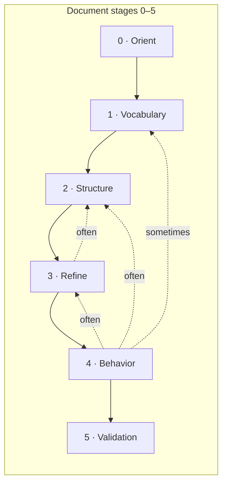

# Process — abd-ooad

**Read first in every phase bundle:** **[Principles](library/required/principles.md)** (then **library** in the bundle, including **[critical quality steps](library/base/critical-quality-steps.md)** when present).

**Pipeline:** **[Principles](library/required/principles.md)** → **Stage 0 — Orient** (**[Workspace and config](phases/workspace-and-config.md)** + **[Domain scan](phases/domain-scan.md)**) → **Stage 1 — Vocabulary** → **Stage 2 — Structure** → **Stage 3 — Refine** → **Stage 4 — Behavior** → **Stage 5 — validation** (**`python scripts/base/build.py`** + **`build.scanners`** when wired). **`refine-names`** (legacy table **#20**) is **out of this map** until refactor — still in **`phase_files`** / **`--phase`**.

**Navigation spine:** **Standards** → **Orient** → **Vocabulary** → **Structure** → **Refine** → **Behavior** → **Validation**

**Structural reference:** **`phase-id`** values (kebab-case) are the normative step names — same strings in **`skill-config.json` → `phase_files`**, **`content/parts/phases/<slug>.md`**, **`generate.py --phase`**, and domain tags **`*[Sn · phase-id]*`**. **`skill-config.json` → `process_stages`** groups **phase-id** lists for **`generate.py --stage`** (keys are defined in config — **not** repeated here as single-letter labels). **Stage 0 (Orient)** merges workspace routing and **domain-scan**. Do **not** use “Phase 1 / Phase 2” as **names** for individual steps. **[Term registry](library/term-registry.md)** · **[Strategy execution](library/strategy-execution-and-checklists.md)** · **[Skill structure and concepts](library/base/skill-structure-and-concepts.md)** (repo layout, seven-column phase tables). **Optional:** **[Model in layers](phases/model-in-layers.md)** — not part of the default Orient → … → Behavior pipeline above (use **`--phase model-in-layers`**).

---

## Outcome of this process

You finish with **object-oriented domain models** and **diagrams** where **instructions match the repo**: **`content/parts/process.md`** and **`phases/*.md`** align with **`skill-config.json` → `phase_files`**; **`terms.md`**, **`term-registry.md`**, and **`strategy.md`** reflect agreed **slices** and **phase-id** execution (see **`abd-ooad/progress/strategy-run-checklist.md`**). **Confirm** direction after **Orient** and at **stage** boundaries before heavy rework; run **Stage 5 (validation)** before you treat the skill run as done.

---

## Capabilities (what this process enables)

| Capability | Problem it addresses |
| --- | --- |
| **Oriented vocabulary** | Jumping to classes before you have stable **nouns, verbs, rules, states**, and **raw candidates** — models that don’t match how the domain speaks. |
| **Explicit OO structure** | Fuzzy entity/value boundaries, operations scattered everywhere, weak relationships and **invariants** — diagrams that don’t explain responsibilities. |
| **Refinement pass** | Bloated classes, hidden roles, inheritance as default, missing composition — a model that’s hard to change safely. |
| **Behavior under scenarios** | Invalid states, ignored tensions, unclear **what changes together** — designs that break when you walk real workflows. |
| **Slices + strategy** | Modeling everything at once; no agreed **coverage** or order — wasted rework and lost traceability to source material. |
| **Term registry + `*[Sn · phase-id]*` tags** | Same concept named five ways; no link between **registry rows** and **model elements** — reviewers can’t see *why* a name or relation exists. |

---

## Rules and automated checks (all skills)

**Default framework:** **[library/base/rules-and-scanners.md](library/base/rules-and-scanners.md)** — bind scanners to **`rules/`**, wire **`rules/scanners.json`**, align **`skill-config.json` → `build.build_pipeline`** and **`build.scanners`** with **`python scripts/base/build.py`**.

---

## Stage 0 — Orient

### Purpose

**Where** the skill runs **and** **what** the material is: nail **`skill_path`**, **`skill_workspace`**, **`skill-config.json`**, **`active_skill_workspace`**, then first **overall** capture — source type, map, **anchors**, tensions, initial sketch — seeds **`term-registry.md`** and orients **`strategy.md`**. Not deep per-slice extraction (that starts in **Vocabulary**). Detail: **[Workspace and config](phases/workspace-and-config.md)** · **[Domain scan](phases/domain-scan.md)**.

### What you produce

**`skill-config.json`** with correct **`active_skill_workspace`**; **`domain-scan-results.md`**, **`domain-scan-model.md`**, diagram as phase describes; seeded registry and global orientation.

### How you know you succeeded

**`python scripts/base/set_workspace.py`** (no args) prints the expected workspace; anchors and tensions are recorded; **`strategy.md`** can list slices and **phase-id** plan for later stages.

### Phase table

| # | Phase | Description | Actor | Input | Output | Scripts |
| --- | --- | --- | --- | --- | --- | --- |
| 0 | [Workspace and config](phases/workspace-and-config.md) | Set **`skill_path`** / **`skill_workspace`**; install **`skill-config.json`**; confirm **`active_skill_workspace`**. | Human / AI | Skill directory; target project tree | **`skill-config.json`** correct | `python` [`scripts/base/set_workspace.py`](../../scripts/base/set_workspace.py) — no args prints current; `<path>` sets **`active_skill_workspace`** · `python scripts/base/generate.py --phase workspace-and-config` |
| 1 | [Domain scan](phases/domain-scan.md) | Scan source, identify anchors, flag tensions, initial sketch. | Human / AI | Workspace configured | Scan artifacts; seeded registry | `python scripts/base/generate.py --phase domain-scan` |

---

## Stage 1 — Vocabulary

### Purpose

First **detailed, module-specific** capture on a **slice** (per **`strategy.md`**): extract nouns, verbs, rules, states; assign each noun a provisional model kind; confirm or demote before structure begins — **domain language** fully settled before you harden structure.

### What you produce

**`domain-noun-verb.md`**, **`terms.md`** (per slice), evolving **`term-registry.md`**; candidate kinds confirmed and model stubs placed.

### How you know you succeeded

All three vocabulary phase-ids exist in **table order** for the active slice; every candidate has a `Classified` note in **`term-registry.md`** with no unresolved `Tension` notes.

### Phase table

| # | Phase | Description | Actor | Input | Output | Scripts |
| --- | --- | --- | --- | --- | --- | --- |
| 2 | [Nouns, verbs, rules, and states](phases/nouns-verbs-rules-and-states.md) | Per-slice extraction; update **`terms.md`**, **`term-registry.md`**. | Human / AI | Slice plan; source | Per-slice terms and registry rows | `python scripts/base/generate.py --phase nouns-verbs-rules-and-states` |
| 3 | [Raw candidates](phases/raw-candidates.md) | Assign each extracted noun a provisional kind (entity, value object, process, policy, role, event); add model stub and `Classified` note in registry. | Human / AI | Extracted noun terms | Provisional targets in model + registry | `python scripts/base/generate.py --phase raw-candidates` |
| 4 | [Thing vs data about a thing](phases/thing-vs-data-about-a-thing.md) | For each candidate, apply identity questions to confirm entity or demote to property / VO / enum. Resolve open tensions. | Human / AI | Candidate stubs | Confirmed candidate kinds; tensions resolved | `python scripts/base/generate.py --phase thing-vs-data-about-a-thing` |

---

## Stage 2 — Structure

### Purpose

Build **core OO structure**: responsibilities and collaborators (CRC pass), properties and operations together, relationships and cardinality, invariants. Candidate kinds are already confirmed by Stage 1.

### What you produce

Updated **domain model** markdown and diagrams; **`*[Sn · phase-id]*`** tags on structural elements per **`library/term-registry.md`**.

### How you know you succeeded

Each **Structure** phase-id has been applied for the scope you chose; obvious gaps are logged or deferred with traceability.

### Phase table

| # | Phase | Description | Actor | Input | Output | Scripts |
| --- | --- | --- | --- | --- | --- | --- |
| 5 | [Responsibilities and collaborators](phases/responsibilities-and-collaborators.md) | CRC pass: one responsibility per class, name collaborators. Forces higher-order thinking before any methods are named. | Human / AI | Confirmed candidates | Responsibility + collaborator map | `python scripts/base/generate.py --phase responsibilities-and-collaborators` |
| 6 | [Properties and operations](phases/properties-and-operations.md) | Convert responsibility statements into typed properties then typed operations. Challenge any verb that belongs in an application service. | Human / AI | Responsibility map | Typed properties + method signatures | `python scripts/base/generate.py --phase properties-and-operations` |
| 7 | [Relationships and cardinality](phases/relationships-and-cardinality.md) | Associations, composition, multiplicity. | Human / AI | Classes | Relationship model | `python scripts/base/generate.py --phase relationships-and-cardinality` |
| 8 | [Invariants in the model](phases/invariants-in-the-model.md) | Encode domain rules into class behavior. | Human / AI | Model draft | Invariants stated | `python scripts/base/generate.py --phase invariants-in-the-model` |

---

## Stage 3 — Refine

### Purpose

Refine structure: split bloated classes, resolve smashed abstractions, inheritance only when justified, abstract types vs interfaces, **prefer composition**.

### What you produce

Cleaner **class graph**; documented trade-offs where composition replaces inheritance.

### How you know you succeeded

**Refine** phase-ids are reflected in the model; known smells from the phase titles are addressed or explicitly deferred.

### Phase table

| # | Phase | Description | Actor | Input | Output | Scripts |
| --- | --- | --- | --- | --- | --- | --- |
| 10 | [Watch for bloated classes](phases/watch-for-bloated-classes.md) | Split overly complex classes. | Human / AI | Class model | Smaller units | `python scripts/base/generate.py --phase watch-for-bloated-classes` |
| 11 | [Smashed abstractions](phases/smashed-abstractions-and-hidden-roles.md) | Separate overloaded nouns into roles. | Human / AI | Ambiguous names | Role split | `python scripts/base/generate.py --phase smashed-abstractions-and-hidden-roles` |
| 12 | [Inheritance when behavior generalizes](phases/inheritance-when-behavior-generalizes.md) | Inheritance only for real generalization. | Human / AI | Class tree | Justified inheritance | `python scripts/base/generate.py --phase inheritance-when-behavior-generalizes` |
| 13 | [Abstract classes and interfaces](phases/abstract-classes-and-interfaces.md) | Shared contract vs shared state. | Human / AI | Types | Contracts clear | `python scripts/base/generate.py --phase abstract-classes-and-interfaces` |
| 14 | [Prefer composition](phases/prefer-composition.md) | Composition for variability. | Human / AI | Variability needs | Composed structure | `python scripts/base/generate.py --phase prefer-composition` |

---

## Stage 4 — Behavior

### Purpose

Exercise the model: state transitions, iterative refinement, tension as signal, **what changes together** (cohesion / bounded contexts), **validate with scenarios**.

### What you produce

Scenario walkthrough notes; adjustments to boundaries and naming debt; evidence that invalid states are rejected where required.

### How you know you succeeded

At least one realistic **workflow** has been walked; contradictions are resolved or recorded.

### Phase table

| # | Phase | Description | Actor | Input | Output | Scripts |
| --- | --- | --- | --- | --- | --- | --- |
| 15 | [Model state transitions](phases/model-state-transitions.md) | Invalid states unrepresentable or rejected. | Human / AI | Model | State rules | `python scripts/base/generate.py --phase model-state-transitions` |
| 16 | [Iterative refinement](phases/iterative-refinement.md) | Second pass; resolve contradictions. | Human / AI | Prior passes | Resolved model | `python scripts/base/generate.py --phase iterative-refinement` |
| 17 | [Tension as a signal](phases/tension-as-a-signal.md) | Use friction to adjust boundaries or record debt. | Human / AI | Friction points | Adjustments / debt | `python scripts/base/generate.py --phase tension-as-a-signal` |
| 18 | [What changes together](phases/what-changes-together.md) | Cohesion clusters; bounded contexts. | Human / AI | Model | Context map | `python scripts/base/generate.py --phase what-changes-together` |
| 19 | [Validate with scenarios](phases/validate-with-scenarios.md) | Walk realistic workflows against the model. | Human / AI | Scenarios | Validation notes | `python scripts/base/generate.py --phase validate-with-scenarios` |

---

## Deferred — `refine-names` (table **#20**)

**Not** part of the **Orient → Vocabulary → Structure → Refine → Behavior → Validation** map above; **refactor later** (naming pass / ubiquitous language). The **phase-id** remains in **`phase_files`**; run with **`python scripts/base/generate.py --phase refine-names`** or the **`process_stages`** entry for **`refine-names`** when you wire it back in. See **[Refine names](phases/refine-names.md)**.

---

## Stage 5 — Structural validation

### Purpose

Prove **Python** compiles (when **`build.compileall_paths`** is set), **merge** succeeds, **scanners** pass. Exit **0** on the full chain.

### What you produce

Clean **validation** run; **`AGENTS.md`** / **`content/built/`** consistent with **`content/parts/`** when using static delivery.

### How you know you succeeded

**CI or local:** **`compileall`** on configured paths → **`python scripts/base/build.py`** → **`build.scanners`**. Fix **sources**, not **AGENTS.md**.

### Phase table

| # | Phase | Description | Actor | Input | Output | Scripts |
| --- | --- | --- | --- | --- | --- | --- |
| 21 | *(validation)* | **Structural gate:** compile (if configured) → **`build.py`** (merge + **`build.build_pipeline`**) → **`build.scanners`**. | Code | Skill root; **`skill-config.json`** | Exit **0**; built artifacts match **parts** | `python scripts/base/build.py` *(and scanners in **`skill-config.json`**)* |

---

## Stage map and `generate.py --stage`

**`generate.py --stage <key>`** runs every **`phase-id`** in that stage group **in chronicle order** (keys and lists live in **`skill-config.json` → `process_stages`** — this doc uses **numbered stages and names**, not single-letter labels). **Document stages** below are the **named** path (Orient → … → Behavior); the **`refine-names`** group is **deferred** in this map (see **Deferred — `refine-names`**).

| # | Document stage | Name | Phase IDs (order) |
|---|----------------|------|-------------------|
| 0 | **Stage 0** | Orient | `workspace-and-config`, `domain-scan` |
| 1 | **Stage 1** | Vocabulary | `nouns-verbs-rules-and-states`, `raw-candidates` |
| 2 | **Stage 2** | Structure | `thing-vs-data-about-a-thing` … `invariants-in-the-model` |
| 3 | **Stage 3** | Refine | `watch-for-bloated-classes` … `prefer-composition` |
| 4 | **Stage 4** | Behavior | `model-state-transitions` … `validate-with-scenarios` |
| *(deferred)* | — | *(naming pass)* | `refine-names` — **not** in numbered stages above |

**Validation** is **Stage 5** (structural gate); not a **`--stage`** group in the table above.

Single-step: **`generate.py --phase <phase-id>`**. **List:** `python scripts/base/generate.py --list-stages` / `--list-phases`.

**Open decision:** One **`iterative-refinement`** pass vs splitting into two **phase-ids** — team choice; chronicle stays source of truth.

---

## Appendix: Phase chronicle (all rows)

Execution order for **`phase-id`** (optional **`model-in-layers`** at end — appendix phase, not in the default stage table above).

| Phase ID | Link | Purpose | Stage |
|----------|------|---------|-------|
| `workspace-and-config` | [Workspace and config](phases/workspace-and-config.md) | Set workspace; configure project root | 0 · Orient |
| `domain-scan` | [Domain scan](phases/domain-scan.md) | Scan source, anchors, tensions, sketch | 0 · Orient |
| `nouns-verbs-rules-and-states` | [Nouns, verbs, rules, and states](phases/nouns-verbs-rules-and-states.md) | Per-slice extraction | 1 · Vocabulary |
| `raw-candidates` | [Raw candidate list](phases/raw-candidates.md) | Sort into candidate buckets | 1 · Vocabulary |
| `thing-vs-data-about-a-thing` | [Thing vs data about a thing](phases/thing-vs-data-about-a-thing.md) | Entity vs value | 2 · Structure |
| `responsibilities-before-operations` | [Responsibilities before operations](phases/responsibilities-before-operations.md) | Responsibilities before methods | 2 · Structure |
| `add-properties-semantically-tight` | [Add properties semantically tight](phases/add-properties-semantically-tight.md) | Tight properties | 2 · Structure |
| `turn-verbs-into-operations` | [Turn verbs into operations](phases/turn-verbs-into-operations.md) | Verbs to operations | 2 · Structure |
| `relationships-and-cardinality` | [Relationships and cardinality](phases/relationships-and-cardinality.md) | Associations, multiplicity | 2 · Structure |
| `invariants-in-the-model` | [Invariants in the model](phases/invariants-in-the-model.md) | Domain rules in behavior | 2 · Structure |
| `watch-for-bloated-classes` | [Watch for bloated classes](phases/watch-for-bloated-classes.md) | Split complexity | 3 · Refine |
| `smashed-abstractions-and-hidden-roles` | [Smashed abstractions](phases/smashed-abstractions-and-hidden-roles.md) | Roles vs overloaded nouns | 3 · Refine |
| `inheritance-when-behavior-generalizes` | [Inheritance when behavior generalizes](phases/inheritance-when-behavior-generalizes.md) | Justified inheritance | 3 · Refine |
| `abstract-classes-and-interfaces` | [Abstract classes and interfaces](phases/abstract-classes-and-interfaces.md) | Contract vs state | 3 · Refine |
| `prefer-composition` | [Prefer composition](phases/prefer-composition.md) | Composition over inheritance | 3 · Refine |
| `model-state-transitions` | [Model state transitions](phases/model-state-transitions.md) | State machine rules | 4 · Behavior |
| `iterative-refinement` | [Iterative refinement](phases/iterative-refinement.md) | Second pass | 4 · Behavior |
| `tension-as-a-signal` | [Tension as a signal](phases/tension-as-a-signal.md) | Friction → change | 4 · Behavior |
| `what-changes-together` | [What changes together](phases/what-changes-together.md) | Cohesion / contexts | 4 · Behavior |
| `validate-with-scenarios` | [Validate with scenarios](phases/validate-with-scenarios.md) | Scenario walkthrough | 4 · Behavior |
| `refine-names` | [Refine names](phases/refine-names.md) | Ubiquitous language (**deferred** in process map — **#20**) | *(deferred)* |

---

## Appendix: Capture ladder (what each phase-id captures)

- **Orient:** **`workspace-and-config`** — paths and config; **`domain-scan`** — first **overall** capture (anchors, tensions, sketch); not deep per-slice extraction.
- **Vocabulary:** **`nouns-verbs-rules-and-states`** and **`raw-candidates`** (in order) — first **detailed** capture per **slice** — **`domain-noun-verb.md`**, **`terms.md`**, **`term-registry.md`**.
- **Structure** · **Refine** · **Behavior:** Per phase doc; coarse evidence in **`terms.md`**; registry and model structural with **`*[Sn · phase-id]*`** tags.
- **`refine-names`:** Deferred in the **process map** above; phase file still valid for **`--phase refine-names`**.

For a slice, **`domain-scan`** seeds global orientation; **`nouns-verbs-rules-and-states`** onward deepens per slice.

---

## Appendix: Standards and tools

- **Diagrams:** **`using-diagram-cli`** library shard — `scripts/drawio_cli.py`, `templates/`, layout rules.
- **Workspace routing:** [`library/base/workspace-and-config.md`](library/base/workspace-and-config.md) for `skill_path`, `skill_workspace`, portable paths.

---

## Appendix: Build, generate, delivery

- **Build:** `python scripts/base/build.py`
- **One phase:** `python scripts/base/generate.py --phase <phase-id>`
- **One stage group:** `python scripts/base/generate.py --stage <key>` (keys in **`skill-config.json` → `process_stages`**; use **`--list-stages`** to see them)
- **Sources:** **`skill-config.json` → `phase_files`**; **stages:** **`process_stages`**
- **Dynamic (default):** `generate.py` assembles each call.
- **Static:** `build.py` pre-assembles to `content/built/phases/`; `generate.py --mode static` reads cache when present.

---

## Appendix: Model in layers

Not part of the default Orient → … → Behavior pipeline. Run explicitly: **`python scripts/base/generate.py --phase model-in-layers`**.

| Phase ID | Link | Purpose |
|----------|------|---------|
| `model-in-layers` | [Model in layers](phases/model-in-layers.md) | Layered view: domain / application / infrastructure |

---

## Appendix: Implementation notes

**Strategy before deep runs:** After **`domain-scan`**, fill **`strategy.md`** from **`templates/strategy.md`**: slices, coverage, execution plan using **phase-id** strings, and align **`abd-ooad/progress/strategy-run-checklist.md`**. See **`library/strategy-led-generation.md`** and **`library/strategy-execution-and-checklists.md`**.

**Stage end / disruption:** After completing a **`--stage`** group, refresh strategy as needed. **Revisits** are **new rows** on the **same** **`strategy-run-checklist.md`** (e.g. “Revisit Vocabulary — &lt;reason&gt;”) — not a separate rerun document.

**Artifact hygiene:** Analysis in **`domain*.md`** / integrated model; long verbatim evidence in **`terms.md`** per module; **`term-registry.md`** = Term + **Targets** + **Notes**. After markdown stabilizes, render or sync **`*.drawio`**.

**AI-driven vs code-driven:** **`workspace-and-config`** is CLI-driven first; other **phase-ids** are AI-driven modeling by default unless a phase doc specifies scripts.

---

## Appendix: Stage flow (optional)

