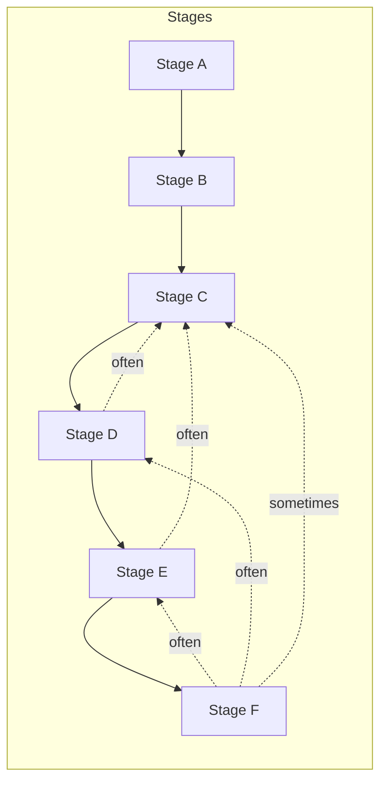

# OOAD Process — Phase-Based Walkthrough

**Pipeline:** Workspace → Domain scan & initial sketch → Extraction → Structure → Refinement → Dynamics & validation → Naming

**Normative step names** are **`phase-id`** values (kebab-case slugs) — the same strings in this file, **`skill-config.json` → `phase_files`**, phase markdown **filenames**, **`generate.py --phase`**, cross-references, and domain model tags **`*[Sn · phase-id]*`**. Do **not** use “Phase 1 / Phase 2” as **names** for steps; that duplicates the chronicle and drifts.

---

## Phase chronicle (execution order)

Top row runs first. **Link** = phase document under `content/parts/phases/`. **Stage** = grouping **A–F** for strategy and tooling (`generate.py --stage`); see **Stage map** below.

| Phase ID | Link | Purpose | Stage |
|----------|------|---------|-------|
| `workspace-and-config` | [Workspace and config](phases/workspace-and-config.md) | Set active skill workspace; configure project root | A |
| `domain-scan` | [Domain scan](phases/domain-scan.md) | Scan source, identify anchors, flag tensions, initial sketch | A |
| `nouns-verbs-rules-and-states` | [Nouns, verbs, rules, and states](phases/nouns-verbs-rules-and-states.md) | Per-slice extraction: nouns, verbs, rules, states; update **`terms.md`**, **`term-registry.md`** | B |
| `raw-candidate-list` | [Raw candidate list](phases/raw-candidate-list.md) | Sort findings into entities, values, processes, policies, roles, events | B |
| `thing-vs-data-about-a-thing` | [Thing vs data about a thing](phases/thing-vs-data-about-a-thing.md) | Separate entities from value objects, enums, properties | C |
| `responsibilities-before-operations` | [Responsibilities before operations](phases/responsibilities-before-operations.md) | Define what each class is responsible for (before methods) | C |
| `add-properties-semantically-tight` | [Add properties semantically tight](phases/add-properties-semantically-tight.md) | Give each class only the properties it needs | C |
| `turn-verbs-into-operations` | [Turn verbs into operations](phases/turn-verbs-into-operations.md) | Distribute verbs to owning classes | C |
| `relationships-and-cardinality` | [Relationships and cardinality](phases/relationships-and-cardinality.md) | Associations, composition, multiplicity | C |
| `invariants-in-the-model` | [Invariants in the model](phases/invariants-in-the-model.md) | Encode domain rules into class behavior | C |
| `watch-for-bloated-classes` | [Watch for bloated classes](phases/watch-for-bloated-classes.md) | Split overly complex classes | D |
| `smashed-abstractions-and-hidden-roles` | [Smashed abstractions](phases/smashed-abstractions-and-hidden-roles.md) | Separate overloaded nouns into roles | D |
| `inheritance-when-behavior-generalizes` | [Inheritance when behavior generalizes](phases/inheritance-when-behavior-generalizes.md) | Inheritance only for real generalization | D |
| `abstract-classes-and-interfaces` | [Abstract classes and interfaces](phases/abstract-classes-and-interfaces.md) | Shared contract vs shared state | D |
| `prefer-composition` | [Prefer composition](phases/prefer-composition.md) | Composition for variability (with stage D structure) | D |
| `model-state-transitions` | [Model state transitions](phases/model-state-transitions.md) | Invalid states unrepresentable or rejected | E |
| `iterative-refinement` | [Iterative refinement](phases/iterative-refinement.md) | Second pass; resolve contradictions | E |
| `tension-as-a-signal` | [Tension as a signal](phases/tension-as-a-signal.md) | Use friction to adjust boundaries or record debt | E |
| `what-changes-together` | [What changes together](phases/what-changes-together.md) | Cohesion clusters; bounded contexts | E |
| `validate-with-scenarios` | [Validate with scenarios](phases/validate-with-scenarios.md) | Walk realistic workflows against the model | E |
| `refine-names` | [Refine names](phases/refine-names.md) | Align naming with domain language | F |

**Optional (appendix, not part of default stages A–F):** **`model-in-layers`** — [Model in layers](phases/model-in-layers.md) — organize artifacts across domain / application / infrastructure views. Run explicitly with **`python scripts/base/generate.py --phase model-in-layers`** when needed.

### Stage flow (optional)

---

## Stage map (A–F)

**Default:** “Run **stage**” = run every **phase-id** in that stage **in chronicle order** (same order as the table above). **`generate.py --stage <A|B|…|F>`** expands to that list — see **`skill-config.json` → `process_stages`**.

| Stage | Phase IDs (in order) |
|-------|----------------------|
| **A** | `workspace-and-config`, `domain-scan` |
| **B** | `nouns-verbs-rules-and-states`, `raw-candidate-list` |
| **C** | `thing-vs-data-about-a-thing`, `responsibilities-before-operations`, `add-properties-semantically-tight`, `turn-verbs-into-operations`, `relationships-and-cardinality`, `invariants-in-the-model` |
| **D** | `watch-for-bloated-classes`, `smashed-abstractions-and-hidden-roles`, `inheritance-when-behavior-generalizes`, `abstract-classes-and-interfaces`, `prefer-composition` |
| **E** | `model-state-transitions`, `iterative-refinement`, `tension-as-a-signal`, `what-changes-together`, `validate-with-scenarios` |
| **F** | `refine-names` |

Single-step escape hatches: **`generate.py --phase <phase-id>`**; test/single-phase modes as your team configures.

**Open decision:** One **`iterative-refinement`** step with “repeat as needed” in strategy vs splitting into two explicit phase-ids — team choice; chronicle stays the source of truth.

---

## Capture ladder (what each phase-id captures)

Name phases **only** by **phase-id**. Never “Phase 1 vs Phase 2” as step names.

- **`workspace-and-config`** (when present): workspace layout, config, paths — enables later runs.
- **`domain-scan`**: First **overall** workspace capture: source type, map, **anchors**, tensions, initial sketch (`domain-scan-results.md`, `domain-scan-model.md`, diagram, seeded **`term-registry.md`**). Not the deep per-module extraction against a full slice — that belongs under later IDs.
- **`nouns-verbs-rules-and-states`** and **`raw-candidate-list`** (in **table order**): First **detailed, module-specific** capture on a **section of source** (per **slice** in `strategy.md`): **`domain-noun-verb.md`**, **`## [Anchor module]`**, candidates — aligned to locators. **`terms.md`** (per slice) and **`term-registry.md`** evolve from here onward for that slice.
- **Stages C–F**: Structural and behavioral modeling per phase doc; keep coarse verbatim evidence in **`terms.md`**; keep **registry** and **domain model** structural with **`*[Sn · phase-id]*`** tags — see **`library/term-registry.md`**.

For a slice, **`domain-scan`** seeds **global** orientation and anchor set; per-slice registry and **`terms.md`** deepen from **`nouns-verbs-rules-and-states`** onward.

---

## Standards and tools

- **Diagrams:** See `using-diagram-cli` library shard — `scripts/drawio_cli.py` workflow, `templates/` directory, and layout rules.
- **Workspace routing:** See [`../library/workspace-and-config.md`](library/workspace-and-config.md) for `skill_path`, `skill_workspace`, and portable path resolution.

---

## Build and generate

- **Build all phases into AGENTS.md:** `python scripts/base/build.py`
- **Generate one phase:** `python scripts/base/generate.py --phase <phase-id>`
- **Generate a stage (all phase-ids in that stage, in order):** `python scripts/base/generate.py --stage <A|B|C|D|E|F>`
- **List stages / phases:** `python scripts/base/generate.py --list-stages` / `--list-phases`
- **Phase list source:** **`skill-config.json` → `phase_files`**; **stage map:** **`process_stages`**

---

## Implementation notes

**Strategy before deep runs:** After **`domain-scan`**, fill **`strategy.md`** from **`templates/strategy.md`**: slices, coverage, execution plan using **phase-id** strings, and align **`abd-ooad/progress/strategy-run-checklist.md`**. See **`library/strategy-led-generation`** and **`library/strategy-execution-and-checklists`**.

**Stage end / disruption:** After completing a stage, refresh strategy as needed. **Revisits** are **new rows** on the **same** **`strategy-run-checklist.md`** (e.g. “Revisit stage B — &lt;reason&gt;”) — not a separate rerun document. See **`library/strategy-execution-and-checklists.md`**.

**Artifact hygiene:** Analysis in **`domain*.md`** / integrated model; long verbatim evidence in **`terms.md`** per module; **`term-registry.md`** = Term + **Targets** + **Notes**. After markdown stabilizes, render or sync **`*.drawio`**.

**AI-driven phases:** Each phase can be executed by an agent following assembled instructions from **`generate.py`** or **`AGENTS.md`**.

**Code-driven phases:** Workspace config (`workspace-and-config`) is CLI-driven; other phase-ids are AI-driven narrative/modeling by default.

**Static vs dynamic delivery:**

- **Dynamic (default):** `generate.py` assembles the phase on each call.
- **Static:** `build.py` pre-assembles to `content/built/phases/`; `generate.py --mode static` reads cached version when present.

---

## Appendix: model in layers

Use when you need a **layered** view of the same model. Not part of default stages **A–F**.

| Phase ID | Link | Purpose |
|----------|------|---------|
| `model-in-layers` | [Model in layers](phases/model-in-layers.md) | Organize final artifacts across domain, application, infrastructure layers |

`python scripts/base/generate.py --phase model-in-layers`
